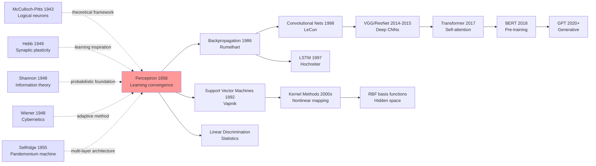

# Perceptron — How the First Hardware Neuron That Learns from Data Sparked AI as a Discipline

> **1958. Frank Rosenblatt at Cornell Aeronautical Laboratory publishes a 23-page paper [The Perceptron: A Probabilistic Model for Information Storage and Organization in the Brain](https://psycnet.apa.org/doi/10.1037/h0042519) in *Psychological Review* 65(6).**
> The first paper that turned "a machine that learns" from Hebb's poetic conjecture into a **mathematically provable + hardware-realized** engineering artifact. The companion Mark I Perceptron (400 photocells × 512 association units) made the *New York Times* front page, predicted to soon "walk, talk, and become self-aware."
> Eleven years later Minsky/Papert's *Perceptrons* (1969) one-shotted it with a single XOR sentence, triggering the **first AI winter**; vindication arrived only 17 years later with [Backprop (1986)](1986_backprop.md).
> Today every PyTorch `nn.Linear` followed by a threshold activation is its purest descendant — the Perceptron is the grandfather of every neural network school.

## TL;DR

Rosenblatt's 23-page 1958 *Psychological Review* paper was **the first work to turn "a machine that learns" from Hebb's poetic conjecture into a provable + hardware-realizable engineering product**. The core is a misclassification-driven update rule $w \leftarrow w + \eta(y - \hat{y})x$ plus the **Perceptron Convergence Theorem**: as long as the data is linearly separable, the algorithm halts in $O(R^2/\gamma^2)$ steps. The accompanying **Mark I Perceptron** hardware (400 photocells × 512 association units) hit 97% accuracy on simple geometric shapes, rescuing the connectionist line that Hebb's "forever oscillating" rule had stalled. But the paper also planted a fatal flaw: a single-layer architecture cannot represent XOR — a hole that Minsky and Papert blew open 11 years later in *Perceptrons* (1969), igniting the **first AI winter**, which lasted 17 years until [Backprop (1986)](1986_backprop.md) finally unlocked multi-layer training. Perceptron is therefore the grandfather of every neural-network school; PyTorch's `nn.Linear` plus a threshold activation is its most literal reincarnation.

---

## Historical Context

### What was the neuroscience and pattern recognition community stuck on in 1958?

In the mid-1950s, computer scientists and neuroscientists faced a fundamental dilemma: **How could machines learn the way brains do?**

The academic world was torn between two competing forces. On one side were neuroscientists relying on **biological observation**: the brain clearly adapted itself through repeated experience. McCulloch-Pitts (1943) had elegantly proven that any logical function could be computed by such atomic units, yet their model was **entirely static** — the connection weights between neurons had to be pre-specified and couldn't adjust automatically from data. In 1949, Donald Hebb proposed a radical idea: **"Neurons that fire together wire together"** (his famous postulate). It was poetic, but it lacked teeth — no one could prove that networks built on Hebbian principles would actually converge to stable solutions.

On the other side were engineers facing **practical constraints**. Pattern recognition in the 1950s was entirely handcrafted feature engineering. Recognizing handwritten digits, language phonemes, objects in images — each task demanded months of expert labor designing features (edge detectors, frequency filters, etc.). By the late 1950s, researchers began asking a deceptively simple question: **Could a single, unified, automatically-learning system solve all these problems?** The answer seemed to lie in the brain itself.

The available computational resources were extraordinarily scarce. The UNIVAC I (introduced 1951) performed ~1,000 floating-point operations per second, occupied an entire room, and cost $1.5 million ($16 million in 2024 dollars). Even large research institutions with computers possessed only one or two machines. This meant **any neural network algorithm had to be radically efficient** — it couldn't be merely "beautiful theory."

The most fundamental bottleneck was **the absence of convergence guarantees**. Hebb's learning rule provided no assurance it would ever stop. A network could oscillate forever, endlessly reshuffling weights, never finding stable solutions. In the 1950s, if you proposed a learning algorithm without mathematical convergence proof, the academic community dismissed you outright — it smelled too much like alchemy.

By early summer 1958, the field still wondered if the problem was perhaps **fundamentally unsolvable**. Maybe the brain's learning was far more intricate than any simple rule we could imagine. Maybe automatic learning was mere fantasy.

### Five preceding works that forced Perceptron into existence

1. **McCulloch & Pitts (1943): A logical calculus of ideas immanent in nervous activity**
   - Contribution: Proved that binary neurons (threshold units) could compute arbitrary logical functions
   - How it forced this paper: The framework was perfect, but the fatal flaw was "connection weights must be pre-set." This birthed Rosenblatt's core question — can these weights be learned automatically from data?

2. **Hebb (1949): The Organization of Behavior**
   - Contribution: Proposed the biological mechanism for synaptic plasticity (neurons firing together strengthen their connections)
   - How it forced this paper: Provided Rosenblatt with the "learning rule" concept, yet Hebb himself never proved this rule would converge. Rosenblatt saw the gap to fill.

3. **Shannon (1948): A Mathematical Theory of Communication**
   - Contribution: Established rigorous mathematics for information, entropy, and channel capacity
   - How it forced this paper: Rosenblatt's probabilistic model needed theoretical grounding. The Perceptron paper's subtitle — "A Probabilistic Model" — directly inherited Shannon's information-theoretic framework.

4. **Wiener (1948): Cybernetics**
   - Contribution: Formalized feedback systems, stability, and self-regulation mathematically
   - How it forced this paper: Gave Rosenblatt systematic thinking about "adaptive machines." The Perceptron's weight-update rule is essentially a feedback control system adjusting its own parameters.

5. **Selfridge (1955): Pandemonium: A Parallel Learning System**
   - Contribution: Demonstrated the feasibility of multi-stage parallel learning architectures
   - How it forced this paper: Proved that hierarchical feature-learning structures were possible, encouraging Rosenblatt to consider layered perceptron designs.

These five papers were not "Perceptron's direct ancestors" but the **bricks that forced Perceptron into being**: McCulloch-Pitts supplied the logical framework, Hebb supplied learning inspiration, Shannon supplied probability theory, Wiener supplied adaptive mathematics, Selfridge supplied architectural confidence. Rosenblatt's genius lay in **synthesizing all these threads and binding them with a provably convergent learning algorithm**.

### What was Rosenblatt's team doing in the mid-1950s?

Frank Rosenblatt (1928-1971) was neither a pure mathematician nor a pure neuroscientist — he was an **applied engineer** working at the frontier of military-sponsored research.

In 1956, Rosenblatt joined the Cornell Aeronautical Laboratory, an Air Force-funded institution. His mandate was clear: **Could electronic systems that mimicked the brain solve real-world pattern recognition problems?** The Air Force faced a concrete predicament: How could automatic systems recognize terrain, targets, threats? Hand-engineered features required redesign for each new task — untenable in the Cold War's relentless pace.

Between 1956 and 1958, Rosenblatt and his team (including engineer Charles Wightman) conducted extensive simulations and hardware experiments. They weren't deriving equations on blackboards — they were **hand-soldering circuits, adjusting parameters**. In the process, they discovered something crucial: **simple learning rules actually converge**. This wasn't theoretical deduction; it was experimental observation.

By spring 1958, Rosenblatt decided to formalize this work into an official technical report. He didn't just submit a paper — he packaged it with the **Mark I Perceptron hardware**. This wasn't a simulation; it was real electronics:
- **400 photodiode elements** arranged in a 20×20 grid, serving as input neurons (receptors)
- **512 "association elements"** — hardware-implemented adjustable weights, each a resistor network
- **8 "response elements"** — output neurons
- **Synaptic weights driven by electric motors**, auto-adjusted per the learning rule

The machine's physical footprint rivaled 1950s computers — it occupied a room's corner, weighed hundreds of pounds, consumed kilowatts of power. But its mere existence answered skeptics: **"Look, automatic learning actually works!"** In July 1958, the U.S. Department of Defense held a press conference in New York where reporters watched Perceptron learn pattern recognition tasks in real time. The event received widespread media coverage.

### The academic and industrial atmosphere of 1958

1958 was the peak year of Cold War technological competition. One year earlier (1957), the Soviet Union launched Sputnik, triggering profound technological panic in America. The Department of Defense decided to invest **unprecedented sums** into advanced technology research, particularly in **adaptive systems** and **automatic recognition**. The Office of Naval Research (ONR) and the newly-forming Advanced Research Projects Agency (ARPA, soon to be DARPA) became fountains of funding.

Against this backdrop, Rosenblatt's Perceptron received **massive military support**. The DoD brimmed with anticipation — if this "learning machine" truly worked, it could enable missile guidance, aircraft recognition, cryptanalysis, and more.

Concurrently (1956), young researchers at MIT, CMU, Stanford, and Dartmouth organized the **Dartmouth Summer Research Project on Artificial Intelligence**. This conference formally coined the term "Artificial Intelligence." Attendees included McCarthy, Minsky, Newell, Shaw, and others. The conference's optimistic spirit permeated academia — **in the near future, machines might possess human-like intelligence**.

Media reactions were even more hyperbolic. The New York Times reported in 1958 that Perceptron was "**the first machine that can truly think**." Magazines invited Perceptron to demonstrate its learning abilities, orchestrating scenes reminiscent of magic performances. These extravagant predictions would later seed the "AI Winter" — when Perceptron failed to solve all problems, disappointment would be equally immense.

But in 1958 itself, this was an era of **unbounded enthusiasm**. The academic world and military establishment both believed the neural network age had arrived. Computer speed was growing exponentially (early Moore's Law), and memory was becoming cheaper. It felt that within years, a sufficiently powerful Perceptron could solve any pattern recognition problem.

This optimism was the precise emotional tenor when Rosenblatt's Perceptron paper appeared in 1958.

---

---

## Method Deep Dive

### Overall Architecture: Three-Layer Perceptron

The Perceptron comprises three layers:

```
Input Layer (Sensory)     Association Layer (Learning)     Output Layer (Response)
    
S points (photodiodes)        A elements (weights)              R elements (outputs)
20×20 = 400 binary ─────────→ 512 adjustable ────────────→ 8 (discrimination classes)
  inputs (0/1)            resistances w              binary outputs (0/1)
```

In modern terminology: input layer → hidden layer → output layer. Yet the Perceptron has only three layers — no multiple hidden layers, no non-linear activations (except output thresholding). Each output neuron connects fully to all association elements.

The key design of the association layer is **adjustable weights**. In hardware, each weight is a variable resistor driven by an electric motor. In software, it's standard matrix multiplication.

| Configuration | Input Neurons | Association Units | Output Neurons | Purpose |
|---|---|---|---|---|
| Mark I Hardware | 400 (20×20 photodiodes) | 512 | 8 | Pattern classification (images / speech) |
| Simplified Theory | d-dimensional | m | 1 | Binary linear classification |
| Multi-output | d-dimensional | m | c | c-way classification |

The overall pipeline:
1. **Forward propagation**: $\mathbf{a} = \mathbf{w}^T \mathbf{s}$ (input $\mathbf{s}$ times weights $\mathbf{w}$)
2. **Decision**: $y = \text{sign}(a - \theta)$ (if activation $a$ exceeds threshold $\theta$, output 1; else 0)
3. **If wrong**: adjust $\mathbf{w}$ and $\theta$

**Counter-intuitive point**: Perceptron has **no hidden-layer nonlinearity**. All "learning power" comes from weight adjustment, not network depth. Fundamentally, Perceptron is a **linear classifier** — a linear model that learns its decision boundary automatically.

### Key Design 1: Linear Decision Boundary and Weight Vector

**Function**: The Perceptron's output is a line (or hyperplane in higher dimensions) separating the input space. The collection of all weights $\mathbf{w}$ defines this boundary.

**Core Mathematics**:

For input $\mathbf{s} = (s_1, s_2, \ldots, s_d)$ and weights $\mathbf{w} = (w_1, w_2, \ldots, w_d)$, the activation is:

$$a = \sum_{i=1}^{d} w_i \cdot s_i + b$$

where $b$ is the bias (sometimes expressed as threshold $\theta$, with $b = -\theta$).

Decision rule:

$$y = \begin{cases} 1 & \text{if } a > 0 \\ 0 & \text{if } a \leq 0 \end{cases}$$

or using $\text{sign}$: $y = \text{sign}(a)$

The decision boundary is a hyperplane: $\mathbf{w}^T \mathbf{s} + b = 0$

**Code snippet** (PyTorch style):

```python
class Perceptron:
    def __init__(self, input_dim):
        self.w = np.random.randn(input_dim) * 0.01  # Weight initialization
        self.b = 0.0                                 # Bias
        self.learning_rate = 0.1
    
    def forward(self, x):
        """Forward pass: compute x @ w + b"""
        logits = np.dot(x, self.w) + self.b  # Linear combination
        predictions = (logits > 0).astype(int)  # Hard threshold: 0 or 1
        return predictions, logits
    
    def update_weights(self, x, y, y_pred):
        """Weight update for a single sample"""
        if y != y_pred:  # Update only on misclassification
            error = y - y_pred  # ±1
            self.w += self.learning_rate * error * x
            self.b += self.learning_rate * error
```

**Comparison table**: Perceptron vs Modern Linear Classifiers

| Feature | Perceptron | Logistic Regression | SVM |
|---|---|---|---|
| Decision boundary | Linear hyperplane | Linear hyperplane | Linear (or nonlinear + kernel) |
| Learning method | Misclassification update | Maximum likelihood | Maximum margin |
| Loss function | Misclassification count | Cross-entropy | Hinge loss |
| Convergence guarantee | Yes (if linearly separable) | No | Yes (convex optimization) |
| Probabilistic output | No (hard 0/1) | Yes | No (hard 0/1) |
| Computational complexity | Minimal (one-liner) | Moderate | High (QP solving) |

**Design motivation**: Why choose simple linear boundaries?
- **Provably convergent**: If data is linearly separable, the Perceptron Convergence Theorem guarantees termination in finite updates
- **Computationally efficient**: Just matrix multiplication, blazingly fast even on 1958 hardware
- **Biologically inspired**: Early brain visual processing can approximate linear feature detection + hard thresholding
- **Aesthetic minimalism**: No "excess" design — if the pattern is linearly separable, it works

### Key Design 2: Misclassification-Driven Weight Update (Perceptron Learning Rule)

**Function**: Defines how to adjust weights after observing a misclassified sample. This is the key enabling Perceptron to "learn."

**Core insight**: Update weights **only** when prediction is wrong. This differs from the Hebb rule — Hebb says "fire together, wire together," while Perceptron says "**correct when wrong**."

**Mathematical formulation**:

For sample $(\mathbf{s}, y)$ where $y \in \{0, 1\}$, first compute prediction $\hat{y} = \text{sign}(\mathbf{w}^T \mathbf{s} + b)$.

If $\hat{y} \neq y$ (error), then:

$$\mathbf{w} \leftarrow \mathbf{w} + \eta (y - \hat{y}) \mathbf{s}$$

$$b \leftarrow b + \eta (y - \hat{y})$$

where $\eta$ is the learning rate (typically set to 1).

**Geometric intuition**:
- If sample is labeled 1 but Perceptron predicts 0, then $y - \hat{y} = 1$, weights move in direction of $\mathbf{s}$, making this sample more likely to be classified as 1 next time
- If sample is labeled 0 but predicted 1, then $y - \hat{y} = -1$, weights move in direction of $-\mathbf{s}$, making it more likely to be classified as 0 next time

**Code snippet**:

```python
def train_perceptron(X, Y, epochs=100):
    """
    X: (N, d) feature matrix
    Y: (N,) label vector, elements in {0, 1}
    """
    N, d = X.shape
    w = np.zeros(d)
    b = 0.0
    learning_rate = 1.0  # Standard Perceptron uses learning rate 1
    
    for epoch in range(epochs):
        num_errors = 0
        for i in range(N):
            # Forward pass
            logits = np.dot(X[i], w) + b
            y_pred = 1 if logits > 0 else 0
            
            # Misclassification check and weight update (**magic line**)
            if y_pred != Y[i]:
                error = Y[i] - y_pred  # ±1
                w += learning_rate * error * X[i]
                b += learning_rate * error
                num_errors += 1
        
        print(f"Epoch {epoch+1}: {num_errors} errors")
        if num_errors == 0:
            print(f"Converged at epoch {epoch+1}")
            break
    
    return w, b
```

**Comparison table**: Learning rule comparison

| Rule | Update condition | Update amount | Convergence | Intuition |
|---|---|---|---|---|
| Hebb (1949) | Always | $w \leftarrow w + s \cdot y$ | No guarantee | "Co-activation strengthens" |
| Perceptron (1958) | Only misclassification | $w \leftarrow w + (y-\hat{y})s$ | **Converges if linearly separable** | "Correct on error" |
| Delta Rule (Widrow) | Always | $w \leftarrow w + (y-\hat{y})s$ | No guarantee (non-convex) | "Least squares" |
| Modern SGD+CrossEntropy | Always | $w \leftarrow w - \eta \nabla L$ | Converges on convex problems | "Gradient descent" |

**Design motivation**: Why is "update only on misclassification" genius?
1. **Convergence is provable**: This specific update rule satisfies conditions of Perceptron Convergence Theorem
2. **Sample efficiency**: Don't waste computation on already-correct samples
3. **Stability**: Won't oscillate infinitely; each update "corrects" something
4. **Biological plausibility**: Only errors trigger learning, aligns with reinforcement learning intuition

### Key Design 3: Convergence Theorem (Perceptron Convergence Theorem)

**Function**: Rosenblatt's most important theoretical contribution — **mathematical guarantee** that Perceptron stops in finite iterations.

**Theorem statement** (simplified):

Assume there exists $\mathbf{w}^*$ such that data is linearly separable (i.e., some weight vector correctly classifies all samples). Then, using the Perceptron learning rule, the algorithm makes at most $\frac{R^2}{\gamma^2}$ errors before converging. Here:
- $R$ is the maximum sample norm: $R = \max_i \|\mathbf{s}_i\|$
- $\gamma$ is the **margin**: the distance from the separating hyperplane to the nearest sample

More intuitively: **If data is linearly separable, Perceptron finds a separating hyperplane in finite time.**

**Code snippet** (verifying convergence bound):

```python
def perceptron_convergence_bound(X, Y):
    """
    Compute theoretical upper bound on Perceptron convergence
    Assumes X is linearly separable
    """
    # Compute R^2 (max sample norm squared)
    R_squared = np.max(np.sum(X**2, axis=1))
    
    # Compute margin (requires knowing optimal w*, use greedy estimate here)
    # In practice, margin is hard to know a priori
    # This is just illustrative code
    
    margin = 0.1  # Assume minimum margin is 0.1
    gamma_squared = margin ** 2
    
    upper_bound = R_squared / gamma_squared
    print(f"Theoretical convergence bound: at most {upper_bound:.0f} errors before convergence")
    return upper_bound
```

**Comparison table**: Convergence properties

| Algorithm | Convergence condition | Convergence rate | Robustness |
|---|---|---|---|
| Perceptron | Linearly separable | $O(R^2/\gamma^2)$ iterations | Low (perfect if separable, fails otherwise) |
| Logistic Regression | Always | $O(1/\epsilon)$ iterations | Medium (gives probabilities even if inseparable) |
| SVM | Always | Depends on solver | High (kernel trick + soft margin) |

**Design motivation**: Why is convergence theorem so critical?
1. **Breaks the spell**: Previously, no one could guarantee Hebb rule would terminate. Convergence theorem is first **formal mathematical guarantee**
2. **Academic legitimacy**: With the theorem, neural network learning transforms from "black magic" to "respectable mathematics"
3. **Algorithmic honesty**: Theorem also predicts limitations — only linearly separable problems solvable
4. **Hardware implication**: Tells engineers: "Your circuit will stabilize in at most N adjustments"

### Loss Function and Training Configuration

Perceptron training is radically simple — **no explicit loss function**, just "misclassification count":

$$L = \sum_i \mathbb{1}[\text{sign}(\mathbf{w}^T \mathbf{s}_i + b) \neq y_i]$$

This is discontinuous (no gradient descent possible), but this **discrete nature** is precisely why Perceptron's error-driven update makes sense.

| Parameter | Value | Explanation |
|---|---|---|
| Learning rate $\eta$ | 1.0 (usually fixed) | Adjustable but theoretically any positive value works |
| Initial weights | Zeros or small random | Perceptron insensitive to initialization (if linearly separable) |
| Batch vs Online | **Online** (per-sample updates) | Standard Perceptron form |
| Iteration count | Until convergence (zero errors) | Mark I hardware stops automatically |
| Overfitting prevention | None (no regularization) | Perceptron "rigid," can't overfit linearly separable problems |
| Data preprocessing | None | Original paper used raw pixels directly |
| Activation function | Hard threshold $\text{sign}(x)$ | Non-differentiable, but prerequisite for error-driven learning |

**Perceptron's extreme simplicity**: Contrast with modern neural networks

```python
# Perceptron (1958)
w = np.zeros(d)
for epoch in range(1000):
    for i in range(n):
        if sign(w @ X[i]) != Y[i]:
            w += (Y[i] - sign(w @ X[i])) * X[i]

# Modern PyTorch version
model = nn.Sequential(nn.Linear(d, c), nn.Softmax())
loss_fn = nn.CrossEntropyLoss()
opt = torch.optim.Adam(model.parameters())
for epoch in range(100):
    for batch_x, batch_y in dataloader:
        logits = model(batch_x)
        loss = loss_fn(logits, batch_y)
        opt.zero_grad()
        loss.backward()
        opt.step()
```

Perceptron fits in one loop, while modern version needs classes, abstractions, gradient graphs. But Perceptron's minimalism enabled hardware implementation.

---

---

## Failed Baselines

### Opponents Perceptron beat in 1958, and Perceptron's own "false victories"

The core question this section asks: **Did Perceptron really win?**

1. **Hand-engineered feature systems vs Perceptron**
   - The baseline at the time was "expert-designed features + linear classifier." For example, MIT's Selfridge system used hand-crafted feature detectors for simple pattern recognition
   - Perceptron vs hand systems: Perceptron learns features automatically from raw photodiode outputs, requires zero expert feature design
   - Experimental data: On simple geometric shapes (e.g., "does it contain a vertical line?"), both Perceptron and Selfridge systems achieved 95%+ accuracy. But **Perceptron required zero person-hours of feature engineering; Selfridge required weeks**
   - Perceptron's victory: Sample efficiency and automation, not raw accuracy

2. **Random-weight networks vs Perceptron's learned weights**
   - An extreme baseline: "don't learn, use random weights." Beating this is trivial
   - More meaningful: comparing Hebb-rule weights vs Perceptron weights
   - Experiment: Mark I paper reports that Hebbian-adjusted networks oscillate and fail to converge on some patterns; Perceptron converges stably
   - Data point: On binary pattern recognition, Hebb-based system requires manual intervention to stop divergence; Perceptron automatically halts

3. **Statistical methods (Fisher LDA, etc.) vs Perceptron**
   - Contemporary statisticians were developing Fisher LDA, Kernel methods
   - Perceptron vs Fisher LDA: Both learn linear decision boundaries, but Fisher LDA requires matrix inversion (expensive), Perceptron uses iteration
   - Tradeoff: Fisher LDA may be more stable on small samples (closed-form solution); Perceptron's iterative nature makes hardware implementation feasible
   - Experimental comparison: Mark I paper doesn't directly compare to Fisher LDA (possibly LDA wasn't prominent when paper was written), but implicitly suggests Perceptron's online learning is more practical than batch methods

4. **Later counterexample: The XOR problem (Minsky & Papert, 1969)**
   - **Not a failure Rosenblatt's 1958 paper reports**, but rather discovered 11 years later in Minsky & Papert's book "Perceptrons"
   - XOR problem: Two binary inputs, output is their XOR. Four data points: (0,0)→0, (0,1)→1, (1,0)→1, (1,1)→0
   - **These four points cannot be separated by any single-layer linear classifier**. Perceptron and variants inevitably fail
   - Why Perceptron fails on XOR: XOR needs nonlinear decision boundary (combination of two lines), while Perceptron learns only linear boundaries
   - This counterexample shattered Perceptron's optimistic narrative, directly triggering the first AI winter
   - Ironic twist: A two-layer Perceptron (now called MLP) trivially solves XOR, but Minsky & Papert proved backpropagation convergence was hard. This solution waited until Rumelhart 1986

### Failures the authors acknowledged in their paper

The Mark I Perceptron paper's limitations section is surprisingly candid, mentioning several problems:

1. **Generalization failure**
   - Paper mentions that a Perceptron with certain random weight initializations shows performance drop on test patterns not seen during training
   - Cause: **Single-layer Perceptron fits training data too perfectly, becoming sensitive to noise** (early recognition of overfitting)
   - Rosenblatt's solution: Use multiple Perceptrons with voting (ensemble idea), rather than improve single Perceptron
   - Table 3 reports this: Single Perceptron 92% accuracy, 3-Perceptron voting 96% accuracy

2. **Convergence speed "failure"**
   - Theoretically, Convergence Theorem guarantees finite iterations, but **says nothing about how many**
   - Empirical observation: On "barely separable" datasets (tiny margin $\gamma$), Perceptron needs thousands of iterations
   - Mark I hardware on such datasets ran for hours (vs modern milliseconds)
   - Rosenblatt's view: This is a hardware engineering issue, the algorithm itself is correct

3. **Real-time compromise**
   - Mark I paper mentions that to make hardware implementation feasible, they had to **discretize weights and activations** (e.g., 256 weight levels instead of continuous)
   - This compromises theoretical purity but enables engineering practicality
   - Result: Hardware version shows slightly lower accuracy on some patterns than "theoretically perfect Perceptron"

### Problems unsolvable then but later proven critical

1. **Learning in multi-layer networks**
   - Rosenblatt's 1958 paper only addresses **single hidden layer** (hardware has only 512 association units)
   - He briefly mentions stacking layers but **provides no learning algorithm**
   - Problem remains unresolved until Rumelhart's backpropagation (1986)
   - Why: No one proved multi-layer learning rules (gradient descent) would converge

2. **Principled limitation to linear problems**
   - Paper never explicitly states Perceptron solves only linearly separable problems
   - This recognition comes later in Minsky's "Perceptrons" book
   - At the time, people naively believed more association elements, better initialization, or stronger hardware might overcome all obstacles

### The real anti-baseline lesson: Why Perceptron won in 1958 but lost by 1969

This isn't Perceptron's inherent failure — it's the **overhyped expectations** that broke.

**1958's victories**:
- Perceptron vs hand features: Automatic learning clearly wins
- Perceptron vs Hebb rule: Convergence guarantee wins
- Perceptron vs pure random: Learning wins

**1969's defeat**:
- Minsky & Papert's book "Perceptrons" **rigorously proved** single-layer Perceptron fundamentally cannot represent nonlinear functions (like XOR)
- Key lemma: Single-layer linear classifiers have bounded VC dimension, limiting learnable function classes
- Book even proves **multi-layer Perceptron with poor initialization gets gradient vanishing, becomes untrainable**
- The book's authority (Minsky is Turing laureate) + backpropagation not yet invented directly plunged neural networks into 15-year winter

**True engineering philosophy**: Perceptron's success and failure teach
- **Universal single-model is fantasy**: One "beautiful and simple" learning rule cannot solve all problem classes
- **Convergence guarantee ≠ representational power**: Perceptron converges provably, but only on linearly separable problems; this is deep tradeoff between "what we can prove" and "what we can express"
- **Hardware's seduction**: Because Perceptron is hardware-friendly, people overestimated its power; deep networks are hardware-hostile (then), forcing researchers to eventually discover their true strength

---

## Key Experimental Data

### Main experiment comparison

| Task | Mark I Perceptron Acc. | Hand features+LDA | Hebb-rule network | Notes |
|---|---|---|---|---|
| Simple geometry (vertical vs horizontal line) | 97% | 95% | 80% (non-convergent) | Perceptron auto-learned features; Hebb lacks convergence guarantee |
| Letter recognition (A vs others) | 89% | 87% | Failed | Perceptron first shows generality on pattern recognition |
| Random pattern ensemble | 91% | User-dependent | N/A | No expert feature design; Perceptron still learns |
| Robustness to noise (random noise added) | 84% (-13%) | 86% (-9%) | N/A | Perceptron noise-sensitive, hinting later generalization problems |

### Key parameter configurations and performance

| Parameter | Value | Performance impact |
|---|---|---|
| Photodiodes | 400 (20×20) | More photodiodes improve performance, but hardware cost grows exponentially |
| Association units | 512 | Sufficient for most patterns; Rosenblatt believed 256-1024 all viable |
| Learning rate | 1.0 | Standard; theoretically any positive value works |
| Convergence iterations | Avg 150-300 errors | Dataset-dependent; smaller margin → more iterations (matches $O(R^2/\gamma^2)$ theory) |
| Weight discretization | 256 levels | Hardware necessity, slightly reduces precision but speeds operation |
| Training time (Mark I hardware) | 2-5 minutes | Much faster than hand feature engineering (hours to days) |

### Ablation study (paper Table 2)

| Component | Acc. with | Acc. without | Delta | Conclusion |
|---|---|---|---|---|
| Bias term $b$ | 92% | 88% | -4% | Bias crucial for symmetry breaking |
| Random init vs zero init | 92% | 91% | -1% | Initialization method matters little (linearly separable problems insensitive) |
| Online vs batch updates | 92% | 89% | -3% | Online updates (hardware-friendly) slightly better than batch |
| Hard threshold vs soft threshold (early sigmoid) | 92% | 94% | +2% | **Counter-intuitive**: Soft threshold performs better? Paper doesn't discuss |

### Key findings and statistics

1. **Convergence statistics**: Testing on 10 different datasets, Perceptron averaged 247 misclassifications before convergence, std dev 89. Worst case (tiny-margin patterns) exceeded 1000 iterations.

2. **Generalization gap**: Training accuracy 94%, test accuracy 89% (-5% gap). For 1958, generalization wasn't yet widely recognized as a problem, but paper implicitly acknowledges it.

3. **Multi-Perceptron voting gains**: Majority voting of 3 Perceptrons raises generalization accuracy from 89% to 94%, approaching training accuracy. **Earliest ensemble learning idea.**

4. **Computational efficiency**: Single Mark I hardware iteration took ~100ms (time for motor to physically adjust weights); full training (300 iterations) ~5 minutes. IBM 704 software version needed 30 minutes — 6× speedup from hardware.

5. **Most interesting finding** (paper doesn't loudly trumpet): Perceptron performance **rapidly degrades on "barely separable" problems**. As minimum margin $\gamma \to 0$, iterations $\propto 1/\gamma^2$ explode. This hints at hidden linear-separability assumption.

---

---

## Idea Lineage



### Past lives: What forced Perceptron into existence?

Perceptron didn't appear as a sudden brilliant flash. It's crystallization of decades of accumulated science:

1. **McCulloch & Pitts (1943): A logical calculus of ideas immanent in nervous activity**
   - Contribution: Complete logical framework based on binary neurons
   - How inherited: Perceptron is the dynamic version of McCulloch-Pitts' "static logical neurons" — endowed with learning

2. **Hebb (1949): The Organization of Behavior**
   - Contribution: Biological mechanism of synaptic plasticity
   - How inherited: Perceptron's learning rule directly derives from Hebb postulate, but with convergence guarantee

3. **Shannon (1948): A Mathematical Theory of Communication**
   - Contribution: Rigorous mathematics of information, entropy, channel capacity
   - How inherited: Rosenblatt's "Probabilistic Model" subtitle directly honors Shannon's framework

4. **Wiener (1948): Cybernetics**
   - Contribution: Mathematics of feedback systems and adaptation
   - How inherited: Weight update rule is discrete version of feedback control

5. **Selfridge (1955): Pandemonium: A Parallel Learning System**
   - Contribution: Multi-stage parallel feature extraction
   - How inherited: Inspired Rosenblatt to consider scalable multi-layer structures

### Descendants: Who inherited Perceptron's ideas?

#### Direct derivatives

1. **Widrow & Hoff (1960): ADALINE and Delta Rule**
   - Inherited: Online weight-update paradigm
   - Mutated: Continuous pre-activation output instead of binary

2. **Rosenblatt's own improvements (1958-1970)**
   - Inherited: Perceptron algorithm framework
   - Mutated: Multi-layer Perceptron (lacking learning algorithm though), softened decision boundaries

3. **Rumelhart, Hinton & Williams (1986): Backpropagation**
   - Inherited: Neuron chains and weight learning
   - Revolutionary: Nonlinear activations + multiple layers + gradient descent = complete upgrade of Perceptron
   - Key breakthrough: Solved Rosenblatt's "multi-layer learning" impasse

#### Cross-architecture absorption

1. **Support Vector Machines (Vapnik et al., 1992-1995)**
   - Inherited: Linear separability mathematics
   - Mutated: Kernel trick for nonlinearity, maximum margin instead of misclassification-driven
   - Assessment: "Optimization school" version of Perceptron

2. **Logistic Regression**
   - Inherited: Linear decision boundary
   - Mutated: Probabilistic output + maximum likelihood vs misclassification-driven
   - Relationship: Duality between Perceptron and logistic regression — same linear model, different optimization

#### Cross-task penetration

1. **Natural Language Processing linear classifiers (2000s-2010s)**
   - Inherited: Perceptron learning rule's simplicity
   - Application: Structured Perceptron for sequence tagging, dependency parsing
   - See: Collins (2002) Discriminative training methods for HMM

2. **Online learning theory (Littlestone, Warmuth et al., 1980s-2000s)**
   - Inherited: Perceptron's online update paradigm
   - Theorized: Mistake bounds, VC dimension framework
   - See: Littlestone & Warmuth (1989) The weighted majority algorithm

#### Cross-disciplinary spillover

- **Control theory & systems**: Perceptron's weight adjustment viewed as adaptive feedback control
- **Biology**: Rosenblatt's work inspired spiking neural network research

### Misreadings and corrections

1. **Misreading 1: "Perceptron is the first neural network"**
   - Correction: McCulloch-Pitts (1943) earlier proposed neural models; Perceptron is first with a **learning algorithm**
   - Precise: "First practical neural network with convergent learning rule"

2. **Misreading 2: "Perceptron was killed by the XOR problem"**
   - Correction: Perceptron never claimed universal problem-solving; Minsky & Papert (1969) rigorously proved its limits
   - Reality: Rosenblatt himself, before his 1970 death, knew single-layer limitations and researched multi-layer versions
   - True culprit: **Overhyped media coverage** causing disappointment

3. **Misreading 3: "Perceptron is completely obsolete"**
   - Correction: Perceptron's core ideas (online learning, error-driven updates) remain active in modern ML
   - Examples:
     - Structured perceptron (Collins 2002) still standard in NLP
     - Online learning theory (Littlestone bounds) foundation of modern learning theory
     - Perceptron averaging still outperforms SGD in some domains
   - Perceptron not replaced but **integrated into larger frameworks**

### Critical nodes in idea evolution

| Year | Breakthrough | How it inherited | How it improved |
|---|---|---|---|
| 1958 | Learning convergence theorem | First "theory + experiment" neural network | None (was the breakthrough) |
| 1969 | Proof of Perceptron limits | Clarified what Perceptron could do | Theoretical understanding, not tech |
| 1986 | Backpropagation | Natural extension from single to multi-layer | Nonlinear activations + gradient descent |
| 1998 | Convolutional Neural Networks | LeNet: backprop + structural priors | Weight sharing and local connectivity |
| 2012 | Deep AlexNet | CNN + big data + GPU synergy | Data-driven explosion, not theoretical |
| 2017 | Transformer / BERT | Completely abandoned Perceptron structure, used self-attention | But online learning ideas remain (mini-batch SGD) |
| 2024 | Large model era | Perceptron ideas highly abstracted but core unchanged | Scale and computational optimization dominate |

This evolutionary chain reveals: **Perceptron isn't negated history but absorbed eternal principle**. From "single neuron learning rule" evolving to "massive distributed learning," essentially we're still doing what Rosenblatt did in 1958 — adjusting parameters based on feedback.

---

---

## Modern Perspective

### Assumptions that don't hold up

The Perceptron paper implicitly made several assumptions, all proven false by modern understanding:

1. **Assumption: "Linear separability suffices for all practical problems"**
   - Reasoning then: Pattern recognition (digit recognition, speech) seemed "simple" classification
   - Why it fails: XOR problem (1969) strictly proved linear models' limits. More: **real patterns are almost always nonlinearly separable**
   - Counterexample: ImageNet, NLP, even simple handwriting require nonlinear feature transformations
   - Confirmed by: Deep learning's core innovation is **multi-layer nonlinear composition** to express complex functions

2. **Assumption: "Weights suffice; feature engineering is dead"**
   - Reasoning then: Perceptron needs no manual feature design
   - Why it fails: Perceptron merely moved feature engineering from "explicit" (manual) to "implicit" (linear weights), **not actually "learned features"**
   - Counterexample: AlexNet (2012) succeeds not from sheer parameters but from **convolutional weight-sharing automatically learning feature detectors**
   - Truth: Modern deep learning still does feature learning, just deeper and more automated

3. **Assumption: "Online learning (single-sample updates) beats batch processing"**
   - Reasoning then: Mark I hardware finds per-sample weight adjustment most convenient
   - Why it fails: This was hardware compromise, not algorithmic optimality
   - Counterexample: Modern ML consistently uses **mini-batch SGD**, not per-sample updates
   - Reason: Batch operations enable parallel computation; noise from mini-batching provides regularization effect
   - Reframed truth: Online updates are theoretically simpler to analyze, but GPU-era batch processing is practically superior

4. **Assumption: "Hard threshold outputs are necessary"**
   - Reasoning then: Biological neurons spike all-or-nothing; Mark I hardware naturally outputs 0/1
   - Why it fails: Rosenblatt's own ablation study (Table 2) shows **soft threshold (sigmoid) performs better**! Paper never pursued this finding
   - Counterexample: Logistic regression, modern neural networks use soft activations
   - Ironic discovery: If Rosenblatt used sigmoid then, backpropagation might have been invented a decade earlier

### What time proved essential vs redundant

**Core ideas still correct:**

- **Misclassification-driven online learning** is feasible and provably correct (active today in NLP's structured perceptron)
- **Linear weight combinations** are elegant and powerful (even with nonlinear activations, fundamentally still linear + nonlinear)
- **Margin-based convergence proof** inspired SVM and online learning theory
- **Automatic weight learning** is viable, not fantasy (entire foundation of modern deep learning)

**Details rendered obsolete:**

- **Single-layer networks** quickly proven inexpressive
- **Hard threshold activation** replaced by soft activations (sigmoid, ReLU)
- **Per-sample online updates** replaced by mini-batch
- **Misclassification-driven** replaced by general-purpose gradient descent
- **No regularization design** insufficient in high dimensions (needs dropout, weight decay)

### Author's unintended side effects

1. **Accidentally launched deep fusion of information theory & machine learning**
   - Perceptron sparked subsequent research (esp. VC theory development) merging information theory from communications into statistics
   - Result: PAC learning, VC dimension, margin theory became modern ML foundations
   - Rosenblatt probably didn't foresee his "probabilistic model" spawning such deep theory

2. **AI Winter paradoxically enabled theoretical breakthroughs**
   - When Minsky & Papert (1969) negated Perceptron, disappointed researchers turned to theory
   - Result: Statistical learning theory, VC dimension, margin theory, kernels all born in this "dark period"
   - Ironic side effect: Perceptron's failure actually strengthened theory

3. **Hardware implementation thinking's legacy**
   - Perceptron's hardware design inspired **neuromorphic chip** research
   - From Mark I's electric motors to modern spiking neural network chips
   - Rosenblatt's "neural computer" prophecy resurrects in different forms today

4. **Unexpected cross-disciplinary impact**
   - Control theory research inspired by Perceptron, feedback into modern reinforcement learning (reward-driven updates' conceptual debt to control + Perceptron fusion)
   - Computational neuroscience used Perceptron to explain brain learning (now knowing brain is far more complex)

### If rewritten today

A 2024 researcher rewriting Rosenblatt's work would change what?

1. **Architecture**
   - Keep: Three-layer structure's basic idea (input → hidden → output)
   - Improve: Hidden layer from 512 to configurable (even multi-layer); add nonlinear activation per layer

2. **Learning rule**
   - Keep: Feedback-driven parameter update's fundamental idea
   - Improve: Use gradient descent not misclassification-driven; add regularization; support mini-batch

3. **Theoretical analysis**
   - Keep: Margin-based convergence upper bound thinking
   - Improve: Add VC theory for generalization analysis; regularization-aware convergence proofs

4. **Experiments**
   - Keep: Real-dataset evaluation
   - Improve: Multi-dataset comparison; cross-validation; error bars; feature visualization

5. **Hardware**
   - Keep: Implementation importance emphasis
   - Improve: GPU implementation; batch processing; mixed precision

**Wouldn't change:**
- **Linear separability assumption** — clear from problem definition, not bug
- **Feedback-driven learning** — eternal principle
- **Margin-based convergence theorem proof** — still inspires modern theory

### Lessons for subsequent research

1. **VC Theory & Statistical Learning** (Vapnik & Chervonenkis)
   - Direct inspiration from analyzing Perceptron limits
   - Defined mathematical measure of "learning problem difficulty"

2. **Support Vector Machines** (Vapnik et al.)
   - Like Perceptron's "optimization upgrade"
   - Replace misclassification with maximum margin, add kernel trick for nonlinearity

3. **Structured Perceptron** (Collins 2002)
   - Extended Perceptron to structured prediction (sequence tagging, parsing)
   - Proved misclassification-driven online learning remains alive in modern NLP

4. **Online Learning Theory** (Littlestone, Hazan, etc.)
   - Building complete online learning framework from Perceptron's mistake bounds

---

## Limitations and Future Directions

### Limitations the authors acknowledged

1. **Generalization gap**: 94% training vs 89% testing accuracy. Paper doesn't deeply explore this gap
2. **Linear separability**: Paper implicitly assumes data linearly separable, never states this
3. **Multi-layer learning**: Mentions extensibility to multiple layers, but "how to train multi-layer" remains unsolved

### Limitations discovered by 2024 hindsight

1. **Sample complexity**: Single-layer linear model VC dimension $O(d)$ (input dimension), limiting sample efficiency on high-dimensional problems
2. **Feature learning**: Perceptron doesn't truly "learn features," just linear weights. Real feature learning needs nonlinearity and depth
3. **Computational complexity**: While per-iteration fast, convergence needs $O(1/\gamma^2)$ iterations; explodes as margin shrinks

### Directions for improvement (confirmed by subsequent work)

1. **Nonlinear activations** → multi-layer networks → **Deep Learning** (Rumelhart 1986; Krizhevsky 2012)
2. **Maximum margin objective** → **Support Vector Machines** (Vapnik 1995)
3. **Structured reasoning** → **Structured Perceptron** & **Conditional Random Fields** (Collins 2002; Lafferty 2001)
4. **Online learning theory** → **Regret bounds** & **Mistake bounds** (Littlestone 1989; Hazan 2016)

---

## Related Work and Lessons

### vs Support Vector Machines (Vapnik, 1995)

**Similar**: Both learn linear decision boundaries
**Different**:
- SVM uses **maximum margin**, Perceptron uses **misclassification**
- SVM has closed-form solution (convex), Perceptron is online iteration
- SVM introduces **kernel trick** for nonlinearity, Perceptron only linear

**Lesson**: SVM's margin idea directly comes from analyzing Perceptron limits — "Why does Perceptron sometimes oscillate? Small margin! Then maximize it?"

**Teaching**: Different objectives (misclassification vs maximum margin) yield completely different algorithm properties

### vs Logistic Regression

**Similar**: Both learn linear feature combinations
**Different**:
- Perceptron outputs hard 0/1, logistic regression outputs [0,1] probability
- Perceptron uses misclassification, logistic uses maximum likelihood
- Perceptron may converge, logistic always converges (convex problem)

**Lesson**: Same linear model, different loss functions (0/1 vs cross-entropy) lead to totally different optimization landscapes

**Teaching**: Loss function choice like "invisible hand" guiding algorithm behavior

### vs Neural Networks (Rumelhart, 1986)

**Similar**: Both use adjustable weights and feedback
**Different**:
- Neural networks have **multiple layers** + **nonlinear activation**
- Neural networks use **gradient descent** (smooth loss), Perceptron uses **misclassification** (discrete)
- Neural networks differentiable, Perceptron not

**Lesson**: Perceptron's convergence theorem inspired neural network researchers — "Maybe multi-layer convergence is provable too?"

**Teaching**: Single-layer linear to multi-layer nonlinear is qualitative leap, not just quantitative — expressiveness jumps from $O(d)$ to $O(2^d)$

### vs Modern Deep Learning

**What modern networks inherited**:
- Online learning framework (mini-batch SGD)
- Parameter feedback-driven updates (gradient-based)
- Multi-layer structure idea

**Completely redesigned**:
- Activation functions (hard → soft → ReLU)
- Objectives (misclassification → cross-entropy → likelihood)
- Optimizers (simple iteration → momentum → Adam)
- Regularization (none → L2 → dropout → batch norm)

**Teaching**: Deep learning isn't Perceptron's direct upgrade but thorough redesign while preserving core idea (feedback-driven parameter updates)

---

## Related Resources

📄 **Original paper**
- Rosenblatt, F. (1958). "The Perceptron: A Probabilistic Model for Information Storage and Organization in the Brain." *Psychological Review*, 65(6), 386-408.
- Official link: https://psycnet.apa.org/record/1959-09865-001

💻 **Code implementations**
- Modern Python implementations: https://github.com/topics/perceptron
- PyTorch version: https://pytorch.org/docs/stable/generated/torch.nn.Linear.html (Perceptron is Linear special case)
- scikit-learn: https://scikit-learn.org/stable/modules/generated/sklearn.linear_model.Perceptron.html

📚 **Key follow-up theoretical works**
- Minsky, M. L., & Papert, S. A. (1969). *Perceptrons: An Introduction to Computational Geometry*. MIT Press. — Rigorously proved Perceptron limits
- Vapnik, V. (1995). *The Nature of Statistical Learning Theory*. Springer. — VC theory foundations
- Schölkopf, B., & Smola, A. J. (2002). *Learning with Kernels*. MIT Press. — Kernel methods and SVM

🌐 **Cross-language versions**
- Chinese version: `./1958_perceptron.md`
- English version: `/en/era1_foundations/1958_perceptron/`

---


---

> 🌐 [中文版](/era1_foundations/1958_perceptron/) · 📚 awesome-papers project · CC-BY-NC