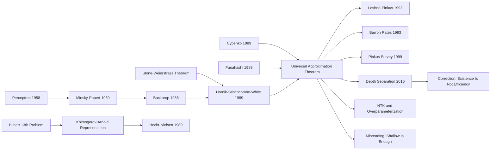

# Universal Approximation — The Existence Theorem That Certified Neural Networks' Expressive Power

> **In 1989, Kurt Hornik, Maxwell Stinchcombe and Halbert White published [Multilayer feedforward networks are universal approximators](https://doi.org/10.1016/0893-6080(89)90020-8) in *Neural Networks*.** The paper introduced no architecture, reported no benchmark, and offered no training trick. Its intervention was quieter and more durable: it gave multilayer perceptrons a mathematical passport. With sufficiently many hidden units, ordinary feedforward networks can approximate any continuous function on a compact set, and related statements extend to measurable functions in weaker norms. The real message was not the cartoon claim that "neural networks can do anything." It was a separation of burdens: representational capacity was no longer the first suspect; width, data, optimization, inductive bias, and generalization became the remaining trial. Modern debates about depth, ReLU, overparameterization, NTK limits, and approximation rates are still moving along the line this theorem drew.

## TL;DR

Hornik, Stinchcombe and White's 1989 *Neural Networks* paper writes a multilayer feedforward network as a finite linear combination of ridge functions, $\sum_{i=1}^{N}\alpha_i\sigma(w_i^\top x+b_i)$, and proves that for any continuous function $f\in C(K)$ on a compact set $K\subset\mathbb{R}^d$ and any $\varepsilon>0$, a sufficiently wide one-hidden-layer network can achieve $\sup_{x\in K}|f(x)-\hat f(x)|<\varepsilon$. It answered the representational gap left after Perceptron (1958) and the Minsky-Papert critique of single-layer models: when multilayer networks fail, insufficient expressivity is no longer the automatic explanation. But the theorem deliberately does not promise efficient training, sample complexity, hidden-unit bounds, or generalization. It separates expressivity from trainability. The parallel 1989 proofs by Cybenko and Funahashi, Leshno's later non-polynomial activation characterization, Barron and Pinkus on approximation rates, and post-2016 depth-width separation theorems all refine the same warning: one hidden layer can exist in principle without being efficient in practice, and universality is not an argument against depth.

---

## Historical Context

### From the perceptron dispute to the return of multilayer networks

Neural networks in 1989 were not a field rising smoothly. They were a field climbing out of a reputational trough while statisticians, control theorists, and approximation theorists watched with suspicion. Rosenblatt's 1958 perceptron had offered a seductive picture: multiply an input vector by weights, pass it through a threshold, and learn patterns; connect many such units and perhaps machines could form richer representations. The problem was that the cleanest early theory was negative. Minsky and Papert's 1969 *Perceptrons* analyzed single-layer perceptrons and showed that XOR, parity, and connectedness-like predicates could not be represented by linear threshold units. The theorem was about single-layer models, but in academic circulation it was often inflated into a broader verdict that neural networks did not work.

Multilayer networks could in principle escape linear decision boundaries, but the 1970s and early 1980s had two embarrassments: no widely usable training algorithm, and no clean expressivity theorem. Rumelhart, Hinton, and Williams' 1986 backpropagation paper reignited the training side by showing that multilayer weights could be adjusted systematically through the chain rule. Backprop opened the engineering door of "how to tune the parameters," but it did not settle the prior question: even if we can tune the parameters, is the function class large enough? When a multilayer network fails to fit, is the learning algorithm bad, or is the architecture representationally too poor?

Hornik, Stinchcombe, and White's paper sits exactly in that gap. It is not an algorithmic paper like Backprop (1986), nor a cognitive model like Perceptron (1958). It performs a quieter move: it returns multilayer feedforward networks to approximation theory and asks whether functions built from $\sigma(w^\top x+b)$ are dense in a sufficiently rich function space. The answer is yes, and broader than many nearby versions: with a non-constant bounded monotone continuous squashing activation, a one-hidden-layer network already has universal approximation power.

### Three proofs arrived in 1989

The paper is often compressed into the claim that "Hornik invented the universal approximation theorem." A more accurate reading is that several mathematical routes reached the same destination around 1989. George Cybenko's version in *Mathematics of Control, Signals and Systems* used Hahn-Banach and discriminatory functions to prove density for sigmoidal superpositions. Ken-Ichi Funahashi's paper in the same volume of *Neural Networks* used an integral-representation route to show approximate realization of continuous mappings. Hornik, Stinchcombe, and White chose the Stone-Weierstrass route, casting the problem as density of function algebras.

The differences matter. Cybenko's proof is short, elegant, and natural for control and signal-system readers, which is why it later became the canonical UAT citation. Funahashi's version reflects the Japanese neural-network community's interest in realizability of continuous mappings. Hornik, Stinchcombe, and White's version reads more like a statistician's letter to modelers: do not blame application failures on the function class being too small, at least not at the level of representation. The paper's often-quoted closing message has exactly that tone: if neural-network applications fail, look to learning, sample size, number of hidden units, or stochastic input-output relations before blaming the representational class itself.

The 1989 convergence was not an accident. Backprop made MLPs trainable enough to be worth theorizing about; statistics and control needed to know how large this old-new model family really was; approximation theory already had Stone-Weierstrass, Kolmogorov-Arnold, splines, and radial basis functions; computer science still carried the shadow of Minsky and Papert's single-layer critique. The lines met in 1989 because the question had become unavoidable.

### Why this paper came from statistics and econometrics

The author team is also revealing. Halbert White was an econometrician at UC San Diego, known to many statistics and economics students through White heteroskedasticity-consistent standard errors. Maxwell Stinchcombe also came from the UCSD economics and mathematical-statistics environment. Kurt Hornik later became a major figure in statistical computing and the R ecosystem. This was not a typical 1980s neural-network laboratory.

That background shapes the paper. It does not describe networks as brain-inspired mechanisms, nor does it foreground learning curves or demonstrations. It turns the question into a familiar estimation-theoretic form: given an unknown mapping $f$, can a parametrized function class approximate it arbitrarily well under a relevant norm? Once the answer is yes, statistical modeling shifts from "is the model family rich enough?" to "is the estimator consistent, is the sample large enough, is optimization reliable, and how should regularization control complexity?" Those are precisely the boundaries an econometrician would care about.

The paper's historical value, then, is not merely that it defended neural networks. It re-situated neural networks inside function approximation and nonparametric estimation, placing MLPs at the same theoretical table as splines, radial basis functions, Fourier expansions, and kernels. That repositioning explains why the paper keeps reappearing in statistical learning, nonparametric regression, and deep-learning theory: it supplies a foundation, not a one-year benchmark win.

## Background and Motivation

### It was not trying to answer “can we train it?”

The first modern instinct to suspend while reading this paper is that "neural network" now evokes SGD, GPUs, large datasets, batch normalization, Adam, and automatic differentiation. This 1989 paper is not about any of that. It asks a prior question: before the training algorithm enters, is the candidate function space large enough?

In contemporary terms, the paper separates neural-network research into two layers. The first is approximation / expressivity: does there exist a set of weights that makes the network approximate the target function? The second is optimization / statistics: given finite data and a particular training procedure, can we find those weights, and will the learned function generalize? Hornik, Stinchcombe, and White prove only the first layer, and the paper repeatedly warns readers not to stretch the conclusion into the second. That restraint is part of what makes the theorem durable.

The distinction mattered sharply at the time. After backprop's revival, MLPs were being tried on classification, time-series prediction, economic modeling, and control. Failures were everywhere: training got stuck, hidden units were too few, data were noisy, inputs were poorly chosen, sample sizes were too small for high-dimensional nonparametric estimation. Without UAT, critics could simply say that the model family was not expressive enough. UAT removes that crude objection. It does not make learning easier; it makes the conversation more precise.

### Difference from Kolmogorov, Cybenko, and Funahashi

Universal approximation is often placed in a longer lineage of representation theorems reaching back to Hilbert's thirteenth problem. Kolmogorov proved in 1957 that any continuous multivariate function can be written as superpositions of univariate continuous functions and addition, with Arnold completing the related line. Formally, that sounds close to "multilayer networks represent complex functions," and Robert Hecht-Nielsen in 1989 repackaged Kolmogorov-style arguments as neural-network existence claims.

But Kolmogorov-Arnold is not UAT in the modern neural-network sense. It permits intermediate univariate functions that depend on the target function itself; the construction is rough, not trainable, and not the same as an MLP with a fixed activation and learned linear weights. Hornik, Stinchcombe, and White focus on a more restricted and more practical class: fix a squashing activation, and learn only output coefficients, input weights, and biases. That restricted class remains dense, which is the result neural-network theory needed.

Compared with Cybenko and Funahashi, the HSW version is closer to statistical modeling. It not only covers continuous functions but also stresses approximation of Borel measurable functions in appropriate measure-based senses. It also makes the breadth of "arbitrary squashing functions" explicit. Later, Leshno, Lin, Pinkus, and Schocken sharpened the boundary in 1993: non-polynomial activations are essentially the dividing line for universal approximation. In that sense, the 1989 HSW theorem is a bridge toward the general activation theory that later made ReLU feel mathematically unsurprising.

### The boundary the paper really drew

The paper's largest theoretical legacy is a boundary: expressivity and trainability are not the same thing. If a network is sufficiently wide, it can approximate many functions. That statement does not tell you how much width is required, whether training will find the parameters, whether finite samples will overfit, or whether depth can represent the same function with far fewer parameters. All of those questions are pushed to the next layer.

That boundary has been rediscovered for decades. The post-2006 deep-learning revival studied layer-wise pretraining, initialization, and optimization. The ReLU wave around 2010 studied non-saturating activations, gradients, and sparsity. Telgarsky, Eldan-Shamir, Cohen-Sharir-Shashua, and others after 2016 studied exponential efficiency of depth over width. NTK and overparameterization theory after 2018 studied why very wide networks can be optimized by gradient methods. None of these results overturn UAT; they fill in what UAT never claimed to answer.

So the best reading of Hornik, Stinchcombe, and White 1989 is not "neural networks can do anything." It is: "from here on, do not confuse expressive capacity with the ability to train." That sounds modest, but it is one of the most durable divisions of labor in deep-learning theory.

---

## Method Deep Dive

### Overall Framework

Hornik, Stinchcombe, and White's method is not to build a new network. It abstracts an existing multilayer feedforward network into a function class and proves that this class is dense in the target space. For inputs in $\mathbb{R}^d$, a one-hidden-layer network can be written as:

$$
\mathcal{N}_{\sigma} = \left\{x \mapsto \sum_{i=1}^{N}\alpha_i\sigma(w_i^\top x+b_i): N\in\mathbb{N},\ \alpha_i\in\mathbb{R},\ w_i\in\mathbb{R}^d,\ b_i\in\mathbb{R}\right\}.
$$

The paper proves that for the space $C(K)$ of continuous functions on a compact set $K\subset\mathbb{R}^d$, this class is dense under the uniform norm when $\sigma$ is an appropriate squashing function:

$$
\forall f\in C(K),\ \forall \varepsilon>0,\ \exists \hat f\in\mathcal{N}_{\sigma}\quad\text{s.t.}\quad \sup_{x\in K}|f(x)-\hat f(x)|<\varepsilon.
$$

The expression is simple, but it rewrites neural networks from "stacks of brain-inspired units" into "linear spans of ridge functions." Each hidden unit $\sigma(w_i^\top x+b_i)$ projects the input along a direction $w_i$ and then applies a nonlinearity; the output layer linearly combines these ridge functions. The UAT question becomes: are these ridge functions diverse enough that finite linear combinations cover any continuous target function?

The proof strategy can be read in four steps:

| Step | Mathematical object | Intuition | Role |
|------|---------------------|-----------|------|
| 1 | $\sigma(w^\top x+b)$ | A hidden unit is a translatable and rotatable nonlinear ridge function | Generates enough local / half-space responses |
| 2 | Finite linear combinations | The output layer adds many responses | Forms a tunable function class |
| 3 | Stone-Weierstrass / density | If a class separates points and contains constants, it can approximate continuous functions | Turns network expressivity into approximation theory |
| 4 | $C(K)$ and $L^p$ extensions | Move from continuous functions to weaker approximation of measurable functions | Connects to unknown mappings in statistical modeling |

That is why the paper has no experiment table. Its "result" is not an error rate on a dataset but a coverage statement at the level of function spaces.

### Key Designs

#### Design 1: Write the network as a linear hull of ridge functions

**Function**: Translate a multilayer feedforward graph into an analyzable function class. A hidden unit is no longer just a neuron; it is a parametrized basis function:

$$
z_i(x)=w_i^\top x+b_i,\qquad h_i(x)=\sigma(z_i(x)),\qquad \hat f(x)=\sum_i\alpha_i h_i(x).
$$

This notation puts neural networks into the same theoretical interface as splines, Fourier series, and radial basis functions: approximate a complicated function by linearly combining many simple ones. The difference is that an MLP's basis directions $w_i$ and locations $b_i$ are learnable rather than fixed on a grid.

A small numerical illustration makes the theorem's object concrete. This is not a proof; it shows a one-dimensional continuous function being fitted by many sigmoid ridge functions.

```python
import numpy as np

def sigmoid(value):
    return 1.0 / (1.0 + np.exp(-value))

def random_sigmoid_features(x, width, rng):
    weights = rng.normal(scale=6.0, size=(width, 1))
    biases = rng.uniform(-3.0, 3.0, size=(width,))
    return sigmoid(x[:, None] @ weights.T + biases)

rng = np.random.default_rng(1989)
x = np.linspace(-1.0, 1.0, 400)
target = np.sin(3 * np.pi * x) + 0.3 * x**2
features = random_sigmoid_features(x.reshape(-1, 1), width=256, rng=rng)
coefficients, *_ = np.linalg.lstsq(features, target, rcond=None)
approximation = features @ coefficients

max_error = np.max(np.abs(target - approximation))
print(f"sup-norm error on grid: {max_error:.4f}")
```

Each column of `features` is one $\sigma(w_i x+b_i)$. UAT does not say that random features are always enough; it says that when width, weights, and biases can be chosen freely, this class is not blocked by representational poverty.

#### Design 2: State the target as uniform approximation on compact sets

**Function**: Tighten the tempting phrase "any function" into a mathematically checkable statement. The core theorem discusses continuous functions on compact sets $K$ and uses the uniform norm:

$$
\|f-\hat f\|_{\infty,K}=\sup_{x\in K}|f(x)-\hat f(x)|.
$$

This choice is deliberately restrained. Compactness avoids pathologies on unbounded domains; continuity avoids arbitrary jumps and uncontrolled measurable monsters; the uniform norm requires approximation across the whole region, not merely on average. That is already strong enough for many modeling situations, where inputs are bounded and stable input-output relations are typically continuous or piecewise continuous.

At the same time, HSW also discusses weaker approximation of measurable functions. In statistical modeling, the real relationship may not be continuous and may only matter under a data distribution $\mu$. In that setting an $L^p(\mu)$ norm is more natural:

$$
\|f-\hat f\|_{p,\mu}=\left(\int |f(x)-\hat f(x)|^p\,d\mu(x)\right)^{1/p}.
$$

This is where the paper is broader than the slogan "continuous functions are dense": it actively connects approximation theory to statistical estimation.

#### Design 3: Expand activation assumptions from a specific sigmoid to squashing functions

**Function**: Show that universality is not a lucky property of one special sigmoid. HSW uses non-constant, bounded, monotone continuous squashing functions, typically satisfying:

$$
\lim_{t\to -\infty}\sigma(t)=0,\qquad \lim_{t\to +\infty}\sigma(t)=1,
$$

with $\sigma$ not constant. This covers logistic sigmoid, shifted and scaled versions of tanh, and the saturating activations common in neural-network papers of the period. The point is that expressivity comes from "linear projection + nonlinear bend + finite superposition," not from the exact algebraic shape of one activation.

Later, Leshno and coauthors pushed this into a more modern boundary: in broad settings, a non-polynomial activation is essentially what is needed for universal approximation. If the activation is polynomial, finite-width linear combinations remain trapped in polynomial-like finite-dimensional structures and cannot be dense in continuous function spaces. This clarifies ReLU's role: ReLU is not a bounded sigmoid, but it is non-polynomial and piecewise linear, so it still has universal approximation power.

| Activation | Fits HSW's original squashing condition | Fits later non-polynomial condition | Intuition |
|------------|------------------------------------------|------------------------------------|-----------|
| logistic sigmoid | yes | yes | Standard activation for 1980s MLPs |
| tanh | yes after shift/scale | yes | Saturating nonlinearity equivalent in spirit to sigmoid |
| ReLU | no, unbounded | yes | Core modern activation, still universal |
| polynomial activation | usually no | no | Linear combinations remain constrained by polynomial structure |

#### Design 4: Decouple expressivity from the training algorithm

**Function**: Separate "a good network exists" from "training will find it." UAT is an existence statement:

$$
\exists\theta^*\ \text{s.t.}\ \|f-f_{\theta^*}\|<\varepsilon,
\qquad \text{but not necessarily}\qquad
\theta^*=\operatorname*{argmin}_{\theta}\mathcal{L}_{\text{train}}(\theta)\ \text{found by backprop}.
$$

This separation is the paper's most important and most frequently ignored design move. It divides theoretical responsibility into several buckets:

| Question | Does UAT answer it? | Later field |
|----------|---------------------|-------------|
| Is the function class large enough? | yes, existentially | approximation theory |
| How many hidden units are needed? | mostly no | rates, Barron spaces, width bounds |
| Can the training algorithm find the weights? | no | optimization, overparameterization, NTK |
| Will the learned function generalize? | no | statistical learning theory |

UAT is therefore not proof that neural networks have solved learning. It is proof that representational capacity is not the first bottleneck. That boundary became a starting point for deep-learning theory over and over again.

---

## Failed Baselines

### Failure 1: The linear boundary of the single-layer perceptron

The first failed baseline behind Hornik, Stinchcombe, and White's paper is the single-layer perceptron. A single-layer model can be written as:

$$
\hat y=\sigma(w^\top x+b),
$$

which forms only a linear threshold boundary. For linearly separable problems, that structure is elegant enough. For XOR, parity, and connectedness-like tasks, it is representationally incapable. Minsky and Papert's critique was powerful precisely because it identified a failure that was not about insufficient training; the target function was not in the model class.

UAT does not answer by rehabilitating the single-layer perceptron. It says that single-layer negative results do not automatically transfer to multilayer networks. By summing many $\sigma(w_i^\top x+b_i)$ terms, a multilayer network can form nonlinear partitions, local bumps, staircase approximations, and complicated surfaces. The single-layer failure shows that linear threshold models are too weak; UAT shows that adding a hidden layer changes the expressivity ceiling entirely.

### Failure 2: Kolmogorov representation as “existence but not learnability”

The second failed baseline is subtler: the Kolmogorov-Arnold representation theorem. It tells us that multivariate continuous functions can be represented through univariate functions and addition, a mathematically startling fact that early neural-network arguments sometimes used to claim that networks were universal. But this route has a fatal limitation: the intermediate univariate functions are not a fixed activation; they are target-dependent and highly nontrivial constructions. It proves that a continuous function has some superposition representation, not that a trainable MLP has the right parametrized family.

Kolmogorov's line is therefore the ancestor of existence thinking, but not the direct answer that modern neural-network UAT needed. Its failure is operational. You cannot pick one fixed sigmoid, hand weights and biases to a learning algorithm, and call that the Kolmogorov construction. Hornik, Stinchcombe, and White's advance is to bring existence back into the grammar of trainable models: fixed activation, learned output coefficients, input weights, and biases.

### Failure 3: Reading an approximation theorem as a training guarantee

The third failed baseline is an interpretation: if networks can approximate any function, then backpropagation should find a good solution. This is the most common and most dangerous misreading of UAT. The existence of $\theta^*$ does not imply that SGD or backprop will find $\theta^*$; even a low training error does not imply generalization on the test distribution.

MLP practice in 1989 made the gap especially visible. Sigmoid saturation could shrink gradients, random initialization could make hidden units redundant, small datasets could give nonparametric models high variance, and local minima or saddle points could destabilize training. UAT gives no algorithmic answer to these issues. It merely moves "the model class is too small" away from the front of the suspect list and redirects attention toward optimization and statistics.

### Failure 4: Reading one-hidden-layer universality as “depth is useless”

The fourth failed baseline became the most persistent slogan over the next few decades: if one hidden layer is enough, why need depth? This confuses representation with efficient representation. UAT permits the number of hidden units to grow without bound, but it does not say how that number scales with dimension, error tolerance, or smoothness. For high-dimensional functions, a shallow network may require exponential width; a deep network can reuse intermediate features compositionally.

Post-2016 depth-width separation results systematically corrected this misreading. Telgarsky constructed functions easily represented by deeper networks but requiring exponential width from shallower ones. Eldan and Shamir proved an exponential advantage of three layers over two. Cohen, Sharir, and Shashua used tensor analysis to explain the compositional expressivity of depth. These results do not refute UAT; they answer the question UAT never asked: representation may exist, but efficiency can differ by orders of magnitude.

## Key Experimental Data

### Why this paper has almost no experiments

The paper has no experimental section in the modern sense, and that is itself an important fact. It persuades by theorem rather than dataset. In the 1989 context, that is not strange: the target question is not "does this algorithm perform well on a task?" but "is the multilayer feedforward network expressively large enough?"

If forced into the frame of an experimental paper, its baselines would not be models with test errors. They would be explanations being eliminated: single-layer models are underexpressive; Kolmogorov-style representation is not a trainable MLP story; RBFs, splines, and Fourier series are alternative approximation families but not the MLP itself; training failure is not direct evidence of expressivity failure. The paper's "key data" therefore lives in theorem conditions, simultaneous proofs, and later quantitative theory.

### Key theorem facts and later quantitative results

| Item | Number or conclusion | Meaning |
|------|----------------------|---------|
| Paper length | Neural Networks 2(5):359-366, about 8 pages | A short theorem paper established a foundational position |
| Authors | Kurt Hornik, Maxwell Stinchcombe, Halbert White | Statistics / econometrics background outweighed neural-network experimentation |
| Core network | One-hidden-layer finite sum $\sum_i\alpha_i\sigma(w_i^\top x+b_i)$ | Ordinary MLPs form a dense function class |
| Activation condition | Non-constant, bounded, monotone continuous squashing function | Not dependent on one special sigmoid |
| Same-year proofs | Cybenko 1989, Funahashi 1989, HSW 1989 | The question matured simultaneously in 1989 |
| Later sharpening | Leshno et al. 1993: non-polynomial activation characterization | Moved the activation condition toward the modern ReLU setting |
| Approximation rates | Barron 1993 gave $O(1/N)$-type rates for specific function classes | Shifted from existence to quantitative scale |
| Modern correction | Telgarsky / Eldan-Shamir 2016 depth-width separations | One-hidden-layer existence does not imply shallow efficiency |

The lesson behind these facts is that UAT is necessary ground, not a complete building. Without it, neural-network expressivity remained trapped under the shadow of the 1969 single-layer critique. With only it, we still cannot explain why post-2012 deep networks train well, why depth is efficient, or why overparameterization can generalize. The theorem advanced the agenda by one layer; it did not end the agenda.

---

## Idea Lineage

### Before: from Hilbert 13 to the perceptron winter

Universal approximation did not begin with neural networks. It began with an older question: can multivariate functions be assembled from simpler low-dimensional pieces? Hilbert's thirteenth problem, Kolmogorov-Arnold representation, Stone-Weierstrass, spline approximation, and Fourier expansions all answer versions of "how do complex functions arise from simple components?" Neural networks changed the component set: linear projections, biases, a fixed nonlinearity, and finite summation.

The perceptron controversy supplied pressure from the opposite direction. Minsky and Papert proved hard limitations of single-layer models, making the field acutely sensitive to claims about neural-network expressivity. Once backpropagation revived multilayer networks in 1986, theory immediately had to answer: are multilayer networks merely harder to train, or do they really cross the representational boundary that trapped single-layer models? HSW, Cybenko, and Funahashi connected approximation theory to that question in 1989.



### After: from density theorems to depth efficiency

After HSW, neural-network approximation theory split into several streams. The first concerned activation assumptions: Leshno and coauthors proved in 1993 that non-polynomial activations are the key boundary for universal approximation, which made later ReLU networks fit naturally into the UAT landscape. The second concerned approximation rates: Barron in 1993 asked "how many hidden units are needed?" rather than merely "does one exist?" and gave quantitative rates for particular function classes. The third concerned structural efficiency: can deep networks represent with few parameters what shallow networks require exponential width to express?

| Line | Representative work | What it adds beyond UAT |
|------|---------------------|-------------------------|
| Activation characterization | Leshno / Lin / Pinkus / Schocken 1993 | Moves from squashing functions to non-polynomial activations |
| Approximation rates | Barron 1993, Mhaskar-Micchelli 1992 | Moves from existence to number of required units |
| Depth efficiency | Telgarsky 2016, Eldan-Shamir 2016 | Shows one-hidden-layer existence is not shallow efficiency |
| Modern surveys | Pinkus 1999, DeVore-Hanin-Petrova 2021 | Places UAT inside full approximation theory |

This afterlife shows that UAT is an entrance, not an endpoint. It lets neural-network theory upgrade the question from "is there enough expressivity?" to "how does expressivity scale with width, depth, activation, smoothness, and dimension?" That is why approximation surveys in the 2020s still begin with Cybenko/HSW/Funahashi but quickly move to ReLU networks, depth separation, Besov/Sobolev classes, constructive approximation, and error rates.

### Misreading: universality is not a free lunch

One of the paper's most durable consequences is also its most common misreading. The first misreading is "neural networks can fit anything, so theory is fine." That ignores compact-domain assumptions, continuity or measure-norm restrictions, unlimited width, and existential quantifiers. The second is "one hidden layer is enough, so depth is just an engineering preference." That ignores efficiency and trainability. The third is "UAT explains deep learning's success." That mistakes a foundation of expressivity for a complete explanation.

The more accurate intellectual position is this: HSW opened a door, but the door leads to stairs. Through the door, we know that the MLP function class is large enough. Up the stairs, we meet Barron spaces, depth-width separations, overparameterized optimization, double descent, implicit bias, and generalization theory. The beauty of UAT is that it clearly says "representation can be done here" while silently leaving "how efficiently, how trainably, and how generally?" for later work. That silence is not a flaw; it is the boundary discipline of a foundational theorem.

---

## Modern Perspective

### Which assumptions still hold today

Seen from 2026, the most stable part of Hornik, Stinchcombe, and White's paper still holds: sufficiently wide feedforward networks are extraordinarily rich function classes, and fixed nonlinearities plus linear combination can cover broad families of continuous functions and distribution-based target mappings. Today we use ReLU, GELU, SiLU, attention blocks, normalization layers, and residual connections; model forms are far more complex than the 1989 MLP. But the base expressivity intuition remains: linear transformations create directions, nonlinearities create bends, and composition plus superposition creates complex functions.

Another surviving judgment is that model failure should not first be blamed on neural networks lacking representational capacity. For most modern models, the earlier bottlenecks are data coverage, optimization stability, inductive bias, compute budget, evaluation distribution, or safety constraints. UAT acts here as a foundation-level exclusion rule: it cannot tell you why a model succeeds, but it prevents crude attribution of failure to an inherently too-small function class.

| 1989 claim | Status in 2026 | Modern interpretation |
|------------|----------------|----------------------|
| One-hidden-layer networks are universal approximators | still true | ReLU-like non-polynomial activations satisfy broader versions |
| Expressivity and training are different issues | even more true | Optimization theory, NTK, and overparameterization study the second half |
| Application failure is not necessarily a weak function class | still true | Data, optimization, generalization, and deployment constraints often dominate |
| The theorem gives no hidden-unit count | still a central gap | Rates and depth efficiency became independent research programs |

### Which assumptions no longer hold

What no longer holds is not the theorem itself, but early optimistic interpretations around it. First, the 1989 context made it tempting to read "one hidden layer is enough" as practically close to enough. We now know that this is only an existence statement. Depth provides compositional reuse and can reduce some representation costs from exponential to polynomial; residual networks, Transformers, and diffusion models did not succeed by making a single layer infinitely wide.

Second, sigmoid / squashing activations are no longer the modern default. ReLU became popular because of gradient propagation, sparse activation, and implementation simplicity, not because it matched the original 1989 assumptions. GELU and SiLU further show that modern activation choice is shaped jointly by optimization, hardware, and scale. HSW's squashing condition was a product of its era; the later non-polynomial characterization is closer to today's theoretical language.

Third, pure function approximation is insufficient to explain modern deep learning. Large models are not merely approximating one fixed function; they form transferable representations through data distributions, pretraining objectives, context conditioning, retrieval tools, and human feedback. UAT can explain that some function is expressible by a network. It cannot explain why next-token prediction learns transferable world knowledge or why RLHF changes behavioral style.

### If the paper were rewritten today

If this paper were rewritten today, it would probably not stop at density in $C(K)$. The first part would still state the classical UAT, but it would express activation conditions in the modern non-polynomial / non-affine language and place ReLU, leaky ReLU, GELU, and related activations in one framework. The second part would immediately address efficiency: how width scales with $\varepsilon$, input dimension $d$, target smoothness, and compositional structure. The third part would explicitly separate approximation, optimization, estimation, and generalization, listing theorems and counterexamples for each layer.

A more modern version would also make depth central rather than peripheral. It would ask: if a target function has compositional structure $f(x)=g_3(g_2(g_1(x)))$, why do deep networks match it naturally? If the target belongs to Sobolev, Besov, Barron, or compositional classes, how does parameter count scale? If the network is wide enough to enter the NTK regime, what is the relationship between expressivity and training dynamics? These are not defects of the 1989 paper; they are the next-generation questions that grow naturally once it succeeds.

## Limitations and Future Directions

### Four things the theorem does not give

UAT's largest limitations are exactly where it is most often overused. It does not provide an upper bound on hidden units, so we do not know how wide the network must be for $\varepsilon$ accuracy. It does not provide a construction algorithm, so we do not know how to find the weights. It does not provide finite-sample generalization bounds, so we do not know how the trained network behaves on the test distribution. It does not explain whether depth is more economical, so it cannot guide architecture choice by itself.

These limitations cannot be patched with a small addendum. They correspond to four research programs that later became large fields of their own: approximation rates, optimization theory, statistical learning theory, and expressive efficiency. UAT is their shared starting point, not their substitute.

### Future question: from existence to computability

The valuable question today is no longer "are neural networks universal?" It is "which network classes approximate which function classes in trainable, generalizable, deployable ways?" That pushes pure existence theorems toward finer objects: structured function classes, finite-precision computation, sparse and low-rank constraints, hardware-friendly networks, out-of-distribution robustness, interpretability, and safety alignment.

From this angle, the future of UAT is not to prove that ever more models are "also universal." It is to make universality computable. A modern approximation theorem that only says "there exists" is no longer very persuasive; it should also relate parameter count, depth, training dynamics, sample size, and error. The door opened by Hornik, Stinchcombe, and White now has to be pushed toward engineering reachability and statistical reliability.

## Related Work and Insights

### How it shaped later papers

The paper directly shaped HSW's 1990 work on approximating unknown mappings and their derivatives, and it underlies Hornik's 1991 paper on broader approximation capabilities. After the Cybenko/Funahashi/HSW convergence, Barron in 1993 moved the question toward rates, Leshno and coauthors in 1993 sharpened activation assumptions to non-polynomiality, and Pinkus in 1999 systematized the whole MLP approximation-theory landscape. Later depth separation, ReLU approximation rates, NTK, and overparameterization theory all circle the same core boundary: expressivity, efficiency, training, and generalization have to be discussed separately.

It also influenced the public teaching narrative of deep learning. Many textbooks introduce UAT early in the MLP chapter to show that neural networks are not merely arbitrary parameter piles but have approximation-theoretic grounding. That teaching order is useful, but it needs the paired warning: UAT is an entry threshold, not a success guarantee.

### Practical reminders for today’s researchers

For today's model builders, the paper offers three practical reminders. First, when you see the claim "the model lacks expressivity," ask whether it means existence, efficiency, or training reachability; those layers are not interchangeable. Second, when you see "theoretically can approximate any function," ask for width, sample size, and optimization path, otherwise it is an empty promise. Third, when proposing a new architecture, proving universality is rarely the strongest selling point; it is more valuable to prove that the architecture is more efficient, more stable, or easier to train for a structured task family.

That is UAT's gentle but firm lesson: expressivity is a floor, not a victory condition.

## Resources

### Papers and background readings

- Hornik, Stinchcombe, White 1989: [Multilayer feedforward networks are universal approximators](https://doi.org/10.1016/0893-6080(89)90020-8)
- Cybenko 1989: *Approximation by superpositions of a sigmoidal function*
- Funahashi 1989: *On the approximate realization of continuous mappings by neural networks*
- Leshno, Lin, Pinkus, Schocken 1993: *Multilayer feedforward networks with a nonpolynomial activation function can approximate any function*
- Barron 1993: *Universal approximation bounds for superpositions of a sigmoidal function*
- Pinkus 1999: *Approximation theory of the MLP model in neural networks*
- DeVore, Hanin, Petrova 2021: *Neural network approximation*


---

> 🌐 [中文版](/era1_foundations/1989_universal_approximation/) · 📚 awesome-papers project · CC-BY-NC