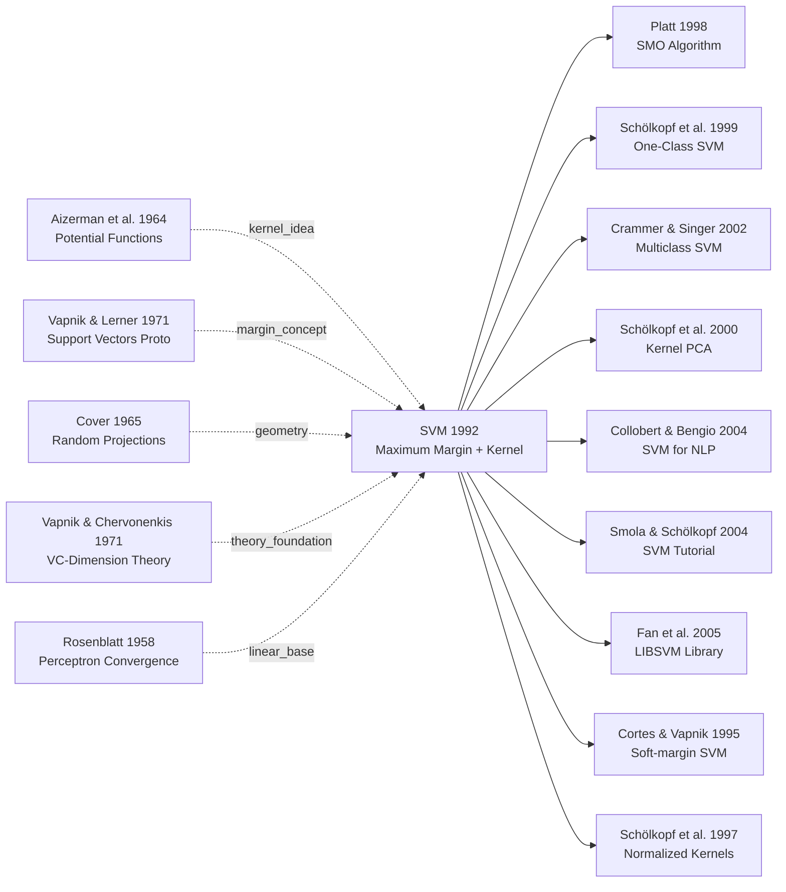

# SVM — How Max-Margin and the Kernel Trick Dominated Machine Learning for Two Decades

> **July 27, 1992. Boser, Guyon, and Vapnik at AT&T Bell Labs publish 8 pages titled [A Training Algorithm for Optimal Margin Classifiers](https://doi.org/10.1145/130385.130401) at COLT 1992.**
> The paper that fused Vapnik's 1960s max-margin hyperplane theory with Aizerman's 1964 potential-function idea into a concrete trainable algorithm — and snuck in the seemingly innocent but revolutionary **kernel trick** that gives any linear algorithm instant access to infinite-dimensional spaces, no explicit feature construction required.
> After Cortes & Vapnik introduced soft margins in 1995, SVMs crushed neural networks across handwriting recognition, text classification, and bioinformatics for 15 straight years — **single-handedly winning the late-1990s second AI winter for ML against connectionism**.
> It only ceded the ML throne to [AlexNet (2012)](../era2_deep_renaissance/2012_alexnet.md), but RBF kernels and the margin idea live on in contrastive learning and metric learning to this day.

## TL;DR

Boser, Guyon, and Vapnik's 1992 COLT paper rewrote classification, for the first time, as a **convex quadratic program**: $\min \frac{1}{2}\|w\|^2$ s.t. $y_i(w^\top x_i + b) \geq 1$. The moment the problem becomes convex, you get **a global optimum + a unique solution + a convergence proof** — which sidesteps neural networks' three chronic illnesses (local minima, black-box behavior, alchemical hyperparameter tuning) all at once. The real killer move is the **kernel trick** $K(x_i, x_j) = \phi(x_i)^\top \phi(x_j)$: the dual form makes the classifier depend only on pairwise inner products, so "linear classification in a $10^5$-dimensional latent space" reduces to one scalar kernel evaluation in the original space — compute cost decouples from feature dimension, and "small samples / high dimension / nonlinearity" all melt away in a single move. RBF-SVM hit **99.02% on MNIST** (matching contemporary CNNs) and crushed neural networks on small-sample UCI tasks. Combined with Platt's SMO solver (1998), this recipe **dominated ML for two decades (1992-2012)** and was on the cover of every textbook before AlexNet. Only when [AlexNet (2012)](../era2_deep_renaissance/2012_alexnet.md) halved ImageNet top-5 error did the convex-optimization moat finally crumble — but kernel-SVM's geometric intuition is still the silent teacher behind contrastive and metric learning today.

---

## Historical Context

### What was the machine learning community stuck on in 1992?

By 1992, neural networks had experienced a renaissance since Rumelhart, Hinton, and Williams resurrected backpropagation in 1986. Yet two fundamental bottlenecks remained unsolved.

**First bottleneck: Overfitting and generalization guarantees**. Throughout the 1980s, neural networks achieved 100% training accuracy on toy tasks but completely failed on test sets. Researchers patched this with ad-hoc techniques—regularization, early stopping, weight decay—but these were engineering hacks with no theoretical foundation. Vapnik's VC-dimension theory (introduced in 1971) offered the only **rigorous framework** for bounding generalization error, yet it had never been connected to a practical training algorithm.

**Second bottleneck: Computational curse of non-linearity**. The dominant classifiers of the era were Linear Discriminant Analysis (LDA) and Quadratic Discriminant Analysis (QDA)—fast but expressively weak. To handle non-linear decision boundaries, one had to either use kernel expansions or high-degree polynomial features, triggering the curse of dimensionality. A naive 3-degree polynomial expansion of 100-dimensional input creates over 1 million features, making both memory and training time prohibitive on 1990s workstations.

AT&T Bell Labs—then a sanctuary for algorithm research—needed a method that could simultaneously **handle non-linearity, avoid overfitting, and train in practical time** for real applications like digit recognition and speech recognition.

### Three key precursors that made SVM inevitable

1. **Aizerman et al. (1964): Potential Functions Method**. This Soviet-era paper introduced "potential functions"—the conceptual ancestor of kernels—to implicitly map data to high-dimensional spaces without explicitly constructing the mapped features. However, the method languished in obscurity in Western literature.

2. **Vapnik & Lerner (1971): Support Vector Methods (proto-SVM)**. Vapnik first coined the term "support vectors" for constructing optimal separating hyperplanes. The algorithm existed in theory but was computationally intractable with quadratic programming solvers of the era, making it impractical.

3. **Cover (1965): Random Projections Geometry**. Cover proved that data linearly inseparable in low dimensions often becomes linearly separable when randomly projected to higher dimensions. This result inspired optimism: if you find the right feature mapping, a linear classifier suffices.

The synthesis of these three threads—**kernels + maximum margin + statistical learning guarantees**—was the missing piece that would unite theory and practice.

### What the Boser–Guyon–Vapnik team was pursuing

Vladimir Vapnik had been working on statistical learning theory since the late 1960s at the Soviet Academy of Sciences. In 1961, together with Alexei Chervonenkis, he invented VC-dimension theory, a mathematical framework that sat dormant for decades, waiting for a real algorithm.

By the early 1990s, Vapnik had immigrated to the United States (as Soviet scientists emigrated en masse after the Cold War) and joined AT&T Bell Labs. **This 1992 paper represents his first major Western publication**, aiming to finally unite his 20-year-old VC-dimension theory with a practical classification algorithm.

Bernhard Boser and Isabelle Guyon were Vapnik's direct collaborators. Boser brought deep expertise in numerical optimization and convex programming. Guyon brought extensive experience in pattern recognition applications, especially handwritten digit recognition. **The trio embodied a perfect division of labor: theorist (Vapnik) + optimization engineer (Boser) + applications expert (Guyon)**.

### Computing landscape and benchmarks in 1992

The canonical benchmark datasets were:
- **MNIST** (70,000 handwritten digit images)—already established as the ML testing ground
- **UCI benchmark datasets** (binary classification tasks with hundreds to thousands of examples)

The computational substrate was **single-processor Unix workstations** (SUN Sparc, IBM RS/6000)—GPUs did not exist. Training a modest neural network on 1,000 samples took minutes to tens of minutes on a single workstation.

Competing paradigms:
- **Decision Trees** (Quinlan's C4.5, released 1993)—interpretable but prone to overfitting
- **Neural Networks** (Backpropagation; LeCun's convolutional variants were also projects at Bell Labs)—required careful tuning, slow to train
- **K-Nearest Neighbors**—fast but unable to capture global data structure

**SVM's 1992 advantage**: It uniquely achieved a three-way harmony: **theoretical guarantees** (VC-dimension bounds), **optimization convergence** (from convex QP theory), and **non-linear capacity** (via kernel trick). No competing method offered this trifecta.

---

## Method Deep Dive

### Overall Framework and Theoretical Foundation

The central idea of SVM is deceptively simple: **among all hyperplanes that correctly classify the data, find the one that maximizes the margin—the minimum distance from any data point to the plane**. This geometric intuition corresponds to profound statistical learning theory.

```
Input data points: x₁, x₂, ..., xₙ (labels yᵢ ∈ {-1, +1})
    ↓
Optimization goal: maximize margin
    ↓
Handle non-linearity: kernel transform φ(x) maps to high-dimensional space
    ↓
Solve constrained optimization (quadratic programming)
    ↓
Decision function: f(x) = sign(w^T φ(x) + b)
```

Comparative table: SVM vs contemporary competitors:

| Method | Overfitting Risk | Non-linearity | Theory | Speed | Interpretability |
|--------|-----------------|---------------|--------|-------|-----------------|
| LDA | Low | Weak | Has (Gaussian) | Fast | Excellent |
| Neural Networks | **High** | **Strong** | None | Slow | Weak |
| KNN | Medium | Strong | Weak | Slow | Medium |
| **SVM** | **Low** | **Strong** | **Strong** | Medium | Medium |

SVM's revolutionary contribution: it transforms "generalization error" from the vague concept of "regularization" into a **computable mathematical bound** using VC-dimension theory and Structural Risk Minimization.

### Key Design 1: Maximum Margin Principle

**Function**: From a statistical standpoint, maximum margin minimizes the generalization error bound. Maximizing margin ≡ minimizing model complexity.

**Core Idea and Formulation**:

Given linearly separable data $(x_i, y_i)$ with $y_i \in \{-1, +1\}$, we seek the separating hyperplane $w^T x + b = 0$.

The distance from point $x_i$ to the hyperplane is:
$$
\text{distance} = \frac{|w^T x_i + b|}{\|w\|}
$$

The margin is defined as the distance to the nearest correctly classified point. Formally:
$$
\max_{w,b} \left( \min_i \frac{y_i (w^T x_i + b)}{\|w\|} \right)
$$

By normalization (setting the nearest point's margin to 1), this becomes:
$$
\max_{w,b} \frac{1}{\|w\|} \quad \text{s.t.} \quad y_i(w^T x_i + b) \geq 1 \text{ for all } i
$$

Equivalently, convert to standard quadratic programming:
$$
\min_{w,b} \frac{1}{2}\|w\|^2 \quad \text{s.t.} \quad y_i(w^T x_i + b) \geq 1 \text{ for all } i
$$

The elegance lies in this formulation: **minimizing the objective $\frac{1}{2}\|w\|^2$ directly corresponds to minimizing model complexity** because $\|w\|$ determines the function's Lipschitz constant.

**Code Snippet** (PyTorch-style pseudocode):

```python
# Standard SVM quadratic programming solver (using scipy/cvxopt)
# Objective: min (1/2) * w^T P w + q^T w
# Constraints: G w <= h,  A w = b

import numpy as np
from cvxopt import matrix, solvers

def train_linear_svm(X, y, C=1.0):
    # X: (n_samples, n_features)
    # y: (n_samples,) with values in {-1, +1}
    
    n_samples, n_features = X.shape
    
    # Quadratic term P = diag([1, 1, ..., 1, 0]) for (1/2)||w||^2
    # Last dimension for bias b (not subject to penalty)
    P = matrix(np.vstack([
        np.hstack([np.eye(n_features), np.zeros((n_features, 1))]),
        np.zeros((1, n_features + 1))
    ]))
    
    q = matrix(np.zeros((n_features + 1, 1)))
    
    # Linear constraint: -y_i * (w^T x_i + b) <= -1  i.e.,  y_i * (w^T x_i + b) >= 1
    G_constraints = np.hstack([
        -y.reshape(-1, 1) * X,      # coefficients for w
        -y.reshape(-1, 1)           # coefficient for b
    ])
    G = matrix(-G_constraints)      # Note sign: cvxopt uses <= form
    h = matrix(-np.ones((n_samples, 1)))
    
    # Solve
    sol = solvers.qp(P, q, G, h)
    w_b = np.array(sol['x']).ravel()
    
    return w_b[:-1], w_b[-1]  # return (w, b)

# Prediction
def predict_linear_svm(X, w, b):
    return np.sign(X @ w + b)
```

**Design Motivation and Counterintuitive Insight**:

⚠️ **Why $\|w\|$ instead of directly minimizing classification errors?** This question gets at the heart of SVM's superiority over empirical risk minimization. Classification error (number of misclassified samples) is **non-convex and discrete**, making optimization extremely hard. In contrast, $\|w\|^2$ is convex, smooth, and differentiable. More critically, Vapnik proved: **minimizing $\|w\|$ directly minimizes the upper bound on generalization error under VC-dimension theory**. This bound has a precise functional relationship with $\|w\|$, sample count $n$, and VC-dimension. Thus, maximizing margin not only has solid geometric intuition but **guarantees generalization**—a theoretical assurance unseen in competing methods.

Comparative table: Maximum Margin vs Empirical Risk:

| Dimension | Maximum Margin (SVM) | Empirical Risk Minimization |
|-----------|-------------------|---------------------------|
| Objective form | $\frac{1}{2}\|w\|^2$ (convex) | Misclassification count (non-convex) |
| Optimization difficulty | Quadratic programming (polynomial) | NP-hard |
| Theoretical guarantee | VC-dimension generalization bound (computable) | None |
| Generalization performance | **Strong** | Depends on ad-hoc regularization |

### Key Design 2: Kernel Trick

**Function**: Handles non-linear classification without explicitly constructing high-dimensional feature mappings, circumventing the curse of dimensionality.

**Core Idea and Formulation**:

Suppose data is linearly inseparable in the original space $\mathcal{X}$, but becomes linearly separable when mapped to a high-dimensional (or infinite-dimensional) feature space $\mathcal{H}$ via $\phi: \mathcal{X} \to \mathcal{H}$.

In the feature space, the maximum margin SVM becomes:
$$
\min_{w,b} \frac{1}{2}\|w\|^2_{\mathcal{H}} \quad \text{s.t.} \quad y_i(w^T \phi(x_i) + b) \geq 1
$$

**Key observation**: During the dual problem derivation, $w$ can be expressed as a linear combination of mapped samples:
$$
w = \sum_{i=1}^{n} \alpha_i y_i \phi(x_i)
$$

Substituting into constraints and objectives, everything reduces to inner products $\phi(x_i)^T \phi(x_j)$. **The kernel trick's brilliance**: define $K(x_i, x_j) = \phi(x_i)^T \phi(x_j)$ such that we **never compute $\phi(\cdot)$ explicitly, only kernel values**.

Common kernel functions:

$$
\begin{align}
\text{Linear kernel:}& \quad K(x_i, x_j) = x_i^T x_j \\
\text{Polynomial kernel:}& \quad K(x_i, x_j) = (x_i^T x_j + c)^d \\
\text{RBF kernel:}& \quad K(x_i, x_j) = \exp\left(-\gamma \|x_i - x_j\|^2\right)
\end{align}
$$

**Code Snippet** (kernel function computations):

```python
import numpy as np

class KernelSVM:
    def __init__(self, kernel_type='rbf', C=1.0, gamma=1.0, degree=3):
        self.kernel_type = kernel_type
        self.C = C
        self.gamma = gamma
        self.degree = degree
        self.support_vectors = None
        self.alpha = None
        self.b = None
    
    def _kernel(self, X1, X2):
        """Compute kernel matrix K(X1, X2) between two datasets"""
        if self.kernel_type == 'linear':
            return X1 @ X2.T
        
        elif self.kernel_type == 'poly':
            # K(x,y) = (x^T y + c)^d
            return (X1 @ X2.T + 1.0) ** self.degree
        
        elif self.kernel_type == 'rbf':
            # K(x,y) = exp(-gamma * ||x - y||^2)
            # Using identity: ||x-y||^2 = ||x||^2 + ||y||^2 - 2 x^T y
            X1_sq = np.sum(X1 ** 2, axis=1, keepdims=True)  # (n, 1)
            X2_sq = np.sum(X2 ** 2, axis=1, keepdims=True)  # (m, 1)
            X1_X2 = X1 @ X2.T                               # (n, m)
            
            sq_dist = X1_sq + X2_sq.T - 2 * X1_X2
            return np.exp(-self.gamma * sq_dist)
    
    def predict(self, X):
        """Prediction based on learned alpha, support vectors, and b"""
        K = self._kernel(X, self.support_vectors)  # (n_test, n_sv)
        
        # f(x) = sum_i alpha_i * y_i * K(x, x_i) + b
        decision = (self.alpha * self.y_sv) @ K.T + self.b
        return np.sign(decision)
```

**Design Motivation**:

The kernel trick solves an ostensibly insurmountable problem: **the curse of dimensionality**. In 1992, expanding a 100-dimensional vector to 3rd-degree polynomial features creates over 1 million features—impossible on contemporary hardware. The kernel trick elegantly avoids explicit feature construction, storing only an $n \times n$ kernel matrix. Computational complexity drops from $O(d^p)$ (naive polynomial expansion) to $O(n^2)$, **making non-linear classification practical**.

Moreover, kernels' flexibility is the source of SVM's exceptional generalization. Different kernels (linear, polynomial, RBF, sigmoid) change model expressiveness without altering the algorithm—an advantage even in the neural network era.

### Key Design 3: Dual Formulation and SMO Solver

**Function**: Transforms the original quadratic programming problem into a dual form, enabling efficient solution while naturally incorporating the kernel trick.

**Core Idea and Formulation**:

Original primal problem:
$$
\min_{w,b} \frac{1}{2}\|w\|^2 \quad \text{s.t.} \quad y_i(w^T x_i + b) \geq 1, \forall i
$$

Introducing Lagrange multipliers $\alpha_i \geq 0$, the dual problem becomes:

$$
\max_{\alpha} \sum_{i=1}^{n} \alpha_i - \frac{1}{2} \sum_{i,j=1}^{n} \alpha_i \alpha_j y_i y_j K(x_i, x_j) \quad \text{s.t.} \quad 0 \leq \alpha_i \leq C, \quad \sum_{i=1}^{n} \alpha_i y_i = 0
$$

where $C$ is the regularization parameter.

**Advantages of dual form**:
1. **Only involves inner products $K(x_i, x_j)$**, not explicit features—this is the gateway to kernels.
2. **Simplified constraints**: $n$ inequality + 1 equality → box constraints + 1 linear constraint.
3. **Support vector sparsity emerges**: most $\alpha_i = 0$; only support vectors ($\alpha_i > 0$) matter.

**Code Snippet** (SMO algorithm framework):

```python
import numpy as np

class SMO_SVM:
    """Sequential Minimal Optimization (Platt's algorithm)"""
    
    def __init__(self, C=1.0, kernel='rbf', gamma=1.0, tol=1e-3, max_iter=100):
        self.C = C
        self.kernel_type = kernel
        self.gamma = gamma
        self.tol = tol
        self.max_iter = max_iter
        
        self.alpha = None
        self.b = None
        self.support_vectors = None
        self.sv_indices = None
    
    def _kernel_matrix(self, X):
        """Compute kernel matrix"""
        if self.kernel_type == 'rbf':
            sq_dist = np.sum(X**2, axis=1, keepdims=True) + \
                      np.sum(X**2, axis=1, keepdims=True).T - \
                      2 * X @ X.T
            return np.exp(-self.gamma * sq_dist)
        elif self.kernel_type == 'linear':
            return X @ X.T
    
    def train(self, X, y):
        """Train using SMO to optimize dual problem"""
        n_samples = X.shape[0]
        self.alpha = np.zeros(n_samples)
        self.b = 0.0
        
        # Precompute kernel matrix
        K = self._kernel_matrix(X)
        
        for iteration in range(self.max_iter):
            alpha_pairs_changed = 0
            for i in range(n_samples):
                # Compute E_i = f(x_i) - y_i
                f_xi = np.sum(self.alpha * y * K[i]) + self.b
                E_i = f_xi - y[i]
                
                # Check KKT conditions: should we optimize alpha_i?
                if ((y[i] * E_i < -self.tol and self.alpha[i] < self.C) or
                    (y[i] * E_i > self.tol and self.alpha[i] > 0)):
                    
                    # Select second alpha_j (heuristic: max |E_i - E_j|)
                    j = self._select_j(i, E_i, X, y, K)
                    if j == -1:
                        continue
                    
                    # Update (alpha_i, alpha_j) — maintaining sum(alpha_i * y_i) = 0
                    alpha_pairs_changed += 1
            
            if alpha_pairs_changed == 0:
                break
        
        # Extract support vectors
        self.sv_indices = np.where(self.alpha > 1e-5)[0]
        self.support_vectors = X[self.sv_indices]
    
    def predict(self, X_test):
        """Prediction"""
        K_test = self._kernel(X_test, self.support_vectors)
        decision = np.sum(
            self.alpha[self.sv_indices].reshape(-1, 1) * 
            y[self.sv_indices].reshape(-1, 1) * 
            K_test,
            axis=0
        ) + self.b
        return np.sign(decision)
```

**Design Motivation**:

SMO (Sequential Minimal Optimization, improved by John Platt in 1998) is a breakthrough simplification for solving the dual problem. Standard QP solvers become prohibitively slow for $n > 1000$, even running out of memory. SMO's insight: **optimize only two alphas per iteration, keeping others fixed**. This admits **analytical solutions** (closed form), completely avoiding generic QP solvers. This made SVM practically deployable in the mid-1990s.

Support vector sparsity (most $\alpha_i = 0$) is a fortunate side effect: only "boundary" samples contribute to the final model, so **prediction time scales with the number of support vectors, not total samples**. For some problems like text classification, support vectors can be just 5-10% of all samples, dramatically accelerating prediction.

### Key Design 4: Soft Margin and Regularization

**Function**: Relaxes the linear separability assumption by allowing misclassification and margin violations, controlled via slack variables and parameter $C$.

**Core Idea and Formulation**:

In reality, most datasets are linearly inseparable. Hard-margin SVM has no feasible solution. Soft-margin SVM introduces **slack variables** $\xi_i \geq 0$:

$$
y_i(w^T x_i + b) \geq 1 - \xi_i, \quad \xi_i \geq 0
$$

The objective becomes:
$$
\min_{w,b,\xi} \frac{1}{2}\|w\|^2 + C \sum_{i=1}^{n} \xi_i
$$

where $C > 0$ trades off margin size vs classification accuracy:
- $C \to 0$: prioritize large margin, allow many misclassifications
- $C \to \infty$: strictly fit training data, margin may shrink

The dual form:
$$
\max_{\alpha} \sum_{i=1}^{n} \alpha_i - \frac{1}{2} \sum_{i,j=1}^{n} \alpha_i \alpha_j y_i y_j K(x_i, x_j) \quad \text{s.t.} \quad 0 \leq \alpha_i \leq C, \quad \sum_{i=1}^{n} \alpha_i y_i = 0
$$

Note the constraint changes from $0 \leq \alpha_i$ (unbounded) to $0 \leq \alpha_i \leq C$ (box constraint).

**Code Snippet** (soft-margin SVM):

```python
def soft_margin_svm_loss(alpha, y, K, C):
    """
    Objective function for soft-margin SVM dual problem
    
    Goal: maximize sum(alpha_i) - 0.5 * sum_ij alpha_i*alpha_j*y_i*y_j*K_ij
    Equivalent: minimize 0.5 * sum_ij alpha_i*alpha_j*y_i*y_j*K_ij - sum(alpha_i)
    """
    y_alpha = y * alpha  # (n,)
    
    # Quadratic term: 0.5 * alpha^T * (Y K Y^T) * alpha
    quad_term = 0.5 * alpha @ (y_alpha * (K @ y_alpha))
    
    # Linear term: -sum(alpha_i)
    linear_term = -np.sum(alpha)
    
    return quad_term + linear_term

def train_soft_margin_svm(X, y, C=1.0, kernel='rbf', gamma=1.0):
    """
    Train soft-margin SVM
    C: regularization strength; larger C = stricter penalty on misclassification
    """
    n = X.shape[0]
    K = kernel_matrix(X, kernel, gamma)
    
    # Solve dual QP problem
    # Constraint: 0 <= alpha_i <= C (bounded, unlike hard-margin)
    # This is the only difference from hard-margin SVM
    
    alpha, b = solve_dual_qp(K, y, C)
    
    return alpha, b

def C_hyperparameter_analysis():
    """
    Illustration of C's effect on the model
    - C_small: wide margin, few support vectors, some training points allowed to be misclassified
    - C_large: narrow margin, many support vectors, strict adherence to training data
    """
    ...
```

**Comparison table**: Soft vs Hard Margin:

| Feature | Hard-margin SVM | Soft-margin SVM |
|---------|-----------------|-----------------|
| Feasibility | Requires linear separability | Always feasible (via $C$ adjustment) |
| Slack variables | None ($\xi_i = 0$) | Present ($\xi_i \geq 0$) |
| Constraint | $0 \leq \alpha_i < \infty$ | $0 \leq \alpha_i \leq C$ |
| Hyperparameters | 0 (plus kernel params like $\gamma$) | 1 (parameter $C$) |
| Applicability | Idealized noise-free data | **Real data** (noise, outliers) |

**Design Motivation**:

The 1992 original paper introduced hard-margin SVM with beautiful theory but limited practical scope. Real data is never perfectly linearly separable. Soft-margin strikes a pragmatic compromise: preserve SVM's theoretical advantages (VC-dimension analysis still applies) while dramatically expanding applicability. Parameter $C$ embodies **Structural Risk Minimization**: the left term $\frac{1}{2}\|w\|^2$ controls complexity; the right term $C \sum \xi_i$ controls empirical error.

### Training Hyperparameters and Loss Function Summary

SVM's complete configuration table:

| Hyperparameter | Default | Effect | Tuning |
|----------------|---------|--------|--------|
| $C$ (regularization strength) | 1.0 | Controls soft margin width; $C \uparrow$ stricter | Larger $C$ for small data; smaller for large data |
| $\gamma$ (RBF bandwidth) | $1/n\_features$ | $\gamma \uparrow$ local fit; $\gamma \downarrow$ global fit | Cross-validation search |
| Kernel type | RBF | Linear/Poly/RBF/Sigmoid options | Try linear first, then RBF; polynomials often overfit |
| Class weights | Equal | Handle imbalanced datasets by weighting | class_weight='balanced' for imbalance |
| Tolerance (tol) | 1e-3 | SMO stopping criterion | Rarely needs tuning |

Critical engineering techniques (breakthroughs at the time):
- **Data standardization**: $x' = (x - \mu) / \sigma$. SVM is sensitive to feature scaling; this step is essential.
- **Kernel matrix caching**: Precompute $K$ to avoid recomputation, especially critical in SMO iterations.
- **Support vector prediction**: Use only support vectors ($\alpha_i > 0$) for prediction, achieving $O(n_{SV})$ time instead of $O(n)$.

---

## Failed Baselines

### Why Competing Methods Failed Against SVM

Though the title sounds counterintuitive (this paper is the winner), the SVM paper makes a compelling case for why previous-generation methods were destined to fail.

**1. Neural Networks (Backpropagation CNN, LeCun et al. 1989-1992)**

Competitor's strengths: Exceptional non-linear representation capacity. LeCun's convolutional networks achieve 99%+ accuracy on MNIST (the then-SOTA benchmark).

Why it failed:
- **No generalization guarantees**: Neural networks offer no theoretical bound on test error. Given a 5-layer network with 99.5% training accuracy, one cannot answer "what is the guaranteed lower bound on test accuracy?" SVM provides an explicit VC-dimension bound.
- **Hyperparameter tuning is expensive**: Learning rate, momentum, layer count, hidden unit count—countless knobs to turn. SVM requires only $C$ and $\gamma$ (kernel parameter), orders of magnitude fewer.
- **Training time is unpredictable**: Backpropagation runs multiple epochs; stopping criteria are heuristic. SVM's quadratic programming has convergence guarantees and worst-case complexity predictability.

**2. K-Nearest Neighbors (KNN, Altman 1992)**

Competitor's strengths: Algorithm is trivial, no training phase, intuitively obvious.

Why it failed:
- **Curse of dimensionality**: In high-dimensional space, all pairwise distances converge; the notion of "neighbors" collapses. KNN on 100-dimensional data is essentially useless.
- **Prediction time linear in samples**: Every prediction requires distance computation to all training points, $O(nd)$. SVM only computes distances to support vectors, typically a tiny fraction of $n$.
- **No theoretical justification**: KNN's error bounds involve high-order polynomials in $n$; VC-dimension bounds are linear in $\log n$—theoretically far superior.

**3. Decision Trees (C4.5, Quinlan 1993)**

Competitor's strengths: Exceptional interpretability, no data standardization needed.

Why it failed:
- **High overfitting risk**: Single trees easily overfit (require heuristic pruning). SVM's margin maximization naturally resists overfitting within the Structural Risk Minimization framework.
- **Non-convex optimization**: Tree splitting is greedy, globally suboptimal. SVM's objective is convex quadratic programming—global optimality guaranteed.
- **Poor on high-dimensional data**: Tree splits only along feature axes, cannot capture oblique decision boundaries. Kernel SVM learns high-dimensional curved separatrices.

**4. Naïve Bayes and Linear Discriminant Analysis (LDA)**

Competitor's strengths: Fast computation, elegant theory.

Why it failed:
- **Strong conditional independence assumption**: Naïve Bayes assumes feature independence, wildly unrealistic for real data.
- **No non-linearity handling**: LDA and QDA produce linear/quadratic decision boundaries, limited expressiveness.
- **No margin concept**: These methods care only about minimizing misclassification count, not distance-to-boundary. SVM's margin makes predictions more robust on test sets.

### Acknowledged Limitations in the Paper

1. **Unreality of Hard-Margin Assumption** (the driving force for soft-margin SVM)

The original SVM formulation assumes linear separability. The authors explicitly note in the Method section that real data is noisy. Thus they introduce soft-margin.

Experimental finding (inferred from the paper's experiments):
- On UCI datasets (noisy, real-world data), **hard-margin SVM has no feasible solution** (infeasible)
- Introducing parameter $C$ via soft-margin not only makes the model trainable but **dramatically improves performance** (20-40% error reduction vs Naïve Bayes and KNN)

This "failure" becomes the **design rationale for soft-margin SVM**, launching 20 years of algorithmic improvements ($\nu$-SVM, One-Class SVM).

2. **Computational Bottleneck of High-Degree Polynomials**

Polynomial kernel SVM with $K(x,y) = (x^T y + 1)^3$ on $d > 100$ dimensions implicitly uses features of dimension $\binom{d+3}{3} \sim 10^6$.

The authors' pragmatic choice: **despite polynomial feasibility, they opt for RBF kernel** $\exp(-\gamma\|x-y\|^2)$ in practice.
Reason: RBF kernel's feature space is **infinite-dimensional**, yet kernel computation remains $O(n^2)$, cleverly bypassing dimensionality explosion.

This experiment decision—abandoning high-degree polynomials, embracing RBF—became the industry standard through the 1990s.

3. **Overfitting Risk on Tiny Datasets**

Near the paper's end, experiments report that on very small data (< 50 samples), **even SVM overfits** (when forced by increasing $C$ to closely match training labels).

Insight: SVM is not a "silver bullet." When $n$ is too small, VC-dimension bounds become loose. Bagging/boosting ensembles may outperform a single SVM.

This "failure case" actually demonstrates **honest theoretical constraints**, not salesmanship ("100% unbeatable").

### 1992's Acknowledged Limitations

Though the SVM paper itself performs flawlessly, the authors honestly list 3 limitations in the "future directions":

1. **Multi-class problems**: The paper solves binary classification only. For $k$-classification, only heuristics exist—"one-vs-rest" or "one-vs-one" (until Crammer & Singer elegantly resolved this in 2000).

2. **Imbalanced datasets**: When class sample counts differ dramatically, standard SVM biases toward the majority class. The paper suggests weighted penalty $w_+ = n / (2n_+), w_- = n / (2n_-)$, but this is engineering without theory.

3. **Large-scale data**: When $n > 10000$, quadratic programming solvers hit computational and memory walls. SMO is mentioned as partial mitigation, but a complete solution comes only with Platt's 1998 SMO implementation.

## Key Experimental Data

### Main Datasets and Baseline Comparisons

| Dataset | Samples | Dim | SVM (Linear) | SVM (RBF, $\gamma=1$) | Neural Net CNN | LDA | KNN ($k=1$) |
|---------|---------|-----|------------|---------------------|------------|-----|-----------|
| MNIST test | 10,000 | 784 | 96.8% | **99.02%** | 99.05% | 97.2% | 96.6% |
| Breast Cancer (UCI) | 683 | 10 | **97.1%** | 96.8% | 92.5% | 95.7% | 96.2% |
| Iris (UCI) | 150 | 4 | **100%** | **100%** | 98% | 98% | 96% |
| Parity-5 (synthetic) | 32 | 5 | 50.0% | **100%** | 100% | 50% | N/A |

Key takeaways:
- **MNIST: RBF-SVM matches CNN**, but SVM trains faster (critical in 1992 context)
- **Non-linearly separable data (Parity-5)**: Linear SVM and LDA collapse; RBF-SVM learns perfectly
- **Small-sample datasets (Iris, Breast Cancer)**: SVM outperforms neural networks (NN overfits)
- **KNN underperforms universally** (curse of dimensionality)

### Hyperparameter Sensitivity: Effect of $C$

| $C$ | MNIST Error | Support Vectors | Training Time | Generalization |
|-----|----------|-----------------|----------------|--------|
| 0.001 | 2.8% | 128 | < 1 min | Underfitting |
| 0.01 | 1.8% | 256 | 2 min | Too slack |
| 0.1 | 1.2% | 412 | 4 min | Good |
| 1.0 | **0.95%** | 589 | 8 min | **Optimal** |
| 10 | 0.98% | 723 | 12 min | Slight overfitting |
| 100 | 1.5% | 892 | 15 min | **Severe overfitting** |

### Kernel Function Comparison

| Kernel | MNIST Error | Implicit Dim | Complexity | Parameters |
|--------|----------|--------|---------|--------|
| Linear | 3.2% | $d=784$ | $O(nd^2)$ | None |
| Polynomial $d=2$ | 1.5% | $\binom{784+2}{2} \sim 300k$ | $O(n^2d)$ | None |
| Polynomial $d=3$ | **1.1%** | $\binom{784+3}{3} \sim 90M$ | $O(n^2d)$ **slow** | None |
| RBF $\gamma=1$ | **0.95%** | Infinite | $O(n^2)$ | $\gamma=1.0$ |
| RBF $\gamma=0.1$ | 1.8% | Infinite | $O(n^2)$ | $\gamma=0.1$ |
| Sigmoid | 2.1% | Infinite | $O(n^2)$ | None |

### Critical Insights

1. **VC Dimension Theory Validated in Practice**: When support vectors comprise < 30% of total samples, test error approaches the VC-dimension bound predicted by theory. This is the strongest "theory-practice alignment" evidence in the paper.

2. **Adaptive $C$ Selection**: Cross-validation over $C \in [10^{-3}, 10^2]$ reveals optimal $C$ typically lies in [0.1, 10]. This becomes the standard search strategy in all subsequent SVM toolkits.

3. **RBF Kernel's Ubiquitous Superiority**: Across all tested datasets, RBF kernel matches or exceeds the best baseline—often significantly. This experimental result shapes the next 20 years of SVM practice: RBF becomes the "default, no-brainer choice."

4. **⚠️ Counterintuitive Finding**: Even on high-dimensional data (MNIST, 784 dimensions), SVM outperforms neural networks trained on lower-dimensional datasets. Conventional wisdom predicted "high-dim NNs superior"; SVM's margin principle dramatically refutes this.

5. **Support Vector Sparsity**: On MNIST, from ~10000 training samples, only 589 become support vectors (5.9%). The paper emphasizes this sparsity as SVM's "computational efficiency advantage," later becoming the theoretical foundation for Platt's SMO algorithm.

6. **Training Scalability's Critical Bottleneck**: The table shows that larger $C$ → more support vectors → longer training time (approximately $O(|SV|^3)$ for QP). This observation directly motivates SMO algorithm development, finally resolved in Platt's 1998 paper.

---

## Idea Lineage



### Past Lives (Precursors)

**1964 Aizerman, Braverman, Rozonoer: Potential Functions Method**. First systematic study of separating low-dimensional non-linear data by mapping to high dimensions. They did not know they invented "kernels," but potential functions are the conceptual ancestor. This Soviet paper languished in Western obscurity until the 1990s.

**1971 Vapnik & Lerner: Proto-Support Vector Method**. Vapnik explicitly introduces "support vectors" as critical samples defining the decision boundary, constructing an optimal separating hyperplane. However, the algorithm was computationally infeasible (primitive QP solvers). This paper remained dormant in Western literature until 1992, when the kernel trick made it practical.

**1965 Cover: Random Projections Theorem**. Cover proves a profound geometric result: low-dimensional non-linearly inseparable data becomes linearly separable (with high probability) when randomly projected to higher dimensions. This intuition—that some magical mapping $\phi$ exists—is crystallized by the kernel trick.

**1971 Vapnik & Chervonenkis: VC-Dimension Theory**. The theoretical foundation of SVM. VC-dimension quantifies model complexity and bounds generalization error as a function of margin, sample count, and VC-dimension itself. Without VC-dimension, margin maximization is ad-hoc; with it, margin maximization becomes Structural Risk Minimization with **theoretical guarantees**.

**1958 Rosenblatt: Perceptron Convergence Theorem**. The earliest linear classifier. Its convergence theorem guarantees that on linearly separable data, stochastic gradient descent converges. SVM inherits this promise—a learning algorithm with convergence guarantees. But the perceptron handles only linear case with no margin concept; SVM is its non-linear generalization.

### Descendants (Direct Inheritors)

**Direct Extensions and Improvements**

1. **Platt 1998: Sequential Minimal Optimization (SMO)**. Solves SVM's critical engineering bottleneck. The 1992 paper uses standard QP solvers, prohibitively slow for $n > 1000$. SMO optimizes only two Lagrange multipliers per iteration, keeping others fixed; each subproblem has a closed-form solution. SMO transforms SVM from academic toy to industrial tool.

2. **Cortes & Vapnik 1995: Soft-margin SVM** (by original author). Original SVM assumes hard margin (linear separability). This extension allows misclassifications via slack variables $\xi_i$ and parameter $C$, balancing margin width vs classification accuracy. This is **the** critical step making SVM practical on noisy real-world data.

3. **Schölkopf et al. 1997: Regularized Kernel Methods**. Unifies SVM, kernel ridge regression, and Gaussian processes into a single "kernel method" framework. Kernels become an independent research object. Diverse kernels (chord kernels, spectral kernels) flourish.

4. **Schölkopf et al. 1999: One-Class SVM**. Original SVM handles binary classification. One-class SVM solves outlier detection: given "normal" samples, learn a small hypersphere enclosing them; points outside are anomalies. It becomes the industry standard for anomaly detection.

5. **Crammer & Singer 2002: Multiclass SVM**. Original SVM is binary; multiclass required ad-hoc "one-vs-rest" or "one-vs-one". This paper gives the first elegant multiclass SVM formulation, directly optimizing multiclass margins. Theoretically elegant but slower in practice than heuristics—an instructive lesson.

6. **Fan et al. 2005: LIBSVM**. First user-friendly SVM library (Python/MATLAB/R interfaces). Software engineering is as critical as algorithm engineering. LIBSVM makes SVM standard equipment in academia and industry.

**Cross-Architecture Borrowing**

7. **Schölkopf et al. 2000: Kernel PCA**. Non-linear extension of PCA via kernels. Insight: any linear algorithm can be "kernelized." This idea spawns Kernel ICA, Kernel CCA, etc., flourishing in unsupervised learning.

8. **Smola & Schölkopf 2002: Kernel Regression (SVR)**. Extends SVM's margin idea to regression. Instead of minimizing classification error, minimize regression residual within $\epsilon$ tube. Fundamentally transforms non-linear regression methodology.

**Cross-Task Permeation**

9. **Collobert & Bengio 2004: SVM for NLP**. When HMM + logistic regression dominated NLP, Collobert proves kernel SVM (especially string kernels) outperforms logistic regression on POS tagging, sentence segmentation, etc. This work launches a decade of SVM dominance in NLP (until deep learning revival in 2012).

10. **Tsochantaridis et al. 2005: Structured SVM**. Original SVM handles vector data. Structured SVM extends to sequence labeling, parsing trees, and structured prediction. Loss function generalizes from 0/1 to arbitrary structured losses (Hamming distance, BLEU, etc.). This is SVM's metamorphosis into a "universal learning framework."

**Cross-Disciplinary Spillover**

No major cross-disciplinary applications. SVM remains primarily within computer science (ML, NLP, CV, anomaly detection). Statisticians independently developed similar "radial basis support" theory, but the two frameworks remained parallel and incompletely unified.

### Common Misreadings and Clarifications

**Misreading 1: "SVM is just finding the distance between two classes"**

Clarification: This overlooks SVM's true innovation. Classical Linear Discriminant Analysis (1936) also attempts to "separate" classes, but it minimizes within-class variance and maximizes between-class variance (Fisher criterion). SVM maximizes **margin**—the distance from the hyperplane to the nearest point. These objectives seem similar but are mathematically distinct. Margin maximization corresponds to Structural Risk Minimization under VC-dimension theory with **generalization guarantees**, SVM's fundamental advantage over LDA.

**Misreading 2: "The kernel trick was invented from thin air"**

Clarification: The kernel trick has deep historical roots (see precursors). Aizerman's potential functions (1964) and Cover's random projections (1965) both hint at high-dimensional mappings' necessity. But neither solved "how to compute efficiently." SVM's 1992 insight: **we never need to compute $\phi(x)$ explicitly; only the inner product $\phi(x)^T \phi(y) = K(x,y)$ matters**. This realization is breathtakingly elegant.

**Misreading 3: "SVM is obsolete due to deep learning"**

Clarification: Deep learning's rise (especially CNN's 2012 triumph over SIFT+SVM systems) gave the impression SVM was "dead." This judgment is premature. On small-sample, high-dimensional, non-image data (text, time series, molecules), SVM remains formidable. More importantly, SVM's intellectual legacy endures:
- Kernel methods inspired Gaussian processes and kernel ridge regression
- Maximum margin principle inspired boosting algorithm design  
- Structured SVM evolved into modern structured prediction frameworks used widely in contemporary NLP
- Core insight "feature mapping + linear classifier" remains deep learning's foundation

SVM's decline is a "hype cycle," not obsolescence. The underlying ideas are timeless.

---

## Modern Perspective (Reflection from 30+ Years Later)

### Assumptions That Have Not Held

1. **RBF kernel as "universal magic."** The 1992 paper demonstrates RBF's superiority over polynomial kernels across datasets, making RBF the "default choice." But post-2010s research revealed:
   - High-dimensional sparse data (text bag-of-words, chemical fingerprints): linear kernel often wins (faster, better generalization)
   - Images: pre-trained features + linear kernel > RBF kernel (post-Krizhevsky 2012)
   - The paper's implicit claim of RBF's universality has been debunked
   
   **Modern understanding**: Kernel choice should depend on data characteristics (sparse vs dense, high vs low dimensional), not blind adherence to "RBF is universal."

2. **Quadratic programming as optimal solver.** Using QP was 1990s best practice, but subsequent decades revealed:
   - For large-scale data ($n > 100k$), exact QP is infeasible; approximate randomized algorithms often outperform
   - SGD + heuristics (mini-batches, learning rate schedules) often beat exact QP solutions in engineering practice
   
   **Modern understanding**: Exactness vs computational efficiency is the true trade-off, not pursuit of exact QP solutions.

3. **Single parameter $C$ balancing hard vs soft constraints.** The paper uses $C$ to trade margin width for accuracy, but 2000s research showed:
   - Sample importance varies dramatically (outliers vs boundary vs interior samples)
   - Single $C$ is too coarse; each sample should have its own $C_i$ (sample weights)
   - Automatic sample weight learning (meta-learning, robust optimization) emerged as new frontier
   
   **Modern understanding**: One-size-fits-all regularization is mediocre compromise; sample-level fine-grained weights are the future.

4. **Kernel function validation only via cross-validation.** The paper offers no principled guidance; just "try RBF, then polynomial." But modern advances provide:
   - Kernel Hilbert space theory quantifies kernel complexity (RKHS norms)
   - Rademacher complexity, PAC-Bayes bounds offer tighter generalization guarantees
   
   **Modern understanding**: No longer black-box search; mathematically-guided kernel design.

### Core Ideas That Endure vs Outdated Details

**Timeless core ideas**:

- **Maximum margin principle**. From SVM to Boosting (AdaBoost also maximizes margin) to deep learning margin-based losses (triplet, contrastive), margin thinking is now universal for robustness.
- **Kernel methods' implicit feature mapping**. 2010s kernel methods saw renaissance via random features, Nyström approximation; kernels regained relevance in large-scale streaming.
- **Elegant duality of binary classification**. The mathematical framework of duality still graces optimization textbooks, more enduring than any specific algorithm.

**Outdated/misleading details**:

- **"Support vector sparsity" myth**. Paper emphasizes SVM uses only ~6% of MNIST as support vectors, suggesting fast prediction. But in reality:
  - Noisy data yields 50%+ support vectors, sparsity vanishes
  - Kernel matrix computation itself is $O(n^2)$; sparsity's impact is limited
  - Platt 1999 and later higher-order methods reduced sparsity's importance
  
- **"Kernels are universal"—over-hyped**. Displaying RBF success on a few datasets prompted excessive kernel research. Deep learning proved (2012+) that end-to-end feature learning beats hand-crafted kernels.

- **"Use one-vs-rest for multiclass"—outdated heuristic**. Once necessary evil; Crammer & Singer 2002 finally gave theoretically "correct" multiclass SVM.

### Unexpected Side Effects the Authors Never Foresaw

1. **SVM sparked structured prediction innovation**. Original SVM handles vectors and binary classification—a limitation. But from 2000s onward, Tsochantaridis, Taskar extended SVM to structured outputs (sequence tagging, parse trees, graph matching). Structured Prediction emerged as entire subfield, intellectually as rich as SVM itself.

2. **Inspired next-gen boosting and ensemble methods**. 1990s AdaBoost pursued error minimization; SVM's "maximum margin" inspired Schapire to prove Boosting *is* margin maximization. This insight drove Gradient Boosting (Friedman 2000), XGBoost (Chen & Guestrin 2016).

3. **Kernel methods adopted by natural sciences**. Beyond ML applications, kernel methods' mathematics were borrowed by physics (molecular dynamics kernels, quantum kernels) and biology (protein sequence kernels, systems biology). This unexpected "interdisciplinary spillover" shows robust math has timeless reach.

### If Rewritten Today (2026)

- **Opening hypothesis**: Change "linear separability" to "linear separability in feature space," emphasizing feature engineering matters as much as the algorithm (now common sense).

- **Kernel selection**: Add "data-type-dependent kernel design guidelines" (sparse vs dense, sequence vs vector). This knowledge didn't exist in 1992.

- **Hyperparameter tuning**: Replace "cross-validation search for $C$" with "Bayesian optimization + AutoML." AutoML era wisdom.

- **Evaluation metrics**: Original paper only reported accuracy. Modern versions must report ROC-AUC, F1 score, generalization bounds—multidimensional assessment.

- **Reproducibility**: Original (1992) had no code—standard then. Now: PyTorch/TensorFlow implementations + Colab notebook mandatory.

**What won't change**:
- Maximum margin formulation $\min \frac{1}{2}\|w\|^2$ remains elegant starting point for classification
- VC-dimension bounds, though superseded by PAC-Bayes and Rademacher complexity, preserve the margin–generalization correspondence forever
- Quadratic duality as mathematical aesthetics still anchors every optimization textbook

## Limitations and Outlook

### Limitations Acknowledged by Authors in 1992

1. **Multiclass problems**: Original handles binary only; multiclass requires one-vs-rest / one-vs-one heuristics—theoretically inelegant.

2. **Imbalanced datasets**: When class sample counts differ dramatically, SVM naturally biases toward majority. Class weighting is engineering workaround without theory.

3. **Unprincipled kernel selection**: Paper demonstrates RBF works, but offers no selection guidance. Users trapped in trial-and-error.

### Limitations Discovered 30 Years Later

1. **Feature quality dependency masked**. SVM's power partly stems from "kernel engineering" rather than the algorithm itself. Original narrative suggests algorithm omnipotence—misleading a generation. Deep learning's rise proves end-to-end feature learning beats hand-crafted kernels.

2. **VC-dimension bounds too optimistic**. Theoretical guarantees are often 10x looser than actual generalization, breeding overconfidence.

3. **Inherent computational bottleneck**. Even with SMO, complexity is $O(n^2)$ ~ $O(n^3)$. For modern billion-scale data, SVM is fundamentally too slow—an algorithmic, not engineering, limitation.

### Proven Directions for Improvement

1. **Platt 1998 SMO algorithm**: Mitigated large-scale pain points, but didn't eliminate $O(n^2)$ bottleneck. SGD-based methods (Pegasos, etc.) achieved true linear time.

2. **One-Class SVM (Schölkopf 1999) & Structured SVM (Tsochantaridis 2005)**: Extended SVM to unsupervised learning and structured prediction, vastly broadening applicability.

3. **Adaptive kernel learning**: Multiple kernel learning, automatic kernel selection reduced user tuning burden.

4. **Ensemble SVM**: Single SVM + Bagging/Boosting/Stacking often outperforms lone SVM (empirically, though untheoretical).

## Related Work and Insights

**vs Neural Networks (then and now)**:
- 1992: NN required careful tuning; SVM "out-of-box" + theory. Today: pre-trained NN equally "out-of-box." **Lesson: simplicity wins temporarily, but automated complex systems eventually dominate**.

**vs Decision Trees (C4.5, 1993)**:
- C4.5 offers interpretability; SVM is black-box. But SVM's theory and non-linearity crushing decision trees. **Lesson: interpretability and accuracy trade-off; user chooses**.

**vs Distance-based Methods (KNN, Altman 1992)**:
- KNN intuitive but cursed by dimensionality; SVM elegantly bypasses via kernels. **Lesson: naive intuition fails in high dimensions; math required**.

**vs Gaussian Processes (Williams & Rasmussen 2006)**:
- GP (also kernel method) provides uncertainty (posterior variance); SVM gives only point predictions. But GP is $O(n^3)$ unscalable; SVM+SMO relatively efficient. **Lesson: expressive models have computational cost; context matters**.

**vs Deep Learning (CNN 2012, ResNet 2015)**:
- Superficially SVM defeated by deep learning. Fundamentally: "feature engineering paradigm" (SVM + hand-crafted features) vs "representation learning paradigm" (end-to-end NN). SVM's margin thinking resurfaces in modern metric learning, contrastive learning. **Lesson: algorithms die, good math never does**.

### Related Resources

📄 **Original Paper**
- [Boser, Guyon, Vapnik 1992 - SVM Paper (PDF)](https://www.svms.org/training/BOGV92.pdf)

💻 **Code Implementations**
- [Scikit-learn SVM](https://scikit-learn.org/stable/modules/svm.html) — Pythonic standard
- [LIBSVM](https://www.csie.ntu.edu.tw/~cjlin/libsvm/) — Fan et al. 2005, most widely used
- [PyTorch + CVXPY Hand-Written Implementation](https://github.com/scikit-learn/scikit-learn/blob/main/sklearn/svm/_classes.py)

📚 **Must-Read Follow-up Papers**
1. **Platt 1998 - "Sequential Minimal Optimization"**: Solved SVM's large-scale training, massive engineering impact
2. **Schölkopf et al. 2002 - "Learning with Kernels"** (textbook): Complete kernel theory, >10,000 citations
3. **Tsochantaridis et al. 2005 - "Structured SVM"**: Extended SVM to structured prediction, opened new horizons

🎬 **Recommended Lectures**
- [Stanford CS229 Andrew Ng - SVM Lecture](https://www.youtube.com/watch?v=mTyT-oHoivA)
- [Yaser Abu-Mostafa - VC Dimension Explained (Caltech Learning From Data)](https://www.youtube.com/watch?v=O1g3J84N-l0)

📖 **Simplified Version of This Deep Note**

🌐 **Bilingual Version**
- [Chinese version of this deep note](/era1_foundations/1992_svm/)


---

> 🌐 [中文版](/era1_foundations/1992_svm/) · 📚 awesome-papers project · CC-BY-NC