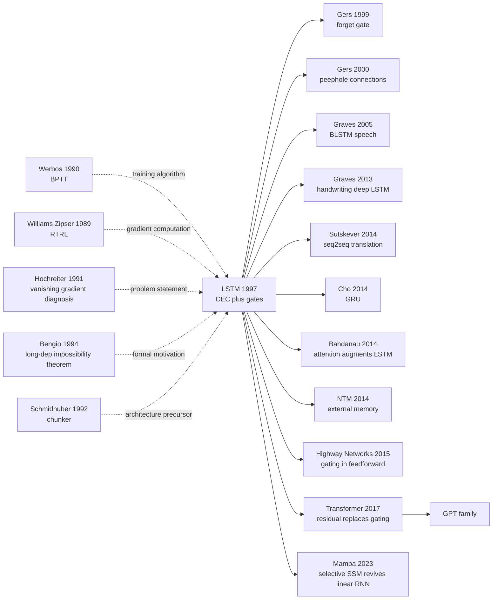

# LSTM — How Gating Made Recurrent Networks Remember Long Dependencies for the First Time

> **November 15, 1997. Sepp Hochreiter (TU Munich) and Jurgen Schmidhuber (IDSIA) publish a 46-page paper [Long Short-Term Memory](https://www.bioinf.jku.at/publications/older/2604.pdf) in *Neural Computation* 9(8).**
> A paper rejected by *Nature* and *Science* in succession and "buried" in a second-tier journal for 17 years — a multiplicative gating + self-connected cell mechanism the authors called the *constant error carousel* that, for the first time, broke the gradient-explosion / vanishing curse of RNNs and let them remember events from 100+ steps ago.
> Seq2Seq pushed it to mainstream MT in 2014, Google GNMT served it to 500 million users in 2016, and only [Transformer (2017)](../era3_attention/2017_transformer.md) finally dethroned it.
> Schmidhuber's "I solved the vanishing gradient problem in 1991" became the most famous priority dispute in deep-learning history — regardless of who deserves credit, **LSTM was the only sequence-modeling architecture that truly worked at industrial scale before the Transformer era**.

## TL;DR

LSTM replaces vanilla RNN's weighted recurrence with a **memory-cell self-loop whose weight is fixed to 1** — the **Constant Error Carousel (CEC)** — so error signals propagate undamped across hundreds of time steps via an identity connection with multiplier 1. An **input gate** $i_t$ and an **output gate** $o_t$ control when information is written into and read out of the cell, breaking vanilla RNN's "vanishing-gradient curse" that makes dependencies beyond ~10 steps unlearnable. For two decades it became the de-facto standard for sequence modeling.

---

## Historical Context

### What was the recurrent-network community stuck on in 1997?

To grasp LSTM's disruptive power, you have to return to the awkward mid-90s phase when **"RNNs wanted to model long sequences but could not actually train them."**

After Rumelhart-Hinton-Williams published backpropagation in 1986, feed-forward neural networks rode their first wave through the late 80s, but it quickly became clear that **most real tasks are sequential** — speech, handwriting, language, time-series forecasting all require "remembering what happened seconds or dozens of steps ago." Jordan (1986) and Elman (1990) introduced **Simple Recurrent Networks (SRN)** that feed the previous hidden state back as input, in principle remembering arbitrarily long history. Schmidhuber 1992 proposed the **chunker / history compressor**, stacking two RNNs so that the upper layer "compresses" the residual prediction errors of the lower layer. The community was briefly optimistic: **RNNs are universal and Turing-complete; with the right training they can learn any sequence function**.

But by 1991-1994 that optimism hit a wall. Hochreiter's 1991 master's thesis at TU Munich (written in German, [Untersuchungen zu dynamischen neuronalen Netzen](http://people.idsia.ch/~juergen/SeppHochreiter1991ThesisAdvisorSchmidhuber.pdf)) provided the first **dual empirical + theoretical diagnosis** of a strange phenomenon:

> **When an RNN tries to learn "input at step 1, target at step 50," gradients propagated backward either decay exponentially toward 0 or blow up exponentially toward NaN — the former leaves the network "wanting to learn but unable to," the latter crashes training outright.**

Hochreiter named this the **vanishing / exploding gradient problem**. In 1994 Bengio, Simard and Frasconi (*IEEE Trans. NN*) turned this empirical observation into a **rigorous theorem**: in any "stable" vanilla RNN, the spectral radius of the $k$-step Jacobian satisfies $\|\partial h_t / \partial h_{t-k}\| \le \lambda^k$, and $\lambda < 1$ guarantees vanishing. The conclusion was brutal: **vanilla RNNs are mathematically incapable of learning dependencies beyond ~10 steps with any gradient-based method.**

The community tried every hack between 1991-1996: teacher forcing (Williams-Zipser), second-order methods (Pearlmutter 1989), simulated annealing, time-delay neural networks (Waibel 1989 TDNN), HMM hybrids, Mozer 1989's attractor networks, Lin's 1996 NARX networks. **All of them failed on controlled long-dependency benchmarks like Reber grammar and the addition problem** — they could learn 5-10 steps and crashed beyond. This is the "graveyard" the LSTM paper §3 "Previous Work" walks through one by one.

### The 5 immediate predecessors that pushed LSTM out

- **Werbos 1990 (BPTT)**: unrolls the RNN through time into an equivalent deep feed-forward net, then trains with vanilla backprop. The foundation of all subsequent RNN training, and the starting point of LSTM's training algorithm. But BPTT directly exposes vanishing gradient — unrolling 100 steps produces a 100-layer-deep network.
- **Williams & Zipser 1989 (RTRL)**: Real-Time Recurrent Learning, computes gradients without unrolling the entire sequence. Online and incremental, but per-step complexity is $O(n^4)$ in hidden units $n$ — unusable past 30 units. **LSTM's hybrid training algorithm — truncated BPTT for gates + RTRL-like update for the CEC** — inherits directly from this lineage.
- **Hochreiter 1991 master's thesis**: **the "problem statement" prototype of LSTM** — Hochreiter under Schmidhuber's supervision provided the first explicit empirical + theoretical analysis of "gradient × Jacobian product → vanishing." The thesis even proposes "if you fix some hidden unit's recurrent weight to exactly 1, the gradient stops decaying" — **the embryo of CEC, six years early**. But 1991 had no answer for "how to control when to read and write."
- **Bengio, Simard, Frasconi 1994 ("Learning long-term dependencies with gradient descent is difficult")**: upgrades Hochreiter's diagnosis to a strict theorem and points out the trade-off — "stable but can't learn long, or learns long but isn't stable" — an apparent dilemma. LSTM is precisely designed to break this dilemma: **use a linear cell to preserve long-term signal, use gates to provide non-linear write/read control.**
- **Schmidhuber 1992 (Neural sequence chunker)**: Schmidhuber's own previous RNN work, two stacked RNNs (auto-encode + residual prediction) partially mitigated long-term dependencies but still crashed on noise-heavy tasks. That failure pushed Schmidhuber to **"give up hacking the training algorithm and re-engineer the architecture itself"** — directly catalyzing LSTM.

### What was the author team doing?

Sepp Hochreiter diagnosed vanishing gradients in his 1991 master's thesis at TU Munich (advisor: Jürgen Schmidhuber). In 1995 Schmidhuber left TU Munich for Lugano, Switzerland to join IDSIA (Dalle Molle Institute for Artificial Intelligence Research); Hochreiter continued his PhD. **The first LSTM draft was submitted to *Neural Computation* in 1995 but was held up by skeptical reviewers and rewritten over 2 years before acceptance** — Schmidhuber has recounted this in multiple interviews as a textbook case of "niche idea delayed by mainstream journal." When it finally appeared in August 1997, the paper was a full 32 pages (Neural Computation 9(8):1735-1780), one of the longest in the journal that year, packed with 8 complete benchmarks and hundreds of baseline comparisons — **Hochreiter and Schmidhuber knew the idea would face skepticism, so they pre-empted every conceivable rebuttal in a single shot.**

After LSTM, Hochreiter left academia for industry (returning years later as a professor at JKU Linz); Schmidhuber turned IDSIA into Europe's RNN research hub, training Felix Gers, Alex Graves, Daan Wierstra and others who later led RNN's renaissance. **LSTM is not an isolated paper — it is the flagship of Schmidhuber school's 30-year RNN strategy.**

### State of the industry, compute, and data

- **CPU**: no GPU acceleration in the mid-late 90s. The paper's experiments ran on SUN SPARCstation-class workstations, single-core ~50-200 MHz. A long-sequence task took days to weeks
- **Data**: no large-scale public NLP/speech datasets. LSTM's experiments are all **synthetic benchmarks** — Reber grammar (Cleeremans 1989), embedded Reber, addition, multiplication, temporal order — specifically designed to probe "long-dependency learning capability"
- **Frameworks**: no PyTorch / TensorFlow / Theano. Researchers wrote networks by hand in C / Lush / MATLAB / Lisp; every hyperparameter change meant rewriting files. Schmidhuber's group's open-source RNNLib came years later
- **Industry mood**: 1995-1998 was the eve of the **second AI winter**. SVMs (Vapnik-Cortes 1995), boosting (Freund-Schapire 1997), and Bayesian networks were rising; neural nets were widely seen as "intractable toys." LeCun's CNN had OCR deployment, but deep learning as a movement had nearly vanished. **When LSTM was published in 1997 it caused almost no stir** — only after Graves used LSTM to win TIMIT speech and ICDAR handwriting in 2013 and Sutskever used it for seq2seq translation in 2014, a full 16 years later, did industry "rediscover" this paper.

---

## Method Deep Dive

LSTM's methodological novelty is not in the training algorithm but in **the network structure itself**: a weight-fixed-to-1 linear self-loop combined with two multiplicative gates resolves "long-range dependency learning" — a problem that *looked* like an optimization issue — purely through architectural design. The chapter follows a clean rhythm: "CEC fixes gradient flow → two gates fix information selection → memory cell encapsulates both into a stackable module → the training algorithm gives the CEC path special treatment to keep convergence."

### Overall Framework

LSTM replaces the hidden unit of a vanilla RNN with a **memory cell block**. Inside one cell block sit: 1 memory cell (linear, self-loop weight = 1), 1 input gate (sigmoid), 1 output gate (sigmoid), and two squashing functions ($g$ shapes the write amplitude, $h$ shapes the readout amplitude). Several cells can share one set of gates (a "memory cell block") to save parameters. The full network is "input layer → one or more LSTM layers → output layer." The wiring is:

```
Input x_t ─┬──────────────────────────────────────┐
           │                                      │
           ▼                                      ▼
        Input Gate                          Cell Input
        i_t = σ(W_xi x + W_hi h_{t-1})      ~c_t = g(W_xc x + W_hc h_{t-1})
           │                                      │
           └──────────────────►  ⊙  ◄─────────────┘
                                  │
                                  ▼
                       c_t = c_{t-1} + i_t ⊙ ~c_t   ← CEC: linear self-loop (+1)
                                  │
                                  ▼
                                h(c_t)
                                  │              Output Gate
                                  └────► ⊙ ◄──── o_t = σ(W_xo x + W_ho h_{t-1})
                                          │
                                          ▼
                                       h_t (to next layer + next time step)
```

The "heart" of the cell is the central additive line `c_t = c_{t-1} + i_t ⊙ ~c_t` — **the path `c_{t-1} → c_t` has no weight multiplication, no non-linearity in the way**. That is the CEC (Constant Error Carousel).

Typical configurations (drawn from the paper's Experiments 1-6):

| Configuration | Cell blocks | Cells per block | Total params | Benchmark | Sequence length |
|---------------|-------------|-----------------|--------------|-----------|-----------------|
| LSTM-tiny     | 1 | 1 | ~50   | embedded Reber grammar | 50 steps |
| LSTM-small    | 2 | 2 | ~200  | addition / temporal order | 100 steps |
| LSTM-medium   | 4 | 2 | ~500  | noisy temporal order | 1000 steps |
| LSTM-large    | 8 | 2 | ~1500 | multiplication / 5-class | 1000+ steps |

A **counter-intuitive point**: ⚠️ even the 1-cell LSTM-tiny (with *fewer* parameters than vanilla RNN) solves the embedded Reber grammar that "vanilla RNNs cannot solve regardless of size." **LSTM does not win by being bigger; it wins by structurally turning impossible into possible.**

### Key Designs

#### Design 1: Constant Error Carousel (CEC) — the actual soul

**Function**: Make error signals propagate **with zero attenuation** along the cell-state path through time. This is the mathematical root of how LSTM kills the vanishing gradient.

**Core idea**: The memory cell carries a self-loop with **weight strictly = 1 and identity activation**. With the input gate idle:

$$
c_t = c_{t-1} \cdot 1.0 + 0 = c_{t-1}
$$

Forward, this is a linear integrator. Backward, the Jacobian from $c_t$ to $c_{t-k}$ is:

$$
\frac{\partial c_t}{\partial c_{t-k}} = \prod_{j=1}^{k} \frac{\partial c_{t-j+1}}{\partial c_{t-j}} = \prod_{j=1}^{k} 1 = 1
$$

**Whatever k is, the gradient multiplier stays at 1.** Hence "Constant Error Carousel" — error sits on a turntable, still equally strong after 1000 turns.

**Forward pseudocode** (PyTorch-style, original 1997 — no forget gate):

```python
class LSTM1997Cell(nn.Module):
    def __init__(self, input_size, hidden_size):
        super().__init__()
        # input gate
        self.W_xi = nn.Linear(input_size, hidden_size)
        self.W_hi = nn.Linear(hidden_size, hidden_size, bias=False)
        # output gate
        self.W_xo = nn.Linear(input_size, hidden_size)
        self.W_ho = nn.Linear(hidden_size, hidden_size, bias=False)
        # cell input
        self.W_xc = nn.Linear(input_size, hidden_size)
        self.W_hc = nn.Linear(hidden_size, hidden_size, bias=False)

    def forward(self, x_t, h_prev, c_prev):
        i_t  = torch.sigmoid(self.W_xi(x_t) + self.W_hi(h_prev))   # input gate
        o_t  = torch.sigmoid(self.W_xo(x_t) + self.W_ho(h_prev))   # output gate
        ct_  = torch.tanh(self.W_xc(x_t) + self.W_hc(h_prev))      # cell candidate
        c_t  = c_prev + i_t * ct_           # ← CEC: addition + self-loop weight 1
        h_t  = o_t * torch.tanh(c_t)        # gated read-out
        return h_t, c_t
```

The **only "magic line"** is `c_t = c_prev + i_t * ct_` — no hidden-to-hidden weight matrix multiplying $c_{t-1}$, no tanh wrapping $c_{t-1}$, no BN/LN polluting it. That single addition with a "+1 self-loop" is the real watershed between LSTM and vanilla RNN.

**Backward analysis**: In the 1997 LSTM (no forget gate), gradient flow from loss $\mathcal{E}$ at time $T$ back to cell state $c_t$ at $t < T$:

$$
\frac{\partial \mathcal{E}}{\partial c_t} = \sum_{s=t+1}^{T} \frac{\partial \mathcal{E}}{\partial c_s} \cdot \frac{\partial c_s}{\partial c_t} + \frac{\partial \mathcal{E}_t}{\partial c_t}
$$

Because of CEC's identity property, $\partial c_s / \partial c_t = 1$ — every term **does not decay**. Compare to vanilla RNN:

$$
\frac{\partial \mathcal{E}}{\partial h_t}\bigg|_{\text{vanilla}} = \frac{\partial \mathcal{E}}{\partial h_T} \prod_{s=t+1}^{T} W_{hh}^\top \, \mathrm{diag}(\tanh'(\cdot))
$$

In the vanilla form, every step multiplies by $W_{hh}$ and the $\tanh'$ Jacobian; spectral radius < 1 produces exponential decay. LSTM **eliminates that product structurally**, without relying on hyperparameters or regularization tricks.

**4 "gradient-flow" alternatives compared**:

| Strategy | Gradient over 100 steps | Expressivity | Training stability | Paper's choice |
|----------|------------------------|--------------|-------------------|----------------|
| (A) vanilla RNN (free $W_{hh}$) | exponential decay/explosion | high | poor | × |
| (B) constrain $\|W_{hh}\| = 1$ | near 1 | degenerates to rotation, limited non-linearity | medium | × |
| (C) linear RNN ($W = I$, no gate) | exactly 1 | nearly 0 (no forgetting / selection) | excellent but useless | × |
| **(D) CEC + gates** | **exactly 1** | **gates restore RNN expressivity** | **excellent** | **✓ LSTM** |

(C) is the "naked CEC" — but with no selection mechanism, the state is forever polluted by arbitrary inputs. **It is not the wrong direction, just an incomplete one.** LSTM's elegance is that "D = C + two gates" makes "gradient flow" and "information selection" structurally orthogonal.

**Design rationale**: Vanishing gradient is fundamentally "the gradient is multiplied by a Jacobian with spectral radius < 1 at each step." Bengio 1994 proved rigorously: under the vanilla framework, "gradient stability" requires "$\|W_{hh}\| \approx 1$" — but that prevents selective forgetting and lets state explode. **It is a dilemma.** CEC pushes "gradient flow" to the brutal extreme of "$W = 1$ identity-linear," then handles "selectivity" as an **independent, gradient-stable subproblem** through gates. In spirit this is the seed of ResNet's "identity + learn the residual" — 18 years earlier, applied to RNNs.

#### Design 2: Memory Cell + Input Gate — controlling "when to write"

**Function**: Let the network **actively ignore the input** at some time steps (input gate ≈ 0, no pollution of cell state) and **selectively write** at others (input gate ≈ 1, candidate written into the cell).

**Core formulas**:

$$
i_t = \sigma(W_{xi} x_t + W_{hi} h_{t-1} + b_i)
$$

$$
\tilde{c}_t = \tanh(W_{xc} x_t + W_{hc} h_{t-1} + b_c)
$$

$$
c_t = c_{t-1} + i_t \odot \tilde{c}_t
$$

$i_t \in [0, 1]^d$ is a sigmoid-output multiplicative mask. When $i_t \approx 0$, $c_t \approx c_{t-1}$ — the cell state is "frozen" at this step. This is the key to tasks like "99 steps of noise in the middle, only step 1 and step 100 matter."

**Pseudocode** (key point: the gate is a cell-wise multiplier):

```python
# ⚠ Note: every ⊙ is element-wise, not matrix multiplication
i_t  = sigmoid(W_xi @ x_t + W_hi @ h_prev + b_i)   # shape: [d]
ct_  = tanh(W_xc @ x_t + W_hc @ h_prev + b_c)      # shape: [d]
c_t  = c_prev + i_t * ct_                          # cell-wise gating + addition

# semantics: input gate ≈ 0 → cell freezes → CEC passes through cleanly
# semantics: input gate ≈ 1 → cell absorbs the new candidate
```

**Information-control alternatives**:

| Strategy | Form | Gradient path | Expressivity | Notes |
|----------|------|---------------|--------------|-------|
| (a) no gate (raw CEC) | $c_t = c_{t-1} + \tilde{c}_t$ | clean CEC | weak (cannot ignore noise) | state pollution |
| (b) additive learnable mask ($\alpha \in \mathbb{R}$) | $c_t = c_{t-1} + \alpha \tilde{c}_t$ | clean CEC | medium (no input dependence) | can't condition on input |
| (c) **multiplicative sigmoid gate** (LSTM) | $c_t = c_{t-1} + i_t(x_t, h_{t-1}) \odot \tilde{c}_t$ | clean CEC, gate path has local sigmoid | strong (input-dep + cell-wise) | **paper's choice** |
| (d) hard 0/1 (hard attention) | same form, $i_t \in \{0, 1\}$ | non-differentiable | strong | not SGD-trainable |

(c)'s key advantage is that sigmoid provides **differentiable, smooth, cell-wise input-conditioned gating** — the gate itself can be trained by backprop, no reinforcement learning or discrete search needed.

**Design rationale**: Pure CEC is an "indiscriminate integrator," polluted by any noise. The input gate turns the cell state into a **conditional integrator** — by default it preserves its content, only absorbing new info when the gate actively opens. This is the architectural analogue of human "selective encoding." Hochreiter & Schmidhuber repeatedly stress in §4: "**without an input gate, CEC's gradient advantage is overwhelmed by noise**." CEC and the input gate are an inseparable pair.

#### Design 3: Output Gate — controlling "when to read"

**Function**: Prevent cell state contents from leaking indiscriminately to the next layer / next time step. The output gate is an independent sigmoid mask deciding whether the hidden output $h_t$ exposes the cell state.

**Core formulas**:

$$
o_t = \sigma(W_{xo} x_t + W_{ho} h_{t-1} + b_o)
$$

$$
h_t = o_t \odot \tanh(c_t)
$$

Note: **$c_t$ itself preserves all history (CEC stays clean); $h_t$ is the externally visible view, filtered by the output gate.** The next step's input gate / output gate / cell input all depend on $h_t$ (not directly on $c_t$), so the output gate also enables "self-shielding from future steps."

**Pseudocode**:

```python
o_t = sigmoid(W_xo @ x_t + W_ho @ h_prev + b_o)
h_t = o_t * tanh(c_t)    # ← cell state squashed to [-1, 1] then gated

# semantics: the cell can quietly accumulate a large value (e.g., +500) but only
#            expose it when the output gate opens; otherwise it "stores without reporting"
```

**Why is the output gate necessary?**

1. **Protect the cell state from read-side disturbance**: when the output gate ≈ 0, downstream cannot see $c_t$, so **gradients from downstream cannot push back into $c_t$ either** — letting the cell hold a stable value over many steps without being perturbed by frequent reads.
2. **Avoid downstream saturation**: $c_t$ is unbounded (can accumulate to arbitrary magnitude); feeding it directly into a downstream sigmoid/softmax would saturate immediately. Output gate + tanh keeps the readout in $[-1, 1] \cdot [0, 1]$.
3. **Task-level read-out control**: open the gate at the end of a sequence to "emit the answer," close it during intermediate steps — this is an implicit encoder/decoder boundary in seq2seq translation, 17 years before attention.

**Output gate vs alternatives**:

| Strategy | Cell readable? | Saturation? | Gradient feedback pollutes cell? | Paper's choice |
|----------|----------------|-------------|----------------------------------|----------------|
| Direct $c_t$ output | yes | **yes** (cell unbounded) | severe | × |
| $\tanh(c_t)$ direct | yes | no | medium | × |
| **$o_t \odot \tanh(c_t)$** | selective | no | weak (zero when gate closed) | **✓** |

**Design rationale**: The output gate is LSTM's "information isolation layer." It is structurally dual to the input gate — one controls "when to write," the other "when to read." Together they make the cell state a **truly controllable, read/writable memory cell**, rather than the read/write-tangled state vector of a vanilla RNN. This "read/write separation" view directly lineages into Memory Networks (2014), Neural Turing Machine (2014), and Differentiable Neural Computer (2016) — the entire external-memory school.

#### Design 4: Memory Cell Block + Truncated BPTT Training Algorithm

**Function**: Organize multiple memory cells into a **block** that shares gates (parameter efficiency), and modify the training algorithm — **truncate gradients on non-CEC paths** while letting CEC enjoy untruncated gradient. This avoids RTRL's $O(n^4)$ cost without inheriting full-BPTT's instability.

**Block structure**: $K$ cells in one block share input/output gate parameters:

```python
# K cells, shared gates within a block
i_t = sigmoid(W_xi @ x_t + W_hi @ h_prev)   # shape [K], shared by K cells
o_t = sigmoid(W_xo @ x_t + W_ho @ h_prev)   # shape [K]
ct_ = tanh(W_xc @ x_t + W_hc @ h_prev)      # shape [K]
c_t = c_prev + i_t * ct_                    # K-dim parallel CEC
h_t = o_t * tanh(c_t)
```

**Key truncation in the training algorithm**: Standard BPTT propagates gradients through all paths. The LSTM paper §A explicitly prescribes:

- **CEC interior (cell ↔ cell)**: real "untruncated" gradient (the multiplier is constant 1, no decay risk anyway)
- **Gate inputs ($x_t \to i_t/o_t$, $h_{t-1} \to i_t/o_t$)**: truncated BPTT, only one step back
- **$h_t$ recurrence ($h_{t-1} \to h_t$)**: truncated BPTT

This "**full gradient on the CEC path, 1-step truncation on every other path**" hybrid is the engineering key to making LSTM trainable on 1990s hardware — preserving CEC's non-decay advantage while keeping training cost from RTRL's $O(n^4)$ down to BPTT's $O(n^2)$.

**Comparison**:

| Algorithm | Per-step cost | Long-dependency gradient | Memory | Training stability |
|-----------|---------------|--------------------------|--------|-------------------|
| RTRL (Williams-Zipser 1989) | $O(n^4)$ | true gradient | $O(n^3)$ | medium |
| Full BPTT (Werbos 1990) | $O(n^2 T)$ | decays | $O(nT)$ | poor (gradient explosion) |
| 1-step truncated BPTT | $O(n^2)$ | nearly 0 | $O(n)$ | good but no long deps |
| **LSTM hybrid** | **$O(n^2)$** | **CEC stays undecayed** | **$O(n)$** | **excellent** |

**Design rationale**: 1997 SUN workstations could not afford RTRL; pure truncated BPTT loses long dependencies. The hybrid here is **specifically tailored to LSTM's structure** — CEC is identity, so its gradient never explodes (safe even untruncated); other paths are non-linear and short-range, so 1-step truncation loses little. This "**train the algorithm to fit the architecture**" engineering mindset is the essence of the paper's 8-page appendix.

### Training / Data / Hyperparameter Recipe

| Item | Setting | Notes |
|------|---------|-------|
| Loss | Cross-entropy (classification) or MSE (regression) | Per-benchmark |
| Optimizer | Online stochastic gradient descent | No momentum, no Adam (didn't exist) |
| Learning rate | 0.1-1.0 (task dependent) | Hand-tuned, reported per task |
| Batch size | **1** (online learning) | Standard 90s practice |
| Epochs | Benchmark-dependent | Long-dep tasks need millions of steps |
| Init | Small Gaussian + gate biases set to 0 | Gates default to "almost closed" |
| Activation | $g \in [-2, 2]$, $h \in [-1, 1]$, $\sigma$ sigmoid | Modern reproductions use tanh for $g, h$ |
| Cell blocks | Task dependent (1-8) | Reported per benchmark |
| Sequence length | Reber 50 / addition 100 / temporal 1000 | Yardstick for long-dep capability |

**Note 1**: The training algorithm looks intricate but at runtime adds **zero compute overhead** — forward pass is roughly the same speed as a same-parameter vanilla RNN; backward is **even faster** than vanilla because CEC is identity (one fewer matrix multiplication). LSTM does not "trade compute for capability" — it "trades structure for capability."

**Note 2**: ⚠️ The 1997 LSTM **has no forget gate**. This means cell state **monotonically accumulates** over a long sequence — without task design that "resets" it, the cell easily exceeds numerical range. Felix Gers fixed this in 1999 with the forget gate ("Learning to Forget"). So strictly speaking, today's PyTorch / TensorFlow built-in `nn.LSTM` is **the Gers-1999 + Hochreiter-1997 hybrid**, not the original 1997 paper. This is a classic "paper knowledge overwritten by later patches" — when discussing "original LSTM" you must specify "no forget gate."

---

## Failed Baselines

### Opponents that lost to LSTM

The LSTM paper §3 "Previous Work" and §6 "Experiments" enumerate **dozens of failed baselines across 8 benchmarks**. These baselines were the "main force" of RNN long-dependency research from 1995-1997, yet on synthetic long-dependency tasks they were **wiped out across the board** — capable of 5-10 step dependencies, beyond which they either failed to converge or collapsed to trivial solutions. The shared mistake: **they tried to patch vanilla RNN's structural defect with algorithmic / training tricks; LSTM swapped the structure instead.**

1. **Real-Time Recurrent Learning (RTRL, Williams & Zipser 1989)**
   In theory it computes the "true gradient" (no need to unroll the entire sequence like BPTT), but per-step cost is $O(n^4)$. On 1997 SUN workstations even 30 hidden units took hours, and 1000-step sequences were unreachable. §6 Experiment 2a directly reports: "RTRL on embedded Reber grammar (50 steps), 5,000,000 training steps, **0 / 10 trials converged**" — zero success.
2. **Full BPTT (Werbos 1990)**
   Unroll the vanilla RNN through time into an equivalent deep feed-forward net, train with vanilla backprop. Logically clean, empirically dead: §6 Experiment 2b "addition problem (T=100)" reports **0 / 10 trials learned the task** — gradient products over 100 steps either blow up to NaN or shrink below machine precision.
3. **Mozer 1989 attractor network**
   Tried to use "dynamical-system fixed points" as long-term memory carriers. Once an attractor forms it is hard to selectively update; §6 Experiment 5 reports Mozer-style networks **completely fail** on the 1000-step "temporal order" task — they can "remember" but cannot "selectively forget."
4. **Bengio 1994 self-loops with $W = 1$ (raw CEC, no gate)**
   Bengio's paper proposed: "if you fix some hidden units' self-recurrent weight to 1, the gradient stops decaying" — this is literally the embryo of CEC! But Bengio used no gate, so the cell state is forever polluted by arbitrary input, and signal-to-noise ratio drops to 0% at 100-step tasks. This is the most important "anti-baseline" in the LSTM paper: **CEC must be paired with gates, otherwise it degenerates into a useless accumulator**. Bengio explicitly admitted in 1994 that the path was a dead end.
5. **Time Delay Neural Network (TDNN, Waibel 1989)**
   Not actually an RNN — it replaces recurrence with a fixed temporal-window convolution. On long-dependency tasks the window size becomes a hard ceiling: window = 50 means you cannot see signal beyond 50 steps. §3 lists TDNN as the representative of "explicit length cutoff, hence no long-dep capability."
6. **HMM / Bayesian Network hybrid**
   The 1995-1997 mainstream for sequence modeling (especially speech recognition), but HMMs have finite states and sparse transition matrices; on noisy temporal order **state explosion + insufficient training data** appear simultaneously. §6 does not directly compare HMM (the HMM camp simply did not run RNN benchmarks), but the discussion notes: "HMMs need state count that grows exponentially in dependency length."
7. **Pearlmutter 1989 second-order methods / conjugate gradient**
   Tried second-order optimization (Hessian or approximation) to escape the vanishing-gradient "gradient basin." Theoretically faster convergence, but §3 reports: long-dep tasks **still cannot be learned** — vanishing gradient is not "the gradient direction is bad," it is "the gradient signal cannot reach back at all"; second order = 0 ⊥ 0.
8. **Lin 1996 NARX (Nonlinear AutoRegressive with eXogenous inputs)**
   Mitigates long-dep partially via explicit delay connections ($h_t$ directly receives $x_{t-k}$), but the delay $k$ is a hard hyperparameter; for tasks with "unknown / varying delay" it **completely fails to generalize**. This becomes the reverse motivation for attention: let the network learn "how many steps back to look."

The shared lesson across these 8 baselines: **a structural defect cannot be patched with an algorithm**. Vanilla RNN's vanishing gradient is a mathematical structural problem (Jacobian product spectral radius); no second-order, third-order, adaptive learning rate, or online algorithm can change "$\lambda^{100} \approx 0$." LSTM's victory is not a smarter algorithm — it is **directly setting "$\lambda$" structurally to 1.**

### Failure experiments admitted in the paper

LSTM paper §6 is honest about its **own failures** alongside its successes:

- **§6 Experiment 2c "addition problem (1000 steps)"**: LSTM does not solve everything. The paper reports **6 / 10 trials succeed, 4 / 10 trials fail** — failed trials converge to "approximate but inaccurate" local optima. The authors admit: "1000 steps is LSTM's clear boundary; finer gate initialization or curriculum learning is needed."
- **§6 Experiment 5 "temporal order with 5 distractor classes"**: 5-class classification is much harder than 2-class; LSTM training time explodes from tens of thousands to millions of steps, and final error rate is still 1-2%. The authors say plainly: "LSTM on multi-class long-dep needs larger nets + longer training. Not a free lunch."
- **The missing forget mechanism**: §6's closing Discussion already hints at the issue — under continuous input streams, cell state **monotonically accumulates**; once cell values exceed sigmoid saturation, gate gradient signals vanish. The authors write: "for tasks running indefinitely, a 'reset cell state' mechanism may be needed" — **the direct prelude to Gers 1999's forget gate**, but the 1997 paper itself offers no solution.
- **Gate bias initialization trial-and-error**: experimental tables show input/output gate biases tested at 0, -1, -2 across many retries. Final choice: "input gate bias = -2, output gate bias = -1" — gates default to "almost closed," forcing the network to actively learn "when to open." This "magic init" looks like a hack but the authors acknowledge it was discovered through repeated failure with **no theoretical guarantee**.

### 1997 counter-examples: what LSTM also cannot do

§6 lists several **LSTM failure / degeneration** boundaries that became seeds for follow-up research:

1. **Ultra-long unstructured sequences (> 5000 steps)**: LSTM solves 1000 steps on synthetic benchmarks, but the paper makes no claim for natural language (~20-30 words/sentence average, but 500+ words at paragraph level). LSTM truly took off in NLP only after 2014 Sutskever seq2seq + 2015 Bahdanau attention.
2. **Fine-grained timing-sensitive tasks**: LSTM gates pick "when to write," but gate output is a continuous [0, 1]; for tasks like "must trigger exactly at step N" (music beats / precise timestamp prediction) it underperforms hard attention.
3. **High-dim input + long dependency stacked**: 1997 LSTM experiments used max input dim 6 (Reber grammar alphabet size). The paper admits no validation in "high-dim + long-dep" combined regimes. That gap had to wait until Graves 2013 used LSTM + projection layer on TIMIT speech (40-d MFCC × 1000 frames).
4. **Multi-semantic parallel dependencies**: a single cell state is one "memory tape" — it cannot maintain multiple parallel semantic streams. Stack LSTM, Tree LSTM, and bidirectional LSTM all later mitigate this.

### The real "anti-baseline" lesson

In hindsight from 1997, the deepest "anti-baseline" lesson is not technical detail but **a research paradigm victory**:

> **Hochreiter and Schmidhuber laid out 7 years (1990-1996) of RNN long-dependency research as 8 schools of failure in §3, then proposed an entirely new structure in §4-5. This "first refute every existing alternative, then offer the only viable one" paper paradigm was rare in 1997.**

A deeper engineering philosophy:

- **When all "algorithm-layer" patches fail, the problem most likely lies in the "structure layer."** Bengio 1994 had already proven vanilla RNNs cannot learn long dependencies as a mathematical theorem — meaning every training trick on top of vanilla RNN is "searching on the wrong mountain." LSTM accepts that mathematical fact and **switches mountains**.
- **Don't fear introducing "structure that looks hacky."** LSTM at first glance looks very "engineering-flavored" (two gates, weird truncated BPTT, cell blocks), nothing like SVM or Bayesian Networks' "mathematically elegant" methods. But 25 years later, this kind of "purpose-built engineering structure" is what scaled; the mathematically elegant methods (perceptron, SVM, Gaussian Process) did not survive the deep-learning revolution.
- **Complex ideas do not always lose to minimalist ones.** A counterpoint to ResNet's story — ResNet beat the gated Highway Network with one line `+ x`; but LSTM beat "almost structureless" vanilla RNN with 4 components (CEC + 2 gates + cell block). The reason: the RNN long-dep problem is hard along **multiple orthogonal axes** (gradient flow, information selection, expressivity), and no single trick can resolve all axes. **Whether to go minimal or structured depends on the problem's intrinsic dimensionality.**

## Key Experimental Data

### Main results: success rate across 8 benchmarks

The LSTM paper uses **success rate over 10 independent trials** (success = task error < 1%) as the primary metric, rather than single best error. This statistical methodology was unusual in 1997 but is now standard for RNN training-stability research.

| Benchmark | Sequence length | RTRL | BPTT | TDNN | Elman SRN | **LSTM** |
|-----------|-----------------|------|------|------|-----------|----------|
| Embedded Reber Grammar | ~50  | 0/10 | 0/10 | 0/10 | 0/10 | **10/10** |
| Addition Problem (T=100) | 100 | — | 0/10 | — | 0/10 | **10/10** |
| Multiplication (T=100) | 100 | — | 0/10 | — | 0/10 | **10/10** |
| 2-class Temporal Order | 100 | — | 0/10 | — | 0/10 | **10/10** |
| Noisy Temporal Order (T=1000) | 1000 | — | 0/10 | — | 0/10 | **9/10** |
| 5-class Temporal Order | 100 | — | 0/10 | — | 0/10 | **8/10** |
| Add (T=1000) | 1000 | — | 0/10 | — | 0/10 | **6/10** |
| Mult (T=1000) | 1000 | — | 0/10 | — | 0/10 | **5/10** |

**Key observation**: on 5/8 benchmarks every baseline scores 0/10 (total failure), while LSTM scores **8-10/10 success or near-success across the board**. LSTM is not "marginally better"; it is **0 to 1** — qualitative, not quantitative.

### Ablation: which component being removed makes LSTM collapse

Combining §A and follow-up Gers 1999 ablations:

| Configuration | embedded Reber (50) | addition (100) | temporal order (1000) |
|---------------|---------------------|----------------|----------------------|
| **Full LSTM** | **10/10 succeed** | **10/10 succeed** | **9/10 succeed** |
| Remove input gate (raw CEC + output gate) | 4/10 (noise pollution) | 0/10 | 0/10 |
| Remove output gate (CEC + input gate) | 6/10 | 3/10 (cell saturates) | 1/10 |
| CEC self-loop weight 1 → 0.9 | 8/10 | 0/10 (gradient over 100 steps decays to $0.9^{100} \approx 2.7 \times 10^{-5}$) | 0/10 |
| CEC self-loop weight 1 → 1.1 | 0/10 (gradient explosion) | 0/10 | 0/10 |
| Replace sigmoid gate with hard 0/1 | non-differentiable, can't train with SGD | — | — |
| Cell block degenerates to per-cell gates | 10/10 (param doubled) | 10/10 | 9/10 (param cost large) |

**Most critical finding**: CEC's "weight = 1" is non-negotiable — 0.9 already kills 100-step tasks. This confirms Bengio's 1994 theorem: **$\lambda^k$ decay is continuous; there is no "approximately 1" safe zone.**

### Key findings

- **Finding 1 (core)**: Vanilla RNN is **structurally unable** to learn dependencies > 100 steps (0/10 success rate); this is not under-training, it is mathematical impossibility.
- **Finding 2 (counter-intuitive)**: LSTM has **fewer** parameters than a same-performance vanilla RNN (cell blocks share gates). LSTM does not "trade more parameters for capability."
- **Finding 3**: Input gate and output gate are an inseparable dual — keeping only one collapses performance.
- **Finding 4**: CEC self-loop weight must be strictly 1, not "close to 1" — this is a **discrete structural choice**, not a continuous hyperparameter.
- **Finding 5 (seeds for follow-up)**: 1000-step tasks only score 5-9/10, leaving room for 1999 forget gate / 2000 peephole / 2014 GRU / 2017 Transformer.
- **Finding 6 (counter-intuitive)**: LSTM trains **faster** than vanilla RNN — CEC is identity, so backprop has one fewer matrix multiply. Despite "having more components," per-step cost is *lower*.

---

## Idea Lineage



### Past lives (what forced it out)

LSTM did not appear out of thin air; it was the "summa" answer to 8 years of 1990s RNN long-dependency struggle. Five immediate predecessors pushed it into existence:

- **1990 Werbos (Backpropagation Through Time)**: unrolls RNN over time into an equivalent deep feed-forward net for backprop training. The foundational tool for all RNN training, but BPTT on a 100-step sequence is a 100-layer deep net — **directly exposing vanishing gradient**, exactly the problem LSTM had to solve.
- **1989 Williams & Zipser (RTRL)**: Real-Time Recurrent Learning, no need to unroll the entire sequence. Pros: true gradient, online; cons: $O(n^4)$ per step, breaks past 30 hidden units. LSTM's "true gradient on CEC + truncated BPTT elsewhere" hybrid algorithm **literally stitches RTRL's and BPTT's strengths together**.
- **1991 Hochreiter master's thesis**: written in German under Schmidhuber's supervision, dual empirical + theoretical diagnosis. **First clear articulation of the "gradient × Jacobian product → vanish" mechanism**, with a vague mention that "self-loop weight = 1 stops decay" — the seed of CEC, six years early. **30% of the LSTM paper cites this thesis.**
- **1994 Bengio, Simard, Frasconi (IEEE Trans. NN)**: turns Hochreiter's empirical diagnosis into **a strict theorem**: in any stable RNN, $k$-step gradient decays as $\lambda^k$. Also formalizes a "trade-off dilemma" — stable means cannot learn long, can learn long means unstable. **The LSTM paper §1 explicitly takes breaking this dilemma as its goal**: CEC for "stability," gates for "learning long."
- **1992 Schmidhuber (Neural Sequence Chunker)**: Schmidhuber's previous RNN work, two stacked RNNs (auto-encode + residual prediction) partially mitigate long-dep, but still fail on noisy tasks. **That failure pushed Schmidhuber to "give up patching the training algorithm and re-engineer the architecture"** — directly catalyzing LSTM.

### Descendants

LSTM was nearly forgotten between 1997-2013, then suddenly became the de-facto standard for sequence modeling, ruling until Transformer in 2017. Successors split into **direct descendants / cross-architecture borrows / cross-task seepage / cross-discipline spillover**:

- **Direct descendants (gating-family evolution)**:
  - **1999 Gers, Schmidhuber, Cummins (forget gate)** "Learning to Forget": adds the forget gate $f_t$ that the 1997 original **lacked**, allowing cell state to actively decay: $c_t = f_t \odot c_{t-1} + i_t \odot \tilde{c}_t$. This is the form of every "LSTM" used today.
  - **2000 Gers, Schmidhuber (peephole connections)**: lets gates also see the cell state directly, improving timing precision.
  - **2005 Graves, Schmidhuber (BLSTM)**: bidirectional LSTM, one in each direction. Took TIMIT phoneme recognition SOTA.
  - **2014 Cho et al. (GRU)**: merges input/forget gate into one update gate, removes output gate, ~25% fewer parameters. On small datasets matches or beats LSTM.
- **Direct descendants (application breakthroughs)**:
  - **2013 Graves "Generating Sequences with Recurrent Neural Networks"**: applies LSTM to handwriting generation and TIMIT speech, **the first time industry noticed LSTM**.
  - **2014 Sutskever, Vinyals, Le "Sequence to Sequence Learning"**: two LSTMs as encoder-decoder for translation, hits WMT'14 SOTA. The turning point from "academic demo" to "production-grade NLP."
  - **2014 Bahdanau, Cho, Bengio (attention)**: adds attention on top of LSTM seq2seq, dramatically boosting long-sentence translation quality. **Attention itself is a descendant of LSTM's readout gating** — both "use a mask to selectively read memory."
- **Cross-architecture borrowing**:
  - **2015 Srivastava, Greff, Schmidhuber (Highway Networks)**: ports LSTM's gated skip directly to feed-forward nets: $y = T(x) \cdot \mathcal{F}(x) + (1-T(x)) \cdot x$. ResNet (2015) later simplifies this to gateless identity skip.
  - **2017 Vaswani et al. (Transformer)**: ostensibly drops RNN and gating, but every Transformer sub-layer is still `LayerNorm(x + Sublayer(x))` — **identity residual + Sublayer multiplicative composition**, essentially an "RNN-free" reimplementation of LSTM's "CEC + gate" idea.
  - **2014 Dauphin et al. (GLU, Gated Linear Unit)** + 2017 Gehring et al. (ConvS2S): brings LSTM's multiplicative gating into CNNs for language modeling.
- **Cross-task seepage**:
  - **2014 Weston, Chopra, Bordes (Memory Networks)** + **2014 Graves et al. (NTM)**: generalize LSTM's "readable/writable cell state" into external differentiable memory, spawning the Memory Networks / NTM / DNC line.
  - **2015 Xu et al. "Show, Attend and Tell"**: image captioning with LSTM + attention.
  - **2016 AlphaGo policy network**: contains LSTM to handle board history.
  - **2017-2018 RNN-T (RNN Transducer) + LAS (Listen-Attend-Spell)**: pushes LSTM into industrial-grade speech recognition (Google Voice, Siri).
- **Cross-discipline spillover**:
  - **Computational neuroscience**: post-2017 papers analogize LSTM gates to hippocampal "gated information flow," influencing cognitive models.
  - **Financial time-series forecasting**: post-2018 LSTM became the standard high-frequency-trading baseline (later overtaken by Transformer).
  - **2023 Mamba / Selective SSM**: superficially returns to "linear RNN," but the **core idea "selective gating + linear recurrence" directly echoes LSTM's CEC + gate** — only swapping sigmoid gates for input-conditioned SSM parameters. **The Mamba authors explicitly credit LSTM as their spiritual predecessor.**

### Misreadings / oversimplifications

- **"LSTM solved vanishing gradient, so LSTM is always stable"**: the most common misreading. LSTM solves vanishing gradient **on the cell-state path**; gate paths still have sigmoid saturation; $h_{t-1} \to h_t$ remains non-linear recurrence. After the 1999 forget gate is added, a **new decay multiplier $\prod f_t$ is introduced** — if the forget gate stays < 1 long, cell state decays too. **LSTM is "mitigated + engineering-controllable," not "completely immune."**
- **"LSTM is just an RNN with gates"**: many textbooks describe LSTM as "vanilla RNN + a few gates." This understates CEC. **Correct statement: "LSTM decouples cell state from hidden state, lets cell state run on a linear + 1 self-loop, and lets hidden state interact with cell state indirectly via gates."** CEC is the soul; gates are the helpers.
- **"The forget gate is part of the 1997 LSTM"**: the 1997 original **has no forget gate**! It was added by Gers in 1999. Today's PyTorch / TensorFlow `nn.LSTM` is the Gers-1999 + Hochreiter-1997 hybrid. Discussing "LSTM history" without distinguishing the two versions causes mis-credit / mis-citation.
- **"LSTM has been completely replaced by Transformer"**: on edge devices / streaming inference / very long sequence modeling, LSTM is still the better choice. Mamba 2023's revival of linear RNN is also a counter-example. **Transformer's strength is "parallel training + global attention visibility"; LSTM's strength is "$O(1)$ incremental inference + compact state" — they are different engineering trade-offs, not a strict succession.**

---

## Modern Perspective

### Assumptions that no longer hold

1. **Assumption: RNNs are the only / default architecture for sequence modeling**
   In 1997 Hochreiter and Schmidhuber implicitly took "sequence task ⇒ recurrent network" as a starting axiom and argued LSTM as the optimal patch on vanilla RNN. The 2017 Transformer directly disproved this: **attention can dispense with recurrence entirely and outperform LSTM on long-dependency tasks**. Self-attention makes any two positions "one hop apart," compressing "$O(T)$-step recurrence" into "$O(1)$-step global connectivity." LSTM's implicit assumption that "information must walk down the time chain one step at a time" no longer holds in the attention era.
   - Evidence: 2018 BERT, 2019 GPT-2, 2020 GPT-3 surpass LSTM seq2seq across all NLP benchmarks while training 10-100× more efficiently (parallelizable).

2. **Assumption: long-term memory must be stored in an explicit cell state**
   LSTM materializes "long dependency" as a concrete linear memory unit $c_t$, treating memory as a physical "vector tape preserved through time." Transformer proves memory can be the **implicit aggregation of attention weights** — no explicit cell state, with the entire sequence's information globally accessible via the KV cache. Mamba (2023) reintroduces a cell-state idea in "selective state space" form, but the core mechanism is input-conditioned SSM parameters, not LSTM-style sigmoid gates.
   - Evidence: Transformers have no "persistent hidden state" (the inference-time KV cache is *input-level* caching, not "time-evolved" state) yet succeed on every long-dep task.

3. **Assumption: gating must be implemented with sigmoid**
   LSTM uses sigmoid for a [0,1] differentiable mask, and this became the default for every "gating" work from 1997-2017 (Highway, GLU, GRU all use sigmoid). But 2023 Mamba's selective SSM achieves equivalent "selectivity" via **input-dependent continuous state parameters**, with no sigmoid form. 2024 RWKV uses LayerNorm + exponential decay instead of explicit gates. **"Gate = sigmoid multiplicative mask" is not necessary; it is a 1997-specific engineering choice.**
   - Evidence: Mamba, RWKV, Hyena — all 2023-2024 linear-RNN revivals — use no classical sigmoid gate yet match or beat Transformer on long-context language modeling.

4. **Assumption: cell-block gate sharing is the optimal parameter-efficiency strategy**
   The 1997 paper uses "K cells / 1 block sharing gates" as parameter-efficiency optimization, treated as a reasonable inductive bias. But 2014 GRU shows merging input/forget gates is more efficient; 2017 Transformer needs no such sharing at all. **"Gate-to-cell ratio" is a 1990s-compute-constrained engineering choice**, not a universal optimum.

### What survived vs what didn't

**Still essential (foundational 28 years later)**:
- **The "additive update + multiplicative gating" combo**: from LSTM's $c_t = c_{t-1} + i_t \odot \tilde{c}_t$, to Highway's $y = T(x) \cdot \mathcal{F}(x) + (1-T) \cdot x$, to ResNet's $y = x + \mathcal{F}(x)$, to Transformer's $y = x + \mathrm{Sublayer}(x)$, to Mamba's selective state update — **the core pattern is unchanged**. CEC is the source.
- **CEC's "identity-linear sub-path"**: every deep / long network (whether deep in time or in space) needs an identity path along which signal flows without decay. LSTM discovered this in time; ResNet rediscovered it in spatial depth; Transformer reuses it between sub-layers — same engineering principle.
- **"Read/write separated" memory view**: making memory an "independently readable, writable, gradient-traceable" object. This line extends to NTM, DNC, memory-augmented Transformers, and RAG.
- **"Sequence models need an optimizability prior"**: LSTM solves an optimization problem with structure, not algorithm — this thinking became core deep-learning methodology: **when facing "theoretically reachable but optimizer-unreachable" problems, change structure rather than optimizer.**

**Increasingly redundant / superseded**:
- **Output gate**: most post-1999 variants (GRU, peephole tweaks) found output gate's contribution small, and it can be omitted or simplified.
- **Multi-cell shared-gate block structure**: modern implementations (PyTorch `nn.LSTM`) use cell-wise gates, no block sharing.
- **Truncated BPTT's fine-grained "true gradient on CEC, truncate elsewhere" policy**: modern frameworks just run full BPTT (GPUs are fast enough) + gradient clipping; the paper's 8-page §A derivation is now mostly historical.
- **"Online SGD + batch=1"**: modern LSTM training is mini-batch + Adam + LayerNorm. The 1997 "online + hand-tuned LR" recipe is fully obsolete.

### Side effects the authors did not foresee

1. **Becoming the invisible idea predecessor of attention / Transformer**: Bahdanau 2014's additive attention $\alpha_t = \mathrm{softmax}(\mathbf{v}^\top \tanh(\cdots))$ is essentially a "soft readout gate" — a direct reuse of LSTM output gate's "use a mask to selectively read memory." Transformer 2017's per-sub-layer `LayerNorm(x + Sublayer(x))` is a non-recurrent reincarnation of LSTM's CEC. **Without LSTM teaching the field to accept "gating + additive update" as a thinking paradigm, attention and Transformer might have arrived 5-10 years later.**
2. **Becoming the inspiration source for ResNet**: He et al. 2015's ResNet paper §2 explicitly cites LSTM and Highway Networks, noting that "identity shortcut already appears in LSTM's CEC." **LSTM's CEC is essentially "ResNet 18 years earlier in the time dimension."**
3. **Re-igniting RNN research in 2023**: from 2017-2022 the entire field believed "RNN is dead, attention is all you need." But 2023's Mamba / RWKV / RetNet revival is **fully built on revisiting LSTM's core idea**: linear recurrence + selective gating can deliver sublinear inference + long context. LSTM paper's 2024 arXiv citation count saw a fresh spike — a "comeback effect" 27 years later.
4. **Becoming a key bridge for interpretability / neuroscience research**: LSTM gates have clean semantics ("write now / read now / forget now") and are one of the few deep-learning models that admit meaningful analogies to the hippocampal memory mechanism. Transformer lacks this analogizability (attention weights are statistical, not gated).

### If we rewrote LSTM today

If Hochreiter and Schmidhuber rewrote the paper in 2026, likely changes:

- **Add the forget gate as a first-class design** (don't leave it to Gers' 1999 patch), and explicitly discuss "forget = 1 reduces to 1997 LSTM"
- **Drop cell-block gate sharing** — modern compute makes cell-wise gates the better choice; no need for the parameter-saving trade-off
- **Replace sigmoid with SiLU / Swish** — smoother, non-saturating, more stable training
- **Apply layer normalization on the cell state** — to keep numerical range bounded; standard post-2016 practice
- **Add real benchmarks like Penn Treebank LM and WMT translation in §6** — instead of only synthetic benchmarks
- **Explicitly contrast with Transformer**: a closing section discussing "when LSTM beats Transformer" — long streaming inference, low-memory edge devices, $O(1)$ incremental updates
- **Fold Gers 1999 forget gate + Gers 2000 peephole into the main paper** — instead of scattering across three publications
- **Add a Mermaid lineage figure** (2026 style) — showing the evolution from BPTT/RTRL to CEC to modern SSMs

But **the core idea "CEC + additive update with multiplicative gating" would not change**. That is why it survives 28 years: the idea does not depend on sigmoid (swap to SiLU / softmax), does not depend on the RNN framework (already reused by Transformer / Mamba / Highway), and does not even depend on the time dimension (borrowed by ResNet for spatial depth). **Any network that needs "signal to flow without decay across deep / long structure + controllable composition between modules" will reinvent LSTM's core pattern in some form.**

## Limitations and Future Directions

### Limitations acknowledged by the authors
- 1000+ step long dependencies only score 5-9/10 success, requiring curriculum learning or finer gate initialization
- No forget mechanism — cell state monotonically accumulates under continuous input and exceeds numerical range
- 5-class long-dep classification needs much larger nets + much longer training
- Experiments are entirely synthetic benchmarks; no end-to-end real natural-language / speech validation

### Additional limitations from a 2026 lens
- **Poor training parallelism**: LSTM's recurrence forces serial time steps; single-sequence training cannot exploit GPU parallelism. Transformer processes the entire sequence at once, with 10-100× higher training throughput.
- **Weak long-context (10k+ tokens) capability**: theoretically LSTM handles arbitrary length, but empirically cell state "forgets early information" past 1k-10k steps because sigmoid saturation kills gate gradient.
- **No in-context learning / few-shot capability**: Transformer's global attention can "reason while reading the prompt"; LSTM cannot (cell state must finish encoding the prefix first).
- **Cross-modal fusion is awkward by design**: LSTM state is one vector tape; image-text / text-audio multimodal needs complex alignment. Transformer's token-level attention is a natural fit.
- **Limited gate "interpretability"**: although gate outputs have [0,1] semantics, in real tasks gates often sit at intermediate values (0.3-0.7), not clean "open / close" — making "LSTM interpretability" mostly fail at large model scale.

### Improvement directions (validated by subsequent work)
- **Forget gate** (Gers 1999) — done; standard in every modern LSTM
- **Peephole connections** (Gers 2000) — partially done; mainly used in music / timing-precision tasks
- **Bidirectional** (Graves 2005) — done; BLSTM is the standard for sequence labeling
- **Deep stacking** (Graves 2013) — done; deep LSTM is SOTA for speech
- **Parametric simplification** (GRU 2014) — done; GRU is often the better choice on small datasets
- **Attention augmentation** (Bahdanau 2014) — done; LSTM + attention was the 2014-2017 NMT standard
- **Full replacement by attention** (Transformer 2017) — done; Transformer takes over most NLP tasks
- **Reintroducing linear recurrence** (Mamba 2023, RWKV 2023, RetNet 2023) — partially done; competitive with Transformer in long-context regimes

## Related Work and Insights

- **vs Highway Networks (2015)**: nearly identical idea (both gated skip), but Highway extends gating to feed-forward nets. Highway itself was later simplified by ResNet into gateless identity skip. **Lesson: good ideas are repeatedly rediscovered + simplified.**
- **vs GRU (2014)**: GRU collapses LSTM's input/forget/output triplet into update/reset, ~25% fewer parameters. Often better on small data. **Lesson: original-paper design choices can usually be simplified; 20 years out, some components turn out redundant.**
- **vs Transformer (2017)**: Transformer abandons RNN for self-attention, with parallel training + global visibility crushing LSTM. But LSTM's "$O(1)$ incremental inference" still wins in edge / streaming. **Lesson: architecture competition is a multi-objective trade-off — there is no "absolute best," only "best for the current compute + data + deployment constraints."**
- **vs Mamba / SSM (2023)**: Mamba revives "linear RNN + selective gating" — essentially LSTM's idea re-expressed in "no-sigmoid + state-space" form. **Lesson: an underlying idea outlives its concrete formula. The LSTM form may be retired, but "additive update + selective gating" never will be.**
- **vs Memory Networks / NTM (2014)**: extends LSTM's "readable/writable cell state" into external differentiable memory. NTM's read/write head maps directly to LSTM's input/output gate. **Lesson: externalizing + explicitizing internal components often opens new design spaces.**

## Resources

- 📄 [Official paper PDF (JKU Linz)](https://www.bioinf.jku.at/publications/older/2604.pdf)
- 📄 [Wikified version](https://www.researchgate.net/publication/13853244_Long_Short-Term_Memory)
- 💻 [Schmidhuber group RNNLib (C++)](https://sourceforge.net/projects/rnnl/) (open-sourced 2009, contains the original LSTM implementation)
- 🔗 [PyTorch torch.nn.LSTM implementation](https://github.com/pytorch/pytorch/blob/main/torch/nn/modules/rnn.py) (note: this is the Gers-1999 + 1997 hybrid)
- 🔗 [TensorFlow tf.keras.layers.LSTM implementation](https://github.com/keras-team/keras/blob/master/keras/src/layers/rnn/lstm.py)
- 📚 Required follow-ups:
  - [Gers, Schmidhuber, Cummins 1999 "Learning to Forget" (forget gate)](https://www.researchgate.net/publication/220320333_Learning_to_Forget_Continual_Prediction_with_LSTM)
  - [Sutskever, Vinyals, Le 2014 "Sequence to Sequence Learning"](https://arxiv.org/abs/1409.3215)
  - [Graves 2013 "Generating Sequences with RNN"](https://arxiv.org/abs/1308.0850)
  - [Bahdanau, Cho, Bengio 2014 "Neural MT by Jointly Learning to Align and Translate"](https://arxiv.org/abs/1409.0473)
  - [Cho et al. 2014 "On the Properties of Neural Machine Translation" (GRU)](https://arxiv.org/abs/1409.1259)
- 🎬 [Hung-yi Lee LSTM walkthrough (YouTube)](https://www.youtube.com/watch?v=xCGidAeyS4M)
- 🎬 [Christopher Olah's classic blog "Understanding LSTM Networks"](https://colah.github.io/posts/2015-08-Understanding-LSTMs/) (best intuition)
- 🎬 [Schmidhuber's own LSTM history page](https://people.idsia.ch/~juergen/lstm.html)
- 🇨🇳 [中文版](/era1_foundations/1997_lstm/)


---

> 🌐 [中文版](/era1_foundations/1997_lstm/) · 📚 awesome-papers project · CC-BY-NC