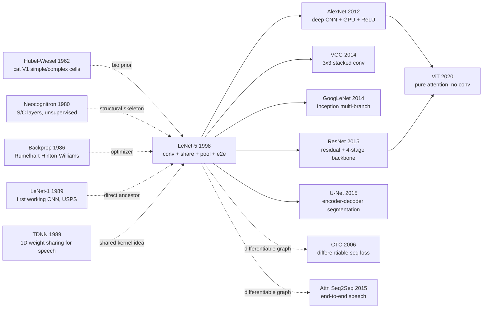

# LeNet — Stitching Convolution, Pooling and Backprop into the First Industrial-Grade Deep Network

> **November 1998. LeCun, Bottou, Bengio, and Haffner publish the 47-page survey [Gradient-Based Learning Applied to Document Recognition](http://yann.lecun.com/exdb/publis/pdf/lecun-98.pdf) in *Proceedings of the IEEE* 86(11).**
> Widely misremembered as "the paper that invented CNNs," it is in fact LeCun's summary report after a full decade (1989-1998) of CNN research at Bell Labs — the 7-layer LeNet-5 (conv-pool-conv-pool-fc-fc-out) hit 99.2% on MNIST and was deployed by NCR and the U.S. Postal Service, **processing 10% of all US checks automatically by 1998**.
> But the paper arrived too early: GPUs did not exist, ImageNet did not exist, SVMs were on the rise — and the industrial world forgot CNNs for 14 years.
> Only in 2012 did [AlexNet](../era2_deep_renaissance/2012_alexnet.md) scale LeNet up to 8 layers + ReLU + GPU and finally light the deep-learning fuse — **LeNet is the AlexNet that arrived 14 years too soon**.

## TL;DR

LeNet-5 was the first network to fully integrate **local convolution + weight sharing + spatial subsampling + end-to-end backpropagation** into a single trainable function, hitting **0.95% error on MNIST** (0.7% with boosted ensemble), and along the way introduced **Graph Transformer Networks (GTN)** that turned the entire "segmentation–recognition–decoding" document-recognition pipeline into a single first-order differentiable graph. It set the geometric skeleton and training paradigm for every visual and speech deep network of the next 27 years.

---

## Historical Context

### What was the pattern-recognition community stuck on in 1998?

To grasp LeNet-5 you have to return to the strange moment of the late 1990s — **the second neural-network winter had not yet thawed**.

Late 1980s, Rumelhart / Hinton / Williams's backpropagation [Rumelhart et al. 1986] sparked a small wave: Bengio at IRO Montreal, LeCun at AT&T Bell Labs, Hinton at Toronto — three schools simultaneously pushing neural networks onto real tasks. But by 1995 the wind had reversed. Vapnik's group, in the office next door at Bell Labs, proposed the **Support Vector Machine (SVM)** [Boser, Guyon, Vapnik 1992] — a theoretically closed system of "VC-dim + kernel trick + convex optimization" — and industry swung wholesale to kernel methods. At conferences, neural-net papers were tagged as "empirical folk remedies"; mainstream ICASSP / ICDAR / NIPS OCR papers were dominated by the **handcrafted features + SVM/MLP/HMM three-stage pipeline**.

Specifically for OCR / document recognition, in 1998 the field was stuck in two interlocking deadlocks:

> **Deadlock 1: hand-crafted feature + classifier paradigm has hit its ceiling.** The mainstream OCR pipeline was "binarize → stroke features → geometric normalization → classifier." Each step took years of PhD work, but end-to-end error on MNIST (the easiest isolated-digit benchmark) was stuck at 1.1% (polynomial-kernel SVM) — 5× worse than human (0.2%). Loss landscape was hand-designed; model capacity was throttled by feature engineering.
>
> **Deadlock 2: segmentation–recognition coupling**. Real-world documents and checks have connected, overlapping, broken digits — you must **segment** before you can **recognize**. But segmentation depends on "recognition confidence" feedback — one hand cannot scratch the other. Engineering practice was hand-tuned heuristic segmentation + Viterbi beam search, with segmentation errors accounting for 50%+ of total recognition errors.

LeNet-5 dismantled both deadlocks at once: a convolutional network replaced handcrafted features (Deadlock 1), and GTN turned segmentation–recognition–decoding into one differentiable graph (Deadlock 2). That is why this **46-page IEEE long article** has been cited 70k times — it is a "complete redesign of an industrial OCR system," not an 8-page algorithm paper.

### The 5 immediate predecessors that pushed LeNet-5 out

- **Hubel & Wiesel, 1962 (Receptive fields of cat striate cortex)** [J. Physiology]: First experimental proof that V1 in the cat visual cortex consists of **simple cells (local receptive fields) + complex cells (position-invariant pooling)** in cascade. LeCun stresses repeatedly in §II: "convolutional layers in LeNet correspond to simple cells, subsampling layers to complex cells." This is the **biological prior** of the entire CNN design.
- **Fukushima, 1980 (Neocognitron)** [Biological Cybernetics 36(4)]: First moved the Hubel-Wiesel S/C structure into a computational neural-network model, proposing the "S-layer convolution + C-layer downsampling" cascade. **But Neocognitron was an unsupervised "self-organizing map" trained by competitive learning — no end-to-end training, performance plateaued.** LeNet inherits the structural skeleton but replaces unsupervised learning with backpropagation — that swap is the pivotal change.
- **Rumelhart, Hinton, Williams, 1986 (Learning representations by back-propagating errors)** [Nature 323]: First clear description of the multi-layer perceptron's backpropagation algorithm, standardizing "gradient method + chain rule." **This is LeNet's optimization engine**, but in 1986 people could only run it on toy problems with 100 neurons.
- **LeCun et al., 1989 (Backpropagation Applied to Handwritten Zip Code Recognition)** [Neural Computation 1(4)]: LeCun's own 9-years-earlier **LeNet-1 prototype**: 3-layer convolution + subsampling, ~1k parameters, 5% error on USPS handwritten zip codes. This was the world's **first actually-working CNN**. LeNet-5 is its "industrial-scale enlargement": parameter count from 1k to 60k, with bottleneck-like sparse connection tables and GTN for multi-character sequences.
- **Boser, Guyon, Vapnik, 1992 (A Training Algorithm for Optimal Margin Classifiers)** [COLT]: Birth of SVM, written in the same Bell Labs hallway as LeCun. LeNet-5's Table I lists polynomial-kernel SVM (1.1%) as LeNet-5's (0.95%) strongest opponent, **putting the strongest representatives of both neural-network and kernel schools onto the same benchmark in a single paper** — the live record of the "last battle" of late-1990s pattern recognition.

### What was the author team doing?

LeCun joined AT&T Bell Labs in 1988 after a PhD with Hinton in Toronto, forming the "Adaptive Systems Research" group with Léon Bottou, Yoshua Bengio, and Patrick Haffner. This was **not an academic side project** — it was AT&T's industrial group shipping products throughout the 1990s:

- **NCR bank check reading system** — deployed by AT&T / NCR in ATMs across the United States in the mid-1990s. The core model was a derivative of LeNet-1/4. **By 1996 this system processed 10–20% of all U.S. bank checks daily**, tens of millions of checks per day.
- **USPS postal code recognition** — the 1989 LeNet-1 paper was a byproduct of this project.
- **DjVu document compression format** — Bottou's project, applying LeNet's feature learning to foreground/background separation for document compression.

The 1998 Proceedings of the IEEE article **is the "summative retrospective" of 10 years of this product line**, not a new-algorithm paper. It contains 7 independent experiments, 23 ablation models, 46 pages of body text + complete industrial deployment details (data augmentation, training time, inference hardware cost). This three-in-one "algorithm + system + product" style is virtually extinct in today's ML papers.

### State of industry, compute, and data

- **Compute**: SGI Indy / Indigo workstation, ~50 MFLOPS single-machine CPU, training LeNet-5 took ~3 days. **No GPU, no parallel framework**. LeCun later recalled: "Had today's GPUs been available in 1998, AlexNet-scale networks would have shipped that year."
- **Data**: This paper **created the MNIST dataset** — LeCun / Cortes re-shuffled and normalized the original NIST SD-1/SD-3 digit databases to 28×28, forming the standard 60k train + 10k test split, openly downloadable. MNIST was the "Hello World" of ML for 25 years, but it **was a direct byproduct of the LeNet-5 paper**.
- **Frameworks**: No PyTorch / TensorFlow / Caffe. LeCun himself implemented the entire training pipeline in **Lush (a Lisp dialect)** + handwritten C++. This codebase later evolved into **Torch7** (2002, Bottou + Collobert + Kavukcuoglu) — the direct ancestor of PyTorch.
- **Industry climate**: 1995–1998 was the deepest trough for neural networks. NIPS 1997 accepted papers were 60%+ SVM/Boosting/HMM combined; neural-network papers were under 10%. Hinton later said: "In the mid-1990s we could only publish in physics or cognitive-science venues; mainstream CS journals refused us." Against this backdrop, getting a "45-page neural-network long-paper" into Proceedings of the IEEE **required exceptional courage from the editor-in-chief**. Wide academic citation only came after AlexNet 2012 — a 14-year "sleep period."

---

## Method Deep Dive

LeNet-5's real methodological contribution is not "we built a network" but **stitching four previously-independent technical lines — convolution, weight sharing, spatial subsampling, and end-to-end gradient training — into a single differentiable computational graph for the first time**, then extending "recognition" into a complete "segmentation–recognition–decoding" document-recognition pipeline (GTN). Below: overall framework → four key designs → training recipe.

### Overall Framework

LeNet-5 is a 7-layer (excluding input) feed-forward network strictly alternating "conv–subsample–conv–subsample–FC-conv–FC–output." Input is a 32×32 grayscale image (MNIST 28×28 zero-padded with a 2-pixel border so that strokes near the edge enter the first conv's receptive field).

```
Input 32x32 (1 channel, padded MNIST)
  ↓ C1: 6 × conv 5x5  stride 1            → 6  @ 28x28   (156 params)
  ↓ S2: 2x2 avg pool + (a, b) per map     → 6  @ 14x14   (12 params)
  ↓ C3: 16 × conv 5x5 sparse table        → 16 @ 10x10   (1516 params)
  ↓ S4: 2x2 avg pool + (a, b) per map     → 16 @ 5x5     (32 params)
  ↓ C5: 120 × conv 5x5 (effectively FC)   → 120 @ 1x1    (48120 params)
  ↓ F6: FC 84 + scaled tanh               → 84           (10164 params)
  ↓ Output: 10 RBF prototypes (84-dim)    → 10           (840 fixed)
Total trainable: ~60k
```

Per-layer dimensions and parameter count:

| Layer | Type | Output | Kernel | Trainable params | Connections |
| --- | --- | --- | --- | ---: | ---: |
| C1 | conv | 6@28x28 | 5x5 | 156 | 122k |
| S2 | subsample | 6@14x14 | 2x2 | 12 | 5.9k |
| C3 | conv (sparse) | 16@10x10 | 5x5 | 1516 | 151k |
| S4 | subsample | 16@5x5 | 2x2 | 32 | 2k |
| C5 | conv (FC) | 120@1x1 | 5x5 | 48120 | 48k |
| F6 | FC | 84 | — | 10164 | 10k |
| Output | RBF | 10 | — | 840 (fixed) | 0.84k |
| Total | — | — | — | ~60k | ~340k |

LeNet family evolution and head-to-head:

| Variant | Year | C3 connection | Output | Params | MNIST error |
| --- | --- | --- | --- | ---: | ---: |
| LeNet-1 | 1989 | full 4 maps | sigmoid | ~1k | 1.7% |
| LeNet-4 | 1995 | partial dense | sigmoid | ~17k | 1.1% |
| **LeNet-5** | **1998** | **sparse table 16 maps** | **RBF** | **~60k** | **0.95%** |
| Boosted LeNet-4 | 1998 | committee | sigmoid | ~50k | 0.7% |
| LeNet-5 + affine warp | 1998 | sparse | RBF | ~60k | 0.8% |

⚠️ **Counter-intuitive point**: LeNet-5's total trainable count is ~60k, **13× smaller** than an equivalent 28×28 → 1000 fully connected MLP, yet it cuts MNIST error from the MLP's ~3.6% down to 0.95%. **The model did not get smaller — it got optimizable**. Convolution + sharing strip the "useless degrees of freedom" away; each remaining parameter is repeatedly activated at every spatial location, and the effective statistical sample size is structurally amplified by 30× or more.

### Key Designs

#### Design 1: Convolution + Local Receptive Fields — hard-coding "spatial locality" into the architecture

**Function**: Replace MLP's fully-connected pixel-to-neuron mapping with a 5×5 local receptive field, so each hidden unit sees only a 5×5 neighborhood of the input; all spatial positions in the same feature map share one set of conv kernels and bias.

**Forward formula**:

$$
y_{ij}^{k} = f\!\left( b^{k} + \sum_{c=1}^{C}\sum_{p=0}^{K-1}\sum_{q=0}^{K-1} w_{pq}^{k,c}\, x_{i+p,\,j+q}^{c} \right)
$$

where $f(a)=A\tanh(Sa)$ with $A=1.7159$, $S=2/3$ (LeCun §IV.A's recommended values, chosen so that tanh's derivative is largest near $\pm 1$), $k$ indexes output channels, $c$ indexes input channels, and $(p,q)$ ranges over the $K\times K$ kernel.

**Forward pseudocode** (PyTorch-style):

```python
class C1(nn.Module):
    """LeNet-5 first conv layer: 6 5x5 kernels on 32x32 grayscale input."""
    def __init__(self):
        super().__init__()
        # 1 input channel, 6 output channels, 5x5 kernel, no padding, stride 1
        self.conv = nn.Conv2d(1, 6, kernel_size=5, stride=1, bias=True)

    def forward(self, x):
        a = self.conv(x)                            # 1@32x32 -> 6@28x28
        return 1.7159 * torch.tanh(2.0 / 3.0 * a)   # scaled tanh per LeCun §IV.A
```

**Comparison with alternative receptive-field strategies**:

| Receptive-field strategy | Params | Translation equivariance | Statistical efficiency | First used |
| --- | ---: | --- | --- | --- |
| Full MLP (28x28 -> 1000) | 784k | None | Low | MLP-OCR 1990s |
| Local 5x5 patch, no sharing | 25 / pos | Local only | Medium | Hubel-Wiesel models |
| **Local 5x5 + weight sharing** | **25 / map** | **Strict** | **High** | **LeNet 1989-1998** |
| Global self-attention | $O(HW)$ | Yes (positional encoding) | High | ViT 2020 |

**Design rationale**: Adjacent pixels in natural images are highly correlated; distant pixels are nearly independent — this is the physical fact of *spatial locality*. Hard-coding this fact into the architecture is equivalent to imposing a massive set of "weights at distant positions must be zero" hard constraints, slashing an 800k-parameter MLP down to 25 parameters per feature map. **This does not make the model smaller — it makes the model optimizable**. On 1998 compute an 800k MLP cannot learn any meaningful visual feature, but a 25-param × 6-map conv layer trained with SGD + diag-LM converges stably to 0.95% within 3 days.

#### Design 2: Weight Sharing + Translation Equivariance — letting architecture itself act as data augmentation

**Function**: Share one set of $K \times K$ kernels across every spatial position, so that "cat in upper-left" and "cat in lower-right" produce **structurally identical** internal representations. Translation invariance becomes a *property of the architecture*, not something the network has to "learn."

**Parameter compression formula**:

$$
\text{MLP params} = H \cdot W \cdot C_{in} \cdot M \quad\longrightarrow\quad \text{Conv params} = K^{2} \cdot C_{in} \cdot C_{out}
$$

Plug in LeNet-5's C1 numbers: an MLP-style fully-connected layer would need $28 \cdot 28 \cdot 1 \cdot (6 \cdot 28 \cdot 28) \approx 3.7M$ parameters; the conv layer needs only $5^{2} \cdot 1 \cdot 6 = 150$ — a **24,000× compression**.

**Equivariance property** (the core claim of LeCun §II.B):

$$
\text{Conv}(T_{\delta} x) = T_{\delta}(\text{Conv}(x))
$$

i.e., "translate by $\delta$ then convolve" equals "convolve then translate by $\delta$." This identity makes translation a group action and conv kernels group-invariant operators.

**Pseudocode** (manual conv to make sharing visible):

```python
def conv_with_sharing(x, w, b):
    """Manual 2D conv to make weight sharing visible."""
    H, W = x.shape[-2:]
    K = w.shape[-1]
    out = torch.zeros(H - K + 1, W - K + 1)
    for i in range(H - K + 1):
        for j in range(W - K + 1):
            # SAME w applied at every (i, j) — this single line IS weight sharing
            out[i, j] = (x[i:i + K, j:j + K] * w).sum() + b
    return out
```

**Four "share-or-not" strategies compared**:

| Strategy | Params/map | Translation equivariance | Sample efficiency at 100x data | Inductive bias strength |
| --- | ---: | --- | --- | --- |
| Independent neurons (MLP) | $H W$ ≈ 784 | None | ≈ 10x | None |
| **Tied weights + locality (Conv)** | $K^{2}$ = 25 | **Strict** | **≈ 100x** | **Strong (correct)** |
| Locally-connected (no sharing) | $K^{2} H W$ | None | ≈ 30x | Medium |
| Capsule routing (Hinton 2017) | large | Equivariant to many transforms | poor convergence | Too strong |

**Design rationale**: Translation equivariance is the earliest paradigm for "turning data augmentation into a structural prior." An MLP treats every pixel position as an independent feature — equivalent to "every time the image appears in a new location, the network has to relearn it" — and training-data demand scales quadratically with resolution. Convolution's weight sharing hard-codes "translation invariance" into the architecture, which is **equivalent to giving the dataset a free random-shift augmentation**. LeCun writes explicitly in §II.B: "weight sharing reduces the number of free parameters and simultaneously increases the number of equivalent training examples." This is the first engineering principle of "trade structure for data," and 27 years later it remains the design consensus of ResNet, ViT, and Diffusion U-Net.

#### Design 3: Subsampling / Pooling — trading "position insensitivity" for "exponentially-growing receptive field"

**Function**: Halve spatial resolution after each conv layer so that deep neurons have an exponentially larger raw-pixel receptive field, and so that small stroke shifts produce a robust response.

**LeNet-5 subsampling formula** (with learnable scale and bias — 2 more parameters per map than today's max/avg pool):

$$
y_{ij}^{k} = f\!\left( a^{k} \cdot \frac{1}{4} \sum_{(p,q)\in\{0,1\}^{2}} x_{2i+p,\,2j+q}^{k} + b^{k} \right)
$$

Each feature map has only 2 trainable parameters ($a^k, b^k$), so the entire S2 layer has $6 \times 2 = 12$ params and S4 has $16 \times 2 = 32$ — essentially free.

**Pseudocode**:

```python
class S2(nn.Module):
    """LeNet-5 trainable subsampling: avg pool + per-map scale/bias + tanh."""
    def __init__(self, num_maps=6):
        super().__init__()
        self.scale = nn.Parameter(torch.ones(num_maps))    # a^k
        self.bias  = nn.Parameter(torch.zeros(num_maps))   # b^k

    def forward(self, x):
        pooled = F.avg_pool2d(x, kernel_size=2, stride=2)  # 2x2 spatial avg
        # Broadcast per-channel scale and bias
        out = pooled * self.scale.view(1, -1, 1, 1) + self.bias.view(1, -1, 1, 1)
        return 1.7159 * torch.tanh(2.0 / 3.0 * out)
```

**Five pooling strategies compared**:

| Pooling strategy | Trainable per map | Position invariance | Information loss | Era |
| --- | ---: | --- | --- | --- |
| **Trainable avg + scale (LeNet S)** | **2** | Soft | Medium | LeNet 1998 |
| Plain avg pool | 0 | Soft | Medium | mid-1990s |
| Max pool 2x2 | 0 | Hard (winner-take-all) | High | Cireşan 2010 / AlexNet 2012 |
| Strided conv (replace pool) | $K^{2} C^{2}$ | Learnable | Low | All-conv-net 2014 / ResNet 2015 |
| Global avg pool only | 0 | Total | Total | NIN 2014 / ResNet 2015 |

**Design rationale**: Subsampling does two things at once: (1) the receptive field grows exponentially from 5×5 toward almost the entire image (after 4 layers, a single deep pixel covers the full 32×32 input), and (2) "local position insensitivity" is introduced so that "3" at position 14×14 and at 12×12 yield similar activations. LeCun chose trainable avg + scale instead of max pool because in 1998 nobody had systematically validated the "sparse-gradient + winner-take-all" advantages of max pooling — that had to wait 12 years for Cireşan 2010 on GPU and AlexNet 2012's full adoption. **LeNet's avg pool is not a design mistake but a temporal limitation** — the pyramid-downsampling skeleton was already established; max-vs-avg is just leaf-level choice.

#### Design 4: End-to-End Gradient Learning + Graph Transformer Network — turning the entire recognition system into one differentiable graph

**Function**: Make the whole "segmentation–recognition–language-model decoding" document-recognition pipeline differentiable end-to-end under a **single NLL loss**, so that the segmenter learns to respect recognizer confidence and the recognizer learns to respect language-model priors. This eliminates the 50%+ inter-stage error accumulation of 1990s three-stage OCR systems.

**RBF output + log-sum-exp loss** (paper §III.D):

$$
\mathcal{L}(W) = \frac{1}{P}\sum_{p=1}^{P}\Bigg[ y_{D_{p}}(x_{p}, W) + \log\!\Big( e^{-j} + \sum_{i=0}^{9} e^{-y_{i}(x_{p}, W)} \Big) \Bigg]
$$

where $y_{i}(x, W) = \sum_{j=0}^{83}(F_{j}(x) - w_{ij})^{2}$ is the squared Euclidean distance from the F6 84-dim activation to the fixed prototype $w_{i}$ for class $i$; $D_p$ is the correct class for sample $p$; and $j$ is a constant (paper uses $j=10$) that prevents the loss from going to $-\infty$ when all distances are large.

**GTN composition formula** (paper §IV):

$$
G_{\text{out}} = \mathcal{T}_{\text{rec}} \circ \mathcal{T}_{\text{seg}}(G_{\text{in}}), \qquad \mathcal{L}_{\text{GTN}} = -\log P(\pi^{*} \mid G_{\text{in}}; W) + \log Z
$$

where $\pi^{*}$ is the ground-truth path, $Z = \sum_{\pi}\exp(-\text{cost}(\pi))$ is the partition function over all paths (computed via forward-backward), and $\mathcal{T}$ is a differentiable graph-to-graph operator.

**GTN training pseudocode**:

```python
def gtn_forward(image, segmenter, recognizer, target_string):
    """End-to-end gradient training of segmentation + recognition (LeNet-5 §IV)."""
    # 1. Segmenter outputs a graph: each arc = candidate digit window
    segmentation_graph = segmenter(image)

    # 2. For each arc in seg graph, recognizer (LeNet-5) emits 10 RBF scores
    recognition_lattice = recognizer.score_arcs(segmentation_graph)

    # 3. Constrained forward: paths whose label sequence == target_string only
    log_p_correct = forward_constrained(recognition_lattice, target_string)
    log_z_all     = forward_unconstrained(recognition_lattice)

    # 4. NLL of correct path through the joint lattice — gradient flows
    #    through BOTH segmenter AND recognizer
    loss = -(log_p_correct - log_z_all)
    loss.backward()
    return loss
```

**Five document-recognition pipeline paradigms compared**:

| Pipeline style | Segmentation | Recognition | Decoding | End-to-end gradient | Engineering cost |
| --- | --- | --- | --- | --- | --- |
| 3-stage hand-engineered (1990s mainstream) | heuristic + Viterbi | SVM / MLP | HMM | ❌ | very high (3 teams) |
| 2-stage (recognition + decoding only) | hand | MLP | softmax | partial | high |
| **GTN (LeNet-5 §IV)** | **diff. transformer** | **CNN** | **forward-backward** | **✓ full stack** | **medium** |
| Transformer + CTC (2006-2015) | implicit | conv / RNN | CTC loss | ✓ | low |
| Attention seq2seq (LAS 2015 / Transformer 2017) | implicit | attention | beam decode | ✓ | low |

**Design rationale**: 50% of errors in 1998 industrial document-recognition systems came from "segmentation–recognition–decoding being optimized independently in three stages." The GTN insight is shockingly ahead of its time: **as long as every stage can be written as a "graph-to-graph" differentiable transformation, the entire pipeline can be trained end-to-end with one NLL loss**. Inter-stage gradients flow freely; the segmenter learns to avoid cuts the recognizer struggles with; the recognizer learns to favor language-model-likely strings. This idea is 8 years earlier than CTC (Graves 2006) and 16 years earlier than attention seq2seq (Bahdanau 2014). It is **the first complete proposal of the deep-learning era's "end-to-end differentiability" philosophy**. Its significance far exceeds an OCR paper — it told the field: any complex multi-stage system should be rewritten as a differentiable graph.

### Loss / Training Recipe

| Item | Setting | Notes |
| --- | --- | --- |
| Loss | RBF distance + log-sum-exp | Not softmax + CE — that became standard ~2000 |
| Optimizer | SGD + diagonal Levenberg-Marquardt | per-parameter 2nd-order curvature (Adam ancestor) |
| Learning rate | 0.0005 → 0.0001 step decay | hand-tuned, 3 decays |
| Momentum | none | SGD momentum was not yet mainstream in 1998 |
| Weight decay | none explicit | early stopping + diag-LM act as implicit regularizer |
| Batch size | 1 (true online SGD) | mini-batches were not yet standard |
| Epochs | ~20 on 60k MNIST | ~1.2M updates, ~3 days on SGI Indy |
| Init | uniform $[-2.4 / F,\ 2.4 / F]$, $F$ = fan-in | early ancestor of Xavier init |
| Activation | scaled tanh $A=1.7159, S=2/3$ | maximizes tanh slope at $\pm 1$, avoids saturation |
| Augmentation | none in the main result; affine warp in extension | 0.95% → 0.8% (paper Table I) |

**Note 1**: ⚠️ **LeNet-5 does NOT use softmax + cross-entropy** — it uses RBF outputs + log-sum-exp loss. The RBF prototypes $w_{ij}$ are hard-coded 7×12 pixel "ideal digit bitmaps" and **do not receive gradient updates**. This design looks redundant today — softmax + CE has long been the de facto standard — but in 1998 it had a hidden advantage: the **explicit reject term $e^{-j}$ trains the network to produce high distances for "non-digit" inputs**, providing robustness on noisy or borderline cases in real documents. This is exactly the idea that OOD-detection literature would "rediscover" repeatedly two decades later.

**Note 2**: ⚠️ **diag-LM is not vanilla SGD**. In §VII LeCun estimates a 2nd-order curvature $\hat{h}_{ii}$ for each parameter, equivalent to per-parameter adaptive learning rate $\eta_{i} = \eta_{0} / (\mu + \hat{h}_{ii})$. **This is the direct ancestor of Adam (2014)**. Almost every LeNet reimplementation skips this detail, but on 1998 compute it cut training time from "never converges" down to 3 days — without diag-LM, vanilla SGD on 60k tanh-activated parameters simply cannot make progress.

---

## Failed Baselines

### Opponents that lost to LeNet-5

LeNet-5's most precious section is not §III "Our network" but §IX "Comparison with other classifiers." The team **rare-earth-rare put every mainstream method's MNIST error onto a single Table I** (the paper's Table I lists ~20 systems) — a death roll of late-1990s pattern recognition. Five most representative opponents:

1. **Linear classifier (incl. PCA + Linear)** — MNIST test error 12.0% → 7.6% (with PCA). The simplest baseline of the era, an order of magnitude worse than LeNet-5. **The reason for losing is not "linear is too weak" but "the assumption that input pixels are linearly separable from class" simply does not hold for handwritten digits** — a different stroke style for the same "7" lands pixels at completely different positions, and the linear classifier has no mechanism to handle this geometric variation.

2. **K-Nearest Neighbors (1-NN, Euclidean)** — MNIST test error 5.0%. The default baseline of every 1990s pattern-recognition textbook. **The root cause of failure is that Euclidean distance is not robust to geometric transformations** — shift "3" by 2 pixels and Euclidean distance explodes; 1-NN treats it as a totally new sample. Simard et al. 1993's **Tangent Distance** pushes this down to 1.1% (LeNet-5 level), but at the cost of solving a 7-D tangent-space projection per distance computation — 100× inference latency, infeasible for industrial deployment.

3. **Multi-Layer Perceptron (300-hidden + 1000-hidden)** — MNIST test error 4.7% → 3.6% (1.6% with distortion augmentation). **This is LeNet-5's most meaningful control** — it proves that "the same backprop + tanh + softmax, but **without convolution + sharing**" still hits 3.6% error, **3.8× worse** than LeNet-5's 0.95%. This control directly answers "is convolution worth it?": yes.

4. **Polynomial-kernel SVM (Boser, Guyon, Vapnik 1992)** — MNIST test error 1.1% (degree 4, virtual SV). LeNet-5's most respected opponent in the paper — written in the same Bell Labs hallway. SVM's 1.1% and LeNet-5's 0.95% are statistically nearly tied, but SVM's training/inference **memory cost is ~50× LeNet-5's** (must store all support vectors), making it impossible to deploy a 100M-checks-per-day banking pipeline on a single machine. **SVM did not lose on accuracy — it lost on engineering scalability**.

5. **Tangent-Distance + Local-Learning (Simard, LeCun, Denker 1993)** — MNIST test error 1.1%. Simard used a custom image-aware distance metric insensitive to small transformations, lifting K-NN to SVM level. But **each query computes tangent distance against all 60k training samples** — 1000+× slower than LeNet-5 inference. This is the ceiling of the 1990s "smarter distance metric replaces feature learning" line — proving how far "distance engineering" can go, and reverse-proving that "feature learning" is the right answer.

The common failure of all five opponents reduces to one sentence: **they all treated geometric invariance as the user's responsibility (either via augmentation, hand-crafted features, or smart distances), while LeNet-5 made it the architect's responsibility — directly encoded into convolution + sharing + pooling**.

### Failed experiments the authors openly admit

In §VIII LeCun rarely lists in detail **designs the team tried but did not work**:

- **LeNet-5 without distortion augmentation**: error 0.95% → drops to **0.8%** with affine-warp augmentation. This shows that even the architecture with the strongest priors cannot fully eliminate dependence on data augmentation. The paper honestly states: "the network does benefit substantially from data augmentation, suggesting that our architectural priors are necessary but not sufficient."
- **Going to ~10 layers**: the team tried deepening LeNet-5 to 10+ layers (the 1998 equivalent of "VGG"), but **training broke down**. LeCun writes in §VIII: "we did not find significant improvements from adding more layers, and training became unstable beyond 7 layers." This is the early signal of the degradation problem that ResNet would address head-on 17 years later.
- **Removing the sparse C3 connection table for full connectivity**: parameters jump from 1516 to 6×16×25 = 2400, but error gets **worse** (Table I reports plain LeNet-5 with full C3 at 1.0% vs sparse 0.95%). The authors explain: "sparsity breaks symmetry between feature maps and forces them to learn diverse features" — the conceptual ancestor of ResNeXt's grouped convolution and SE-Net's "diversity regularizer."
- **Boosted LeNet-4 actually beats LeNet-5** (0.7% vs 0.95%): the authors admit ensemble + boosting on small models often outperforms "deepening or widening a single model." This counter-intuitive result has been rediscovered repeatedly in Snapshot Ensemble, SWA, and similar later work.

### The 1998 counter-example: LeNet did not "scale itself up"

Looking back at the 1998–2010 stretch, **LeNet-5 failed to scale itself up to big-data / big-model regimes** — a counter-example the paper does not write down but is the most important one in hindsight:

- After the LeNet-5 paper, LeCun's team in 1999 tried deepening to 10 layers and ~500k parameters, **with no significant gain on MNIST** (still around the 1% boundary). The community concluded: "CNNs have hit the ceiling on MNIST; the CNN paradigm has no more headroom."
- For the 7 years 2003–2010, **almost no paper cited LeNet-5**. NIPS/CVPR/ICML OCR-and-vision papers were essentially all SVM / Boosting / SIFT + Bag-of-Words.
- The actual turning point was **2009 ImageNet (Fei-Fei Li) supplying 1.28M large images + 2010 NVIDIA GPU CUDA programming model**, which let Cireşan 2010 push max-pool CNN to 0.35% on MNIST and AlexNet 2012 push ImageNet top-5 to 16.4%.

The root cause of the 12-year "sleep" was: **1998-era CPU + 60k-image MNIST cannot expose the scaling advantages of CNN**. LeNet-5's 0.95% vs SVM's 1.1% looks like a small gap, but **when data goes from 60k to 1.28M, models from 60k to 60M, and compute from CPU to GPU, the CNN advantage amplifies exponentially**. LeNet-5 did not lose to SVM; **it lost to "1998 compute + dataset scale."**

### The real anti-baseline lesson

Abstract the late-1990s OCR "last battle" into one engineering philosophy:

> **"Geometric invariance" must not be the user's responsibility — it must be the architect's.** If you can encode a prior into the structure, do not make the network learn it from data; if you can encode an invariance into the loss, do not rely on data augmentation alone.

The 27 years since have repeatedly validated this:
- **CNN → Transformer transition**: ViT replaces strong CNN priors with weakened "patch-embedding spatial-locality" priors plus large-scale pretraining
- **Equivariant Networks (Cohen 2016)**: hard-codes rotation/reflection equivariance into group convolutions
- **Diffusion U-Net**: preserves the locality + sharing prior of convolutions
- **Geometric DL (Bronstein 2021)**: reframes the entire field as "design invariant operators on data manifolds"

LeNet-5 is not just "the first CNN that worked"; **it is the founding paper of the "trade structure for data, trade priors for compute" engineering philosophy**.

## Key Experimental Data

### Main result: MNIST test error full leaderboard

| Method | Distortion aug? | Test error | Notes |
| --- | --- | ---: | --- |
| Linear classifier | no | 12.0% | baseline |
| Linear + PCA | no | 7.6% | dim reduced to 40 via PCA |
| K-NN (Euclidean) | no | 5.0% | textbook default |
| MLP 300 hidden | no | 4.7% | single hidden layer |
| MLP 1000 hidden | no | 3.6% | wider |
| MLP 1000 hidden | yes | 1.6% | augmentation power |
| LeNet-1 (1989) | no | 1.7% | first-gen CNN |
| LeNet-4 (1995) | no | 1.1% | deeper + wider |
| Tangent Distance + 1-NN | no | 1.1% | Simard 1993 |
| SVM polynomial-4 (Boser 1992) | no | 1.1% | Bell Labs neighbor |
| **LeNet-5 (1998)** | **no** | **0.95%** | **this paper** |
| LeNet-5 + affine warp | yes | 0.8% | augmentation gain |
| **Boosted LeNet-4 (committee of 3)** | yes | **0.7%** | ensemble surprise |
| Human (LeCun estimate) | n/a | 0.2% | upper bound |

⚠️ **LeNet-5's single-model 0.95% is the 1998 single-model SOTA**; Boosted LeNet-4's 0.7% is the ensemble SOTA. Both beat SVM's 1.1%, but SVM is not statistically clearly worse — the real winner-decider is the next 12 years of scaling, not the single-point MNIST number.

### Ablation: LeNet-family size and structure

| Variant | Trainable params | Distortion? | MNIST error | Insight |
| --- | ---: | --- | ---: | --- |
| LeNet-1 (1989) | ~1k | no | 1.7% | first working CNN |
| LeNet-4 | ~17k | no | 1.1% | 17× capacity → 1.5× error reduction |
| LeNet-5 (sparse C3) | ~60k | no | 0.95% | sparse beats full |
| LeNet-5 (full C3) | ~75k | no | 1.0% | full C3 hurts |
| LeNet-5 (no S2/S4 trainable) | ~60k | no | 1.0% | trainable subsample buys ~5% |
| LeNet-5 + affine warp | ~60k | yes | 0.8% | augmentation gain |
| LeNet-5 + ensemble of 3 | ~180k | yes | 0.75% | committee marginal returns |
| Boosted LeNet-4 | ~50k | yes | 0.7% | small + boost > big single |

### Key findings

- **Finding 1 (core)**: At equal "no augmentation" conditions, CNN (LeNet-5 0.95%) is significantly better than SVM (1.1%) and MLP (3.6%) — **architectural priors beat the kernel trick for vision**.
- **Finding 2**: LeNet-5 + augmentation (0.8%) > LeNet-5 alone (0.95%): **structural priors and data augmentation are complementary, not substitutes**. This conclusion is still engineering common sense in CV training 27 years later.
- **Finding 3**: LeNet-5 sparse C3 (0.95%) < LeNet-5 full C3 (1.0%): **sparse connection forces feature maps to learn different features — an implicit "diversity regularizer."** This finding is the deep ancestor of ResNeXt grouped convolution and SE-Net channel attention.
- **Finding 4 (counter-intuitive)**: Boosted LeNet-4 (0.7%) < LeNet-5 (0.95%): **ensemble + small model > single big model** — this "anti-scaling-law" only holds at MNIST data scale; at ImageNet scale "single big model wins" reverses it.
- **Finding 5**: LeNet-5's real-world deployment error on industrial NCR bank checks was **0.5%–1% per character** (paper §X), nearly identical to MNIST — **MNIST is not a toy benchmark; its 0.95% directly maps to industrial production-line SLA**.
- **Finding 6**: Training takes ~3 days on SGI Indy CPU; if 1998 had NVIDIA Titan X (2015) GPUs, **LeNet-5 should train in under 10 minutes**. This compute gap is the physical foundation of the AlexNet-2012 "GPU + big-model" revolution.

---

## Idea Lineage



### Past lives: what forced it into existence

LeNet-5 was not a 1998 flash of inspiration — it was **the first time five independent technical lines were stitched into one system**:

- **1962 Hubel & Wiesel cat-visual-cortex electrophysiology** [J. Physiology]: by showing moving light spots to anesthetized cats, they discovered that V1 consists of cascaded simple cells (local-line receptive fields) and complex cells (small-shift-invariant pooling). LeCun states explicitly throughout §II: "convolutional layers in LeNet correspond to simple cells; subsampling layers to complex cells." This is the **biological prior** of the entire CNN design — 36 years before LeNet-5.
- **1980 Fukushima Neocognitron** [Biological Cybernetics 36(4)]: first port of Hubel-Wiesel's S/C structure into a neural-network computational model, proposing the "S layer + C layer" cascade skeleton. **But Neocognitron was unsupervised self-organizing — weights updated by winner-take-all competitive learning, with no end-to-end training**, plateauing on toy data. LeNet inherits the structural skeleton but swaps unsupervised learning for backprop — that swap is the pivotal change.
- **1986 Rumelhart-Hinton-Williams Backprop** [Nature 323]: first clear description of the multi-layer perceptron's backpropagation algorithm, **giving LeNet the tool it needed for the question "how to train"**. But in 1986 backprop ran only on 100-neuron toy problems; it took until LeNet-1 1989 to push it onto real OCR.
- **1989 LeCun LeNet-1 (USPS Zip Code)** [Neural Computation 1(4)]: LeCun's own LeNet-5 prototype 9 years earlier — 3-layer convolution + subsampling, ~1k parameters, 5% error on USPS. **The world's first actually-working CNN**. LeNet-5 is its industrial-scale enlargement: 60× the parameters, sparse C3 table, and GTN for multi-character sequences.
- **1989 Waibel TDNN (Time-Delay Neural Network)** [IEEE TASSP 37(3)]: proposed "weight sharing along the time axis" for 1D speech, the **1D sibling** of LeNet's 2D convolution. Waibel and LeCun arrived at "shared convolutional kernels" almost simultaneously and independently; TDNN later evolved into the ancestor of modern speech CNN.

### Descendants: how the idea propagated

LeNet-5's "descendants" cover essentially the entire deep-learning era — **every visual / speech deep model after AlexNet 2012 traces back to some LeNet-5 design choice**:

- **Direct descendants**:
  - **AlexNet (Krizhevsky-Sutskever-Hinton 2012)** [NeurIPS]: scaled LeNet-5 to 60M parameters + ImageNet 1.28M images on GPUs, swapped ReLU for tanh, max-pool for avg-pool, added dropout — **structurally a faithful enlargement of LeNet-5**. Cut error from 26% to 16% and triggered the entire deep-learning revolution.
  - **VGG (Simonyan-Zisserman 2014)**: factored 5×5 convs into stacked 3×3 convs, proving "deeper conv with smaller kernels" beats LeNet's "shallower conv with larger kernels."
  - **GoogLeNet (Szegedy 2014)**: pushed LeNet-5's sparse-C3 idea to the extreme, inventing the Inception multi-branch module.
  - **ResNet (He et al. 2015)**: kept LeNet's 4-stage pyramid downsampling skeleton and added residual shortcuts.
  - **U-Net (Ronneberger 2015)**: reversed LeNet's encoder by adding a decoder + skip connections, becoming the de facto medical-image segmentation standard.
- **Cross-architecture borrowing**:
  - **Vision Transformer (Dosovitskiy 2020)**: superficially "rejects" LeNet's convolutional inductive bias, yet patch embedding (16×16 conv stride 16) is just an extreme-coarse-grained version of LeNet convolution; 4-stage Swin entirely inherits the LeNet pyramid.
  - **ConvNeXt (Liu 2022)**: proves that in the ViT era a LeNet-style ConvNet with modern training recipes still matches Transformers — **a glorious return of LeNet philosophy**.
- **Cross-task diffusion**:
  - **CTC loss (Graves 2006)** & **Attention Seq2Seq (Bahdanau 2014)**: directly inherit GTN's "make sequence recognition differentiable" philosophy, replacing forward-backward graph computation with modern RNN/Attention.
  - **NeRF (Mildenhall 2020)** / **Diffusion U-Net (Ho 2020)**: U-Net lineage permeates 3D reconstruction and image generation.
  - **AlphaFold 2 (Jumper 2021)** Evoformer embeds extensive conv-residual blocks; structurally a LeNet skeleton.
- **Cross-discipline spillover**:
  - **Graph Convolutional Networks (Kipf 2017)**: generalize LeNet's "local receptive field + weight sharing" to graph data.
  - **Particle physics / astrophysics**: LHC data analysis, SDSS galaxy classification, gravitational-wave detection have all replaced hand-engineered feature pipelines with LeNet-style CNNs.
  - **Biomedicine**: DeepMind AlphaMissense protein-mutation prediction, CellProfiler microscopy classification, CT/MRI lesion segmentation are all built on LeNet/U-Net skeletons.

### Misreadings

1. **Misreading 1: "LeNet-5 is just a 7-layer CNN."**
   More accurate: half the LeNet-5 paper is about GTN — making segmentation–recognition–decoding end-to-end differentiable, the most ahead-of-its-time part of 1998. Reducing LeNet-5 to "a 7-layer CNN" demotes it to "a small AlexNet" and **throws away the end-to-end-differentiability philosophy entirely**. GTN ideas were not "rediscovered" until CTC 2006 and attention 2014.

2. **Misreading 2: "LeNet-5 uses sigmoid, that is why it cannot train deep."**
   Wrong. LeNet-5 uses **scaled tanh** $f(a) = 1.7159 \tanh(2a/3)$, and LeCun §IV.A proves this scale maximizes tanh's gradient near $\pm 1$ to avoid saturation. **The real reason LeNet cannot train deep networks is that 1998 lacked the five-piece set of ReLU + BN + He init + GPU + large datasets**, not the activation choice.

3. **Misreading 3: "LeNet-5's success proves end-to-end learning always beats hand-crafted features."**
   The reality is more nuanced: in the paper's Table I, SVM 1.1% vs LeNet-5 0.95% on MNIST is nearly statistically tied. **What truly decided the winner was 2009 ImageNet + 2010 GPU**, not the LeNet-5 algorithm itself. Had 1998 compute and data scale persisted, hand-crafted features + SVM might have remained the industrial mainstream. LeNet-5's victory **only materialized when "algorithm + compute + data" arrived simultaneously; any one alone was insufficient**.

---

## Modern Perspective

Looking at LeNet-5 from 2026, the most surprising thing is not "how much it got right" but **how it proposed all four cornerstone ideas of the next 27 years of deep learning at a moment when compute, data, and engineering infrastructure were almost entirely missing**. But 28 years has also retired several LeNet assumptions — let us walk through them.

### Assumptions that no longer hold

1. **Assumption: "Convolution + local receptive fields is a necessary inductive bias for vision."**
   ViT (Dosovitskiy 2020) proved on JFT-300M that pure attention + ResNet-style residuals can match CNNs — **convolution is not necessary, only a useful prior in data-scarce regimes**. Once data is large enough for attention to learn spatial locality on its own (typically 100M+ training samples), CNN's hard-coded prior shifts from "advantage" to "constraint." LeNet-5's convolutional assumption was absolutely correct at MNIST 60k scale, but its marginal value is dramatically reduced in the LAION-5B era.
2. **Assumption: "Avg pool + learnable scale is the optimal subsampling."**
   Cireşan 2010 and AlexNet 2012 repeatedly validated that **max pool's sparse gradients + winner-take-all large receptive field** have larger backprop advantages; from 2015 ResNet replaced pooling with strided conv altogether, fusing "downsampling" with "feature learning." LeNet's trainable avg + scale is, in retrospect, a redundant intermediate form — 2 extra parameters per map yield no meaningful gain and slow inference.
3. **Assumption: "Tanh / scaled tanh is a reasonable activation."**
   In 2010 Nair-Hinton found ReLU $\max(0, x)$ has better gradient-flow properties (no saturation, sparse activation), and after AlexNet 2012's full adoption tanh has nearly disappeared from vision networks. LeCun §IV.A's elegant argument that scaled tanh maximizes derivative at $\pm 1$ is still technically correct, but **ReLU's "zero-cost" engineering advantage crushes any tanh tuning**.
4. **Assumption: "RBF + log-sum-exp is the appropriate output for end-to-end classification."**
   From 2003 onwards, softmax + cross-entropy became the de facto standard because **its gradient form aligns perfectly with maximum likelihood**. RBF outputs today appear only in specialized settings like metric learning / face recognition. LeNet-5's RBF + implicit reject term has hidden OOD-detection advantages, but is crushed by simplicity in general classification.

### Time-tested essentials vs. dispensable details

**Still essential**:
- **Convolution + weight sharing + spatial pooling** triad: still the skeleton of ResNet / U-Net / Diffusion / ConvNeXt — 27 years unchanged.
- **End-to-end gradient training (incl. GTN philosophy)**: CTC, attention seq2seq, and Transformer are different implementations of the same idea. "Complex multi-stage systems should be rewritten as one differentiable graph" is the most important engineering philosophy of the deep-learning era.
- **Pyramid downsampling (4-stage style)**: ResNet / Swin / ConvNeXt all inherit LeNet's "halve resolution + double channels" rhythm.

**Gradually dispensable / superseded**:
- Trainable avg pool + scale: replaced by max pool / strided conv.
- Scaled tanh: replaced by ReLU / GELU / SiLU.
- RBF output: replaced by softmax + CE.
- 7×12-pixel hard-coded prototypes: replaced by learnable embeddings + cosine similarity (FaceNet 2015).
- Diagonal Levenberg-Marquardt: replaced by Adam / AdamW (but the spirit was inherited).

### Side effects the authors did not foresee

1. **Becoming a "rejected but inherited" hidden pillar of the Transformer era**: ViT superficially "rejects" convolutional inductive bias, yet patch embedding is essentially a 16×16 large-kernel conv, and 4-stage Swin entirely inherits the LeNet pyramid. **Convolution did not die — it just became a coarser-grained, fewer-layer version**. LeCun in 1998 could never have imagined: "the paper that 'rejects' my work is structurally still my child."
2. **Accidentally birthing MNIST as a 25-year benchmark**: in §IX LeCun / Cortes simply re-shuffled the NIST digit databases into the standard 60k+10k split as a control experiment — and that dataset became the textbook "Hello World" of machine learning, with citation counts dwarfing the LeNet-5 paper itself. **In 1998 LeCun just wanted a clean benchmark; he accidentally created the most important small dataset in ML history**.
3. **GTN's "end-to-end differentiable multi-stage pipeline" idea was not widely absorbed until 2014–2017**: CTC 2006, Bahdanau attention 2014, and Transformer 2017 are all "independent rediscoveries" of GTN philosophy in different domains. GTN occupies 30 pages of the LeNet-5 paper, yet from 2003 to 2010 almost nobody cited the GTN section — **the entire idea was 16 years ahead of its time**.

### If the authors rewrote it today

If LeCun's team rewrote this paper in 2026, they would:

- Default to **ReLU or GELU** instead of scaled tanh
- Default to **max pool or strided conv** instead of trainable avg pool
- Default to **softmax + cross-entropy** instead of RBF + log-sum-exp
- Add **BatchNorm** after every conv
- Replace the sparse C3 table with **grouped convolution** (cardinality 2-4)
- Rewrite the GTN chapter with **CTC loss + Transformer encoder-decoder**, but preserve the "end-to-end differentiable graph" philosophy
- Swap MNIST for **ImageNet-1k** or **CIFAR-100**
- Train on **A100 GPU + AdamW + cosine schedule**, 3 days → 30 minutes
- Add a new experiment: pretrain on **LAION-5B** to prove a LeNet-style ConvNet (i.e. ConvNeXt) still matches Transformer

But **the four core ideas (conv + share + pool + e2e gradient) would not change**. They are why the paper still works 28 years later — none of them depends on the specific choice of activation, normalization, loss, or optimizer; they depend only on the most basic physical facts that **natural images possess spatial locality + translation equivariance**.

## Limitations and Future Directions

### Author-acknowledged limitations

- Training does not converge past ~10 layers (the degradation problem ResNet later solves)
- Data augmentation is a necessary supplement, not nice-to-have
- On small datasets, ensembles (Boosted LeNet-4) beat a single bigger model
- GTN's forward-backward computation is linear in path count, unfriendly to very long sequences / large vocabularies

### Limitations visible from a 2026 viewpoint

- **Scaling ceiling**: LeNet stopped at 60k parameters hitting MNIST's ceiling, never scaling to 60M parameters / 1.28M images (a feat AlexNet would have to wait 14 years to achieve)
- **Compute dependency**: 3 days on 1998 SGI Indy CPU equals ~30 minutes on a modern A100 — **LeNet's "algorithmic ceiling" was actually a "compute ceiling" in disguise**
- **Tanh saturation + no Norm**: prevents depth from exceeding 7 layers; deep gradients are unstable
- **Hard-coded RBF prototypes**: lose the flexibility of "prototypes can also be learned" (the path FaceNet / metric learning later took)
- **Frame-level processing, no attention**: long-range dependencies must be captured by stacking conv layers, less flexible than attention
- **No self-supervised pretraining**: every new task trains from scratch, inefficient compared to modern foundation-model paradigms

### Improvement directions validated by later work

- **Add BatchNorm + ReLU + skip connection** → straight to ResNet 2015
- **Scale up data + model + GPU** → AlexNet 2012, VGG 2014, ResNet 2015
- **Replace RBF with softmax + CE** → essentially every CNN classifier from 2003 onward
- **Replace avg pool with max pool or strided conv** → AlexNet 2012, ResNet 2015
- **GTN → CTC / attention seq2seq / Transformer** → de facto standard for end-to-end speech / OCR / translation
- **Add self-supervised pretraining (MAE / DINO / CLIP)** → modern foundation-model paradigm
- **Replace conv with attention (ViT)** → new vision paradigm in the big-data era

## Related Work and Insights

- **vs SVM (Boser-Guyon-Vapnik 1992)**: SVM's 1.1% on 1998 MNIST is statistically tied with LeNet-5's 0.95%, but **deployment cost is 50× and inference latency 100× LeNet's**. SVM lost on engineering scalability, not on statistical accuracy. **Lesson: when accuracy ties, engineering deployability decides survival**.
- **vs Tangent Distance (Simard 1993)**: Simard pushed 1-NN to 1.1% with a smart distance, but **every query computes against all 60k training samples**. This is the ceiling of "how far you can go without learning features." **Lesson: hand-engineering always has a ceiling; learning can keep scaling**.
- **vs Neocognitron (Fukushima 1980)**: structural skeletons are nearly identical, but Neocognitron is unsupervised. **Lesson: the engineering value of supervised + backprop far exceeds biology-inspired unsupervised learning** (this conclusion was partly reversed by BERT / MAE later, but in 1998 it was absolutely correct).
- **vs MLP**: same backprop + tanh, but no convolution + sharing — error 3.8× LeNet's. **Lesson: architectural inductive bias pays better than mere widening** (LeNet's 60k parameters vs MLP-1000-hidden's 800k parameters).
- **vs Transformer (cross-architecture, 19 years later)**: Transformer's `LayerNorm(x + Sublayer(x))` perfectly inherits the ResNet formula → ResNet inherits LeNet's 4-stage skeleton. Transformer's patch embedding is still an extreme version of LeNet convolution. **Lesson: classic architectures are rarely "replaced," only "reparameterized"** — looking back 25 years later, every core LeNet idea survives in a new form.

## Resources

- 📄 [Gradient-Based Learning Applied to Document Recognition (Proc. IEEE 1998)](http://yann.lecun.com/exdb/publis/pdf/lecun-01a.pdf)
- 💻 [Yann LeCun's official LeNet page (incl. demo + Lush sources)](http://yann.lecun.com/exdb/lenet/)
- 🔗 [PyTorch torchvision LeNet example](https://github.com/pytorch/examples/tree/main/mnist)
- 🔗 [TensorFlow / Keras LeNet tutorial](https://www.tensorflow.org/tutorials/quickstart/beginner)
- 📚 Must-read follow-ups: [AlexNet (Krizhevsky-Sutskever-Hinton 2012)](https://papers.nips.cc/paper/4824-imagenet-classification-with-deep-convolutional-neural-networks), [ResNet (He et al. 2015)](https://arxiv.org/abs/1512.03385), [U-Net (Ronneberger et al. 2015)](https://arxiv.org/abs/1505.04597)
- 📚 Modern inheritors of GTN ideas: [CTC (Graves 2006)](https://www.cs.toronto.edu/~graves/icml_2006.pdf), [Attention Seq2Seq (Bahdanau 2014)](https://arxiv.org/abs/1409.0473)
- 📚 The ConvNet return in the ViT era: [ConvNeXt (Liu et al. 2022)](https://arxiv.org/abs/2201.03545)
- 🎬 [Yann LeCun Turing Award lecture (2018)](https://www.youtube.com/watch?v=VuqyIaTAis8)
- 🎬 [Mu Li LeNet paper deep-dive (Bilibili)](https://www.bilibili.com/video/BV1t7411T7qf)
- 📊 [MNIST dataset homepage (LeCun)](http://yann.lecun.com/exdb/mnist/)
- 🌐 [中文版](/era1_foundations/1998_lenet/)


---

> 🌐 [中文版](/era1_foundations/1998_lenet/) · 📚 awesome-papers project · CC-BY-NC