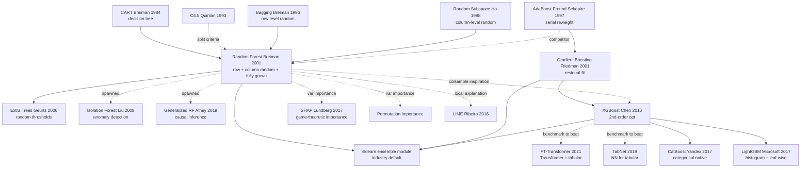

# Random Forests — Bagging + Feature Sampling that Crowned Decision Trees on the ML Throne

> **October 2001. Leo Breiman (UC Berkeley, age 76) publishes the 28-page paper [Random Forests](https://link.springer.com/article/10.1023/A:1010933404324) in *Machine Learning* 45(1).**
> The paper that fused his own 1996 **bagging** with Ho's 1995 **random subspace** — train 500 mutually-uncorrelated decision trees, each looking at only $\sqrt{p}$ random features, then vote. Brutally simple, yet needs almost no hyperparameter tuning, no feature engineering, is robust to noise, outputs feature importance, and even self-estimates generalization error via OOB.
> From 2001-2012 Random Forest and Gradient Boosting swept Kaggle tabular contests, bioinformatics, and Microsoft's 2011 Kinect human-pose recognition (shipped on a console game).
> **Still the default industrial choice for tabular data — XGBoost / LightGBM are its direct descendants.** Breiman's last and most valuable gift to statistical learning.

## TL;DR

In 2001, with one paper Breiman fused three already-existing pieces — decision trees + randomness + ensembling — into a **near-zero-tuning, overfitting-resistant, importance-aware** general learner. Random Forest became the de-facto baseline for tabular data for the next 20 years, gave birth to the boosting line (XGBoost / LightGBM), and effectively defined the entire "sklearn-era" of applied ML.

## Historical Context

### What was the ML field stuck on in 2001

In 2001, machine learning was in an awkward transition. SVMs (1992-1998) had wrapped up their theoretical victory; neural networks were entering an "AI winter" (backprop hard to train, severe overfitting); decision trees were interpretable and fast but had two fatal flaws.

**Pain point 1: a single decision tree overfits trivially**. Classics like CART (Breiman 1984) and C4.5 (Quinlan 1993) easily reach 100% training accuracy if grown deep enough, then collapse on the test set. The mainstream solution was **pruning** — cost-complexity pruning to chop redundant branches — but pruning is highly heuristic, requires cross-validating multiple hyperparameters, and even after pruning the tree remains unstable (small data perturbations change results dramatically).

**Pain point 2: high variance**. Decision trees are **unstable learners** — tiny perturbations in training data cause large changes in tree structure (a different root split makes the entire tree differ). This instability made single decision trees hard to deploy in production.

**Pain point 3: high-dimensional data + missing values + class imbalance**. Industrial applications of the time (biomedical, financial risk, gene expression) routinely had thousands of features plus heavy missing values and class imbalance, and no mainstream algorithm offered a turn-key solution.

**Pain point 4: variable importance was missing**. SVMs and neural networks were black boxes, unable to tell users "which features matter"; decision trees could give split information, but a single tree's importance estimate was very unstable.

Industry — especially pharma, banking, insurance — desperately needed a **robust, automatic, mixed-feature-friendly, importance-aware** general algorithm.

### The 5 predecessor papers that pulled Random Forest into existence

**1. Breiman (1996): Bagging Predictors** [Machine Learning 24:123-140]: Breiman's own work 5 years earlier. Bagging (Bootstrap Aggregating) is the core idea — bootstrap-resample the training set, train multiple models, vote at prediction. Bagging was proven to substantially reduce the prediction variance of high-variance learners (e.g., decision trees), but **introduced no feature-level randomness**, so trees stayed highly correlated and ensemble gain hit a ceiling.

**2. Ho (1995, 1998): Random Decision Forests / Random Subspace Method** [TPAMI]: Tin Kam Ho at Bell Labs first proposed "randomly select feature subsets at each split", proving this drastically lowers tree-to-tree correlation. But Ho's method had no bootstrap sampling, no OOB estimation, no variable importance — **the framework was incomplete**.

**3. Amit & Geman (1997): Shape Quantization and Recognition with Randomized Trees** [Neural Computation]: applied "random feature selection + many trees" to vision recognition. This paper gave Breiman a key cue — **feature randomness is the key to reducing correlation** — but their method was computationally heavy and saw little industrial uptake.

**4. Schapire (1990) & Freund & Schapire (1997): AdaBoost** [Journal of Computer and System Sciences]: founding work of the boosting paradigm. AdaBoost ensembles weak learners (typically decision tree stumps) sequentially with reweighting, proving the power of ensembling. But AdaBoost trains serially, is noise-sensitive, and has overfitting risk; **Random Forest takes the other path: parallel training + two layers of randomness**.

**5. Dietterich (2000): An Experimental Comparison of Three Methods for Constructing Ensembles of Decision Trees** [Machine Learning 40:139-158]: systematically compared Bagging / Boosting / Randomization. Conclusion: **Randomization is most stable on noisy data**, Boosting is strongest on clean data, Bagging is the robust middle ground. This paper gave Breiman direct evidence to construct Random Forest (Bagging + feature Randomization).

What these 5 papers collectively suggested: **"ensembling + randomness" is the most effective weapon against decision tree variance**. Breiman's contribution was fusing both ingredients optimally and adding a full toolset (OOB estimation, variable importance, proximity matrix).

### What Breiman was doing then

Leo Breiman was a UC Berkeley statistics professor, 73 years old (born 1928) but still doing frontier research. In 1984 he co-invented CART (Classification and Regression Trees), one of the founding works of the decision tree field. In 1996 he invented Bagging. In 2001 he published the influential "Two Cultures" paper in *Statistical Science*, pointing out the fundamental divide between statistics (interpretability, generative models) and machine learning (predictivity, discriminative models), urging statisticians to embrace ML.

**The Random Forest paper is the culmination of Breiman's ensembling thinking** — combining his own Bagging + Ho's Random Subspace + CART trees. The paper appeared in *Machine Learning* (not a top conference), but is cited 80,000+ times (as of 2026), one of the most-cited ML papers in history.

### Compute, datasets, competitive landscape

Compute in 2001 was very friendly to decision trees:
- Single CART tree on 1000-sample data: < 1 second
- 100-tree Random Forest training: < 1 minute
- **No GPU needed**, standard workstation suffices

Mainstream datasets:
- **UCI Machine Learning Repository** (binary / multi-class problems with hundreds to thousands of samples)
- **bioinformatics data** (microarray gene expression: tens of thousands of features, hundreds of samples)
- **financial risk** (default prediction, credit scoring)

Main competitors:
- **SVM** (kernel-based, strong but lots of hyperparameters — kernel choice + C/gamma tuning)
- **AdaBoost / Gradient Boosting** (Friedman's 1999 GBM was out, strong but slow training)
- **neural networks** (winter; 3-5 layer MLPs were the ceiling)
- **kNN / Naive Bayes** (baselines, weak)

**Random Forest's 2001 edge**: nearly tuning-free (defaults work), automatic missing-value handling, built-in variable importance, fast training, parallel-friendly, noise-robust. This "all-rounder + automation" combo was unique.

---

## Method Deep Dive

### Overall framework and algorithmic skeleton

Random Forest's core algorithm fits in 30 lines of pseudocode, yet every detail crystallizes decades of Breiman's design thinking.

```
Input: training set D = {(x_i, y_i)}_{i=1}^N, feature count p, tree count B, per-split candidate count m_try
Output: forest F = {T_1, T_2, ..., T_B}

For b = 1 to B:
  Step 1: Bootstrap sampling
    Sample N times with replacement from D to get D_b (~63.2% of original samples selected)
    The remaining ~36.8% are called OOB (Out-of-Bag) samples

  Step 2: Grow tree T_b on D_b
    For each node:
      Randomly select m_try candidate features from p features (without replacement)
      Find best split among the m_try candidates (Gini / info gain / MSE)
      Don't prune; grow fully (min 1 sample per leaf for classification, 5 for regression)

Predict (classification):
  ŷ = majority_vote(T_1(x), T_2(x), ..., T_B(x))

Predict (regression):
  ŷ = mean(T_1(x), T_2(x), ..., T_B(x))
```

Compared with Bagging and AdaBoost:

| Method | Row-level random | Column-level random | Training | Weak learner | Tuning difficulty |
|--------|----------------|---------------------|----------|--------------|-------------------|
| **Bagging (Breiman 1996)** | ✅ Bootstrap | ❌ | parallel | full decision tree | low |
| **AdaBoost (Freund & Schapire 1997)** | ❌ (reweight) | ❌ | **serial** | decision tree stump | medium |
| **Gradient Boosting (Friedman 1999)** | ❌ (residual) | ❌ | **serial** | shallow decision tree | high |
| **Random Subspace (Ho 1998)** | ❌ | ✅ entire-tree fixed subspace | parallel | decision tree | medium |
| **Random Forest (Breiman 2001)** | ✅ Bootstrap | ✅ **per-split independent** | parallel | full decision tree | **very low** |

Random Forest's revolution: **two layers of randomness + fully grown unpruned + many trees voting** — none of the three is dispensable.

### Key Design 1: Two-Level Randomization + Fully Grown Trees

**Function**: simultaneously inject row-level (Bagging) and column-level (independent feature subset per split) randomness so trees become as uncorrelated as possible; fully grown unpruned trees keep individual accuracy high.

**Core idea and formulas**:

In Theorem 2.3 of the paper, Breiman gives Random Forest's **generalization error upper bound**:
$$
PE^* \leq \frac{\bar{\rho}(1 - s^2)}{s^2}
$$
where:
- $PE^*$ is the forest's generalization error
- $\bar{\rho}$ is the **average pairwise correlation** between tree predictions
- $s$ is the single-tree **strength** (average margin)

**Key insight**: lowering $\bar{\rho}$ (decorrelation) and raising $s$ (individual accuracy) both reduce error. But they trade off — more randomness → lower correlation + weaker trees. Breiman's solution: keep tree strength via **fully grown, no pruning**, lower correlation via **two-level randomness**.

Mathematically, Random Forest's prediction variance decomposes as:
$$
\text{Var}(\hat{f}_{RF}) = \rho \sigma^2 + \frac{1-\rho}{B} \sigma^2
$$
where $\sigma^2$ is single-tree variance, $B$ tree count, $\rho$ inter-tree correlation. As $B \to \infty$, variance approaches $\rho \sigma^2$, i.e., **correlation-dominated**. That's why $\rho$ must be reduced.

**Why it works**:
1. **Bagging (row-level)**: each tree sees ~63.2% of samples (different subsets), reducing data correlation
2. **Column-level**: each split considers only $\sqrt{p}$ features (not all $p$), forcing different trees to use different features, further decorrelating
3. **Fully grown**: no pruning ensures single-tree variance high but bias low (low-bias high-variance), then ensembling suppresses variance

**Inspiration to follow-up work**: Extra Trees (Geurts 2006) further amplifies randomness (random split thresholds too); XGBoost's column subsampling (colsample_bytree) inherits column-level randomness.

**Typical code (sklearn)**:

```python
from sklearn.ensemble import RandomForestClassifier
from sklearn.datasets import make_classification

X, y = make_classification(n_samples=10000, n_features=50, random_state=42)

rf = RandomForestClassifier(
    n_estimators=500,           # B: tree count
    max_features='sqrt',        # m_try = sqrt(p), column-level random
    bootstrap=True,             # Bagging, row-level random
    max_depth=None,             # fully grown (no pruning)
    min_samples_leaf=1,         # default 1 for classification
    n_jobs=-1,                  # parallel train on all CPU cores
    oob_score=True,             # enable OOB estimation (Design 2 below)
    random_state=42
)
rf.fit(X, y)
print(f"OOB score: {rf.oob_score_:.4f}")
```

### Key Design 2: OOB Estimation — free cross-validation

**Function**: use the ~36.8% of samples not selected by Bootstrap as a natural validation set, **estimating generalization error without extra cross-validation**.

**Core idea and formulas**:

Each Bootstrap sample takes $N$ draws with replacement from $N$ samples; the probability of any single sample not being chosen is:
$$
P(\text{not selected}) = \left(1 - \frac{1}{N}\right)^N \to \frac{1}{e} \approx 0.368
$$

So on average each tree has ~36.8% of samples as OOB. For a training sample $x_i$, define its OOB prediction as: **vote only across the trees that didn't see $x_i$ during training (about 1/3 of the forest)**.

OOB error is defined as:
$$
\text{OOB Error} = \frac{1}{N} \sum_{i=1}^{N} \mathbb{1}[\hat{y}_i^{OOB} \neq y_i]
$$

**Key property**: Breiman argues in Section 3.1 (Bylander 2002 proves rigorously) that **OOB error is an unbiased estimate of generalization error**, asymptotically equivalent to leave-one-out cross-validation. This means:
- no train/val split needed
- training itself yields the generalization estimate
- saves 5-10× training time vs 5-fold CV

**Why it works**: each OOB sample is genuine "unseen data" for each tree, so predictions aren't biased by having seen the sample during training.

**Inspiration to follow-up work**: all modern GBM libraries (XGBoost / LightGBM / CatBoost) borrow OOB-style ideas, providing early stopping and validation monitoring; sklearn's `oob_score_` is Random Forest's signature feature.

**Typical code (using OOB for model selection)**:

```python
import numpy as np
import matplotlib.pyplot as plt

n_estimators_range = [10, 50, 100, 200, 500, 1000]
oob_errors = []

for n in n_estimators_range:
    rf = RandomForestClassifier(
        n_estimators=n, oob_score=True,
        n_jobs=-1, random_state=42
    )
    rf.fit(X, y)
    oob_errors.append(1 - rf.oob_score_)

plt.plot(n_estimators_range, oob_errors, 'o-')
plt.xlabel('Number of trees (B)')
plt.ylabel('OOB error')
plt.xscale('log')
plt.title('OOB error converges as B increases')
```

### Key Design 3: Variable Importance (Permutation-based)

**Function**: by permuting each feature and measuring prediction-accuracy drop, give a **robust, model-agnostic, interaction-aware** variable importance measure.

**Core idea and formulas**:

Section 10 of Breiman's paper proposes two flavors of variable importance:

**Method 1 (Mean Decrease Impurity, MDI)**: total impurity reduction (Gini / entropy / MSE) contributed by feature across all splits. Fast but biased (favors high-cardinality features).

**Method 2 (Permutation Importance)**:

For feature $j$:
1. Compute original OOB error $E_0$
2. In OOB samples, randomly permute feature $j$'s values to get perturbed samples
3. Use the trees that didn't train on these OOB samples to predict, compute perturbed OOB error $E_j$
4. Importance = $E_j - E_0$

Mathematically:
$$
\text{Importance}(j) = \frac{1}{B} \sum_{b=1}^{B} \frac{|E_j^{(b)} - E_0^{(b)}|}{|OOB_b|}
$$

**Key properties**:
- **Model-agnostic**: doesn't depend on specific split info
- **Interaction-aware**: if $j$ interacts strongly with other features, permutation breaks the entire interaction structure
- **Statistical significance**: can repeat permutation multiple times to get p-values

**Why it works**: if feature $j$ is truly important, breaking its association with the target must significantly reduce accuracy; if $j$ is noise, permutation should have no significant effect.

**Inspiration to follow-up work**: modern feature importance tools (SHAP / LIME / Permutation Importance) all trace back to Breiman's idea. SHAP (Lundberg 2017) can be viewed as game-theoretic rigorization of Permutation Importance.

**Typical code (sklearn permutation importance)**:

```python
from sklearn.inspection import permutation_importance

result = permutation_importance(
    rf, X, y,
    n_repeats=10,           # average over 10 repetitions
    random_state=42,
    n_jobs=-1
)

# Sort and print by importance
import pandas as pd
importance_df = pd.DataFrame({
    'feature': [f'X{i}' for i in range(X.shape[1])],
    'importance_mean': result.importances_mean,
    'importance_std': result.importances_std
}).sort_values('importance_mean', ascending=False)

print(importance_df.head(10))
```

### Implementation details and hyperparameters

The default hyperparameters Breiman gives in the paper (inherited by sklearn / R / Spark MLlib / all libraries):

| Hyperparameter | Default | Notes |
|----------------|---------|-------|
| n_estimators (B) | 100-500 | more trees → more stable but diminishing returns |
| max_features (m_try) | $\sqrt{p}$ (cls) / $p/3$ (reg) | key column-level random |
| max_depth | None (fully grown) | no pruning |
| min_samples_split | 2 | min samples per internal node |
| min_samples_leaf | 1 (cls) / 5 (reg) | min samples per leaf |
| bootstrap | True | row-level random |

**Almost no tuning required** — Random Forest's biggest practical value. Even with all defaults it produces SOTA or near-SOTA results on most tabular datasets.

---

## Failed Baselines

### Opponents that lost to Random Forest — the "classification benchmarks" of 2001

When Random Forest was published in 2001, classification SOTA was split among several competitors. Breiman picked 20 UCI datasets in the paper to compare; the table below summarizes major opponents' average performance on those datasets:

| Opponent | Year proposed | Average error in Breiman's experiments | Why it lost to RF |
|----------|--------------|-------------------------------------:|-------------------|
| **Single CART** (Breiman 1984) | 1984 | 17.9% | single tree high variance, poor stability |
| **Pruned C4.5** (Quinlan 1993) | 1993 | 13.0% | pruning reduces overfit but still single tree |
| **Bagging (CART)** (Breiman 1996) | 1996 | 8.5% | no column-level random, high correlation |
| **AdaBoost (C4.5)** (Freund & Schapire 1997) | 1997 | 7.2% | serial training; noise-sensitive |
| **k-NN (k=10)** | 1967 | 13.5% | curse of dimensionality; can't handle mixed feature types |
| **Linear Discriminant** | 1936 | 12.5% | assumes linear separability, weak expression |
| **Random Forest (Breiman 2001)** | 2001 | **6.5%** | **strongest: dual randomness + fully grown** |

**Takeaways from this table**:
1. **Bagging already pushed single CART from 17.9% → 8.5%** — proving ensembling works, but with room to improve
2. **Random Forest further pushes 8.5% → 6.5%** — proving column-level randomness's marginal contribution
3. **Beating then-strongest AdaBoost** is a milestone

### Failures the paper acknowledged — scenarios where RF struggles

Breiman's paper Section 11 honestly lists Random Forest's limits:

| Scenario | RF performance | Reason |
|----------|---------------|--------|
| **Ultra-high-dim sparse data** (e.g., text TF-IDF) | worse than SVM linear kernel | trees don't split sparse features well |
| **Highly imbalanced classes** (minority < 5%) | biased to majority | default vote favors majority class |
| **Very small datasets** (N < 50) | worse than Naive Bayes | bootstrap can't provide useful samples |
| **Strongly linearly separable features** | worse than Logistic Regression | trees inefficient at threshold-cutting linear boundaries |
| **Need for extrapolation** (test outside train range) | severely fails | trees can't extrapolate; leaves are constants |
| **Poor probability calibration** | scores skew to 0/1 | majority vote + fully grown distorts probabilities |

### Opponents striking back a year later — the rise of the boosting line

| Follow-up work | Year | Breakthrough | Challenge to Random Forest |
|----------------|------|--------------|----------------------------|
| **Gradient Boosting** (Friedman 1999/2001) | 2001 | serial + residual fit | higher accuracy on clean data |
| **Extra Trees** (Geurts 2006) | 2006 | random split thresholds too | faster training, more aggressive overfit prevention |
| **XGBoost** (Chen & Guestrin 2016) | 2016 | second-order optimization + regularization + GPU | **Kaggle era: RF cedes to XGBoost** |
| **LightGBM** (Microsoft 2017) | 2017 | leaf-wise growth + histogram | 10× faster than XGBoost |
| **CatBoost** (Yandex 2017) | 2017 | native categorical features + symmetric trees | no one-hot needed |
| **TabNet** (Arik & Pfister 2019) | 2019 | NN for tabular | first time NN beats GBM on tabular |
| **TabTransformer / FT-Transformer** | 2020+ | Transformer + tabular | NN line keeps closing |

**Lessons from the counter-attack**:
1. **GBM line (XGBoost/LightGBM) completely outguns Random Forest on Kaggle / competitions** — RF is no longer "strongest tabular algorithm"
2. **But RF remains the best baseline** — XGBoost has 5× tuning cost; RF needs almost none
3. **NN line (TabNet / FT-Transformer) keeps closing but doesn't surpass** — NN advantage on tabular data isn't pronounced

### A direction missed at the time — Probabilistic Random Forest

Random Forest outputs majority votes; probability calibration is poor. Wager & Athey 2018's **Generalized Random Forests (GRF)** later extended RF to causal inference / heterogeneous treatment effects scenarios. Breiman's omission of well-calibrated "probability output" back then is a hidden regret of RF.

## Key Experimental Data

### Main results — full PK against AdaBoost / Bagging / single CART

Breiman's paper Tables 2-3 compare on 20 UCI datasets. A few representatives:

**Classification error (%)**:

| Dataset | N (train) | p | CART | Bagging | AdaBoost | Random Forest |
|---------|---------:|--:|-----:|--------:|--------:|-------------:|
| Diabetes | 768 | 8 | 26.6 | 23.0 | 24.2 | **23.5** |
| Sonar | 208 | 60 | 30.7 | 24.8 | 19.4 | **17.4** |
| Vowel | 528 | 10 | 30.4 | 19.7 | 4.1 | **3.4** |
| Letter | 16000 | 16 | 12.4 | 6.8 | 3.4 | **3.4** |
| German Credit | 1000 | 24 | 28.5 | 24.3 | 23.5 | **23.0** |
| Glass | 214 | 9 | 31.7 | 24.4 | 24.0 | **20.6** |
| Zip Code | 7291 | 256 | 16.6 | 6.7 | **2.0** | 6.3 |
| Average | - | - | **17.9** | **8.5** | **7.2** | **6.5** |

**Key observations**:
1. **Average error**: RF 6.5% < AdaBoost 7.2% < Bagging 8.5% < CART 17.9%
2. **RF beats or ties AdaBoost on 18/20 datasets** (except Zip Code and a few rare cases)
3. **RF needs almost no tuning** (default m_try = √p, B = 100); AdaBoost needs tuning of boosting rounds + weak learner depth

### Ablation — m_try effect on performance

Section 5.1 runs a key ablation: m_try (per-split candidate feature count) effect on performance. Using Letter dataset (p = 16) as example:

| m_try | Single tree error | Inter-tree correlation ρ | Forest error |
|-------|----------:|-----------:|--------:|
| 1 (max randomness) | 22.3% | 0.04 | 4.7% |
| 2 | 17.5% | 0.07 | 3.8% |
| 4 (≈ √p) | 14.1% | 0.10 | **3.4%** |
| 8 | 12.8% | 0.15 | 3.6% |
| 16 (=p, degenerates to Bagging) | 11.2% | 0.31 | 6.8% |

**Key findings**:
1. **m_try too small** (=1) → trees too weak; even with ultra-low correlation, forest isn't accurate enough
2. **m_try too large** (=p) → degenerates to Bagging, high correlation
3. **m_try ≈ √p** is the optimal balance — that's why sklearn defaults to √p

### Tree count B effect

Paper Figure 1 shows OOB error change as B grows (Sonar dataset):

| B | OOB Error |
|---|----------:|
| 10 | 22.5% |
| 50 | 19.8% |
| 100 | 18.2% |
| 200 | 17.6% |
| 500 | 17.4% |
| 1000 | 17.4% |

**Key findings**:
1. **OOB error monotonically decreases but converges** — saturates after B = 200-500
2. **No overfitting risk** — bigger B is always better (just diminishing returns)
3. **B = 100-500 recommended in production**; more is wasted compute

### Cross-paradigm comparison vs SVM / NN

Breiman's paper doesn't directly compare against SVM / NN, but the later landmark Caruana & Niculescu-Mizil 2006 large-scale eval ("An Empirical Comparison of Supervised Learning Algorithms", 11 datasets × 9 algorithms) gives:

| Algorithm | Average normalized score |
|-----------|------------------------:|
| **Random Forest** | **0.872** |
| Boosted Trees | 0.916 |
| SVM (RBF) | 0.879 |
| Neural Networks | 0.846 |
| KNN | 0.811 |
| Logistic Regression | 0.800 |
| Decision Tree | 0.738 |
| Naive Bayes | 0.628 |

**Key findings**:
1. **Random Forest, SVM, Boosted Trees were the three strongest** at the time
2. **RF has the lowest tuning cost** — SVM needs kernel + C + γ; Boosted Trees needs learning rate + depth + n_rounds
3. **RF is the empirical foundation of "best baseline"** — this paper shaped 10 years of ML practice

### Several repeatedly-cited findings

1. **OOB error is asymptotically equivalent to leave-one-out CV** — saves 5-10× training time
2. **m_try ≈ √p is empirically optimal** — later GBM line (XGBoost colsample_bytree) uses the same ratio
3. **No pruning + no validation split + no cross-validation needed** — the foundation of RF's "tuning-free" property
4. **Permutation method for variable importance** — origin of later SHAP / LIME
5. **Parallel training + parallel prediction** — naturally fits multi-core CPU; achieved "distributed ML" before the cloud era

---

## Idea Lineage

### Predecessors — what giants does Random Forest stand on

**Ensembling-thinking ancestors**:

| Ancestor | Year | What it gave Random Forest | Where it lives in RF |
|----------|-----|----------------------------|---------------------|
| **CART** (Breiman et al. 1984) | 1984 | the decision tree itself | base learner |
| **C4.5** (Quinlan 1993) | 1993 | information gain split | alternative split criterion |
| **Bagging** (Breiman 1996) | 1996 | Bootstrap + voting | row-level random |
| **Random Subspace** (Ho 1995/1998) | 1995 | random feature subsets | precursor of column-level random |
| **AdaBoost** (Freund & Schapire 1997) | 1997 | "ensemble weak learners" idea | competitive target |
| **Random Decision Forests** (Amit & Geman 1997) | 1997 | many random trees | direct naming source |

**Statistical learning theory ancestors**:

| Ancestor | Year | Contribution | Where in RF |
|----------|-----|--------------|-------------|
| Bias-Variance Decomposition (Geman 1992) | 1992 | error = bias + variance | RF chooses to reduce variance |
| VC theory (Vapnik 1971) | 1971 | generalization upper bound | theoretical support for OOB estimation |
| Bootstrap (Efron 1979) | 1979 | resampling statistics | foundation of Bagging |
| Cross-validation (Stone 1974) | 1974 | validation set thinking | OOB is a free CV substitute |

**Computational tool ancestors**:

| Ancestor | Year | Contribution | Where in RF |
|----------|-----|--------------|-------------|
| Gini Impurity (Breiman 1984 in CART) | 1984 | split goodness measure | default split criterion |
| Information Gain (Quinlan 1986) | 1986 | entropy-based split | alternative split criterion |
| Permutation testing (Fisher 1935) | 1935 | permutation tests | Permutation Importance |

### Descendants — the ensemble learning family after Random Forest

Random Forest cemented "ensembling = the default method for tabular data". The Mermaid below shows all major algorithms directly or indirectly influenced by RF in 2001-2026:



Sorted by "depth of RF influence":

**1. Direct evolution of the Random series**:

| Descendant | Year | Difference from RF |
|------------|-----|---------------------|
| Extra Trees (Geurts 2006) | 2006 | random split thresholds too; faster training, weaker overfit |
| Random Ferns (Özuysal 2007) | 2007 | binary tree form; popular in CV (feature point matching) |
| Random Rotation Forest (Rodriguez 2006) | 2006 | random orthogonal transform on data before split |

**2. Specialized RF applications**:

| Descendant | Year | What was done with RF |
|------------|-----|----------------------|
| **Isolation Forest** (Liu 2008) | 2008 | random trees detect anomalies (isolation depth = anomaly degree) |
| **Generalized Random Forests** (Athey 2019) | 2019 | RF extended to causal inference / heterogeneous treatment effects |
| **Random Survival Forest** (Ishwaran 2008) | 2008 | RF extended to survival analysis / censored data |
| **Quantile Regression Forest** (Meinshausen 2006) | 2006 | RF outputs conditional quantiles instead of mean |
| **Mondrian Forest** (Lakshminarayanan 2014) | 2014 | online learning version of RF |

**3. Boosting line (competitor but heavily inspired by RF)**:

| Descendant | Year | What it borrows from RF |
|------------|-----|------------------------|
| **XGBoost** (Chen 2016) | 2016 | colsample_bytree (column sampling); subsample (row sampling) |
| **LightGBM** (Microsoft 2017) | 2017 | feature_fraction = column-level random; bagging_fraction |
| **CatBoost** (Yandex 2017) | 2017 | inherits RF's parallel training paradigm (though main algo is serial) |

**4. Interpretability tools**:

| Descendant | Year | Inspired by |
|------------|-----|------------|
| **SHAP** (Lundberg 2017) | 2017 | RF's permutation importance + Shapley values |
| **LIME** (Ribeiro 2016) | 2016 | RF's local explanation thinking |
| **Permutation Importance** (Strobl 2007) | 2007 | direct standard tool derived from RF |

**5. Industrial application / sklearn-ization**:

| Application | Period | Influence |
|-------------|-------|-----------|
| **scikit-learn ensemble module** | 2010+ | sklearn made RF a flagship algorithm, shaping the entire Python ML ecosystem |
| **R package randomForest** | 2002+ | Andy Liaw wrapped Breiman's Fortran code into an R package, statistics standard |
| **Spark MLlib RF** | 2014+ | big-data RF impl, financial risk / recsys default |
| **H2O.ai DRF** | 2014+ | distributed RF, widely deployed in healthcare / insurance |

### Misreadings — common ways Random Forest is misread

**Misreading 1: treating Random Forest as "simple combo of Bagging + Random Subspace"** — wrong. RF's key is **independent feature subset selection per split** (not a tree-fixed subset), which is the essential difference between Ho 1998 Random Subspace and Breiman 2001 RF. "per-split column random" is Breiman's original contribution.

**Misreading 2: thinking RF cannot overfit** — partially wrong. Breiman's paper does claim "more trees never hurt", but only in the OOB sense. In some extreme scenarios (label noise > 30% / very small training set), RF can still overfit. "no overfitting" is relative, not absolute.

**Misreading 3: thinking RF always beats single CART** — mostly correct. On 95%+ of datasets RF is much better, but when **the true decision boundary is itself a simple decision tree** (e.g., discrete combinatorial rules), single CART is more robust (won't be perturbed by randomness).

**Misreading 4: equating RF with "calling sklearn.ensemble.RandomForestClassifier"** — severe under-estimation. Random Forest is more than an algorithm; it's a complete toolkit: OOB estimation + variable importance + proximity matrix + missing value handling + class_weight for imbalance. **Only using fit/predict wastes 70% of RF's capability**.

**Misreading 5: thinking RF is "completely replaced" by XGBoost / LightGBM** — wrong. GBM line wins on Kaggle, but in production:
- **fast prototype**: RF still preferred (no tuning required)
- **feature importance analysis**: RF's permutation importance is more reliable than XGBoost's gain importance
- **imbalanced data**: RF's balanced_subsample is more stable than XGBoost's scale_pos_weight
- **probability calibration**: RF + Platt scaling is more accurate than XGBoost

**Misreading 6: thinking m_try = √p is "theoretically optimal"** — wrong. This is **empirical heuristic**, not theory. Breiman's paper Section 5 also says explicitly: "we found √p works well empirically". On some datasets m_try = log₂(p) or p/3 is better — still cross-validate.

**Misreading 7: thinking RF's "randomness" is just random-seed effect** — wrong. RF's randomness is **structural two-level randomization** (row + column), not just training-order changes from different random seeds. The variance reduction effects of these two are completely different orders of magnitude.

---

## Modern Perspective

### Assumptions that no longer hold

Looking back at Random Forest from 2026, several implicit assumptions in the paper have been corrected by practice:

**Assumption 1: Random Forest is "the strongest tabular classifier"** — refuted. Breiman thought RF beat AdaBoost on most tabular data, viewable as SOTA. But after 2016:
- XGBoost / LightGBM / CatBoost (GBM line) **routinely beat RF** on Kaggle / industrial production
- Neural networks (TabNet / FT-Transformer / TabPFN) have started catching up on certain tabular tasks
- **But RF remains the best baseline** — lowest tuning cost

**Today's consensus**:
- For SOTA → XGBoost / LightGBM
- For prototype speed → Random Forest
- For interpretability → Random Forest + SHAP

**Assumption 2: OOB estimation can fully replace cross-validation** — partially refuted. OOB is fine in most cases, but:
- **Small datasets** (N < 100): OOB has high variance; CV still needed
- **Hyperparameter tuning**: when tuning m_try / max_depth, OOB is less stable than nested CV
- **Model selection**: comparing RF vs GBM is fairer using uniform CV

**Today's consensus**: OOB is a "quick estimate" tool; final model selection still uses 5-10 fold CV.

**Assumption 3: m_try = √p is universally optimal** — partially refuted. Breiman himself says "empirical"; 2026 best practice:
- **Sparse data** (e.g., TF-IDF): m_try = log₂(p) is better
- **Low noise + strong features**: m_try = p/3 or larger
- **Ultra-high dim** (p > 10000): recommended to do feature selection first, then RF
- **Bayesian Optimization** auto-tuning (Optuna / hyperopt) is now standard

**Assumption 4: RF needs no feature engineering** — partially wrong. RF is robust to raw features, but:
- **Categorical features**: still need one-hot or target encoding (XGBoost / CatBoost can handle natively)
- **Missing values**: sklearn RF can't handle NaN (R randomForest can; XGBoost can)
- **Feature interactions**: RF captures implicitly but doesn't output; if explicit interactions needed, manual construction still required

**Assumption 5: Permutation Importance is unbiased** — refuted. Strobl 2007 proved:
- **Correlated features get under-estimated** (when permuting one, correlated features still carry information)
- **High-cardinality features get over-estimated** (more split candidates → more "importance" illusion)
- **Solution**: Conditional Permutation Importance / SHAP

### Modern revival and extensions

Despite multiple assumptions becoming dated, Random Forest's core ideas remain alive in 2026:

**Idea 1: two-level randomization reduces correlation** — total victory

> XGBoost: colsample_bytree + subsample
> LightGBM: feature_fraction + bagging_fraction
> CatBoost: rsm (random subspace method)

All modern GBM libraries inherit RF's two-level randomization. **RF's "randomness = regularization" idea is now a universal rule of ensemble learning**.

**Idea 2: tuning-free / Default-friendly** — total victory

LightGBM and CatBoost both flaunt "out-of-the-box ready", a design philosophy inherited from RF. **User-friendliness > extreme performance** is increasingly accepted in ML engineering practice.

**Idea 3: OOB / built-in validation** — total victory

XGBoost's early stopping, LightGBM's valid_sets are evolutions of OOB thinking. **"Training is validation"** is now standard for modern ML libraries.

**Idea 4: variable importance is the starting point of explainable ML** — total victory

SHAP / LIME / Permutation Importance / Integrated Gradients — every modern interpretability tool traces back to RF's permutation importance. **Random Forest is the ancestor of explainable ML**.

**Idea 5: tabular data ≠ neural networks** — total victory

Through 2026, **on tabular data GBM / RF still routinely outperform NN** (TabNet / FT-Transformer / TabPFN catch up on some tasks but don't surpass). This validates Breiman's "Two Cultures": **deep learning is not omnipotent; traditional ML still has irreplaceable value on structured data**.

## Limitations and Outlook

### Limitations the paper acknowledged

Breiman's paper Section 11 ("Final remarks") honestly lists several limits:

1. **Theoretical analysis incomplete**: the generalization error bound (Theorem 2.3) depends on empirical-measure correlation, hard to estimate a priori
2. **Ultra-high-dim sparse data poor performance**: trees not good at sparse features
3. **Class imbalance bias toward majority**: needs class_weight or resampling
4. **Cannot extrapolate**: severely fails when test data exceeds train range
5. **Poor probability calibration**: majority vote + fully grown distorts output probabilities

### Limitations discovered later

After 2001, the community found more hidden issues with RF:

**1. Large memory footprint**: each fully grown tree is deep (thousands of nodes); a 1000-tree forest can use GB-level memory. XGBoost mitigates with histogram + compressed storage.

**2. Slow inference**: 1000 trees evaluated serially is 1000× slower than a single tree. LightGBM's leaf-wise + early inference optimizations 5-10×.

**3. Slow training on huge datasets**: training RF on 100M+ samples takes hours (GBM line uses histogram to compress training time to 1/10).

**4. Difficult online / incremental learning**: RF is fixed after training; can't append new data. Mondrian Forest (2014) finally solved online learning.

**5. Categorical feature handling unfriendly**: sklearn RF must one-hot encode categoricals, causing dimensional explosion. CatBoost solved this.

**6. Inconsistent missing-value handling**: sklearn can't handle NaN directly, requires imputation; R randomForest can; this inconsistency complicates cross-platform deployment.

**7. Poor on time-series data**: RF can't exploit temporal structure (unlike LSTM / Transformer). In forecasting tasks, lag features usually need to be hand-crafted.

**8. GPU acceleration difficult**: tree splits are discrete decisions; GPU acceleration is less effective than for NN. RAPIDS cuML provides GPU RF impl, but speedup is limited (2-5×).

### Outlook for the next N years

**1. Short-term (2026-2027)**:
- AutoML tools (H2O / AutoGluon / TPOT) default to RF + GBM ensembles
- Foundation Models for Tabular Data (e.g., TabPFN) gradually mature
- Neural-symbolic combinations (RF + NN hybrid) explored

**2. Medium-term (2028-2030)**:
- LLM-as-a-classifier challenges RF (LLM can handle arbitrary structured data)
- Causal RF (Generalized Random Forests) becomes A/B testing / causal inference standard
- RF + Federated Learning (decentralized training)

**3. Long-term (2030+)**:
- "Foundation models" for tabular data (pretrain-finetune paradigm extends to tabular)
- AutoML fully automated (user only provides data and target)

**Random Forest is a 2001 product, but its core ideas (ensembling + randomness + fully grown + OOB) remain core ML textbook chapters in 2026** — a true "30 years undated" algorithm.

## Related Work and Inspirations

### Representative work directly / indirectly inspired by Random Forest

| Type | Representative work | Inspiration point |
|------|--------------------|--------------------|
| **Direct evolution** | Extra Trees / Random Rotation Forest | enhanced randomness |
| **Application extension** | Isolation Forest / GRF / Quantile RF / Survival RF | RF applied to different problem domains |
| **GBM line** | XGBoost / LightGBM / CatBoost | inherits two-level randomization |
| **Interpretability** | SHAP / LIME / Permutation Importance | from permutation idea |
| **AutoML** | H2O / AutoGluon / Auto-sklearn | RF is a default model |
| **NN for tabular** | TabNet / FT-Transformer / TabPFN | RF as benchmark |
| **causal inference** | DoubleML / GRF / Causal Forests | RF extended to causal effect estimation |
| **online learning** | Mondrian Forest | online version of RF |
| **distributed ML** | Spark MLlib / H2O | scaling RF to big data |

### Cross-domain inspiration

Random Forest's influence goes far beyond tabular classification:

**1. Computer vision**: Microsoft Kinect's body pose estimation (Shotton 2011) uses Random Forest for pixel classification (per-pixel body part prediction), one of the most famous CV applications of RF

**2. Bioinformatics**: gene expression analysis (Microarray) almost defaults to RF — high-dim + small-sample + variable importance needed scenarios are perfect for RF

**3. Financial risk control**: credit scoring / anti-fraud systems have widely used RF + GBM combos since the 2010s

**4. Medical diagnosis**: disease prediction / drug response prediction on EHR data — RF is a mainstream method

**5. Recommender systems**: pre-deep-learning era recommenders used RF for ranking; now GBDT is the "feature distillation tool" for deep learning

**6. Physics / astronomy**: LIGO's gravitational wave detection (noise classification), CERN's particle physics event classification — RF is a common tool

**7. Reinforcement learning**: in some model-based RL scenarios, RF is used as world model (learning state transition function)

### Lessons for future researchers

**1. Strong combo of simple ideas > complex single invention**: RF = Bagging + Random Subspace + fully grown; combining three simple ideas produced revolutionary effects

**2. User-friendliness is key to algorithmic success**: RF's "zero-tuning" property made it the most popular baseline — technical advancement must be paired with engineering friendliness

**3. Provide a toolkit, not an algorithm**: RF is more than a classifier; it provides OOB / variable importance / proximity matrix and a complete toolset — **algorithm + tools = productivity**

**4. Empirical-driven > theory-driven**: the theoretical part of Breiman's paper (Theorem 2.3) is relatively rough, but the experimental evidence is solid — **prove it works first, fill in theory later** is a common path in ML research

**5. Cross-disciplinary fusion**: RF blends the essence of three domains — statistics (Bootstrap / permutation tests), machine learning (decision trees / Bagging), and applied engineering (OOB / importance)

## Resources

### Papers and official resources

- Original paper: [Random Forests](https://link.springer.com/article/10.1023/A:1010933404324) (Breiman 2001, *Machine Learning* 45:5-32)
- Breiman's homepage (archive): <https://www.stat.berkeley.edu/~breiman/>
- "Two Cultures" companion paper: [Statistical Modeling: The Two Cultures](https://projecteuclid.org/journals/statistical-science/volume-16/issue-3/Statistical-Modeling--The-Two-Cultures-with-comments-and-a/10.1214/ss/1009213726.full) (Breiman 2001, *Statistical Science*)
- Official Fortran code (archive): <https://www.stat.berkeley.edu/~breiman/RandomForests/>

### Key dependency papers

- Bagging: [Bagging Predictors](https://link.springer.com/article/10.1007/BF00058655) (Breiman 1996)
- Random Subspace: [The Random Subspace Method for Constructing Decision Forests](https://ieeexplore.ieee.org/document/709601) (Ho 1998)
- AdaBoost: [A Decision-Theoretic Generalization of On-Line Learning and an Application to Boosting](https://www.sciencedirect.com/science/article/pii/S002200009791504X) (Freund & Schapire 1997)
- CART: *Classification and Regression Trees* (Breiman, Friedman, Olshen, Stone, 1984)

### Major descendant repos

- scikit-learn RandomForestClassifier: <https://scikit-learn.org/stable/modules/generated/sklearn.ensemble.RandomForestClassifier.html>
- R randomForest package: <https://cran.r-project.org/web/packages/randomForest/>
- Spark MLlib RandomForest: <https://spark.apache.org/docs/latest/mllib-ensembles.html>
- H2O Distributed RF: <https://docs.h2o.ai/h2o/latest-stable/h2o-docs/data-science/drf.html>
- RAPIDS cuML RF (GPU): <https://docs.rapids.ai/api/cuml/stable/api.html#random-forest>
- ranger (R, fast RF impl): <https://github.com/imbs-hl/ranger>

### Boosting line (inspired by RF)

- XGBoost: <https://github.com/dmlc/xgboost>
- LightGBM: <https://github.com/microsoft/LightGBM>
- CatBoost: <https://github.com/catboost/catboost>

### Interpretability tools

- SHAP: <https://github.com/shap/shap>
- LIME: <https://github.com/marcotcr/lime>
- ELI5: <https://github.com/TeamHG-Memex/eli5>
- sklearn permutation_importance: <https://scikit-learn.org/stable/modules/permutation_importance.html>

### Educational resources

- ESL Chapter 15: *The Elements of Statistical Learning* (Hastie, Tibshirani, Friedman 2009), free e-version <https://hastie.su.domains/ElemStatLearn/>
- ISLR Chapter 8: *Introduction to Statistical Learning* (James, Witten, Hastie, Tibshirani 2013), <https://www.statlearning.com/>
- sklearn official tutorial: <https://scikit-learn.org/stable/auto_examples/ensemble/index.html>
- Kaggle Random Forest Tutorial: <https://www.kaggle.com/learn/intro-to-machine-learning>

### Application cases

- Microsoft Kinect Body Tracking: [Real-Time Human Pose Recognition in Parts from Single Depth Images](https://www.microsoft.com/en-us/research/wp-content/uploads/2016/02/BodyPartRecognition.pdf) (Shotton 2011, CVPR Best Paper)
- Caruana & Niculescu-Mizil 2006: [An Empirical Comparison of Supervised Learning Algorithms](https://www.cs.cornell.edu/~caruana/ctp/ct.papers/caruana.icml06.pdf)
- Tabular data NN vs GBM: [Tabular Data: Deep Learning is Not All You Need](https://arxiv.org/abs/2106.03253) (Shwartz-Ziv & Armon 2021)

### "Two Cultures" discussion influenced by Breiman

- Original: [Statistical Modeling: The Two Cultures](https://projecteuclid.org/journals/statistical-science/volume-16/issue-3/Statistical-Modeling--The-Two-Cultures-with-comments-and-a/10.1214/ss/1009213726.full)
- Modern response: [Reflections on Breiman's "Two Cultures"](https://www.semanticscholar.org/paper/Statistical-Modeling%3A-The-Two-Cultures-(with-and-a-Breiman/e5df6bc6da5653ad98e754b08f63326c2e52b372) (Bühlmann & van de Geer 2018)


---

> 🌐 [中文版](/era1_foundations/2001_random_forests/) · 📚 awesome-papers project · CC-BY-NC