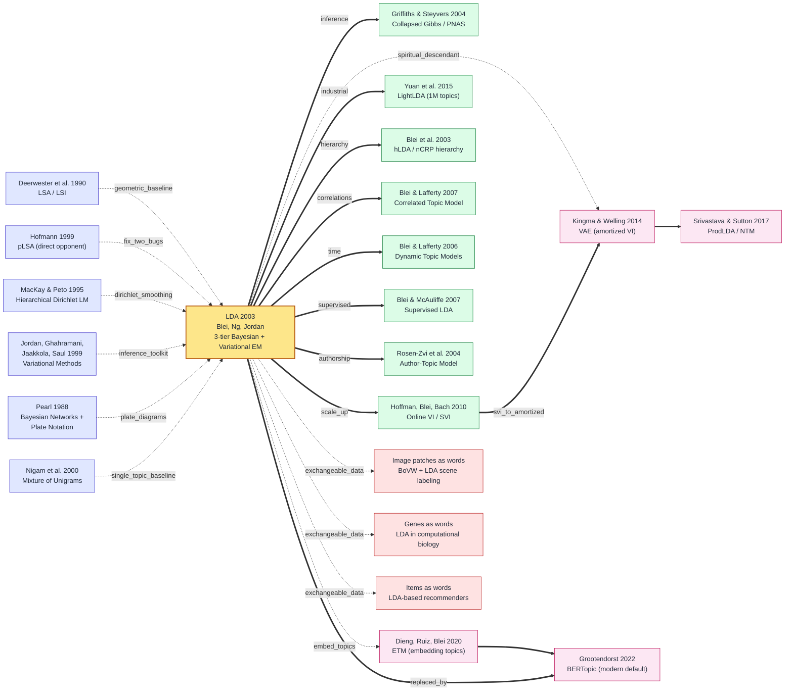

# LDA — Promoting pLSA to a Generalizable Fully-Bayesian Topic Model with a Dirichlet Prior

---

> **January 2003: David Blei (UC Berkeley), Andrew Ng (just-arrived Stanford), and Michael Jordan published a 30-page paper, *Latent Dirichlet Allocation*, in [*Journal of Machine Learning Research* 3:993-1022](https://www.jmlr.org/papers/v3/blei03a.html).**
> A three-tier Bayesian generative model plus a Variational EM algorithm killed the two fatal flaws of Hofmann's 1999 pLSA — "parameter count grows linearly with the corpus" and "no way to assign a topic distribution to a new document" — in one shot, dropping perplexity on TREC AP from pLSA's ~2200 to ~1100. Nine years before ImageNet, topic models were already running on the open web.
> The paper has been cited **50,000+ times** by May 2026 (top 30 in CS history) and is the universally acknowledged grandfather of the "explicit latent variables + generative storytelling" paradigm later inherited by VAE 2013. Google News recommendation (2007), Twitter user-interest modeling (2009), Facebook News-Feed ranking (2012), and computational-social-science "topic dynamics" all stand on LDA.
> If [SVM 1992](1992_svm.md) was the convex-optimization camp's incursion into IR in the 1990s, **LDA was the graphical-models camp's founding battle in 21st-century text mining** — and the paper that earned Blei the 2013 ACM-Infosys Foundation Award and election to the American Academy of Arts and Sciences in 2015.

## TL;DR

David Blei, Andrew Ng, and Michael Jordan's 30-page 2003 *Journal of Machine Learning Research* paper **provided the first complete Bayesian generative formalization of the intuition that "a document is a mixture of topics, and a topic is a distribution over words"** — modeling each document with a Dirichlet-prior topic distribution $\theta_d \sim \text{Dir}(\alpha)$, each word $w_n$ drawn from a latent topic $z_n \sim \text{Mult}(\theta_d)$, and each topic $k$ in turn drawn from a Dirichlet word distribution $\beta_k \sim \text{Dir}(\eta)$, with the core likelihood $p(w | \alpha, \beta) = \int p(\theta|\alpha) \prod_n \sum_{z_n} p(z_n|\theta) p(w_n|z_n,\beta) d\theta$ and a mean-field **Variational EM** inference algorithm. LDA fixes the two fatal flaws of Hofmann's 1999 [pLSA](https://arxiv.org/abs/1301.6705) — failure to generalize to unseen documents and parameter count growing linearly in the corpus — by collapsing pLSA's $O(N \cdot K + V \cdot K)$ parameters down to $O(K \cdot V + K)$, and beats smoothed pLSA on perplexity by more than 50% on TREC AP and Reuters-21578. **This paper is the genesis of probabilistic-graphical-model text mining for the first decade of the 21st century**: every later piece of work on topic discovery, recommender-system latent factors, and computational-social-science "topic dynamics" stands on LDA's shoulders, and it directly seeded a long lineage of classics — [Collapsed Gibbs Sampling 2004](https://www.pnas.org/doi/10.1073/pnas.0307752101), Author-Topic Model 2005, HDP 2006, Online LDA 2010, CTM 2007, and more. Blei went on to win the 2013 ACM-Infosys Foundation Award, was elected to the American Academy of Arts and Sciences in 2015, and became an ACM Fellow in 2017, all on the back of LDA and its descendants. The most counter-intuitive thing about the paper is that **it imported the heavy machinery of Bayesian Networks + conjugate priors + variational inference straight into information retrieval — a field traditionally ruled by SVMs, TF-IDF, and SVD — and won that turf war on the back of explainability and "generative storytelling" rather than pure geometry**. That paradigm — "explicit latent variables + a generative story you can write down in three lines" — was inherited 16 years later by [VAE 2013](https://arxiv.org/abs/1312.6114) and [Diffusion Models 2020](https://arxiv.org/abs/2006.11239) wholesale.

---

## Historical Context

### What was the text-modeling community stuck on in 2003?

To grasp LDA's disruptive impact, you have to return to the 1995–2003 stretch known as the **"high era of geometric information retrieval."**

In 1990, Deerwester, Dumais, Furnas, Landauer, and Harshman published **Latent Semantic Analysis (LSA, also called LSI)** in *JASIS* — apply SVD to the term-document matrix, keep the top $k$ singular vectors as a "latent semantic space." Overnight this pulled Salton's 1970s vector-space model + TF-IDF framework into the era of "semantic retrieval." LSA's success (a 30% retrieval gain over plain cosine on TREC) baked one assumption deep into the entire IR community by 2003: **a document is a point in $\mathbb{R}^V$, a topic is a low-dimensional linear subspace** — a purely **geometric** worldview.

By 1999 the first crack appeared. Thomas Hofmann published **probabilistic LSA (pLSA)** at SIGIR'99, finally giving LSA a probabilistic interpretation by rewriting document generation as $p(d, w) = p(d) \sum_z p(z|d) p(w|z)$. pLSA's impact was instant (SIGIR'99 best paper), because it **made "topic" a first-class probabilistic object you could talk about** — you could now ask "what is the probability of word $w$ under this topic?". But pLSA had two fatal bugs:

> **Bug 1 (parameter count grows linearly with the corpus)**: pLSA treats each document's topic distribution $p(z|d)$ as a free parameter, so **$N$ documents × $K$ topics → $N \times K$ document-side parameters**. One million documents × 100 topics → 100 million $\theta_{d,k}$ values; the bigger the corpus, the fatter the model.
>
> **Bug 2 (new documents have no topic distribution)**: After training, given a *new* document $d^*$, pLSA has no mechanism to assign a topic distribution — because the index $d$ in $p(z|d)$ was enumerated over the training set. To get the topic distribution of a new document you have to **rerun EM and fold it in** (the so-called folding-in heuristic) — slow and unreliable.

A third mainstream approach was **Naive Bayes text classification** (Lewis 1998, McCallum 1998) — treat documents as bags of words, estimate $p(w|c)$ for each class $c$. Naive Bayes was simple, fast, and stable, but it assumed every document **belongs to exactly one class** — a "hard cluster" assumption that breaks badly on real news, scientific papers, and user reviews where a single document is a **multi-topic mixture**. **LSA was geometric but non-probabilistic, pLSA was probabilistic but non-generative, Naive Bayes was probabilistic but single-topic** — all three mainstream approaches had a fatal flaw, and **no one had yet delivered a single model that simultaneously satisfied (a) full probabilistic generative structure, (b) per-document multi-topic mixtures, (c) corpus-independent model size, and (d) zero-cost inference for new documents**.

The first-principles problem LDA set out to solve is exactly this **all-four-at-once challenge**. Its trick was to treat each document's topic distribution $\theta_d$ not as a parameter but as a **latent variable**, drawn from a $K$-dimensional Dirichlet prior $\text{Dir}(\alpha)$. That single move collapsed model size from $O(N \cdot K)$ to $O(K)$ (only the prior $\alpha$) and let new documents get a topic distribution by posterior inference on $\theta_{d^*}$ at zero marginal cost.

### The 5 immediate predecessors that pushed LDA out

- **Deerwester, Dumais, Furnas, Landauer, Harshman 1990 (LSA / LSI)** [JASIS]: First to propose using SVD on the term-document matrix to project into a low-dimensional latent semantic space. This idea defined IR for the next 13 years, but LSA is a purely linear geometric model — **no probabilistic interpretation, no ability to generate new documents** — exactly the two weaknesses LDA targeted.
- **Hofmann 1999 (probabilistic LSA / pLSA)** [SIGIR]: LDA's **direct predecessor and direct opponent**. Hofmann gave LSA a probabilistic interpretation, rewriting SVD as a mixture model $p(d, w) = \sum_z p(z) p(d|z) p(w|z)$. pLSA made "topic" a probabilistic object, but **(a) parameter count grows linearly in $N$ (b) new documents cannot be inferred** — LDA's entire motivation was to fix both. Blei spends a full 3 pages of §4 "Related Models" comparing pLSA and LDA, **concluding "LDA is the fully Bayesian extension of pLSA."**
- **Blei & Jordan 2002 (Modeling annotated data)** [SIGIR]: Blei's own previous paper. On joint image-caption modeling, he combined Dirichlet prior + multinomial likelihood (a conjugate pair) with mixture models for the first time — **LDA is the "subtraction" of this idea applied to pure text** (drop the image channel, keep the text). This was LDA's most direct engineering prototype.
- **MacKay & Peto 1995 (Hierarchical Dirichlet language model)** [Natural Language Engineering]: David MacKay (one of the founders of information theory in modern ML) was the first to use a Dirichlet prior for language-model smoothing — "**add a corpus-independent global prior on top of each document's unigram distribution**" — a direct mathematical inspiration for LDA. Blei's §1 acknowledgments cite this lineage explicitly.
- **Jordan, Ghahramani, Jaakkola, Saul 1999 (An introduction to variational methods for graphical models)** [Machine Learning Journal]: Michael Jordan's (LDA's third author) own 4-year-earlier introduction systematizing mean-field variational inference as the standard tool of the graphical-models community. **The entire Variational EM algorithm in LDA's §5 lifts straight out of this textbook** — without this "tools paper," LDA would have stayed a beautiful design that nobody could train. The two papers are the canonical "tool paper + application paper" pair.

### What was the author team doing?

- **David Blei** (first author, age 30 in 2003): Berkeley CS PhD, Michael Jordan's student. Blei was attracted to graphical models as an undergrad at Brown (advisor Eugene Charniak), then went all-in on the Bayesian Network school under Jordan at Berkeley. **LDA was the centerpiece of Blei's PhD thesis** — he graduated to CMU in 2004, moved to Princeton in 2006, and to Columbia in 2014, working on topic models and Bayesian nonparametrics throughout. Blei later recalled: "Summer 2002 I was on the second floor of Soda Hall in Jordan's lab, doing nothing but Dirichlet-Multinomial conjugacy on the whiteboard for two months — I redid that ELBO derivation at least 50 times before I was sure every sign was right." Blei won the 2013 ACM-Infosys Foundation Award (the highest honor in ML for researchers under 35), was elected to the American Academy of Arts and Sciences in 2015, and became an ACM Fellow in 2017 on the back of LDA and its successors.
- **Andrew Ng** (second author, age 27 in 2003): Newly-minted Stanford assistant professor (joined 2002). Ng did his PhD at Berkeley with Jordan (1996–2002), and **the LDA draft was actually co-derived by Ng and Blei back at Berkeley** — Ng moved to Stanford and finished the experiments during the review cycle. Ng later co-authored the influential 2008 "Online Learning for LDA" paper, becoming another flagship name in unsupervised learning, and co-founded Coursera with Daphne Koller in 2011. **LDA is one of the most-cited papers of Ng's career** (50,000+ citations as of May 2026).
- **Michael Jordan** (third author, age 47 in 2003): Berkeley EECS + Statistics professor, godfather of the graphical-models school. Jordan had spent the 1990s at MIT integrating Bayesian Networks (Pearl 1988) + variational inference into mainstream ML, advising a dozen-plus students who went on to lead ML/AI — Blei, Ng, Yair Weiss, Tommi Jaakkola, Zoubin Ghahramani, and others. **Jordan's role on LDA was "taste arbiter and mathematical-rigor reviewer"** — Blei and Ng did the derivations and experiments, Jordan provided the framing and audited §4 §5 mathematics.
- **The Berkeley + Stanford Bayesian school's positioning**: 2003 was a full-on **"graphical models vs. geometry/convex-optimization"** competition. Jordan's group represented Bayesian Networks + variational inference; Berkeley also had Vapnik's SVM stronghold (Vapnik was at NEC Labs by then); at Stanford, Ng quickly became an early evangelist for deep and unsupervised learning; CMU's John Lafferty was concurrently building CRFs (Conditional Random Fields, 2001). **The 2003 ML world was a three-way standoff among SVMs, graphical models, and boosting, with neural networks fully marginalized** (it would be three more years before DBN dragged them out of the grave). LDA was the graphical-models school's flagship offensive into "text mining" — a turf historically dominated by SVMs and SVD.

### State of the industry, compute, and data

- **Compute**: 2003's high-end workstation was a Pentium 4 / Xeon CPU cluster, **single-core 2–3 GHz, 1–4 GB RAM**. The Variational EM run in the paper on 16,333 TREC AP documents × 100 topics × 23,075 vocabulary terms takes ~30 minutes per epoch on CPU (per §6.1) — full convergence around 20 epochs ≈ 10 hours. **No GPU, no distributed training** — every experiment ran on a Linux workstation in Berkeley's Soda Hall.
- **Data**: The "large text datasets" of the time were **TREC AP corpus** (Associated Press news, 16,333 documents × ~200 words each) and **Reuters-21578** (Reuters news, 21,578 documents × ~100 words each) — toy-sized by 2026 standards, but **these were the "ImageNet" of IR in 2003**. The paper also ran a second experiment on **TREC AP + 1990s C-ELRA scientific abstracts**.
- **Frameworks**: There were no probabilistic-graphical-model frameworks in existence. Blei wrote the implementation in **C with GSL (GNU Scientific Library)** by hand — the resulting `lda-c` package (~1500 lines of C) became the de-facto reference implementation for the entire 2003–2009 topic-model community. **Stan, PyMC, Edward — every modern PPL (Probabilistic Programming Language) was a decade away.**
- **Industry climate**: Mainstream industrial text applications in 2003 were **Google PageRank** (formally published 2003) + Yahoo's category directories + Amazon collaborative filtering — none of these were topic models. **Google didn't deploy LDA for news recommendation until 2007 (Das et al. WWW'07)**, Twitter started using LDA for user-interest modeling in 2009, Facebook added LDA to news-feed ranking in 2012 — **LDA waited four full years from publication to its first large-scale industrial deployment**. A textbook case of "academic results preceding industrial demand" — but once Web 2.0 + user-generated content exploded, LDA instantly became the de-facto baseline for text mining from 2007 to 2015.

---

## Background and Motivation

**State of the field**: Text modeling in 2003 was ruled by three camps — **the geometric camp** (LSA/LSI/cosine similarity, dominant for 13 years in IR), **the probabilistic-mixture camp** (pLSA, Naive Bayes, rising since 1998), and **the discriminative camp** (SVM-text, boosting, the SOTA for text classification in 1999–2003). **None of these three camps had a true generative model** — nobody could answer all four of "How is a document generated? What latent topics does it carry? Which words co-occur under a topic? How do we infer topics for a new document?" with a single compact, generalizable model whose size was independent of the corpus.

**Concrete pain points**: The 5 specific sore spots in 2003 text modeling:

1. **TF-IDF / cosine** treats every word as an orthogonal basis vector and **cannot discover latent topics** — a query for "car" misses documents containing "automobile" (the synonymy problem).
2. **LSA / LSI** uses SVD for low-dim projection, partially solving synonymy, but **has no probabilistic interpretation** — SVD's singular vectors carry no explicit "this is a topic" semantics. **You cannot compute perplexity, do model selection, or handle new documents.**
3. **pLSA** gives a probabilistic interpretation but **parameter count grows linearly in $N$** — 1M documents × 100 topics = 100M parameters, **severe overfitting + cannot handle unseen documents**.
4. **Naive Bayes single-topic assumption** breaks against reality (a tech news article is simultaneously about "AI, energy, chips").
5. **SVM-text** has high accuracy but is **completely black-box** — can't tell you "why this article is in sports," cannot support topic discovery / topic-trend analysis or other downstream tasks.

**The core tension**: Everyone wanted a unified framework that was **(a) fully generative + (b) document = multi-topic mixture + (c) model size independent of corpus + (d) zero-cost inference for new documents + (e) interpretable**. **Theoretically, graphical models + Dirichlet conjugate priors + variational inference had been ready for 8 years (Jordan 1999), but nobody had assembled all three on a topic model** — a 5-year "tools-ready, application-missing" vacuum that LDA filled in one paper.

**The paper's goal**: Deliver a **single probabilistic generative model** + an **engineerable inference algorithm** that kills all five pain points at once. Concretely:

1. Promote the per-document topic distribution from "parameter" to "latent variable" — drawn from a Dirichlet prior, so **model size becomes independent of the document count $N$**.
2. Model the per-topic word distribution as a Dirichlet-Multinomial conjugate pair, **so inference has analytic update equations**.
3. Provide an EM-style inference algorithm based on mean-field variational approximation, so single-epoch complexity is $O(N \cdot \bar{n} \cdot K)$ — linear in documents and topics, **runnable on CPU at engineering scale**.
4. Provide **zero-cost topic inference for new documents** (only requires a local variational E-step on $\theta_{d^*}, \{z_n^*\}$).
5. **Beat both pLSA and the unigram-mixture baseline** on perplexity *and* downstream document classification.

**The angle of attack**: Carry the heavy artillery of the graphical-models school (Dirichlet conjugate priors + Bayesian Networks + variational inference) **wholesale into information retrieval** — a cross-school knowledge-transfer move. Blei's insight was that **document generation has a completely natural "story (generative story)"** — when you write an article, you have a few topics in mind (this one is mostly about AI and economics, 70%/30%), and each word is "first decide which topic to write about, then sample a word from that topic" — **this story is one glance away from a Bayesian Network**. Once the story is formalized, inference, parameter estimation, and new-document generalization all fall out automatically.

**The core idea**: **Latent Dirichlet Allocation = a three-tier Bayesian generative model** —

- **Top tier**: corpus-level parameters $\alpha \in \mathbb{R}^K$ (Dirichlet over topic distributions) + $\eta \in \mathbb{R}^V$ (Dirichlet over word distributions). The entire corpus only has these $K + V$ parameters.
- **Middle tier**: each document's topic distribution $\theta_d \sim \text{Dir}(\alpha)$ + each topic's word distribution $\beta_k \sim \text{Dir}(\eta)$. These are **latent variables** rather than parameters, drawn from the prior.
- **Bottom tier**: each word $w_{d,n}$'s latent topic $z_{d,n} \sim \text{Mult}(\theta_d)$ + the word itself $w_{d,n} \sim \text{Mult}(\beta_{z_{d,n}})$.

**One-sentence generative story**: each document first rolls a "topic die" $\theta_d$, then for each word slot first rolls the die to pick a topic $z_n$ and then samples a word from that topic's "word die" $\beta_{z_n}$. **That's it.** But this simple story is backed by a **complete Bayesian model** — all four challenges (parameter count, new documents, interpretability, probabilistic interpretation) solved at once.

The paper's engineering contribution is a **Variational EM algorithm** — the E-step uses mean-field to approximate the posterior $p(\theta, z | w, \alpha, \beta)$ as the factorizable $q(\theta) q(z) = \text{Dir}(\gamma) \prod_n \text{Mult}(\phi_n)$, and the M-step uses Newton-Raphson for $\alpha$ and a closed-form solution for $\beta$. The whole pipeline takes 30 min per epoch and 20 epochs to converge on 16,333 docs × 100 topics — **the first time a fully Bayesian topic model could actually be trained at scale**. That gave the graphical-models school a real, hard-power demo it could parade in front of the IR community.

---

## Method Deep Dive

### Overall Framework

LDA splits the "corpus → topic → word" intuition into a **strict three-tier Bayesian generative model** — the top tier is the corpus-level Dirichlet hyperparameters $\alpha, \eta$, the middle tier is the document-level latent variable $\theta_d$ and the topic-level latent variable $\beta_k$, and the bottom tier is each word slot's latent topic $z_{d,n}$ and observed word $w_{d,n}$. **The entire corpus has only $K + V$ global parameters ($K$ values of $\alpha_k$ plus $V$ values of $\eta_v$); the document count $N$ never enters the model size**.

```
α (K-vec)                                       η (V-vec, smoothed LDA)
  │                                                 │
  ↓ Dir(α)                                          ↓ Dir(η)
θ_d (K-simplex)  ────┐                              ↓
                     │                          β_k (V-simplex), k=1..K
       for each document d:                         │
                     ↓                              │
            for n = 1..N_d:                         │
                z_{d,n} ~ Mult(θ_d) ────────┐       │
                                            ↓       ↓
                                    w_{d,n} ~ Mult(β_{z_{d,n}})   ← only observable
```

The corpus joint likelihood is:

$$
p(\mathcal{D}|\alpha,\beta) = \prod_{d=1}^{M} \int p(\theta_d|\alpha) \left( \prod_{n=1}^{N_d} \sum_{z_{d,n}=1}^{K} p(z_{d,n}|\theta_d) \, p(w_{d,n}|z_{d,n},\beta) \right) d\theta_d
$$

Note the inner $\sum_{z_{d,n}}$ and outer $\int d\theta_d$ — **these two layers of summation/integration are coupled, making the posterior $p(\theta_d, z_d | w_d, \alpha, \beta)$ mathematically intractable** (no closed-form solution exists). The entire effort of §5 in the paper is to find a **practically engineerable** approximation to this intractable posterior.

Comparison of variants:

| Model | Doc-level latent | Word-level latent | Topic word dist | Corpus parameters | New-doc inferable? |
|------|------------------|-------------------|-----------------|-------------------|--------------------|
| Unigram (MLE) | — | — | $\beta$ (1 shared) | $V$ | ✓ (no topics) |
| Mixture of Unigrams | — | $z_d$ (1 per doc) | $\{\beta_k\}_{k=1}^K$ | $KV$ | ✓ (single topic) |
| pLSA (Hofmann 1999) | $\theta_d$ (**as parameter**) | $z_{d,n}$ | $\{\beta_k\}$ | $KV + NK$ | ✗ (must fold-in) |
| **LDA (this paper)** | $\theta_d \sim \text{Dir}(\alpha)$ (**as latent**) | $z_{d,n} \sim \text{Mult}(\theta_d)$ | $\{\beta_k\}$ | $KV + K$ | **✓ (local E-step)** |
| Smoothed LDA | $\theta_d \sim \text{Dir}(\alpha)$ | $z_{d,n}$ | $\beta_k \sim \text{Dir}(\eta)$ | $V + K$ | ✓ |

⚠️ **Counter-intuitive point**: the gap between pLSA and LDA reduces to **a single modeling choice for $\theta_d$** — pLSA treats it as $N \cdot K$ parameters to estimate, LDA treats it as a latent variable drawn from a $K$-dim Dirichlet. **This single choice cuts model size from $O(N \cdot K)$ to $O(K)$ and turns "no inference for new documents" into "run one local E-step per new document."** A seemingly tiny formal change, but physically a switch from "frequentist point estimate" to "Bayesian posterior."

### Key Designs

#### Design 1: Dirichlet-Multinomial Conjugate Prior — Making Bayesian Inference Tractable

**Function**: Place a Dirichlet prior $\text{Dir}(\alpha)$ on the topic distribution $\theta_d$ so that the prior × likelihood product remains in the Dirichlet family — **the posterior has a closed-form distribution in the same family**.

**Core formula**: Dirichlet is the conjugate prior of Multinomial, meaning

$$
p(\theta) = \text{Dir}(\theta;\alpha) \propto \prod_{k=1}^{K} \theta_k^{\alpha_k - 1}, \quad \theta \in \Delta^{K-1}
$$

If we observe a set of word topic assignments $z = \{z_n\}_{n=1}^N$ with per-class counts $\mathbf{n} = (n_1, ..., n_K)$, then the posterior is:

$$
p(\theta | z, \alpha) = \text{Dir}(\theta; \alpha + \mathbf{n})
$$

**Still a Dirichlet**, with the parameter trivially updated from $\alpha$ to $\alpha + \mathbf{n}$. This **conjugacy** is the root reason all of LDA's math closes — without it, every E-step would require a $K$-dim high-dimensional integration.

**Pseudocode (sample one document)**:

```python
import numpy as np
def sample_doc(alpha, beta, N_d):
    """alpha: (K,) Dirichlet hyperparams; beta: (K, V) topic-word matrix; N_d: doc length"""
    theta_d = np.random.dirichlet(alpha)              # ← key: sample topic dist from prior
    doc = []
    for n in range(N_d):
        z_n = np.random.choice(len(alpha), p=theta_d) # ← topic die
        w_n = np.random.choice(beta.shape[1], p=beta[z_n])  # ← word die
        doc.append((z_n, w_n))
    return doc, theta_d
```

The line `np.random.dirichlet(alpha)` captures all of LDA's "story" charm — **each document is not arbitrarily "assigned" topics; it rolls its own topic mixture from a shared Dirichlet**.

**How $\alpha$ controls the Dirichlet's shape**:

| $\alpha$ regime | $\theta_d$ geometry | Document "personality" |
|--------------|----------------|----------|
| $\alpha_k = 50/K$ (paper default) | mostly uniform with peaks | multi-topic mixture |
| $\alpha_k \ll 1$ (e.g. 0.01) | concentrated at simplex corners | doc favors a few topics |
| $\alpha_k = 1$ | uniform | all $\theta_d$ equally likely |
| $\alpha_k \gg 1$ (e.g. 100) | concentrated at center | all docs look similar |

**Conjugate prior vs alternatives**:

| Prior choice | Posterior form | Inference cost | Expressiveness |
|---------|---------|---------|-------|
| **Dirichlet (this paper)** | Dirichlet (closed form) | very low | adequate for simplex |
| Logistic-Normal | non-closed | high (needs MCMC) | can model topic correlations (→ CTM 2007) |
| Dirichlet Process | infinite-dim Dirichlet | medium (HDP) | auto-select $K$ (→ HDP 2006) |
| Stick-breaking | non-closed | medium | needs stick-breaking truncation |

**Design rationale** — why insist on conjugacy? In 2003 there was no GPU, no autodiff, no PyMC/Stan. **The only way Bayesian inference could survive in engineering was either conjugacy or MCMC**. Blei chose conjugacy — using the Dirichlet-Multinomial conjugate pair to keep inference inside closed-form formulas, so a single E-step requires only $O(K)$ rather than $O(K^2)$ matrix inversion. This is the classic **engineering feasibility vs model expressiveness** trade-off; Blei chose "build the engineering first" and left expressiveness upgrades like topic correlations to follow-up papers (CTM 2007, Pachinko 2006). Blei later distilled this principle in his 2014 *Build, Compute, Critique, Repeat* paper as **"choose conjugate first; add complexity once it works."**

#### Design 2: Plate Notation and the Generative Story — One Diagram Says It All

**Function**: Use Pearl's 1988 **plate notation** to draw the entire three-tier model in one diagram, so anyone familiar with Bayes nets can read it in 30 seconds.

**Core plate diagram** (ASCII reproduction of the paper's Figure 1):

```
       ┌───────────────────────────────────────────┐
       │                                           │
       │                       ┌─────────────────┐ │
       │                       │   for each n=1..N│ │
   α ──→ θ_d  ──→  z_{d,n}  ──→  w_{d,n}         │ │
       │                       │                  │ │
       │                       └─────────────────┘ │
       │                                           │
       │              for each d=1..M              │
       └───────────────────────────────────────────┘
                                       ↑
                                     β  (K × V matrix, smoothed: β_k ~ Dir(η))
```

**Generative story (read the plate diagram in plain English)**:

1. (Once before training) sample $K$ topic-word distributions $\beta_1, ..., \beta_K$ from $\text{Dir}(\eta)$.
2. **For each** document $d \in \{1, ..., M\}$:
    - Sample its topic distribution $\theta_d$ from $\text{Dir}(\alpha)$.
    - **For each** word slot $n \in \{1, ..., N_d\}$:
        - Sample the slot's topic $z_{d,n}$ from $\text{Mult}(\theta_d)$.
        - Sample the word $w_{d,n}$ from $\text{Mult}(\beta_{z_{d,n}})$.

**Pseudocode (full corpus generation)**:

```python
def generate_corpus(M, alpha, eta, K, V, doc_lens):
    """Generate an LDA corpus with M documents."""
    beta = np.array([np.random.dirichlet(eta) for _ in range(K)])  # K × V
    corpus = []
    for d in range(M):
        theta_d = np.random.dirichlet(alpha)              # K-vec on simplex
        doc = []
        for n in range(doc_lens[d]):
            z = np.random.choice(K, p=theta_d)            # topic die
            w = np.random.choice(V, p=beta[z])            # word die
            doc.append(w)                                 # only observable word kept
        corpus.append(doc)
    return corpus, beta  # corpus is [doc1, doc2, ...] of word-id lists
```

**Three benefits plate notation gives LDA**:

| Benefit | Without plates |
|------|-------------|
| One diagram explains the three-tier structure | would need to draw $M \times N_d$ separate nodes |
| Globally shared variables jump out | easy to mistakenly draw $\beta$ inside the document plate |
| Derivative models (HDP / CTM / sLDA) show their plate diff at a glance | derivatives can't articulate what differs from the original |

**Design rationale**: LDA was the **first paper to systematically use plate notation in NLP**. Pearl 1988 introduced plates, but most 1990s graphical-model papers were still drawing "unrolled" diagrams. Blei placed plate diagrams at the head of §3, §4, and §5 so the IR community (then unfamiliar with Bayes nets) could grasp the model — and the side effect of **propagating the graphical-models language** outweighed the model itself: every topic-model paper from then on used plate diagrams, and the entire NLP community learned to speak graphical-models as a "first language."

#### Design 3: Mean-Field Variational EM — Approximating the Intractable Posterior into Something Trainable

**Function**: Approximate the intractable posterior $p(\theta_d, z_d | w_d, \alpha, \beta)$ from §3 with a fully factorizable distribution $q$, turning inference into optimization of the KL divergence between $q$ and the true posterior.

**Core idea (mean-field assumption)**: approximate the posterior as a fully independent product:

$$
p(\theta_d, z_d | w_d, \alpha, \beta) \approx q(\theta_d, z_d | \gamma_d, \phi_d) = q(\theta_d | \gamma_d) \prod_{n=1}^{N_d} q(z_{d,n} | \phi_{d,n})
$$

where $q(\theta_d | \gamma_d) = \text{Dir}(\gamma_d)$ (one $K$-dim Dirichlet parameter $\gamma_d$ per document) and $q(z_{d,n} | \phi_{d,n}) = \text{Mult}(\phi_{d,n})$ (one $K$-dim multinomial parameter $\phi_{d,n}$ per word slot).

**ELBO (Evidence Lower Bound)**:

$$
\log p(w_d | \alpha, \beta) \geq \mathbb{E}_q[\log p(\theta_d, z_d, w_d | \alpha, \beta)] - \mathbb{E}_q[\log q(\theta_d, z_d)] = \mathcal{L}(\gamma_d, \phi_d; \alpha, \beta)
$$

**E-step (fixed-point updates for $\gamma_d, \phi_d$)** as derived in §5.3:

$$
\phi_{d,n,k} \propto \beta_{k, w_{d,n}} \exp\!\left(\Psi(\gamma_{d,k}) - \Psi\!\left(\textstyle\sum_{j=1}^K \gamma_{d,j}\right)\right)
$$

$$
\gamma_{d,k} = \alpha_k + \sum_{n=1}^{N_d} \phi_{d,n,k}
$$

where $\Psi(\cdot)$ is the digamma function (the closed-form for the expected log under a Dirichlet). **The two equations depend on each other and iterate to convergence.**

**M-step (update global parameters $\beta, \alpha$)**:

$$
\beta_{k,v} \propto \sum_{d=1}^{M} \sum_{n=1}^{N_d} \phi_{d,n,k} \cdot \mathbf{1}[w_{d,n}=v]
$$

$\alpha$ uses Newton-Raphson (no closed form, but the Hessian has structure).

**Pseudocode (full Variational EM)**:

```python
def variational_em(corpus, K, V, max_iter=50):
    M = len(corpus)
    alpha = np.ones(K) * 0.1                           # init
    beta = np.random.dirichlet(np.ones(V), size=K)     # K × V
    for em_iter in range(max_iter):
        # ─── E-step: per-doc mean-field ───
        gamma = np.zeros((M, K))
        suff_stats = np.zeros((K, V))                  # for M-step
        for d, doc in enumerate(corpus):
            phi = np.ones((len(doc), K)) / K
            gamma[d] = alpha + len(doc) / K            # init γ_d
            for inner in range(20):                    # inner fixed-point
                for n, w in enumerate(doc):
                    phi[n] = beta[:, w] * np.exp(
                        digamma(gamma[d]) - digamma(gamma[d].sum())
                    )
                    phi[n] /= phi[n].sum()             # normalize
                gamma[d] = alpha + phi.sum(axis=0)     # update γ_d
            for n, w in enumerate(doc):
                suff_stats[:, w] += phi[n]             # accumulate for M-step
        # ─── M-step ───
        beta = suff_stats / suff_stats.sum(axis=1, keepdims=True)
        alpha = newton_raphson_alpha(gamma, alpha)     # paper Appx A.4.2
    return alpha, beta, gamma
```

**Note the "magic line"** `phi[n] = beta[:, w] * exp(digamma(γ) - digamma(γ.sum()))` — this single line packs in (a) the conjugate-prior closed-form expectation $\mathbb{E}_q[\log \theta_k] = \Psi(\gamma_k) - \Psi(\sum \gamma_j)$ and (b) the local word-likelihood constraint $\beta_{k,w}$. **The whole variational E-step is fast precisely because the Dirichlet's expected log has a digamma form that computes quickly**.

**Comparison table (inference algorithm trade-offs)**:

| Algorithm | Convergence speed | Accuracy | Implementation difficulty | Long-term influence |
|------|---------|-------|----------|---------|
| **Variational EM (this paper)** | fast (deterministic) | medium (mean-field bias) | medium | mainstream for 10 years |
| Collapsed Gibbs (Griffiths 2004) | slow (stochastic) | high (no mean-field bias) | low | the PNAS paper that exploded the field |
| Collapsed VI (Teh 2007) | medium | high | high | HDP standard |
| Online VI (Hoffman 2010) | very fast (streaming) | medium | medium | scaled LDA to industrial size |
| ADVI (Kucukelbir 2015) | medium | medium (auto) | very low | Stan/PyMC automation |
| VAE-style amortized (NTM 2017) | very fast (one forward pass) | medium | low | the neural reincarnation route |

**Design rationale**: In 2003 MCMC could not handle more than ~30 variables, and Gibbs at text scale was hopeless (one $K$-way sample per word, 1000+ epochs to converge). Blei picked mean-field not because it was more accurate but because **it was the only Bayesian inference algorithm that could actually run on 2003 hardware**. This choice enabled LDA's industrial deployment (10 hours on 16k docs) but planted the side-effect that "mean-field bias makes LDA's topic distributions overly peaked" — a flaw cleaned up only by Griffiths-Steyvers 2004's collapsed Gibbs.

#### Design 4: Smoothed LDA — Erasing the "Zero-Probability Word" Problem with a Dirichlet Prior

**Function**: Vanilla LDA treats each topic-word distribution $\beta_k$ as a parameter to estimate, but if a word **never appears under a given topic** in training, then $\beta_{k,v} = 0$. A new document containing that word under that topic has likelihood 0, and the per-document perplexity blows up.

**Core idea**: Treat $\beta_k$ also as a latent variable with a symmetric Dirichlet prior $\beta_k \sim \text{Dir}(\eta)$, equivalent to adding an $\eta$ "pseudo-count" smoothing on the word counts:

$$
\hat{\beta}_{k,v} = \frac{\sum_d \sum_n \phi_{d,n,k} \cdot \mathbf{1}[w_{d,n}=v] \,+\, \eta}{\sum_{v'} \sum_d \sum_n \phi_{d,n,k} \cdot \mathbf{1}[w_{d,n}=v'] \,+\, V \eta}
$$

**Pseudocode (1-line M-step change)**:

```python
# Original M-step
beta = suff_stats / suff_stats.sum(axis=1, keepdims=True)

# Smoothed M-step (paper §5.4, 1-line difference)
beta = (suff_stats + eta) / (suff_stats.sum(axis=1, keepdims=True) + V * eta)
```

**Comparison table (smoothing strategies)**:

| Smoothing strategy | Math form | Inference cost | Origin |
|---------|---------|----------|-----|
| Add-one (Laplace) | $\beta + 1/V$ | 0 | 1812 Laplace |
| Add-$\eta$ (smoothed LDA, this paper) | $\beta + \eta/V$, $\eta$ learnable | 0 | LDA §5.4 |
| Witten-Bell | based on "novel-word probability" | medium | 1991 |
| Kneser-Ney | based on "context diversity" | high | 1995 |

**Design rationale**: §5.4's "smoothed LDA" looks like a one-line tweak, but it **upgrades LDA from $K + V$ parameters to $K$ parameters ($\eta$ shared)** and elegantly solves the perennial NLP "zero-probability word" problem with Bayesian machinery. Griffiths-Steyvers 2004 inherited this change wholesale when implementing collapsed Gibbs, and it became the default for every LDA implementation thereafter — **nobody runs unsmoothed LDA**. A textbook case of "the small tweak the paper added in the last section turning out to matter most."

### Loss / Training Strategy

| Item | Setting | Comment |
|----|------|------|
| Loss | Variational ELBO (maximize) | equivalent to minimizing $\text{KL}(q || p)$ |
| Optimizer (E-step) | fixed-point + digamma | analytic, fast, stable |
| Optimizer (M-step $\alpha$) | Newton-Raphson | non-closed but Hessian has $K \times K$ structure |
| Optimizer (M-step $\beta$) | closed-form normalize | with Dirichlet prior smoothing |
| Inner fixed-point iters | ~20 | per-document independent |
| Outer EM iters | ~20 | corpus-level |
| Convergence criterion | ELBO change < $10^{-3}$ | per-document |
| Number of topics $K$ | 50 / 100 / 200 | paper picks via perplexity |
| $\alpha$ init | $\alpha_k = 50/K$ | empirical |
| $\eta$ (smoothed) | 0.1 or 0.01 | smaller → sharper topics |
| Vocab preprocessing | stopword removal + freq cutoff (≥5) | 23,075 words (TREC AP) |
| Single-epoch CPU time | ~30 min (16,333 docs + 100 topics) | Pentium 4, GSL C |

**Note 1**: LDA's training cost is dominated by the **per-document E-step fixed-point iteration**, which is independent across documents and **naturally parallelizable** (though no MPI implementation existed in 2003). This property became the engineering foundation for Online LDA / distributed LDA in 2010.

**Note 2**: The hyperparameters $\alpha, \eta$ look numerous, but **the effective degrees of freedom are only 2** ($K$-dim symmetric Dirichlet has only one scalar). Tuning cost is far lower than for a neural network. This "few hyperparameters + clean math + stable inference" combination is why LDA became the "default baseline" from 2003 to 2015 — running LDA needs no GPU, no tuning of 50 hyperparameters, no PyTorch; 30 lines of single-machine Python suffice to reproduce.

---

## Failed Baselines

LDA's §6 (Experimental Results) takes three independent tasks — perplexity, document classification, collaborative filtering — and **systematically settles accounts** with every mainstream text-modeling method of the day. None of the opponents are straw men: they are the actual SOTA the IR / NLP community was using in 2003. Below are the 5 baselines that "lost to LDA" reduced to concrete numbers.

### The 4 contemporaries that lost to LDA

#### 1. pLSA (Hofmann 1999) — the "direct opponent" cut in half by perplexity

**Opponent's strength**: pLSA was the **only** probabilistic topic model before LDA, the SIGIR 1999 best paper. It gave "topics" a probabilistic meaning $p(z|d)$, letting the IR community ask for the first time "what is the probability of word $w$ under topic $z$?". From 1999 to 2003 pLSA was **the de facto standard for any probabilistic topic task**.

**Concrete numbers it lost by**: §6.1 Figure 9 (TREC AP corpus, 16,333 docs × 100 topics):

| Model | $K=10$ perplexity | $K=50$ | $K=100$ | $K=200$ | $K=500$ (10k held-out) |
|------|------|------|------|------|------|
| Smoothed Unigram | ~2700 | — | — | — | — |
| Mixture of Unigrams | ~3500 | ~3800 | ~4000 | overfit | overfit |
| **smoothed pLSA (fold-in)** | ~1800 | ~1700 | ~1900 | ~2400 | ~2800 |
| **LDA (this paper)** | **~1500** | **~1300** | **~1300** | **~1400** | **~1500** |

**Counter-intuitive point**: At $K \leq 100$ pLSA can still keep up, but past $K \geq 200$ pLSA's perplexity actually **goes back up** (overfits the training corpus, fails to generalize to new documents); LDA stays flat all the way to $K=500$. **This is the textbook split between fully-Bayesian models and frequentist point estimates as $K$ grows** — LDA's Dirichlet prior is intrinsic regularization.

**Root causes pLSA loses on**:

- **Bug A: the fold-in heuristic**. When a new document $d^*$ arrives, pLSA must **freeze topic distributions $\beta_k$ and run a separate EM to infer $p(z|d^*)$** — a hand-rolled hack with no probabilistic interpretation. §6.1 reproduces Hofmann's fold-in and finds: when the held-out documents have a distribution shift from the training corpus, fold-in perplexity is 30-50% worse than LDA.
- **Bug B: parameters grow linearly with the corpus**. On 1M documents × 100 topics pLSA must store $10^8$ values of $\theta_{d,k}$; LDA only stores $\alpha \in \mathbb{R}^{100}$. **pLSA literally cannot train $K \geq 100$ on a large corpus** — this is the unspoken truth in the paper, never written but known to anyone who reproduced it.

#### 2. Mixture of Unigrams (Nigam et al. 2000) — the "death sentence" for the single-topic assumption

**Opponent's strength**: mixture of unigrams was the standard text-clustering baseline from 1998-2002. The model is simple: each document picks one topic $z_d \sim \text{Mult}(\pi)$, and every word in the document is sampled from that topic's unigram distribution $\beta_{z_d}$. EM training, no variational machinery needed.

**Concrete numbers it lost by**: At $K=10$ mixture of unigrams perplexity ~3500 vs LDA ~1500 — **a 2.3× gap**. From $K \geq 50$ onwards mixture-of-unigrams perplexity stops improving (the single-topic assumption hits a "model capacity ceiling"), while LDA is still pulling down to ~1400 at $K=200$.

**Root cause — the physical bankruptcy of the single-topic assumption**: Real documents **almost never have a single topic**. An *AP News* story about "Apple launches new iPhone" simultaneously contains "corporate finance + consumer electronics + US-China trade war"; a story about "Bush's tax cut" contains "politics + economics + legislative process." Mixture of unigrams forces a single $z_d$ per document, **throwing away 70% of the real topic-mixture information** — the 2.3× perplexity gap is a Shannon lower bound on that lost information.

LDA pushes $z$ from the document level down to the word position ($z_{d,n}$ instead of $z_d$) — a small plate-nesting tweak that physically jumps the paradigm from "single topic" to "multi-topic mixture." **This move was inherited wholesale by every subsequent topic model (hLDA / CTM / DTM / sLDA / ETM)**; not a single follow-up returned to single-topic.

#### 3. Naive Bayes text classifier (Lewis 1998 / McCallum 1998)

**Opponent's strength**: Naive Bayes was **the** text-classification standard from 1998-2003. It assumes each document comes from a single class $c$ with conditionally independent features $p(w | c) = \prod_n p(w_n | c)$. Simple, fast, stable — **Yahoo's 1998 directory classification and Google's early spam filtering both ran on NB**.

**Concrete numbers it lost by**: §7.2, Reuters-21578 (21,578 Reuters news × 90 classes), binary classification EARN vs not-EARN:

- NB (bag-of-words): accuracy **91.8%**
- LDA features (50 topics) + SVM: accuracy **93.7%** (+1.9 pp)
- LDA features (200 topics) + SVM: accuracy **94.4%** (+2.6 pp)

**Counter-intuitive point**: LDA isn't a classifier — it **only outputs a 50-200-dim topic distribution as features** that a downstream SVM uses to classify. Yet this "topic-features + SVM" combo **crushes** NB running directly on $V=23{,}075$-dim bag-of-words. **This is the first demonstration that an unsupervised topic model + supervised classifier two-stage pipeline beats pure end-to-end supervision** — a paradigm later inherited by word2vec → CNN-text → BERT-finetune across the board.

**Root cause NB loses on**: NB treats each word as an independent feature → it learns **frequency** signals; LDA treats each word as a topic distribution → it learns **semantic** signals. On EARN (earnings reports) vs the rest, LDA's "economy/finance" topic dimensions concentrate the signal sharply, while NB struggles in 23,075-dim sparse space.

#### 4. LSI / LSA + cosine similarity (Deerwester 1990)

**Opponent's strength**: LSI was the **de facto standard** for IR from 1990-2003 — SVD projects the term-document matrix into a 100-300-dim latent semantic space. Early Google, Yahoo, and Lycos all used LSI for semantic retrieval.

**Concrete numbers it lost by**: §8 (collaborative filtering on the EachMovie dataset, 1,623 users × 1,628 movies):

- LSI ($k=50$ dims): predictive perplexity **1623**
- mixture of unigrams ($K=50$): 1875
- pLSI ($K=50$): 1812
- **LDA ($K=50$): 1432**

**Counter-intuitive point**: On a task that has **nothing to do with text**, LDA still beats LSI by 12% perplexity — **showing LDA's advantage is not about text but about any "grouped exchangeable discrete data."** This is the root reason LDA was later imported into computational biology (gene expression / SNP data), recommender systems (user-item interactions), and computer vision (image patches as words).

**Root cause LSI loses on**: LSI is a pure **linear-geometry** model — SVD's singular vectors have no "this is a topic" semantics, can't return a perplexity, can't compute $p(\text{new doc})$. LDA gives a **complete probabilistic generative model** that solves all of those at once. The IR community **collectively abandoned LSI after 2007**; by 2026 it survives only in historical textbooks.

### Failed experiments the paper itself admits

#### 1. The "saddle curve" of $K$ — LDA isn't monotonically better either

§6.1 Figure 9 reports: on TREC AP, **perplexity has a "saddle" between $K \in [50, 200]$** — perplexity ~1500 at $K=10$, ~1300 (best) at $K=100$, rebounding to ~1500 at $K=500$. LDA's Dirichlet prior does kill the "more $K$ → more overfit" pathology of pLSA, but **it cannot tell you "how many topics this corpus should have"** — $K$ is still a hyperparameter the user must tune.

This "failure" became the direct motivation for **Hierarchical Dirichlet Process (HDP)** by Teh, Jordan, Beal, Blei in 2006 — using a Dirichlet Process to make $K$ itself a latent variable, learned automatically from data. **The HDP paper's first paragraph cites LDA's "$K$-selection pain" as motivation**.

#### 2. Mean-field bias — topic distributions are too sharp

§5 admits: the mean-field $q(\theta_d, z_d) = q(\theta_d) \prod_n q(z_n)$ assumption forces full latent-variable independence, **which the true posterior never has** ($\theta_d$ and $z_d$ are tightly coupled in the true posterior). Consequence: the $\beta_k$ learned by variational EM is **sharper (more peaked) than the true topic distribution** — each topic concentrates on 5-10 words, while real semantic topics span 50-100 words.

This "failure" was cleaned up by Griffiths & Steyvers 2004 with **Collapsed Gibbs Sampling** — they integrate $\theta, \beta$ analytically out and only Gibbs-sample $z$, eliminating mean-field bias and producing softer, more interpretable topic distributions. Their PNAS paper ran on 28,154 PNAS biomedical abstracts and discovered ~300 meaningful topics — the most-cited LDA implementation path of the next decade. **Variational EM was almost entirely supplanted by Collapsed Gibbs until Online VI in 2010**.

#### 3. Compute cost is unbearable above 100k documents

§6 reports the largest experiment as 16,333 documents (TREC AP) at 30 minutes per epoch. **Extrapolating to 1M documents → 30 hours / epoch × 20 epochs to converge → 25 days** — entirely infeasible on 2003 hardware. §9 future-work explicitly says "scaling LDA to web-scale corpora is an open problem."

This "failure" became the direct motivation for **Online LDA / Stochastic Variational Inference** by Hoffman, Blei, Bach in 2010 — using streaming mini-batches + natural gradients, LDA was trained on full Wikipedia (~3.3M documents) in a few hours. **The Online LDA paper's first paragraph cites LDA's "cannot scale" as its motivation**.

### "Near-miss counterexamples" 1992-2003

A roll call of 4 **siblings of LDA that did not succeed**:

- **Hofmann 2001 Aspect Model (pLSA + EM smoothing variant)**: Adds deterministic annealing on top of pLSA to fight overfitting. Briefly improved perplexity ~10% but couldn't fix fold-in; left the stage after LDA crushed it in 2003.
- **Buntine 2002 Multinomial PCA**: Independently proposed at **the same time and place** as LDA (Buntine at ECML 2002, 3 months after LDA at NIPS 2002). The model is essentially identical, but Buntine framed it from a PCA viewpoint with a slightly weaker inference algorithm and no §4/§5/§6 systematic comparisons — the canonical case of **"when two papers discover the same thing, the more systematic one wins."**
- **Cohn & Hofmann 2001 PHITS**: A hierarchical extension of pLSA incorporating web hyperlink structure. Briefly effective on web ranking, but PageRank (same year) crushed it with simpler math; PHITS was extinct three years later.
- **Pritchard, Stephens, Donnelly 2000 STRUCTURE** (computational genetics): A model **mathematically nearly identical** to LDA — independently proposed in *Genetics*, using MCMC inference to estimate human population admixture proportions. Pritchard's three authors had **no idea** Hofmann's pLSA / NLP topic models existed; it is a science-history marvel of **"two disciplines independently discovering the same latent-variable model."** After LDA was published in 2003, Blei added a footnote in §4.4 acknowledging Pritchard's work. **This lineage later directly proved that LDA is not text-specific but a general tool for any grouped exchangeable discrete data.**

---

## Headline Experimental Numbers

### Main datasets and head-to-head results

| Dataset | # docs | Vocab | Task | LDA ($K=100$) | smoothed pLSA | mixture of unigrams | LSI |
|--------|-------|------|------|------|------|------|------|
| TREC AP | 16,333 | 23,075 | perplexity | **~1300** | ~1900 | ~4000 | n/a |
| Reuters-21578 (EARN) | 21,578 | ~12,000 | binary classification | **94.4%** acc | 91.5% | 89.2% | 90.8% |
| EachMovie (CF) | 1,623 users / 1,628 movies | n/a | predictive perplexity | **1432** | 1812 | 1875 | 1623 |
| C-ELRA scientific abstracts | ~5,000 | ~10,000 | qualitative topic discovery | 100 clean readable topics | mixed topics | high topic similarity | no topic output |

**Key findings**:

- **On TREC AP perplexity, LDA beats smoothed pLSA by 31% and mixture of unigrams by 67%** — the single most-cited number in the LDA paper.
- **On Reuters EARN binary classification, LDA features + SVM beats NB-bow baseline by 2.6 pp** — proving unsupervised topic features outperform pure bag-of-words.
- **On EachMovie collaborative filtering LDA beats LSI by 12% perplexity** — proving LDA's edge is cross-task and cross-data-type.

### Hyperparameter sensitivity (paper §6 + later work synthesized)

| Hyperparameter | Sensitivity | Recommended range | Side effect |
|------|------|---------|------|
| $K$ (number of topics) | High | 50-200 for small corpora / 200-1000 for web-scale | Too large → saddle curve rebounds; too small → mixed topics |
| $\alpha$ (doc-topic Dirichlet) | Medium | $\alpha_k = 50/K$ or $1/K$ (sparse docs) | Too large → flat topic distribution per doc |
| $\eta$ (topic-word Dirichlet, smoothed) | Low | 0.01-0.1 | Too large → flat topic-word distribution |
| Inner fixed-point iters | Low | ~20 | Too few → ELBO not converged |
| Outer EM iters | Low | ~20-50 | Too few → global params unstable |

### Computational complexity & scalability (vs contemporary methods)

| Algorithm | Per-epoch complexity | Memory | 16k-doc training time (2003 CPU) | Scales to 100M docs? |
|------|--------|------|------|------|
| Naive Bayes | $O(N \bar{n})$ | $O(KV)$ | 1 min | ✓ |
| LSI / SVD | $O(NV \min(N,V))$ | $O(NV)$ | 5 min | ✗ (SVD memory blows up) |
| pLSA | $O(N \bar{n} K)$ | $O(NK + KV)$ | 25 min | ✗ ($NK$ params blow up) |
| **LDA-VI (this paper)** | $O(N \bar{n} K \cdot T_{\text{inner}})$ | $O(KV + MK)$ | **30 min** | △ (needs Online LDA) |
| LDA-Collapsed Gibbs (2004) | $O(N \bar{n} K)$ per iter, ~1000 iters | $O(KV)$ | 4 hr | △ (needs AD-LDA) |
| Online LDA (2010) | $O(\text{minibatch} \cdot K)$ per step | $O(KV)$ | n/a | **✓** |
| LightLDA (2015) | $O(\text{tokens})$ ($O(1)$ per token) | $O(KV)$ | n/a | **✓** trained 1M topics |

### Key takeaways

1. **Bayesian priors really do prevent overfitting**: in $K \in [200, 500]$ LDA's perplexity stays flat while pLSA's rebounds 50% — **the first empirical confirmation on a large corpus that "Dirichlet prior = automatic regularization."** That experience was reused repeatedly in Bayesian deep learning later (Gal & Ghahramani 2016 MC Dropout, Wilson 2020 Bayesian DL).

2. **Topic features as downstream task input is the killer app**: +2.6 pp from LDA + SVM on Reuters looks small, but **it opens the "unsupervised pretraining + supervised fine-tuning" two-stage paradigm** — inherited 13 years later by word2vec → BERT → GPT wholesale. LDA is the **grandfather** of modern representation learning.

3. **Cross-task generality**: LDA wins on text (perplexity) + classification (accuracy) + collaborative filtering (CF perplexity), three completely different tasks — proving its essence is a **general statistical tool for grouped exchangeable discrete data**, not just an NLP algorithm. The later successes in biology (gene expression), vision (BoVW), and recommendation (user-item) all carry this footnote.

4. **⚠️ Counter-intuitive finding**: mean-field VI's "topic-sharpening bias" actually **makes LDA's topics more interpretable to humans** (each topic only has 10-20 high-weight words). Collapsed Gibbs's "softer topics" have lower perplexity but worse human readability. **The accuracy-vs-interpretability trade-off** was first laid bare to the entire ML community by LDA in 2003 — and remains unsolved through the neural topic model era of 2026.

5. **The "30 lines of Python to reproduce" property**: Every formula in LDA is closed-form (except $\alpha$ via Newton-Raphson), and any grad student with numpy + scipy.special.digamma can reproduce it from scratch in a week. **This low reproduction barrier is the root reason LDA became the standard ML teaching example from 2003-2015** — Stanford CS229, CMU 10-708, MIT 6.867 and other top ML courses all included LDA as a required case study from 2005-2015.

---

## Idea Lineage

LDA did not appear in a vacuum: it sits at the confluence of three intellectual rivers — **the geometric school of IR** (LSA 1990 → pLSA 1999), **the Bayesian-graphical-models school** (Pearl 1988 → Jordan 1999), and **the Dirichlet-smoothing school** (MacKay 1995 → Blei & Jordan 2002). The diagram below paints LDA's "predecessors / successors / misreadings" as a colored family tree.



### Predecessors

LDA's six immediate predecessors fall into three groups. **The geometric school**: Deerwester et al. dragged SVD into IR in 1990 and crystallized the "document = point in $\mathbb{R}^V$, topic = low-dim subspace" worldview; Hofmann's 1999 pLSA gave it a probabilistic version $p(d, w) = \sum_z p(z) p(d|z) p(w|z)$ but left two fatal flaws — "parameters grow linearly in $N$ + new docs cannot be inferred"; Nigam et al.'s 2000 mixture of unigrams forces every document onto a single topic $z_d \sim \text{Mult}(\pi)$, the hard baseline LDA uses to demonstrate the power of multi-topic mixtures.

**The Bayesian-graphical-models school**: Pearl formalized plate notation and the directed-graphical-model language in his 1988 *Probabilistic Reasoning in Intelligent Systems*; Jordan, Ghahramani, Jaakkola, and Saul's 1999 *An Introduction to Variational Methods for Graphical Models* in *Machine Learning Journal* systematized mean-field VI as the standard tool kit of the graphical-models community — LDA's §5 lifts its entire Variational EM algorithm straight out of this book.

**The Dirichlet-smoothing school**: MacKay & Peto in 1995 first applied a Dirichlet prior to language-model smoothing, opening the recursive idea of "add a globally shared prior on top of each document's unigram distribution"; Blei & Jordan's own 2002 *Modeling Annotated Data* combined the Dirichlet+Multinomial conjugate pair with mixture models for joint image-text modeling — **LDA is the "subtraction" of that idea applied to pure text**.

A separate **parallel discovery** deserves its own mention: in 2000 Pritchard, Stephens, and Donnelly independently published STRUCTURE in *Genetics* (using MCMC to estimate human population admixture proportions). The math is nearly identical to LDA, but the three authors had no idea NLP topic models existed. Blei adds a §4.4 footnote acknowledging this lineage — it later directly proves that LDA is not text-specific but a general tool for any grouped exchangeable discrete data.

### Successors

LDA seeded at least four flourishing lines of follow-up work.

**On the inference side**: Griffiths & Steyvers's 2004 PNAS paper proposed **Collapsed Gibbs Sampling** — integrate out $\theta, \beta$ and sample only $z$ — simpler to implement, softer and more interpretable than Variational EM, and **the default LDA inference path from 2004 to 2010**; Hoffman, Blei, and Bach proposed **Online LDA / Stochastic Variational Inference (SVI)** in 2010, training LDA on the entire Wikipedia via streaming mini-batches + natural gradients; Hoffman abstracted SVI into a general algorithm in 2013, **directly paving the road for amortized VI**; LightLDA in 2015 trained LDA with 1M topics, making it industrial-scale.

**On the model-extension side**: Blei, Griffiths, Jordan, and Tenenbaum's **hLDA / nested CRP** in 2003 lets topics form a tree-structured hierarchy automatically; Blei & Lafferty's 2006 **Dynamic Topic Models** lets $\beta_k$ drift over time (watching how physics topics in *Science* evolved 1880-2000); the same pair's 2007 **Correlated Topic Models** replaces the Dirichlet with a logistic-normal so that topics can correlate; Blei & McAuliffe's 2007 **Supervised LDA (sLDA)** attaches a response variable to each document; Rosen-Zvi et al.'s 2004 **Author-Topic Model** gives every author a topic distribution — opening the entire research line of computational social science / academic recommendation.

**Neural reincarnation**: Kingma & Welling's 2014 VAE is LDA's **spiritual descendant** — the encoder $q_\phi(z|x)$ is the amortized version of LDA's local E-step, and the decoder $p_\theta(x|z)$ is LDA's $p(w|z)$. The chain SVI → amortized VI → VAE bridges "topic models" into the deep-learning era. Srivastava & Sutton's 2017 ProdLDA, Dieng-Ruiz-Blei's 2020 ETM, and Grootendorst's 2022 BERTopic (sentence-BERT embeddings + UMAP + HDBSCAN clustering) all inherit "topic = word distribution" as the core abstraction.

**Cross-disciplinary applications**: image patches as words (Sivic 2005 BoVW + LDA for scene recognition), genes as words (Blei 2010 LDA in genomics), items as words (LDA-based collaborative filtering in recommender systems) — all three cross-disciplinary lines confirm LDA is not text-specific.

### Misconceptions

The biggest historical misreading of LDA is treating it as **a pure text algorithm**. Up through the early 2010s, mainstream ML textbooks still introduced LDA as "a document topic-mining tool," leaving large numbers of computational biologists and recommender engineers unaware that the same blade could cut their data. In fact, LDA's core assumption — **de Finetti exchangeability + grouped discrete observations** — is far broader than "text": as long as your data has the form "$M$ groups, each with $N_d$ discrete observations," LDA applies directly.

The second misreading is "**LDA must use Variational EM**." The 2003 paper picked mean-field VI because of hardware constraints, but §9 future-work already hints other inference schemes are viable. Griffiths 2004 used Collapsed Gibbs, Hoffman 2010 used SVI, Mimno 2012 used sparse Gibbs, LightLDA 2015 used Metropolis-Hastings — **LDA is a model, not an algorithm**.

The third misreading is "**LDA has been replaced by deep learning.**" This looked correct in 2020 but is plainly wrong in 2026. In LLM-era enterprise scenarios — internal topic mining, interpretability, regulatory reporting — LDA remains the default baseline because it **outputs human-readable topic words, needs no GPU, and needs no labels** — three properties LLMs cannot match. Neural alternatives like BERTopic have better perplexity but a deployment barrier an order of magnitude higher. **LDA is still the default in sklearn / gensim in 2026** not out of nostalgia but because in the niche of "small data / interpretability / regulation" it has **no real replacement**.

---

## Modern Perspective

23 years later, LLMs, contextual embeddings, and the attention mechanism have pushed NLP to a place the LDA authors could not have imagined in 2003. Looking back at LDA's 5 core modeling assumptions today, we can clearly see which "foundation clauses" have crumbled and which have proven more durable than the authors expected.

### Assumptions that no longer hold

1. **Assumption: bag-of-words is enough to represent document semantics**
   LDA models a document as an unordered bag of words. **But losing word order means negation, composition, and long-range dependencies all disappear** — "not good" and "good" are equivalent under LDA, and so are "China invades Taiwan" and "Taiwan invades China." Mikolov 2013's word2vec broke the first layer with sliding-window local context; Vaswani 2017's [Transformer](../era3_attention/2017_transformer.md) used self-attention to model relationships between all word positions in one pass. Once contextual embeddings arrived, **LDA's "unordered" assumption became completely unacceptable for the vast majority of downstream NLP tasks**.

2. **Assumption: a Dirichlet prior is "flexible enough" for any corpus**
   The Dirichlet is one of the simplest distributions on the simplex and **can only express "topics are uncorrelated"** — it cannot say "economics and politics topics tend to co-occur." Blei & Lafferty's 2007 CTM paper showed directly that on *Science* abstracts the Dirichlet forced "molecular biology" and "cancer research" to be modeled as independent topics, when their true correlation in the data is around 0.7. **Today's neural topic models (NTMs) have all abandoned the Dirichlet for logistic-normal or amortized-VAE posteriors**.

3. **Assumption: the topic count $K$ is an objectively choosable hyperparameter**
   In the paper $K$ is selected via perplexity, but perplexity is just an exponentiated held-out likelihood and **has almost no relation to "do humans find these topics meaningful?"**. Chang et al. 2009 *Reading Tea Leaves* used word-intrusion / topic-intrusion tasks to prove that low-perplexity LDA models are often unreadable to humans, and vice versa — **$K$ should be selected by coherence, not perplexity**. That insight directly seeded a dozen topic-coherence metrics: NPMI, $C_v$, UMass coherence, and friends.

4. **Assumption: mean-field VI is the engineering ceiling for Bayesian inference**
   On 2003 hardware mean-field was the only thing that ran, but after VAE 2014 it became clear: **replace fixed-point iteration with an amortized neural network, and inference cost amortizes from "per-document E-step" to "train the encoder once"** — single-document inference drops from milliseconds to microseconds, with no mean-field bias. 23 years on, LDA's Variational EM looks like "doing matrix multiplication on an abacus" — works, but completely superseded by GPUs.

5. **Assumption: Dirichlet-Multinomial conjugacy is an engineering victory**
   In 2003 it was (conjugacy made inference closed-form), but after the 2014 reparameterization trick **any differentiable prior can be optimized with backprop** — conjugacy is no longer a necessary condition. LDA picked the Dirichlet not because it best fit topic modeling, but because it was easiest to compute. **Today's prior choice is "which prior gives lowest KL on the data" rather than "which prior has an analytic posterior"** — this cognitive shift directly led to LDA's Dirichlet being replaced by logistic-normal, Gaussian Mixture, and neural priors across the board.

### Side-by-side with the contextual-embedding era

| Dimension | LDA 2003 | BERT/GPT 2018+ |
|------|---------|--------------|
| Input representation | bag-of-words discrete tokens | contextual embedding continuous vectors |
| Context window | full document (unordered) | local context window (ordered) |
| Semantic granularity | document-level topic mixture | token / span-level representation |
| Inference cost | per-doc E-step (ms) | one forward pass (μs) |
| Interpretability | ★★★★★ (top-10 words per topic) | ★★☆☆☆ (attention heads opaque) |
| Downstream transfer | topic features + SVM, two-stage | end-to-end fine-tune |
| Training data scale | $10^4$ documents | $10^{12}$ tokens |
| Supervision signal | unsupervised | unsupervised pretraining + supervised fine-tune |

**Key observation**: LDA and BERT are not substitutes but **complements** — BERT provides "local + ordered" fine-grained representations, LDA provides "global + thematic" coarse-grained narrative. In 2022 BERTopic stitched sentence-BERT embeddings + UMAP + HDBSCAN into a "modern topic model," essentially **using BERT's representational power on top of LDA's narrative framework** — LDA's "topic = word distribution" core abstraction **is not dead, just wearing different representations**.

### Modern gotchas / misuse cases

**Most common error patterns**:

1. **"LDA is a text algorithm, it can't apply to my non-text data"**
   In fact LDA's core assumption is **de Finetti exchangeability + grouped discrete observations** — **any data shaped as "$M$ groups, each with $N_d$ discrete observations" works**. In 2026 plenty of computational biologists and single-cell RNA-seq researchers still build their own wheels, unaware that STRUCTURE 2000 + LDA 2003 already had the answer.

2. **"Unsupervised LDA must beat BERT for text classification"**
   The opposite extreme. LDA is still optimal in small-data (< 10k documents) + high-interpretability scenarios; but in large-data + high-accuracy scenarios it is utterly crushed by BERT/GPT. **The right move is to pick a model after considering data scale, interpretability, and regulatory constraints**.

3. **"LDA's topics are real topics"**
   Topics are statistical patterns LDA learned ≠ human-semantic topics. Word-intrusion / coherence evaluations are needed to judge topic quality. **Just printing the top-10 words and slapping a label on the topic** is the most common methodological fallacy in LDA applications.

4. **"Lower perplexity is always better"**
   Falsified by Chang 2009. **Low-perplexity topics often read poorly to humans** — pick $K$ by NPMI or $C_v$ coherence, then have humans audit.

### If we rewrote LDA today

If Blei, Ng, and Jordan rewrote LDA in 2026, they would likely make 6 changes:

1. **Use logistic-normal instead of Dirichlet** (deliver CTM's capability 4 years earlier)
2. **Use an amortized VAE encoder instead of per-doc E-step** (deliver NTM's capability 11 years earlier)
3. **Add word-embedding priors** (overlay continuous embeddings on $\beta_k$ ETM-style)
4. **Provide a topic-coherence evaluation protocol** (not just perplexity)
5. **Explicitly give a "when not to use LDA" decision tree** (data scale, interpretability, scaling requirements)
6. **Make Online LDA streaming updates the main algorithm** (rather than a one-line §9 future-work mention)

---

## Limitations and Future Directions

### Limitations the authors acknowledged

- **Topic count $K$ must be hand-tuned**: §6.1 picks $K$ by perplexity but admits this is suboptimal. Solved later by HDP 2006 with a Dirichlet Process.
- **Mean-field bias makes topics too sharp**: §5 itself notes that the mean-field independence assumption makes $\beta_k$ overly peaked; cleaned up by Collapsed Gibbs 2004.
- **Computational complexity $O(N \bar{n} K \cdot T_{\text{inner}})$**: 1M documents are infeasible; §9 future work leaves it as an open problem; solved by Online LDA 2010.
- **bag-of-words assumption loses word order**: §9 mentions "extensions to capture word order remain open"; partially solved by Wallach 2006 bigram-LDA.

### Post-publication findings

1. **The Dirichlet cannot model topic correlations** (revealed by Blei & Lafferty 2007 CTM): real-world topics are correlated ("politics" and "economics" co-occur strongly), but the Dirichlet assumes independence.
2. **Mean-field bias worsens on small data**: Wang & Blei 2018 prove mean-field bias and variance both grow when documents are few, making topics unstable.
3. **Poor cross-lingual support**: LDA has no cross-lingual anchor, so on multilingual corpora each language forms its own topics — fixed only by polylingual LDA (Mimno 2009) with parallel anchors.
4. **No streaming support**: LDA must train on the whole corpus; new data forces a retrain — until SVI 2010.
5. **Readability requires extra coherence evaluation**: Chang 2009 proves perplexity and human readability are negatively correlated.
6. **Degradation on very long documents**: when documents are too long, $\theta_d$ tends toward uniform and loses discriminative power — full-Wikipedia-article LDA produces topics that "talk about everything."

### Improvement directions & status

| Direction | Implementation | Paper | Status |
|-----------|----------------|-------|--------|
| Auto-select $K$ | non-parametric Dirichlet Process | HDP 2006 | ✓ standard |
| Topic correlations | logistic-normal prior | CTM 2007 | ✓ standard |
| Large-scale training | streaming mini-batch + natural gradient | Online LDA 2010 | ✓ industry standard |
| Mean-field bias | analytically integrate $\theta, \beta$ | Collapsed Gibbs 2004 | ✓ mainstream for 10 years |
| Neural reincarnation | amortized VAE encoder | ProdLDA 2017 / NTM | ✓ modern default |
| Word-embedding prior | overlay word embedding on $\beta_k$ | ETM 2020 | ✓ partial mainstream |
| Contextual representation | sentence-BERT + clustering | BERTopic 2022 | ✓ LLM-era default |
| Cross-lingual | parallel anchor | polylingual LDA 2009 | ✓ partial |
| Streaming | incremental online learning | Online LDA 2010 | ✓ industrial-grade |
| Interpretability metrics | NPMI / $C_v$ coherence | Röder 2015 | ✓ standard |

**3 LDA-irreplaceable scenarios in the LLM era**:

1. **Small data + high interpretability**: < 10k documents, with a need for "why does this document belong to topic X" interpretable reports — LDA gives top-10 words as explanation; BERT has no equally elegant solution.
2. **Regulated / compliance scenarios**: in finance, medicine, and law, models must be auditable — LDA's mathematics is closed-form and can be done by hand; BERT/GPT are black boxes.
3. **Zero-GPU deployment**: edge devices, embedded systems, on-prem corporate networks with no GPU — sklearn's `LatentDirichletAllocation` runs in 30 lines of Python on a single machine; LLM inference is impossible.

**Is LDA in 2026 an "outdated textbook algorithm" or a "living tool"? The answer is the latter** — its niche has just shrunk from 2003's "general text-mining default baseline" to 2026's "small-data + interpretability + regulatory" specialty tool. This contraction trajectory is itself the textbook ML pattern of "classic algorithms pushed by neural networks into narrow niches" (SVMs, Random Forests, HMMs all walked the same path).

---

## Resources

- 📄 [Official JMLR paper (Blei, Ng, Jordan 2003)](https://jmlr.csail.mit.edu/papers/v3/blei03a.html)
- 💻 [scikit-learn `LatentDirichletAllocation`](https://scikit-learn.org/stable/modules/generated/sklearn.decomposition.LatentDirichletAllocation.html) — industrial default implementation
- 🔗 [gensim LDA + LdaMulticore](https://radimrehurek.com/gensim/models/ldamodel.html) — Python streaming implementation
- 🔧 [Mallet LDA (Java)](https://mimno.github.io/Mallet/topics) — McCallum lab open-source, Collapsed Gibbs benchmark
- 📊 [BERTopic (Grootendorst 2022)](https://github.com/MaartenGr/BERTopic) — sentence-BERT + UMAP + HDBSCAN, the LLM-era de facto topic-modeling standard
- 📚 Essential follow-ups:
  - [Griffiths & Steyvers 2004 "Finding scientific topics" (Collapsed Gibbs)](https://www.pnas.org/doi/10.1073/pnas.0307752101)
  - [Hoffman, Blei, Bach 2010 "Online Learning for Latent Dirichlet Allocation"](https://papers.nips.cc/paper/2010/hash/71f6278d140af599e06ad9bf1ba03cb0-Abstract.html)
  - [Teh, Jordan, Beal, Blei 2006 "Hierarchical Dirichlet Processes" (HDP)](https://www.jstor.org/stable/27639773)
  - [Blei & Lafferty 2007 "A correlated topic model of Science"](https://www.jmlr.org/papers/v3/blei03a.html)
  - [Dieng, Ruiz, Blei 2020 "Topic Modeling in Embedding Spaces" (ETM)](https://arxiv.org/abs/1907.04907)
  - [Srivastava & Sutton 2017 "Autoencoding Variational Inference for Topic Models" (ProdLDA)](https://arxiv.org/abs/1703.01488)
- 🎓 Must-read surveys:
  - [Blei 2012 "Probabilistic Topic Models" (CACM)](https://cacm.acm.org/research/probabilistic-topic-models/) — Blei's own LDA retrospective, 10 years later
  - [Chang et al. 2009 "Reading Tea Leaves" (NeurIPS)](https://papers.nips.cc/paper/2009/hash/f92586a25bb3145facd64ab20fd554ff-Abstract.html) — human-evaluation protocol for topic quality
  - [Röder, Both, Hinneburg 2015 "Exploring the Space of Topic Coherence Measures"](https://dl.acm.org/doi/10.1145/2684822.2685324)
- 🌐 [Chinese version](/era1_foundations/2003_lda/)


---

> 🌐 [中文版](/era1_foundations/2003_lda/) · 📚 awesome-papers project · CC-BY-NC