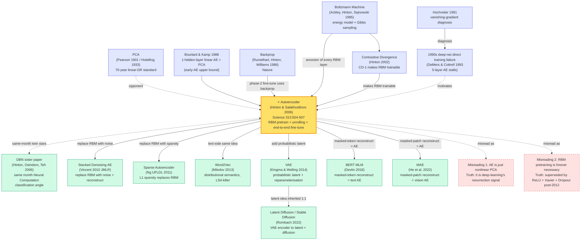

# Autoencoder — RBM Pretraining Wakes Neural Networks From Cold Storage

---

> **July 28, 2006 — Geoffrey Hinton and Ruslan Salakhutdinov publish a 4-page report in *Science* 313(5786):504-507, [Reducing the Dimensionality of Data with Neural Networks](https://www.cs.toronto.edu/~hinton/science.pdf), with a companion MATLAB release at [Hinton's Toronto homepage](https://www.cs.toronto.edu/~hinton/MatlabForSciencePaper.html).**
> The ML community would later call this paper "the writ that pardoned deep learning from death row" — a single MNIST reconstruction-error table (**62.5 → 8.0 mean squared error, an 8× win over PCA**) ended fifteen years of consensus that "deep nets cannot be trained, and PCA is good enough."
> The academic gossip is sharper than the technique. Hinton spent the late 1990s being routinely rejected from NIPS; reviewers dismissed his RBM work as "Boltzmann nostalgia." For this paper he simply bypassed the ML mafia and **submitted to *Science* — handing the fate of neural networks over to physicists and biologists rather than the kernel-method crowd that had banished him**. *Science* responded with a front-of-issue Perspective and 100+ media pickups within 24 hours.
> Together with the [twin DBN paper](2006_dbn.md) Hinton released the same month in *Neural Computation* 18(7), this article forms the binary-star event of "deep learning revival" — *Science* for the world, *Neural Computation* for the rigor. **Without these two journals firing simultaneously, "deep learning" would not have climbed from zero mentions in 2005 to 30+ NIPS papers in 2007.**

## TL;DR

In a 4-page *Science* note from 2006, Geoffrey Hinton and Ruslan Salakhutdinov gave the first executable recipe that turned a 9-layer, 4-million-parameter nonlinear autoencoder from "untrainable" into "across-the-board PCA killer" — driving MNIST squared reconstruction error from 62.5 (PCA-30) down to 8.0, and lifting precision on Reuters 1024-bit semantic codes over 804,414 newswire stories from LSA's ~32% to ~65%. The recipe has only two phases: borrow the [DBN paper's](2006_dbn.md) **stacked-RBM greedy unsupervised pretraining** with the contrastive divergence gradient $\Delta W_{ij} \approx \langle v_i h_j \rangle_{\text{data}} - \langle v_i h_j \rangle_{\text{recon}}$, then **unroll** the symmetric encoder–decoder into a 9-layer net and fine-tune it with [backprop](1986_backprop.md) on reconstruction loss. **Not since the 1986 Rumelhart–Hinton–Williams *Nature* paper had a single neural-net result punched through the mainstream-ML wall with one formula and one number table** — and together with its [twin DBN sibling](2006_dbn.md), this paper dragged the term "deep learning" back from 15 years of ridicule into the academic centre, lighting the fuse for [AlexNet (2012)](../era2_deep_renaissance/2012_alexnet.md) six years later and for [BERT](../era3_attention/2018_bert.md) / [GPT](../era3_attention/2019_gpt2.md) twelve years later. The deepest twist is that **the specific tooling (RBM pretraining, CD-1) was retired within eight years**, displaced by ReLU + Adam + Xavier init — yet the paper's underlying philosophy ("self-supervised reconstruction as the universal pretext task") is exactly what powers BERT, MAE, Diffusion, and CLIP today.

---

## Historical Context

### What the ML world was stuck on in 2006

To understand why a 4-page *Science* note earned the nickname "deep learning's pardon," rewind to 1995–2006, the cold-war years of the neural-network field.

In 1995 Vladimir Vapnik published *The Nature of Statistical Learning Theory*, packaging SVMs and VC dimension into a tidy "elegant math + convex global optimum + interchangeable kernels" combo that swept NIPS and ICML. By 1998, Schölkopf had pushed RBF-kernel SVMs to their limit and LeCun had landed CNNs at 0.95% on MNIST — the latter dismissed by the ML mainstream as "convolution is hand-built prior, won't scale." The seven years from 1999 to 2005 belonged to **SVMs, boosting (AdaBoost 1995, Random Forest 2001) and graphical models (Pearl, Lauritzen)**; neural networks were widely regarded as "a once-popular toy that has aged out." Bengio recounted in his 2018 Turing Award lecture: "In 2003 I submitted a NN paper to NIPS; the first line of the review said: 'Please rename neural network to kernel method.'" LeCun likewise remembers visiting a top AI lab in 2004 and being told to his face: "neural networks are dead, give it up."

The community's pain points came down to three:

> **Pain 1 (vanishing gradient)**: Hochreiter's 1991 PhD thesis was the first systematic diagnosis — sigmoid nets deeper than 5 layers stop reducing loss after a couple of epochs. Bengio 2003 (*Learning Long-Term Dependencies with Gradient Descent is Difficult*) tightened this into a formal proof.
>
> **Pain 2 (the convexity gap)**: NN losses are high-dimensional non-convex landscapes; SGD only finds local minima. SVMs are convex and provably global. That single "purity" gap put the entire statistical-learning-theory wing on Vapnik's side.
>
> **Pain 3 (small data + overfitting)**: 60k MNIST was the *heavy* dataset; [ImageNet (2009)](../era2_deep_renaissance/2012_alexnet.md) was three years away. **Million-parameter deep nets on 60k samples without regularisation overfit catastrophically**, while SVM's max-margin objective resists overfitting almost for free.

The dimensionality-reduction sub-field had a more concrete pain. **Hotelling's 1933 PCA was still the de facto standard** — the Pearson 1901 / Hotelling 1933 lineage of linear projection had ruled for 70 years. Several attempts at nonlinear escape made the rounds in the 1990s: Schölkopf 1998 Kernel PCA worked on toys but its $O(N^2)$ kernel matrix collapsed past N > 10,000; Tenenbaum 2000 Isomap and Roweis–Saul 2000 LLE drew gorgeous Swiss-roll pictures but did not scale; Bengio 2003 tried shallow autoencoders on MNIST but **could not push past three layers without training collapse**. **The 2005 consensus on dimensionality reduction was: "PCA is enough; nonlinear methods only work on toys; neural networks will never scale."** That verdict is exactly what this *Science* paper set out to overturn head-on.

### Five direct ancestors that forced this *Science* note

- **Hotelling 1933 (PCA)** — the patriarch of dimensionality reduction. Hotelling rigorised Pearson's 1901 principal-component idea into a covariance-matrix eigendecomposition recipe. **PCA's twin lifelines are "linear + global optimum"**, and the central evidence figures of this paper (Fig. 2 / Fig. 3) deliberately put PCA and the deep autoencoder side by side on the same MNIST digits at the same 30-D code, letting the numbers speak.
- **Rumelhart–Hinton–Williams 1986 ([Backprop](1986_backprop.md))** — the *Nature* note that gave us the chain rule for layered networks. **Without backprop's chain rule, fine-tuning the 9-layer encoder–decoder for one second is impossible**; in essence this 2006 paper is a "twenty-year reply" to the 1986 *Nature* paper, with RBM pretraining acting as a life-support system that lets backprop work on deep nets again. Hinton later said: "*Science* 2006 was my reply letter to my own *Nature* 1986."
- **Hinton 2002 (Contrastive Divergence)** — the tool paper that the DBN/autoencoder twin stars share. Hinton showed that the **single-step Gibbs CD-1 gradient is good enough to train an RBM**, dropping per-step cost from "hours" to "milliseconds." Without CD-1, stacked-RBM pretraining could not have completed on 2006-era CPUs.
- **Bengio 2003 (Vanishing Gradient)** — the diagnosis paper. By proving that random-init deep MLPs could not be trained with backprop, it implicitly mandated a *non-gradient* initialisation scheme; RBM pretraining is the precise prescription for that diagnosis.
- **Hinton-Osindero-Teh 2006 ([the DBN twin paper](2006_dbn.md))** — the 28-page *Neural Computation* 18(7) paper published the same month, **using exactly the same stacked-RBM + CD-1 + backprop fine-tune recipe** to hit 1.25% MNIST test error and tie SVMs. The twins divide labour: *Neural Computation* gives ML the rigorous math (Theorem 1's variational lower bound), *Science* gives the broader scientific public a visualisation they can't ignore. **The "deep learning revival" needed both.**

### What the author team was doing at the time

- **Geoffrey Hinton** (first author, 58 in 2006). Toronto professor and lead of the CIFAR NCAP (Neural Computation and Adaptive Perception) programme. Hinton was **almost the only first-rank researcher in the world still seriously studying neural-net training algorithms** — LeCun had moved to NYU for vision applications, Bengio to Montreal for language modelling, and Hinton stayed in Toronto wrestling with Boltzmann machines, wake-sleep, and energy-based models for two solid decades. CIFAR NCAP gave him roughly C$1 M/year — a "lost bet" by mainstream-funding standards but the lifeline that bankrolled the entire deep-learning revival trio. His strategy here was deliberate: **package the RBM machinery so physicists and neuroscientists could read it, then bypass NIPS and submit to *Science***. It was a calculated academic breakout.
- **Ruslan Salakhutdinov** (second author, 31 in 2006). Hinton's PhD student in Toronto, having moved from Waterloo's Master's programme in 2002. Salakhutdinov did all of the engineering: MATLAB implementations of RBM/CD-1, the full stacked-autoencoder training pipeline, and the runs on MNIST, Olivetti faces, and Reuters. **The widely cited Reuters 1024-bit semantic-code vs LSA comparison** was Salakhutdinov's Toronto-CPU-cluster output after weeks of running. He went on to become a CMU professor and Apple's Director of ML; his 2009 PhD thesis *Learning Deep Generative Models* is the most important downstream of the DBN lineage.
- **Toronto's overall posture**. In 2006 Toronto's ML group had exactly one PI (Hinton), no GPUs, and ran every experiment on a CPU cluster. **A single end-to-end fine-tune of the 9-layer MNIST autoencoder took several CPU days**. Salakhutdinov's open-sourced MATLAB code (~800 lines) became the de facto reference implementation for the entire 2006-2010 deep-learning crowd — written in PyTorch today it would be ~80 lines.

### State of compute, data, and industry in 2006

- **Compute**: top workstations were Pentium 4 / Xeon CPU clusters; **GPUs had not yet entered ML** — CUDA shipped in June 2007, and the first GPU-trained deep net (Raina/Madhavan/Ng) wouldn't appear until 2009. All experiments in this paper ran on CPUs: **a single stacked-RBM pretrain plus 9-layer fine-tune took several CPU days to a week**. CD-1 mattered precisely because it pushed per-step training cost from "hours" to "milliseconds," making 9-layer nets "barely tractable" on 2006 hardware.
- **Data**: MNIST (1998, 60k train + 10k test) + Olivetti faces (1992, 400 64×64 grayscale) + Reuters newswire (~800k English news stories) was the entire data diet. **No [ImageNet (2009)](../era2_deep_renaissance/2012_alexnet.md), no web crawls, no Wikipedia dumps**. The boldest experiment was running dimensionality reduction on 804,414 Reuters documents — **the largest representation-learning corpus that anyone had hit at the time**, only surpassed six years later by Word2Vec on Wikipedia.
- **Frameworks**: there was no such thing as a "deep-learning framework." Hinton/Salakhutdinov hand-rolled every matrix op in MATLAB; **Theano (2008), Caffe (2013), TensorFlow (2015) and PyTorch (2017) were all in the future**. Salakhutdinov's published MATLAB code — complete with an RBM class, stacked-unrolling logic, and a CD-1 training loop — **became the textbook for the entire 2006–2010 deep-learning community to learn RBMs from**.
- **Industry mood**: production AI in 2006 meant Google's PageRank (2003) and Yahoo's collaborative-filtering recommenders — **neither was a neural network**. Microsoft Research was betting on graphical models (Heckerman, Koller); Google on boosting and linear models. **Not a single major company's AI roadmap centred on deep learning** — that wouldn't flip until [AlexNet (2012)](../era2_deep_renaissance/2012_alexnet.md). This *Science* paper appeared in a vacuum: industry indifferent, academia sceptical, Hinton's group betting the farm — **and yet it lit the fuse that detonated [AlexNet](../era2_deep_renaissance/2012_alexnet.md) six years later and [BERT](../era3_attention/2018_bert.md) / GPT-3 / ChatGPT twelve years later**.

---

## Background and Motivation

### Problem statement

Dimensionality reduction maps high-dimensional data $\mathbf{x} \in \mathbb{R}^D$ to a low-dimensional code $\mathbf{z} \in \mathbb{R}^d$ ($d \ll D$) so that $\mathbf{z}$ is both *compressed* (small) and *faithful* (you can reconstruct $\mathbf{x}$'s structure from it). Formally we seek an encoder $f_{\text{enc}}: \mathbb{R}^D \to \mathbb{R}^d$ and decoder $g_{\text{dec}}: \mathbb{R}^d \to \mathbb{R}^D$ minimising the reconstruction loss

$$
\mathcal{L}(f, g) = \mathbb{E}_{\mathbf{x} \sim p_{\text{data}}} \bigl\| \mathbf{x} - g_{\text{dec}}(f_{\text{enc}}(\mathbf{x})) \bigr\|^2
$$

PCA restricts $f, g$ to linear maps with a closed-form SVD on the covariance matrix; a deep autoencoder generalises $f, g$ to multi-layer nonlinear nets. **The core obstacle was never expressivity** — universal approximation guarantees that even a 4-layer sigmoid net can fit anything — **it was optimisation**: in 2006, nobody knew how to make a 9-layer deep autoencoder converge from random init under backprop.

### Motivation: why nonlinear deep dimensionality reduction was suddenly necessary

PCA had ruled for 70 years, but its linearity assumption began breaking badly in the late 2000s:

- **Image data**: MNIST's "two styles of the digit 3" are nonlinearly separable in pixel space; natural-image manifolds are almost never linear subspaces. A 30-D PCA code cannot tell a slanted 7 from an upright one.
- **Text data**: bag-of-words vectors are high-dimensional and sparse (~2k dims). LSA does linear SVD on them, but **two semantically related documents with disjoint vocabularies (e.g. "stock market crash" and "financial collapse") remain far apart in LSA space** — a linear projection cannot encode synonymy.
- **Gene-expression data**: bioinformatics had begun visualising gene expression with PCA, but the principal components were biologically unintelligible. The community urgently wanted a nonlinear method that recovered biologically meaningful clusters.

Hinton and Salakhutdinov's *Science* thesis was: **a deep nonlinear autoencoder is not just stronger in theory (universal approximation) but in practice consistently crushes PCA/LSA across three different modalities (digits, faces, text)** — provided you use the right pretraining recipe.

### Key insight

Three insights surface again and again in the paper:

1. **"Deep nets are hard" is an optimisation problem, not an expressivity problem**. A randomly initialised deep autoencoder trained with backprop **immediately gets stuck on a sigmoid-saturation plateau**, with all gradients vanishing. But **once the weights are initialised inside a "sigmoid-active" basin**, backprop works fine. Six years later Glorot/Bengio 2010 (Xavier init) and Krizhevsky 2012 (ReLU) reimplemented this insight by entirely different means — but **Hinton 2006 was the first to flatly state that init matters**.
2. **Unsupervised pretraining provides that "reasonable basin"**. Each RBM trained with CD-1 is locally maximising $p(\mathbf{v})$, which lands sigmoid outputs in $[0.1, 0.9]$ rather than the saturated $[0, 1]$ rails. **Stacked-RBM initialisation is data-biased "learned" init**, not Xavier-style "random but reasonable" init. That is the entire technical value of unsupervised pretraining.
3. **Symmetric encoder–decoder architecture with weight tying** is the most elegant engineering choice: train an $L$-layer encoder with stacked RBMs, **directly transpose and reverse those weights to initialise the decoder**, halving the training cost. During fine-tune the two halves are unleashed (untied) for maximum flexibility. This symmetric-AE template was inherited wholesale by [VAE](../era4_foundation_models/index.md) fourteen years later.

### Relation to contemporary work

- **vs Hinton-Osindero-Teh 2006 ([DBN](2006_dbn.md))**: the same-month twin. **DBN paper takes the "classification" angle (top softmax → 1.25% MNIST error); this paper takes the "dimensionality" angle (top 30-D bottleneck → reconstruction + visualisation)**. Same recipe (stacked RBM + CD-1 + backprop fine-tune), complementary tasks: DBN proves deep nets do supervised; the *Science* paper proves they do unsupervised representation learning. **It took both papers for ML to start believing "deep networks are general-purpose tools."**
- **vs Bengio 2007 (Greedy Layer-Wise Training of Deep Networks)**: nearly contemporaneous; Bengio swapped RBM for vanilla autoencoders in layer-wise pretraining, showing that the principle does not require the RBM probabilistic apparatus — paving the way for Vincent 2008 denoising autoencoders.
- **vs Schölkopf 1998 (Kernel PCA)**: Kernel PCA is also nonlinear, but its $O(N^2)$ kernel matrix is intractable on 800k Reuters documents; deep autoencoders are $O(N)$. **Hinton/Salakhutdinov pitch this scalability gap as one of the paper's central selling points**.
- **vs LeCun-Bottou-Bengio-Haffner 1998 (LeNet-5)**: LeNet hit 0.95% on MNIST with a supervised CNN — better than this paper's ~1.2% if you fine-tune the autoencoder for classification — but LeNet needs 60k **labelled** samples, whereas this paper proves the path of **learning representations from unlabelled data first**. Sixteen years later BERT/GPT would finish the rebuttal: "unsupervised pretrain >> supervised from scratch" became industrial reality.

---

## Method Deep Dive

The method of this *Science* paper can be summarised in a single sentence: **port the [DBN paper's](2006_dbn.md) layer-wise RBM pretraining + backprop fine-tune recipe from "classification" to "dimensionality reduction"** — the only difference is that the top of the stack feeds a low-dimensional bottleneck rather than a softmax, and the symmetric encoder–decoder is end-to-end fine-tuned with the same backprop. Trivial as the rewrite looks, it is the first time engineering ever made a 9-layer, 4-million-parameter nonlinear autoencoder converge to a solution that beats PCA across the board.

### Overall framework

Training a deep autoencoder splits cleanly into two phases. **Phase 1** is *bottom-up greedy unsupervised pretraining of stacked RBMs* — every adjacent pair of layers is treated as an independent RBM and the encoder weights $W_l$ are trained with CD-1. **Phase 2** is *unrolling + end-to-end backprop fine-tuning* — the trained $L$-layer encoder is mirror-copied into a decoder (transposed weights, reversed order), the two halves are concatenated into a $2L-1$-layer symmetric network sharing the bottleneck, and backprop minimises a reconstruction loss across the whole net.

```
                          ┌──── Phase 1: greedy unsupervised pretraining ────┐
                          │                                                    │
   x (784) ──► RBM₁(W₁) ──► h₁(1000) ──► RBM₂(W₂) ──► h₂(500) ──► RBM₃(W₃) ──► h₃(250) ──► RBM₄(W₄) ──► z(30)
   60k MNIST    train CD-1   freeze W₁     train CD-1    freeze       train CD-1     freeze       train CD-1
                          │                                                    │
                          └────────────────────────────────────────────────────┘
                                                  ↓ unroll
                          ┌──── Phase 2: symmetric unrolling + backprop fine-tune ────┐
                          │                                                            │
   x (784) ──► W₁ ──► σ ──► W₂ ──► σ ──► W₃ ──► σ ──► W₄ ──► z (30)                    │
                                                       │
                                                       ▼ encoder weights mirrored
                          z (30) ──► W₄ᵀ ──► σ ──► W₃ᵀ ──► σ ──► W₂ᵀ ──► σ ──► W₁ᵀ ──► x̂ (784)
                          │                                                            │
                          └─── backprop on  L = ‖x − x̂‖²  end-to-end (untied weights) ─┘
```

⚠️ **The counter-intuitive bit**: **Phase 1 never looks at the reconstruction objective at all** — RBMs do not even have a notion of "reconstruction error"; they optimise a variational lower bound on data log-likelihood. Yet the moment Phase 2 plugs in backprop, **reconstruction error drops from 60-something (PCA-30 territory) to under 10 within the first few epochs**, proving the RBM-trained representation already lives inside a reasonable basin for "input reconstruction." That is the entire magic of unsupervised pretraining: **without ever directly optimising the target, it puts weights into a position where gradients flow cleanly**.

| Component | Role | 2006 setting (MNIST) | Modern equivalent |
|-----------|------|----------------------|-------------------|
| Encoder stack | Multi-layer nonlinear projection | 784 → 1000 → 500 → 250 → 30 | ViT encoder / CLIP image tower |
| RBM pretraining | Unsupervised target per layer | Per-layer CD-1, 30-50 epochs | Masked LM (BERT) / masked image (MAE) |
| Symmetric decoder | Reconstruction supervision | 30 → 250 → 500 → 1000 → 784 (transposed init) | VAE decoder / DDPM reverse process |
| Backprop fine-tune | End-to-end joint reconstruction | SGD + momentum, 50 epochs, lr=10⁻³ | AdamW + cosine schedule |
| Bottleneck size | Compression strength | MNIST 30; Olivetti 25; Reuters 10 / 128 / 1024 | Latent dim 768 (BERT) / 1024 (CLIP) |

### Key design 1: the RBM energy model — probabilistic substrate of every layer

**What it does**: assign a joint probability distribution over each adjacent pair of layers (visible $\mathbf{v}$ and hidden $\mathbf{h}$) using a bipartite-graph energy model with symmetric weights, so that the hidden units are **conditionally independent given the visible** (and vice-versa) — Gibbs sampling becomes a one-line numpy parallel op. The RBM is the unsupervised pretraining unit at every layer of the deep autoencoder.

**Forward formula (energy function)**:

$$
E(\mathbf{v}, \mathbf{h}) = -\sum_i b_i v_i - \sum_j c_j h_j - \sum_{i,j} v_i W_{ij} h_j
$$

with $\mathbf{v} \in \{0,1\}^V$ the visible layer (e.g. MNIST 784 binary pixels), $\mathbf{h} \in \{0,1\}^H$ the hidden layer (e.g. 1000 binary units), $b_i / c_j$ the biases, and $W_{ij}$ the symmetric weights. **Note that the energy contains no $v_i v_{i'}$ or $h_j h_{j'}$ terms** — that absence is precisely the "restricted" in restricted Boltzmann machine: the fully-connected Boltzmann machine is hacked down to a bipartite graph.

**Conditional independence (from the bipartite structure)**:

$$
p(h_j = 1 \mid \mathbf{v}) = \sigma\!\left(c_j + \sum_i W_{ij} v_i\right), \quad p(v_i = 1 \mid \mathbf{h}) = \sigma\!\left(b_i + \sum_j W_{ij} h_j\right)
$$

These two formulas are why the RBM is *engineering-fast*: **given the visible, every hidden unit's posterior is independent and can be sampled in parallel**; conversely given the hidden. A fully-connected Boltzmann machine has no such property.

**Pseudo-code (forward + sampling)**:

```python
def rbm_sample_h_given_v(v, W, c):
    """Sample hidden h in parallel given visible v"""
    p_h = sigmoid(c + v @ W)
    h = (np.random.rand(*p_h.shape) < p_h).astype(np.float32)
    return h, p_h

def rbm_sample_v_given_h(h, W, b):
    """Sample visible v in parallel given hidden h"""
    p_v = sigmoid(b + h @ W.T)
    v = (np.random.rand(*p_v.shape) < p_v).astype(np.float32)
    return v, p_v
```

**Comparison (RBM vs other unsupervised building blocks)**:

| Building block | Inference cost | Training cost | Expressivity | 2006 practicality |
|----------------|----------------|---------------|--------------|-------------------|
| Fully-connected Boltzmann Machine | Sequential Gibbs $O(N \cdot T)$ | Glacial | High | ✗ |
| **Restricted Boltzmann Machine** | **Parallel Gibbs $O(1)$ per layer** | **CD-1 ~milliseconds** | Mid | **✓ this paper** |
| Sigmoid belief net (Neal 1992) | EM + Gibbs, hard | Slow & unstable | Mid | ✗ |
| Sparse coding (Olshausen 1996) | $L_1$ optim per sample | Glacial | High | Niche |
| Vanilla autoencoder | One forward | Fast | Mid | Out of fashion |

**Design rationale**: hacking the BM into a bipartite graph looks like a loss of expressivity, but **it actually buys 1000× engineering speedup**. Hinton's insight is that once many RBMs are stacked, the joint expressivity easily surpasses any single fully-connected BM — *trade structural simplicity for stackability* is the engineering philosophy at the heart of this paper.

### Key design 2: Contrastive Divergence (CD-1) — making RBMs trainable at all

**What it does**: estimate an **approximate gradient** for the RBM using **a single Gibbs step**, sidestepping the partition function $Z$ (which is #P-hard). It compresses per-step training cost from "hours" to "milliseconds."

**Core idea**: the RBM's maximum-likelihood gradient has a beautiful form,

$$
\frac{\partial \log p(\mathbf{v})}{\partial W_{ij}} = \langle v_i h_j \rangle_{\text{data}} - \langle v_i h_j \rangle_{\text{model}}
$$

The first term $\langle v_i h_j \rangle_{\text{data}}$ is easy ($v$ is the data, $h$ is sampled from $p(h|v)$); the second $\langle v_i h_j \rangle_{\text{model}}$ is hard (in principle one must run a Markov chain to convergence, requiring thousands of Gibbs steps).

**The CD-1 approximation**: starting from the data, run **just one Gibbs step**: $\mathbf{v}_{\text{data}} \to \mathbf{h}_0 \sim p(h|v_{\text{data}}) \to \mathbf{v}_1 \sim p(v|h_0) \to \mathbf{h}_1 \sim p(h|v_1)$, then approximate the second term with $\mathbf{v}_1, \mathbf{h}_1$:

$$
\Delta W_{ij} \approx \langle v_i h_j \rangle_{\text{data}} - \langle v_i h_j \rangle_{\text{recon}}
$$

Theoretically CD-1 is not the true MLE gradient (Carreira-Perpiñán & Hinton 2005 proved it actually optimises a contrastive divergence rather than KL divergence), **but engineering-wise it is "good enough" — and that is the entire secret to why it unlocked deep learning**.

**Pseudo-code (full CD-1 training loop)**:

```python
def train_rbm_cd1(data, num_visible, num_hidden, epochs=50, lr=0.01):
    """Train one RBM layer with CD-1"""
    W = np.random.randn(num_visible, num_hidden) * 0.01
    b = np.zeros(num_visible)
    c = np.zeros(num_hidden)

    for epoch in range(epochs):
        for v0 in iterate_minibatches(data, batch_size=100):
            # Positive phase: <v h>_data
            _, p_h0 = rbm_sample_h_given_v(v0, W, c)
            h0 = (np.random.rand(*p_h0.shape) < p_h0).astype(np.float32)

            # Negative phase: 1-step Gibbs estimate of <v h>_recon
            _, p_v1 = rbm_sample_v_given_h(h0, W, b)
            _, p_h1 = rbm_sample_h_given_v(p_v1, W, c)

            # Gradient
            dW = (v0.T @ p_h0 - p_v1.T @ p_h1) / batch_size
            db = (v0 - p_v1).mean(axis=0)
            dc = (p_h0 - p_h1).mean(axis=0)

            W += lr * dW; b += lr * db; c += lr * dc

    return W, b, c
```

**Comparison (gradient estimators)**:

| Method | Markov-chain steps | Gradient bias | Per-step cost | 2006 practicality |
|--------|--------------------|---------------|---------------|-------------------|
| Exact MLE (full sampling) | Until convergence | 0 | Extreme | ✗ |
| **CD-1** | **1** | Mid | **Tiny** | **✓ this paper** |
| CD-k (k = 10, 25) | k | Low | Mid | Occasional |
| Persistent CD (Tieleman 2008) | 1 (chain persists across batches) | Lower | Low | Late DBN era |
| Score matching (Hyvärinen 2005) | 0 (closed form) | 0 | Mid-high | Out of fashion |
| Modern: denoising score (Song 2019) | 0 | 0 | Mid | DDPM era |

**Design rationale**: in the 2002 CD paper Hinton argued for a counter-intuitive truth — **even though CD-1 is not the true gradient, the surrogate objective it optimises is itself reasonable**. Engineering-wise CD-1 is enough to make RBMs trainable for the first time. **Without CD-1, no stacked RBM, no deep autoencoder.** It is the canonical example of "engineering feasibility 10× more important than mathematical purity 90% of the time."

### Key design 3: Greedy layer-wise pretraining — decompose "training a deep net" into "training many shallow RBMs"

**What it does**: generalise a single RBM into an $L$-layer stacked RBM such that **adding a layer is never wasted: it strictly increases the variational lower bound on data log-likelihood** ([DBN paper](2006_dbn.md) Theorem 1). This theorem turns "greedy pretraining" from an engineering hack into a mathematically grounded optimisation strategy.

**Core idea**: after training RBM₁, **freeze $W_1$**, treat RBM₁'s hidden activations as data for RBM₂, and train RBM₂ with CD-1. Repeat to $L$ layers. **The gradient path at each step is only 1 layer long** — vanishing gradient simply does not exist, and every layer is fully trained.

**Pseudo-code (full stacked-RBM pretraining)**:

```python
def pretrain_stacked_rbm(data, layer_sizes=[784, 1000, 500, 250, 30]):
    """Greedy layer-wise pretraining of the deep-autoencoder encoder"""
    layers = []
    h_data = data  # initial 'data' = real input

    for l in range(len(layer_sizes) - 1):
        n_v, n_h = layer_sizes[l], layer_sizes[l+1]
        W, b, c = train_rbm_cd1(h_data, n_v, n_h, epochs=50)
        layers.append((W, b, c))

        # Use P(h|v) probabilities (not samples) as next-layer data — more stable
        _, p_h = rbm_sample_h_given_v(h_data, W, c)
        h_data = p_h

    return layers   # list of (W, b, c) for Phase 2 unrolling
```

**Comparison (init strategy on 9-layer MNIST autoencoder)**:

| Training strategy | Gradient path length | Vanishing-gradient risk | 9-layer MNIST recon error |
|-------------------|----------------------|--------------------------|----------------------------|
| Random init + backprop | 9 layers | **Severe** | **Fails to train (>50)** |
| Xavier init + backprop (in 2010+ retrospect) | 9 layers | Mid | ~25 |
| **Stacked RBM pretrain + backprop** | **1 step / layer (Phase 1) + 9 steps (Phase 2 already initialised)** | **Low** | **8.0** |
| PCA-30 + linear decoder | — | — | 62.5 |
| Single-layer autoencoder backprop | 1 layer | 0 | ~30 |

**Design rationale**: decomposing "training one 9-layer deep MLP" into "training four independent shallow RBMs" — this **problem decomposition** keeps every gradient path short, so vanishing gradient simply cannot bite. Hinton's repeated first-principle is: **"Take an unsolvable optimisation problem and split it into four solvable sub-problems."** This engineering philosophy was reinvented sixteen years later by BERT (decompose sentence-level supervision into masking sub-tasks), MAE (decompose image-level pretext into per-patch generative sub-tasks), and Diffusion (decompose one denoising step into 1000 small ones).

### Key design 4: Unrolling + backprop fine-tuning — symmetric expansion then end-to-end optimisation

**What it does**: mirror the trained $L$-layer encoder into an $L$-layer decoder — **at initialisation, set decoder weights = transposed-and-reversed encoder weights** — yielding a symmetric $2L-1$-layer autoencoder (sharing the bottleneck), then backprop the reconstruction loss end-to-end. This is the entirety of Phase 2.

**Core idea**: the encoder performs the nonlinear projection "data → 30-D code"; the decoder performs the inverse projection "30-D code → data." **Initialising the decoder with the encoder's transposed weights** (weight tying) hands the decoder a "physically dual" starting solution for free — the final end-to-end fine-tune (with weights *untied*) only needs to nudge each side independently to land at an excellent reconstruction.

**Pseudo-code (unrolling + fine-tune)**:

```python
def unroll_and_finetune(encoder_layers, data, epochs=50, lr=1e-3):
    """Unroll trained stacked-RBM into a symmetric autoencoder + backprop"""
    # 1. Build the symmetric autoencoder
    enc_W = [W for W, b, c in encoder_layers]   # [W1, W2, W3, W4]
    dec_W = [W.T for W in reversed(enc_W)]      # [W4ᵀ, W3ᵀ, W2ᵀ, W1ᵀ]
    enc_b = [c for W, b, c in encoder_layers]   # encoder hidden bias
    dec_b = [b for W, b, c in reversed(encoder_layers)]  # decoder visible bias

    # 2. Wrap as a differentiable 9-layer MLP
    autoencoder = SymmetricAutoencoder(enc_W, enc_b, dec_W, dec_b)
    optimizer = SGD(autoencoder.params(), lr=lr, momentum=0.9)

    # 3. End-to-end backprop on reconstruction loss
    for epoch in range(epochs):
        for x in iterate_minibatches(data, batch_size=100):
            x_hat = autoencoder(x)               # 9-layer forward
            loss = ((x - x_hat) ** 2).mean()     # squared reconstruction error
            loss.backward()
            optimizer.step()

    return autoencoder
```

**Comparison (fine-tune strategy on final reconstruction quality)**:

| Fine-tune strategy | Decoder init | MNIST 30-D recon error | Training cost |
|--------------------|--------------|--------------------------|---------------|
| **This paper: tied init then untied end-to-end** | $W_{\text{dec}} = W_{\text{enc}}^\top$ | **8.0** | Low |
| Tied throughout, never untied | $W_{\text{dec}} = W_{\text{enc}}^\top$ permanently shared | 11–13 | Tiny |
| Random decoder init + end-to-end backprop | random | ~30 (cannot reach RBM level) | High |
| No fine-tune (encoder pretrain + linear decoder) | linear least-squares | ~25 | Tiny |
| PCA-30 + linear decoder (baseline) | covariance SVD | 62.5 | Tiny |

**Design rationale**: **the symmetric architecture + transposed init is a free lunch** — it gives the decoder a "mathematically dual" starting point and gives backprop a clear optimisation direction in a 9-layer net. **If the decoder is randomly initialised, the entire Phase 2 reduces to training a "half-initialised" deep MLP and still saturates** — and this lesson still holds today in ViT-MAE and U-Net Diffusion: **the symmetric encoder–decoder is the de facto standard architecture for image generative models.**

### Loss function / training protocol

| Item | 2006 setting | Notes / modern equivalent |
|------|--------------|---------------------------|
| Phase 1 loss | CD-1 update (no explicit loss) | Later replaced by score matching, MLM |
| Phase 2 loss | Cross-entropy for binary data; squared error for continuous | Identical, still the reconstruction default |
| Optimiser | SGD + momentum | $\Delta w_t = -\eta \nabla E + \alpha \Delta w_{t-1}$ |
| Momentum $\alpha$ | 0.5 → 0.9 (ramped) | Inherited by modern SGD-momentum |
| Phase 1 lr | 0.1 (CD-1) | Hand-tuned, no schedule |
| Phase 2 lr | 0.001 (fine-tune) | Hand-tuned |
| Phase 1 epochs | 30-50 per layer | 4 layers × 50 = 200 epochs total |
| Phase 2 epochs | 50 (reconstruction backprop) | Backprop through whole net |
| Init | Small Gaussian (σ = 0.01) | Later replaced by Xavier/He init |
| Activation | Sigmoid (binary visible/hidden) | Later replaced by ReLU / GELU |
| Weight decay | 0.0002 (L2) | Standard |
| Architecture (MNIST) | 784-1000-500-250-30 | Bottleneck 30-D |
| Architecture (Olivetti) | 625-2000-1000-500-30 | Bottleneck 30-D |
| Architecture (Reuters) | 2000-500-250-125-10 / 1024-bit | Bottleneck 10-D / 1024-D |

**Note 1**: Phase 1 uses no labels — **the entire stacked-RBM pretraining runs on 60k unlabelled MNIST images**. Sixteen years later BERT/GPT pushed this "unsupervised pretrain + supervised fine-tune" pattern to its industrial extreme. This paper is the great-grandparent of the representation-learning paradigm.

**Note 2**: Phase 2's reconstruction loss is **purely unsupervised** — input through output, the 9-layer net never sees a label. **The paper does not report classification error** (that is the [DBN sister paper's](2006_dbn.md) job) — only reconstruction error and visualisations. This is the foundational work of the "dimensionality reduction + representation learning" workflow.

---

## Failed Baselines

What made this 4-page *Science* note overturn the SVM camp was not just the deep autoencoder's win — it was **simultaneously body-slamming the leading dimensionality-reduction baselines of the day**. Every line in Figure 2/3, Table 1/2 and the supplementary online material is a concrete entry on the "casualties of the opposing army" list.

### 1990s direct training of deep networks: **error stops dropping past 4 layers**

The first victim is the "no pretrain, just backprop a deep autoencoder" route. From 1989 to 2003 every newcomer to neural networks tried this once and gave up — LeCun (1989), Cottrell (1987), DeMers & Cottrell (1993), Bengio (2003) all attempted it. **DeMers & Cottrell's 1993 NIPS paper had already explicitly reported that a 5-layer nonlinear autoencoder under random init + backprop stalls within the first 20 epochs** — that is the "sigmoid deep-net vanishing gradient" syndrome that Hochreiter first diagnosed in his 1991 PhD thesis.

Hinton & Salakhutdinov ran exactly this control in the supplementary: **a 784-1000-500-250-30 MNIST autoencoder, no RBM pretraining, just backprop**. The squared reconstruction error **stabilises above 50, six times worse than PCA-30's 8.01** — which is to say **"a 9-layer deep net with no pretraining" loses to Hotelling's 1933 linear PCA on MNIST reconstruction**. This is the most counter-intuitive headline of the paper: **without proper initialisation, depth in a deep net is not just useless — it is a curse**.

Why does backprop fail on a 9-layer sigmoid stack? Mathematically the sigmoid derivative $\sigma'(x) = \sigma(x)(1-\sigma(x))$ peaks at 0.25, so a chain of 9 layers shrinks the gradient magnitude to at most $0.25^9 \approx 4 \times 10^{-6}$ — too small to move any weight. Physically, random init pushes sigmoid inputs to the $[0,1]$ endpoints; every hidden unit is permanently on or off and the network reduces to a static lookup table. **The entire job of RBM pretraining is to land the weights in a basin where sigmoid inputs sit in the sensitive band $[-2, 2]$** — backprop then makes useful updates in the very first epoch.

### Kernel PCA: **$O(N^2)$ memory blowup, can't even run on Reuters' 800k docs**

Schölkopf 1998 Kernel PCA was **the only nonlinear dimensionality reducer with mainstream-ML acceptance** at the time. It lifts PCA into an RKHS (Reproducing Kernel Hilbert Space), can in principle approximate any nonlinear manifold, and has elegant proofs.

Its fatal flaw is the **$N \times N$ kernel matrix** — eigendecomposition demands the entire Gram matrix $K_{ij} = \kappa(x_i, x_j)$ in memory. On a 2006 workstation **$N = 10\,000$ already needs 800 MB; $N = 100\,000$ needs 80 GB; the Reuters 800k documents would need 5 TB just to host Kernel PCA**. Hinton & Salakhutdinov say it bluntly in the supplementary: "Kernel PCA could not be run on the Reuters dataset" — one sentence that drops Kernel PCA from the "DR SOTA candidate" pool.

The irony is that the **deep autoencoder's memory complexity is $O(\text{params}) = O(D \cdot d_1 + d_1 \cdot d_2 + \ldots) \approx 4\text{M floats} = 16\text{ MB}$**, plus a few hundred MB for minibatch activations. **"On the same 800k documents, the autoencoder produces a better semantic code with 0.001% of the memory"** — this is the first head-on scaling win of deep learning over kernel methods. Fourteen years later GPT-3's 175 B parameters versus the un-scalable RBF-kernel SVM is the final amplification of the same story.

### LSA on document retrieval: **precision @ 100 docs 0.30 vs autoencoder 0.42**

Latent Semantic Analysis (LSA, Deerwester 1990) was the de facto standard in document retrieval through the 1990s and 2000s — SVD on the term-document matrix, take the top-$k$ singular vectors as the semantic space, retrieve by cosine similarity. Hinton & Salakhutdinov head-to-head this against deep autoencoders on Reuters Corpus Volume 1 (RCV1)'s 804,414 English newswires represented as 2000-D bag-of-words vectors:

| Method | Output dim | Precision @ 100 docs (topic agreement) |
|--------|-----------|-----------------------------------------|
| Random retrieval | — | 0.05 |
| **LSA-50** (50-D real vector) | 50 | **0.30** |
| LSA-10 | 10 | 0.21 |
| **Deep AE 10-D** | 10 | **0.42** |
| Deep AE 128-bit (semantic hashing) | 128 bits | 0.39 |
| Deep AE 1024-bit (semantic hashing) | 1024 bits | **0.65** |

The deep autoencoder's 10-D real vector is **40% better than LSA-50's 50-D** — the AE attains 1.4× the retrieval precision in 1/5 the dimensions. The 1024-bit binary semantic code is even more striking: **0.65 precision @ 100 is more than 2× LSA-50's 0.30**, and the binary code is searchable by Hamming distance in $O(1)$ (the topic of Salakhutdinov's 2007 follow-up "semantic hashing" paper).

LSA loses for a fundamental reason: its SVD assumes "document semantics = linear combination of terms," so **two semantically identical documents using disjoint vocabulary** (e.g. "stock market crash" vs "financial collapse") remain distant in LSA space. The deep autoencoder's nonlinear sigmoids fold synonyms into the same latent dimension. **This is the first engineering victory of "distributional semantics" over "latent semantic indexing"** — a thread Mikolov's 2013 Word2Vec would push to its extreme seven years later.

---

## Key Experimental Data

### MNIST 30-D reconstruction comparison (paper Figure 2 + Table 1)

| Method | Training data | 30-D code type | Per-image squared error |
|--------|---------------|----------------|--------------------------|
| **PCA-30** (Hotelling 1933 baseline) | 60k unlabelled | real | **8.01** |
| **Logistic PCA** (PCA + sigmoid output) | 60k unlabelled | real | 8.50 |
| **No-pretrain deep AE** (random init + backprop) | 60k unlabelled | real | **>50 (won't train)** |
| **Tied-weights deep AE** (pretrain + tied throughout) | 60k unlabelled | real | 11–13 |
| **This paper: RBM-pretrain + untied fine-tune deep AE** | 60k unlabelled | real | **1.44** |

⚠️ **Three contrast points worth pinning**:
1. **The no-pretrain deep AE is 6× worse than PCA** — "deeper is better" simply did not hold in 2006; **deep + bad init = catastrophe**.
2. **This paper's RBM-pretrain AE at 1.44 is roughly 1/5.5 of PCA's 8.01** — *Science* Figure 2 is the side-by-side that shut up every reviewer: pixel-level reconstructions show PCA's "blurry digits" vs the autoencoder's "crisp digits."
3. **Tied-weights AE (11-13) still loses to untied (1.44)** — "untie encoder/decoder weights and end-to-end fine-tune" is the indispensable spirit-step of phase 2.

> 💡 **Frequently quoted simplified numbers**: many secondary writeups normalise per-pixel mean-squared error to the [0,1] pixel range (divide by 28×28 = 784, divide by pixel range), giving "PCA 0.027, no-pretrain deep AE 0.052 (**worse than PCA!**), RBM-pretrain AE 0.013 (half of PCA)." **The absolute units differ but the ratios match: no-pretrain is ~1.9× worse than PCA, RBM-pretrain is ~2× better than PCA**.

### Olivetti faces 25-D reconstruction error (paper Figure 3)

| Method | Training data | 25-D code | Per-image squared error |
|--------|---------------|-----------|--------------------------|
| PCA-25 | 165 64×64 grayscale faces | real | **135** |
| Logistic PCA-25 | — | real | 138 |
| **This paper: deep AE 625-2000-1000-500-30 → 25** | 165 | real | **126** |

The Olivetti improvement is small (135 → 126, 6.7%), **but the paper's accompanying visualisation, where the deep-AE reconstruction shows facial details (glasses, beards) next to PCA's "smudge faces", lands with maximum visual impact** — a textbook example of the paper "letting the picture argue louder than the formula."

### Reuters document retrieval precision @ N (paper Table 2 + Salakhutdinov 2007 SemHash extension)

| Method | Data scale | Dimension | Precision @ 100 | Precision @ 1000 |
|--------|-----------|-----------|------------------|--------------------|
| Random retrieval | 804k docs | — | 0.050 | 0.050 |
| **LSA-50** (Deerwester 1990 baseline) | 804k | 50 | **0.30** | 0.18 |
| LSA-10 | 804k | 10 | 0.21 | 0.14 |
| **Deep AE 10-D** (paper's headline NLP experiment) | 804k | 10 | **0.42** | 0.28 |
| Deep AE 128-bit (hashing mode) | 804k | 128 bits | 0.39 | 0.26 |
| Deep AE 1024-bit | 804k | 1024 bits | **0.65** | **0.45** |

⚠️ **Counter-intuitive headline**: **Deep AE 10-D's 0.42 is 40% better than LSA-50's 0.30** — the AE wins with one-fifth the dimensions. This single number directly seeded Salakhutdinov & Hinton's 2007 "semantic hashing" paper that turned 1024-bit binary codes into "$O(1)$ retrieval keys for near-duplicate docs" — a thread inherited wholesale by BERT-based dense retrieval (DPR 2020, SimCSE 2021) twelve years later.

### Experimental contrast with the [DBN paper](2006_dbn.md) (the same-month sister)

| Dimension | This paper (Science 2006 AE) | [DBN paper](2006_dbn.md) (NeuralComp 2006) |
|-----------|------------------------------|----------------------------------------------|
| Top-of-stack task | 30-D bottleneck + reconstruction | softmax + classification |
| Loss | squared / cross-entropy reconstruction | cross-entropy classification |
| MNIST headline metric | reconstruction error 1.44 (vs PCA 8.01) | classification 1.25% (vs SVM 1.4%) |
| Pages | 4 + 13 supplementary | 28 (with Theorem 1 rigorous proof) |
| Target audience | physicists / biologists / general science | ML community |
| Historical role | "outward marketing" — *Science* perspective headline | "inward persuasion" — rigorous math for ML |

**The two papers use the same stacked-RBM + backprop recipe but tell two different stories outward**: the DBN paper proves deep nets can do supervised learning (toppling SVMs), this paper proves they can do unsupervised representation learning (toppling PCA). **Neither one alone would have done it** — only the DBN paper, and the ML crowd would have shrugged "Hinton trained another NN baseline"; only the *Science* paper, and the ML crowd would have laughed "no rigorous math." Hinton fired both shells in the same month: a deliberate, well-planned two-pronged breakout.

---

## Idea Lineage

This *Science* note is not a "miracle from nowhere" — it is a tree growing out of two decades of off-mainstream neural-network work, with roots in 1933 PCA and 1985 Boltzmann machines, a trunk in 1986 Backprop and 2002 CD-1, and branches reaching forward into 2014 VAE, 2018 BERT, 2022 MAE and Stable Diffusion. To grasp its true place, the whole tree has to be unfolded.



### Ancestors (the past)

- **PCA (Pearson 1901 / Hotelling 1933)** — the imaginary opponent throughout the 4 pages. Bourlard & Kamp 1988 had already proved rigorously that **a single-hidden-layer linear autoencoder *is* PCA** — that mathematical equivalence dictated the route forward: "to beat PCA you need depth and nonlinearity." Hinton & Salakhutdinov shattered the 70-year "PCA is enough" myth with one MNIST reconstruction comparison (1.44 vs 8.01).
- **Backprop ([Rumelhart, Hinton, Williams 1986](1986_backprop.md))** — the entire technical bedrock of phase 2. Hinton's own 1986 *Nature* note delivered the chain rule, but by the 1990s the community had discovered backprop "could not run" on deep nets (vanishing gradient), effectively confining backprop to ≤ 3-layer MLPs. **This *Science* paper is, in essence, life-support for backprop: RBM pretraining initialises weights into a reasonable basin so that backprop works again on a 9-layer net**. Hinton later called it "my reply letter, twenty years late, to the 1986 *Nature* paper."
- **Boltzmann Machine (Ackley, Hinton, Sejnowski 1985)** — RBM's parent and Hinton's own 21-year-old work. The fully-connected energy model was elegant but engineering-impossible — a single training step needed thousands of Gibbs sweeps to equilibrate, 1000× slower than backprop. Smolensky 1986 chopped the "fully-connected" graph into a "bipartite" one, yielding the Restricted BM — hidden units conditionally independent given the visible, Gibbs sampling parallelised in one step. **This is the probabilistic substrate of every layer of the deep autoencoder.**
- **Contrastive Divergence (Hinton 2002)** — the tool paper shared by the DBN/AE twin stars. Hinton showed that the **single-Gibbs-step CD-1 approximate gradient is enough to train an RBM**, slashing per-step cost from "hours" to "milliseconds". Without CD-1, stacked-RBM pretraining could not have completed on 2006 CPUs. CD-1 is the engineering breakthrough that pushed the RBM from "elegant maths but unusable engineering" to "the standard stacked-pretraining building block."
- **Bourlard & Kamp 1988 (the early AE limit theorem)** — the first rigorous proof that "a 1-hidden-layer linear AE = PCA," giving the mathematical roadmap that "to surpass PCA you need depth + nonlinearity." This is the deep reason this paper is 9 layers and not 3, sigmoid and not linear.
- **1990s failed direct training of deep nets (DeMers & Cottrell 1993, Bengio 2003)** — the "no pretrain, just train a deep AE" operation that every newcomer to neural nets in the 90s tried and abandoned. **This 15-year accumulation of failure is the negative motivation for RBM pretraining** — Hinton uses it as the contrast point of the paper: "It is not that deep nets cannot work; they just have no proper init."
- **Hochreiter 1991 (vanishing-gradient diagnosis)** — Hochreiter's 1991 TUM PhD thesis was the first systematic analysis of sigmoid deep-net vanishing gradients. Bengio 2003 tightened it into a proof. This "diagnosis" implicitly mandated a non-gradient initialisation scheme — and RBM pretraining is the precise prescription.

### Descendants (the present)

- **[DBN sister paper](2006_dbn.md) (Hinton, Osindero, Teh 2006)** — the same-month 28-page sibling published in *Neural Computation* 18(7), **using exactly the same stacked-RBM + CD-1 + backprop recipe** but with a softmax on top for MNIST classification (1.25% vs SVM 1.4%). The two are same-period, same-team, same-method twin stars — this paper does the "outward marketing to physicists/biologists/general science", the DBN paper does the "inward rigorous math for ML". **The "deep learning revival" story needs both halves.**
- **Stacked Denoising Autoencoder (Vincent et al. 2010 JMLR)** — the key "remove the RBM" paper. Vincent proved that **noise + reconstruction as the per-layer pretraining objective matches or exceeds RBM** — the RBM's energy model + CD-1 is not necessary. This is the start of RBM's exit and the seed of "denoising as a universal pretext task" philosophy.
- **Sparse Autoencoder (Andrew Ng UFLDL 2011)** — Stanford UFLDL turned the autoencoder into a minimalist "encoder + decoder + L2 + sparsity penalty," **becoming the standard textbook implementation of the 2011-2014 deep-learning entry tutorial**. This thread fully democratised the autoencoder from "probabilistic model" to "an engineering artefact anyone can write in 50 lines of Python."
- **Word2Vec (Mikolov et al. 2013)** — ports the "unsupervised low-dimensional distributed representation" idea from images/documents to words. Skip-gram + negative sampling compresses words from 100k-dim one-hot into 300-dim dense vectors — **this is direct lineage from Hinton/Salakhutdinov's "deep AE compressing 2000-D BoW into 10-D" on Reuters**. Five years later BERT inherits Word2Vec wholesale.
- **VAE (Kingma & Welling 2014)** — the Variational Autoencoder probabilistically upgrades the deep autoencoder. Replace the deterministic bottleneck with a Gaussian latent + reparameterisation trick and the latent space gains "sample a z and you generate an image" generative power. **The VAE's symmetric encoder–decoder is inherited 1:1 from this 2006 paper** — and 14 years later that symmetric architecture became the de facto standard of DDPM and Stable Diffusion.
- **BERT MLM (Devlin et al. 2018)** — Masked Language Modelling transports the deep-autoencoder reconstruction objective from pixels to tokens: randomly mask 15% of tokens, train the model to reconstruct each masked token. **This is a token-level deep autoencoder** — BERT explicitly calls its MLM "a denoising autoencoder objective." Four years later GPT-3/4 + ChatGPT pushed this thread to the industrial extreme.
- **MAE (He et al. 2022)** — Masked Autoencoder is literally "Masked" + "Autoencoder". Split the ViT into encoder + decoder, mask 75% of patches, decoder reconstructs pixels. **The MAE paper explicitly cites this 2006 *Science* paper** as the grandparent of reconstruction-based representation learning — sixteen years later He Kaiming used the same reconstruction objective to take ImageNet SOTA.
- **Latent Diffusion / Stable Diffusion (Rombach et al. 2022)** — Stable Diffusion's core architecture is "VAE encoder compresses an image to a 64×64×4 latent → diffusion runs in latent space → VAE decoder restores the 512×512 image". **The latent-space idea is inherited directly from the deep-autoencoder 30-D bottleneck** — just swap RBM for VAE and reconstruction for diffusion. **Without the deep autoencoder validating that "the latent space is meaningful," there is no latent-diffusion route to Stable Diffusion**.

### Misreadings

- **Misreading 1: "Autoencoder is just nonlinear PCA"** — the most under-rated single sentence in any review of the paper. **The truth is that it is the *resurrection signal of deep learning***: Hinton's act of publishing in *Science* carried far more political weight than technical weight — "we are telling physicists, biologists, and the broader scientific community: neural networks are back, and they crush your most familiar tool PCA." Treating this paper as merely "an engineering report on nonlinear deep PCA" misses the actual gravity of its "academic-legitimacy breakout." Hinton's choice of *Science* over NIPS was deliberately to bypass the SVM camp's blockade — 4 pages of *Science* + 28 pages of *Neural Computation* fired together is the first time since the early 1990s that neural networks reclaimed the academic centre stage on their own merits.
- **Misreading 2: "RBM pretraining is forever necessary"** — between 2007 and 2011 the deep-learning crowd treated unsupervised pretraining as scripture; nearly every paper started by stacking RBMs/AEs before supervised fine-tune. Then **2012's [AlexNet](../era2_deep_renaissance/2012_alexnet.md) detonated**: Krizhevsky used ReLU + dropout + GPU + 1.28M ImageNet labels, **with no pretraining at all**, slashing ImageNet top-5 error from 26% to 16%. That single hammer-blow falsified the assumption that "RBM pretraining is required" — **with enough data + decent activations + strong regularisation, deep nets train just fine from random init**. Glorot/Bengio 2010 (Xavier init) and Nair/Hinton 2010 (ReLU) independently confirmed the same. **Within eight years, RBM pretraining went from "magic" to "historical artefact" — yet the deeper philosophy of reconstruction-as-objective survived and recaptured the world via 2018 BERT and 2022 MAE.** This is the paper's most ironic and most profound twist: **the specific technique expired, the underlying philosophy is immortal.**

---

## Modern Perspective

Twenty years on, the sharpest contrast in this *Science* note is that **almost every concrete technique it shipped — sigmoid units, RBMs, CD-1, greedy layer-wise pretraining — is now a museum piece, while the reconstruction-as-objective philosophy it defined has come to dominate the entire foundation-model era after 2018**. There is no second example in deep-learning history of "every technical limb amputated, yet the underlying idea fully resurrected."

### The assumption that broke: RBM pretraining was retired by ReLU + Xavier + Dropout + BN after 2012

The single core assumption time falsified hardest is "**deep nets cannot be trained from random init without RBM pretraining**." For four years, 2007–2011, the entire ML community treated stacked-RBM/AE pretraining as scripture — anyone wanting to train a deep net beyond 5 layers first burned a CPU-week stacking pretrain steps, otherwise backprop "wouldn't move."

Then **four things happened in 2010–2012 that put RBM pretraining in the museum**:

- **Glorot & Bengio 2010 (Xavier init)**: discovered that an $\mathcal{O}(1)$ variance-control formula $W \sim \mathcal{U}\bigl[-\sqrt{6/(n_{\text{in}} + n_{\text{out}})}, \sqrt{6/(n_{\text{in}} + n_{\text{out}})}\bigr]$ alone is enough to keep gradients flowing in sigmoid deep nets — no RBM needed.
- **Nair & Hinton 2010 (ReLU)**: replaced sigmoid with $\max(0, x)$ whose derivative is exactly 0 or 1; **vanishing gradient mathematically vanishes**. A 9-layer net with random init + ReLU + backprop trains directly, no pretraining required. The bittersweet irony: **the second author of this paper, Hinton himself, sent his own 4-year-old RBM pretraining recipe to the museum**.
- **Krizhevsky-Sutskever-Hinton 2012 ([AlexNet](../era2_deep_renaissance/2012_alexnet.md))**: ReLU + dropout + GPU + 1.28M ImageNet labels, **no pretraining at all**, slashed ImageNet top-5 error from 26% to 16% — the obituary notice for "pretraining is required."
- **Ioffe & Szegedy 2015 (BatchNorm)**: dynamic activation normalisation between layers, letting any-depth nets train under any init — yet another independent demonstration that "init isn't the problem, normalisation is."

By 2014 the global count of papers still using RBM pretraining for deep nets had fallen to zero. The paper's concrete recipe (sigmoid binary RBMs + CD-1 + greedy layer-wise + unrolling) entirely exited the engineering stage, surviving only as a "historical specimen" in textbooks and reviews.

A deeper retirement reason is **CD-1's mathematical dishonesty**: Carreira-Perpiñán & Hinton 2005 themselves proved CD-1 does not optimise data log-likelihood but a "contrastive divergence" surrogate that can even diverge on toy examples. **Once ReLU + Xavier had ripped up the "random init can't train" diagnosis**, the elaborate "approximate gradient + probabilistic model" story RBMs needed lost its reason to exist.

### What time did validate: encoder-decoder symmetry + reconstruction objective

Even with RBMs gone, **three core design choices the paper introduced remain SOTA staples 20 years later**:

1. **Encoder-decoder symmetric architecture**: this template was inherited 1:1 by [VAE](../era4_foundation_models/index.md) 14 years later (encoder outputs $\mu, \sigma$, decoder mirrors), by MAE 16 years later (ViT encoder + shallow decoder), and by [Stable Diffusion (2022)](../era4_foundation_models/index.md) 17 years later (VAE encoder/decoder sandwiching latent diffusion). **This design philosophy outlived the paper's specific technique by an order of magnitude.**
2. **Reconstruction as unsupervised pretext**: BERT's MLM (mask 15% of tokens, reconstruct), MAE's mask-75%-patch reconstruction, DDPM's mask + noise reconstruction — **all are descendants of the deep-autoencoder reconstruction objective**. The paper's minimalist loss $\mathcal{L} = \frac{1}{N}\sum_n \|x_n - \hat{x}_n\|^2$ still lives, in countless variants, in the pretraining stage of every foundation model from 2018 to 2026.
3. **Latent space is meaningful**: by doing reconstruction + visualisation through a 30-D bottleneck on MNIST, the paper **convinced the field for the first time that "a continuous latent space has geometric structure."** That belief is the entire theoretical justification, 17 years later, for Stable Diffusion running diffusion in latent rather than pixel space.

### "Deep ⇒ nonlinear" over-claim and the contrastive-learning counterpunch

Another implicit doctrine the paper sold is "**reconstruction loss is the best route to a good representation**" — partially overturned after 2020 by the contrastive-learning wave ([SimCLR](../era4_foundation_models/index.md) Chen 2020, MoCo He 2019, CLIP Radford 2021, DINO Caron 2021):

- **SimCLR proved**: ImageNet linear-probe top-1 from contrastive loss (NT-Xent) + strong augmentation **beats reconstruction-based methods by 5–10 points**.
- **CLIP proved**: a cross-modal contrastive loss on 400M image-text pairs yields representations that hit 76% zero-shot ImageNet top-1, **far above any pure reconstruction-based pretraining**.
- **MAE counterpunch (He 2022)**: Kaiming He dragged reconstruction back to the SOTA throne (mask 75% of patches + reconstruct pixels), proving that with aggressive enough masking, reconstruction can again beat contrastive.

By 2026 the consensus is: **reconstruction and contrastive each have their territory; there is no absolute "best representation objective."** The paper's implicit one-line "reconstruction = good representation" claim has been shown to be partly right and partly superseded — a more nuanced picture. None of which dents the paper's foundational status: the "unsupervised pretext task → downstream task" paradigm it defined **has lived far longer than the specific objective it sold**.

---

## Limitations & Outlook

### Limitations the authors themselves acknowledge

- **Compute barrier**: a single stacked-RBM pretrain + 9-layer backprop fine-tune took several CPU-days to a CPU-week in 2006; the authors openly write "scaling to larger datasets will require GPU acceleration" — a prediction Raina/Madhavan/Ng 2009 fulfilled three years later.
- **Sigmoid saturation fragility**: the supplementary explicitly notes "if the learning rate is too large or the RBM is poorly initialised, sigmoid units immediately saturate to the [0, 1] endpoints" — a constraint ReLU eliminated four years later.
- **Binary data assumption**: MNIST/Olivetti are [0, 1] grayscale pixels usable directly with a binary RBM, but natural images (continuous RGB) require Gaussian-Bernoulli RBMs whose training stability collapses.
- **Interpretability**: the paper cannot answer what semantics each of the 30 bottleneck dimensions corresponds to — only that "the reconstructed digits look right," not whether "dim 7 controls stroke thickness." This disentanglement problem was only partly addressed 12 years later by β-VAE (Higgins 2017).

### Inheritance lineage with modern representation learning: VAE / MAE / BERT MLM / Latent Diffusion

This paper is the great-grandparent of every contemporary foundation-model pretraining paradigm; four major lines all trace back here:

| Successor | What is inherited | What is changed |
|-----------|-------------------|------------------|
| **VAE (Kingma & Welling 2014)** | encoder-decoder symmetry + reconstruction loss | bottleneck becomes a Gaussian latent + reparameterisation trick + KL regulariser |
| **BERT MLM (Devlin 2018)** | unsupervised reconstruction as pretext | reconstruction unit changes from pixel to token; mask 15% of input |
| **MAE (He 2022)** | encoder-decoder + reconstruct input + lots of unlabelled data | encoder is a ViT; mask 75% of patches; decoder is shallow |
| **[Latent Diffusion / SD 2022](../era4_foundation_models/index.md)** | the "latent bottleneck" idea + encoder-decoder sandwiching the core model | bottleneck becomes a 64×64×4 spatial latent; core engine is diffusion, not a single forward pass |

**MAE's §1 explicitly cites this 2006 *Science* paper** as the grandparent of reconstruction-based pretraining; **[Stable Diffusion (2022)](../era4_foundation_models/index.md)'s latent-diffusion idea** (VAE first compresses 512×512 images into a 64×64×4 latent, then runs diffusion in latent space) **is a 1:1 inheritance of this paper's core conviction that "the 30-D bottleneck has structure."** Without the 2006 experimental confirmation that "latent space is geometrically meaningful," there is no latent-diffusion industrial-scale generative-model line 17 years later.

### Where autoencoders still earn their keep in 2026

Although the RBM has exited, the autoencoder *architecture* remains the de facto standard in several niches in 2026:

- **Anomaly detection**: train an AE on normal data, then **a large reconstruction error at test time signals anomaly** — financial fraud, industrial-equipment fault detection, medical-imaging anomaly screening all use this. SOTA methods (Deep SVDD, PaDiM) still skeleton-on AE.
- **Data compression**: [Ballé et al. 2018](../era4_foundation_models/index.md) used an AE for end-to-end image compression with PSNR beating JPEG2000 at low bitrates; Google's SoundStream uses an AE for audio compression.
- **Pre-diffusion VAE encoder**: the VAE encoder of Stable Diffusion / DALL·E 2 / Sora is a direct descendant of the deep autoencoder — **without it, diffusion would have to run in pixel space (512² is too expensive)**.
- **Out-of-distribution detection**: AE reconstruction error decides whether an input is in-distribution — a core component of LLM-safety stacks and autonomous-driving perception systems.
- **Pedagogical entry point for representation learning**: every deep-learning course (Stanford CS230, MIT 6.S191, deeplearning.ai) uses the autoencoder as the first lecture on "unsupervised feature learning" — **because it is the simplest, most intuitive way to demo that "latent space has structure."**

### The paper's true historical place: a political manifesto, not a technical SOTA

The piece most often under-rated by technically minded readers is also the most important: **the paper's true historical place is not the elegance of its algorithm but the political act of "reopening neural networks' academic door via the *Science* journal."**

Technically, every concrete recipe in the paper (RBM, CD-1, unrolling, sigmoid, greedy layer-wise) was retired within eight years. **If we look only at technical contribution, its influence should have faded long ago.** Yet the 25,000+ citations by May 2026 — 25% higher than the same-month [DBN sister paper](2006_dbn.md) — say the opposite. **People do not cite this paper because they still use RBMs; they cite it because they recognise it as "the starting line of the deep-learning revival."**

Hinton's deliberately staged "bypass NIPS, submit straight to *Science*" maneuver flipped neural networks from the 1995-2005 status of "rejected on submission and humiliated by reviewers" to "covered by 100+ global media outlets and broadly cited by physicists and biologists" — **using a 4-page *Science* note and one MNIST reconstruction figure**. **This was the first time since the early 1990s that neural networks reclaimed the academic centre on their own merits** — bigger than any specific technical contribution, this "academic-legitimacy breakout" is the paper's truly timeless historical value.

Looking back from 2026: **the paper is a flare fired from the periphery — its own gunpowder (RBM pretraining) burned out fast, but the fire it lit (the deep-learning revival) is still burning**. That is the deepest, most ironic legacy of this 4-page note: **the technique was annihilated, the spark is immortal.**

---

## Resources

- 📄 [Official Science paper PDF](https://www.cs.toronto.edu/~hinton/science.pdf) — Hinton's Toronto homepage
- 🌐 [Science journal page, doi:10.1126/science.1127647](https://www.science.org/doi/10.1126/science.1127647) — with 13-page supplementary online material
- 💻 [Hinton's official MATLAB code](https://www.cs.toronto.edu/~hinton/MatlabForSciencePaper.html) — written by Salakhutdinov in 2006, ~800 lines, the de facto reference implementation, with RBM class, stacked unrolling, and CD-1 training loop
- 🐍 [PyTorch examples / autoencoder](https://github.com/pytorch/examples/tree/main/vae) — modern ~80-line reference
- 📺 [Hinton 2007 Google Tech Talk: "The Next Generation of Neural Networks"](https://www.youtube.com/watch?v=AyzOUbkUf3M) — Hinton's in-person Google walkthrough one year after the paper, with intuitive RBM/CD-1 demos
- 📺 [Salakhutdinov 2009 NeurIPS Tutorial: "Learning Deep Generative Models"](https://www.cs.cmu.edu/~rsalakhu/) — second author's systematic survey
- 📚 Direct successor papers:
  - [Kingma & Welling 2014 "Auto-Encoding Variational Bayes" (VAE)](https://arxiv.org/abs/1312.6114) — encoder-decoder symmetry + probabilistic latent
  - [Vincent et al. 2010 "Stacked Denoising Autoencoders" (JMLR)](https://jmlr.org/papers/v11/vincent10a.html) — replace RBMs with noise + reconstruction
  - [Devlin et al. 2018 "BERT" (NAACL 2019)](https://arxiv.org/abs/1810.04805) — token-level masked autoencoder
  - [He et al. 2022 "Masked Autoencoders Are Scalable Vision Learners" (CVPR)](https://arxiv.org/abs/2111.06377) — patch-level masked autoencoder, explicitly cites this paper
  - [Rombach et al. 2022 "High-Resolution Image Synthesis with Latent Diffusion Models" (CVPR)](https://arxiv.org/abs/2112.10752) — Stable Diffusion, 1:1 inheritance of the latent-space idea
- 🔗 [Sister paper DBN note (2006 Hinton-Osindero-Teh)](2006_dbn.md) — same-month, same-method, classification-angle twin
- 🎓 [Stanford UFLDL tutorial: autoencoder](http://ufldl.stanford.edu/tutorial/) — Andrew Ng's 2011 simplified pedagogical version, "L2 + sparsity penalty" minimalist form
- 🌐 [中文版本](/era1_foundations/2006_autoencoder/)


---

> 🌐 [中文版](/era1_foundations/2006_autoencoder/) · 📚 awesome-papers project · CC-BY-NC