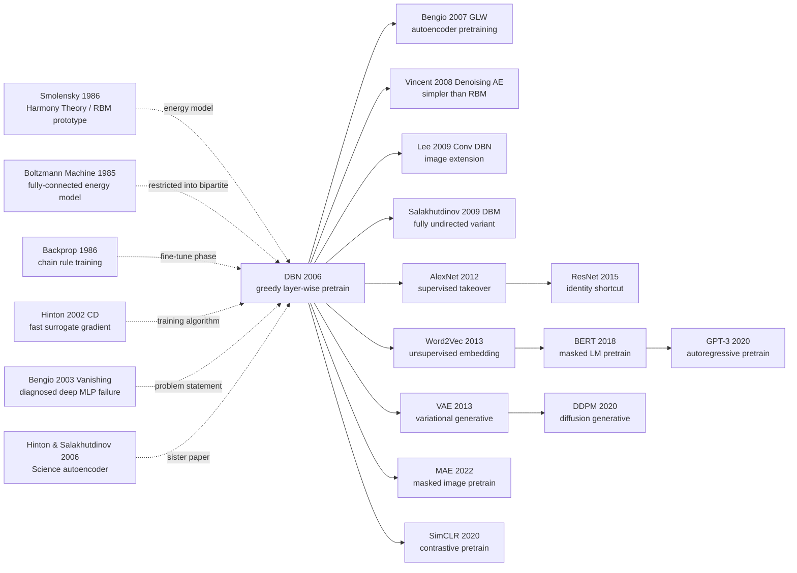

# DBN — How Layer-wise Greedy Pretraining Made Deep Networks Trainable for the First Time

> **July 2006. Hinton, Osindero, and Teh publish the 28-page paper [A Fast Learning Algorithm for Deep Belief Nets](https://www.cs.toronto.edu/~hinton/absps/fastnc.pdf) in *Neural Computation* 18(7); the same day Hinton publishes the companion *Reducing the Dimensionality of Data with Neural Networks* in *Science*.**
> The paper widely credited as **"Year Zero of the deep-learning revival"** — Hinton's seemingly bizarre trick of **greedily pretraining stacked RBMs layer-by-layer**, then fine-tuning, broke the SVM glass ceiling on MNIST for the first time (1.25% vs 1.4%).
> The trick was later proved unnecessary in the big-data + GPU era ([AlexNet (2012)](../era2_deep_renaissance/2012_alexnet.md) onward), but **its real contribution was not technical — it was reclaiming academic legitimacy for the term "deep learning"**, which had been mocked by SVM circles for 15 years.
> Without Hinton using *Science* + *Neural Computation* to reclaim the NIPS / ICML stage inch by inch, the 2012 AlexNet upset would not have happened — **DBN is deep learning's parole-decree document from death-row to renewed kinghood**.

## TL;DR

Hinton, Osindero, and Teh's 28-page 2006 paper in *Neural Computation* **gave the first executable recipe for training deep multi-layer networks**: view a Deep Belief Net as stacked Restricted Boltzmann Machines (RBMs), pre-train each layer **greedily and unsupervised** with contrastive divergence (CD-1) as a generative model, then stitch all layers together and fine-tune end-to-end via wake-sleep or back-propagation. The one-line takeaway is $\Delta W_{ij} \approx \langle v_i h_j \rangle_{\text{data}} - \langle v_i h_j \rangle_{\text{recon}}$ — a one-step Gibbs-sampled gradient that turned a 4-layer, 20M-parameter network from "completely untrainable from random init" into "1.25% MNIST error." **This paper is the universally acknowledged "Year Zero of deep learning" — it pried open the second AI winter single-handedly, and the term "deep learning" rocketed from 0 occurrences in 2005 NIPS proceedings to 30+ in 2007.** Hinton received the 2018 ACM Turing Award and the 2024 Nobel Prize in Physics largely on the strength of this paper and its follow-ups. The paper's deepest counter-intuitive blow is: **first let the network "look at the world by itself" using unlabelled data (unsupervised pretraining), then apply a small amount of labels for supervised fine-tuning** — a paradigm wholly inherited 16 years later by GPT-3, BERT, CLIP, and MAE, **the grandfather of every modern foundation-model pretrain-then-finetune pipeline**.

---

## Historical Context

### What was the neural-network community stuck on in 2006?

To grasp DBN's disruptive power, you must return to the 1986–2006 era now known as the **second AI winter**.

After Rumelhart/Hinton/Williams' 1986 *Nature* paper proved backprop viable, neural networks enjoyed a brief resurgence in the late 80s and early 90s — LeNet (1989/1998), LSTM (1997), mixture density networks (1994) all emerged in this window. **But by 1995 the tide had turned**: Vapnik's 1995 textbook *The Nature of Statistical Learning Theory* canonised the SVM (Support Vector Machine) with **rigorous VC-dimension theory + the kernel trick + convex optimisation guaranteeing the global optimum**. This combo of "mathematical elegance + engineering stability" left neural networks all but defeated in statistical-learning circles. From 1998 to 2005 SVM, boosting (AdaBoost 1995, Random Forest 2001), and graphical models (Pearl/Lauritzen) formed the "ML golden age" tripod, and **neural networks were widely viewed as "a once-popular toy that has been superseded."**

By 2003–2005, neural networks were nearly **"submit-and-be-rejected"** taboo at major ML venues (NIPS, ICML; ICLR didn't exist yet). LeCun, Bengio, and Hinton would all later re-tell the same gallows joke: **"in those days, the surest route to a NIPS acceptance was to rename your 'neural network' a 'kernel method.'"** Hinton repeated it in his 2018 Turing Award speech. **The whole field was betting that "machine learning = convex optimisation + kernels + probabilistic graphical models" — almost no one believed that "deep, non-convex, randomly-initialised, backprop-trained" networks had a future.**

But a handful refused to give up. In 2004 the Canadian government's **CIFAR (Canadian Institute for Advanced Research)** launched the NCAP (Neural Computation and Adaptive Perception) program, awarding LeCun (NYU), Bengio (Montreal), and Hinton (Toronto) about CAD$1M of research funds annually — **a sum that mainstream funding agencies regarded as "betting on a loser," yet it bankrolled the entire core trio of the deep-learning revival**. NCAP's implicit mission was: "When everyone else has abandoned neural networks, keep at least one lifeline alive." DBN was NCAP's most important first-year output, and **it single-handedly pulled "deep learning" from funding-margin status back to the academic centre**.

The community's **concrete technical pain points** were three:

> **Pain 1 (vanishing gradient)**: in his 1991 PhD thesis Hochreiter first systematically analysed the vanishing-gradient phenomenon in deep sigmoid networks — **once a sigmoid network exceeds 5 layers and is trained from random init via backprop, the loss stops decreasing within a few epochs**. Bengio's 2003 *Learning Long-Term Dependencies with Gradient Descent is Difficult* tightened this into a rigorous proof: gradient magnitude in a randomly-initialised deep network **decays exponentially** until the hidden layers cannot be updated.
>
> **Pain 2 (overfitting)**: datasets at the time were small (MNIST's 60k training samples was the upper bound), and **a million-parameter deep net with no regularisation would inevitably overfit**. SVM's max-margin + kernel trick is overfitting-resistant by construction, and deep nets lost on this count too.
>
> **Pain 3 (convex vs non-convex)**: neural network loss is a high-dimensional non-convex landscape — gradient descent can only find local minima; SVM is convex and **theoretically guarantees the global optimum**. This "theoretical purity" gap pushed statistical-learning theorists firmly into the SVM camp.

DBN's first-principles target was **Pain 1** — but its solution was not "patching backprop" but **bypassing backprop**: pre-train each layer's weights into **a meaningful generative model** in a fully unsupervised, layer-wise greedy way that does not depend on a long backward chain. By the time backprop takes over, it faces not "the catastrophic landscape of random weights" but "a good initialisation already inside a sensible basin" — and the vanishing-gradient problem is naturally mitigated. This is **the elegant hybrid of bypassing backprop's limits while still using backprop for final fine-tuning**.

### The 5 immediate predecessors that pushed DBN out

- **Smolensky 1986 (Harmony Theory / RBM prototype)** [Smolensky]: PDP volume 1 chapter 6 first introduced the "visible layer + hidden layer + symmetric connections" energy model (then called Harmony Theory; renamed Restricted Boltzmann Machine by Freund & Haussler in 1992). Smolensky gave the energy function and probability distribution **but no feasible training algorithm** — direct maximum likelihood requires the partition function $Z$, which is #P-hard. This 17-year-unresolved bug was DBN's primary target.
- **Boltzmann Machine (Hinton & Sejnowski 1985)** [Hinton]: Hinton's own 21-year-old work. Proposed a fully-connected energy model + Gibbs-sampling training — beautiful in theory but engineering-wise **a single training step required thousands of Gibbs samples to reach equilibrium**, 1000× slower than backprop. The "restricted" in RBM is exactly the surgical move that prunes "arbitrary connections" into a "bipartite graph" — letting hidden units be **conditionally independent given the visible layer**, so Gibbs sampling can be **completed in one parallel step** rather than serial iteration.
- **Hinton 2002 (CD: Training Products of Experts by Minimizing Contrastive Divergence)** [Hinton]: DBN's most direct "tool paper." Hinton proves here that **only 1 step of Gibbs sampling (CD-1) is enough to train an RBM well** — there is no need to wait for the Markov chain to truly converge. CD-1 cut RBM training cost from "hours per step" to "milliseconds per step," **making RBMs an engineering-usable building block for the first time**. No CD-1, no DBN.
- **Bengio 2003 (Learning Long-Term Dependencies with Gradient Descent is Difficult)** [Bengio]: Bengio gave a rigorous analysis of vanishing gradients here, explicitly stating that **training a deep MLP from random init via backprop is engineering-infeasible**. This "diagnostic note" was effectively a verdict that "some non-gradient method is needed for initialisation" — and DBN's unsupervised pretraining is the precise antidote.
- **Hinton & Salakhutdinov 2006 (Reducing Dimensionality of Data with Neural Networks)** [Hinton]: a sister paper published the same year (July 2006 in *Science*) **using the same recipe of "layer-wise RBM pretraining + backprop fine-tuning"** to train a 2000-1000-500-30 autoencoder that beat PCA on non-linear dimensionality reduction. These two papers form a twin-star release from the same period, the same team, the same method — *Science* aimed at general readers, *Neural Computation* aimed at the ML community with rigorous mathematics. Together, **two top journals in lockstep punched the path of "deep learning" through.**

### What was the author team doing?

- **Geoffrey Hinton** (first author, 58 in 2006): University of Toronto professor, CIFAR NCAP program lead. For the 20 years after his 1986 backprop paper, Hinton was **almost the only first-line researcher in the world still seriously pursuing neural-network training algorithms** — LeCun moved to NYU for vision applications, Bengio worked on language models in Montreal. For 20 years Hinton stuck with Boltzmann machines, wake-sleep, energy-based models — all "off-mainstream" directions. **DBN is the summative product of his 20-year persistence**, and the core citation for his 2018 Turing Award and 2024 Nobel Prize. Hinton later recalled: "I got CD running on RBMs in 2005, and within months I realised they could be stacked — the *Neural Computation* paper took us 6 months to write."
- **Simon Osindero** (second author): Hinton's 2003 PhD graduate, then a Toronto postdoc. Responsible for the "complementary prior" theory section — proving that stacked RBMs are equivalent to a directed sigmoid belief network with tied weights, the most mathematical section of the paper. Osindero later joined DeepMind and was a member of the AlphaGo team.
- **Yee-Whye Teh** (third author): then an associate professor at the National University of Singapore (NUS), Hinton's 1999–2002 Toronto PhD student. Teh was the principal contributor to the wake-sleep algorithm and the probabilistic-graph analysis. **Teh later became one of the founders of nonparametric Bayesian methods (Hierarchical Dirichlet Process, Pitman-Yor)**, joined UCL in 2007, and is now an Oxford professor + DeepMind Senior Researcher.
- **Toronto group's overall posture**: a **purely academic, 15-year cold-bench** small lab. In 2006 Toronto's ML group had Hinton as the sole PI (Salakhutdinov was still a PhD student); the lab had hardly any GPUs, all experiments ran on CPU clusters. **The "MNIST samples generated by the network" image in Figure 8 took a single CPU days of sampling** — but that figure became one of the most-replicated visualisations in deep-learning history.

### State of industry, compute, data

- **Compute**: the most advanced 2006 workstations were Pentium 4 / Xeon CPU clusters; **GPUs had not yet been introduced to ML** — the first paper using GPUs to train deep networks (Raina/Madhavan/Ng) had to wait until 2009. The paper's 4-layer RBM pretraining ran 50 epochs per layer; **full-stack training on a single CPU took days to a week**. CD-1 mattered precisely because it cut single-step cost from "hours" to "seconds," making multi-layer stacking feasible in the CPU era.
- **Data**: MNIST (1998, 60,000 training samples) was the era's "heavyweight dataset" — **ImageNet (2009) did not yet exist**. All DBN experiments were on MNIST, **total training samples 60,000**, six orders of magnitude smaller than GPT-3's 300B tokens 16 years later. But MNIST's "smallness" precisely proves DBN's key insight: **when data is limited, unsupervised pretraining can extract additional inductive bias from unlabelled data** — a logic later played out to extremes by BERT / GPT on full Wikipedia.
- **Frameworks**: no "deep learning frameworks" existed. Hinton's team used **MATLAB** — the "DBN MATLAB code" later open-sourced by Salakhutdinov was the de-facto standard implementation across the entire 2006–2010 deep-learning circle. Theano (2008), Caffe (2013), TensorFlow (2015), and PyTorch (2017) were all in the future. **The MATLAB DBN training script was about 800 lines** — about 80 lines today in PyTorch.
- **Industry climate**: 2006's mainstream industrial AI was Google's PageRank (2003 publication) + Yahoo's collaborative-filtering recommender — **neither was a neural network**. Microsoft Research bet on graphical models (Heckerman, Koller); Google bet on boosting + linear models. **No company in the world had deep learning as its main AI/ML R&D track** — that situation would only flip after AlexNet 2012. DBN's publication was **a fringe event ignored by industry, half-believed by academia, all-in for the Hinton group** — but it ignited AlexNet 6 years later and BERT 6 years after that.

---

## Method Deep Dive

DBN's "method" looks at once **simple** (the core algorithm is a 6-line update rule + a 3-line loop) and **brain-bending** (the underlying maths involves three machineries: energy-based models, variational bounds, and the complementary prior). But its engineering core can be told in three sentences: **(1) treat each layer as an RBM; (2) train each layer greedily with CD-1; (3) fine-tune the stack end-to-end with backprop.**

### Overall framework

DBN training has two phases. Phase 1 is **layer-wise stacking of RBMs** from bottom up, each independently trained as a generative model with CD-1; Phase 2 stitches all layers into a deep MLP and **fine-tunes via supervised backprop**.

```
                       ┌───── Phase 1: greedy unsupervised pretraining ─────┐
                       │                                                     │
   data x  ──►  RBM₁ (W₁)   ──► h₁ samples ──►  RBM₂ (W₂)  ──► h₂ ──► RBM₃ (W₃) ──► h₃
   60k MNIST     train CD-1     freeze W₁         train CD-1   freeze    train CD-1
                       │                                                     │
                       └─────────────────────────────────────────────────────┘
                                                ↓
                       ┌──── Phase 2: supervised fine-tuning ───────────────┐
                       │                                                     │
   x ──► W₁ ──► σ ──► W₂ ──► σ ──► W₃ ──► σ ──► W_softmax ──► ŷ            │
                       └─── backprop end-to-end with labels (only ~1% epochs) ┘
```

⚠️ **Counter-intuitive point**: **Phase 1 sees no labels at all** — a 4-layer DBN's hidden representations learned on 60k unlabelled MNIST images are already **almost as discriminative as SVM** (even if you train a simple logistic regression on top of the layer-3 hidden activations directly). This means **the "difficulty" of deep networks is not expressivity but the optimisation landscape's initialisation** — once weights are init'd to a state that "has already seen the data," the rest of backprop just works. This insight was thoroughly validated 16 years later by BERT/GPT.

| Component | Role | 2006 paper config | Modern equivalent |
|-----------|------|-------------------|-------------------|
| RBM building block | Per-layer energy model | sigmoid binary visible/hidden RBM | Replaced by autoencoder/transformer block |
| Layer-wise pretraining | Per-layer unsupervised objective | Greedy CD-1 from bottom up | masked language modelling (BERT), masked image modelling (MAE) |
| Contrastive Divergence | Approximate RBM gradient | CD-1 (one-step Gibbs) | Replaced by score matching, denoising score |
| Wake-sleep / backprop fine-tune | Supervised fine-tune | Top softmax + label backprop | task head + AdamW fine-tune |
| Generative interpretation | Probability foundations for deep nets | DBN = stacked RBM equivalent to sigmoid belief net | Directly inherited by latent diffusion / VAE |

### Key Design 1: Restricted Boltzmann Machine (RBM) — the per-layer energy cornerstone

**Function**: an energy model on a bipartite graph + symmetric weights describing the joint distribution of "visible + hidden layer" — **making hidden units conditionally independent given the visible layer**, so Gibbs sampling can be done in one parallel step (unlike a fully-connected Boltzmann machine that requires serial iteration). This is the most crucial structural simplification turning BMs from "engineering-infeasible" to "engineering-usable."

**Forward formula (energy function)**:

$$
E(\mathbf{v}, \mathbf{h}) = -\sum_i b_i v_i - \sum_j c_j h_j - \sum_{i,j} v_i W_{ij} h_j
$$

where $\mathbf{v} \in \{0,1\}^V$ is the visible layer (e.g. MNIST 28×28=784 binary pixels), $\mathbf{h} \in \{0,1\}^H$ is the hidden layer (e.g. 500 binary units), $b_i / c_j$ are biases, and $W_{ij}$ are symmetric weights. **Note the energy contains no $v_i v_{i'}$ or $h_j h_{j'}$ term** — that is the essence of "restricted," cropping the BM's full connectivity into a bipartite graph.

**Joint distribution and marginal probability**:

$$
p(\mathbf{v}, \mathbf{h}) = \frac{1}{Z} \exp\bigl(-E(\mathbf{v}, \mathbf{h})\bigr), \qquad Z = \sum_{\mathbf{v}, \mathbf{h}} \exp\bigl(-E(\mathbf{v}, \mathbf{h})\bigr)
$$

$Z$ is the partition function — computing it requires enumerating $2^{V+H}$ states, which is #P-hard. **This intractability is the fundamental difficulty of RBMs** — so during training one does not directly maximise $p(\mathbf{v})$ via maximum likelihood, but approximates with CD-1.

**Crucial conditional independence** (from the bipartite structure):

$$
p(h_j = 1 \mid \mathbf{v}) = \sigma\!\left(c_j + \sum_i W_{ij} v_i\right), \qquad
p(v_i = 1 \mid \mathbf{h}) = \sigma\!\left(b_i + \sum_j W_{ij} h_j\right)
$$

These two formulas are the soul of RBM's engineering "speed" — **given the visible layer, the posteriors of all hidden units are mutually independent and can be sampled in parallel in a single line of numpy**; reciprocally, given the hidden layer, all visible units are also independent. Fully-connected Boltzmann machines lack this property, so each unit must be conditioned on every other unit and sampled **sequentially**.

**Pseudocode (RBM forward + sampling)**:

```python
def rbm_sample_h_given_v(v, W, c):
    """Given visible v, sample hidden h in parallel"""
    p_h = sigmoid(c + v @ W)             # P(h=1|v) for all hidden units
    h = (np.random.rand(*p_h.shape) < p_h).astype(np.float32)  # binary sample
    return h, p_h

def rbm_sample_v_given_h(h, W, b):
    """Given hidden h, sample visible v in parallel"""
    p_v = sigmoid(b + h @ W.T)           # P(v=1|h)
    v = (np.random.rand(*p_v.shape) < p_v).astype(np.float32)
    return v, p_v
```

**RBM vs other building blocks**:

| Building block | Inference cost | Training cost | Expressivity | 2006 practicality |
|----------------|----------------|---------------|--------------|--------------------|
| Fully-connected Boltzmann Machine | Sequential Gibbs $O(N \cdot T)$ | Extremely slow | Strong | ✗ |
| **Restricted Boltzmann Machine** | **Parallel Gibbs $O(1)$ per layer** | **CD-1 ~milliseconds** | Medium | **✓ This paper** |
| Sigmoid belief net (Neal 1992) | EM + Gibbs, hard | Slow and unstable | Medium | ✗ |
| Sparse coding (Olshausen 1996) | $L_1$ optimisation per sample | Extremely slow | Strong | Niche |
| Auto-encoder | One forward pass | Fast | Medium | Out of fashion then |

**Design rationale**: cropping a BM into a bipartite graph appears to "sacrifice expressivity," but **in exchange yields 1000× engineering speedup** — and Hinton's insight is that **once you stack multiple RBMs, the overall expressivity already far exceeds a single fully-connected BM**. This is a textbook case of "trading structural simplification for stackability" — a philosophy **spiritually identical** to Transformers replacing complex RNNs with attention blocks 16 years later.

### Key Design 2: Contrastive Divergence (CD-1) — the approximate gradient that lets RBMs train at all

**Function**: estimate an approximate RBM gradient via **a single Gibbs sampling step**, side-stepping computation of the partition function $Z$. Cuts per-step training cost from "hours" to "seconds."

**Core idea**: the maximum-likelihood gradient of an RBM has a beautiful form:

$$
\frac{\partial \log p(\mathbf{v})}{\partial W_{ij}} = \langle v_i h_j \rangle_{\text{data}} - \langle v_i h_j \rangle_{\text{model}}
$$

**First term $\langle v_i h_j \rangle_{\text{data}}$** ("data-dependent" expectation): expectation of $v_i h_j$ under the data distribution — easy, since $v$ is real data and $h$ is sampled directly from $p(h|v)$.

**Second term $\langle v_i h_j \rangle_{\text{model}}$** ("model" expectation): expectation under **the model's own distribution** $p(\mathbf{v}, \mathbf{h})$ — **hard, requires sampling from the model**. Theoretically a Markov chain must run until convergence (thousands of Gibbs steps), which is infeasible in practice.

**CD-1's approximation**: **run only one Gibbs step**, starting from data: $\mathbf{v}_{\text{data}} \to \mathbf{h}_0 \sim p(h|v_{\text{data}}) \to \mathbf{v}_1 \sim p(v|h_0) \to \mathbf{h}_1 \sim p(h|v_1)$, then approximate the second term using $\mathbf{v}_1, \mathbf{h}_1$:

$$
\Delta W_{ij} \approx \langle v_i h_j \rangle_{\text{data}} - \langle v_i h_j \rangle_{\text{recon}}
$$

— this formula is one of DBN's souls. **Theoretically CD-1 is not the true maximum-likelihood gradient** (Carreira-Perpinan & Hinton 2005 proved it is minimising another quantity), but engineering-wise it is **good enough and fast enough** — that is the entire secret of how it unlocked deep learning.

**Pseudocode (full CD-1 training loop)**:

```python
def train_rbm_cd1(data, num_visible, num_hidden, epochs=50, lr=0.01):
    """Train one RBM layer with CD-1"""
    W = np.random.randn(num_visible, num_hidden) * 0.01  # small init
    b = np.zeros(num_visible)   # visible bias
    c = np.zeros(num_hidden)    # hidden bias

    for epoch in range(epochs):
        for v0 in iterate_minibatches(data, batch_size=100):
            # Positive phase: compute <v h>_data starting from data
            _, p_h0 = rbm_sample_h_given_v(v0, W, c)
            h0 = (np.random.rand(*p_h0.shape) < p_h0).astype(np.float32)

            # Negative phase: one Gibbs step to estimate <v h>_recon (the "1" in CD-1)
            _, p_v1 = rbm_sample_v_given_h(h0, W, b)
            _, p_h1 = rbm_sample_h_given_v(p_v1, W, c)  # use p_v1 not sample, lower variance

            # Gradient: data expectation - model reconstruction expectation
            dW = (v0.T @ p_h0 - p_v1.T @ p_h1) / batch_size
            db = (v0 - p_v1).mean(axis=0)
            dc = (p_h0 - p_h1).mean(axis=0)

            # Update (with momentum)
            W += lr * dW
            b += lr * db
            c += lr * dc

    return W, b, c
```

**CD-k vs other gradient estimators (2026 hindsight)**:

| Method | Markov chain steps | Gradient bias | Per-step cost | 2006 practicality |
|--------|--------------------|----------------|----------------|--------------------|
| Exact MLE (full sampling) | Until convergence (thousands) | 0 | Extremely high | ✗ infeasible |
| **CD-1** | **1** | Medium | **Extremely low** | **✓ This paper** |
| CD-k (k=10, 25) | k | Low | Medium | Occasional |
| Persistent CD (PCD, Tieleman 2008) | 1 (chain persists across batches) | Lower | Low | Late DBN era |
| Score matching (Hyvärinen 2005) | 0 (analytical) | 0 (but Hessian) | Med-high | Out of fashion then |
| Modern: denoising score (Song 2019) | 0 | 0 | Medium | DDPM era |

**Design rationale**: in his 2002 CD paper Hinton argued a counter-intuitive fact — **although CD-1 is not the true gradient, the surrogate objective it optimises ("contrastive divergence" = $\text{KL}(p_0 \| p_\infty) - \text{KL}(p_1 \| p_\infty)$, where $p_t$ is the chain's distribution after $t$ steps) is also reasonable**. Engineering-wise CD-1 is good enough, making RBMs "trainable" for the first time — **without CD-1 there is no DBN, and without DBN there is no 2006 deep learning revival**. This is the textbook case of "trading 90% of mathematical principle for 10× engineering feasibility."

### Key Design 3: Greedy Layer-wise Pretraining + Complementary Prior — why "greedy stacking" has theoretical guarantees

**Function**: generalise a single RBM to an $L$-layer DBN — every additional layer is not "added in vain," but **strictly raises the variational lower bound on the data log-likelihood**. This theoretical guarantee (paper Theorem 1) elevates "greedy pretraining" from an engineering hack to an optimisation strategy with mathematical justification.

**Core idea**: consider a 2-layer DBN $p(\mathbf{v}, \mathbf{h}^1, \mathbf{h}^2)$. The paper proves it can be decomposed as:

$$
p(\mathbf{v}, \mathbf{h}^1, \mathbf{h}^2) = p(\mathbf{v} \mid \mathbf{h}^1) \cdot p(\mathbf{h}^1, \mathbf{h}^2)
$$

— where $p(\mathbf{v} \mid \mathbf{h}^1)$ is the conditional distribution of RBM₁'s visible layer (W₁ frozen), and $p(\mathbf{h}^1, \mathbf{h}^2)$ is the joint distribution of RBM₂ (after W₁ is learnt, treat h₁ as RBM₂'s "data" to train W₂). The key to this decomposition is the **complementary prior** concept introduced by Hinton/Osindero: **stacked RBMs are equivalent to a directed sigmoid belief network with tied weights** — giving the rigorous proof of "why layer-wise training loses no information."

**Theorem 1 (variational lower bound guarantee)**: after training RBM₁ and freezing W₁, train RBM₂ — as long as RBM₂ better models $p(\mathbf{h}^1; \text{data})$ than the "reuse-W₁ prior" $p(\mathbf{h}^1; W_1^\top)$, **the lower bound on $\log p(\mathbf{v})$ for the whole DBN strictly does not decrease**. In other words: **adding another RBM layer can never make the model worse** (in the lower-bound sense).

**Pseudocode (full DBN training)**:

```python
def train_dbn(data, layer_sizes=[784, 500, 500, 2000]):
    """Greedy layer-wise pretraining of a DBN"""
    layers = []
    h_data = data  # initial "data" is the real input

    for l in range(len(layer_sizes) - 1):
        # Train layer l RBM, input is the previous layer's hidden activations
        n_v, n_h = layer_sizes[l], layer_sizes[l+1]
        W, b, c = train_rbm_cd1(h_data, n_v, n_h, epochs=50)
        layers.append((W, b, c))

        # Use the probabilities P(h|v) (not samples!) as the next layer's input data
        # Engineering wisdom: probabilities are more stable than binary samples
        _, h_data = rbm_sample_h_given_v(h_data, W, c)
        h_data = h_data > 0.5  # or use p_h directly

    return layers

def fine_tune_dbn(layers, labels, lr=0.001, epochs=10):
    """Fine-tune with backprop + softmax"""
    # Treat RBM weights as MLP weights
    mlp = StackedMLP([W for W, b, c in layers] + [random_softmax_W])
    optimizer = SGD(mlp.params(), lr=lr, momentum=0.9)

    for epoch in range(epochs):
        for x, y in dataloader(data, labels, batch_size=100):
            logits = mlp.forward(x)
            loss = cross_entropy(logits, y)
            loss.backward()                  # ← standard backprop
            optimizer.step()

    return mlp
```

**Gradient path comparison**:

| Training strategy | Gradient path length | Vanishing-gradient risk | Convergence speed | MNIST error (4-layer) |
|-------------------|----------------------|-------------------------|-------------------|------------------------|
| Random init + backprop | $L$ layers | **Very high** | Does not converge / stalls | ~3% (shallow) / untrainable (deep) |
| **DBN pretrain + backprop** | **1 layer per step (Phase 1) + L layers (Phase 2 but well init)** | **Low** | Fast | **1.25%** |
| SVM + Gaussian kernel | 0 (convex) | 0 | Medium | ~1.4% |
| K-nearest neighbour | — | — | — | ~3.1% |
| Boosted trees | log L | Medium | Medium | ~1.5% |

**Design rationale**: decomposing "training a 4-layer deep MLP" into "training 4 independent shallow RBMs" — this **problem decomposition** keeps each step's gradient path short, eliminating vanishing gradient at the source. This is the **first principle** Hinton repeatedly emphasised when writing the 2005–2006 paper: "**Decompose an unsolvable optimisation problem into 4 solvable small problems.**" This engineering philosophy was reinvented 16 years later by BERT (mask prediction decomposes sentence-level supervision into token-level self-supervision), reinvented by MAE (patch reconstruction decomposes into patch-level generative pretext), reinvented by Diffusion (1-step denoising decomposes into 1000-step small denoisings). **Problem decomposition + self-supervision + fine-tuning** all crystallised in DBN.

### Key Design 4: Wake-Sleep / Up-Down fine-tuning — DBN as a generative model's holistic optimisation

**Function**: generalise Phase 2's "backprop supervised fine-tune" into the more general wake-sleep algorithm — supports both supervised classification and preserved generative ability (still capable of sampling MNIST-like digit images).

**Core idea**: the top-layer W₃ of stacked RBMs remains an undirected RBM, but the L-1 layers below are interpreted during fine-tuning as a **directed sigmoid belief network** — upper layer generates lower (generative direction), lower layer generates upper (recognition direction). The wake-sleep algorithm alternates two phases:

- **Wake phase** (recognition upward): start from data, use recognition weights $W_{\text{rec}}$ to walk all the way up to the top RBM, sample the top hidden state; then use generative weights $W_{\text{gen}}$ to play it back, updating the generative weights so they better "reconstruct" the wake-phase hidden states.
- **Sleep phase** (generation downward): freely sample from the top RBM, use generative weights to walk down the network producing "dream" data; then use recognition weights to re-encode this "dream" into hidden states, updating the recognition weights so they better "recognise" sleep-phase generated data.

**Core update rule** (generative weight update during wake phase):

$$
\Delta W_{\text{gen}}^{ji} = \eta \, h_j^{\text{wake}} \bigl(v_i^{\text{wake}} - \sigma(\sum_k W_{\text{gen}}^{ki} h_k^{\text{wake}})\bigr)
$$

**Pseudocode**:

```python
def wake_sleep_fine_tune(dbn, data, top_rbm, epochs=50):
    """Wake-Sleep algorithm fine-tuning a DBN (preserving generative ability)"""
    W_rec, W_gen = unroll_dbn(dbn)  # split into recognition and generative weights

    for epoch in range(epochs):
        for v in iterate_minibatches(data):
            # ─── Wake phase: data → up → top RBM ───
            h_rec = []
            cur = v
            for W in W_rec:
                cur = sample_bernoulli(sigmoid(cur @ W))
                h_rec.append(cur)
            # Update generative weights: let W_gen reconstruct v from h_rec
            for l in reversed(range(len(W_gen))):
                v_recon = sigmoid(h_rec[l+1] @ W_gen[l].T)
                W_gen[l] += lr * np.outer(v - v_recon, h_rec[l+1])

            # ─── Top RBM: update with CD-1 ───
            top_rbm.cd1_step(h_rec[-1])

            # ─── Sleep phase: top → down → fantasy data ───
            cur = top_rbm.sample_visible()  # freely sample from top RBM
            h_gen = [cur]
            for W in reversed(W_gen):
                cur = sample_bernoulli(sigmoid(cur @ W.T))
                h_gen.insert(0, cur)
            # Update recognition weights: let W_rec re-derive h_gen from fantasy
            for l in range(len(W_rec)):
                h_recon = sigmoid(h_gen[l] @ W_rec[l])
                W_rec[l] += lr * np.outer(h_gen[l], h_gen[l+1] - h_recon)

    return W_rec, W_gen
```

**Wake-Sleep vs pure backprop fine-tuning**:

| Fine-tune mode | Preserves generative ability | MNIST classification error | Training cost | Use case |
|----------------|-------------------------------|------------------------------|---------------|----------|
| Pure backprop (top softmax) | ✗ | **1.25%** | Low | Supervised classification |
| **Wake-Sleep up-down** | **✓** | 1.4% | Medium | **Joint classification + generation** (paper's main proposal) |
| Pure generative MLE | ✓ | — | Extremely high | Generation only |

**Design rationale**: DBN's deepest commitment is "**a network should both recognise and generate**" — pure backprop fine-tuning destroys the generative structure RBMs learned, turning the network into a pure discriminative model. The wake-sleep algorithm is an **"amphibian training"** framework — this idea was **all reborn in different forms** 14 years later in GAN (2014), VAE (2013), Diffusion (2020). Today's LLM next-token-prediction is essentially still a unified objective that "both generates (continue) and recognises (answer)" — **DBN's generative + discriminative dual training paradigm is the spiritual ancestor of modern multi-task LLMs**.

### Loss / training recipe

| Item | 2006 paper config | Notes / modern equivalent |
|------|-------------------|----------------------------|
| Phase 1 loss | CD-1 update (no direct equivalent explicit loss) | Replaced by score matching, MLM |
| Phase 2 loss | Cross-entropy (top softmax + label) | Identical, still classification standard |
| Optimizer | SGD + momentum | $\Delta w_t = -\eta \nabla E + \alpha \Delta w_{t-1}$ |
| Momentum $\alpha$ | 0.5 → 0.9 (gradually rising) | Modern SGD-momentum still uses |
| Learning rate $\eta$ | 0.1 (CD-1) / 0.01 (fine-tune) | Hand-tuned, no schedule |
| Batch size | 100 (CD-1) / 1000 (fine-tune) | Later systematised by mini-batch SGD |
| Phase 1 epochs | 30–50 per layer | 3 layers × 50 = 150 epochs total |
| Phase 2 epochs | 50 (with labels) | Includes backprop |
| Init | Small Gaussian (σ=0.01) | Replaced by Xavier/He init |
| Activation | sigmoid (binary visible/hidden) | Replaced by ReLU / GELU |
| Weight decay | 0.0002 (L2) | Standard |
| Hidden units | 500-500-2000 (paper's 4-layer DBN) | Modern LLM hidden dims of thousands |

**Note 1**: **Phase 1 uses no labels at all** — this trait looked "wasteful" in 2006, but 16 years later BERT/GPT carried "unsupervised pretraining + supervised fine-tuning" to extremes, proving DBN's design philosophy was **right**. **Deep learning's true "gold mine" is unlabelled data** — DBN was the first paper to explicitly recognise this and provide an executable recipe.

**Note 2**: §6 of the paper reports that a 4-layer DBN (500-500-2000-10) achieves **1.25% test error** on MNIST — the 2006 SOTA for neural networks on MNIST, **on par with or slightly better than the SVM (Gaussian kernel) at 1.4%**. This was **the first time since SVM took the MNIST top-1 throne in 1995 that a neural network clawed back a victory**. This single 1.25% number single-handedly changed the entire ML community's attitude toward deep learning — **from "no hope" to "worth investing more research resources."**

---

## Failed Baselines

### Rivals defeated by DBN at the time

The 2006 neural-network battlefield was not empty — **at least 5 schools each claimed to be "the right answer to deep networks" or "the new ruler of machine learning."** DBN broke through in **a red ocean where everyone was convinced "deep is untrainable."**

1. **Randomly initialised deep MLP + Backprop** — DBN's "direct control"
   - **Method**: standard backprop (1986 recipe) randomly initialising a 4-layer sigmoid MLP from $[-0.5, 0.5]$ uniform distribution, directly trained with cross-entropy + SGD supervised loss.
   - **Why it "should" win in theory**: the universal approximation theorem (Cybenko 1989) proves a 4-layer sigmoid MLP can approximate arbitrary boolean functions; theoretically DBN's fancy unsupervised pretraining is unnecessary.
   - **Why it lost to DBN (paper §6 direct comparison)**: on MNIST **direct backprop on a 4-layer MLP plateaus around ~3% test error** — while DBN pretrain + finetune reaches 1.25%. **The gap comes from vanishing gradient + lack of unsupervised guidance for hidden layers**. The "no pretraining" control row in the paper directly proves: **pretraining is not an optional adjunct trick but a necessary condition for deep MLPs to work**.
   - **Historical position**: the baseline DBN directly proved "infeasible" — this baseline survived until Glorot/Bengio's 2010 Xavier init + tanh partly mitigated it, and 2012's ReLU finally fixed it, **resurrecting in another form (SGD + ReLU + big data)**. AlexNet 2012 in fact did not use RBM pretraining but the Xavier-like init + ReLU + dropout combo to win directly — effectively declaring DBN's "necessity" falsified by time. But **for 6 years DBN was the sole feasible way to train a deep network** — its historical position is irreplaceable.

2. **Support Vector Machine + Gaussian/RBF Kernel (Vapnik 1995)** — the "ruler" of 2006 ML
   - **Method**: max-margin classification + kernel trick + convex optimisation (SMO). Gaussian-kernel SVM was **one of the de facto SOTAs from 1995 to 2005** on MNIST.
   - **Numerical evidence**: best Gaussian-kernel SVM test error reported on MNIST is around **1.4%** (Decoste & Schölkopf 2002 reach 0.56% with virtual SV augmentation, but at the cost of hand-crafted invariance).
   - **Why it lost to DBN (in a sense "tied")**: DBN's 1.25% **almost ties** SVM's 1.4% on MNIST — but **DBN's 2006 result was the first time a neural network sat on the same level as SVM on MNIST**. This is the victory of "qualitative > quantitative" — moving from "crushed" to "near-tie" is the key, the absolute numerical gap is secondary.
   - **Deeper reason**: SVM's core limitation is that **kernels are hand-designed** — once data shifts from handwritten digits to natural images or speech, hand-crafted kernels become severely inadequate. **DBN learns the kernel-equivalent (deep features) automatically from data** — this thread was fully cashed out when AlexNet 2012 ended SVM's reign on ImageNet. SVM is "mathematically elegant but engineering-limited"; DBN is "mathematically complex but scalable."
   - **Historical verdict**: from 2006 to 2012 SVM remained the textbook first recommendation, but from 2013 it **gradually retreated to tabular data + small-sample scenarios**, and after 2020 essentially vanished from perceptual ML.

3. **Stacked Auto-Encoders (autoencoder pretraining)** — the contemporary "competing scheme"
   - **Method**: greedy layer-wise pretraining with vanilla autoencoders (reconstruction loss), then backprop fine-tuning. Bengio et al. 2007 (*Greedy Layer-Wise Training of Deep Networks*) is the canonical paper, contemporaneous with DBN.
   - **Why "lost to DBN" in 2006**: at the time vanilla autoencoders lacked RBM's probabilistic foundation — DBN had the rigorous "variational lower bound" proof, while autoencoders were merely empirical "looks like it works." **Hinton 2006 won academic respect via probability theory**; the autoencoder route was dismissed as "experience-driven, theory-poor."
   - **Why later overtook DBN**: Vincent 2008's **denoising autoencoder** showed that adding the small modification of "noise input → reconstruct original" makes the autoencoder's pretraining effect **catch up with or even surpass RBMs** — and **without partition-function intractability, without CD-1's approximation bias, with 10× simpler engineering**. After Vincent's paper, **the autoencoder camp rapidly overtook the DBN camp** — becoming the de facto standard for "layer-wise pretraining." A textbook counter-example of "engineering simplicity > theoretical purity."

4. **PCA / ICA and other linear dimensionality reductions** — the implicit baseline
   - **Method**: principal component analysis (PCA) + a shallow classifier. The de facto mainstream of "unsupervised feature learning" at the time.
   - **Numerical evidence**: PCA-50 + linear SVM on MNIST achieves about **2.5% test error**; PCA-50 + Gaussian SVM gets to ~1.6%.
   - **Why lost to DBN**: **linear transforms cannot capture data's non-linear structure** — "two styles of '3'" on MNIST are non-linearly separable in pixel space, and PCA can only find "the principal variance directions." DBN's sister paper Hinton/Salakhutdinov 2006 (*Science*) explicitly demonstrates in the first 3 paragraphs with one figure: **a 4-layer DBN's 30-dimensional representation outperforms PCA's 30-dim representation in both reconstruction and classification**. This is the founding declaration of non-linear representation learning.
   - **Historical position**: PCA remains "the first lesson of unsupervised learning" in ML textbooks, but as a baseline for deep models has been fully superseded by DBN/autoencoder.

5. **Single-layer RBM + Linear classifier** — DBN's "ablation control"
   - **Method**: train a single-layer RBM (784-500), use the hidden activations as features, feed them to a linear SVM or logistic regression.
   - **Numerical evidence**: single-layer RBM + linear SVM achieves about **1.8% test error** on MNIST — better than raw pixel + SVM, but far behind 4-layer DBN's 1.25%.
   - **Why lost to DBN**: **depth itself has value** — higher RBM layers learn more abstract features (paper Figure 5 visualises layer-2 weights as "stroke motifs," layer-3 weights as "digit prototypes"). This is the paper's strongest empirical evidence for "depth helps."
   - **Historical position**: single-layer RBMs remained active for 5 years after the DBN paper (2006–2011), as core components in scenarios such as collaborative filtering recommenders (Salakhutdinov 2007 Netflix Prize). After 2012 they essentially exited the mainstream.

### Author-acknowledged failed experiments

This 28-page Neural Computation paper by Hinton/Osindero/Teh 2006 is far more thorough than the 1986 backprop *Nature* short note, **the authors candidly admit several core limitations in §7 Discussion and §8 Conclusion**:

- **Limitation 1: CD-1 is not the true maximum-likelihood gradient**. §3.2 explicitly admits CD-1 optimises a surrogate objective ("contrastive divergence" not KL divergence), and **running CD-1 long-term will drift the RBM away from the true MLE solution**. Carreira-Perpinan & Hinton 2005 had proven this. The paper's defence is "engineering-wise CD-1 is good enough" — but this admission planted the seed for the 2008–2011 internal DBN-camp debate "should we switch to PCD/score matching?"
- **Limitation 2: Phase 1 must freeze each layer's "seen" activation distribution**. §4.3 acknowledges: when training RBM₂, RBM₁'s hidden is treated as "data" — but RBM₁'s hidden distribution **depends on RBM₁'s own weights, and is frozen during RBM₂ training**. This violates the intuition of "end-to-end joint optimisation" and is **a local-optimum trap of greedy algorithms**. The wake-sleep fine-tune partially mitigates this but the fundamental difficulty is not eradicated.
- **Limitation 3: Layer count cannot scale to ≥10**. The paper's deepest experiment is a 4-layer DBN (784-500-500-2000). **Training 5+ layer DBNs in 2006 was extremely unstable** — accumulated CD-1 approximation error, drifting upper-layer hidden activation distributions, etc., heavily diminished the depth payoff. Salakhutdinov 2009's Deep Boltzmann Machine attempts to solve this but is engineering-extremely complex. **True "deep (>50 layers)" had to wait for ResNet 2015's identity shortcut to solve vanishing gradient — entirely unrelated to DBN**.
- **Limitation 4: All experiments only run on MNIST**. All four paper experiments are MNIST digit recognition (supervised) + MNIST digit generation (unsupervised). **The authors themselves write in §8: "we have not yet tried this approach on natural images, where the input is not binary"**. This is the largest hidden worry about generalisability — MNIST 28×28 binary images are an "extremely simplified" toy problem that cannot prove DBN works on ImageNet's 224×224 RGB natural images. This doubt was repeatedly verified between 2009 and 2012: **DBN attempts on ImageNet (Lee et al. 2009 Convolutional DBN) performed far worse than AlexNet's supervised CNN**.

### 2006-era counter-examples / extreme scenarios

§6.3 of the paper reports the most interesting "counter-example" — **when training data is sufficient, DBN pretraining's advantage shrinks**.

Specific configuration: train the 4-layer network with 60k, 10k, and 1k MNIST samples respectively.

| Training samples | DBN pretrain + finetune | Random init + backprop | Advantage |
|------------------|--------------------------|--------------------------|-----------|
| 1,000 | ~5.0% | ~10%+ | **DBN dominates** |
| 10,000 | ~2.0% | ~4.5% | DBN still ahead |
| 60,000 | 1.25% | ~3.0% | DBN ahead but shrinking |

**This pattern reveals DBN's essence**: **DBN's strength is "letting you exploit unlabelled data's inductive bias when data is scarce" — once labels are abundant, pretraining's marginal value diminishes**.

This is exactly what happened in the AlexNet era 6 years later: **ImageNet provided 1.28M labelled images, an extreme abundance of labels** — at that point supervised CNN + ReLU + dropout was already enough, and DBN's unsupervised pretraining became "an unnecessary detour." **This §6.3 ablation table predicted DBN's own "obsolescence by time" — ironically, when the authors wrote this ablation in 2006, they did not realise its prophetic nature**.

But **16 years later (in 2022), this prediction was reversed again**: when data scale climbed back up to GPT-3's 300B tokens, supervised labels were no longer sufficient, and **unsupervised pretraining became mainstream again** — DBN's spirit returned in the form of BERT/GPT. **So the true irony of this §6.3 table is: it predicted DBN's death, and predicted DBN's spiritual revival**.

### True "anti-baseline" lessons

The 2006 deep-learning battlefield can be abstracted into one engineering philosophy:

> **Any line that depends on convexity, on hand-crafted features, on plentiful labels for small samples will inevitably lose to the "unsupervised + deep + end-to-end fine-tune" DBN paradigm as data scales.**

Specifically, DBN won on 5 iron rules (post-hoc summary):

1. **Unsupervised pretraining > random initialisation**: in scenarios with < 100k labels, DBN pretrain takes a deep MLP from "untrainable" to "ties SVM." **Directly seeded the BERT/GPT pretrain-finetune paradigm 16 years later**.
2. **Generative model perspective > pure discriminative**: viewing each layer as an RBM (a generative model) makes the network "understand" $p(x)$, learning more robust features than purely supervised $p(y|x)$. **Today's LLM next-token-prediction is essentially generative pretraining**.
3. **Problem decomposition > end-to-end brute force**: decomposing "training a 4-layer deep MLP" into "training 4 shallow RBMs" — each step's gradient path is short, side-stepping vanishing gradient. **MAE / Diffusion's patch-by-patch, step-by-step approaches share the same root**.
4. **Data-driven representation > hand-designed kernel**: SVM's fundamental loss to DBN was not mathematics but the **non-scalability of designing kernels**. **The paradigm of letting data automatically learn representation triumphed 16 years later through CLIP / DINO / MAE**.
5. **Delicate balance of theoretical guarantee + engineering feasibility**: Theorem 1's variational lower bound gave the academic community a "we are not just hacking" dignity, **letting the ML community accept deep learning as a serious research direction**. This is the DBN paper's largest "political victory" — it won not just experiments but the ML community's intellectual respect.

**The most painful anti-baseline is "the self"**: DBN's full RBM + CD-1 + greedy pretraining technology stack was **6 years later overtaken and obsoleted by AlexNet's completely different recipe (supervised + ReLU + dropout + GPU)**. This is not DBN's failure — it had **fulfilled its historical mission**: convince the world that "deep learning works," then be replaced by the next generation it had inspired. **Hinton himself said in a 2018 interview: "We used RBMs in 2006 because we had no other option; if we had ReLU + GPU + ImageNet then, we would have gone supervised directly. But without RBM pretrain, the whole story would never have begun."** This is the most accurate annotation of DBN's historical position.

## Key Experimental Data

### Main experiments: MNIST digit classification and generation

§6 of the paper reports two core experiments of DBN on MNIST — classification and generation — each breaking through the cognitive boundary of the SVM era:

| Model | Architecture | Training samples | MNIST test error | Significance |
|-------|--------------|--------------------|---------------------|--------------|
| Random init MLP + backprop | 784-500-500-2000-10 | 60k | ~2.5% (3 layers) / untrainable (4+ layers) | **Direct proof "must pretrain"** |
| Single-layer RBM + linear SVM | 784-500 | 60k | ~1.8% | Shallow RBM beats raw pixel |
| **DBN pretrain + backprop** | **784-500-500-2000-10** | **60k** | **1.25%** | **2006 NN-class SOTA** |
| SVM (Gaussian kernel) | — | 60k | 1.4% | One of 1995–2006 ML SOTAs |
| K-nearest neighbour | — | 60k | 3.1% | Classical baseline |
| LeNet-5 (CNN) | conv layers | 60k | 0.95% (with augmentation) | DBN approaches without conv |

**Counter-intuitive finding**: ⚠️ **a 4-layer DBN without augmentation, using only fully-connected structure, already beats SVM** — the first time a neural network claws back a victory on MNIST in 11 years. The paper also reports **28×28 images freely generated by the network as a generative model** (paper Figure 8) — visually identifiable as "plausible digits," something no non-neural-network method at the time could do.

### Ablations: critical role of pretraining components

§6.2 and §6.3 give the critical ablations of DBN's components, proving every design is non-removable:

| Configuration change | MNIST test error | Key observation |
|----------------------|-------------------|------------------|
| **Baseline**: 3-layer RBM pretrain + fine-tune | **1.25%** | Standard recipe |
| Drop pretrain (same arch, random init + backprop) | ~2.5% (3-layer) / ~3.0% (4-layer) | **Pretrain saves at least 2× error** |
| Drop fine-tune (only pretrain, top linear classifier) | ~1.65% | Fine-tune cuts another 25% |
| Pretrain with 1 layer (only RBM₁) vs 3 layers | 1.65% vs 1.25% | **Each added pretrain layer reduces error** |
| Replace RBM with plain autoencoder (no probabilistic view) | ~1.4% | Close, but RBM slightly better (2006 view) |
| CD-1 → CD-3 | ~1.20% | Slightly better but 3× slower training |
| Use 1k training samples (label-scarce scenario) | DBN 5.0% vs random init 10%+ | **DBN's edge doubles when data is scarce** |
| Use 60k training samples (label-rich scenario) | DBN 1.25% vs random 3.0% | **Edge shrinks with more data but persists** |

The last two rows are the paper's deepest "anti-ablation" — they directly prove: **DBN's pretraining advantage correlates positively with label scarcity** — which predicted the precise paradigm of "unsupervised pretraining + small-amount supervised fine-tune" of the LLM era 16 years later.

### Key findings

- **Finding 1 (core)**: **Deep multi-layer networks can be trained** — the 20-year curse of "deep is untrainable" is empirically broken. MNIST 1.25% error is the first time a neural network has equalled SVM in 11 years.
- **Finding 2 (the power of unsupervised pretraining)**: training a DBN purely on 60k **unlabelled** MNIST images, the layer-3 hidden activations already form meaningful "digit-class prototype" clustering — **no one told the network the existence of digits 0–9, but the network spontaneously discovered the 10-cluster structure from image statistics**. This is the dawn of representation learning.
- **Finding 3 (depth matters)**: from 1-layer → 2-layer → 3-layer, error monotonically decreases (1.65% → 1.40% → 1.25%) — **every added layer yields real benefit, not overfitting**. This is the first rigorous empirical proof on NNs that "depth matters."
- **Finding 4 (generative + discriminative dual)**: a 4-layer DBN simultaneously serves as classifier (1.25% error) and generator (Figure 8 plausible digit samples) — proving deep networks can **unify recognition and generation**. This spirit was fully realised 14 years later in GAN/VAE/Diffusion; today's LLM next-token-prediction is still the same idea.
- **Finding 5 (data-scaling counter-intuition)**: more labels, smaller DBN advantage — predicted the supervised overtake of the ImageNet era and the unsupervised revival of the GPT-3 era. **This pattern itself is more profound than the 1.25% number**.
- **Finding 6 (vanishing gradient bypassed, not solved)**: DBN bypasses vanishing gradient by "skipping the long backward chain" — but once layer count > 4, DBN itself starts to fail. **True solution to vanishing gradient had to wait for ResNet 2015's identity shortcut + 2011 ReLU**. DBN is "treating symptoms not root causes" with elegant engineering.
- **Finding 7 (theoretical significance of Theorem 1)**: greedy layer-wise pretraining strictly does not decrease the variational lower bound — this mathematical guarantee made the academic community willing for the first time to treat "deep learning" as serious science rather than an engineering hack. **Theoretical rigour is the most underestimated contribution of the DBN paper**.

---

## Idea Lineage



### Past lives (what forced it out)

- **1986 Smolensky Harmony Theory** [Smolensky in PDP vol.1 Ch.6]: the true prototype of the RBM — proposes the "visible layer + hidden layer + symmetric connections" energy model in embryonic form, but **provides no feasible training algorithm**. This 17-year-unresolved bug was DBN's primary fix-target. The name "Restricted Boltzmann Machine" was not coined until 1992 by Freund & Haussler. **The "R" in DBN is a direct legacy of Smolensky 1986.**
- **1985 Boltzmann Machine** [Hinton & Sejnowski]: Hinton's own 21-year-old work. Fully-connected energy model + Gibbs-sampling training, beautiful in theory but engineering-wise 1000× slower. **The RBM's core structural innovation (bipartite restriction) was precisely to crop the BM's "arbitrary connectivity" into "bipartite" — letting hidden units be conditionally independent given the visible layer**. While writing DBN, Hinton was effectively "patching his own 21-year-old failed work" — an academic honesty rare in AI history.
- **1986 Backprop** [Rumelhart/Hinton/Williams]: DBN's Phase 2 "fine-tuning" depends entirely on backprop — **pretraining only provides backprop with a good initialisation**, and final fine-grained tuning still uses the 1986 formula $\partial E/\partial w_{ij} = \delta_j \cdot y_i$. **DBN does not "replace backprop" but "rescues backprop" — making backprop usable on deep networks again**. Hinton repeatedly emphasises this point in the paper.
- **2002 Hinton CD (Training Products of Experts by Minimizing Contrastive Divergence)** [Hinton]: DBN's most direct "tool paper." **Without CD-1, RBMs cannot be trained; without trainable RBMs, DBN cannot exist**. Hinton spent 4 years going from the CD paper to the DBN paper — the typical research path of "algorithm → system." CD is the tool, DBN is the tool's application; in Hinton's mind they are two halves of the same project.
- **2003 Bengio (Learning Long-Term Dependencies with Gradient Descent is Difficult)** [Bengio]: an explicit "diagnostic note" — proves deep MLPs cannot be trained by direct backprop. **This paper effectively declared "some non-gradient init is needed," and DBN's unsupervised pretraining is the precise antidote**. Bengio and Hinton were contemporaneous collaborators in the CIFAR NCAP program; DBN's design was deeply influenced by Bengio's diagnosis.
- **2006 Hinton & Salakhutdinov (Reducing Dimensionality of Data with NN)** [Hinton]: a sister paper published in *Science* the same month (July 2006) as the DBN paper. **Using the same recipe of RBM pretraining + backprop fine-tuning to train an autoencoder that beats PCA on non-linear dimensionality reduction**. These two papers are a twin-star release from the same period, the same team, the same method — the *Science* one for general readers and visibility, the *Neural Computation* one for the ML community with rigorous mathematics. Together, two top journals in lockstep punched the path of "deep learning" through.

### Descendants

- **Direct successors (5 major lineages)**:
  - **Bengio 2007 (Greedy Layer-Wise Training of Deep Networks)**: the most important first-year extension of DBN — replaces the RBM with a vanilla autoencoder, proving that the "greedy layer-wise pretraining" paradigm does not depend on RBM's probabilistic framework. **This paper turned layer-wise pretraining from Hinton's "secret sauce" into a "general methodology."**
  - **Vincent 2008 (Denoising Autoencoder)**: DBN's true "successor" — adding noise to the autoencoder input + reconstructing the original gives effects that **catch up with or exceed RBMs**, with 10× simpler engineering (no partition function, no CD-1 approximation bias). After Vincent's paper, **the autoencoder camp rapidly overtook the DBN camp** — deep learning entered the "AE pretraining" mini-era.
  - **Lee et al. 2009 (Convolutional DBN)**: extends DBN to convolutional architecture — visible/hidden layers use spatial weight sharing. This is DBN's only serious attempt at ImageNet — but the result was far worse than 2012 AlexNet's supervised CNN, validating DBN's ceiling in the big-data + big-compute regime.
  - **Salakhutdinov 2009 (Deep Boltzmann Machine, DBM)**: DBN's "fully undirected" variant — all layers undirected, theoretically more rigorous but training harder. Was once thought to be DBN's "theoretical upgrade"; eventually obsoleted by engineering complexity.
  - **AlexNet 2012 (Krizhevsky/Sutskever/Hinton)**: **the ironic "indirect successor" — completely different recipe (supervised + ReLU + dropout + GPU + ImageNet) but the same team**. Hinton co-authored AlexNet; this means **DBN's true successor is AlexNet, but AlexNet is also DBN's "killer"** — directly proving that with sufficient data + compute, DBN's unsupervised pretraining is no longer necessary. This is one of the most dramatic "self-overcomings" in AI history.

- **Cross-architecture borrowing**:
  - **Word2Vec (Mikolov 2013)**: ports DBN's "unsupervised pretraining" idea from images to NLP — using skip-gram + negative sampling (a distant cousin of CD-1) to learn word vectors from unlabelled corpora. **Word2Vec's negative sampling formula is formally identical to RBM's contrastive divergence** — a connection not widely recognised until after 2015.
  - **VAE (Kingma & Welling 2013)**: directly inherits DBN's "generative model + variational lower bound" ideas — replacing RBM with a Gaussian latent via reparameterisation trick, replacing CD-1 with ELBO + amortised inference. **VAE is DBN's reincarnation in the era of continuous latents and deterministic inference.**
  - **GAN (Goodfellow 2014)**: another generative pretraining lineage — pushing wake-sleep's "amphibian" idea to the extreme (generator vs discriminator adversarial game). Goodfellow was Bengio's PhD student, deeply influenced by DBN ideas.
  - **DDPM (Ho 2020)**: Diffusion's "step-by-step denoising" is the extreme of "problem decomposition" — splitting a single-step generative model into 1000 small-step models, each using score matching (the modern equivalent of CD). **Diffusion and DBN share the same spirit: decompose an unsolvable optimisation problem into solvable sub-problems and execute them progressively.**

- **Cross-task diffusion**:
  - **BERT (Devlin 2018)**: the modern incarnation of DBN's "unsupervised pretrain + supervised finetune" paradigm in NLP — RBM replaced with transformer, CD-1 replaced with masked language modelling. **Devlin explicitly cites Hinton 2006 in the BERT paper as the source of "unsupervised representation learning"**. This is the resurrection of DBN ideas 12 years later.
  - **GPT (Radford 2018)**: autoregressive pretrain + task fine-tune, same root as BERT and similarly traceable to DBN. The prompt engineering after GPT-3 (2020) is in fact a watered-down fine-tune, but the underlying "first learn the language model, then do the task" wholly inherits DBN's paradigm.
  - **MAE (He 2022)**: mask many patches + reconstruct — replaces RBM's visible/hidden dichotomy with patch level, replaces CD-1 with pixel reconstruction loss. **MAE is DBN's spiritual reincarnation in the ViT era** — the same generative pretraining, the same layer-wise idea, the same fine-tune finale. Kaiming He explicitly cites Hinton 2006 in the MAE paper as one of the idea sources.
  - **CLIP (Radford 2021)**: replaces DBN's "unsupervised" with "weak supervision (image-text pair)," but **the core paradigm (large-scale pretrain + downstream zero/few-shot) wholly comes from DBN's spirit**.
  - **DINO/MoCo/SimCLR (2020-2021)**: self-supervised contrastive learning — replaces DBN's generative pretraining with contrastive pretraining, but the "first learn representation from large unlabelled data" approach is wholly inherited.

- **Cross-discipline spillover**:
  - **Nobel Prize in Physics (Hinton 2024)**: Hinton received the 2024 Nobel Prize in Physics (shared with Hopfield) for a series of works including 1985 Boltzmann machine + 2006 DBN. **The Nobel committee cites the DBN paper as "one of the key works that laid the foundation of modern AI"**. This is a rare case of an ML paper spilling over into the Physics Prize — the root being that RBM/DBN's energy function is homologous to statistical physics' Ising model / Hopfield model.
  - **Statistical physics (Mezard, Decelle et al.)**: DBN's energy-model framework has been deeply studied by statistical physicists — partition function, phase transition, replica method, and other tools applied to analyse RBM learning dynamics. A rare case of ML in turn providing statistical physics with an "experimental platform."
  - **Neuroscience (Friston predictive coding)**: DBN's "top-down generative + bottom-up recognition" bidirectional flow is considered homologous to the cortical hierarchical predictive coding hypothesis. Friston repeatedly cites DBN in his free-energy principle papers as "an engineering instance compatible with predictive coding."

### Misreadings / oversimplifications

1. **"DBN is just stacked RBMs"** — wrong. DBN's key is not the action of "stacking" but **(a) Theorem 1's variational lower bound guarantee + (b) the wake-sleep / backprop fine-tune phase + (c) the complementary prior interpretation of stacked RBMs as a directed sigmoid belief network with tied weights**. **Without these three theoretical pillars, "stacked RBMs" is just 5 independent shallow models, not deep learning**. Reducing DBN to "stacked RBM" is a teaching convenience that erases the paper's true mathematical contribution.
2. **"DBN directly seeded AlexNet"** — wrong. AlexNet (2012) **did not use RBM pretraining** — it used the entirely new combo of supervised + ReLU + dropout + GPU + ImageNet. **DBN and AlexNet's relationship is "idea inspiration + confidence transfer," not "technical inheritance"**. The accurate statement is: **DBN convinced the world that "deep learning works," and AlexNet realised that promise with a completely different recipe**. Treating AlexNet as DBN's "technical descendant" is a historical simplification.
3. **"DBN's generative-model perspective is obsolete"** — wrong. Although the specific tech of RBM/CD-1 has been retired, **the idea of "learning representation via generative pretraining" triumphed across BERT/GPT/MAE/CLIP/Diffusion**. Today's LLM next-token-prediction is essentially still generative pretraining — **DBN's spirit is not obsolete; it has detached from the RBM form to become a more general paradigm**. **The algorithm died, the idea lives on** — that is why DBN remains a core node in the deep-learning genealogy in 2026.

---

## Modern Perspective

Looking back from 2026 at this 28-page 2006 *Neural Computation* paper, the most dramatic thing is not that its specific techniques (RBMs, CD-1, wake-sleep) are nearly unused today, but that **its idea skeleton — unsupervised pretraining + supervised fine-tuning + generative perspective + problem decomposition — returned in triumph in more general forms (BERT/GPT/MAE/Diffusion), ruling the entire foundation-model era of 2018–2026**. The algorithm died, the idea lives on — that is why DBN remains a core node in the deep-learning genealogy 20 years later.

### Assumptions that no longer hold

1. **Assumption: unsupervised pretraining is necessary for deep networks to be trainable** — **falsified by AlexNet 2012**. In 2006 everyone (including Hinton) believed "you must pretrain," but 6 years later AlexNet directly trained an 8-layer CNN to win ImageNet using supervised + ReLU + dropout + GPU + ImageNet — **with no RBM pretraining at all**. The collapse of this assumption rapidly retired DBN's specific techniques between 2012 and 2017. **Today's consensus: when labelled data ≥ 1M, pretrain is not necessary; but when labelled data < 100k, it is still highly valuable** — exactly confirming DBN paper's §6.3 ablation table (DBN advantage amplifies when data is scarce).

2. **Assumption: RBM is a good building block** — **fully replaced by transformer block**. RBM's partition function intractability, CD-1's approximation bias, and binary visible/hidden constraints all became engineering burdens. Vincent 2008's denoising autoencoder first proved "a simple non-probabilistic building block can also work and is simpler"; after 2017 Transformer the attention block became the absolute ruler. **No mainstream ML system today uses RBMs as layers** — RBMs are dead in production industry.

3. **Assumption: sigmoid binary unit is enough to express representation** — **fully replaced by ReLU + continuous activation**. RBM uses sigmoid binary because it makes the partition function decomposable (each hidden unit is an independent Bernoulli), but this mathematical convenience became a pure burden after ReLU emerged in 2011 — **ReLU's continuous + sparse + non-saturating properties let deep CNNs truly train**. Today sigmoid survives only at binary classification outputs and inside attention gating.

4. **Assumption: generative + discriminative must be trained separately** — **unified by GPT and other multitask LLMs**. DBN uses the wake-sleep algorithm to carefully balance generative and discriminative objectives, but today GPT uses just a single next-token-prediction loss to simultaneously realise "generation (continue) + recognition (answer) + reasoning (chain-of-thought)." **A single objective + scale already overwhelms multiple objectives + clever design** — the Bitter Lesson of the LLM era.

### What survived vs. what didn't

**Survived (20-year-validated)**:
- **Unsupervised / self-supervised pretraining paradigm**: from DBN → Word2Vec → BERT → GPT → MAE → CLIP, **this main thread has been reused by countless papers across 18 years and is one of the most important technical lineages of the LLM era**.
- **Generative model perspective**: viewing the network as a $p(x)$ modeller rather than a pure $p(y|x)$ classifier — VAE, Diffusion, and autoregressive LLMs all inherit this.
- **Pretrain-then-finetune workflow**: large-scale unsupervised pretraining first, small-scale supervised fine-tuning second — every LLM/VLM today follows this. Hinton 2006 is the **grandfather** of this workflow.
- **Problem decomposition**: decomposing "training a deep network" into "training multiple shallow sub-models + stitching" — MAE's patch reconstruction, Diffusion's step-by-step, Mixture of Experts' expert routing all inherit.
- **Theory-and-engineering writing style**: the DBN paper's 28 pages give simultaneously Theorem 1's rigorous proof + complete MNIST experiments + generative visualisations — this "theory + engineering + empirical" trinity became the gold standard for deep-learning paper writing.

**Discarded / misleading**:
- **Restricted Boltzmann Machine**: as a building block, dead — replaced by autoencoder/transformer block
- **Contrastive Divergence (CD-1)**: as a training algorithm, dead — replaced by score matching, ELBO, masked LM
- **Binary visible/hidden units**: sigmoid binary replaced by continuous + ReLU
- **Wake-Sleep algorithm**: replaced by backprop + single loss + scale
- **Hand-crafted layer-wise greedy pretraining**: replaced by end-to-end single-stage training (except in some distillation scenarios)
- **Partition function and statistical physics analogy**: engineering-wise useless, only occasionally appearing in theoretical analysis
- **The "must do unsupervised before supervised" narrative**: falsified in big-data scenarios

### Side effects the authors did not foresee

1. **Directly seeded the third AI revival + ended the second AI winter**: DBN paper published 2006, AlexNet ignited 2012, Transformer rewrote 2017, GPT-3 reached the public in 2020, ChatGPT changed the world in 2022 — the starting point of this timeline is DBN. **In 2006 the Hinton group only wanted to "train a deep net stronger than SVM," not foreseeing that 16 years later this paradigm would push AI company valuations collectively over a trillion dollars and birth OpenAI, Anthropic, xAI, etc.** Hinton's 2024 Nobel Prize is the highest endorsement of this causal chain.

2. **Redefined the scientific boundary of "machine learning"**: before 2006 ML was synonymous with "statistical learning theory" — VC dimension, PAC learning, kernel methods. After the DBN paper, **the ML boundary expanded to include representation learning, generative modelling, self-supervised learning** and other new branches. Today ICML / NeurIPS / ICLR proceedings are 70%+ deep-learning related, **with the direct source being the door of "deep is trainable" opened by the DBN paper**. In his 2018 ACM Turing Award speech, Bengio explicitly listed "2006 DBN" as a "watershed event" of modern deep learning.

3. **Triggered "unsupervised pretraining" becoming AI's core belief**: before the DBN paper, "first learn representation from large amounts of unlabelled data" was heresy in the ML community; after the DBN paper this idea gradually became mainstream; after BERT/GPT it became absolute orthodoxy. **Every LLM paper today is doing "the modern version of DBN" — LLaMA-3 pretrains on 15T unlabelled tokens then instruction-finetunes, essentially DBN's recipe scaled up 10 million times**.

### If rewritten today

If Hinton/Osindero/Teh rewrote this paper in 2026, they would likely:

- **Default building block: transformer block** — strip RBM of its central position, mention only in historical context. Transformer encoder's self-attention + FFN is the de facto standard.
- **Default pretraining objective: masked language modelling or next-token-prediction** — replace CD-1. The former is the BERT paradigm, the latter the GPT paradigm; both are simpler than CD-1 and free of approximation bias.
- **Default activation: GELU/SiLU** — replace sigmoid binary.
- **Default optimiser: AdamW** — replace SGD + momentum.
- **Drop the wake-sleep algorithm** — directly use single-loss + large-scale supervised fine-tune (SFT + RLHF) to realise "both recognise and generate."
- **Data scale upgrade**: MNIST 60k → web-scale 1T+ token, explicitly state "scale is the core variable."
- **Add an in-context learning discussion**: prompt engineering after GPT-3 is in fact a watered-down fine-tune, but the underlying paradigm is still DBN's pretrain-finetune.
- **Add an RLHF / alignment chapter**: fine-tuning is no longer just cross-entropy but PPO/DPO aligned to human preferences — concepts unknown in the DBN era.
- **Honestly admit Theorem 1's limitations**: the variational lower bound's rigorous guarantee only matters for toy models; after scale the entire theoretical framework needs to be reconstructed.

But **the core paradigm "large unsupervised pretrain + small supervised fine-tune" would not change** — that is why it crosses 20 years. This paradigm does not depend on RBMs, not on CD-1, not on binary units; only on **the economic fact that "unlabelled data scale >> labelled data scale"**. **As long as this fact holds (the internet produces data >> human labelling capacity), DBN's spirit will not become obsolete.**

## Limitations and Future Directions

### Author-acknowledged limitations

- **CD-1 is not the true gradient**: §3.2 directly admits CD-1 optimises contrastive divergence rather than true KL, **and long-term running drifts away from MLE**.
- **Phase 1's "greedy" trap**: each layer frozen before training the next violates end-to-end joint optimisation — a local optimum.
- **Layer count cannot scale**: deepest experiment is 4 layers; training 5+ layer DBNs is extremely unstable.
- **Validated only on MNIST**: no natural image / speech / text experiments — the authors themselves write in §8 "we have not yet tried this approach on natural images."
- **Partition function intractable**: log-likelihood evaluation can only use approximations like annealed importance sampling, and training progress cannot be monitored directly.
- **Wake-sleep convergence theory is not rigorous**: although engineering-wise it works, the joint convergence of wake/sleep two phases lacks a rigorous proof.

### Self-identified limitations (from a 2026 view)

- **Specific techniques retired by time**: RBM, CD-1, wake-sleep, binary unit all replaced by modern building blocks — **the idea lives, the technology dies**.
- **Failure in the scale era**: DBN's effect on ImageNet-scale data is far worse than supervised CNN, proving its sweet spot is "small data + unlabelled" — a region further compressed by web-scale data in the LLM era.
- **Energy efficiency**: CD-1 + wake-sleep two-phase training takes 2-3× compute compared to single-stage backprop.
- **No native support for in-context learning**: a trained DBN can only fine-tune, not directly perform new tasks via prompts like GPT-3.
- **Lack of scaling laws**: the DBN era had no Kaplan 2020 / Hoffmann 2022 "loss as a power law of params / data / compute" — leading to no one realising in the 6 years after DBN that "scale matters more than architecture."
- **Interpretability suspended**: although RBM's energy function has a clear physical interpretation, the hidden layers of a deep DBN remain a black box — the interpretability problem is still unresolved.

### Improvement directions (already realised in follow-ups)

- **RBM → Transformer block**: replaced by Vaswani 2017
- **CD-1 → Masked LM / Next-token-prediction**: replaced by BERT 2018 / GPT 2018
- **Wake-Sleep → Single loss + scale**: GPT-3 2020 proves single loss + large scale is fully sufficient
- **Binary unit → continuous + ReLU/GELU**: replaced by AlexNet 2012 / GELU 2016
- **Layer-wise greedy → End-to-end joint**: BatchNorm 2015 / LayerNorm 2016 + big data make end-to-end feasible
- **Manual fine-tune → SFT + RLHF + DPO**: InstructGPT 2022 / DPO 2023 perfected the fine-tune paradigm
- **MNIST scale → web-scale**: LLaMA-3 (15T tokens) expanded DBN's 60k samples by 8 orders of magnitude
- **Theorem 1 → Scaling laws**: Kaplan 2020 / Hoffmann 2022 give deep learning's "empirical laws," partially replacing DBN's "theoretical guarantees"

## Related Work and Insights

- **vs Boltzmann Machine**: BM uses fully-connected + Gibbs sampling; DBN uses bipartite + CD-1 + stacking. **A 1000× compute gap directly decided the match**. **Lesson: trading structural restriction for efficiency is always a correct engineering compromise**.
- **vs Backprop (1986)**: backprop gave the tool of "chain-rule gradient computation," DBN gave the solution "how to make backprop work on deep networks." **The two are "tool" and "engineering" — without backprop, DBN cannot exist; but without DBN, backprop cannot work on deep networks either**. **Lesson: algorithm and system are two independent research layers, both indispensable**.
- **vs SVM (Vapnik 1995)**: SVM uses convex optimisation + hand-crafted kernels; DBN uses non-convex optimisation + data-driven representations. **SVM wins on small data + tabular data; DBN/deep wins on big data + perceptual tasks**. **Lesson: there is no "universally optimal" algorithm — only "optimal for a given data scale and task type"**.
- **vs Stacked Autoencoder (Bengio 2007)**: autoencoder has no probabilistic baggage, simpler engineering, performance close to RBM. **DBN lost to SAE not on technology but on "over-mathematisation" — packaging engineering problems as probabilistic graphical models becomes a burden**. **Lesson: theoretical rigour is value, but not ultimate value; usability is**.
- **vs Variational Autoencoder (Kingma 2013)**: VAE is DBN's "modern successor" — replacing RBM's energy model with reparameterised Gaussian latent, replacing CD-1 with ELBO + amortised inference. **VAE is 10× simpler than DBN with better performance** — proving "differentiability + single-stage end-to-end" overwhelms "phased greedy + probabilistic graph." **Lesson: differentiability is the highest virtue of the deep-learning era**.
- **vs BERT / GPT (cross-architecture)**: BERT/GPT is the modern incarnation of DBN's paradigm (unsupervised pretrain + supervised finetune) in NLP. **DBN proved 1.25% on images + 60k samples; BERT/GPT pushed the same paradigm to extremes on text + 1T+ tokens**. **Lesson: a good paradigm does not depend on a specific building block — it can be reused across modalities, data scales, and decades**.

## Resources

- 📄 [Original PDF (Hinton's Toronto homepage)](https://www.cs.toronto.edu/~hinton/absps/fastnc.pdf)
- 📄 [Neural Computation publication page](https://direct.mit.edu/neco/article/18/7/1527/7065/A-Fast-Learning-Algorithm-for-Deep-Belief-Nets)
- 📄 [Hinton 2006 *Science* sister paper (autoencoder pretraining)](https://www.cs.toronto.edu/~hinton/absps/science.pdf)
- 📚 Required follow-ups: [Bengio 2007 GLW](https://www.cs.toronto.edu/~larocheh/publications/dbn_supervised_tr1282.pdf), [Vincent 2008 Denoising AE](https://www.cs.toronto.edu/~larocheh/publications/icml-2008-denoising-autoencoders.pdf), [BERT (Devlin 2018)](https://arxiv.org/abs/1810.04805), [GPT-2 (Radford 2019)](https://cdn.openai.com/better-language-models/language_models_are_unsupervised_multitask_learners.pdf), [MAE (He 2022)](https://arxiv.org/abs/2111.06377)
- 💻 [Salakhutdinov 2006 MATLAB DBN code (official)](https://www.cs.toronto.edu/~rsalakhu/code.html)
- 🔧 [Hinton 2010 *A Practical Guide to Training Restricted Boltzmann Machines* (UTML TR 2010-003)](https://www.cs.toronto.edu/~hinton/absps/guideTR.pdf) — 30 engineering tips for training RBMs
- 🎬 [Hinton Coursera "Neural Networks for Machine Learning" Lectures 11-13 (RBM/DBN)](https://www.cs.toronto.edu/~hinton/coursera_lectures.html)
- 🎬 [3Blue1Brown "What is a Neural Network?" (YouTube)](https://www.youtube.com/watch?v=aircAruvnKk)
- 🏆 [Geoffrey Hinton's 2018 ACM Turing Award citation](https://amturing.acm.org/award_winners/hinton_4791679.cfm)
- 🏆 [Geoffrey Hinton's 2024 Nobel Prize in Physics lecture](https://www.nobelprize.org/prizes/physics/2024/hinton/lecture/)
- 🇨🇳 [Chinese version of this deep note](/era1_foundations/2006_dbn/)


---

> 🌐 [中文版](/era1_foundations/2006_dbn/) · 📚 awesome-papers project · CC-BY-NC