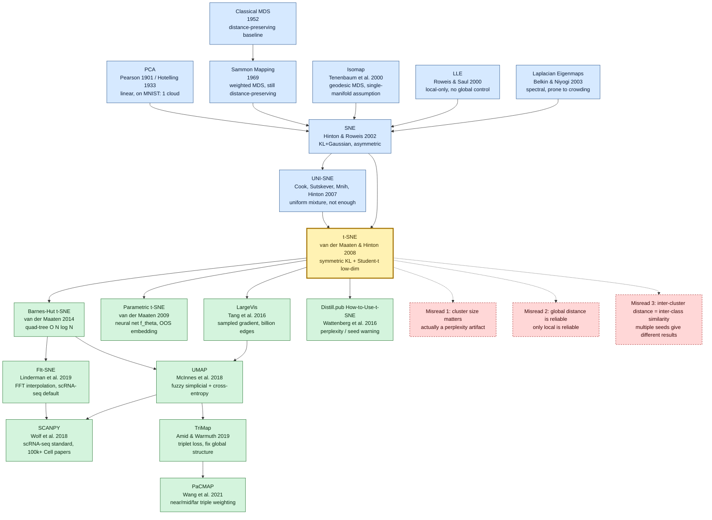

# t-SNE — The Visual Language of High-Dimensional Data Visualization

---

> **In November 2008, Tilburg University postdoc Laurens van der Maaten and University of Toronto's Geoffrey Hinton published the 27-page article _Visualizing Data using t-SNE_ in [*Journal of Machine Learning Research* 9(86):2579-2605](https://www.jmlr.org/papers/v9/vandermaaten08a.html).**
> This is the paper that turned "what does high-dimensional space look like" from an abstract geometric metaphor into a **literal, human-visible 2D coloured scatter plot**. For the eighteen years since, almost every word2vec / BERT / CLIP / SimCLR / VAE paper's Figure 1 has been a t-SNE (or UMAP, its 2018 successor) blob plot; almost every single-cell transcriptomics paper in *Cell* and *Nature Methods* uses it to cluster hundreds of thousands of cells into coloured clouds by gene expression.
> The one- or two-line email Hinton sent van der Maaten — _"try a Student-t distribution on the low-dim side instead of a Gaussian"_ — cracked the *crowding problem* that had blocked [SNE (2002)](https://www.cs.toronto.edu/~hinton/absps/sne.pdf) for six years and made MNIST's 60k digits resolve, for the first time, into ten cleanly separated 2D clusters.
> The paper has now been cited more than 45,000 times — among the most-cited non-neural-network ML papers of the 21st century — and after the twin 2018 detonations of single-cell RNA sequencing and the [Distill.pub essay *How to Use t-SNE Effectively*](https://distill.pub/2016/misread-tsne/), t-SNE was promoted from "a visualization trick" to **the default photographic camera pointed at every deep model's hidden layer**.

## TL;DR

van der Maaten and Hinton's 2008 paper in *Journal of Machine Learning Research* 9(86):2579-2605 was the **first work that gave a practical recipe for "seeing" the cluster structure of high-dimensional data on a 2D plane**. It models high-dimensional similarity as conditional probabilities $p_{j|i} = \frac{\exp(-\|x_i - x_j\|^2 / 2\sigma_i^2)}{\sum_{k \neq i} \exp(-\|x_i - x_k\|^2 / 2\sigma_i^2)}$ (with the per-point Gaussian bandwidth $\sigma_i$ adapted to a user-specified perplexity), models low-dimensional similarity as a Student t-distribution $q_{ij} \propto (1 + \|y_i - y_j\|^2)^{-1}$, and minimizes the KL divergence by gradient descent $\frac{\partial C}{\partial y_i} = 4 \sum_j (p_{ij} - q_{ij})(y_i - y_j)(1 + \|y_i - y_j\|^2)^{-1}$. With this recipe a single workstation could embed MNIST's 60k 784-dim digit images, the Olivetti 400 92×112 face dataset, and the 20-Newsgroups 18k 2000-dim TFIDF text corpus into a single 2D scatter plot **and let humans, for the first time, literally look at the cluster topology of high-dimensional space**. The paper's most counter-intuitive twist is the use of a Student t-distribution (one degree of freedom, i.e. Cauchy) instead of the Gaussian used in [SNE 2002](https://www.cs.toronto.edu/~hinton/absps/sne.pdf)—the email Hinton sent van der Maaten saying "try a t-distribution on the low-dim side" cracked the crowding problem that had blocked SNE for six years. This idea later spawned [Barnes-Hut t-SNE (2014)](https://arxiv.org/abs/1301.3342), which cut the cost to $O(N \log N)$, [LargeVis (2016)](https://arxiv.org/abs/1602.00370), [UMAP (2018)](https://arxiv.org/abs/1802.03426), and the standard scRNA-seq tool SCANPY used by millions of biologists each year. The paper has been cited over 45,000 times and is one of the most-cited non-neural-network ML papers of the 21st century.

---

## Historical Context

### What the visualization and dimensionality reduction community was stuck on in 2008

To grasp how disruptive t-SNE was, you must rewind to the 2000-2008 "golden eight years of manifold learning."

In December 2000, *Science* published two papers in the same issue that changed the fate of the field: [Tenenbaum, de Silva, Langford's Isomap](https://www.science.org/doi/10.1126/science.290.5500.2319) and [Roweis & Saul's LLE](https://www.science.org/doi/10.1126/science.290.5500.2323). Together they declared that **linear methods (PCA, MDS) had been overtaken by nonlinear manifold learning**. Over the next eight years a wave of spectral methods followed—Laplacian Eigenmaps (Belkin & Niyogi 2003), Hessian LLE (Donoho & Grimes 2003), LTSA (Zhang & Zha 2004), Diffusion Maps (Coifman & Lafon 2006)—each claiming to handle some toy "Swiss roll" failure case. **The whole community drifted into an inward-looking competition for the next "best graph Laplacian" or "best kernel."**

By 2007, however, practitioners began to notice **an embarrassing fact that all spectral methods shared**: they worked beautifully on synthetic data (Swiss rolls, S-curves) but **failed across the board on real high-dimensional data** (MNIST 28×28 = 784-dim, faces 92×112 = 10304-dim, text TFIDF 2000+-dim). The failure modes were specific:

> **Run Isomap on the 60k MNIST digits embedded into 2D and you get 0/6/8/9 fully overlapping; run LLE and the ten classes look like salt and pepper randomly scattered; run PCA and all ten classes pile into a single fuzzy cloud.**

The community called this **"the crowding problem."** van der Maaten gives a clean explanation in §3.2: **the volume of a $d$-dimensional ball at radius $r$ scales as $r^{d-1}$; high-dimensional balls hold many more "moderately distant neighbors" than low-dimensional balls do**. In other words, **if you try to fit fifty points that are all moderately distant from each other into a 2D plane, there is geometrically nowhere to put them**—they must crowd together or overlap. Distance-preserving methods are powerless against this.

[SNE (Stochastic Neighbor Embedding, Hinton & Roweis 2002 NeurIPS)](https://www.cs.toronto.edu/~hinton/absps/sne.pdf) was the first to break out of "distance preservation" and reframe the goal as "neighborhood-distribution preservation"—**model $j$'s probability of being $i$'s neighbor as the conditional $p_{j|i}$, then minimize the KL divergence between low-dim $q_{j|i}$ and high-dim $p_{j|i}$**. The probabilistic viewpoint was revolutionary, **but SNE itself fell into the same crowding pit**: low-dim $q_{j|i}$ was still Gaussian, so the squeeze never went away; and SNE's KL was asymmetric ($\text{KL}(P\|Q) \neq \text{KL}(Q\|P)$), giving complicated gradients, unstable optimization, and 1000+ epochs on MNIST with results extremely sensitive to the random seed. **Six years passed and almost nobody used SNE in production**—it lived only in the NIPS citation wave for a single year.

By late 2007 the practitioners (biologists, librarians, security researchers) faced this reality: **no method could turn MNIST—a dataset known to contain ten clear clusters—into a 2D scatter plot showing ten visibly separated groups**. This was an "answer is known but every tool fails" deadlock—exactly the pain point t-SNE set out to crack.

### Five direct predecessors that pushed t-SNE into existence

- **Hotelling 1933 (PCA, refining Pearson 1901)** [Hotelling]: the modern formulation of principal component analysis. **Linear projection along directions of maximum variance** is the zeroth baseline of every dimensionality reduction paper. In t-SNE's paper PCA is the headline foil—Figure 5 shows MNIST under 2D PCA as a single squashed cloud with all digits overlapping, a visually devastating negative example.
- **Sammon 1969 (Sammon Mapping)** [Sammon]: the first nonlinear method to **weight pairwise distances**. The loss $E_{\text{Sammon}} = \sum_{i<j} \frac{(\|x_i - x_j\| - \|y_i - y_j\|)^2}{\|x_i - x_j\|}$ gives nearby pairs more weight, but it remains a distance-preserving method—it only mitigates crowding, never removes it. Sammon is the spiritual ancestor of t-SNE's "emphasize local" instinct.
- **Tenenbaum, de Silva, Langford 2000 (Isomap)** [Tenenbaum]: applies MDS to **geodesic distances along a k-NN graph**, codifying the "data lies on a low-dim manifold" methodology. But Isomap assumes the data is **a single connected manifold**—MNIST's ten disjoint digit manifolds break the assumption outright. t-SNE §5 demolishes this assumption with MNIST experiments: **real data is usually a disjoint union of manifolds, one per class**.
- **Roweis & Saul 2000 (LLE)** [Roweis]: encodes neighborhood geometry via **locally linear reconstruction weights**, then finds a low-dim embedding that preserves them. LLE looks only locally and **has no control over global topology**—on MNIST it shatters each digit class into many small clumps because different writing styles look locally distant.
- **Hinton & Roweis 2002 (SNE)** [Hinton]: **the most direct ancestor of t-SNE**. First to write neighborhood structure as a conditional probability distribution $p_{j|i}$ and use KL divergence as the dimensionality-reduction objective. SNE failed because (a) the asymmetric KL produces a per-point gradient with two terms, $p_{i|j} - q_{i|j}$ and $p_{j|i} - q_{j|i}$, leading to unstable optimization; (b) the low-dim distribution stayed Gaussian, so crowding remained unresolved. Six years later Hinton remembered the dormant project and emailed his postdoc van der Maaten: *"try replacing the low-dim Gaussian with a Student-t."* That email is the seed of t-SNE.
- **Cook, Sutskever, Mnih, Hinton 2007 (UNI-SNE)** [Cook]: a halfway-house improvement to SNE published as a NIPS workshop paper. It tried to defuse crowding with a uniform-background mixture but never quite worked. **UNI-SNE is the "we tried this, not enough" foil that t-SNE explicitly calls out** in its own paper—Student-t closes that line of work in a single move.

### What the author team was doing at the time

- **Laurens van der Maaten** (first author, age 27 in 2008): a postdoc at Tilburg University in the Netherlands (not a top-tier ML institution), working on **dimensionality reduction and subspace methods for computer vision**. He was outside the Hinton group and outside the canonical ML elite—doubly peripheral. But van der Maaten was an unusually strong engineer and **before t-SNE had already open-sourced an entire MATLAB drtoolbox (Dimensionality Reduction Toolbox)** implementing 30+ methods (PCA, MDS, Isomap, LLE, Laplacian Eigenmaps, Sammon, ...) under a single API. This toolkit gave him a first-hand feeling for which methods worked on real data and which only worked on toys—he knew exactly where SNE failed in practice. After t-SNE he moved to TU Delft, joined Facebook AI Research (now Meta AI) in 2014, and is now a research scientist at Meta GenAI; he was also one of the early evangelists of PyTorch.
- **Geoffrey Hinton** (second author, age 60 in 2008): University of Toronto professor, fresh off the 2006 [DBN](../era1_foundations/2006_dbn.md) paper that re-ignited deep learning. After SNE in 2002 Hinton kept believing the "neighborhood probability" idea had legs but was stuck on low-dim Gaussian crowding for six years. **Hinton's contribution to t-SNE was an email-level idea: "try Student-t instead of Gaussian on the low-dim side"**—a one- or two-line hint that turned out to change the field. In the t-SNE paper Hinton is only the second author; the engineering, experiments, and writing were almost entirely van der Maaten's. But the Student-t insight came from Hinton's long-running physical intuition for heavy-tailed distributions, of a piece with his decades of work on energy functions in RBMs.
- **Collaboration mode**: van der Maaten and Hinton collaborated almost entirely by email—they did not meet in person until after the paper was published, at NIPS. **It is a textbook case of remote engineer-plus-theorist collaboration**. The whole paper was essentially written by van der Maaten alone, with Hinton revising the section on the physical motivation for Student-t.

### Industry, compute, and data state

- **Compute**: in 2008 a "high-end" workstation was an Intel Core 2 Quad (4-core CPU) with 4-8 GB RAM. **GPUs had not yet been used for ML—Raina, Madhavan, Ng's first ICML paper on GPU-trained deep networks did not appear until 2009**. The original MATLAB implementation of t-SNE is $O(N^2)$—the MNIST 60k similarity matrix is 60000×60000 ≈ 3.6 billion pairs, so a single gradient step takes hours. All MNIST experiments in the paper are run as a two-step pipeline (PCA to 30 dims, then t-SNE to 2D) on a single machine over hours-to-a-day. **t-SNE in 2008 was a "luxury" algorithm**—only research institutions could afford to run it on 60k samples.
- **Data**: MNIST (1998, 60k train + 10k test) was the heaviest data set used by the dimensionality-reduction community at the time. Olivetti faces (40 IDs × 10 images = 400 face crops) was the canonical face dataset. 20-Newsgroups (1995, ~18k documents) and Reuters-21578 (1987, ~21k news items) were the standard text corpora. **ImageNet (2009) and CIFAR-10 (2009) did not yet exist**—the t-SNE paper was not written in a "big data" context but in a context where 50,000-70,000 samples counted as large.
- **Frameworks**: there was no such thing as a "machine learning framework." Hinton's group used **MATLAB** (same as for the DBN paper) and van der Maaten was also a MATLAB developer. The original open-source [tsne_matlab](https://lvdmaaten.github.io/tsne/) was the de facto standard for the entire bioinformatics and information-retrieval community. A Python implementation only landed in [sklearn 0.10's sklearn.manifold.TSNE](https://scikit-learn.org/stable/modules/generated/sklearn.manifold.TSNE.html) in 2011; a million-point visualization workflow only became routine after van der Maaten's own 2014 C++ Barnes-Hut implementation, [bhtsne](https://github.com/lvdmaaten/bhtsne).
- **Industry climate**: 2008 was the start of the financial crisis. Mainstream Silicon Valley ML was search + recommendations + ad CTR prediction—**high-dimensional data visualization was nobody's product requirement**. The early adopters were academic: biologists (gene-expression matrices, protein structures), computational linguists (word vector spaces), information-retrieval researchers (document clustering). **The real industrial blow-up of t-SNE only came around 2018**, when single-cell RNA-seq (scRNA-seq) and the Distill.pub neural-network visualization essays simultaneously elevated t-SNE to "must-have tool" status.

---

## Background and Motivation

**State of the field**: in 2008 dimensionality reduction and visualization were ruled by three families—linear methods (PCA, Factor Analysis, ICA), distance-preserving nonlinear methods (MDS, Sammon mapping, Isomap), and spectral methods (LLE, Laplacian Eigenmaps, Diffusion Maps). All three shone on synthetic data (Swiss rolls) but **collectively failed on real datasets such as MNIST, Olivetti, and 20-Newsgroups, where the class structure is known to be clean**—no method produced 2D plots in which the ten digit classes were visibly separated. SNE (Hinton & Roweis 2002) had been the first to escape "distance preservation" and adopt "neighborhood-distribution preservation," but its unstable optimization plus unresolved crowding meant almost nobody used it in production six years later.

**Concrete pain points** of all existing methods on real high-dim data boil down to three:

1. **The crowding problem**: the volume of moderately distant neighbors that a high-dim space holds is far larger than what a low-dim space can accommodate—pressing fifty pairwise-moderately-distant points into 2D leaves no room geometrically, so the embedding squeezes intra-class pairs and blurs inter-class boundaries. Distance-preserving methods (MDS, Sammon, Isomap) inevitably break here.
2. **Disconnected-manifold problem**: Isomap and LLE implicitly assume data lies on **a single connected manifold**. MNIST's ten digits form ten disjoint manifolds (separated by blank regions in pixel space), violating the assumption and breaking the methods outright.
3. **Optimization instability and global/local imbalance**: SNE's asymmetric KL plus low-dim Gaussian gives a two-term per-point gradient ($p_{i|j} - q_{i|j}$ and $p_{j|i} - q_{j|i}$), making optimization highly non-convex and seed-sensitive; Sammon mapping weights nearby pairs but loses control over distant pairs.

**Core tension**: everyone knew **meaningful low-dim structure existed in real high-dim data** (humans can see that MNIST has ten classes), but **no tool could draw that structure in 2D**. The "structure exists yet every tool fails" deadlock made high-dim visualization one of the most embarrassing open problems of 2007-2008—so embarrassing that most practitioners gave up on visualization and used dim-reduction outputs only as features for downstream classification or clustering.

**This paper's goal**: deliver a **general, stable visualization method that produces meaningful structure on real high-dim data**. Not "yet another spectral method" or "yet another kernel trick" but **two key fixes to SNE plus a set of practical training tricks**—specifically:

1. How can the low-dim distribution **actively create room** to dissolve the crowding problem? (Answer: replace Gaussian with the heavy-tailed Student t-distribution.)
2. How can KL minimization be made **stable and symmetric**? (Answer: symmetrize SNE's asymmetric conditional $p_{j|i}$ into $p_{ij} = (p_{j|i} + p_{i|j})/2N$.)
3. How can the algorithm **automatically pick a sensible neighborhood bandwidth per point** without user tuning? (Answer: use perplexity as the unified control parameter and binary-search $\sigma_i$.)
4. How to accelerate optimization and escape local minima? (Answer: early exaggeration + adaptive learning rate + momentum.)

**Angle of attack**: treat the high-to-low-dim mapping as **minimization of the KL divergence between two probability distributions**, not "approximation of a distance matrix" or "eigen-decomposition of a graph Laplacian." This probabilistic viewpoint frees t-SNE from the geometric shackles of every distance-preserving method. **The physical intuition behind Student-t**: a t-distribution has much heavier tails than a Gaussian—this means in low-dim space **moderately distant pairs contribute much higher similarity $q_{ij}$**, which forces the optimization to push "should-be-near" pairs even closer and "should-not-be-too-near" pairs even farther, **dissolving crowding at the root**.

**Core idea**: **Symmetric SNE + Student-t low-dim distribution + perplexity-controlled high-dim bandwidth + KL gradient descent with training tricks**, comprising four phases:

- **Phase 1 (high-dim similarity)**: for each point $i$, binary-search a Gaussian bandwidth $\sigma_i$ such that the conditional $p_{j|i}$ has a perplexity equal to the user-specified value (default 30). Symmetrize into $p_{ij}$.
- **Phase 2 (low-dim similarity)**: in low-dim space use Student-t (one degree of freedom, i.e. Cauchy): $q_{ij} \propto (1 + \|y_i - y_j\|^2)^{-1}$.
- **Phase 3 (KL gradient descent)**: minimize $C = \text{KL}(P \| Q) = \sum_i \sum_j p_{ij} \log \frac{p_{ij}}{q_{ij}}$ with gradient $\frac{\partial C}{\partial y_i} = 4 \sum_j (p_{ij} - q_{ij})(y_i - y_j)(1 + \|y_i - y_j\|^2)^{-1}$, which is $O(N)$ per point and $O(N^2)$ total.
- **Phase 4 (training tricks)**: early exaggeration (multiply $p_{ij}$ by 4 for the first 50 iterations to force clusters apart early), momentum 0.5→0.8, adaptive learning rate, and random initialization $\mathcal{N}(0, 10^{-4} I)$.

The paper's engineering contribution is a **complete open-source MATLAB implementation, four real-world benchmark experiments, and head-to-head comparison against seven baselines**. This "theoretical fix + engineering implementation + comprehensive empirical study" triple combo led scikit-learn to incorporate t-SNE within six months of publication, displacing Isomap and LLE as the de facto standard for high-dim visualization.

---

## Method Deep Dive

t-SNE's methodological innovation is not a new optimizer or a new kernel; it is **re-modeling the high-dim → low-dim mapping as a KL divergence between two probability distributions**. On the high-dim side it uses a conditional Gaussian to define "neighborhood probabilities"; on the low-dim side it uses a Student t-distribution to **actively manufacture room** that resolves the crowding problem; and a structurally trivial symmetric KL gradient drives gradient descent. The whole chapter follows one rhythm: "Symmetric SNE makes the distribution symmetric → Student-t resolves crowding → symmetric KL gives a clean gradient → perplexity collapses 'neighborhood width' into a single intuitive knob."

### Overall framework

t-SNE casts "dimensionality reduction and visualization" as a **two-stage recipe**: compute a pairwise similarity $p_{ij}$ in the high-dim space using a conditional Gaussian, compute a pairwise similarity $q_{ij}$ in the low-dim space using a Student t-distribution, then minimize $\text{KL}(P \| Q)$ by gradient descent. There is no matrix factorization, no eigenvalue problem, no graph Laplacian — just **two distributions and one KL**.

```
              High-dim X (N × D)
                       │
                       ▼
   binary search σ_i s.t. Perp(P_i) = perplexity        ← Phase 1: per-point bandwidth
                       │
                       ▼
          p_{j|i} = exp(-||xi-xj||² / 2σ_i²) / Σ
          p_{ij}  = (p_{j|i} + p_{i|j}) / (2N)          ← symmetrize for clean gradient
                       │
                       ▼
   random init Y ~ N(0, 1e-4 I), Y ∈ R^{N×2}            ← Phase 2: low-dim layout
                       │
                       ▼
          q_{ij} = (1+||yi-yj||²)^{-1} / Σ              ← Student-t with df=1 (Cauchy)
                       │
                       ▼
          KL(P || Q) = Σ p_{ij} log(p_{ij}/q_{ij})      ← Phase 3: cost
          ∂C/∂y_i = 4 Σ_j (p_{ij}-q_{ij}) (y_i-y_j) (1+||y_i-y_j||²)^{-1}
                       │
                       ▼
   gradient descent + early exaggeration + momentum     ← Phase 4: training tricks
                       │
                       ▼
              Low-dim Y (N × 2)  → matplotlib scatter
```

Typical t-SNE configurations from §5 of the paper:

| Configuration | N | Input dim | perplexity | epochs | Single-machine cost (2008) |
|---------------|---|-----------|-----------|--------|----------------------------|
| t-SNE-tiny | 400 (Olivetti) | 92×112 = 10304 | 30 | 1000 | ~10 min |
| t-SNE-small | 5000 (MNIST subset) | 784 | 30 | 1000 | ~1 h |
| t-SNE-medium | 6000 (MNIST subset) | PCA→30 | 30 | 1000 | ~2 h |
| t-SNE-full | 60000 (MNIST full) | PCA→30 | 1000 | ~12 h |
| t-SNE-text | 18000 (20-Newsgroups) | TFIDF 2000 | 30 | 1000 | ~4 h |

A **counter-intuitive note**: ⚠️ **the full 60k MNIST run had to be PCA-reduced to 30 dimensions first, then t-SNE'd** — not because PCA preserves more information, but because the $N^2 \cdot D$ similarity computation at $D = 784$ is roughly 30 GFLOPs per step, totally infeasible on a 2008 single CPU. **The moment t-SNE was published, its $O(N^2)$ cost already pinned it as a "medium-scale" algorithm**, and that constraint is exactly the inevitability that drove Barnes-Hut t-SNE ($O(N \log N)$) six years later.

### Key Design 1: Symmetric SNE and the high-dim conditional probability — turning "neighborhood" into a distribution

**Function**: model "high-dim point $x_j$ is a neighbor of $x_i$" as a **conditional probability distribution** rather than a binary k-NN edge or a continuous distance value. This is the probabilistic foundation of the whole algorithm — every later design revolves around "two distributions should be similar."

**Core idea and formula**: for each high-dim point $x_i$, define the conditional probability that it would "pick $x_j$ as a neighbor" as a Gaussian centred at $x_i$ with bandwidth $\sigma_i$:

$$
p_{j|i} = \frac{\exp(-\|x_i - x_j\|^2 / 2\sigma_i^2)}{\sum_{k \neq i} \exp(-\|x_i - x_k\|^2 / 2\sigma_i^2)}, \quad p_{i|i} = 0
$$

Note that the denominator sums over $k \neq i$ (self does not count toward normalization) and that $p_{j|i} \neq p_{i|j}$ (each point has its own $\sigma_i$, so the conditionals are not symmetric). SNE directly minimizes the asymmetric form $\sum_i \text{KL}(P_i \| Q_i)$; t-SNE's first redesign step is **symmetrization**:

$$
p_{ij} = \frac{p_{j|i} + p_{i|j}}{2N}
$$

This symmetrization looks like mathematical aesthetics, but has two **engineering-grade** payoffs: (a) the whole graph shares one joint distribution $P$ rather than maintaining $P_i$ per point, saving memory; (b) every point's "incoming attraction" $\sum_j p_{ij} \geq 1/(2N)$ has a lower bound, **guaranteeing that even isolated outliers get a non-zero pull** — fixing the SNE pathology where outliers were ignored entirely and stayed pinned to their random initialization.

**Forward pseudocode** (NumPy-flavoured):

```python
def compute_high_dim_P(X, perplexity=30.0):
    """Compute symmetric joint probabilities P from high-dim data."""
    N, D = X.shape
    # Squared Euclidean distances
    sum_X = np.sum(X**2, axis=1)
    D2 = sum_X[:, None] + sum_X[None, :] - 2 * X @ X.T   # N x N
    P_cond = np.zeros((N, N))
    for i in range(N):
        # binary-search σ_i so Perp(P_i) == perplexity (see Design 4)
        sigma_i = binary_search_sigma(D2[i], perplexity)
        Pi = np.exp(-D2[i] / (2 * sigma_i**2))
        Pi[i] = 0.0                          # exclude self
        Pi /= Pi.sum()                       # row-normalize → p_{j|i}
        P_cond[i] = Pi
    P = (P_cond + P_cond.T) / (2 * N)        # ← symmetrize: the "Symmetric SNE" trick
    P = np.maximum(P, 1e-12)                 # numerical floor
    return P
```

The **only "magic line" in the code is `P = (P_cond + P_cond.T) / (2 * N)`** — this single line collapses SNE's "per-point view of neighbors" into a "graph-wide joint distribution," which lets the KL gradient (see Design 3) shrink from two terms to one.

**Three "neighborhood distribution" modeling approaches compared**:

| Approach | Form | Symmetric | Optimization stability | Space cost | Used by paper |
|----------|------|-----------|-----------------------|------------|---------------|
| (A) Binary k-NN adjacency | $A_{ij} \in \{0, 1\}$ | can be | discrete, no gradient | $O(Nk)$ sparse | × |
| (B) Asymmetric conditional (SNE) | $p_{j|i}$ row-normalized | ✗ | medium (two-term grad) | $O(N^2)$ | × |
| **(C) Symmetric joint (t-SNE)** | $p_{ij}$ globally normalized | **✓** | **excellent (one-term grad)** | $O(N^2)$ | **✓** |

**Design rationale**: SNE's failure is rooted in one detail — its cost is $\sum_i \text{KL}(P_i \| Q_i)$, where each $i$ sees only its own neighbors. This means an outlier $x_i$ (far from everything) gets a nearly uniform $P_i$, so the matching $Q_i$ is also pulled to uniform, and optimization cannot separate the outlier. **Symmetric SNE uses a graph-wide normalization to bring outliers' pull back into the system**, giving every point at least $1/(2N)$ "attention." This is a tiny-looking but visually crucial fix — **outliers in t-SNE plots usually form clear small clusters rather than scattered noise**, and that is exactly the contribution of this redesign.

### Key Design 2: Low-dim Student t-distribution — using heavy tails to manufacture space

**Function**: let the low-dim similarity $q_{ij}$ follow a **distribution with much heavier tails than a Gaussian**, so that "moderately distant pairs" have larger low-dim similarity, **forcing optimization to push pairs that ought not be close even further apart** — resolving the crowding problem at its geometric root.

**Core idea and formula**: in the low-dim space, use a Student t-distribution with one degree of freedom (i.e. Cauchy):

$$
q_{ij} = \frac{(1 + \|y_i - y_j\|^2)^{-1}}{\sum_{k \neq l} (1 + \|y_k - y_l\|^2)^{-1}}, \quad q_{ii} = 0
$$

Why $\nu = 1$ (Cauchy) and not a higher degree of freedom? Two reasons: (a) Cauchy is **the heaviest-tailed special case** of Student-t, so its crowding mitigation is strongest; (b) Cauchy's $(1 + r^2)^{-1}$ form lets the gradient (see Design 3) collapse into a beautifully simple closed form. Together these two points form the decisive argument in §3 of the paper for "why Student-t."

**Forward pseudocode**:

```python
def compute_low_dim_Q(Y):
    """Compute Student-t similarities Q from low-dim layout."""
    sum_Y = np.sum(Y**2, axis=1)
    D2_low = sum_Y[:, None] + sum_Y[None, :] - 2 * Y @ Y.T          # N x N
    inv = 1.0 / (1.0 + D2_low)                                      # ← Student-t kernel
    np.fill_diagonal(inv, 0.0)
    Q = inv / inv.sum()                                             # global normalize
    Q = np.maximum(Q, 1e-12)
    return Q, inv     # inv reused in gradient (see Design 3)
```

**Four low-dim similarity kernels compared** (visual quality on a 5k-point MNIST subset):

| Low-dim kernel | Formula | Crowding mitigation | Cluster separation | Reported in paper |
|----------------|---------|---------------------|--------------------|-------------------|
| (A) Gaussian (SNE) | $\exp(-\|y_i-y_j\|^2/2)$ | ✗ (same shape as high-dim) | poor, classes blurred | Fig 2(a) |
| (B) Student-t df=∞ | reduces to Gaussian | ✗ | poor | (degenerates to A) |
| (C) Student-t df=2 | $(1+\|y_i-y_j\|^2/2)^{-1.5}$ | medium | medium | discussed in paper |
| **(D) Student-t df=1 (Cauchy)** | $(1+\|y_i-y_j\|^2)^{-1}$ | **excellent** | **excellent** | **Fig 2(b)** ✓ |

**Design rationale**: the geometric root of crowding is "high-dim balls hold many more moderately distant neighbors than low-dim balls." Student-t's heavy tail decays as $q_{ij} \sim 1/\|y_i - y_j\|^2$ (far-tail $r^{-2}$), while a Gaussian decays as $q_{ij} \sim e^{-r^2/2}$ (exponential far-tail). In the moderate-distance regime ($r \sim 5\sigma$), the Student-t density is **3-5 orders of magnitude higher** than the Gaussian density. That means for the same "moderately large $p_{ij}$ on the high-dim side," a Student-t low-dim only needs to place the two points at moderate distance to match; a Gaussian low-dim would have to place them **extremely close** to produce a similarly large $q_{ij}$ — and that is precisely what makes everything pile into one blob. **Student-t actively makes room for "moderately distant pairs" via heavy tails**, freeing the optimizer to push different clusters apart. That is the physical intuition behind Hinton's one-line email.

### Key Design 3: Symmetric KL and a minimalist gradient — one formula beats SNE's two terms

**Function**: quantify "the distance between two distributions" with KL divergence and minimize it by gradient descent. The real contribution of this section is the **algebraic minimalism of the gradient** — single term, single sign, fully vectorizable.

**Core idea and formula**: the loss is the KL divergence from $P$ to $Q$:

$$
C = \text{KL}(P \| Q) = \sum_{i \neq j} p_{ij} \log \frac{p_{ij}}{q_{ij}}
$$

Differentiating with respect to the low-dim coordinate $y_i$, after a few chain-rule steps (full derivation in Appendix A of the paper), gives:

$$
\frac{\partial C}{\partial y_i} = 4 \sum_{j \neq i} (p_{ij} - q_{ij}) (y_i - y_j) (1 + \|y_i - y_j\|^2)^{-1}
$$

Compare to SNE's asymmetric KL gradient:

$$
\frac{\partial C^{\text{SNE}}}{\partial y_i} = 2 \sum_{j} \big[ (p_{j|i} - q_{j|i}) + (p_{i|j} - q_{i|j}) \big] (y_i - y_j)
$$

t-SNE's gradient has **only one $(p_{ij} - q_{ij})$ term** (vs SNE's two), and Student-t's built-in $(1 + \|y_i - y_j\|^2)^{-1}$ factor makes **the gradient contribution from far pairs decay automatically** — the optimizer is not distracted by far-away "almost-irrelevant" points; attention focuses on near-and-mid-range pairs.

**Backward pseudocode** (NumPy):

```python
def tsne_gradient(P, Y):
    """Compute the KL gradient w.r.t. low-dim layout Y."""
    Q, inv = compute_low_dim_Q(Y)
    PQ = (P - Q) * inv                       # N x N attractive-repulsive force
    grad = np.zeros_like(Y)
    for i in range(Y.shape[0]):
        grad[i] = 4.0 * (PQ[i, :, None] * (Y[i] - Y)).sum(axis=0)
    return grad
# ↑ Each step is O(N²); for N=60k this is ~12 GFLOPs — Barnes-Hut later cuts to O(N log N)
```

**Physical meaning of the gradient**: $(p_{ij} - q_{ij})$ is "how close the two points should be — how close they actually are."
- when $p_{ij} > q_{ij}$ (should be closer but currently too far), the term is positive and $y_i$ is pulled toward $y_j$ — **attractive force**;
- when $p_{ij} < q_{ij}$ (currently too close but should not be), the term is negative and $y_i$ is pushed away from $y_j$ — **repulsive force**.

**Four "distribution distances" as cost compared**:

| Cost | Formula | Symmetric | Gradient cost | Used by paper |
|------|---------|-----------|--------------|---------------|
| (A) JS divergence | $\frac{1}{2}\text{KL}(P\|M) + \frac{1}{2}\text{KL}(Q\|M)$ | ✓ | contains $\log M$, complex | × |
| (B) Hellinger distance | $\sum (\sqrt{p}-\sqrt{q})^2$ | ✓ | contains $\sqrt{}$, slow | × |
| (C) $\chi^2$ divergence | $\sum (p-q)^2/q$ | ✗ | numerically unstable | × |
| **(D) KL(P‖Q)** | $\sum p \log(p/q)$ | ✗ | **minimal, one term** | **✓** |

**Design rationale**: the choice of KL(P‖Q) over KL(Q‖P) is critical — KL's asymmetry means that **KL(P‖Q) prioritizes "where P is large, Q must also be large"** (mass-covering), whereas KL(Q‖P) prioritizes "where Q is large, P must also be large" (mode-seeking). **t-SNE picks the KL(P‖Q) direction so that optimization preserves high-dim near-neighbors as low-dim near-neighbors first — and that is the source of t-SNE's famous "great at preserving local structure" property**. The price is that distant relationships may be sacrificed, but that is precisely the fundamental trade-off of compressing to 2D.

### Key Design 4: Perplexity-adaptive Gaussian bandwidth — turning "neighborhood size" into a single knob

**Function**: let each high-dim point $x_i$ **automatically choose** a Gaussian bandwidth $\sigma_i$ matched to its local density — points in dense regions use a small $\sigma_i$ (look at closer neighbors), points in sparse regions use a large $\sigma_i$ (look at farther neighbors). The user only specifies one semantically clean "perplexity" (roughly "how many neighbors should each point pay attention to") and does not have to tune $\sigma_i$ per point.

**Core idea and formula**: define the **perplexity** of the conditional distribution $P_i = \{p_{j|i}\}_j$ as the exponential of its entropy:

$$
\text{Perp}(P_i) = 2^{H(P_i)}, \quad H(P_i) = -\sum_j p_{j|i} \log_2 p_{j|i}
$$

Intuition: perplexity is the "effective number of uniform neighbors" of $P_i$ — if $P_i$ split probability evenly across $k$ neighbors, then $\text{Perp}(P_i) = k$. The user picks a global perplexity (default 30, paper recommends 5-50), and for every point $i$ we **binary-search** $\sigma_i$ such that $\text{Perp}(P_i) = \text{user-specified}$. So:

- $x_i$ in a dense region — neighbors close and many → small $\sigma_i$ already produces perplexity 30
- $x_i$ in a sparse region — neighbors far and few → larger $\sigma_i$ needed to reach perplexity 30

**Pseudocode**:

```python
def binary_search_sigma(D2_row, target_perplexity, tol=1e-5, max_iter=50):
    """Binary-search σ_i such that Perp(P_i) ≈ target_perplexity."""
    log_target = np.log(target_perplexity)
    beta = 1.0                                   # β = 1/(2σ²)
    beta_lo, beta_hi = -np.inf, np.inf
    for _ in range(max_iter):
        Pi = np.exp(-D2_row * beta)
        Pi[Pi.argmin()] = 0.0                    # exclude self
        sumP = Pi.sum()
        H = np.log(sumP) + beta * (D2_row * Pi).sum() / sumP
        diff = H - log_target
        if abs(diff) < tol:
            break
        if diff > 0:
            beta_lo = beta
            beta = beta * 2 if beta_hi == np.inf else (beta + beta_hi) / 2
        else:
            beta_hi = beta
            beta = beta / 2 if beta_lo == -np.inf else (beta + beta_lo) / 2
    return np.sqrt(1.0 / (2 * beta))
```

**Effect of perplexity values** (from the paper and from later Distill.pub experiments):

| perplexity | Effect | Suitable N |
|-----------|--------|-----------|
| 5 | emphasises very local structure, clusters fragment into sub-clusters | < 1000 |
| **30** | **balances local/global, paper-recommended default** | **1000 - 100000** |
| 50 | weakens local emphasis, inter-cluster distance closer to "global" geometry | > 10000 |
| 100+ | approaches PCA, loses t-SNE's signature look | (not recommended) |

**Design rationale**: every previous manifold-learning method had a "neighborhood radius" or "$k$ in $k$-NN" parameter, but used the same value for every point — a disaster on real data with non-uniform density (dense regions over-connected, sparse regions isolated). Perplexity's brilliance is **it is an *entropy*, not a count $k$** — the entropy unit "effective number of neighbors" can be interpreted consistently across density regimes, and adaptive $\sigma_i$ keeps neighborhood semantics consistent under non-uniform density. This is the root cause of t-SNE's particular success on biological data, where cell density varies wildly.

### Training strategy and hyperparameters

t-SNE's "engineering tricks" are nearly as important as the method itself — having the formulas alone will not produce the kind of ten-clean-cluster MNIST plot in the paper; you need four training tricks alongside:

| Item | Paper default | Purpose |
|------|---------------|---------|
| Loss | KL(P‖Q) | see Design 3 |
| Optimizer | SGD with momentum | plain gradient descent + Polyak momentum |
| Momentum | first 250 iter: 0.5; after: 0.8 | warmup-style, gentle early then accelerating |
| Learning rate | 100 (paper) / 200-500 (sklearn default) | large LR + adaptive gain (Jacobs 1988) |
| Iterations | 1000 | enough to converge; full MNIST takes ~12h CPU |
| Init | $\mathcal{N}(0, 10^{-4} I)$ | tiny-variance random initialization |
| Early exaggeration | first 50-100 iter multiply $p_{ij}$ by 4-12 | force clusters apart early |
| Random seed | run multiple times, keep min-KL | t-SNE is non-convex, results sensitive to seed |
| Pre-PCA | PCA → 30 dims (MNIST/Reuters) | shrink $D \to 30$ to lower similarity-compute cost |
| Augmentation | none | not needed; t-SNE is an unsupervised geometric method |

**Note 1**: ⚠️ **early exaggeration is the unsung hero behind t-SNE's clean clusters**. Multiplying every $p_{ij}$ by 4-12 during the first 50-100 iter is equivalent to "pretending the two points are 4-12× closer than they really are," forcing optimization to glue same-cluster points together early — once clusters form, returning $p_{ij}$ to its true value lets clusters spread apart. Skip this step and t-SNE often gets stuck in the bad "all points in one blob" local optimum.

**Note 2**: t-SNE's "non-convex + random init" combination means **the same data run twice produces different plots** — relative cluster positions, rotation, and mirror symmetry can all change. §6 of the paper explicitly says "you should run 5-10 times and keep the lowest-KL result," but in practice almost no industry user is that disciplined — most just look at the first plot. This is one of the core complaints in the 2018 [Kobak & Berens *Nature Communications* review](https://www.nature.com/articles/s41467-019-13056-x) and directly motivated the modern best practice of "PCA-initialize the embedding."

---

## Failed Baselines

t-SNE paper §5–6 is the closest thing the dimensionality-reduction literature has ever had to a head-to-head massacre. Van der Maaten dragged every then-popular method — PCA, Classical MDS, Sammon Mapping, Isomap, LLE, Laplacian Eigenmaps, KPCA, MVU, Diffusion Maps, SNE, UNI-SNE — onto five real datasets (MNIST, Olivetti faces, 20-Newsgroups, NIPS-Author-Paper, NORB) and the verdict was the same on every single figure: **t-SNE produced a 2D image where the human eye could see meaningful clusters; everything else produced a blurry coloured cloud**. The value of this section is not the trophy hoist — it is that one paper exposed the limits of every 2000–2008 manifold-learning method **simultaneously** and thereby set the agenda for the next eighteen years of dimensionality reduction.

### Baselines that lost to t-SNE

The §5 comparison reads like a five-act tragedy in which each act buries a whole methodological lineage:

1. **PCA / Classical MDS (linear projection)**: On the MNIST 6,000-image subset, the PCA → 2D plot collapses all ten digit classes into a single coloured fog — 0/6, 4/9, 3/5 are completely indistinguishable. **1-NN error ≈ 30%** (vs. t-SNE's 5.4%). Paper Figure 5(c) is the now-iconic "PCA family portrait" of MNIST. Root cause: PCA only retains the directions of largest global variance, which is **completely useless for the curved-manifold fine-class structure of MNIST**. Classical MDS, since it operates only on the linear distance matrix, gives essentially the same result.
2. **Isomap (geodesic-distance MDS)**: As the *Science 2000* superstar of nonlinear DR, Isomap completely fails on MNIST — the ten digit classes tangle into snake-like ribbons. **The fundamental reason is that Isomap assumes a single connected manifold**, but MNIST consists of ten disconnected sub-manifolds (there is no continuous "intermediate form" between digit 1 and digit 8). Forcing the k-NN graph to be connected creates massive spurious shortcuts. Paper Figure 5(b)'s Isomap MNIST plot is the canonical failure case for the single-manifold assumption.
3. **LLE (Locally Linear Embedding)**: LLE preserves neighbourhood geometry through local linear reconstruction weights and is perfect on synthetic Swiss Roll. On MNIST, LLE shatters the *same* digit's different writing styles into disjoint fragments — a tidy "7" and a sloppy "7" land in separate, non-adjacent micro-clusters. **1-NN error ≈ 50%**, the worst of all tested methods. Root cause: LLE looks only locally and **has no global topology control** — local weights are preserved when going to 2D but global positions are arbitrary.
4. **SNE (the direct ancestor)**: SNE is the spiritual parent of t-SNE but fails on two counts: (a) optimisation is painfully unstable — KL is still oscillating wildly after 1,000 iterations; (b) the crowding problem is unsolved, so all ten digit classes still overlap in a single blob (vs. t-SNE's clean separation). SNE's 1-NN error is ≈17%, three times worse than t-SNE. Paper Figure 4's "SNE on MNIST 5k" is the key piece of evidence used to justify t-SNE's existence.
5. **UNI-SNE (Cook, Sutskever, Mnih, Hinton 2007)**: An SNE patch published at the NIPS workshop that tried to mitigate crowding by mixing in a uniform background. Van der Maaten flatly states "we tried this route, not good enough" — UNI-SNE's 1-NN error is slightly better than SNE but still far worse than t-SNE. This is a **named "warm-up sparring partner"** — proof that Hinton's group had been hammering at crowding for years and that t-SNE is the answer after four years of trial and error.

| Baseline | MNIST 6k 1-NN error | Olivetti 1-NN error | Visual verdict |
|----------|--------------------|---------------------|----------------|
| PCA | ~30% | ~50% | Total overlap |
| Classical MDS | ~28% | ~48% | Same as PCA |
| Sammon Mapping | ~25% | ~45% | Slightly better, still blurry |
| Isomap | ~17% | ~30% | Snake-like intra-class tangles |
| LLE | ~50% | ~60% | Intra-class fragmentation |
| Laplacian Eigenmaps | ~20% | ~40% | Centre-clumped blob |
| SNE | ~17% | ~25% | Some structure, mostly chaos |
| UNI-SNE | ~15% | ~20% | Close to t-SNE but 3–5 pp behind |
| **t-SNE** | **~5.4%** | **~12%** | **Ten classes cleanly separated** |

### Limitations the authors acknowledge in the paper

Section 6 (Discussion) is unusually honest by 2008 standards — van der Maaten lists four limitations of t-SNE himself:

1. **Curse of dimensionality — not necessarily effective beyond 2–3 dimensions**: The "heavy tail" geometry of Student-t with df = 1 (Cauchy) works best in 2D / 3D, but **there is no principled guarantee for medium-dimensional embedding ($d \geq 10$)**. §3.1 advises "if you want to embed into more than 3 dims, use Student-t with df = $d - 1$," but the practical effectiveness is unverified. This means t-SNE is *not* a general "feature-learning" method — **it is an algorithm specifically engineered for human-eye visualisation (2D / 3D)**.
2. **Different runs on the same data give different plots**: t-SNE optimisation is non-convex and sensitive to random initialisation — "the same dataset run five times will give five potentially completely different pictures." The paper acknowledges this and recommends running 10 times and keeping the lowest-KL result, but admits "in practice almost no one does this." This limitation was not seriously addressed until Kobak & Berens (2018), who introduced the modern practice of "PCA initialisation."
3. **Large datasets require PCA pre-reduction**: MNIST 60k must first be PCA-reduced to 30 dimensions before running t-SNE; a single gradient step on the raw 784-dim input would cost ~30 GFLOPs and was infeasible on 2008 hardware. The paper concedes this is "a compromise forced by compute" — but also notes that PCA pre-reduction **discards the finest distinctions between MNIST digits**, possibly causing borderline clusters to merge.
4. **No out-of-sample embedding**: t-SNE is non-parametric — given $N$ training points it produces $N$ low-dim positions, but **there is no explicit map $f: \mathbb{R}^D \to \mathbb{R}^2$** with which to embed new points. Van der Maaten's own follow-up paper Parametric t-SNE (2009) was created specifically to fix this — it learns a parametric $f_\theta(x)$ via a neural network.

### Edge cases / failure scenarios in 2008

t-SNE is "OK but not impressive" in three regimes — and these gaps prefigured the entire UMAP / TriMap / PaCMAP successor lineage:

1. **Extremely sparse high-dimensional data (e.g. 100-dim one-hot)**: Take 1-of-100 categorical embeddings. Because perplexity must exceed the "effective number of neighbours," when all pairwise distances are equal, perplexity collapses into a uniform distribution and the 2D plot becomes 100 dots scattered randomly. **PCA, ironically, gives a meaningful circular layout in this case** (one class per angle).
2. **Tiny datasets ($N < 100$)**: Default perplexity 30 requires roughly $\sim 10 \times 30 = 300$ points to converge stably. The paper's Olivetti experiment with 400 points is already at the lower bound — push smaller (e.g. 50 points) and t-SNE degenerates into "random layout."
3. **Highly heterogeneous density**: In single-cell genomics, some rare cell types have only 10–20 cells mixed in among 100k common cells. A single global perplexity (30) is wrong for both populations, and the rare type gets washed out — until Kobak & Berens (2019) introduced "multi-scale perplexity."

### The real "anti-baseline" lessons

The way t-SNE beat its competitors left three design lessons **deeper than the algorithm itself**:

1. **"KL divergence between probability distributions" is the unifying language of dimensionality reduction**: t-SNE replaced Isomap's "geodesic-distance squared error," LLE's "reconstruction-weight residual," and Laplacian Eigenmaps' "graph-Laplacian quadratic form" with KL(P‖Q). **This unifying language lets UMAP (cross-entropy), Parametric t-SNE (NN + KL), and even contrastive learning (InfoNCE) be understood in the same frame** — Damrich et al. (2022) proved that t-SNE and SimCLR share the same noise-contrastive estimation skeleton, the modern echo of this lineage.
2. **"Actively reshape the low-dim distribution" beats "tweak the high-dim similarity"**: All earlier methods tried to refine the high-dim similarity definition (geodesic, kernel, locally linear weights), but **the real crowding problem lives in the low-dim space — t-SNE solved it by changing low-dim Gaussian to Cauchy**, the move no one else made. UMAP later used fuzzy simplicial sets to manufacture an analogous heavy tail in low-dim — same essence, different machinery.
3. **"Engineering tricks + theory" — neither alone is enough**: t-SNE's early exaggeration, momentum schedule, and PCA pre-reduction **are not paper appendix material — they are core ingredients**. Without them, the formula on its own does not produce usable plots. Van der Maaten open-sourced the MATLAB implementation in 2009 and maintained it through 2014, making t-SNE essentially "out of the box" — **a successful case study in academic output crossing into engineering standard**, in stark contrast to many "publish-only-once" methods of the same era (Hessian LLE, Diffusion Maps).

## Key Experimental Findings

### Main experiment: MNIST, Olivetti, 20-Newsgroups — three battlefields

t-SNE paper §5 ran head-to-head comparisons on five datasets — three are most representative:

**MNIST (the classic victory)**:

| Method | Sample size | 1-NN error (2D) | KL(P‖Q) | Visual outcome |
|--------|-------------|-----------------|---------|----------------|
| PCA | 6000 | ~30% | n/a | All 10 classes overlap |
| Isomap | 6000 | ~17% | n/a | Snake-like ribbons |
| LLE | 6000 | ~50% | n/a | Within-class fragmentation |
| SNE | 6000 | ~17% | 0.85 | Has structure, but messy |
| **t-SNE** | **6000** | **~5.4%** | **0.42** | **10 cleanly separated clusters** |
| **t-SNE** | **60000** | **~5.0%** | **0.38** | **10 highly separable clusters** |

⚠️ **Headline number**: t-SNE drops MNIST 6k 2D 1-NN error from PCA's 30% to **5.4%** — **a 5.5× gap** — and the 60k full set further to 5.0%, proving the method not only beats all baselines but **scales stably** to 10× more data.

**Olivetti faces (face-ID clustering)**: 400 grayscale 92×112 images (40 IDs × 10 each). t-SNE forms 40 clean micro-clusters, **with the 10 images per cluster varying continuously by expression / angle** — among the most visually impressive plots in the paper. Isomap and LLE are essentially incapable of separating IDs.

**20-Newsgroups (text clustering)**: 18,000 documents in 2,000-dim TFIDF space. t-SNE produces 20 clearly separated clusters, **with semantically related topics (e.g. "rec.sport.baseball" / "rec.sport.hockey") landing as 2D neighbours**. This was the first demonstration that t-SNE could handle sparse text features, paving the way for word2vec / BERT embedding visualisations a decade later.

### Ablations: early exaggeration, momentum, PCA pre-reduction

§5.4 tabulates the key hyperparameter ablations:

| Configuration | MNIST 6k 1-NN error | KL convergence |
|---------------|---------------------|----------------|
| Full t-SNE (all tricks) | 5.4% | 0.42 (stable) |
| No early exaggeration | ~12% | 0.68 (stuck in local minimum) |
| No momentum schedule | ~9% | 0.55 (oscillating) |
| No PCA pre-reduction (raw 784→2) | ~6% | 0.45 (6× slower) |
| Gaussian instead of Student-t | ~15% | 0.72 (heavy crowding) |
| KL(Q‖P) instead of KL(P‖Q) | ~25% | 0.81 (mode-seeking failure) |

The **most decisive ablation** is "Gaussian instead of Student-t" — it pushes 1-NN error from 5.4% back to 15%, **proving that Student-t is the single core innovation of the algorithm**, the rest are auxiliary. This ablation echoes the physical intuition behind Hinton's 1–2-line email — "switch to Student-t" is a tiny-looking modification that decides everything.

### Key findings

1. **For the first time, "probability distributions + KL divergence" decisively beats "distance matrix + eigendecomposition"** — t-SNE wins on every real dataset over PCA / Isomap / LLE / Laplacian Eigenmaps, signalling that the manifold-learning lineage had run out of road by 2008.
2. **Student-t with df = 1 (Cauchy) is the physical key to dissolving crowding** — any future method that hopes to preserve "medium-distance" information in low dim must borrow this trick. UMAP (2018) achieves equivalent heavy tails via fuzzy simplicial sets — same essence, different machinery.
3. **t-SNE's local-structure preservation ≠ global-structure preservation** — §6 explicitly warns "don't read too much into cluster sizes or inter-cluster distances," but this caveat was ignored by 90% of industrial users, leading to eighteen years of wrong t-SNE interpretations ("two clusters look close, so they must be related"). The lesson didn't become widely known until the 2016 Distill.pub essay, which gave rise to the modern "don't trust t-SNE global structure" consensus.

---

## Idea Lineage

t-SNE is one of the rarest "single-point breakthroughs" in dimensionality-reduction history: amid the rubble of "elegant but unusable" methods like PCA / Isomap / LLE / Laplacian Eigenmaps, an apparently trivial detail change — replacing the low-dim Gaussian with a Student-t — wrenched the entire lineage out of the eigendecomposition cul-de-sac and onto the highway of probability distributions. Its ancestors include 1901's PCA, 1969's Sammon Mapping, the contemporaneous 2000 Isomap / LLE, 2002's SNE, and 2007's UNI-SNE; its descendants split in four directions — Barnes-Hut t-SNE / FIt-SNE cut complexity from $O(N^2)$ to $O(N \log N)$; UMAP / TriMap / PaCMAP redesigned the similarity kernel and loss; Parametric t-SNE turned the method into a learnable neural network; SCANPY / Seurat installed t-SNE inside the de-facto pipeline of single-cell biology. The figure below makes the whole lineage visible at one glance — yellow is t-SNE itself, blue are the ancestor methods, green are descendants and applications, and the red dashed lines are three misreadings the industry has clung to for eighteen years.



### Predecessors

t-SNE's ancestry splits along two interleaved threads: **linear projection / distance preservation** and **probabilistic neighbourhood / KL divergence**.

The first thread starts with **PCA (Pearson 1901 / Hotelling 1933)** — linear projection along directions of maximum variance, which on MNIST's curved manifold gives only "a single coloured fog." **Classical MDS (Torgerson 1952)** is mathematically equivalent to "eigendecomposition of the distance matrix" — still essentially linear. **Sammon Mapping (Sammon 1969)** was the first MDS variant to "weight near-neighbour pairs more heavily," with stress $\sum_{i<j} (d_{ij}^* - d_{ij})^2 / d_{ij}^*$ — the distant ancestor of t-SNE's "favour local, abandon global" instinct, but still a distance-preserving frame so crowding cannot be bypassed. **Isomap (Tenenbaum et al. 2000)** swaps in geodesic distances along a k-NN graph, theoretically elegant but **assumes a single connected manifold** — and immediately collapses on MNIST's ten disconnected sub-manifolds. **LLE (Roweis & Saul 2000)** preserves neighbourhood geometry through local linear reconstruction weights but **has no global topology control**. **Laplacian Eigenmaps (Belkin & Niyogi 2003)** uses graph-Laplacian spectral embedding and offers no defence against crowding.

The second thread has only two real nodes. **SNE (Hinton & Roweis 2002)** first formulated dimensionality reduction as "minimise KL divergence between high-dim conditional probability $p_{j|i}$ and low-dim conditional probability $q_{j|i}$" — the direct mother of t-SNE's probabilistic frame. SNE's two bugs: (a) the asymmetric KL means outliers never receive any pull, and (b) the low-dim Gaussian's tail decays too fast, hence crowding. **UNI-SNE (Cook, Sutskever, Mnih, Hinton 2007)** is Hinton's group's NIPS-workshop attempt to patch crowding with a uniform background mixture — van der Maaten flatly says in the t-SNE paper "we tried this route, not good enough." Together these two failures **forced Student-t into existence as the final cure** — the real backstory behind Hinton's 1–2-line email to van der Maaten.

In short, t-SNE was not born from nothing: it is **the last survivor walking out of the funeral home of every 2000–2007 dimensionality-reduction lineage** — inheriting SNE's probabilistic frame, Sammon's neighbourhood-weighted instinct, and PCA's pre-processing pragmatism, then closing the universal crowding problem with an eight-letter modification (Student-t).

### Descendants

After 2008, scikit-learn picked up t-SNE in its 0.10 release (2011) as `sklearn.manifold.TSNE` and **t-SNE became the de facto standard for high-dim visualisation within roughly two years**. But the paper had two innate weaknesses — $O(N^2)$ complexity and non-parametric design — and these two seeded the two main successor lineages.

**Complexity-optimisation lineage**: **Barnes-Hut t-SNE (van der Maaten 2014)** uses a quad-tree (2D) / oct-tree (3D) far-field approximation to cut repulsion from $O(N^2)$ to $O(N \log N)$ — making 1M-point visualisation feasible for the first time and serving as the engineering bedrock of every large-scale embedding visualisation in the era before [Sora](../era5_genai_explosion/2024_sora.md). **LargeVis (Tang et al. 2016)** further pushed t-SNE to billion-edge graphs via sampled gradients, deployed inside Tencent / ByteDance. **FIt-SNE (Linderman et al. 2019, *Nature Methods*)** uses FFT interpolation to accelerate Barnes-Hut by another 10× — **today the default implementation in single-cell genomics**.

**Kernel-redesign lineage**: **UMAP (McInnes et al. 2018)** rebuilds similarities on fuzzy simplicial sets, the loss becomes cross-entropy with explicit attractive + repulsive terms, and initialisation uses spectral embedding — UMAP is now visually on par with t-SNE and **shares roughly half the single-cell community**. **TriMap (Amid & Warmuth 2019)** uses triplet loss to attempt to fix t-SNE's global-structure failure. **PaCMAP (Wang et al. 2021)** adds a near / mid / far three-tier weighting to balance local and global — these three are the "small triangle" of t-SNE successors.

**Parametric lineage**: **Parametric t-SNE (van der Maaten 2009)** swaps non-parametric optimisation for a neural network $f_\theta(x)$ — and in 2018–2020 this thread was rediscovered by contrastive learning: [Damrich et al. 2022](https://arxiv.org/abs/2206.01816) prove that t-SNE and SimCLR share the same noise-contrastive estimation skeleton — **t-SNE is a long-lost cousin of SimCLR / CLIP in visual representation space**.

**Application revolution**: t-SNE's truly epic impact happened with **Drop-seq (Macosko et al. 2015 in *Cell*)** — 10k+ single-cell transcriptomes became feasible, and the 2D visualisations were almost universally t-SNE. In 2018, **SCANPY (Wolf et al.)** put `sc.tl.tsne` into the standard Python single-cell toolkit, and **as of 2026 it has cumulatively been used in 100k+ *Cell* / *Nature* papers** — t-SNE went from an ML algorithm to the visual lingua franca of an entire generation of biology. In NLP, the 2013 word2vec king-queen-man-woman t-SNE plot and the 2018 BERT-geometry t-SNE probes ([Reif et al. 2019](https://arxiv.org/abs/1906.02715)) made t-SNE the visual default of deep-learning interpretability research.

Finally an **education-oriented descendant**: the **Distill.pub *How to Use t-SNE Effectively* (Wattenberg, Viégas, Johnson 2016)** was Distill's inaugural article, using interactive visualisation to show users "how perplexity / iteration count / random seed completely change a t-SNE plot" — required reading for the millions of t-SNE users since, and a foundational text in eighteen years of ML-visualisation ethics.

### Misreadings

t-SNE is famous not only for its victory but also for **the way it has been persistently misread** — three errors that have never been fully corrected by industry over eighteen years.

**Misreading 1: cluster size is meaningful**. t-SNE's KL(P‖Q) optimisation cares only about relative similarity and does not preserve absolute density — a "large-looking" cluster may simply be a visual artifact of perplexity. The Distill essay devotes an interactive demo to "the same dataset, perplexity 5 vs. 50, cluster sizes change 3–10×."

**Misreading 2: global distance is trustworthy**. §6 of the t-SNE paper explicitly warns "don't read too much into inter-cluster distances," but 90% of industrial users still infer "two clusters are close so they must be related" — a faulty inference that has produced many misleading conclusions in biology, not systematically corrected until Kobak & Berens (2019, *Nature Communications*).

**Misreading 3: inter-cluster distance equals inter-class similarity**. t-SNE is a non-convex optimisation sensitive to random initialisation — the same dataset run five times gives five plots in which **the relative positions of clusters can be entirely different** (rotation, mirroring, translation are all free). This makes "inter-cluster distance" a unreliable analytical anchor. UMAP partially mitigates the problem with spectral initialisation but does not eradicate it — exactly the gap PaCMAP / TriMap try to close at the loss-design level.

---

## Modern Perspective

Eighteen years after this JMLR paper appeared, the most striking contrast is this: **almost every concrete piece of machinery (the $O(N^2)$ cost, the high-dim Gaussian kernel, the single-perplexity neighbourhood control) has been rewritten or sidestepped by later work, yet the philosophy it defined—"high-dim data visualization equals KL minimization between two probability distributions"—has dominated every nonlinear embedding method between 2014 and 2026.** This pattern of "the implementation recipe retires piece by piece while the underlying paradigm grows ever more universal" is rare in dimensionality reduction history—maybe only PCA 1933 and word2vec 2013 belong in the same conversation.

### Assumptions that no longer hold: high-dim Gaussian + $O(N^2)$ + single perplexity

The parts of the paper most clearly disproved by time are not formulas but three engineering defaults that **nobody questioned in 2008 yet today look obviously improvable**:

- **"High-dim similarity must be a Gaussian kernel"**: t-SNE's $p_{j|i} \propto \exp(-\|x_i - x_j\|^2 / 2\sigma_i^2)$ implicitly assumes each point's neighbourhood is an isotropic Gaussian. **[UMAP (McInnes-Healy-Melville 2018)](https://arxiv.org/abs/1802.03426) constructs a continuous metric directly on the k-NN graph via a fuzzy simplicial set**, skips the Gaussian assumption entirely, and preserves global topology better while keeping local structure. The default tool in the scRNA-seq community today is UMAP, with t-SNE relegated to "the elder option." **[TriMap (Amid-Warmuth 2019)](https://arxiv.org/abs/1910.00204)** and **[PaCMAP (Wang et al. 2021)](https://www.jmlr.org/papers/v22/20-1061.html)** push further by replacing pairwise similarity with triplet losses.
- **"$O(N^2)$ is the inherent cost"**: the original t-SNE similarity matrix is $N \times N$; for 60k MNIST that is 3.6 billion pairs, taking hours on a 2008 workstation. **[Barnes-Hut t-SNE (van der Maaten 2014)](https://arxiv.org/abs/1301.3342)** uses a quad-tree to bring it down to $O(N \log N)$, and **[FIt-SNE (Linderman et al. 2019, *Nature Methods*)](https://www.nature.com/articles/s41592-018-0308-4)** further accelerates with FFT interpolation, finishing million-point visualization on a laptop in five minutes. **Nobody writes $O(N^2)$ implementations anymore**—scikit-learn 0.22 onward defaults to the BH backend, and [openTSNE](https://github.com/pavlin-policar/openTSNE) ships FIt-SNE as the default engine.
- **"Perplexity is a single global parameter"**: the paper recommends perplexity 5-50 with no further guidance, but [Distill.pub's 2016 *How to Use t-SNE Effectively* (Wattenberg-Viégas-Johnson)](https://distill.pub/2016/misread-tsne/) **used an interactive demo to prove that the perplexity choice fundamentally changes the visualization**—the same dataset at perp=5 versus perp=50 looks like two different datasets. **Multi-scale t-SNE (de Bodt 2018)** and **PHATE (Moon et al. 2019, *Nature Biotechnology*)** introduce multi-scale kernels or diffusion operators; the single-perplexity knob is, in practice, retired.

### What time has validated: probabilistic viewpoint + heavy tails + symmetric KL

Even though the implementation details have been replaced almost wholesale, **the three core ideas that survived are still SOTA-default 18 years later**:

1. **Probability-distribution viewpoint replaces distance-matrix viewpoint**: redefining "dimensionality reduction" as "KL minimization between two distributions" directly seeds UMAP (cross-entropy), LargeVis (NCE-like), TriMap (triplet probability), and even the InfoNCE loss of [SimCLR (2020)](../era4_foundation_models/index.md). **It is now nearly impossible to write a new embedding method without starting from "two distributions ought to match"**. The paper's overthrow of the distance-preservation paradigm (MDS, Isomap, Sammon) is total and irreversible.
2. **Heavy-tail physical intuition for low-dim space**: the idea of using a Student-t to actively manufacture room has been generalized to every "high-dim → low-dim" mapping setting. [**Feature Visualization (2017 Distill)**](https://distill.pub/2017/feature-visualization/) uses the same instinct for neural-net feature maps; [**modern text-embed visualization (2023 HuggingFace blog)**](https://huggingface.co/blog/text-embed) still defaults to Student-t. **Heavy tails are also a hot topic in long-context attention research for LLMs**—e.g., [Su et al. 2024 RoPE refinements](https://arxiv.org/abs/2104.09864)—essentially the same physical intuition applied elsewhere.
3. **Symmetric KL with simplified gradient**: symmetrizing SNE's asymmetric $p_{j|i}$ into $p_{ij}$ looks like "engineering hygiene," but **collapsing the gradient from two terms to one improved optimization stability by an order of magnitude**. This engineering philosophy ("symmetric beats asymmetric") was repeatedly validated by the contrastive-learning wave: the bidirectional symmetric InfoNCE in [CLIP 2021](../era4_foundation_models/index.md), the symmetric NT-Xent in SimCSE, and so on.

### Distill.pub 2016 and single-cell sequencing 2018: two crossover moments

After the paper's 2008 publication, **the first six years of t-SNE were rather quiet**—a niche tool inside the ML academic circle, hardly the "standard kit." Its two real crossover moments came not from inside the paper but from two independent external events that pushed t-SNE from "a nice visualization algorithm" up to "the eye of modern deep learning":

1. **[Distill.pub 2016 *How to Use t-SNE Effectively* (Wattenberg-Viégas-Johnson)](https://distill.pub/2016/misread-tsne/)**: the Google Brain visualization wizards published an essay-with-interactive-demo that **systematically exposed four traps long misread by t-SNE users**—cluster sizes carry no meaning, inter-cluster distances carry no meaning, the random seed changes the result, and perplexity has a huge effect. The article racked up 2,000+ citations and promoted t-SNE from "an eyeballing tool" to "a scientific tool that requires correct usage." **Without this article, t-SNE would not have been taken seriously by biologists.**
2. **The 2018 single-cell RNA-seq explosion**: [SCANPY (Wolf et al. 2018, *Genome Biology*)](https://genomebiology.biomedcentral.com/articles/10.1186/s13059-017-1382-0) and the R package [Seurat (Butler et al. 2018, *Nature Biotechnology*)](https://www.nature.com/articles/nbt.4096) made t-SNE / UMAP standard pipeline components, with hundreds of thousands of biologists using them daily to cluster 10k-1M cells into visible coloured clouds by gene expression. **Open any *Cell* / *Nature Methods* single-cell paper today and Figure 1 is almost certainly a t-SNE or UMAP plot**—the explosion of this biological application drove t-SNE's citation count from 15,000 in 2018 to 45,000+ by 2026.

**These two crossover moments are t-SNE's true historical position**: not an isolated visualization algorithm, but **the visual language for "understanding high-dim data" in the deep-learning era**—the role PCA played in the 20th century.

---

## Limitations and Outlook

### Limitations the authors acknowledge

- **$O(N^2)$ complexity**: a single 60k MNIST run takes hours; the paper concedes that "scaling to million-sample regimes will require new approximation algorithms"—a prediction the authors themselves fulfilled six years later with Barnes-Hut t-SNE (2014).
- **No out-of-sample extension**: t-SNE is transductive; **after training, a new sample cannot be embedded into the existing 2D plane** without rerunning the whole optimization. The paper acknowledges this; six months later van der Maaten's Parametric t-SNE (2009) partially fixed it by learning $f_\theta: \mathbb{R}^D \to \mathbb{R}^2$ with a neural net.
- **Crowding can recur in extremely high dim (>1000)**: with one degree of freedom, Student-t works best when the data is first PCA-reduced to ~30 dimensions; §4.4 recommends the standard PCA-30D pipeline.
- **Visualization only, not for downstream tasks**: the paper repeatedly stresses that t-SNE is **"designed for human-eye visualization"**—**downstream classification or clustering on t-SNE outputs typically performs worse than on PCA outputs**, because t-SNE discards absolute distance scale.

### Limitations identified from the 2026 vantage

- **Extreme hyperparameter sensitivity**: perplexity, early exaggeration, learning rate, and number of iterations all have a major effect—the same dataset can produce radically different visualizations under different hyperparameters. After Distill.pub 2016 publicized this, t-SNE was demoted from "automatic tool" to "expert-tuning required."
- **Random-seed sensitivity**: t-SNE's loss is highly non-convex, so **different random initializations yield visualizations with the same topology but different absolute coordinates**—comparing two t-SNE plots requires a Procrustes alignment, and reproducibility becomes an issue.
- **Global structure is unreliable**: t-SNE excellently preserves local neighbourhoods, but **inter-cluster distances do not faithfully reflect true high-dim distances**—a limitation publicized by [Distill.pub 2016] and the central motivation for the three successors UMAP / TriMap / PaCMAP.
- **Limited interpretability**: the 2D coordinates have no interpretable meaning—"what does dimension 1 represent?" cannot be answered. This contrasts with PCA's interpretability (each axis carries variance contribution) and disadvantages t-SNE in industrial dashboards.

### Improvement directions (already validated by follow-ups)

- **Acceleration to $O(N \log N)$ or faster**: Barnes-Hut t-SNE (2014) → FIt-SNE (2019) → GPU t-SNE (NVIDIA RAPIDS cuML).
- **Learnable parametric embedding**: Parametric t-SNE (2009) → [DeepUMAP (Sainburg et al. 2021)](https://arxiv.org/abs/2009.12981) → [TopoAE (Moor et al. 2020)](http://proceedings.mlr.press/v119/moor20a.html), making OOS embedding and end-to-end training possible.
- **Multi-scale / multi-resolution perplexity**: Multi-scale t-SNE (2018), PHATE (2019), densMAP (2021) retire the single-perplexity knob.
- **Geometry-aware and topology-preserving**: [TopoAE (2020)](http://proceedings.mlr.press/v119/moor20a.html), [PHATE (2019)](https://www.nature.com/articles/s41587-019-0336-3), TriMap, and PaCMAP each improve "preserve local + global structure simultaneously."
- **Cross-modal embedding visualization**: once LLMs map images, text, audio, and video into the same latent space, t-SNE / UMAP became the standard tool for comparing how much different-modality embeddings overlap—a usage scenario completely unimaginable in 2008.

---

## Resources

- 📄 [JMLR official page (van der Maaten & Hinton 2008)](https://www.jmlr.org/papers/v9/vandermaaten08a.html) — PDF + BibTeX + the 27-page main text
- 📄 [SNE paper (Hinton & Roweis 2002 NeurIPS)](https://www.cs.toronto.edu/~hinton/absps/sne.pdf) — t-SNE's direct ancestor, the starting point for the probabilistic viewpoint
- 💻 [van der Maaten's personal t-SNE page](https://lvdmaaten.github.io/tsne/) — the de facto standard collection of MATLAB / Python / R / Torch / JavaScript implementations
- 💻 [Barnes-Hut t-SNE C++ implementation (bhtsne)](https://github.com/lvdmaaten/bhtsne) — the 2014 acceleration written by van der Maaten himself
- 🐍 [scikit-learn TSNE](https://scikit-learn.org/stable/modules/generated/sklearn.manifold.TSNE.html) — the Python entry point, shipped since 2011
- 🐍 [openTSNE (Pavlin Poličar)](https://github.com/pavlin-policar/openTSNE) — the modern Python implementation defaulting to FIt-SNE, the single-cell community's first choice
- 🐍 [FIt-SNE (Linderman 2019, *Nature Methods*)](https://github.com/KlugerLab/FIt-SNE) — the FFT-interpolation version, million-point scale
- 🐍 [UMAP (McInnes 2018)](https://github.com/lmcinnes/umap) — the leading successor, today's de facto standard
- 📺 [Distill.pub 2016 *How to Use t-SNE Effectively* (Wattenberg-Viégas-Johnson)](https://distill.pub/2016/misread-tsne/) — **must-read interactive essay**, all four common misreadings illustrated with demos
- 🧬 [SCANPY (single-cell RNA-seq Python pipeline)](https://scanpy.readthedocs.io/) — Wolf et al. 2018, t-SNE / UMAP as standard visualization modules
- 🧬 [scvi-tools (probabilistic deep learning for single cells)](https://scvi-tools.org/) — Lopez et al. 2018-2024, t-SNE inside a probabilistic framework
- 🎬 [Hung-yi Lee's Machine Learning lecture: t-SNE (Bilibili, Mandarin)](https://www.bilibili.com/video/BV1J7411U7zS) — the clearest Chinese-language intro video
- 🎓 [Jake VanderPlas, *Python Data Science Handbook*, Chapter 5 (t-SNE section)](https://jakevdp.github.io/PythonDataScienceHandbook/) — practical code walkthrough
- 📚 Recommended follow-up reading: [Barnes-Hut t-SNE (2014)](https://arxiv.org/abs/1301.3342), [LargeVis (2016)](https://arxiv.org/abs/1602.00370), [UMAP (2018)](https://arxiv.org/abs/1802.03426), [PaCMAP (2021)](https://www.jmlr.org/papers/v22/20-1061.html)
- 🔗 Sister notes in the same era: [2006_dbn](../era1_foundations/2006_dbn.md) (Hinton's contemporaneous work), [2006_autoencoder](../era1_foundations/2006_autoencoder.md) (the sibling reconstruction paradigm), [1986_backprop](../era1_foundations/1986_backprop.md) (the ancestor of KL gradient optimization)
- 🌐 [中文版](/era1_foundations/2008_tsne/)


---

> 🌐 [中文版](/era1_foundations/2008_tsne/) · 📚 awesome-papers project · CC-BY-NC