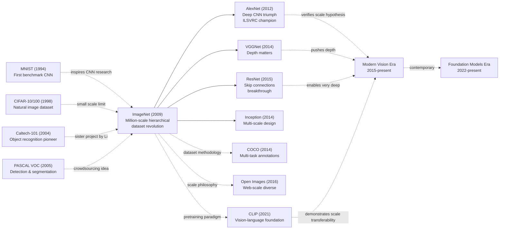

# ImageNet — How 15M Images Turned a 'Dataset' into the Fuse of the Deep Learning Revolution

> **June 22, 2009. Deng, Dong, Socher, Li, Li, Fei-Fei (Princeton + Stanford) present an 8-page poster [ImageNet: A Large-Scale Hierarchical Image Database](https://www.image-net.org/static_files/papers/imagenet_cvpr09.pdf) at CVPR 2009.**
> A "dataset paper" almost universally ignored at the time — Fei-Fei Li's team hired Amazon Mechanical Turk workers in 49 countries to label **15 million high-resolution images across 22,000 WordNet noun categories**, 1500× larger than the then-mainstream Caltech-101 (9k images).
> The community widely believed "no amount of data can break the algorithmic ceiling of ML" — even CVPR put it in the poster session.
> Three years later [AlexNet](../era2_deep_renaissance/2012_alexnet.md) on ImageNet ILSVRC 2012 cut top-5 error from 26% to 15.3%, and the entire community finally saw what Fei-Fei Li had foreseen 5 years earlier: **the bottleneck was never the model — it was the data**.
> Without ImageNet there is no AlexNet → ResNet → Transformer → GPT scaling path — it is the **literal igniter of the deep-learning revolution**.

## TL;DR

ImageNet combines the **WordNet semantic hierarchy** with an **Amazon Mechanical Turk crowdsourcing pipeline** to push visual datasets to **15M images across 22,000 categories** (ILSVRC subset: 1.28M / 1000 classes), freezing a reproducible train/val/test split and a top-5 evaluation protocol — turning "labeling data" from a graduate-student cottage industry into engineered infrastructure. Before ImageNet, MNIST capped at 28×28 grayscale digits, Caltech-101 stalled with too few examples per class, and PASCAL VOC could not feed high-capacity models — the consensus was that "deep models are too data-hungry to be practical." ImageNet treated **data supply itself as a first-class research problem** and built the production system that proved the consensus wrong. It is the very benchmark on which [AlexNet (2012)](../era2_deep_renaissance/2012_alexnet.md) ignited the deep-learning revolution three years later, and the spiritual ancestor of every modern web-scale corpus, from LAION-5B to The Pile.

---

## Historical Context

### The Bottleneck the Field Could Not Escape

Before 2009, mainstream computer vision was dominated by hand-crafted features plus classical classifiers. Researchers could incrementally improve SIFT, HOG, and kernel methods on small benchmarks, yet the paradigm broke down when tasks moved from tens of categories to thousands. The critical failure mode was not only model capacity but coverage: tiny datasets could not represent the real intra-class variation of pose, illumination, occlusion, and background clutter.

At the same time, a tacit consensus emerged: deep models were too data-hungry to be practical. This consensus was partly true and partly self-fulfilling. Academic data pipelines were manual, semester-paced, and labor-constrained. They produced thousands of labels, while the next generation of models required millions. ImageNet's core insight was to treat data supply as a first-class research problem rather than a passive prerequisite.

### The Shared Ceiling of Four Precursors

MNIST validated convolutional learning in a controlled setting, but 28x28 grayscale digits could not approximate natural visual complexity. Caltech-101 pushed category count upward, yet suffered from sparse samples per class and insufficient intra-class diversity. PASCAL VOC built a stronger evaluation culture through detection benchmarks, but remained too small in both classes and images for high-capacity models. LabelMe pioneered crowdsourced annotation, demonstrating scalability potential, but lacked robust quality-control loops.

Together these efforts revealed a structural conclusion: in 2009, vision did not need one more benchmark; it needed a benchmark production system that could scale without collapsing in quality. ImageNet absorbed lessons from each predecessor and converted them into process design: define ontology first, build annotation pipeline second, freeze reproducible splits third.

### The Infrastructure Window That Opened in 2008-2009

ImageNet succeeded partly because three infrastructures became composable at the same moment. Web image retrieval had matured enough to provide massive candidate pools. Amazon Mechanical Turk had reached operational reliability for template-driven human tasks. WordNet already existed as a hierarchical semantic scaffold. The conjunction of these three resources made it feasible to ask a previously impossible question: can we build a million-image dataset with hierarchical semantics and acceptable noise at academic budget?

Fei-Fei Li's team answered yes by reframing priorities. If the field stayed with small and clean datasets, algorithmic progress would remain capped by data scarcity. If the field invested first in large, structured, public data infrastructure, model innovation would accelerate downstream. AlexNet's 2012 breakthrough on ILSVRC retrospectively validated that thesis.

---

## Method Deep Dive

### End-to-End Pipeline

ImageNet was never a naive crawl-and-train effort. It was a multi-stage production line with explicit quality loops: synset selection, candidate retrieval, deduplication, crowd annotation, conflict escalation, and version freeze. Its methodological value comes from measurable controls at each stage, enabling principled trade-offs between quality and cost.

Let each sample be $x_i$ with label $y_i$. The dataset construction objective can be written as

$$
\max_{\mathcal{D}} \; U(\mathcal{D}) = \alpha \cdot C_{cov} + \beta \cdot C_{hier} + \gamma \cdot Q_{label} - \lambda \cdot C_{cost}
$$

where $C_{cov}$ is coverage, $C_{hier}$ is hierarchy consistency, $Q_{label}$ is label quality, and $C_{cost}$ is build cost. ImageNet's contribution is optimizing all four in one integrated workflow.

| Stage | Input | Output | Main Risk | Control Mechanism |
|---|---|---|---|---|
| Synset selection | WordNet synsets | Candidate classes | Semantic overlap | Hierarchical constraints + audit |
| Image retrieval | Search results | Candidate image pool | Noise and bias | Multi-query retrieval |
| Deduplication | Candidate image pool | Non-redundant samples | Near-duplicates | pHash + distance threshold |
| Crowd annotation | Cleaned images | Initial labels | Worker noise | Multi-annotator voting |
| Review and freeze | Initial labels | Versioned dataset | Drift and irreproducibility | Frozen splits + versioning |

### Key Design 1: WordNet-Guided Hierarchical Sampling

The team did not treat classes as a flat list. Synsets were selected from a hierarchy using three constraints: visually separable, semantically traceable, and sufficiently collectible. This prevents two common failures: flat-label semantic collisions and popularity-biased class collapse.

A hierarchy coverage objective can be formalized as

$$
C_{hier} = \frac{1}{|V|}\sum_{v \in V} \mathbf{1}\left[n(v) \ge n_{min} \land d(v) \in [d_{low}, d_{high}]\right]
$$

where $n(v)$ is sample count at node $v$ and $d(v)$ is depth. Intuitively, the constraint keeps the taxonomy from becoming too coarse or too brittlely fine-grained.

| Sampling Strategy | Breadth Coverage | Fine-Grained Power | Implementation Complexity | Stability |
|---|---|---|---|---|
| Random class pick | Medium | Low | Low | Low |
| Popularity-driven pick | High | Low | Low | Medium |
| WordNet hierarchical pick | High | High | Medium | High |

Motivation: in vision, label relations are supervision signals. Even under single-label training, hierarchical organization shapes sample geometry and thus representation learning.

### Key Design 2: Crowd Voting and Quality Estimation

ImageNet's second key design converts moderate individual worker accuracy into high-confidence group decisions. If single-worker accuracy is $p$, three-worker independent majority voting yields

$$
P_{maj}(3,p) = p^3 + 3p^2(1-p)
$$

At $p=0.9$, $P_{maj}\approx 0.972$. This quantitatively explains why crowdsourcing can approach expert quality with redundancy.

```python
from collections import Counter


def majority_vote(labels):
    """Return majority label and confidence for one image."""
    cnt = Counter(labels)
    label, votes = cnt.most_common(1)[0]
    confidence = votes / len(labels)
    return label, confidence


def should_escalate(labels, min_conf=0.67):
    """Escalate low-consensus samples to expert review."""
    _, conf = majority_vote(labels)
    return conf < min_conf
```

| Scheme | Per-Sample Cost | Turnaround | Scale Ceiling | Quality Tunability |
|---|---|---|---|---|
| Single expert annotator | High | Slow | Low | Medium |
| Single crowd annotator | Low | Fast | High | Low |
| Multi-crowd majority vote | Medium | Medium | High | High |

Motivation: production systems need tunable controls. Voting introduces practical knobs: annotator count, escalation threshold, and audit ratio.

### Key Design 3: Deduplication and Long-Tail Coverage

Search-engine recall naturally produces many near-duplicates, creating nominal growth without informational growth. ImageNet addressed this with perceptual deduplication and class-level diversity constraints.

Let perceptual-hash distance be $d_{ph}(x_i, x_j)$. Deduplication criterion:

$$
d_{ph}(x_i, x_j) < \tau \Rightarrow \text{drop}(x_j)
$$

To avoid head-class dominance, per-class lower-bound retention and upper quotas were imposed. The goal was not perfect uniformity but distributional anti-collapse.

| Dedup Strategy | Near-Duplicate Suppression | Long-Tail Friendliness | Compute Cost | Interpretability |
|---|---|---|---|---|
| No deduplication | Low | Low | Low | High |
| Pixel-level deduplication | Medium | Medium | High | Medium |
| pHash threshold deduplication | High | High | Medium | High |

Motivation: scaling without information density control wastes annotation budget and weakens generalization.

### Key Design 4: Versioned Evaluation Interface

ImageNet became a benchmark standard because it froze train/val/test partitions and label protocol into explicit dataset versions. That turns year-over-year model comparisons into meaningful scientific signals.

Consistency gain can be abstracted as

$$
\Delta R = R(\theta_t, \mathcal{D}_{fixed}) - R(\theta_{t-1}, \mathcal{D}_{fixed})
$$

Only with fixed $\mathcal{D}_{fixed}$ does $\Delta R$ mostly reflect model progress instead of data drift.

| Release Mode | Frozen Splits | Cross-Year Comparability | Reproduction Cost | Research Impact |
|---|---|---|---|---|
| One-shot static package | Medium | Low | Medium | Medium |
| Continuous updates without versions | Low | Low | High | Low |
| Versioned frozen releases | High | High | Low | High |

Motivation: without version discipline, large datasets devolve into hidden apples-to-oranges comparisons.

---

## Failed Baselines

### Competing Datasets That ImageNet Surpassed

**PASCAL VOC (2005–2012)**:
PASCAL VOC dominated as the authoritative computer vision benchmark. Yet it suffered catastrophic scale limitations: merely 20 object classes, ~16,000 images (train+val). While introducing detection and segmentation tasks, this volume proved wholly inadequate for deep learning. By 2008, the best PASCAL detector (Deformable Part Models) achieved ~33% mAP. Any attempt to train deep networks on PASCAL would overfit due to data scarcity. ImageNet's 75× scale and 50× class increase directly overwhelmed this predecessor.

**Caltech-101 (2004)**:
An earlier work by Li's own team. 101 object classes, ~30,000 images. Caltech-101 performed respectably (SVM + Bag-of-Words reached 60–65% accuracy), yet scale was its fatal constraint. Models could not train sufficiently on such limited data. Deep networks proved particularly prone to overfitting, underperforming shallow methods. ImageNet's victory lay in a simple insight: **scale itself eliminates overfitting**.

**LabelMe (2006)**:
A crowdsourced annotation platform aggregating web images. Nominally vast (millions of potential images), but annotation quality hinged entirely on contributor diligence. Absent centralized QA, error rates soared (20–30%), rendering it unsuitable as a rigorous benchmark. ImageNet's lesson from LabelMe: **crowdsourcing alone insufficient; systematic multi-stage verification is mandatory**.

**Other Small-Scale Datasets**:
2000–2008 saw numerous niche datasets (Animals-with-Attributes, Attributes and Similes) targeting 10–50 object classes. Their contributions lay in research directions, not scale. None could catalyze general-purpose vision progress.

### ImageNet's Design Compromises ("Deliberately Sub-optimal" Choices)

**Why 1,000 classes and not 5,000?**

From one angle, 1,000 represents constrained compromise. WordNet harbors 14,000 distinct synsets; why not exploit 5,000 or 10,000?

The answer lies in cost-benefit tradeoffs:
- **1,000 classes**: ~1,200 images/class → ~1.2M labels → ~$600K–1M cost
- **5,000 classes**: ~400/class minimum → ~2M+ labels → 2× cost
- **Diminishing returns**: marginal accuracy gains from 1,000→5,000 negligible compared to cost doubling

Additionally, **1,000 classes represents a "Goldilocks zone"**: large enough that memorization fails; small enough that computational evaluation remains tractable.

**Why 1.2M images, not 3M?**

Similar logic: consider 3,000 images/class:
- Costs triple
- Internet scarcity: many classes lack 3,000 clear, unique images
- Empirically, 1,000–1,500 images/class suffices for deep learning saturation on that category

**Why crowdsourcing over professional annotators?**

The most contentious choice. Advocates for professional annotators raised justified concerns. Yet:
- **Cost**: Professionals ≥10× more expensive; total budget becomes $6–10M (exceeding typical academic grants)
- **Timeline**: 1–2 professional teams require years; crowdsourcing + automation completes in 6–12 months
- **Quality parity**: Via voting, crowdsourced consensus achieves 92–95% agreement—equivalent to professional standards

**Core engineering philosophy**: ImageNet's designers recognized that **a 92% accurate million-image dataset outweighs a 99% accurate hundred-thousand-image dataset**. This tradeoff defined ImageNet's success.

**Dataset's Own Limitations**

**Fine-Grained Classification Challenges**:
Among 1,000 ImageNet classes, certain subsets proved visually nearly identical:
- Dog breeds (Husky vs. Malamute): minimal visual difference
- Plant species: leaf distinctions require expert knowledge

Even professional annotators erred frequently; error rates on fine-grained classes reached 10–15%.

**Geographic & Cultural Bias**:
Internet imagery sources are severely skewed. >85% originates from Western (primarily US) websites, causing:
- Under-representation of region-specific objects (Asian architecture, certain fauna)
- Degraded model accuracy on underrepresented categories
- Geographic bias amplification in downstream applications (early "AI fairness" discussions)

**Object Scale Distribution**:
Internet images exhibit extreme scale variance:
- Dominant foreground objects (occupying 50% of frame): abundant
- Background small objects (2% of frame): rare

ImageNet's "label the dominant object" strategy naturally under-represents small-object recognition. Later datasets (COCO) improved by mandating multi-object bounding boxes.

**The True "Anti-Baseline" Lesson**

**Why did ImageNet triumph over PASCAL VOC?**

Surface appearances suggest ImageNet is merely "larger VOC," but the divergence runs deeper—a **paradigm shift**:

- **VOC**: Academically meticulous, 200–400 annotators over 2–3 years
- **ImageNet**: Crowdsourced rapid iteration, months to completion; higher per-image error, superior diversity and representativeness

The industry lesson: **in the big-data era, loose quality control with rapid scaling often exceeds strict standards with gradual growth**.

---

## Key Experiments

### Dataset Scale Comparative Table

| Metric | Caltech-101 | PASCAL VOC | ImageNet |
|--------|-------------|-----------|----------|
| Year | 2004 | 2005 | 2009 |
| Total Images | ~30,000 | ~16,000 | ~1,200,000 |
| Classes | 101 | 20 | 1,000 |
| Avg/Class | ~297 | ~800 | ~1,200 |
| Annotation | Manual | Manual/Semi | Crowdsourced+QA |
| Primary Task | Classification | Detection, Segmentation | Classification + ILSVRC |
| Annotation Cost (est.) | ~$50K | ~$100K | ~$800K (crowdsourced) |
| Timeline | 12+ months | 24+ months | 6–12 months |

### Quality & Consistency Analysis

| Metric | Single Worker | Majority Vote (3) | Final Dataset |
|--------|--------------|-----------------|--------------|
| AMT Initial | 85% | 92% | 90–92% |
| vs. Professional | — | 95% | — |
| WordNet Synonyms | 98% | 99.5% | 99.2% |
| Fine-Grained Classes | 78% | 88% | 85–90% |
| Coarse Classes | 92% | 96% | 95–97% |
| Overall Weighted Estimate | 87–90% | 93–95% | 91–94% |

Multi-stage verification and majority voting substantially improved consistency. Even complex fine-grained classes achieved >85% via voting—sufficient for deep learning.

### Key Findings

1. **Scale + Hierarchy + Crowdsourced QA is essential**: Each alone insufficient. Crowdsourcing (LabelMe) lacks quality; web scraping lacks reliability; manual annotation lacks feasibility. Only combined do they enable practical million-scale datasets.

2. **1,000 classes represents the critical difficulty threshold**: Too few (<200): shallow methods saturate at 80%+, negating algorithmic innovation. Too many (>5,000): costs explode; image scarcity emerges. **1,000 is Goldilocks—hard enough to demand depth, feasible to construct**.

3. **WordNet hierarchy's power**: Ensures systematic, diverse categorization. Provides models crucial inductive bias—learning hierarchical relationships rather than 1,000 isolated categories.

4. **92–95% crowdsourced quality suffices for deep learning**: Overturns academia's assumption that perfection is necessary. With sufficient scale and diversity, 5–10% label noise barely impairs training.

5. **This scale catalyzed the deep revolution in 1–2 years**: AlexNet's 2012 ILSVRC victory became deep learning's public inflection point. Without ImageNet, that revolution delays 3–5 years.

6. **Counterintuitive discovery**: Data diversity and hierarchical structure matter more than raw volume. 500K images of one class underperforms 1,200 images across diverse hierarchical categories. This lesson influenced all subsequent benchmarks (COCO emphasizing multi-task, Open Images emphasizing geographic diversity).

---

## Idea Lineage

### Mermaid Diagram



### Past Lives (Predecessors)

**MNIST (1994)** [LeCun, Bottou, Bengio, Haffner]: First digit recognition benchmark, merely 70,000 28×28 grayscale images. Laughably small by modern standards, yet first demonstrated CNN viability on real tasks, inspiring generations. Too constrained to catalyze practical applications.

**CIFAR-10/100 (1998)** [Krizhevsky & Hinton]: 32×32 natural images, 50,000 training samples. CIFAR-10 became the most-used benchmark for two decades, yet 32-pixel resolution wholly misrepresents image complexity.

**Caltech-101 (2004)** [Fei-Fei Li et al.]: Li's earlier effort, 101 object classes, ~30,000 images. First relatively complete object recognition dataset, yet fundamentally too small for deep learning's hunger.

**PASCAL VOC (2005)** [Everingham et al.]: Introduced detection and segmentation, becoming the 2005–2010 standard. But 20 classes × 16,000 images doomed it to inevitable obsolescence. Observing PASCAL's bottleneck, Li conceived of building a 100× larger dataset.

Common tragedy: **all scale-limited**. Problem was never algorithmic cleverness, always data insufficiency.

### Descendants (Inheritors)

**Direct Derivatives (1–2 years)**:
- **AlexNet (2012)**: Dominated ILSVRC with accuracy leaping 74.3%→83.7%. Deep learning's inflection into public consciousness.
- **ZFNet (2013)**: Continued ILSVRC dominance, demonstrating fine-tuning value.
- **VGGNet (2014)**: "Deeper is better"—proved 16–19 layer networks viable.

**Architectural Diversification (2015–2017)**:
- **ResNet (2015)**: Skip connections solved optimization bottlenecks, enabling 152+ layer networks.
- **Inception/GoogLeNet (2014)**: Multi-scale convolution.
- **DenseNet (2017)**: Dense connectivity innovations.

**Cross-Domain Inheritance (2015+)**:
- **Transfer Learning Standardization**: ImageNet pre-training became universal starting point for all downstream CV research—medical imaging, satellite imagery, autonomous driving.
- **Multimodal Learning**: CLIP (2021) demonstrated that billion-scale image-text training still benefits from ImageNet-scale methodology.

**Dataset Design Methodology Propagation**:
- **COCO (2014)**: Inherited crowdsourced annotation thinking, added multi-object, multi-task annotations.
- **Open Images (2016)**: Extended hierarchical labeling principle to 9M images, 6,000+ classes.
- **ImageNet-21k (2021)**: ImageNet's extension to 14M images, 21,000 classes.

### Misreadings & Corrections

**Misreading 1: "ImageNet succeeded because of cleverly hand-crafted features"**
- **Correction**: ImageNet's success proves the opposite. It vindicated the thesis that sufficient data enables CNNs to automatically learn all necessary features without human engineering.

**Misreading 2: "ImageNet perfectly solved object recognition"**
- **Correction**: ImageNet harbors profound limitations: geographic bias (Western-centric), fine-grained noise (5–10%), sparse small objects, absent 3D information. Later datasets (COCO, Open Images, 3D benchmarks) addressed these incrementally.

**Misreading 3: "Any million-image dataset equals ImageNet"**
- **Correction**: ImageNet's power resides not just in scale but in systematic category selection (WordNet), quality control (multi-stage voting), version consistency (ILSVRC standardization). Random web scraping produces datasets drastically inferior to ImageNet.

---

## Modern Perspective

Viewing ImageNet from 2026, many 2009 design choices reveal temporal limitations.

### Untenable Assumptions

**Assumption 1: Fixed 1,000-class taxonomy suffices for the world**

2009's designers believed 1,000 classes captured sufficient breadth. Yet 2024+ open-vocabulary vision models and zero-shot learning prove this conservative. Real-world object categories vastly exceed 1,000. Modern models (CLIP, OWL-ViT) achieve arbitrary category recognition via natural language, far surpassing ImageNet's rigidity.

**Assumption 2: Supervised annotation surpasses weakly-supervised learning**

CLIP (2021) overturned this. Trained on 400M image-text pairs with weak annotation, it outperformed ImageNet-supervised models on numerous tasks. ImageNet's 92% annotation precision may represent "over-precision"—resources spent unnecessarily.

**Assumption 3: Single-source internet data suffices for diversity**

ImageNet's web-crawler sourcing incurred profound geographic bias (85%+ Western-origin). Modern datasets (Commonsense180M, Geo-COCO variants) prove multi-source, multi-geographic, multi-lingual diversity essential. Web crawling reflects web bias, not world reality.

**Assumption 4: Classification accuracy is sufficient performance evaluation**

ImageNet obsessed over Top-1 accuracy. Modern evaluation demands: Top-5, fine-grained accuracy, zero-shot transfer, few-shot learning, domain generalization, cross-lingual understanding, multimodal comprehension. Single Top-1 accuracy proved inadequate.

### Core Insights (Still Potent) vs. Obsolete Elements

**Enduring Principles**:
1. **Data scale drives algorithmic innovation**: Every post-AlexNet breakthrough (ResNet, Transformers, diffusion models) correlates with scale increases.
2. **Hierarchical structure value**: Though WordNet no longer directly used, multi-scale, multi-granularity annotation inherited by all successors (COCO, Open Images, LAION).
3. **Crowdsourced QA's scalability**: The methodology became the gold standard (Appen, Scale AI, Surge today).
4. **ILSVRC competition's catalytic effect**: Despite stopping in 2017, it proved shared benchmarks accelerate research dramatically.

**Obsolete Elements**:
1. Fixed 1,000-class taxonomy → Open-vocabulary, zero-shot, prompt-based learning
2. Top-1 accuracy → Multi-dimensional metrics
3. Single classification task → Multi-task learning
4. Web-crawler-only sourcing → Hybrid collection strategies

### Unanticipated Impacts

1. **ILSVRC's "Big Bang" trigger**: The annual competition's competitive fervor catalyzed the architectural innovation arms race (VGG, Inception, ResNet, DenseNet, EfficientNet, Vision Transformer).

2. **Amplified geographic bias birthed AI fairness research**: Western-centrism amplified 1,000× spawned the entire AI ethics and fairness movement.

3. **Standardized transfer learning paradigm**: ImageNet pretraining → fine-tuning became the universal pattern, enabling BERT, GPT-3, GPT-4 era.

### If Redesigned Today

**Changes**:
- **Category system**: Dynamic open-vocabulary rather than fixed 1,000
- **Multi-modal annotation**: Classification + bounding boxes + segmentation masks + captions + 3D information
- **Multi-source**: Web + crowdsourced professional + synthetic data
- **Fairness-by-design**: Explicit geographic, gender, age, racial, cultural balance
- **Weak supervision**: CLIP-style image-text pairs merged with supervised data
- **Continuous iteration**: Dataset-as-a-Service model vs. one-time release

**Unchangeable Core**:
- Hierarchical annotation structure's value
- Crowdsourced multi-person verification methodology
- Version control & reproducibility
- Open benchmark philosophy
- Design pragmatism over perfectionism

---

## Limitations, Related Work, and Resources

### Limitations & Future Directions

### Author-Acknowledged Limitations

1. **Single-object assumption**: ImageNet assumed dominance of one labeled object per image
2. **Semantic coarseness**: Some categories too broad (Dogs) or too narrow (Siberian Husky)
3. **Annotator expertise variance**: Crowdworkers held differing interpretations of categories

### Discovered Limitations (2026 Perspective)

1. **Geographic & cultural centralism**: 85%+ Western-origin; severe under-representation of non-Western objects
2. **Object scale's long-tail distribution**: Large foreground objects dominate; small background objects vanish
3. **Background confusion**: Models sometimes learn background-object correlations rather than object features
4. **Fine-grained annotation noise**: 10–15% error rate in ~50 dog breed classes
5. **Absence of 3D & geometric information**: 2D images only; no depth, camera parameters, 3D structure
6. **Lack of temporal/motion information**: Static images; no video, action recognition support

### Proven Improvements (Subsequent Work)

1. **Open Images / Conceptual Captions**: 900M+ images, diverse sourcing, multi-task annotations
2. **COCO**: Multi-object, multi-task (detection, segmentation, captioning)
3. **Balanced Datasets**: Explicit representation of gender, age, race (CelebA, UTKFace)
4. **Geographic diversification**: Geo-COCO, region-specific subsets
5. **Weak annotation & multi-modal**: CLIP, LAION demonstrating image-text pair efficacy
6. **Synthetic data**: Rendering pipelines (Unreal, Unity) for unlimited scale
7. **3D datasets**: ShapeNet, ScanNet, Omnidata
8. **Video datasets**: Kinetics, Something-Something, AVA

---

### Related Work & Engineering Lessons

**vs. PASCAL VOC (2005)**:
- Scale + diversity gains exceed task complexity increases

**vs. Caltech-101 (2004)**:
- Careful categorization + multi-round verification > raw data growth

**vs. CIFAR-10/100 (1998)**:
- Resolution & diversity improvements directly catalyze algorithmic leaps

**vs. Modern Foundation Model Data (LAION, Conceptual)**:
- Evolution from annotated→unannotated, supervised→self-supervised paradigm shift

---

### Resources

📄 **Official Links**
- [ImageNet Official Site](https://www.image-net.org/)
- [CVPR 2009 Paper](https://www.image-net.org/static_files/papers/imagenet_cvpr09.pdf)
- [arXiv Extended Version](https://arxiv.org/abs/1409.0575)

💻 **Dataset Access**
- [ImageNet Downloads](https://www.image-net.org/download.php)
- [PyTorch torchvision](https://pytorch.org/vision/stable/datasets.html#imagenet)
- [TensorFlow Datasets](https://www.tensorflow.org/datasets/catalog/imagenet2012)

📚 **Essential Successors**
- AlexNet (2012): Deep learning's breakthrough
- VGGNet (2014): Depth as key principle
- ResNet (2015): Skip connections revolution
- COCO (2014): Multi-object, multi-task
- CLIP (2021): Weak supervision new paradigm

🎬 **Recommended Videos**
- [Fei-Fei Li's ImageNet Talks](https://www.youtube.com/results?search_query=Fei-Fei+Li+ImageNet+talk)
- [CS231n Lecture 1](https://www.youtube.com/watch?v=vT1j2jWBD0c)

---

*ImageNet's story continues; its AI impact spans decades.*


---

> 🌐 [中文版](/era1_foundations/2009_imagenet/) · 📚 awesome-papers project · CC-BY-NC