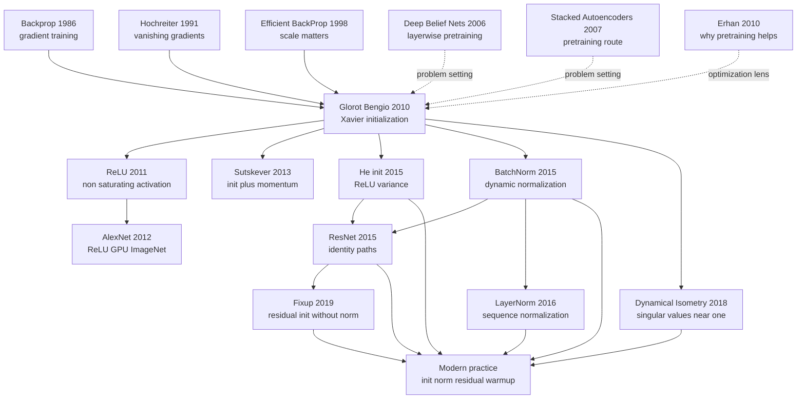

# Glorot Init — Making Deep Networks Pass Signals Before They Learn

> **In May 2010, Xavier Glorot and Yoshua Bengio presented [Understanding the difficulty of training deep feedforward neural networks](https://proceedings.mlr.press/v9/glorot10a.html) at AISTATS.** The paper is often remembered as the source of the Xavier initialization formula, but its sharper identity is diagnostic: why did deep nets after 2006 still need RBM or autoencoder pretraining when backpropagation already existed? The answer was not merely "vanishing gradients." Sigmoid's positive mean pushed upper layers into saturation, random weights let activation and gradient variances drift with depth, and the layer Jacobian's singular values wandered away from 1. ReLU, He initialization, BatchNorm, residual networks, and modern scaling rules all continue the same repair program: before a deep model can learn, signals must be able to pass through it.

## TL;DR

Glorot and Bengio's 2010 AISTATS paper turned the complaint "deep feedforward networks are hard to train" into a measurable signal-propagation diagnosis. Sigmoid is not merely slow; because its output has a positive mean, random initialization can push upper hidden layers into saturated regions where derivatives nearly vanish, producing the long plateaus that made direct supervised training look broken. A useful initializer must keep both forward activations and backward gradients at comparable scale across layers. The paper's rule, now called Xavier or Glorot initialization, samples $W \sim U[-\sqrt{6/(n_{in}+n_{out})}, \sqrt{6/(n_{in}+n_{out})}]$, equivalently targeting $\mathrm{Var}(W) \approx 2/(n_{in}+n_{out})$ for tanh-like nonlinearities. The failed baseline it replaced was not one model but the whole 2006-2010 default stack: tiny random weights, sigmoid or tanh, and direct supervised backprop that often stalled after four or five layers; RBM and autoencoder pretraining were expensive detours around that pathology.

Historically, the paper sits between [Backpropagation (1986)](1986_backprop.md) and [ReLU (2011)](2011_relu.md) as the diagnostic node that made modern trainability engineering legible. Its logic flows into [AlexNet (2012)](../era2_deep_renaissance/2012_alexnet.md), He initialization for ReLU networks in 2015, BatchNorm's dynamic distribution control, and [ResNet (2015)](../era2_deep_renaissance/2015_resnet.md)'s identity paths. The counterintuitive lesson is that Xavier initialization did not "solve deep learning" by itself and was partly superseded in mainstream ReLU CNNs; its deeper contribution was to make initialization a question of Jacobian conditioning and signal geometry rather than a choice of random-number scale.

---

## Historical Context

### 2006-2010: pretraining owned the revival

Backpropagation made multilayer networks trainable in principle in 1986, but the practical experience through the 1990s and early 2000s was chilly: add depth to a sigmoid network, and training often entered a plateau where neither training error nor test error moved in a convincing way. Hinton's Deep Belief Net in 2006 and the Bengio lab's stacked-autoencoder line revived deep learning by taking a detour. Each layer was first trained with an unsupervised objective, then the whole network was fine-tuned with labels. For several years, "deep learning" effectively meant layer-wise pretraining, sigmoid or tanh units, and proof on modest benchmarks.

That recipe worked, but its explanation was muddy. Was pretraining learning better features, or merely placing optimization in a better region? If the problem was only initialization, why was random initialization so fragile? If the problem was only vanishing gradients, why did some saturated units eventually crawl out after long plateaus? Glorot and Bengio's 2010 paper appears exactly inside that gap. It refuses to treat pretraining as a mysterious rescue mechanism and asks for the physical reason standard backprop from random initialization fails.

### Why sigmoid became the default and then the problem

Sigmoid was natural in early neural networks. Its output lies in $(0,1)$, it looked probabilistic, its derivative was easy to manipulate, and it matched the old intuition of a neural firing-rate curve. RBMs, autoencoders, and early classification MLPs all used it without much ceremony. But sigmoid has two properties that are hostile to depth. First, it is not zero-centered; its output mean is positive, so the output of one layer shifts the pre-activation of the next layer in a systematic direction. Second, once sigmoid enters either saturated tail, its derivative is near zero; gradients become small and recovery is slow.

Tanh moves the output to $(-1,1)$ and partly fixes the mean problem, but it remains saturating. The practical situation in 2010 was therefore awkward: the community knew that depth could help, and it knew backpropagation was the basic tool, yet it often needed pretraining, special learning rates, and manual scale tuning to make networks move. The Glorot paper's contribution was to translate this tuning folklore into the language of activation statistics, gradient statistics, and Jacobian singular values.

### What Glorot and Bengio were trying to answer

Xavier Glorot was a PhD student in the Universite de Montreal / LISA lab, and Yoshua Bengio was already one of the central figures of the deep-learning revival. The authorship matters because Bengio's own lab had helped establish layer-wise pretraining. This paper therefore asks, from inside the pretraining camp: do we truly need pretraining, or have the default activation and initialization choices made the supervised optimization problem unnecessarily sick?

AISTATS 2010 was not the ImageNet era. The experiments were much smaller than today's foundation-model training runs, but that makes the diagnosis clearer. The authors did not hide the issue behind larger data or stronger GPUs. They watched ordinary deep MLPs during training and measured the mean, variance, gradient, and saturation behavior of each layer. The historically durable point is not a single benchmark number; it is the picture that emerges before the network has even learned a complicated function: the signal is already being distorted as it travels through depth.

## Background and Motivation

### Research question

The paper's core question can be compressed to one sentence: why are randomly initialized deep feedforward networks so hard to optimize with standard gradient descent? The authors split that question into three layers. First, does the activation function push units into a bad operating regime? Second, does the weight scale make forward signals grow or shrink from layer to layer? Third, when backpropagation crosses each layer, does the layer Jacobian systematically stretch or flatten gradients through its singular values?

That decomposition feels natural today, but it was sharp in 2010. It turns "the model is deep, so it is hard" into "does each layer approximately preserve signal geometry?" If the singular values of each layer's Jacobian are close to 1, error signals can travel through depth. If they are far from 1, gradients explode or vanish. Xavier initialization is not a magical constant; it is a cheap approximation to this geometric target.

### Why this was not just an initialization trick

Because the rule later became a one-line API in deep-learning frameworks, it is easy to remember the paper as an engineering convenience. The original paper is more important as a diagnostic method. It first uses activation distributions to explain sigmoid saturation, then uses variance propagation to derive a reasonable weight scale, and finally uses Jacobian singular values to say why "near 1" is the desirable regime for deep optimization.

That is also why the paper connects so cleanly to later milestones. ReLU in 2011 replaced the saturating activation. He initialization in 2015 recomputed the variance rule for rectifiers. BatchNorm in 2015 controlled layer distributions during training rather than only at initialization. ResNet in 2015 inserted identity paths so very deep Jacobians had an easier route. Their engineering surfaces differ, but they are all answering the same question Glorot and Bengio made explicit in 2010: is the signal propagation inside the deep network healthy enough for learning to begin?

---

## Method Deep Dive

### Diagnostic setup: signal propagation, not model accuracy

Glorot and Bengio did not write the paper as "we propose an initializer and get better benchmark accuracy." It reads more like a network medical exam. They train ordinary deep feedforward networks and record three families of quantities layer by layer: the mean and variance of forward activations, the scale of backward gradients, and the fraction of units that enter saturation. That was an unusual lens in 2010, when deep-learning papers more often compared pretraining algorithms than opened the network and inspected each layer.

An $L$-layer MLP can be written as:

$$
z^{(l)} = W^{(l)}h^{(l-1)} + b^{(l)},\quad h^{(l)} = \phi(z^{(l)}),\quad l=1,\ldots,L.
$$

If each layer slightly drifts the scale of $h^{(l)}$, the drift compounds with depth. In the forward pass, variance can shrink until information is flattened, or grow until activations rush into saturation. The same applies backward: the error signal is multiplied by a chain of Jacobians, so any systematic stretching or compression becomes depth-amplified.

| Quantity observed | Question in the paper | Failure symptom | Later matching technique |
|------------------|-----------------------|-----------------|--------------------------|
| Activation mean | Is the output zero-centered? | Sigmoid shifts upper layers | tanh, normalization |
| Activation variance | Does the forward signal keep scale? | layerwise shrinkage or growth | Xavier, He init |
| Saturation rate | Can units still learn? | near-zero gradients, plateaus | ReLU, GELU |
| Jacobian singular values | Can gradients pass backward? | exploding or vanishing gradients | orthogonal init, residual path |

### Sigmoid failure mechanism: positive mean amplifies saturation

The derivative of sigmoid is:

$$
\sigma'(z) = \sigma(z)(1-\sigma(z)) \leq 0.25.
$$

Even at its best operating point, one sigmoid layer passes back at most one quarter of the local gradient; once $z$ enters either saturated tail, the derivative moves much closer to zero. The more subtle problem is that sigmoid output is always positive, so the output mean of one layer shifts the next layer's pre-activations in a systematic direction. With depth, that shift can push upper hidden units into saturation.

One of the paper's most insightful observations is that saturated units are not necessarily permanently dead. They can crawl out of saturation through very small gradients. This explains the long plateaus seen in early deep-net training: the network is not incapable of learning, but under the combination of bad initialization and bad activation, it spends a long time repairing its own internal statistics. Pretraining helped partly because it placed the network in a less saturated region before supervised learning began.

### Xavier initialization derivation: balancing fan-in and fan-out

Assume inputs and weights are independent and close to zero mean. The forward variance of a linear layer roughly obeys $\mathrm{Var}(z^{(l)}) \approx n_{in}\mathrm{Var}(W^{(l)})\mathrm{Var}(h^{(l-1)})$. Preserving forward variance suggests $n_{in}\mathrm{Var}(W) \approx 1$. In backpropagation, gradient variance is similarly controlled by $n_{out}\mathrm{Var}(W)$; preserving backward variance suggests $n_{out}\mathrm{Var}(W) \approx 1$. Since both cannot be satisfied exactly when fan-in and fan-out differ, Glorot's rule takes a compromise:

$$
\mathrm{Var}(W) \approx \frac{2}{n_{in}+n_{out}},\quad W \sim U\left[-\sqrt{\frac{6}{n_{in}+n_{out}}},\sqrt{\frac{6}{n_{in}+n_{out}}}\right].
$$

The engineering meaning is plain: wider layers should use smaller weights, narrower layers can use somewhat larger weights; neither forward activations nor backward gradients should be destroyed at the start. The rule is suited to tanh or softsign-like nonlinearities whose output is roughly zero-centered and whose slope near the origin is near 1. For ReLU, He initialization later changes the variance to $2/n_{in}$ because ReLU drops roughly half of the negative-side activations.

| Initialization | Typical formula | Main fit | Historical meaning |
|----------------|-----------------|----------|--------------------|
| Tiny uniform random | $U[-0.01,0.01]$ | early MLPs | often makes deep signals too small |
| LeCun fan-in | $\mathrm{Var}(W)=1/n_{in}$ | linear/tanh-like | emphasizes forward variance |
| Xavier / Glorot | $\mathrm{Var}(W)=2/(n_{in}+n_{out})$ | tanh, softsign | balances forward and backward variance |
| He / Kaiming | $\mathrm{Var}(W)=2/n_{in}$ | ReLU family | corrects for half-active rectifiers |

### A minimal implementation

The following code is not the original experiment code; it rewrites the paper's variance logic in modern NumPy form. The central point is that initialization is not "pick a small random number." It is determined by the fan-in and fan-out of neighboring layers.

```python
import math
import numpy as np


def glorot_uniform(fan_in: int, fan_out: int, rng=None):
    rng = np.random.default_rng(rng)
    limit = math.sqrt(6.0 / (fan_in + fan_out))
    return rng.uniform(-limit, limit, size=(fan_out, fan_in))


def layer_stats(weights, inputs):
    preact = inputs @ weights.T
    tanh_out = np.tanh(preact)
    sigmoid_out = 1.0 / (1.0 + np.exp(-preact))
    return {
        "preact_var": float(preact.var()),
        "tanh_mean": float(tanh_out.mean()),
        "sigmoid_mean": float(sigmoid_out.mean()),
        "sigmoid_saturation": float(np.mean((sigmoid_out < 0.05) | (sigmoid_out > 0.95))),
    }

x = np.random.default_rng(0).normal(size=(2048, 784))
w = glorot_uniform(784, 512, rng=1)
print(layer_stats(w, x))
```

The statistic to watch is `sigmoid_mean`: even when pre-activations are approximately zero-centered, sigmoid outputs sit near a mean of 0.5, not 0. That is why the paper emphasizes sigmoid's layer-to-layer shift. Tanh outputs are closer to zero mean, so the same initialization is more likely to keep a deep network in a trainable regime.

### What the rule changed

Xavier initialization does not make the network smart; it stops the network from damaging itself at step zero. It changes three default assumptions. First, initialization must depend on layer width rather than a fixed scale. Second, forward and backward signals must be considered together; keeping activations finite is not enough if gradients cannot return. Third, difficulty in deep training can be diagnosed with statistics rather than guessed from final accuracy.

That is why the rule still survives. PyTorch's `torch.nn.init.xavier_uniform_`, TensorFlow's `GlorotUniform`, and Keras's default dense-layer initializer all inherit it. Even though modern ReLU networks often use He initialization and Transformers rely heavily on LayerNorm and residual scaling, Xavier initialization remains one of the starting points of the engineering language of variance-preserving initialization.

---

## Failed Baselines

### Failed baseline 1: fixed small-scale random initialization

Early MLPs often initialized every layer from one small fixed interval such as $U[-0.01,0.01]$ or a similar hand-tuned scale. In shallow networks this could be adequate because the gradient path was short and signals crossed only a few layers. In deeper networks the weakness was immediate: the same weight variance is not the same operation for a wide layer and a narrow layer. Forward activations may shrink quickly, and backward gradients may disappear after repeated multiplication across layers.

The lesson from this baseline is that initialization scale is not a global hyperparameter; it is part of the layer geometry. Glorot's rule ties the scale to $n_{in}$ and $n_{out}$, acknowledging that layer width determines the physical scale of signal propagation.

### Failed baseline 2: directly supervised sigmoid deep nets

The central negative example is sigmoid. Its problem is not merely that derivatives are small. The positive output mean and the small derivative in saturated regions amplify each other. Once upper hidden units are pushed into saturation, gradients nearly stall. Some units can eventually escape, but the motion is slow, producing the long plateaus visible in training curves.

| Baseline | Why it seemed reasonable then | Problem observed in the paper | Later treatment |
|----------|-------------------------------|-------------------------------|-----------------|
| Fixed tiny random weights | Avoid large initial activations | deep signals become too small | fan-in/fan-out initialization |
| Sigmoid + SGD | natural probabilistic output | nonzero mean, upper-layer saturation | tanh, ReLU, normalization |
| Tanh + old initialization | zero-centered output | still saturates, scale unstable | Xavier init |
| Softsign / less-saturating nonlinearity | slower saturation | helpful but incomplete | co-design activation and initialization |

### Failed baseline 3: pretraining as detour rather than cure

RBM and autoencoder pretraining genuinely helped in 2006-2010, but this paper reinterprets it as a detour. Pretraining can place weights in a region that is easier to fine-tune, reducing the harm from upper-layer saturation and bad scale. But if the underlying disease is failed signal propagation caused by activation and initialization choices, pretraining is not the only road.

This mattered for the deep-learning revolution that followed. The 2011 ReLU paper showed that changing the activation could make deep supervised MLPs train without pretraining. AlexNet in 2012 went fully supervised on ImageNet. Glorot 2010 made the conceptual turn first: from "use unsupervised learning to rescue supervised training" to "repair the signal path of supervised training itself."

## Key Experimental Data

### The key figures matter more than the key tables

This AISTATS paper does not win through one giant leaderboard number the way later ImageNet papers did. Its empirical evidence mostly comes from training-process curves and internal layer statistics: how activations are distributed across layers, how saturation rates change, how gradients propagate through depth, and how the new initialization shortens plateaus. In other words, the crucial data are about what happens inside the network, not just how many points the final model wins.

| Experimental signal | Observation in the paper | Interpretation | Impact |
|---------------------|--------------------------|----------------|--------|
| Sigmoid upper-layer saturation | upper units easily enter 0/1 saturation | positive mean shifts layer by layer | sigmoid loses default status |
| Plateau behavior | saturated units can slowly recover | gradients are tiny but not zero | explains early training stalls |
| Tanh is more stable | zero centering reduces shift | still affected by saturation | tanh pairs well with Xavier init |
| Jacobian singular values far from 1 | gradients are stretched or compressed | depth amplifies local distortion | precursor to dynamical isometry |
| New initialization converges faster | variance is better controlled | forward and backward passes both helped | framework defaults changed |

### Why small experiments produced large influence

By today's scale, the experiments are small: ordinary feedforward networks, limited datasets, no large-GPU training, and no modern benchmark suite. Yet the influence is large because the paper answers a precondition that every deep network faces. Once a model is deep enough, initialization, activation, and gradient propagation determine whether learning can begin at all; that fact is not tied to one dataset.

More importantly, the paper transformed deep training from tuning folklore into an observable object. Later work could replace any component: sigmoid with ReLU, Xavier with He initialization, static initialization with BatchNorm, or plain layers with residual blocks. But each replacement can be interrogated with the same chain of questions: is forward variance stable, can gradients pass backward, and is the Jacobian in a benign regime? That is the experimental value that makes the paper classic.

---

## Idea Lineage

### Before Xavier: old problems inherited by Glorot 2010

Glorot initialization looks like a compact formula, but it absorbs three decades of accumulated trouble in neural-network training. Backpropagation showed that multilayer networks could be trained by gradients. Hochreiter explained that gradients can vanish across long paths. LeCun's Efficient BackProp repeatedly emphasized centering inputs and choosing scales. Hinton and Bengio's pretraining route used unsupervised learning to bypass bad initialization. These threads meet in 2010: if deep networks fail not because backpropagation is wrong but because each layer begins with unhealthy signal geometry, initialization is no longer a detail.

| Predecessor | Year | Problem left to Glorot 2010 | How this paper inherits it |
|-------------|------|-----------------------------|----------------------------|
| Backpropagation | 1986 | multilayer nets can use gradients | asks why deep ones still stall |
| Hochreiter gradient analysis | 1991 | gradients decay across long paths | shows the feedforward analogue |
| Efficient BackProp | 1998 | input and weight scale matter | turns advice into a formula |
| Deep Belief Nets | 2006 | pretraining bypasses bad optimization | explains why bypass was needed |
| Greedy layer-wise training | 2007 | deep representations can be built layerwise | asks whether layerwise pretraining is necessary |
| Erhan pretraining study | 2010 | pretraining behaves like optimization regularization | offers an initialization-side view |

### Mermaid graph: from the pretraining era to modern initialization practice



### After Xavier: how successors rewrote the rule

The descendants of Xavier initialization do not form one straight line. They form a set of engineering branches around a common goal: let signals pass through depth. ReLU attacks saturating activations. He initialization recomputes variance for ReLU. BatchNorm turns static initialization into dynamic correction during training. ResNet gives gradients an identity path. LayerNorm brings normalization into sequence models. Dynamical-isometry theory turns the Jacobian intuition from the Glorot paper into more formal spectral language.

| Successor | Year | What it inherited | What it rewrote |
|-----------|------|-------------------|-----------------|
| Deep Sparse Rectifier Networks | 2011 | saturation is the disease | avoids positive-side saturation with ReLU |
| AlexNet | 2012 | direct supervised deep nets are viable | scales the effect with data and GPUs |
| Sutskever init plus momentum | 2013 | initialization shapes the optimization entry | combines scale with momentum |
| He initialization | 2015 | variance propagation derivation | changes the rule to $2/n_{in}$ for ReLU |
| Batch Normalization | 2015 | layer distributions must stay stable | corrects distributions during training |
| ResNet | 2015 | Jacobians must be passable | identity paths give gradients a highway |
| Dynamical Isometry | 2018 | singular values should be near 1 | builds a stricter spectral theory |

### Common misreadings: Xavier init is often narrowed too much

| Misreading | Why it is inaccurate | Better reading | Consequence |
|------------|----------------------|----------------|-------------|
| Xavier init is just a formula | the original focus is diagnosing why deep nets are sick | the formula is an output of signal-propagation analysis | the Jacobian view is forgotten |
| It solved vanishing gradients | it improves scale only at initialization | activation, normalization, and residual paths still matter | one trick is overestimated |
| It fits every activation | ReLU is better matched by He init | initialization and nonlinearity must be co-designed | API defaults can be misused |
| It made pretraining useless | supervised vision moved on, but self-supervised pretraining remains central | pretraining changed role from optimization to representation | 2006 pretraining is confused with 2020 pretraining |

The most important misreading is compressing the paper's contribution into "Xavier uniform." If one remembers only the API, one misses the real turn: deep-net training was systematically reframed as a signal-propagation problem. That frame later entered every modern model, only under different names: normalization, residual scaling, warmup, fan-in mode, orthogonal initialization, or mean-field theory.

---

## Modern Perspective

### What aged well after 16 years

From 2026, the central judgment of Glorot and Bengio 2010 has aged extremely well: difficulty in training deep networks is not a single-point failure, but a system problem jointly determined by activation functions, weight scale, and gradient paths. Modern models may have trillions of parameters and may include attention, MoE, diffusion, or state-space components, but at initialization they still face the same question: will signals decay, explode, or drift as they move through depth?

The most durable piece is the Jacobian view. Today the vocabulary may be dynamical isometry, mean-field signal propagation, residual scaling, or normalization placement, but the goal is still to let errors pass through many layers. Xavier initialization is an early, simplified answer for tanh-like networks. Modern practice decomposes that answer into several cooperating engineering devices.

### What later practice rewrote

| Claim in 2010 | Evidence then | Status in 2026 | Verdict |
|---------------|---------------|----------------|---------|
| Sigmoid is unsuitable for deep random initialization | upper-layer saturation and plateaus | mostly gone as a hidden activation | holds |
| Tanh is more stable with good initialization | zero-centered output | still used in small/RNN settings, rarer in large models | partly retained |
| Xavier init is a good default | faster convergence | still good for tanh/linear, ReLU uses He | activation-dependent |
| Jacobian singular values near 1 matter | empirical diagnosis | strengthened by dynamical-isometry theory | holds |
| Pretraining mainly solves optimization | 2006-2010 context | modern pretraining is more about representation and data | historically bounded |
| Static initialization is central | experiments focus on initialization | BN/LN/residuals correct during training | expanded |

### If the paper were rewritten today

If this paper were rewritten in 2026, it probably would not compare only sigmoid, tanh, and softsign. It would treat activation functions, initialization, normalization, and residual paths as one joint design space. It would compare Xavier, He, orthogonal, Fixup, and muP or scaling-law initializers, and it would separate the signal-propagation needs of CNNs, Transformers, RNNs, and diffusion U-Nets.

A modern rewrite would also distinguish two meanings of pretraining more carefully. RBM and autoencoder pretraining in 2006 were mostly used to solve an optimization-entry problem. Self-supervised pretraining after 2020 is primarily about using unlabeled data, learning world knowledge, or aligning representations. The claim that Xavier initialization made pretraining unnecessary is true in the first context, not for BERT, MAE, CLIP, or LLM pretraining.

## Limitations and Future Directions

### Limitations

| Limitation | Why it exists | Later solution | Current lesson |
|------------|---------------|----------------|----------------|
| Mainly fits tanh-like activations | derivation assumes zero-centered outputs and slope near 1 | He init, LeCun init | choose init by activation |
| Controls only initialization time | distributions keep drifting during training | BatchNorm, LayerNorm | normalization became standard |
| IID assumptions are rough | real networks have correlated inputs and residuals | mean-field, orthogonal init | theory is finer but engineering remains approximate |
| Cannot alone train very deep nets | layer Jacobians still compound | ResNet, skip connection | residual paths matter more |
| Does not cover modern gated FFNs | GELU/SwiGLU statistics are more complex | specialized scaling and warmup | initialization and optimizer interact |

### Future directions

First, initialization will keep moving from layer-level rules to architecture-level rules. Transformer residual branches, sparse MoE experts, and diffusion U-Net skip connections require different scale arrangements. Second, initialization will be co-designed with optimizers; AdamW, warmup, gradient clipping, and weight decay change the effective early-gradient scale. Third, theory will focus more on the whole training trajectory rather than step zero, because normalization and residual scaling continually reshape signal geometry during learning.

Small models and edge deployment are another important direction. Large models can hide mistakes behind normalization, residuals, and enormous training budgets. Small models depend more directly on clean initialization and stable activations. Xavier initialization remains practically valuable in mobile MLPs, tabular models, and small vision networks because it is cheap, interpretable, and has no runtime cost.

## Related Work and Insights

### Related papers

| Paper | Year | Relationship to Glorot 2010 | Takeaway |
|-------|------|-----------------------------|----------|
| Efficient BackProp | 1998 | input centering and scale advice | engineering wisdom can be formalized |
| Deep Belief Nets | 2006 | pretraining bypasses bad initialization | diagnose why the detour was needed |
| Why pretraining helps | 2010 | contemporary optimization explanation | complementary view |
| Deep Sparse Rectifier Networks | 2011 | continues the saturation diagnosis | replace sigmoid |
| AlexNet | 2012 | industrializes direct supervised deep nets | large-scale validation |
| He initialization | 2015 | ReLU-specific variance derivation | initialization must match activation |
| Batch Normalization | 2015 | controls layer distributions | from static to dynamic correction |

### Practical lessons

First, do not treat initialization as a mindless default API. Look at activation function, layer width, residual structure, and normalization placement before choosing Xavier, He, LeCun, orthogonal, or a framework default. Second, when training hits a plateau, inspect internal statistics first: activation mean drift, layerwise variance collapse, and gradient norms through depth. Third, pretraining, normalization, residual paths, and warmup are not unrelated tricks; they often repair the same signal-propagation problem at different locations.

The paper also teaches a research-method lesson: a classic does not have to win by running the biggest experiment. It can change a field by splitting a blurry failure into measurable variables and giving researchers a debugging language. When we say fan-in, fan-out, activation statistics, gradient flow, or Jacobian conditioning, we are still using vocabulary this paper helped make standard.

## Resources

### Paper and code resources

- Glorot & Bengio 2010 PMLR page: https://proceedings.mlr.press/v9/glorot10a.html
- Glorot & Bengio 2010 PDF: http://proceedings.mlr.press/v9/glorot10a/glorot10a.pdf
- PyTorch Xavier initialization: https://pytorch.org/docs/stable/nn.init.html
- TensorFlow GlorotUniform: https://www.tensorflow.org/api_docs/python/tf/keras/initializers/GlorotUniform
- Deep Learning Book, Chapter 8 optimization: https://www.deeplearningbook.org/contents/optimization.html
- He initialization paper: https://arxiv.org/abs/1502.01852
- Batch Normalization paper: https://arxiv.org/abs/1502.03167


---

> 🌐 [中文版](/era1_foundations/2010_glorot_init/) · 📚 awesome-papers project · CC-BY-NC