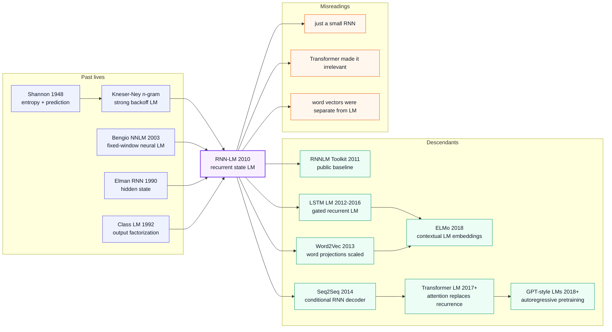

# RNN-LM — Moving Language Modeling from Fixed Windows to Recurrent State

> **In September 2010, Tomas Mikolov, Martin Karafiat, Lukas Burget, Jan Cernocky, and Sanjeev Khudanpur published the four-page Interspeech paper [_Recurrent neural network based language model_](https://www.isca-archive.org/interspeech_2010/mikolov10_interspeech.html).** On the surface it was a small engineering paper: replace a backoff n-gram table with a recurrent neural network and use it for speech-recognition rescoring. The official abstract, however, carried three numbers that were hard to ignore: about **50% perplexity reduction** with mixtures of RNN LMs over a state-of-the-art backoff LM, about **18% word-error-rate reduction** on WSJ when trained on the same data, and about **5% WER reduction** on the much harder NIST RT05 task even against a backoff model trained on more data. Its historical role is larger than “RNNs can model text”: it moved language modeling from fixed-window statistics into continuous hidden state, then grew into the RNNLM toolkit, Word2Vec, Seq2Seq decoders, LSTM language models, ELMo, and finally the autoregressive objective inherited by Transformer LMs.

## TL;DR

Mikolov, Karafiat, Burget, Cernocky, and Khudanpur's 2010 Interspeech paper rewrites classic language modeling from the fixed-order conditional $p(w_t \mid w_{t-n+1:t-1})$ into a recurrent-state conditional $p(w_t \mid h_t),\ h_t=f(W_{xh}x_t+W_{hh}h_{t-1})$. The model is trained with BPTT / truncated BPTT, made usable for large vocabularies through class-based output factorization, and inserted into ASR systems by interpolation and rescoring rather than by replacing the whole decoder. The official abstract's headline numbers are the reason the paper mattered immediately: RNN-LM mixtures gave roughly 50% perplexity reduction over a strong backoff LM, about 18% WER reduction on WSJ when trained on the same data, and about 5% WER reduction on NIST RT05 even against a backoff model trained with more data. The defeated baseline was not weak; it was the heavily optimized Chen-Goodman / Kneser-Ney n-gram tradition that had dominated speech recognition for more than a decade. The descendants are unusually traceable: internal word projections become [Word2Vec (2013)](../era2_deep_renaissance/2013_word2vec.md), the target-side recurrent LM becomes the decoder in [Seq2Seq (2014)](../era2_deep_renaissance/2014_seq2seq.md), gated versions connect [LSTM (1997)](1997_lstm.md) to ELMo, and [Transformer (2017)](../era3_attention/2017_transformer.md) eventually replaces recurrence while keeping the same autoregressive next-token objective. The counter-intuitive lesson is that this paper's most durable legacy is not the vanilla RNN cell itself, but the paradigm of next-word prediction plus learnable continuous state plus reusable word representations.

---

## Historical Context

### What language modeling was stuck on in 2010

To see why RNN-LM looked disruptive in 2010, we need to return to the everyday machinery of speech-recognition systems. A production ASR pipeline was already mature: the acoustic model proposed word-sequence hypotheses, the language model judged which sentence sounded plausible, and the final system reranked lattices or n-best lists. The language model in that pipeline was not a neural network; it was the carefully engineered **backoff n-gram**. It looked up a probability conditioned on the previous $n-1$ words, backed off to lower orders when counts were sparse, and relied on Kneser-Ney smoothing to survive data sparsity.

This system was strong because it was controllable, interpretable, and fast. It also had a hard boundary: **the context window was locked by $n$**. A 5-gram sees at most four previous words; a 7-gram runs into state explosion, memory pressure, and sparse counts. Real language constraints routinely cross that boundary: agreement, topic continuity, syntactic closure, speaker style, and domain vocabulary can span tens of words. Cache models, trigger models, class models, and topic adaptation tried to patch the gap, but they were still engineering on top of discrete count tables.

Neural language modeling had already arrived in 2003. Bengio and colleagues' Neural Probabilistic Language Model used word vectors and a feed-forward network to encode the idea that similar words should share statistical strength, solving one of n-gram's fully discrete weaknesses. Schwenk, Bengio, Morin, and others then connected hierarchical output, continuous-space LMs, and SMT/ASR rescoring. The problem was that most of these models were still **fixed-window** models. They mapped four or ten previous words into a continuous space, but they did not escape the assumption that memory length equals window length.

RNNs were not new either. Elman's 1990 Simple Recurrent Network had shown that hidden state could carry temporal structure, and [LSTM (1997)](1997_lstm.md) had already solved the core long-dependency training problem. But mainstream speech recognition in the 2000s did not believe a plain recurrent net could beat n-grams in large-vocabulary LM. The reasons were practical: slow training, expensive softmax, unstable gradients, tedious tuning, and difficult decoder integration. The historical role of Mikolov's 2010 paper sits exactly here: it did not ask the world to rewrite ASR first; it showed that an RNN-LM could be inserted into the existing pipeline and beat strong engineering baselines.

### Five direct predecessors that pushed RNN-LM into existence

- **Shannon 1948: probability and entropy for language**. The evaluation language of modern LMs comes from Shannon: a model that assigns higher probability to real sequences has lower cross-entropy and lower perplexity. RNN-LM keeps this framework but replaces the estimator from a count table to a neural network.
- **Kneser-Ney / Chen-Goodman 1995-1999: the n-gram peak baseline**. RNN-LM did not beat a naive n-gram; it challenged heavily tuned backoff LMs with smoothing, pruning, and interpolation. Without that baseline, the paper's 50% perplexity reduction would carry much less historical weight.
- **Brown class-based LM 1992: the first large-vocabulary output economy**. Class language models predict a class and then a word inside the class. Mikolov's later class-based output inherits this idea to avoid the full $V$-way softmax cost.
- **Bengio NNLM 2003: word vectors plus neural conditional probability**. NNLM proved embeddings can be learned through language modeling, but its context remained a fixed window. RNN-LM inherits “word vectors as internal model variables” and turns context into recurrent state.
- **Werbos BPTT / Elman SRN / LSTM: the recurrent-network toolbox**. BPTT supplies the training procedure, Elman supplies simple recurrent hidden state, and [LSTM](1997_lstm.md) proves gated memory can go farther. The 2010 paper chose a plainer vanilla RNN because speech-recognition rescoring first needed speed, reproducibility, and integration, not the theoretically strongest cell.

### What Mikolov's team was doing at the time

First author Tomas Mikolov was a PhD student at Brno University of Technology (BUT), working on neural network language models and speech recognition. BUT's speech group was not a Google- or Microsoft-scale industrial lab, but it had exactly the ecosystem RNN-LM needed: expertise in LVCSR, lattice rescoring, n-best pipelines, and a willingness to treat neural networks as engineering modules inside real ASR systems rather than toy benchmark performers.

The author list reveals the hybrid nature of the paper. Mikolov, Karafiat, Burget, and Cernocky came from BUT's speech-recognition tradition; Sanjeev Khudanpur came from Johns Hopkins statistical speech and language modeling. In other words, this was not a neural-network paper talking only to itself. It put neural LMs inside the evaluation culture of ASR. The official abstract reports WSJ and NIST RT05 WER, not only perplexity, to make the point: **the model was not just an experiment that lowered perplexity; it could turn into fewer recognized word errors**.

Crucially, Mikolov quickly turned the paper into software. The RNNLM Toolkit was released through 2010-2012 with training, evaluation, n-best rescoring, speech-lattice experiments, generated-text samples, and word-projection files. That toolkit converted RNN-LM from “paper method” into “component other researchers can use as a baseline.” Word2Vec later kept the same style: compact C/C++ implementation, command-line usage, speed first, reproducible results. RNN-LM is the first public template of Mikolov's engineering taste.

### Industry, compute, and data state

- **Compute**: in 2010, deep learning did not yet have a stable GPU training stack. The RNNLM Toolkit targeted single-machine CPU training and n-best rescoring; the ASRU 2011 follow-up even emphasized training on hundreds of millions of words on one core in a few days. This constraint explains class-based output, truncated BPTT, and cached intermediate states.
- **Data**: LM training data had moved beyond WSJ toward Broadcast News, NIST RT, and hundreds of millions of words, but it was nowhere near post-2018 web-scale corpora. There was enough data to make n-grams hard to beat, but not enough to let neural nets swallow the whole ASR pipeline end to end.
- **Frameworks**: PyTorch, TensorFlow, and JAX did not exist. Researchers wrote C/C++ training loops, softmaxes, BPTT, file formats, and n-best rescoring scripts themselves. Part of the value of RNNLM Toolkit was packaging this unglamorous work.
- **Industry climate**: SVMs, CRFs, HMMs, GMM-HMM acoustic models, and n-grams still dominated. Neural nets were beginning to return in speech acoustic modeling, but n-gram speed and robustness controlled language modeling. RNN-LM's strategy was pragmatic: do not declare n-grams dead; interpolate with them first and prove that neural LMs add complementary probability mass.

## Background and Motivation

**State of the field**: by 2010 statistical language modeling was highly mature. Strong systems combined modified Kneser-Ney n-grams, class LMs, cache / trigger features, topic adaptation, and lattice rescoring. Each module fixed a specific pain point, but all of them depended on discrete histories and hand-designed backoff logic. Neural NNLMs had shown that continuous word vectors were useful, but they were still limited by fixed windows and softmax cost.

**The concrete pain points** were threefold. First, n-gram context is short, and raising the order produces combinatorial explosion. Second, fixed-window NNLMs have embeddings but still cannot decide for themselves which parts of history remain relevant. Third, a full neural softmax over a large ASR vocabulary is too slow for training and decoding, making it hard to enter production pipelines.

**The core tension** was that the most valuable linguistic signal often lies outside the most recent four words, while the fastest and most reliable models could only use a handful of recent tokens reliably. Researchers could stack more n-grams, more smoothing, and more interpolation weights, but they did not have a single mechanism that compressed “all previous words” into a learnable state. RNN-LM attacks that tension directly: hidden state becomes a continuous, trainable summary of context that updates over time.

**The paper's goal** was not to build an elegant toy RNN. It was to show that a recurrent neural LM could beat strong backoff LMs on real speech-recognition tasks and could be made usable through class-based output, BPTT training, and n-best/lattice rescoring. It needed to answer four questions: can recurrent hidden state predict the next word better than a fixed window? Can BPTT train a large-vocabulary LM stably? Can class output reduce speed to a usable range? And does interpolation with n-grams reduce WER, not just perplexity?

**The core idea** is therefore direct: write language modeling as a recurrent dynamical system, feed in the current word, update hidden state, predict the next word from hidden state; train with BPTT, factorize the output through word classes, and deploy as a complementary rescoring model instead of a total n-gram replacement. This plain recipe later became a foundation of modern NLP: language modeling is not merely an ASR component, but a self-supervised system for learning reusable representations from raw text.

---

## Method Deep Dive

RNN-LM's innovation is not a complicated cell; it is an engineering-minded bundle: replace a fixed window with recurrent hidden state, train sequence probabilities with BPTT, reduce large-vocabulary output cost through class-based factorization, and interpolate the model into existing ASR rescoring systems. The model is plain, but its historical reach is long: modern autoregressive LMs still follow the same basic rhythm of reading a token, updating state, and predicting the next token.

### Overall framework

At each step, RNN-LM reads the current word $w_t$ as a one-hot or embedded vector, updates a hidden state, and uses that state to predict the next word. The key difference from NNLM is that NNLM receives a fixed-length history window, while RNN-LM receives the current word plus the previous hidden state. Hidden state is both compressed context and learnable continuous memory.

| Module | 1990s/2000s baseline | RNN-LM choice | Why it matters |
|--------|----------------------|---------------|----------------|
| Context | Fixed $n-1$ previous words | Recurrent hidden state | Can in principle absorb arbitrary history |
| Parameter sharing | Independent counts per n-gram context | Same weights reused across time | Similar contexts share statistical strength |
| Output | Vocabulary lookup / backoff | Neural softmax plus class factorization | Keeps continuous generalization while controlling cost |
| Deployment | Real-time n-gram score inside decoder | n-best/lattice rescoring plus interpolation | Enters old systems as a strong complement first |

One RNN-LM forward pass can be read as four steps: project the word input, mix the current word with the previous state, output word or word-class probabilities, and let the ASR system linearly interpolate that probability with the original n-gram score. It is not an end-to-end speech recognizer. It is a **language-modeling module**, which is why it could be seriously evaluated in 2010.

### Key Design 1: Recurrent hidden state — turning context from a window into a state

**Function**: compress the past word sequence into a continuous vector so that prediction of $w_{t+1}$ no longer depends only on the most recent $n-1$ tokens, but on a state recursively updated from all previous inputs.

The core update can be written as:

$$
h_t = \sigma(W_{xh} x_t + W_{hh} h_{t-1} + b_h), \qquad
p(w_{t+1}\mid h_t) = \operatorname{softmax}(W_{hy} h_t + b_y)
$$

The difference between n-grams and RNN-LM fits in one line:

$$
\text{n-gram: } p(w_t\mid w_{t-n+1},\ldots,w_{t-1}) \quad\Longrightarrow\quad
\text{RNN-LM: } p(w_t\mid h_{t-1}),\ h_{t-1}=F(w_1,\ldots,w_{t-1})
$$

This small rewrite changes the statistical geometry of language modeling. In n-grams, every context is a discrete key; “the cat sat” and “a dog sat” share strength only indirectly through smoothing, even if they are semantically close. In RNN-LM, hidden state is a continuous vector, so similar contexts can occupy nearby regions and generalize naturally.

**Design rationale**: long-span linguistic constraints are not always covered by a fixed order. Once a speaker enters a topic, the vocabulary distribution tens of words later changes; once a syntactic construction opens, a later closure is affected. Recurrent hidden state lets the model compress those signals into distributed features instead of waiting for an exact discrete n-gram to have been observed.

### Key Design 2: BPTT / truncated BPTT — making sequence models trainable

**Function**: backpropagate next-word loss through time so that $W_{xh}$, $W_{hh}$, and $W_{hy}$ are learned from full sequence prediction errors. RNN-LM does not estimate a separate probability for each context; the same parameters are shared across all time steps.

The objective is standard negative log likelihood, with BPTT unrolling the recurrent graph through time:

$$
\mathcal{L} = -\sum_{t=1}^{T} \log p(w_{t+1}\mid h_t), \qquad
\frac{\partial \mathcal{L}}{\partial W_{hh}} = \sum_{t=1}^{T}\sum_{k\le t}
\frac{\partial \mathcal{L}_t}{\partial h_t}\frac{\partial h_t}{\partial h_k}\frac{\partial h_k}{\partial W_{hh}}
$$

Full BPTT is expensive and vulnerable to vanishing / exploding gradients on long sequences. The engineering choice in the RNNLM line is truncation: backpropagate only a limited number of steps, capture dependencies longer than n-grams where training remains tractable, and keep CPU training usable.

Here is a tiny 1990s-style RNN-LM forward pass showing the key idea: reuse the same parameters across time and cache only a truncated state history.

```python
import numpy as np

def rnnlm_forward(token_ids, embedding_table, recurrent_weight, output_weight, truncation_steps=5):
    """Tiny educational RNN-LM forward pass with truncated state cache."""
    hidden_size = recurrent_weight.shape[0]
    hidden_state = np.zeros(hidden_size)
    cached_states = []
    logits_by_step = []

    for token_id in token_ids:
        token_vector = embedding_table[token_id]
        hidden_state = np.tanh(token_vector + recurrent_weight @ hidden_state)
        cached_states.append(hidden_state.copy())
        cached_states = cached_states[-truncation_steps:]
        logits_by_step.append(output_weight @ hidden_state)

    return logits_by_step, cached_states
```

The snippet omits backward propagation, but preserves the engineering feel of RNN-LM: do not build a table for every context; roll one state through time. The truncation window is not the model's memory limit; it is an approximation boundary for credit assignment. Hidden state can still carry older information, but gradients to early causes become weaker.

### Key Design 3: Class-based output — reducing a $V$-way softmax to two-stage prediction

**Function**: address the large-vocabulary softmax bottleneck. ASR language-model vocabularies can have tens or hundreds of thousands of words; a full softmax must score every word at every step. This is one of the main reasons RNN training was considered too slow.

Class-based output factorizes word probability into “predict the word class first, then the word inside that class”:

$$
p(w_t\mid h_t) = p(c(w_t)\mid h_t)\,p(w_t\mid c(w_t), h_t)
$$

If the vocabulary size is $V$, the number of classes is $C$, and the average class size is $V/C$, output cost roughly drops from $O(VH)$ to $O(CH + (V/C)H)$. With $C \approx \sqrt{V}$, the two-stage output is much cheaper than full softmax. The design is less elegant than later sampled softmax / NCE / negative sampling, but it matches 2010 ASR constraints: classes can be built ahead of time from frequency or clustering, and both training and inference remain straightforward.

| Output scheme | Per-step cost | Normalized probability? | Suitable for 2010 ASR? | Main cost |
|---------------|---------------|--------------------------|-------------------------|-----------|
| Full softmax | $O(VH)$ | Yes | Slow | Large-vocabulary training and rescoring cost |
| Class output | $O(CH + VH/C)$ | Yes | Yes | Class quality affects speed and accuracy |
| Hierarchical softmax | $O(H\log V)$ | Yes | Partly | Tree structure is hard to tune |
| Negative sampling / NCE | Approx. $O(kH)$ | Training approximation | More popular after 2013 | Does not directly provide a full normalized probability |

**Design rationale**: to enter ASR, RNN-LM needed not only lower perplexity but usable speed. Class output is the compromise: it preserves “this is a proper probability model” while avoiding a full vocabulary scan. Word2Vec later chose negative sampling because it no longer needed full word probabilities; RNN-LM still had to score sentences, so normalization mattered.

### Key Design 4: RNN plus n-gram interpolation — connecting continuous state to ASR pipelines

**Function**: let RNN-LM contribute probability without overthrowing the original system. The most robust route is interpolation between RNN probability and backoff n-gram probability:

$$
\log p_{\text{mix}}(w_t\mid \text{history}) =
\lambda \log p_{\text{RNN}}(w_t\mid h_{t-1}) + (1-\lambda)\log p_{\text{ngram}}(w_t\mid w_{t-n+1:t-1})
$$

This formula explains why RNN-LM could be accepted by the ASR community in 2010. It does not say “n-grams are useless.” It says n-grams are excellent at high-frequency local collocations, RNNs are better at continuous-state generalization, and their errors do not fully overlap. Interpolation gives the recognizer a better-calibrated probability estimate.

**Design rationale**: speech-recognition mistakes are expensive. If a new LM must replace the decoder-internal model directly, speed, memory, calibration, and OOV handling all become blockers. n-best / lattice rescoring lets RNN-LM act later in the pipeline: the old system proposes candidates, and RNN-LM reranks them. It is a conservative deployment route, and a smart one.

### Training strategy and engineering trade-offs

RNN-LM's most important engineering choice is to admit that, in 2010, it cannot replace n-grams in every real-time path. It first narrows the target to rescoring, then uses class output, truncated BPTT, model mixtures, and n-gram interpolation to convert neural probability into actual WER gains. Perplexity remains the core metric:

$$
\operatorname{PPL} = \exp\left(-\frac{1}{T}\sum_{t=1}^{T}\log p(w_t\mid \text{history})\right)
$$

| Engineering problem | Direct approach | RNN-LM trade-off | Later descendants |
|---------------------|-----------------|------------------|-------------------|
| Long context | Raise n-gram order | Compress with recurrent state | LSTM LM, Transformer cache |
| Large vocabulary | Full softmax | Class-based output | Hierarchical softmax, NCE, sampled softmax |
| Training cost | Full BPTT | Truncated BPTT plus CPU optimization | TBPTT, sequence batching |
| System integration | Replace decoder LM | n-best/lattice rescoring | Neural reranking, shallow fusion |

If one looks only at architecture, the 2010 RNN-LM is simpler than 1997 LSTM; if one looks at engineering position, it is closer to today's LLMs: one self-supervised objective, a rolling state, a large-vocabulary output layer, and a pipeline that turns language probability into downstream system gains. Transformer later replaces recurrent state, but keeps the training objective and the engineering intuition.

---

## Failed Baselines

The drama of RNN-LM is not that it beat a weak baseline. It challenged one of the most mature engineering foundations in statistical NLP: smoothed backoff n-grams. By 2010 an n-gram LM was not a classroom count table; it was a full system of pruning, discounting, interpolation, classes, and rescoring experience. RNN-LM's win showed that discrete fixed windows had reached a structural limit.

### Baselines that lost to RNN-LM

| Baseline | Representative strength | Failure mode | How RNN-LM bypasses it | Historical lesson |
|----------|-------------------------|--------------|------------------------|-------------------|
| Kneser-Ney backoff n-gram | Strong local collocations, fast | Fixed window, sparse histories | Hidden state continuously compresses history | Even strong tables struggle with soft state |
| Fixed-window NNLM | Word-vector generalization | Context length still fixed | Recurrent state rolls through time | Continuous representation needs continuous memory |
| Class / cache / trigger LM | Effective specialized patches | Each module fixes one phenomenon | One state absorbs many signal types | Hand-built features are not unified memory |
| Full-softmax RNN | Conceptually clean | Too slow for large vocabularies | Class-based output | Neural LMs must run before they can matter |
| Perplexity-only experimental models | Nice curves | May not improve recognition | n-best/lattice WER evaluation | ASR trusts fewer word errors |

### Failure case 1: Kneser-Ney n-gram's fixed window

Kneser-Ney smoothing is strong, especially at estimating how likely a word is to appear in a new context. It solves the long-tail problem of n-grams to a high engineering standard. But it still works inside a discrete window: if useful information lies twenty words back, it has either been truncated or must enter indirectly through cache / topic features.

RNN-LM's win does not mean n-gram probabilities were wrong. It means **n-grams lacked a learnable continuous-state path**. The official abstract's statement that RNN-LM mixtures give roughly 50% perplexity reduction over a state-of-the-art backoff LM is evidence of exactly that structural difference: once multiple RNN-LMs are mixed, the model captures distributional information the backoff table cannot.

### Failure case 2: Feed-forward NNLM's context ceiling

Bengio's NNLM had already moved words from discrete IDs into continuous vectors, but it still required the researcher to choose a window length. Small windows miss long dependencies; large windows raise parameter and training cost, while positions remain fixed. It is better described as a “continuous n-gram” than a full sequence model.

RNN-LM reverses the setup: each step receives only the current word, while history lives in hidden state. The model no longer has to enumerate all historical positions. This design also explains why RNN-LM's word projections foreshadow Word2Vec: when a model must use hidden state to predict the next word, word vectors naturally learn which words appear in similar contexts.

### Failure case 3: Plain RNNs and the speed bottleneck

If one simply writes a vanilla RNN with a full softmax and applies it to a 2010 large-vocabulary ASR task, the likely outcome is not SOTA but failure to run. RNN-LM's failed baselines include this “conceptually right but engineering-wrong” neural model. A full $V$-way softmax scans the whole vocabulary at every step; full BPTT over long sequences explodes memory and time.

The pragmatic strength of Mikolov's line is that it does not leave speed as an exercise for the reader. Class-based output, truncated training, n-best rescoring, and toolkit examples all exist to put RNN-LM into a speech pipeline. Some classic papers contribute a beautiful formula; this one contributes more like a manual for keeping a beautiful formula alive at the engineering boundary.

### The real anti-baseline lesson

The anti-baseline lesson is: **a strong engineering baseline can be beaten by a better-structured model, but only if the new model is also engineered seriously**. If RNN-LM reported only perplexity and not WER, it would not have changed ASR behavior. If it used only tiny corpora and weak backoff comparisons, statistical LM researchers would not have trusted it. Without class output and the toolkit, it would not have become infrastructure for follow-up work.

RNN-LM therefore has two layers of failure cases. The first is the failure of n-grams, fixed NNLMs, and cache models on long context. The second is a common neural-network failure: underestimating system-integration cost. Mikolov 2010 clears both layers.

## Key Experimental Data

### Main experiment: perplexity and WER

The official abstract's headline results already capture the historical meaning. The table keeps relative improvements rather than inventing absolute numbers not itemized in the abstract; for ASR readers, relative WER reduction is the hard system-level evidence.

| Experimental setting | Comparator | RNN-LM setup | Reported result | Interpretation |
|----------------------|------------|--------------|-----------------|----------------|
| Perplexity | State-of-the-art backoff LM | Mixture of several RNN LMs | Around 50% PPL reduction | Continuous-state models capture information outside backoff tables |
| WSJ ASR | Backoff LM trained on the same data | RNN-LM rescoring / interpolation | Around 18% WER reduction | Directly reduces recognized word errors on a classic controlled task |
| NIST RT05 | Backoff LM trained on more data | RNN-LM with less data still used for rescoring | Around 5% WER reduction | Complementary gains persist on a harder task |
| Follow-up BPTT + classes | Early RNN-LM | Extensions / Strategies line | Better results plus faster training | Turns a short paper into a scalable program |
| RNNLM Toolkit | High reproduction cost | Public C/C++ toolkit | Training, evaluation, n-best rescoring | Converts method into a community baseline |

### Ablations: single model, mixtures, and interpolation

The experimental logic has three layers. First, a single RNN-LM substantially lowers perplexity, showing that recurrent state itself is useful. Second, mixtures of RNN-LMs lower perplexity further, showing exploitable model diversity. Third, interpolation with n-grams lowers WER, proving that RNN-LM is not merely copying n-gram probabilities but contributing complementary signal.

The central ablation is not “how much does hidden size 80 versus 640 help.” It is whether an RNN probability can leave the paper table and become a recognition-system gain. WSJ and NIST RT05 answer yes. Later ASRU / ICASSP work fills in training strategy, class speedups, and lattice approximations, moving the bottleneck from “does this work?” to “how do we make it faster, larger, and easier to deploy?”

### Key findings

First, perplexity and WER form a credible loop in this paper: the large perplexity drop is not an isolated metric; it turns into fewer recognition errors. Second, RNN-LM and n-grams are complementary rather than pure substitutes; this directly foreshadows neural reranking and shallow fusion. Third, word projections appear without being an extra objective, becoming one of the most important observations on the eve of Word2Vec.

Fourth, RNN-LM exposes a theme that lasts for the next decade: **language-model quality is often constrained by output-layer cost**. From class output to hierarchical softmax, NCE, negative sampling, adaptive softmax, sampled softmax, and modern LLM vocabulary parallelism, that engineering line never really disappears.

---

## Idea Lineage



| Thread | Before RNN-LM | RNN-LM's mutation | Direct descendant | Long-run effect |
|--------|---------------|-------------------|-------------------|-----------------|
| Language probability | n-gram count tables | Hidden-state conditional probability | RNNLM Toolkit | LM becomes a neural self-supervised objective |
| Word representation | NNLM embeddings | Word projections emerge from LM training | Word2Vec | Word vectors become NLP infrastructure |
| Sequence generation | HMM / phrase SMT / n-gram | Recurrent next-word generator | Seq2Seq decoder | Conditional generation unifies text tasks |
| Long context | Cache / trigger features | Continuous state preserves history | LSTM LM / ELMo | Contextual representation |
| Architecture replacement | Recurrence as core operator | Objective outlasts operator | Transformer LM | Autoregressive pretraining keeps the goal, swaps the computation graph |

### Past lives

RNN-LM's ancestry is not a single line but a convergence of three. The first is the statistical language-modeling line from Shannon to n-grams: language can be treated as sequence probability, and model quality can be measured through cross entropy / perplexity. The second is Bengio NNLM's continuous-representation line: words should not be only discrete symbols; they should have learned vectors. The third is the recurrent-network line of Elman, BPTT, and LSTM: state can update through time, and training can unroll through time.

Mikolov 2010 connects those three lines to an ASR engineering system. It does not invent a new memory cell like LSTM, and it does not introduce word vectors for the first time like Bengio 2003. Its key move is making a recurrent-state language model strong enough to compete with engineered n-grams. That makes it a bridge paper: statistical LM on the left, neural sequence modeling on the right.

### Descendants

The first direct descendants are the RNNLM Toolkit and the 2011-2012 extension papers: better BPTT, faster classes, more practical lattice / n-best rescoring. This line turns RNN-LM into a reproducible strong baseline for the ASR community.

The second descendant is Word2Vec. It is easy to treat Word2Vec as a “static word-vector paper,” but its engineering prehistory is RNN-LM. Mikolov observed semantic and syntactic regularities in RNN-LM word projections, then removed the complicated recurrent LM and kept the predictive training plus efficient output approximation. Word2Vec is the representation-learning branch of RNN-LM.

The third descendant is Seq2Seq. The target-side decoder is essentially a conditional RNN-LM: given a source-sentence vector, predict the next target word at each step. Bahdanau attention, Luong attention, and GNMT all preserve this decoder role. Transformer 2017 replaces the RNN operator with self-attention, but the language-modeling objective remains; the GPT line scales next-token prediction into a general pretraining paradigm.

### Misreadings

The first misreading is “RNN-LM is just a small vanilla RNN.” At the cell level, that is partly true; at the historical level, it misses the engineering breakthrough of connecting neural LMs to a strong ASR pipeline. Many methods lower toy perplexity; fewer make a speech system commit fewer word errors.

The second misreading is “Transformer replaced RNNs, so RNN-LM no longer matters.” Transformer replaced recurrence as a computation operator, not the target logic established by RNN-LM: learn a generalizing state representation from raw text with next-token prediction. GPT and RNN-LM are closer in objective than in architecture.

The third misreading is “Word2Vec and language modeling are separate roads.” In reality, Word2Vec grows out of the word-projection observation in RNN-LM. Static word vectors are not a rejection of language modeling; they are the most scalable and reusable representational layer extracted from a full LM.

---

## Modern Perspective

From the 2026 vantage, the easiest mistake is to dismiss RNN-LM as small, slow, and short-memory by Transformer standards. All of that is true, but it is not the fair historical question. The right question is not “is this the strongest language model today?” but “what bridge did it build between statistical n-grams and modern neural LMs?” The answer is: next-word prediction stopped being merely a count-table estimation problem and became a way to train a continuous-state machine.

### Assumptions that no longer hold: RNNs as the permanent language-model backbone

In 2010 it was reasonable to think that if language unfolds in time, recurrent state should be the natural backbone. That assumption no longer holds after 2017. Transformer self-attention showed that sequence modeling does not have to be step-by-step recurrence; parallel training, direct long-range connections, and hardware-friendly matrix multiplication are better suited to large-scale pretraining than one-state-at-a-time updates.

Another assumption that no longer holds is that long context can be compressed into one fixed-size hidden state. Seq2Seq's fixed-vector bottleneck, LSTM LM forgetting, and long-document modeling failures all show that a single state vector is narrow. Attention succeeds not because it is more “brain-like,” but because each layer can directly access token-level history instead of forcing the entire past through one vector.

| 2010 assumption | Why it was reasonable then | 2026 view | Replacement |
|-----------------|----------------------------|-----------|-------------|
| Recurrence is the natural sequence backbone | Language is generated through time, and RNN structure matches it | Training parallelism is too poor | Transformer / state space model |
| One hidden state can compress history | ASR rescoring sentences were relatively short | Long-context bottleneck is obvious | Attention KV cache / memory tokens |
| Class output is the main large-vocabulary solution | CPU training plus normalized probabilities | Modern training has richer approximations | Sampled/adaptive softmax, parallel vocab head |
| Rescore first, replace later | Legacy systems were stable and low-risk | End-to-end systems are more common | Shallow fusion, RNN-T, AED, LLM rescoring |

### If rewritten today: keep the objective, replace the operator

If RNN-LM were rewritten today, the part most likely to survive would be the objective and evaluation discipline, not the vanilla RNN cell. The model would probably use a Transformer decoder or a modern state space model in place of $W_{hh}$ recurrence; training would use a large-scale subword tokenizer, AdamW, mixed precision, and sequence packing; the output layer would use a parallel vocabulary head, adaptive softmax, or sampled loss; deployment would expand from n-best rescoring into shallow fusion, deliberation, and LLM-based correction.

But a modern rewrite should preserve several habits from the 2010 paper. First, compare against a strong baseline rather than showing attractive curves alone. Second, connect perplexity to a task gain such as WER, BLEU, exact match, or human preference. Third, provide runnable tools or at least a clear recipe; language models are infrastructure, not just figures in a paper.

### What time has validated

The most correct part of RNN-LM is treating language modeling as representation learning. Word projections later become Word2Vec, contextual hidden states become ELMo, and decoder LMs become GPT. Architectures change, but the core belief survives: predicting the next word forces a model to compress word meaning, syntax, topic, style, and world knowledge into reusable representations.

The second validated part is that neural LMs and traditional systems can be complementary. Today's ASR, MT, search, recommendation, and code-completion systems still use reranking, fusion, distillation, and post-editing. End-to-end does not mean every old module disappears instantly. Often the new model first enters as a second-stage corrector, exactly the deployment path RNN-LM used.

## Limitations and Future Directions

### Limitations acknowledged by the paper

The paper and toolkit page both acknowledge that RNN-LM's main cost is training complexity. The official abstract's last sentence is direct: connectionist language models are superior to standard n-gram techniques except for their high computational complexity. That caveat matters because the 2010 RNN-LM is not “stronger for free”; it trades training and rescoring cost for better probabilities.

The second limitation is that the model still depends on the n-gram pipeline. In ASR it mainly appears as a rescoring / interpolation module rather than the real-time decoder-internal model. It proves neural LMs are valuable, but it has not yet made the whole speech-recognition system end-to-end neural.

### Limitations from the 2026 vantage

From today's perspective, vanilla RNN-LM has three obvious weaknesses. First, long-dependency capacity is limited; gradients and state bottlenecks are worse than in LSTM / Transformer. Second, sequential computation limits training parallelism, making web-scale throughput far worse than Transformer. Third, word-level vocabularies plus class output are not ideal for multilingual text, code, rare words, and open-domain generation; subword tokenization and large tokenizers are now the more robust default.

There is also a deeper limitation: RNN-LM still frames language modeling as “score ASR candidate sentences.” It does not yet have the GPT-style view of task unification, prompts, instruction following, or LM-as-interface. That is not a failure of the paper but a boundary of its era; in 2010 the right problem was to make neural LMs win inside one hard system first.

### Improvement directions already validated by follow-up work

Three improvement paths have been validated. First, replace vanilla recurrence with gates: LSTM / GRU LMs become mainstream from 2012-2016, solving longer dependencies and stabilizing training. Second, improve output approximations and training tricks: NCE, negative sampling, adaptive softmax, dropout, layer norm, and sequence batching push neural LMs from ASR components toward large-scale pretraining. Third, replace recurrence with attention: Transformer LM inherits the next-token objective, drops the step-by-step hidden-state bottleneck, and becomes the foundation of the GPT line.

## Related Work and Insights

RNN-LM's relation to Bengio NNLM is “fixed window to recurrent state”; its relation to [LSTM (1997)](1997_lstm.md) is “memory architecture to language-modeling task”; its relation to [Word2Vec (2013)](../era2_deep_renaissance/2013_word2vec.md) is “full LM to reusable word vectors”; its relation to [Seq2Seq (2014)](../era2_deep_renaissance/2014_seq2seq.md) is “unconditional LM to conditional decoder”; its relation to [Transformer (2017)](../era3_attention/2017_transformer.md) is “keep the autoregressive objective, replace the recurrent operator.”

| Comparator | What RNN-LM inherits | What RNN-LM changes | Follow-up insight | Modern counterpart |
|------------|----------------------|---------------------|------------------|--------------------|
| Bengio NNLM | Word vectors + neural probability | Fixed window becomes hidden state | Recurrent LM | Decoder LM |
| LSTM | Recurrent sequence-modeling problem | Vanilla RNN lands first in engineering | LSTM LM | Gated / SSM sequence models |
| Word2Vec | Projection inside LM | Representation objective extracted | Static embedding | Embedding pretraining |
| Seq2Seq | Next-word generator | Conditioned on source-sequence representation | Neural translation | Encoder-decoder / text-to-text |

One useful lesson for today is: do not conflate “model is advanced” with “system is usable.” RNN-LM's architecture is obsolete now, but its evaluation discipline is not: compare against strong baselines, report system metrics, release runnable tools, and connect the model to a real pipeline.

## Resources

| Resource | Link | Content | Recommended use |
|----------|------|---------|-----------------|
| Original ISCA page | https://www.isca-archive.org/interspeech_2010/mikolov10_interspeech.html | Abstract, authors, PDF link, headline PPL/WER results | Citation and quick fact check |
| RNNLM Toolkit | https://www.fit.vut.cz/~imikolov/rnnlm/ | 2010-2012 toolkit, examples, references, word projections | Understand the engineering implementation |
| Mikolov PhD thesis | https://www.fit.vutbr.cz/~imikolov/rnnlm/thesis.pdf | Neural LM details, more experiments, training strategies | Deeper technical background |
| Extensions / Strategies papers | toolkit references | BPTT, classes, large-scale training, ASR rescoring | Fill in engineering details omitted by the four-page paper |


---

> 🌐 [中文版](/era1_foundations/2010_rnnlm/) · 📚 awesome-papers project · CC-BY-NC