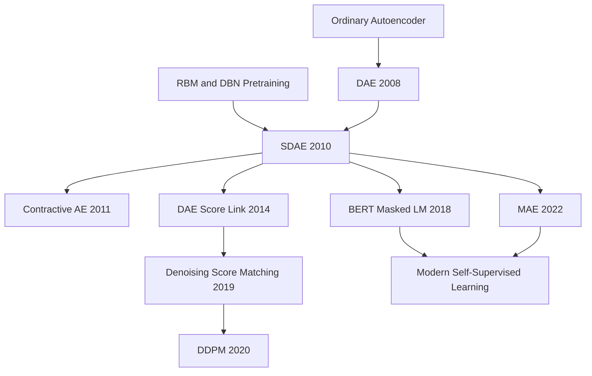

# Stacked Denoising Autoencoders — Turning Local Denoising into Deep Representation Pretraining

> **In December 2010, Pascal Vincent, Hugo Larochelle, Isabelle Lajoie, Yoshua Bengio, and Pierre-Antoine Manzagol published [Stacked Denoising Autoencoders](https://www.jmlr.org/papers/v11/vincent10a.html) in *JMLR* 11(110).** The paper did not invent pretraining, and it did not invent autoencoders. Its sharper move was to turn an almost childlike game into a deep representation principle: damage the input, then force the network to repair it. Readers in 2010 saw SDAE closing the gap with DBNs across ten classification benchmarks. Readers in 2026 can see a longer echo: BERT's masked tokens, MAE's masked patches, score-based diffusion, and denoising diffusion models all repeat the same local lesson at different scales. **A useful representation is not one that copies the input; it is one that knows where corrupted data should move to get back toward the manifold.**

## TL;DR

Vincent, Larochelle, Lajoie, Bengio, and Manzagol's 2010 *JMLR* paper freed the greedy unsupervised pretraining recipe popularized by [DBNs](2006_dbn.md) from the machinery of RBMs. Each layer samples a corrupted input $x_tilde ~ q_D(x_tilde|x)$ and trains an autoencoder to minimize $L(x, g_theta(f_theta(x_tilde)))$: reconstruct the clean input, not the damaged one. That local denoising criterion blocks the easiest failure mode of an ordinary autoencoder, namely identity copying, and forces the hidden representation to capture stable structure in the input distribution. In Table 3, a three-layer SDAE systematically beats ordinary stacked autoencoders and is statistically tied with, or better than, DBN-3 / SVM-RBF on most of the ten benchmarks, including MNIST-basic, rotated MNIST, bg-img-rot, rectangles, and rect-img.

The paper's historical role is larger than “one more autoencoder variant.” It states an early self-supervised learning template in unusually clean form: **create a local damage process, then use prediction or reconstruction to make the model learn the data manifold**. Masked language modeling, masked image modeling, [MAE (2022)](../era4_foundation_models/2022_mae.md), score matching, and diffusion models later scale the same idea with different architectures and losses. The counterintuitive lesson is that the noise is not merely a regularizer wrapped around reconstruction. In SDAE, the corruption process is the training signal: when noise pushes samples off the manifold, denoising teaches the network which direction points back toward real data.

---

## Historical Context

### Where Deep Learning Was Stuck Before 2010

In 2010, deep learning was not yet the default answer. It was a research program that had only recently crawled back from the edge of mainstream machine learning. In 2006, Hinton, Osindero, and Teh showed that if one first trained RBMs layer by layer and then fine-tuned the resulting network with a supervised objective, multilayer neural networks could again compete with SVMs on MNIST. That result revived deep learning, but it also left an uncomfortable question: **did a deep network really need RBMs, contrastive divergence, Gibbs sampling, and intractable partition functions just to learn useful representations?**

Mainstream machine learning still preferred shallow models, convex objectives, hand-designed features, or kernels. RBF-SVMs were reliable on many small-data benchmarks; PCA, ICA, and sparse coding were the standard unsupervised feature-learning tools; CNNs had a clear industrial foothold mainly in LeNet-style OCR. Deep sigmoid MLPs trained directly from random initialization often got stuck, both because optimization reached poor basins and because small labeled datasets made generalization fragile. The central question from roughly 2006 to 2010 was therefore not “can we end-to-end train a huge deep net?” It was more local and practical: **can we find a simple unsupervised objective that trains each layer into a useful representation before supervised fine-tuning begins?**

Stacked Denoising Autoencoders appeared in exactly that gap. The method inherited the greedy layer-wise pretraining workflow of DBNs, but replaced the local model at each layer with a denoising autoencoder. Training no longer required a Markov chain, an estimate of a partition function, or binary stochastic hidden units. SDAE removed one of the heaviest probabilistic burdens from the early deep-learning revival and replaced it with a loss that ordinary backpropagation could optimize.

### The Five Threads That Led to SDAE

The first thread was **backpropagation and the difficulty of training deep nets**. Rumelhart, Hinton, and Williams made gradients computable for multilayer networks in 1986, but deep sigmoid networks remained difficult through the 1990s and early 2000s. Bengio and collaborators repeatedly emphasized that when a deep net starts from random initialization, the supervised error signal is both sparse and late; lower layers rarely receive a useful learning signal early enough.

The second thread was **DBN / RBM pretraining**. Hinton's 2002 contrastive divergence made RBMs practical; the 2006 DBN work showed that “unsupervised first, supervised later” could improve optimization and generalization. But DBN's success did not explain which component mattered most. Was it the probabilistic energy-model interpretation? Greedy initialization? Reconstruction-like learning? Or simply a regularization effect?

The third thread was **the awkwardness of ordinary autoencoders**. Bengio et al. had already shown in 2007 that stacked autoencoders could approach DBN performance, but an ordinary AE objective is easy to misread. If the representation is overcomplete, the trivial solution is to copy the input. If the representation is undercomplete, the model may compress, but the compression direction need not align with semantic or classification structure. Ordinary AEs preserve information, but preserving information is not the same as extracting useful structure.

The fourth thread was **local structure in natural images**. Olshausen-Field sparse coding and Bell-Sejnowski ICA had shown that natural images tend to yield Gabor-like edge filters. Vincent and colleagues wanted to know whether an ordinary differentiable autoencoder, without explicit sparsity penalties or probabilistic sampling, could learn similar local edge detectors. The answer came from damaging the input. If part of an image patch is masked or perturbed, the model must use neighborhood statistics to repair it.

The fifth thread was **the plain intuition behind semi-supervised and self-supervised learning**. Humans do not wait for labels before learning the world. Bengio's 2009 survey on deep architectures had already made unsupervised representation learning a central theme: learn something about the input distribution first, then use it for downstream tasks. SDAE turned that intuition into a concrete local criterion: learn stable structure in $P(X)$ so that later training of $P(Y|X)$ starts from a better representation.

### The Authors and the JMLR 2010 Moment

The author list is almost a snapshot of the early Montreal deep-learning revival. Pascal Vincent was the central driver of the denoising-autoencoder line. Hugo Larochelle connected Montreal and Toronto and contributed heavily to deep-architecture benchmarks and empirical pretraining studies. Yoshua Bengio was one of the main figures pushing “deep architectures” back into the center of machine learning. The 38-page *JMLR* paper was not a short conference note. It systematically expanded the 2008 ICML DAE work with an information-theoretic motivation, a geometric interpretation, single-layer feature visualizations, multilayer benchmarks, a generative-sampling attempt, and direct comparisons with DBNs and ordinary stacked autoencoders.

The timing matters. AlexNet had not yet happened. ReLU and Xavier initialization were only beginning to be analyzed systematically. GPU training was not a default tool. BERT, GPT, MAE, and diffusion were not yet part of the vocabulary. In that world, pretraining still looked like the key to making deep networks trainable. From the perspective of 2010, SDAE's contribution was to simplify pretraining beyond RBMs. From the perspective of 2026, it looks like an early and unusually clean rehearsal for masked modeling and denoising generative learning.

## Background and Motivation

### From “Preserving Information” to “Learning Useful Representations”

The paper begins with a deceptively gentle question: what is a good representation? The most primitive answer is infomax: a representation $Y$ should retain information about the input $X$. But if mutual information is the only criterion, an ordinary autoencoder naturally moves toward copying the input. Copying does preserve information, but it may not help a downstream classifier. It can simply carry pixels through a different coordinate system.

Vincent and colleagues make the definition more operational: a good representation should help future tasks learn faster and generalize better. In other words, an unsupervised objective should not merely ask “how much of the input did you remember?” It should ask whether the model captured stable, transferable structure in the input distribution. That move turns the autoencoder from a compression device into a representation-learning device.

### Why Ordinary Autoencoders Learn to Copy

An ordinary autoencoder receives $x$, emits $x_hat$, and is trained to make $x_hat$ close to $x$. If the hidden layer is overcomplete, the network can learn an approximate identity map. If the hidden layer is undercomplete, it is forced to compress, but the compression direction may still be unrelated to semantic structure. A linear AE collapses to a PCA-like subspace; a nonlinear AE with insufficient constraints may learn local blobs or unstructured filters. The natural-image experiment in the paper is blunt: ordinary overcomplete AEs on 12x12 patches do not learn clean structure, whereas sufficiently noisy DAEs learn Gabor-like oriented edges.

The motivation for SDAE is therefore not merely “make reconstruction harder.” It is **make copying fail**. When the input is randomly masked, perturbed with salt-and-pepper noise, or disturbed by Gaussian noise, the model cannot copy pixel identities. It must use correlations in the data distribution to infer the clean input. The hidden representation is then more likely to encode strokes, edges, and local shapes rather than the identity of individual pixels.

### Why Local Denoising Can Support Greedy Pretraining

DBN pretraining had an important engineering advantage: train one layer at a time, keep gradient paths short, solve a small optimization problem, then feed the learned representation to the next layer. SDAE keeps that workflow but replaces each local model with a denoising autoencoder. The first layer learns to map corrupted pixels back to clean pixels; the second layer learns to map corrupted first-layer representations back to clean first-layer representations; the third layer repeats the same idea in a higher representation space. Each layer performs local repair in its own coordinate system.

This explains the phrase “local denoising criterion” in the title. SDAE is not an end-to-end global generative model, and it is not a full manifold-learning algorithm. It asks each layer to know, in a local neighborhood, where a perturbed sample should move. After stacking, that local direction field becomes a useful initialization for high-level representations. The historical charm of SDAE is precisely this: an objective that looks almost too local and too simple was strong enough to support one of the core training workflows of early deep learning.

---

## Method Deep Dive

### Overall Framework: Corrupt, Repair, Stack

The basic unit of SDAE is a denoising autoencoder. Its network shape is almost identical to an ordinary autoencoder: an encoder maps the input to a hidden representation, and a decoder maps that representation back to the input space. The crucial difference is only one line: the encoder sees a corrupted input, while the loss is measured against the clean input.

$$
x_tilde ~ q_D(x_tilde | x)
$$

$$
h = f_theta(x_tilde), x_hat = g_theta_prime(h)
$$

$$
min_{theta, theta_prime} E_{x ~ q_data} E_{x_tilde ~ q_D(.|x)} [ L(x, g_theta_prime(f_theta(x_tilde))) ]
$$

The objective breaks training into three steps. First, sample a corruption process that turns the original example $x$ into $x_tilde$. Second, compute the hidden representation $h$ from $x_tilde$. Third, decode $h$ into $x_hat$ and compare $x_hat$ with the **uncorrupted** $x$. The model is not rewarded for reconstructing $x_tilde$, because that would reward copying the noise. It must recover the clean sample.

Stacking is greedy. After training the first DAE, keep its encoder and map the training set into first-layer representations. Then corrupt those representations and train the second DAE. Repeat upward, concatenate all encoders into a deep MLP, attach a classifier, and fine-tune with a supervised objective. SDAE is therefore not merely a denoiser. It is a layer-wise representation initializer.

### Key Design 1: The Local Denoising Objective

An ordinary AE minimizes $L(x, g(f(x)))$. If the hidden layer has enough capacity, it can learn an approximate identity function. If the model has a bottleneck, it compresses, but the compression direction need not be useful for downstream tasks. SDAE changes the objective to $L(x, g(f(x_tilde)))$, forcing the model to answer a more structured question: **given a locally damaged sample, which features are sufficient to infer the original sample?**

The change looks tiny, but the optimization meaning changes completely. The model can no longer rely on each pixel or dimension itself. If some dimensions are masked to zero, it must predict them from the remaining dimensions. For MNIST, that means learning co-occurrence among strokes. For natural image patches, it means learning local statistics of edges, orientations, and textures.

The paper's geometric interpretation is the deeper point. If real data concentrates near a low-dimensional manifold, corruption tends to move examples away from that manifold. A successful denoising map must move lower-probability perturbed points back toward high-probability regions. SDAE does not learn an explicit manifold equation. It learns a local direction field from noisy neighborhoods back toward the clean data manifold.

### Key Design 2: The Corruption Process Is the Inductive Bias

The paper studies three corruptions: Gaussian noise, masking noise, and salt-and-pepper noise. Gaussian noise is natural for continuous inputs. Masking noise sets random dimensions to zero and later becomes almost the signature operation of self-supervised learning in BERT and MAE. Salt-and-pepper noise flips selected dimensions to extreme values. They share the same role: destroy local visible information while preserving enough context to make repair possible.

The corruption level $nu$ is not cosmetic. Table 2 searches 0%, 10%, 25%, and 40% masking corruption, plus several Gaussian standard deviations. When $nu=0$, SDAE collapses into ordinary SAE. When $nu$ is too large, the input becomes too ambiguous to repair. Moderate noise is useful because it prevents copying while preserving context. In Table 3, the best SDAE-3 settings for MNIST, rotated MNIST, bg-img-rot, rect-img, and related tasks often fall around 10%-25%, showing that light to moderate damage is already enough to produce useful representations.

This is also the boundary between SDAE and ordinary regularization. Bishop 1995 connected training with noise to Tikhonov regularization in certain linear settings, but Vincent and colleagues show that for nonlinear autoencoders, sufficiently strong denoising noise is not equivalent to L2 weight decay. L2-regularized AEs did not learn Gabor-like filters on natural patches; Gaussian-noise DAEs did. The corruption process is not merely shrinking weights. It defines which local variations should be treated as repairable perturbations.

### Key Design 3: Stacking and Supervised Fine-Tuning

SDAE uses the same early-deep-learning workflow as DBN and SAE: each layer sees only the output of the previous layer, and each layer is trained with a local unsupervised objective. After training layer $k$, only the encoder $f_k$ is kept, and the data is passed upward. The final representation is $h_K = f_K(...f_2(f_1(x)))$.

$$
h_1 = f_1(x), h_2 = f_2(h_1), ..., h_K = f_K(h_{K-1})
$$

A supervised head is then added and the whole network is fine-tuned with a classification loss. This final step matters. SDAE pretraining does not claim to solve classification by itself; it places the parameters in a better basin than random initialization. Later work by Erhan et al. framed this as both an optimization effect and a regularization effect: unsupervised pretraining helps find better local minima and biases parameters toward structure in $P(X)$.

### Key Design 4: Why It Learns a Manifold Rather Than Copying

In the small-noise limit, the DAE reconstruction vector has a deep relationship to the score of the data distribution. Alain and Bengio formalized this in 2014: for small Gaussian noise, a reconstruction function $r(x)$ approximately satisfies

$$
r(x) - x approximately sigma^2 score(x)
$$

where $score(x)$ is the gradient of the log density. Intuitively, the DAE's “repair direction” tells us which way the data density increases. That is the bridge from SDAE to score matching and diffusion. SDAE does not train an explicit probability density, but it locally learns directions that move low-probability perturbed points back toward high-probability data regions.

This is why denoising is closer to self-supervised learning than ordinary reconstruction is. The ordinary AE pretext task is too easy; the SDAE pretext task sits at a useful difficulty level, where solving it requires local structure. It does not demand a full generative model of $p(x)$, and it does not rely on labels. It only asks the model to master enough local statistics to repair plausible corruptions.

### Minimal PyTorch Implementation

The following code is a modern PyTorch version of the single-layer objective used by SDAE. It does not implement the paper's full grid search, early stopping, or layer-wise pipeline. It keeps the essential corruption-to-clean reconstruction step.

```python
import torch
from torch import nn
import torch.nn.functional as F

class DenoisingAutoencoder(nn.Module):
    def __init__(self, input_dim: int, hidden_dim: int):
        super().__init__()
        self.encoder = nn.Sequential(nn.Linear(input_dim, hidden_dim), nn.Sigmoid())
        self.decoder = nn.Sequential(nn.Linear(hidden_dim, input_dim), nn.Sigmoid())

    def corrupt(self, x: torch.Tensor, mask_prob: float) -> torch.Tensor:
        keep = torch.rand_like(x).gt(mask_prob).float()
        return x * keep

    def forward(self, x: torch.Tensor, mask_prob: float = 0.25):
        x_tilde = self.corrupt(x, mask_prob)
        h = self.encoder(x_tilde)
        x_hat = self.decoder(h)
        return x_hat, h

model = DenoisingAutoencoder(input_dim=784, hidden_dim=1000)
optimizer = torch.optim.SGD(model.parameters(), lr=0.05)

for x, _ in train_loader:
    x = x.view(x.size(0), -1)
    x_hat, _ = model(x, mask_prob=0.25)
    loss = F.binary_cross_entropy(x_hat, x)
    optimizer.zero_grad()
    loss.backward()
    optimizer.step()
```

A full SDAE freezes the encoder after one layer, trains the next DAE on hidden representations, stacks the encoders, and fine-tunes the resulting classifier. The critical detail in the code is the target of the loss: `binary_cross_entropy(x_hat, x)`. If the target were the masked `x_tilde`, the model would learn to copy damaged inputs and the denoising criterion would disappear.

### Method Comparison with RBM, Ordinary AE, and CAE

| Method | Local objective | Training cost | Learned geometry | Role around 2010 |
|---|---|---|---|---|
| RBM / DBN | Approximate energy-model likelihood with CD | Gibbs sampling and negative-phase approximation | Latent structure in a probabilistic model | Strongest baseline, but complex engineering |
| Ordinary AE / SAE | Reconstruct clean input from clean input | Plain backprop, simplest setup | Can collapse to copying or PCA-like compression | Shows autoencoders can stack, but slightly weaker |
| SDAE | Reconstruct clean input from corrupted input | Plain backprop plus one corruption step | Local denoising direction field / data manifold | Main contribution, near or above DBN |
| Contractive AE | Penalize the encoder Jacobian | Requires Jacobian penalty or approximation | Explicitly suppresses off-manifold sensitivity | 2011 successor that makes robustness explicit |
| Masked AE / BERT | Mask tokens or patches, then predict missing content | Requires large models and large data | Discrete or patch-level denoising representation | Mainstream self-supervised form after 2018 |

The table also locates SDAE historically. It is simpler than RBM, more biased than ordinary AE, less differential bookkeeping than CAE, and a generation earlier than BERT or MAE. It did not have today's scale, but it had already stated the “mask/corrupt then reconstruct/predict” line with unusual clarity.

---

## Failed Baselines

### Baselines That Lost to SDAE or Exposed Their Weaknesses

SDAE's value did not appear in a vacuum. The method proved itself among several strong deep-pretraining baselines around 2010: SVM-RBF represented the shallow kernel tradition, DBN-3 represented probabilistic RBM pretraining, SAE-3 represented ordinary autoencoder pretraining, and randomly initialized MLPs represented the older “just backpropagate through a deep net” route. The point of Table 3 is not a single MNIST number. It is the broader judgment that **changing an ordinary AE reconstruction target into a denoising target usually gives more robust deep representations.**

| Baseline | Why it looked competitive then | Weakness exposed by SDAE | Signal in the paper |
|---|---|---|---|
| Random MLP | Simplest architecture, direct supervised optimization | Deep sigmoid networks from random initialization often get stuck | Three-layer nets without pretraining fail or lag badly on bg-img-rot |
| SVM-RBF | Stable on small benchmarks, convex optimization | Kernel does not learn hierarchical features | SDAE-3 systematically beats SVM-RBF except for bg-rand, reaching best or statistical tie elsewhere |
| DBN-3 | Strongest deep pretraining method from 2006 | RBM/CD/Gibbs sampling is complex engineering | SDAE-3 is tied with or better than DBN-3 on most tasks |
| SAE-3 | Ordinary AE uses simple backprop | Can copy inputs and learn weak local structure | SDAE-3 systematically beats SAE-3, except convex where the difference is not significant |
| L2 AE | Weight decay is classic regularization | Not equivalent to denoising | L2 AE does not learn Gabor-like filters on natural patches |

The most important failed baseline is SAE-3. It uses the same network shape, the same stacking workflow, and the same supervised fine-tuning as SDAE. The difference is almost only $nu=0$ versus $nu>0$. Therefore, when SDAE-3 beats SAE-3 across most tasks, the conclusion is clean: **what works is not the word “autoencoder,” but the local objective of recovering a clean input from a damaged one.**

### Failures and Boundaries Acknowledged by the Paper

First, SDAE does not beat DBN on every task. In Table 3, bg-rand is the clear exception: DBN-3 reports 6.73% error, while SDAE-3 reports 10.30%. This matters. The denoising objective is not universal magic. When random background statistics interact with the label structure in a difficult way, the RBM model or its hyperparameters can still fit the benchmark better.

Second, the noise level must be tuned. The paper emphasizes that coarse search is enough, but $nu$ remains a key hyperparameter. When $nu=0$, SDAE degenerates into ordinary SAE. When $nu$ is too large, the input is damaged so badly that the reconstruction target becomes ambiguous. SDAE benefits from a middle region: enough damage to prevent copying, but not so much that semantic context disappears.

Third, the generative-model attempt is limited. Section 7 tries to turn stacked autoencoders into practical generative models, but the authors are cautious. SDAE's core value is representation learning and classification pretraining, not a complete probabilistic generation process like a DBN. VAE, GAN, and diffusion models later become the mainstream deep generative routes.

Fourth, the experimental scale is still pre-AlexNet scale. The ten benchmarks are systematic, but most are 28x28 image variants plus one music-genre dataset. There is no ImageNet, no web-scale text, and no large CNN or Transformer. SDAE proves that local denoising pretraining is valuable for small-to-medium deep networks. It does not prove that denoising alone wins at every scale.

### The Most Painful Counter-Baseline: SDAE Was Replaced by Its Descendants

SDAE's strongest 2010 selling point was that layer-wise pretraining made deep networks trainable. That necessity was soon weakened by better engineering. Glorot initialization clarified the training difficulty of deep sigmoid and tanh networks in 2010. ReLU made gradient flow easier in 2011. AlexNet used ReLU, dropout, GPUs, and ImageNet to win with direct supervised training in 2012. After BatchNorm in 2015 and ResNet in 2015, the claim that deep nets must be greedily pretrained mostly left the main stage.

This is not a failure of SDAE so much as a change in the conditions that created it. The specific SDAE pipeline faded. The objective's spirit did not. BERT, MAE, and diffusion do not train greedily layer by layer, but they all inherit the logic of “mask or corrupt, then predict or denoise.” The most painful counter-baseline is therefore not a 2010 model. It is SDAE's own post-2018 descendants: **the idea survived, while the original training workflow was replaced.**

## Key Experimental Data

### The Main Table Across Ten Datasets

The main experiment uses three-hidden-layer networks and compares SVM-RBF, one-layer DBN, ordinary stacked autoencoder, three-layer DBN, and three-layer SDAE. The table below extracts the core values from Table 3. All numbers are test error rates; parentheses show the best SDAE corruption level.

| Dataset | SVM-RBF | SAE-3 | DBN-3 | SDAE-3 | Reading |
|---|---:|---:|---:|---:|---|
| MNIST | 1.40 | 1.40 | 1.24 | 1.28 (25%) | SDAE is statistically tied with DBN and better than SVM/SAE |
| basic | 3.03 | 3.46 | 3.11 | 2.84 (10%) | SDAE is best |
| rot | 11.11 | 10.30 | 10.30 | 9.53 (25%) | SDAE is best |
| bg-rand | 14.58 | 11.28 | 6.73 | 10.30 (40%) | DBN is clearly better; SDAE is not universal |
| bg-img | 22.61 | 23.00 | 16.31 | 16.68 (25%) | SDAE is close to DBN |
| bg-img-rot | 55.18 | 51.93 | 47.39 | 43.76 (25%) | SDAE is best, with the largest gain on the hardest variant |
| rect | 2.15 | 2.41 | 2.60 | 1.99 (10%) | SDAE is best |
| rect-img | 24.04 | 24.05 | 22.50 | 21.59 (25%) | SDAE is best |

The main-table conclusion is direct: SDAE-3 is not lucky on one dataset. It is consistently better than SAE-3 across several perturbation types and often ties or beats DBN-3. The bg-img-rot task is especially revealing because it combines background images and rotations, creating the richest set of variations. SDAE reduces the SVM-RBF error from 55.18% to 43.76% and also beats DBN-3's 47.39%.

### Ablations on Depth, Width, and Noise

Section 6.3 further shows that SDAE's advantage grows with deeper and wider networks. On the hardest bg-img-rot benchmark, the authors compare MLP without pretraining, SAE, and SDAE while varying the number of hidden layers from one to three and the hidden width from 1000 to 3000. The ordering is strict: **denoising pretraining > ordinary autoencoder pretraining > no pretraining**. Without pretraining, a three-hidden-layer network is difficult to train successfully. Ordinary AE pretraining helps. Denoising pretraining helps more.

The noise ablation is also important. The paper does not require $nu$ to be tuned with surgical precision; coarse choices such as 10%, 25%, and 40% are enough to find good settings. That supports SDAE as a practical general method. It does not depend on one fragile noise constant. It depends on the mechanism of nonzero, moderate corruption.

### Qualitative Experiments: Gabor Edges and Stroke Detectors

The single-layer experiments are among the paper's most convincing visual evidence. On 12x12 natural image patches, an ordinary undercomplete AE learns local blobs; an ordinary overcomplete AE looks nearly random; L2 weight decay restores some blobs; a Gaussian-noise DAE with sufficiently large noise learns Gabor-like local oriented edge detectors. This echoes Olshausen-Field sparse coding and Bell-Sejnowski ICA, showing that the denoising objective can draw out local orientation structure in natural images.

On MNIST, as masking noise increases, DAE filters move from small local strokes toward larger stroke detectors. That behavior matches the denoising intuition. To repair masked pixels, the model must learn which strokes co-occur and which local shapes belong to a digit structure. It learns not a pixel dictionary, but a set of repairable structures.

### The Real Experimental Lesson

The experiments are not mainly about proving a new absolute state-of-the-art classifier. They answer a more fundamental question: **can denoising serve as a local criterion for deep pretraining?** Table 3, Figure 10, and the natural-image filters all answer yes, and they show that denoising is more robust than ordinary AE pretraining.

That is why the paper's influence outlived the numbers. MNIST 1.28% is no longer important. What matters is that “corrupt-and-reconstruct” was shown to produce stackable, transferable, fine-tunable representations. Later work swapped in larger models, larger datasets, and more complex corruptions, but the basic experimental form did not die.

---

## Idea Lineage

### Before It: From RBM and Autoencoder to Denoising

SDAE has two main ancestors. The first is DBN: Hinton 2006 showed that RBM pretraining could initialize deep networks into trainable regions. The second is the autoencoder line: from Bourlard-Kamp to Hinton-Salakhutdinov 2006 and Bengio 2007 greedy layer-wise training, autoencoders had already been used as unsupervised representation-learning tools. SDAE merges the two lines: keep the DBN layer-wise recipe, remove probabilistic RBM training, and change ordinary AE reconstruction into denoising.

The conceptual shift is subtle. DBN persuaded the field through probabilistic modeling: an RBM was an interpretable latent-variable model, even if it was awkward to train. SDAE persuaded through task design: if the pretext task is good enough, plain backpropagation can learn strong representations. In 2010 this looked like an engineering simplification of DBNs. Later, it became a basic worldview of self-supervised learning.

### Core Graph: How Local Denoising Became Self-Supervised Pretraining



The point of the graph is not that BERT or diffusion directly copied the SDAE architecture. It is that they inherit the same training philosophy: create an information gap, then force the model to fill it from context or neighborhood structure. SDAE denoises pixels or hidden representations. BERT predicts missing tokens. MAE reconstructs missing image patches. Diffusion learns denoising directions across continuous noise levels.

### After It: Masked Prediction, Score Matching, Diffusion

The first afterlife is masked prediction. BERT is not an autoencoder in the old decoder-reconstruction sense, but masked language modeling is still a corruption-reconstruction task: hide some tokens and recover them from context. MAE makes the connection even more visible: mask most image patches and reconstruct the missing ones. SDAE's masking noise is scaled up into high-ratio masking, with a Transformer handling long-range context.

The second afterlife is score matching. Alain and Bengio 2014 showed that regularized autoencoders, especially DAEs, learn reconstruction vectors related to the score of the data distribution in the small-noise limit. That result turned denoising from a representation trick into a way to estimate density geometry. Song and Ermon's 2019 denoising score matching with annealed Langevin dynamics follows the same line: learn scores at multiple noise scales.

The third afterlife is diffusion. DDPM puts denoising at the center of generative modeling: gradually add noise, then train a network to predict the reverse denoising direction. Diffusion models have far richer mathematics, sampling procedures, and scale than SDAE, but the intuition is still recognizable: the model learns the data distribution by learning how corrupted data should move back toward real data. SDAE is local repair; diffusion is multi-step full-distribution repair.

### Common Misreadings

Misreading one: SDAE is just data augmentation with noisy inputs. No. Data augmentation usually keeps labels fixed and trains a supervised predictor. SDAE makes the clean input itself the target and uses noise to define a pretext task. It is not merely feeding noisy data to a classifier; it first learns representations through a noisy-to-clean mapping.

Misreading two: SDAE is just ordinary AE plus regularization. Incomplete. Noise and certain regularizers are connected in linear settings, but the paper's natural-image experiment shows that L2 weight decay and denoising are not the same for nonlinear AEs. The denoising objective changes the conditional dependencies that the model must capture.

Misreading three: SDAE already solved self-supervised learning. It did not. It did not solve large-scale negative sampling, semantic invariance, global visual semantics, language context, or high-quality generation. It solved an earlier and narrower problem: how a local unsupervised criterion can produce stackable deep representations. That problem was small, but its historical position was large.

---

## Modern Perspective

### Assumptions That Did Not Hold Up

The first assumption that did not hold up is: **deep networks must rely on layer-wise unsupervised pretraining to train well**. That was reasonable in 2010, but it was gradually overturned after 2012. ReLU, Xavier/He initialization, dropout, BatchNorm, ResNet, Adam, and large labeled datasets made end-to-end training the default. Almost no mainstream vision or language model today uses SDAE-style greedy layer-wise pretraining.

The second assumption is: **reconstructing pixels is enough to obtain semantic representations**. SDAE is stronger than ordinary AE, but later vision self-supervision often favored contrastive learning because raw pixel reconstruction can overfocus on texture and low-level detail. MAE's success depends on ViT, high masking ratios, an asymmetric encoder-decoder design, and large-scale data. It is not simply 2010 SDAE made bigger.

The third assumption is: **a local manifold story can explain all representation learning**. The manifold intuition is useful, but modern foundation-model representations also involve linguistic compositionality, cross-modal alignment, tool use, chains of reasoning, and human feedback. SDAE's local geometric explanation captures part of denoising, not the full behavior of large models.

### What Time Proved Essential vs. Redundant

What time proved essential is the training paradigm of creating an information gap and making the model fill it. BERT masking, MAE masking, diffusion Gaussian noising, and speech self-supervised masked frames all follow the same family of ideas. SDAE is not their only ancestor, but it is one of the early papers that stated the paradigm with unusual clarity.

Another durable lesson is that local objectives can serve global tasks. Each SDAE layer only performs local denoising, yet final classification improves. BERT only predicts masked tokens, yet improves question answering, reasoning, and extraction. MAE only reconstructs patches, yet improves classification, detection, and segmentation. The pretraining task and downstream task do not need to be identical, as long as the pretraining task forces transferable structure to emerge.

What became redundant is the greedy stacking, sigmoid encoders, manual noise grids, and small-data benchmarks. Modern models are not trained one layer at a time. Decoders are no longer shallow sigmoid reconstruction heads. Noise schedules often become part of the system design. Benchmarks expanded from 28x28 images to web-scale text, image, and video. SDAE's idea survived; most of its engineering form aged out.

### Side Effects the Authors Could Not Have Foreseen

The first side effect is that SDAE gave masked modeling an early mental model. BERT does not present itself as an SDAE descendant, but the intuition “hide part of the input, predict the original content” is very close. SDAE makes it easier to understand why masked-token prediction is not a trivial fill-in-the-blank game, but a way to force contextual structure into a representation.

The second side effect is that SDAE helped lay a bridge between denoising and scores before generative modeling adopted it. The 2010 paper uses manifold projection to explain DAE. Alain and Bengio 2014 formalize the score relationship. Score-based and diffusion models in 2019-2020 scale the same line into a leading generative paradigm. SDAE is not diffusion, but it put the phrase “denoising learns local geometry of the data distribution” into the deep-learning vocabulary early.

The third side effect is that it made “noise as task, not just perturbation” feel natural. Many training tricks treat noise as regularization or robustness enhancement. SDAE turns noise into a source of label-free supervision. That view later influenced masking, inpainting, jigsaw prediction, context prediction, speech reconstruction, and a wide family of pretext tasks.

### If Written Today

If SDAE were rewritten in 2026, the encoder would not be a three-layer sigmoid MLP. It would likely be a Transformer or a ConvNeXt/ViT-style backbone. Corruption would not be limited to randomly zeroing input dimensions. It would include structured masking, blockwise masking, semantic corruption, and multi-scale noise. The decoder might be a lightweight prediction head or a diffusion denoiser.

The objective would also be more cautious. For images, one might not reconstruct RGB directly, but patch tokens, VAE latents, HOG-like features, or tokenizer embeddings, reducing low-level texture shortcuts. For language, the objective might be masked tokens, span corruption, or denoising sequence-to-sequence prediction. For generation, single-step denoising would expand into multi-noise-scale score or diffusion objectives.

The core question would not change: what should a model learn from unlabeled data? SDAE's answer remains sharp. Show the model a locally damaged world, then require it to recover a plausible clean state of that world. As long as unlabeled data remains far cheaper and more abundant than labels, that answer will not go stale.

## Limitations and Future Directions

### Limitations Acknowledged by the Authors

The paper acknowledges that SDAE still requires model selection: number of layers, hidden units, learning rate, pretraining epochs, corruption type, and corruption level all matter. It also acknowledges that SDAE is not a natural generative model in the way DBN is, because an autoencoder is not a normalized probabilistic model. The bg-rand exception in Table 3 shows that SDAE does not guarantee a win on every distribution.

The paper is also primarily empirical rather than theoretically complete. The manifold interpretation is insightful, but it is not a convergence proof. The mutual-information lower-bound discussion motivates autoencoders, but it does not prove that the denoising objective must produce the best downstream representation. That is a long-standing problem in representation learning, not something one paper could settle.

### Limitations from a 2026 Viewpoint

From today's perspective, the largest limitation is scale. SDAE's experiments live in the 2007-2010 benchmark universe: MNIST variants, rectangles, convex shapes, and Tzanetakis music genre. The method was never tested under ImageNet, JFT, LAION, Common Crawl, modern accelerators, or modern frameworks. Many conclusions remain useful for objective design, but they do not directly transfer into a foundation-model recipe.

The second limitation is that reconstruction can stay too low-level. Pixel reconstruction can spend capacity on color, texture, and local detail rather than semantic abstraction. Modern MAE mitigates this with high masking ratios, ViT global context, and a lightweight decoder. Diffusion turns reconstruction into generative modeling. SDAE remains in the shallower regime of local statistics.

The third limitation is that it does not address alignment. SDAE learns input-distribution structure, not human preference, instruction following, factual reliability, or safety boundaries. It belongs to the pretraining prehistory of large models, not to the full product paradigm of aligned foundation models.

### Improvements Later Work Validated

One improvement is from single-step denoising to multi-step denoising. Diffusion shows that multiple noise scales and iterative reverse processes can turn denoising from a representation-learning tool into a strong generative model. Another improvement is from pixel reconstruction to masked semantic prediction. BERT, T5, MAE, BEiT, and data2vec all explore what should be predicted after masking in different modalities.

A third improvement is from greedy layer-wise training to end-to-end pretraining. Modern models usually train the whole network at once, relying on normalization, residual connections, optimizers, and large data for stability. A fourth improvement is from hand-designed generic corruption to task-relevant corruption: block masks in vision, time-frequency span masks in speech, span corruption in language, and even whole-modality masking in multimodal systems. SDAE's $q_D$ became a design interface in modern systems.

## Related Work and Insights

### Relationship to Four Neighboring Lines

**vs DBN**: DBN wins on early historical priority and probabilistic completeness; SDAE wins on simplicity, differentiability, and avoiding sampling. DBN told the world that deep networks could be pretrained. SDAE told the world that pretraining did not have to be tied to RBMs.

**vs Ordinary Autoencoder**: Ordinary AE reconstructs; SDAE repairs. That distinction determines whether the model can easily copy its input. The lesson is that a pretext task must not be too easy. A self-supervised objective that is too easy rarely learns transferable structure.

**vs Contractive Autoencoder**: CAE explicitly penalizes the encoder Jacobian to make representations insensitive to local perturbations. SDAE implicitly learns robust directions from corrupted data. Both learn local manifold geometry; one uses an explicit differential penalty, the other a noisy-to-clean mapping.

**vs BERT / MAE / Diffusion**: These descendants do not preserve the SDAE architecture, but they inherit the corruption objective. BERT turns dimension masking into token masking. MAE turns it into patch masking. Diffusion turns it into multi-noise-time denoising. SDAE is the local, shallow, small-data version; they are the global, deep, large-data versions.

## Resources

### Paper, Follow-Ups, and Further Reading

- 📄 [JMLR paper page](https://www.jmlr.org/papers/v11/vincent10a.html)
- 📄 [PDF](https://www.jmlr.org/papers/volume11/vincent10a/vincent10a.pdf)
- 📚 Precursors: [Hinton et al. 2006 DBN](https://www.cs.toronto.edu/~hinton/absps/fastnc.pdf), [Vincent et al. 2008 DAE](https://www.cs.toronto.edu/~larocheh/publications/icml-2008-denoising-autoencoders.pdf), [Bengio et al. 2007 Greedy Layer-Wise Training](https://proceedings.neurips.cc/paper/2006/hash/5da713a690c067105aeb2fae32403405-Abstract.html)
- 📚 Follow-ups: [Erhan et al. 2010 Why Does Unsupervised Pre-training Help](https://www.jmlr.org/papers/v11/erhan10a.html), [Rifai et al. 2011 Contractive Auto-Encoders](https://icml.cc/2011/papers/455_icmlpaper.pdf), [Alain & Bengio 2014 Regularized Auto-Encoders](https://www.jmlr.org/papers/v15/alain14a.html)
- 📚 Modern lineage: [BERT](https://arxiv.org/abs/1810.04805), [Denoising Score Matching](https://arxiv.org/abs/1907.05600), [DDPM](https://arxiv.org/abs/2006.11239), [MAE](https://arxiv.org/abs/2111.06377)
- 🌐 [中文版](/era1_foundations/2010_stacked_dae/)


---

> 🌐 [中文版](/era1_foundations/2010_stacked_dae/) · 📚 awesome-papers project · CC-BY-NC