# ReLU — How max(0, x) Turned Deep Networks from "Lab Toy" to "Industrial Cornerstone"

> **April 11, 2011. Glorot, Bordes, and Bengio (Universite de Montreal) publish the 9-page paper [Deep Sparse Rectifier Neural Networks](http://proceedings.mlr.press/v15/glorot11a/glorot11a.pdf) at AISTATS 2011.**
> A severely under-recognized paper — it replaced the 20-year-default sigmoid / tanh with an activation so simple it barely looks like a paper, $\max(0, x)$, and showed deep nets train fine without [Hinton's 2006 (DBN)](2006_dbn.md) unsupervised pretraining — in fact, accuracy went up.
> ReLU's revolution wasn't novelty (McCulloch-Pitts 1943 / Fukushima 1980 had used it), but that this paper **systematically proved for the first time** three things: (1) non-saturating gradients make deep nets trainable; (2) sparse activation (~50% zero output) actually improves generalization; (3) compute is 6× faster than sigmoid.
> One year later [AlexNet](../era2_deep_renaissance/2012_alexnet.md) fused it with GPU + Dropout + ImageNet into the deep-learning fuse — **ReLU is the default activation of every 21st-century deep network and the patriarch of LeakyReLU / GELU / SwiGLU's entire family**.

## TL;DR

Glorot, Bordes, and Bengio's 9-page 2011 AISTATS paper **uses an activation function so brutally simple it looks indefensible — $f(x) = \max(0, x)$ — to shatter the 2006–2010 industry-wide creed that "deep networks must use unsupervised pretraining to be trainable"**. The paper argues from three angles — **biological plausibility + optimisation convenience + representational sparsity** — that ReLU dominates sigmoid/tanh, and empirically demonstrates that a purely supervised deep MLP **reaches state-of-the-art on MNIST (1.43% error), NORB (16.4%), CIFAR-10 (~50%), and NISTP (8.8%) with no RBM/DBN/autoencoder pretraining whatsoever**. This is not a small improvement — it is **a paradigm flip**: it became Krizhevsky's direct academic justification for choosing ReLU in AlexNet (2012); within 18 months it pushed unsupervised pretraining from "mandatory" to "optional"; and it cleared the runway for deep CNNs to grow from 6 layers (AlexNet) to 152 (ResNet) and then 1000+ (DenseNet). Today **99% of all deep networks (GPT-5, Sora, AlphaFold 4 included) use a direct descendant of ReLU as their hidden activation** — GELU, SiLU, SwiGLU all trace back to that humble piecewise-linear hinge in this 9-page paper.

---

## Historical Context

### What was the deep-learning community stuck on in 2010?

To grasp the disruptive power of the ReLU paper, you must view 2006–2010 — the "first phase of the deep-learning renaissance" — as **a five-year era held captive by a single mistaken belief**.

In 2006 Hinton published *A Fast Learning Algorithm for Deep Belief Nets* in *Neural Computation*, using greedy layer-wise RBM pretraining + supervised fine-tune to push 4-layer networks to 1.25% error on MNIST — **the first revival of "trainable deep networks" after a 20-year drought**. For five solid years afterwards, the entire field congealed around a near-religious consensus:

> **"You cannot train deep networks with vanilla supervised backprop alone; you must first do unsupervised pretraining to land the weights in a good basin of attraction, then fine-tune. Otherwise it will not work."**

The "evidence" for this consensus was overwhelming. Hinton 2006 (DBN), Bengio 2007 (stacked autoencoder), Vincent 2008 (denoising autoencoder), Larochelle 2009 (large-scale ablation), Erhan 2010 (*Why does unsupervised pre-training help deep learning?* JMLR) — paper after paper showed in ablation tables that **on MNIST, removing pretraining inflates a deep MLP's error from ~1% to ~3-10%**. Erhan's 2010 review even elevated "pretraining = optimisation regulariser" to a theoretical principle, and **almost every 2007–2010 ICML/NeurIPS deep-learning paper was written inside this frame**.

But Glorot's group (also Bengio's lab) was already smelling smoke. **The real bottleneck might not be "weight initialisation" — it might be the activation function itself.** Glorot & Bengio 2010, *Understanding the difficulty of training deep feedforward neural networks*, had already diagnosed the failure mechanism: sigmoid's non-zero-centred output and saturation to 0/1 in the top layer caused severe vanishing gradients by layer 4 or 5; tanh was slightly better but still saturated. **That paper proposed Xavier init alongside, but the authors knew init was a band-aid — the real disease was sigmoid's max-derivative of 0.25 plus saturating-region zeros.**

A second independent signal arrived in 2010: **Nair & Hinton's ICML paper *Rectified Linear Units Improve Restricted Boltzmann Machines*** swapped RBM's sigmoid binary unit for a "noisy rectified linear unit" (sampling $\max(0, z + \mathcal{N}(0, \sigma(z)))$) and beat standard RBM on NORB and Caltech-101. **At ICML, Hinton publicly hinted for the first time that "perhaps sigmoid is wrong"** — but he still wrapped ReLU inside RBM and did not dare say "throw away unsupervised pretraining."

Stack these three signals and the 2011 ReLU paper is the **kick that finished the play**: it pulled ReLU out of RBM, plunked it onto the outermost layer of a purely supervised deep MLP, and used four benchmarks to prove "no pretraining needed for SOTA." What this kick shattered was not sigmoid; it was the canon of "unsupervised pretraining as a necessity."

The concrete pain point in 2010:

> **deep network + sigmoid + backprop almost certainly fails at ≥5 layers** — by the time the gradient reaches layer 4 it has decayed by $0.25^4 \approx 4\times 10^{-3}$ to noise level; combined with sigmoid's non-zero-centred output causing an ill-conditioned Hessian, **purely supervised deep training was effectively a dead end from 2006 to 2010**.

Everyone bypassed this wall with RBMs/AEs. Glorot's paper said: *the wall was built by the activation itself; replace the wall with a staircase and the problem disappears.*

### The 6 immediate predecessors that pushed ReLU out

- **Hahnloser et al. 2000 (*Nature*: Digital selection and analogue amplification coexist in a cortex-inspired silicon circuit)**: the first use of $\max(0, x)$ in a neuromorphic silicon circuit as a biologically reasonable approximation — cortical neurons' firing-rate-vs-input-current curve is essentially **linear rectification** (no fire below threshold, linear rise above). **This paper is ReLU's "biological-plausibility certificate"** — Glorot's §2 leans on it heavily to argue ReLU is more brain-like than sigmoid.
- **Dugas et al. 2001 (NIPS: Incorporating Second-Order Functional Knowledge for Better Option Pricing)**: proposed **softplus** $g(x) = \log(1 + e^x)$ as a smooth surrogate for ReLU. Softplus is everywhere-differentiable but loses sparsity (always positive) and was later overtaken by ReLU. **One of the central baselines in Glorot's paper** — proving "smoothness is not what matters; sparsity is."
- **Jarrett, Kavukcuoglu, Ranzato, LeCun 2009 (ICCV: What is the best multi-stage architecture for object recognition?)**: empirically found in vision CNNs that "$\max(0, |x|)$" (rectified absolute value) — a rectifying non-linearity — beat sigmoid/tanh on Caltech-101. But Jarrett never generalised this to plain deep MLPs and **never realised that sparsity was the key** — Glorot picked up the thread and corrected the diagnosis.
- **Nair & Hinton 2010 (ICML: Rectified Linear Units Improve Restricted Boltzmann Machines)**: introduced ReLU into RBMs in the "noisy rectified" form and got SOTA on NORB. **This was ReLU's first formal entry into the mainstream deep-learning community** — but Hinton kept it tied to RBM. Glorot saw this and asked: "If it works inside RBM, what if we strip away the RBM and let a purely supervised network use it?" — exactly the research path of the 2011 paper.
- **Glorot & Bengio 2010 (AISTATS: Understanding the difficulty of training deep feedforward neural networks)**: **the same authors' previous-year paper** — systematic diagnosis of sigmoid's failure mechanism in deep nets + introduction of Xavier init. **The most important "theoretical bedding" for the 2011 ReLU paper** — Glorot had completed the death-row paperwork on sigmoid; the 2011 paper was "OK, sigmoid is dead, can ReLU take the throne?"
- **Hinton 2006 *Science* (Reducing the dimensionality of data with neural networks)** + **the DBN paper**: defined the "unsupervised pretraining + supervised fine-tune" pipeline that became standard 2006-2010. **This pipeline is the boss the ReLU paper went out to slay** — Glorot's §6 deliberately includes "with vs. without pretraining" controls, and ReLU shrank pretraining's advantage from +5% to +0.1%, **issuing pretraining's death sentence in the large-data regime**.

### What was the author team doing?

- **Xavier Glorot** (first author): a PhD student in Bengio's lab, who had just published the Xavier init paper in 2010. His core research question was "why are deep nets hard to train"; once he had stared at it from the init angle, the natural next thought was "should we also replace the activation?" Glorot later joined DeepMind, but the ReLU paper made him **one of the highest-impact young researchers per paper in the history of deep learning** — every PyTorch `nn.Linear` defaults to "Xavier init" or "Glorot init" today.
- **Antoine Bordes** (second author): postdoc in Bengio's lab at the time, focused on NLP / knowledge graphs. He later joined Facebook AI Research (FAIR) as a research director, eventually heading the FAIR Paris lab. Bordes's presence kept the ReLU paper from being purely a "vision toy" — the dedicated NISTP (handwritten character) experiment owes something to his NLP background.
- **Yoshua Bengio** (third author): already one of the deep-learning triumvirate at the time, head of the LISA lab at Université de Montréal. Bengio's lab in 2007–2011 was **one of the world's two centres for deep-learning research** (the other being Hinton's Toronto). Bengio was a core figure of the unsupervised-pretraining school (stacked autoencoders came from his lab), but his name on this paper means **the pretraining school personally betrayed itself — a rare display of academic honesty**.
- **Lab posture**: Bengio's lab in 2010 was undergoing a subtle paradigm shift — moving from "probabilistic graphical models + RBMs" toward "engineering optimisation + larger networks." 2010 Xavier init was the prelude; 2011 ReLU was the climax; 2013 Maxout (Goodfellow, same lab) and 2014 GAN (also Goodfellow) were continuations. **Glorot's paper was the most consequential single move in this shift.**

### State of industry, compute, data

- **Compute**: NVIDIA Fermi GPUs (GTX 580, 512 CUDA cores, 1.5 GB GDDR5) had just matured in 2010-2011. The Glorot experiments **still ran mostly on CPU** (deep-learning frameworks for GPUs were in the awkward Theano 0.3 era), but in 2012 AlexNet trained ReLU CNNs on the same GTX 580 and **finished ImageNet in 5–6 days** — industrial vindication of the ReLU paper one year later.
- **Data**: MNIST (60k), NORB (24k), CIFAR-10 (60k) were the three reigning benchmarks; ImageNet (released 2009) was still new, with the 2010 ILSVRC dominated by SIFT + shallow SVM. **All Glorot experiments ran at < 100k samples** — which makes ReLU's strength even more striking: even on small data, dropping pretraining still won SOTA.
- **Frameworks**: Bengio's lab released **Theano 0.3** in 2010 — the first Python deep-learning framework with auto-diff + GPU support. **The ReLU paper's experiment code was written in Theano**; the team open-sourced network configuration scripts (most no longer reproducible today). Theano is the spiritual grandfather of PyTorch; the ReLU + Theano combination was an early prototype of deep learning's industrial form.
- **Industry climate**: in 2011, deep learning **barely existed in industry** — Google Brain would not be founded for another year (2012), Facebook AI Research two more (2013), DeepMind was still in stealth mode. **The 2011 academic consensus was "deep learning is an interesting niche"** — SVMs, graphical models, decision trees still dominated AAAI/IJCAI. **The ReLU + AlexNet combination would, 18 months later, totally rewrite this landscape.**

---

## Method Deep Dive

### Overall framework and algorithmic skeleton

The "method" section of the ReLU paper is essentially a minimal activation function definition + three theoretical analysis dimensions. The whole paradigm fits in 5 lines of code:

```python
import torch.nn as nn

# Old paradigm (pre-2010): sigmoid + RBM pretraining + supervised fine-tune
old_net = nn.Sequential(
    nn.Linear(784, 1000), nn.Sigmoid(),
    nn.Linear(1000, 1000), nn.Sigmoid(),
    nn.Linear(1000, 1000), nn.Sigmoid(),
    nn.Linear(1000, 10)
)
# Training: layer-wise RBM pretraining → then supervised fine-tune

# New paradigm (Glorot 2011): ReLU + direct supervised
new_net = nn.Sequential(
    nn.Linear(784, 1000), nn.ReLU(),
    nn.Linear(1000, 1000), nn.ReLU(),
    nn.Linear(1000, 1000), nn.ReLU(),
    nn.Linear(1000, 10)
)
# Training: direct SGD + cross-entropy
```

ReLU's mathematical definition:
$$
f(x) = \max(0, x) = \begin{cases} x & \text{if } x > 0 \\ 0 & \text{if } x \leq 0 \end{cases}
$$

Derivative (non-differentiable at $x = 0$, conventionally set to 0 or 1 in practice):
$$
f'(x) = \begin{cases} 1 & \text{if } x > 0 \\ 0 & \text{if } x \leq 0 \end{cases}
$$

Compared with contemporary activation functions:

| Activation | Formula | Positive-region gradient | Compute cost | Output range | Sparsity |
|-----------|---------|--------------------------:|--------------|--------------|----------|
| Sigmoid | $1/(1+e^{-x})$ | $\leq 0.25$ | high (has exp) | $(0, 1)$ | no |
| Tanh | $(e^x-e^{-x})/(e^x+e^{-x})$ | $\leq 1$ | high (has exp) | $(-1, 1)$ | no |
| Softplus | $\ln(1+e^x)$ | $\leq 1$ | high (has exp+log) | $(0, +\infty)$ | no |
| **ReLU** | $\max(0, x)$ | **= 1** | **very low** | $[0, +\infty)$ | **yes** |
| Hard Tanh | $\max(-1, \min(1, x))$ | $\leq 1$ | very low | $[-1, 1]$ | no |

ReLU's revolution: **positive-region gradient identically 1 (no vanishing) + ultra-fast compute + naturally sparse activations** — three properties no other activation could simultaneously deliver.

### Key Design 1: max(0, x) — minimal solution to vanishing gradients

**Function**: by setting the activation function's positive region to identity (gradient identically 1), fundamentally eliminate deep network's vanishing gradient problem.

**Core idea and formulas**:

Consider an $L$-layer network where layer $l$'s activation is $h^{(l)} = f(W^{(l)} h^{(l-1)} + b^{(l)})$. During backprop, the gradient w.r.t. layer-1 weights $W^{(1)}$ is:
$$
\frac{\partial \mathcal{L}}{\partial W^{(1)}} = \frac{\partial \mathcal{L}}{\partial h^{(L)}} \cdot \prod_{l=2}^{L} \left( W^{(l)} \cdot \text{diag}(f'(z^{(l)})) \right) \cdot \frac{\partial h^{(1)}}{\partial W^{(1)}}
$$

where $z^{(l)} = W^{(l)} h^{(l-1)} + b^{(l)}$. **The gradient's decay/amplification factor is $\prod f'(z^{(l)})$**:

- **Sigmoid**: $f'(z) = \sigma(z)(1-\sigma(z)) \leq 0.25$, after 10 layers gradient $\sim 0.25^{10} \approx 10^{-6}$ (vanishing)
- **Tanh**: $f'(z) = 1 - \tanh^2(z) \leq 1$, but saturation regions near 0, deep layers still attenuate
- **ReLU**: $f'(z) = 1$ (when $z > 0$) or $0$ (when $z \leq 0$). **For active neurons, gradient passes 100%** — no decay at all

**Key properties**:
1. **Gradients along "active paths" preserved exactly**: as long as a forward path's ReLUs are all active ($z > 0$), gradient flows losslessly to bottom layers
2. **"Dead neuron" problem**: if a neuron stays $z < 0$ for long, its gradient is permanently 0 (never learns). This is ReLU's cost, also driving Leaky ReLU / PReLU / ELU follow-ups
3. **Implicit sparsity**: about 50% of neurons are inactive (output 0) at any moment

**Why it works**: ReLU shifts the role of "activation function" from "non-linear approximator" to "gating switch" — active neurons provide linear channels, inactive neurons are like pruning. This "piecewise linear + on/off gating" structure is mathematically equivalent to a **very deep piecewise-linear function** with strong expressivity (each active path corresponds to one linear subspace).

**Inspiration to follow-up work**:
- **Maxout** (Goodfellow 2013): generalize ReLU to max(W₁x, W₂x)
- **Leaky ReLU** (Maas 2013): negative region set to $\alpha x$ ($\alpha = 0.01$) to prevent dead neurons
- **PReLU** (He 2015): $\alpha$ learnable
- **ELU** (Clevert 2015): negative region $\alpha(e^x - 1)$ to push average output near 0
- **GELU** (Hendrycks 2016): Gaussian error linear unit, used by BERT / GPT
- **Swish / SiLU** (Ramachandran 2017): $x \cdot \sigma(x)$, self-gating
- **SwiGLU** (Shazeer 2020): default FFN activation in LLaMA / Mistral / Qwen

### Key Design 2: Sparsity — naturally emerging features

**Function**: through ReLU's hard threshold (output 0 when $x \leq 0$), activations naturally produce 50-90% zero values, no extra L1 regularization needed.

**Core idea and formulas**:

Define a layer's "activation sparsity":
$$
\text{sparsity} = \frac{1}{N \cdot d} \sum_{i=1}^{N} \sum_{j=1}^{d} \mathbb{1}[h_{ij} = 0]
$$
where $N$ is batch size, $d$ is layer dimension.

ReLU networks typically achieve **50-90% sparsity** (paper Figure 3). This is **conditional sparsity**: which neurons are active depends on input, but only few are active at any moment.

**Key properties**:
1. **Biological plausibility**: real cortical neurons have only 1-4% active at any time (V1 visual neuron measurements)
2. **Feature disentanglement**: different inputs activate different neuron subsets, features more independent and interpretable
3. **Save compute** (theoretically): with hardware support, 0 values can be skipped (sparse compute)
4. **Noise robustness**: sparse representations are insensitive to small perturbations

**Why it works**: sparsity functionally turns "fully connected" networks into "dynamic sparse-connected" networks — each input activates a different sub-network. This is implicit model averaging (different inputs select different model paths), giving a regularization effect.

**Follow-up validation**:
- **Bengio 2013** empirical: ReLU sparsity does deliver better generalization
- **Sparse coding** theory (Olshausen & Field 1996): sparse representations are the optimal solution for efficient coding
- **Dropout** (Srivastava 2014): synergistic with ReLU — dropout makes ReLU's sparsity more random

### Key Design 3: Compute efficiency and hardware friendliness

**Function**: drop activation function compute cost from "floating-point exponential" to "one comparison + one mux", reducing deep network training cost 5-10×.

**Core idea and comparison**:

| Operation | Unit time (CPU cycles, approx) | Notes |
|-----------|----------------------:|-------|
| Add | 1 | fastest |
| Multiply | 3-5 | fast |
| **Compare** | **1-2** | ReLU uses this |
| Divide | 20-30 | slow |
| Exp $e^x$ | 50-100 | sigmoid / tanh use this |
| Log $\ln$ | 50-100 | softmax uses this |

**Typical implementation**:

```python
# Sigmoid (slow)
def sigmoid(x):
    return 1.0 / (1.0 + np.exp(-x))   # has exp, slow

# Tanh (slow)
def tanh(x):
    e_pos = np.exp(x)
    e_neg = np.exp(-x)
    return (e_pos - e_neg) / (e_pos + e_neg)  # 2× exp, even slower

# ReLU (fast)
def relu(x):
    return np.maximum(0, x)   # one compare, ultra-fast

# ReLU backward (minimal)
def relu_backward(grad_out, x):
    return grad_out * (x > 0)   # one compare + one multiply
```

**Real speedup**: paper Section 4.2 reports ReLU networks train **3-6× faster** than tanh networks (depending on network size and hardware). On GPU, ReLU's advantage is greater — ReLU is element-wise, perfectly parallelizable, while sigmoid's exp is less efficient on GPU.

**Hardware impact**:
1. **GPU era**: ReLU is one of the simplest GPU kernels; all deep learning frameworks heavily optimize it
2. **Quantization era**: ReLU's 0 values fit naturally in INT8 quantization
3. **Sparse hardware**: future sparse accelerators (e.g., NVIDIA Hopper) can exploit ReLU's sparsity

### Implementation details and initialization

The ReLU paper offers companion initialization recommendations:

| Initialization | Formula | Suitable for |
|----------------|---------|--------------|
| Xavier (Glorot 2010) | $W \sim U[-\sqrt{6/(n_{in}+n_{out})}, \sqrt{6/(n_{in}+n_{out})}]$ | Sigmoid / Tanh |
| **He (Kaiming 2015)** | $W \sim N(0, \sqrt{2/n_{in}})$ | **ReLU** |
| Uniform [-0.01, 0.01] | uniform small | any |

**He initialization** is specifically designed for ReLU: since ReLU sets negatives to 0, forward variance is half that of sigmoid / tanh, so weight init must scale up by $\sqrt{2}$ to compensate. This is a key engineering advance after the ReLU paper (He et al. 2015).

**Counter-measures for ReLU "dead neurons"**:
1. **Leaky ReLU**: $f(x) = \max(\alpha x, x)$, $\alpha = 0.01$
2. **PReLU**: $\alpha$ learnable
3. **Correct initialization** (He init) + Batch Normalization can substantially reduce dead neurons
4. **Learning rate warmup** prevents early training from destroying ReLU's activation distribution

---

## Failed Baselines

### Opponents that lost to ReLU — the "activation function benchmarks" of 2011

When ReLU was published in 2011, the "mainstream" of activation functions was split between sigmoid line and tanh line. Glorot's team did a systematic comparison in paper Section 4:

| Opponent | Year proposed | Test error on NORB | Why it lost to ReLU |
|----------|--------------|---------------------:|---------------------|
| **Sigmoid** ($\sigma(x)$) | 1980s | 18.4% | vanishing gradient; non-zero-centered; slow compute |
| **Tanh** ($\tanh(x)$) | 1980s | 17.6% | vanishing gradient (saturation); slow compute |
| **Softplus** ($\ln(1+e^x)$) | 2001 | 17.0% | slow compute; not sparse |
| **Hard Tanh** ($\max(-1, \min(1, x))$) | 2010 | 16.9% | not sparse; bounded gradient on negatives |
| **|tanh|** (Jarrett 2009) | 2009 | 16.8% | not sparse; non-zero-centered |
| **Sigmoid + RBM pretraining** | 2006 | 16.5% | complex; multi-stage training |
| **ReLU** ($\max(0, x)$) | **2011** | **16.4%** | **wins: fast + non-vanishing + sparse** |

**Takeaways from this table**:
1. **ReLU's accuracy edge is actually small** (16.4% vs Sigmoid+RBM 16.5%); the key is **simplicity + training speed**
2. **No RBM pretraining needed** — the biggest contribution of the ReLU paper
3. **Training 3-6× faster than tanh** — turning deep network training from "days" into "hours"

### Failures the paper acknowledged — scenarios where ReLU struggles

Glorot paper Section 4.4 honestly lists ReLU's limits:

| Scenario | ReLU performance | Reason |
|----------|------------------|--------|
| **Dying ReLU** | 30-50% neurons permanently dead late in training | learning rate too high or wrong init causes z<0 permanently |
| **Negative-value information loss** | negative inputs clipped to 0 | some tasks (e.g., generative) need negatives |
| **Non-zero-centered output** | output ≥ 0 | like sigmoid, causes same-sign weight updates downstream |
| **Non-differentiable at 0** | $f'(0)$ undefined | engineered to 0 or 1, but theoretically a subgradient |
| **Unbounded large values** | output unbounded | can cause activation explosion (mostly mitigated by BatchNorm) |
| **Generative tasks** | worse than tanh | VAE / GAN decoders still prefer tanh (bounded output) |

### Opponents striking back a year later — the rise of ReLU variants

ReLU's huge success (AlexNet using ReLU won ImageNet in 2012) sparked many improvements:

| Follow-up work | Year | Breakthrough | Improvement over ReLU |
|----------------|------|--------------|------------------------|
| **Maxout** (Goodfellow 2013) | 2013 | $\max(W_1 x, W_2 x)$ | generalize ReLU to piecewise linear |
| **Leaky ReLU** (Maas 2013) | 2013 | $\max(\alpha x, x)$, $\alpha=0.01$ | solves dead neurons |
| **PReLU** (He 2015) | 2015 | $\alpha$ learnable | network-adaptive |
| **ELU** (Clevert 2015) | 2015 | negative region $\alpha(e^x-1)$ | average output near 0 |
| **SELU** (Klambauer 2017) | 2017 | self-normalizing | train ultra-deep MLPs without BN |
| **GELU** (Hendrycks 2016) | 2016 | $x \cdot \Phi(x)$ (Gaussian CDF) | BERT / GPT default |
| **Swish / SiLU** (Ramachandran 2017) | 2017 | $x \cdot \sigma(x)$ | self-gating; EfficientNet uses |
| **Mish** (Misra 2019) | 2019 | $x \cdot \tanh(\text{softplus}(x))$ | slightly better on some CV tasks |
| **GLU family** (GLU/GeGLU/SwiGLU) | 2017+ | $\sigma(W_1 x) \odot (W_2 x)$ | LLaMA / Mistral default FFN |

**Lessons from the counter-attack**:
1. **GELU / Swish slightly outperform ReLU on Transformers** — but ReLU remains CNN's first choice
2. **SwiGLU is the new default in the LLaMA era** — but ReLU is still the hidden activation in ResNet / EfficientNet
3. **ReLU is the bridge from "ImageNet era" to "LLM era"** — not replaced, just improved in some scenarios

### A direction missed — Batch Normalization

The ReLU paper was written in 2011; Batch Normalization (Ioffe & Szegedy 2015) appeared 4 years later. BN and ReLU are a perfect match — BN normalizes per-layer activations to mean=0, var=1, putting ReLU exactly at the optimal "50% active" operating point.

**If the ReLU paper had been written 4 years later**: it might have been proposed together with BN, and "BN + ReLU + deep residual" would have become a unified scheme. But history is what it is: ReLU first, BN later, ResNet integrating both.

### Another direction missed — Layer Normalization

LayerNorm (Ba 2016) and RMSNorm (Zhang 2019) are Transformer-era staples paired with GELU / SwiGLU. **The ReLU paper didn't anticipate the importance of normalization**, otherwise it might have driven early ReLU + LN combinations.

## Key Experimental Data

### Main results — full PK across 4 benchmarks

Glorot paper Tables 2-3 compare ReLU vs Sigmoid vs Tanh under different conditions on 4 datasets:

**MNIST** (handwritten digits, 60K training):

| Network | Activation | Pretraining | Test error |
|---------|-----------|-------------|----------:|
| MLP-3layer | Sigmoid | none | 2.94% |
| MLP-3layer | Sigmoid | RBM | 1.67% |
| MLP-3layer | Tanh | none | 2.20% |
| MLP-3layer | Tanh | RBM | 1.55% |
| MLP-3layer | **ReLU** | **none** | **1.43%** |
| MLP-3layer | ReLU | RBM | 1.50% (not necessarily better!) |

**Key finding**: ReLU **without pretraining** reaches 1.43%, beating Sigmoid+RBM's 1.67%. This is the most important single piece of evidence in the ReLU paper — **unsupervised pretraining is no longer mandatory**.

**NORB** (toy images, 48K training):

| Network | Activation | Pretraining | Test error |
|---------|-----------|-------------|----------:|
| MLP-3layer | Sigmoid | none | 18.4% |
| MLP-3layer | Sigmoid | RBM | 16.5% |
| MLP-3layer | Tanh | none | 17.6% |
| MLP-3layer | **ReLU** | **none** | **16.4%** |

**CIFAR-10** (natural images, 50K training):

| Network | Activation | Pretraining | Test error |
|---------|-----------|-------------|----------:|
| MLP-3layer | Tanh | none | 50.9% |
| MLP-3layer | **ReLU** | **none** | **49.5%** |

**NISTP** (handwritten characters, mixed fonts, 82K training):

| Network | Activation | Pretraining | Test error |
|---------|-----------|-------------|----------:|
| MLP-3layer | Sigmoid | none | 12.0% |
| MLP-3layer | Sigmoid | RBM | 9.4% |
| MLP-3layer | Tanh | none | 10.3% |
| MLP-3layer | **ReLU** | **none** | **8.8%** |

### Ablation — sparsity effect on performance

Paper Figure 3 shows ReLU network sparsity changes under different L1 regularization strengths:

| L1 strength λ | Average sparsity | MNIST test error |
|--------------:|-----------------:|----------------:|
| 0 (no L1) | 50% | 1.43% |
| 0.001 | 60% | 1.45% |
| 0.01 | 75% | 1.52% |
| 0.1 | 90% | 1.85% |
| 1.0 | 99% | 4.20% (collapse) |

**Key findings**:
1. **ReLU's natural 50% sparsity** (no L1 needed) is already the optimal operating point
2. **Over-sparsity (>90%) hurts performance** — losing too much expressivity
3. **L1 regularization's role partly replaced by ReLU** — a side benefit of ReLU

### Training speed comparison

Paper Section 4.2 reports:

| Activation | 1 epoch training time (CPU) | Convergence epochs | Total training time |
|-----------|---------------------:|-------------------:|--------------------:|
| Sigmoid | 12 min | 80 | 16 hr |
| Sigmoid + RBM | 12 min + RBM 30 min | 40 | 17 hr |
| Tanh | 11 min | 60 | 11 hr |
| **ReLU** | **3 min** | **30** | **1.5 hr** |

**Key findings**:
1. **ReLU per-epoch is 4× faster than sigmoid** (cheap compute)
2. **ReLU converges 3× faster** (gradient doesn't vanish)
3. **Total training time ReLU is 10× faster than sigmoid** — a revolutionary leap

### Cross-architecture generalization

The paper also tested ReLU on different architectures:

| Architecture | Sigmoid error | ReLU error | Improvement |
|--------------|--------:|--------:|----:|
| MLP-2layer | 2.4% | 1.8% | +25% |
| MLP-3layer | 2.2% | 1.43% | +35% |
| MLP-5layer | 3.1% (hard to train) | 1.6% | +48% |
| Convolutional Net | 1.8% | 1.2% | +33% |

**Key finding**: **the deeper the network, the bigger ReLU's advantage** — 5-layer MLPs with sigmoid almost can't be trained, but with ReLU reach 1.6%. This directly predicts the post-2012 depth explosion: AlexNet (8 layers) → VGG (16 layers) → ResNet (152 layers).

### Several repeatedly-cited findings

1. **ReLU frees deep networks from unsupervised pretraining dependency** — the paper's most important single contribution
2. **ReLU has natural 50% sparsity** — biological plausibility + implicit regularization
3. **ReLU trains 10× faster than sigmoid** — directly catalyzes the GPU + ReLU + big-data "AlexNet moment"
4. **ReLU dramatically improves deep network scalability** — 5 layers untrainable with sigmoid, doable with ReLU
5. **ReLU is the hidden activation in all post-2012 SOTA models** — AlexNet / VGG / GoogLeNet / ResNet all use ReLU or its variants

---

## Idea Lineage

### Predecessors — whose shoulders ReLU stood on

**Neuroscience-level ancestors**:

| Ancestor | Year | What it gave to ReLU | Position in ReLU |
|----------|------|---------------------|------------------|
| **Hodgkin-Huxley model** (1952) | 1952 | membrane potential + threshold firing | "no activation below threshold" idea |
| **Hahnloser et al.** (Nature 2000) | 2000 | half-wave rectification neuron model | direct predecessor of ReLU formula |
| **Olshausen & Field** (Nature 1996) | 1996 | sparse coding in visual cortex | biological motivation for sparsity |
| **V1 firing rate measurements** (1960s+) | 1960s | real neurons only 1-4% co-active | empirical basis for sparsity |

**ML theory ancestors**:

| Ancestor | Year | Contribution | Manifestation in ReLU |
|----------|------|--------------|------------------------|
| **Sigmoid neuron** (McCulloch & Pitts 1943) | 1943 | mathematical model of threshold neuron | counter-example for ReLU (saturation) |
| **Backpropagation** (Rumelhart 1986) | 1986 | gradient descent training of NNs | foundation for ReLU optimization |
| **Vanishing gradient analysis** (Hochreiter 1991) | 1991 | systematic analysis of vanishing gradients | problem statement for ReLU |
| **Hard Tanh** (Collobert 2004) | 2004 | piecewise linear activation | piecewise-linear path of ReLU |
| **Softplus** (Dugas 2001) | 2001 | $\ln(1+e^x)$ smooth activation | smooth approximation of ReLU |
| **Sparse coding** (Olshausen 1996) | 1996 | sparse representation | implicitly realized by ReLU |

**Deep learning practice ancestors**:

| Ancestor | Year | Contribution | Position in ReLU |
|----------|------|--------------|------------------|
| **DBN** (Hinton 2006) | 2006 | unsupervised pretraining | what ReLU "replaces" |
| **Stacked AE** (Bengio 2007) | 2007 | layer-wise pretraining | same as above |
| **Xavier init** (Glorot 2010) | 2010 | weight initialization | paired with ReLU (later replaced by He init) |
| **Nair & Hinton ReLU in RBM** (2010) | 2010 | ReLU in RBM, empirical | direct predecessor |
| **Jarrett et al. |tanh|** (ICCV 2009) | 2009 | non-saturating activation in CV | early evidence "non-saturating matters" |

### Descendants — the activation / deep learning lineage after ReLU

ReLU is not just an activation function — it's the implicit foundation of all "modern deep learning". The Mermaid diagram below highlights all key works directly or indirectly influenced by ReLU from 2011 to 2026:

```mermaid
flowchart TD
    Sigmoid[Sigmoid 1943<br/>saturating]
    Tanh[Tanh 1980s<br/>saturating]
    HardTanh[Hard Tanh Collobert 2004<br/>piecewise linear]
    Softplus[Softplus Dugas 2001<br/>smooth max]
    NairHinton[Nair Hinton 2010<br/>ReLU in RBM]
    Hahnloser[Hahnloser 2000<br/>half-wave rectification]
    SparseCoding[Olshausen Field 1996<br/>sparse coding]
    
    ReLU[ReLU Glorot 2011<br/>max 0 x in deep MLP]
    
    Sigmoid -.replaced by.-> ReLU
    Tanh -.replaced by.-> ReLU
    HardTanh --> ReLU
    Softplus -.smooth approx.-> ReLU
    NairHinton --> ReLU
    Hahnloser --> ReLU
    SparseCoding -.biological motivation.-> ReLU
    
    AlexNet[AlexNet Krizhevsky 2012<br/>ReLU + GPU + ImageNet]
    DropOut[Dropout Srivastava 2014<br/>synergy with ReLU]
    BatchNorm[BatchNorm Ioffe 2015<br/>ReLU best friend]
    HeInit[He init He 2015<br/>for ReLU networks]
    ResNet[ResNet He 2015<br/>ReLU + skip connection]
    
    ReLU --> AlexNet
    ReLU --> DropOut
    ReLU --> BatchNorm
    ReLU --> HeInit
    ReLU --> ResNet
    
    LeakyReLU[Leaky ReLU Maas 2013<br/>fix dying neurons]
    PReLU[PReLU He 2015<br/>learnable alpha]
    ELU[ELU Clevert 2015<br/>negative exp]
    SELU[SELU Klambauer 2017<br/>self-normalizing]
    Maxout[Maxout Goodfellow 2013<br/>generalize piecewise linear]
    
    ReLU --> LeakyReLU
    ReLU --> PReLU
    ReLU --> ELU
    ReLU --> SELU
    ReLU --> Maxout
    
    GELU[GELU Hendrycks 2016<br/>Gaussian CDF gating]
    Swish[Swish SiLU Ramachandran 2017<br/>self-gating x sigmoid x]
    Mish[Mish Misra 2019<br/>x tanh softplus]
    GLU[GLU Dauphin 2017<br/>gated linear unit]
    GeGLU[GeGLU Shazeer 2020]
    SwiGLU[SwiGLU Shazeer 2020<br/>LLaMA Mistral default]
    
    ReLU -.smooth variants.-> GELU
    ReLU -.smooth variants.-> Swish
    Swish --> Mish
    GLU --> GeGLU
    GLU --> SwiGLU
    GELU --> SwiGLU
    
    BERT[BERT 2018<br/>uses GELU]
    GPT[GPT family<br/>uses GELU]
    LLaMA[LLaMA 2023<br/>uses SwiGLU]
    Mistral[Mistral 2023<br/>uses SwiGLU]
    
    GELU --> BERT
    GELU --> GPT
    SwiGLU --> LLaMA
    SwiGLU --> Mistral
```



Categorized by "sub-lines most affected by ReLU":

**1. Direct ReLU variants**:

| Descendant | Year | Difference from ReLU |
|------------|------|----------------------|
| **Leaky ReLU** (Maas 2013) | 2013 | negative region $\alpha x$, prevents dead neurons |
| **PReLU** (He 2015) | 2015 | $\alpha$ learnable |
| **RReLU** (Xu 2015) | 2015 | $\alpha$ random during training |
| **ELU** (Clevert 2015) | 2015 | negative region $\alpha(e^x-1)$ |
| **SELU** (Klambauer 2017) | 2017 | self-normalizing (deep MLPs without BN) |
| **Maxout** (Goodfellow 2013) | 2013 | generalized to piecewise linear |

**2. Smooth variants / self-gating**:

| Descendant | Year | Formula | Use |
|-----------|------|---------|------|
| **GELU** (Hendrycks 2016) | 2016 | $x \cdot \Phi(x)$ | BERT / GPT |
| **Swish / SiLU** (Ramachandran 2017) | 2017 | $x \cdot \sigma(x)$ | EfficientNet |
| **Mish** (Misra 2019) | 2019 | $x \cdot \tanh(\text{softplus}(x))$ | some CV |
| **GLU family** (GLU/GeGLU/SwiGLU/ReGLU) | 2017+ | $\sigma(W_1 x) \odot (W_2 x)$ | LLaMA-line FFN |

**3. Network architectures catalyzed by ReLU**:

| Architecture | Year | Role of ReLU |
|--------------|------|--------------|
| **AlexNet** (Krizhevsky 2012) | 2012 | first ImageNet SOTA with ReLU + GPU |
| **VGG** (Simonyan 2014) | 2014 | 16-19 layer CNN, ReLU default |
| **GoogLeNet / Inception** (Szegedy 2014) | 2014 | all ReLU inside Inception block |
| **ResNet** (He 2015) | 2015 | ReLU + skip connection trains 152 layers |
| **DenseNet** (Huang 2016) | 2016 | ReLU + dense connections |
| **EfficientNet** (Tan 2019) | 2019 | ReLU variant (Swish) + NAS |

**4. Engineering advances ReLU drove**:

| Advance | Year | Relation to ReLU |
|---------|------|------------------|
| **Dropout** (Srivastava 2014) | 2014 | synergy with ReLU (dropout makes ReLU sparsity more random) |
| **Batch Normalization** (Ioffe 2015) | 2015 | BN puts ReLU at optimal operating point (50% active) |
| **He Initialization** (He 2015) | 2015 | weight init designed specifically for ReLU |
| **Layer Normalization** (Ba 2016) | 2016 | LN + GELU is Transformer standard |
| **Swish via NAS** (Ramachandran 2017) | 2017 | RL-searched Swish, proves ReLU is not the endpoint |

### Misreadings — how posterity has misread ReLU

**Misreading 1: treating ReLU as just a "simple activation function"** — severe underestimation. ReLU is not just a formula; it's a **paradigm revolution from shallow to deep**. Without ReLU, AlexNet 2012 couldn't have trained; without AlexNet, the deep learning revolution might have been delayed by 5 years.

**Misreading 2: thinking ReLU "solved" vanishing gradients** — partly right. ReLU solved **activation-function-induced** vanishing gradients, but **weight-induced vanishing gradients still exist** — this is what He initialization and BatchNorm later solved. ReLU + He init + BN combined truly solved deep training.

**Misreading 3: thinking "dying ReLU" is fatal** — partly right. Dead neurons exist, but actually:
- **Correct init** (He init) + **small learning rate** + **BN** can keep dead neurons under 5%
- **Dead neurons can be viewed as implicit pruning** — networks auto-find sparse sub-structures
- **Leaky ReLU / PReLU** etc. can fully eliminate dead neurons (but practical gain is small)

**Misreading 4: thinking ReLU has been replaced by GELU / Swish** — wrong. As of 2026:
- **CNN line** (ResNet / EfficientNet / ConvNeXt): ReLU or SiLU
- **Transformer line** (BERT / GPT): GELU
- **LLM line** (LLaMA / Mistral): SwiGLU
- **But ReLU remains baseline + first choice for teaching** — simple, fast, stable

**Misreading 5: thinking ReLU was first proposed by Glorot 2011** — partly wrong. Hahnloser 2000 used max(0, x) model in neuroscience; Nair & Hinton 2010 used ReLU in RBM; Glorot 2011's contribution is **pushing ReLU to supervised deep MLPs and systematically proving it beats sigmoid**.

**Misreading 6: attributing ReLU's success to "sparsity"** — partly wrong. Sparsity is a byproduct, not the core. **The core is "gradient = 1 in the positive region"**, which is the key to solving vanishing gradients. Sparsity is icing on the cake.

**Misreading 7: thinking ReLU is the only form of piecewise linearity** — wrong. Maxout generalizes to $\max(W_1 x, W_2 x, ..., W_k x)$; the GLU family combines piecewise linearity with gating. **ReLU is the simplest form of piecewise linearity, but not the only form**.

---

## Modern Perspective

### 15 years later, which assumptions in the ReLU paper have been falsified?

Written in 2011, the ReLU paper contains a series of assumptions about neural network training. Today (2026), 15 years later, some assumptions still hold, others have been falsified:

| Assumption / claim in paper | Evidence in 2011 | Status in 2026 | Verification |
|------|------|------|---|
| ReLU completely eliminates vanishing gradient | per-layer gradient = 1 | weight-induced vanishing still exists, needs He init + BN | **partly falsified** |
| Sparsity is the key to ReLU's success | Figure 3 + biological motivation | sparsity is a byproduct; "gradient=1" is the core | **partly falsified** |
| ReLU makes unsupervised pretraining unnecessary | MNIST: ReLU+no-pretrain = sigmoid+pretrain | fully holds — almost no one uses unsupervised pretraining post-2012 | **fully holds** |
| Dying ReLU is a fatal flaw | paper Section 4.4 admits 30-50% dead | He init + BN keep it under 5%; can even be viewed as implicit pruning | **partly falsified** |
| ReLU's speedup comes mainly from formula simplicity | paper reports 4× per-epoch speedup | actual speedup is "convergence 3×" + "per-epoch 4×" = 10× total | **partly confirmed** |
| ReLU works for all tasks | both MLP and CNN verified | generative tasks (VAE decoders) still prefer tanh; LLMs use SwiGLU | **partly falsified** |
| 50% sparsity is the optimal operating point | paper Figure 3 shows 50-75% optimal | BN+ReLU networks typically have 30-50% sparsity | **largely holds** |

**Overall**: the core thesis of the ReLU paper (**"replace sigmoid with ReLU, no pretraining needed, deep networks train directly"**) has stood the test of 15 years, **but the explanation of "why ReLU works" (sparsity + neuroscience motivation) has been partly revised by later understanding** — the core is piecewise linear + non-saturating positive region.

### The "ghost" of ReLU in modern deep learning

Although 2026 LLMs and SOTA CV models no longer use raw ReLU, **the spirit of ReLU is everywhere**:

**1. The "gradient = 1 in positive region" design principle is fully inherited**:
- GELU, Swish, Mish, SwiGLU all preserve near-linearity in the positive region
- residual connections (ResNet) borrowed from ReLU's "no-decay propagation" idea
- LayerNorm + ReLU/GELU is standard in all Transformers

**2. Piecewise linearity remains mainstream**:
- Maxout, ReLU, Leaky ReLU, PReLU are strictly piecewise linear
- GELU, Swish are "smooth approximations" of piecewise linear
- theoretical analysis of piecewise linear networks (Pascanu 2014, Montufar 2014) is still active

**3. Sparsity ideas live on in MoE**:
- Mixture of Experts (MoE) router is another "hard sparsity" — only top-k experts activated
- LLaMA-MoE / Mistral-8x7B push sparsity to model-level
- ReLU's "50% sparsity" inspired MoE's "top-2 routing"

**4. ReLU is still the first choice for teaching and baselines**:
- almost the first activation function introduced in any deep learning textbook
- baseline default in academic new methods
- in engineering practice (mobile inference, embedded NN), ReLU remains first choice (int8-quant friendly)

### What if the ReLU paper were written today?

If Glorot rewrote this paper in 2026, possible changes:

**New sections**:
1. **Synergy with BN/LN** — paper in 2011 didn't realize BN (2015) would become ReLU's best partner
2. **He initialization vs Xavier init** — paper used Xavier init (not actually optimal); He init is the best match for ReLU
3. **Practical impact of dying neurons** — 15 years of engineering shows dying neurons are far less than 30-50%
4. **Theoretical analysis of piecewise linearity** — Montufar 2014's "linear regions = $O(2^L)$" analysis

**Removed / weakened parts**:
1. **Over-emphasis on sparsity** — Figure 3 sparsity analysis focuses too much on sparsity ratio, ignoring the essential role of gradient signals
2. **Biological motivation** — later proven not the key to ReLU's success; mainly engineering advantages
3. **Softplus comparison** — by 2026, Softplus has little practical use

**New comparisons that would be introduced**:
- systematic comparison of ReLU vs GELU vs Swish vs SwiGLU
- difference between ReLU and GELU on Transformers
- analysis of SwiGLU's advantage on LLMs

## Limitations and Outlook

### Core limitations of ReLU

| Limitation | Acknowledged in 2011 paper? | Subsequent solution |
|------|-----|----------|
| **Dying ReLU** | partly | Leaky ReLU / PReLU / He init / BN |
| **Non-zero-centered output** | not | ELU / SELU introduce negatives |
| **Non-differentiable at 0** | partly | engineered to 0 or 1; theoretically subgradient |
| **Unbounded positive region** | not | BN / LN / weight clipping |
| **Poor on generative tasks** | not | VAE / GAN decoders use tanh |
| **Not suitable for output layer** | not | output uses softmax / sigmoid / linear |
| **Slightly weaker on Transformers** | N/A | GELU / SwiGLU improvements |
| **Biological plausibility debate** | paper emphasizes | later research questions sparsity's biological explanation |

### Future directions

**1. ReLU in neuromorphic computing**: in spiking neural networks, ReLU's "threshold firing" property is natural — SpikeNet / Loihi chips are exploring.

**2. Lighter activations**: ReLU is already among the lightest non-linear activations (only one comparison), but quantum NNs / reversible networks may further simplify.

**3. Adaptive activations**: let networks choose activations themselves via NAS or meta-learning (Swish was found by NAS; future may be more dynamic).

**4. Renaissance of ReLU in LLM inference optimization**:
- ReLU sparsity is hardware-acceleratable (CSR sparse matmul)
- "ReLU-fication of LLMs" — replace LLaMA's SwiGLU back to ReLU for inference acceleration (DEJAVU, PowerInfer)
- **2024 Apple's ReLU LLaMA runs 3× faster on Mac Studio**

**5. Fusion with new architectures**:
- activation choice in Mamba (State Space Model)
- ReLU sparse gating in Mixture of Depths / Early Exit
- synergy with test-time compute and ReLU

**6. Interpretability of piecewise linearity**:
- every ReLU network corresponds to a piecewise linear function
- understand network decision boundaries by analyzing "linear regions"
- formal verification tools like Marabou / NNV exploit piecewise linear properties

## Related Work and Inspirations

### Papers directly related to ReLU

| Paper | Year | Relation to ReLU |
|------|------|----------------|
| **Hahnloser et al.** "Digital selection and analogue amplification coexist..." | 2000 | half-wave rectification neuroscience origin |
| **Jarrett et al.** "What is the best multi-stage architecture..." | 2009 | early empirical evidence for ReLU in CNNs |
| **Nair & Hinton** "Rectified linear units improve restricted Boltzmann machines" | 2010 | early empirical evidence for ReLU in RBM |
| **Krizhevsky et al.** "ImageNet classification with deep CNNs" (AlexNet) | 2012 | ReLU's "breakthrough battle" |
| **Maas et al.** "Rectifier nonlinearities improve neural network acoustic models" (Leaky ReLU) | 2013 | fixes dying ReLU |
| **He et al.** "Delving deep into rectifiers..." (PReLU + He init) | 2015 | best initialization for ReLU networks |
| **Ioffe & Szegedy** "Batch normalization..." | 2015 | ReLU's best partner |
| **Clevert et al.** "Fast and accurate deep network learning by ELUs" | 2015 | smooth negative-region variant |
| **Hendrycks & Gimpel** "Gaussian Error Linear Units (GELUs)" | 2016 | Transformer-era standard |
| **Ramachandran et al.** "Searching for activation functions" (Swish) | 2017 | NAS finds Swish |
| **Shazeer** "GLU variants improve Transformer" | 2020 | LLM-era SwiGLU |

### Areas with kindred ideas to ReLU

**1. Signal processing / half-wave rectification**: the diode rectifier in electronic circuits (half-wave rectifier) is the physical version of ReLU, used since the 1950s.

**2. Economics / option pricing**: European call option payoff $\max(S - K, 0)$ has the same form as ReLU — the "hockey stick" function in financial engineering.

**3. Optimization / convex analysis**: $\max(0, x)$ is the core component of hinge loss, kindred to SVM's $\max(0, 1-yf(x))$.

**4. Neuroscience**: V1 simple cell firing rate models, Hodgkin-Huxley threshold firing models can all be viewed as biological prototypes of ReLU.

**5. Control theory / differential equations**: piecewise linear systems have long been studied in control theory; ReLU networks can be viewed as special piecewise linear controllers.

### Cross-domain research it inspired

**1. Computer graphics**: piecewise linear texture synthesis; ReLU MLP representations in NeRF.

**2. Protein structure prediction**: ReLU/SiLU activations inside AlphaFold; piecewise linear approximation of protein energy landscapes.

**3. Reinforcement learning**: DQN's Q-network uses ReLU; ReLU sparsity in policy networks affects exploration behavior.

**4. Recommender systems**: ReLU FFN in two-tower models; ReLU crosses in DCN-V2.

**5. Autonomous driving perception**: ReLU in BEVFormer / BEVDet; ReLU gating in multi-view fusion.

## Resources

### Papers and code

- **Glorot et al. 2011 original** (AISTATS): https://proceedings.mlr.press/v15/glorot11a.html
- **PyTorch ReLU docs**: https://pytorch.org/docs/stable/generated/torch.nn.ReLU.html
- **TensorFlow ReLU docs**: https://www.tensorflow.org/api_docs/python/tf/nn/relu
- **JAX ReLU**: https://jax.readthedocs.io/en/latest/_autosummary/jax.nn.relu.html

### Important follow-up papers

- **Nair & Hinton 2010** (ReLU in RBM): https://www.cs.toronto.edu/~hinton/absps/reluICML.pdf
- **AlexNet (Krizhevsky 2012)**: https://papers.nips.cc/paper/2012/hash/c399862d3b9d6b76c8436e924a68c45b
- **He et al. 2015 (PReLU + He init)**: https://arxiv.org/abs/1502.01852
- **GELU (Hendrycks 2016)**: https://arxiv.org/abs/1606.08415
- **Swish (Ramachandran 2017)**: https://arxiv.org/abs/1710.05941
- **Searching for Activation Functions** (Swish via NAS): https://arxiv.org/abs/1710.05941
- **GLU Variants Improve Transformer** (Shazeer 2020): https://arxiv.org/abs/2002.05202

### Courses and tutorials

- **Stanford CS231n** "Neural Networks 1" lecture (covers ReLU vs sigmoid vs tanh)
- **Deep Learning Book** (Goodfellow et al.) Chapter 6 "Deep Feedforward Networks"
- **3Blue1Brown** Neural Networks series (visualizes ReLU)
- **Distill.pub** "A Visual Exploration of Gaussian Processes" (mentions activation function geometry)

### Engineering resources

- **ReLU LLaMA** (Apple 2024): https://github.com/SHI-Labs/NATTEN
- **DEJAVU**: contextual sparsity for LLM inference (uses ReLU sparsity)
- **PowerInfer**: GPU-CPU hybrid LLM inference (leverages ReLU sparsity)


---

> 🌐 [中文版](/era1_foundations/2011_relu/) · 📚 awesome-papers project · CC-BY-NC