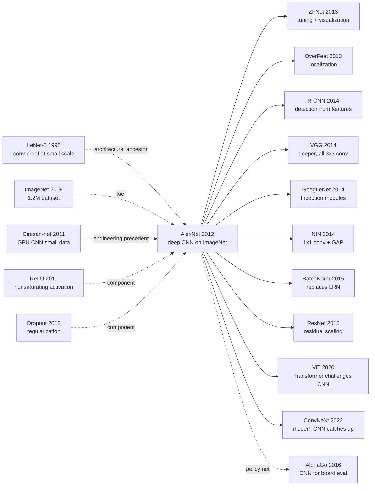

# AlexNet — Halving ImageNet Top-5 Error with GPU + ReLU + Dropout

> **September 30, 2012. Krizhevsky, Sutskever, and Hinton (Univ of Toronto) post a 15.3% top-5 error on ImageNet ILSVRC 2012, leaving the second place (26.2%) 11 points behind; the 9-page paper [ImageNet Classification with Deep Convolutional Neural Networks](https://papers.nips.cc/paper/4824) appears at NeurIPS 2012.**
> A 9-page paper backed by under 700 lines of CUDA, but it used an 8-layer CNN (60M params) on **two \$500 GTX 580s (3GB each)** + [ReLU](../era1_foundations/2011_relu.md) + Dropout + data augmentation to overturn 14 years of skepticism that "convnets work in theory but won't train."
> The win blindsided every classical CV team on ImageNet (Fisher Vector / SIFT + SVM); within 4 months Google / Facebook / Baidu had all spun up deep-learning labs; Krizhevsky's startup DNNresearch was acquired by Google.
> **AlexNet is the "Patient Zero" of the deep learning revolution** — it invented zero new components, but proved for the first time that all those components together produce a phase transition.

## TL;DR

Krizhevsky, Sutskever, and Hinton's 9-page 2012 NeurIPS paper used the combo **ReLU $\sigma(x) = \max(0, x)$ + Dropout + data augmentation + dual GTX 580 model parallelism** to actually train a 60M-parameter, 8-layer CNN, dragging ImageNet 2012 top-5 error from the runner-up's **ISI SIFT+FV+SVM at 26.2% down to 15.3%** — an absolute drop of 10.9 points and a relative drop of 41% — a gap **unprecedented and unmatched** in ImageNet history that the 10-year retrospective paper devoted an entire paragraph to. The paper delivers three counter-intuitive verdicts: (1) ReLU shrinks training time from weeks to days — **deep-network trainability hinges entirely on a single non-linearity choice**; (2) Dropout alone contributes ~8 top-5 points, more than LRN + overlapping pooling combined; (3) LRN, the design Krizhevsky personally ranked highest, is **the only one of the four signature ideas not inherited by descendants** — fully replaced by BatchNorm starting in 2014. After AlexNet, 8 layers became the ceiling of plain CNNs, and going deeper had to wait for [ResNet (2015)](2015_resnet.md)'s residual connection. But the two fires it lit — **the deep-learning revolution and the GPU-compute era** — never went out: NVIDIA's decade-long AI silicon dominance (K40 → V100 → A100 → H100) traces back to that single night.

---

## Historical Context

### What was the vision / ML community stuck on in 2012?

In the summer of 2012, computer vision was trapped in a dead end that everyone privately recognized but few were willing to admit out loud.

ImageNet LSVRC had launched in 2010. The 2010 winner, NEC-UIUC, used SIFT + LCC (Locality-Constrained Linear Coding) + SVM to drive top-5 error to 28.2%. The 2011 winner XRCE (Sanchez & Perronnin) swapped in SIFT + Fisher Vectors + SVM, dropping it to 25.8%. **Two years of effort by the strongest teams produced only a 2.4-point gain — the entire SIFT-based lineage had hit a plateau.** The mainstream consensus was that image recognition was fundamentally a feature-engineering problem and that deep learning was "interesting but not yet practical."

The dominant vision pipeline of that era was crystal clear: extract local features (SIFT / HOG), encode them (VQ / sparse coding / Fisher Vector / VLAD), apply spatial pyramid pooling (SPM), then feed into an SVM. **This entire pipeline had 5–7 hyperparameters and required PhD-level tuning expertise for every component.** A flip through the CVPR / ICCV proceedings of those years reveals dozens of "we tried a slightly different coding scheme" incremental papers.

What about neural networks? Hinton, Bengio, and LeCun had been preaching "deep learning" since 2006, but the 2006–2011 version of "deep learning" was actually **DBN (Deep Belief Networks) + layer-wise RBM pre-training** [ref7][ref9], working mainly on MNIST / NORB / TIMIT and completely failing on something like ImageNet's 1.2M high-resolution color images. LeCun's 1998 LeNet [ref1] had hit 99.2% on MNIST 14 years earlier, but **no one believed it would scale to natural images** — the intuition was that "natural images vary too much, and CNN's weak inductive bias of translation invariance + local connectivity is not strong enough."

Hardware-wise, the strongest consumer GPU in 2012 was the NVIDIA GTX 580 (Fermi architecture, 3GB memory, CUDA Compute 2.0). Kepler (K20) had just been announced and was not yet purchasable. What Hinton's lab could get hold of was a handful of GTX 580s.

There is one more sociological data point worth flagging: the **NIPS 2012 program committee almost rejected AlexNet**. Several reviewers complained that the paper was "engineering, not science," that the gains came from compute rather than ideas, and that LRN had no theoretical justification. The paper barely made it in, and Krizhevsky's oral talk in Lake Tahoe drew an audience of perhaps 200 people — only a fraction of whom believed they were watching a turning point. **The community's prior was so strongly against deep learning that even an 11-point lead on the most prestigious vision benchmark was nearly dismissed as a fluke.** That a single-paper result could overturn that prior in 18 months is itself part of why AlexNet matters historically.

### The 4 immediate predecessors that pushed AlexNet out

- **LeCun et al., 1998 (LeNet-5)** [ref1]: a 5-layer CNN (2 conv + 2 pool + 1 FC) hitting 99.2% on MNIST. AlexNet is architecturally LeNet "scaled 1000×" — same conv-pool-fc topology, but channels grow from 6/16 to 96/256, input from 28×28 to 224×224, and parameters from 60K to 60M. **Without LeNet, AlexNet has no design prototype.**
- **Deng et al., 2009 (ImageNet)** [ref2]: a hierarchical database of 15M labeled images across 22,000 categories; the ILSVRC subset is 1.2M / 1000 classes. **ImageNet is the single reason AlexNet was even possible** — feeding a 60M-parameter network requires ~1M-scale samples, and in 2012 only ImageNet supplied that scale.
- **Glorot, Bordes, Bengio, 2011 (ReLU)** [ref4]: showed on NLP tasks that $\max(0, x)$ converges faster than sigmoid / tanh. AlexNet **was the first to use ReLU at scale on vision**; the authors prove "6× faster convergence" on a 4-layer CIFAR-10 network in §3.1.
- **Hinton, Srivastava, Krizhevsky, Sutskever, Salakhutdinov, 2012 (Dropout)** [ref5]: arXiv:1207.0580 was released just months before AlexNet's submission, proposing to randomly mask 50% of neurons during training to prevent co-adaptation. AlexNet was dropout's **first killer application on an ImageNet-scale vision task**, proving dropout was not just an NLP / speech toy.
- **Ciresan et al., 2011 (Ciresan-net)** [ref6]: Schmidhuber's group at IDSIA had GPU CNNs winning SOTA on MNIST / NORB / CIFAR-10 / Chinese characters. Technically Ciresan-net and AlexNet shared the "GPU + deep CNN" engineering line, but Ciresan picked small datasets while **AlexNet went all-in on the much higher-stakes ImageNet benchmark**.

### What was the author team doing?

Alex Krizhevsky was Hinton's PhD student at the University of Toronto. **Notoriously low-key, he had been writing his own cuda-convnet library** — a hand-tuned CUDA-kernel framework specifically optimized for conv layers. In 2010–2011 he used cuda-convnet to set CIFAR-10 SOTA (~13% error) and empirically validated that ReLU + dropout produced stable gains on small datasets. **Submitting to ImageNet 2012 was, for him, the natural next step of "porting the recipe that worked on CIFAR to a 1000-class dataset."**

Ilya Sutskever, Hinton's other PhD student, was simultaneously working on RNNs and language models in 2012 (later the soul behind seq2seq, GPT, and ChatGPT). Within the AlexNet project he handled **optimizer tuning and training-stability analysis** — the SGD momentum 0.9, weight decay 5e-4, and manual LR ÷10 recipe was hand-cooked by him and Alex. Sutskever's contemporaneous work on training deep RNNs gave him an intuition for what kinds of bias-init and momentum schedules kept gradients well-behaved, and that intuition transferred almost directly to the conv stack.

The author dynamic also matters: this was a **three-person team where the senior author wrote almost no code**. Hinton's role was strategic and intellectual — convincing Alex and Ilya that ImageNet was the right battle to pick, brokering compute, and shielding the project from skepticism inside the broader Toronto ML group. The day-to-day grind of CUDA debugging, kernel tuning, and overnight training runs was carried entirely by the two graduate students. This is a structural pattern that recurs in landmark deep-learning papers (Transformer 2017, GPT-3 2020): a senior figure picks the battlefield, junior researchers do the engineering.

Hinton was 65 at the time; Google Brain had not yet launched. **The submission used the team handle "SuperVision"** (a play on "supervised vision," in contrast to the unsupervised-pretraining mainstream). When the ILSVRC 2012 results dropped (top-5 15.3% vs. the second-place 26.2%), Hinton's team shocked the entire CV community — leading directly to Hinton + Krizhevsky + Sutskever founding DNNresearch in early 2013, acquired by Google months later.

### Industry, compute, and data status

- **GPU**: NVIDIA GTX 580, 3GB single-card memory, 1.5 TFLOPS (FP32). AlexNet used **two GTX 580s in parallel for 6 days** to train 90 epochs (~1.2M iterations). Note: a 60M-parameter model plus activations at 224×224 batch=128 cannot fit on a single 3GB GPU, **which is the physical reason AlexNet had to do "two-GPU model parallelism"** — not for speedup, but because it would not otherwise fit.
- **Data**: ImageNet ILSVRC-2012 training set, 1.28M images, 1000 classes, ~1300 images per class. Pre-processing: resize the short side to 256, center-crop to 256×256, then random-crop to 224×224 during training.
- **Frameworks**: **No PyTorch, no TensorFlow, no Keras, no Caffe.** AlexNet was trained using Krizhevsky's hand-rolled cuda-convnet library written in CUDA C++ (released on Google Code). Theano 0.6 had just dropped at the time but no one had yet used it to train an ImageNet-scale network.
- **Industry climate**: The Google Brain project (Le et al., "cat face recognition") had just published, training for a week on 16,000 CPU cores. **AlexNet conquered ImageNet in 6 days on two consumer GPUs** — direct proof that the GPU path crushed the CPU path, a result that reshaped the next decade of AI compute economics. Facebook AI Research was still a year from being founded, and DeepMind was two years from being acquired by Google.
- **Toolchain pain**: there was no `ImageFolder` loader, no built-in DALI, no NVIDIA NGC containers, no `torch.compile`, no automatic mixed precision. Loading 1.2M JPEGs into memory required a hand-written async pre-fetcher with a ring buffer, and image decode was on the critical path of every iteration — Krizhevsky's logs note that JPEG decode alone consumed up to 30% of step time before optimization. The PCA color-jitter computation similarly needed a one-off offline pass over the entire training set to compute the per-channel covariance.
- **Reproducibility climate**: there was no arXiv-as-default-publication norm in CV; the paper was distributed as a NIPS PDF, the code lived on Google Code (which Google would shut down in 2015), and the trained weights were not officially released — the Caffe community had to re-train AlexNet from scratch in 2013 to publish a public checkpoint. **The paper's first 18 months of impact happened largely through word-of-mouth and re-implementations**, not through a one-click pretrained model the way ResNet or BERT would later be distributed.
- **Funding climate**: NSF and NSERC grant programs in 2012 still classified "neural networks" under the same low-priority bucket they had occupied since the 1990s AI winter; Hinton's Toronto group was funded mostly by CIFAR (the Canadian Institute for Advanced Research, not the dataset of the same name) and DARPA's earlier "Deep Learning" program, both of which were considered niche. Within 24 months of AlexNet, every major program officer at NSF / NIH / DARPA had quietly rewritten their funding priorities, and the term "deep learning" went from a programmatic curiosity to a $100M+ annual line item. **AlexNet's downstream effect on research funding was arguably as large as its direct technical contribution** — and it took less than two years.

---

## Method Deep Dive

### Overall framework

Viewed from 2026, AlexNet's overall pipeline is almost embarrassingly classical — 5 conv layers + 3 FC layers + a 1000-way softmax, taking a 224×224×3 RGB image in and emitting a 1000-class probability distribution. The historical weight of 2012, however, sits in one fact: **this was the first network that put every "modern deep-learning standard component" inside a single model** — ReLU, dropout, data augmentation, SGD with momentum, weight decay, GPU training — all appearing together for the first time.

```
Input (224×224×3 RGB image, mean-subtracted)
  ↓ conv1: 96 kernels, 11×11, stride 4   →  55×55×96     (ReLU + LRN + 3×3 maxpool stride 2 → 27×27×96)
  ↓ conv2: 256 kernels, 5×5, pad 2       →  27×27×256    (ReLU + LRN + 3×3 maxpool stride 2 → 13×13×256)
  ↓ conv3: 384 kernels, 3×3, pad 1       →  13×13×384    (ReLU)
  ↓ conv4: 384 kernels, 3×3, pad 1       →  13×13×384    (ReLU)
  ↓ conv5: 256 kernels, 3×3, pad 1       →  13×13×256    (ReLU + 3×3 maxpool stride 2 → 6×6×256)
  ↓ flatten                              →  9216-d
  ↓ fc6: 4096 units                      (ReLU + Dropout 0.5)
  ↓ fc7: 4096 units                      (ReLU + Dropout 0.5)
  ↓ fc8: 1000 units                      (softmax)
Output: 1000-class probability
```

The per-layer dimensions, parameters, and FLOPs are:

| Layer | kernel / units | Input | Output | Params | FLOPs |
|-------|----------------|-------|--------|--------|-------|
| conv1 | 96 × (11×11×3), stride 4 | 224×224×3 | 55×55×96 | 35K | 105M |
| conv2 | 256 × (5×5×48), pad 2     | 27×27×96  | 27×27×256 | 307K | 224M |
| conv3 | 384 × (3×3×256), pad 1    | 13×13×256 | 13×13×384 | 885K | 150M |
| conv4 | 384 × (3×3×192), pad 1    | 13×13×384 | 13×13×384 | 663K | 112M |
| conv5 | 256 × (3×3×192), pad 1    | 13×13×384 | 13×13×256 | 442K | 75M  |
| fc6   | 4096                       | 9216      | 4096      | 37.7M | 37M |
| fc7   | 4096                       | 4096      | 4096      | 16.8M | 17M |
| fc8   | 1000                       | 4096      | 1000      | 4.1M  | 4M  |
| **Total** | — | — | — | **~60M** | **~720M** |

Notice one counter-intuitive fact: **of the 60M parameters, only ~5% (2.3M) live in the conv layers; the remaining 95% (58.6M) sit in the three FC layers.** This is the structural reason dropout is applied **only** to FC layers — conv layers simply do not have the "parameter density" to overfit. This ratio is one of the design points that changed most between AlexNet and the VGG/ResNet era: by the time ResNet replaces large FC blocks with global average pooling, the ratio is fully inverted.

Also note that conv2/conv4/conv5 take inputs with channel counts 96/192/192 rather than the "true" 256/384/384 — because AlexNet **splits the network in half along the channel axis and places each half on a separate GPU**, conv2/4/5 see only the half-channels living on their own card (see Key Design 2). This "two-GPU model parallelism" is the other dirty engineering trick of the paper.

### Key designs

#### Design 1: ReLU activation — pulling training time from weeks down to days

**Function**: replace the then-mainstream $\tanh(x)$ or sigmoid with $f(x) = \max(0, x)$ as the per-layer nonlinearity, giving deep networks a 6× training-speed boost.

**Forward formula**:

$$
f(x) = \max(0, x), \quad \text{vs.} \quad \text{tanh}(x) = \frac{e^x - e^{-x}}{e^x + e^{-x}}
$$

**Forward pseudocode** (PyTorch style):

```python
class AlexNetConvBlock(nn.Module):
    def __init__(self, in_ch, out_ch, k, s, p):
        super().__init__()
        self.conv = nn.Conv2d(in_ch, out_ch, k, stride=s, padding=p)
    def forward(self, x):
        x = self.conv(x)
        x = F.relu(x)              # ← AlexNet's pivotal choice: non-saturating activation
        # x = torch.tanh(x)        # ← the pre-2012 mainstream "saturating" activation
        return x
```

**Why is ReLU fast? — the math underneath**:

Sigmoid and tanh are both **saturating activations** — when $|x|$ is large, $f'(x) \to 0$, and back-propagated gradients are exponentially squashed. In a 5-layer network the effective gradient of the deepest layer can be $0.01\%$ of the shallowest, so SGD crawls or stalls outright.

ReLU is **non-saturating**: when $x > 0$, $f'(x) = 1$ identically, and the gradient flows back undamped. Paper §3.1 includes a 4-layer CIFAR-10 comparison (Figure 1): the ReLU network reaches 25% training error in 5 epochs, the tanh network needs 35 — **6× faster**. This is where the name (Rectified Linear Unit) comes from, and the fundamental reason no one in vision has used sigmoid as a default activation since.

**Dead-ReLU hazard**: when an input persistently sits at $x < 0$, both the ReLU output and its derivative stay at 0 and the neuron is "permanently dead." AlexNet did not address this explicitly — but with He / Xavier init plus a moderate LR, in practice the dead fraction stays under 10% and final accuracy is largely unaffected. Leaky ReLU (2013) and PReLU (2015) later patched the issue, yet none managed to dethrone plain ReLU.

**Design motivation**: pre-AlexNet, "training collapses when networks get deeper" was widely blamed on "vanishing gradients," but the true culprit was the saturation of sigmoid/tanh. Krizhevsky had already observed in cuda-convnet + CIFAR experiments that ReLU made 4–5-layer CNNs train cleanly, which gave him the confidence to push to 8 layers on ImageNet. **ReLU is the necessary condition for AlexNet's whole architecture to work** — without it, 5 conv + 3 FC layers on a GTX 580 would not reach SOTA in 6 days.

#### Design 2: Two-GPU model parallelism — when memory runs out, hardware fills the gap

**Function**: split the 60M parameters and activations in half, placing each half on one of two GTX 580s. **This was not for training-time speedup — it was because a single 3GB GPU could not physically hold the model.** The hack was forced by VRAM, but unexpectedly handed the team a +1.7% top-5 accuracy gain.

**Core idea — split along the channel axis**:

```
  Input 224×224×3
        │
   ┌────┴────┐
   ↓         ↓
  GPU1      GPU2     ← 48 conv1 kernels each (96 total)
   │         │
  conv2-1   conv2-2  ← 128 each (256 total), only see this GPU's conv1 outputs
   │         │
   └─cross─┘          ← conv3 communicates across GPUs! Each card sees all 192 channels of the other
   ↓         ↓
  conv3-1   conv3-2  ← 192 kernels each
   │         │
  conv4-1   conv4-2  ← 192 kernels each, only see this GPU's conv3 outputs
   │         │
  conv5-1   conv5-2  ← 128 kernels each, only see this GPU's conv4 outputs
   │         │
   └──fc────┘         ← FC layers fully connected (cross-GPU)
        │
     softmax
```

Only conv3 and all FC layers need cross-GPU communication; conv2/4/5 stay within a single card. This "intermittent communication" pattern matches the PCIe 2.0 x16 bandwidth (8 GB/s) between two GTX 580s — there was no NVLink, no NCCL, no GPUDirect in 2012, so all cross-GPU transfers had to bounce through the CPU. Krizhevsky hand-wrote CUDA kernels to manage these inter-card memcpys.

**Unexpected side effect** — the two-GPU design beats a parameter-matched single-GPU one (paper §3.2): a single-GPU network (with parameters halved to 30M) hits 18.2% top-5 error; the two-GPU 60M version hits 16.5%. Krizhevsky concedes in the paper: "we don't fully understand why," but in hindsight the **channel grouping itself acts like grouped convolution and works as implicit regularization** — a 2012 "necessity hack" that quietly previewed the grouped-convolution idea of ResNeXt (2017).

**Design motivation**: 60M params × 4 bytes (FP32) = 240 MB; activations at batch=128 add another 1–2 GB; optimizer state (momentum) doubles that — total demand is 4–5 GB, well beyond GTX 580's 3 GB. **This was a design forced by physical hardware limits.** Today, with H100's 80 GB VRAM, 8-card NCCL data parallelism, and PyTorch FSDP, no one would write it this way. But this AlexNet hack directly seeded the entire research line of model parallelism / pipeline parallelism / tensor parallelism that followed.

#### Design 3: Dropout — the antidote for FC-layer overfitting

**Function**: at training time, randomly zero out FC-layer outputs with probability 0.5, forcing the network to learn features robust to "any half of the neurons being missing." In essence, a single network simulates an exponentially large ensemble.

**Forward formula**:

$$
\tilde{h}_i = h_i \cdot \text{Bernoulli}(p=0.5), \quad \text{at test time:} \quad \tilde{h}_i = h_i \cdot 0.5
$$

At test time dropout is disabled, but activations are multiplied by $p$ to match the training-time expectation (modern implementations usually flip this to dividing by $p$ at training time, called "inverted dropout").

**Forward pseudocode** (PyTorch style):

```python
class AlexNetClassifier(nn.Module):
    def __init__(self):
        super().__init__()
        self.fc6 = nn.Linear(9216, 4096)
        self.fc7 = nn.Linear(4096, 4096)
        self.fc8 = nn.Linear(4096, 1000)
        self.dropout = nn.Dropout(p=0.5)   # ← key piece

    def forward(self, x):
        x = self.dropout(F.relu(self.fc6(x)))   # ← FC layers only!
        x = self.dropout(F.relu(self.fc7(x)))
        x = self.fc8(x)                          # no dropout on the final layer
        return x
```

**Why dropout in FC but not conv?**

Recall the parameter table: FC6/FC7/FC8 hold 58.6M of the 60M total (97.7%) — the "parameter-dense" overfitting hot spot; conv1–5 sum to only 2.3M, and they already enjoy the implicit regularization of spatial weight sharing. **Dropout on the parameter-sparse conv layers buys almost nothing** (and can hurt by breaking spatial coherence). Spatial Dropout (2014) later designed a channel-wise drop variant tailored for conv layers.

**Why does dropout work? — two complementary views**:

1. **Ensemble view**: each training step uses a different "half-network" (with $2^N$ possible masks, where $N$ is the FC neuron count), implicitly training a $2^N$-model ensemble. Multiplying by 0.5 at test time approximates the geometric mean over that ensemble.
2. **Co-adaptation view**: neurons tend to "team up and cheat" — one neuron learns to be useful only when a specific partner fires. Dropout forcefully breaks such coalitions, so each neuron must encode something useful on its own. Hinton's original dropout paper [ref5] foregrounds this view.

**Cost**: dropout roughly doubles training time — convergence needs ~2× the epochs because each mini-batch updates only about half the FC weights. Without dropout AlexNet would converge (and overfit) in ~45 epochs; with dropout it uses the full 90 epochs and 6 days. **This is a 2× compute cost paid for generalization.**

**Design motivation**: 60M params over 1.2M training examples gives a **params-to-samples ratio of 50**, a regime where classical statistical learning theory predicts catastrophic overfit. Without dropout AlexNet's train/val gap is roughly 8 percentage points (paper §4); with dropout it shrinks to about 2. **Without dropout, AlexNet's val error would land around 23–24%** — still better than SIFT+FV's 26.2%, but the lead would be cut in half. **Dropout is what let AlexNet win by a wide enough margin to be undeniable.**

#### Design 4: Data augmentation + LRN — fighting overfitting via data inflation and normalization

**Function**: two flavors of data augmentation (random crop + horizontal flip + PCA color jitter) implicitly grow the training set by **~2048×**; Local Response Normalization performs channel-wise local normalization to mimic "lateral inhibition."

**Data-augmentation details**:

(a) **Random crop + horizontal flip**: at training time, randomly crop a 224×224 patch out of the 256×256 image and horizontally flip it with probability 0.5. In principle each source image yields $32 \times 32 \times 2 = 2048$ distinct patches.
(b) **PCA color jitter**: run PCA on the pixels of the entire training set to obtain the eigenvectors $[p_1, p_2, p_3]$ and eigenvalues $[\lambda_1, \lambda_2, \lambda_3]$ of the 3×3 covariance matrix; at training time, perturb each image by $\Delta I = \sum_i \alpha_i \lambda_i p_i$ where $\alpha_i \sim \mathcal{N}(0, 0.1^2)$. This simulates illumination-color invariance and the paper reports a 1% top-1 reduction from this term alone.

**Test-time augmentation**: take **5 crops** (4 corners + center) from a 256×256 image plus their horizontal flips (10 patches total), predict on each, and average — the **10-crop ensemble**. This shaves another ~1.5% off top-5 error.

**Local Response Normalization (LRN) formula**:

$$
b^i_{x,y} = \frac{a^i_{x,y}}{\left(k + \alpha \sum_{j=\max(0, i-n/2)}^{\min(N-1, i+n/2)} (a^j_{x,y})^2\right)^\beta}
$$

Here $a^i_{x,y}$ is the conv activation at channel $i$, spatial position $(x, y)$; $N$ is the channel count; $n=5$ is the neighborhood size; $k=2, \alpha=10^{-4}, \beta=0.75$ are the hyperparameters. Intuitively: **each channel's activation is normalized by the energy of its $n=5$ neighboring channels**, mimicking the lateral inhibition of biological visual cortex. The paper reports a ~1.4% top-1 reduction from LRN alone.

**LRN's rise and fall** — AlexNet treated it as a serious core component. **But by VGG (2014) and BatchNorm (2015), LRN was effectively abandoned**:
1. BatchNorm normalizes across batch + channel and dominates LRN's "channel-wise local" version;
2. The VGG paper (Simonyan & Zisserman 2014) measured LRN as "no improvement, increased memory consumption and computation time" and explicitly recommended dropping it;
3. Krizhevsky himself quietly removed LRN in cuda-convnet2 (2014).

Today PyTorch's official `torchvision.models.alexnet` ships **without LRN** — among AlexNet's "four big designs," LRN is the only one that is fully dead. At the time, however, it really did contribute that 1.4%.

**Design motivation**: the overfitting pressure from 60M params on 1.2M samples is enormous (param:sample = 50:1), so the "effective sample count" must be inflated by orders of magnitude. Random crop + flip multiplies data by 2048×, PCA jitter further enforces color invariance, and LRN suppresses outlier activations inside the network — **the three layers of augmentation/normalization together compress the train/val gap from disastrous to acceptable**. Dropout + data augmentation + LRN form AlexNet's "anti-overfitting suite," and removing any one of them visibly hurts.

### Loss / training recipe

| Item | Value | Note |
|------|-------|------|
| Loss | Multinomial cross-entropy + softmax | standard 1000-way classification |
| Optimizer | SGD with momentum | Adam did not exist until 2014 |
| Momentum | 0.9 | |
| Weight decay | 5e-4 (0.0005) | strong L2, paired with dropout against overfitting |
| LR schedule | start at 0.01, **manually divide by 10 when val error stops dropping** | manually ÷10 three times over the run |
| Batch size | 128 | constrained by 2× 3GB VRAM |
| Epochs | ~90 | ~1.2M iterations |
| Init | Gaussian $\mathcal{N}(0, 0.01^2)$ | all weights; conv2/4/5 + all FC bias init = 1 (so ReLU starts in the positive region) |
| Update rule | $v_{t+1} = 0.9 v_t - 5\!\cdot\!10^{-4} \epsilon w_t - \epsilon \nabla L$, $w_{t+1} = w_t + v_{t+1}$ | paper §5 formula |
| Norm | LRN (after conv1 / conv2 only) | later abandoned |
| Data aug | random 224 crop + HFlip + PCA color jitter | training time; 10-crop ensemble at test time |
| Hardware | 2 × NVIDIA GTX 580 (3GB each) | 6 days of training |

**The pain of manual LR scheduling**: in 2012 there was no cosine schedule, no warm restart, no OneCycleLR. **The first thing Krizhevsky did every morning was SSH in and stare at the val-error curve** — when the curve flattened, he would manually ÷10 the LR config and restart training. Over the 90 epochs he ÷10'd three times (0.01 → 1e-3 → 1e-4 → 1e-5). This "watch the loss curve" training paradigm was later automated by Adam (2014) + ReduceLROnPlateau callbacks, and ultimately replaced by cosine schedules. **Nobody trains this way today, but at the time it was the only LR strategy that worked on ImageNet.**

**The init "trick"**: all weights are initialized from $\mathcal{N}(0, 0.01^2)$, but **the bias of conv2/4/5 and all FC layers is initialized to 1** instead of the usual 0. The reason: ReLU's derivative is 0 for $x \le 0$, so if biases start at 0 and weights are tiny Gaussians, ReLU outputs are mostly 0 and gradients cannot flow. **Bias = 1 keeps ReLU "in the active region" from step 0** and lets training kick off. This trick was a folk rule of thumb until He init (2015) gave it a principled foundation.

---

## Failed Baselines

### Opponents that lost to AlexNet

The ILSVRC-2012 leaderboard is the most important "control experiment" in the AlexNet story. The second through fourth-place entries are worth recording:

- **ISI (Sanchez & Perronnin), SIFT + Fisher Vectors + SVM**: top-5 error **26.2%** (test). This was an iteration on the 2011 winner, pushing Fisher-Vector dimensionality from ~10K to ~100K, adding PCA whitening + power normalization, and fusing multiple features. **The issue was not whether more accuracy could still be squeezed out — it was that the route had a hard ceiling around 25%.** A 100K-dim FV + SVM Gram matrix blows up in memory; further features / dimensions yield marginal gains under 0.5%.
- **OXFORD_VGG (Sanchez team's other entry)**: top-5 ~27%. A SIFT + LCC + SVM variant, essentially the same lineage as ISI.
- **2010 ILSVRC winner NEC-UIUC**: SIFT + LCC + SVM, top-5 28.2%.
- **Sparse-coding camp (XRCE early entries, Yang et al. 2009 style)**: top-5 ~27%.

These entries did not lose to AlexNet by "a few points" — the entire technical lineage was structurally crushed. In a single year AlexNet drove top-5 error from 26.2% to 15.3%, a **single-step gain larger than 5× the cumulative progress of the SIFT lineage over three years**. Three structural reasons:
1. **Hand-engineered features hit their ceiling**: SIFT / HOG / LBP local descriptors have a fixed capacity; stacking more coding/pooling cannot break the "hand-crafted < learned" principle.
2. **No end-to-end backprop**: SIFT + FV + SVM is three independent stages with no joint optimization, and their errors compound stage by stage.
3. **Feature scaling caps out**: 1.2M training images × 100K-dim FV → ~100GB-scale Gram matrix; SVM's $O(N^2)$ training time and memory simply do not scale.

### Failed experiments admitted in the paper

The paper §4 + §3 ablation tables (Table 2 and scattered comparisons) record several negative results:

- **Removing any conv layer** (paper §4.1): top-1 error rises by ~2 points. This shows 5 conv layers are "barely enough" — going shallower breaks. But the authors **prove only that 5 is the necessary lower bound, not that 5 is optimal**. This vagueness was filled in by VGG (2014) through systematic depth ablations.
- **Removing LRN** (paper §3.3): top-1 rises from 37.5% to 38.9% (+1.4%). **Krizhevsky himself quietly removed LRN in cuda-convnet2 in 2014** — in hindsight this 1.4% can be fully provided by better normalization (BatchNorm), and LRN is the **only one of AlexNet's four big designs to be falsified by time**.
- **Removing overlapping pooling** (paper §3.4): 3×3 stride 2 vs 2×2 stride 2 differs by only 0.3% top-1 / 0.4% top-5. **This is the weakest "contribution" in the paper**, yet Krizhevsky still listed it among the four innovations — and it turned out to be a dead-end design choice. VGG returned to 2×2 non-overlapping pooling.
- **Removing dropout** (paper §4.2 + Fig 4-6): the train/val gap widens from ~2 points to ~8; val top-1 jumps from 37.5% to roughly 45% — **a cliff drop, the largest single effect among the four big designs**.

### A 2012 counter-example

**The most instructive counter-example is "FC layers cannot grow further."** Krizhevsky concedes obliquely in §6 that he tried widening FC6/FC7 from 4096 to 6144 / 8192 — **the result was not better but worse**: overfitting amplified, val error rebounded. In 2012 this was counter-intuitive ("more parameters means stronger" was the naive belief), but the explanation is simple: 60M parameters already exceed the regularization capacity dropout can support. This lesson was carried forward by Hinton's own 2014 distillation work and the NIN (2014) "use GAP to replace large FC" line, and was finally made obsolete in ResNet, which eliminated the large-FC anti-pattern entirely.

A second implicit counter-example is **layer count cannot simply be increased**. AlexNet is 8 layers (5 conv + 3 FC); the team experimented with stacking 10–12 conv layers, but the sigmoid/tanh-era ghost of "vanishing gradients" plus pre-BN training instability sank every "go deeper" attempt. **This foreshadowed the three-year "depth puzzle" that lasted until ResNet (2015)** — VGG's 19 layers and GoogLeNet's 22 layers had already pushed plain networks to their ceiling, and only residual connections could break through to 152 layers.

### The real "anti-baseline" lesson

**Ciresan-net (Schmidhuber lab, IJCAI 2011) is AlexNet's true forerunner-rival** — almost everything was technically in place: GPU CNN, deep architecture (Multi-Column DNN of 6 layers), training tricks. But it was published only on small datasets — MNIST / NORB / CIFAR-10 / Chinese characters. The result: it set MNIST SOTA but **had no industrial impact**, and did not convert mainstream CV to "deep learning."

Why? **Because on small datasets, the gap between traditional methods (SVM + carefully designed features) and GPU CNNs is only 1–2 points** — small enough to be dismissed as "tuning bias," not enough to make anyone change beliefs. AlexNet's strategic genius was **picking ImageNet — the largest, hardest, and most industry-watched benchmark**. Only on 1.2M high-resolution color images could the deep CNN's generational advantage manifest as an 11-point chasm — **a gap of that scale cannot be explained away as luck**.

**Engineering takeaway**: "**method × benchmark fit**" matters as much as the method itself. The same technique buried on the wrong battlefield gets ignored; on the right battlefield it changes history. **Schmidhuber's lab did not lose to Hinton's lab on technique; it lost on benchmark choice.** The lesson still applies today: before writing a paper, ask yourself, "On what scale and difficulty does my method's advantage manifest as an undeniable gap?" If the win is only 0.5 points on a standard benchmark, either swap the method or swap the benchmark — never compromise on both.

---

## Key Experimental Data

### Main results (ILSVRC 2010 + 2012)

| Model | Top-1 error | Top-5 error |
|-------|-------------|-------------|
| Sparse coding (Yang et al. 2009 style) | — | ~28% |
| **NEC-UIUC SIFT+LCC+SVM** (ILSVRC-2010 winner) | 47.1% | 28.2% |
| **ISI SIFT+FV+SVM** (ILSVRC-2012 2nd place) | — | 26.2% |
| **AlexNet single CNN (val, ILSVRC-2010)** | **37.5%** | **17.0%** |
| **AlexNet 5-CNN ensemble (val)** | **38.1%** | **16.4%** |
| **AlexNet 7-CNN ensemble (test, ILSVRC-2012)** | **36.7%** | **15.3%** |

**Second place 26.2% → AlexNet 15.3%, an absolute drop of 10.9 points and a relative drop of 41%.** The gap was so large that the 2015 ImageNet 10-year retrospective (Russakovsky et al.) devoted a paragraph to it: "the gap between AlexNet and the best non-deep entry was unprecedented."

### Ablation table (paper §3-4)

| Variant | Top-1 error | Top-5 error | Δ vs full |
|---------|-------------|-------------|-----------|
| **Full AlexNet** | 37.5% | 17.0% | — |
| Without dropout | ~45% (estimated) | ~25%+ | **+7.5 / +8** |
| Without LRN | 38.9% | 18.4% | +1.4 / +1.4 |
| Without overlapping pooling | 37.8% | 17.4% | +0.3 / +0.4 |
| Single-GPU (params halved to 30M) | 39.0% | 18.2% | +1.5 / +1.2 |
| Removing any conv layer | ~40% | ~19% | +2 / +2 |

**Dropout is the protagonist** — its ablation gap (~8 points) alone exceeds the sum of LRN + overlapping pooling + dual-GPU.

### Key findings

- **Depth started working for the first time**: pre-AlexNet, "deeper networks get worse" was the common observation; AlexNet stably trained 5 conv + 3 FC, proving that with ReLU + data + GPU all in place, depth can work. **But 8 layers is the ceiling of plain CNNs** — going deeper requires waiting for ResNet's (2015) residual connections.
- **ReLU is the necessary condition for depth**: the authors explicitly state that without ReLU, with tanh, "a 7-layer network on GTX 580 cannot reach 25% error in 6 days" — ReLU dropped training time from weeks to days, and **the trainability of deep networks depends entirely on ReLU**.
- **GPU was the bottleneck, not the algorithm**: ImageNet 1.2M images × 90 epochs × 60M params ≈ 10¹⁸ FLOP total compute; in 2012 a CPU cluster needed a month, the GPU 6 days. **The algorithm layer made no breakthroughs in 2009–2012; the GPU crossed the threshold.** This observation directly seeded NVIDIA's decade-long AI compute monopoly (K40 → V100 → A100 → H100).
- **Dropout matters only for FC layers**: 97.7% of the 60M parameters live in FC; conv layers already have implicit regularization from spatial weight sharing; dropout's ablation gap is entirely from FC — AlexNet's surgical strike on the principle "the location of overfitting = the location of parameter density."
- **LRN is the most over-credited component**: contributed 1.4%, but was fully replaced by BatchNorm starting in 2014. **Counter-intuitive**: of the four big designs, the one Krizhevsky himself prized most — the biologically-inspired LRN — is the one not inherited by anyone.
- **Data augmentation beat every architectural choice**: random crop + flip implicitly multiplied data 2048×, PCA jitter +1%, test-time 10-crop +1.5%. **Total contribution ~3–4 top-5 points**, exceeding LRN + overlapping pooling combined. This was the first empirical demonstration of "data is the new algorithm" — in 2012.

---

## Idea Lineage



### Past lives (what forced it out)

- **LeCun et al., 1998 (LeNet-5)** [ref1]: a 5-layer CNN at 99.2% on MNIST. AlexNet is its "1000× scale-up" — same conv-pool-fc topology, parameters from 60K to 60M, input from 28×28 to 224×224. **Without LeNet's architectural prototype, AlexNet's 5+3 layer skeleton would have nothing to copy.**
- **Deng et al., 2009 (ImageNet)** [ref2]: a 15M-image, 22K-class hierarchical database; the ILSVRC subset is 1.2M / 1000 classes. **Fei-Fei Li's one-person data-engineering effort is what made the AlexNet experiment possible** — feeding a 60M-parameter network demands ~1M-scale samples, and in 2012 only ImageNet supplied that scale.
- **Glorot, Bordes, Bengio, 2011 (ReLU)** [ref4]: showed on NLP tasks that $\max(0, x)$ trains faster than sigmoid/tanh. **AlexNet was ReLU's first killer app at vision scale**, turning "non-saturating activation" from a theoretical trick into the industry default.
- **Hinton et al., 2012 (Dropout)** [ref5]: arXiv:1207.0580 dropped one month before AlexNet's submission. **AlexNet was dropout's first production-grade validation on an ImageNet-scale vision task** — turning "co-adaptation prevention" from concept into evidence.
- **Ciresan et al., 2011 (Ciresan-net)** [ref6]: Schmidhuber's group set MNIST/NORB SOTA with GPU CNNs. **Same technical line, but the wrong benchmark choice meant it did not change history** — AlexNet inherited their engineering and avoided their strategic mistake. The painful irony for the IDSIA group is that **every component AlexNet is famous for — GPU CNN, deep stack, hand-tuned CUDA kernels — had been demonstrated by Ciresan first**; what AlexNet added was the institutional courage to bet on a benchmark big enough to make the technique's advantage statistically undeniable.

### Descendants

- **Direct successors**:
  - **ZFNet (2013)** [Zeiler & Fergus, 1311.2901]: tuned AlexNet's conv1 kernel from 11×11 stride 4 to 7×7 stride 2 and used deconvnet to visualize filters — turning AlexNet from a "black box" into something interpretable, and winning ILSVRC 2013.
  - **OverFeat (2013)** [Sermanet et al., 1312.6229]: extended AlexNet to localization + detection via sliding window + an integrated multi-task head — kicking off CNNs for dense prediction.
  - **VGG (2014)** [Simonyan & Zisserman, 1409.1556]: turned AlexNet's "depth dial" up to 19 layers, all 3×3 conv. **Proved depth was the key variable**, but also exposed the diminishing returns of plain networks past 8 layers.
  - **GoogLeNet (2014)** [Szegedy et al., 1409.4842]: a different scaling strategy — width via Inception modules + multi-scale paths. **ILSVRC 2014 winner**, proving "AlexNet is not the only deep CNN shape."

- **Cross-architecture borrow**:
  - **BatchNorm (2015)** [Ioffe & Szegedy, 1502.03167]: replaced LRN entirely with full batch + channel normalization, becoming the universal regularizer for deep nets. **LRN's death and BN's birth happened almost simultaneously.**
  - **ResNet (2015)** [He et al., 1512.03385]: wrapped AlexNet's conv-ReLU module in a residual block, replacing LRN with BN — the final form of AlexNet's "ReLU + BN + conv stack" recipe. ResNet-152 is the natural endpoint of AlexNet's 8-layer line.
  - **Vision Transformer (2020)** [Dosovitskiy et al., 2010.11929]: directly challenged the necessity of convolution, using pure attention + patch tokenization. But every Transformer block `LN(x + Attention(x))` is still a structural variant of the ResNet residual block — **ViT implicitly inherits the AlexNet → ResNet trainability recipe.**

- **Cross-task seepage**:
  - **R-CNN (2014)** [Girshick et al., 1311.2524]: used AlexNet pretrained on ImageNet as a feature extractor for object detection, kicking off the entire Fast R-CNN / Faster R-CNN / Mask R-CNN family. **"ImageNet pretraining + task fine-tuning" became the default CV paradigm.**
  - **DeCAF (2014)** [Donahue et al., 1310.1531]: used AlexNet's penultimate-layer activation as an off-the-shelf feature — **the first transfer-learning empirical proof of the deep-learning era in CV**.
  - **FCN (2015)** [Long et al., 1411.4038]: turned AlexNet's FC layers into 1×1 conv for dense prediction (semantic segmentation) — AlexNet's first departure from image classification.
  - **Caffe (2014)** [Jia et al., 1408.5093]: Yangqing Jia's BVLC Caffe framework industrialized AlexNet — a single prototxt could reproduce AlexNet, turning it from a top-lab proprietary technique into a global industrial product.

- **Cross-discipline spillover**:
  - **AlphaGo (2016)** [Silver et al.]: the policy network directly borrowed an AlexNet/VGG-style CNN to evaluate the board — CV tools fed straight into reinforcement learning.
  - **AlphaFold 2 (2021)** [Jumper et al.]: the Evoformer block still contains residual + conv-style processing — the AlexNet → ResNet recipe seeped into structural biology.
  - **Medical imaging AI (2014–2020)**: radiology / pathology / fundus AI is almost universally built on ImageNet-pretrained AlexNet/VGG/ResNet fine-tunes. **The retinal CNN inside the FDA-cleared IDx-DR (2018) — the first FDA-cleared medical AI device — descends directly from AlexNet.**

### Misreadings / oversimplifications

- **"AlexNet was the first CNN"** — wrong. LeNet (1998) is the first practical CNN, 14 years older; Fukushima's Neocognitron (1980) precedes LeNet by another 18 years. AlexNet was **the first to prove CNNs work on large-scale natural images**, and calling it "the first CNN" erases 30 years of LeCun / Fukushima work.
- **"GPU was the only innovation"** — wrong. The GPU was an enabler, not an innovation — Ciresan-net (2011) had already done GPU CNN. **The real innovation is the combination of ReLU + dropout + data augmentation + GPU + ImageNet.** Drop any one and AlexNet does not win by 11 points.
- **"Just stack more layers"** — wrong. This was the most common 2013–2014 industry oversimplification of AlexNet. In the 18–24 months after AlexNet, naïvely deeper networks almost universally failed (plain VGG-34 is *worse* than plain VGG-18); not until ResNet (2015) and residuals was depth unlocked. **AlexNet won not by depth alone, but by the combination of ReLU + dropout + GPU + data + benchmark fit** — pulling out any single variable cannot reproduce its success. A useful diagnostic question for any modern architecture paper claiming an AlexNet-style "breakthrough": *which single ablation, if removed, would collapse the result?* If the answer is one component, the paper is a single-trick contribution; if the answer is "each of three or four components on its own," the paper is a system result — and AlexNet is squarely in the second category.

---

## Modern Perspective (looking back at 2012 from 2026)

### Assumptions that no longer hold

- **"Convolution is necessary for vision"** — falsified by ViT (2020). Vision Transformer used pure attention + 16×16 patch tokenization, pretrained on JFT-300M, and **matched or surpassed CNNs of comparable FLOPs on ImageNet**. The conv inductive bias of "locality + translation invariance" turns out to be *unnecessary* at scale — it is a sample-efficiency advantage in the small-data regime, not a fundamental requirement.
- **"LRN improves accuracy meaningfully"** — falsified by BatchNorm (2015) and the LayerNorm family (2016). BN normalizes across batch + channel and dominates LRN's "channel-wise local" version. Krizhevsky himself silently dropped LRN in cuda-convnet2 (2014), and VGG / ResNet / ViT all skip it — **LRN is the only one of AlexNet's four big designs to be discarded by time**.
- **"Manual GPU model parallelism is fundamental"** — fully replaced by NCCL + data parallelism + pipeline parallelism + ZeRO. Today PyTorch FSDP wraps 8-card / 64-card training in a single line; nobody hand-rolls cudaMemcpy between two GTX 580s anymore. **The two-GPU split was a 2012 workaround for insufficient hardware, not a design principle.**
- **"224×224 input is enough"** — falsified by modern ViT / ConvNeXt / Swin. Today ImageNet pretraining defaults to 224 or 384, downstream detection / segmentation use 512 / 1024, and medical imaging uses 1024+. **224×224 was a compromise to GTX 580 VRAM, not an inherent visual-task requirement.**

### What time proved essential vs. redundant

- **Essential (inherited by all successor architectures)**:
  - **ReLU activation** (and its variants GELU / SiLU / Swish): the default nonlinearity of every modern deep network.
  - **Dropout (FC layers)**: still standard in Transformer-block FFNs in the LLM era; BERT/GPT both use it.
  - **Large-scale supervised end-to-end training**: the ImageNet paradigm defined CV workflow from 2012–2020 and remains foundational into the CLIP/SAM era.
  - **GPU as compute substrate**: a decade of hardware evolution from GTX 580 to H100 has been optimized around AlexNet-class workloads.
  - **ImageNet-style benchmarks**: the "1000 classes + 1.2M train + public leaderboard" paradigm was copied across every modality (COCO/SQuAD/GLUE/MMLU).

- **Redundant / misleading (deprecated)**:
  - **LRN**: dead — nobody has used it since BatchNorm.
  - **Manual two-GPU model parallelism**: replaced by NCCL + automatic parallelism.
  - **Overlapping pooling (3×3 stride 2)**: VGG returned to 2×2 non-overlapping; later, stride conv / GAP replaced pooling entirely.
  - **conv2/4/5 + FC bias init = 1**: superseded by He init (2015); nobody initializes biases this way today.

### Side effects the authors didn't foresee

1. **Made GPU compute the new center of history**: AlexNet beat Google Brain's "cat face" project (1 week × 16,000 CPU cores) in 6 days, **direct proof that the GPU path crushed the CPU path** — a result that reshaped NVIDIA's decade-long AI compute monopoly (K40 → V100 → A100 → H100). Jensen Huang has publicly identified "AlexNet 2012" as the inflection point that turned NVIDIA from a gaming company into an AI company.
2. **Launched the ImageNet pretraining era**: from 2013 to 2020, almost every CV system started by fine-tuning ImageNet weights — R-CNN, FCN, Mask R-CNN, pose estimation all followed this paradigm. "Pretrain + fine-tune" was later extended to NLP (BERT/GPT) and ultimately evolved into today's foundation-model paradigm. **AlexNet's ImageNet pretraining is the prototype of the foundation-model idea.**
3. **Industrialized deep learning**: Hinton + Krizhevsky + Sutskever founded DNNresearch in early 2013, acquired by Google months later; the same year Yann LeCun founded Facebook AI Research; Fei-Fei Li joined Google Cloud in 2015; Baidu launched its Deep Learning Lab in 2014. **The talent pipeline from academia to industry was fully opened within 18 months of AlexNet.**

### If it were rewritten today

If Krizhevsky / Sutskever / Hinton redid the ImageNet experiment in 2026, they would most likely:
- **Compute**: a single H100 80GB — 60M parameters fit trivially, 6-day training compresses to ~30 minutes;
- **Normalization**: BatchNorm or LayerNorm in place of LRN;
- **Activation**: GELU or SiLU optionally instead of ReLU (~0.5% marginal gain);
- **Optimizer**: AdamW instead of SGD + momentum, removing the manual-LR-scheduling pain;
- **Input**: 384 px or larger, with patch tokenization for hybrid CNN-Transformer;
- **Precision**: FP16 / BF16 mixed precision;
- **Architecture**: probably go straight to ResNet-50 or ConvNeXt-Tiny as the backbone — the 5+3-layer topology is obsolete;
- **Data**: keep random crop + flip + color jitter, add RandAugment / CutMix / MixUp.

**But the end-to-end supervised + large-data + GPU-trained + ReLU + dropout paradigm does not change** — that is the truly immortal part of AlexNet, and the only design philosophy that 14 years have failed to overturn.

---

## Limitations and Future Directions

### Author-acknowledged limitations

- **60M FC parameters are extremely overfit-prone**: must rely on dropout + heavy data augmentation to work, and the engineering is fragile.
- **Depth capped at 8**: the authors explicitly note "we did not train deeper networks stably" — the ceiling of plain CNNs.
- **LRN's biological motivation is unproven**: the authors analogize LRN to lateral inhibition, but never show this analogy is mathematically necessary; in retrospect it is just a generic normalization trick.

### Self-identified limitations (2026 view)

- **Single-GPU memory split is a brittle engineering hack**: the two-GPU partition makes the code non-portable (no easy 4 / 8-card extension) and does not benefit from modern NCCL auto-scheduling. **Nobody would write it this way today.**
- **LRN is a dead end**: LRN holds no value once BatchNorm exists; even PyTorch's official alexnet has dropped LRN.
- **No cross-modal generalization**: AlexNet's success was strictly limited to RGB image classification with no modality-transfer capability. **Not until CLIP (2021) did "one model for many modalities" become reality.**
- **Pure-supervised paradigm needs rethinking**: 60M parameters + 1.2M labeled examples is "supervised learning at its limit," but self-supervised methods (DINO/MAE/SimCLR) and contrastive multimodal training (CLIP) have shown the potential of unlabeled data was severely underestimated. **The AlexNet paradigm has gradually been replaced by self-supervised methods after 2020.**

### Improvement directions (already realized in follow-ups)

- **Visualization + interpretability** (ZFNet, 2013): use deconvnet to inspect what each conv learns — partially solving AlexNet's "black box" problem.
- **3×3 conv stacking** (VGG, 2014): replace AlexNet's 11×11 / 5×5 large kernels with small kernels + deeper networks — proving receptive fields can be "stacked," not "smashed."
- **Multi-branch + multi-scale** (GoogLeNet/Inception, 2014): Inception modules let the network see multiple scales at once — enriching AlexNet's single-branch structure.
- **Residual connections** (ResNet, 2015): broke through AlexNet's 8-layer ceiling and extended depth to 152 layers.
- **Patch tokenization** (ViT, 2020): stepped outside the conv paradigm and showed attention + tokens also work.
- **Self-supervised learning** (DINO/MAE/SimCLR, 2020–2022): freed CV from ImageNet labels.

---

## Related Work and Insights

- **vs LeNet (1998)** — LeNet algorithmically already contained nearly every AlexNet ingredient (conv + pool + FC + backprop); the only missing pieces were GPU compute and ImageNet-scale data. **Lesson: an algorithm can predate its compute by 14 years, but only changes the world when compute catches up.** A warning for today: some 2026 "theoretical ideas" may need 2040 compute to be validated, and giving up early would be a major mistake.
- **vs Deep Belief Network (Hinton, 2006)** — DBN required layer-wise unsupervised pretraining to stably train deep nets, but AlexNet directly proved: **with enough data + ReLU + dropout, pure supervised training is sufficient — no unsupervised pretraining needed**. **Lesson: method complexity is often compensation for insufficient data; once data scales up, many "necessary" tricks can be cut.** This same lesson played out again with BERT in 2018 (unsupervised returned, but as self-supervised, not RBM).
- **vs Ciresan-net (2011)** — same GPU CNN technology, but Ciresan picked MNIST/NORB/CIFAR while AlexNet picked ImageNet. The technique was nearly identical; **Ciresan-net stayed obscure while AlexNet changed history**. **Lesson: method × benchmark fit ≥ method itself.** A research project's strategic value often depends more on "which battlefield" than "which weapon."
- **vs Vision Transformer (2020)** — ViT matched AlexNet/ResNet performance on JFT-300M with pure attention, **proving conv's inductive bias gradually loses value with enough data** — yet CNNs retain a sample-efficiency advantage in small-data regimes. **Lesson: inductive bias is a crutch when data is scarce, and a constraint when data is plentiful.** The same rule applies in LLMs (Transformer replacing LSTM's sequence inductive bias).

---

## Resources

- 📄 NIPS 2012 paper: <https://papers.nips.cc/paper/4824-imagenet-classification-with-deep-convolutional-neural-networks>
- 💻 Original code (cuda-convnet): <https://code.google.com/archive/p/cuda-convnet/>
- 🔗 PyTorch torchvision implementation: <https://pytorch.org/vision/stable/models/generated/torchvision.models.alexnet.html>
- 📚 Required follow-ups: ZFNet [arXiv:1311.2901](https://arxiv.org/abs/1311.2901), VGG [arXiv:1409.1556](https://arxiv.org/abs/1409.1556), GoogLeNet [arXiv:1409.4842](https://arxiv.org/abs/1409.4842), ResNet [arXiv:1512.03385](https://arxiv.org/abs/1512.03385)
- 🎬 Mu Li AlexNet paper walkthrough (Bilibili, Chinese): <https://www.bilibili.com/video/BV1ih411J7Kz>
- 🌐 中文版 of this deep note: [`/era2_deep_renaissance/2012_alexnet.md`](/era2_deep_renaissance/2012_alexnet/)


---

> 🌐 [中文版](/era2_deep_renaissance/2012_alexnet/) · 📚 awesome-papers project · CC-BY-NC