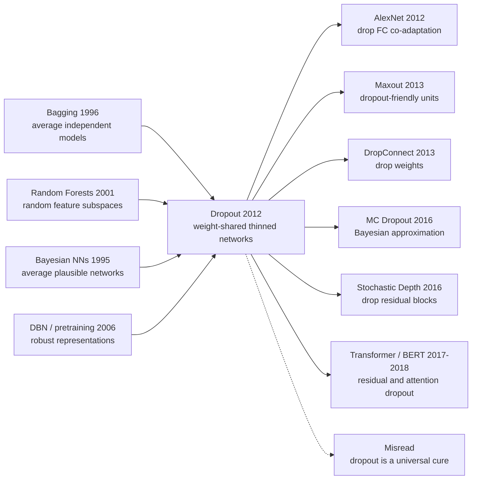

# Dropout — Randomly Turning Neurons Off to Stop Feature Co-adaptation

> **In July 2012, Geoffrey Hinton, Nitish Srivastava, Alex Krizhevsky, Ilya Sutskever, and Ruslan Salakhutdinov at the University of Toronto uploaded [arXiv:1207.0580](https://arxiv.org/abs/1207.0580).** The paper did not introduce a new layer, a new optimizer, or a deeper architecture; it simply proposed turning off a random half of the neurons during training. The counter-intuition was sharp: just as the field was learning to make neural networks bigger, Dropout argued that making the network deliberately incomplete at every step could make it generalize better. That tiny training-time disturbance moved from AlexNet's fully connected layers to the expanded JMLR 2014 paper, then into Transformers, BERT, and large language models as one of the cheapest and most durable regularizers of the deep-learning renaissance.

## TL;DR

Hinton, Srivastava, Krizhevsky, Sutskever, and Salakhutdinov's 2012 arXiv note, later expanded into the 2014 JMLR paper, reframed overfitting from "add another $\lambda\lVert W\rVert_2^2$ penalty" into "sample a different thinned network on every minibatch": $\tilde{h}=m\odot h,\;m_i\sim\mathrm{Bernoulli}(p)$, then use $W_{\text{test}}=pW_{\text{train}}$ at inference as a cheap approximation to averaging exponentially many weight-sharing models. The baselines it displaced were not one bad classifier but the whole 2012 toolkit for large supervised nets: big MLPs regularized only by weight decay, smaller networks plus early stopping, and expensive independent ensembles. Across MNIST, TIMIT, CIFAR-10, and ImageNet-style networks, dropout consistently reduced test error, and it directly helped the fully connected layers of [AlexNet](2012_alexnet.md) avoid being swallowed by overfitting. The hidden lesson is not "more noise is always better"; it is that a feature detector should remain useful when its favorite collaborators disappear. [ResNet](2015_resnet.md) and BatchNorm later reduced dropout's role inside convolutional backbones, but Transformers, BERT, and LLMs brought small dropout rates back into the default training recipe.

---

## Historical Context

### Before 2012: deep nets were not too small; they were too good at memorizing

By 2012 deep learning was crossing an awkward threshold. GPUs, ReLUs, Xavier-style initialization, and larger datasets were finally making sizable neural networks trainable. Yet as soon as parameter counts outran what the training set could reliably support, held-out performance could collapse. The dominant interpretation was not today's familiar "overparameterized models can still generalize" story; it was a more direct engineering diagnosis: large networks had too much capacity to memorize, especially in dense fully connected layers, and could treat accidental training-set correlations as if they were stable rules.

Classical regularizers were already available. Weight decay pushed parameters toward smaller norms, early stopping halted training before validation error worsened, data augmentation jittered the input space, and bagging trained multiple models then averaged their predictions. Each came with a cost. Weight decay was continuous and gentle; it did not really break dependencies between hidden features. Early stopping only truncated training time; it did not change the internal representation. Bagging worked, but training many independent neural nets was expensive under 2012 GPU budgets. Dropout entered exactly this gap: **could one train a single network while making it behave like a very large ensemble?**

Hinton's group was unusually prepared for that question because the Toronto line since DBNs in 2006 had always cared about model averaging and robust representations. In the DBN / RBM era, the answer was unsupervised pretraining: learn stable hidden variables from the data distribution before supervised fine-tuning. But the AlexNet moment was showing that supervised deep nets could succeed without leaning on pretraining as the main crutch. The question shifted from "how do we pretrain?" to "how do we keep a huge supervised net from simply memorizing the training set?" Dropout appeared in that crack. It did not reconstruct inputs like a DBN, and it did not merely penalize parameter size like weight decay. It disrupted the network's cooperation pattern every time training ran.

### Why Hinton's team treated random deactivation as ensemble learning

The phrase that gives the dropout paper its identity is **co-adaptation of feature detectors**. It is not an ornate mathematical concept; it is an engineering observation. In a large network, a hidden unit may be useful only when several other specific hidden units are also present. That kind of collusion can look excellent on the training set because several detectors jointly memorize fragile details. On a test example, if one partner fails, the entire arrangement can collapse.

Turning off half the hidden units at random sounds like a crude reduction of capacity. From an ensemble perspective, however, it trains exponentially many subnetworks. If a layer has $n$ dropout-eligible units, there are in principle $2^n$ possible thinned networks. The key is that they share weights, so the cost does not become exponential. Each minibatch sees one sampled subnetwork, and all subnetworks constrain one another through shared parameters. This explains why dropout is not merely "adding noise." Input noise or weight noise usually perturbs a function locally; dropout changes the topology used by the function at every step.

The idea also connects to Hinton's long-standing interest in model combination. Hinton had written about model combination and neural networks in 2002, and Breiman's bagging and random forests had already shown that averaging randomized submodels could reduce variance. Dropout translated those ensemble intuitions into the language of deep nets: do not train 100 separate models; keep sampling substructures inside one model, then approximate their average with a scaled full network. The approximation is crude, but in the engineering environment of the time it was exactly right: simple, differentiable, nearly no change to the training framework, and immediately useful against overfitting.

### The same-year industrial and academic window as AlexNet

Dropout's timing relative to AlexNet matters. The dropout arXiv note appeared in July 2012; AlexNet was published at NeurIPS 2012. The author lists overlap as well: Krizhevsky, Sutskever, and Hinton were standing at the center of the ImageNet shift. AlexNet is often summarized as GPU + ReLU + big data + CNN, but dropout in the fully connected layers was not a footnote. A 60-million-parameter network could still overfit on 1.2 million ImageNet training images, especially in its dense final layers. Dropout allowed those layers to keep large capacity without simply memorizing the training set.

The research climate was also moving toward large supervised models. From 2006 to 2011, deep learning often had to justify itself through unsupervised pretraining and optimization arguments. After 2012, ReLUs, GPUs, data scale, and SGD know-how made direct supervised training credible. The immediate side effect was overfitting. Dropout matched this new phase almost perfectly: it was not a small regularizer for small models; it was a regularizer for an era where models were intentionally made larger than the data alone could comfortably support.

That is why dropout's later influence exceeded the paper's experiments. It first entered large MLPs and the fully connected parts of CNNs, then RNN language models via locked / variational dropout, and eventually Transformers through residual dropout, attention dropout, and embedding dropout. Different architectures came to rely on it differently: convolutional backbones in the ResNet + BatchNorm era often needed less high-rate dropout, while NLP and Transformer stacks kept small dropout rates for a long time. Dropout's historical role is exactly there: it was not the sole cause of the deep-learning renaissance, but it was the safety belt that let the 2012 generation of large networks grow with less fear.

---

## Method Deep Dive

### Overall framework

Dropout's core framework can be compressed into one sentence: **during training, randomly remove some units; during testing, use a scaled full network to approximate the average prediction of all random subnetworks**. Given a hidden activation $h=f(Wx+b)$, dropout first samples a Bernoulli mask with the same shape as $h$, then replaces the activation with $\tilde{h}=m\odot h$. This $\tilde{h}$ is passed to the next layer, and the masked positions receive no gradient during backpropagation. The next minibatch samples a new mask, so the same training example sees different networks across epochs.

$$
m_i \sim \mathrm{Bernoulli}(p), \qquad \tilde{h}_i=m_i h_i, \qquad y=f_{\theta,m}(x)
$$

Here $p$ is the retention probability: hidden layers commonly use $p=0.5$, while input layers often use $p=0.8$ or higher. The important point is not the specific value; it is that a deterministic network becomes a family of stochastic networks. If the model has $n$ dropout-eligible units, the mask space has size $2^n$. Training visits only one thinned network at a time, but all thinned networks share weights. That is the basic reason dropout can obtain some of the benefit of model averaging without training an independent ensemble.

| View | Dropout's choice | Why it matters |
|---|---|---|
| Regularized object | Hidden activations / input features | Directly disrupts fixed feature dependencies |
| Training unit | Resample masks per example or minibatch | Makes the same weights work in many contexts |
| Inference mode | Full network + weight scaling | Approximates ensemble averaging with one pass |
| Cost structure | Training cost remains close to one network | Avoids training many independent models |

Implementation-wise, dropout is just a multiplication inserted into a layer's forward pass. Conceptually, it changes the pressure under which representations are learned. Without dropout, a hidden unit can assume that several neighboring units will always fill in what it does not learn. With dropout, those collaborators may disappear at any moment, so each unit is pushed to carry more independent and reusable evidence. That is the concrete meaning of preventing co-adaptation.

### Key designs

#### Design 1: Bernoulli-mask training — turning one network into a family of random subnetworks

**Function**: Randomly keep or remove activations during each forward pass so the network cannot rely on fixed feature combinations.

The minimal implementation of dropout multiplies activations by a Bernoulli mask. For layer $l$, an ordinary network computes $h^{(l)}=f(W^{(l)}h^{(l-1)}+b^{(l)})$; a dropout network during training computes:

$$
r^{(l)}_j \sim \mathrm{Bernoulli}(p), \qquad \tilde{h}^{(l)}=r^{(l)}\odot h^{(l)}, \qquad h^{(l+1)}=f(W^{(l+1)}\tilde{h}^{(l)}+b^{(l+1)})
$$

This formula is simple, but it has two important details. First, the mask acts on activations rather than weights, so it naturally applies to any differentiable layer. Second, the mask is resampled during training rather than used for permanent pruning. A unit is not deleted forever; it repeatedly appears and disappears under different contexts.

```python
def dropout_forward(hidden, keep_prob, training, rng):
    if not training:
        return hidden
    mask = rng.bernoulli(p=keep_prob, size=hidden.shape)
    return hidden * mask

# original dropout convention: scale weights or activations at inference time
hidden = activation(linear(x))
hidden = dropout_forward(hidden, keep_prob=0.5, training=True, rng=rng)
logits = classifier(hidden)
```

| Method | Where randomness lives | Can it break co-adaptation? | Training cost | Typical problem |
|---|---|---|---|---|
| Unregularized big net | Nowhere | No | Low | Low train error, high test error |
| Input noise | Pixels / input features | Only affects early layers | Low | Weak against high-level dependencies |
| Weight noise | Parameters | Partly | Medium | Noise scale must be controlled |
| Dropout | Hidden activations | Directly | Low | Slower training, keep_prob tuning |

**Design rationale**: The paper's real enemy is feature-detector collusion. If a hidden unit is useful only when a few specific neighbors are present, it may look clever on the training set but remain brittle on new examples. Bernoulli masking creates a harsh training environment: a unit never knows which coworkers will show up, so it must carry enough information on its own. This pressure moves representations from brittle combinations toward distributed evidence.

#### Design 2: Exponential model averaging with shared weights — making ensembles cheap

**Function**: Train many random subnetworks through one parameter set, approximating the generalization benefit of bagging / model averaging.

If a dropout-eligible network has $n$ units, every binary mask defines a subnetwork $f_{\theta,m}$. The ideal ensemble would average the predictions of all subnetworks:

$$
p(y\mid x) \approx \frac{1}{2^n}\sum_{m\in\{0,1\}^n} p(y\mid x,\theta,m)
$$

Computing that average directly is impossible, and training $2^n$ independent models is also impossible. Dropout's approximation is to use SGD as Monte Carlo sampling over mask space: each step updates only the shared weights touched by one sampled subnetwork. At test time, it does not enumerate subnetworks; it uses a scaled full network as a cheap surrogate for the average prediction. Unlike classical bagging, dropout does not isolate models from one another. It forces all subnetworks to borrow strength through shared parameters.

```python
for x, y in loader:
    mask = sample_network_mask(model, keep_prob=0.5)
    logits = model(x, mask=mask)          # one sampled thinned network
    loss = cross_entropy(logits, y)
    loss.backward()                       # updates only active paths
    optimizer.step()

# Over training, SGD has visited many masks and tied them through shared weights.
```

| Ensemble method | Number of submodels | Shared parameters? | Inference cost | Relation to dropout |
|---|---:|---|---|---|
| Independent bagging | $K$ | No | $K$ forward passes | Clean but expensive |
| Random forest | Many trees | Partly no | Many-tree voting | Ancestor of random substructure |
| Snapshot ensemble | Several checkpoints | Shared trajectory | Multiple passes | Later compromise route |
| Dropout | In theory $2^n$ | Yes | 1-pass approximation | Cheapest neural ensemble |

**Design rationale**: Dropout is not trying to simulate a perfect Bayesian posterior, nor to fully train every submodel. It seeks an engineering-feasible ensemble bias. Weight sharing reduces ensemble diversity because the subnetworks cannot drift into entirely different functions, but it also keeps training cost near ordinary SGD. In 2012 that trade-off was extremely valuable: compute budgets did not allow repeated training of large neural ensembles.

#### Design 3: Test-time weight scaling — approximating random averaging with one deterministic network

**Function**: Remove random masks at inference time and use a full network with scaled weights to keep expected activations aligned.

The original paper uses test-time weight scaling: if a unit is retained during training with probability $p$, then at test time all units are used but their outgoing weights are multiplied by $p$. Equivalently, modern implementations often use inverted dropout: retained activations are divided by $p$ during training, and inference does nothing special. The scaling happens at a different time, but the goal is the same: make the expected input received by the next layer consistent.

$$
\mathbb{E}[\tilde{h}_i]=\mathbb{E}[m_i h_i]=p h_i, \qquad W_{\text{test}}=pW_{\text{train}}
$$

Without this scaling, every unit is active at test time and the next layer sees systematically larger inputs than it saw during training. That train/test distribution mismatch would break the method. Weight scaling is the bridge that lets dropout move from stochastic training back to deterministic inference.

```python
def inverted_dropout(hidden, keep_prob, training, rng):
    if not training:
        return hidden
    mask = rng.bernoulli(p=keep_prob, size=hidden.shape)
    return hidden * mask / keep_prob

# Modern convention: inference is just the ordinary full network.
train_hidden = inverted_dropout(hidden, keep_prob=0.5, training=True, rng=rng)
test_hidden = inverted_dropout(hidden, keep_prob=0.5, training=False, rng=rng)
```

| Scaling method | During training | During testing | Advantage | Risk |
|---|---|---|---|---|
| Original dropout | Do not scale activations | Multiply weights by $p$ | Matches the paper's description | Inference needs special handling |
| Inverted dropout | Divide activations by $p$ | Leave network unchanged | Modern framework default | Larger training-time variance |
| No scaling | Do not scale | Do not scale | Simplest implementation | Train/test scale mismatch |
| Monte Carlo dropout | Keep random masks | Average many samples | Gives uncertainty estimates | Higher inference cost |

**Design rationale**: The paper has to resolve a tension: training is random, but testing must be stable. Full Monte Carlo averaging is closer to the ensemble story, but it costs many forward passes. No scaling is cheap but exposes the network at inference to activation scales it never trained under. Weight scaling is a very 2012 engineering decision: sacrifice some theoretical precision in exchange for almost zero-cost inference.

#### Design 4: Coupling with large nets, max-norm, and high learning rates — dropout is not an isolated switch

**Function**: Place random deactivation inside a full training recipe so the weakened sampled network still has enough capacity and optimization energy.

Dropout makes the participating network smaller at each step, so it often requires a larger original network, longer training, and stronger optimization settings. The JMLR version explicitly recommends pairing dropout with large nets, high learning rates, momentum, and max-norm constraints. The intuition is simple: dropout lowers effective capacity. If the original model is already small, randomly removing half its units may cause underfitting. If the original model is sufficiently large, dropout can turn surplus capacity into subnetwork diversity.

$$
w \leftarrow \min\left(1, \frac{c}{\lVert w\rVert_2}\right) w \quad \text{after an update when } \lVert w\rVert_2>c
$$

Max-norm prevents some weights from growing too large as the network compensates for random deletion. Dropout itself injects noise; high learning rates and momentum help optimization move through that noise, while max-norm adds a hard fence around parameter magnitude. Not all pieces of this recipe survived unchanged, but it was crucial in 2012-2014 fully connected and maxout networks.

```python
loss.backward()
optimizer.step()

with torch.no_grad():
    for weight in model.dropout_sensitive_weights():
        norm = weight.norm(dim=0, keepdim=True).clamp_min(1e-8)
        scale = torch.clamp(max_norm / norm, max=1.0)
        weight.mul_(scale)
```

| Companion component | Role before dropout | Synergy with dropout | Later fate |
|---|---|---|---|
| Large hidden layers | Provide capacity | Remain expressive after thinning | Still retained |
| Momentum | Accelerate SGD | Smooth updates under mask noise | Still retained |
| Max-norm | Limit exploding weights | Prevent reliance on a few paths | Partly replaced by Adam/Norm layers |
| Maxout | Flexible piecewise-linear unit | Especially compatible with dropout | More historical than current |

**Design rationale**: Dropout is often misunderstood as a standalone regularization knob, but the original empirical recipe is subtler. It changes the balance among capacity, noise, and optimization. A very small network plus dropout becomes weaker; a very large network plus dropout can turn redundant parameters into robust subnetworks. That is why it worked well in AlexNet's dense layers, MLPs, RNNs, and Transformers, while being less uniformly necessary in some modern convolutional backbones.

---

## Failed Baselines

### Baseline 1: large networks regularized only by weight decay

The most direct baseline dropout defeated was "large network + L2 weight decay." In 2012 this was almost the default regularizer for supervised neural nets: if the model overfit, shrink the weights. The problem is that weight decay penalizes parameter magnitude, whereas co-adaptation is a functional relationship. A feature can depend on another feature through small weights; as long as that dependency is stable on the training set, L2 does not truly break it.

Dropout's advantage is that it ignores weight size and randomly destroys context. Even if a unit's weights are small, if the unit is useful only when fixed partners are present, changing the mask exposes its fragility. Put differently, L2 says "do not make any wire too thick," while dropout says "do not assume a wire will always exist." That is why many of the paper's gains come less from better training-set fit than from narrowing the train/test gap.

### Baseline 2: small networks plus early stopping

The second old baseline was to make the model smaller and rely on early stopping to avoid memorizing the training set. That strategy made sense in the small-data era: lower capacity and shorter training usually reduce overfitting. But it sacrifices representation power. The core trend of the deep-learning renaissance moved in the opposite direction: AlexNet, maxout, and later ResNet all showed that many tasks need larger models to represent useful hierarchical features.

Dropout's counter-intuition is that it does not permanently shrink the big network. It makes the big network temporarily smaller during training, then brings the full network back at test time. The model keeps its capacity, while every parameter must survive training under many thinned contexts. Compared with small net + early stopping, dropout's answer is not "learn less"; it is "learn under harsher conditions so the learned representation is more robust."

### Baseline 3: independent ensembles / bagging

From a generalization standpoint, traditional ensembles are dropout's strongest baseline. Training multiple independent networks and averaging predictions usually reduces variance, and the intuition is clean. The 2012 obstacle was cost. If an AlexNet-scale model already required days of GPU training, training 10 independent models was not realistic; even if one could train them, inference required many forward passes.

Dropout's rewrite of ensembling is pragmatic. It admits that independent model averaging is cleaner, but trades independence for weight sharing and cost. The trade-off has a price: dropout subnetworks are more correlated and cannot be as diverse as fully independent ensemble members. But dropout is cheap enough to become a default setting. That cheapness is why it became an engineering habit rather than a one-off paper trick.

### Baseline 4: the unsupervised-pretraining route

From 2006 to 2011, deep nets often relied on RBM / autoencoder pretraining to obtain good initialization before supervised fine-tuning. That route addressed optimization and representation learning, but it did not specifically solve co-adaptation inside large supervised networks. By 2012, ReLUs, GPUs, and better initialization were making direct supervised training viable, and pretraining's central role was weakening.

Dropout marks that transition. It does not require learning a generative model first, running Gibbs sampling, or greedily training one layer at a time. It inserts directly into supervised training and imposes random-subnetwork pressure on the classifier itself. The failed baseline is not that pretraining became useless; it is that pretraining became less necessary as the main path to generalization for large supervised nets.

| Baseline | Why it made sense then | Problem exposed by dropout | Resulting pattern |
|---|---|---|---|
| Weight decay | Simple, cheap, default | Penalizes weight size but not co-adaptation | Train/test gap remains large |
| Small net + early stopping | Directly controls capacity | Too little capacity, misses large-model gains | Higher underfitting risk |
| Independent ensemble | Strong generalization, clear intuition | Too expensive for training and inference | Hard to make default |
| Unsupervised pretraining | Solved early optimization problems | No longer the necessary entry point | Pressured by direct supervised training |

---

## Key Experimental Data

### MNIST / TIMIT / CIFAR-10: not one leaderboard shock, but a repeated pattern

Dropout's experimental persuasiveness does not come from a single spectacular leaderboard win. It comes from consistency across tasks. The paper covers handwritten digits, speech-frame classification, text classification, CIFAR-10, small face datasets, and ImageNet-style large networks. The setups differ, but the shared pattern is clear: the larger the model, the smaller the effective data relative to capacity, and the denser the fully connected layers, the more likely dropout is to lower test error.

On MNIST, ordinary neural networks were already strong, so dropout's absolute improvement was not as dramatic as AlexNet. Still, it could move error from roughly 1.6% to around 1.25-1.35%; with larger networks and max-norm constraints, the number could improve further. The point is not that MNIST was solved. The point is that dropout was not only a trick for large image models; it consistently reduced overfitting even on a classic small benchmark.

### The numbers that actually mattered in the paper

The more important evidence came from TIMIT, CIFAR-10, and ImageNet-like settings. On TIMIT speech recognition, dropout gave fully connected acoustic models roughly a one-percentage-point reduction in frame error. On CIFAR-10, dropout combined with larger networks and later maxout-style recipes helped move small-image classification away from fragile MLP/CNN training toward more reliable supervised training. On ImageNet, AlexNet's fully connected layers used dropout, helping a 60-million-parameter model generalize on 1.2 million training images.

| Data / setting | No-dropout baseline | Typical dropout result | How to read it |
|---|---:|---:|---|
| MNIST MLP | ~1.6% test error | ~1.25-1.35% | Stable gap reduction on small data |
| TIMIT acoustic model | ~22-23% frame error | About 1 point lower | Dense acoustic layers benefit clearly |
| CIFAR-10 | Mid-teen error rates | Small but stable decrease | Needs larger nets / augmentation support |
| ImageNet / AlexNet FC layers | Severe overfitting risk | Longer training but better generalization | Makes a 60M-parameter model viable |
| Text classification / RCV1 | Sparse high-dimensional features overfit | Test error decreases | Dropout is not vision-only |
| Training time | Ordinary net converges faster | Often needs more epochs | Trades time for generalization |

These numbers do not look outrageous today, because modern benchmark stories often involve double-digit jumps. Dropout's value is that it barely changes the model architecture: a few lines of code reduce test error across datasets. After 2012, researchers developed a new reflex. When a large network improved quickly on the training set but stalled on validation, the first response was no longer merely to shrink the network. It was to try dropout, augmentation, norm constraints, and longer training. That change in training culture outlived any single table entry.

---

## Idea Lineage

### Before: random feature removal moves from bagging into neural networks

Dropout's ancestor is not one neural-network paper but an entire tradition of random-submodel averaging. Bagging showed that bootstrap averaging can reduce variance for unstable learners. Random Forests turned random examples and random feature subsets into a strong classifier. Bayesian neural networks emphasized, from a probabilistic angle, averaging over many plausible model hypotheses. Dropout compresses these ideas inside a differentiable network: instead of explicitly training many models, keep sampling random subnetworks within one model.



The important point in the diagram is not the number of arrows but dropout's dual identity. It is both the neural-network version of classical ensemble thinking and the common ancestor of stochastic depth, DropConnect, MC Dropout, and attention dropout. It moved randomness from data sampling and model collections into the internal computation structure of a network.

### After: from AlexNet to Transformers as a default regularizer

Dropout's first wave of practical influence came from AlexNet and maxout. AlexNet showed that dropout could control overfitting in the fully connected layers of a genuinely large vision model. Maxout showed that some activation functions could even be designed around dropout. DropConnect then moved the random deletion target from activations to weights. Fast Dropout approximated Bernoulli noise with Gaussian noise. SpatialDropout and DropBlock adapted the idea to structured deletion in convolutional feature maps.

The second wave came from sequence models. In RNNs, resampling a fresh dropout mask at every time step can destroy memory, leading to locked dropout, variational dropout, and zoneout. Transformers split dropout across several sites: embedding dropout, attention-probability dropout, residual dropout, and feed-forward dropout. BERT's 0.1 dropout looks unglamorous, but it carried dropout from "protect large fully connected layers" into the default recipe for pretrained language models.

| Follow-up line | What is randomly removed | What it inherits from dropout | What it changes |
|---|---|---|---|
| DropConnect | Weights | Random-subnetwork idea | Drops edges instead of units |
| MC Dropout | Inference-time masks | Ensemble / Bayesian reading | Uses many samples for uncertainty |
| Stochastic Depth | Residual blocks | Trains many subnetworks | Turns width randomness into depth randomness |
| DropBlock | Spatial conv blocks | Breaks co-adaptation | Removes contiguous regions, not independent units |
| Transformer dropout | Attention / residual / FFN | Small noise improves generalization | Low-rate, multi-site, coexists with norm layers |

### Misread: dropout is not a universal overfitting button

The most common misreading of dropout is: whenever a model overfits, raise the dropout rate. That misses dropout's assumptions. It needs enough redundant capacity, some substitutability among the units being removed, and an optimizer that can tolerate stochastic noise. If the network is small, the data is large, or the architecture already has BatchNorm, residual connections, strong augmentation, and weight decay, dropout may add little and can even cause underfitting.

Another misreading treats dropout as pure "noise injection." The noise is real, but dropout's intellectual position is closer to model averaging. What matters is that random masks change which computation paths get trained, forcing one parameter set to work across many subnetworks. Many modern tricks no longer explicitly call themselves dropout, but they preserve the same idea: stochastic depth, token dropping, attention dropout, and path dropout all ask the same question — if a path is not guaranteed to exist, can the model still make a good prediction?

---

## Modern Perspective (looking back at 2012 from 2026)

### Assumptions that no longer hold

1. **"Dropout is the default strong regularizer for every deep net"** — no longer true. From 2012 to 2014, fully connected layers and early CNNs relied heavily on dropout. After ResNet, BatchNorm, large-scale augmentation, label smoothing, AdamW, and more stable initialization, modern convolutional backbones often use very low dropout or none at all. Dropout was not eliminated; it moved from "turn it on at a high rate by default" to "use it carefully depending on architectural location."
2. **"Randomly dropping units is simply more advanced than weight decay"** — no longer true. Once AdamW correctly decoupled weight decay from the optimizer update, L2-style regularization became powerful again. In large-model training, weight decay, data scale, early stopping, and dropout are usually complementary rather than one-way replacements. Dropout addresses co-adaptation, but it does not replace every form of smoothness or norm control.
3. **"A scaled full network at test time adequately represents the ensemble"** — only as an engineering approximation. Later MC Dropout showed that if uncertainty information matters, inference should also sample multiple masks. Ordinary test-time scaling is closer to a mean approximation than to a strict Bayesian model average.
4. **"The higher the dropout rate, the stronger the generalization"** — corrected by a decade of practice. High dropout can help small-data MLPs, but it can directly cause underfitting in Transformer pretraining or large-scale vision models. Modern LLMs often use very low dropout or disable it when data is abundant enough.
5. **"Dropout's main value is noise injection"** — too narrow. Its more durable value is the random-subnetwork and model-averaging lens. If one understands it only as noise, it is hard to explain why stochastic depth, DropBlock, and attention dropout matter as structured variants.

### What survived vs. what became redundant

- **What survived**: random-subnetwork training, shared-weight ensembling, breaking co-adaptation, and matching expectations between train and test time. These ideas still live in Transformer dropout, stochastic depth, drop path, MC Dropout, and many token-dropping methods.
- **What weakened**: the empirical default of hidden-layer $p=0.5$. Today different architectural sites use different dropout rates: attention / residual dropout often sits around 0.1, convolutional backbones may use less, and input-feature dropout follows yet another logic.
- **What was replaced in the recipe**: max-norm and maxout remain historically important, but modern training leans more on AdamW, LayerNorm, BatchNorm, residual scaling, learning-rate schedules, and data augmentation.
- **What was reinterpreted**: the 2012 paper mainly explained dropout through ensembling. After 2016, Bayesian approximation, variational inference, and uncertainty estimation added another theoretical lens. That later lens did not overturn the original paper; it showed that the same training trick can be seen through multiple theories.

### If Dropout were rewritten today

If Hinton's team rewrote the paper in 2026, the main text would probably separate three contexts more explicitly. The first is **regularization dropout**: random activation deletion during training, deterministic scaling during testing, with generalization as the goal. The second is **Bayesian / MC dropout**: sample masks at inference too, with uncertainty estimation as the goal. The third is **structured dropout**: delete channels, blocks, paths, or tokens to fit convolutional, residual, and Transformer architectures.

The experiments would also look entirely different. Today the paper would not prove the method only on MNIST/TIMIT/CIFAR-10. It would report separated results for Transformer encoders, ViTs, ResNets, LLM fine-tuning, small-data transfer, and large-data pretraining. The authors would likely state more explicitly: dropout is strong for dense overparameterized heads, not always strong for BatchNorm-heavy CNN backbones, and high dropout during large-scale pretraining requires caution. That version would have less of a "universal regularizer" glow, but it would match modern experience more closely.

---

## Limitations and Future Directions

### Author-acknowledged limitations

The original paper already recognized that dropout is not a free lunch. Training slows down because each step trains only a thinned network. Hyperparameters must be tuned, especially retention probability, learning rate, momentum, and max-norm. Models usually need to be larger; otherwise random deletion can create underfitting. The test-time weight scaling is only an approximation and is not strictly identical to averaging every subnetwork.

The paper also acknowledges that dropout's benefit depends on task, architecture, and data scale. It is especially visible in fully connected layers, sparse high-dimensional inputs, and relatively small-data settings, but some structured models need adapted variants. That caution matters because later practice confirmed it: dropout is a powerful tool, not a universal law.

### Limitations from a 2026 view

From today's perspective, dropout has at least five additional limitations. First, the noise it injects changes optimization dynamics, sometimes slowing convergence or making learning rates harder to tune. Second, independent unit dropout is poorly matched to strongly local convolutional feature maps; dropping individual positions is often too weak, motivating SpatialDropout or DropBlock. Third, in RNNs, independently resampling masks at every time step can damage temporal memory, requiring locked / variational dropout. Fourth, at very large data scale, overfitting may no longer be the main bottleneck, and high dropout can reduce usable capacity. Fifth, dropout's interaction with normalization layers is not always clean, especially when BatchNorm statistics and random masks mix.

There is also a more philosophical limitation: dropout defines robustness as robustness to randomly missing internal units. That is not the same as robustness to distribution shift, adversarial perturbations, long-tail classes, or label noise. It improves one kind of internal redundancy; it is not an answer to every generalization problem.

### Directions validated by follow-up work

Follow-up work largely moved along three lines. The first is **structured deletion**: DropConnect drops weights, DropBlock drops spatial regions, stochastic depth drops residual blocks, DropPath drops paths, and token dropout drops tokens. The second is **probabilistic theory**: variational dropout, the local reparameterization trick, and MC Dropout connect random masks to approximate Bayesian inference. The third is **finer architectural placement**: Transformers distribute dropout across attention, residual streams, embeddings, and MLP blocks, where low-rate, multi-site dropout is more common than one large dropout site.

Future dropout-like methods are unlikely to return to the original form of "randomly remove half the hidden units" as the main character. But the idea will keep living in stochastic routing, sparse MoE, token pruning, and test-time uncertainty. As long as models remain larger than the data and tasks strictly require, the problem of preventing substructures from over-relying on one another will remain.

---

## Related Work and Insights

### Compared with weight decay / norm layers

The difference between weight decay and dropout is continuous constraint versus discrete perturbation. Weight decay makes functions smoother and parameters smaller; dropout forces functions to work on randomly missing computation graphs. In modern training, the two often coexist, especially in AdamW + dropout recipes. The larger lesson is that regularization has more than one language: one can constrain parameters, activations, paths, or a model's sensitivity to missing context.

### Compared with BatchNorm / LayerNorm

BatchNorm and LayerNorm are not direct replacements for dropout, but they changed its ecological niche. BatchNorm brought stable optimization and mild regularization to CNNs, making high-rate dropout unnecessary in many convolutional backbones. LayerNorm became the stability core of Transformers, while dropout retreated into lower-rate auxiliary positions in residual streams, attention, and MLP blocks. A practical lesson follows: when normalization already supplies stable gradients and some noise, the dropout rate should be retuned rather than inherited from the 2012 value of 0.5.

### Compared with Bayesian deep learning

MC Dropout gave this 2012 engineering paper a second life. Gal and Ghahramani's 2016 work interpreted dropout as a variational approximation to a deep Gaussian process, making inference-time mask sampling a practical approximation to epistemic uncertainty. That does not mean the original dropout method was secretly a strict Bayesian procedure. More accurately, its random-subnetwork structure happened to be interpretable through a Bayesian lens. The story is a useful reminder that good engineering tricks often arrive before complete theory.

---

## Resources

### Essential links

- Original paper: [arXiv:1207.0580](https://arxiv.org/abs/1207.0580)
- Expanded JMLR version: [Dropout: A Simple Way to Prevent Neural Networks from Overfitting](https://jmlr.org/papers/v15/srivastava14a.html)
- Same-era application: [AlexNet / ImageNet Classification with Deep Convolutional Neural Networks](https://papers.nips.cc/paper/4824-imagenet-classification-with-deep-convolutional-neural-networks)
- Direct descendants: [DropConnect](https://proceedings.mlr.press/v28/wan13.html), [Fast Dropout](https://proceedings.mlr.press/v28/wang13a.html), [MC Dropout](https://proceedings.mlr.press/v48/gal16.html), [Stochastic Depth](https://arxiv.org/abs/1603.09382), [DropBlock](https://arxiv.org/abs/1810.12890)
- Implementation references: PyTorch [`torch.nn.Dropout`](https://pytorch.org/docs/stable/generated/torch.nn.Dropout.html), TensorFlow [`tf.keras.layers.Dropout`](https://www.tensorflow.org/api_docs/python/tf/keras/layers/Dropout)
- Suggested reading order: read the 2012 arXiv note first for the core intuition, then the 2014 JMLR paper for experiments and training advice, then MC Dropout to understand why the same trick later entered uncertainty estimation.


---

> 🌐 [中文版](/era2_deep_renaissance/2012_dropout/) · 📚 awesome-papers project · CC-BY-NC