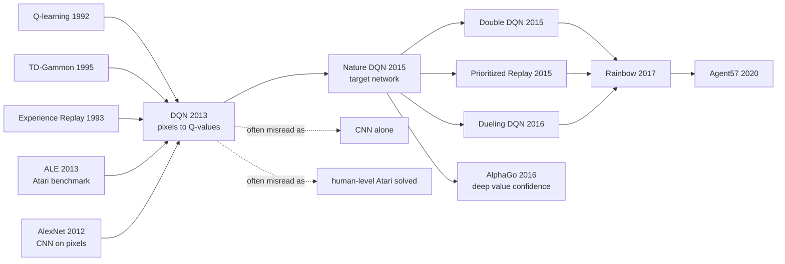

# DQN — The First Deep RL Agent to Learn Atari from Pixels

> **On December 19, 2013, Volodymyr Mnih, Koray Kavukcuoglu, David Silver, Alex Graves, Ioannis Antonoglou, Daan Wierstra, and Martin Riedmiller at DeepMind uploaded [arXiv:1312.5602](https://arxiv.org/abs/1312.5602) and presented it at the NeurIPS 2013 Deep Learning Workshop.**
> The paper was not merely trying to raise Atari scores. It force-welded two communities that had good reasons to distrust each other: deep learning would extract state from 210x160 pixel video, while Q-learning would compress delayed, sparse rewards into action values. It tested only seven games, but it made one proposition suddenly credible: a convolutional network, with no handcrafted visual features and no access to emulator state, could learn control directly from pixels and score. Nature DQN, AlphaGo, Rainbow, MuZero, and Agent57 all walk out of that narrow bridge from pixels to value functions to actions.

## TL;DR

Mnih, Kavukcuoglu, Silver, Graves, Antonoglou, Wierstra, and Riedmiller's 2013 NeurIPS Deep Learning Workshop / arXiv paper moved reinforcement learning from "handcrafted Atari features plus linear value approximation" to "raw pixels plus a convolutional Q-network." The agent stacks four $84 \times 84$ grayscale frames as state, runs one CNN forward pass to output $Q(s,a;\theta)$ for every legal action, and updates the network against the Bellman target $L_i(\theta_i)=\mathbb{E}[(r+\gamma\max_{a'}Q(s',a';\theta_{i-1})-Q(s,a;\theta_i))^2]$, with uniform experience replay breaking the correlation and non-stationarity of online interaction data. The experiment covered only seven Atari games, yet the signal was decisive: the same architecture and hyperparameters beat handcrafted-feature RL baselines such as Sarsa and Contingency on six games, and surpassed expert humans on Breakout, Enduro, and Pong. The hidden lesson is that DQN's "deep" part is not merely the CNN; it is the whole scalable training system tying visual representation, off-policy value learning, replay memory, and epsilon-greedy exploration together. Its remaining instability would be patched by the 2015 Nature DQN target network, Double DQN, prioritized replay, and Rainbow. Without DQN, DeepMind's later [AlphaGo (2016)](2016_alphago.md) would have had far less reason to trust deep value functions as the core of game decision-making.

---

## Historical Context

### Where reinforcement learning and deep learning were stuck in 2013

To understand why DQN landed like a low thunderclap, put the clock back to late 2013. AlexNet had broken ImageNet only one year earlier, and deep neural networks were beginning to replace older speech-recognition pipelines. Yet the reinforcement-learning community had not simply embraced deep learning. The reason was not cultural conservatism; it was technical. Supervised learning trains on a fixed dataset with clear labels. Reinforcement learning trains on a data distribution that the policy itself changes. If an agent learns to move left today, tomorrow's training set is full of left-side screens. If a value function overestimates one action, the behavior policy pushes itself into an even more biased state distribution. For a deep network this is not small noise; target, data, and sampling process all drift at once.

Atari research already had serious baselines. Bellemare, Naddaf, Veness, and Bowling introduced the Arcade Learning Environment in 2013, turning Atari 2600 into a standard RL testbed. Earlier Sarsa and Contingency agents used background subtraction, split the 128 colors into channels, engineered visual features, and then learned linear value functions or policies. These systems had engineering wisdom and some interpretability, but they did not answer the wilder question: **if the agent receives no object detector, no ball or paddle or submarine coordinates, only pixels and score, can it discover a useful state representation by itself?**

The deep-learning side had no ready-made answer either. CNNs could classify ImageNet because every image came with a label. Atari rewards are sparse, delayed, and noisy; the value of one action may reveal itself thousands of frames later. Q-learning is off-policy and can reuse experience, but once it is married to nonlinear function approximation, Tsitsiklis and Van Roy had already warned in 1997 that TD learning can diverge. The mainstream 2013 expectation was not "just bolt a CNN onto Q-learning"; it was "that probably explodes." DQN's historical role is that it made this theoretically suspicious and practically unstable combination work across games for the first time.

### The predecessors that pushed DQN into existence

**Watkins and Dayan's 1992 Q-learning** supplied DQN's central Bellman control equation: learn $Q^*(s,a)$ and choose the action with maximal future return. Its elegance is off-policy learning: the behavior policy can explore while the learning target still points at the greedy policy. But original Q-learning was most comfortable with tabular states or low-dimensional features, not 210x160 RGB video.

**Tesauro's 1995 TD-Gammon** was the previous neural-network RL miracle: a one-hidden-layer MLP trained with self-play and TD($\lambda$) reached superhuman backgammon level. The problem was that backgammon had dice-driven exploration and a relatively smooth value function. For two decades, chess, Go, and visual control failed to reproduce the miracle. The DQN paper treats TD-Gammon as a spiritual predecessor: if a small 1995 network could learn backgammon, perhaps a 2013 CNN plus GPU could learn Atari.

**Lin's 1993 experience replay** supplied the second underappreciated component: store past transitions and later sample them at random for additional updates. The idea had appeared early in robot RL, but before DQN it had not become the core infrastructure of deep RL. DQN upgraded replay memory from a mnemonic trick into a stability mechanism: it improves sample reuse, breaks the tight correlation of sequential frames, and time-averages the distribution shifts induced by the current policy.

**Riedmiller's 2005 Neural Fitted Q Iteration** had shown that neural Q-learning could work in a batch-fitting regime, but each iteration scales with the whole dataset and is hard to extend to large raw-pixel streams. **Lange and Riedmiller's 2010 autoencoder-plus-fitted-Q work** showed that visual input could be compressed before RL, but representation and control remained two separate stages. DQN's jump was to stop learning a generic autoencoder first and let convolutional features serve action values directly.

### What DeepMind was doing at the time

DeepMind in 2013 was not yet the post-acquisition research giant. It was a young company built around the ambition of "general intelligence through reinforcement learning." Demis Hassabis, Shane Legg, and Mustafa Suleyman had assembled a team including David Silver, Daan Wierstra, Koray Kavukcuoglu, Alex Graves, and others who lived at the intersection of deep learning and sequential decision-making. The DQN author list reveals the crossing: Mnih carried Toronto / Hinton-style deep vision background, Kavukcuoglu brought LeCun-lineage CNN expertise, Silver was a reinforcement-learning and games specialist, Graves was a sequence-modeling expert, and Riedmiller was one of the names behind NFQ.

The workshop paper still has the feel of early DeepMind as a startup lab. The experimental scale is small, with only seven Atari games. The system is incomplete; the 2015 Nature version would expand to 49 games and add a target network. But the proposition it tries to prove is bold. It does not say "we hand-designed a Breakout policy." It says "the same algorithm, network, and hyperparameters can face multiple visual games." That cross-task framing later became a DeepMind signature: from DQN to AlphaGo, AlphaZero, and MuZero, the writing constantly pushes a domain-specific system toward a general-agent story.

One historical detail is easy to miss: the 2013 DQN was not a luxury compute demonstration. Training used 10 million frames, one replay memory, and a small two-convolution-layer CNN, not today's thousands of accelerators. Its persuasion came from system design rather than parameter count. On the hardware of the time, a pipeline understandable by a single graduate student turned "learn control from pixels" from a slogan into a reproducible experiment.

### The state of industry, compute, and data

The hardware window had just opened by late 2013. NVIDIA GPUs were good enough for CNNs to work on images, and tools such as Theano and cuda-convnet could run convolutional training. PyTorch did not exist; TensorFlow would not be open-sourced for another two years. The DQN architecture was restrained: input $84 \times 84 \times 4$, then 16 filters of size $8 \times 8$ with stride 4, then 32 filters of size $4 \times 4$ with stride 2, then 256 ReLU units and one linear output per action. By today's standards it looks like a teaching model; in 2013 it was enough to push handcrafted Atari features off the stage.

The data environment had also just matured. ALE's crucial contribution was not merely "providing games"; it provided repeatable evaluation: the same emulator, the same action interface, the same score. RL algorithms finally had something like an ImageNet-style comparison surface. DQN's seven games covered different dynamics: Pong and Breakout are comparatively short-horizon and rule-clear; Seaquest, Q*bert, and Space Invaders require longer temporal planning. That small set later grew into the 49-game Atari benchmark, which became deep RL's shared language for almost a decade.

Industry was moving from "can deep learning work?" to "can deep learning control?" Google acquired DeepMind in January 2014 for roughly $600M, only weeks after the DQN arXiv submission. In that sense, DQN was DeepMind's first technical calling card to the wider world and to Google. It did not solve general intelligence, but it proved a key premise: once perception and decision-making are placed inside the same trainable system, reinforcement learning no longer has to live only in low-dimensional toy problems.

---

## Method Deep Dive

### Overall framework

DQN's pipeline can be compressed into one sentence: **compress an Atari screen history into a fixed-size state representation, use a convolutional network to predict Q-values for all actions at once, then regress Bellman targets from off-policy samples stored in a replay buffer**. It is not policy gradient, and it is not model-based planning. It does not learn an environment model $\mathcal{E}$ or explicitly predict the next frame. The agent asks one question: from the current state, what discounted future return does each action seem to promise?

The core input is the last four frames after grayscale conversion, downsampling, and cropping, shaped as $84 \times 84 \times 4$. Those four frames matter because a single Atari screen is often partially observed: the direction of a Pong ball, whether a Space Invaders laser is visible, or which side a Seaquest enemy is entering from all require short-term motion. The output is not one action; it is a vector whose length equals the number of legal actions, with each component representing $Q(s,a;\theta)$. Action selection therefore requires one forward pass, not one network call per action.

$$
L_i(\theta_i)=\mathbb{E}_{s,a\sim \rho(\cdot)}\left[\left(y_i-Q(s,a;\theta_i)\right)^2\right],\quad y_i=r+\gamma\max_{a'}Q(s',a';\theta_{i-1})
$$

This formula is the paper's spine. The network predicts $Q(s,a;\theta_i)$, and the target is "immediate reward plus discounted value of the best next action." The 2013 workshop paper writes previous-iteration parameters $\theta_{i-1}$ in the theoretical loss, but Algorithm 1 does not yet include the explicit target network $\theta^-$ that the Nature DQN would later introduce. That difference is one reason the 2013 system works while remaining fragile.

| Module | Input | Output | Problem solved |
|--------|-------|--------|----------------|
| Preprocessor $\phi$ | raw Atari RGB frames | $84\times84\times4$ state | reduce dimension, add short motion |
| Q-network | stacked state | Q-value for each action | learn visual control features with CNNs |
| Replay memory | transition $(s,a,r,s')$ | random minibatch | decorrelate data, reuse experience |
| $\epsilon$-greedy | Q-value vector | environment action | trade off exploitation and exploration |

### Key designs

#### Design 1: Bellman target plus deep Q-network — turning visual input into action-value estimates

**Function**: Cast Atari control as action-value regression. The network does not output a class label or the next frame; it outputs estimated future return for every action.

**Core formula**:

$$
Q^*(s,a)=\mathbb{E}_{s'\sim \mathcal{E}}\left[r+\gamma\max_{a'}Q^*(s',a')\mid s,a\right]
$$

If the Bellman optimality equation is treated as a supervised signal, training becomes a matter of making $Q(s,a;\theta)$ approach $r+\gamma\max_{a'}Q(s',a';\theta)$. The counter-intuitive point is that the label is not supplied by a dataset; it is bootstrapped from the network's own interaction with the environment. It looks like supervised learning, but the labels move with the network.

```python
def dqn_td_loss(q_net, states, actions, rewards, next_states, dones, gamma):
    q_values = q_net(states)                         # [batch, num_actions]
    q_sa = q_values.gather(1, actions[:, None]).squeeze(1)

    with torch.no_grad():
        next_q = q_net(next_states).max(dim=1).values # 2013 version: no separate target net
        targets = rewards + gamma * next_q * (~dones)

    return ((targets - q_sa) ** 2).mean()
```

| Approach | Needs environment model | Needs handcrafted state | Per-step compute | Meaning in 2013 |
|----------|-------------------------|-------------------------|------------------|-----------------|
| Tabular Q-learning | No | state must be discrete | table lookup | cannot handle pixel states |
| Linear Atari RL | No | requires visual features | fast | depends on background subtraction and color-channel design |
| NFQ | No | often low-dimensional state | batch refit | hard to scale to large video streams |
| DQN | No | no, directly pixels | one CNN forward pass | first credible deep-vision route to off-policy control |

**Design rationale**: The hard part of RL is not making a CNN understand images; it is making the CNN learn image features that are useful for choosing actions. ImageNet features can recognize objects, but that does not mean they can judge where a Pong ball will strike next. DQN trains convolutional features directly with Bellman error, so each filter ultimately serves future reward rather than reconstruction or classification labels. This is the core difference from two-stage autoencoder-plus-RL approaches.

#### Design 2: Experience replay — reshaping online interaction into an approximately i.i.d. training stream

**Function**: Store the agent's past transitions in replay memory and sample random minibatches for updates instead of training directly on the newest consecutive frames.

**Core formula**:

$$
\mathcal{D}=\{e_1,\dots,e_N\},\quad e_t=(s_t,a_t,r_t,s_{t+1}),\quad (s,a,r,s')\sim \text{Uniform}(\mathcal{D})
$$

Consecutive Atari frames are highly correlated: adjacent frames are nearly identical, and rewards are sparse. If the network trains in temporal order, a minibatch can be dominated by one local situation, gradients have high variance, and the current policy can pull the training distribution into a bad corner. Replay trains on a mixture of recent behavior policies, reusing old samples while weakening the feedback loop created by the newest policy.

```python
class ReplayMemory:
    def __init__(self, capacity):
        self.capacity = capacity
        self.buffer = []
        self.index = 0

    def add(self, transition):
        if len(self.buffer) < self.capacity:
            self.buffer.append(transition)
        else:
            self.buffer[self.index] = transition
        self.index = (self.index + 1) % self.capacity

    def sample(self, batch_size):
        indices = torch.randint(0, len(self.buffer), (batch_size,))
        return [self.buffer[i] for i in indices]
```

| Online Q-learning without replay | DQN with replay | Direct benefit | Cost |
|----------------------------------|-----------------|----------------|------|
| new sample used once | transition can be sampled many times | higher sample efficiency | large memory required |
| consecutive frames tightly correlated | random minibatches decorrelate data | SGD looks more like supervised learning | still not truly i.i.d. |
| current policy dominates dataset | historical policies are mixed | smoother distribution shift | stronger off-policy bias |
| feedback loops are easy to create | behavior distribution is time-averaged | lower oscillation and divergence risk | old experience can become stale |

**Design rationale**: DQN's stability does not come from the deep network being powerful enough; it comes from replay memory reshaping RL data into a form deep learning can digest. The paper says this plainly: current parameters determine future training samples, which can trap the system in bad local feedback. Experience replay loosens that loop. Prioritized replay, distributed replay, and offline RL datasets all expand this same piece of infrastructure.

#### Design 3: Pixel preprocessing plus all-action CNN output — making one network work across games

**Function**: Compress raw Atari screens into a common input scale and make the network output action values for all legal actions in one state pass.

**Core formula**:

$$
f_\theta:\mathbb{R}^{84\times84\times4}\rightarrow \mathbb{R}^{|\mathcal{A}|},\quad f_\theta(\phi(s))_a=Q(\phi(s),a;\theta)
$$

The 2013 visual pipeline is simple: RGB to grayscale, resize to $110\times84$, crop to $84\times84$, stack the latest four frames. The network is also small: 16 filters of size $8\times8$ with stride 4, then 32 filters of size $4\times4$ with stride 2, then 256 fully connected ReLU units, then one linear output per legal action. There are no residual connections, no batch normalization, and no attention. But the state-in, action-values-out interface is exactly right.

```python
class AtariQNetwork(nn.Module):
    def __init__(self, num_actions):
        super().__init__()
        self.encoder = nn.Sequential(
            nn.Conv2d(4, 16, kernel_size=8, stride=4), nn.ReLU(),
            nn.Conv2d(16, 32, kernel_size=4, stride=2), nn.ReLU(),
            nn.Flatten(),
            nn.Linear(32 * 9 * 9, 256), nn.ReLU(),
        )
        self.head = nn.Linear(256, num_actions)

    def forward(self, stacked_frames):
        return self.head(self.encoder(stacked_frames))
```

| Design choice | DQN's choice | Alternative | Why it mattered |
|---------------|--------------|-------------|-----------------|
| Input | stack 4 frames | single frame | one frame cannot express velocity or short dynamics |
| Features | CNN learns them | background subtraction plus hand color features | avoids game-specific priors |
| Action values | output all actions once | run network once per action | compute drops from $O(|A|)$ to one forward pass |
| Cross-game setup | same architecture and hyperparameters | tune per game | supports the general-agent claim |

**Design rationale**: Atari has a small discrete action space, usually 4 to 18 valid actions. Given that small set, treating actions as output dimensions is far more efficient than concatenating an action to the input. This interface became the standard template for discrete-action value-based deep RL: state goes in, a row of action values comes out, and argmax gives the policy. It also explains why DQN is unnatural for continuous control; continuous actions cannot be enumerated, which is why later DDPG and SAC use actor-critic machinery.

#### Design 4: Reward clipping, exploration annealing, and frame skipping — trading task fidelity for cross-game robustness

**Function**: Normalize reward scale, action frequency, and exploration across Atari games so that one training recipe is less likely to collapse.

**Core formula**:

$$
\tilde r=\text{clip}(r,-1,1),\quad \epsilon_t:1.0\rightarrow0.1\;\text{over first }10^6\text{ frames}
$$

Reward clipping is one of the paper's easily understated moves. Raw score scales differ wildly across Atari games. If the network regresses raw reward directly, the TD-error scale changes by game and the learning rate must be retuned. Mapping positive rewards to +1, negative rewards to -1, and leaving zero rewards alone sacrifices magnitude information, but it gives a reusable optimization scale across games.

```python
def select_action(q_net, state, epsilon, action_space):
    if torch.rand(()) < epsilon:
        return action_space.sample()
    with torch.no_grad():
        return int(q_net(state[None]).argmax(dim=1).item())

raw_reward = env.step(action).reward
reward = max(-1.0, min(1.0, raw_reward))
```

| Engineering knob | Paper setting | Problem solved | Hidden cost |
|------------------|---------------|----------------|-------------|
| Reward clipping | positive to 1, negative to -1, zero unchanged | unified TD-error scale | loses preference among reward magnitudes |
| $\epsilon$ annealing | 1.0 to 0.1 over first 1M frames | broad early exploration | random perturbation remains later |
| Replay capacity | most recent 1M frames | keeps multi-policy experience | slow coverage, memory cost |
| Minibatch | 32 | stabilizes SGD | small-batch noise remains |
| Frame skipping | usually $k=4$, Space Invaders uses 3 | lowers decision frequency, speeds play | can miss blinking targets |

**Design rationale**: DQN was not trying to squeeze the best possible score out of each Atari game; it was trying to prove a general recipe could span multiple games. For that goal, the authors preferred the blunt normalization of reward clipping over per-game reward-scale tuning. The system places optimization stability ahead of preserving the full task semantics, a tradeoff that shaped Atari benchmarking for years.

### Loss function and training strategy

DQN's training loop is short, but each part suppresses one instability specific to RL: correlated samples, non-stationary targets, sparse reward, insufficient exploration, and incompatible reward scales across games. The main engineering lesson is that deep RL is not finished when the loss is written correctly; data generation, replay storage, target computation, exploration policy, and network interface have to operate as one system.

| Training component | 2013 DQN choice | Main role | Later improvement |
|--------------------|-----------------|-----------|-------------------|
| Optimizer | RMSProp | handles non-stationary TD error | Adam / tuned RMSProp |
| Target | current/previous Q target, no independent target network | supplies Bellman bootstrap | Nature DQN's $\theta^-$ |
| Replay sampling | uniform | simple, stable, scalable | prioritized replay |
| Overestimation control | none | $\max$ can overestimate Q-values | Double DQN |
| Value representation | scalar Q-value | direct greedy control | dueling / distributional RL |

A simplified complete training loop looks like this:

```python
for frame in range(num_frames):
    epsilon = schedule(frame)
    action = select_action(q_net, state, epsilon, env.action_space)
    next_state, reward, done = env.step(action)
    memory.add((state, action, clip_reward(reward), next_state, done))
    state = reset_if_done(next_state, done)

    if len(memory.buffer) >= warmup_size:
        batch = collate(memory.sample(batch_size=32))
        loss = dqn_td_loss(q_net, *batch, gamma=0.99)
        optimizer.zero_grad()
        loss.backward()
        optimizer.step()
```

The pseudocode looks ordinary today, but in 2013 it joined three previously separate beliefs: CNNs can learn from pixels, Q-learning can bootstrap off-policy, and replay can make online RL resemble batch deep learning. DQN's contribution is not a single new equation; it is the minimal working system that puts these components together and runs the same system across games.

---

## Failed Baselines

### The opponents DQN beat at the time

DQN's failed baselines are not the usual "the authors tried three variants and they did not work" story. They are historically more interesting: the paper turned the major pre-2013 Atari RL routes into baselines. Those methods were not naive. They represented reasonable engineering wisdom of the period: use handcrafted visual features to reduce pixel difficulty, use linear function approximation for stability, use batch fitted Q to avoid online TD divergence, or use evolution to avoid gradients entirely. DQN's win was showing that these protective layers could also become ceilings.

| Baseline | Core method | Where it lost | DQN's replacement |
|----------|-------------|---------------|-------------------|
| Sarsa + hand features | background subtraction, color channels, linear value function | features designed by humans, weak cross-game transfer | CNN learns features directly from pixels |
| Contingency awareness | learn which screen regions are controlled by the agent | still relies on preprocessing and object priors | end-to-end Q-value learning |
| Neural Fitted Q | batch-refit a Q-network | each iteration scales with dataset size | replay plus minibatch SGD |
| Autoencoder + RL | learn visual compression first, then control | representation need not serve action value | Bellman error trains visual layers directly |
| HNeat / evolution | evolve policies or exploit fixed trajectories | can exploit determinism, not robust by default | average $\epsilon$-greedy evaluation |

The most important comparison is against Sarsa and Contingency. These methods were strong in early ALE work because they made the visual problem look more like traditional control: find the background, split colors into object-like channels, and feed engineered features into a linear learner. DQN argues the opposite: if CNNs can learn visual hierarchies from ImageNet, Atari objects, velocities, and collision relations should be discoverable from reward signal too. In 2013 that was risky, because reward signal is much sparser than ImageNet labels.

### Failures and risks the paper itself acknowledged

The DQN paper does not present the system as perfect. It is explicit about the hard parts: uniform replay can waste updates, reward clipping changes the task preference structure, Q-learning with nonlinear function approximation has no convergence guarantee, and long-horizon games remain far from human performance. Almost every one of those admissions became a follow-up research agenda.

| Weakness in the paper | 2013 handling | Later repair | Why it mattered |
|-----------------------|---------------|--------------|-----------------|
| nonlinear Q-learning can diverge | reduce correlation with replay | target network, Double DQN | stability is deep RL's first hard problem |
| uniform replay ignores importance | random sampling | prioritized replay | rare high-TD-error transitions can matter more |
| reward clipping loses scale | share a learning rate across games | distributional methods / value rescaling | original return semantics are flattened |
| weak long-horizon strategy | 4-frame stack and Q bootstrap | recurrent agents, exploration bonuses | Seaquest / Q*bert expose planning limits |

This is what makes DQN respectable: it is not a paper that solves every problem. It is a paper that reorders the problem list. Before DQN, researchers worried whether deep networks could enter RL at all. After DQN, the questions became how to make replay smarter, targets steadier, exploration longer-horizon, and value estimates less overconfident. The research agenda changed shape.

### The 2013 counterexample: HNeat and game exploits

The HNeat comparison is interesting because it reminds readers that Atari score is not the same as general control ability. HNeat-style methods could evolve high-scoring single-episode deterministic exploits in some games, especially with fixed initial conditions and repeatable trajectories. DQN's evaluation is average performance under $\epsilon=0.05$, which means the policy must remain effective under random perturbations and many possible trajectories.

| Comparison point | HNeat-style methods | DQN | Explanation |
|------------------|---------------------|-----|-------------|
| Training style | evolutionary policy / neural structure search | gradient-updated Q-network | one searches policies, one learns value functions |
| Input prior | may use object detector or special color map | preprocessed raw screen | DQN has less prior knowledge |
| Evaluation | often best episode | average episode score | average score is closer to robust control |
| Space Invaders | exploit baseline can score higher | DQN average 581 | DQN does not win every single item |

This counterexample clarifies DQN's contribution. It does not prove that CNNs are already best on every Atari game. It proves that a general, trainable, pixels-to-actions pipeline can reliably beat most handcrafted RL baselines. Scientifically, that is more important than the highest score on one game.

### The deeper anti-baseline lesson: why deep Q-learning should have diverged

From a theoretical angle, DQN's strongest failed baseline is itself: Q-learning plus function approximation plus off-policy learning, later summarized in Sutton's community as the deadly triad. When all three coexist, bootstrapped targets come from the model's own estimates, data comes from a behavior policy different from the target policy, and function approximation spreads an error in one state across many others. In 2013, putting a CNN inside that triangle was like lighting a fuse.

DQN did not explode because it wrapped the deadly triad in several buffers: replay decorrelated samples, RMSProp controlled gradient scale, reward clipping bounded TD errors, $\epsilon$-greedy maintained exploration, and all-action CNN outputs made policy selection computationally stable. None of these is a convergence proof. The value of later Double DQN, target networks, dueling heads, distributional RL, and Rainbow is that they progressively reinforce a system that first worked while remaining fragile.

## Key Experimental Data

### Main table: average scores on seven Atari games

The 2013 DQN experiment looks small today: seven games, 10 million training frames, and evaluation with an $\epsilon=0.05$ policy over a fixed number of steps. At the time, those results were enough to change beliefs. The point was not that every number reached human level; it was that the same architecture and hyperparameters worked on multiple games with very different visual dynamics.

| Game | DQN average | DQN best | Expert human | Takeaway |
|------|-------------|----------|--------------|----------|
| Beam Rider | 4092 | 5184 | 7456 | close to human, clearly above early RL baselines |
| Breakout | 168 | 225 | 31 | above human, the most visually memorable success |
| Enduro | 470 | 661 | 368 | above human, shows sustained control ability |
| Pong | 20 | 21 | 9.3 | above human, near-perfect strategy |
| Q*bert | 1952 | 4500 | 18900 | far from human, long-horizon strategy remains weak |
| Seaquest | 1705 | 1740 | 28010 | far from human, oxygen/rescue objectives are hard |
| Space Invaders | 581 | not stably reported | 3690 | average beats several RL baselines, but not some exploit settings |

The abstract's line that DQN "outperforms previous approaches on six games and surpasses an expert human on three" comes from this table. The most dramatic success was not Pong but Breakout, because it let outsiders see a pixel-input RL agent learn a visibly interpretable game strategy.

### Training stability and value-function visualization

The paper also gives two kinds of stability evidence. The first is training curves: episode reward is noisy because small policy changes alter the state distribution, while the average maximum predicted Q-value on fixed held-out states is smoother, indicating that the network's value estimates improve over training. The second is a Seaquest visualization: when an enemy appears, when the agent fires a torpedo, and when the enemy is hit, the predicted value moves with the event rather than merely memorizing a static screen.

| Evidence | Paper observation | What it shows | Limitation |
|----------|-------------------|---------------|------------|
| Breakout reward curve | noisy but generally rising | RL evaluation has high variance | episode score is poor for early stopping |
| Seaquest reward curve | similarly noisy | policy shifts alter visited states | does not prove convergence alone |
| Held-out max Q | smoother curve | value estimate improves steadily | may overestimate, not equal true return |
| Seaquest value frames | value changes around enemy and hit events | network learns partial event semantics | local visualization, not mechanistic proof |
| No divergence reported | all seven games train | replay plus clipping are effective | not a theoretical guarantee |

This stability evidence feels modest today, but it answered the central doubt of the time: would a deep network trained on TD targets simply collapse? DQN's answer was practical rather than theoretical: no guarantee, but on Atari, replay and engineering constraints make it stable enough to produce policies.

### Key findings

DQN's empirical findings have four layers. First, CNNs can learn control-relevant visual features from reward supervision. Second, uniform replay is enough to turn online RL data into a trainable stream. Third, sharing architecture and hyperparameters across games is not fantasy. Fourth, the results honestly expose long-horizon weakness, sparse-reward difficulty, and value overestimation.

| Finding | Supporting data | Importance | Follow-up direction |
|---------|-----------------|------------|---------------------|
| pixels-to-actions is feasible | same architecture trained on seven games | breaks dependence on handcrafted features | Nature DQN expands to 49 games |
| replay is central to stability | no divergence, smoother Q curves | turns deep RL into infrastructure | prioritized / distributed replay |
| human level is not universal | three games above human, three far below | prevents overclaiming | Agent57 later clears all 57 human benchmarks |
| 2013 DQN remains fragile | no target network, no Double Q | leaves obvious repair space | Rainbow combines the fixes |

In the history of science, the DQN experiment is not a final answer; it is a sufficiently strong counterexample. It refuted three default assumptions: deep networks cannot stably enter RL, raw pixels require handcrafted features first, and Atari agents must rely on game-specific engineering. The next decade of deep RL unfolded from that counterexample.

---

## Idea Lineage



### Before DQN: what forced it into existence

DQN's ancestry is not a single line; five lines meet at once. **Q-learning** gave it off-policy Bellman control. **TD-Gammon** gave it the historical belief that neural networks can learn value functions. **Experience replay** gave it a memory mechanism for stabilizing online RL data. **ALE** gave it a repeatable, comparable, cross-game evaluation stage. **Post-AlexNet CNNs** gave it the technical confidence to learn hierarchical representation from raw pixels. Remove any one of those lines, and DQN might have remained a failed workshop experiment.

ALE is the easiest component to underestimate. Without ALE, DQN could have been a demo saying "we made a CNN agent for Pong." With ALE, it could say "the same algorithm works across multiple games." That is the intellectual role of a benchmark: it turns a method from a one-off trick into a candidate paradigm that others can compare against. ImageNet did this for CNNs; ALE did a smaller but equally pivotal version for deep RL.

Failure itself is another ancestor. Tsitsiklis and Van Roy's divergence analysis for TD plus function approximation is not merely a cautionary opposite of DQN; it is one source of pressure. DQN does not deny the theoretical risk. It gives an engineering counterexample: with replay, clipping, RMSProp, frame stacking, and a careful evaluation protocol, the deadly triad can be contained on some high-dimensional control tasks, even if it has not been theoretically eliminated.

### After DQN: descendants

DQN's descendants fall into several branches. The first is **stability repair**: Nature DQN adds a target network, Double DQN reduces max-over-actions overestimation, prioritized replay teaches the buffer to sample more informative transitions, dueling networks split value and advantage, and Rainbow combines those improvements. The second is **extension from discrete to continuous control**: DDPG, TD3, and SAC borrow replay and target networks while replacing enumeration with actor-critic policy learning. The third is **movement from model-free control toward planning and world models**: MuZero, EfficientZero, and DreamerV3 no longer learn only Q-values; they learn internal models or latent dynamics for planning or imagined rollout.

| Branch | Representative work | What it inherits from DQN | New problem addressed |
|--------|---------------------|---------------------------|-----------------------|
| stable value learning | Nature DQN / Double DQN / Rainbow | replay, Q-learning, Atari protocol | target drift, Q overestimation, sampling priority |
| continuous control | DDPG / TD3 / SAC | replay plus target network | actions cannot be enumerated |
| distributed RL | Ape-X / R2D2 / Agent57 | large replay plus Q-learning | exploration and throughput |
| search and planning | AlphaGo / MuZero | confidence in deep value functions | lookahead in complex games |
| sample efficiency | Atari 100k / EfficientZero | Atari benchmark | 10M frames is expensive |

DQN's influence on AlphaGo is especially subtle. AlphaGo's technical protagonists are policy networks, value networks, and MCTS, not Q-learning. But DQN gave DeepMind an internal belief: deep networks can learn decision-useful value estimates from high-dimensional game states. The psychological premise behind AlphaGo's value network $v_\theta(s)$ in 2016 partly comes from DQN's Atari success.

### Misreadings and simplifications

The first common misreading is: **DQN = CNN + Q-learning**. That is not false, but it is too short. What made it work was the system: frame stacking handles partial observability, CNNs handle visual representation, Q-learning handles action value, replay handles correlation, reward clipping handles cross-game scale, and $\epsilon$-greedy handles early exploration. If you simply connect a CNN to online TD learning, you are likely to get a divergent or highly unstable agent.

The second misreading is: **DQN solved Atari**. The 2013 version tested only seven games and was far from human level on Q*bert, Seaquest, and Space Invaders. The 2015 Nature version expanded to 49 games, but it still did not exceed human performance everywhere. Clearing the 57-game human benchmark as a whole took much more complex systems such as Agent57. DQN solved the belief problem, not the final benchmark.

The third misreading is: **reward clipping is harmless normalization**. It certainly stabilizes optimization, but it also changes the task. A +100 reward and a +1 reward both become +1, so the agent may learn "get any positive feedback" rather than fine-grained maximization of the original game score. That may be acceptable in Atari benchmarking; in real tasks it can teach the value function the wrong preference.

DQN's long-term value is therefore not its exact architecture. Two convolutional layers, 256 hidden units, and uniform replay were quickly replaced. What remained is the paradigm: **put perception and control in one trainable loop, use reusable experience and bootstrapped value targets, and let an agent learn policy from interaction**. That is DQN's place in the history of ideas.

---

## Modern Perspective (looking back at 2013 from 2026)

### Assumptions that did not survive

Looking back from 2026, the first part of DQN to become obsolete was not the large claim that deep networks can do RL. It was the set of smaller assumptions accepted so the system could run at all. They were reasonable in 2013; over the next decade they were gradually exposed as transitional engineering choices.

| 2013 assumption | How it looks today | Why it fails | Replacement direction |
|-----------------|-------------------|--------------|-----------------------|
| uniform replay is enough | enough to start the field | rare high-value transitions are wasted | prioritized / distributed replay |
| reward clipping is mostly harmless | useful benchmark normalization only | changes original return preferences | value rescaling / distributional RL |
| one scalar Q-value is enough | weak uncertainty representation | return distributions are multimodal and risk-sensitive | distributional value learning |
| Atari represents general intelligence | only one slice of visual control | no language, weak compositional generalization, simple actions | multi-task agents / world models |

The most important obsolete point is sample efficiency. DQN used 10 million frames for seven games, and Nature DQN moved toward the 200-million-frame scale. For a game benchmark that is acceptable. For robotics, medicine, or live user interaction, it is not. EfficientZero, Dreamer-style agents, and offline RL after 2020 all answer the same question: can we stop requiring massive trial-and-error before a policy becomes useful?

### What time proved essential versus incidental

Some DQN design choices have been replaced, but several structural judgments remain alive. The right way to judge a classic paper is not whether every component remains intact; it is whether later systems are still organized around the problems it made central.

| DQN component | What time proved | Current status | Verdict |
|---------------|------------------|----------------|---------|
| learning representations from raw observation | inherited by visual RL, robotics, and world models | still a central problem | essential |
| replay buffer | inherited by DQN family, DDPG, SAC, offline RL | form keeps expanding | essential |
| pure Q-learning discrete-action interface | still strong on Atari | mismatched to continuous control and language actions | locally essential |
| small two-layer CNN | quickly replaced by stronger encoders | historical architecture | incidental |

Replay buffer is especially important. Many later algorithms look far from DQN: SAC learns a stochastic policy for continuous control, offline RL learns from fixed datasets, and R2D2 uses recurrent Q-networks in a distributed system. Yet they are all organized around how to store, sample, and reuse experience. DQN turned experience from a byproduct into the center of the system.

### Side effects the authors probably did not anticipate

DQN also produced side effects the authors probably did not anticipate. The most obvious one is Atari benchmark centralization: for several years, the deep RL community tuned around 49 or 57 Atari games, producing many tricks that were valid mainly under that evaluation protocol. No-op starts, sticky actions, frame skip, reward clipping, and human-normalized score gradually became a war over evaluation details.

| Side effect | Manifestation | Consequence | Later response |
|-------------|---------------|-------------|----------------|
| benchmark overfitting | algorithms tuned around Atari protocol | weak transfer to robotics or real tasks | Procgen, DM Control, Meta-World |
| score fetish | focus on human-normalized score | robustness and sample cost ignored | data-efficiency / robustness benchmarks |
| replay infrastructure complexity | distributed replay becomes systems engineering | reproducibility barrier rises | standard libraries / baselines |
| value overestimation underestimated | inflated Q-values bias policy | instability and misleading evaluation | Double Q / clipped double Q |

Another side effect is the simplified "human-level" narrative. It is true that DQN exceeded expert humans on three games. That does not mean Atari was solved, and it certainly does not mean human-level intelligence. Classic papers are often flattened into slogans; DQN's slogan was "human-level control from pixels." A careful reading is narrower: on several short-horizon Atari tasks, an end-to-end value-based agent first reached or exceeded human scores.

### If DQN were rewritten today

If I rewrote the 2013 DQN today, I would keep its minimalist spirit but replace many default components. The network would use a stronger encoder. A target network would be part of the main algorithm from the beginning. The loss would use Double, distributional, or multi-step targets. Replay would include priority. Evaluation would report sample efficiency, seed variance, sticky actions, and raw scores alongside human-normalized numbers.

| 2013 version | 2026 rewrite | Reason for change | Would it alter the core contribution? |
|--------------|--------------|-------------------|---------------------------------------|
| single TD target | Double + target network + multi-step | reduce overestimation and target drift | no |
| uniform replay | prioritized or replay-ratio-tuned | improve sample efficiency | no |
| reward clipping | value transform + raw-score reporting | avoid semantic distortion | no |
| seven games | Atari 57 + Procgen + ablations | avoid too-small evidence | strengthens it |

But I would not turn it into a huge system. DQN is classic because it is simple enough for readers to see what problem each part solves. It is not Rainbow and not MuZero. It is the minimal credible proof that deep learning can perform reinforcement-learning control.

## Limitations and Future Directions

### Limitations acknowledged by the authors

The authors already acknowledged several limitations, especially uniform replay, reward clipping, long-horizon weakness, and theoretical convergence. From today's perspective these are not small blemishes; they became the main battlegrounds of deep RL for the next decade.

| Limitation | How it appears in the paper | Impact | Follow-up direction |
|------------|-----------------------------|--------|---------------------|
| replay ignores importance | uniform sampling | learning signal wasted | prioritized sweeping / prioritized replay |
| reward clipping changes the task | training rewards mapped to -1/0/+1 | score-scale information lost | value rescaling |
| weak long-term planning | Q*bert / Seaquest far below human | delayed reward is hard | recurrent memory / intrinsic motivation |
| no theoretical guarantee | nonlinear off-policy TD | possible divergence | target networks and conservative objectives |

These limits also show that DQN's success was not the natural result of mature theory. It was a careful engineering risk. The paper opened a door, but behind it was not a flat road; it was a whole unstable research region.

### Limitations visible from 2026

From today's perspective, DQN leaves several issues underdeveloped. First, it does not handle generalization: one network is trained per game, and cross-game sharing exists only at the level of architecture and hyperparameters, not parameters. Second, it does not handle semantic exploration: $\epsilon$-greedy presses random buttons, but it does not seek information. Third, it does not handle long partial observability: four stacked frames capture short-term velocity, not task state from a minute ago.

| 2026 limitation | DQN's handling | Why it is insufficient | Possible direction |
|-----------------|----------------|------------------------|--------------------|
| cross-task generalization | train one network per game | no shared policy knowledge | multi-game agents / meta-RL |
| deep exploration | $\epsilon$-greedy | random exploration is inefficient | count bonus / curiosity / epistemic uncertainty |
| long memory | 4-frame stack | cannot store long task variables | recurrent / transformer memory |
| real-world safety | trial-and-error in emulator only | real errors are costly and dangerous | offline RL / model-based planning |

These limits do not reduce DQN's historical status. They explain why it generated so much follow-up work. A field-opening paper often does not clear the problem space; it illuminates problems that were previously hard to see.

### Improvements later validated

The next decade gave DQN a clear treatment plan: stabilize the target, reduce overestimation, improve replay quality, strengthen exploration, add models or world representations, and improve sample efficiency. Many improvements look unrelated, but each repairs one weak joint of the 2013 system.

| Improvement direction | Representative method | Which DQN problem it repairs | What remains unsolved |
|-----------------------|-----------------------|------------------------------|-----------------------|
| stable targets | Nature DQN | drifting bootstrap target | non-stationarity remains |
| lower overestimation | Double DQN / TD3 | $\max$ overestimates Q | uncertainty remains weak |
| better replay | Prioritized replay / Ape-X | inefficient sample selection | distribution bias and systems complexity |
| stronger exploration | RND / Agent57 | sparse reward | general exploration is still hard |

Future deep RL probably will not return to the original purely model-free DQN route. It will mix world models, offline data, language priors, and search. But as long as a system updates value estimates from interaction experience, DQN's shadow remains.

## Related Work and Insights

DQN is best read with several groups of papers. Read backward to Q-learning, TD-Gammon, experience replay, ALE, and AlexNet. Read sideways to A3C, DDPG, TRPO, and PPO to see different RL branches. Read forward to Double DQN, Prioritized Replay, Dueling, Rainbow, and Agent57 to watch the DQN family get reinforced. Then read outward to AlphaGo, MuZero, and Dreamer to see value learning meet planning and world models.

| Reading direction | Paper/system | Relation to DQN | Insight |
|-------------------|--------------|-----------------|---------|
| RL predecessors | Watkins & Dayan 1992 / TD-Gammon 1995 | Bellman control and neural value functions | DQN deepens old ideas |
| benchmark predecessor | ALE 2013 | provides the Atari evaluation stage | benchmarks can manufacture field consensus |
| contemporary deep learning | AlexNet 2012 | source of confidence in CNNs on pixels | representation learning enters control |
| DQN family | Double DQN / Rainbow / Agent57 | stability and performance patches | weaknesses of the original system become a roadmap |
| planning route | AlphaGo / MuZero / Dreamer | combine deep value with model or search | model-free is not the endpoint |

For researchers today, DQN's lesson is not "build another Atari agent." It is that when a field is bottlenecked by old representation engineering, the most powerful work is often not a single-point SOTA result; it connects a new representation-learning capability to the old algorithmic feedback loop and proves, on a clear benchmark, that the connection works across tasks.

## Resources

| Resource | Link | Use |
|----------|------|-----|
| Original arXiv paper | [Playing Atari with Deep Reinforcement Learning](https://arxiv.org/abs/1312.5602) | 2013 workshop version, minimal DQN |
| Nature DQN | [Human-level control through deep reinforcement learning](https://www.nature.com/articles/nature14236) | 2015 extension, target network and 49 games |
| ALE | [Arcade Learning Environment](https://jair.org/index.php/jair/article/view/10819) | source of the Atari benchmark |
| Rainbow | [Rainbow: Combining Improvements in Deep Reinforcement Learning](https://arxiv.org/abs/1710.02298) | combined DQN-family improvements |
| Agent57 | [Agent57: Outperforming the Atari Human Benchmark](https://arxiv.org/abs/2003.13350) | later Atari 57 human-benchmark milestone |


---

> 🌐 [中文版](/era2_deep_renaissance/2013_dqn/) · 📚 awesome-papers project · CC-BY-NC