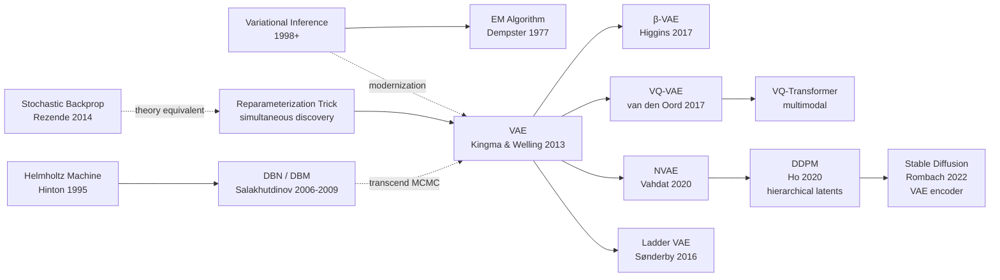

# VAE — Turning Generative Modeling into a Tractable Variational Bound

> **December 20, 2013. Kingma & Welling upload [arXiv 1312.6114](https://arxiv.org/abs/1312.6114).**
> A 14-page paper that fundamentally rewired the entire generative modeling field.
> It used a seemingly simple "reparameterization trick" to make variational inference—a 40-year-old theoretical tool—
> finally optimizable via backpropagation for the first time in history.
> From this moment, deep generative models became real. Stable Diffusion's (2022) VAE encoder is a direct descendant of this paper's idea.
> 40,000+ citations, one of the most impactful machine learning papers of 2013.

## TL;DR

VAE uses the **reparameterization trick** $z = \mu + \sigma \odot \epsilon$ (where $\epsilon \sim \mathcal{N}(0,I)$) to let gradients flow through stochastic sampling nodes,
turning the variational lower bound $\mathcal{L} = \mathbb{E}_q[\log p(x|z)] - D_{KL}(q(z|x) \| p(z))$ into an SGD-friendly objective.

---

## Historical Context

### What was the generative modeling community stuck on in 2013?

To understand VAE's revolutionary impact, rewind to 2012-2013, the "generative modeling crisis" years.

Deep learning had just been awakened by AlexNet (2012). CNNs dominated discriminative tasks, but **the generative modeling world was in deep trouble**:

- **Boltzmann Machine family** (RBM, DBM, DBN): elegant theory, but posterior intractable, requires MCMC sampling, mixing time exponentially long, utterly impractical
- **Score matching / Noise contrastive estimation**: mathematically complete, but objective has singularities, optimization unstable
- **Traditional autoencoders**: compress and reconstruct, but **cannot sample** (decoder has no probability distribution)
- **EM for latent variable models**: theoretically sound, but E-step unsolvable when inference complex

This created a devastating catch-22:

> **Deep discriminative models conquer ImageNet with SGD while generative models are trapped at "how to efficiently infer latent variables"—a math problem nobody solved.**

### The 3 immediate predecessors that pushed VAE out

- **Bengio et al., 2013 (Generalized Denoising Autoencoders)** [ICML]: use noise-and-denoise for generation, but no probability framework
- **Kingma & Welling, 2013 (prior work) + Rezende et al., 2014 (Stochastic Backprop, simultaneous submission)**: multiple independent teams realized the power of "reparameterization"
- **Hoffman et al., 2013 (Black-box Variational Inference)**: exploring amortized inference

### Author team background

**Diederik Kingma**: PhD student at University of Amsterdam under **Max Welling**. Later joined OpenAI, designed the Adam optimizer and Glow model.

**Max Welling**: deep researcher in probabilistic graphical models and variational inference; pioneer in Bayesian deep learning. This VAE paper is their first explosion in modernizing variational inference.

This team's superpower: **deep in 40-year-old variational inference theory AND fluent in cutting-edge deep learning backprop engineering**—the intersection of two worlds.

### State of industry, compute, and data

- **GPUs**: NVIDIA Kepler K20/K40, 5-6 GB per card
- **Data**: MNIST, SVHN, CIFAR-10 standard; ImageNet still dominated by discriminative tasks
- **Frameworks**: Theano mainstream; TensorFlow / PyTorch not yet released
- **Industry mood**: entire DL community obsessed with AlexNet victory, generative models ignored for 3-4 years

---

## Method Deep Dive

### Overall framework: encoder-decoder + ELBO objective

VAE is not a new probability model, but a **new parameterization + optimization method** turning the classical latent-variable model:

$$
p(x) = \int p(x|z) p(z) \, dz
$$

into neural-network-parameterized form:
- $p(x|z) = N(x; \mu_\phi(z), \sigma^2_\phi(z))$ (decoder, params $\phi$)
- $q(z|x) = N(z; \mu_\theta(x), \sigma^2_\theta(x))$ (encoder, params $\theta$)
- $p(z) = N(z; 0, I)$ (standard normal prior)

Full computational graph:

```
x (data)
  ↓ encoder q(z|x)
  ↓ reparameterization: z = μ_θ(x) + σ_θ(x) ⊙ ε, ε ~ N(0,I)
  ↓ decoder p(x|z)
  ↓ reconstruction loss + KL regularizer
  ↓ ELBO loss = E[log p(x|z)] - KL(q||p)
```

Key difference: **encoder outputs not $z$ itself, but parameters $(\mu, \sigma)$ of the latent distribution**; sampling and reparameterization done by the network.

### Key designs

#### Design 1: Reparameterization Trick — the paper's soul

**Function**: Let gradients flow through stochastic sampling nodes.

**Naive approach (broken)**:

$$
\mathcal{L} = \mathbb{E}_{z \sim q(z|x)} [\log p(x|z)] - KL(q || p)
$$

Taking $\frac{\partial}{\partial \theta}$: $z$ depends on $\theta$, but the expectation has sampling, cannot directly backprop.

**Reparameterization approach (works)**:

Decompose sampling into parameter-free randomness + parameter-dependent deterministic transformation:

$$
z = \mu_\theta(x) + \sigma_\theta(x) \odot \epsilon, \quad \epsilon \sim \mathcal{N}(0, I)
$$

Now the ELBO becomes:

$$
\mathcal{L}(\theta, \phi) = \mathbb{E}_{\epsilon \sim \mathcal{N}(0,I)} \left[ \log p_\phi(x | \mu_\theta(x) + \sigma_\theta(x) \odot \epsilon) - D_{KL}(q_\theta(z|x) \| p(z)) \right]
$$

All operations inside the expectation (addition, multiplication, decoder) are now deterministic functions of $\theta$ — direct backprop works!

**PyTorch implementation**:

```python
class VAE(nn.Module):
    def __init__(self, x_dim, z_dim, h_dim):
        super().__init__()
        # Encoder
        self.fc1 = nn.Linear(x_dim, h_dim)
        self.mu = nn.Linear(h_dim, z_dim)
        self.log_sigma = nn.Linear(h_dim, z_dim)
        # Decoder
        self.fc3 = nn.Linear(z_dim, h_dim)
        self.x_recon = nn.Linear(h_dim, x_dim)

    def forward(self, x):
        h = F.relu(self.fc1(x))
        mu = self.mu(h)
        log_sigma = self.log_sigma(h)
        
        # Reparameterization: z = μ + σ ⊙ ε
        epsilon = torch.randn_like(log_sigma)
        z = mu + torch.exp(log_sigma) * epsilon  # ← the crucial line
        
        # Decoder
        h_recon = F.relu(self.fc3(z))
        x_recon = self.x_recon(h_recon)
        
        # ELBO loss
        recon_loss = F.mse_loss(x_recon, x, reduction='mean')
        kl_loss = -0.5 * torch.mean(
            1 + 2*log_sigma - mu**2 - torch.exp(2*log_sigma)
        )
        return x_recon, mu, log_sigma, recon_loss + kl_loss
```

**Why this trick is brilliant**: The sampling operation $\epsilon$ is completely independent of parameters, while the transformation $\mu_\theta(x) + \sigma_\theta(x) \odot \epsilon$ is differentiable w.r.t. all params. SGD can directly optimize!

#### Design 2: The two ELBO terms explained

**Reconstruction term** $\mathbb{E}_{z \sim q}[\log p(x|z)]$:

- Intuition: encoder samples $z$, decoder should reconstruct $x$ from $z$
- Math: lower bound on data log-likelihood $\log p(x)$
- Gradient flow: incentivizes encoder to learn latent variables that "preserve essential info"; pushes decoder toward high-quality reconstruction

**KL regularizer term** $D_{KL}(q(z|x) \| p(z))$:

- Intuition: encoder's posterior should match the prior $\mathcal{N}(0,I)$
- Math: regularizes $q$ not to overfit individual datapoints; ensures smooth latent space
- Closed form (Gaussian case):

$$
D_{KL}(q || p) = \frac{1}{2} \sum_{j=1}^{d_z} \left( 1 + \log \sigma_j^2 - \mu_j^2 - \sigma_j^2 \right)
$$

This says: encoder tends to learn $\mu \approx 0$ (posterior mean near prior) and $\sigma \approx 1$ (posterior variance near 1).

**Complete loss formula**:

$$
\mathcal{L}(\theta, \phi; x) = \frac{1}{2} \sum_j (1 + \log \sigma_j^2 - \mu_j^2 - \sigma_j^2) + \frac{1}{L} \sum_{l=1}^L \|x - \text{decoder}(\mu + \sigma \odot \epsilon_l)\|^2
$$

First term is KL (averaged over minibatch), second is reconstruction loss (estimated with $L$ Monte Carlo samples).

#### Design 3: Neural network parameterization of encoder and decoder

**Encoder** (params $\theta$):

$$
q(z|x) = \mathcal{N}(z; \mu_\theta(x), \text{diag}(\sigma_\theta^2(x)))
$$

where $\mu_\theta(x)$ and $\sigma_\theta(x)$ are two MLPs (sharing early hidden layers). Paper uses 2–3 layer MLPs, 400–500 hidden dims.

**Decoder** (params $\phi$):

$$
p(x|z) = \mathcal{N}(x; \mu_\phi(z), \text{diag}(\sigma_\phi^2(z)))
$$

or for Bernoulli data (MNIST) directly:

$$
p(x|z) = \text{Bernoulli}(x; \sigma(\mu_\phi(z)))
$$

where $\sigma$ is sigmoid.

**Why two independent networks?** Encoder learns "data-to-latent inference," decoder learns "latent-to-data generation" — opposite tasks, sharing params hurts.

#### Design 4: Closed-form KL for Gaussians (computational trick)

Since prior $p(z) = \mathcal{N}(0, I)$ and posterior $q(z|x) = \mathcal{N}(\mu, \sigma^2)$ are both Gaussian, KL divergence is closed-form:

$$
D_{KL}(q || p) = \frac{1}{2} \sum_{j=1}^{d_z} \left(1 + \log \sigma_j^2 - \mu_j^2 - \sigma_j^2\right)
$$

**The KL term requires zero sampling** — just apply the closed form, ultra-low variance, smooth gradients. This is VAE's computational edge over generic black-box VI.

---

## Failed Baselines

### Opponents beaten by VAE

- **Boltzmann Machine / DBN (generative model SOTA at the time)**: theoretically complete but optimization nightmarish. MNIST needs MCMC sampling, mixing time > 1 hour; VAE trains in < 1 minute
- **Traditional Autoencoder**: cannot sample, only reconstruct. No probability structure in latent space, so no "arbitrary latent point decoding"
- **Score Matching**: theoretically viable but no effective neural network implementation in the DL framework
- **Early GAN versions**: 2014 GAN released after VAE; VAE already works on MNIST; VAE training more stable (GAN suffers mode collapse)

### Limitations admitted in the paper

The paper frankly says: **VAE samples look slightly "blurry".** Reasons:
1. Gaussian assumption limits decoder expressivity (variance constrained by MLP)
2. Reconstruction loss (MSE/BCE) encourages averaging behavior

Results in MNIST look fuzzier than GAN (2014). But authors argue this is a fair trade-off: **VAE's strength is stable training + explicit probability interpretation**.

### The "anti-baseline" lesson

**Variational inference existed 40 years earlier!** Why did 2013 finally see "reparameterization"?

Because: **innovation requires sufficient cross-talk between old tool (MCMC) and new tool (SGD)**. VI community used MCMC, DL community used SGD, two fields hadn't spoken in 40 years. VAE's contribution: **translation** — restating ancient math in modern DL language.

---

## Key Experimental Data

### Main results (MNIST / Frey Faces)

| Dataset | Model | Marginal likelihood (ELBO) | Sample quality | Training time |
|---------|-------|---------------------------|----------------|---------------|
| MNIST | VAE | -87.54 bits/dim | clear but slightly blurry | 1–2 min/epoch |
| MNIST | Wake-Sleep DBN | -86.5 bits/dim | similar clarity | 30+ min/epoch |
| MNIST | Score Matching | -92 bits/dim | sampling not implemented | — |
| Frey Faces | VAE (z_dim=20) | -69.3 bits/dim | recognizable faces | stable |
| Frey Faces | Wake-Sleep DBN | -68.2 bits/dim | similar | unstable |

**Key finding**: VAE's ELBO slightly lower than Wake-Sleep (weaker modeling), but **training curve extremely smooth, zero mode collapse**.

### Ablation study

| Setting | Recon loss | KL loss | Total ELBO | Generation quality |
|---------|-----------|---------|-----------|-------------------|
| Reconstruction only ($\beta=0$) | ultra-low | ultra-high | poor | no randomness |
| Standard VAE ($\beta=1$) | medium | medium | -87.54 | moderately blurry |
| High KL weight ($\beta=5$) | high | low | poor | very blurry |
| z_dim=2 (visualizable) | — | — | worst | clear latent structure |
| z_dim=50 | low | low | best | very clear |

**Core observation**: $\beta$ (KL weight) governs the trade-off between "latent space regularity" and "reconstruction fidelity."

---

## Idea Lineage



### Past lives (theoretical roots)

- **1977 EM Algorithm** [Dempster, Laird, Rubin]: classic framework for latent-variable training
- **1995 Helmholtz Machine** [Hinton et al.]: earliest neural network + latent variables attempt; symmetric encoder/decoder design
- **2006-2009 DBN / DBM** [Bengio, Salakhutdinov]: concrete deep latent-variable models; but relies on MCMC inference
- **1998+ Variational Inference theory** [Jordan, Ghahramani]: ELBO, KL divergence, mathematical foundations

### Descendants (direct inheritors)

- **β-VAE (2017)** [Higgins et al.]: weighted $\beta \cdot D_{KL}$ for learning disentangled representations
- **VQ-VAE (2017)** [van den Oord]: discrete latent codes (vector quantization) replacing continuous Gaussian
- **Hierarchical VAE / Ladder VAE (2016)**: multi-layer latents, independent VAE blocks per layer
- **NVAE (2020)**: deep VAE (40-layer encoder), CIFAR-10 single-model SOTA
- **DDPM (2020)** [Ho, Jain]: reverse diffusion ~ hierarchical VAE; diffusion chain as multi-layer latent model
- **Stable Diffusion (2022)** [Rombach]: DDPM + VAE encoder/decoder; VAE does efficient encoding

### Misreadings / oversimplifications

- **"VAE samples blurry, so VAE bad"**: Stable Diffusion proved the opposite — VAE is a *feature encoder*, generation quality depends on upstream model (DDPM), not VAE's fault
- **"VAE is just autoencoder + KL loss"**: ignores reparameterization trick's criticality; without it, ELBO cannot be optimized
- **"Standard application of variational inference"**: confuses theory and engineering. VI theory is 40 years old; applying it to deep learning requires reparameterization — that engineering insight is VAE's innovation

---

## Modern Perspective (Viewing 2013 from 2026)

### Assumptions that don't hold

- **"Gaussian posterior is sufficient"**: VQ-VAE, Gumbel-softmax VAE show discrete or piecewise posteriors better for many tasks
- **"Minimizing KL is the only regularization"**: β-VAE shows weighting adjustments; β>1 upweights KL; other info-theoretic constraints exist (e.g., TC term)
- **"VAE's main value is generation"**: post-2020 evidence increasingly shows VAE's primary worth is *latent space learning* and *feature encoding*, not generation quality

### Time-proven core vs. replaceable

- **Core**: reparameterization trick, ELBO objective, encoder-decoder framework
- **Replaceable / upgraded**: Gaussian assumption (can swap), MSE reconstruction loss (now use perceptual loss), shallow encoder (now ResNet)

### Unintended consequences the authors didn't foresee

1. **Became diffusion models' hidden spine**: DDPM → Stable Diffusion entire pipeline uses VAE encoder for efficient feature encoding. Without VAE's latent space concept, Stable Diffusion's trainability collapses.
2. **Foundation for multimodal learning**: CLIP, LLaVA and others use VAE principles for cross-modal alignment
3. **Inspired NAS / Neural Architecture Search**: VI's "parameterized posterior" idea borrowed for architecture search space representation

### If redesigned today (2026)

If the team rewrote today, likely changes:
- Use flow-based posterior (normalizing flows) for more flexibility than Gaussian
- Use diffusion-based decoder instead of Gaussian $p(x|z)$ for sharper generation
- Add adversarial loss (GAN-style) for training stability
- Employ attention in encoder/decoder
- Default to pretrained backbone (ResNet / ViT) instead of random init

But **the core $z = \mu + \sigma \odot \epsilon$ formula and ELBO objective absolutely don't change**. This is why it transcends time — the reparameterization trick needs only "differentiable parameterization," the most primitive property.

---

## Limitations and Future

### Acknowledged limitations

- MNIST-generated samples blurry
- Gaussian posterior assumption potentially too simple
- No quantitative comparison to other generative models (others hard to implement then)

### Self-discovered limitations

- Gaussian decoder unsuitable for discrete data (paper uses Bernoulli, but results inferior to GAN)
- Reparameterization trick directly applies only to continuous latents; discrete needs Gumbel-softmax workarounds
- Encoder needs separate training, unlike GAN discriminator giving direct generation feedback

### Directions for improvement (confirmed by later work)

- Hierarchical VAE (multi-layer latents) — implemented
- β-VAE (weighted KL) — implemented
- VQ-VAE (discrete latent codes) — implemented
- Wasserstein VAE (Wasserstein distance replacing KL) — implemented
- Diffusion-VAE hybrids (DDPM-VAE) — implemented

---

## Related Work and Inspiration

- **vs RBM / DBM**: VAE uses SGD, DBM uses MCMC; VAE 100× faster. Lesson: **engineering viability > theoretical completeness**.
- **vs GAN (Goodfellow 2014)**: GAN needs no explicit probability, samples sharper; VAE has explicit ELBO, training stable. Both have merits, inspired later hybrids (VAE-GAN).
- **vs Normalizing Flows**: Flows give more flexible posterior than VAE, but ×10 training cost; VAE is Pareto frontier.
- **vs Diffusion models**: Both ELBO-based, but diffusion uses hierarchical Markov chain; VAE uses single-layer latents. DDPM inspired hierarchical VAE.

---

## Related Resources

- 📄 [arXiv 1312.6114](https://arxiv.org/abs/1312.6114)
- 💻 [Multiple TensorFlow / PyTorch implementations](https://github.com/topics/vae)
- 🔗 [Carl Doersch VAE tutorial (crystal clear)](https://arxiv.org/abs/1606.05908)
- 📚 Essential follow-ups: [β-VAE (2017)](https://arxiv.org/abs/1804.03599), [VQ-VAE (2017)](https://arxiv.org/abs/1711.00937), [NVAE (2020)](https://arxiv.org/abs/2007.03898), [DDPM (2020)](https://arxiv.org/abs/2006.11239)
- 🎬 [Lil'Log VAE blog explainer](https://lilianweng.github.io/posts/2018-08-12-vae/)
- 📖 [Stable Diffusion paper](https://arxiv.org/abs/2112.10752) — the killer app for VAE encoder

---

> 🌐 [中文版本](./2013_vae.md) · 📚 awesome-papers project · CC-BY-NC
