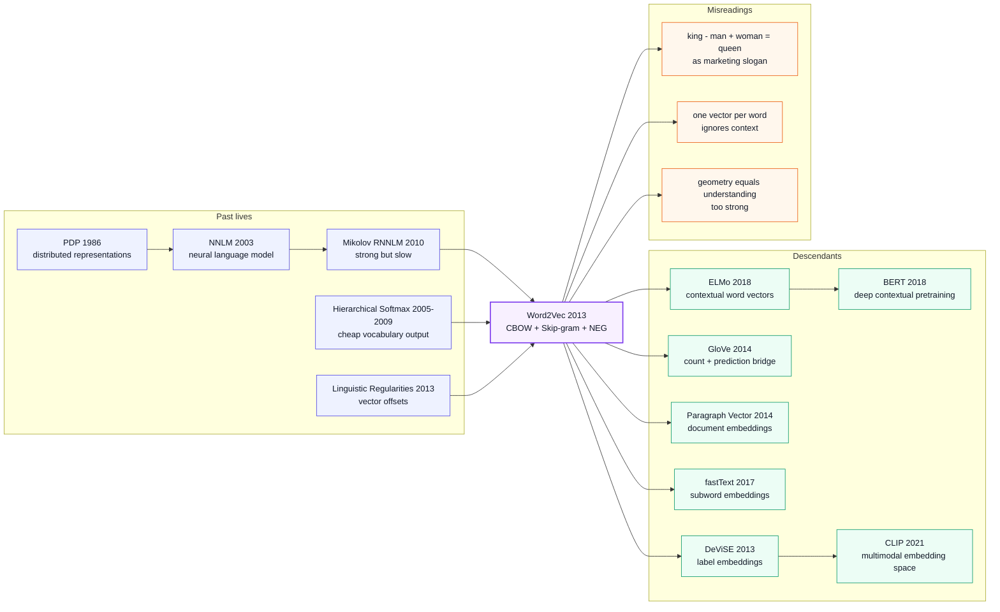

# Word2Vec - The Industrial Shortcut that Put Meaning into Vectors

> **On January 16, 2013, Tomas Mikolov, Kai Chen, Greg Corrado, and Jeffrey Dean at Google uploaded [arXiv:1301.3781](https://arxiv.org/abs/1301.3781); on October 16 the same year, the follow-up [arXiv:1310.4546](https://arxiv.org/abs/1310.4546) added negative sampling, subsampling, and phrase vectors.** Word2Vec's strange power was not that it invented word vectors from nothing. It did something more industrial: it stripped neural language modeling down until the expensive hidden layer disappeared, leaving a near-embarrassingly simple prediction game — use a word to predict its neighbors, or use neighbors to predict the word. What used to take weeks of neural-LM training became a one-day C++ job, a downloadable Google News vector file, and a default dependency for almost every NLP system of the 2010s. The slogan `king - man + woman ≈ queen` survived because it compressed the whole bargain into one line: language meaning, if trained at scale with the right shallow objective, behaves as geometry.

## TL;DR

Mikolov, Chen, Corrado, and Dean's 2013 ICLR Workshop paper [Efficient Estimation](https://arxiv.org/abs/1301.3781), together with the NeurIPS follow-up [Distributed Representations of Words and Phrases](https://arxiv.org/abs/1310.4546), rewrote word-representation learning from "train a full neural language model" into two shallow predictive objectives: CBOW predicts a center word from its context, and Skip-gram maximizes $\frac{1}{T}\sum_t\sum_{-c\le j\le c,j\ne0}\log p(w_{t+j}\mid w_t)$. The baseline it defeated was not one model but an entire slow 2010-era toolkit: a 640-dimensional Mikolov RNNLM reached 24.6% total accuracy on the analogy table; 300-dimensional Skip-gram trained on 783M words reached 53.3%; 1000-dimensional Skip-gram on 6B words reached 65.6%. The October paper then replaced full-vocabulary softmax with negative sampling, $\log \sigma(v'_{w_O}{}^\top v_{w_I}) + \sum_i \log \sigma(-v'_{w_i}{}^\top v_{w_I})$, making one-day, 100B-token-scale C++ embedding training realistic. Word2Vec's hidden lesson is that the 2013 NLP bottleneck was not "models are not deep enough"; it was "representations are not cheap enough to become infrastructure." It industrialized distributional semantics, and it gave GloVe, fastText, [BERT (2018)](../era3_attention/2018_bert.md), and [CLIP (2021)](../era4_foundation_models/2021_clip.md) the same premise: first turn symbols into geometry, then deeper models have something useful to build on.

---

## Historical Context

### What was NLP stuck on in 2013?

To understand Word2Vec's impact, return to everyday NLP in 2012-2013. AlexNet had just shown vision researchers that end-to-end feature learning could change an entire field, but most NLP systems still treated words as discrete IDs: a word was an integer in a vocabulary, maybe expanded into a sparse one-hot vector. To the model, `dog` and `cat` had no built-in similarity, and the relationship between `Paris` and `France` did not naturally live in a computable geometry.

Industrial systems were still dominated by **N-gram language models + feature engineering + linear models / CRFs / MaxEnt**. That stack was controllable, fast, stable, and able to consume huge text collections. Its weakness was just as clear: it memorized surface co-occurrence and hand-built features, but it did not compress similar words, analogy relations, or rare entities into transferable representations. LSA, LDA, and topic models could perform dimensionality reduction, but they were slow, loose in interpretation, and insensitive to word order and fine-grained syntax. Neural language models existed — Bengio 2003, Collobert & Weston 2008, Mikolov's RNNLM line in 2010 — and they already proved dense vectors were useful. But they were expensive: a full NNLM trained input projections, hidden layers, and a full-vocabulary output layer together; once the vocabulary reached hundreds of thousands, $H \times V$ or $D \times V$ dominated training time.

So the real 2013 tension was not "do word vectors exist?" They did. The real tension was: **can word vectors become as cheap and universal as TF-IDF, while carrying more semantic structure than LSA or early NNLMs?** Word2Vec's answer was brutal: stop tying embedding learning to a full language model; train only the useful middle representation.

### The immediate predecessors that pushed Word2Vec out

- **Rumelhart, Hinton, and Williams 1986 distributed representations**: Compressing symbols into vectors was not invented by Word2Vec. The PDP era had already proposed that concepts could be represented jointly by many continuous dimensions. Word2Vec inherits that line, but scales it to billion-word corpora.
- **Bengio, Ducharme, Vincent, and Janvin 2003 Neural Probabilistic Language Model**: The crucial ancestor of modern neural language modeling, where word vectors appear as learned parameters. But they serve next-word likelihood, with costly hidden and softmax layers. Word2Vec effectively turns the "embedding by-product" into the main product by removing the hidden layer.
- **Morin & Bengio 2005 / Mnih & Hinton 2009 hierarchical softmax**: Hierarchical softmax reduces vocabulary normalization from $O(V)$ to $O(\log V)$. The first Word2Vec paper directly adopts a Huffman tree so frequent words get shorter paths. This is not conceptual decoration; it is a prerequisite for trainability.
- **Mikolov's 2010-2012 RNNLM line**: Mikolov had already shown RNNLMs were strong for speech recognition and language modeling, and he had also lived through how slow they were. Word2Vec is the self-dismantling of that line: if the RNNLM embeddings are useful, can we skip the RNN and train the embeddings directly?
- **Mikolov, Yih, and Zweig 2013 linguistic regularities**: `king - man + woman = queen` was not a later marketing meme. It was an evaluation idea the same group had already systematized at NAACL 2013. Word2Vec made that phenomenon the central benchmark.
- **Mnih & Teh 2012 NCE**: The close relative of the NeurIPS 2013 negative-sampling objective. NCE aimed to approximate softmax likelihood; Word2Vec takes the pragmatic turn: if vector quality is the goal, recovering normalized probabilities is optional.

### What was the Google team doing?

Tomas Mikolov arrived at Google standing between two worlds. On one side was his Brno / Microsoft Research experience with RNNLMs, speech recognition, and language modeling. On the other was Google's production reality: search, ads, translation, knowledge bases, news, entity recognition, each with huge vocabularies, rare entities, multilingual corpora, and latency budgets.

Kai Chen, Greg Corrado, and Jeffrey Dean mattered just as much. Corrado and Dean were not merely industrial names on a paper; they represented the capability Google uniquely had at that moment: put a neural idea into a large-scale distributed training framework and a production-grade C++ toolchain. The 1301.3781 paper reports DistBelief parallel-training results; the 1310.4546 paper reports single-machine multithreaded C++ code and pretrained Google News vectors. That combination turned Word2Vec from an NLP paper into a downloadable, reproducible component that could be dropped into almost any pipeline.

One historical point is easy to miss: Word2Vec appeared before Transformer, seq2seq attention, and BERT. The pretrain-then-finetune NLP paradigm had not yet formed; GPU-trained large language models were not everyday practice. Word2Vec's path to adoption was not "a bigger neural network replaces every old system." It was "a cheap intermediate representation first infiltrates all the old systems." It could enter CRFs, SVMs, RNNs, retrieval systems, recommender systems, and zero-shot image classifiers precisely because it did not require rewriting the entire stack.

### Compute, data, code, and community state

- **Compute**: The papers show two routes: large-scale training with 50-100 replicas on DistBelief, and lightweight single-machine multithreaded C++ training. The second route mattered more for diffusion because ordinary labs did not need Google's internal cluster.
- **Data**: 1301.3781 uses Google News with 6B tokens and a 1M-word vocabulary for large-scale experiments; 1310.4546 reports that an optimized single-machine implementation can process more than 100B words in one day. That scale was two to three orders of magnitude beyond many earlier public embeddings.
- **Frameworks**: TensorFlow had not been released, and PyTorch was further away. The released code was not a polished deep-learning-framework demo; it was a command-line C++ program. That helped adoption: compile, feed text, get vectors, with almost no framework dependency.
- **Community climate**: NLP in 2013 was still cautious about neural networks taking over everything, but it was very willing to try dense vectors as features. Word2Vec sat exactly on that acceptance boundary: neural enough to feel new, small enough to behave like a plug-in feature.
- **Open-source timing**: Code and pretrained vectors appeared early; blogs and tutorials spread quickly; `king - man + woman ≈ queen` made the idea legible even to non-NLP readers. This combination of engineering convenience and cognitive hook explains why Word2Vec's social impact exceeded many embedding papers with comparable theoretical importance.

---

## Method Deep Dive

### Overall framework

Word2Vec is often misread as "the paper that invented word vectors." A more precise description is that it compressed the embedding-learning objective inside neural language models into two extremely cheap local prediction tasks, then used a set of engineering approximations to make full-vocabulary classification runnable on ordinary machines. Its technical beauty is not depth but shallowness: **shallow enough to leave only a lookup table, a context window, and an output approximation, yet strong enough to push meaning, syntax, and entity relations into Euclidean space**.

The two models mirror each other. CBOW averages context-word vectors and predicts the center word; it is fast and especially good for frequent words and syntactic regularities. Skip-gram uses the center word to predict surrounding context words; it creates more training examples and tends to work better for rare words and semantic relations. The first paper uses hierarchical softmax as the output approximation; the second paper adds negative sampling, frequent-word subsampling, and phrase detection, producing the `word2vec` tool people remember.

| Model | Input | Output | Best at | Cost bottleneck |
|-------|-------|--------|---------|-----------------|
| CBOW | averaged context vectors | center word | fast training, syntactic rules | output approximation |
| Skip-gram | center-word vector | surrounding words | rare words, semantic analogies | multiple predictions per window |
| NNLM / RNNLM baseline | history words + hidden state | next word | language-model perplexity | hidden layer + full-vocabulary softmax |
| LSA / topic-model baseline | document-word matrix | low-dimensional topics / singular vectors | document-level similarity | coarse semantics, poor incrementality |

**Counter-intuitive point**: Word2Vec did not make the model larger; it made the model smaller. It did not optimize for better language-model likelihood; it recognized that if the goal is reusable word vectors, much of the computation inside a full LM is off-path. That objective rewrite is the root of its industrial success.

### Key designs

#### Design 1: CBOW and Skip-gram dual architectures - turning language modeling into a local prediction game

**Function**: CBOW and Skip-gram slice a long sequence into many local windows and use "context <-> center word" prediction to force embeddings to absorb co-occurrence structure. CBOW is a fast corpus sweeper; Skip-gram manufactures multiple training examples from each center word.

**Core formula**: Skip-gram maximizes the average log probability of nearby words given the center word; CBOW averages context vectors and predicts the center word.

$$
\mathcal{L}_{\text{SG}} = \frac{1}{T}\sum_{t=1}^{T}\sum_{-c \le j \le c, j\ne0}\log p(w_{t+j}\mid w_t),\qquad
\mathcal{L}_{\text{CBOW}} = \frac{1}{T}\sum_{t=1}^{T}\log p\left(w_t\mid \frac{1}{2c}\sum_{-c\le j\le c,j\ne0} v_{w_{t+j}}\right)
$$

**Minimal training loop**:

```python
def skipgram_pairs(tokens, window):
    for center, word in enumerate(tokens):
        radius = random.randint(1, window)
        left = max(0, center - radius)
        right = min(len(tokens), center + radius + 1)
        for pos in range(left, right):
            if pos != center:
                yield word, tokens[pos]

for input_word, output_word in skipgram_pairs(tokens, window=5):
    input_vec = W_in[input_word]
    loss = predict_context_word(input_vec, output_word)
    loss.backward()
```

| Choice | Training examples | Semantic behavior | Syntactic behavior | Paper conclusion |
|--------|-------------------|-------------------|--------------------|------------------|
| CBOW | once per center word | medium | strong | faster, good for large coarse training |
| Skip-gram | up to $2c$ per center word | strong | strong | much better on rare words and semantic analogies |
| RNNLM | once per position but recurrent | medium | strong | can be high quality, but far slower |

**Design rationale**: A traditional LM asks, "what is the probability of the next word?" Word2Vec asks, "what representation best explains local context?" The two questions look close, but their engineering cost is completely different. Once the task is rewritten as local-window prediction, the model no longer needs complex hidden state, and downstream users no longer need to retrain features for every task.

#### Design 2: Removing the nonlinear hidden layer - buying data scale with complexity reduction

**Function**: Word2Vec's boldest engineering choice is to remove the expensive nonlinear hidden layer from NNLMs. It sacrifices per-example modeling power in exchange for enough throughput to consume billions of tokens; in distributional semantics, more clean co-occurrence often beats fancier nonlinearity.

**Complexity comparison**: The paper writes training complexity as the product of epoch count $E$, training words $T$, and per-sample cost $Q$. The important differences all sit inside $Q$.

$$
O = E\times T\times Q,\qquad
Q_{\text{NNLM}} = N D + N D H + H V,
\quad Q_{\text{CBOW}} = N D + D\log_2 V,
\quad Q_{\text{SG}} = C(D + D\log_2 V)
$$

**Complexity intuition code**:

```python
def estimate_cost(model, vocab=1_000_000, dim=300, hidden=640, context=10):
    if model == "nnlm":
        return context * dim + context * dim * hidden + hidden * vocab
    if model == "cbow_hs":
        return context * dim + dim * math.log2(vocab)
    if model == "skipgram_hs":
        return context * (dim + dim * math.log2(vocab))
    raise ValueError(model)

for name in ["nnlm", "cbow_hs", "skipgram_hs"]:
    print(name, round(estimate_cost(name) / 1e6, 2), "million ops-ish")
```

| Architecture | Hidden layer? | Output approximation | Dominant per-sample term | Engineering meaning |
|--------------|---------------|----------------------|--------------------------|---------------------|
| Feedforward NNLM | yes | full / hierarchical softmax | $N D H$ and $H V$ | accurate but slow |
| RNNLM | recurrent state | hierarchical softmax | $H H$ and $H\log V$ | strong but sequential |
| CBOW | no | hierarchical softmax / NEG | $N D + D\log V$ | extremely fast |
| Skip-gram | no | hierarchical softmax / NEG | $C(D + D\log V)$ | slightly slower, higher quality |

**Design rationale**: This is an early win for "trade model capacity for data scale." Word2Vec does not claim nonlinearity is useless. It says that, under 2013 hardware and corpus conditions, **a cheaper objective + more tokens + a larger vocabulary** changes the downstream ecosystem more than a beautiful NNLM that trains for weeks.

#### Design 3: Hierarchical softmax and Negative Sampling - updating only a few output parameters

**Function**: Full softmax requires normalization over $V$ words, impossible at million-word vocabulary scale. Hierarchical softmax turns word prediction into a walk down a Huffman tree; negative sampling goes further, turning multiclass classification into a set of "positive word versus noise word" binary decisions.

**Core formula**: The NeurIPS 2013 version replaces each softmax term for a positive pair $(w_I, w_O)$ with the negative-sampling objective.

$$
\log \sigma\left(v'_{w_O}{}^\top v_{w_I}\right)
+ \sum_{i=1}^{k}\mathbb{E}_{w_i\sim P_n(w)}\left[\log \sigma\left(-v'_{w_i}{}^\top v_{w_I}\right)\right],
\qquad P_n(w) \propto U(w)^{3/4}
$$

**NEG update pseudocode**:

```python
def neg_sampling_loss(center_id, context_id, num_negatives):
    center = W_in[center_id]
    positive = W_out[context_id]
    negatives = W_out[sample_unigram_pow_3_4(num_negatives)]

    pos_loss = -torch.logsigmoid(torch.dot(positive, center))
    neg_score = torch.matmul(negatives, center)
    neg_loss = -torch.logsigmoid(-neg_score).sum()
    return pos_loss + neg_loss
```

| Output training method | Updates per positive example | Normalized probability? | Best use | Word2Vec conclusion |
|------------------------|------------------------------|-------------------------|----------|---------------------|
| Full softmax | $V$ words | yes | small vocabularies, strict LMs | too slow |
| Hierarchical softmax | $\log V$ tree nodes | yes | rare words, short frequent-word paths | first-paper workhorse |
| NCE | positive + noise samples + noise probabilities | approximately yes | probability interpretation needed | usable but complex |
| Negative sampling | positive + $k$ noise words | no | vector quality only | became the default |

**Design rationale**: Word2Vec's target is not a calibrated language model; it is useful vectors. If vector-space quality improves, sacrificing probability normalization is acceptable. NEG's success previews a lesson later repeated across representation learning: you often do not need a full generative distribution, only a strong enough contrastive signal.

#### Design 4: Frequent-word subsampling, phrase tokens, and linear composition - cleaning the space

**Function**: The second paper fixes two pain points in the first version: frequent function words pollute training signal, and phrases are not always compositional from their words. Subsampling randomly removes low-information frequent words such as `the`, `of`, and `in`; phrase detection treats `New_York_Times` and `Air_Canada` as single tokens; additive composition explains why vector addition can produce meaningful phrase neighbors.

**Core formula**:

$$
P_{\text{discard}}(w_i)=1-\sqrt{\frac{t}{f(w_i)}},\qquad
\operatorname{score}(w_i,w_j)=\frac{\operatorname{count}(w_iw_j)-\delta}{\operatorname{count}(w_i)\operatorname{count}(w_j)}
$$

**Minimal corpus cleanup**:

```python
def keep_token(word, freq, threshold=1e-5):
    discard = max(0.0, 1.0 - math.sqrt(threshold / freq[word]))
    return random.random() > discard

def phrase_score(left, right, counts, delta=5.0):
    bigram = counts[(left, right)]
    return (bigram - delta) / (counts[left] * counts[right])
```

| Trick | Problem solved | Effect in the paper | Later fate |
|-------|----------------|---------------------|------------|
| Frequent-word subsampling | `the/of/in` dominate windows | 2x-10x speedup and better rare-word vectors | default preprocessing |
| Negative sampling | softmax too expensive | NEG-15 reaches 61% total analogy accuracy | default objective |
| Phrase detection | `Air Canada` is not `Air` + `Canada` | phrase analogy reaches 72% at best | inherited by subword / tokenizer design |
| Vector addition | word composition lacked intuition | `Russia + river` near `Volga River` | core embedding-space intuition |

**Design rationale**: Word2Vec is almost a compression pipeline for language data. It does not explicitly model parse trees and does not claim to understand phrase structure. It makes the training stream less noisy, entities more intact, and contrastive signals more concentrated. That pragmatic choice explains why the model worked outside the paper's own metrics.

### Loss / training recipe

Word2Vec's training recipe was copied endlessly because it had almost no deep-learning-framework dependency: scan text, build windows, look up embeddings, update a small number of parameters, linearly decay the learning rate. It is less a single model than an industrial process for turning large corpora into vector tables.

| Item | Setting | Notes |
|------|---------|-------|
| Vector dim | 100-1000 | 300d became the common public setting |
| Window size | 5-10 | Skip-gram often uses random windows, sampling distant words less |
| Min count | around 5 | filters extremely rare noisy tokens |
| Optimizer | SGD / asynchronous SGD / Adagrad | the DistBelief experiments use Adagrad |
| Learning rate | starts at 0.025, linearly decays to 0 | default style in the C++ tool |
| Negative samples | 2-5 for large data, 5-20 for small data | NEG-5 / NEG-15 are the main paper settings |
| Subsampling threshold | $t \approx 10^{-5}$ | discard probability rises with frequency |
| Training scale | 1B-100B+ tokens | speed comes from updating few parameters |

Viewed today, Word2Vec looks like a minimalist ancestor of modern self-supervised learning: define a prediction task without human labels, learn a transferable representation from raw data at scale, then feed that representation into downstream models. The difference is that in 2013 the representation was a static vocabulary table; after 2018, that table was replaced by deep contextual encoders.

---

## Failed Baselines

### Baselines that lost to Word2Vec

Word2Vec's victory was not "a little higher on a small benchmark." It simultaneously broke through a cluster of 2008-2012 word-representation baselines: public vectors were not strong enough, RNNLMs were too slow, and NNLMs still struggled to match Skip-gram's quality-per-compute even when trained on 6B words. More importantly, Word2Vec shifted evaluation from "do nearest neighbors look plausible?" to reproducible syntactic / semantic analogy accuracy.

| Baseline | 2013 advantage | Where it lost | Key number |
|----------|----------------|---------------|------------|
| Collobert-Weston NNLM 50d | early public neural embeddings | low dimensionality, small corpus, weak analogies | 11.0% total accuracy |
| Turian NNLM 200d | common ACL 2010 semi-supervised features | almost no semantic strength | 1.8% total accuracy |
| Mnih NNLM 100d | closer to neural-LM training | better syntax but weak semantics | 8.8% total accuracy |
| Mikolov RNNLM 640d | recurrent state can model history | slow training, still weak semantic analogies | 24.6% total accuracy |
| Google NNLM 100d / 6B | large data and full model | expensive, still below Skip-gram | 50.8% total accuracy |

The most striking loser is RNNLM. It was not a weak model; it represented Mikolov's own earlier line of work. Word2Vec shows that if the target is word representations rather than full sequence modeling, recurrent state is not worth the cost. **This is a paper where the author dismantles his own previous-generation method.**

### Failures admitted or exposed in the papers

Word2Vec was not invincible. The two papers reveal several clear failure signals: CBOW is weaker than Skip-gram on semantic analogies; Skip-gram alone underperforms the strongest RNNLMs on sentence completion; word vectors ignore word order by design; and phrase vectors require tokenization to merge multiword expressions. It solves word / phrase representation, not sentence understanding.

| Problem | Paper evidence | Why it matters |
|---------|----------------|----------------|
| CBOW has weaker semantics | CBOW 300d/783M semantic 15.5%, Skip-gram 50.0% | context averaging sacrifices rare-entity signal |
| Skip-gram is not a sentence model | MSR Sentence Completion: Skip-gram 48.0%, Average LSA 49% | local windows are insufficient for full-sentence coherence |
| Word order is invisible | the paper explicitly notes insensitivity to word order | later RNN/CNN/Transformer structure must fill the gap |
| Phrases do not naturally compose | `Canada` + `Air` does not equal `Air Canada` | phrase detection or tokenizers are required |

Those failure points became later research programs: fastText for morphology and rare words, doc2vec for documents, ELMo/BERT for context, subword tokenizers for open vocabulary, and Transformer for long-range structure.

### The real anti-baseline lesson

Word2Vec's lesson against older methods is not "shallow is always better than deep," nor "semantics is only co-occurrence." It is closer to an engineering law: **when a representation is meant to be reused by an entire community, trainability and distributability are part of model quality**. A 55%-accurate model that trains for weeks, is difficult to reproduce, and ships no public vectors can have less ecosystem impact than a 53%-accurate model that trains in a day, compiles as C++, and publishes downloadable vectors.

That is why GloVe, although theoretically closer to matrix factorization; fastText, although it repairs OOV behavior; and BERT, although it eventually replaces static vectors, are all still answering Word2Vec's question: how do we turn discrete symbols into transferable representations with a self-supervised objective? Word2Vec lost the war over the final form of NLP representations, but it won the war over whether representation learning must become infrastructure.

## Key Experimental Data

### Word analogy data

The central experiment in 1301.3781 is the Semantic-Syntactic Word Relationship test set: 8869 semantic questions and 10675 syntactic questions, solved by exact vector-offset matching in the form `a:b :: c:?`. The benchmark is charmingly harsh: synonyms count as wrong; the nearest neighbor must be the exact answer.

| Model | Dim | Training words | Semantic [%] | Syntactic [%] | Total [%] |
|-------|-----|----------------|--------------|---------------|-----------|
| Collobert-Weston NNLM | 50 | 660M | 9.3 | 12.3 | 11.0 |
| Mikolov RNNLM | 640 | 320M | 8.6 | 36.5 | 24.6 |
| Google NNLM | 100 | 6B | 34.2 | 64.5 | 50.8 |
| CBOW | 300 | 783M | 15.5 | 53.1 | 36.1 |
| Skip-gram | 300 | 783M | 50.0 | 55.9 | 53.3 |
| Skip-gram | 600 | 783M | 56.7 | 54.5 | 55.5 |

The key reading: Skip-gram does not win every column; its syntax is not always highest. But its semantic jump is so large that it turns "word meaning can be linearized" into visible evidence.

### Speed and scale data

Word2Vec's second experimental axis is the speed-quality frontier: how should data size and vector dimensionality trade off under the same budget? The paper repeatedly stresses that scanning more data for fewer epochs is often better than cycling through less data, a close cousin of later scaling-law intuition.

| Setting | Dim | Training words | Time | Total [%] |
|---------|-----|----------------|------|-----------|
| 1 epoch CBOW | 300 | 1.6B | 0.6 days | 36.1 |
| 1 epoch Skip-gram | 300 | 1.6B | 2 days | 53.8 |
| 1 epoch Skip-gram | 600 | 783M | 2.5 days | 55.5 |
| DistBelief CBOW | 1000 | 6B | 2 days x 140 CPU cores | 63.7 |
| DistBelief Skip-gram | 1000 | 6B | 2.5 days x 125 CPU cores | 65.6 |

1310.4546 pushes the engineering boundary further: the optimized single-machine implementation can train on more than 100B words in one day, and subsampling can yield roughly 2x-10x speedups. For community adoption this mattered even more than the DistBelief numbers, because it turned a Google-internal capability into a command-line tool ordinary researchers could reproduce.

### Phrase and compositionality data

The second paper shifts the experiment from words to phrases. It first merges phrases into tokens using a bigram score, then trains phrase vectors, then evaluates them on phrase analogies. Seen from today, this is an early shadow of tokenization: choose better language units before learning representations.

| Experiment | Setting | Result | Meaning |
|------------|---------|--------|---------|
| NEG-5 word analogy | 300d / 1B news | 59% total, 38 minutes | NEG already matches NCE speed |
| NEG-15 word analogy | 300d / 1B news | 61% total, 97 minutes | more negatives improve semantics |
| Subsampling + NEG-15 | 300d / 1B news | 61% total, 36 minutes | same quality with much faster training |
| Phrase analogy best | 1000d / 33B words / HS | 72% accuracy | phrase vectors need much larger data |

The most circulated table is of course `Paris - France + Italy = Rome` and `Russia + river ≈ Volga River`. But those examples matter for more than charm: they show that Skip-gram did not learn an arbitrary nearest-neighbor graph; many directions in its space are reusable linear relations. That is why embedding spaces later became useful for retrieval, recommendation, alignment, and multimodal learning.

---

## Idea Lineage



### Past lives (what forced Word2Vec out)

Word2Vec's ancestry is not a single line but three lines crossing. The first is **distributed representation**: PDP, Bengio's NNLM, and Collobert & Weston all believed symbols should live in continuous space. The second is **the engineering pressure of language modeling**: RNNLMs proved context prediction could learn good word representations, but also proved full neural LMs were too slow. The third is **output-layer approximation**: hierarchical softmax and NCE look like side techniques, yet they determine whether million-word vocabularies are trainable.

The key pressure comes from Mikolov's own RNNLM. Many classic papers defeat somebody else's method; Word2Vec dismantles its author's previous one. It inherits RNNLM's predictive objective but rejects recurrent state; inherits NNLM's embedding layer but rejects the nonlinear hidden layer; inherits NCE's noise-contrastive idea but rejects normalized probability as the only target.

### Descendants

1. **GloVe (2014)**: reconnects Word2Vec-style predictive training with traditional co-occurrence matrix factorization. Its lineage role is not simply "a Word2Vec alternative"; it explains why predictive models recover global co-occurrence structure.
2. **Doc2Vec / Paragraph Vector (2014)**: extends "words have vectors" to "documents have vectors," one of the first attempts to expand the embedding API to larger text units.
3. **DeViSE (2013) to CLIP (2021)**: DeViSE directly uses word2vec class vectors as ImageNet label embeddings; CLIP, eight years later, jointly trains text and image encoders into a larger alignment space. The models change, but the core problem remains: how can different modalities share a searchable geometry?
4. **fastText (2017)**: admits that Word2Vec handles OOV words and morphology poorly, then decomposes words into character n-grams. It does not overthrow Word2Vec; it gives static word vectors a morphological base layer.
5. **ELMo / BERT (2018)**: finally ends the "one word, one vector" route. The same `bank` receives different representations in different sentences, and Word2Vec's static table is replaced by a deep contextual function. But BERT still inherits Word2Vec's meta-paradigm: self-supervised prediction + large corpora + transferable representations.

### Misreadings / oversimplifications

The first misreading is to equate Word2Vec with `king - man + woman = queen`. The example travels well, but it is only the surface phenomenon. The deeper point is that the training objective and engineering recipe made many relation directions stable, not that one analogy is cute.

The second misreading is "Word2Vec understands meaning." It learns a compression of context distributions, not grounded semantics. It knows the co-occurrence structure of `Paris` and `France`, but not the streets, maps, political institutions, or real-world reference of Paris. That is why CLIP, LLMs, and multimodal grounding later had to add perception and interaction data.

The third misreading is "the shallow model won, so depth does not matter." Word2Vec wins the first mile of representation pretraining; as tasks move from words to sentences, paragraphs, reasoning, and instruction following, a static table quickly runs out of room. Its real legacy is not shallowness itself, but installing **self-supervised representation as reusable infrastructure** into NLP.

---

## Modern Perspective (looking back at 2013 from 2026)

### Assumptions that no longer hold

1. **"One word, one vector" no longer holds**. Word2Vec assigns one static vector to each token, so `bank` is identical in "river bank" and "bank account." After ELMo/BERT in 2018, this assumption collapses: meaning is not a property of a vocabulary item, but a function value of a token in context. Modern embeddings look more like activations inside a deep model than entries in a fixed table.
2. **"Local windows are enough for language structure" no longer holds**. Skip-gram window co-occurrence captures many semantic relations, but it cannot handle negation, coreference, long-distance dependencies, argument structure, or discourse. Transformer's later victory shows that local context statistics are an excellent start, not full language understanding.
3. **"Word-level tokenization is enough" no longer holds**. Word2Vec is brittle with OOV words, spelling variants, and morphologically rich languages. fastText repairs part of this with character n-grams; BPE / SentencePiece / unigram tokenizers move the problem to subword units. Modern LLMs treat tokenization as part of system capability, not mere preprocessing.
4. **"Linear analogies equal semantic understanding" no longer holds**. `king - man + woman = queen` is a beautiful geometric phenomenon, but it does not prove a grounded world model. It captures relation directions and corpus biases; it can learn countries and capitals, and it can also reproduce gendered occupational stereotypes.
5. **"Cheap embeddings will remain the downstream entry point" no longer holds**. From 2013 to 2017, downloading static vectors and feeding them into a downstream model was default practice. In 2026, most NLP systems extract contextual embeddings from pretrained Transformers or use instruction-tuned embedding models for retrieval.

### What survived vs. what did not

- **What survived**: self-supervised prediction, massive unlabeled text, transferable representations, vector-space retrieval, negative sampling / contrastive signal, and the idea of turning symbols into geometric objects. These are not Word2Vec-specific tricks; they are part of the grammar of the foundation-model era.
- **What was replaced**: static vocabularies, word-level tokens, local-window-only context, word-order blindness, fixed-dimensional lookup tables, and analogy accuracy as the central semantic metric. These choices were extremely effective in 2013, but they naturally receded after deep contextual models arrived.
- **What survived in transformed form**: negative sampling became a relative of contrastive learning; phrase detection became tokenizer / entity-linking / span-representation design; embedding lookup still exists, but as the first layer of a Transformer rather than the final representation itself.

That is Word2Vec's historical position: it is not the endpoint of modern NLP, but it made "representations can be learned first from unlabeled text" cheap enough that every system was willing to try.

### Side effects the authors did not foresee

1. **The analogy demo became a template for technical communication**. Many papers tried to recreate a `king - man + woman` one-glance effect. It helped embeddings spread, but it also made some readers over-trust vector spaces as clean, unbiased, interpretable semantic axes.
2. **Bias evaluation was pulled into the mainstream**. Word2Vec encodes gender, race, and occupation biases from its corpus into vector directions. Bolukbasi 2016 mattered because Word2Vec was everywhere: bias was no longer an abstract ethics issue, but a parameter inherited by downstream systems.
3. **Embeddings became a default interface across fields**. Recommender systems, graph learning, bioinformatics, knowledge graphs, image labels, and retrieval systems all borrowed the "discrete object -> dense vector" API. Many node / item embedding methods are reusing Word2Vec's interface imagination.
4. **Pretrained vectors complicated reproducibility**. Downstream papers often treated Google News vectors as fixed components, without fully controlling corpus, filtering, training details, or versioning. A public vector file lowers the barrier, but it also smuggles hidden data choices into experiments.

### If Word2Vec were rewritten today

If these two papers were rewritten in 2026, the core equations might not change, but the paper would handle several issues more explicitly. First, negative sampling would sit in the main body as a central objective rather than appearing beside hierarchical softmax as one of several options. Second, a subword tokenizer would replace the pure word vocabulary, with systematic OOV and morphologically rich language reporting. Third, bias / fairness / privacy analysis would be included, because vector spaces inherit corpus distributions. Fourth, analogy benchmarks would be complemented by retrieval, classification, zero-shot transfer, and downstream robustness. Fifth, geometric diagnostics such as anisotropy, frequency effects, and vector normalization would be part of the experiment suite.

But it would not become BERT. Word2Vec's value is precisely its smallness: a representation-learning tool explainable in a few dozen core lines, trainable quickly in C++, and immediately useful to old systems. A modern rewrite should make it more honest, more diagnosable, and more multilingual, not turn it into another large model.

## Limitations and Future Directions

### Author-acknowledged limitations

- **Word order is ignored**: the second paper explicitly notes that word representations are insensitive to word order and cannot naturally represent idiomatic phrases.
- **Phrases require extra processing**: phrases such as `Boston Globe` and `Air Canada` must first be identified as tokens; word vectors cannot be expected to compose them automatically.
- **Analogy accuracy is far from saturated**: despite attractive examples, the papers acknowledge that exact-match analogy tasks remain far from 100%, especially for semantic and phrase analogies.
- **Model choice is task dependent**: NEG, HS, subsampling, window size, and vector dimension have no single optimum; different tasks need different settings.

### Limitations from a 2026 view

- **Static semantics cannot handle polysemy**: multiple senses per word are a structural blind spot.
- **Rare words remain fragile**: subsampling reduces frequent-word pollution, but it cannot solve extremely rare or new words.
- **Interpretability constraints are weak**: dimensions have no semantic labels, and directions entangle frequency, corpus source, and social bias.
- **Evaluation is too narrow**: analogy benchmarks are memorable, but they do not cover reading comprehension, reasoning, generation, factuality, or dialogue.
- **Corpus governance is missing**: copyright, privacy, bias, and geographic coverage of pretraining text were barely foregrounded in 2013; today they must be addressed directly.

### Improvement directions already validated by follow-up work

- **fastText / subword embeddings**: character n-grams handle OOV, spelling, and morphology.
- **GloVe / matrix-factorization view**: local prediction and global co-occurrence statistics are connected.
- **ELMo / BERT / GPT family**: static tables become contextual functions.
- **Sentence-BERT / modern embedding models**: representation learning moves from words to sentences, paragraphs, and retrieval.
- **Contrastive multimodal learning**: CLIP carries the shared-vector-space idea into image-text alignment.
- **Bias measurement and debiasing**: social bias in embedding spaces becomes something that must be quantified.

## Related Work and Insights

- **vs NNLM / RNNLM**: NNLM and RNNLM have fuller objectives and can perform language modeling; Word2Vec has a narrower objective and only learns representations. Lesson: narrowing the target can sometimes make representations more reusable.
- **vs LSA / LDA**: LSA/LDA are also unsupervised dimensionality reduction methods, but they operate mostly on document-level statistics. Word2Vec's local-window prediction better captures lexical relations and is easier to train incrementally.
- **vs GloVe**: GloVe writes global co-occurrence matrices directly into the objective, while Word2Vec absorbs co-occurrence implicitly through prediction. Levy & Goldberg later explain the two as different faces of the same coin.
- **vs fastText**: fastText repairs OOV and morphology, making it the most natural engineering successor to Word2Vec.
- **vs BERT**: BERT is not simply "bigger Word2Vec"; it turns representation from a vocabulary entry into a contextual function. The shared theme is self-supervised pretraining; the dividing line is static versus dynamic.
- **vs CLIP**: CLIP's image-text vector space is philosophically close to Word2Vec's cross-object geometry, but the training signal changes from text windows to image-text contrast, and the model changes from lookup table to dual encoder.

## Resources

- 📄 [Efficient Estimation of Word Representations in Vector Space (arXiv:1301.3781)](https://arxiv.org/abs/1301.3781)
- 📄 [Distributed Representations of Words and Phrases and their Compositionality (arXiv:1310.4546)](https://arxiv.org/abs/1310.4546)
- 💻 [Google Code archive: word2vec](https://code.google.com/archive/p/word2vec/)
- 🔗 [Original Word2Vec project mirror and C tool references](https://github.com/tmikolov/word2vec)
- 📚 Further reading: [GloVe (2014)](https://nlp.stanford.edu/projects/glove/), [fastText subword embeddings (2017)](https://aclanthology.org/Q17-1010/), [ELMo (2018)](https://aclanthology.org/N18-1202/), [BERT (2018)](../era3_attention/2018_bert.md), [CLIP (2021)](../era4_foundation_models/2021_clip.md)
- 🎬 [Chris McCormick Word2Vec tutorial](http://mccormickml.com/2016/04/19/word2vec-tutorial-the-skip-gram-model/)
- 🌐 Cross-language: Chinese version -> [`/era2_deep_renaissance/2013_word2vec/`](/era2_deep_renaissance/2013_word2vec/)


---

> 🌐 [中文版](/era2_deep_renaissance/2013_word2vec/) · 📚 awesome-papers project · CC-BY-NC