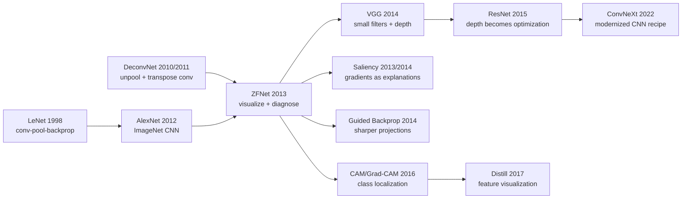

# ZFNet — Visualizing the Black Box That AlexNet Opened

> **On November 12, 2013, Matthew D. Zeiler and Rob Fergus at New York University uploaded [arXiv:1311.2901](https://arxiv.org/abs/1311.2901); the paper appeared at ECCV 2014 the following year.** AlexNet had just shown that a CNN could win ImageNet, but it was still a sealed machine: impressive numbers, almost no visibility into why it worked. ZFNet's place in history is not only that its AlexNet-derived model won the 2013 ILSVRC classification task; it is that it turned visualization into an engineering dashboard for CNNs. By projecting hidden activations back into pixel space with a deconvnet, Zeiler and Fergus found that AlexNet's 11×11 stride-4 first layer sampled too coarsely and produced aliasing, then changed the recipe toward 7×7 stride 2. After this paper, deep vision was no longer only about stacking layers and climbing leaderboards; it also learned to open the box and inspect what the network was seeing.

## TL;DR

Zeiler and Fergus's ZFNet, posted to arXiv in 2013 and published at ECCV 2014, did not matter because it invented an entirely new CNN family. It mattered because it opened [AlexNet (2012)](2012_alexnet.md) as an inspectable machine. For a layer activation $h_l$, the paper used a deconvnet projection with max-pooling switches, $	ilde{x}=D_l(h_l)$, to ask a question the ImageNet community had barely been able to phrase: *what input pattern made this unit fire?* Those visualizations exposed that AlexNet's 11×11 stride-4 first layer sampled too coarsely and produced aliasing-like artifacts, motivating a move toward 7×7 stride 2. The same diagnostic loop was paired with middle-layer feature inspection and occlusion sensitivity, $\\Delta_c(i,j)=s_c(x)-s_c(x_{\\text{occlude}(i,j)})$, to show that the network was often attending to the object itself rather than merely exploiting background context. The resulting AlexNet-derived model pushed ImageNet top-5 error further down and is commonly reported around the 11.7% top-5 range for the 2013 ILSVRC-winning entry. Its longer afterlife runs through [VGG (2014)](2014_vgg.md)'s smaller-kernel discipline, Simonyan-style saliency maps, guided backprop, CAM/Grad-CAM, and Distill-era feature visualization. The counter-intuitive lesson is that ZFNet's durable contribution was less a model than a research posture: inspect the representation first, then change the architecture.

---

## Historical Context

### What was computer vision stuck on in 2013?

The ImageNet community in 2013 lived inside a strange excitement: everyone now believed CNNs could win, but almost nobody knew why they won.

AlexNet had driven ILSVRC top-5 error from the second-place 26.2% down to 15.3% in 2012, a shock large enough to end the practical debate over whether deep learning could work for large-scale vision. But a new problem appeared immediately: AlexNet was an engineering object with 5 convolutional layers, 3 fully connected layers, and 60 million parameters. The paper could show only two kinds of evidence: final classification error, and visualizations of the 96 first-layer filters. Layer 1 revealed edges, color blobs, and Gabor-like patterns; above that, the model became 256/384/4096-dimensional feature maps that readers mostly had to trust were becoming more "abstract."

That was awkward for the 2013 vision field. The traditional pipeline had lost to CNNs, but SIFT, HOG, Fisher Vector, and spatial pyramid matching were at least inspectable: every descriptor, pooling stage, and classifier had a place where an engineer could locate failure. CNNs looked like sealed compression machines: image in, 1000-class probabilities out, tensors in the middle. They were powerful but difficult to tune. How large should the first-layer filters be? How aggressive should stride be? Which layers learn edges, which learn object parts? If the network uses "snow" as evidence for "husky," how would anyone notice?

ZFNet matters precisely there. It did not bet on the question "can CNNs win?"; it answered the follow-up question, "after they win, how do we understand, tune, and debug them?" The year 2013 was the first year deep vision moved from belief to engineering, and ZFNet's deconvnet visualization was the dashboard for that transition.

### Immediate predecessors that pushed ZFNet out

- **LeNet-5 (1998)**: Yann LeCun, Leon Bottou, Yoshua Bengio, and Patrick Haffner combined convolution, pooling, and backprop into a handwritten-digit recognition system. ZFNet inherits that long line of local connectivity, weight sharing, and hierarchical representation, but scales the problem from MNIST to ImageNet.
- **ImageNet (2009)**: Jia Deng, Wei Dong, Richard Socher, Li-Jia Li, Kai Li, and Li Fei-Fei provided the public arena of 1000 classes and roughly 1.2M training images. Without ImageNet, there is no sufficiently large stage on which to ask whether middle CNN features generalize; without that question, there is no urgency to visualize a large CNN.
- **Deconvolutional Networks (2010/2011)**: Matthew Zeiler, Graham Taylor, and Rob Fergus had already built unsupervised deconvnet models with unpooling and transposed convolution machinery for mapping feature maps back toward pixel space. ZFNet's key move was to stop treating deconvnet as a standalone generative model and instead attach it as a microscope to a trained supervised classifier.
- **AlexNet (2012)**: Alex Krizhevsky, Ilya Sutskever, and Geoffrey Hinton placed CNNs on the ImageNet throne while also moving the black-box problem to the center of the table. Nearly every ZFNet design decision answers an AlexNet question: why are some first-layer filters noisy? What do middle layers represent? Can fully connected features transfer?
- **OverFeat / R-CNN / DeCAF (2013-2014)**: These works almost simultaneously showed that CNN features could transfer from classification into localization, detection, and general-purpose representation. They made "understanding intermediate layers" urgent, because those layers were no longer private variables inside a classifier; they were becoming the common currency of vision systems.

### What were Zeiler and Fergus doing?

Matthew D. Zeiler did not arrive at visualization by accident. From 2010 to 2012 he had worked on AdaDelta, deconvnets, and adaptive deconvolutional networks, always with a tendency to open training phenomena and inspect what was happening inside. Rob Fergus was a central figure in New York University's LeCun-adjacent vision line, working on unsupervised feature learning, deformable parts, recognition, and detection. The pairing was natural: Zeiler brought optimization and the deconvolutional microscope; Fergus brought vision tasks and CNN engineering judgment.

ZFNet also has an industrial background that the paper title can hide. Zeiler later founded Clarifai, and the 2013 ILSVRC system is often referred to as Clarifai/ZFNet. In other words, the ECCV paper is not merely a visualization demo; it is a post-mortem of a competition system. First win ImageNet with an improved CNN, then explain why the changes made sense. The paper reads like an engineering notebook: see aliasing in layer 1, change stride; observe middle-layer semantics forming, keep depth; use occlusion to verify evidence; use transfer to show features are not just memorizing ImageNet.

That style of "visual evidence drives architectural tuning" was rare in 2013. Most deep-learning papers were still reporting leaderboard numbers; ZFNet asked a different question: can the representation behind the leaderboard be inspected, and can inspection change the model?

### Industry, data, and tooling status

Hardware-wise, the GTX 580 / K20 era of AlexNet was still the main environment, and both memory and training time were tight. Every change to stride or filter size meant days of training, another ImageNet run, and another validation measurement. Today a backbone sweep can rely on pretrained checkpoints and experiment dashboards; in 2013 tuning a CNN felt closer to tuning an engine by hand. A visualization that tells you where to change the engine is itself a productivity tool.

Data-wise, ImageNet had already made 1000-class classification the standard stress test, while detection, localization, and segmentation had not yet converged into the later COCO ecosystem. The transfer value of CNN features had just been demonstrated by DeCAF and R-CNN, and researchers badly needed to know: are low-level features generic? are high-level features too task-specific? ZFNet's layer visualizations and transfer experiments gave an early answer: early layers look like generic edge/texture detectors, middle layers look like object parts, and top layers bind more tightly to category semantics.

Tooling-wise, there was no PyTorch hook system, no TensorBoard activation browser, no Captum or one-click Grad-CAM package. Visualizing a feature map required manually recording pooling switches, writing deconvolution code, handling ReLU gating, and normalizing projections back into images. ZFNet's tooling may look simple today, but in 2013 it effectively built the internal debugging interface for CNNs from scratch.

Socially, deep learning in 2013 had not yet become the default answer. Many CV researchers accepted AlexNet's result while still suspecting CNNs were just enormous parameter machines. ZFNet made the counterargument visual: early layers are edges, middle layers are textures and parts, higher layers are object compositions; occluding the object itself drops the probability most. Those images helped CNNs move from "black boxes that climb leaderboards" to systems that really did learn hierarchical visual representations.

---

## Method Deep Dive

### Overall framework

ZFNet's method can be compressed into one sentence: **take a trained AlexNet-style CNN, attach a backward projector, map each layer's feature maps back into pixel space, and use the projections to modify the architecture.**

This differs slightly from later "interpretability methods." ZFNet was not trying only to make attractive explanation images; it inserted visualization into model development. Train the network, inspect activations, locate anomalies, change architecture, retrain, and validate. Its goal was not to narrate one image, but to answer engineering questions: is the first-layer stride too aggressive? do middle layers really learn parts? does the final layer memorize class templates?

| Component | Input | Output | Problem solved |
|-----------|-------|--------|----------------|
| Deconvnet projection | Feature activation at one layer | Pixel-space visualization | What this unit / channel sees |
| Pooling switches | Argmax locations from forward max-pool | Unpooling path | How high-level features preserve location |
| Occlusion sensitivity | Image + sliding occluder | Class score drop heatmap | Object evidence or background shortcut |
| Architecture diagnosis | Visualization + validation error | Filter / stride / depth changes | Where the network should change |

The elegant part of ZFNet is that it turns visualization from a presentation artifact into a causal clue. If layer-1 visualizations show high-frequency noise and aliasing, the filters and stride are too coarse; if occlusion shows the probability drops most on the object, the classifier is using object evidence; if transfer shows low layers are generic and high layers are specific, the feature hierarchy is not just rhetoric.

### Key designs

#### Design 1: Deconvnet projection — pulling feature activations back to pixel space

**Function**: Given a selected channel or neuron activation at layer $l$, keep only that response and run it backward through the network to produce an image of the pixel pattern that excites it.

ZFNet's projection does not train a new decoder. It reuses the CNN's forward structure: convolution becomes transposed convolution, ReLU keeps positive evidence, and max-pooling becomes unpooling with argmax switches recorded during the forward pass. The core operation can be written as:

$$
\tilde{h}_{l-1}=W_l^{\top} * U(s_l, \operatorname{ReLU}(h_l))
$$

where $h_l$ is the layer-$l$ activation, $W_l^{\top}$ denotes transposed convolution with the learned filters, and $U(s_l,\cdot)$ places activations back using pooling switches $s_l$. This is not a strict inverse; it answers the more practical question: under the current network weights, what input evidence does this activation project to?

```python
def deconv_projection(activation, conv_layers, pool_switches, target_layer):
    """Project one selected activation pattern back to input pixels."""
    feature = keep_selected_channels(activation[target_layer])
    for layer_id in reversed(range(target_layer + 1)):
        feature = relu(feature)
        if layer_id in pool_switches:
            feature = unpool(feature, switches=pool_switches[layer_id])
        feature = conv_transpose(feature, weight=conv_layers[layer_id].weight)
    return normalize_to_image(feature)
```

| Forward CNN operation | Deconvnet backward operation | Information kept | Information lost |
|-----------------------|------------------------------|------------------|------------------|
| Convolution | Transposed convolution | Pattern learned by filters | Exact pre-nonlinear input |
| ReLU | ReLU gating | Positive evidence | Negative responses and inhibition |
| Max-pooling | Unpooling with switches | Location of maximal response | Non-maximal responses |
| Fully connected | Weight projection / feature masking | Class-related feature | Full spatial structure |

**Design rationale**: Before AlexNet, CNN interpretability mostly stopped at first-layer filters. Layer-1 filters can be drawn directly because they are RGB patches; higher layers are feature maps no longer visible to the eye. ZFNet's deconvnet removes that barrier and lets researchers inspect layer 2 through layer 5 systematically: from edge combinations, to textures, to object parts, to class-related structures.

#### Design 2: Visualization-driven architecture diagnosis — from 11×11 stride 4 to 7×7 stride 2

**Function**: Use first- and second-layer visualizations to diagnose AlexNet's early sampling problem and translate the diagnosis into a concrete architecture change.

AlexNet's first layer used 11×11 filters with stride 4. In 2012 that design had a clear engineering reason: 3GB GPU memory was tight, and large stride reduced resolution quickly. ZFNet's visualizations showed that some first-layer filters learned noisy high-frequency structures rather than clean edges, suggesting the input had been sampled too coarsely too early. ZFNet therefore moved toward a smaller 7×7 filter and stride 2, preserving more spatial detail in low-level features.

A simple spatial-size formula shows the effect of stride:

$$
H_{out}=\left\lfloor \frac{H_{in}+2P-K}{S}\right\rfloor+1
$$

If $H_{in}=224$, $K=11$, and $S=4$, the output is about 55; with $K=7$ and $S=2$, the output is about 109. The first feature map's sampling grid nearly doubles, giving later layers finer local position information.

```python
def conv_out_size(height, kernel, stride, padding=0):
    return (height + 2 * padding - kernel) // stride + 1

alexnet_grid = conv_out_size(224, kernel=11, stride=4)
zfnet_grid = conv_out_size(224, kernel=7, stride=2)
print(alexnet_grid, zfnet_grid)  # 54/55 vs about 109 depending on preprocessing
```

| Design choice | AlexNet 2012 | ZFNet 2013 | Visualization diagnosis |
|---------------|--------------|------------|--------------------------|
| Conv1 kernel | 11×11 | 7×7 | Large filters make early patterns coarse |
| Conv1 stride | 4 | 2 | Large stride creates aliasing-like artifacts |
| Low-level grid | Sparse | Denser | Middle-level parts become clearer |
| Tuning basis | Validation + intuition | Visualization + validation | From trial-and-error to evidence |

**Design rationale**: ZFNet's importance is not that 7×7 stride 2 became the final answer. VGG soon pushed the field further toward 3×3 filters, and small kernels became the post-2014 norm. The durable method is the loop: visualization finds that early sampling is too coarse, then the architecture changes accordingly. CNN design becomes more than "try hyperparameters and check validation"; internal representation evidence tells you where to intervene.

#### Design 3: Occlusion sensitivity — checking whether the network sees the object or the background

**Function**: Systematically occlude different regions of an input image and measure how much the target-class score drops, producing a class-specific evidence map.

ZFNet's occlusion experiment is deliberately simple: slide a gray patch across the image, run a fresh forward pass at each location, and measure the change in the target score or probability. If covering the dog's face causes the largest drop, the model is using the dog; if covering snow causes the largest drop, the model may be exploiting background context.

$$
\Delta_c(i,j)=s_c(x)-s_c\big(x\odot (1-M_{i,j})+\mu M_{i,j}\big)
$$

Here $s_c(x)$ is the score for class $c$, $M_{i,j}$ is an occlusion mask placed at location $(i,j)$, and $\mu$ is a gray or mean fill value. Larger $\Delta_c(i,j)$ means that region is more important for class $c$.

```python
def occlusion_sensitivity(model, image, target_class, patch=40, stride=10, fill=0.5):
    base_score = model(image)[target_class]
    heatmap = zeros_like_grid(image, patch, stride)
    for row, col in sliding_windows(image, patch, stride):
        masked = image.clone()
        masked[:, row:row + patch, col:col + patch] = fill
        heatmap[row, col] = base_score - model(masked)[target_class]
    return heatmap
```

| Diagnostic question | Occlusion result | Interpretation | Engineering action |
|---------------------|------------------|----------------|--------------------|
| Depends on object | Score drops on object region | Model learned semantic parts | Preserve representation |
| Depends on background | Score drops on background | Dataset bias is visible | Strengthen augmentation / resampling |
| Depends on local texture | Small patch breaks prediction | Texture bias is high | Add multi-scale / shape cues |
| Robust to occlusion | Score drops smoothly | Evidence is distributed | Useful for localization transfer |

**Design rationale**: Deconvnet visualization tells you what a unit likes, but not directly where the classification decision rests. Occlusion sensitivity moves explanation from neuron level to decision level, making it a plain ancestor of CAM, Grad-CAM, RISE, and other attribution methods. It also turns CNN explanation from a pretty picture into a testable counterfactual: if we hide this region, does the prediction change?

#### Design 4: Hierarchical representation and transfer audit — deciding which layers are generic and which are specific

**Function**: Use layer visualizations, nearest patches, feature transfer, and ablations to determine what role each CNN layer plays in semantic hierarchy and task generalization.

ZFNet observed a pattern that later became common sense: low layers learn edges and colors, middle layers learn textures and parts, and high layers learn category-related compositions. That sounds ordinary today, but in 2013 it was key evidence for the story that CNNs learn hierarchical representations. More importantly, the paper links hierarchy to transfer: lower-layer features are more generic, higher-layer features are closer to ImageNet categories; performance on other datasets reveals how general each level is.

$$
\phi_l(x)=h_l(x;\theta),\qquad \hat{y}=\operatorname{clf}_l(\phi_l(x))
$$

Here $\phi_l(x)$ is the frozen CNN feature extracted at layer $l$, and $\operatorname{clf}_l$ can be a linear SVM or shallow classifier. Comparing transfer performance across $l$ audits how generic the feature hierarchy is.

```python
def transfer_probe(backbone, dataset, layer_name):
    features, labels = [], []
    for image, label in dataset:
        activation = backbone.forward_until(image, layer_name)
        features.append(global_pool_or_flatten(activation))
        labels.append(label)
    probe = LinearSVM().fit(features, labels)
    return probe.validation_accuracy(features, labels)
```

| Layer range | Typical visualization | Transfer tendency | Design implication |
|-------------|-----------------------|-------------------|--------------------|
| Conv1 | Edges / color blobs | Most generic | Do not downsample too early |
| Conv2-3 | Textures / local shapes | Generic but more abstract | Preserve enough spatial resolution |
| Conv4-5 | Object parts | More task-related | Useful for detection/localization |
| FC layers | Class-template mixtures | Most specific | Often replace or retrain for transfer |

**Design rationale**: AlexNet proved end-to-end CNNs could win, but did not explain why intermediate layers transfer. ZFNet supplied visual evidence that deep features are not random templates; they gradually compose more complex visual concepts. That judgment directly supports the post-2014 transfer-learning pattern: keep the convolutional backbone, replace the task head, and reuse visual representations for detection, segmentation, retrieval, and beyond.

---

## Failed Baselines

### Baselines that lost to ZFNet

ZFNet's "failed baselines" should not be understood only as leaderboard competitors. More importantly, the paper defeated several research habits at once: black-box CNNs that report only final error, traditional vision pipelines still dependent on hand-engineered features, and shallow interpretability that stops at first-layer filters.

| Baseline | Practice at the time | Exposed weakness | ZFNet's answer |
|----------|----------------------|------------------|----------------|
| Original AlexNet recipe | 11×11 stride-4 conv1 + large model | Low-level visualizations show noisy / aliasing patterns | Use finer early sampling |
| SIFT/FV/SVM pipeline | Hand descriptor + encoding + SVM | Representation not learned end-to-end; ImageNet ceiling | CNN feature hierarchy keeps improving |
| First-layer-only inspection | Draw conv1 filters and stop | Cannot understand conv2-conv5 | Project every layer with deconvnet |
| Score-only evaluation | Validation error goes down | Cannot tell object evidence from context | Occlusion sensitivity gives counterfactual evidence |

The common failure across these baselines was not "a few fewer accuracy points"; it was the absence of internal diagnosis. AlexNet had shown that CNNs were strong, but if every architecture change could be judged only by validation error, researchers still did not know where gains came from. ZFNet turned the network's interior into an observable object and effectively gave deep vision a debugging tool.

### Baseline 1: why AlexNet's original first layer was not enough

AlexNet's 11×11 stride-4 first layer was a reasonable 2012 hardware compromise: downsample early, save memory, and fit the remaining layers into two GTX 580s. ZFNet's visualizations exposed the cost of that choice: some first-layer filters contained high-frequency noise and aliasing-like structure, and second-layer visualizations were less clean. This was not just an aesthetic issue; the model was discarding too much spatial detail at the earliest stage.

ZFNet's fix was direct: reduce the filter size and stride so the first feature map becomes denser. VGG later pushed the same logic to its limit with 3×3 convolutions almost everywhere. In hindsight, AlexNet's large first kernel was not "wrong"; it was a compromise forced by 2012 memory and compute. ZFNet proved it was not an essential CNN design principle.

### Baseline 2: the ceiling of traditional features on ImageNet

Traditional vision methods had not fully disappeared in 2013. Many systems still used SIFT, HOG, Fisher Vector, spatial pyramids, and SVMs, encoding local descriptors into high-dimensional vectors before classification. Their strengths were interpretability, modularity, and relatively stable training; their weaknesses were equally clear: descriptors did not update end-to-end for the task, and too many hand-designed interfaces separated local patches from category decisions.

ZFNet did not spend many pages beating these systems one by one, because AlexNet had already won the first route-level argument. But ZFNet sharpened a more subtle point: CNNs did not win only because they were larger once; they could keep improving through internal representation diagnosis. Traditional pipelines were inspectable but hard to jointly learn; CNNs were originally hard to inspect, but once visualization tools appeared, they had both learnable and diagnosable representations.

### Baseline 3: explanations without counterfactuals are not enough

Feature visualization alone can still mislead. A channel that looks like a "dog face" does not prove the final classifier depends on the dog face; it may be an intermediate preference while the decision still uses snow, grass, photographic style, or another background shortcut.

ZFNet's occlusion experiment supplies the missing step. It does not ask only "what does this feature look like?"; it asks "if we hide this region, does the class score drop?" That makes the explanation closer to a counterfactual. Many later attribution methods extend exactly this idea: explanation must be tied to prediction change, not only visual resemblance.

### Lessons from the failures

The most important lesson ZFNet left is: **interpretability changes research only when it enters the model-development loop.** If visualization is merely a figure in the paper, its lifetime is short; if it tells you that the first-layer stride should change, which layer transfers, or whether the model relies on background, it becomes part of architecture search and error analysis.

That is why ZFNet remains a classic even though it did not leave behind a module everyone reuses in the way ResNet did. It changed the workflow: from "design a model, report the score" to "train a model, inspect its internals, redesign it."

---

## Key Experimental Data

### Main ImageNet classification results

ZFNet's numbers make sense only when read after AlexNet. It was not the revolution that drove error from 26% to 15%; it showed that, once CNNs had become the leading candidate, "inspect internal representations + adjust architecture" could still produce reliable gains.

| Model / system | Year | Top-5 error | Note |
|----------------|------|-------------|------|
| ISI SIFT+FV+SVM | 2012 | 26.2% | AlexNet's second-place competitor |
| AlexNet 7-CNN ensemble | 2012 | 15.3% | ILSVRC 2012 winner |
| AlexNet-style single CNN | 2012/2013 | ~16% | Direct reference for ZFNet |
| ZFNet single model | 2013 | ~14.8% | Commonly reported validation range |
| ZFNet / Clarifai ILSVRC entry | 2013 | ~11.7% | Commonly reported ILSVRC 2013 classification winner |
| VGG / GoogLeNet | 2014 | ~7-8% | Small filters / Inception continue the line |

The table shows ZFNet's role: not an AlexNet-scale regime change, but the first systematic proof that CNNs can be improved by understanding their internals. It turned the giant 2012 win into an iterative engineering method for 2013.

### Visualization and ablation results

The paper's most valuable experiments are not a single leaderboard number, but a chain of diagnostic evidence.

| Experiment | Observation | Conclusion | Later influence |
|------------|-------------|------------|-----------------|
| Layer visualization | Semantics grow more complex from conv1 to conv5 | CNNs learn hierarchical representations | Supports the transfer-learning story |
| Conv1 diagnosis | 11×11 stride 4 creates noisy / aliasing patterns | Early sampling is too coarse | Small-filter / small-stride route |
| Occlusion sensitivity | Class score drops when object region is hidden | Model mainly uses object evidence | Prototype for later attribution methods |
| Layer transfer | Low layers are generic, high layers are specific | Feature generality changes by depth | Backbone + task-head paradigm |
| Ablation / retrain | Error drops after architecture change | Visualization can guide design | Representation-driven engineering |

### Key findings

- **The first layer is not better just because it is larger**: AlexNet's 11×11 kernel was soon rewritten by ZFNet's 7×7 and VGG's 3×3 line. Receptive field can be built gradually through depth rather than swallowed in one huge first-layer patch.
- **Middle-layer features are not uninterpretable tensors**: deconvnet images show conv2-conv5 moving from textures and motifs toward local parts and category structures. This gave visual evidence for the phrase "hierarchical representation."
- **Occlusion moves explanation to the decision level**: unit preference images are not enough; one must check whether predictions change under occlusion. That framing became standard for attribution methods.
- **Transferability changes with depth**: low-level features are more generic and high-level features are more category-specific, an early empirical basis for fine-tuning, linear probes, and frozen-backbone studies.
- **ZFNet's victory is a workflow victory**: it did not win through a huge new module; it won through the loop "visualize -> diagnose -> change architecture -> retrain."

---

## Idea Lineage

### Mermaid citation graph



### Before: from "training CNNs" to "seeing CNNs"

ZFNet has two ancestors: one from CNN architecture, one from deconvnet visualization.

The first line runs from LeNet to AlexNet. LeNet proved that convolution, pooling, and backprop could form a visual recognition system, but it stayed in small images and few categories; AlexNet scaled that structure to ImageNet and turned CNNs from an old idea into the dominant weapon. The problem was that AlexNet's win was abrupt: it gave a score, but not enough internal explanation. ZFNet inherits AlexNet's architecture skeleton while treating it as an object to be diagnosed.

The second line comes from Zeiler's own earlier deconvnet work. The 2010/2011 deconvnet papers still had the flavor of unsupervised generative modeling: reconstruct images upward from latent features and understand feature hierarchies. ZFNet's key recombination was to move that machinery from "train a generative model" to "explain a discriminative CNN." That step mattered because deconvnet stopped competing with classification CNNs and started serving them.

| Idea source | Original problem | ZFNet rewrite | Lasting legacy |
|-------------|------------------|---------------|----------------|
| LeNet / AlexNet | How CNNs recognize images | How CNNs form representations internally | Architecture diagnosis |
| DeconvNet 2010/2011 | How to learn reconstructable features | How to project trained features backward | Feature visualization |
| ImageNet | How to compare recognition systems | How to analyze large recognition systems | Benchmark + microscope |
| Transfer learning | Whether features can be reused | Which layer is more generic | Backbone thinking |

### After: which works inherited ZFNet

ZFNet's most direct descendants are not a single model, but a set of research habits.

The first inheritance is architecture design. VGG pushed ZFNet's first-layer lesson almost to the extreme: avoid large coarse kernels and use depth built from 3×3 convolutions. GoogLeNet continued the scale question in another direction: Inception modules process multiple receptive fields at once. ResNet solved the next bottleneck, optimization at depth, but it belongs to the same post-ZFNet engineering attitude: structural choices should be supported by experiments and representation evidence.

The second inheritance is attribution. Simonyan, Vedaldi, and Zisserman's saliency maps appeared almost concurrently with ZFNet, replacing deconvnet projection with input gradients; Springenberg's guided backprop changed ReLU backward rules to produce sharper projections; CAM/Grad-CAM turned class-discriminative localization into a more practical heatmap. All of them answer the same question ZFNet opened: which part of the input supports this prediction?

The third inheritance is the aesthetics and tooling of feature visualization. Distill's 2017 Feature Visualization series pushed ZFNet's neuron/channel inspection into optimized inputs, frequency penalties, diversity objectives, and interactive presentation. Modern interpretability libraries with one-click hooks, activation maximization, and layer attribution are all standardizing ZFNet's microscope.

### Misreadings: ZFNet is not just "pretty deconvolution pictures"

ZFNet is often misread as a "visualization paper," as if its main contribution were producing attractive feature images. That is too narrow. The important part is not the images alone; it is that the images enter architecture decisions. See aliasing, change stride; see middle-layer parts, confirm hierarchy; run occlusion, verify classification evidence. This is visualization-as-debugging, not visualization-as-decoration.

Another misreading is to treat deconvnet projection as a faithful reconstruction of what the network "truly understands." ZFNet's projection depends on ReLU gating, pooling switches, and transposed convolution. It is an explanatory approximation, not a mathematical inverse. Later work repeatedly showed that different backward rules produce different visualizations, so a single explanation image should never be treated as absolute truth. The right use of ZFNet is to treat visualization as a diagnostic signal, then validate it with ablation, occlusion, and retraining.

A third misreading is to view ZFNet's ILSVRC 2013 win as evidence that the model architecture itself was radically advanced. In reality, the architecture remains very close to AlexNet. The more durable legacy is that CNNs can be inspected, repaired, and improved using internal evidence. ZFNet moved deep vision from heroic single breakthroughs toward engineering iteration.

---

## Modern Perspective (looking back at 2013 from 2026)

### Assumptions that no longer hold

- **"A deconvnet image is what the network truly understands"**: today, deconvnet visualization is a useful diagnostic, not faithful mind reading. Guided backprop, integrated gradients, Grad-CAM, and activation maximization all produce different forms of explanation. Explanations need occlusion, counterfactuals, and causal intervention to become more reliable.
- **"ImageNet classification is enough to represent visual understanding"**: ZFNet's evidence comes mainly from 1000-class classification. Later COCO, ADE20K, LVIS, video understanding, VQA, and multimodal models showed that classification is only a narrow slice of vision. A feature that looks good on ImageNet does not automatically understand object relations, counting, geometry, or causality.
- **"CNN hierarchy must rise monotonically from edges to objects"**: the story is broadly useful but too tidy. Modern networks mix representations across layers through shortcuts, normalization, attention, and residual paths; ViT token representations also do not strictly follow a conv1-edge / conv5-part linear narrative.
- **"Interpretability can persuade with one image"**: in 2013 a deconvnet image was shocking enough; in 2026 readers ask about stability, random seeds, explanation fidelity, human studies, and faithfulness metrics. Interpretability moved from visual storytelling into a stricter evaluation problem.

### What time proved essential vs. redundant

| Design / idea | 2026 status | Why it stayed or was replaced | Representative successors |
|---------------|-------------|-------------------------------|---------------------------|
| Visualization-driven diagnosis | Survived | Model development still needs internal observation | TensorBoard, Captum, NetDissect |
| Fixing large early filters | Survived as experience | Small kernels / small stride preserve early detail | VGG, ResNet, ConvNeXt |
| Specific deconvnet backward rule | Partly replaced | Guided backprop / Grad-CAM are easier to use | Saliency, Grad-CAM |
| ImageNet CNN as generic backbone | Expanded | Still useful, but widened by self-supervised and multimodal learning | CLIP, DINO, MAE |

ZFNet's most durable element is not one layer recipe but the claim that "representation inspection matters." When researchers train LLMs, diffusion models, ViTs, or multimodal agents today, they are still doing the same kind of work: inspect attention heads, neuron activations, feature attribution, and activation patching. The tools changed; the posture stayed.

### Side effects the authors did not foresee

First, ZFNet indirectly changed the writing standard for CNN architecture papers. Before 2012, a sufficiently large leaderboard win could get by with little internal analysis; after ZFNet, strong papers increasingly included ablations, feature maps, error cases, and visual diagnosis. VGG and GoogLeNet were not interpretability papers, but they inherited the style that structural choices need systematic evidence.

Second, ZFNet tied interpretability to product trust. Early vision API companies such as Clarifai needed to convince customers that a model was not guessing randomly; it was looking at the object in the image. Visualization images, occlusion heatmaps, and error-case analyses later became routine materials before industrial vision systems shipped.

Third, ZFNet opened the cultural line of the "neural network microscope." Distill, OpenAI Microscope, Anthropic transformer circuits, and activation patching can all be read as extensions of that line across different model families: do not ask only what the model outputs; ask how internal computation forms.

### If it were rewritten today

If Zeiler and Fergus rewrote ZFNet in 2026, they probably would not stop at deconvnet visualization. A modern version would be a full explanation toolkit: Grad-CAM / integrated gradients / activation maximization / concept activation vectors / causal ablation, all compared with faithfulness metrics that test whether explanations actually affect predictions.

The architecture under inspection would also change. In 2013 the object was an AlexNet-style CNN; today it might be ConvNeXt, ViT, a CLIP image encoder, or a SAM encoder. The questions would expand from "what texture does this layer see?" to "does this token bind an object instance?" "does this patch encode a spatial relation?" and "is the vision encoder using text shortcuts as category evidence?"

But the spirit of the paper would remain: first make the model's interior observable, then let observation change model design.

## Limitations and Future Directions

### Limitations visible in the paper

- **Explanation is not a strict inverse mapping**: deconvnet projection depends on switches and gating, and does not guarantee causal recovery of the true input.
- **Experiments focus mainly on ImageNet classification**: they explain classification CNN representations, but do not automatically transfer to detection, segmentation, video, 3D, or multimodal tasks.
- **Architecture search space is narrow**: ZFNet remains close to AlexNet and does not systematically explore depth, stacks of small filters, residual paths, or multi-branch designs.

### Additional limitations from a 2026 view

| Limitation | Today's problem | Possible remedy | Related direction |
|------------|-----------------|-----------------|-------------------|
| Explanation instability | Different backward rules produce different images | Cross-validate multiple explanation methods | Attribution benchmarking |
| Missing causal metric | Beautiful images may not be faithful | Occlusion / insertion / deletion metrics | Causal interpretability |
| Single-model focus | Cannot separate model-specific facts from general laws | Multi-architecture, multi-seed replication | Model comparison |
| Human subjective reading | Patterns are easy to over-interpret | Quantitative concept probes | TCAV, NetDissect |

### Improvement directions

ZFNet naturally extends in three directions. The first is **stronger explanation fidelity**: explanation maps should be validated through occlusion, counterfactual generation, and activation patching. The second is **from channel to concept**: do not only say a channel looks like texture; connect it to named concepts, data subgroups, and error types. The third is **from CNNs to foundation vision models**: inspect visual tokens, cross-modal alignment, and spatiotemporal representations in CLIP, SAM, DINOv2, and Sora-style video models.

## Related Work and Insights

### Related work comparison

| Work | Relation to ZFNet | Core difference | Lesson |
|------|-------------------|-----------------|--------|
| AlexNet (2012) | Direct object and baseline | Proved CNNs can win | Victory creates the need for understanding |
| VGG (2014) | Inherits the small-kernel trend | Systematically stacks 3×3 depth | Visualization lessons become architecture principles |
| Grad-CAM (2016) | Inherits the class-evidence question | Cheaper and more class-discriminative | Explanation should stay close to decisions |
| Distill Feature Visualization (2017) | Inherits the feature microscope | Optimized inputs + interactive presentation | Visualization also needs tool aesthetics |

For researchers today, ZFNet's lesson is simple: do not wait for metrics alone to tell you whether a model is good. Metrics tell you what happened; internal observation tells you why it may have happened. Real engineering progress usually comes from closing that loop.

## Resources

- 📄 Paper: [Visualizing and Understanding Convolutional Networks](https://arxiv.org/abs/1311.2901)
- 🧾 ECCV 2014 version: <https://link.springer.com/chapter/10.1007/978-3-319-10590-1_53>
- 🔍 Related paper: [ImageNet Classification with Deep Convolutional Neural Networks](https://papers.nips.cc/paper/4824-imagenet-classification-with-deep-convolutional-neural-networks)
- 🔍 Saliency follow-up: [Deep Inside Convolutional Networks](https://arxiv.org/abs/1312.6034)
- 🔍 Grad-CAM: [Grad-CAM: Visual Explanations from Deep Networks](https://arxiv.org/abs/1610.02391)
- 🧠 Distill: [Feature Visualization](https://distill.pub/2017/feature-visualization/)
- 🌐 中文版 of this deep note: [`/era2_deep_renaissance/2013_zfnet/`](/era2_deep_renaissance/2013_zfnet/)


---

> 🌐 [中文版](/era2_deep_renaissance/2013_zfnet/) · 📚 awesome-papers project · CC-BY-NC