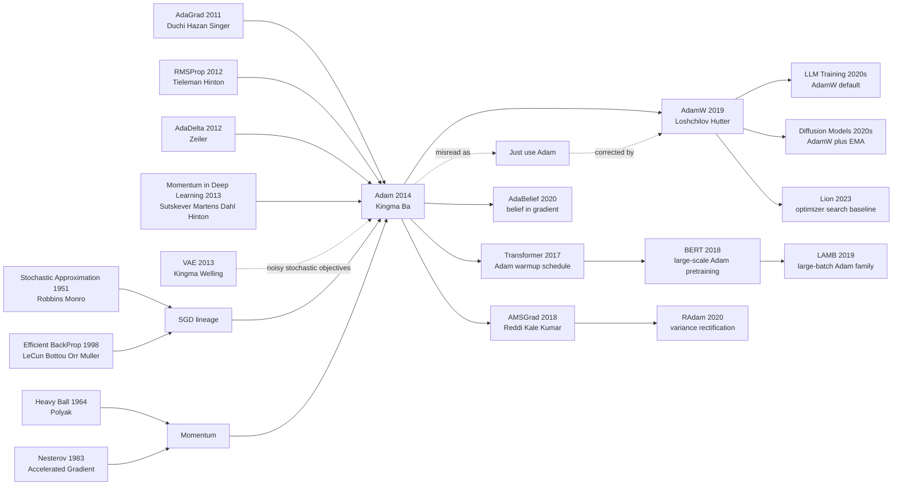

# Adam — Adaptive Moments for Stochastic Optimization

> **On December 22, 2014, Diederik P. Kingma and Jimmy Lei Ba uploaded [arXiv:1412.6980](https://arxiv.org/abs/1412.6980); a few months later it appeared at ICLR 2015 and quietly entered almost every deep-learning codebase.** Adam's drama is not a giant architecture reveal. It is stranger than that: a two-page update rule, three default numbers ($\beta_1=0.9, \beta_2=0.999, \epsilon=10^{-8}$), and a promise that noisy stochastic gradients could be made less temperamental without hand-designed schedules. Ten years later, Transformers, BERT-style pretraining, diffusion models, and large language models all inherited the reflex: try Adam or AdamW first. An optimizer that looked like plumbing became part of the operating system of modern AI.

## TL;DR

Kingma and Ba's 2014 arXiv paper, published at ICLR 2015, fused "SGD with momentum" and "per-coordinate adaptive learning rates" into a first-order optimizer that usually worked before you had finished tuning anything else: keep an exponential first moment $m_t=\beta_1m_{t-1}+(1-\beta_1)g_t$, keep an exponential second moment $v_t=\beta_2v_{t-1}+(1-\beta_2)g_t^2$, bias-correct both, then update with $\hat m_t/(\sqrt{\hat v_t}+\epsilon)$. The baseline it displaced was not a single algorithm but the everyday training mess of 2012-2014: SGD+Momentum/Nesterov needed careful schedules, AdaGrad's effective learning rate decayed monotonically until long runs stalled, RMSProp was powerful but under-specified and missing bias correction, and AdaDelta often traded tuning for speed. Adam's experiments on MNIST logistic regression, multilayer nets, convolutional nets, and autoencoders made the practical bargain explicit: stable, fast, low-memory, and rarely the first thing to blame. From the warmup recipe in [Transformer (2017)](../era3_attention/2017_transformer.md) to BERT/LLM AdamW training and diffusion denoising objectives, Adam became the optimizer-shaped default button of modern AI. The hidden lesson is almost comic: one of deep learning's most consequential algorithms was not a deeper model, but a way to waste fewer days choosing a learning rate; the later AMSGrad convergence critique and AdamW's decoupled weight decay then made the caveat equally important — "works by default" is not the same as "theory is finished."

---

## Historical Context

### In 2014, deep learning often failed not because the model was too shallow, but because training was too temperamental

When Adam appeared, deep learning had already moved from the question "can deep networks be trained at all?" into the more irritating question "can training be made reproducible engineering?" AlexNet had validated the GPU+ReLU+Dropout route, [VAE](https://arxiv.org/abs/1312.6114) and GAN were pushing generative models toward backprop-based training, and vision models on the eve of [ResNet](2015_resnet.md) were becoming deeper and more ambitious. Yet inside many labs, whether a new model reproduced often depended less on the architecture diagram than on a few lines of learning rate, momentum, decay, and initialization logic.

The everyday pain was blunt: **SGD was canonical, but good SGD required human babysitting**. You had to choose the initial learning rate, decide when to drop it by 10x, decide whether momentum started at 0.5 or 0.9, and debug exploding loss by guessing whether the culprit was batch size, initialization, or an overly aggressive step size. Sutskever, Martens, Dahl, and Hinton had shown in 2013 that carefully tuned momentum SGD could train deep networks; the catch was in "carefully tuned." It gave experts tremendous control and ordinary experimenters a large surface of uncertainty.

That is Adam's historical position. It was not the first first-order optimizer, nor the first adaptive learning-rate method. Its ambition was humbler and more lethal: **give everyone optimizer defaults that were good enough to start with**. In 2014, saving a day of learning-rate tuning meant running a dozen more models and finding out faster whether the idea in the paper was alive.

### The lines of work that directly pushed Adam out

- **SGD and momentum**: Robbins-Monro stochastic approximation supplied the mathematical root of using noisy gradients to approach an optimum; Polyak's heavy-ball method supplied the intuition of treating past gradients as velocity; Nesterov acceleration turned lookahead into a common deep-learning baseline. By 2013, SGD+Momentum/Nesterov was a strong baseline, but it still depended on a global learning-rate schedule.
- **AdaGrad**: Duchi, Hazan, and Singer in 2011 accumulated historical squared gradients per coordinate, giving sparse features larger effective steps. It was elegant for NLP and sparse learning, but the accumulator grew monotonically, so long neural-network runs could see effective learning rates shrink until training stalled before convergence.
- **RMSProp**: Tieleman and Hinton's 2012 course note replaced AdaGrad's unbounded accumulation with an exponential moving average of squared gradients, addressing the monotone-decay problem. It quickly entered practice, but lacked a full paper that standardized notation, defaults, and theory.
- **AdaDelta**: Zeiler's 2012 method tried to remove the manual learning rate by matching root-mean-square gradients and updates. It reduced tuning, but in many deep-network settings was not as fast as the RMSProp/Adam line.
- **The regret language of online convex optimization**: AdaGrad-style methods brought a theoretical vocabulary in which optimizer papers could discuss regret bounds rather than only plot loss curves. Adam inherited that vocabulary, even though its original convergence proof would later be corrected by AMSGrad.

Adam's cleverness was not invention from nowhere. It assembled these ingredients into an algorithm that engineers could remember, default, and ship in every framework: momentum controls direction, RMSProp/AdaGrad controls coordinate scale, bias correction patches early estimator bias, and the default hyperparameters let users start training before they start arguing.

### Where Kingma and Ba stood at the time

Diederik P. Kingma was at the University of Amsterdam, fresh from Auto-Encoding Variational Bayes with Max Welling. VAE-style stochastic generative models depend naturally on noisy minibatch gradients: every sample, batch, and latent variable adds variance to the optimization problem. For Kingma, an optimizer "well suited for noisy stochastic objectives" was not a side topic; it was infrastructure for the generative-modeling route he was already building.

Jimmy Lei Ba was at the University of Toronto, close to the Hinton training tradition. The Toronto line had long cared about optimization tricks: momentum, initialization, Dropout, and the RMSProp course note all circulated through that ecosystem. Adam was therefore not an isolated mathematical formula, but a compression of early-2010s deep-learning practice: take several training intuitions that had already proved useful around the Bengio/Hinton world, and write them as a short, portable Algorithm 1.

The paper had only two authors, which sharpened its character. Unlike large system papers, it did not win through data scale, compute scale, or team scale. It won by clarifying something many people were already half-doing and turning it into a standard component. Its influence is therefore unusual: many papers are cited because they introduced a new model; Adam is cited because almost every new model first had to be trained.

### Frameworks, data, and industry gave Adam the perfect window to spread

The years 2014-2015 were the transition from research scripts to public deep-learning infrastructure. Theano, Torch7, and Caffe had already made GPU training reusable; TensorFlow would appear in 2015, and PyTorch would arrive two years later. An optimizer that fit in a few lines of code, stored only two extra tensors of the same shape, and came with stable defaults was easy for frameworks to absorb. Adam satisfied exactly those propagation conditions.

Data and models were also forcing optimizers to evolve. MNIST and CIFAR-10 were still common paper datasets, but neural networks were moving toward deeper, wider, noisier objectives: Dropout added randomness, batch normalization was not yet universal, RNN and generative-model training were brittle, and GPU memory constrained batch size. A single global learning rate for every parameter looked increasingly crude; per-coordinate step sizes plus momentum hit the pain point of the era.

The industrial reaction was almost silent. Adam did not generate images like GAN, and it did not refresh ImageNet like ResNet. It simply began appearing in tutorials, framework APIs, paper appendices, and default configs. Only years later, when Transformer, BERT, diffusion models, and LLM training all wrote Adam or AdamW into their recipes, did the field fully notice what this 2014 ICLR paper had changed: the starting point of almost every neural-network training run.

---

## Method Deep Dive

### Overall framework

Adam's core can be stated in one sentence: **for every parameter coordinate, maintain an exponential average of gradients and an exponential average of squared gradients; after correcting their early bias, use the former for direction and the latter for step-size scale**. It remains a first-order optimizer. It needs no Hessian, no line search, and no extra samples beyond the minibatch; each parameter only stores two state tensors of the same shape, $m_t$ and $v_t$.

The full training loop is short. Given a stochastic objective $f_t(\theta)$, take the gradient $g_t=\nabla_\theta f_t(\theta_{t-1})$, update the first moment $m_t$, update the second moment $v_t$, bias-correct both, and then update $\theta_t$ coordinate-wise. The defaults $\alpha=10^{-3}, \beta_1=0.9, \beta_2=0.999, \epsilon=10^{-8}$ later entered TensorFlow, PyTorch, JAX, and countless paper appendices.

| Component | Role in Adam | Lineage | Training pain it addresses |
|-----------|--------------|---------|----------------------------|
| First moment $m_t$ | Smooth gradient direction | Momentum / heavy ball | Minibatch gradients are noisy |
| Second moment $v_t$ | Estimate coordinate scale | AdaGrad / RMSProp | Parameter coordinates have different gradient magnitudes |
| Bias correction | Fix early small $m_t,v_t$ estimates | Exponential-average statistics | First steps have distorted learning rates |
| $\epsilon$ and defaults | Numerical stability and portability | Engineering recipe | Users need not search ten learning rates first |

### Key designs

#### Design 1: Exponential moving averages of first and second moments — merging momentum and RMSProp into one state machine

**Function**: Use $m_t$ to store "recent gradient direction" and $v_t$ to store "recent squared-gradient scale," giving each coordinate both momentum and an adaptive step size.

$$
\begin{aligned}
g_t &= \nabla_\theta f_t(\theta_{t-1}) \\
m_t &= \beta_1 m_{t-1} + (1-\beta_1)g_t \\
v_t &= \beta_2 v_{t-1} + (1-\beta_2)g_t^2
\end{aligned}
$$

The square is coordinate-wise. $m_t$ behaves like momentum: if multiple minibatches point in a consistent direction, the signal accumulates; if directions jitter, the average damps the noise. $v_t$ behaves like RMSProp: if one coordinate has persistently large gradients, its denominator grows and its effective step shrinks; if another coordinate is sparse or small, it is not crushed by a global learning rate.

```python
def update_moments(grad, state, beta1=0.9, beta2=0.999):
    state["m"] = beta1 * state["m"] + (1.0 - beta1) * grad
    state["v"] = beta2 * state["v"] + (1.0 - beta2) * (grad * grad)
    return state
```

| Method | Remembers gradient direction | Remembers gradient scale | Typical long-run issue |
|--------|------------------------------|--------------------------|------------------------|
| SGD | No | No | Extremely sensitive to global learning rate |
| Momentum | Yes | No | Coordinate-scale differences still need manual learning-rate handling |
| AdaGrad | No | Yes, monotonically accumulated | Learning rate can decay too far |
| Adam | Yes | Yes, exponential moving average | Must handle early bias and later generalization |

**Design rationale**: Momentum and RMSProp originally solved two different problems: one prevents noise from constantly changing direction; the other prevents coordinates with different scales from dragging each other around. Adam's first move is to admit that both problems exist at once and can be written with the same exponential-average machinery. That unification matters because it turns optimizer state into "two buffers per parameter," simple enough for every framework to support by default.

#### Design 2: Bias correction — fixing the early small-estimate problem of exponential averages

**Function**: Because $m_0=0, v_0=0$, exponential moving averages are pulled downward by zero initialization in the first steps. Adam explicitly divides by $1-\beta_1^t$ and $1-\beta_2^t$ to bring the estimates back to an unbiased scale.

$$
\hat m_t = \frac{m_t}{1-\beta_1^t}, \qquad
\hat v_t = \frac{v_t}{1-\beta_2^t}
$$

This detail is especially important when $\beta_2=0.999$. At the first step, $v_1=(1-0.999)g_1^2=0.001g_1^2$. Without correction, the denominator is severely underestimated and the update can be abnormally large; after correction, $\hat v_1=g_1^2$, so the behavior is closer to "use a reasonable scale from step one."

```python
def bias_correct(state, step, beta1=0.9, beta2=0.999):
    m_hat = state["m"] / (1.0 - beta1 ** step)
    v_hat = state["v"] / (1.0 - beta2 ** step)
    return m_hat, v_hat
```

| Version | Initial state | First-step second-moment scale | Early-training risk |
|---------|---------------|--------------------------------|---------------------|
| RMSProp style | $v_0=0$, usually no correction | $(1-\beta_2)g_1^2$ | Denominator too small, step may be too aggressive |
| Adam without correction | $m_0=v_0=0$ | Also too small | Defaults become less stable |
| Adam with correction | Divide by $1-\beta_i^t$ | Approximately $g_1^2$ | First-step scale is more trustworthy |

**Design rationale**: This is not a decorative statistical fix. It is one of the reasons Adam can be "run out of the box." The default $\beta_2=0.999$ means the second moment has a long memory; without bias correction, the first hundreds of steps carry a cold-start bias. Adam fills that hole inside the algorithm, so users do not need a separate warm-start rule just to survive early instability.

#### Design 3: Coordinate-wise normalized updates — turning the learning rate from a scalar into a vector via $\sqrt{\hat v_t}+\epsilon$

**Function**: Divide first-moment direction by second-moment scale, giving each parameter coordinate its own effective learning rate while $\epsilon$ ensures numerical stability.

$$
\theta_t = \theta_{t-1} - \alpha \frac{\hat m_t}{\sqrt{\hat v_t}+\epsilon}
$$

If a coordinate has high gradient variance, $\sqrt{\hat v_t}$ is large and the step shrinks. If another coordinate is small or sparse, the denominator is small and it gets a relatively larger effective step. This is the source of Adam's "invariant to diagonal rescaling of the gradients" property: scale one coordinate's gradients upward and both numerator and denominator scale together, leaving the update roughly unchanged.

```python
def adam_step(param, grad, state, step, lr=1e-3, beta1=0.9, beta2=0.999, eps=1e-8):
    state = update_moments(grad, state, beta1, beta2)
    m_hat, v_hat = bias_correct(state, step, beta1, beta2)
    param = param - lr * m_hat / (v_hat.sqrt() + eps)
    return param, state
```

| Setting | Global-LR SGD | AdaGrad | Adam |
|---------|---------------|---------|------|
| Sparse gradients | Rare features update slowly | Effective step is large, good fit | Keeps sparse-feature benefit without infinite decay |
| Non-stationary objective | Needs manual schedule | Old accumulation drags new phase | Exponential averages can forget old scales |
| Gradient-scale mismatch | Large coordinates dominate training | Automatic scaling | Automatic scaling plus directional momentum |
| Default usability | Experience-dependent | Task-dependent | Defaults usually start training |

**Design rationale**: A deep network is not a scale-uniform optimization problem. Embeddings, convolution kernels, bias terms, and LayerNorm/BatchNorm parameters can have very different gradient statistics. Adam uses $\hat v_t$ to turn "the learning rate" from one global number into a local coordinate-wise number, while preserving $\alpha$ as the global speed knob. That compromise explains why it transfers more easily than pure AdaGrad or pure momentum.

#### Design 4: Default hyperparameters and AdaMax — turning a formula into a reproducible recipe

**Function**: Adam provides not only an update equation, but default hyperparameters and an $L_\infty$-norm variant, AdaMax, showing that this is a family of "moment + norm" optimizers rather than a one-off trick.

$$
u_t = \max(\beta_2 u_{t-1}, |g_t|), \qquad
\theta_t = \theta_{t-1} - \frac{\alpha}{1-\beta_1^t}\frac{m_t}{u_t}
$$

AdaMax replaces the second-moment $L_2$-style scale with an exponentially weighted infinity norm $u_t$. It never became as influential as Adam's main equation, but its inclusion matters: the authors were signaling that Adam's essence is not "this exact square-root formula," but "construct stable coordinate-wise steps from gradient moment estimates."

```python
def adamax_step(param, grad, state, step, lr=2e-3, beta1=0.9, beta2=0.999, eps=1e-8):
    state["m"] = beta1 * state["m"] + (1.0 - beta1) * grad
    state["u"] = torch.maximum(beta2 * state["u"], grad.abs())
    m_hat = state["m"] / (1.0 - beta1 ** step)
    param = param - lr * m_hat / (state["u"] + eps)
    return param, state
```

| Recipe element | Adam paper's choice | Why it helped spread | Later fate |
|----------------|---------------------|----------------------|------------|
| $\beta_1$ | 0.9 | Close to the universal momentum default | Still common, sometimes adjusted in LLMs |
| $\beta_2$ | 0.999 | Long-window estimate of gradient scale | Still common, adjusted for sparse or small-batch regimes |
| $\epsilon$ | $10^{-8}$ | Prevents division by zero and usually does not dominate | Preserved as framework default |
| AdaMax | $L_\infty$ variant | Shows the Adam family can be generalized | Less influential than AdamW/AMSGrad |

**Design rationale**: Much of Adam's victory comes from reproducibility. An optimizer paper that merely says "tune these hyperparameters" spreads slowly; Adam gives defaults, so readers run first and fine-tune later. AdaMax adds another message: if the second-moment scale is not right, the norm can change. This packaging of theory, defaults, variants, and low implementation cost is what let Adam move from paper to infrastructure.

---

## Failed Baselines

### Baseline 1: SGD / Momentum / Nesterov were not weak; they were schedule-dependent

The first target Adam really had to beat was the family of carefully tuned SGD methods. These methods were already strong in 2014: Sutskever, Martens, Dahl, and Hinton had shown that momentum and initialization could make deep networks train, and Nesterov momentum was a reliable neural-network baseline. Their weakness was not the single-step formula; it was the fact that **the training process needed human scheduling**. One initial learning rate could be too small early and too large late; mistiming a learning-rate drop could leave a loss curve dragging for ages.

Adam's curves often show exactly this gap. SGD-style methods were not necessarily doomed to the worst final result, but they required more serious learning-rate and decay search. Adam, with the default $\alpha=10^{-3}$, produced competitive curves across several tasks. In other words, SGD's failure was not "mathematical weakness" but "default engineering experience." That is also why later large-model work kept studying SGD's generalization advantages, yet rarely made it the first default for pretraining.

### Baseline 2: AdaGrad fit sparse gradients, but over-braked long training runs

AdaGrad's virtue was clear: accumulate historical squared gradients per coordinate so sparse features, with smaller accumulators, get larger effective learning rates. This was valuable for NLP, recommendation, and sparse linear models. The problem was that the accumulator only increased. The longer training ran, the larger the denominator became and the smaller the effective learning rate got. Deep networks are not short sprints; they are long, non-stationary optimization processes. If early large gradients crush a coordinate's learning rate, later phases struggle to recover.

Adam replaced AdaGrad's unbounded accumulation with an exponential moving average, effectively giving the second moment a forgetting mechanism. That made it better suited to non-stationary objectives: when the model enters a new loss landscape, old gradient scales do not bind the current step forever. AdaGrad was therefore not rejected wholesale; Adam preserved its coordinate-adaptive spirit while removing the burden of "history never forgets."

### Baseline 3: RMSProp / AdaDelta were close to the answer, but lacked Adam's correction and standardization

RMSProp is Adam's nearest relative. It also uses an exponential average of squared gradients to scale updates, and many practitioners before Adam had already used RMSProp to train RNNs, CNNs, and generative models. RMSProp's issue was "effective in engineering, loose on paper": it came from Hinton's course note rather than a full standardized algorithm, and different implementations handled momentum, epsilon, centering, and learning rate differently.

AdaDelta took another route: remove the manual learning rate by matching RMS updates and RMS gradients. It reduced tuning, but in Adam's experiments it often converged more slowly or produced less favorable curves than Adam. Adam's improvement was not mysterious magic. It combined RMSProp's second moment, momentum's first moment, bias correction, and default hyperparameters into a reproducible recipe.

### Baseline 4: Adam's own early theory also failed later scrutiny

The Adam paper gave an online-convex-optimization regret bound, which in 2015 made the algorithm look more solid than an ordinary engineering trick. In 2018, however, Reddi, Kale, and Kumar showed that the original convergence argument had a gap: for some convex counterexamples, changes in the adaptive learning rate could prevent convergence. AMSGrad then enforced a non-decreasing upper envelope on the second-moment estimate, patching the problem of effective learning rates rising again.

This failure case matters because it is not an external baseline losing to Adam; it is Adam's own theoretical version losing to later review. It did not erase Adam's engineering value, but it changed how the field understood it: Adam is an extraordinarily successful default optimizer, not a mathematical object whose theory was fully closed in 2015.

| Baseline / issue | Why it was strong then | Main failure mode | Adam's response |
|------------------|------------------------|-------------------|-----------------|
| SGD+Momentum/Nesterov | Good generalization, clean theory, strong baseline | Learning-rate schedule and tuning burden | Default adaptive step sizes reduce scheduling burden |
| AdaGrad | Sparse-feature friendly, elegant regret theory | Squared-gradient accumulator grows forever, slowing long runs | Exponential second moment can forget old scales |
| RMSProp/AdaDelta | Effective engineering, less tuning | Under-standardized or slower convergence | Unifies first moment, second moment, and bias correction |
| Original Adam theory | Provides regret-style justification | Later counterexamples found by AMSGrad | Leads to AMSGrad, AdamW, RAdam, and related fixes |

## Key Experimental Data

### The original experimental scale: small tasks, but several common training regimes

Adam's experiments were not later ImageNet-scale or large-language-model-scale system studies. They followed the 2014 optimizer-paper style: small but varied validations across logistic regression, multilayer neural networks, convolutional networks, and autoencoders. The datasets mostly revolved around MNIST, CIFAR-10, and small image/representation-learning tasks. The authors cared more about loss curves and optimization speed than about a single leaderboard number.

That design is limited, but it is also reasonable. If an optimizer wins on one huge model, it is hard to tell whether the win came from the optimizer, architecture, or tuning. Adam used multiple medium-small tasks to show one repeated pattern: with default hyperparameters, the curves were usually faster, steadier, and more tolerant of gradient noise. It proved that Adam was trustworthy as a default starting point, not that it would always deliver the best final generalization.

### How to read the results: Adam wins on default speed and robustness, not on final-oracle status

The important thing in Adam's figures is not memorizing a final error number; it is reading the curve shape. Early in training, Adam usually descends faster. Under sparse or noisy gradients, it gets stuck less often than SGD/AdaGrad. In autoencoders and convolutional nets, it often reaches competitive loss with less tuning. This explains its rapid spread: researchers often did not need a theoretically optimal optimizer; they needed an optimizer that made the model run tonight.

The negative information matters too. The original paper did not prove Adam had the best large-scale vision, language-pretraining, or very-long-run generalization. It did not solve the coupling between weight decay and adaptive moments. It did not foresee that Transformer warmup would become one of Adam's most important companions. Adam's experiments demonstrated a strong default, not a blank check for every future model.

### Experimental phenomenon table

| Experiment type | Task / model | Main comparisons | Most important phenomenon in the paper |
|-----------------|--------------|------------------|----------------------------------------|
| Logistic regression | MNIST-style classification | SGD, AdaGrad, RMSProp, and others | Adam with defaults converges fast and has steadier early loss curves |
| Multilayer neural networks | Fully connected classification nets | SGD+Momentum, AdaGrad, AdaDelta | Adam reaches competitive training speed with less tuning |
| Convolutional neural networks | CIFAR-10 / image classification | Momentum and adaptive methods | Adam is more tolerant of noisy minibatch gradients |
| Autoencoder | Unsupervised reconstruction | AdaGrad, RMSProp, AdaDelta | Adam keeps descending quickly on non-stationary reconstruction objectives |

### Experimental questions the paper did not resolve

First, the experiments did not include what later became the most important comparison: large-scale generalization. After 2017, many studies found that Adam/AdamW trained quickly, but SGD could still produce better final generalization on some vision or small-data tasks. That question was outside the Adam paper's experimental scope.

Second, the semantics of weight decay had not yet been separated. Adding L2 regularization directly into Adam's gradient means the adaptive denominator rescales the regularization term; this is not the same operation as weight decay in SGD. AdamW would standardize the fix only in 2019.

Third, Adam's defaults are not forever-defaults. Transformer uses warmup and a special decay schedule; LLM recipes often adjust $\beta_2$, epsilon, weight decay, and gradient clipping; diffusion models pair Adam/AdamW with EMA and learning-rate schedules. Adam's experiments gave a strong starting point, and later large-model training turned that starting point into a broader recipe.

---

## Idea Lineage



### Prehistory (what forced it into existence)

- **Stochastic approximation and SGD**: Robbins-Monro supplied the mathematical ancestor of stochastic-gradient methods, and SGD later became the default skeleton for neural-network training. Adam did not leave this lineage; it still takes one step from the current minibatch gradient. It changes the scale of that step and the memory of its direction.
- **Momentum / Nesterov**: Polyak's heavy ball and Nesterov acceleration made "do not look only at the current gradient; remember velocity" an optimization commonplace. Adam's $m_t$ is the engineering version of that tradition in noisy minibatch training.
- **AdaGrad**: Duchi, Hazan, and Singer turned coordinate-wise adaptive step sizes into serious theory. Adam inherited the idea that every coordinate should have its own learning rate, but replaced infinite historical accumulation with a forgetful exponential average.
- **RMSProp / AdaDelta**: RMSProp was already very close to Adam's second-moment logic, while AdaDelta emphasized reduced tuning. Adam's contribution was to combine them with momentum, bias correction, and default hyperparameters into a clear, citable algorithm.
- **VAE and stochastic generative models**: Kingma's VAE background made it natural for Adam to target stochastic objectives. Generative models, RNNs, and Dropout all made gradients noisier; Adam was not an abstract convex-optimization toy but a response to that training reality.

### Present life (descendants)

- **AMSGrad**: In 2018 it identified a flaw in Adam's original convergence proof and patched the theory by taking an upper envelope of second-moment estimates. It moved the Adam family from "works by default" into a stage where effective-learning-rate monotonicity had to be discussed explicitly.
- **AdamW**: Loshchilov and Hutter decoupled weight decay from Adam's gradient update, fixing the problem that L2 regularization was being rescaled by the adaptive denominator. When large-model training says "Adam" today, it often means AdamW in practice.
- **Transformer / BERT / LLM training**: Transformer tied Adam to warmup and inverse-square-root decay; BERT carried AdamW into large-scale pretraining; the LLM era then combined $\beta_2$, weight decay, gradient clipping, schedulers, and AdamW into a full training recipe.
- **LAMB / RAdam / AdaBelief / Lion**: These methods did not route around Adam. They changed one crucial component near it: layer-wise trust ratio, early variance rectification, second-moment semantics, or sign-style updates. Adam became the coordinate origin against which new optimizers had to explain themselves.
- **Diffusion and generative models**: Diffusion denoising objectives are noisy, long-running, and parameter-heavy, making AdamW plus EMA a natural recipe. Adam therefore moved from being a discriminative-model default into a modern generative-model default as well.

### Misreadings / simplifications

- **"Adam is always better than SGD"**: False. Adam usually trains faster and needs less tuning, but in some vision-classification, small-data, or strong-generalization settings, SGD+Momentum can still produce better final test performance. Adam's default advantage is not the same as a generalization advantage.
- **"Adam does not need a learning-rate schedule"**: False. Adam reduces schedule sensitivity, but Transformer warmup, cosine decay, linear decay, and LLM pretraining schedules all show that scheduling remains crucial. Adam answers "how do we get started?" not "how do we manage the entire run without thinking?"
- **"Adam's theory was finished in the original paper"**: False. AMSGrad's counterexample showed that the original proof was insufficient. Adam's historical status rests on engineering fact plus later corrections, not on a once-and-for-all closure in the 2015 version.
- **"AdamW is just Adam plus a little weight decay"**: Too simple. AdamW's key is decoupling: do not treat weight decay as an ordinary gradient and then pass it through the adaptive denominator. That small change explains why large-model defaults moved from Adam to AdamW.
- **"The optimizer is just appendix detail"**: Adam's citation count says otherwise. Architectures decide what can be expressed; optimizers decide whether that expressivity can be reached stably. Many large-model successes in deep-learning history stand on invisible infrastructure like Adam.

---

## Modern Perspective

### Assumptions that did not hold up

1. **"Adam's convergence theory is enough"** — corrected by AMSGrad. The original regret bound was an important starting point, but Reddi, Kale, and Kumar's 2018 counterexample showed that adaptive effective learning rates can increase repeatedly and fail to converge on some convex problems. Reading Adam today requires separating the original theory from the later theory of the Adam family.
2. **"The defaults $\beta_1=0.9, \beta_2=0.999$ fit every training run"** — true only for part of the landscape. LLMs, small batches, sparse gradients, reinforcement learning, and diffusion models often adjust $\beta_2$, epsilon, gradient clipping, or the scheduler. Adam gave strong defaults; it did not abolish optimizer tuning.
3. **"Adaptive optimizers automatically generalize better"** — not supported. Adam often lowers training loss quickly, but in some vision-classification and small-data settings, SGD+Momentum can still deliver better final test performance. AdamW fixes the weight-decay issue, but it does not automatically merge "fast training" with "best generalization."
4. **"Adam does not need learning-rate warmup"** — difficult to defend after Transformer. In large-model training, warmup is often not decoration; it protects against early instability while the adaptive moment estimates are still immature.
5. **"The optimizer is implementation detail, not a main contribution"** — Adam's decade-long influence proves the opposite. Without stable defaults such as Adam/AdamW, exploration of many architectures would have been slower, especially for models that require long, noisy training.

### What the era proved was essential

- **Default usability is research productivity**: Adam spared researchers from turning every new model into an optimizer-tuning project first. That productivity gain does not fit neatly into one benchmark table, but it changes the iteration speed of an entire field.
- **Moment estimates became the basic language of optimizer design**: AMSGrad, AdamW, RAdam, AdaBelief, LAMB, and Lion all modify moments, norms, regularization, or trust ratios. Adam defined the coordinate system for that discussion.
- **Engineering standardization matters as much as theoretical elegance**: RMSProp was already effective, but Adam made it citable, defaultable, implementable, and theoretically discussable. Paper impact comes not only from "thinking of it first" but also from standardizing it.
- **Large-model training turned Adam into an AdamW recipe**: From a 2026 view, Adam's most important descendant is not AdaMax; it is the AdamW stack with scheduler, warmup, clipping, and EMA.

### If Adam were rewritten today

If Kingma and Ba rewrote Adam in 2026, the main algorithm would likely include AdamW directly rather than leaving weight decay as ordinary L2 regularization. Warmup and scheduling would appear as recommended practice rather than only a fixed learning-rate default. The theory section would incorporate the AMSGrad counterexample and effective-learning-rate monotonicity. Experiments would include Transformer, diffusion, and large-batch training. The paper would also distinguish more explicitly between training speed, final generalization, and hyperparameter robustness.

The core would not change: use a first moment for direction, a second moment for scale, bias correction for cold start, and default hyperparameters to reduce experimental friction. Adam's greatness is not that it ended optimizer research. It turned a strong, short, stable update rule into the common language of deep learning.

## Limitations and Future Directions

### Limitations acknowledged by the authors

- Adam is a first-order method and does not explicitly use a curvature matrix the way second-order methods do; it only approximates local geometry with a diagonal scale.
- The original theory is mainly framed in online convex optimization, leaving a gap to non-convex deep-network training.
- The experimental scale is limited and mostly shows "usable by default," not final optimality on all large-scale tasks.
- AdaMax is an interesting variant, but the original paper does not show that it is overwhelmingly necessary for later mainstream deep-learning tasks.

### Limitations from a 2026 view

- **Generalization debate**: Adam/AdamW often trains fast, but does not always produce the best test error. There is still no simple theorem connecting optimization speed and generalization behavior.
- **Weight-decay semantics**: L2 regularization inside original Adam is affected by the adaptive denominator; AdamW's existence shows that the original default formulation was not clean enough.
- **Large-model recipe dependence**: Modern AdamW rarely stands alone. It is tied to warmup, cosine/linear decay, gradient clipping, EMA, loss scaling, and distributed-training tricks. Adam alone does not explain all those interactions.
- **Memory cost remains real**: Two extra optimizer-state tensors per parameter are trivial for small models but dominate memory in hundred-billion-parameter models. 8-bit Adam, ZeRO, and Adafactor all address this cost.
- **Theory and practice still have a gap**: AMSGrad fixed one issue, but a complete theory of why AdamW usually works well in deep networks remains unfinished.

### Future directions

The Adam family will likely keep evolving along three lines. First, **lower memory**, through factored moments, 8-bit optimizers, and paged optimizer state. Second, **better adaptation to large batches, long sequences, and sparse activations**, through layer-wise trust ratios or module-wise $\beta_2$ choices. Third, **less hand-built recipe work**, allowing warmup, decay, clipping, weight decay, and moment parameters to coordinate automatically. Adam will not be the final default optimizer, but it defined the default experience that successors must beat.

## Related Work and Insights

### vs SGD / Momentum

SGD+Momentum's advantages are simplicity, generalization, and theoretical tradition; Adam's advantages are default speed, reduced tuning, and noise robustness. The relationship is not a simple win/loss story but a difference in engineering goals. If you need to train a new architecture to see whether it runs at all, Adam/AdamW is often the better first choice; if you are squeezing the final 0.2 percentage points out of a classic vision-classification task, SGD still deserves careful tuning.

### vs AdaGrad / RMSProp / AdaDelta

Adam can be read as the standardized synthesis of these three lines: keep AdaGrad's coordinate adaptivity, absorb RMSProp's exponential second moment, inherit AdaDelta's low-tuning ambition, and add first moments plus bias correction. The lesson is that a research contribution need not be wholly new; combining several half-standard practices into one clear interface can itself become a milestone.

### vs AdamW / AMSGrad / LAMB

AdamW fixes regularization semantics, AMSGrad fixes the convergence counterexample, and LAMB carries Adam into very large-batch training. Together they show that Adam is a platform rather than an endpoint. If later optimizer papers still use $m_t,v_t$, they are developing on the abstraction layer Adam created.

### vs second-order optimization and Shampoo / K-FAC

Second-order or quasi-second-order methods try to estimate curvature more accurately and can theoretically provide smarter directions; the cost is computation, communication, and implementation complexity. Adam chooses the minimalist diagonal second-moment approximation, trading geometric precision for scalability. The large-model era continues to explore Shampoo, K-FAC, and related methods, but AdamW's status shows that in real systems, simplicity, stability, and easy parallelism often matter more than more precise local geometry.

## Resources

- 📄 [Adam: A Method for Stochastic Optimization](https://arxiv.org/abs/1412.6980)
- 🧾 [ICLR / OpenReview page](https://openreview.net/forum?id=8gmWwjFyLj)
- 📄 [AMSGrad: On the Convergence of Adam and Beyond](https://openreview.net/forum?id=ryQu7f-RZ)
- 📄 [AdamW: Decoupled Weight Decay Regularization](https://arxiv.org/abs/1711.05101)
- 📄 [RAdam: On the Variance of the Adaptive Learning Rate and Beyond](https://arxiv.org/abs/1908.03265)
- 📄 [LAMB: Large Batch Optimization for Deep Learning](https://arxiv.org/abs/1904.00962)
- 🔗 [PyTorch Adam documentation](https://pytorch.org/docs/stable/generated/torch.optim.Adam.html)
- 🔗 [PyTorch AdamW documentation](https://pytorch.org/docs/stable/generated/torch.optim.AdamW.html)
- 🌐 Cross-language: Chinese version → [`/era2_deep_renaissance/2014_adam/`](/era2_deep_renaissance/2014_adam/)


---

> 🌐 [中文版](/era2_deep_renaissance/2014_adam/) · 📚 awesome-papers project · CC-BY-NC