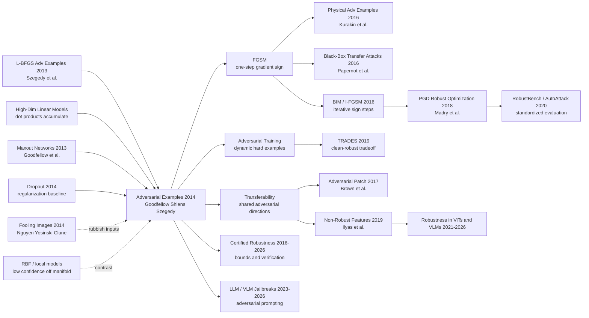

# Adversarial Examples — Linearity, FGSM, and the Beginning of Modern Robustness

> **On December 20, 2014, Ian J. Goodfellow, Jonathon Shlens, and Christian Szegedy at Google uploaded [arXiv:1412.6572](https://arxiv.org/abs/1412.6572), later published at ICLR 2015.** The paper's hook was not merely “neural nets can be fooled”; it turned the mystery into one line of high-dimensional linear algebra: $\eta = \epsilon\,\mathrm{sign}(\nabla_x J(\theta,x,y))$. In the now-iconic ImageNet panda example, adding a perturbation of only $\epsilon=0.007$ moves GoogLeNet from 57.7% confidence in “panda” to 99.3% confidence in “gibbon.” From that moment on, robustness stopped being a peripheral bug report and became a central question about training objectives, representation geometry, and whether deployed deep networks understand anything beyond the thin manifold they were trained on.

## TL;DR

Goodfellow, Shlens, and Szegedy's 2014 paper, published at ICLR 2015, converted the “adversarial examples” mystery that Szegedy and 6 co-authors had exposed with expensive box-constrained L-BFGS into a cheap, reproducible, and trainable formula: $\eta = \epsilon\,\mathrm{sign}(\nabla_x J(\theta,x,y))$. The paper rejected the early story that deep nets are vulnerable because they are too nonlinear or simply overfit; its sharper claim was that the danger comes from approximate linearity in high-dimensional spaces. A perturbation can be imperceptibly small in every pixel, yet when thousands of coordinates push in the same gradient-aligned direction, their logit effect accumulates at the scale of $\epsilon m n$. FGSM drove a shallow softmax model to 99.9% adversarial error on MNIST, a maxout network to 89.4%, and the iconic GoogLeNet panda to 99.3% confidence in “gibbon.” The other half of the paper was equally consequential: because FGSM takes one backward pass rather than an inner L-BFGS solve, adversarial training became a practical regularizer. On MNIST, maxout clean error dropped from 0.94% to 0.84%; a larger adversarially trained model averaged 0.782%; and FGSM adversarial error fell from 89.4% to 17.9%. Later [PGD adversarial training (2018)](../era3_attention/2018_pgd.md) turned this into the canonical robust-optimization recipe, while every post-[ResNet (2015)](2015_resnet.md) vision backbone inherited the same uncomfortable question: does high clean accuracy mean reliable understanding, or only confidence on a thin training manifold?

---

## Historical Context

### The security blind spot at the end of 2013

After AlexNet in 2012, the dominant story in deep learning was straightforward: deeper convolutional networks, larger datasets, and better GPUs would keep pushing visual recognition toward industrial usability. ImageNet top-5 error was falling each year, GoogLeNet and VGG were taking shape, and both Facebook and Google were moving CNNs into real products. The default belief was that if test accuracy was high enough, the model had mostly learned the target concept.

[Intriguing Properties of Neural Networks](https://arxiv.org/abs/1312.6199), released by Szegedy, Zaremba, Sutskever, Bruna, Erhan, Goodfellow, and Fergus at the end of 2013, broke that sense of safety. The seven authors used box-constrained L-BFGS to find images that looked almost unchanged to humans yet forced high-accuracy networks into high-confidence mistakes. Even more surprisingly, these examples transferred across architectures and training-set splits. In other words, adversarial examples were not a random crack in one trained model; they looked like a shared weakness in the decision boundaries learned by many deep networks.

The problem was that the Szegedy paper gave the phenomenon without a sufficiently usable explanation. L-BFGS attacks were slow, expensive, and black-box-like as an offline optimization procedure; “deep nets are too nonlinear” and “high-dimensional space contains many isolated pockets” sounded plausible, but they did not explain why a linear softmax classifier was vulnerable, nor why one adversarial image could fool another model. Robustness research in 2014 was stuck here: everyone could see the hole, but not its shape.

### From the L-BFGS mystery to the linear explanation

Goodfellow, Shlens, and Szegedy's key reversal was to flip the story. The model is not vulnerable because it is too nonlinear; it is vulnerable because, for optimization purposes, it is too linear. ReLU, maxout, LSTM, and carefully tuned sigmoid networks are all designed to avoid saturation across useful regions so that backpropagation works. The price of optimization-friendliness is that small input-direction changes can accumulate over many dimensions.

Section 3 gives the cleanest argument. For a linear model $w^\top x$, if each input coordinate may change by a tiny amount with $\|\eta\|_\infty < \epsilon$, then choosing the perturbation in the sign direction, $\eta = \epsilon\,\mathrm{sign}(w)$, increases the logit by $w^\top \eta$. If the average absolute weight is $m$ and the dimensionality is $n$, that increase is roughly $\epsilon m n$. One pixel movement is tiny; thousands of aligned pixel movements are not.

This explains three facts that earlier stories could not handle. First, adversarial examples do not require a precise search for isolated points; a short step in the right direction is enough. Second, both linear and deep models can be vulnerable, because deep models are often locally linear. Third, adversarial examples can transfer, because different models trained on the same task learn related gradient directions and classification weights. The paper describes the resulting system as a “Potemkin village”: convincing on natural samples, exposed as fake one step away from the data manifold.

### The author combination inside Google

The paper has a short author list, but the combination is unusually revealing. Ian J. Goodfellow had just moved from Bengio's lab to Google, after placing himself at the center of generative modeling and representation learning through GAN and maxout networks; Jonathon Shlens brought a background in neuroscience, visual coding, and representation analysis; Christian Szegedy was one of the first authors to systematically expose adversarial examples and a key figure behind GoogLeNet. The three-author team gave the paper its unusual flavor: the explanation had to be mathematically spare, the attack had to run, and the defense experiment had to matter for real vision systems.

The industrial setting mattered too. Google's 2014 environment already included large-scale CNN training, DistBelief-era infrastructure, and models inching toward deployment. For such systems, “99% clean accuracy but 99% confidence in the wrong label after an almost invisible perturbation” was not a philosophical edge case; it was a deployment risk. The panda figure became famous for a reason: it compressed an abstract safety problem into an image anyone could understand. Add barely visible noise to a panda and the model calls it a gibbon.

### Why robustness suddenly became a main line

Before 2014, reliability was more often framed as generalization, regularization, or calibration; robustness was not yet its own battlefield. Adversarial examples changed that by separating “high test-set accuracy” from “local stability.” A model could be nearly perfect on natural test points and still fail across much of a tiny $\ell_\infty$ neighborhood. Accuracy measured points on the data manifold, not the slope around that manifold.

This is the paper's historical position: it turned adversarial examples from an expensive anomaly into an object that could be generated by one formula, used in one training objective, and tested across models. Adversarial robustness, certified robustness, physical attacks, red-team evaluation, LLM jailbreaks, and attacks on vision-language models all inherit the same basic move: do not only ask how often the model is right on ordinary inputs; ask what remains true in the worst nearby direction.

## Background and Motivation

### What this paper really tried to replace

The paper was not merely replacing one attack algorithm; it was replacing a set of bad intuitions. First, it replaced “deep nets are fragile because they are too nonlinear” with “deep nets are fragile because they remain locally linear enough to be optimized.” Second, it replaced the geometry of “adversarial examples are rare isolated pockets” with “adversarial directions form broad contiguous regions.” Third, it replaced “defense requires an expensive inner optimization loop” with “one backward pass can dynamically produce a hard example.”

Together, these replacements make the motivation clear. If the flaw comes from a training objective that does not constrain the local worst-case direction, then the defense should enter the training objective itself. FGSM is both an attack and a microscope; adversarial training is both a defense and a new regularizer. The paper is not simply saying “models are unsafe.” It says: we can systematically generate the unsafe points during training, and the model can learn a locally more stable function.

Madry and co-authors later pushed this motivation to its cleanest 2018 form: $\min_\theta \mathbb{E}_{(x,y)}[\max_{\|\delta\|\leq \epsilon} J(\theta,x+\delta,y)]$. But the 2014 paper made the more basic first move: the inner maximization need not always be expensive L-BFGS. A gradient-sign step can be strong enough, cheap enough, and reproducible enough to create a research field.

---

## Method Deep Dive

### Overall framework

The paper's technical skeleton is compact: explain why tiny perturbations accumulate into large logit changes in high-dimensional linear models, extend that explanation to locally linear deep networks, then turn the attack into hard-example mining during training. It is not “yet another complicated defense module.” It compresses attack, defense, and explanation into the same gradient-sign direction.

| Layer | Question | Paper's move | Direct product |
|-------|----------|--------------|----------------|
| Phenomenon | L-BFGS finds invisible perturbations, but slowly | Explain them as high-dimensional linear accumulation | The flaw stops looking mysterious |
| Attack | How do we find the worst direction fast? | Use the input-gradient sign in one step | FGSM |
| Defense | How do we put the flaw back into training? | Mix clean loss with adversarial loss | Adversarial training |
| Diagnosis | Why does transfer happen across models? | Gradient directions form broad subspaces | Transferability hypothesis |

The elegant part is that the paper does not separate “attack” and “defense” into two systems. FGSM is the attacker's step and the trainer's step; the linear explanation says why the model loses and why random noise is too weak. That unity is what made the paper more durable than the earlier L-BFGS discovery.

### Key designs

#### Design 1: Fast Gradient Sign Method, replacing L-BFGS with a first-order step

**Function**: Under an $\ell_\infty$ constraint, generate a strong worst-direction perturbation with one backward pass, turning adversarial examples from an expensive offline solve into a standard batch transform inside training.

$$
\eta = \epsilon\,\mathrm{sign}\left(\nabla_x J(\theta, x, y)\right), \qquad x_{adv}=x+\eta
$$

The formula comes from first-order linearization of the loss around the current input. If $J(\theta,x,y)$ is approximately linear inside a small neighborhood, then the $\ell_\infty$-bounded perturbation that maximizes $J$ pushes each coordinate in the sign direction of the gradient. FGSM gives up L-BFGS's fine-grained optimality in exchange for three decisive properties: it is fast, reproducible, and train-loop friendly.

```python
def fgsm_attack(model, x, y, epsilon):
    x = x.detach().clone().requires_grad_(True)
    loss = cross_entropy(model(x), y)
    loss.backward()
    perturbation = epsilon * x.grad.sign()
    x_adv = (x + perturbation).clamp(0.0, 1.0)
    return x_adv.detach()
```

| Method | Inner solve | Cost | Meaning in 2014 |
|--------|-------------|------|-----------------|
| L-BFGS attack | Multi-step constrained optimization | High | Proved the flaw exists |
| Random noise | Untargeted sampling | Low | Weak control condition |
| **FGSM** | One gradient-sign step | Low | Scaled both attack and training |
| Later PGD | Multi-step FGSM + projection | Medium-high | Became robust optimization's standard inner loop |

**Design rationale**: L-BFGS's problem was not weakness; it was friction. If every adversarial example requires solving an optimization problem, adversarial training is hard to study at scale. FGSM turns the inner attack into one backward pass, moving robustness research from “demonstrate the phenomenon” to “train a model with it.”

#### Design 2: High-dimensional linear accumulation, rejecting the “too nonlinear” story

**Function**: Explain how tiny per-pixel changes can cause high-confidence mistakes, and why shallow linear models, maxout networks, and GoogLeNet can all be hit by similar directions.

$$
w^\top (x + \eta) = w^\top x + w^\top \eta \approx w^\top x + \epsilon m n
$$

If $n$ is large, small $\epsilon$ is not safe. A $1/255$ change in an 8-bit image is almost invisible to a human, but across thousands of input dimensions, aligned coordinate pushes combine into a large logit movement. This explanation demystifies adversarial examples: they are not a strange neural-network black-box artifact, but a normal consequence of high-dimensional dot products.

```python
def linearized_logit_gain(weight, epsilon):
    signed_step = epsilon * weight.sign()
    gain = torch.dot(weight.flatten(), signed_step.flatten())
    return gain.item()
```

| Candidate explanation | Explains linear softmax? | Explains transfer? | Paper's verdict |
|-----------------------|--------------------------|--------------------|-----------------|
| Extreme nonlinearity | No | Weak | Unnecessary |
| Overfitting | No | Weak | Insufficient |
| Isolated pockets | Weak | No | Conflicts with contiguous-subspace evidence |
| **High-dimensional linearity** | Yes | Yes | Core explanation |

**Design rationale**: A good explanation has to cover shallow softmax, maxout networks, and ImageNet CNNs at once. The linear story's power is that it does not require adding mysterious new properties to deep networks; it only requires models to contain large enough locally linear pieces. That view later shaped the debates on non-robust features and robust optimization.

#### Design 3: FGSM adversarial training, turning the attack into regularization

**Function**: Dynamically generate adversarial examples for the current model during training, mix clean loss and adversarial loss, and force the model to correct itself in the local worst direction.

$$
\tilde{J}(\theta,x,y)=\alpha J(\theta,x,y)+(1-\alpha)J\left(\theta,x+\epsilon\,\mathrm{sign}(\nabla_x J(\theta,x,y)),y\right)
$$

All experiments in the paper use $\alpha=0.5$. Two details are easy to miss. First, adversarial examples are not a static precomputed dataset; they are refreshed as model parameters change. Second, this is not ordinary data augmentation, because the perturbation direction is actively chosen as the worst direction rather than sampled from a natural transformation distribution.

```python
def adversarial_training_step(model, optimizer, x, y, epsilon, alpha=0.5):
    x_adv = fgsm_attack(model, x, y, epsilon)
    clean_loss = cross_entropy(model(x), y)
    adv_loss = cross_entropy(model(x_adv), y)
    loss = alpha * clean_loss + (1.0 - alpha) * adv_loss
    optimizer.zero_grad()
    loss.backward()
    optimizer.step()
    return loss.item()
```

| Training scheme | Where extra samples come from | Sensitive to worst direction? | Paper result |
|-----------------|-------------------------------|-------------------------------|--------------|
| Dropout only | None | No | Clean error 0.94% |
| Random $\pm\epsilon$ noise | Random direction | Weak | Still about 86.2% error under FGSM |
| Uniform noise | Random box sampling | Weak | Still about 90.4% error under FGSM |
| **FGSM adversarial training** | Gradient worst direction | Yes | Clean error 0.84%, adversarial error down to 17.9% |

**Design rationale**: Random noise has near-zero expected dot product with the dangerous direction, so it often fails to make training harder. FGSM acts like hard-example mining: every batch asks “where is the model easiest to fool right now?” and trains on that point. It is not the endpoint of full robustness, but it made the research loop cheap enough to repeat.

#### Design 4: Transferability and contiguous-subspace diagnosis, turning point attacks into geometry

**Function**: Use $\epsilon$-direction sweeps and cross-model classification experiments to show that adversarial examples are not isolated islands; they occupy broad regions along gradient directions, and different models make related mistakes there.

$$
\left\{x + t\,\mathrm{sign}(\nabla_x J): t \in [-\epsilon, \epsilon]\right\}
$$

Section 8's key claim is that direction matters more than the exact point. When $t$ is varied along the same FGSM direction, the model's unnormalized log-probabilities look conspicuously piecewise linear, and the wrong classification remains stable across an interval. This explains transferability: another model does not need the exact same crack at the exact same point; it only needs a related linear component in its gradients and decision boundary.

```python
def epsilon_sweep(model, x, y, eps_values):
    x0 = x.detach().clone().requires_grad_(True)
    loss = cross_entropy(model(x0), y)
    loss.backward()
    direction = x0.grad.sign().detach()
    logits = []
    for eps in eps_values:
        logits.append(model((x + eps * direction).clamp(0.0, 1.0)).detach())
    return torch.stack(logits)
```

| Diagnostic object | Paper observation | Supported conclusion | Later impact |
|-------------------|-------------------|----------------------|--------------|
| $\epsilon$ sweep | Error intervals are contiguous | Not isolated pockets | Supports the linear explanation |
| Softmax vs maxout | Wrong labels often agree | Linear components are shared | Black-box transfer attacks |
| RBF network | Low confidence when wrong | Nonlinear local response is stabler | Robust architecture discussion |
| Ensemble | Still about 91.1% adversarial error | Averaging models is not enough | Ensemble is not free defense |

**Design rationale**: If adversarial examples were tiny quirks of one model, defense might be as simple as ensembling or regularization. If they come from broad shared directions, the issue becomes representation geometry. The paper chose the second view, turning adversarial examples from an attack trick into a tool for studying decision surfaces.

### Loss / training recipe

| Item | Paper setting | Why it matters |
|------|---------------|----------------|
| Attack norm | $\ell_\infty$ | Matches “change every pixel a little” |
| MNIST $\epsilon$ | 0.25 | Strong on normalized inputs |
| CIFAR-10 $\epsilon$ | 0.1 | Produces high error on preprocessed color images |
| ImageNet $\epsilon$ | 0.007 | Roughly the smallest meaningful 8-bit encoding step |
| Adversarial mix | $\alpha=0.5$ | Equal weight on clean and adversarial loss |
| Base model | Maxout network + dropout | Strong MNIST baseline at the time |
| Larger model | 1600 units per layer | Paired with adversarial-validation early stopping |
| Inner attack | One-step FGSM | Cheap enough for the training loop |

It is important not to overread this as modern “strong robustness training.” FGSM is a one-step attack, and later PGD showed it can underestimate the true worst case. The historical contribution is that it connected robustness to the SGD inner loop for the first time. In 2014, the crucial achievement was not “all attacks are solved”; it was “attack and defense can finally be studied repeatedly inside the same training code.”

---

## Failed Baselines

### Baselines the paper broke through

The paper's “failed baselines” are not merely weak models. They are the natural explanations and defenses the community would have reached for at the time. The writing reads like a diagnostic report: if the issue is overfitting, dropout or ensembling should help; if it is lack of input-distribution modeling, MP-DBM should be safer; if random augmentation is enough, uniform noise should approach adversarial training. The results mostly say no.

| Baseline | Intuition at the time | Paper experiment | Why it lost to this paper |
|----------|-----------------------|------------------|---------------------------|
| Box-constrained L-BFGS | Strong attack, maybe usable for training | Finds adversarial examples, but slowly | Cannot support large-scale adversarial training |
| Dropout regularization | Reducing overfitting should reduce vulnerability | Clean error 0.94%, still widely broken by FGSM | The problem is not ordinary overfitting |
| Random noise augmentation | Small-noise training should improve local stability | Still 86.2% / 90.4% error under FGSM | Random directions are not worst directions |
| MP-DBM generative model | Modeling inputs should mean understanding “real images” | MNIST FGSM error 97.5% | Generative modeling is not robust understanding |
| 12-model ensemble | Averaging models should wash out quirks | Ensemble attack error 91.1% | Adversarial directions are shared across models |

The most important baseline is random noise. Random noise and FGSM both move inputs inside an $\ell_\infty$ box, but random noise is untargeted and has nearly zero expected dot product with the model gradient; FGSM pushes every coordinate toward increasing loss. Their gap shows that robustness is not just “look at more nearby points.” It is about the worst nearby direction.

### Failures and counterexamples admitted by the paper

The paper does not sell FGSM as the final answer. It explicitly leaves several boundary conditions unresolved, and many of those boundaries later became research fields of their own.

| Failure / counterexample | Paper observation | Later development | Key lesson |
|--------------------------|------------------|-------------------|------------|
| FGSM is not the strongest attack | One-step linearization only approximates the local worst direction | PGD / CW attack became stronger evaluation standards | Defenses must be checked with stronger inner maximizers |
| Adversarial training did not reach 0% adversarial error | 89.4% fell to 17.9%, but remained high | Robust accuracy became a separate metric | Clean accuracy and robust accuracy separate |
| RBF network had lower confidence but poor accuracy | FGSM error 55.4%, mistake confidence only 1.2% | Robust architecture remains hard to balance with expressivity | Optimization ease and local stability are in tension |
| Generative models remained vulnerable | MP-DBM clean error 0.88%, adversarial error 97.5% | Likelihood and robustness do not automatically align | Learning $p(x)$ is not learning a safe decision boundary |

The RBF result is especially instructive. An RBF network is less confident when attacked, so a nonlinear local response can indeed reduce high-confidence errors; but it generalizes poorly and is hard to use as a mainstream vision model. That is the tension at the end of the paper: models that are easy to optimize are often too linear, while models that are locally stable are hard to train well.

### The negative results that mattered most

First, **ensembles are not free defense**. If adversarial examples were single-model noise, averaging 12 maxout networks should have helped substantially. Instead, attacking the whole ensemble still produced 91.1% error, and examples built for one member still gave the ensemble 87.9% error. This result prepared the ground for black-box transfer attacks.

Second, **generative training is not free defense**. MP-DBM models the input distribution and reaches 0.88% clean error on MNIST, yet it has 97.5% error under $\epsilon=0.25$ FGSM. That breaks a tempting story: if the model learns what real images look like, it should not be fooled by fake-looking images. The paper shows that the local slope of the classification boundary can still be wrong.

Third, **adversarial training's success was incomplete**. Reducing 89.4% to 17.9% was a huge advance, but 17.9% is still not deployable safety, and the paper notes that mistaken adversarial predictions still had 81.4% average confidence. Adversarial training is the starting point of the field, not the endpoint of security.

## Key Experimental Data

### Attack strength and confidence

| Experimental object | Attack setting | Error rate | Error confidence | Note |
|---------------------|----------------|------------|------------------|------|
| MNIST shallow softmax | FGSM, $\epsilon=0.25$ | 99.9% | 79.3% | Linear models are vulnerable too |
| MNIST maxout | FGSM, $\epsilon=0.25$ | 89.4% | 97.6% | Strong nonlinear network fails confidently |
| CIFAR-10 conv maxout | FGSM, $\epsilon=0.1$ | 87.15% | 96.6% | Holds on color images too |
| ImageNet GoogLeNet | $\epsilon=0.007$ panda example | panda→gibbon | 99.3% | Nearly invisible visually |
| Logistic regression 3 vs 7 | FGSM, $\epsilon=0.25$ | 99% | Not reported | FGSM is exact worst direction for a linear model |
| RBF network | FGSM, $\epsilon=0.25$ | 55.4% | 1.2% | Wrong but not confident |

The shock in these numbers is that error rate and confidence are both high. If the model were merely occasionally wrong and uncertain, this would look like calibration. But maxout assigns 97.6% average confidence to wrong MNIST adversarial examples, and GoogLeNet assigns 99.3% to “gibbon.” The model is not hesitating; it is confidently wrong.

### Defense and generalization experiments

| Experiment | Clean error | Adversarial error | Extra number | Conclusion |
|------------|-------------|-------------------|--------------|------------|
| Maxout + dropout | 0.94% | 89.4% | Adversarial confidence 97.6% | Strong clean baseline is not robust |
| Maxout + FGSM training | 0.84% | 17.9% | $\alpha=0.5$ | Adversarial training gives both regularization and robustness |
| Larger maxout, no adv training | 1.14% | Not reported | 1600 units per layer | More capacity alone slightly overfits |
| Larger maxout + adv training | Average 0.782% | Not reported | Four runs at 0.77%, one at 0.83% | Near-best permutation-invariant MNIST result at the time |
| Original attack → adv-trained model | Not reported | 19.6% | Transfer test | Robust model better resists transferred attacks |
| Adv-trained attack → original model | Not reported | 40.9% | Reverse transfer | Adversarial training changes the decision boundary |

The easy-to-miss number is that clean error also improves. Adversarial training is not simply “give up clean accuracy to buy robustness” in this MNIST maxout setting; it beats dropout alone. Later strong robust training often exposes a clean-robust tradeoff, but the 2014 result shows that when the baseline has not constrained local slopes, adversarial examples can act as effective regularizers.

### Three conclusions from the data

First, **direction matters more than amplitude**. Random $\pm\epsilon$ noise and uniform noise are not tiny, but they give poor protection against FGSM; FGSM works because every coordinate lines up with loss increase.

Second, **model family changes confidence behavior**. Linear and maxout models keep giving high-confidence predictions away from the data manifold, while RBF responds with lower confidence. This observation reappears later in open-set recognition, OOD detection, and calibrated robustness.

Third, **robustness needs an explicit training signal**. Dropout, ensembling, and generative modeling do not automatically solve the local worst direction. Only when adversarial points become part of the training objective does the model start changing its filters and decision boundary.

---

## Idea Lineage



### Past lives (what forced it out)

- **The L-BFGS discovery by Szegedy and 6 co-authors**: This is the direct predecessor. Without [Intriguing Properties](https://arxiv.org/abs/1312.6199), Goodfellow, Shlens, and Szegedy would not have had the mystery to explain. It proved adversarial examples existed and found transferability, but the attack was slow and the explanation incomplete.
- **High-dimensional linear-model intuition**: The mathematical core does not come from a complicated deep-network trick; it comes from dot products accumulating in high dimensions. This intuition ties adversarial examples to ordinary linear classifiers and avoids a “deep-net magic” explanation.
- **Maxout Networks and the ReLU-era preference for optimizable linearity**: Goodfellow's own maxout work showed that in 2013-2014 deep nets deliberately used piecewise-linear, non-saturating activation families to train well. FGSM exploits exactly that optimization-friendly behavior.
- **Dropout as the regularization baseline**: Dropout represented the strongest general-purpose regularization story of the moment. This paper showed adversarial training could further reduce MNIST maxout clean error, telling the community that robustness was not a free side effect of dropout.
- **Fooling images / rubbish inputs**: Nguyen, Yosinski, and Clune's fooling images and this paper's appendix on rubbish class examples both showed deep nets can assign high confidence off the data manifold. The difference is that this paper explains which direction away from the manifold is dangerous: the gradient direction.

### Descendants

- **FGSM → BIM / I-FGSM → PGD**: FGSM is first-order and one-step; BIM iterates it; Madry and co-authors place PGD inner maximization inside min-max robust optimization. Today, any serious discussion of adversarial training passes through this chain.
- **Transferability → black-box attacks**: The paper explains transferability as shared linear directions. Papernot and co-authors then turned that into a black-box attack strategy: train a surrogate, generate adversarial examples, transfer them to the target model.
- **Adversarial training → robust benchmarks**: From 2014 MNIST maxout to TRADES, MART, AutoAttack, and RobustBench, the field gradually learned to report clean accuracy and robust accuracy separately.
- **Adversarial examples → physical attacks**: Kurakin, Brown, and follow-ups showed perturbations can partially survive printing, cameras, and patch settings, so the issue is not confined to digital input arrays.
- **Adversarial examples → LLM/VLM jailbreaks**: After 2023, jailbreaks, prompt injection, and image-based prompt attacks against language and vision-language models continue the same idea: construct inputs along a model's worst direction. The input space has expanded from pixels to text, images, and multimodal context.

### Misreadings / simplifications

- **“FGSM is robustness evaluation”**: Wrong. FGSM is the historical starting point, not the endpoint of strong evaluation. One-step attacks can underestimate vulnerability and can be fooled by gradient masking. Serious evaluation today needs PGD, CW, AutoAttack, or certified bounds.
- **“Adversarial examples prove deep nets understand nothing”**: Too simple. The more precise conclusion is that high clean accuracy does not guarantee local stability, nor guarantee that the model uses human-semantic features. A model may understand some semantics while also relying on many non-robust but predictive features.
- **“Random noise augmentation is basically adversarial training”**: Wrong. Random noise has weak expected alignment with the gradient direction, and the paper's control experiments already show it cannot replace worst-direction training.
- **“Generative models are naturally robust”**: Wrong. The MP-DBM experiment shows that modeling the input distribution does not automatically repair the classification boundary. Later diffusion classifiers and generative classifiers open new possibilities, but robustness does not follow from the word “generative.”

---

## Modern Perspective

### Assumptions that no longer hold

1. **“FGSM adversarial training is close enough to robust training”**: no longer holds. FGSM is a one-step linear approximation, extremely fast but blind to curvature, local nonconvexity, and worse points reachable by multiple steps. PGD adversarial training in 2018 made multi-step projected gradient ascent the basic standard for strong robustness. Today, if a defense reports only FGSM, readers assume gradient masking may be involved.

2. **“The high-dimensional linear explanation explains every adversarial phenomenon”**: it explains the central first-order phenomenon, not everything. It explains why FGSM works, why transfer exists, and why shallow linear models are vulnerable; but later adversarial patches, spatial attacks, semantic attacks, prompt jailbreaks, and physical attacks involve invariance, data bias, objective mismatch, and system-interface effects too.

3. **“Bigger and more accurate models will naturally become robust”**: empirically false. ResNet, ViT, CLIP, and VLMs improved clean accuracy and generalization, yet remain attackable through pixels, patches, text, or multimodal perturbations. Scale brings stronger representations and a larger attack surface.

4. **“Generative models will naturally repair classifier vulnerabilities”**: the MP-DBM result in this paper is already a counterexample, and later generative models did not solve the issue automatically. Diffusion models can be stabler in some robustness settings, but they also have adversarial prompts, adversarial guidance, and safety-bypass problems.

5. **“Adversarial examples are only a vision-classification issue”**: from a 2026 viewpoint, this is completely outdated. Speech recognition, autonomous driving, medical imaging, protein models, code models, LLM agents, and VLMs all have their own versions of adversarial input. The FGSM formula belongs to the pixel era, but the idea of constructing inputs along the model's worst direction has spread across domains.

### What still survived

The most important survivor is **worst-case thinking**. The paper made machine learning accept a now-basic idea: minimizing average risk is not deployment safety, and models must be tested on worst-case inputs inside a neighborhood. That idea later entered robust optimization, certified robustness, red teaming, alignment evaluation, and safety benchmarks.

The second survivor is **input gradient as an interface**. Before this paper, input gradients were mostly used for saliency or optimization diagnostics; FGSM turned them into an attack interface, defense interface, and explanation interface. Modern jailbreak search, prompt optimization, VLM image attacks, and related methods still search for input directions that maximize a target loss or bypass objective.

The third survivor is the **clean / robust metric split**. The paper shows clean error can be low while adversarial error is high; it also shows adversarial training can change both clean and robust performance. This directly led to the practice of reporting robust accuracy separately. Without that split, many “high-accuracy models” would hide their true deployment risk.

### If the paper were rewritten today

If rewritten in 2026, FGSM would be positioned as a fast baseline, while PGD, AutoAttack, black-box transfer, and physical attacks would form the main evaluation. The ImageNet section would not contain only one panda; it would systematically report different $\epsilon$ values, architectures, preprocessing pipelines, and threat models. The paper would also add a dedicated warning about gradient masking, because the last decade produced too many defenses that merely hid gradients.

The training section would look more like a robust-optimization paper: explicitly write $\min_\theta \mathbb{E}[\max_{\|\delta\|\leq\epsilon} J(\theta,x+\delta,y)]$, and separate FGSM, PGD, free adversarial training, fast adversarial training, and certified training. Extensions to VLMs and LLMs would deserve their own section: pixel perturbation was only the earliest form, while modern models are also attacked through prompts, tool calls, OCR patches, retrieval poisoning, and multimodal context.

But the core title would not change. A 2026 rewrite would still say: high-dimensional models contain enough linear structure to create adversarial examples; if the training objective does not explicitly constrain the local worst direction, high accuracy is not evidence of reliable understanding.

## Limitations and Future Directions

### Limitations acknowledged by the authors

- **FGSM is an approximate attack**: one-step linearization does not guarantee the true worst point.
- **Adversarial training still leaves substantial adversarial error**: 17.9% is far from a safety level.
- **More stable models such as RBF are hard to train to strong accuracy**: local stability and expressivity are in tension.
- **Input perturbation vs hidden-layer perturbation gives inconsistent results**: the paper does not provide a unified answer.
- **Confidence remains high on mistakes**: adversarial training lowers error but does not fully solve calibration.

### Limitations visible from 2026

- **Threat model is narrow**: the focus is mostly $\ell_\infty$ pixel perturbations; real attacks include patches, geometric transformations, semantic edits, physical printing, and cross-modal prompts.
- **Evaluation can be polluted by gradient masking**: one-step FGSM is easy to fool with nonsmooth or saturating defenses.
- **Robustness and out-of-distribution generalization do not automatically unify**: robustness to $\ell_p$ attacks does not imply robustness to corruptions, style shift, OOD, or jailbreaks.
- **Compute cost rises quickly**: moving from FGSM to PGD multiplies training cost; in the large-model era, this cost is sharper.
- **Human perceptual distance is not truly modeled**: $\ell_\infty$ is a convenient mathematical box, not visual semantic distance.

### Directions validated by later work

- **PGD / multi-step adversarial training**: stronger inner maximization, now a robust-training baseline.
- **Certified robustness**: convex relaxation, interval bounds, randomized smoothing, and related methods give provable radii.
- **Robust features / non-robust features**: adversarial vulnerability can be explained through predictive features that humans do not use.
- **Physical and semantic attacks**: threat models expand from pixel boxes to the real world and semantic space.
- **VLM/LLM red teaming**: adversarial-input thinking moves into multimodal and language systems.

## Related Work and Insights

### Relationship to three neighboring lines

| Line | Representative work | Relationship to this paper | Lesson for later researchers |
|------|---------------------|----------------------------|------------------------------|
| Robust optimization | Madry PGD 2018 | Upgrades FGSM training into the min-max standard form | Write the threat model first |
| Certified robustness | Wong-Kolter, randomized smoothing | Moves from empirical defense to provable radii | Without certificates, accept strong attack evaluation |
| Non-robust features | Ilyas 2019 | Explains why adversarial directions can be predictive and transferable | Models may learn real features humans do not use |
| Red-team evaluation | LLM/VLM jailbreak 2023-2026 | Generalizes worst-input thinking to interactive systems | Safety evaluation must actively search for bad inputs |

### Lessons for researchers

First, **a good explanation should generate an algorithm**. The linear explanation does not stop as a story; it directly yields FGSM, and FGSM directly yields adversarial training. The closed loop among explanation, attack, and defense is the reason the paper aged so well.

Second, **cheap baselines can open fields**. FGSM later ceased to be the strongest attack, but it was cheap enough for everyone to run. Many important paradigms in research history begin not with the optimal algorithm, but with a baseline that is strong enough, simple enough, and reproducible enough.

Third, **do not treat average performance as evidence of understanding**. A model doing well on a natural test set only says it answers those points correctly. Stability in neighborhoods, out-of-distribution regions, interaction boundaries, and malicious inputs must be proven separately.

Fourth, **safety problems reappear across modalities**. Pixel FGSM, audio perturbations, prompt injection, and VLM jailbreaks look different, but they ask the same question: does the model's input space contain directions that humans barely notice and the model overreacts to?

## Resources

### Paper and reproduction

- [arXiv:1412.6572 — Explaining and Harnessing Adversarial Examples](https://arxiv.org/abs/1412.6572)
- [ar5iv HTML version](https://ar5iv.labs.arxiv.org/html/1412.6572)
- [Szegedy et al. 2013 — Intriguing properties of neural networks](https://arxiv.org/abs/1312.6199)
- [Ian Goodfellow's adversarial examples tutorial page](https://github.com/goodfeli/adversarial)
- [CleverHans adversarial robustness library](https://github.com/cleverhans-lab/cleverhans)

### Follow-ups to read next

- [Kurakin et al. 2016 — Adversarial Examples in the Physical World](https://arxiv.org/abs/1607.02533)
- [Papernot et al. 2016 — Practical Black-Box Attacks against Machine Learning](https://arxiv.org/abs/1602.02697)
- [Carlini & Wagner 2017 — Towards Evaluating the Robustness of Neural Networks](https://arxiv.org/abs/1608.04644)
- [Madry et al. 2018 — Towards Deep Learning Models Resistant to Adversarial Attacks](https://arxiv.org/abs/1706.06083)
- [Ilyas et al. 2019 — Adversarial Examples Are Not Bugs, They Are Features](https://arxiv.org/abs/1905.02175)


---

> 🌐 [中文版](/era2_deep_renaissance/2014_adversarial_examples/) · 📚 awesome-papers project · CC-BY-NC