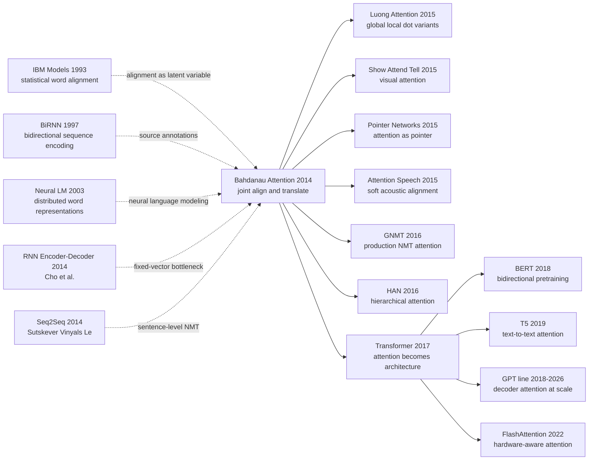

# Bahdanau Attention — Teaching Neural MT Where to Look

> **On September 1, 2014, Dzmitry Bahdanau, Kyunghyun Cho, and Yoshua Bengio at Universite de Montreal uploaded [arXiv 1409.0473](https://arxiv.org/abs/1409.0473), later published at ICLR 2015.** The paper's shock was not “one more RNN translator,” but the relocation of a twenty-year machine-translation object: alignment moved from external word aligners, phrase tables, and hand-engineered features into one differentiable neural line, $\alpha_{ij}=\mathrm{softmax}(v_a^\top \tanh(W_a s_{i-1}+U_a h_j))$. From that moment the decoder no longer had to compress an entire French or English sentence into one fixed vector; at every generated word it could look back at the source sentence again. What [Transformer](../era3_attention/2017_transformer.md) did three years later was, in a very literal sense, to promote this “look back at the source” operation from an RNN attachment into the protagonist of the whole architecture.

## TL;DR

Bahdanau, Cho, and Bengio's 2014 paper, published at ICLR 2015, changed neural machine translation from “compress the whole source sentence into one fixed vector $c$, then let the decoder write the target almost blind” into “for every target word $y_i$, score every source position with $e_{ij}=a(s_{i-1}, h_j)$, normalize those scores, and read a fresh context vector $c_i=\sum_j \alpha_{ij}h_j$.” The baseline it directly broke was the fixed-vector encoder-decoder: in the paper's WMT14 English-to-French setting, RNNencdec-30 reports only 13.93 BLEU, while RNNsearch-30 reaches 34.16 BLEU, slightly above Moses phrase-based SMT at 33.30. The counter-intuitive lesson is that attention was not born as a “large-model scaling trick” or a “parallel-compute primitive.” It was born as a modest translation fix: the 40th source word in a long sentence should not be forced through the same sentence-level memory bottleneck that was already stressed when the first target word was generated. [Transformer (2017)](../era3_attention/2017_transformer.md) later removed recurrence and amplified attention into the whole architecture; BERT, T5, and the GPT line then showed that “dynamic context reading” would escape translation and become the central operation of modern language modeling.

---

## Historical Context

### The ceiling of three-stage machine translation in 2014

Before 2014, mainstream machine translation was not “one neural network reads a source sentence and writes a target sentence.” It was a statistical pipeline: estimate word alignments, extract a phrase table, combine translation features with language-model scores, reordering features, length penalties, and hand-designed weights, then let beam search find a translation in a massive hypothesis space. Phrase-based SMT systems such as Moses were mature; a strong WMT entry was usually not one model but an engineered stack.

The weakness of that route was equally clear: alignment was external, translation and language modeling were trained separately, and feature weights were glued together by tuning procedures such as MERT or MIRA. It worked, but it did not look like an end-to-end system where a single loss could jointly optimize “where to align” and “which word to generate.” Translation errors often emerged at stage boundaries: a bad word alignment poisoned the phrase table; an unseen phrase forced the decoder into a workaround; long-distance reordering required extra features, and poorly tuned features made the system greedily favor local phrase matches.

| MT component around 2014 | Typical practice | What the attention paper changed |
|---|---|---|
| Word alignment | IBM Model / HMM / GIZA++ | Turns alignment into decoder-internal soft weights |
| Phrase table | Discrete phrase pairs + count features | Represents source tokens as continuous states $h_j$ |
| Decoder | Many hand-weighted features | Trains with one joint NLL loss |
| Long sentences | Phrase reordering and heuristic penalties | Dynamically reads the source at each target step |

That is why Bahdanau attention occupies such a precise historical location. It was not the first neural translation paper and not the first seq2seq paper. Its real target was the oldest and most central object in statistical MT: alignment. Alignment used to be an external latent variable estimated before or alongside translation; in this paper it became a differentiable, visible set of weights computed inside the model at every generation step.

### Seq2Seq had just worked, but it could not look

The year 2014 was the turning point where neural machine translation moved from “interesting prototype” to “possibly the replacement for SMT.” Cho, van Merrienboer, Bahdanau, Bengio, and co-authors first built the RNN Encoder-Decoder for phrase representations: compress a source phrase into a vector, then generate the target phrase. Sutskever, Vinyals, and Le used multilayer LSTMs for full-sentence sequence-to-sequence translation, using source reversal to soften long-distance dependencies.

Both lines had the same root disease: the **fixed-length vector bottleneck**. Whether a source sentence contained 8 words or 80 words, the encoder still had to compress it into one vector $c$; every later decoder decision had to draw information from that one $c$. Short sentences could survive on LSTM/GRU gates. Long sentences naturally faded: the earlier a source token appeared, the more likely it was to be washed out by the time the final encoder state was formed.

Bahdanau, Cho, and Bengio's key intuition was that translation is not “read once, close your eyes, then write.” Human translators look back at specific parts of the source sentence while producing each target word; statistical MT's alignment models had already admitted that each target token corresponds to one or more source positions. If so, neural MT should not force all source information through one bottleneck. The decoder should query source memory at every step.

### Why the Montreal group made alignment differentiable

The paper did not appear in a vacuum. Bengio's group at Universite de Montreal was pushing two lines in 2013-2014: replacing sparse NLP features with neural representations, and rewriting generative procedures as differentiable graphs. Cho's GRU encoder-decoder had already shown phrase-level translation could be trained end-to-end, but it still relied on an SMT system around it to propose phrase candidates. Bahdanau attention moved the problem to the sentence level and pulled SMT's most historically loaded object, alignment, into the network.

That turn also fit the Bengio lab's research temperament. They were not satisfied with using neural nets as SMT rerankers; they wanted to rewrite the whole translation chain as continuous-space optimization. The elegance of attention is that it did not abolish alignment. It softened alignment: instead of forcing a target word to hard-select a single source token, it allowed probability mass over all source positions. This preserved the translation-theoretic intuition of alignment while avoiding the non-differentiability of discrete latent choices.

### Compute, data, and evaluation climate

The experimental setup carries the signature of 2014. The data was WMT14 English-French, built from large parallel corpora; vocabularies used shortlists, retaining frequent source and target words while mapping rare words to UNK; BLEU was the central metric, not COMET, BLEURT, or human preference evaluation. The framework was Theano, and GPU memory and throughput did not permit today's large-scale pretraining style.

These constraints make the method's leverage more visible. RNNsearch did not win by brute-force parameter scale or larger pretraining data. It won by shortening the information path. In a fixed-vector seq2seq model, the first source word reaches the tenth target word only after passing through the full encoder recurrent chain and then the decoder recurrent chain. Attention turns that path into one soft lookup from the target step to source annotations. That path-length change is the technical prelude to Transformer removing RNNs altogether.

## Background and Motivation

### The real problem was memory compression, not translation alone

The title says “Align and Translate,” but the scientific problem is sharper: when a neural network generates a sequence, must it compress the input sequence into one fixed-length summary? If yes, NMT will always struggle with long sentences. If no, the source sentence can be treated as addressable memory, and the decoder can read only the part it needs at each step.

The motivation of Bahdanau attention is therefore exact: preserve the end-to-end advantage of seq2seq, but replace the fixed vector $c$ with a step-specific $c_i$. This is not merely “adding a module.” It changes the information-theoretic assumption of encoder-decoder modeling. The encoder no longer has to compress the whole sentence into one message. It only has to produce high-quality annotations for each position; content selection is delayed until decoding time.

### Why soft alignment rather than hard alignment

If one copied SMT directly, the obvious choice would be for each target word to pick one source position, then generate from that hard choice. But hard alignment brings discrete sampling, non-differentiable optimization, high-variance gradients, and complicated marginalization. The paper chooses soft alignment, an unusually effective engineering compromise: transform “choose a position” into “take a weighted average over all positions,” so the whole model can be trained with ordinary backpropagation.

This also explains why attention spread so quickly. Soft alignment requires no extra annotation, no GIZA++ supervision, no REINFORCE, and no complex dynamic programming. Given source-target sentence pairs, the NLL loss automatically pushes the alignment weights toward positions useful for translation. In other words, attention's real charm is not that the heatmaps look pretty; it turns a discrete, structured, historically heavy NLP object into the kind of continuous differentiable module deep learning knows how to optimize.

---

## Method Deep Dive

### Overall framework

Bahdanau attention's model is called **RNNsearch**. The name is literal: while generating each target word, the decoder performs a soft search over source annotations. The model remains encoder-decoder: the encoder reads the source sentence, and the decoder autoregressively generates the target sentence. The difference is that the encoder no longer emits only the final hidden state. It leaves an annotation $h_j$ for every source position $j$; at target step $i$, the decoder uses its previous state $s_{i-1}$ and all $h_j$ to compute attention weights $\alpha_{ij}$, then forms the current context $c_i$.

| Module | Input | Output | Key change |
|---|---|---|---|
| Encoder | source tokens $x_1,\dots,x_T$ | annotations $h_1,\dots,h_T$ | No longer keeps only the last state |
| Alignment model | previous decoder state $s_{i-1}$ + each $h_j$ | score $e_{ij}$ | Re-evaluates source positions at each step |
| Context reader | weights $\alpha_{ij}$ + annotations $h_j$ | context $c_i$ | Reads source by soft weighted sum |
| Decoder | $y_{i-1}$, $s_{i-1}$, $c_i$ | next-word distribution | Generation condition changes per target step |

The framework looks like a small extra edge next to seq2seq, but the information flow changes completely. In a fixed-vector model, every source detail must pass through one bottleneck $c$. In RNNsearch, the source becomes a row of addressable memory slots, and every decoder step can query them again. Today we call this an attention layer; in 2014 it was closer to putting SMT's alignment table inside a neural network.

### Key design 1: Bidirectional encoder annotations — turning the source into addressable memory

**Function**: Produce an annotation $h_j$ for each source position $j$, so it contains both left and right context instead of only the past from a one-way RNN.

$$
\overrightarrow{h_j}=f_{\text{enc}}(x_j,\overrightarrow{h}_{j-1}),\quad
\overleftarrow{h_j}=f_{\text{enc}}(x_j,\overleftarrow{h}_{j+1}),\quad
h_j=[\overrightarrow{h_j};\overleftarrow{h_j}]
$$

Intuitively, the representation of the $j$-th source word knows not only “what happened to the left,” but also “what will happen to the right.” This matters for translation: English adjectives, French noun gender/number, and German verb placement can all depend on context on both sides. A one-way encoder annotation is mostly a prefix state; a bidirectional encoder turns it into a semantic and syntactic slot inside the whole sentence.

```python
def bidirectional_annotations(source_embeddings, fwd_rnn, bwd_rnn):
    forward_states = fwd_rnn(source_embeddings)
    backward_states = reverse(bwd_rnn(reverse(source_embeddings)))
    annotations = concat([forward_states, backward_states], dim=-1)
    return annotations  # shape: [source_len, 2 * hidden_dim]
```

| Design choice | Position representation | Best for | Main defect |
|---|---|---|---|
| Final encoder state | One vector for the sentence | Short sentences and phrases | Long-sentence information gets flattened |
| One-way annotations | One prefix state per position | Left-to-right language modeling | Missing right context |
| **Bidirectional annotations (this paper)** | One whole-sentence contextual state per position | Translation alignment | Still serial, not parallel |

**Design rationale**: Attention over weak annotations is like navigating with a blurry map. Bahdanau attention first uses a bidirectional RNN to turn every source position into a high-quality memory slot, then lets the decoder query those slots. This choice established the basic interface of later encoder-attention-decoder models: the encoder produces token-level states, and the decoder reads them instead of reading one sentence vector.

### Key design 2: Additive alignment model — a small network decides where to look

**Function**: Before generating the $i$-th target word, score the match between the previous decoder state $s_{i-1}$ and every source annotation $h_j$, then normalize those scores into alignment weights $\alpha_{ij}$.

$$
e_{ij}=a(s_{i-1},h_j)=v_a^\top\tanh(W_a s_{i-1}+U_a h_j),\quad
\alpha_{ij}=\frac{\exp(e_{ij})}{\sum_{k=1}^{T_x}\exp(e_{ik})}
$$

This is the formula later called **additive attention** or **Bahdanau attention**. It is not a bare dot product. It projects the query (previous decoder state) and key (source annotation) into a shared hidden space, adds them, passes through $\tanh$, and scores with vector $v_a$. In 2014 this was natural: decoder states and encoder annotations did not necessarily share dimensionality or semantics, so learned adapters $W_a,U_a,v_a$ were more robust than direct dot products.

```python
def additive_attention(prev_state, annotations, Wa, Ua, va):
    query = Wa @ prev_state                      # [attn_dim]
    keys = annotations @ Ua.T                    # [source_len, attn_dim]
    scores = tanh(keys + query).matmul(va)       # [source_len]
    weights = softmax(scores, dim=0)
    return weights
```

| Scoring function | Formula | Parameter cost | Later fate |
|---|---|---|---|
| Hard alignment | $z_i \in \{1,\dots,T_x\}$ | Requires discrete variables | Hard to backpropagate end-to-end |
| **Additive (this paper)** | $v_a^\top\tanh(W_a s+U_a h)$ | Higher | Mainstream NMT in 2014-2016 |
| Dot-product | $q^\top k$ | Low | Transformer amplifies its parallelism |

**Design rationale**: The essence of this step is not “making the model interpretable.” It turns latent alignment, formerly hidden inside the SMT training pipeline, into an ordinary neural module. The softmax makes the weights over source positions sum to 1, so they behave like a probability distribution while remaining differentiable. The decoder state tells the alignment model “what kind of word I am about to generate”; the source annotations tell it “what information each position can provide.” Their intersection is where the current target token should look.

### Key design 3: Dynamic context vector — every target word reads a different source summary

**Function**: Take the weighted average of all annotations using attention weights to obtain the step-specific context vector $c_i$, then let the decoder generate the next word from $c_i$, previous word $y_{i-1}$, and previous state $s_{i-1}$.

$$
c_i=\sum_{j=1}^{T_x}\alpha_{ij}h_j,\quad
s_i=f_{\text{dec}}(s_{i-1},y_{i-1},c_i),\quad
p(y_i\mid y_{<i},x)=g(y_{i-1},s_i,c_i)
$$

The crucial symbol is the index on $c_i$. Fixed-vector seq2seq has one $c$, reused from the first target word to the last. RNNsearch has a different $c_i$ at every step. If the model is about to generate a French article, it may inspect the English noun and gender/number clues; if it is about to generate a verb, it may inspect the source subject, tense, and verb phrase. Context is no longer a sentence summary; it is a reading customized for the current generation action.

```python
def decoder_step(prev_word, prev_state, annotations, params):
    weights = additive_attention(prev_state, annotations,
                                 params.Wa, params.Ua, params.va)
    context = (weights[:, None] * annotations).sum(axis=0)
    state = gru_cell(input=embed(prev_word), state=prev_state, context=context)
    logits = output_layer(concat([embed(prev_word), state, context]))
    return state, softmax(logits), weights
```

| Context scheme | Changes with target step? | Long-sentence behavior | Alignment visualization |
|---|---|---|---|
| Fixed vector $c$ | No | BLEU drops visibly on long sentences | None |
| Last-state + reversed source | No, but shortens prefix distance | Medium | None |
| **Dynamic $c_i$ (this paper)** | Yes | More stable on long sentences | Has heatmaps |

**Design rationale**: The fixed-vector bottleneck fails not because RNNs cannot remember anything, but because “summarize the whole sentence once” is too demanding a task. Each translation step needs only a small part of the source. Compressing everything into one global vector wastes capacity and increases forgetting risk. Dynamic context delays compression until the moment of use: read what is needed from source annotations, weighted by current need.

### Key design 4: Joint training and alignment visualization — interpretability becomes a debugging tool

**Function**: Alignment weights receive no external supervision. The model trains only through the target sentence's negative log-likelihood; after training, $\alpha_{ij}$ naturally forms a source-target heatmap that lets one inspect whether the model is looking at plausible positions.

$$
\mathcal{L}(\theta)=-\sum_{(x,y)}\sum_{i=1}^{T_y}\log p_\theta(y_i\mid y_{<i},x),\quad
\theta=\{\theta_{enc},\theta_{dec},W_a,U_a,v_a\}
$$

This point is often underrated. Bahdanau attention did not train $\alpha$ from human word alignments and did not use GIZA++ as a teacher. Alignment is entirely a by-product of the translation objective. Even better, that by-product is readable: the paper's heatmaps show correspondences such as “European Economic Area” with “zone economique europeenne,” and non-diagonal alignments when adjective/noun order changes across languages.

```python
def nmt_loss(source, target, model):
    annotations = model.encoder(source)
    state = model.init_decoder_state(annotations)
    loss = 0.0
    for i, gold_word in enumerate(target):
        state, probs, attn = model.decoder_step(target[i - 1], state, annotations)
        loss += -log(probs[gold_word])
    return loss  # gradients also update the alignment parameters
```

| Training signal | Extra labels required? | What is learned | Risk |
|---|---|---|---|
| Human word alignment | Yes | Explicit alignment | Expensive and semantically rigid |
| GIZA++ pseudo-labels | Requires external tool | Imitated statistical alignment | Imports SMT bias into NMT |
| **Translation NLL (this paper)** | No | Soft alignment useful for generation | Attention need not equal human alignment |

**Design rationale**: If attention required human alignment, it would be much harder to become a general module. Because it depends only on end-to-end loss, it can migrate quickly from MT to image captioning, speech recognition, summarization, and document classification. The heatmap is not just a pretty figure; it gave researchers a first window into neural translation: the model was not emitting words from a black box, but reading identifiable parts of the source sentence at each step.

### Training recipe and implementation details

The paper uses the engineering stack of 2014 NMT: Theano, mini-batch SGD / Adadelta-style updates, beam-search decoding, vocabulary shortlists, UNK handling, and BLEU evaluation. There is no Transformer-style layer norm, multi-head block, residual stack, or large-scale pretraining. RNNsearch's advantage comes from the structural change, not from a modern training recipe.

| Item | Paper setting | Effect |
|---|---|---|
| Dataset | WMT14 English-French | Large parallel data, still tiny compared with modern pretraining corpora |
| Vocabulary | Source/target shortlist + UNK | Rare-word translation remains weak |
| Encoder | Bidirectional RNN | Each source position has bidirectional annotation |
| Decoder | Conditional recurrent decoder | Reads $c_i$ at every step |
| Search | Beam search | Decoding still depends on local hypothesis maintenance |
| Metric | BLEU | Captures n-gram overlap, weak on semantic equivalence |
| Visualization | Alignment heatmap | Became crucial evidence for attention's spread |

From a modern view, RNNsearch is slow, serial, and vocabulary-limited, and many engineering details are obsolete. But the interface it defined is still alive: **query from the current generation state, keys/values from the input sequence, weights decide where to read, and context decides what to generate**. Transformer simply rewrites that interface as matrix multiplication and copies it into every layer.

---

## Failed Baselines

### Baseline 1: The engineering ceiling of phrase-based SMT

Bahdanau attention first had to beat not another neural network, but mature phrase-based SMT. Systems such as Moses had word alignment, phrase tables, language models, reordering features, and beam decoders, backed by more than a decade of engineering on WMT tasks. The paper reports a Moses baseline of **33.30 BLEU** on English-to-French, already a strong traditional system at the time.

RNNsearch-30 reports **34.16 BLEU**, only 0.86 points above Moses. As an absolute margin, this is not a demolition. Its importance is that “an end-to-end neural system finally caught the hand-engineered machine.” NMT had often been viewed as a reranker or phrase scorer; this paper showed that a neural system could compete with SMT directly on full-sentence translation.

| Baseline | Representative system | Key number in paper | Where it lost |
|---|---|---|---|
| Phrase-based SMT | Moses | 33.30 BLEU | Complex feature engineering, external alignment |
| Fixed-vector RNNencdec-30 | Encoder-decoder | 13.93 BLEU | Long-sentence and word-order information compressed away |
| Fixed-vector RNNencdec-50 | Encoder-decoder | 17.82 BLEU | Longer training sentences do not fix the bottleneck |
| **RNNsearch-30 (this paper)** | Attention NMT | **34.16 BLEU** | Still has UNK and serial decoding issues |

### Baseline 2: Fixed-vector encoder-decoder collapses on long sentences

The model truly defeated by attention is the fixed-vector encoder-decoder. RNNencdec had an elegant idea: encode the source sentence into one vector, then let the decoder generate the target sentence from that vector. Translation exposed the capacity problem brutally. The longer the source sentence, the more the final hidden state becomes an over-compressed summary; when the decoder needs a detail, it can only “guess” from that summary.

The reported numbers are stark: RNNencdec-30 gets **13.93 BLEU**, and RNNencdec-50 gets **17.82 BLEU**, both far below Moses and RNNsearch. More importantly, the paper's sentence-length BLEU curves show the fixed-vector model dropping faster on long sentences; the attention model's curve is visibly flatter. This is not a tuning difference. It is an information-path difference.

The failure of fixed-vector seq2seq became the canonical counterexample in attention tutorials. When input length varies and each output step needs a different part of the input, a global bottleneck vector is both unnecessary and unreliable. A model should not compress memory into one stone; it should preserve it as a row of readable slots.

### Baseline 3: Source reversal and larger RNNs are patches, not cures

Sutskever seq2seq obtained strong results by reversing the source sentence: after reversal, the first few target words are closer to the last few source words, making optimization easier. It was a powerful trick, but also a symptom treatment for the fixed-vector bottleneck. It shortened some local dependencies without changing the fact that every source detail still had to pass through the final state.

Larger RNNs, more hidden units, and longer training sentences have a similar limitation. They add capacity, but they do not let the decoder at step $i$ directly access source position $j$. The counter-baseline lesson of Bahdanau attention is that long-sentence failure cannot be solved only by “make the RNN bigger.” The way the decoder reads the source has to change.

That is why RNNsearch's historical role is larger than one BLEU gain. It changes “source representation” from one vector to a sequence, and “translation state” from pure generation to “generation + query.” Transformer could later cut out RNNs because this query interface had already been validated.

## Key Experimental Data

### WMT14 English-to-French BLEU

The main experiment is WMT14 English-to-French. The numbers should be read in the 2014 evaluation context: BLEU was the main metric, UNK handling and shortlists strongly affected results, and RNNsearch-30 / RNNsearch-50 were not identical training settings. The safest conclusion is not “attention crushes every system,” but “attention lets end-to-end NMT reach phrase-based SMT scale for the first time and massively outperforms fixed-vector NMT.”

| Model | Sentence length setting | BLEU | Main conclusion |
|---|---|---|---|
| RNNencdec-30 | up to 30 words | 13.93 | fixed vector bottleneck is severe |
| RNNencdec-50 | up to 50 words | 17.82 | longer training is not enough |
| RNNsearch-50 | up to 50 words | 26.75 | attention clearly helps |
| Moses | phrase-based SMT | 33.30 | strong traditional baseline |
| **RNNsearch-30** | up to 30 words | **34.16** | neural model catches and slightly beats SMT |

### Long-sentence behavior

The most persuasive experiment is not the single BLEU number, but the sentence-length curve. The fixed-vector encoder-decoder can survive short sentences by compressed memory; as sentences grow longer, BLEU drops rapidly. RNNsearch drops more slowly, which means attention helps exactly where it should: long sentences, long-range dependencies, and local phrase reordering.

| Phenomenon | Fixed-vector seq2seq | RNNsearch | Explanation |
|---|---|---|---|
| Short sentences | Works acceptably | Better | Bottleneck not fully exposed |
| Medium/long sentences | Quality falls quickly | Smaller drop | Can look back at source each step |
| Long-distance dependency | Easily forgotten | Can query again | Source annotations preserve details |
| Reordering | Depends on RNN memory | Heatmap can cross diagonal | Alignment weights capture word-order shifts |

This result explains why attention quickly became standard in NMT. It did not merely add a small average BLEU gain. It fixed the neural seq2seq failure mode everyone feared most: when a long sentence arrives, the model suddenly forgets the first half of the source. For machine translation, that failure is more damaging than losing one BLEU point on short sentences.

### Alignment visualization and qualitative findings

The paper's alignment heatmaps are part of its influence. They showed the community that soft attention did not learn random weights, but source-target alignments that often matched linguistic intuition: noun phrases align with noun phrases, adjective/noun order changes produce off-diagonal patterns, and prepositions or function words spread weight over multiple positions.

Those figures mattered in 2014 because neural machine translation was still viewed by many as a black box. Attention heatmaps provided visual evidence: the model was not generating a translation from nowhere; at particular moments it was looking at particular source words. That evidence made attention easier for the NLP community to accept than many contemporary neural tricks.

The honest caveat is that attention heatmaps are not strict human alignments and do not guarantee causal explanation. A high-weighted position may be an internal computational signal rather than a linguistic statement that “this target word came from this source word.” This issue later reappears in debates about attention interpretability. Bahdanau attention's visualization value is high, but it is a debugging window, not a complete theory of explanation.

---

## Idea Lineage



### Past lives (what it inherited)

- **IBM Models 1993**: Made word alignment the central latent variable of statistical machine translation. Bahdanau attention did not invent alignment; it migrated alignment from discrete statistical modeling into differentiable neural networks.
- **Bidirectional RNN 1997**: Provided the tool for reading sequences in both directions. RNNsearch's encoder annotations are exactly the operational form of “each position sees left and right context.”
- **Neural probabilistic language model 2003**: Made word vectors and neural language modeling part of NLP infrastructure. Without continuous representations, the alignment model could not smoothly match $s_{i-1}$ against $h_j$.
- **RNN Encoder-Decoder 2014**: The immediate predecessor from the same research circle, proving phrase-level neural translation could be trained; its fixed-vector bottleneck is precisely the object Bahdanau attention repairs.
- **Seq2Seq 2014**: Pushed encoder-decoder to full-sentence translation and made LSTM NMT a serious baseline. Bahdanau attention appeared almost concurrently as a direct answer to its most important weakness.

### Descendants (what it opened)

- **Luong attention 2015**: Systematized attention scoring into global / local and dot / general / concat variants, becoming the early NMT practitioner's guide.
- **Show, Attend and Tell 2015**: Replaced source words with image regions, letting captioning models look at local visual patches while generating words. This was one of the first classic migrations of attention from NLP to vision.
- **Pointer Networks 2015**: Treated attention weights themselves as the output distribution, pointing directly to input positions. The same idea later enters copy mechanisms, extractive summarization, code generation, and tool use.
- **GNMT 2016**: Google pushed attention NMT into production. It proved Bahdanau attention was not a paper demo but an engineering paradigm capable of supporting large-scale translation service.
- **Transformer 2017**: The most important descendant. The question from Vaswani and 7 co-authors was not “should we use attention,” but “what if we keep attention and remove RNNs?” The answer became the backbone of modern NLP.
- **BERT / T5 / GPT / FlashAttention**: Attention moved from alignment trick to pretraining backbone, then to a hardware optimization target. After 2022, the bottleneck of attention is often not modeling but memory bandwidth and IO complexity.

### Misreadings / oversimplifications

- **“Attention is interpretability”**: Not quite. Bahdanau heatmaps are useful debugging artifacts, but attention weights are not causal explanations. They show where the model allocates read weight, not that removing that position would necessarily change the output in the same way.
- **“Transformer invented attention”**: False. Transformer invented “keep only attention and stack multi-head dot-product blocks into a full architecture.” Attention as neural alignment begins with Bahdanau 2014.
- **“Additive attention is obsolete, so the paper is only historical”**: Also false. The concrete scoring function was largely replaced by dot-product attention, but the interface “query current state, soft-select input memory” remains the skeleton of modern models.
- **“Attention solved long context”**: It solved the fixed-vector bottleneck, not infinite context. Transformer later exposed the $O(n^2)$ attention cost, triggering sparse attention, linear attention, FlashAttention, state-space models, and another generation of alternatives.

---

## Modern Perspective

### Assumptions that no longer hold

1. **“RNNs are the natural center of sequence modeling”**: This was reasonable in 2014 because LSTMs/GRUs were the main tools for variable-length sequences. But Transformer showed in 2017 that attention no longer had to be attached to RNNs. Bahdanau attention still treats attention as a decoder-side read head; Transformer makes it the main operator in every layer.
2. **“Soft alignment roughly equals interpretability”**: This was useful for spreading the paper, but later work repeatedly refined it. Attention heatmaps help debug model behavior, but they are not strict causal explanations. Modern interpretability cares about patching, ablation, and activation tracing, not weights alone.
3. **“BLEU is enough to evaluate translation quality”**: In 2014 there was no practical alternative, and BLEU was the standard. From 2026, BLEU is weak on semantic equivalence, factuality, style, and terminology. COMET, BLEURT, human preference evaluation, and LLM-as-judge all exist because this assumption was incomplete.
4. **“Vocabulary shortlist + UNK is acceptable”**: It was a compute compromise in 2014, but BPE, SentencePiece, and byte-level tokenization later proved that rare words and open vocabulary cannot be patched over with UNK. Attention solves the alignment bottleneck, not the vocabulary bottleneck.

| 2014 assumption | What happened later | How to reread the paper |
|---|---|---|
| RNN is the backbone | Transformer removes recurrence | attention was the more transferable interface |
| Heatmap is explanation | causal interpretability emerges | heatmap is a debugging tool, not proof |
| BLEU is the main evaluation | COMET / human preference appear | original gains need human-quality context |
| UNK is tolerable | subword tokenization becomes standard | attention and open vocabulary are separate problems |

### What survived

What survived is not the exact additive scoring function, but three interfaces.

First, **input as memory**: the input sequence does not have to be compressed into one global vector; it can remain a set of token-level states. Transformer encoders, retrieval memory, KV cache, and image patches in multimodal models all reuse this idea.

Second, **query-dependent reading**: the model does not read context statically; it decides where to read from the current state. Bahdanau uses $s_{i-1}$ to query source annotations; Transformer uses each token's query to read all keys; LLM decoding uses the current token state to query the KV cache. The form changes, the interface remains.

Third, **end-to-end latent structure**: alignment can emerge from task loss without explicit supervision. This idea spreads to visual attention, copy mechanisms, routing, soft retrieval, and tool selection. Deep learning is especially good at softening traditional NLP's discrete intermediate structures into continuous weights, and Bahdanau attention is one of the earliest and most successful demonstrations.

### If the paper were rewritten today

If the paper were rewritten in 2026, the core method might remain recognizable, but the presentation would be completely different:

- Use a subword tokenizer directly, not source / target shortlists plus UNK.
- Use a Transformer or at least a parallelizable encoder backbone, and present additive attention as the historical baseline.
- Report not only BLEU, but COMET, chrF, human adequacy/fluency, and sentence-length buckets.
- Run more systematic ablations: remove the bidirectional encoder, swap dot-product scoring, compare fixed/dynamic context, and bucket by source length.
- State the interpretability boundary of attention heatmaps, avoiding the claim that weights equal causal explanation.
- Release training code, preprocessing scripts, and checkpoints; the original paper has no stable official public code, which is a reproducibility limitation.

But the central sentence would remain the same: **a decoder should not be forced to translate an entire sentence from one fixed vector; it should reread source memory while generating each word**. That sentence solved NMT in 2014, generated Transformer in 2017, and still underlies KV-cache reading in LLMs in 2026.

### Side effects the authors could not fully foresee

Bahdanau, Cho, and Bengio surely knew alignment heatmaps would make models more readable, but they could hardly foresee attention becoming a general neural-computation primitive within three years. The paper opened not merely an MT trick, but a new computational habit: write the input as memory, write the current state as a query, write similarity as weights, and write reading as a weighted sum.

That habit changed the aesthetics of model design. In 2015-2016, attention moved into image captioning, speech recognition, summarization, and reading comprehension. In 2017, it swallowed RNNs inside Transformer. After 2018, it became the default layer of pretrained language models. After 2022, FlashAttention, PagedAttention, and KV-cache management show that attention has become a systems-engineering hot path. An alignment module inside a translation paper ended up as an infrastructure bottleneck for AI.

## Limitations and Future Directions

### Author-acknowledged limitations

- **High computation cost**: RNNsearch scans source annotations at every target step, and both encoder and decoder are recurrent, making training and decoding hard to parallelize.
- **Limited vocabulary**: shortlist + UNK still fails on rare words, names, numbers, and morphology.
- **Narrow evaluation**: BLEU and alignment visualization explain part of the story, but not adequacy, terminology consistency, or semantic faithfulness.
- **Beam-search dependence**: attention changes scoring, but decoding remains local search; length bias and repetition/omission are not fundamentally solved.

### Additional limitations from a 2026 view

- **Additive attention is not hardware-friendly enough**: every query-key pair runs through a small MLP, which is expensive to compose; dot-product attention is much easier to express as matrix multiplication on GPU/TPU.
- **Softmax attention is dense**: for long source sequences, every position is scanned. Transformer amplifies this into the $O(n^2)$ cost that later requires FlashAttention, sparse attention, and linear attention.
- **Attention weight is not faithful explanation**: heatmaps are reader-friendly, but cannot by themselves prove causal contribution.
- **End-to-end training remains data-hungry**: it removes manual alignment, but still needs large parallel corpora. Low-resource translation improves much later through multilingual transfer, back-translation, and pretraining.

### Improvement directions proven by follow-ups

| Improvement direction | Representative work | Problem addressed |
|---|---|---|
| Global/local attention variants | Luong et al. 2015 | Reduces computation and systematizes scoring |
| Subword tokenization | BPE / SentencePiece | Reduces UNK and rare-word failure |
| Production NMT | GNMT 2016 | Industrializes stacked LSTM + attention |
| Self-attention architecture | Transformer 2017 | Removes recurrent serial bottleneck |
| Efficient attention kernels | FlashAttention 2022 | Reduces memory IO and long-context cost |

The future question is not “is attention useful,” but “when do we need dense attention, and when should retrieval / sparse / state-space alternatives take over?” Bahdanau attention solved the fixed-vector bottleneck. Modern long-context models face a different bottleneck: context is readable, but reading it is too expensive.

## Related Work and Insights

### Comparison with neighboring routes

| Route | Shared idea | Difference | Lesson for today |
|---|---|---|---|
| IBM alignment / SMT | Both care about source-target alignment | SMT externalizes discrete alignment; attention internalizes continuous alignment | Old problems can be rewritten as differentiable interfaces |
| Sutskever Seq2Seq | Both are encoder-decoder NMT | Seq2Seq uses fixed vector; RNNsearch reads dynamically | Architectural interfaces matter more than RNN depth |
| Luong attention | Both read source at decoder steps | Luong systematizes scoring and local windows | Good ideas spread through engineering variants |
| Transformer | Both use query-key-value-style reading | Transformer removes recurrence and parallelizes | An auxiliary module can become the main architecture |
| Retrieval-augmented LLM | Both treat external information as memory | RAG memory comes from documents, not the source sentence | attention is a prototype of soft retrieval |

The paper's biggest lesson for researchers is: **do not rush to throw away the old system; sometimes the better move is to find the old system's living intermediate object and rewrite it as a differentiable module**. SMT's alignment did not die; it became attention. The parser's latent tree did not die; it became soft structure induction. Retrieval's inverted index did not die; it became dense retrieval plus cross-attention. Paradigm shifts often do not forget the past; they carry the most useful old structure forward in a new mathematical form.

## Resources

- 📄 [arXiv 1409.0473](https://arxiv.org/abs/1409.0473)
- 📚 [ICLR 2015 OpenReview page](https://openreview.net/forum?id=3Jv2JqfGBu)
- 📄 [Cho et al. 2014 RNN Encoder-Decoder](https://arxiv.org/abs/1406.1078)
- 📄 [Sutskever et al. 2014 Seq2Seq](https://arxiv.org/abs/1409.3215)
- 📄 [Luong et al. 2015 attention variants](https://arxiv.org/abs/1508.04025)
- 📄 [Vaswani et al. 2017 Transformer](https://arxiv.org/abs/1706.03762)
- 🔧 Official code: the paper does not provide a stable public official implementation; reproductions usually use modern NMT tutorials or attention seq2seq examples from OpenNMT / Fairseq
- 🌐 Cross-language: Chinese version → [`/era2_deep_renaissance/2014_attention/`](/era2_deep_renaissance/2014_attention/)


---

> 🌐 [中文版](/era2_deep_renaissance/2014_attention/) · 📚 awesome-papers project · CC-BY-NC