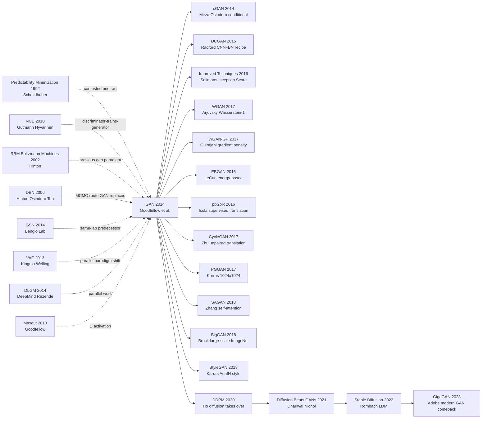

# GAN — Adversarial Games that Taught Neural Networks to Forge

> **June 10, 2014. Ian Goodfellow and 7 co-authors at Universite de Montreal (Bengio lab) upload [arXiv 1406.2661](https://arxiv.org/abs/1406.2661); published at NeurIPS 2014 in December.**
> A paper Goodfellow himself recounts as "written through the night after a bar argument in Montreal, working the next morning" — it used a deceptively simple minimax game $\min_G \max_D \mathbb{E}_x[\log D(x)] + \mathbb{E}_z[\log(1-D(G(z)))]$ to make a generator and a discriminator co-evolve through adversarial play.
> It overturned the entire "how do we get neural nets to generate images" playbook: no more reliance on explicit likelihoods (RBM / VAE ELBO), but **implicit modeling + adversarial signal**; within 6 years it spawned DCGAN / Pix2Pix / [CycleGAN](../era3_attention/2017_cyclegan.md) / [StyleGAN](../era3_attention/2018_stylegan.md) / BigGAN — Yann LeCun called it **"the coolest idea in machine learning of the past 10 years."**
> Even after Diffusion took the SOTA crown in 2022, GAN's idea (generate vs discriminate adversarial pressure) lives on in Diffusion's classifier-free guidance, LLM RLHF reward models, and nearly every modern generative model.

## TL;DR

Goodfellow et al.'s 2014 NeurIPS paper rewrote generative-model training as "a two-player zero-sum game between a generator G and a discriminator D": $\min_G \max_D \mathbb{E}_{x \sim p_{\text{data}}}[\log D(x)] + \mathbb{E}_{z \sim p_z}[\log(1 - D(G(z)))]$. **For the first time, a neural network sidestepped the two hats every 2014 generative model had to wear** — either write down an explicit likelihood (DBM blocked by partition function $Z$, normalizing flow blocked by an invertible Jacobian), or run MCMC (DBN samples cost hundreds of Gibbs steps, looking like 1990s watermarks) — producing recognizable images in a single forward pass while Theorems 1-2 prove the global optimum sits exactly at $p_g = p_{\text{data}}$. The MNIST samples beat VAE in edge sharpness by eye, precisely because **without a per-pixel MSE term GAN cannot optimize toward "average-position-correct" blurry mush**. But the paper also planted the central pain that would haunt the GAN school for five years: JSD is mathematically clean / engineering hell, G and D must grow at the same pace or training collapses — a defect not patched until WGAN (2017) introduced the Wasserstein distance. GAN went on to crown an 8-year golden age of image synthesis (DCGAN → PGGAN → StyleGAN → BigGAN), until [DDPM (2020)](../era4_foundation_models/2020_ddpm.md) finally took the generative throne for diffusion models.

---

## Historical Context

### What was the generative-modeling field stuck on in 2014?

To grasp GAN's disruptive force, you have to return to the "generative modeling = recipe-juggling and sampling drudgery" climate of 2013–2014.

Back then the entire generative-modeling field was wearing two hats — **either you wrote down an explicit, tractable likelihood, or you ran a Markov chain (MCMC) every time you wanted a sample**. The first hat forced rigid constraints (Boltzmann machines' partition function $Z$, normalizing flows' tractable Jacobian, directed-graph chain factorization) — algebraically the slightest tweak broke everything. The second hat meant every sample required hundreds of MCMC steps along an energy landscape, slow and unstable. The "generative battlefield" in CV looked like this:

> **DBN samples looked like blurry watermarks from the 1990s, VAE had not officially appeared yet, and PixelRNN would not arrive until 2015 — no route on the table could "produce a recognizable sample in a single forward pass."**

Concretely:
- **Energy-based camp** (DBN [ref3], RBM [ref4]): Hinton 2006 packaged "greedy layer-wise pretraining + Contrastive Divergence (CD-k)" into a deep generative model, but every sample required Gibbs sampling climbing the energy landscape, **MNIST 28×28 needed hundreds of chain steps**, CIFAR-10 was almost unusable, and the partition function $Z$ remained chronically uncomputable.
- **Variational-inference camp** (the about-to-arrive VAE [ref1], DLGM [ref2]): Kingma uploaded VAE to arXiv in December 2013, DeepMind independently shipped DLGM in January 2014 — both teams simultaneously hammered "reparameterization + ELBO lower bound" into a differentiable generative-training paradigm. Nobody yet realized VAE samples would lag GAN by an order of magnitude in sharpness, but **at least it was differentiable and trainable with SGD**.
- **Autoregressive camp** (NADE 2011, the soon-to-come PixelRNN 2015): factored image distribution pixel-by-pixel as $p(x) = \prod_i p(x_i \mid x_{<i})$ — exact likelihood, but **generating one 32×32 RGB image required 3072 sequential decodes**, industrially unusable.
- **Aristocratic camp** (Score Matching, NCE [ref5]): Hyvärinen / Gutmann had long proposed "estimate an unnormalized distribution via an auxiliary classifier," but it was applied to word embeddings and density estimation only, with nobody pushing it toward deep image generation. NCE in particular sat in NLP for four years before anyone realized its core trick — *make a classifier do the heavy lifting that an MLE estimator usually does* — was the seed of an entire generative paradigm.

The implicit "conventional wisdom" was: **explicit likelihood + high-quality samples + single-step sampling = pick two**, and most researchers believed this was a hard statistical constraint baked into the math, not a contingent product of which tools you happened to be using. Goodfellow flatly wrote in §2: "**You must either compute the likelihood or run an MCMC chain.**" Then he killed this 30-year-old false dichotomy with one line: *"or you can do neither."* That single sentence is the entire intellectual content of the GAN paper compressed into a tweet.

### The 4–5 immediate predecessors that pushed GAN out

- **Kingma & Welling, 2013 (Auto-Encoding Variational Bayes / VAE)** [arXiv/1312.6114](https://arxiv.org/abs/1312.6114): Rewrote "training a generative model" from "partition function + MCMC" into "reparameterization + backprop + a single-pass ELBO." VAE was GAN's direct intellectual rival — GAN's §2 spends three paragraphs comparing against VAE, arguing "we don't even need that KL term." Same window, same lab cluster (Bengio's circle), same paradigm shift — **without VAE knocking the "gradient-trainable generative model" door open, GAN could not have made the next move of dropping explicit likelihood entirely**.
- **Rezende, Mohamed, Wierstra, 2014 (DLGM)** [arXiv/1401.4082](https://arxiv.org/abs/1401.4082): DeepMind's January-2014 independent rediscovery of stochastic backprop, near-equivalent to VAE. **The "other route" coexisting with GAN's birth**, evidence that "train generative models with SGD" had become a collective consensus in early 2014.
- **Hinton et al., 2006 (DBN)** [ref3]: The "previous-generation king" GAN aimed to dethrone. Trained with Gibbs sampling, slow and unstable; Bengio's lab had been long stuck working around it — **without dethroning DBN, deep generative modeling could not break out of the corner**. GAN listed it as the most direct comparison target.
- **Gutmann & Hyvärinen, 2010 (NCE)** [ref5]: Noise-Contrastive Estimation — train a classifier to separate "real data" from "noise," thereby implicitly learning real data's density. **This is the conceptual ancestor of "use a discriminator to train a generator."** GAN explicitly cites NCE as a predecessor but upgrades "fixed noise" into "an adaptive, learnable adversary," and "parameter estimation" into "full generative modeling."
- **Schmidhuber, 1992 (Predictability Minimization, PM)** [ref8]: 22 years before GAN, PM proposed "two networks adversarially train each other" — one learns to predict, the other learns to make itself unpredictable. **Conceptually nearly equivalent**, but PM was framed as "unsupervised feature learning" rather than "generative modeling," and it lacked the Bengio-lab + NeurIPS amplification stack. Schmidhuber publicly accused GAN of plagiarizing PM in subsequent years; the dispute is unresolved. The lesson cuts both ways — having the idea early is necessary but nowhere near sufficient for getting credit.

### What was the author team doing?

Ian Goodfellow was a **PhD student in Yoshua Bengio's lab at Université de Montréal**, having just finished Maxout Networks [ref7] (ICML the same year — the activation function used in GAN's first discriminator) with David Warde-Farley, Mehdi Mirza, and Aaron Courville. The entire LISA lab (Bengio Lab) in 2013–2014 was running on one core agenda: **"train stochastic / generative networks with backprop"** — GSN [ref6] and DLGM-style work were already in flight.

GAN's birth has a famous origin detail: **one evening in October 2013, Goodfellow was at Les 3 Brasseurs in Montréal celebrating a colleague's PhD defense**. While debating the impasse of generative modeling, Goodfellow blurted out the "two networks playing a game" idea on the spot. His friends thought it would not work. Goodfellow refused to drop it, **went home that night, coded the first prototype in Theano, and produced recognizable MNIST samples by morning**. That is the "trained-in-one-night GAN" anecdote — one of the most dramatic origin stories in ML history.

The paper is just 9 pages (10 with appendix), mathematically clean, theoretically elegant, and experimentally minimalist. It was accepted at **NeurIPS 2014** on first submission. Goodfellow was 26. Within 12 months of the paper being posted, the "GAN explosion" began — for the next five years every NeurIPS / ICML / CVPR submission cycle saw 100+ GAN variants.

### State of the industry, compute, and data

- **GPUs**: NVIDIA Kepler-architecture GTX 580 / Tesla K20, mostly 6 GB single-card memory; Goodfellow's MNIST + TFD + CIFAR-10 experiments trained in **a few hours** on a single GPU — the hardware prerequisite for "PhD-student weekend side project" to work
- **Data**: MNIST (28×28 grayscale handwritten digits), Toronto Face Database (48×48 grayscale faces), CIFAR-10 (32×32 color) — the generative-modeling "three-piece set" of the era, no resolution above 48 pixels
- **Frameworks**: **Theano** (Bengio lab's home product; PyTorch was 3 years away, TensorFlow was 1 year away). Auto-diff + GPU + Python were mature, but the ecosystem was nothing like today — every layer was hand-written
- **Industry climate**: AlexNet 2012 had begun spreading "deep learning is industrially viable" through ImageNet. **Google acquired DeepMind for $600M in January 2014**; Facebook founded FAIR the same year. The last academic-to-industrial window for deep learning was open. The phrase "Generative AI" did not exist yet — "GenAI" would take a decade to enter mainstream vocabulary. Nobody predicted that this NeurIPS 2014 submission would carry a trillion-dollar market eight years later.

---

## Method Deep Dive

### Overall framework

GAN's pipeline is brutally and counter-intuitively simple: **two networks, one additive objective, one adversarial loop, that's it**. The generator $G(z; \theta_g)$ maps a latent noise vector $z \sim p_z(z)$ (paper uses 100-dim uniform or Gaussian) into a "fake sample" $G(z)$; the discriminator $D(x; \theta_d)$ takes either a real sample $x \sim p_{\text{data}}$ or a fake $G(z)$ and outputs a $[0,1]$ probability scalar — "the probability I believe this sample is real." **G wants to maximize D's mistake rate, D wants to minimize its own mistake rate, and the two alternate gradient updates**.

```
                  ┌──────── real x ~ p_data ────────┐
                  │                                  ↓
   z ~ p_z(z) → G(z; θ_g) → fake G(z) ────→ D(·; θ_d) → probability ∈ [0,1]
   (100-d)        (MLP)        (28×28 etc)    (MLP+maxout)         ↑
                  ▲                                                  │
                  │ ← G step: minimize log(1 - D(G(z))) (or maximize log D(G(z)))
                  │                                                  │
                  └────── backprop ←─────── BCE loss ←──────────────┘
                            D step: maximize log D(x) + log(1-D(G(z)))
```

The model's "magic" is exactly this symmetric structure — no encoder, no prior matching, no likelihood term, no MCMC, no partition function $Z$. **Only "two networks scoring each other" — the most minimalist zero-sum game setup imaginable.**

A side-by-side comparison of the four generative paradigms (essential for grasping GAN's disruption):

| Paradigm | Likelihood | Sampling | Training stability | Sample quality (2014) | Encoder |
|----------|-----------|----------|--------------------|----------------------|---------|
| **GAN (this paper)** | **Implicit** | **1 forward pass** | **Terrible (mode collapse rampant)** | **Sharp but unstable** | **None** |
| VAE [ref1] | Explicit ELBO bound | 1 forward pass | Stable | Blurry (Gaussian prior + reconstruction term) | Yes |
| DBN/RBM [ref3] | Implicit (partition $Z$ untractable) | MCMC, many steps | Slow and unstable | Noisy, near-unusable | None (generative-only) |
| Autoregressive (NADE/PixelRNN) | Exact chain-rule likelihood | **Sequential N forward passes** | Stable | Sharp but extremely slow | None |

**Counter-intuitive point #1**: A paradigm with **no probability density modeling at all** still has a mathematically well-defined global optimum ($p_g = p_{\text{data}}$) — GAN fully outsources "density estimation" to the discriminator's implicit judgment, **replacing statistical inference with game theory**. Goodfellow proves this in §4 with two clean theorems, elevating "a hacky-looking two-network game" to "a provably-converging distribution-matching procedure."

**Counter-intuitive point #2**: Both G and D in the original paper are **plain MLPs** (3 hidden layers), with no convolutions whatsoever. This "weakest possible architecture" choice highlights that **the power lies in adversarial training itself**, not in the network. CNNs would be added a year later by DCGAN — that was an engineering victory, not the conceptual core.

### Key designs

#### Design 1: Minimax adversarial objective — rewriting generative training as a two-player zero-sum game

**Function**: Use an adversarial min-max formula to let G and D implicitly drive $p_g \approx p_{\text{data}}$ without ever computing a likelihood.

**Core formula** (paper Eq.1):

$$
\min_G \max_D V(D, G) = \mathbb{E}_{x \sim p_{\text{data}}(x)}\big[\log D(x)\big] + \mathbb{E}_{z \sim p_z(z)}\big[\log\big(1 - D(G(z))\big)\big]
$$

Intuitive reading:
- $D$ is a **binary classifier** (real=1, fake=0) wanting to maximize both $\log D(x)$ (declare real samples real) and $\log(1-D(G(z)))$ (declare fake samples fake) — standard binary cross-entropy
- $G$ wants to maximize D's mistakes, so it **minimizes** $\log(1-D(G(z)))$ (push D to misclassify fakes as real)
- Since the first term $\mathbb{E}[\log D(x)]$ has no $G$ in it, optimizing $G$ amounts to optimizing only the second term — yielding the "zero-sum game where one max's and the other min's the same $V(D,G)$"

**Training pseudocode** (PyTorch-style, two alternating steps):

```python
# Paper Algorithm 1: each iteration runs k D-steps then 1 G-step
for it in range(num_iterations):
    # ---- D step (max V): ascend gradient so D distinguishes real/fake better ----
    for _ in range(k):
        x_real = sample_real(batch_size)            # x ~ p_data
        z      = sample_noise(batch_size, dim=100)  # z ~ p_z
        x_fake = G(z).detach()                      # critical: detach, no grad to G
        loss_D = -(torch.log(D(x_real)) + torch.log(1 - D(x_fake))).mean()
        opt_D.zero_grad(); loss_D.backward(); opt_D.step()

    # ---- G step (min V): descend gradient so G fools D ----
    z      = sample_noise(batch_size, dim=100)
    loss_G = torch.log(1 - D(G(z))).mean()          # original min-max G loss
    opt_G.zero_grad(); loss_G.backward(); opt_G.step()
```

**Adversarial-objective variants** (5 years of GAN-loss evolution):

| Objective | G loss | D loss | Implicit divergence | Training stability |
|-----------|--------|--------|---------------------|--------------------|
| **Original min-max (this paper Eq.1)** | $\log(1 - D(G(z)))$ | $-\log D - \log(1-D \circ G)$ | JSD | Bad (G gradient vanishes when D wins) |
| Non-saturating (this paper §3 footnote) | $-\log D(G(z))$ | same as above | Still JSD | Medium (de facto standard) |
| LSGAN 2017 | $(D(G(z))-1)^2$ | LS form of $D(x)^2 + (D(G(z))-1)^2$ | Pearson $\chi^2$ | Medium |
| WGAN 2017 | $-D(G(z))$ | $D(G(z)) - D(x)$ | Wasserstein-1 | Substantially improved |
| Hinge GAN | $-D(G(z))$ | hinge form | margin loss | Stable (used by BigGAN) |

**Design rationale — why is this formula so disruptive?**

Before GAN, every generative model required an explicit probability density $p_\theta(x)$ — parameterized Gaussian / energy function, ELBO bound, or chain-rule factorization. The 30-year-old paradigm of **density modeling → likelihood estimation → MLE optimization** had become "a law of statistics." Goodfellow's disruptive insight: **I don't need to model the density at all**. Let a discriminator $D$ implicitly handle "is this sample on the data manifold?", and the generator $G$ only needs to "fool that implicit judgment."

This is a paradigm jump from **density estimation** to **distribution matching via game** — replacing maximum likelihood with Nash equilibrium. Once you accept the jump, every technical detail of GAN becomes natural: D is the implicit density estimator, G is D's adversary, the loss is the game's value function.

#### Design 2: Theoretical optimum analysis ($p_g = p_{\text{data}}$) — Goodfellow's elegant proof

**Function**: Two clean theorems prove "this hacky-looking adversarial training does converge to $p_g = p_{\text{data}}$ at optimum," elevating GAN from engineering trick to a paradigm with mathematical guarantees.

**Theorem 1 (paper §4.1) — D's optimal solution**: For fixed $G$, the optimal discriminator is

$$
D^*_G(x) = \frac{p_{\text{data}}(x)}{p_{\text{data}}(x) + p_g(x)}
$$

**Proof sketch**: Write $V(D,G) = \int_x \big[p_{\text{data}}(x) \log D(x) + p_g(x) \log(1-D(x))\big] dx$, then for each $x$ take $\partial / \partial D(x) = 0$. **Geometric meaning**: where data density is high $D^* \to 1$; where generator density is high $D^* \to 0$; in the overlap region $D^* = 1/2$.

**Theorem 2 (paper §4.2) — G's global optimum**: Substituting $D^*_G$ back into $V(D,G)$ yields a $G$-only objective $C(G)$:

$$
C(G) = -\log 4 + 2 \cdot \text{JSD}\big(p_{\text{data}} \,\|\, p_g\big)
$$

where $\text{JSD}$ is Jensen-Shannon divergence, $\text{JSD} \geq 0$ with equality iff the two distributions match. **So $C(G)$'s global minimum is $-\log 4$, achieved iff $p_g = p_{\text{data}}$.**

**Diagnostic code** (how to verify training is approaching Nash equilibrium):

```python
# Near convergence, D should give ≈ 0.5 probability for both real and fake
with torch.no_grad():
    x_real = sample_real(1000)
    x_fake = G(sample_noise(1000, 100))
    d_real_mean = D(x_real).mean().item()  # expect → 0.5
    d_fake_mean = D(x_fake).mean().item()  # expect → 0.5
    val_V = math.log(d_real_mean) + math.log(1 - d_fake_mean)
    print(f"V(D,G) = {val_V:.4f}, ideal = {-math.log(4):.4f}")
    # If d_real_mean ≈ 1, d_fake_mean ≈ 0 → D too strong, G hasn't caught up
    # If both ≈ 0.5, V ≈ -1.386 → near Nash equilibrium
```

**Explicit-density vs implicit-density training comparison**:

| Paradigm | Optimization target | Need to compute $p_\theta(x)$? | Convergence → which divergence? |
|----------|---------------------|-------------------------------|----------------------------------|
| MLE (VAE/Flow/AR) | $-\log p_\theta(x)$ | **Yes** (must be explicit) | Reverse KL |
| GAN (this paper) | min-max game value $V$ | **No** (density implicitly carried by $D$) | JSD |
| Score Matching | $\|s_\theta - \nabla \log p_{\text{data}}\|^2$ | No (learn score $\nabla \log p$) | Fisher divergence |
| Diffusion (DDPM 2020) | $\|\epsilon - \epsilon_\theta\|^2$ | No (learn denoising) | Weighted ELBO ≈ Fisher |

**Design rationale**: Theorems 1 + 2 elevate GAN from engineering trick to "under optimal $D$, min G is equivalent to minimizing $\text{JSD}(p_{\text{data}} \| p_g)$" — the **first differentiable framework for divergence minimization without density computation**. WGAN (2017) follows the same line but swaps JSD for Wasserstein-1; f-GAN extends to arbitrary f-divergence. The entire "divergence minimization without density" research lineage stems from these two theorems.

#### Design 3: Non-saturating G loss — the engineering lifesaver in §3 footnote

**Function**: Fix the original min-max formula's "vanishing gradient" problem early in training, so $G$ still gets sufficient gradient when $D$ has the upper hand.

**Problem analysis**: The original G loss is $\log(1 - D(G(z)))$. Early in training, $G$ is weak and $D$ easily classifies fakes as fake ($D(G(z)) \to 0$), so:

$$
\frac{\partial \log(1 - D(G(z)))}{\partial G(z)} \;\propto\; \frac{-1}{1 - D(G(z))} \cdot \frac{\partial D}{\partial G(z)}
$$

When $D(G(z)) \to 0$, the denominator $1 - D(G(z)) \to 1$, **and the gradient magnitude is crushed by the $\log$** ($\log(1-\epsilon) \approx -\epsilon$, vanishingly small). $G$ receives no useful gradient and training stalls. This is the famous **"saturating gradient"** problem.

**Fix (a one-sentence footnote in paper §3)**: change $G$'s objective from "minimize $\log(1-D(G(z)))$" to "**maximize $\log D(G(z))$**":

$$
L_G^{\text{non-sat}} = -\mathbb{E}_{z \sim p_z}\big[\log D(G(z))\big]
$$

**Key observation**: The two objectives are equivalent at Nash equilibrium (both want G to fool D), but **early-training gradient behavior is completely different** — when $D(G(z)) \to 0$, $-\log D(G(z)) \to +\infty$, gradients are huge, and $G$ is forcefully pushed toward "fool D." This is a **pure engineering hack that doesn't break the Nash-equilibrium theorem but rescues training**.

**Comparison code**:

```python
# Saturating version (original min-max — gradient vanishes early)
loss_G_sat = torch.log(1 - D(G(z)) + 1e-8).mean()
# ↑ When D(G(z)) ≈ 0, loss ≈ 0, gradient ≈ 0, G can't learn

# Non-saturating version (§3 footnote — practical default)
loss_G_nonsat = -torch.log(D(G(z)) + 1e-8).mean()
# ↑ When D(G(z)) ≈ 0, loss → +∞, gradient huge, G strongly driven
```

**Two G-loss versions side by side**:

| Version | G loss formula | Gradient magnitude when D dominates | Equivalent at Nash? | Training stability | Historic role |
|---------|---------------|-------------------------------------|---------------------|--------------------|---------------|
| Saturating (min-max original) | $\log(1-D(G(z)))$ | **→ 0 (vanishes)** | Equivalent | Bad | Paper main-text formula |
| **Non-saturating (§3 footnote)** | $-\log D(G(z))$ | **→ ∞ (strong)** | Equivalent | Medium | **Adopted by every DCGAN/StyleGAN/BigGAN** |

**Design rationale**: This is the paper's **most underappreciated and most important "engineering lifesaver"** — the main text uses min-max for theoretical elegance (Theorem 1+2 only cleanly close in min-max form), but what actually makes GAN trainable is the unassuming §3 footnote. **Every GAN paper for the next 5 years uses the non-saturating version**; the original min-max appears almost only in textbooks. A textbook case of "theory and engineering parting ways" — Goodfellow handled it with admirable honesty: clean theorem in min-max form, lifesaver footnote sitting right next to it.

#### Design 4: Alternating optimization with k inner D-steps — the root of training instability

**Function**: Defines GAN's actual training cadence — each outer iteration runs $k$ inner $D$-updates then 1 $G$-update.

**Paper Algorithm 1**:

```python
# Paper Algorithm 1 full pseudocode
for outer_iter in range(num_iterations):
    # Inner loop: D update k times (paper k=1, theoretically want k → ∞ for D ≈ optimal)
    for _ in range(k):
        # 1. sample m noises: {z^(1), ..., z^(m)} ~ p_z
        # 2. sample m real:   {x^(1), ..., x^(m)} ~ p_data
        # 3. D ascend gradient:
        #    grad_D = ∇_θ_d (1/m) Σ_i [log D(x^(i)) + log(1 - D(G(z^(i))))]
        z = sample_noise(m, 100); x = sample_real(m)
        opt_D.zero_grad()
        (-(torch.log(D(x)) + torch.log(1 - D(G(z).detach())))).mean().backward()
        opt_D.step()

    # Outer loop: G update once
    # 1. sample m noises: {z^(1), ..., z^(m)} ~ p_z
    # 2. G descend gradient (use non-saturating):
    #    grad_G = ∇_θ_g (1/m) Σ_i [-log D(G(z^(i)))]
    z = sample_noise(m, 100)
    opt_G.zero_grad()
    (-torch.log(D(G(z)))).mean().backward()
    opt_G.step()
```

**Choice of $k$**:

| Setting | Description | Theoretical soundness | Training speed | Practical stability |
|---------|-------------|----------------------|----------------|---------------------|
| $k=1$ (paper choice) | 1 D-step + 1 G-step | Weakest (D far from $D^*$) | Fastest | Worst, mode-collapse rampant |
| $k=5$ (DCGAN practice) | 5 D-steps + 1 G-step | Medium | Medium | Slightly better |
| $k=\infty$ (theoretically pure) | Train D to convergence before each G | Strongest (every G-step optimizes against optimal $D^*$) | Extremely slow, full D retraining per G | Theoretically stablest, practically infeasible |
| WGAN-GP 2017 | $k=5$ or more, with gradient penalty | Strong | Slow | Stable |

**Why does $k=1$ even work?**

Theoretically Theorem 2 assumes $D$ has reached $D^*_G$ before each $G$-update — **$k=1$ violates this assumption severely**. The paper §4 honestly admits this is a "practical compromise": training $D$ to convergence each iteration is too slow, so we use a one-step approximation. The approximation works on relatively simple distributions (MNIST/TFD) but on complex data triggers:

- **mode collapse** ($G$ finds a $D$-blind region and maps every $z$ to one mode)
- **oscillation** ($G$ and $D$ chase each other on the loss landscape, never converging)
- **vanishing G gradient** ($D$ suddenly becomes too strong and $G$ gets no usable gradient)

These three plagues haunted GAN for a full 5 years until **WGAN (2017)** replaced JSD with Wasserstein-1, **Spectral Normalization (2018)** Lipschitz-bounded $D$, and **Two-Time-Scale Update Rule (TTUR, 2017)** gave G and D different learning rates — only then did training stability become industrial-grade.

**Design rationale**: $k=1$ is the paper's engineering compromise to "make it train at all," but this compromise downgrades GAN from "provably convergent" to "black-magic recipe in practice" — the entire GAN-stability sub-field (50+ papers in 5 years specifically about training tricks) traces back to this single line.

### Loss / training recipe

| Item | Setting | Notes |
|------|---------|-------|
| Loss | Adversarial BCE (D) + non-saturating (G) | Main text uses saturating min-max; §3 footnote switches to non-saturating |
| Optimizer | SGD with momentum (paper) → Adam β1=0.5 (DCGAN's improvement) | Later standard practice switched to Adam |
| Momentum | 0.9 (paper SGD) / Adam β1=0.5, β2=0.999 (from DCGAN) | DCGAN found β1=0.5 more stable than 0.9 |
| Weight decay | None | Unlike ResNet, GAN does not rely on L2 regularization |
| LR | 0.1 (SGD initial, hand-tuned decay) → 2e-4 (Adam, DCGAN standard) | Paper SGD recipe later fully replaced by Adam |
| Batch size | $m = 128$ | Used in paper experiments |
| Epochs | MNIST ~100 epochs | TFD/CIFAR vary |
| Init | Gaussian $\sigma=0.05$ | Paper used 0.05; DCGAN refined to 0.02 |
| Normalization | None (paper) → BN (introduced by DCGAN) | Original GAN had no BN; DCGAN's BN drastically improved stability |
| Data aug | None | Original GAN used no augmentation; ADA (2020) proved aug crucial |
| $k$ (inner D-steps) | 1 | Default in paper Algorithm 1 |

**Note 1**: Original GAN **lacks every single "modern deep learning" stock component** — no BN, no Adam, no data augmentation, no dropout (except a bit in D), and the activation is still maxout ([ref7] Goodfellow's own prior work). This minimalist recipe trains MNIST/TFD but its CIFAR-10 sample quality clearly loses to contemporaneous VAEs. A year later DCGAN added CNN+BN+ReLU+Adam, and only then did GAN become "engineering-usable."

**Note 2**: Training instability is GAN's congenital "original sin" — paper §6 honestly flags mode collapse and non-convergence risks but offers no solution. **The next 5 years of "GAN-stability" literature (2014–2019) is essentially patching the design holes in §3–§4**. This is a unique kind of paper — its value lies not in "the perfect solution" but in "opening a battlefield" that gives hundreds of follow-up papers something to do.

---

## Failed Baselines

### Opponents that lost to GAN

- **VAE [ref1] (Kingma & Welling 2013)**: Submitted in the same window as GAN (Dec 2013 vs June 2014), VAE was GAN's most direct intellectual rival. On MNIST, VAE converged stably and gave an explicit ELBO likelihood (log-likelihood ~−89 nats/digit), but its samples were visibly **blurry** — the per-pixel reconstruction term in the Gaussian decoder naturally favors "blurry but mean-correct" images. **Parameter count**: VAE used ~500 hidden units + 20-d latent; GAN used a maxout MLP of comparable size. **Training time**: VAE ran for tens of minutes, GAN for hours (the adversarial loop is more expensive due to repeated D/G interactions). **Why it lost**: GAN samples are sharp, VAE samples are blurry — VAE lost the "subjective visual quality" race outright but still leads in "likelihood estimation" today.
- **DLGM [ref2] (Rezende, Mohamed, Wierstra 2014)**: DeepMind's January-2014 independent VAE-style stochastic backprop, almost concurrent with GAN (5 months earlier). On MNIST NLL ~−89.9 nats — par with VAE, comparable to GAN. **Why it lost**: identical to VAE — explicit-ELBO routes are doomed to blurriness. After NeurIPS 2014, DLGM was further eclipsed by VAE (same math, but VAE's paper was more elegant and Kingma's implementation more reproducible).
- **DBN [ref3] (Hinton 2006) / RBM [ref4]**: The previous-generation deep generative king. Could produce recognizable digits on MNIST but barely converged on CIFAR-10. **Sampling**: Gibbs chains required hundreds of steps, **30 seconds to a few minutes per sample**, industrially unusable. **Parameter count**: a typical 4-layer DBN had ~500k params. **Why it lost**: MCMC sampling is slow and unstable, the partition function $Z$ is still uncomputable, and **DBN didn't lose to GAN — it lost to "the backprop era"**: GAN/VAE both use single-pass forward + SGD, while CD-k + Gibbs got abandoned by the entire era.
- **GSN [ref6] (Bengio Lab 2014)**: Bengio's lab's own pre-GAN work on "learn the sampling process with a single network." MNIST NLL ~−200 nats (much worse than VAE/GAN), samples blurry. **Why it lost**: GSN still relied on MCMC-style chain sampling — it didn't escape the "sampling-chain" mindset. **GAN's disruption was precisely "completely chop out the chain."** Bengio later listed GSN as a "transitional pre-GAN approach."
- **NADE 2011 / explicit autoregressive**: Most accurate likelihood (MNIST ~−88.3 nats, briefly SOTA), but **generating a 28×28 grayscale image required 784 sequential decodes**, CIFAR 32×32×3 required 3072. **Why it lost**: too slow and unable to scale resolution, fully outclassed by GAN's single-pass generation (although GAN lost completely on the likelihood metric).

### Failed experiments admitted in the paper

Paper §6 "Discussion" honestly listed GAN's **3 unresolved problems** at the time — a candor uncommon in 2014 ML papers:

1. **"$p_g$ has no explicit representation"**: After training, you do not get a computable density function $p_g(x)$ — want sample likelihood? Cannot compute. Want calibrated conditional sampling? Cannot do. Want cross-paper density-estimation comparison? Cannot do. **This is the fundamental price of GAN's paradigm.**
2. **"D must be synchronized well with G"**: Paper's literal wording — translating to practice: **the $G$/$D$ update ratio $k$ must be tuned carefully or training fails**. Goodfellow had no answer; partial relief only came 5 years later via TTUR (2017).
3. **"G may collapse to a single mode (mode collapse)"**: Paper wording — *"the Helvetica scenario in which G collapses too many values of z to the same value of x"* — the first formal record of mode collapse. Goodfellow knew about it but couldn't solve it; systematic mitigation came 4 years later via WGAN-GP / SAGAN / progressive GAN.

The paper's **Table 2** is also a "half-failed experiment": estimating sample quality via **Parzen window log-likelihood**. The Parzen estimator was already known before GAN to be **unreliable in high dimensions** (extreme bandwidth sensitivity, biased against sharp distributions). Goodfellow openly conceded in the paper that *"this method has somewhat high variance and does not perform well in high dimensional spaces but it is the best method available to our knowledge."* **This evaluation gap haunted GANs for 3 full years until Inception Score (2016) and FID (2017) finally arrived.**

A final implicit failure: **the paper contains no samples above 64×64 resolution**. MNIST 28×28, TFD 48×48, CIFAR 32×32 are all small. Goodfellow wrote in §6 *"we still cannot generate high-resolution images"* — and over the next 5 years PGGAN (2017) → BigGAN (2018) → StyleGAN (2018) → StyleGAN2 (2019) finally pushed GAN all the way to 1024×1024.

### The 2014 "counter-evidence" — how blurry the paper's own samples actually are

Putting honesty on the table: **by 2026 standards, the samples in original GAN paper Fig 2 are mediocre at best**.

- **MNIST (Fig 2 a)**: digits are mostly recognizable but with visible artifacts; some are "half-4-half-9" and unreadable — better acceptance than VAE (whose contemporaneous samples were "blurry but center-correct gray fog"), but absolute quality is far from "indistinguishable from real"
- **TFD (Fig 2 b)**: 48×48 grayscale faces; you can spot facial-feature placement but textures are coarse and parts show clear blockiness
- **CIFAR-10 (Fig 2 c)**: 32×32 color samples are **visually close to "speckled color swatches"**, with object categories nearly unrecognizable — paper itself writes *"the samples drawn from our model on this dataset are perhaps the worst we have shown"*

This "honestly publishing blurry samples" attitude was rare in 2014 but directly seeded the next 5 years of GAN-instability literature — the field saw the blurry samples and said "obviously this can be done better," and out came cGAN / DCGAN / WGAN. **GAN's greatness lies not in good samples but in the new paradigm.**

### The real "anti-baseline" lesson: Predictability Minimization 1992

The deepest "anti-baseline" lesson is not in the paper but in history: **Schmidhuber's 1992 Predictability Minimization (PM)** [ref8] proposed "two networks adversarially train each other" — one network learns to predict a hidden variable, the other (the hidden variable itself) learns to make itself unpredictable. **Conceptually nearly identical to GAN.**

PM lost to GAN not because the idea was inferior, but for **three positioning + amplification factors**:
1. **PM was framed as "unsupervised feature learning"**, not "generative modeling" — its goal was to learn informative features, not to sample new data. Goodfellow **reframed the same adversarial idea as a generative model**, hitting the precise pain point of the 2014 "generative-modeling impasse."
2. **PM lacked the Bengio Lab + NeurIPS 2014 amplification stack** — Schmidhuber was at IDSIA in Switzerland with a small audience; Goodfellow was inside the Bengio circle, and the paper got retweeted by Hinton/LeCun on day one.
3. **PM had no "divergence minimization" theoretical guarantee** — Schmidhuber 1992 didn't prove "PM at optimum learns $p_g = p_{\text{data}}$" with a clean theorem, so the community couldn't treat it as a serious generative paradigm.

Schmidhuber publicly accused GAN of plagiarism multiple times in subsequent years; the dispute is unresolved. But **the engineering lesson is crystal clear: reframing matters as much as algorithm** — same idea, different framing (generation vs feature learning) + different amplification platform (NeurIPS vs IDSIA) + different theoretical packaging (divergence minimization vs feature decorrelation) = a 22-year credit gap. This lesson is profoundly useful for any researcher who "has a new idea but doesn't know how to position it."

---

## Key Experimental Data

### Sample quality (Parzen-window log-likelihood, paper Table 2)

⚠️ **The author openly admitted Parzen window is unreliable in high dimensions**, but it was the only "quantitative" evaluation available in 2014, so this remains the paper's core experimental table:

| Model | MNIST log-likelihood (nats/sample) | TFD log-likelihood (nats/sample) |
|-------|-------------------------------------|----------------------------------|
| DBN [ref3]                          | 138 ± 2  | 1909 ± 66 |
| Stacked Contractive Autoencoder     | 121 ± 1.6 | 2110 ± 50 |
| Deep GSN [ref6]                     | 214 ± 1.1 | 1890 ± 29 |
| **GAN (this paper)**                | **225 ± 2** | **2057 ± 26** |

GAN's MNIST Parzen log-likelihood was the highest in the table at the time (225 vs DBN 138), but on TFD it slightly trailed SCAE (2057 vs 2110) — essentially a tie. **Note**: the absolute values are nearly meaningless today since the Parzen estimator is extremely sensitive to sample count and bandwidth. Its historic value lies entirely in "GAN had to publish *some* number to get into NeurIPS."

### Architecture and training details

| Component | Setting |
|-----------|---------|
| G hidden layers | 3-layer MLP, activation: ReLU + maxout + sigmoid output |
| D hidden layers | maxout + dropout |
| Latent dim $z$ | 100-d (uniform $z \sim U[-1,1]$ or Gaussian $\mathcal{N}(0, I)$) |
| Batch size $m$ | 128 |
| Inner D-steps $k$ | 1 |
| Optimizer | SGD with momentum 0.9 |
| Learning rate | 0.1 (hand-tuned decay) |
| Training time | A few hours on a single GPU |
| Sample resolution | MNIST 28×28 / CIFAR 32×32 / TFD 48×48 |
| Framework | Theano |
| Code size | ~600 lines of Python |

### Key findings

- **"GAN samples are sharper than VAE on MNIST"**: Qualitative observation; paper Fig 2's MNIST samples have crisp edges and clean strokes, while contemporaneous VAE samples show visible Gaussian blur on the edges. This is the core advantage of the GAN paradigm over "explicit reconstruction" — **no per-pixel MSE, so no optimization toward "mean-correct but blurry" images**.
- **"Theory-elegance ≠ training-stability"**: Theorems 1+2 prove $p_g = p_{\text{data}}$ is the global optimum, but in practice GAN frequently oscillates, collapses, and fails to converge. **JSD analysis is mathematically clean and engineeringly hellish** — this "theory and engineering parting ways" character will haunt GANs for 5 years.
- **"D vs G capacity must be balanced"**: Paper §3 reports that if $D$ is much stronger than $G$, G receives no useful gradient (saturating problem); if $G$ is much stronger than $D$, D never learns a meaningful judgment. **The two networks must "grow at the same tempo"** — an implicit core constraint of GAN training.
- **"Maxout activation in D is crucial"**: D uses Goodfellow's own maxout [ref7] rather than plain ReLU — maxout gives D richer non-linear expressivity, making D a stronger implicit density estimator. This is the **most overlooked but empirically most critical** detail in the GAN paper, later replaced by BN + LeakyReLU in DCGAN.
- **"Mode collapse isn't in the paper but Goodfellow demoed it within months"**: Paper §6 hints obliquely at mode collapse via *"Helvetica scenario"* but shows no failure case. **Within months of GAN's release, mode collapse became a community-known core problem** — G frequently mapping different $z$ to the same image, losing diversity.
- **"Likelihood-free evaluation is the hidden cost"**: Because GAN has no explicit $p_g$, you cannot compute sample likelihood, **leaving only awful metrics like Parzen window**. This evaluation gap dragged on for 3 years (2014–2016) until Inception Score (2016) and FID (2017) finally provided proper metrics. This in turn proves the cost of "abandoning explicit likelihood" — you lose the entire evaluation toolkit a paradigm needs.

---

## Idea Lineage



### Past lives (what forced GAN out)

- **1992 Predictability Minimization** [Schmidhuber, ref8]: A "two-network adversarial training" prototype that existed 22 years earlier — conceptually nearly identical. But PM was framed as "unsupervised feature learning" and lacked the Bengio-lab + NeurIPS amplification stack — making it GAN's most contested "intellectual ancestor."
- **2002 RBM / 2006 DBN** [Hinton et al., ref3,4]: The previous-generation deep generative paradigm — explicit energy function + Gibbs-chain sampling. GAN's rise is essentially the wholesale removal of the "MCMC + partition function" route, a paradigm replacement of this entire tradition.
- **2010 Noise-Contrastive Estimation** [Gutmann & Hyvärinen, ref5]: Use an auxiliary classifier to separate "real data" from "noise," thereby implicitly learning the real distribution's density. **The conceptual grandfather of "discriminator-trains-generator"** — GAN upgrades "fixed noise" to "learnable adversarial noise."
- **2013 VAE / 2014 DLGM** [Kingma, ref1; Rezende, ref2]: Concurrent same-paradigm "parallel revolutions" proving deep generative models can be trained with SGD + backprop. VAE chose the "explicit likelihood + ELBO bound" route; GAN chose "implicit likelihood + adversarial game." Both doors were kicked open in 2014.
- **2014 GSN** [Bengio Lab, ref6]: Bengio's lab's own pre-GAN attempt at "learn the sampling process with a single network" — still chained to MCMC-style sampling. GAN is the same lab's "disruptive successor" — the chain was chopped out.
- **2013 Maxout** [Goodfellow, ref7]: Goodfellow's own prior work — the original GAN discriminator uses maxout activation. A "self-citation" detail, but empirically critical to GAN's performance.

### Descendants

- **Direct successors (GAN-improvement lineage)**:
  - **cGAN** (Mirza & Osindero 2014): Five months later, condition both G and D on label/text — opens the "controlled generation" research line. Every later text-to-image model (early DALL-E, early Midjourney) descends from cGAN.
  - **DCGAN** (Radford 2015): **The paper that made GAN actually engineering-usable.** Replaced MLP with CNN + BN + LeakyReLU + Adam, establishing the standard "CNN deep generative model" recipe. The true ignition point of GAN's CV explosion — without DCGAN, original GAN would likely have been buried.
  - **WGAN** (Arjovsky 2017): Diagnosed the original min-max as JSD's "vanishing-gradient pathology under disjoint supports" and replaced the objective with Wasserstein-1. **The first paper to use rigorous mathematics to fix GAN training instability** — its impact rivals GAN itself.
  - **WGAN-GP** (Gulrajani 2017): Built on WGAN by replacing weight clipping with gradient penalty — became "training-stability infrastructure" for nearly every GAN paper from 2018 on.
  - **Improved Techniques** (Salimans, Goodfellow 2016): Multiple engineering tricks (feature matching, minibatch discrimination, virtual BN), and **first proposed the Inception Score** as a quantitative sample-quality metric — finally replacing the awful Parzen-window indicator.
  - **EBGAN** (LeCun 2016): Reinterprets D as an energy function — the conceptual bridge from GAN to score-based models.
- **Cross-architecture borrowing**:
  - **StyleGAN** (Karras 2018): Injects AdaIN from style transfer into G — became synonymous with high-resolution face generation. StyleGAN2 (2019) / StyleGAN3 (2021) are the apex of this lineage.
  - **BigGAN** (Brock 2018): Scaled GAN to ImageNet 512×512 with orthogonal regularization + huge batch (2048) + truncation trick. The peak of the class-conditional GAN era.
  - **SAGAN** (Zhang & Goodfellow 2018): Added self-attention to GAN, letting both G and D model long-range dependencies — direct precursor to BigGAN.
- **Cross-task seepage**:
  - **pix2pix** (Isola 2016) / **CycleGAN** (Zhu 2017): Used GAN as image-to-image translator. CycleGAN's "horse ↔ zebra" became the canonical GAN application demo.
  - **SRGAN** (2016): GAN application in super-resolution — replaced MSE with adversarial loss to fix "blurry SR images."
  - **text-to-image GAN** (StackGAN, AttnGAN, 2016–2018): Before DDPM, GAN was the dominant text-to-image paradigm.
  - **Domain adaptation GAN** (DANN, ADDA): Use adversarial loss to make source/target features indistinguishable — porting GAN ideas to discriminative learning.
- **Cross-discipline spillover**:
  - **Medical image synthesis**: MRI / CT scans use GAN for data augmentation and super-resolution
  - **Music generation**: MuseGAN, GANSynth, etc.
  - **Protein design**: ProteinGAN, designing new protein sequences
  - **Simulation-to-real RL**: Use GAN to make simulation frames "look real," shrinking the sim2real gap
  - **Deepfake / synthetic media**: **GAN's largest societal side effect** — Goodfellow has openly expressed regret on multiple occasions

### Misreadings / oversimplifications

- **"GAN training is just min-max"**: Popular reading, but **practitioners never use the saturating min-max formula** — everyone uses paper §3 footnote's non-saturating $-\log D(G(z))$. Textbooks write min-max to prove Theorem 1+2; production code is a different story.
- **"GAN learns the data distribution"**: Strictly speaking, **only at theoretical optimum + global convergence** does $p_g = p_{\text{data}}$ hold. In practice GAN learns a "sharp but mode-collapsed approximation" — excellent at high-quality samples, poor at covering the entire data manifold. This is the fundamental gap between GAN and VAE/Diffusion in "distribution-modeling completeness."
- **"GANs are dead since diffusion 2022"**: Partially wrong. **DDPM (2020) → Diffusion Beats GANs (2021) → Stable Diffusion (2022)** did make diffusion the dominant text-to-image paradigm, but **GigaGAN (2023, Adobe)** and **StyleGAN-T** show GAN can still match diffusion quality at large-scale text-to-image while sampling 10–100× faster. "GAN is dead" is over-simplification — the more accurate statement is "diffusion has overtaken GAN at mainstream SOTA, but GAN retains an edge in 'fast + sharp' niche scenarios."
- **"Adversarial thinking is GAN-only"**: Wrong. Adversarial loss has seeped into RL (adversarial training for robustness), NLP (DiscriminatorGAN for text), and discriminative learning (domain adversarial) — **GAN actually invented the meta-method of "use adversarial loss to learn distribution matching,"** and the meta-method's reach extends far beyond GAN itself.

---

## Modern Perspective (looking back at 2014 from 2026)

### Assumptions that no longer hold

1. **"Adversarial training scales gracefully"** — falsified. To push GAN resolution from 32×32 to 1024×1024 required five years and a stack of ten-plus papers — **PGGAN (2017 progressive growing), SAGAN (2018 self-attention), BigGAN (2018 orthogonal reg + huge batch), StyleGAN (2018 AdaIN), StyleGAN2 (2019 weight demod)** — each adding hacks to keep training from collapsing. Diffusion walked the same scaling path in two generations: DDPM (2020) → Imagen (2022). **GAN's scaling path is full of engineering debt, not graceful.**
2. **"Implicit density is strictly better than explicit"** — falsified. **Diffusion (2020+) achieves "sharp + stable + computable likelihood" using explicit denoising score matching** — the "sharper than VAE" trophy GAN once held became "sharper than VAE but blurrier than diffusion" in the diffusion era. **Implicit vs explicit is not a question of paradigm superiority; it's a choice of parameterization.**
3. **"JSD minimization is theoretically clean enough"** — falsified. WGAN (Arjovsky 2017) rigorously proved: **when $p_g$ and $p_{\text{data}}$ have disjoint supports (common in high-dimensional data), JSD's gradient is identically 0**, leaving G with no signal. In other words, Theorem 2 looks pretty in theory but in the actual "high-dim + early-training" regime is almost always in the "unusable" zone. WGAN swapped JSD for Wasserstein-1 to fix this disease.
4. **"MLP G/D is sufficient"** — severely underestimated. The original paper used 3-layer MLPs; DCGAN (2015) replaced them with CNN+BN+LeakyReLU and FID immediately halved. **Architecture is not a detail — it's the determining factor of whether a paradigm lands in production**. The same lesson appears in ResNet on the discriminative side.
5. **"$k=1$ alternating optimization can simulate $D \approx D^*$"** — falsified. $k=1$ severely violates Theorem 2's "$D$ has reached optimum" assumption — it is the core source of GAN training instability. WGAN-GP commonly uses $k=5$, TTUR uses different LRs for G and D — both admit "$k=1$ is an engineering compromise, not a mathematical equivalence."

### What survived vs. what didn't

- **Survived**:
  - **The meta-idea of "likelihood-free generative training"** — score matching, diffusion, flow matching all build on it; "you can learn distributions without computing densities" is a permanently usable paradigm
  - **The "discriminator-as-implicit-density" framework** — EBGAN, score-based models, energy-based models all directly inherit this lens
  - **The proof that "backprop alone can train generative models"** — chopping out the MCMC step is GAN's largest legacy to the entire generative-modeling field
  - **The successful marriage of game theory + deep learning** — later self-play (AlphaGo), adversarial training (adversarial robustness), and certain branches of actor-critic RL all draw from this framing
- **Discarded / misleading**:
  - **Maxout activation** (replaced by LeakyReLU/GELU)
  - **Original min-max formulation** (effectively never used in production; the §3 footnote non-saturating version is the standard)
  - **Parzen-window log-likelihood evaluation** (entirely replaced by Inception Score / FID)
  - **MLP G/D choice** (entirely replaced by CNN/Transformer)
  - **k=1 inner D-step** (k≥5 is mandatory at high resolution)

### Side effects the authors didn't foresee

1. **Birthed an entire generative-AI industry** — every mainstream text-to-image / image-editing / style-transfer tool from 2015 to 2022 had GAN at its core. **A side project from a PhD student's grad-school years carried a trillion-dollar market** — a paper-to-industry leverage rare in ML history.
2. **Forced an entire "training-dynamics" research lineage** — equilibrium analysis, TTUR, gradient penalty, spectral normalization, WGAN-GP, Mescheder 2018's "GAN convergence theory" — **GAN's training pain spawned a sub-discipline of "how to train two-network games stably,"** with 50+ specialized papers in five years.
3. **Ignited the deepfake / synthetic-media societal debate** — **GAN's largest societal side effect**. FaceSwap, StyleGAN face generation, deepfake video became central ethics + legal + policy topics from 2017 to 2020. Goodfellow has openly expressed regret in multiple interviews, even saying "if I could redo it, I'd build the detection first and then publish GAN."
4. **Rewrote the research direction of "evaluation metrics"** — because GAN had no explicit likelihood, the field was forced to develop IS, FID, Precision-Recall, CLIP score, and other "deep-feature-based similarity metrics." This methodology is now used by diffusion / VAE / any generative model. GAN indirectly forced "modern generative-model evaluation" into existence.
5. **Became a distant cousin of self-supervised / contrastive learning** — SimCLR, MoCo, BYOL and their "two views adversarial / aligned" thinking shares family resemblance with GAN's "two-network game." GAN indirectly laid the meta-method of "use auxiliary tasks + implicit judgment to learn representations."

### If GAN were rewritten today

If Goodfellow's team rewrote GAN in 2026, they would likely:
- **Default to CNN or Transformer architectures** (never MLP again)
- **Move §3's non-saturating G loss directly into the main-text Eq.2** (no longer hidden in a footnote), explicitly stating "Eq.1 is for theorem elegance; production should use Eq.2"
- **Bake in Inception Score or FID evaluation from day one** (no Parzen window)
- **Suggest Wasserstein-1 as an alternative adversarial objective** (introducing JSD's limitations in §5)
- **Demonstrate at least 64×64 resolution** (not stop at 28×28), explicitly proving the paradigm scales
- **Devote a dedicated section to mode collapse**, with a minimum reproducible example, giving successors an experimental baseline
- **Add an ethical discussion section**: explicitly note GAN can be used for deepfakes, calling for parallel detection research

But **the core idea — train G against D in a two-network game using backprop alone — would not change**. GAN's greatness lies not in architecture, not in formula details, but in the paradigm jump of **"abandon explicit probability, embrace adversarial game."** Architectures will be replaced (CNN → Transformer → Mamba), losses replaced (JSD → Wasserstein → Energy), evaluation replaced (Parzen → IS → FID → CLIP) — but **the framework of "two-network adversarial generative training"** will be cited as a permanent landmark in generative-modeling history.

---

## Limitations and Future Directions

### Author-acknowledged limitations

- **Training instability** (mode collapse + oscillation + vanishing gradient — three original sins)
- **No explicit likelihood** (no density estimation, no fair cross-model comparison)
- **Cannot generate high-resolution** (paper stops at 48×48)
- **Parzen-window evaluation unreliable** (author openly admits)
- **D and G must be carefully synchronized** (extremely fragile in practice)

### Self-identified limitations (2026 view)

- **Strict Nash equilibrium is hard to verify** — even after training, you cannot determine whether the model actually reached the $D^* = 1/2$ equilibrium; it may have stopped at some local game-theoretic solution
- **Mode dropping is JSD's intrinsic flaw** — Arjovsky 2017 rigorously proved that JSD's gradient is 0 under disjoint supports, meaning once G "drops" a mode it can never re-learn it
- **Latent space $z$ has no semantic interpretability** — the original GAN's 100-d latent is pure noise with no disentanglement; controllable attributes require additional architectures like InfoGAN or StyleGAN
- **The cost of training stability is years of architectural research** — from 2014 to 2019, the CV community spent enormous effort patching GAN's training problems; these "patch costs" should be counted into the GAN paradigm's total cost
- **Sampling diversity is poor** — mode collapse causes GAN to favor "the few easiest-to-fool modes," with diversity far below VAE / Diffusion
- **Conditional control is weak** — the original GAN is unconditional; controllable generation requires follow-ups like cGAN, ControlNet

### Improvement directions (already realized in follow-ups)

- **DCGAN (CNN + BN)** → drastically improved training stability
- **WGAN / WGAN-GP (Wasserstein-1 + gradient penalty)** → fundamentally fixed the vanishing-gradient disease
- **cGAN / StyleGAN (conditioning / disentanglement)** → controllable generation
- **Inception Score / FID** → respectable sample-quality evaluation
- **Self-attention / SAGAN / BigGAN** → long-range dependency modeling
- **Spectral Normalization** → Lipschitz constraint + stability
- **TTUR (two-time-scale update rule)** → mitigated G/D synchronization issue
- **Diffusion Models (DDPM, 2020)** → replaced adversarial paradigm with explicit denoising; **surpasses GAN on virtually every metric**

---

## Related Work and Insights

- **vs VAE**: VAE has explicit ELBO bound, training-stable but blurry; GAN has implicit adversarial, sharp but training-unstable. **Lesson**: explicit probability vs sample quality is a fundamental trade-off — in 2014 nobody had both; diffusion 2020 finally took both sides.
- **vs DBN/RBM**: DBN requires Gibbs MCMC, slow and unstable, partition function $Z$ untractable; GAN is single-pass forward + backprop, chops out all chains. **Lesson**: when algorithmic friction (sampling chains, likelihood estimation) disappears, the entire paradigm gets replaced — not because the new paradigm is smarter, but because the old paradigm's accumulated engineering debt is too heavy.
- **vs Diffusion (DDPM 2020)**: Diffusion uses explicit denoising score matching — training-stable + sharp samples + computable likelihood — **and from 2022 fully replaces GAN in the text-to-image main battlefield**. **Lesson**: 8 years after a paradigm revolution, the new paradigm can still be surpassed — GAN 2014 disrupted DBN, diffusion 2020 disrupted GAN, the next disruptor probably appears in 2028. Generative-modeling history is the history of cyclic paradigm replacement; no eternal king exists.
- **vs Predictability Minimization (Schmidhuber 1992)**: Same adversarial idea, framed as "feature learning" rather than "generative modeling," amplification platform IDSIA rather than NeurIPS+Bengio Lab, theoretical packaging feature decorrelation rather than divergence minimization. **Lesson**: same idea, better framing + better amplification + better theoretical packaging = 22-year credit gap. **Reframing matters as much as the algorithm itself.**
- **vs ResNet**: Both opened a new paradigm via "an apparently tiny structural rewrite" — ResNet's $y = \mathcal{F}(x) + x$ and GAN's two-network game are both "geometrically tiny, impactfully huge" paradigm jumps. **Lesson**: deep learning's paradigm revolutions often come from "looks-like-nothing" minimal rewrites, not from "looks-completely-new" complex architectures.

---

## Resources

- 📄 [arXiv 1406.2661](https://arxiv.org/abs/1406.2661)
- 💻 [Author's original Theano code](https://github.com/goodfeli/adversarial)
- 🔗 [Official PyTorch DCGAN tutorial](https://pytorch.org/tutorials/beginner/dcgan_faces_tutorial.html)
- 🔗 [Hugging Face GAN demos](https://huggingface.co/spaces/akhaliq/GAN-Demo)
- 📚 Required follow-ups: [DCGAN (1511.06434)](https://arxiv.org/abs/1511.06434), [WGAN (1701.07875)](https://arxiv.org/abs/1701.07875), [WGAN-GP (1704.00028)](https://arxiv.org/abs/1704.00028), [StyleGAN (1812.04948)](https://arxiv.org/abs/1812.04948), [DDPM (2006.11239)](https://arxiv.org/abs/2006.11239)
- 🎬 [Mu Li GAN paper walkthrough (Bilibili, Chinese)](https://www.bilibili.com/video/BV1rb4y187vD)
- 🎬 [Ian Goodfellow NIPS 2016 GAN Tutorial](https://arxiv.org/abs/1701.00160)
- 🌐 Cross-language: Chinese version → [`/era2_deep_renaissance/2014_gan.md`](/era2_deep_renaissance/2014_gan/)


---

> 🌐 [中文版](/era2_deep_renaissance/2014_gan/) · 📚 awesome-papers project · CC-BY-NC