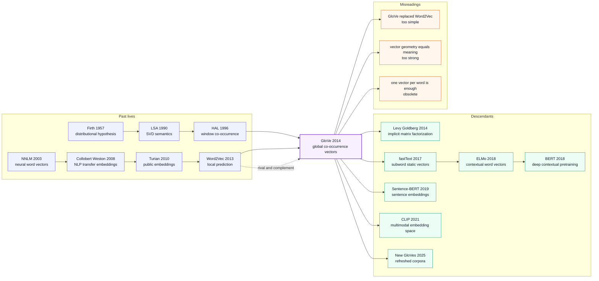

# GloVe - The Global Co-occurrence Bridge for Word Vectors

> **In October 2014 at EMNLP in Doha, Jeffrey Pennington, Richard Socher, and Christopher D. Manning of Stanford published [GloVe: Global Vectors for Word Representation](https://aclanthology.org/D14-1162/).** Word2Vec had already made local-window prediction the hottest recipe in NLP; GloVe supplied the missing global-statistics spine. It first counted the corpus-wide word-word co-occurrence matrix, then trained vectors so that $w_i^\top \tilde{w}_j + b_i + \tilde{b}_j \approx \log X_{ij}$. The hook was not a deeper network. It was a crisp distributional-semantics claim: the difference between `ice` and `steam` is not contained in a single co-occurrence probability, but in ratios against probe words such as `solid`, `gas`, `water`, and `fashion`. A twelve-page EMNLP paper became one of the most downloaded static-embedding artifacts of the next decade.

## TL;DR

Pennington, Socher, and Manning's 2014 EMNLP paper GloVe fused two static-embedding traditions into one objective: unlike [Word2Vec (2013)](2013_word2vec.md), it did not rely solely on local-window prediction; unlike LSA/SVD, it did not directly factorize a raw count matrix. It first built the global co-occurrence table $X_{ij}$, then minimized $J=\sum_{i,j} f(X_{ij})(w_i^\top \tilde{w}_j+b_i+\tilde{b}_j-\log X_{ij})^2$. That single weighted least-squares equation makes vector differences correspond to ratios of co-occurrence probabilities: `ice` differs from `steam` because its ratios against probes like `solid`, `gas`, `water`, and `fashion` are different, and those ratios become geometry rather than incidental downstream behavior.

The baselines it beat were not just individual systems, but two incomplete answers to lexical semantics. Count-based methods had global statistics but weak analogy performance; Word2Vec had industrial speed and strong transfer but a less explicit view of what matrix it was implicitly factorizing. GloVe released downloadable 50/100/200/300d vectors trained on 6B-token Wikipedia+Gigaword corpora and larger 42B/840B-token Common Crawl corpora, becoming a strong baseline on analogy, word similarity, and NER. Its lasting lesson is counter-intuitive: no deeper network was needed. A carefully weighted log-bilinear matrix-factorization objective was enough to turn distributional semantics into one of the most durable pieces of NLP infrastructure.

---

## Historical Context

### In 2014, NLP's front door was changing from feature engineering to vector files

GloVe arrived in a very narrow window. Word2Vec had just made `king - man + woman = queen` the most portable demo in NLP history; deep learning had not yet swallowed every text task; BERT was still four years away, and the Transformer three. Many systems did not begin with an end-to-end pretrained model. They began with a downloaded word-vector file: map each token into a 300-dimensional vector, then feed it into a CRF, CNN, RNN, parser, or NER system.

The awkward part was that everyone knew word vectors worked, but explanations split into two camps. The **count-based camp** came from LSA, HAL, PMI, and SVD, believing that global co-occurrence matrices contain semantic structure. The **predictive camp** came from NNLMs, RNNLMs, and Word2Vec, believing that local-context prediction produced higher-quality and faster embeddings. GloVe sits exactly between these camps. It does not simply say "Word2Vec is wrong"; it says "both sides are using the same co-occurrence signal, but writing it down differently."

That is the real meaning of Global Vectors in the title. Global is not a marketing adjective. It is a correction to the Word2Vec moment: local-window prediction is fast, but corpus-level co-occurrence ratios, frequency structure, and long-tail statistics should not be left entirely implicit inside stochastic gradients. GloVe first lays the statistics on the table, then compresses them into vector space, planting an old distributional-semantics stake beside the neural embedding boom of 2014.

### The immediate predecessors that pushed GloVe out

- **LSA / SVD (1990s)**: Factorized word-document or word-context matrices, proving that semantics can emerge from global statistics. But classical SVD handled high-frequency words, sparse matrices, and nonlinear ratio relations crudely, making it hard to compete with post-2013 neural embeddings.
- **HAL / PMI / distributional semantics**: Firth's "you shall know a word by the company it keeps" became context counting in computational form. GloVe inherits not a single algorithm, but the belief that word meaning is a context distribution rather than a dictionary entry.
- **Bengio NNLM (2003) and Collobert-Weston (2008)**: Neural networks started treating word vectors as trainable parameters, but full language models were slow, output layers were expensive, and downstream transfer was not yet a universal engineering asset.
- **Turian/Ratinov/Bengio (2010)**: Public word vectors started to serve as semi-supervised NLP features, showing that "download embeddings and transfer them downstream" was viable.
- **Word2Vec (2013)**: The work that made word vectors industrial. CBOW, Skip-gram, negative sampling, and subsampling improved training speed and analogy performance, while leaving GloVe a question: why does local prediction learn something that looks like global matrix geometry?
- **Levy & Goldberg (2014)**: The same-year analysis explaining Skip-gram with negative sampling as implicit factorization of a shifted PMI matrix. It acts as GloVe's sibling footnote: one moves from Word2Vec toward matrix-factorization theory; the other moves from matrix-factorization theory toward a neural embedding objective.

### What the Stanford team was doing

All three authors were inside the Stanford NLP orbit. Christopher D. Manning had long shaped statistical NLP, dependency parsing, semantic representation, and the CoreNLP toolchain. Richard Socher was pushing recursive neural networks, syntactic structure, and deep learning into NLP. Jeffrey Pennington brought a physics and mathematical modeling sensibility to word vectors. GloVe feels like that combination: respect for corpus statistics from traditional NLP, plus the deep-learning-era desire for trainable vector representations.

Crucially, GloVe is not a "deeper network" paper. Its training program is plain: scan the corpus, construct a word-word co-occurrence matrix, then run weighted least squares over non-zero entries. It reads more like Stanford NLP's theoretical cleanup of the 2013 Word2Vec wave. If word vectors were going to become infrastructure, they could not travel only through an analogy demo and a C program; they needed an explanation for why global co-occurrence ratios become vector differences.

### Industry, data, and open-source state

The spread of word vectors in 2014 depended on three things: large corpora, trainable single-machine code, and downloadable pretrained files. The GloVe project page soon released Wikipedia 2014 + Gigaword 5 vectors trained on 6B tokens in 50d, 100d, 200d, and 300d variants; later came 42B-token Common Crawl, 840B-token Common Crawl, and Twitter 27B-token vectors. These zip files had more historical leverage than any single experiment in the paper because they gave downstream systems a strong baseline without retraining embeddings.

At that time NLP did not yet default to loading a model with tens of billions of parameters for every task. An 822MB `glove.6B.zip` was enough to change the starting point of many experiments: NER, sentiment classification, text matching, retrieval, recommendation, and knowledge graphs could initialize from the same representation table. GloVe therefore lived two lives: one in an EMNLP paper, and another in countless GitHub repositories, Kaggle notebooks, and course assignments.

## Background and Motivation

### Why local prediction alone was not enough as an explanation

Word2Vec's success convinced the 2013-2014 NLP community that transferable lexical meaning could be learned from unannotated text. But it left a theoretical gap. Skip-gram predicts local window words; training sees mini-batches of `(center, context)` samples. Yet the linear structure visible in analogy tasks looks more like low-rank geometry in a global co-occurrence matrix. GloVe asks: **where do these linear directions actually come from?**

The paper enters through the `ice` and `steam` example. Looking only at the probability that `ice` co-occurs with `solid`, or that `steam` co-occurs with `gas`, is not very explanatory. But the ratio $P_{ik}/P_{jk}$ cancels non-discriminative probes such as `water` and highlights discriminative ones such as `solid` and `gas`. GloVe's objective is to make vector differences carry this ratio information, rather than letting each dot product fit an isolated black-box prediction probability.

### Why not simply return to classical SVD?

If global co-occurrence matrices matter so much, why not just use SVD? GloVe's answer is that classical SVD is not wrong, but poorly matched to the statistics of word vectors. Raw count matrices are dominated by frequent words; PMI can inflate extremely rare co-occurrences; truncation and smoothing choices often lack task motivation; and ordinary squared loss usually treats every matrix cell equally, failing to distinguish "rare but reliable" co-occurrence from "frequent but uninformative" co-occurrence.

GloVe's design motivation is therefore concrete: keep the global statistics of count-based methods, add the trainability and local-window intuition of neural embeddings, then use a weighting function to tame frequency effects. It is not a vague compromise between prediction and counting. It turns the dispute into an optimization target: which co-occurrence entries should be trusted, which should be downweighted, and how can probability ratios become vector differences?

---

## Method Deep Dive

### Overall framework

GloVe's pipeline can be split into two steps: **count first, then compress**. First, scan the corpus and construct a word-context co-occurrence matrix $X$, where $X_{ij}$ is the weighted number of times word $i$ and context word $j$ appear within a window. Second, train two embedding tables $W$ and $\tilde{W}$ only over non-zero co-occurrence entries, making dot product plus biases fit $\log X_{ij}$. After training, the usual exported vector for word $i$ is the sum or average of $w_i$ and $\tilde{w}_i$.

The interesting part is that this looks like matrix factorization but trains like neural embeddings. It has no softmax output layer and does not predict a center word, yet it still explains the linear analogies that made Word2Vec famous. GloVe's central question is not "how do we predict the next word?" but "how do we turn global co-occurrence ratios into vector differences?"

| Paradigm | Training signal | Explicit global matrix? | Speed bottleneck | 2014 representative |
|----------|-----------------|-------------------------|------------------|---------------------|
| LSA / SVD | word-document or word-context reconstruction | Yes | large matrix factorization | LSA, PMI-SVD |
| Word2Vec | local-window prediction | No, absorbed implicitly | negative sampling / output approximation | CBOW, Skip-gram |
| **GloVe** | weighted reconstruction of $\log X_{ij}$ | **Yes** | co-occurrence construction + SGD over non-zero entries | this paper |
| Contextual LM | context-token prediction | No, absorbed in a deep function | large-model pretraining | after ELMo/BERT |

### Key designs

#### Design 1: Start from ratios of co-occurrence probabilities, not isolated probabilities

**Function**: Define "meaning difference" as the relative co-occurrence pattern of two target words against probe words, rather than as an isolated probability between one target word and one context word.

The paper's opening example uses `ice` and `steam`: `ice` co-occurs more with `solid`, `steam` more with `gas`; `water` is related to both, and `fashion` to neither. A single probability $P_{ik}$ mixes in background frequency, but the ratio $P_{ik}/P_{jk}$ makes non-discriminative probes approach 1 and discriminative probes move far away from 1.

$$
\text{meaning}(i,j;k) \propto \frac{P_{ik}}{P_{jk}},\qquad P_{ik}=\frac{X_{ik}}{X_i}
$$

```python
def ratio_signal(cooc, word_i, word_j, probe_k):
    p_i = cooc[word_i, probe_k] / cooc[word_i].sum()
    p_j = cooc[word_j, probe_k] / cooc[word_j].sum()
    return p_i / max(p_j, 1e-12)
```

| probe word | $P(k\mid ice)$ vs $P(k\mid steam)$ | Ratio meaning | Effect on vector difference |
|------------|-------------------------------------|---------------|-----------------------------|
| `solid` | higher for `ice` | much greater than 1 | pushes `ice - steam` toward solid-state attributes |
| `gas` | higher for `steam` | much less than 1 | pushes `steam - ice` toward gaseous attributes |
| `water` | high for both | near 1 | cancels out; should not dominate the contrast |
| `fashion` | low for both | near 1 | noise term cancels out |

**Design rationale**: Traditional co-occurrence vectors often entangle "both words are related" with "these words are different in a specific direction." GloVe's insight is that the useful object is not the point alone, but the direction; that direction should explain probability ratios against probe words. Under this view, analogies such as `king - man + woman` are not just charming accidents. They are co-occurrence ratios linearized into vector geometry.

#### Design 2: Fit $\log X_{ij}$ with a log-bilinear model plus biases

**Function**: Convert non-zero entries of the co-occurrence matrix into a differentiable weighted least-squares problem, making word-vector dot products carry log co-occurrence strength.

GloVe's final objective is short: two embedding tables, two bias vectors, one weighting function, and one squared error. Here $w_i$ is the center-word vector, $\tilde{w}_j$ is the context-word vector, and $b_i$, $\tilde{b}_j$ absorb frequency bias.

$$
J = \sum_{i,j=1}^{V} f(X_{ij})\left(w_i^\top \tilde{w}_j + b_i + \tilde{b}_j - \log X_{ij}\right)^2
$$

```python
def glove_loss(center, context, bias_c, bias_o, entries, weight_fn):
    loss = 0.0
    for i, j, x_ij in entries:
        prediction = center[i] @ context[j] + bias_c[i] + bias_o[j]
        residual = prediction - math.log(x_ij)
        loss += weight_fn(x_ij) * residual * residual
    return loss / len(entries)
```

| Objective | Fitted quantity | Advantage | Cost |
|-----------|-----------------|-----------|------|
| Raw count reconstruction | $X_{ij}$ | preserves counts | high-frequency words dominate |
| PMI/SVD | $\log P_{ij}-\log P_iP_j$ | statistical interpretation | rare entries can explode |
| Skip-gram NEG | local prediction samples | fast training | global matrix relation is implicit |
| **GloVe** | biased $\log X_{ij}$ | separates frequency bias; simple objective | must build co-occurrence table first |

**Design rationale**: Why $\log X_{ij}$ rather than $X_{ij}$? Because logarithms turn probability ratios into differences, and vector spaces are good at representing differences. Why add biases? Because much of co-occurrence strength is just word frequency and should not be crammed into semantic dimensions. GloVe uses biases to separate "this word is common" from "this word has a semantic relation to that word," which is one reason it fits embedding use better than bare SVD.

#### Design 3: The weighting function $f(x)$ stops frequent words from dominating and rare noise from exploding

**Function**: Control how much each co-occurrence entry contributes to the objective, so accidental rare co-occurrences are not inflated and frequent function words do not consume training.

The paper chooses a piecewise function: below $x_{\max}$ it grows as a power law, and above the threshold it clips at 1. The default is $x_{\max}=100$ and $\alpha=3/4$. This is not cosmetic; it is core engineering for making GloVe train stably on large corpora.

$$
f(x)=\begin{cases}
(x/x_{\max})^\alpha, & x < x_{\max} \\
1, & \text{otherwise}
\end{cases}\quad \text{with } x_{\max}=100,\ \alpha=3/4
$$

```python
def glove_weight(x, x_max=100.0, alpha=0.75):
    if x < x_max:
        return (x / x_max) ** alpha
    return 1.0
```

| Co-occurrence type | Without weighting | GloVe weighting | Result |
|--------------------|-------------------|-----------------|--------|
| Extremely rare accident | inflated by log/PMI behavior | small weight | reduces noise |
| Mid-frequency reliable pair | contains semantic signal | weight rises smoothly | keeps the relation |
| High-frequency function word | dominates squared error | clipped at 1 | prevents training from being swallowed |
| Long-tail word | sparse evidence | not discarded entirely | keeps a learning path |

**Design rationale**: Word frequency is long-tailed, and raw counts differ by orders of magnitude. Without weighting, the model spends capacity on words such as `the/of/and`; with raw PMI, accidental rare co-occurrences receive exaggerated influence. GloVe's $f(x)$ is a compromise: trust frequency as evidence of reliability, but only up to a cap.

#### Design 4: Dual word tables and final vector merging

**Function**: Distinguish "word as center" from "word as context" during training, then merge the two roles into one general-purpose embedding at export time.

Because practical windows and weights make the co-occurrence matrix imperfectly symmetric, GloVe learns two vectors per word: $w_i$ and $\tilde{w}_i$. The objective is nearly symmetric in them, but optimization assigns different roles. The released vector usually sums the two, combining center-role and context-role information.

$$
v_i = w_i + \tilde{w}_i \quad \text{or}\quad v_i=\frac{1}{2}(w_i+\tilde{w}_i)
$$

```python
def export_vectors(center_vectors, context_vectors, mode="sum"):
    if mode == "average":
        return 0.5 * (center_vectors + context_vectors)
    return center_vectors + context_vectors
```

| Choice | Information source | Advantage | Risk |
|--------|--------------------|-----------|------|
| Use only $w_i$ | center-word role | simple | loses context-role information |
| Use only $\tilde{w}_i$ | context-word role | interpretable as context embedding | inconsistent with downstream convention |
| **sum/average** | merged roles | robust in practice; used by released vectors | role distinction is lost |
| concatenate | preserves both roles | maximum information | doubles dimension and downstream cost |

**Design rationale**: This looks mundane, but it explains why GloVe spread as a "one word, one vector file" artifact. Training preserves center/context asymmetry; export collapses it into a simple API. For downstream systems in 2014, that API friendliness mattered: read a `.txt`, one word plus 300 floats per line, and plug it into an older model.

### Loss / training recipe

| Item | GloVe setting | Notes |
|------|---------------|-------|
| Corpus scan | one or a few passes to build co-occurrence | pay statistics cost first, train only on non-zero entries later |
| Window | local context window with distance decay | nearer words contribute more |
| Training samples | non-zero $X_{ij}$ entries | not full $V^2$ matrix training |
| Objective | weighted least squares | optimized efficiently with AdaGrad/SGD |
| Weighting | $x_{\max}=100, \alpha=3/4$ | controls high- and low-frequency influence |
| Dimensions | 50/100/200/300d | multiple dimensions released officially |
| Corpora | 6B Wiki+Gigaword, 42B/840B Common Crawl, Twitter | pretrained packages drove adoption |
| Output | $w_i+\tilde{w}_i$ | downstream uses a single word-vector table |

Note 1: GloVe's "global" does not mean local windows are ignored. The co-occurrence matrix is accumulated from local windows; the difference is that the objective sees aggregated global statistics rather than one sampled prediction pair at a time.

Note 2: GloVe's influence comes from the combination of a paper objective and a released artifact. Algorithmically, it is an elegant weighted matrix factorization; inside the 2014 engineering ecosystem, it was a downloadable, reproducible, cross-task default initialization.

---

## Failed Baselines

### Opponents that GloVe reordered

GloVe's "failed baselines" are not visual crashes like in image-generation papers. They are representation-learning routes being reordered in 2014. The paper does not claim count-based methods are dead, and it does not claim Word2Vec fails. What it defeats is the false choice: either you have global matrix interpretation with weaker vectors, or you have predictive training with strong vectors but a murkier explanation.

| baseline | Strength at the time | Where it lost to GloVe | Lesson |
|----------|----------------------|------------------------|--------|
| LSA / truncated SVD | clear global matrix; interpretable | too sensitive to frequency extremes; weak analogy geometry | global statistics need better scaling and weighting |
| PMI / PPMI matrix | strong semantic association; intuitive theory | rare co-occurrences can be inflated without bound | log ratios need smoothing and clipping |
| Collobert-Weston / Turian embeddings | useful downstream features | smaller corpora/objectives; weaker linear analogies | word vectors need scale to become infrastructure |
| Word2Vec CBOW | fast and engineering-friendly | below GloVe in several analogy and similarity settings | local prediction is not the only answer |
| Word2Vec Skip-gram NEG | strong baseline; widely adopted | global co-occurrence relation is implicit and needs later analysis | prediction and matrix factorization are not opposites |

Word2Vec is the important case. GloVe does not simply "kill" it; it folds it into a shared explanation. Levy & Goldberg later show that Skip-gram with negative sampling approximately factorizes a shifted PMI matrix, while GloVe writes a matrix objective from the beginning. The two papers are rivals, but also complements.

### Failures and boundaries acknowledged by the authors

The paper does not frame GloVe as the endpoint of language understanding. It openly remains a **static word-vector** method: each word type has one vector, so `bank` is unchanged between "river bank" and "bank account"; word order, syntax, negation, coreference, and discourse relations are outside the objective.

Another boundary is the cost of the co-occurrence matrix. GloVe training itself can be efficient over non-zero entries, but matrix construction requires scanning the corpus, maintaining the vocabulary, collecting windows, and writing sparse entries. For single-machine NLP in 2014 this was practical; for today's web-scale streaming pretraining, "aggregate first, train second" is less natural than end-to-end token prediction.

The third boundary is evaluation. Analogy tasks travel well, but they cover only a narrow slice of lexical relations, and exact-match answers penalize reasonable neighbors. Word similarity and NER add external evidence, but they still do not prove that the model "understands language." GloVe's experiments prove it is a strong word-vector model, not that static vectors are the endpoint of language representation.

### The real anti-baseline lesson

GloVe's deepest anti-baseline lesson is this: **older methods often lose not because their intuition is wrong, but because the statistical object is not written as the right optimization problem**. LSA captured global statistics; Word2Vec captured trainable prediction; GloVe recombined the two and revived an older idea under new engineering conditions.

That gives later embedding research a durable warning: do not rush to treat the previous paradigm as junk. Often the previous paradigm contains a correct intuition about data structure, but lacks the right objective, scale, software, and distribution format. GloVe's stance toward LSA/PMI is exactly that: not a return to SVD, but a translation of matrix statistics into vectors that can be trained, released, downloaded, and reused in the deep-learning era.

## Key Experimental Data

### Word analogy and similarity

GloVe's core experiments revolve around three questions: whether vector differences solve analogies, whether cosine similarity matches human word-similarity judgments, and whether downstream NER benefits from the vectors. The most memorable experiment is analogy because it directly tests the method's motivation: probability ratios should become vector differences.

| Setting | Scale / dimension | Paper's conclusion | How to read it |
|---------|-------------------|--------------------|----------------|
| LSA/SVD-style methods | count matrix + low-rank factorization | clearly weaker than GloVe | raw global statistics need weighting and bias |
| CBOW | Word2Vec predictive baseline | fast, usually below Skip-gram/GloVe in accuracy | high engineering efficiency but slightly weaker representation |
| Skip-gram NEG | strong Word2Vec baseline | close to GloVe, but surpassed in several analogy/similarity settings | predictive training is a serious rival |
| **GloVe 6B 300d** | Wikipedia 2014 + Gigaword 5 | paper reports overall analogy accuracy around the 75% range | already a strong baseline on medium-scale corpora |
| **GloVe larger corpora** | Common Crawl 42B / 840B | larger corpora improve coverage and stability | the released artifact matters more than one table |

The key point is not any one number. It is that at comparable dimensions and corpus scales, GloVe consistently beats older count-based baselines and competes directly with strong Word2Vec models. That shows the paper is not just a nice explanation; it stands up on the standard tasks of its time.

### Downstream transfer and task behavior

Beyond analogy, GloVe reports word similarity and named entity recognition. NER matters because it pulls word vectors back from "geometry toy" into a practical NLP pipeline. If embeddings only solve analogies but do not help sequence labeling, they are unlikely to become infrastructure.

| Task | Input mode | Observation | Meaning |
|------|------------|-------------|---------|
| Word similarity | cosine similarity vs human scores | GloVe is strong across multiple datasets relative to classical matrix methods | vector space is useful beyond analogy |
| Analogy | nearest neighbor of $a-b+c$ | linear substructure appears reliably | method motivation is directly tested |
| NER | feature in downstream sequence labeling | measurable transfer benefit | word vectors enter practical NLP systems |
| Nearest neighbors | cosine / Euclidean distance | finds biological neighbors of `frog` | low-frequency semantics can be captured |

The experiment style is very much of its era. A 2026 embedding paper would run MTEB, BEIR, multilingual retrieval, RAG, and instruction-tuned evaluation. GloVe only needs to show one thing: **static word vectors are reliable downstream features**. In 2014, that was enough to change the default initialization of many systems.

### The released vectors are themselves key data

Many classic papers owe their impact to benchmark tables. Much of GloVe's impact comes from released files. The pretrained packages listed on the project page turned the method from a paper into an engineering resource.

| Pretrained package | Corpus scale | Vocabulary / dimension | Download size |
|--------------------|--------------|------------------------|---------------|
| Wikipedia 2014 + Gigaword 5 | 6B tokens | 400K vocab, 50/100/200/300d | 822 MB |
| Common Crawl | 42B tokens | 1.9M vocab, 300d | 1.75 GB |
| Common Crawl | 840B tokens | 2.2M vocab, 300d | 2.03 GB |
| Twitter | 27B tokens from 2B tweets | 1.2M vocab, 25/50/100/200d | 1.42 GB |

These numbers explain why GloVe kept appearing in courses, baselines, and older systems for years. It was not merely "a method you can train yourself." It was "a default resource you can download right now." For 2014-2018 NLP engineering, that difference was enormous.

---

## Idea Lineage



### Past lives (what forced GloVe out)

GloVe's ancestry is two lines merging. The first is **distributional semantics**: Firth's distributional hypothesis, LSA's matrix reduction, and HAL's window co-occurrence all say the same thing: word meaning is not an isolated symbol, but a context distribution. The second is **neural embeddings**: NNLMs, Collobert-Weston, Turian's public vectors, and Word2Vec turn word representations into trainable parameters and transferable assets.

The most direct pressure comes from Word2Vec. Word2Vec had already shown that local prediction could produce high-quality word vectors, but its success looked like engineering magic: negative sampling, subsampling, window size, and dimension choices all worked, yet the global co-occurrence matrix was not written explicitly. GloVe translated that magic back into a more traditional statistical language: local prediction is still ultimately processing co-occurrence structure.

### Descendants

1. **Levy & Goldberg (2014)**: Completed the bridge from the other direction by explaining Skip-gram NEG as approximate factorization of a shifted PMI matrix. It clarifies GloVe's lineage role: count-based and predictive models are not enemies, but two ways of writing the same statistical object.
2. **fastText (2017)**: Preserves the static-vector API but decomposes words into character n-grams, repairing GloVe/Word2Vec fragility on OOV words and morphology.
3. **ELMo / BERT (2018)**: Finally ends "one word, one vector." GloVe's lookup table is replaced by a contextual function, but the belief in "unlabeled text -> transferable representation" is fully inherited.
4. **Sentence-BERT / modern embedding models**: Expands embedding targets from words to sentences, paragraphs, queries, and documents. GloVe's file format disappears, but vectors as a retrieval interface remain.
5. **CLIP (2021)**: Pushes shared vector spaces into image-text alignment. It no longer factorizes word co-occurrence, but it still inherits the idea that semantic proximity can become geometric proximity.
6. **A New Pair of GloVes (2025)**: The GloVe team refreshes corpora and training reports years later, showing that static vectors still have a role as lightweight infrastructure.

### Misreadings / oversimplifications

The first misreading is "GloVe replaced Word2Vec." The real history is subtler: the two coexisted for years, and many downstream systems tried both Google News Word2Vec and GloVe 6B/840B. GloVe's intellectual value is not pushing Word2Vec offstage, but explaining the relation between predictive embeddings and matrix statistics.

The second misreading is "vector geometry equals semantic understanding." GloVe's analogies and nearest neighbors are beautiful, but it learns corpus co-occurrence structure, not a grounded world model. It knows `frog` is close to `toad`, but it has no visual, physical, action, or interaction experience.

The third misreading is "static word vectors are enough." In 2014 this was tempting because a 300d table could transfer to many tasks. After 2018, polysemy, context, long-distance dependencies, and sentence-level semantics proved that lookup tables were the first generation of pretrained representation, not the final answer.

---

## Modern Perspective

### Assumptions that no longer hold

1. **"One word, one vector" no longer holds**. GloVe assigns a fixed vector to each word type, so `apple` cannot switch between fruit and company, and `bank` cannot switch between riverbank and financial institution. After ELMo/BERT, word meaning is better understood as a function value of a token in context.
2. **"Window co-occurrence is enough for language" no longer holds**. Local windows capture topics, semantic neighbors, and some analogy relations, but they struggle with negation, coreference, compositionality, long-distance dependencies, and discourse. The Transformer victory shows that co-occurrence statistics are a strong start, not a full language model.
3. **"Analogy accuracy is enough to measure semantics" no longer holds**. $a-b+c$ is beautiful, but narrow, frequency-sensitive, and easy to overfit to dataset quirks. Modern embedding evaluation cares about retrieval, clustering, reranking, RAG, cross-domain transfer, and multilingual robustness.
4. **"Static vectors will remain NLP's default entry point" no longer holds**. From 2014 to 2018, downloading GloVe was routine; in 2026 most systems use Transformer embeddings, sentence embeddings, or instruction-tuned retrieval models directly.
5. **"Corpus bias is only a downstream problem" no longer holds**. GloVe inherits gender, race, occupation, and geographic distributions from its corpus, and those biases become vector directions. Debiasing work such as Bolukbasi mattered precisely because static vectors were everywhere.

### What survived and what was replaced

- **What survived**: the distributional hypothesis, unsupervised text pretraining, vector-space retrieval, co-occurrence / contrastive signal, downloadable representations, and the act of turning discrete symbols into continuous geometry. These became part of the grammar of the foundation-model era.
- **What was replaced**: word-level static tables, context blindness, analogy as the central metric, local-window-only evidence, English web-scale text as the default world, and pretrained files without enough data-governance detail.
- **What survived in transformed form**: weighted matrix factorization gave way to contrastive learning and masked language modeling; word-vector files gave way to embedding APIs; the co-occurrence-matrix intuition expanded to query-document, image-text, user-item, and other larger objects.

GloVe's historical position is therefore clear: it is not the endpoint of modern NLP representation learning, but one of the cleanest closures of the static-word-vector era. It explained why global statistics can become linear semantic directions, then handed the problem off to contextual models.

### Side effects the authors did not foresee

1. **GloVe became default course and baseline material**. Many students first encountered NLP embeddings not by training Word2Vec, but by downloading `glove.6B.300d.txt`. That made teaching easier and also made many experiments depend heavily on fixed English corpora.
2. **Static embeddings made bias measurable**. Gender-occupation directions, regional stereotypes, and name-ethnicity associations became measurable in vector space. GloVe was not a bias paper, but it became an important object of bias research.
3. **The "embedding file" shaped engineering interfaces**. Many systems imagined representation learning as a cacheable, downloadable, versioned matrix. Today's vector databases, ANN retrieval, and RAG embedding APIs still carry that engineering shadow.
4. **Reproduction became easier and fuzzier at the same time**. Downloading the same vectors lowers the barrier, but corpus cleaning, vocabulary, casing, tokenization, and version differences are often hidden behind the filename.

### If GloVe were rewritten today

If GloVe were rewritten in 2026, the core objective might remain, but several missing pieces would be explicit. First, it would report multilingual and morphologically rich languages rather than mostly English. Second, it would include bias, fairness, privacy, and copyright analysis of the corpora. Third, MTEB, BEIR, retrieval, clustering, and downstream robustness would complement or replace analogy as the central evaluation. Fourth, subword or phrase-aware mechanisms would reduce OOV failures. Fifth, anisotropy, frequency effects, vector normalization, and post-processing would appear as geometric diagnostics.

But it should not become BERT. GloVe's value is that it is small, transparent, trainable, and downloadable. A modern rewrite should make it more diagnosable, more multilingual, and more responsible, not bury a beautiful weighted least-squares model inside a large-model shell.

## Limitations and Future Directions

### Author-acknowledged limitations

- **Static meaning**: one word, one vector cannot express contextual senses.
- **Window co-occurrence dependence**: window size, distance weighting, and vocabulary truncation affect the result.
- **Corpus-scale sensitivity**: larger corpora often help, but they also introduce more cleaning, noise, and bias concerns.
- **Limited task coverage**: analogy, similarity, and NER cover only part of word-vector capability.
- **Matrix construction overhead**: aggregate co-occurrence first, train second is less flexible than end-to-end token prediction.

### Limitations from a 2026 view

- **Polysemy remains unsolved**: multiple senses per word are a structural blind spot.
- **OOV and morphology are brittle**: fastText later repaired this specific gap.
- **Semantics are not grounded**: there is no visual, action, knowledge-base, or interaction signal.
- **Bias directions transfer downstream**: the same linear geometry that serves analogies can amplify social stereotypes.
- **Evaluation is too narrow**: modern applications need retrieval, question answering, generation support, and cross-domain generalization.
- **English-centricity is obvious**: classic GloVe packages primarily serve the English ecosystem.

### Improvement directions already validated by follow-up work

- **fastText / subword embeddings**: character n-grams solve OOV and morphology issues.
- **ELMo / BERT / GPT family**: static tables become contextual functions.
- **Sentence-BERT / E5 / modern retrieval embeddings**: word-level representation expands to sentence, paragraph, and query-document matching.
- **CLIP / multimodal contrastive learning**: shared vector spaces move into image-text and multimodal alignment.
- **Bias measurement and debiasing**: embedding bias becomes a problem that must be quantified and governed.
- **2025 New GloVes**: lightweight static vectors can still be refreshed with newer corpora and low-cost settings.

## Related Work and Insights

- **vs Word2Vec**: Word2Vec absorbs co-occurrence implicitly through local prediction; GloVe writes a global matrix objective explicitly. Lesson: engineering-strong methods need theoretical translation, and theoretically clean methods need to ship as artifacts.
- **vs LSA/SVD**: LSA captured global statistics, but with crude objectives and weighting. GloVe is not a return to LSA; it rewrites LSA's statistical intuition as a trainable embedding objective.
- **vs PMI/PPMI**: PMI explains probability ratios clearly, but is easily polluted by low-frequency noise. GloVe turns that old problem into engineering through the weighting function.
- **vs fastText**: fastText keeps the static-vector interface but admits that "word" is not the best atomic unit; subword modeling is a natural repair to GloVe.
- **vs BERT**: BERT is not bigger GloVe; it upgrades representation from vocabulary entry to contextual function. The shared theme is self-supervised pretraining; the dividing line is static versus dynamic.
- **vs CLIP**: CLIP's image-text vector space philosophically inherits GloVe's geometric imagination, but the co-occurrence object changes from word-window to image-text pair.

## Resources

- [ACL Anthology: GloVe: Global Vectors for Word Representation](https://aclanthology.org/D14-1162/)
- [Official GloVe project page and pretrained vectors](https://nlp.stanford.edu/projects/glove/)
- [Official StanfordNLP GloVe code](https://github.com/stanfordnlp/GloVe)
- [Wikipedia 2014 + Gigaword 5 6B vectors](https://nlp.stanford.edu/data/glove.6B.zip)
- [Common Crawl 840B vectors](https://nlp.stanford.edu/data/glove.840B.300d.zip)
- [Levy & Goldberg 2014: Neural Word Embedding as Implicit Matrix Factorization](https://proceedings.neurips.cc/paper/2014/hash/feab05aa91085b7a8012516bc3533958-Abstract.html)
- [fastText subword embeddings](https://aclanthology.org/Q17-1010/)
- [BERT deep contextual pretraining](../era3_attention/2018_bert.md)


---

> 🌐 [中文版](/era2_deep_renaissance/2014_glove/) · 📚 awesome-papers project · CC-BY-NC