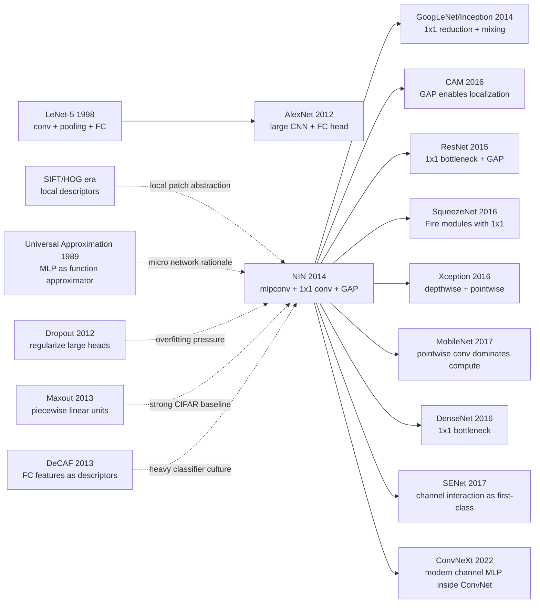

# Network In Network — Putting a Tiny MLP Inside Every Convolution

> **December 16, 2013. Min Lin, Qiang Chen, and Shuicheng Yan at the National University of Singapore upload [arXiv:1312.4400](https://arxiv.org/abs/1312.4400), later published at ICLR 2014.** The paper did not win by making a network much deeper, by adding a new dataset, or by inventing a grand optimization theory. It asked a smaller but sharper question: why is a convolutional filter only a linear template? NIN's answer was to put a tiny MLP inside every receptive field, use $1\times1$ convolutions for nonlinear channel mixing, and remove the heavy fully connected classifier with global average pooling. The idea then almost disappeared into infrastructure: GoogLeNet/Inception, ResNet bottlenecks, SqueezeNet, MobileNet, CAM, and modern CNN heads all carry pieces of NIN, even when nobody calls them Network In Network anymore.

## TL;DR

Lin, Chen, and Yan's 2014 ICLR paper **Network In Network** took the post-AlexNet default recipe — "linear convolutional filter + ReLU + large fully connected classifier" — and changed it in two small places that turned out to matter for a decade. Inside each receptive field, NIN replaces a single linear filter with a shared micro-MLP, which in modern notation looks like repeated pointwise channel mixing $f_{i,j}^{(l)}=\sigma(W_{1\times1}^{(l)} f_{i,j}^{(l-1)}+b^{(l)})$; at the classifier end, it replaces fully connected layers with global average pooling, $s_c=\frac{1}{HW}\sum_{i,j}F_{i,j,c}$, so each class owns a feature map and the network averages evidence spatially. The baseline it defeated was not one famous giant model but the 2013 CNN habit itself: Maxout+dropout reported roughly 11.68% / 9.38% CIFAR-10 error, while NIN reports about 10.41% / 8.81%, plus roughly 35.68% on CIFAR-100. Its larger impact is architectural infrastructure: GoogLeNet/Inception, [ResNet bottlenecks](2015_resnet.md), SqueezeNet, MobileNet pointwise convolution, CAM-style localization, and most modern CNN classifier heads all reuse NIN's two quiet ideas. The hidden lesson is that some architecture papers are remembered not as complete systems, but as small operators absorbed so completely that the field stops noticing where they came from.

---

## Historical Context

### After AlexNet, CNNs had won, but convolution itself was still simple

After AlexNet broke ImageNet in 2012, computer vision's central question quickly shifted from "should we use deep learning?" to "how do we make CNNs deeper, more accurate, and less prone to overfitting?" Yet the mainstream 2013 CNN template still looked like a scaled-up LeNet: scan a local window with linear filters, apply ReLU or maxout, downsample with pooling, then classify with two or three fully connected layers.

That template was mature engineering, but its representational form was blunt. A convolutional kernel is essentially a generalized linear model: one inner product over a local patch, followed by a pointwise nonlinearity. When a local pattern can be captured by a linear template, ordinary convolution is excellent; when a local structure requires nonlinear interactions among edges, textures, and color channels, a single filter must represent it indirectly by adding more channels or more layers. NIN starts from exactly that gap: **why should the function inside each receptive field be so shallow?**

The second gap was the classifier head. In AlexNet, a large share of parameters lived in the fully connected layers. ImageNet had enough data to make that tolerable; on CIFAR-10, CIFAR-100, and SVHN, the same head easily became a memorizer and needed dropout, max-norm, and augmentation to survive. NIN's problem statement was not "CNNs are not deep enough." It was "the interface from convolutional feature maps to the classifier is too heavy."

### The 2013 local-feature competition: maxout, dropout, and stronger local functions

NIN's nearest neighbor is not ResNet; it is the **Maxout Networks** plus **dropout** line. Goodfellow et al. in 2013 used maxout activations to take the maximum over several linear responses, producing a richer piecewise-linear unit; dropout kept large networks from overfitting small datasets. Together they were very strong on CIFAR/SVHN and represented much of the best small-image CNN engineering at the time.

But maxout mainly strengthens the activation function. It does not change the basic fact that a local patch is first scanned by linear filters. NIN's move is more radical: replace the patch mapper itself with a tiny MLP. In that light, mlpconv is not merely "a few $1\times1$ layers after a convolution." It asks whether a local visual concept should be abstracted by a shared miniature classifier.

There is also a hidden line back to local descriptors. In the SIFT, HOG, and bag-of-visual-words era, vision systems spent years designing maps from local patches to descriptors; CNNs made that map learnable through convolution. NIN pushes once more: the local descriptor need not be a linear filter response. It can be a nonlinear function family.

### The author team and the ICLR 2014 position

Min Lin, Qiang Chen, and Shuicheng Yan were at the National University of Singapore. The paper appeared on arXiv on December 16, 2013, was updated to v3 in March 2014, and was published at ICLR 2014. The timing matters: AlexNet had proven that CNNs worked; VGG and GoogLeNet were about to push depth and modularity on ImageNet; BatchNorm, ResNet, and DenseNet had not arrived yet.

NIN therefore sits at a transition point. It did not push $3\times3$ convolution to the limit like VGG, and it did not propose a complicated multi-branch module like GoogLeNet. It isolated two small components that later became common sense: **$1\times1$ convolution for channel mixing, and global average pooling for lightweight classification**. That is also why it is easy to underrate. The complete NIN network did not become today's standard block, but its two parts were detached and inserted into almost every later CNN family.

### Compute, data, and framework conditions

NIN's experiments focus on CIFAR-10, CIFAR-100, SVHN, and MNIST. Single-GPU hardware in 2013-2014 was enough to iterate quickly on these low-resolution datasets; ImageNet-scale experimentation was still expensive and usually belonged to large labs or companies.

At the framework level, Caffe was just rising, Theano was common, PyTorch did not exist, and TensorFlow had not been released. A $1\times1$ convolution was not hard to implement. The value was interpretive: NIN explained it as a cross-channel local MLP. At a moment when many researchers still treated $1\times1$ as a degenerate convolution, NIN gave it a new meaning: **not spatial filtering, but channel-function approximation at every pixel location**.

## Background and Motivation

### The problem with ordinary convolution: local linearity is narrow, classifier heads are heavy

NIN's motivation can be compressed into two sentences. First, an ordinary convolutional layer has limited local modeling capacity: $y_{i,j,k}=\sigma(w_k^\top x_{i,j}+b_k)$ is only a linear projection plus a nonlinearity, so complex local concepts need many filters to approximate them jointly. Second, traditional CNN fully connected heads are parameter-heavy, flatten spatial structure, and have weak interpretability, especially on small datasets.

Together these points form NIN's core judgment: rather than putting most capacity in the final fully connected classifier, move capacity forward into every receptive field so intermediate features are already more discriminative; rather than making a classifier relearn category combinations from flattened features, let the last convolutional layer produce class feature maps and read each class by spatial averaging.

### Why this is not a small trick

Today $1\times1$ convolution feels ordinary, which makes it easy to forget what it meant in 2014. It turns the channel dimension from "the index of a filter output" into a learnable representation space: each spatial location owns a vector, and the $1\times1$ layer applies a nonlinear transform to that vector. In other words, a CNN stops being only a stack of spatial template detectors; it becomes an alternation of spatial local functions and channel MLPs.

Global average pooling is likewise more than deleting a few parameters. It changes the relationship between feature maps and classification: the final $c$-th feature map corresponds to class $c$, and the class logit is the average response over the whole map. That design directly anticipates CAM-style localization in 2016 and explains why ResNet, DenseNet, and MobileNet later remove large FC heads. NIN's motivation is not to build a larger model, but to give CNNs an inductive bias closer to vision itself: local abstraction, spatial evidence, and parameter sharing.

---

## Method Deep Dive

### Overall framework

Network In Network can be understood as replacing every "linear convolutional layer" in a conventional CNN with an **mlpconv layer**. At a spatial location $(i,j)$, ordinary convolution looks at the local patch $x_{i,j}$ and computes $w_k^\top x_{i,j}+b_k$; NIN sends $x_{i,j}$ through a small MLP and outputs a set of feature maps after multiple nonlinear transformations. The micro-MLP weights are shared across spatial locations, so the layer remains convolution-like and translation equivariant, but each location now has a stronger local function.

A typical mlpconv layer can be written as follows: first apply a spatial convolution to obtain local responses, then stack several $1\times1$ convolutions: $f^{(1)}_{i,j}=\sigma(W^{(1)}x_{i,j}+b^{(1)})$, $f^{(2)}_{i,j}=\sigma(W^{(2)}_{1\times1}f^{(1)}_{i,j}+b^{(2)})$, $f^{(3)}_{i,j}=\sigma(W^{(3)}_{1\times1}f^{(2)}_{i,j}+b^{(3)})$. The latter two steps do not expand the spatial window; they transform the channel vector at the same $(i,j)$ location.

At the end, NIN does not flatten feature maps into fully connected layers. The final layer produces $C$ class feature maps, one per category. Global average pooling gives the class score: $s_c=\frac{1}{HW}\sum_{i=1}^{H}\sum_{j=1}^{W}F_{i,j,c}$, followed by softmax. The classifier changes from a parameter-heavy black-box MLP into "average evidence over each class map."

| Component | Conventional CNN (2013) | NIN replacement | Direct consequence |
|-----------|--------------------------|-----------------|--------------------|
| Local mapping | Linear filter + ReLU | Shared micro MLP / mlpconv | Stronger local patch expression |
| Channel mixing | Mostly indirect through next spatial conv | $1\times1$ convolution | Per-location channel-function approximation |
| Classifier head | flatten + fully connected | global average pooling | Fewer parameters, interpretable, less overfitting |
| Inductive bias | Capacity concentrated at the end | Capacity moved into local abstraction | More discriminative intermediate features |

### Key designs

#### Design 1: mlpconv layer — replacing the linear filter inside each receptive field with a tiny MLP

**Function**: Strengthen local patch abstraction so each spatial position is no longer represented by a single linear template response, but by a shared nonlinear function family.

The local function of ordinary convolution is $g_k(x)=\sigma(w_k^\top x+b_k)$. NIN generalizes it to $g(x)=\sigma(W_2\sigma(W_1x+b_1)+b_2)$; stacking more $1\times1$ layers gives a deeper micro-network. The key is that this MLP slides over space with shared parameters, so the computation remains convolutional.

```python
import torch
import torch.nn as nn

mlpconv = nn.Sequential(
    nn.Conv2d(3, 192, kernel_size=5, padding=2),
    nn.ReLU(inplace=True),
    nn.Conv2d(192, 160, kernel_size=1),
    nn.ReLU(inplace=True),
    nn.Conv2d(160, 96, kernel_size=1),
    nn.ReLU(inplace=True),
)
```

| Design | Local function form | Parameter sharing | Expressivity | Cost |
|--------|---------------------|-------------------|--------------|------|
| Ordinary convolution | $\sigma(w^\top x+b)$ | shared over space | Single linear boundary | Cheap |
| maxout | $\max_r(w_r^\top x+b_r)$ | shared over space | piecewise linear | Medium |
| **mlpconv (NIN)** | $\sigma(W_2\sigma(W_1x))$ | shared over space | Multi-layer nonlinear | Higher but controlled |
| Local fully connected MLP | different parameters per position | not shared | Very strong | Parameter explosion |

The design motivation is that visual local patterns are rarely single templates. A "wheel" may require circular boundaries, shading, and local texture to appear together; an "eye" may require upper/lower edges, pupil evidence, and skin-color context. mlpconv lets such local composition happen inside the patch instead of pushing all combinatorial burden to later deep layers.

#### Design 2: $1\times1$ convolution — turning the channel dimension into a learnable local representation space

**Function**: Recombine the channel vector at every pixel location without expanding the spatial receptive field.

The formula of $1\times1$ convolution is simple: $y_{i,j}=W x_{i,j}+b$. It looks like a degenerate convolution, but it is actually a shared linear layer applied at every spatial location; with ReLU, it becomes an MLP along the channel direction. NIN's historical role is to interpret this operation not as a tiny convolution, but as "cross-channel parametric pooling."

```python
class PointwiseMLP(nn.Module):
    def __init__(self, channels_in, hidden, channels_out):
        super().__init__()
        self.net = nn.Sequential(
            nn.Conv2d(channels_in, hidden, kernel_size=1),
            nn.ReLU(inplace=True),
            nn.Conv2d(hidden, channels_out, kernel_size=1),
        )

    def forward(self, features):
        return self.net(features)
```

| Usage | Spatial receptive field | Mixing dimension | Later representative | Why it matters |
|-------|-------------------------|------------------|----------------------|----------------|
| $3\times3$ convolution | expands | space + channel | VGG | Extracts local spatial patterns |
| **$1\times1$ convolution (NIN)** | unchanged | channel | Inception / ResNet | Cheaply recombines semantic channels |
| depthwise convolution | expands | per-channel only | MobileNet | Reduces spatial-convolution cost |
| pointwise after depthwise | unchanged | channel | MobileNet / Xception | Restores cross-channel interaction |

The design motivation is to separate "spatial modeling" from "channel modeling." Ordinary convolution does both at once: look at neighbors and mix channels. NIN makes the latter happen independently. That is why Inception uses it for dimension reduction, ResNet uses it for bottlenecks, and MobileNet makes it the main pointwise mixing operation. Many modern Transformer-Conv hybrids with channel MLPs continue the same idea.

#### Design 3: global average pooling — letting the final feature maps vote directly

**Function**: Replace a fully connected classifier with the spatial average of each class feature map, reducing parameters and overfitting while preserving spatial evidence.

The final NIN layer produces $C$ feature maps, where $C$ equals the number of classes. The $c$-th map $F_{:,:,c}$ is interpreted as evidence for class $c$, and its logit is $s_c=\text{mean}(F_{:,:,c})$. Compared with flatten + FC, this head has almost no extra parameters and forces each feature map to learn category-relevant local responses.

```python
class NINHead(nn.Module):
    def __init__(self, channels_in, num_classes):
        super().__init__()
        self.class_maps = nn.Conv2d(channels_in, num_classes, kernel_size=1)

    def forward(self, features):
        maps = self.class_maps(features)
        logits = maps.mean(dim=(2, 3))
        return logits, maps
```

| Classifier head | Parameter scale | Spatial information | Interpretability | Overfitting risk |
|-----------------|-----------------|---------------------|------------------|------------------|
| flatten + FC | high | weakened after flattening | weak | high |
| FC + dropout | high | weakened after flattening | weak | medium |
| spatial pyramid + classifier | medium | partly preserved | medium | medium |
| **global average pooling (NIN)** | very low | directly preserved as class maps | strong | low |

The design motivation is pragmatic: on small datasets, fully connected heads are often parameter sinks. Global average pooling turns the classifier into a statistical readout layer, forcing the convolutional body to produce classifiable spatial evidence by itself. That is why it later becomes standard in ResNet/DenseNet-style networks: once the backbone is strong enough, the classifier does not need to be a large MLP.

#### Design 4: moving capacity forward — replacing terminal memorization with local abstraction

**Function**: Change where CNN capacity lives: rely less on tail fully connected layers and more on intermediate local nonlinear abstraction.

If a CNN is viewed as "feature extractor + classifier," AlexNet-style networks kept a large amount of capacity in the classifier. NIN moves more computation into the convolutional body, especially inside each mlpconv block. This lets category-discriminative information enter spatial feature maps earlier instead of waiting until the flattened stage.

```python
class TinyNIN(nn.Module):
    def __init__(self, num_classes=10):
        super().__init__()
        self.features = nn.Sequential(
            mlpconv,
            nn.MaxPool2d(3, stride=2, padding=1),
            nn.Conv2d(96, 192, kernel_size=5, padding=2),
            nn.ReLU(inplace=True),
            nn.Conv2d(192, 192, kernel_size=1),
            nn.ReLU(inplace=True),
        )
        self.head = NINHead(192, num_classes)

    def forward(self, images):
        return self.head(self.features(images))[0]
```

| Where capacity lives | Representative structure | Advantage | Weakness | NIN's choice |
|----------------------|--------------------------|-----------|----------|--------------|
| Tail FC layers | AlexNet | Strong classifier | Many parameters, overfitting | mostly avoided |
| Activation function | Maxout | Expressive units | Still often needs big head | partly absorbed |
| **Local micro-network** | **NIN** | Earlier discriminative features | More complex layers | core choice |
| Multi-branch modules | Inception | Strong multi-scale modeling | More design complexity | later descendant |

The design motivation can be read as an inductive-bias redistribution. NIN assumes that visual classification evidence should live across spatial positions and channel combinations, not be concentrated in the final fully connected weights. CNN history largely confirmed that judgment: the more modern a CNN becomes, the lighter its classifier head and the heavier its backbone/channel mixing become.

---

## Failed Baselines

### Baseline 1: ordinary CNN linear convolutional filters

The first baseline NIN defeats is the most invisible one: the ordinary convolutional layer. After AlexNet, everyone implicitly accepted that "a convolutional kernel is a local linear filter," and complex patterns would be composed by adding more channels and deeper layers. The weakness of this baseline is not that it fails to work; it is that the local function is narrow. Each filter gives one linear boundary, and nonlinear combinations inside a local patch must be assembled slowly by later layers.

NIN's mlpconv performs multi-layer nonlinear abstraction directly inside the local window. It does not prove ordinary convolution useless; it proves that ordinary convolution spends representational budget inefficiently on small-image classification. If parameters are shared anyway, why not let every local position run a stronger function? That is NIN's core objection to traditional convolution.

### Baseline 2: AlexNet-style fully connected classifier heads

The second failed baseline is the large fully connected classifier. AlexNet's FC6/FC7 layers were crucial on ImageNet, but they also introduced a huge number of parameters. On CIFAR-10/100-sized data, such heads easily memorize the training set instead of forcing convolutional features themselves to become class-separable.

Global average pooling counters this cleanly: the final layer directly produces class feature maps, and their averages become logits. The classifier has almost no parameters, overfitting pressure is much lower, and spatial response survives until the end. NIN therefore rewrites "the classifier should be strong" as "the feature maps themselves should already be classifiable."

### Baseline 3: the maxout + dropout strong-regularization route

Maxout Networks were a strong small-image classification baseline in 2013. They increased unit expressivity through piecewise-linear activations and controlled overfitting with dropout. On CIFAR-10 and SVHN, this recipe was extremely competitive.

NIN's win over this line is not "stronger regularization." It is a better structural inductive bias. Maxout still mostly takes the maximum over a set of local linear responses; NIN replaces the local response function with a micro-MLP and removes the large classifier head with GAP. Put differently, Maxout makes unit shapes more flexible, while NIN makes both the local mapping and the classifier interface more reasonable.

### Baseline 4: hand-engineered local descriptors plus shallow classifiers

In 2013, vision systems had not fully left SIFT/HOG/Fisher Vector-style hand-designed local descriptors behind. Their advantage was explicit, stable local features; their weakness was that feature mapping and classification were separated and could not be tuned end to end.

NIN keeps the intuition that local descriptors matter, but puts descriptor learning inside the CNN. Every receptive field is abstracted by mlpconv, and all local functions are updated end to end through backpropagation. The defeated baseline is not one particular handcrafted descriptor; it is the paradigm that local features must be hand-designed.

| Baseline | Strength at the time | Failure point | NIN replacement |
|----------|----------------------|---------------|-----------------|
| Ordinary convolution | cheap, mature | local function is only a linear template | mlpconv local nonlinear abstraction |
| AlexNet-style FC head | strong classifier capacity | many parameters, easy overfitting | global average pooling |
| Maxout + dropout | expressive activations, good generalization | does not change local mapping structure | micro-MLP + light classifier head |
| Hand-engineered local descriptors | interpretable, stable | not end-to-end learnable | learnable local descriptors |

## Key Experimental Data

### CIFAR-10 / CIFAR-100: NIN's most persuasive stage

CIFAR is NIN's most important evidence because images are small, classes are numerous, and fully connected heads overfit easily. The paper reports about 10.41% test error on CIFAR-10 without augmentation and about 8.81% with translation/flipping augmentation; on CIFAR-100 it reports about 35.68%. These numbers no longer look spectacular, but in 2014 they meant that local micro-networks and GAP could beat strong baselines without larger data or a heavier classifier.

| Dataset | Typical strong baseline | Baseline number | NIN number | Reading |
|---------|-------------------------|-----------------|------------|---------|
| CIFAR-10 no augmentation | Maxout Network | about 11.68% | **about 10.41%** | local nonlinearity gives direct gain |
| CIFAR-10 augmentation | Maxout / DropConnect line | about 9.3%-9.4% | **about 8.81%** | NIN enters the SOTA range |
| CIFAR-100 | strongly regularized CNNs | about 38%-40% | **about 35.68%** | more classes make GAP's regularization clearer |
| SVHN | Maxout line | about 2.4%-2.5% | **about 2.35%** | close to strongest numbers, smaller margin |
| MNIST | dropout / maxout line | about 0.45%-0.50% | **about 0.47%** | saturated task, mainly shows no regression |

### Architecture and training details

NIN networks usually consist of three mlpconv blocks. Each block first applies a spatial convolution to observe a local neighborhood, then applies $1\times1$ layers for channel mixing. Training still uses SGD, dropout, augmentation, and weight decay, the standard recipe of the time. In other words, the paper does not attribute the win to a new optimizer or huge compute; it keeps the variable focused on structure.

| Item | Configuration |
|------|---------------|
| Core layer | mlpconv: spatial conv + multiple $1\times1$ conv/ReLU layers |
| Classifier head | class feature maps + global average pooling |
| Regularization | dropout / data augmentation / weight decay |
| Main datasets | CIFAR-10, CIFAR-100, SVHN, MNIST |
| Model scale | trainable on a single GPU for small images |
| Evaluation metric | classification test error |

### Key findings

First, **strengthening the local function is more effective than merely adding terminal parameters**. NIN's improvement comes from putting nonlinearity inside the receptive field, not from attaching a larger classifier. Second, **global average pooling is structural regularization**: it does not just replace dropout; it removes the parameter region most likely to overfit. Third, **$1\times1$ convolution receives a clear semantic role**: it is not a tiny convolution, but a learnable function along the channel dimension.

There is also an important negative finding: NIN does not solve the problem of systematically deepening networks. It makes each block stronger, but it does not provide an optimization mechanism like residual connections. The complete NIN architecture was soon surpassed by Inception, VGG, and ResNet; its local operator and classifier head survived as infrastructure inside later networks.

---

## Idea Lineage



### Before (what forced it out)

NIN has three ancestries. The first is the convolutional tradition from LeNet to AlexNet: local connectivity, weight sharing, pooling, and a fully connected classifier at the end. NIN keeps that backbone but challenges two defaults inside it: local filters must be linear, and classifier heads must be fully connected.

The second is the local-descriptor tradition. The SIFT/HOG era had already shown that recognition needs strong abstractions over local patches; CNNs simply learned those abstractions. NIN's mlpconv can be read as "turn the local descriptor generator into an end-to-end trained tiny MLP." That is why its difference from ordinary convolution is not kernel size, but the local function family.

The third is the 2012-2013 competition around regularization and activation functions. Dropout kept large networks from collapsing on small data, and maxout made units more nonlinear. NIN inherits that problem but changes the answer from "stronger activation + stronger regularization" to "a better local structure + a lighter classifier head."

### After (descendants)

The most direct descendant is GoogLeNet/Inception. Inception modules use $1\times1$ convolution heavily for dimension reduction and cross-channel mixing, making NIN's component truly popular on ImageNet. ResNet bottlenecks then turn $1\times1$-$3\times3$-$1\times1$ into a standard deep-network block; DenseNet, ResNeXt, and SqueezeNet all treat $1\times1$ as the main tool for controlling channels and parameters.

The second lineage is global average pooling. ResNet, DenseNet, and MobileNet almost all use GAP as the default classification head; CAM later shows that GAP is not merely parameter reduction, but a way to convert class feature maps directly into localization heatmaps. NIN's claim that the head is "easier to interpret" becomes a full line of weakly supervised localization and interpretability work.

The third lineage is mobile and efficient networks. MobileNet/Xception split spatial convolution and channel mixing: depthwise convolution handles space, pointwise $1\times1$ convolution handles channels. That is almost NIN's "channel MLP" idea repackaged under efficiency constraints.

### Misreadings / simplifications

The first misreading is "Network In Network equals $1\times1$ convolution." Incomplete. $1\times1$ is the implementation tool; the actual idea is upgrading the function inside each receptive field from a linear filter to a micro neural network. Remembering only $1\times1$ loses the motivation behind mlpconv.

The second misreading is "GAP merely reduces parameters." Also incomplete. GAP's deeper meaning is changing the shape of class evidence: a class is no longer determined by flattened fully connected weights, but by the average response over a spatial class map. That is the premise that makes CAM possible.

The third misreading is "NIN was superseded by Inception/ResNet." As a complete network, yes. As a set of ideas, almost the opposite. NIN's victory mode was decomposition, absorption, and invisibility. The highest fate of some papers is not to preserve their name, but to make later researchers stop feeling that their operations need explanation.

---

## Modern Perspective

### Assumptions that did not hold up

1. **"A stronger local function is enough to keep pushing deep CNNs forward"** — only half true. mlpconv improves within-block expression, but it does not solve optimization for very deep networks. BatchNorm and ResNet residual connections are what take networks from tens of layers to hundreds. NIN solves "how should one local layer represent?" not "how do many layers train?"
2. **"Fully connected heads should disappear completely"** — mostly true for classification CNNs, but not absolute in modern vision. ViT, MLP-Mixer, and ConvNeXt reintroduce token/channel MLPs in various forms; they are no longer AlexNet-style huge terminal classifiers, but distributed mixing layers inside the network. NIN argues against heavy terminal memorization, not against every MLP.
3. **"GAP naturally gives interpretability"** — too optimistic. CAM shows that GAP makes weak localization convenient, but average response is not causal explanation. Models can still depend on backgrounds, textures, and dataset bias; GAP makes one kind of evidence easier to visualize, but does not guarantee that the evidence is correct.
4. **"NIN is a complete architecture path"** — history rewrote this. The full NIN network was soon surpassed by Inception, VGG, and ResNet, but the mlpconv/$1\times1$/GAP components lived much longer. Its historical role is closer to an operator paper than a final architecture paper.

### What history proved essential vs redundant

- **Essential**: $1\times1$ convolution as channel mixing has become basic grammar in Inception, ResNet, DenseNet, MobileNet, and ConvNeXt.
- **Essential**: global average pooling as a lightweight classifier head has become the default ending of post-AlexNet CNNs.
- **Essential**: viewing the local receptive field as a learnable function, not just a linear template, extends into channel MLPs, pointwise convolution, and ConvNeXt blocks.
- **Redundant**: the exact channel counts, dropout placement, and small-CIFAR NIN configurations did not become standard.
- **Redundant**: explaining mlpconv as "an MLP inside every window" remains useful pedagogically, but engineers usually just say conv + $1\times1$ conv.

### Side effects the authors likely did not anticipate

NIN's biggest side effect was turning $1\times1$ convolution into a "free building block." Once researchers saw that it could cheaply change channel counts, mix channel semantics, and insert nonlinearity, the CNN design space expanded sharply. Inception reduction, ResNet bottlenecks, SqueezeNet compression, and MobileNet efficient pointwise compute all depend on this operation.

Another side effect was the interpretability line. NIN only said GAP is easier to interpret; CAM turned that sentence into a method. If the final layer consists of class feature maps, upsampling those maps gives a weak localization signal. This gave classification models a relatively simple "where did it look?" tool, even though it is far from a complete explanation.

The third side effect was an aesthetic shift toward light classifier heads. Today, if a CNN classifier still carries a huge fully connected tail, readers instinctively suspect parameter waste. A large part of that taste comes from the convention jointly formed by NIN, GoogLeNet, and ResNet.

### If NIN were rewritten today

If NIN were rewritten in 2026, the authors would probably frame it in the language of "spatial mixing vs channel mixing" rather than only "micro neural networks." The paper would place $1\times1$ convolution, depthwise separable convolution, MLP-Mixer channel MLPs, and ConvNeXt inverted bottlenecks in the same coordinate system, presenting NIN as an early form of channel mixing.

The experiments would also be more systematic: not only CIFAR/SVHN, but ImageNet, parameter/latency/FLOP comparisons, ablations over $1\times1$ depth, GAP vs FC, and overfitting curves under different data scales. The interpretability section would connect to CAM/Grad-CAM and test when GAP class maps are reliable and when they are merely background correlations.

But the core would not change: **learn a stronger channel function at every spatial position, then read class evidence by spatial averaging**. That is the part of NIN still alive today.

## Limitations and Future Directions

### Limitations acknowledged by the authors

The paper's main limitation is hidden in experiment scale. NIN is persuasive on CIFAR/SVHN/MNIST, but it does not show ImageNet-scale results; it proves the structural idea without proving that the complete architecture competes at large visual scale. The paper also does not systematically analyze training stability, parameter efficiency, or runtime; it mainly reports classification error.

The interpretability argument for GAP is also preliminary. The authors intuitively argue that each class map corresponds to one class and is therefore easier to interpret, but they do not provide localization evaluation or user studies. CAM later fills that gap.

### Limitations visible from 2026

NIN's largest limitation is the lack of a depth-scaling mechanism. mlpconv makes each block stronger, but when many blocks are stacked the model still faces gradient propagation, normalization, and optimization-path problems. ResNet changes the era more deeply because it changes not only the within-layer function but also the across-layer information flow.

Another limitation is that the compute allocation is not always cheap. In modern high-channel networks, $1\times1$ convolution can dominate FLOPs; after MobileNet, the field understood that pointwise convolution is smaller than spatial convolution but not free at high resolution and high channel counts. NIN opens the door to channel mixing, but also moves the compute bottleneck from spatial kernels into channel matrix multiplication.

### Directions later work validated

- **Inception**: uses $1\times1$ for reduction and multi-branch glue, moving NIN components into the ImageNet arena.
- **ResNet bottleneck**: uses $1\times1$ to compress/restore channels and residual connections to solve deep optimization.
- **MobileNet / Xception**: fully separate spatial and channel computation, showing that pointwise mixing is the main cost of efficient networks.
- **CAM / Grad-CAM**: develops GAP's interpretability intuition into localization tools.
- **ConvNeXt / modern CNNs**: reabsorbs NIN's channel-function idea through inverted bottlenecks and channel-MLP language.

## Related Work and Insights

### Comparative reading

- **vs AlexNet**: AlexNet proves CNNs can win ImageNet; NIN asks whether CNN local functions and classifier heads should be rewritten. The former is a victory of scale and training, the latter a victory of operator semantics.
- **vs Maxout**: Maxout strengthens one activation function, while NIN strengthens the whole local mapping. Both pursue piecewise/nonlinear expression, but at different levels.
- **vs GoogLeNet/Inception**: Inception takes NIN's $1\times1$ convolution into large-scale engineering and adds multi-branch, multi-scale design. Without NIN, Inception's reduction grammar would have had a weaker precedent.
- **vs ResNet**: ResNet inherits $1\times1$ bottlenecks and GAP, but its real addition is the residual path. NIN solves "how should a layer represent?"; ResNet solves "how should layers transmit information?"
- **vs MobileNet**: MobileNet puts NIN's pointwise channel mixing at the center of efficiency. It proves that $1\times1$ is not decoration, but the main compute source in mobile CNNs.

## Resources

### Links

- 📄 [arXiv 1312.4400](https://arxiv.org/abs/1312.4400)
- 📄 [PDF](https://arxiv.org/pdf/1312.4400)
- 🔗 [DBLP entry](https://dblp.uni-trier.de/rec/conf/iclr/LinCY13)
- 📚 Recommended follow-ups: [GoogLeNet / Inception](https://arxiv.org/abs/1409.4842), [CAM](https://arxiv.org/abs/1512.04150), [ResNet](https://arxiv.org/abs/1512.03385), [SqueezeNet](https://arxiv.org/abs/1602.07360), [MobileNet](https://arxiv.org/abs/1704.04861)
- 🌐 Cross-language: Chinese version → [`/era2_deep_renaissance/2014_network_in_network/`](/era2_deep_renaissance/2014_network_in_network/)


---

> 🌐 [中文版](/era2_deep_renaissance/2014_network_in_network/) · 📚 awesome-papers project · CC-BY-NC