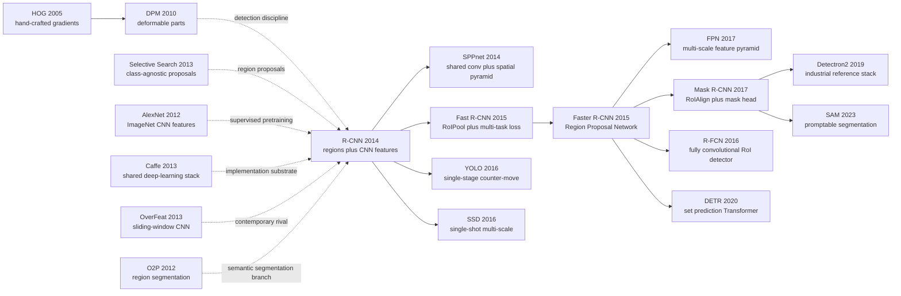

# R-CNN — The ImageNet Feature Hierarchy That Rebooted Detection

> **On November 11, 2013, Ross Girshick, Jeff Donahue, Trevor Darrell, and Jitendra Malik at UC Berkeley uploaded [arXiv:1311.2524](https://arxiv.org/abs/1311.2524); the paper appeared at CVPR 2014.** It did not invent a new CNN and it was not end-to-end. Its move was almost blunt: take roughly 2,000 selective-search boxes, warp each one into an ImageNet-pretrained AlexNet, classify the resulting features with linear SVMs, then repair the box with regression. That ungainly pipeline reached 53.3 mAP on PASCAL VOC 2012 and lifted VOC 2010 from UVA's 35.1 to 53.7. R-CNN was slow enough to cost about 13 seconds per image, yet historically fast enough to make the detection community abandon the HOG/DPM continent within a year.

## TL;DR

Girshick, Donahue, Darrell, and Malik's CVPR 2014 R-CNN paper moved object detection from "hand-built HOG/DPM parts plus context rescoring" to "region proposal + ImageNet CNN feature + linear SVM + bounding-box regression." For each image it first generates about $R \approx 2000$ selective-search proposals, warps every region to $227 \times 227$, extracts an AlexNet feature $\phi(r) \in \mathbb{R}^{4096}$, and scores each class with $s_c(r)=w_c^\top\phi(r)+b_c$. The system looks painfully staged, but the numbers ended the debate: VOC 2010 jumps from UVA's 35.1 mAP to 53.7, VOC 2012 reaches 53.3 mAP, and ILSVRC2013 detection reaches 31.4 versus OverFeat's 24.3. What R-CNN replaced was not a single baseline but an entire regime represented by DPM, Regionlets, and O2P: detection as low-level feature assembly. Its descendants then paid off its engineering debt one piece at a time: Fast R-CNN (2015) removes repeated CNN forward passes, [Faster R-CNN (2015)](2015_faster_rcnn.md) removes selective search, and [Mask R-CNN (2017)](../era3_attention/2017_mask_rcnn.md) extends the RoI framework to instance masks. The counter-intuitive lesson is that R-CNN's historical importance is precisely that it was not end-to-end: it proved that pretrained representation + small-data fine-tuning + modular detection heads could break the plateau first, while leaving the system debt for the next generation to repay.

---

## Historical Context

### What object detection was stuck on in 2013

R-CNN's shock only makes sense in the PASCAL VOC climate of 2013. Image classification had already been rewritten by AlexNet: on ImageNet, top-5 error had fallen into a new regime. Object detection, however, still lived under a different worldview: **describe local evidence with hand-crafted features, then assemble boxes through deformable parts or context-heavy pipelines**. DPM was still a strong baseline; Regionlets, UVA, and SegDPM stacked engineering components on the leaderboard, but none produced an AlexNet-scale break.

Detection is not just "classify the whole image." The model has to answer three coupled questions: whether an object exists, where it is, and which class the box belongs to. CNNs in 2013 were best at fixed-size image classification; sweeping them densely over an image was expensive, and scale/aspect-ratio handling was awkward. OverFeat chose the sliding-window route, showing that the community already knew CNNs could do detection, but it was still constrained by dense scanning cost and coarse localization.

R-CNN's key move was not the generic fact that "CNNs recognize objects." It decomposed detection into two mature modules: **category-independent proposals find plausible object locations; ImageNet CNN features decide whether each location resembles a class**. That let the CNN avoid enumerating every position in the image, and it let scarce detection labels be buffered by ImageNet pretraining.

### The immediate predecessors that pushed R-CNN out

| Predecessor | What it solved then | What it left open | How R-CNN inherited it |
|-------------|---------------------|-------------------|------------------------|
| DPM / HOG | Interpretable part detection and a strong PASCAL baseline | Representation capped by hand-crafted features | Keep per-class classifiers and NMS discipline, replace the feature |
| Selective Search | About 2,000 class-agnostic boxes with high recall | Gives boxes but no semantics | Use it as the proposal generator before the CNN |
| AlexNet | Supervised ImageNet pretraining proves CNN representations are strong | Solves whole-image classification only | Turn fc6/fc7 into region features |
| OverFeat | Shows CNNs can be used for sliding-window detection | Still constrained by dense scan and localization error | Replace sliding windows with proposals |
| O2P / CPMC | Region-based segmentation pipeline is mature | Depends on SIFT/LBP second-order pooling | Replace hand-crafted pooling with CNN region features |

These predecessors put the problem into a very precise place: the field already had proposals, classification CNNs, PASCAL/ILSVRC benchmarks, and Caffe-style software. What it lacked was a system that welded them together and proved with numbers that "deep features transfer to detection" was worth reorganizing the field around. R-CNN landed exactly at that intersection.

### What the author team was doing

All four authors were at UC Berkeley. Ross Girshick was already one of the central authors of the DPM line, deeply familiar with PASCAL VOC evaluation, error analysis, and the fragile pieces of detection pipelines. Jeff Donahue and Trevor Darrell brought direct experience in deep representations, the Caffe ecosystem, and transfer learning. Jitendra Malik's Berkeley vision group had long pushed region proposals, segmentation, and "recognition using regions."

That author mix matters. R-CNN was neither a deep-learning team barging into detection nor a traditional vision team merely adding a CNN feature. It was the merger of two lines: Berkeley's region/segmentation tradition + ImageNet supervised pretraining + Caffe engineering. The writing reflects that temperament: the method is not mysterious, but the experiments are unusually careful. The paper does not rush to claim end-to-end learning; it dissects each module, asking whether fc6 or fc7 is better, how much fine-tuning buys, how much bounding-box regression repairs localization, and whether VOC, ILSVRC, and segmentation all hold up.

### State of the industry, compute, and data

The 2013-2014 window was delicate. GPUs were sufficient to train and run AlexNet-level CNNs, but nowhere near enough to evaluate thousands of boxes per image in real time. R-CNN uses roughly 2,000 proposals per image; proposals plus CNN features cost about 13 seconds per image on a GPU and 53 seconds on a CPU. It was clearly not an industrial real-time system, but it was good enough to convince the research community that the path could be compressed.

The data situation also sat at a transition point: PASCAL VOC detection annotations were small but precise, while ILSVRC classification data was large but image-level only. R-CNN's supervised pretraining plus domain-specific fine-tuning was built for this mismatch: learn general visual hierarchies from large-scale classification, then adapt them on a small set of detection boxes. That recipe later became the default training pattern across computer vision.

## Background and Motivation

### The real contradiction behind the detection plateau

R-CNN was not addressing a single bug. It faced a set of coupled constraints:

- **Weak representation**: HOG, SIFT, LBP, and sketch tokens capture edges and texture, but struggle with higher-level compositions like "dog face" or "bicycle wheel."
- **Too little detection data**: PASCAL VOC has only a few thousand training images, so training a CNN from scratch would overfit.
- **Too many locations**: detection searches over position, scale, and aspect ratio; direct sliding-window CNN inference explodes in cost.
- **Strict evaluation**: PASCAL AP uses an IoU 0.5 threshold; a correct class with a slightly bad box still fails.
- **Over-complex systems**: SegDPM and Regionlets accumulate gains through multiple features, context terms, and rescoring stages, making reproduction and extension painful.

The core contradiction is compact: **classification CNN representations were ready, but detection lacked a cheap way to move them onto many candidate boxes**.

### R-CNN's angle of attack

R-CNN's answer is deliberately modular: use selective search to shrink the location search space; treat each proposal as a small classification problem; use ImageNet pretraining to avoid training from scratch on tiny detection data; fine-tune on detection to adapt to warped proposal windows; keep linear SVMs simple; then let bounding-box regression specialize in localization repair.

The design goal was not elegance. It was to strip the question "can deep representation solve detection?" away from surrounding engineering noise. The hidden philosophy is: **attach the strongest representation to the existing pipeline first; once the numbers prove the direction, let the next generation remove the slow modules one by one**. Fast R-CNN, Faster R-CNN, and Mask R-CNN later repay almost exactly that debt list.

---

## Method Deep Dive

### Overall framework

R-CNN's pipeline looks heavy today, but every step had a specific 2014 purpose: use selective search to shrink an unbounded location space to about 2,000 proposals; warp each proposal into the $227 \times 227$ input expected by AlexNet; extract fc features from an ImageNet-pretrained CNN; train one linear SVM per class; finally use class-specific bounding-box regression to repair localization.

| Module | Input | Output | Main role |
|--------|-------|--------|-----------|
| Selective Search | original image | about 2,000 boxes | reduce dense sliding-window search to a proposal set |
| Warp / Crop | proposed region | $227 \times 227$ image patch | adapt arbitrary aspect-ratio proposals to AlexNet input |
| CNN feature | image patch | $4096$-dim fc6/fc7 vector | replace HOG/SIFT/LBP with ImageNet hierarchies |
| Linear SVM | region feature | per-class score | stable small-data training with hard-negative mining |
| BBox regression + NMS | high-score boxes | repaired final boxes | fix localization error and remove duplicates |

Two counter-intuitive points matter. First, R-CNN does not train the detection pipeline end-to-end: proposals, CNN, SVMs, and box regressors are trained separately. Second, it is still "simpler" than many DPM-era systems: complexity no longer comes from hand-crafted feature assembly, but from one reusable deep representation. In other words, R-CNN moves detection's bottleneck from "design the feature" to "share the feature efficiently."

### Key designs

#### Design 1: Region proposal as search-space compression — stop making CNNs scan the whole image

**Function**: use class-agnostic proposals to compress detection's spatial search into a finite set $\mathcal{R}(I)$, then classify each region with a CNN.

$$
\mathcal{R}(I)=\{r_1,\ldots,r_R\},\quad R\approx 2000,\quad x_i=\operatorname{warp}(I[r_i],227,227),\quad \phi_i=f_{\text{CNN}}(x_i)
$$

This formula is only an engineering pipeline on the surface. It solves the main obstacle for CNN detection at the time: sliding windows require forward passes over many scales, aspect ratios, and positions; selective search asks the CNN to process only about 2,000 boxes that may contain objects. Proposal recall is handled by classical vision; semantic judgment is handled by the CNN.

```python
def extract_rcnn_regions(image, proposal_fn, cnn):
    regions = proposal_fn(image)[:2000]
    features = []
    for box in regions:
        crop = warp_to_fixed_size(image, box, size=(227, 227))
        feat = cnn.forward(crop, layer="fc7")
        features.append((box, feat))
    return features
```

| Search strategy | Forward passes | Aspect-ratio handling | 2014 feasibility | R-CNN choice |
|-----------------|----------------|-----------------------|------------------|--------------|
| Dense sliding window | extremely high | enumerate scales and ratios | slow; OverFeat still constrained | rejected |
| DPM root + parts | medium | implicit part templates | mature but weak representation | replaced |
| Selective Search proposals | about 2,000 | proposals carry arbitrary boxes | slow but runnable | adopted |
| Later RPN | generated on shared conv features | learned anchors | mature after 2015 | repaid by Faster R-CNN |

**Design motivation**: R-CNN was not arguing that proposals should exist forever. It used proposals as scaffolding to prove that CNN features had decisive value for detection. Faster R-CNN later learns the proposal stage inside the network, which confirms that the scaffold was a necessary first-generation compromise.

#### Design 2: Supervised pre-training + domain-specific fine-tuning — the small-detection-data solution

**Function**: train the CNN first on ILSVRC2012 classification, replace the 1000-way classification layer with an $(N+1)$-way detection layer, and fine-tune on warped proposals from VOC/ILSVRC detection.

$$
\theta_0=\arg\min_\theta \mathcal{L}_{\text{cls}}(\theta;\mathcal{D}_{\text{ImageNet}}),\qquad
\theta^*=\arg\min_\theta \mathcal{L}_{\text{det}}(\theta;\{(\operatorname{warp}(r),y_r)\})
$$

The fine-tuning sample definition is crucial: proposals with IoU $\ge 0.5$ against a ground-truth box become positives, the rest are background; each mini-batch samples 32 positive windows and 96 background windows, total batch size 128. The learning rate starts at 0.001, one tenth of the pretraining rate, so the ImageNet initialization is adapted rather than washed away.

```python
def fine_tune_detector(cnn, proposals, gt_boxes, num_classes):
    cnn.replace_classifier(out_dim=num_classes + 1)  # foreground classes + background
    for step in range(num_steps):
        positives = sample_iou_at_least(proposals, gt_boxes, threshold=0.5, n=32)
        negatives = sample_background(proposals, gt_boxes, n=96)
        batch = positives + negatives
        loss = cross_entropy(cnn(warp(batch.boxes)), batch.labels)
        loss.backward()
        sgd_step(cnn, lr=1e-3)
```

| Training setup | VOC 2007 mAP | Meaning |
|----------------|--------------|---------|
| ImageNet CNN fc7, no fine-tuning | 44.7 | already above many hand-crafted baselines |
| ImageNet CNN fc6, no fine-tuning | 46.2 | fc6 generalizes better than fc7 |
| Fine-tuned fc7 | 54.2 | fine-tuning adds +8.0 points |
| Fine-tuned + bbox regression | 58.5 | localization repair adds another +4.3 points |

**Design motivation**: This is R-CNN's core contribution to visual transfer learning. It proved that ImageNet image-level labels are not just a classification asset; they can become region-level representations for detection. Detection, segmentation, and pose estimation later normalized exactly this recipe: large-data pretraining followed by small-task fine-tuning.

#### Design 3: Linear SVM + hard negative mining — conservative but effective detection heads

**Function**: after CNN fine-tuning, do not use the softmax output as the final detector. Instead, freeze CNN features, train a one-vs-rest linear SVM for each class, and use hard-negative mining to manage the huge background proposal pool.

$$
s_c(r)=w_c^\top \phi(r)+b_c,\qquad
\min_{w_c,b_c}\;\frac{1}{2}\lVert w_c\rVert_2^2+C\sum_i\max(0,1-y_i s_c(r_i))
$$

SVM training uses a different positive/negative definition from fine-tuning: positives are ground-truth boxes only; proposals with IoU below 0.3 are negatives; the gray zone between 0.3 and ground truth is ignored. The paper explicitly notes that this threshold is sensitive: setting it to 0.5 drops mAP by 5 points, while setting it to 0 drops 4 points.

```python
def train_class_svm(features, gt_boxes, class_id):
    positives = [feat for box, feat in features if is_ground_truth(box, class_id)]
    negatives = [feat for box, feat in features if max_iou(box, gt_boxes[class_id]) < 0.3]
    svm = LinearSVM()
    for hard_batch in mine_hard_negatives(svm, negatives):
        svm.fit(positives, hard_batch)
    return svm
```

| Choice | Benefit | Cost | Later fate |
|--------|---------|------|------------|
| Direct CNN softmax | cleaner end-to-end story | less stable mAP at the time | returns in Fast R-CNN |
| Linear SVM | stable on small data, mature hard negatives | staged training and storage | replaced by multi-task softmax |
| 0.3 negative threshold | avoids treating partial overlaps as negatives | tuned by validation | absorbed into RoI sampling rules |
| Per-class classifier | easy extension to many classes | no shared detection head | replaced by shared heads |

**Design motivation**: R-CNN is a transition-era paper, so it does not burn down every older tool at once. SVMs and hard-negative mining were reliable DPM-era mechanisms; when CNN features first entered detection, the conservative classifier made the evidence more credible.

#### Design 4: Bounding-box regression and staged debt — win first, repay engineering debt later

**Function**: for each high-scoring proposal, learn a class-specific regressor that transforms the proposal $P=(P_x,P_y,P_w,P_h)$ toward a ground-truth box $G=(G_x,G_y,G_w,G_h)$.

$$
t_x=(G_x-P_x)/P_w,\quad t_y=(G_y-P_y)/P_h,\quad t_w=\log(G_w/P_w),\quad t_h=\log(G_h/P_h)
$$

R-CNN's bounding-box regression admits a practical truth: selective search has high recall, but its boxes are not tight enough. CNN/SVM scoring can say "this proposal looks like a dog," but it does not necessarily align the box to the dog's boundary. The regressor specializes in this geometric repair and adds another visible jump on VOC 2007.

```python
def apply_bbox_regression(box, deltas):
    px, py, pw, ph = center_width_height(box)
    tx, ty, tw, th = deltas
    gx = tx * pw + px
    gy = ty * ph + py
    gw = math.exp(tw) * pw
    gh = math.exp(th) * ph
    return corners_from_center(gx, gy, gw, gh)
```

| Engineering debt | Original R-CNN choice | Problem caused | Later repayment |
|------------------|-----------------------|----------------|-----------------|
| repeated CNN forwards | run CNN independently per proposal | 13s/image and feature storage | SPPnet / Fast R-CNN |
| external proposals | selective search | slow and not learned | Faster R-CNN RPN |
| external SVMs | train after CNN features | split pipeline | Fast R-CNN multi-task loss |
| fixed warping | stretch every box to 227 | geometric distortion | RoIPool / RoIAlign |
| manual NMS | per-class greedy NMS | not end-to-end | DETR set prediction |

**Design motivation**: The method section's deepest lesson is engineering priority. R-CNN does not try to solve every problem at once. It first locks onto the variable that changes results most: feature representation. Once mAP jumps by a large margin, the slow, staged, non-end-to-end pieces naturally become targets for follow-up papers. R-CNN is therefore not an ultimate system; it is a strong prototype that corrects the field's direction.

---

## Failed Baselines

### The contemporaries that lost to R-CNN

R-CNN did not defeat just one baseline. It pushed down several dominant 2010-2013 detection lines at once: HOG/DPM part models, Bag-of-Visual-Words region classifiers, Regionlets hand-crafted region representations, SegDPM context fusion, and OverFeat sliding-window CNNs. Each was reasonable in isolation, but all shared the same missing piece: **none had moved ImageNet-supervised high-level representation into detection effectively**.

| Baseline | Represented route | Key number | Why it lost |
|----------|-------------------|------------|-------------|
| DPM v5 | HOG + deformable parts | VOC 2010 mAP 33.4 | representation capped by HOG |
| UVA Selective Search | proposals + spatial pyramid BOW | VOC 2010 mAP 35.1 | good proposals, but 360k-d hand-crafted feature is weak |
| Regionlets | hand-crafted region feature composition | VOC 2010 mAP 39.7 | rich local features, weak semantic hierarchy |
| SegDPM | DPM + segmentation/context rescoring | VOC 2010 mAP 40.4 | complex system, gains from patch-like fusion |
| OverFeat | sliding-window CNN detector | ILSVRC2013 mAP 24.3 | uses CNNs, but search/localization lag proposal+SVM |

The UVA comparison is the cleanest: it uses selective search just like R-CNN, so the gap is not mainly proposals. UVA's spatial-pyramid BOW feature is 360k-dimensional; R-CNN's fc feature is only 4096-dimensional and is still more accurate and easier to scale across classes. That is the moment representation learning takes over detection.

### Failed experiments the paper itself exposes

R-CNN's win is not a clean win. The paper itself exposes several obvious problems, and almost the entire later R-CNN family evolves around them.

| Problem | Symptom in the paper | Consequence | Later fix |
|---------|----------------------|-------------|-----------|
| slow speed | proposals + CNN features cost about 13s/image on GPU | no real-time use | SPPnet / Fast R-CNN shared conv |
| staged training | CNN fine-tune, SVM, bbox regressor are separate | cumbersome reproduction, no joint optimization | Fast R-CNN multi-task loss |
| external selective search | about 2,000 proposals before detection | slow and not learned | Faster R-CNN RPN |
| warp distortion | every proposal stretched to 227×227 | aspect-ratio and boundary distortion | RoIPool / RoIAlign |

A subtler failure appears in semantic segmentation. R-CNN reaches 47.9 mean accuracy, but it does not really perform dense prediction; it uses CPMC regions as candidates and lets CNN features help an O2P-style classifier. The result is important, but it also shows that R-CNN's region representation had not yet become FCN/Mask R-CNN-style end-to-end dense output.

### The real anti-baseline lesson

R-CNN's true anti-baseline is not OverFeat; it is DPM. Ross Girshick came from the DPM system himself, which makes R-CNN feel like an internal regime change: the old system understood detection evaluation and error types best, and the new system admitted that the old representation was no longer enough.

The lesson is: **paradigm replacement often does not mean every old module was wrong; it means one central bottleneck suddenly has an overwhelming substitute**. R-CNN inherits plenty from DPM: NMS, hard-negative mining, per-class scoring, and error analysis. What it replaces is the HOG/part feature heart. It is therefore not a rejection of traditional vision, but a successful grafting of traditional detection discipline onto deep representation.

## Key Experimental Data

### Main VOC / ILSVRC results

| Benchmark | Method | mAP / mean accuracy | Comparator | Conclusion |
|-----------|--------|---------------------|------------|------------|
| VOC 2010 test | R-CNN + BB | 53.7 | UVA 35.1 / SegDPM 40.4 | breaks the PASCAL detection plateau |
| VOC 2011/12 test | R-CNN | 53.3 | previous best ≈ 40.x | more than 30% relative gain |
| VOC 2007 test | R-CNN FT fc7 | 54.2 | DPM v5 33.7 | deep features give +61% relative over HOG |
| VOC 2007 test | R-CNN FT fc7 + BB | 58.5 | 54.2 without BB | box regression has clear value |
| ILSVRC2013 detection | R-CNN | 31.4 | OverFeat 24.3 | holds on 200-class detection too |

The strongest part of these numbers is their consistency across datasets. VOC is not a fluke; ILSVRC is not a fluke; detection and semantic segmentation both benefit from region-level CNN features. R-CNN's experiment section is not a single SOTA point, but a stress test of representation transfer.

### Ablation: pretraining, fine-tuning, bbox regression

| Configuration | VOC 2007 mAP | Change | Interpretation |
|---------------|--------------|--------|----------------|
| R-CNN fc7, no fine-tuning | 44.7 | baseline | ImageNet features are already strong |
| R-CNN fc6, no fine-tuning | 46.2 | +1.5 | fc6 transfers better than fc7 |
| R-CNN FT fc7 | 54.2 | +8.0 vs no FT | detection fine-tuning is the core gain |
| R-CNN FT fc7 + BB | 58.5 | +4.3 | localization error can be repaired separately |
| R-CNN VGG/O-Net + BB | 66.0 | +7.5 vs T-Net BB | deeper backbones amplify the paradigm |

This ablation explains why R-CNN became the starting point for later detection papers: every component has an obvious replacement slot. Stronger backbones help, fine-tuning helps, box regression helps, and the speed bottleneck is visible. A good paradigm does not need to be defect-free; ideally, every defect points to a publishable next step.

### Runtime and scalability

| Item | Number | Meaning |
|------|--------|---------|
| Proposal count | about 2,000 / image | selective-search fast mode |
| Feature dimension | 4096 | two orders smaller than UVA's 360k-d feature |
| GPU runtime | about 13s / image | usable for research, not industry |
| CPU runtime | about 53s / image | exposes the cost of repeated CNN forwards |

The scalability argument is subtle. Although each image is slow, per-class scoring is only a $2000 \times 4096$ feature matrix times a $4096 \times N$ SVM weight matrix. As the number of classes grows, the primary cost is matrix multiplication rather than CNN inference; this makes R-CNN more promising than high-dimensional hand-crafted feature systems in the many-class regime.

### Semantic segmentation side line

| Method | Feature / setup | VOC 2011 val mean | VOC 2011 test mean |
|--------|-----------------|-------------------|--------------------|
| O2P | second-order SIFT/LBP pooling | 46.4 | 47.6 |
| R-CNN full fc6 | warped region box | 43.0 | — |
| R-CNN fg fc6 | foreground-masked region | 43.7 | — |
| R-CNN full+fg fc6 | context + masked foreground | 47.9 | 47.9 |

The segmentation result is easy to overlook, but it shows that R-CNN's contribution is not only object-detection mAP. Whenever a task can be expressed as region classification, CNN region features can replace hand-crafted pooling. This line later connects to FCN, DeepLab, Mask R-CNN, and SAM, even though R-CNN itself remains a region classifier.

### Key findings

- **Fine-tuning matters more than expected**: ImageNet features are already strong, but detection-domain adaptation provides the largest single gain.
- **fc6 transfers better than fc7**: the paper observes that fc7 is more ImageNet-classifier-specific, while fc6 is more general for PASCAL detection.
- **Bounding-box regression is a separate localization bottleneck**: a high class score does not imply a tight box; geometry needs its own model.
- **A deeper backbone works immediately**: VGG/O-Net pushes mAP to 66.0, proving R-CNN is a backbone-scaling platform.
- **The speed failure points forward**: 13s/image is not the end state; it is the motivation for Fast/Faster R-CNN.

---

## Idea Lineage



### Past lives — who pushed R-CNN out

R-CNN's past lives are not a single causal line. Several strands matured at the same time in 2013: DPM supplied the discipline of detection training and evaluation; Selective Search supplied class-agnostic boxes; AlexNet supplied high-level visual representation; Caffe supplied a reproducible deep-learning software stack; O2P/CPMC supplied a side branch of region-based segmentation. R-CNN's contribution was to combine modules that had lived in different communities into one system that could win on the PASCAL leaderboard.

The deepest inheritance comes from DPM. R-CNN does not abandon the basic detection program: per-class scoring, hard-negative mining, NMS, bounding-box localization, and error analysis all remain. It replaces one heart of the old system: how to describe a candidate box. HOG/SIFT/LBP give way to CNN features. Because R-CNN preserved the old system's evaluation discipline, the community could not easily dismiss the result as a benchmark accident.

Selective Search provides the other key hinge. Class-agnostic proposals let CNNs operate at region level rather than sinking into dense sliding windows. That decision directly shapes the next decade's two-stage detector vocabulary: proposal, RoI, classification head, bounding-box head, and NMS.

### Descendants — how the R-CNN family repaid the debt

R-CNN's descendants are almost a checklist of engineering debt repayment. SPPnet and Fast R-CNN remove repeated CNN forward passes by computing a shared convolutional feature map for the whole image, then pooling per RoI. Fast R-CNN also folds SVMs and bounding-box regression into a multi-task loss. Faster R-CNN removes external selective search by learning proposals with an RPN. FPN addresses small objects and multi-scale features. Mask R-CNN extends boxes to dense per-RoI masks and uses RoIAlign to remove RoIPool quantization error.

The line's influence is not just papers. Detectron/Detectron2 turned the R-CNN family into an industrial toolkit. Autonomous driving, medical imaging, remote sensing, retail detection, and agricultural vision could all start from the same framework. Many models without "R-CNN" in the name still inherit its interface: shared backbone + proposal/query + per-instance head + post-processing.

At the same time, R-CNN provoked counter-routes. YOLO and SSD explicitly oppose the slow "propose then classify" pipeline and predict boxes in a single forward pass. DETR in 2020 uses set prediction plus Transformers to remove proposal/NMS hand structure even further. R-CNN is therefore both the ancestor of two-stage detectors and the target that single-stage and end-to-end detectors define themselves against.

### Misreadings / simplifications

The first simplification is "R-CNN is just applying CNNs to detection." Too coarse. The real question is **where to apply the CNN**: not whole-image classification, not dense sliding window, but region classification over high-recall proposals. That choice determines the computation structure and all later RoI language.

The second simplification is "R-CNN succeeded because of end-to-end deep learning." The opposite is true: R-CNN is heavily staged. Its historical meaning is that representation transfer arrived before end-to-end neatness; end-to-end training is what later papers achieved after engineering the effective paradigm.

The third simplification is "R-CNN is obsolete because DETR/SAM replaced the pipeline." The specific pipeline is old, of course, but two ideas remain alive: transfer pretrained representation to localization tasks, and model instances individually. DETR replaces proposals with queries; SAM replaces class-specific detectors with prompts. Both still address the problem R-CNN made central: how to bind visual representation to a concrete object region.

---

## Modern Perspective

### Assumptions That No Longer Hold

1. **"Proposal + per-region CNN can scale directly"**: falsified. R-CNN's accuracy path was right, but its computation pattern was not sustainable. Two thousand CNN forward passes per image could publish a 2014 paper, but could not become an industrial detector. The existence of Fast R-CNN and Faster R-CNN is itself evidence that the original R-CNN pipeline was a first-generation validator.
2. **"Selective search is a good enough objectness module"**: falsified. Its recall is useful, but it is slow, non-learned, and unable to use task feedback. RPNs, anchor-free detectors, and DETR queries all show that proposal generation must be coupled more tightly with feature learning.
3. **"Linear SVMs are a reasonable endpoint for detection heads"**: falsified. SVMs were conservative and effective in the small-data phase, but multi-task softmax/box heads quickly replaced them through end-to-end training. Today, storing CNN features and running separate hard-negative mining is mostly historical reproduction.
4. **"Box detection is the central form of visual localization"**: partly falsified. In 2014, box AP was the main battlefield; by 2026, the interface has expanded to masks, keypoints, panoptic segmentation, open-vocabulary grounding, and promptable segmentation. R-CNN's box idea survives, but it is no longer the endpoint.
5. **"ImageNet pretraining is universal enough"**: extended rather than fully falsified. Supervised ImageNet pretraining was once the default; today MAE, DINOv2, CLIP, SAM-style mask pretraining, and other self-supervised/multimodal/large-mask sources show that pretraining remains central, but supervised classification labels are no longer the only source.

### What the era validated vs what it discarded

| Type | Content | 2026 status | Explanation |
|------|---------|-------------|-------------|
| validated | pretrained representation transfer | still central | expanded from ImageNet to CLIP/DINO/SAM/MAE |
| validated | per-instance representation and heads | still alive | RoIs become queries/prompts, but instance modeling remains |
| validated | bounding-box regression idea | still alive | DETR still needs box loss, just no separate regressor name |
| discarded | selective search | obsolete | replaced by RPNs, anchor-free, query-based detection |
| discarded | external SVM + hard-negative mining | obsolete | replaced by end-to-end multi-task losses |

R-CNN's largest legacy is not one module but a research program: use pretrained visual representations to define candidate instances, then make task-specific predictions per instance. In 2026 this can be implemented as an RoI head, Transformer query, prompt decoder, or mask token. The names change; the problem structure remains.

### Side effects the authors did not anticipate

1. **R-CNN created the era of family-style detector iteration**: Fast R-CNN, Faster R-CNN, Mask R-CNN, Cascade R-CNN, Sparse R-CNN, Detectron2. Nearly every generation fixes one engineering bottleneck exposed by the previous generation.
2. **It made Caffe/open-source code part of detection impact**: R-CNN was not only a paper; its code allowed many labs to reproduce and extend the system. Detectron2 later inherits the same "paper + toolbox" influence pattern.
3. **It indirectly shaped the COCO-era evaluation vocabulary**: proposal recall, RoI features, box AP, mask AP, small/medium/large breakdowns all connect tightly to the R-CNN family.
4. **It also created the anti-R-CNN narrative**: the title "You Only Look Once" has force precisely because R-CNN represented the slow-but-accurate route of "look 2,000 times."

### If we rewrote R-CNN today

A 2026 rewrite would almost certainly not hand-build a selective-search + SVM pipeline. It would use a DINOv2/CLIP/MAE-level backbone for pretrained representation; produce candidate instances with a lightweight learned proposal module or query decoder; extract instance features with shared feature maps plus RoIAlign or deformable attention; use a unified head for box, mask, and open-vocabulary class output; and evaluate on COCO/LVIS/Objects365/SA-1B-scale data.

But the core question would not change: **how do we bind a general visual representation to this particular object in the image?** R-CNN answers with proposal + warp + fc feature; DETR answers with object query; SAM answers with prompt + mask decoder. The interfaces differ, but the historical problem is the same.

## Limitations and Future Directions

### Limitations acknowledged by the authors

| Limitation | Paper symptom | Impact |
|------------|---------------|--------|
| slow speed | 13s/image GPU, 53s/image CPU | no real-time deployment |
| staged training | CNN, SVM, bbox regressor are separate | hard to jointly optimize |
| data dependence | requires ImageNet pretraining | hard to reproduce without large-scale pretraining |
| proposal dependence | selective search external module | pipeline is not end-to-end |
| coarse segmentation | region classification, not dense prediction | transitional segmentation solution only |

### Limitations visible from a 2026 vantage point

- **No unified loss**: classification, SVMs, and bounding-box regression optimize separately, so features do not serve final AP directly.
- **No feature sharing**: each proposal runs an independent CNN forward, the most obvious compute waste.
- **No dedicated small-object handling**: proposals and warped CNN crops are both unfriendly to small objects; FPN later addresses this systematically.
- **No open-vocabulary ability**: categories are fixed to VOC/ILSVRC, with no text-conditioned detection.
- **No data-scaling perspective**: it proves ImageNet transfer, but does not yet touch self-supervision, multimodal pretraining, or mask pretraining.

### Improvement directions validated by later work

| Improvement direction | Representative work | What it fixed |
|-----------------------|---------------------|---------------|
| shared conv features | SPPnet / Fast R-CNN | repeated CNN forward passes |
| learned proposals | Faster R-CNN | external selective search |
| multi-scale features | FPN | small objects and scale variation |
| per-RoI dense prediction | Mask R-CNN | extension from boxes to masks/keypoints |
| query/set prediction | DETR / Deformable DETR | proposal/NMS hand structure |

Looking forward, the best question R-CNN left behind is still active: detection systems must balance instance-level precision, compute efficiency, class extensibility, and open-world generalization. The 2026 frontier is no longer "can CNNs do detection?" but "how can foundation-model representations support open-vocabulary, interactive, low-label detection and segmentation?"

## Related Work and Insights

- **vs AlexNet**: AlexNet proved CNN representation works for classification; R-CNN proved the same representation transfers to localization. Lesson: the real value of a strong representation often appears only in cross-task transfer.
- **vs OverFeat**: OverFeat is CNN sliding window; R-CNN is proposal-based region classification. Lesson: using CNNs is not enough; the search-space design can decide system success.
- **vs DPM**: DPM's detection discipline is retained, while the HOG representation is replaced. Lesson: when replacing an old paradigm, preserving its evaluation and training mechanisms can lower the migration cost.
- **vs Fast/Faster R-CNN**: the later papers do not refute R-CNN; they clean up its engineering debt. Lesson: a classic paper can create equal downstream value by exposing fixable defects.
- **vs YOLO/SSD**: single-stage detectors directly challenge R-CNN's slow pipeline. Lesson: slow-but-accurate systems often inspire fast-and-simple counter-paradigms.
- **vs DETR**: DETR removes proposals and NMS through set prediction. Lesson: when a paradigm matures into too many engineering details, a new mathematical interface can simplify the problem again.
- **vs SAM**: SAM turns fixed-class detection/segmentation into promptable mask prediction. Lesson: instance-level vision may ultimately be less about "detect 80 categories" and more about "point to this object under arbitrary interaction."

## Resources

- Paper: [arXiv 1311.2524](https://arxiv.org/abs/1311.2524)
- CVF page: [CVPR 2014 open access](https://openaccess.thecvf.com/content_cvpr_2014/html/Girshick_Rich_Feature_Hierarchies_2014_CVPR_paper.html)
- Code: [rbgirshick/rcnn](https://github.com/rbgirshick/rcnn)
- Follow-up: [Fast R-CNN](https://arxiv.org/abs/1504.08083)
- Follow-up: [Faster R-CNN](https://arxiv.org/abs/1506.01497)
- Follow-up: [Mask R-CNN](https://arxiv.org/abs/1703.06870)
- Follow-up: [DETR](https://arxiv.org/abs/2005.12872)
- Follow-up: [Segment Anything](https://arxiv.org/abs/2304.02643)
- Implementation lineage: [Detectron2](https://github.com/facebookresearch/detectron2)
- Original project page mirror: [UC Berkeley R-CNN](https://www2.eecs.berkeley.edu/Research/Projects/CS/vision/rcnn/)


---

> 🌐 [中文版](/era2_deep_renaissance/2014_rcnn/) · 📚 awesome-papers project · CC-BY-NC