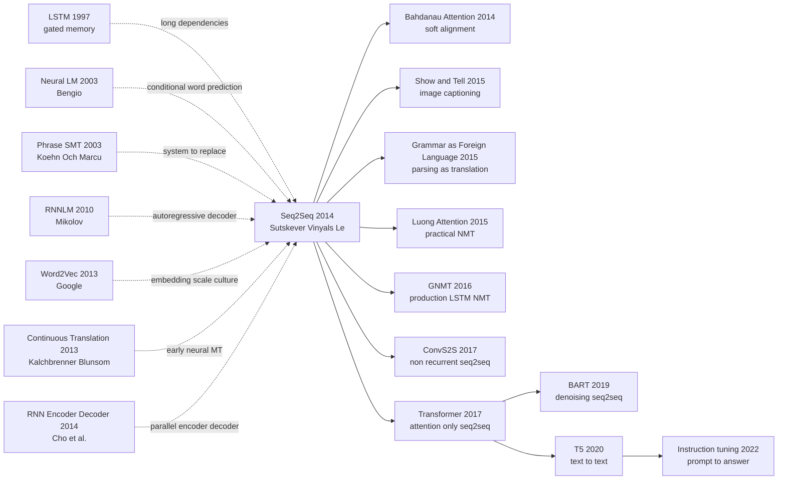

# Seq2Seq - Compress Any Sequence into a Vector, Then Decode It Back

> **On September 10, 2014, Ilya Sutskever, Oriol Vinyals, and Quoc V. Le at Google uploaded [arXiv:1409.3215](https://arxiv.org/abs/1409.3215), later published at NeurIPS 2014.** The wager of this nine-page paper was brutally simple: machine translation did not have to be a stack of phrase tables, alignment heuristics, reordering rules, and hand-engineered features. One LSTM could compress an English sentence into a vector; another LSTM could unfold that vector into French. On WMT'14 English-to-French it reached 34.8 BLEU, beating a phrase-based SMT baseline at 33.3; as a reranker for the SMT system's 1000-best list it reached 36.5. The strangest trick was not a bigger model but reading the source sentence backward, turning many long-range alignments into short optimization paths.

## TL;DR

Sutskever, Vinyals, and Le's 2014 NeurIPS paper rewrote machine translation from "phrase table + alignment model + hand-built reordering features" into one end-to-end conditional language model: a multilayer LSTM compresses the source sentence $x_{1:T}$ into a fixed vector $v$, and another LSTM generates the target sentence with $p(y\mid x)=\prod_t p(y_t\mid v,y_{<t})$. On WMT'14 English-to-French it reached 34.8 BLEU, beating a phrase-based SMT baseline at 33.3; used as a 1000-best reranker for the SMT system, it reached 36.5, close to the best system of the day. The failed baseline it displaced was not a small neural net but the whole phrase-based SMT engineering stack. Bahdanau Attention (2014) then fixed the fixed-vector bottleneck, and Transformer (2017) removed recurrence while keeping the encoder-decoder plus autoregressive-decoding interface. The hidden lesson is that the paper's real invention was not merely "use LSTMs for translation"; it was the reusable interface of recasting structured prediction as sequence-to-sequence generation.

---

## Historical Context

### What was NLP stuck on in 2014?

NLP in 2014 was not yet a world where one large model swallowed every text task. Machine translation, speech recognition, parsing, summarization, and question answering each had its own feature engineering stack and decoder. A serious translation paper could easily contain an n-gram language model, phrase tables, word alignment, maximum-entropy reordering, morphology rules, OOV handling, and a page of beam-search knobs. Deep learning had already opened vision with [AlexNet](2012_alexnet.md) and had shown through Word2Vec that vector spaces could carry semantic structure, but variable-length input and variable-length output still lacked a unified neural interface.

Machine translation was especially like a long-running industrial plant. Phrase-based SMT chopped sentences into phrase fragments, looked up target phrases in a table, then stitched candidates together with a language model and a reordering model. It was strong and had dominated WMT evaluations for years. It was also heavy: quality came from dozens of local components tuned together. Researchers had grown so used to that complexity that "generate the target sentence directly from the source sentence end to end" sounded like throwing away all expert knowledge on purpose.

Seq2Seq is counter-intuitive precisely there. It did not replace one small module, and it did not add a neural feature to phrase-based SMT. It rewrote the whole system as a conditional language model: read the source sentence, keep one vector, then generate the target sentence word by word. The idea looked crude because it pushed alignment, reordering, and word-sense choice into hidden states. But because it was crude, it made the task interface more important than task-specific features for the first time.

### The immediate predecessors that pushed Seq2Seq out

- **1997 LSTM**: Hochreiter and Schmidhuber added cell state and gates to RNNs, mitigating vanishing gradients. Without LSTM, it would have been hard in 2014 for a neural translator to read a 20-40 word sentence and retain usable information. Seq2Seq is the key transition from "LSTM can remember long dependencies" to "LSTM can carry a full structured task."
- **2003 Neural Probabilistic Language Model**: Bengio and 3 co-authors tied word representations to next-word prediction, establishing the basic paradigm of neural conditional word distributions. Seq2Seq's decoder is essentially a neural language model conditioned on a source-sentence vector.
- **2010 Mikolov RNNLM**: RNN language models proved recurrent states could make strong predictions over large vocabularies, but only for monolingual sequences. Seq2Seq pushes RNNLM from $p(y_t\mid y_{<t})$ to $p(y_t\mid x, y_{<t})$.
- **2013 Word2Vec / Google's large-scale training culture**: Google had already shown that simple objectives plus large data plus engineering throughput could change NLP infrastructure. Sutskever was also an author on the Word2Vec NeurIPS 2013 paper, which explains why Seq2Seq feels like "scale a clean objective" rather than "stack more rules."
- **2013 Kalchbrenner & Blunsom / 2014 Cho et al.**: Both lines were already probing neural encoder-decoders. Kalchbrenner and Blunsom proposed an early continuous translation model; Cho and 6 co-authors introduced an RNN Encoder-Decoder and GRU for neural phrase scoring inside SMT. Seq2Seq's move was different: hand sentence-level translation directly to deep LSTMs instead of using neural nets as features for the old system.

### What was the Google team doing?

Ilya Sutskever had just moved from the Toronto / Hinton lineage into Google Brain, already having participated in AlexNet and Word2Vec. Oriol Vinyals was pushing deep learning toward structured-output tasks, later working on image captioning and parsing-as-translation. Quoc V. Le was one of Google's early central figures in unsupervised and representation learning. Their shared bet is clear: a sufficiently simple neural objective plus sufficiently large training machinery can replace a hand-written pipeline.

The paper also has a very Google character. It does not prove a concept on a charming small benchmark; it goes directly to WMT'14 English-to-French, with roughly ten-million-scale parallel sentences, a huge vocabulary, and hundreds of millions of LSTM parameters. The real question was not "can a neural net translate a toy task?" It was "can an end-to-end neural system fight phrase-based SMT on its home field?" The meaning of 34.8 BLEU lies there: not a lab demo, but the first visible crack in the old system's moat.

### State of compute, data, and industry

Training Seq2Seq in 2014 was still cumbersome. Transformer did not exist; every time step had to be unfolded sequentially. Large-vocabulary softmax was expensive. Backpropagation through multilayer LSTMs required retaining long chains of states. GPU parallelism was far weaker than in convolutional vision models. The model in the paper was a large model for its time: deep LSTMs, 1000-dimensional-scale hidden states and embeddings, hundreds of millions of parameters, trained across multiple GPUs.

On the data side, WMT'14 English-French parallel text finally provided enough supervision for end-to-end NMT. Phrase-based SMT remained sturdier in low-resource settings because it could explicitly use dictionaries, morphology, and hand-built rules. But in high-resource English-French translation, neural models could learn implicit alignment and reordering from data. That was the historical window: the data was large enough, GPUs could run the experiment, LSTMs had matured, and the old system's complexity was high enough that researchers were willing to bet on learning from scratch.

## Background and Motivation

### From fixed input to variable-length input

AlexNet solved fixed-size images to fixed labels; Word2Vec solved local context to word vectors; RNNLM solved next-word prediction in a monolingual sequence. Seq2Seq faced a harder class of problems: input length varies, output length varies, and the two need not align one-to-one. Standard neural networks were comfortable with $x \mapsto y$, but machine translation requires $(x_1,\ldots,x_T) \mapsto (y_1,\ldots,y_{T'})$.

The paper's motivation compresses to one question: **if LSTM can compress history into state, can it compress an entire sentence into state?** That is the fixed-vector bottleneck wager. From today's perspective it is obviously imperfect: long sentences and fine-grained alignment suffer. But in 2014 that bottleneck was also the cleanest possible experiment. If it worked at all, it proved a neural network could learn a translation function without an explicit phrase table.

### Why machine translation was the testbed

Machine translation is the ideal stress test for Seq2Seq because it requires three things at once: lexical choice, long-distance reordering, and fluent target-language generation. A model that only knows language modeling produces fluent but unfaithful sentences. A model that only knows dictionary lookup is faithful but unnatural. A model that only knows local phrases fails on long structure. WMT'14 English-French was also mature enough: the phrase-based SMT baseline was strong, and BLEU provided a comparable number.

That is why 34.8 BLEU matters more than "it seems to translate." It shows the neural model was not merely surprising on a handful of short sentences; it won on the full test set, with OOV penalties, against the traditional system's home-field advantage. More importantly, the paper found that the LSTM did not struggle with long sentences as badly as expected. That directly challenged the common view of RNNs at the time: recurrent networks forget, but they are not necessarily hopeless at engineering scale.

### What the paper was really betting on

Seq2Seq made three bets. First, **representation learning can swallow structure engineering**: alignment, reordering, and phrase choice do not have to be explicit modules; they can live inside LSTM states and decoder hidden states. Second, **one general interface can span tasks**: translation is sequence-to-sequence, but so are summarization, captioning, speech recognition, and linearized parse trees. Third, **optimization tricks may matter more than theoretical elegance**: source reversal has no grand mathematics, but it shortens training paths enough to make the model work.

What it changed was not only machine translation but researchers' imagination of task formulation. Starting in 2015, many papers stopped asking "which features should this task use?" and started asking "can we linearize both input and output as sequences?" That line runs all the way to T5's text-to-text framing and to instruction tuning's prompt-to-answer interface. Seq2Seq's fixed vector was later replaced by attention, but the idea of unifying tasks as conditional generation stayed.

---

## Method Deep Dive

### Overall framework

Seq2Seq's whole framework fits in one sentence: **one LSTM reads the entire source sequence and treats its final state as a sentence vector; another LSTM uses that vector as its initial condition and predicts the target sequence step by step.** The paper has no explicit alignment variable, no phrase table, and no hand-crafted reorderer. It writes translation as conditional language modeling:

$$
p(y_1,\ldots,y_{T'} \mid x_1,\ldots,x_T)
= \prod_{t=1}^{T'} p(y_t \mid v, y_1,\ldots,y_{t-1})
$$

where $v$ is the fixed-dimensional vector produced after the encoder LSTM reads the source sentence. The decoder consumes the previous target word at each step and outputs a softmax distribution over the next word; training uses teacher forcing, and test-time decoding uses beam search. The most important part of this framework is not LSTM itself, but the conversion of structured prediction into "read one sequence, write one sequence."

| Paradigm | Input-output form | Structural knowledge | Decoding | 2014 pros and cons |
|----------|-------------------|----------------------|----------|--------------------|
| phrase-based SMT | source phrase -> target phrase | explicit alignment / phrase table / reordering | log-linear beam search | strong but complex, many modules |
| RNN language model | previous target words -> next word | no source condition | sequential sampling | fluent but cannot translate |
| **Seq2Seq (this paper)** | source sequence -> target sequence | implicit in hidden state | neural beam search | simple and end-to-end, but fixed-vector bottleneck is heavy |
| Attention NMT | source states -> target sequence | soft alignment | attention beam search | fixes long sentences, becomes the later standard |

### Key designs

#### Design 1: Encoder-decoder factorization — turning translation into a conditional language model

**Function**: map an arbitrary-length source sentence $x_{1:T}$ into a fixed vector $v$, then let a decoder generate an arbitrary-length target sentence $y_{1:T'}$. This removes the need to assume equal input/output lengths or provide word-level alignments in advance.

**Core formula**:

$$
v = \mathrm{LSTM}_{\mathrm{enc}}(x_1,\ldots,x_T),\qquad
p(y_t \mid x, y_{<t}) = \mathrm{softmax}(W_o h_t + b_o)
$$

**Training pseudocode**:

```python
def seq2seq_training_loss(encoder, decoder, source_tokens, target_tokens):
    context_vector = encoder.final_state(source_tokens)
    decoder_state = decoder.initial_state(context_vector)
    total_loss = 0.0
    previous_token = BOS_ID
    for gold_token in target_tokens + [EOS_ID]:
        decoder_state, logits = decoder.step(previous_token, decoder_state)
        total_loss += cross_entropy(logits, gold_token)
        previous_token = gold_token
    return total_loss / (len(target_tokens) + 1)
```

| Choice | Conditioning variable | Supervision | Is alignment explicit? | Design consequence |
|--------|-----------------------|-------------|------------------------|--------------------|
| phrase-based SMT | phrase table + LM features | phrase pairs / alignments | yes | interpretable but engineering-heavy |
| neural phrase scorer | phrase vector | phrase-level score | semi-explicit | only augments the old system |
| **Seq2Seq encoder-decoder** | fixed vector $v$ | target tokens | no | fully end-to-end |
| attention encoder-decoder | all source states | target tokens + soft alignment | softly explicit | more stable on long sentences |

**Design rationale**: splitting translation into encoder and decoder has two effects. First, the encoder only has to "understand the source," and the decoder only has to "write the target," with a vector as the interface; this makes the model architecture highly reusable. Second, the training objective is directly to maximize the target sentence's conditional probability, removing intermediate supervision such as alignment tables or phrase extraction. The cost is equally clear: all source information must squeeze through $v$, so the fixed vector becomes a long-sentence bottleneck.

#### Design 2: Deep LSTM as sequence compressor — using gated memory to carry sentence information

**Function**: use multilayer LSTMs as both encoder and decoder rather than vanilla RNNs. The paper bets that the LSTM cell state can preserve necessary information across dozens of words, making the fixed-vector approach trainable on real translation.

**Core formula**:

$$
\begin{aligned}
i_t &= \sigma(W_i e_t + U_i h_{t-1}),\quad
f_t = \sigma(W_f e_t + U_f h_{t-1}) \\
\tilde{c}_t &= \tanh(W_c e_t + U_c h_{t-1}),\quad
c_t = f_t \odot c_{t-1} + i_t \odot \tilde{c}_t \\
h_t &= o_t \odot \tanh(c_t)
\end{aligned}
$$

**Training pseudocode**:

```python
def lstm_cell_step(token_embedding, previous_state, parameters):
    previous_hidden, previous_cell = previous_state
    gates = parameters.input_weight @ token_embedding + parameters.hidden_weight @ previous_hidden
    input_gate, forget_gate, output_gate, candidate_cell = split_gates(gates)
    input_gate = sigmoid(input_gate)
    forget_gate = sigmoid(forget_gate)
    output_gate = sigmoid(output_gate)
    candidate_cell = tanh(candidate_cell)
    current_cell = forget_gate * previous_cell + input_gate * candidate_cell
    current_hidden = output_gate * tanh(current_cell)
    return current_hidden, current_cell
```

| Model | Long-dependency handling | Parallel training | 2014 usability | Key problem |
|-------|--------------------------|-------------------|----------------|-------------|
| vanilla RNN | repeated hidden-state multiplication | poor | trainable but forgetful | vanishing gradients |
| **LSTM** | cell state + gates | poor | trainable on long sentences | slow, large states |
| GRU | update/reset gates | poor | concurrent arrival | slightly less expressive |
| Transformer | self-attention + residual | strong | not yet invented | needs large data and memory |

**Design rationale**: Seq2Seq is fundamentally a stress test for LSTM. A vanilla RNN might run on short sentences, but translation requires carrying subject identity, tense, negation, and clause boundaries into later target words. LSTM gates give the model an engineering-controllable mechanism for "remember / overwrite." From today's view, LSTM was not the final answer; in 2014, it was the only mature recurrent unit strong enough to challenge SMT head-on.

#### Design 3: Source reversal — reading the source backward to shorten optimization paths

**Function**: reverse source-word order during training while leaving target order unchanged. For example, the English source `I love machine translation` becomes `translation machine love I` before entering the encoder. This trick does not change the translation function, but it sharply reduces optimization difficulty.

**Core formula**:

$$
\mathrm{reverse}(x_1,\ldots,x_T)=(x_T,\ldots,x_1),\qquad
\Delta_{\mathrm{path}} \approx |(T-i+1)-j| \text{ instead of } |i-j|
$$

**Training pseudocode**:

```python
def prepare_parallel_example(source_tokens, target_tokens, reverse_source=True):
    if reverse_source:
        model_source = list(reversed(source_tokens))
    else:
        model_source = list(source_tokens)
    model_target_input = [BOS_ID] + target_tokens
    model_target_output = target_tokens + [EOS_ID]
    return model_source, model_target_input, model_target_output
```

| Input strategy | Path from source words to early target words | Effect on long sentences | Changes model? | Historical role |
|----------------|----------------------------------------------|--------------------------|----------------|-----------------|
| original source order | early source words are far from early target words | hard optimization | no | baseline |
| **reversed source** | many monotonic alignments become close | marked improvement | no | paper's most famous trick |
| bidirectional encoder | keeps both directions | more stable | yes | common in the attention era |
| attention | decoder consults source states every step | fundamental fix | yes | later standard |

**Design rationale**: English-French translation is roughly monotonic, so the first few source words often correspond to the first few target words. If the encoder reads in normal order, the decoder's first target word must retrieve information that passed through many LSTM steps. After reversal, source-prefix information sits close to the decoder's starting point. The deeper lesson is that 2014 end-to-end learning could not automatically solve all optimization geometry: **an input transform that leaves the task unchanged could decide whether the model reached a good solution.**

#### Design 4: Beam search + ensemble/reranking — connecting neural models to the evaluation battlefield

**Function**: after training a conditional probability model, test-time generation cannot simply choose the locally best word at each step; it uses beam search to approximate the highest-probability translation. The paper also ensembles multiple LSTMs and uses LSTM probabilities to rerank the 1000-best candidates produced by phrase-based SMT.

**Core formula**:

$$
\hat{y}=\arg\max_y \left[\sum_{t=1}^{|y|}\log p(y_t\mid v,y_{<t}) + \lambda \cdot \mathrm{score}_{\mathrm{SMT}}(y)\right]
$$

**Decoding pseudocode**:

```python
def beam_search_decode(decoder, context_vector, beam_size, maximum_steps):
    beams = [(0.0, [BOS_ID], decoder.initial_state(context_vector))]
    for _ in range(maximum_steps):
        candidates = []
        for score, prefix_tokens, decoder_state in beams:
            if prefix_tokens[-1] == EOS_ID:
                candidates.append((score, prefix_tokens, decoder_state))
                continue
            next_state, logits = decoder.step(prefix_tokens[-1], decoder_state)
            for token_id, log_probability in top_log_probs(logits, beam_size):
                candidates.append((score + log_probability, prefix_tokens + [token_id], next_state))
        beams = sorted(candidates, key=lambda item: item[0], reverse=True)[:beam_size]
    return beams[0][1]
```

| Decoding / combination | Role | BLEU relationship | Engineering meaning |
|------------------------|------|-------------------|---------------------|
| greedy decoding | choose the top word each step | usually below beam | fast but myopic |
| **beam search** | keep multiple candidate prefixes | directly improves quality | neural MT default |
| LSTM ensemble | average probabilities from multiple models | paper's main result depends on it | spend compute for robustness |
| SMT 1000-best rerank | use LSTM to score old-system candidates | reaches 36.5 BLEU | neural model first lands as a strong feature |

**Design rationale**: Seq2Seq is a probability model, but machine-translation evaluation scores complete sentence quality. Beam search bridges token-level probabilities and sentence-level translations; ensembling averages away variance; reranking is the pragmatic path: even before end-to-end NMT fully replaces SMT, it can immediately become a powerful scoring feature inside the old system. That gave the paper both paradigm ambition and hard numbers in the 2014 evaluation culture.

### Loss / training recipe

| Item | Setting | Notes |
|------|---------|-------|
| Training objective | maximize target conditional likelihood | token-level cross-entropy under teacher forcing |
| Encoder | multilayer LSTM | reads reversed source sentence, passes final state to decoder |
| Decoder | multilayer LSTM | predicts next target word from previous target word |
| Vocabulary | large vocabulary + OOV handling | paper explicitly notes OOV penalization in BLEU |
| Optimization | SGD / large-scale BPTT | Adam had just appeared and was not yet default |
| Decoding | beam search | approximate search for high-probability target sentence |
| Combination | ensemble + reranking | reports both direct translation and SMT reranking |
| Key trick | source reversal | shortens dependency paths and markedly improves optimization |

This recipe has a precise historical position: it is **the highest form of pre-attention NMT**. All source information must flow from the encoder's final state into the decoder, so model size, LSTM depth, and source reversal all matter disproportionately. Later attention does not overthrow Seq2Seq; it admits that the fixed vector is too narrow and expands "one $v$" into "one source state $h_i$ per position, dynamically read by the decoder." Transformer then replaces LSTM state with self-attention, but keeps the two skeleton pieces: encoder-decoder structure and autoregressive likelihood.

---

## Failed Baselines

### Opponents that lost to Seq2Seq

Seq2Seq's victory was not "one neural net beats another neural net." It was the first time an end-to-end interface directly cracked the traditional machine-translation engineering stack. Its baselines spanned three groups: strong phrase-based SMT, early neural translation, and RNNLMs that could only model monolingual text.

| Baseline | Representative method | Strength at the time | Where it lost | Seq2Seq counterpart |
|----------|-----------------------|----------------------|---------------|---------------------|
| phrase-based SMT | Moses / WMT phrase systems | strong alignment, reordering, mature features | many modules, weak end-to-end representation | learn $p(y\mid x)$ directly with one conditional model |
| neural phrase scorer | Cho et al. RNN Encoder-Decoder | scores phrase pairs, easy to plug into SMT | still serves the old pipeline | generate full sentences directly |
| vanilla RNN translation | early recurrent translation | simple structure | long dependencies and gradient difficulty | LSTM gates + deep stack |
| RNN language model | Mikolov RNNLM | fluent target text | no source condition | decoder conditioned on encoder vector |
| hand-built reordering | SMT lexicalized reordering | effective on common language pairs | rules and features transfer poorly | hidden state learns reordering implicitly |

**Phrase-based SMT** was the hardest opponent. It was not a weak baseline; it was the mainstream WMT system family, and the 33.3 BLEU SMT baseline in the paper was strong. Reaching 34.8 showed the neural model was not merely adding a reranking feature but could perform translation independently. The reranking result is even more revealing: using the LSTM to rerank the SMT system's 1000-best list reached 36.5, meaning the old and new systems were not immediately either/or in 2014. The neural model first entered as a powerful feature, then gradually replaced the pipeline.

**RNN Encoder-Decoder / GRU phrase scoring** was the closest neural predecessor. Cho and 6 co-authors used an encoder-decoder in the same year for phrase representations, but the output was still a phrase-pair score and the goal was to enhance SMT. Sutskever, Vinyals, and Le made the key jump from "phrase-level neural feature" to "sentence-level neural system." That framing difference explains much of the impact difference.

**Vanilla RNNs and monolingual RNNLMs** serve as negative proof. An RNNLM can write fluent target-language text but has no source constraint; a vanilla RNN with a source can still forget. Seq2Seq uses LSTM to solve both problems: the decoder retains language-modeling ability, the encoder injects source conditioning, and the cell state prevents long sentences from completely collapsing.

### Failures admitted or exposed by the paper

The paper honestly exposes three weaknesses of pre-attention Seq2Seq.

The first is the **fixed-vector bottleneck**. All source-sentence information is squeezed into one vector $v$; as sentences grow longer, word meaning, alignment, and clause boundaries become harder to preserve losslessly. The paper reports that the model does not struggle with long sentences as much as expected, but that does not mean the bottleneck is absent. Bahdanau attention appeared only months later precisely because the community realized that the decoder should be able to inspect the source at every step.

The second is **large vocabulary and OOV handling**. WMT'14 English-French is high-resource, but the vocabulary is still huge. The abstract explicitly notes that BLEU penalized the LSTM on out-of-vocabulary words, meaning the model still suffers on rare words, names, numbers, and morphology. Later large-vocabulary NMT, copy mechanisms, and subword/BPE modeling are all patches for this weakness.

The third is **decoding and length bias**. Seq2Seq maximizes token probability, and shorter sequences naturally obtain easier average probability. Beam-search length normalization, coverage penalties, copy/attention, and better stopping criteria were not yet mature. The 2014 paper did not systematize these problems because proving end-to-end NMT could win was already enough; they soon became everyday NMT engineering pain.

### The 2014 counterexample: how fragile the model is without attention

If you reran original Seq2Seq today, the easiest failures would not be "it cannot translate at all" but subtler errors: dropped clauses, names becoming UNK, semantic drift in the second half of long sentences, and unstable handling of negation or quantities. They all point to the same root: the decoder reads the source only through one fixed vector rather than re-locating information at each output position.

Source reversal mitigates the issue, but it also exposes the issue. If a simple input-order trick materially changes performance, the model has not naturally learned long-range alignment; it needed the optimization path to be reshaped by hand. Attention later solves this directly: keep the sequence of source states and let the decoder query them at every step instead of forcing everything through one bottleneck.

### The real anti-baseline lesson: the old system was not useless, its interface was too narrow

Seq2Seq is often told as "neural networks killed SMT," but the more accurate lesson is: **SMT's local knowledge was strong, but its interface was narrow**. Phrase tables remembered local translations well, language models preserved fluency, reordering models handled common patterns; the problem was that these modules were glued together by hand-written features and log-linear weights, unable to share one learned representation.

Seq2Seq's advantage was not that it understood more linguistics on day one; it let all components update under one loss. Alignment, word sense, word order, and fluency were no longer four modules, but four pressures inside one conditional probability model. This lesson repeats across deep learning: models often win not by adding more expert rules, but by widening the end-to-end interface enough for representations to grow.

## Key Experimental Data

### WMT'14 English-to-French BLEU

The core numbers come from WMT'14 English-to-French translation. Their historical meaning matters more than their absolute modern value; tokenization, BLEU computation, OOV handling, and system-combination practices in 2014 are not identical to modern NMT.

| System | Usage | BLEU | Comparison meaning |
|--------|-------|------|--------------------|
| phrase-based SMT baseline | standalone translation system | 33.3 | strong traditional baseline |
| **LSTM Seq2Seq** | standalone translation system | **34.8** | first direct end-to-end neural win over SMT baseline |
| SMT + LSTM reranking | LSTM reranks 1000-best | **36.5** | neural model as strong feature for old system, close to best of the day |
| previous best system | strong WMT-era system | about 37.0 | reranking is already near SOTA |
| no source reversal | ablation described as markedly worse | exact number not in abstract | proves reversal is key optimization trick |

### Architecture and training details

| Component | Setting |
|-----------|---------|
| Encoder | multilayer LSTM, reads reversed source sequence |
| Decoder | multilayer LSTM, predicts target words under teacher forcing |
| Hidden state / embeddings | 1000-dimensional scale |
| Parameter scale | hundreds of millions of parameters, roughly 380M |
| Dataset | WMT'14 English-French parallel corpus |
| Decoding | beam search |
| Combination | multi-model ensemble; separate SMT 1000-best reranking |
| Key ablation | source reversal markedly improves performance |

### Key findings

- **End-to-end NMT can directly beat a strong SMT baseline**: 34.8 vs 33.3 is the historical threshold. It convinced the field that neural MT was not just a reranker, but a full system.
- **Reranking the old system remains valuable**: 36.5 BLEU shows that in 2014 the safest migration route was not to throw SMT away immediately, but to plug LSTM probabilities into the old candidate set. Many industrial transitions start hybrid, then go fully neural.
- **Long sentences are not as hopeless as expected**: the paper emphasizes that LSTM did not show obvious difficulty on long sentences, striking at the core suspicion about RNNs. Attention later showed that handling long sentences and optimally handling them are different things.
- **Source reversal is the smallest but most critical engineering move**: no new parameters, no new data, no new theory; just an input-order change that markedly improves training. It is a classic early-deep-learning case where optimization geometry matters more than architectural glamour.
- **Sentence vectors have semantic structure**: the paper shows learned phrase and sentence representations are sensitive to word order and relatively invariant to active/passive voice. This observation later grows into sentence embeddings, universal encoders, and text-to-text pretraining.

---

## Idea Lineage



### Past lives (what forced it out)

- **LSTM 1997**: the direct technical substrate. LSTM originally solved long-dependency training; Seq2Seq pushed it into the extreme use case of "compress an entire sentence." Without gates and cell state, fixed-vector translation would have had little engineering feasibility.
- **Neural LM 2003 / RNNLM 2010**: the language-modeling tradition behind the decoder. Seq2Seq did not invent target-sentence generation from scratch; it conditioned a neural language model on a source-sentence vector.
- **Phrase-based SMT 2003-2014**: the system tradition Seq2Seq sought to replace. It was strong, mature, and tunable, but its module interfaces were narrow. Seq2Seq's unified loss directly targeted that pipeline complexity.
- **Word2Vec 2013**: gave Google's NLP team a lesson: a simple objective can become infrastructure if scaled hard enough. Seq2Seq inherits that engineering philosophy.
- **Kalchbrenner & Blunsom 2013 / Cho et al. 2014**: close predecessors had already proposed neural encoder-decoders, but had not yet used deep LSTMs to directly beat mainstream WMT SMT. Seq2Seq pushed the direction into a bolder sentence-level end-to-end system.

### Descendants

- **Attention NMT**: Bahdanau attention directly fixes the fixed-vector bottleneck, turning "one sentence vector" into "source-state sequence + soft alignment at every step." Luong attention then makes it engineering-practical, becoming the 2015-2016 NMT default.
- **Production neural translation**: GNMT 2016 is Seq2Seq industrialized: LSTM encoder-decoder, attention, large-scale training, multilingual deployment. Google Translate's move from SMT to NMT shows this paper changed more than a benchmark.
- **Cross-task seq2seq**: Show and Tell encodes a CNN image into a vector and asks an LSTM to write a caption; Grammar as a Foreign Language treats parsing as translation; listen-attend-spell maps acoustic sequences to text. Seq2Seq becomes the default interface for structured-output tasks.
- **Transformer**: Transformer removes RNNs in 2017 but keeps Seq2Seq's outer shell: an encoder represents input, and a decoder autoregressively generates output. In that sense Transformer is Seq2Seq with the internal operators rewritten by attention, not a rejection of the Seq2Seq interface.
- **Text-to-text pretraining**: BART and T5 extend seq2seq from supervised translation to pretraining and task unification. T5's slogan "every NLP task is text-to-text" is the extreme version of the Seq2Seq idea.

### Misreadings / oversimplifications

- **"Seq2Seq = two LSTMs"**: inaccurate. Two LSTMs are the 2014 implementation; the durable idea is encoder-decoder plus autoregressive conditional generation. Transformer, BART, and T5 can contain no LSTM at all while still descending from Seq2Seq.
- **"The fixed vector failed, so attention overturned the paper"**: also inaccurate. Attention overturned the fixed-vector bottleneck, not the Seq2Seq interface. Later models still follow source encoding and target-side conditional generation.
- **"Source reversal is just a small trick"**: superficially yes, historically no. It is key evidence that end-to-end model quality depends heavily on optimization geometry; deep learning does not automatically succeed by throwing data into a network, and input representation still shapes gradient paths.
- **"Neural translation naturally understands language better than SMT"**: not in 2014. Seq2Seq's strength was unified representation and end-to-end training, not more built-in linguistic knowledge. OOV handling, terminology, and low-resource settings still needed later mechanisms.

---

## Modern Perspective

### Assumptions that no longer hold

1. **"One fixed vector can carry an entire sentence"**: partly falsified by the attention lineage. The fixed vector works on short sentences but quickly becomes a bottleneck for long sentences, rare words, and fine-grained alignment. Bahdanau attention, Luong attention, and Transformer all dismantle this bottleneck: do not give the decoder only one $v$; let it see the full source-state sequence.
2. **"RNNs are the natural endpoint of sequence modeling"**: falsified by Transformer. Using LSTM in 2014 was the right choice because it was the most mature long-dependency tool available; after 2017, self-attention's parallel training and global visibility won decisively in large-scale NLP. The Seq2Seq interface survived; the LSTM kernel did not.
3. **"Word-level large-vocabulary softmax is enough"**: corrected by subword/BPE and tokenizer engineering. Original Seq2Seq is sensitive to OOV words; modern NMT almost always uses subword units, turning rare words, morphology, and names from "unknown" into composable fragments.
4. **"BLEU is enough to represent translation quality"**: weakened by later evaluation research. BLEU remains historically valuable, but modern translation also cares about adequacy, faithfulness, terminology, robustness, human preference, and learned metrics such as COMET/BLEURT. Seq2Seq's victory must be read inside the evaluation culture of its time.
5. **"End-to-end models will automatically learn alignment"**: only half true. Seq2Seq does learn some implicit alignment, but attention's success shows that explicit readable soft alignment still matters. Pushing all structure through a fixed vector wastes too much capacity and gradient.

### What survived vs. what didn't

**What survived**:

- **The encoder-decoder interface**: encode the input, then conditionally generate the output. This is the shared skeleton from LSTM NMT to Transformer, BART, T5, speech recognition, and image captioning.
- **Autoregressive conditional likelihood**: $p(y\mid x)=\prod_t p(y_t\mid x,y_{<t})$ remains one of the core training and decoding forms for generative text models.
- **Task reformulation power**: writing parsing, captioning, summarization, and speech recognition as seq2seq is the paper's strongest transferable idea.
- **The seriousness of engineering tricks**: source reversal proved that a small input transform can be a major optimization breakthrough; the same attitude later appears in normalization, tokenization, and positional encoding details.

**What was replaced or weakened**:

- **The fixed-vector bottleneck**: replaced by attention and memory-style source access.
- **LSTM recurrence**: dominated by self-attention in large-scale NLP training; still useful in streaming, edge, and low-latency settings.
- **Word-level modeling**: replaced by subword and byte-level tokenizers.
- **Pure BLEU narrative**: supplemented by human evaluation, COMET, robustness tests, and factuality evaluation.
- **Pure supervised translation training**: extended by pretraining plus fine-tuning / instruction tuning.

### Side effects the authors did not foresee

1. **Unifying NLP task interfaces as generation**: Seq2Seq made researchers ask every structured-output task as "what is the input sequence, and what is the output sequence?" That line eventually reaches T5's text-to-text framing, LLM prompt-to-answer interfaces, and multimodal image-to-text / audio-to-text systems.
2. **Accelerating Google Translate's move from SMT to NMT**: GNMT 2016 did not appear out of nowhere; it is the direct result of Seq2Seq plus attention plus engineering scale. Quality improvements in an industrial system turned NMT from a research direction into infrastructure users felt every day.
3. **Making attention a necessary invention**: if Seq2Seq had not first shown that a fixed vector was possible but imperfect, the motivation for attention would have been much weaker. Many great follow-ups do not appear from nowhere; they precisely repair the predecessor's clearest failure.
4. **Making decoding a central neural-NLP engineering problem**: beam search, length penalties, coverage, copy, sampling, and reranking later become unavoidable in translation, summarization, and LLM generation.
5. **Changing how researchers imagine representations**: sentence vectors are no longer just classification features; they can become generation conditions. Sentence embeddings, retrieval-augmented generation, and multimodal encoder-decoders are distant relatives of that shift.

### If Seq2Seq were rewritten today

If this paper were rewritten in 2026, the core interface would remain but the implementation would be completely different:

- **Default to a Transformer encoder-decoder**, with LSTM moved into the historical comparison rather than the main model.
- **Use a subword tokenizer**, so OOV does not directly hurt BLEU.
- **Put attention in the main formula**: $p(y_t\mid y_{<t}, H_x)$, where $H_x$ is the full set of source states rather than one $v$.
- **Report COMET / BLEURT / human evaluation**, not BLEU alone.
- **Systematically analyze length, rare words, names, negation, and numbers**, instead of reporting only aggregate BLEU.
- **Release training and decoding code**, making follow-up models reproducible.
- **Discuss low-resource and domain transfer**, because modern NMT's hard problems have shifted from "can high-resource English-French translate?" to "small languages, terminology, robustness, and controllability."

But the paper's most important sentence would not change: **view arbitrary structured-output tasks as conditional sequence generation**. That interface outlived LSTM and runs deeper than source reversal.

## Limitations and Future Directions

### Author-acknowledged limitations

- **OOV and large-vocabulary problems**: the abstract explicitly says out-of-vocabulary words penalize BLEU. Word-level NMT is naturally fragile on rare words and names.
- **Dependence on source reversal**: a word-order trick has a huge effect, showing the model is sensitive to optimization paths.
- **Needs ensemble and reranking to approach the best systems**: 34.8 is the end-to-end breakthrough, but 36.5 depends on reranking SMT candidates, meaning standalone NMT had not fully crushed the old system in 2014.
- **The fixed vector is likely a bottleneck**: the paper does not frame it as the central failure, but attention soon proves it is the main limitation.

### Limitations from a 2026 view

- **Uninterpretable implicit alignment**: the model may learn alignment, but readers cannot inspect it and debugging is hard.
- **Insufficient robustness on long and multi-clause sentences**: the fixed vector easily loses information under complex syntax.
- **Weak low-resource generalization**: end-to-end models need large parallel corpora; dictionaries and rules in SMT did not immediately lose their advantage for small languages.
- **Visible decoding bias**: beam search and model probabilities produce length bias and exposure bias.
- **Poor training throughput**: RNN sequential unrolling limits parallelism, the engineering reason Transformer replaced LSTM.
- **No pretraining**: the model trains directly from parallel text and cannot exploit massive monolingual corpora; modern NMT uses denoising, back-translation, and multilingual pretraining.

### Improvement directions already validated by follow-ups

- **Bahdanau / Luong attention**: let the decoder read source states at every step, fixing the fixed-vector bottleneck.
- **BPE / WordPiece / SentencePiece**: turn OOV into subword composition.
- **GNMT**: industrializes LSTM NMT with attention, residuals, quantization, and large-scale deployment.
- **ConvS2S / Transformer**: remove the RNN sequential bottleneck with convolution or self-attention, improving parallel training.
- **BART / T5**: extend seq2seq from translation into pretraining and unified task interfaces.
- **RAG / tool-augmented generation**: attach encoder-decoder generation to external knowledge and tools, reducing hallucination and knowledge staleness.

## Related Work and Insights

- **vs phrase-based SMT**: SMT is strong in local interpretable knowledge and weak in module glue. Seq2Seq is strong in unified loss and shared representation, weak in rare words, interpretability, and low-resource settings. Lesson: old systems are often not "wrong"; their interface is too narrow to absorb the representation-learning dividends of data scale.
- **vs Bahdanau Attention**: attention is the direct patch to Seq2Seq. It keeps the encoder-decoder structure but expands the fixed vector into queryable memory. Lesson: the best follow-up often does not overthrow the predecessor; it precisely repairs the most exposed bottleneck.
- **vs Transformer**: Transformer removes recurrence but inherits Seq2Seq's task formulation. Lesson: the architectural kernel can be replaced while the task interface lives longer.
- **vs T5 / text-to-text**: T5 pushes Seq2Seq task reformulation to the limit: translation, classification, summarization, and QA all become text-to-text. Lesson: a unified interface is itself a scaling mechanism.
- **vs modern LLM prompting**: instruction to answer, context to response, retrieved material to summary are still conditional sequence generation. Seq2Seq is an early crisp expression of that large interface.

## Resources

- Paper: [arXiv 1409.3215](https://arxiv.org/abs/1409.3215)
- PDF: [Sequence to Sequence Learning with Neural Networks](https://arxiv.org/pdf/1409.3215)
- Key predecessor: [LSTM 1997](https://www.bioinf.jku.at/publications/older/2604.pdf)
- Key follow-up: [Bahdanau Attention 1409.0473](https://arxiv.org/abs/1409.0473)
- Key follow-up: [GNMT 1609.08144](https://arxiv.org/abs/1609.08144)
- Key follow-up: [Attention Is All You Need 1706.03762](https://arxiv.org/abs/1706.03762)
- Tutorial: [Graham Neubig NMT tutorial](https://arxiv.org/abs/1703.01619)
- Cross-language: Chinese version -> `/era2_deep_renaissance/2014_seq2seq/`


---

> 🌐 [中文版](/era2_deep_renaissance/2014_seq2seq/) · 📚 awesome-papers project · CC-BY-NC