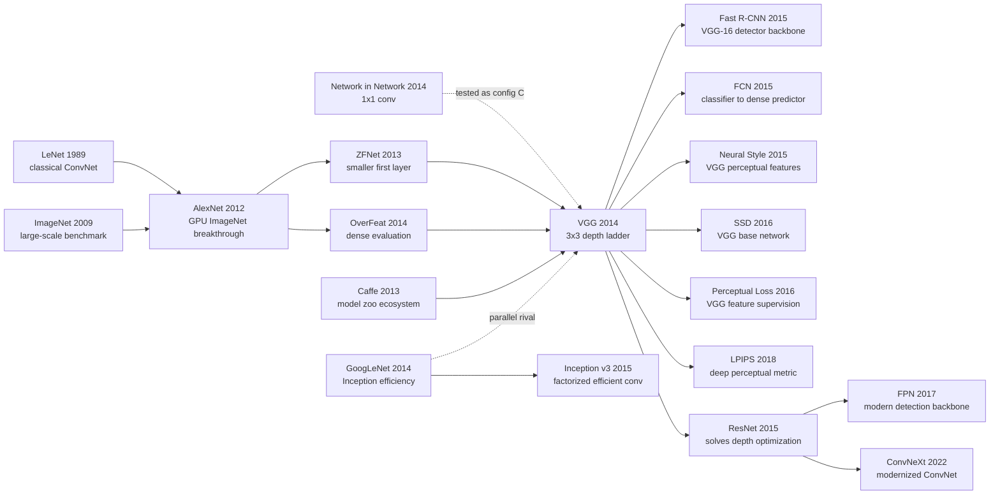

# VGG — Pushing CNNs to 19 Layers with 3×3 Convolutions

> **September 4, 2014. Karen Simonyan and Andrew Zisserman from Oxford's Visual Geometry Group upload [arXiv 1409.1556](https://arxiv.org/abs/1409.1556), later published at ICLR 2015.** The paper barely introduces a new module: no Inception branch, no residual shortcut, no attention. It shrinks convolution kernels to 3×3, fixes stride at 1, preserves spatial resolution with padding, and keeps stacking layers until the network reaches 16-19 weight layers. The historical twist is that VGG did not become iconic because it won classification outright: GoogLeNet won ILSVRC 2014 classification and VGG placed second. It became iconic because the released VGG-16/19 Caffe weights turned into the most convenient visual ruler for detection, segmentation, style transfer, and perceptual losses.

## TL;DR

VGG, submitted in 2014 by Karen Simonyan and Andrew Zisserman and published at ICLR 2015, rewrote the coarse design of [AlexNet (2012)](2012_alexnet.md) — an 11×11 first layer, aggressive stride, and only a handful of convolutional layers — into a disciplined depth experiment: use 3×3 convolutions almost everywhere, stack them, and measure what depth alone buys. Three 3×3 layers have an effective receptive field $R_{\text{eff}}(3)=7$, yet require only $3\cdot3^2C^2=27C^2$ parameters instead of the $49C^2$ parameters of a single $7\times7$ layer, while injecting two extra ReLUs. That simple rule pushed ImageNet top-5 test error from AlexNet ensemble's 16.4%, ZFNet's 14.8%, OverFeat's 13.6%, and Clarifai's 11.7% down to VGG's 7.3% ILSVRC submission and 6.8% post-submission two-model ensemble; the same representation won ILSVRC 2014 localisation with 25.3% top-5 localisation error.

VGG's historical role is not “the strongest network forever,” but “the last plain CNN backbone that was strong enough, simple enough, and reusable enough to become infrastructure.” It proved that depth itself helps, exposed the optimisation and compute ceiling of plain CNNs around 19 layers, and handed [ResNet (2015)](2015_resnet.md) the next problem to solve. The hidden lesson is counter-intuitive: a paper with no elaborate module, no theorem, and not even the ILSVRC classification trophy became a visual coordinate system because its design was uniform and its weights were public.

---

## Historical Context

### What was the vision community stuck on in 2014?

The 2014 ImageNet scene had a strange shape: deep learning had already won, but the field did not yet know how to keep winning. In 2012, [AlexNet](2012_alexnet.md) drove top-5 test error from the traditional-vision range of roughly 25% down to 16.4%, proving that large data, GPUs, ReLU, dropout, and convolutional networks could beat hand-crafted features. In 2013, ZFNet / OverFeat / Clarifai pushed the number toward the 14%-12% range, mostly by changing the first-layer window, stride, dense evaluation, and model fusion. In other words, AlexNet had overthrown the old “hand-crafted feature + SVM” regime, but the new architectural language was still coarse: early layers often used 11×11 or 7×7 filters, downsampled images aggressively, and contained only a few convolutional layers afterwards.

The obvious question was: if convolutional networks work, why not keep making them deeper? The answer was not obvious. AlexNet had only 8 weight layers, and ZFNet did not truly push depth very far; GPU memory, initialization, training time, and gradient propagation all stood in the way of deeper models. More subtly, the 2014 community did not yet have [BatchNorm](2015_batchnorm.md) or [ResNet](2015_resnet.md) as deep-network infrastructure. Caffe was just becoming the default, and PyTorch did not exist. VGG's route was conservative: do not invent a complex module; control the variables; ask one clean question: **if almost everything else stays fixed, does making the network deeper keep improving ImageNet?**

That is VGG's historical position. It is not the first CNN paper, nor the first ImageNet paper. It is the paper that turned “depth” from an intuition into a measurable experimental variable. Across configurations A, B, C, D, and E, it gradually increases convolutional depth from 11 to 19 weight layers, letting the reader see clearly for the first time that, under the same training recipe and testing protocol, depth brings steady gains until performance begins to saturate around 16-19 layers.

### The immediate predecessors that pushed VGG out

- **LeCun et al. 1989, LeNet / backpropagation CNNs**: VGG explicitly says it does not depart from the classical ConvNet architecture; it pushes it deeper. The chain of convolution, pooling, fully connected layers, and softmax comes from the earliest handwritten-digit era.
- **Deng et al. 2009, ImageNet**: Without 1000 classes, million-scale images, and a public challenge, VGG's “does depth help?” question could not have been tested at sufficient scale. ImageNet is the real experimental foundation.
- **AlexNet by Krizhevsky, Sutskever, and Hinton (2012)**: VGG's direct baseline. AlexNet proved large CNNs could win, but its early 11×11 stride-4 design was coarse; VGG uses 3×3 stride-1 convolutions to preserve spatial information longer.
- **Zeiler & Fergus, ZFNet (2013/2014)**: Visualization and deconvolution analysis showed that AlexNet's first layer was too coarse and too aggressively strided. VGG extends the lesson of “smaller early filters” into a whole-network design principle.
- **OverFeat by Sermanet and 5 co-authors (2014)**: Applied classification networks densely over full images and connected recognition, localisation, and detection. VGG's dense evaluation and localisation appendix clearly inherit this path.
- **Network in Network by Lin, Chen, and Yan (2014)**: The precedent for 1×1 convolutions. VGG's configuration C deliberately tests 1×1 layers and finds that adding nonlinearity alone is worse than preserving 3×3 spatial context.
- **GoogLeNet / Inception by Szegedy and 8 co-authors (2014)**: VGG's strongest contemporary rival. GoogLeNet follows a complex “branching module + parameter efficiency” route; VGG follows a plain “single path + small filters + depth” route. Together they define the two poles of 2014-2015 CNN architecture search.

### What was the author team doing?

Karen Simonyan and Andrew Zisserman were at Oxford's Visual Geometry Group. The name VGG is not a model-type acronym; it is the lab name, Visual Geometry Group. That matters: the paper came not from a large industrial lab but from an academic group with a long record in geometry, recognition, retrieval, and video understanding. Simonyan was also working on two-stream action recognition around the same period, while Zisserman was one of the central figures in British computer vision. The paper's style is recognizably Oxford: little hype, careful comparisons; few new modules, many reusable experiments.

This background explains why the paper is so restrained. GoogLeNet was turning networks into Inception-module assemblies; MSRA's SPPnet was moving pooling structure into detection; Bengio / Goodfellow's circle was exploring more radical generative objectives. VGG kept the minimal shape of a classical ConvNet. It reads like an extremely clean ablation: 224×224 input, stride-1 convolutions, 3×3 padding 1, five 2×2 max-pooling layers, three FC layers, increasing depth step by step. Because there are so few moving parts, the conclusion is strong: the improvement is hard to attribute to a clever module; it comes from deeper, smaller, more uniform convolutional stacks.

### State of the industry, compute, and data

VGG is a very 2014 system. Training used a C++ codebase branched from Caffe and ran on four NVIDIA Titan Black GPUs; a single network took 2-3 weeks to train, and 4-GPU synchronous data parallelism gave only a 3.75× speedup. From today's perspective, VGG-16's 138M parameters, VGG-19's 144M parameters, and two 4096-wide FC layers look extravagant, but at the time this was a reproducible way to trade framework and memory constraints for accuracy.

The data story is equally period-specific. ImageNet-1k with 1.3M training images, 50K validation images, and 100K test images was the main battlefield; PASCAL VOC, Caltech-101/256, and VOC action were transfer tests. VGG's released weights let many labs avoid training an ImageNet model from scratch and instead use 4096-d fc7 activations or dense convolutional features for downstream tasks. That release later became as important as the architecture: VGG did not merely win a competition result; it handed the community a downloadable, transferable, interpretable visual backbone.

---

## Method Deep Dive

### Overall framework

VGG's framework can be summarized in one sentence: **turn an AlexNet-style CNN into an extremely regular 3×3 convolutional pipeline, and then vary only the depth**. The input is a fixed 224×224 RGB crop, with only training-set RGB mean subtraction as preprocessing; all convolutional layers use stride 1, 3×3 convolutions use padding 1 to preserve spatial resolution; after several convolutions, a 2×2 max-pooling layer with stride 2 downsamples the feature map; the network ends with three fully connected layers: 4096, 4096, 1000, followed by softmax.

The point is not any single layer, but that “all layers look like the same building block.” Each stage starts at 64 channels and doubles after pooling to 128, 256, 512, and 512. Configurations A through E differ only in how many convolutional layers each stage contains, and whether configuration C replaces some 3×3 convolutions with 1×1 convolutions.

| Config | Weight layers | Conv layers | Key difference | Params |
|--------|---------------|-------------|----------------|--------|
| A | 11 | 8 | Shallowest baseline, no LRN | 133M |
| A-LRN | 11 | 8 | Adds LRN only to A | 133M |
| B | 13 | 10 | First two stages also use two 3×3 layers | 133M |
| C | 16 | 13 | Inserts 1×1 convolutions in high stages | 134M |
| D / VGG-16 | 16 | 13 | Uses 3×3 convolutions throughout | 138M |
| E / VGG-19 | 19 | 16 | Uses four 3×3 layers in high stages | 144M |

The counter-intuitive part is that VGG is deep without having more parameters than some shallower large-filter networks. The paper explicitly notes that an OverFeat-style shallow network by Sermanet and 5 co-authors had about 144M parameters, while VGG-19 is also around 144M. VGG moves the parameter budget from “one large window per layer” into “many small windows plus repeated nonlinearities,” which is what makes depth practical.

### Key designs

#### Design 1: 3×3 small convolutions everywhere — trading large windows for depth and nonlinearity

**Function**: Systematically replace 7×7 / 11×11 large convolutions in earlier CNNs with stacks of 3×3 convolutions, preserving effective receptive field while reducing parameters and adding ReLU layers.

**Core formula**: The effective receptive field of $n$ consecutive stride-1 3×3 convolutions is

$$
R_{\text{eff}}(n)=1+2n
$$

So two 3×3 layers give a 5×5 receptive field, and three 3×3 layers give a 7×7 receptive field. If input and output channels are both $C$, three 3×3 layers require $27C^2$ parameters, whereas a single 7×7 layer requires $49C^2$ — 81% more.

**Implementation code**:

```python
def vgg_conv_stack(in_ch, out_ch, depth):
    layers = []
    for layer_idx in range(depth):
        layers.append(nn.Conv2d(in_ch if layer_idx == 0 else out_ch,
                                out_ch, kernel_size=3, stride=1, padding=1))
        layers.append(nn.ReLU(inplace=True))
    return nn.Sequential(*layers)
```

**Large convolution vs small-convolution stack**:

| Alternative | Effective field | ReLU count | Params | Design consequence |
|-------------|-----------------|------------|--------|--------------------|
| 1 × 7×7 | 7×7 | 1 | $49C^2$ | Many params, little nonlinearity |
| 3 × 3×3 | 7×7 | 3 | $27C^2$ | 45% fewer params, more nonlinearities |
| 1 × 5×5 | 5×5 | 1 | $25C^2$ | Shallower than a 3×3 stack |
| 2 × 3×3 | 5×5 | 2 | $18C^2$ | 28% fewer params, stronger expression |

**Design rationale**: VGG's insight is not simply “small filters save parameters.” It is that “small filters make depth cheap.” If you stack 7×7 layers, the network quickly becomes a parameter and memory disaster; if everything is 3×3, the extra nonlinearities from depth feel almost free. This choice flows directly into ResNet, U-Net, FCN, and almost every CNN backbone from 2015-2018.

#### Design 2: Controlled depth ladder from A to E — turning “deeper is better” into an experiment

**Function**: Use five configurations A/B/C/D/E to measure the benefit of increasing depth while keeping width, pooling, FC layers, and the training recipe as fixed as possible.

The **depth variable** can be written as a simple search problem:

$$
\text{Acc}(d) = f(\text{width fixed}, \text{kernel}=3, \text{training recipe fixed}, d)
$$

VGG's contribution is making $d$ the main variable instead of entangling depth, width, filter size, stride, normalization, and testing protocol all at once.

**Experiment skeleton code**:

```python
cfgs = {
    "A": [1, 1, 2, 2, 2],
    "B": [2, 2, 2, 2, 2],
    "C": [2, 2, "2+1x1", "2+1x1", "2+1x1"],
    "D": [2, 2, 3, 3, 3],
    "E": [2, 2, 4, 4, 4],
}
for name, stage_depths in cfgs.items():
    model = build_vgg(stage_depths)
    train_and_eval(model, same_optimizer=True, same_dataset=True)
```

**Single-scale validation results**:

| Config | Train scale | Test scale | top-1 error | top-5 error |
|--------|-------------|------------|-------------|-------------|
| A | 256 | 256 | 29.6 | 10.4 |
| A-LRN | 256 | 256 | 29.7 | 10.5 |
| B | 256 | 256 | 28.7 | 9.9 |
| C | [256,512] | 384 | 27.3 | 8.8 |
| D | [256,512] | 384 | 25.6 | 8.1 |
| E | [256,512] | 384 | 25.5 | 8.0 |

**Design rationale**: This depth ladder is the most scientific part of VGG. LRN does not help; 1×1 convolutions add nonlinearity but lose to 3×3 spatial context; 16 layers clearly beat 13; 19 begins to saturate. It let the community see that depth is not a slogan but a controlled variable — and that the gains of a plain CNN are not infinite.

#### Design 3: Scale jittering and dense evaluation — controlling train/test scale

**Function**: Improve robustness to object-scale variation by randomly sampling the training image short side $S\in[256,512]$ and testing over multiple short-side scales $Q\in\{256,384,512\}$ with dense evaluation.

The **scale strategy** can be written as:

$$
S \sim \mathcal{U}(256,512), \qquad p(y\mid x)=\frac{1}{|\mathcal{Q}|}\sum_{Q\in\mathcal{Q}} p_Q(y\mid x)
$$

where $p_Q$ is the prediction after resizing the image's short side to $Q$.

**Testing code**:

```python
def multi_scale_predict(model, image, scales=(256, 384, 512)):
    probs = []
    for scale in scales:
        resized = resize_short_side(image, scale)
        logits_map = model.as_fully_convolutional()(resized)
        probs.append(logits_map.softmax(dim=1).mean(dim=(-2, -1)))
    return torch.stack(probs).mean(dim=0)
```

**Scale-strategy results**:

| Model | Train scale | Test scale | top-1 val | top-5 val |
|-------|-------------|------------|-----------|-----------|
| D | 256 | 224,256,288 | 26.6 | 8.6 |
| D | 384 | 352,384,416 | 26.5 | 8.6 |
| D | [256,512] | 256,384,512 | 24.8 | 7.5 |
| E | [256,512] | 256,384,512 | 24.8 | 7.5 |

**Design rationale**: ImageNet objects vary widely in size. If training sees only one fixed scale, the model can treat scale as an accidental class cue. VGG's scale jittering is an early form of multi-scale augmentation; dense evaluation converts FC layers into convolutional layers and slides the model over the whole image, integrating full-image evidence more naturally than fixed 10-crop testing. This engineering path later flows straight into fully convolutional inference for detection and segmentation.

#### Design 4: Released VGG-16/19 weights — turning the model into reusable visual features

**Function**: Release the Caffe weights for configurations D/E, letting the community reuse 16/19-layer ImageNet models as pretrained feature extractors.

**Feature extraction formula**: Given a VGG with the final classification layer removed, a common image descriptor is

$$
\phi(x)=\operatorname{L2Norm}(\operatorname{fc7}(\operatorname{VGG}(x)))
$$

For dense tasks, the FC layers can be converted to convolutional layers, yielding a spatial feature map $\Phi(x)\in\mathbb{R}^{H\times W\times4096}$.

**Reuse code**:

```python
class VGGFeatureExtractor(nn.Module):
    def __init__(self, vgg16):
        super().__init__()
        self.features = vgg16.features
        self.fc6 = vgg16.classifier[:4]

    def forward(self, image):
        conv = self.features(image)
        pooled = F.adaptive_avg_pool2d(conv, (7, 7)).flatten(1)
        return F.normalize(self.fc6(pooled), dim=1)
```

**Downstream paths of VGG weights**:

| Downstream task | Typical use | Representative work | Historical role |
|-----------------|-------------|---------------------|-----------------|
| Detection | VGG-16 backbone + RoI pooling | Fast R-CNN | Default backbone of the R-CNN era |
| Segmentation | FC-to-conv, dense prediction | FCN | Template for converting classifiers to dense predictors |
| Style transfer | Gram matrix of conv features | Neural Style | VGG becomes perceptual space |
| Super-resolution | VGG perceptual loss | Johnson et al. | Moves from pixel loss to feature loss |
| Perceptual metric | Deep-feature distance | LPIPS | Uses network features to approximate human perception |

**Design rationale**: The released weights made VGG influential beyond ILSVRC ranking. Many papers cite VGG not for the 3×3 convolution itself, but because its intermediate features were general, stable, and easy to obtain. VGG became the public coordinate system of vision research from 2015-2017: you could attach a detection head, segmentation decoder, style loss, or perceptual metric to it.

### Loss / training recipe

VGG has no new loss function; it uses standard 1000-way softmax cross-entropy. The training difficulty comes from model size, slow training, and scale variation, not from a new objective.

| Item | Setting | Notes |
|------|---------|-------|
| Input | 224×224 RGB crop | Randomly cropped from resized images |
| Preprocess | subtract mean RGB | No complex color normalization |
| Loss | multinomial logistic regression | 1000-way ImageNet softmax |
| Optimizer | mini-batch SGD + momentum | batch 256, momentum 0.9 |
| Weight decay | $5\times10^{-4}$ | Controls overfitting in 138M params |
| Dropout | 0.5 | Applied to first two FC layers |
| LR schedule | starts at 0.01, divide by 10 on plateau | Decayed 3 times |
| Iterations | 370K | About 74 epochs |
| Augmentation | random crop, flip, RGB shift | Plus scale jitter |
| Hardware | 4× Titan Black | 2-3 weeks per model |

One easy-to-miss detail is initialization. The deeper VGG models were not originally trained fully from scratch. The team first trained the shallower A network, then initialized the first four convolutional layers and last three FC layers of deeper networks from A; the newly inserted intermediate layers were random. The camera-ready paper later notes that Glorot initialization can train from scratch, but that sentence itself is revealing: in 2014, training a 19-layer plain CNN was not yet routine. VGG sits between “depth is possible” and “depth is easy to optimize”; the latter had to wait for BatchNorm and ResNet.

---

## Failed Baselines

### Baselines VGG beat at the time

VGG's “failed baselines” are not training collapses like GAN, nor deeper plain nets degrading like ResNet. They are closer to an elimination tournament among architectural habits that accumulated on ImageNet from 2012 to 2014: large kernels, aggressive early stride, shallow convolutional depth, reliance on model fusion, and using complicated testing protocols to compensate for weaker representation.

| Baseline | Representative practice | Key number | Why it lost to VGG |
|----------|-------------------------|------------|--------------------|
| AlexNet | 11×11 stride-4 first layer, 8 weight layers | 5-model top-5 test 16.4% | Loses spatial detail early; not deep enough |
| ZFNet | Smaller first layer, better visualization, still shallow | 6-model top-5 test 14.8% | Fixes AlexNet's early layer but does not systematically deepen |
| OverFeat | dense evaluation + unified recognition/localisation/detection | 7-model top-5 test 13.6% | Strong testing engineering, but representation depth remains limited |
| Clarifai | model fusion, outside data, engineering tuning | top-5 test 11.7% without outside data | Complex system; single-model representation weaker than deep VGG |
| MSRA/SPPnet | spatial pyramid pooling + 11 nets | top-5 test 8.1% | Strong pooling mechanism, but VGG's deep features transfer better |

VGG's victory over these baselines is not only that the numbers are lower; it is that the explanation is cleaner. The path from AlexNet to Clarifai mixes many factors: data, training tricks, test crops, ensemble size, and first-layer parameters. VGG compresses the story into one sentence: **make a plain CNN deeper by using small convolutions, and the representation improves.** That told subsequent researchers which axis to push.

### Negative results admitted in the paper

One valuable part of the VGG paper is that it reports several small dead ends. They do not occupy many pages, but later became community defaults.

| Negative result | Experimental setting | Observation | Later effect |
|-----------------|----------------------|-------------|--------------|
| LRN is useless | A vs A-LRN | top-5 10.4% vs 10.5% | AlexNet's LRN gradually disappears |
| 1×1 worse than 3×3 | C vs D | C top-5 8.8%, D top-5 8.1% | Nonlinearity alone is not enough; spatial context matters |
| Fixed scale worse than scale jittering | D fixed vs D jitter | top-5 8.7/8.8% vs 8.1% | multi-scale training becomes standard augmentation |
| Dense alone worse than dense+crop | E dense vs combined | top-5 7.5% vs 7.1% | boundary-condition differences make testing protocols complementary |
| FC head is too heavy | 4096/4096 FC | parameters concentrate in classifier head | later backbones move toward GAP / bottlenecks |

The richest negative result is configuration C. A 1×1 convolution can add nonlinearity, and Network in Network had already shown its value; but in VGG's controlled comparison, replacing high-stage 3×3 layers with 1×1 layers loses to the all-3×3 D configuration. The result reminded the community that depth is not just “more ReLUs”; each layer also needs enough spatial receptive field to integrate local structure.

### The opponent VGG did not beat: GoogLeNet

VGG did not win the ILSVRC 2014 classification track; GoogLeNet did. That fact is often blurred by later “VGG is classic” storytelling, but it clarifies VGG's historical meaning. GoogLeNet combined 1×1, 3×3, 5×5, and pooling branches inside Inception modules, had only about 6.8M parameters, and achieved 6.7% top-5 test error. VGG-16/19 had 138M/144M parameters, reached 7.3% in the official submission, and only reached 6.8% post-submission.

VGG lost to GoogLeNet in parameter efficiency and structural economy, not representation quality. VGG's strengths were regularity, transferability, and ease of implementation; GoogLeNet's strengths were parameter efficiency and competition-grade ensembling. History then split in an interesting way: engineering-wise, the Inception line kept evolving; as research infrastructure, VGG was reused more often because it was “dumb but transparent.” In other words, VGG's failure was not quite a failure; it was a different role. It did not become the cheapest classifier, but it became the easiest visual representation to reuse.

---

## Key Experimental Data

### Main ImageNet classification results

VGG's core experiment is ILSVRC-2012/2014 classification. The key reading is that a single D/E model is already close to or better than complicated systems, and a post-submission two-model ensemble nearly matches the seven-model GoogLeNet system.

| Method | top-1 val error | top-5 val error | top-5 test error |
|--------|-----------------|-----------------|------------------|
| VGG 2 nets, dense+crop | 23.7 | 6.8 | 6.8 |
| VGG 1 net, dense+crop | 24.4 | 7.1 | 7.0 |
| VGG ILSVRC submission, 7 nets | 24.7 | 7.5 | 7.3 |
| GoogLeNet 7 nets | - | - | 6.7 |
| GoogLeNet 1 net | - | - | 7.9 |
| MSRA 11 nets | - | - | 8.1 |
| Clarifai multiple nets | - | - | 11.7 |
| ZFNet 6 nets | 36.0 | 14.7 | 14.8 |
| AlexNet 5 nets | 38.1 | 16.4 | 16.4 |

The most important detail in this table is not the tiny 6.8 vs 6.7 gap, but that single-model VGG's 7.0% beats single-model GoogLeNet's 7.9%. VGG's single-path representation is strong; it is simply parameter- and compute-heavy.

### Localisation results

VGG won the ILSVRC 2014 localisation track. The localisation branch replaces the final classifier with a bounding-box regressor, uses per-class regression, and initializes from the classification network.

| Method | val localisation error | test localisation error |
|--------|------------------------|-------------------------|
| VGG fusion | 26.9 | 25.3 |
| GoogLeNet | - | 26.7 |
| OverFeat | 30.0 | 29.9 |
| AlexNet-era baseline | - | 34.2 |

This result shows that VGG's deep representation helps not just 1000-way classification but also spatial localisation. More importantly, VGG did not use OverFeat's multiple pooling offsets and still won, indicating that the primary gain came from stronger representation.

### Transfer and generalisation results

Appendix B is a major reason VGG's citation count exploded later: the authors showed that ImageNet-pretrained features generalize to VOC, Caltech, and action recognition.

| Method | VOC-2007 mAP | VOC-2012 mAP | Caltech-101 recall | Caltech-256 recall |
|--------|--------------|--------------|--------------------|--------------------|
| Chatfield et al. | 82.4 | 83.2 | 88.4 | 77.6 |
| VGG Net-D | 89.3 | 89.0 | 91.8 | 85.0 |
| VGG Net-E | 89.3 | 89.0 | 92.3 | 85.1 |
| VGG Net-D & Net-E | 89.7 | 89.3 | 92.7 | 86.2 |

These numbers turned VGG from an “ImageNet competition model” into a “general visual feature.” The jumps from 82.4 to 89.7 on VOC-2007 and from 77.6 to 86.2 on Caltech-256 explain why Fast R-CNN, FCN, style transfer, and perceptual losses all converged on VGG features.

### Key findings

- **Depth clearly helps, but plain CNNs saturate quickly**: A to D improves clearly; D to E brings only a small gain. This sets up ResNet's “how do we go deeper?” problem.
- **LRN effectively exits the stage**: Local Response Normalisation, considered useful in the AlexNet era, does not improve VGG and increases memory and computation.
- **3×3 spatial context matters more than 1×1 nonlinearity alone**: C losing to D is a valuable counterexample.
- **Released weights amplified the impact**: Many later papers cite VGG not because they reproduced the experiments, but because they downloaded VGG-16/19 weights as a backbone.
- **Parameter efficiency is VGG's hard weakness**: 138M/144M parameters make VGG strong but heavy; ResNet, Inception, and MobileNet later repair this in different ways.

---

## Idea Lineage



### Past lives (what forced VGG out)

- **LeNet / classical ConvNet (1989)**: VGG does not alter the basic ConvNet skeleton; it pushes the classical skeleton deeper. Convolution, pooling, fully connected layers, and softmax remain almost unchanged.
- **ImageNet (2009)**: VGG's depth experiment required large data; otherwise 16-19-layer models could simply overfit small datasets. ImageNet made “does depth generalize?” measurable.
- **AlexNet (2012)**: VGG inherits ReLU, dropout, GPU training, and the ImageNet pipeline, while rejecting AlexNet's large early windows and coarse early sampling.
- **ZFNet / OverFeat (2013-2014)**: ZFNet made the first layer smaller; OverFeat applied the network densely over the whole image. VGG combines both ideas into one regular system.
- **Network in Network (2014)**: 1×1 convolution gives VGG a controlled comparison. Configuration C's negative result shows that VGG's strength is not merely “more nonlinearity,” but “more nonlinearity with spatial context.”

### Descendants

- **Detection and segmentation backbones**: Fast R-CNN, SSD, and FCN directly or indirectly treat VGG-16 as the default backbone. In 2015-2016 vision papers, “VGG-16 pretrained on ImageNet” became infrastructure language.
- **Perceptual losses and style transfer**: Gatys's Neural Style uses Gram matrices of VGG conv features as style; Johnson and 2 co-authors use VGG feature loss for real-time style transfer and super-resolution; LPIPS formalizes deep-feature distance as a perceptual metric.
- **The direct problem statement for ResNet**: VGG proves depth helps and also exposes saturation in plain CNNs around 19 layers. ResNet's $y=\mathcal{F}(x)+x$ can be read as the answer to VGG's problem: if depth keeps helping, the optimizer needs a shortcut.
- **Reverse inheritance in modern ConvNets**: When 2020s papers such as ConvNeXt rewrite CNNs, they still inherit VGG's aesthetic of regular stages, local operators, and simple backbones, while replacing old parts with LayerNorm, depthwise convolution, GELU, and modern training recipes.

### Misreadings / oversimplifications

- **“VGG is just stacking layers”**: Half true. VGG's key is not blind stacking, but a controlled depth experiment after fixing stride, padding, pooling, and width schedule. Without “controlled,” VGG would be merely another large model.
- **“3×3 convolution is inherently best”**: VGG proves 3×3 was an excellent trade-off under 2014 compute and data conditions, not a law of nature. Inception factorization, depthwise separable convolution, and ViT patch embeddings all show that the best local operator depends on hardware and training paradigm.
- **“VGG lost to GoogLeNet, so its impact was smaller”**: Leaderboard rank and infrastructure impact are different. GoogLeNet was more parameter-efficient and competition-friendly; VGG was more transparent, reusable, and useful as a feature space.
- **“VGG is irrelevant because ResNet replaced it”**: ResNet replaced VGG as an efficient classification backbone, not as a visual feature reference. Style transfer, perceptual loss, and LPIPS continued to use VGG features for years.

---

## Modern Perspective

### Assumptions that no longer hold

1. **“Keep stacking plain CNN layers and performance will keep improving”**: VGG already shows that the gain from D to E is small, and ResNet later proves deeper plain networks run into optimization degradation. Depth helps, but without skip connections, normalization, and better initialization, depth quickly becomes a burden.
2. **“A large FC classifier head is necessary for strong representation”**: VGG's 4096/4096 FC layers contain a huge fraction of the parameters. Later ResNet, Inception, EfficientNet, and ConvNeXt mostly use global average pooling and lighter heads, showing that the strong representation mainly comes from the convolutional trunk, not the giant FC head.
3. **“ImageNet-pretrained features mainly serve classification”**: Post-VGG history shows that the largest value of pretrained features is transfer: detection, segmentation, style transfer, image generation, and perceptual metrics all use VGG's intermediate representations.
4. **“3×3 is the final answer for CNNs”**: 3×3 was a beautiful answer in the VGG era, not the final answer. Inception used factorized convolutions, MobileNet used depthwise separable convolutions, ConvNeXt revived large-kernel depthwise convolutions, and ViT uses patch tokenization. VGG's real legacy is “design local operators systematically,” not “always use 3×3.”

### What survived vs. what did not

| Part | 2026 view | Explanation |
|------|-----------|-------------|
| Stacked 3×3 convolutions | Survived | Balances depth, parameters, and nonlinearity well |
| Controlled depth ablation | Survived | Turns “depth helps” into a credible experimental conclusion |
| Released Caffe weights | Survived | Makes VGG community infrastructure |
| Dense fully convolutional evaluation | Survived | Connects classification networks to dense prediction |
| LRN comparison | Redundant but useful | Shows an AlexNet-era component can be removed |
| 4096/4096 FC head | Period artifact | Later replaced by GAP and light heads |
| 138M/144M parameter scale | Clearly inefficient | Pushes Inception/ResNet/MobileNet toward efficiency |

### Side effects the authors did not foresee

VGG's most unexpected consequence is that it turned “intermediate layers of a pretrained CNN” into a public object that researchers could trade. The 2014 paper focuses on classification and localisation, but after 2015 VGG features were quickly reused for detection, segmentation, style transfer, super-resolution, and image-quality measurement. Neural Style and perceptual loss are especially important: they do not care about VGG's classifier head, but treat intermediate activations as an approximation to “human visual similarity.” That almost redefined how image-generation losses were designed.

Another side effect is that VGG made the notion of a “backbone” concrete. AlexNet could transfer too, but VGG-16 was deeper, stronger, more uniform, and easier to implement, so papers could simply write “we use VGG-16 pretrained on ImageNet.” That sentence appeared countless times in vision papers. It shifted researcher effort from “train a visual representation again” to “design a task head on top of a strong backbone.”

### If VGG were rewritten today

If VGG were rewritten in 2026, it would likely keep the spirit of controlled depth experiments but replace nearly all engineering details: remove the 4096-d FC head, use global average pooling, add BatchNorm or LayerNorm, use stronger initialization and cosine learning rates, report FLOPs, latency, and activation memory rather than only top-5 error, test transfer beyond ImageNet-1k, and publish the released weights, model card, and preprocessing contract as a formal artifact.

But the core would not change: **control complexity and let one architectural variable speak.** That is VGG's modern value. It reminds us that deep-learning papers do not have to win by inventing a new module; sometimes the work that changes community belief is a clean set of controlled comparisons plus a model checkpoint anyone can download and reuse.

---

## Limitations and Future Directions

### Author-acknowledged limitations

- **High training cost**: 2-3 weeks per model on 4 GPUs; released weights make reuse easy, but training from scratch has a high barrier.
- **Large parameter count**: VGG-16/19's 138M/144M parameters are mostly concentrated in the FC layers, making storage and inference heavy.
- **Not the classification winner**: GoogLeNet won ILSVRC 2014 classification; VGG placed second, with post-submission experiments strengthening the result.
- **Depth gain saturates**: D to E brings only a small improvement, showing plain CNN depth gain is no longer linear around 19 layers.
- **High-resolution dense evaluation is slow**: Combining multi-scale, dense, and multi-crop evaluation improves accuracy but costs substantial compute.

### Self-identified limitations (2026 view)

| Limitation | Why it matters | Follow-up fix |
|------------|----------------|---------------|
| No residual path | More depth degrades optimization | ResNet / Highway Networks |
| No normalization | Training deep plain nets is brittle | BatchNorm / LayerNorm |
| FC-heavy parameters | Poor storage and inference efficiency | Global average pooling |
| Missing hardware efficiency metrics | params alone do not capture activation cost | FLOPs/latency/throughput reporting |
| Single-scale feature hierarchy | dense prediction needs multi-scale semantics | FPN / U-Net skip connections |

### Improvement directions already validated

- **ResNet**: solves the depth-optimization problem that VGG exposed with identity shortcuts.
- **Inception / Xception / MobileNet**: further decomposes VGG's small-convolution idea into factorization or depthwise separable convolution for parameter efficiency.
- **FCN / U-Net / FPN**: extends VGG's dense-feature idea into multi-scale dense prediction.
- **ConvNeXt**: revisits CNNs with modern training recipes, retaining VGG/ResNet stage structure while replacing operators and normalization.
- **ViT / Swin**: moves from local convolution to token mixing while keeping the “backbone + task head + pretraining” frame.

---

## Related Work and Insights

| Comparison | Similarity | Difference | Insight |
|------------|------------|------------|---------|
| AlexNet | ImageNet CNN, ReLU, dropout | VGG uses smaller filters, more depth, more regularity | An old paradigm can advance through controlled variables |
| GoogLeNet | Contemporary deep ImageNet network | GoogLeNet is parameter-efficient, VGG is transparent | Leaderboard wins and infrastructure value can diverge |
| ResNet | Both treat depth as the core variable | ResNet adds identity shortcuts | VGG poses the problem; ResNet solves optimization |
| FCN | Uses classification CNNs for dense prediction | FCN changes the output structure | Good backbones diffuse across tasks |
| Neural Style | Uses VGG intermediate layers | Goal shifts from recognition to perceptual similarity | Representation learning can rewrite loss design |

VGG's largest lesson for researchers is: **simple does not mean shallow, and uniform does not mean lazy.** If an architecture is regular enough, others can reproduce, modify, transfer, and interpret it; if a model's weights are public, its impact diffuses from paper experiments into community infrastructure. Foundation-model work carries the same lesson today: model design matters, and artifact usability matters just as much.

---

## Resources

- 📄 [arXiv 1409.1556](https://arxiv.org/abs/1409.1556)
- 🌐 [Official Oxford VGG project page](https://www.robots.ox.ac.uk/~vgg/research/very_deep/)
- 💾 [VGG-16 Caffe model information](https://gist.github.com/ksimonyan/211839e770f7b538e2d8)
- 💾 [VGG-19 Caffe model information](https://gist.github.com/ksimonyan/3785162f95cd2d5fee77)
- 📚 Essential follow-ups: [Fast R-CNN](https://arxiv.org/abs/1504.08083), [FCN](https://arxiv.org/abs/1411.4038), [Neural Style](https://arxiv.org/abs/1508.06576), [ResNet](https://arxiv.org/abs/1512.03385), [LPIPS](https://arxiv.org/abs/1801.03924)
- 🌐 Cross-language: Chinese version → [`/era2_deep_renaissance/2014_vgg.md`](/era2_deep_renaissance/2014_vgg/)


---

> 🌐 [中文版](/era2_deep_renaissance/2014_vgg/) · 📚 awesome-papers project · CC-BY-NC