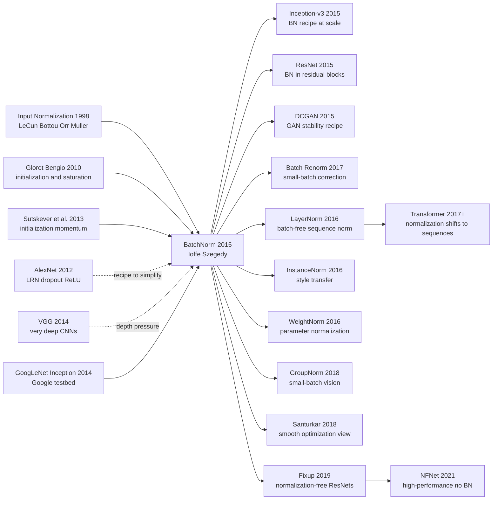

# BatchNorm — Turning Training Stability into a Layer

> **On February 11, 2015, Sergey Ioffe and Christian Szegedy at Google uploaded [arXiv 1502.03167](https://arxiv.org/abs/1502.03167); a few months later it appeared at ICML 2015.** The paper did not introduce a new convolutional block, a deeper architecture, or a flashier objective. It took one of the oldest pieces of neural-network hygiene — subtract the mean, divide by the standard deviation — and moved it inside every layer, making the operation differentiable and trainable. The result was startlingly practical: an Inception-style ImageNet model reached the same accuracy in 14x fewer training steps, and a BN ensemble reported 4.82% top-5 test error. Later work would chip away at the paper's original "internal covariate shift" story, but the lasting invention is harder to dismiss: BatchNorm turned training stability from optimizer folklore into a reusable layer.

## TL;DR

Ioffe and Szegedy's 2015 ICML paper made a moving target inside deep networks into a differentiable layer: normalize each mini-batch activation with $\hat{x}_i=(x_i-\mu_B)/\sqrt{\sigma_B^2+\epsilon}$, then restore representational freedom through $y_i=\gamma\hat{x}_i+\beta$. BatchNorm did not replace one narrow baseline; it replaced the brittle 2012-2014 training ritual of tiny learning rates, careful initialization, AlexNet-style LRN, heavy dropout, and fear of saturated sigmoid units. On an Inception-style ImageNet model the paper reported the same accuracy in 14x fewer training steps, and an ensemble of BN models reached 4.82% top-5 test error. Within months, [ResNet (2015)](2015_resnet.md) placed BN in almost every residual block, and DCGAN adopted it as part of the recipe that made adversarial training usable.

The hidden lesson is that the paper's most famous explanation aged worse than the layer itself. "Reducing internal covariate shift" became the headline, but later work by Santurkar and collaborators argued that BN's real gift is smoother optimization and more predictable gradients. That correction does not shrink BatchNorm's historical role. It shows why the paper mattered even more: it turned training stability from a collection of optimizer superstitions into a composable architectural primitive.

---

## Historical Context

### In 2014, deep nets feared distribution drift more than expressivity

By 2014, neural networks no longer lacked evidence that bigger models could work. AlexNet had proved large convolutional networks could win ImageNet; VGG showed that stacking many 3x3 convolutions improved accuracy; GoogLeNet / Inception showed that multi-branch modules could keep computation under control while increasing capacity. The urgent engineering question was no longer merely "is the network expressive enough?" It was "can we train it to completion without it falling apart?"

Training a deep CNN still felt like nursing a temperamental machine. Initialization had to be chosen carefully, learning rates had to stay conservative, saturated activations could kill gradients, and every update to an earlier layer changed the distribution seen by later layers. The paper named this phenomenon **internal covariate shift**: each layer was chasing a moving input distribution, forcing the optimizer to take smaller and more cautious steps.

That explanation would later be challenged, but in 2015 it captured a pain every deep-learning practitioner recognized: **the deeper the network, the harder it became to manually manage statistical coupling across layers**. BatchNorm's historical importance is not that it discovered normalization mattered. It made internal statistical stabilization a default insertable, differentiable, deployable layer.

### Input normalization was common sense; hidden-layer normalization was not

Since the Efficient BackProp era, LeCun, Bottou, Orr, and Muller had emphasized that inputs should be centered, scaled, and well conditioned for gradient descent. In vision pipelines, subtracting means, dividing by standard deviations, and sometimes PCA whitening were routine preprocessing steps. But these steps usually happened **before the first layer**.

Hidden layers were harder. A hidden activation distribution is not a fixed dataset statistic; it is a function of every preceding parameter. One SGD update can make yesterday's statistics stale. Full whitening would require covariance estimation and matrix decompositions, too expensive and awkward to place inside large CNN training loops.

BatchNorm's key reframing was: do not treat normalization as data preprocessing; treat it as part of the model. Estimate statistics on the current mini-batch, keep the normalization operator inside the computation graph, and backpropagate through the mean and variance. That engineering move made an old idea scalable.

### Google / Inception supplied the engineering pressure

BatchNorm did not grow out of a toy setting. Its immediate battlefield was Google's Inception / GoogLeNet line: multi-branch convolutions, 1x1 bottlenecks, and deep sparse modular structure designed to save computation while growing depth. Szegedy, Liu, Jia, and 6 co-authors had pushed the "deeper but cheaper" route to ImageNet-winning territory in 2014; the next bottleneck was training speed and stability.

The paper's experiments feel industrial for that reason. The goal was not simply to show "normalization helps" on a small benchmark, but to make a state-of-the-art ImageNet system train faster, score higher, and care less about initialization and learning-rate fragility. Names like BN-x5, BN-x30, and BN-x5-Sigmoid are ablations, but they are also engineering questions: if training stability is no longer the limiting factor, can we raise the learning rate, bring back sigmoid units, remove dropout, and compress the training schedule by an order of magnitude?

That is why BatchNorm spread so quickly. It was not a new model that required a new framework. It was a layer. You could insert it into existing CNNs, Inception modules, later ResNets, GANs, and detection models, and immediately gain a wider learning-rate window.

### What the two authors were doing

Sergey Ioffe's Google research background spanned statistical learning, computer vision, and large-scale systems; Christian Szegedy was one of the central authors behind Inception / GoogLeNet. The pairing is telling: one author approached the problem through optimization and statistical stability, while the other had Google's strongest vision production model as a stress test.

The paper's style also feels very "Google 2015": the theoretical story is direct, the algorithm is compact, and the experiments emphasize training speed and ImageNet error. It does not sell itself as a new architecture. It repeatedly pushes a simple observation: if every layer sees better-behaved input statistics, the optimizer can move farther, faster, and with less fear of initialization.

We now know BN's success cannot be fully explained by internal covariate shift. But that does not shrink its 2015 position. It gave the deep-learning community a simple, reusable stabilizer that helped turn the 2015-2016 deep-CNN boom from a set of expert-only recipes into something ordinary labs could reproduce.

## Background and Motivation

### Internal covariate shift was the paper's entry point

The paper defines internal covariate shift as the change in a layer's input distribution caused by changes in previous-layer parameters during training. The phrase borrows from external covariate shift, then moves the idea inside the network. Intuitively, if each layer must continually adapt to a changing upstream distribution, training slows down; if each layer input is repeatedly pulled back to a normalized scale, optimization should become easier.

That framing did two useful things. First, it made "deep nets are hard to train" into a problem about drifting statistics, which suggested a modular intervention. Second, it explained why initialization alone was insufficient: initialization controls step 0, whereas BN recalibrates activation scale at every step.

From today's perspective, ICS is better read as a useful engineering narrative than as a complete causal account. But in 2015 it was concrete, actionable, and close to the pain practitioners were feeling.

### The three training pains BatchNorm targeted

BatchNorm's target can be compressed into three training pains.

First, **learning rates were too conservative**. Without BN, a slightly aggressive learning rate could blow up or saturate some layers. With BN, layer inputs are re-centered and re-scaled, allowing the network to tolerate larger steps.

Second, **initialization was too sensitive**. Glorot initialization and He initialization both try to keep signal variance reasonable across depth. BN does not replace initialization, but it dramatically expands the range of initializations that train at all.

Third, **regularization and stability were entangled**. Dropout was nearly default in the AlexNet/VGG era, but it added noise and slowed training. BN's mini-batch statistics inject their own noise, and the paper reports settings where dropout can be reduced or removed. That partly decoupled training speed from generalization pressure.

### Why making normalization a layer mattered more than offline whitening

The easiest way to underestimate BatchNorm is to summarize it as "standardize every layer." The real design point is that normalization becomes part of the computation graph: it has parameters, separate training/inference statistics, and a channel-wise form that fits convolutional networks.

Offline whitening cannot track a changing model. Full covariance whitening is too expensive. Normalization without learnable affine parameters would restrict what the layer can represent. BatchNorm addresses all three: mini-batch statistics provide immediacy, $\gamma,\beta$ restore representational freedom, and running means / variances make inference deployable.

That is the dividing line between BN and many good ideas that never became default layers. BN did not merely explain why deep networks were difficult to train. It gave engineers an answer they could write in one line of code, justify in a paper, and ship in production.

---

## Method Deep Dive

### Overall framework

BatchNorm's framework can be summarized in one sentence: insert a differentiable standardization operator between a layer's linear transform and its nonlinearity, subtracting the mini-batch mean, dividing by the mini-batch standard deviation, then multiplying by a learnable scale $\gamma$ and adding a learnable bias $\beta$. If the original layer is $u = Wx + b$, the paper recommends applying BN to $u$ before the nonlinearity $g(\cdot)$: $z = g(\text{BN}(u))$.

That sounds like ordinary preprocessing, but three details make it different. First, the statistics are not precomputed over a fixed dataset; they are estimated on the current mini-batch. Second, the mean and variance stay inside the computation graph, so gradients flow through them. Third, training and inference use different statistical logic: batch statistics during training, population running means and variances during inference.

BatchNorm's elegance is that it moves "the optimizer needs better conditioning" from the optimizer side into the architecture. Adam, momentum, and learning-rate schedules still matter, but BN first pulls each layer's scale back into a manageable range, making larger learning rates, deeper networks, and less manual tuning feasible.

### Key design 1: Mini-batch standardization — estimate each activation scale from the current batch

#### Function

For each scalar activation dimension, BN computes a mean and variance over the mini-batch and pulls that dimension toward zero mean and unit variance. It addresses the problem where upstream parameter updates keep shifting the scale seen by downstream layers.

#### Formula

Given one activation dimension over a mini-batch $B=\{x_1,\dots,x_m\}$, BatchNorm computes batch statistics and normalizes:

$$
\mu_B = \frac{1}{m}\sum_{i=1}^{m} x_i, \qquad
\sigma_B^2 = \frac{1}{m}\sum_{i=1}^{m}(x_i-\mu_B)^2, \qquad
\hat{x}_i = \frac{x_i-\mu_B}{\sqrt{\sigma_B^2+\epsilon}}
$$

The $\epsilon$ term is numerical protection against division by a near-zero variance.

#### Code

```python
def batch_standardize(x, eps=1e-5):
    # x: [batch, features]
    mean = x.mean(dim=0, keepdim=True)
    var = x.var(dim=0, unbiased=False, keepdim=True)
    x_hat = (x - mean) / torch.sqrt(var + eps)
    return x_hat, mean, var
```

#### Comparison Table

| Method | Statistic source | Compute cost | Training meaning |
|--------|------------------|--------------|------------------|
| Input standardization | Full training-set input | Low | Stabilizes only layer 1 |
| Full covariance whitening | Batch or dataset covariance matrix | High | Strong in theory, hard to scale |
| BatchNorm | Per-dimension mini-batch mean/variance | Low | Stabilizes every layer input |

#### Design Rationale

The paper does not pursue full whitening; it standardizes each dimension independently. That is an engineering trade-off with excellent taste: full whitening handles correlations but requires matrix decompositions; BN controls first- and second-order scale cheaply enough to insert into every layer. It gives up some statistical completeness in exchange for a speed profile that actually works in large CNN training.

### Key design 2: Learnable affine restoration — return representational freedom through $\gamma,\beta$

#### Function

If activations were only forced into standardized form, the network could lose distributions with useful nonzero means or particular variances. BatchNorm adds learnable parameters $\gamma$ and $\beta$ after standardization, letting the model decide whether to keep the normalized scale or recover another one.

#### Formula

The normalized output is not passed forward directly; it receives a per-dimension affine transform:

$$
y_i = \gamma \hat{x}_i + \beta, \qquad
\text{BN}_{\gamma,\beta}(x_i) = \gamma \frac{x_i-\mu_B}{\sqrt{\sigma_B^2+\epsilon}} + \beta
$$

Setting $\gamma=\sqrt{\sigma_B^2+\epsilon}$ and $\beta=\mu_B$ can locally recover the identity transform; in practice $\gamma,\beta$ learn the scale and center the task needs.

#### Code

```python
class BatchNorm1D(nn.Module):
    def __init__(self, features):
        super().__init__()
        self.gamma = nn.Parameter(torch.ones(features))
        self.beta = nn.Parameter(torch.zeros(features))

    def forward(self, x):
        x_hat, mean, var = batch_standardize(x)
        return self.gamma * x_hat + self.beta
```

#### Comparison Table

| Version | Stabilizes scale? | Keeps representation freedom? | Failure mode |
|---------|-------------------|-------------------------------|--------------|
| Standardization only | Yes | No | May suppress useful mean/variance |
| Bias only | Partly | Partly | Variance remains fixed |
| BN + $\gamma,\beta$ | Yes | Yes | Depends on batch statistics |

#### Design Rationale

$\gamma,\beta$ are the easy-to-miss heart of BN. Without them, normalization is a hard constraint; with them, normalization gives the optimizer a good coordinate system while the model can still learn the distribution it wants. That is why BN can be inserted safely into many architectures: it stabilizes by default without forcing every layer to remain zero-mean and unit-variance forever.

### Key design 3: Differentiable statistics and inference statistics — batch during training, population estimate during deployment

#### Function

BN is not `stop_gradient` preprocessing. Mean, variance, standardization, and affine transformation all live inside the computation graph, so training gradients account for coupling among samples in the same batch. At inference, however, the model cannot depend on the current batch, so it uses running means and variances accumulated during training.

#### Formula

The training-time backward pass can be written compactly, with $g_i=\partial \ell / \partial y_i$:

$$
\frac{\partial \ell}{\partial x_i}
= \frac{\gamma}{m\sqrt{\sigma_B^2+\epsilon}}
\left(m g_i - \sum_{j=1}^{m} g_j - \hat{x}_i\sum_{j=1}^{m} g_j\hat{x}_j\right), \qquad
y_i^{\text{test}} = \gamma \frac{x_i-\mathbb{E}[x]}{\sqrt{\text{Var}[x]+\epsilon}} + \beta
$$

The first half shows that gradients are not per-sample independent; they are affected by batch mean and variance terms. The second half shows how inference replaces batch statistics with population estimates.

#### Code

```python
class RunningBatchNorm1D(nn.Module):
    def __init__(self, features, momentum=0.1, eps=1e-5):
        super().__init__()
        self.gamma = nn.Parameter(torch.ones(features))
        self.beta = nn.Parameter(torch.zeros(features))
        self.register_buffer("running_mean", torch.zeros(features))
        self.register_buffer("running_var", torch.ones(features))
        self.momentum = momentum
        self.eps = eps

    def forward(self, x):
        if self.training:
            mean = x.mean(dim=0)
            var = x.var(dim=0, unbiased=False)
            self.running_mean.lerp_(mean.detach(), self.momentum)
            self.running_var.lerp_(var.detach(), self.momentum)
        else:
            mean, var = self.running_mean, self.running_var
        x_hat = (x - mean) / torch.sqrt(var + self.eps)
        return self.gamma * x_hat + self.beta
```

#### Comparison Table

| Phase | Statistics used | Advantage | Risk |
|-------|-----------------|-----------|------|
| Training | Current mini-batch | Adaptive, noisy regularization | Unstable with tiny batches |
| Inference | Running mean / variance | Deployable for one sample | Train/test statistic mismatch |
| Batch Renorm | Batch + correction terms | Helps small-batch settings | Adds hyperparameters |

#### Design Rationale

The training/inference split is BN's most delicate detail. During training, batch statistics provide both optimization stability and regularizing noise; during inference, relying on the current batch would make single-sample predictions unstable and let online batch composition affect outputs. Running statistics are the bridge that lets BN move from paper experiments into production systems.

### Key design 4: Convolutional channel sharing and training recipe — make BN fit real CNNs

#### Function

In convolutional layers, each channel's feature map shares semantics and parameters across spatial locations. BN therefore does not learn separate $\gamma,\beta$ values for every pixel location; it estimates statistics jointly over batch and spatial dimensions for each channel. This keeps the parameter count tiny while matching CNN translation sharing.

#### Formula

For convolutional activations with shape $N\times C\times H\times W$, channel $c$ uses:

$$
\mu_c = \frac{1}{NHW}\sum_{n,h,w} x_{n,c,h,w}, \qquad
\sigma_c^2 = \frac{1}{NHW}\sum_{n,h,w}(x_{n,c,h,w}-\mu_c)^2, \qquad
y_{n,c,h,w} = \gamma_c \frac{x_{n,c,h,w}-\mu_c}{\sqrt{\sigma_c^2+\epsilon}} + \beta_c
$$

This is the basic form of modern `BatchNorm2d`.

#### Code

```python
def conv_batch_norm(x, gamma, beta, eps=1e-5):
    # x: [N, C, H, W], gamma/beta: [C]
    mean = x.mean(dim=(0, 2, 3), keepdim=True)
    var = x.var(dim=(0, 2, 3), unbiased=False, keepdim=True)
    x_hat = (x - mean) / torch.sqrt(var + eps)
    return gamma.view(1, -1, 1, 1) * x_hat + beta.view(1, -1, 1, 1)
```

#### Comparison Table

| CNN normalization form | Parameter sharing granularity | Best fit | Cost |
|------------------------|-------------------------------|----------|------|
| Per-position BN | Channel + position | Finest in theory | Many parameters, weakens translation sharing |
| Channel BN (this paper) | Shared per channel | Default classification CNNs | Depends on batch/spatial statistics |
| GroupNorm | Channel group | Small-batch detection/segmentation | Loses batch regularization noise |

#### Design Rationale

If BN only worked for MLPs, it would not have changed deep-learning history. The paper's real landing zone was convolutional networks such as Inception, so channel sharing was the critical engineering step. It increases the number of samples for each channel statistic from $N$ to $NHW$, making mean and variance estimates more stable; meanwhile $\gamma_c,\beta_c$ are learned per channel, preserving the convolutional assumption of spatial sharing. ResNet, DenseNet, DCGAN, and detection models inherited this form almost wholesale.

---

## Failed Baselines

### Baseline 1: Unnormalized Inception — accuracy was reachable, but training was slow

BatchNorm's first opponent was not a weak model; it was Google's own Inception / GoogLeNet-style network. That baseline was already a strong ImageNet system, but its training remained conservative: learning rates could not be too aggressive, initialization and schedules mattered, and reaching target accuracy required many steps.

BN attacks this baseline precisely. The claim is not "the original model cannot converge"; it is "the original model converges too slowly and depends too much on training recipes." On an Inception-style architecture, the paper reports that the BatchNorm version reaches the same accuracy with 14x fewer training steps. That is a victory in training economics: with the same hardware budget, researchers iterate faster.

### Baseline 2: Plain networks with much higher learning rates — speed first, stability collapses first

A natural question is: if BN-x5 works by using a larger learning rate, why not just raise the learning rate in the plain network? The paper's answer is no. Without normalization, high learning rates more easily produce exploding activation scales, gradient oscillation, and unstable loss curves.

BN's advantage is not the scalar hyperparameter "large learning rate" by itself; it is making larger steps tolerable. By pulling layer input scales back into a stable range, BN reduces the chance that an aggressive upstream update pushes downstream layers into saturation or numerical instability. BN is not merely the gas pedal; it is the suspension and braking system. Without it, pressing harder just loses control.

### Baseline 3: Sigmoid deep nets — the old saturated-nonlinearity problem reappears

After AlexNet, ReLU became the default partly because sigmoid/tanh units saturate: when inputs grow in magnitude, derivatives approach zero and deep gradients weaken quickly. The BatchNorm paper deliberately tests BN-x5-Sigmoid, showing that once each layer input is re-centered and re-scaled, sigmoid networks become trainable again.

That does not mean sigmoid became the best choice again. It shows that BN addresses a lower-level scale problem. Without BN, sigmoid failure is often blamed on the nonlinearity itself; with BN, the same nonlinearity suddenly trains, revealing that a large part of the failure came from input-distribution drift and uncontrolled scale.

### Baseline 4: Dropout / LRN / hand-built stabilizers — useful, but not a cure

The AlexNet-era recipe used Dropout for regularization, LRN for local response normalization, and careful initialization plus schedules to keep training from exploding. The combination worked, but it was complex, slow, and experience-heavy.

BatchNorm does not claim regularization is irrelevant. It observes that batch-statistics noise has a regularizing effect, and in some settings dropout can be reduced or removed. LRN later almost disappeared from the mainstream, and Dropout became much less default in CNN backbones than it was in 2012. BN internalized training stabilization as a network layer.

| Baseline | Failure point | What BN changed |
|----------|---------------|-----------------|
| Plain Inception | Converges but needs many steps | Same accuracy in 14x fewer steps |
| High-LR plain network | Oscillates or diverges easily | Allows more aggressive learning rates |
| Sigmoid deep network | Saturated activations, weak gradients | Re-centered scale makes it trainable |
| Dropout / LRN recipe | Stability depends on manual combination | Stabilization becomes a layer |

## Key Experimental Data

### ImageNet training speed: the 14x step gap is the paper's central number

The paper's most memorable number is not the final top-5 error; it is training speed. The BatchNorm version reaches the original Inception accuracy in roughly one fourteenth of the training steps. That number explains why BN became a default layer so quickly. It was not merely squeezing out a little final accuracy; it changed the research iteration cycle.

The speedup comes from several effects stacked together: higher learning rates, less initialization sensitivity, more stable gradient scales, and in some cases less dropout. Each item looks like ordinary engineering optimization alone; together they changed the default route for training deep networks.

### ImageNet final accuracy: 4.82% top-5 test error put BN on the main stage

The paper reports that an ensemble of batch-normalized networks reaches 4.82% top-5 test error on ImageNet, improving over the best published result at the time. The point is not just that the score is higher; it is that BN works at state-of-the-art scale.

That matters. Many training tricks help on MNIST or CIFAR but become fragile at ImageNet scale. BatchNorm proved itself under Google's large-model pressure test first, then diffused outward into smaller models and open-source frameworks.

### Ablations: BN changes speed, learning-rate range, and regularization demand

Variants such as BN-x5, BN-x30, and BN-x5-Sigmoid show that the paper is not just comparing "with BN" and "without BN." It tests whether BN permits larger learning rates, supports saturated nonlinearities, reduces dropout, and preserves generalization inside Inception.

This experimental framing mattered later because it decomposed BN's effect into multiple dimensions of training dynamics rather than a single accuracy number. Researchers began treating normalization layers as optimization infrastructure, not just regularizers.

| Result item | Paper report | Why it matters |
|-------------|--------------|----------------|
| Steps to same accuracy | About 14x fewer | Directly shortens experiment cycles |
| ImageNet ensemble | 4.82% top-5 test error | Shows BN works at SOTA scale |
| Larger learning rates | BN-x5 / BN-x30 train | Widens usable LR window |
| Sigmoid variant | BN-x5-Sigmoid works | Scale control mitigates saturation |
| Dropout demand | Can reduce/remove in some settings | BN noise has regularizing effect |

| Experimental lesson | Meaning in 2015 | Later impact |
|---------------------|-----------------|--------------|
| Speed mattered more than final score | Training cost controlled research tempo | BN became default |
| Normalization changed optimization geometry | Not merely anti-overfitting | Santurkar 2018 reframed the mechanism |
| Batch noise cuts both ways | Regularization plus uncertainty | Small-batch alternatives emerged |
| ImageNet proved scalability | Not a toy trick | ResNet / Inception-v3 adopted it fast |

---

## Idea Lineage



### Past lives (what forced BatchNorm out)

- **Input Normalization / Efficient BackProp**: The LeCun lineage had long known that centering and scaling inputs improves conditioning. BatchNorm's ancestry is not "inventing normalization"; it is internalizing the preprocessing instinct into every hidden layer.
- **Glorot & Bengio 2010**: This work connected deep-network difficulty to saturation and variance propagation. BN inherits that problem statement, but instead of fixing the scale once at initialization, it recalibrates during every training step.
- **Sutskever, Martens, Dahl, Hinton 2013**: The paper emphasizes how decisive initialization and momentum are for deep training. BN's arrival effectively says: optimizer tricks matter, but internal activation scale should also be modeled by the network.
- **AlexNet / VGG / Inception**: These CNNs made "deeper and larger" the central direction, and they dragged training instability to the center. AlexNet leaned on LRN and dropout, VGG needed careful training, and Inception needed statistical stability inside complex modules. BN was born under the pressure of that depth trajectory.

### Descendants

- **Inception-v3**: Szegedy's line quickly folded BN into the next Inception training recipe. BN stopped being a paper trick and became default infrastructure for Google's vision models.
- **ResNet**: ResNet uses BN in almost every residual block. Skip connections give gradients a highway; BN keeps branch scales from drifting. Together they opened the door to 100+ layer CNNs.
- **DCGAN**: Original GAN training was notoriously unstable. DCGAN combined BN, convolutions, Adam, and LeakyReLU into a reproducible recipe. BN spread from discriminative models into generative modeling.
- **LayerNorm / InstanceNorm / GroupNorm**: These successors all answer the same side effect of BN: batch statistics help, but batch-size dependence hurts. Sequence models moved toward LayerNorm, style transfer toward InstanceNorm, and small-batch detection/segmentation toward GroupNorm.
- **Batch Renorm / SyncBatchNorm**: These are repairs to BN's original setting. When per-device batches are tiny or multi-device statistics disagree, the gap between batch and population statistics needs correction.
- **Fixup / NFNet**: These works show BN is not logically necessary, but they also reveal how expensive it is to replace. Without BN, one needs more careful initialization, activation scaling, gradient clipping, and regularization.

### Misreadings / oversimplifications

- **"BN mainly works by reducing internal covariate shift"**: This is the most popular and most revisable claim. Work by Santurkar and collaborators shows BN does not necessarily stabilize activation distributions; its more robust effect is to smooth the loss landscape and make gradients more predictable under parameter changes.
- **"BN is a side-effect-free default layer"**: This is approximately true for large-batch image classification, but not for small-batch detection, RNNs, reinforcement learning, online learning, or distribution shift. BN couples samples through batch statistics and can create train/inference statistic mismatch.
- **"With BN, initialization no longer matters"**: BN widens the trainable region, but it is not immunity. Bad initialization, excessive learning rates, or wrong running-stat momentum can still ruin training.
- **"All normalization methods are just BN variants"**: LayerNorm, GroupNorm, RMSNorm, and others inherit the spirit of scale control, but they use different statistical axes, noise properties, and application regimes. The normalization history of the Transformer era has shifted from batch statistics toward token/feature statistics.

---

## Modern Perspective

### Assumptions that did not hold up

1. **"BN mainly works by reducing internal covariate shift"** — this explanation has weakened. Santurkar, Tsipras, Ilyas, and Madry's 2018 analysis shows that BN does not always make layer input distributions more stable; sometimes activations keep moving while training still improves. The more reliable account is that BN smooths the loss landscape and makes gradients more stable under parameter perturbations, letting the optimizer take larger steps.
2. **"Batch statistics are always reliable enough"** — this holds fairly well for large-batch ImageNet classification, but often breaks in detection, segmentation, video, medical imaging, reinforcement learning, and online learning. Tiny batches, skewed class composition, and unsynchronized multi-device statistics can turn BN's estimation noise into the wrong signal.
3. **"BN can fully replace regularization"** — BN does inject useful noise, but it is not a universal replacement for Dropout, weight decay, or data augmentation. Modern CNNs often combine BN with weight decay, label smoothing, mixup/cutmix, and stochastic depth.
4. **"Normalization placement is an implementation detail"** — the history of ResNet v1/v2, pre-activation blocks, and Transformer pre-norm/post-norm shows that normalization placement directly affects gradient flow, depth scalability, and training stability.

### What proved essential vs. redundant

- **Essential: packaging statistical stability as a layer**. This is BN's largest legacy. It turned "are layer scales healthy?" from external tuning into a default internal mechanism.
- **Essential: the reversibility idea behind $\gamma,\beta$**. Normalization should not remove expressive power; it should improve the coordinate system. LayerNorm, GroupNorm, RMSNorm, and related methods inherit this principle.
- **Essential: separating training and inference statistics**. Running means and variances make BN deployable, while forcing later work to take train-test statistic mismatch seriously.
- **Redundant: the single-cause internal-covariate-shift story**. It was historically useful, but it cannot explain all of BN's benefits.
- **Redundant: treating BN as the default answer for every architecture**. The Transformer line chose LayerNorm/RMSNorm, small-batch vision often chooses GroupNorm, and normalization-free networks show BN is not the only path.

### Side effects the authors could not have anticipated

1. **BN became invisible infrastructure for the ResNet era**. Many remember skip connections and forget that 100+ layer CNN trainability also depended on BN. Without BN, ResNet's engineering barrier would have been much higher.
2. **BN changed framework APIs**. TensorFlow, Caffe, and PyTorch all had to handle training/eval modes, running statistics, momentum, and SyncBatchNorm carefully. "The model has a training state and an inference state" became a core deep-learning framework concept.
3. **BN introduced sample coupling**. One sample's output is affected by other samples in the same batch. In ordinary classification training this can regularize; in privacy, robustness, online inference, adversarial settings, and distribution shift it can become a liability.
4. **BN created the normalization family**. LayerNorm, InstanceNorm, GroupNorm, RMSNorm, ScaleNorm, Batch Renorm, and EvoNorm can all be read as different answers to BN's strengths and weaknesses.
5. **BN made optimization explanations more important**. Its success forced researchers to ask why deep nets train at all: distribution stability, conditioning, Lipschitz constants, gradient smoothness, or noise regularization? That question remains alive.

## Limitations and Future Directions

### Limitations acknowledged by the authors

- **Mini-batch dependence**: when batches are too small, mean and variance estimates become noisy and training quality drops.
- **Different training and inference statistics**: training uses batch statistics, inference uses population estimates, and mismatch can reduce accuracy.
- **RNN / sequence models are not direct fits**: time dimensions, variable-length sequences, and recurrent state make batch statistics less natural than in CNNs.
- **Extra memory and computation**: BN is cheap, but it still stores activations, statistics, and running buffers.

### Additional limitations from a 2026 view

- **Small-batch tasks are unfriendly**: detection, segmentation, and medical imaging often fit only 1-4 images per GPU, making BN statistics unreliable unless frozen, synchronized, or replaced by GroupNorm.
- **Running stats become brittle under distribution shift**: if deployment statistics differ from training statistics, BN can fail more sharply than an unnormalized model.
- **Generative models can leak batch information**: in some GAN or diffusion settings, batch statistics introduce unwanted sample correlations.
- **Large-scale distributed training pays synchronization cost**: SyncBatchNorm improves statistic quality but adds cross-device communication.
- **Explanation and implementation failures blur together**: many practical bugs come from forgetting `eval()`, setting running momentum badly, or freezing BN inconsistently, not from the theory itself.

### Improvement directions validated by later work

- **LayerNorm / RMSNorm**: avoid batch dependence in Transformers and LLMs by normalizing across token/features.
- **GroupNorm**: replaces BN in small-batch vision tasks, especially detection and segmentation.
- **Batch Renorm**: uses correction terms to reduce mismatch between batch statistics and population statistics.
- **SyncBatchNorm**: aggregates statistics across devices so many small per-device batches behave like one global batch.
- **Normalization-free networks**: Fixup, NFNet, and related lines prove deep networks can train without BN, but require more elaborate initialization, activation scaling, and regularization.
- **Pre-activation / pre-norm design**: normalization placement became a core architecture-stability variable, not a default post-processing choice.

## Related Work and Insights

### Relationship to neighboring lines

- **vs Dropout**: Dropout regularizes by randomly masking units; BN regularizes indirectly through batch-statistics noise and scale stabilization. Both inject noise, but BN is primarily an optimization tool, while Dropout is primarily a regularizer.
- **vs LayerNorm**: LayerNorm is batch-free and fits sequence models and LLMs; BN exploits batch/spatial statistics and fits large-batch CNNs. The difference is not which is newer, but which statistical axis matches the task.
- **vs GroupNorm**: GroupNorm directly answers BN's small-batch problem. It gives up batch noise in exchange for batch-size independence.
- **vs WeightNorm**: WeightNorm normalizes parameters rather than activations, avoiding batch dependence but lacking BN's strong activation-scale recalibration and batch regularization.
- **vs Fixup / NFNet**: These works show deep nets can train without BN, but their complexity highlights BN's engineering value: simple, cheap, and usually effective by default.
- **Insight for modern research**: do not only ask whether a trick improves accuracy; ask which part of training dynamics it changes: gradient scale, loss smoothness, regularization noise, distribution statistics, or deployment consistency.

## Resources

- Paper: [arXiv 1502.03167](https://arxiv.org/abs/1502.03167)
- Official paper page: [Batch Normalization: Accelerating Deep Network Training by Reducing Internal Covariate Shift](https://arxiv.org/abs/1502.03167)
- Essential follow-ups: [Layer Normalization](https://arxiv.org/abs/1607.06450), [Batch Renormalization](https://arxiv.org/abs/1702.03275), [Group Normalization](https://arxiv.org/abs/1803.08494), [How Does Batch Normalization Help Optimization?](https://arxiv.org/abs/1805.11604), [NFNet](https://arxiv.org/abs/2102.06171)
- Related deep notes: [ResNet](2015_resnet.md), [GAN](2014_gan.md), [AlexNet](2012_alexnet.md), [Dropout](2012_dropout.md)
- Practical entry points: PyTorch `torch.nn.BatchNorm1d/2d/3d`, TensorFlow `tf.keras.layers.BatchNormalization`
- Cross-language: Chinese version → [`/era2_deep_renaissance/2015_batchnorm/`](/era2_deep_renaissance/2015_batchnorm/)


---

> 🌐 [中文版](/era2_deep_renaissance/2015_batchnorm/) · 📚 awesome-papers project · CC-BY-NC