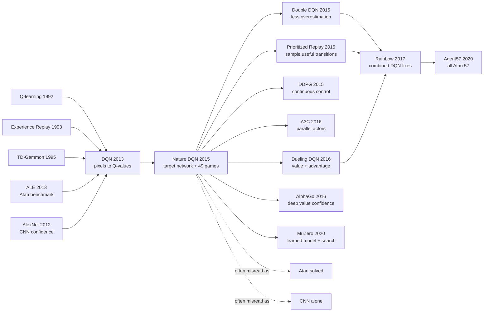

# Nature DQN - The Atari Moment That Made Deep Reinforcement Learning Public

> **On February 26, 2015, Volodymyr Mnih, Koray Kavukcuoglu, David Silver, and 16 co-authors at Google DeepMind published [Human-level control through deep reinforcement learning](https://doi.org/10.1038/nature14236) in *Nature*.** This was not merely the 2013 workshop DQN with more pages. It was the public proof that a single recipe, convolutional Q-learning plus replay memory plus a target network, could face 49 Atari games from pixels and scores alone, beat previous RL methods on 43 of them, and reach at least 75% human-normalized performance on 29. It made “human-level Atari” the calling card of deep reinforcement learning, while leaving the zero on Montezuma's Revenge as a clean warning label for the next decade.

## TL;DR

Nature DQN, published in *Nature* in 2015 by Volodymyr Mnih, Koray Kavukcuoglu, David Silver, Andrei Rusu, Joel Veness, and 14 co-authors at Google DeepMind, turned the [2013 workshop DQN](2013_dqn.md) from a seven-game feasibility result into deep reinforcement learning's public benchmark system. The input is an $84\times84\times4$ stack of Atari frames after flicker removal, grayscale conversion, and resizing; the network predicts all action values $Q(s,a;\theta)$ in one forward pass; the Bellman target is $y=r+\gamma\max_{a'}\hat Q(s',a';\theta^-)$; and stability comes from a million-frame replay memory plus a periodically copied target network. The baselines it displaced were not one weak model, but the early ALE ecosystem of Best Linear Learner, Contingency SARSA, Neural Fitted Q-style approaches, and hand-engineered visual features. Across 49 games DQN beat previous RL methods on 43, reached more than 75% human-normalized score on 29, scored 401.2 on Breakout against a human score of 31.8, and reached 1707.9% human-normalized performance on Boxing. The hidden lesson lives in the failures too: Montezuma's Revenge remained at 0 and Private Eye at 2.5%, so the paper proved scalable deep value learning, not solved exploration, long-horizon planning, or general intelligence. The inheritance line runs through Double DQN, Prioritized Replay, Rainbow, [AlphaGo](2016_alphago.md), and MuZero.

---

## Historical Context

### Why reinforcement learning needed a public win in 2015

Reinforcement learning in February 2015 occupied an odd position. The theory already had a mature vocabulary from Sutton, Barto, Watkins, Dayan, Tesauro, and others: value functions, TD error, off-policy control, exploration, and function approximation. The biological analogy was also seductive: dopamine prediction error looked a lot like temporal-difference learning. But the engineering reality was colder. Once the state became high-dimensional, the reward became sparse, and the function approximator became nonlinear, agents could diverge, oscillate, or settle into useless behavior.

Deep learning was in the opposite mood. [AlexNet](2012_alexnet.md) had shown in 2012 that CNNs could learn strong visual representations from raw pixels, and the deep renaissance was spreading through speech and image recognition. Yet supervised learning success did not automatically transfer to RL. A supervised dataset is fixed and its labels come from outside the model. In RL, the policy generates the next data distribution, and the target often comes from the value function itself. A small Q-value overestimate can alter tomorrow's training data; tomorrow's data can amplify the same overestimate. The RL community later called the combination of function approximation, bootstrapping, and off-policy learning the deadly triad. DQN is exactly the paper that put a CNN inside that triangle.

The historical role of Nature DQN, then, was not merely “better Atari scores.” It supplied a public, memorable, and large-enough counterexample: across 49 visual games, a deep network could learn action values from pixels and scores alone, without hand-written objects, RAM state, or rules, and it would not immediately collapse.

### From workshop DQN to Nature DQN

This Nature paper should be read separately from the 2013 arXiv / NeurIPS Deep Learning Workshop paper, [Playing Atari with Deep Reinforcement Learning](2013_dqn.md). The 2013 version was the first strike: seven games, two convolutional layers, a replay buffer, and a proof that “CNN plus Q-learning plus Atari pixels” was not impossible. The Nature version was the public trial: 49 games, three convolutional layers, a larger network, an explicit target network, shared hyperparameters, a professional human tester, 30 evaluation episodes, and human-normalized scores.

The difference is not just “more games.” The 2013 implementation already used experience replay, but its target was still very close to the current Q-network; stability came mostly from replay, RMSProp, reward clipping, and careful engineering. The Nature paper makes the target network part of the algorithm: every $C$ steps, the online Q-network is copied into $\hat Q$, and for a while this older network computes the Bellman target. This delay slows the feedback loop in which raising $Q(s,a)$ also raises tomorrow's target. That delay is what lets the system survive 50M frames and 49 games.

Nature DQN also changed the paper's social position. The workshop paper could be read as an early signal from DeepMind's internal research line. The Nature paper was read by media, investors, other AI labs, and the wider scientific community. The title “human-level control” was sharp and easily overread, but it undeniably moved deep RL from a specialist conversation into the center of the deep-learning renaissance.

### Immediate predecessors that forced Nature DQN into shape

| Predecessor | What it supplied | How Nature DQN used it | Remaining pressure |
|-------------|------------------|------------------------|--------------------|
| Watkins & Dayan 1992 Q-learning | off-policy Bellman control | approximate $Q(s,a)$ with a CNN | nonlinear approximation can diverge |
| Lin 1993 experience replay | store and reuse past transitions | million-frame replay memory | uniform sampling ignores importance |
| TD-Gammon 1995 | neural value functions can win hard games | psychological precedent for deep value functions | backgammon is much more structured than Atari |
| ALE 2013 | unified Atari benchmark and baselines | 49-game public evaluation stage | scores are sensitive to protocol details |
| 2013 workshop DQN | feasibility of pixel-to-Q learning | scale up and add target network | long-horizon exploration remains weak |
| Neural Fitted Q | stable batch Q-learning route | contrast with efficient online replay SGD | retraining de novo is too expensive |

The most underrated line in that genealogy is ALE. Without the Arcade Learning Environment, DQN could have been “a Breakout demo.” With ALE, it could say that the same algorithm, architecture, and hyperparameters faced many different games. The benchmark is not decoration here; it is the mechanism that turns a trick into a candidate paradigm.

The other predecessor is failure itself. Tsitsiklis and Van Roy had already shown why TD learning with function approximation could diverge. Bellemare, Veness, and Bowling's Contingency / SARSA systems showed that hand-engineered features were not used merely because researchers were conservative; raw pixels really were hard. Nature DQN's boldness lies in not converting RL into a clean supervised problem first. It instead uses replay, target networks, reward clipping, error clipping, and frame stacking to hold a fragile system together.

### What DeepMind was doing at the time

DeepMind in 2015 had been acquired by Google only about a year earlier and still felt like a mixture of startup, cognitive-science lab, and neural-network group. The author list is long, but not ceremonial. Volodymyr Mnih brought a Toronto / Hinton-line deep-learning background; Koray Kavukcuoglu brought CNN and visual-representation expertise; David Silver was central to RL and game search; Marc Bellemare came directly from the ALE ecosystem; Martin Riedmiller represented the Neural Fitted Q lineage; and Alex Graves, Daan Wierstra, Shane Legg, and Demis Hassabis embodied DeepMind's larger “neural networks toward general intelligence” ambition.

Nature DQN also foreshadows DeepMind's paper style. It is not just an algorithm report; it places the algorithm inside a larger question: can an agent learn many control skills from sensory input with minimal prior knowledge? AlphaGo, AlphaZero, and MuZero later follow the same narrative pattern: choose a game world with clear rules and strong evaluation, compress perception, value, policy, search, or model learning into a system, then argue for generality through the same-system-across-tasks framing.

The boundary matters. Nature DQN is not multi-task learning. The paper trains a separate network for each Atari game; what is shared is the architecture and hyperparameter recipe. It also does not learn game rules, perform explicit planning, or transfer weights to new games. The “general” claim is recipe-level generality, not cross-game generalization by one set of parameters.

### Compute, data, and evaluation protocol

The paper starts from Atari 2600 frames: $210\times160$ pixels, 128 colors, 60 Hz. The network consumes a preprocessed $84\times84\times4$ stack. One detail is very Atari-specific: to remove sprite flicker, the authors take the pixelwise maximum over the current frame and previous frame, then extract luminance and resize to 84 by 84. Four stacked frames provide short-term velocity information; frame skip $k=4$ makes the agent choose an action every four frames and repeat it in between.

The training cost was already substantial for the time: 50M frames per game, about 38 days of game experience; a replay memory of the most recent 1M frames; minibatches of 32; RMSProp; $\epsilon$ linearly annealed from 1.0 to 0.1 over the first 1M frames and held at 0.1 thereafter. Evaluation used $\epsilon=0.05$, 30 episodes per game, up to five minutes each, with no-op starts to create different initial conditions. These protocol details may look fussy today, but they are what make “human-level” more than a cherry-picked video.

The human-normalized score is also central: $100\times(\text{DQN}-\text{random})/(\text{human}-\text{random})$. It makes raw scores comparable across games, but it creates side effects. If the human and random scores are close, normalization can explode; if the game's score scale is odd, the percentage can become theatrical. Boxing at 1707.9% and Video Pinball at 2539.4% are eye-catching, but the scientific story must be read alongside Montezuma's Revenge at 0.0%, Private Eye at 2.5%, and Seaquest at 25.9%.

## Background and Motivation

### The problem was not “play Breakout,” but define a general interface

Nature DQN's motivation can be compressed into an interface question: given a recent stack of images $\phi(s)$, can a neural network directly output long-term values $Q(\phi(s),a)$ for every discrete action and use those values to drive behavior? This interface bypassed two older routes. One route engineered vision first: background subtraction, color channels, object positions, contingency awareness, and then a linear learner. The other route sought stability through fitted Q iteration, retraining over accumulated data, which did not scale naturally to large video streams.

DQN chose the riskier interface: no explicit model, no next-frame prediction, no RAM state, no object detector, and no game-specific visual features. State stack in, action values out, policy by $\epsilon$-greedy. That interface became the standard grammar of value-based deep RL for discrete actions, and it also explains the limits: continuous actions cannot be enumerated, long-horizon exploration cannot be solved by $\epsilon$-greedy alone, and hidden state cannot always be reduced to four frames.

### Why the target network was necessary

The Q-learning formula looks simple: push $Q(s,a)$ toward $r+\gamma\max_{a'}Q(s',a')$. In a neural-network implementation, however, the prediction and the target come from the same function class, often from the same live parameters. A gradient step that raises $Q(s,a)$ can also raise all the next-state action values $Q(s',a')$, so the target itself moves upward. This moving-target problem is rare in supervised learning and routine in deep RL.

The target network separates teacher and student for a short time. The online network $Q(\cdot;\theta)$ updates every step, while the target network $\hat Q(\cdot;\theta^-)$ is copied from it only every $C$ steps. During those $C$ steps, the student chases a relatively fixed target rather than its own shadow. The device gives no convergence theorem, but it greatly reduces oscillation and positive feedback. It is the crucial engineering reinforcement that distinguishes the Nature system from the 2013 prototype.

### What “human-level” really meant

“Human-level control” is the paper's communication core. Strictly, the paper does not claim that DQN beats humans on every game. It operationalizes “broadly comparable” as reaching at least 75% of a professional human games tester's score. By that definition DQN clears the threshold on 29 of 49 games. It also clearly fails on Montezuma's Revenge, Private Eye, Frostbite, Asteroids, Bowling, and several others.

That title needs cooling in hindsight, but its scientific weight in 2015 should not be dismissed just because it became marketable. Before DQN, RL was often associated with low-dimensional control, grid worlds, small games, or hand-engineered feature pipelines. Nature DQN placed one recipe across 49 visually diverse games and produced enough successes and enough clean failures. The successes made deep value learning worth pursuing; the failures defined the next decade's agenda: exploration, memory, planning, sample efficiency, and robust evaluation.

---

## Method Deep Dive

### Overall framework

Nature DQN's pipeline can be stated in one sentence: **compress the last four Atari frames into a state $\phi(s)$, use a three-layer convolutional network to output Q-values for all legal actions in one forward pass, then sample transitions randomly from replay memory and compute Bellman targets with a target network frozen for a while.** It is model-free, off-policy, and value-based. It does not learn an environment model, perform explicit rollouts, or predict the next frame.

The network input is $84\times84\times4$ and the output dimension is the number of legal actions in the current game, between 4 and 18. A separate network is trained for each game, but the architecture and hyperparameters are shared. That “same recipe across games” constraint is central to the paper's scientific story: if each game received its own architecture, Nature DQN would be 49 engineering systems; the shared recipe makes it look like one general algorithm.

| Component | Nature DQN setting | Problem addressed | Hidden cost |
|-----------|--------------------|-------------------|-------------|
| Preprocessing $\phi$ | max over two frames, Y channel, $84\times84$, 4-frame stack | remove flicker, reduce dimension, recover velocity | loses color and detail |
| Q-network | 3 conv + 512 FC + action outputs | map pixels to action values | natural only for small discrete actions |
| Replay memory | latest 1M frames, uniform minibatch 32 | decorrelate and reuse experience | ignores rare important samples |
| Target network | copy online network every $C$ steps | reduce target drift | target is still delayed and biased |
| Reward / error clipping | rewards to $[-1,1]$, clipped TD error | normalize scale and stabilize gradients | changes raw task preferences |

The central loss is:

$$
L_i(\theta_i)=\mathbb{E}_{(s,a,r,s')\sim U(D)}\left[\left(y_i-Q(s,a;\theta_i)\right)^2\right]
$$

with target:

$$
y_i=\begin{cases}
r, & \text{if terminal} \\
r+\gamma\max_{a'}\hat Q(s',a';\theta_i^-), & \text{otherwise}
\end{cases}
$$

These two equations contain both the danger and the beauty of DQN: the label is not given by a dataset, but generated temporarily by an older network and the environment reward. The optimization resembles supervised learning, while the data and target are both pulled around by the agent itself.

### Design 1: All-action Q-network — one forward pass gives the whole action row

**Function**: parameterize the history-action value function as “state in, actions as output dimensions,” rather than feeding state and action together and running the network once per action.

The Nature architecture is stronger than the 2013 workshop version. The 2013 network used 16 filters of $8\times8$ stride 4, 32 filters of $4\times4$ stride 2, and 256 hidden units. The Nature version uses 32 / 64 / 64 convolutional layers followed by 512 hidden units. This change is plain, but important for the 49-game setting: more capacity and a larger visual hierarchy are needed for more complex scenes and strategies.

| Layer | Kernel / stride | Channels or units | Role |
|-------|-----------------|-------------------|------|
| input | $84\times84\times4$ | 4 stacked frames | short-term history state |
| conv1 | $8\times8$, stride 4 | 32 | coarse spatial features and motion cues |
| conv2 | $4\times4$, stride 2 | 64 | mid-level objects and local dynamics |
| conv3 | $3\times3$, stride 1 | 64 | finer local combinations |
| fc | fully connected | 512 | fuse global game state |
| output | linear | 4-18 actions | one $Q$ value per action |

```python
class NatureDQN(nn.Module):
    def __init__(self, num_actions):
        super().__init__()
        self.encoder = nn.Sequential(
            nn.Conv2d(4, 32, kernel_size=8, stride=4), nn.ReLU(),
            nn.Conv2d(32, 64, kernel_size=4, stride=2), nn.ReLU(),
            nn.Conv2d(64, 64, kernel_size=3, stride=1), nn.ReLU(),
            nn.Flatten(),
            nn.Linear(64 * 7 * 7, 512), nn.ReLU(),
        )
        self.head = nn.Linear(512, num_actions)

    def forward(self, stacked_frames):
        return self.head(self.encoder(stacked_frames))
```

The computational advantage is direct. If a game has 18 actions and the action is an input, greedy action selection needs 18 forward passes. DQN gets all $Q(s,a)$ values in one pass. Atari has a small action space, so the design is natural. Precisely because the action space is small, the idea does not transfer directly to continuous control; DDPG, TD3, and SAC later need actor-critic machinery for non-enumerable actions.

### Design 2: Experience replay — flatten online interaction into a trainable data stream

**Function**: store recent agent transitions in replay memory and sample random minibatches for updates instead of training on consecutive frames.

Consecutive Atari frames are highly correlated, and the current policy determines the next training distribution. If the agent has recently learned to go left, the training set becomes dominated by left-side situations; if the next value update flips the preference to the right, the distribution suddenly shifts. Online SGD can easily create feedback loops. Replay memory turns many recent behavior policies into a time-averaged buffer.

$$
D_t=\{e_1,\ldots,e_t\},\quad e_t=(s_t,a_t,r_t,s_{t+1}),\quad (s,a,r,s')\sim U(D_t)
$$

| Without replay | With replay | Immediate benefit | Side effect |
|----------------|-------------|-------------------|-------------|
| consecutive samples are correlated | minibatches sampled randomly | lower gradient variance | not truly i.i.d. |
| each sample used once | transitions can be reused | better data efficiency | large memory cost |
| current policy dominates data | old policies are mixed | smoother distribution drift | old experience can become stale |
| online TD can oscillate | off-policy Q-learning updates | less catastrophic feedback | more off-policy bias |

The Nature paper itself notes the limitation of uniform replay: it does not distinguish important transitions, its finite capacity overwrites old experience, and every stored sample is equally likely to be drawn. That limitation becomes Prioritized Experience Replay almost immediately afterward. In other words, Nature DQN did not only introduce a module; it introduced a data structure worth optimizing.

### Design 3: Target network — add a temporal buffer to the Bellman target

**Function**: generate targets with a periodically copied older network $\hat Q$, so the prediction and target are not pulled by the same update at the same instant.

Deep online Q-learning suffers from a “chasing its own shadow” problem. When updating $Q(s,a;\theta)$, the target includes $\max_{a'}Q(s',a';\theta)$. If the same live parameters control both sides, increasing the current estimate can also increase the next-state target. Nature DQN temporarily separates them with $\theta^-$: the online network receives gradient updates every step, while the target network is synchronized only periodically.

```python
def dqn_loss(q_net, target_net, batch, gamma):
    states, actions, rewards, next_states, dones = batch
    q_values = q_net(states)
    q_sa = q_values.gather(1, actions[:, None]).squeeze(1)

    with torch.no_grad():
        next_q = target_net(next_states).max(dim=1).values
        targets = rewards + gamma * next_q * (~dones)

    td_error = targets - q_sa
    clipped_error = td_error.clamp(-1.0, 1.0)
    return -(clipped_error.detach() * q_sa).mean()
```

The pseudocode uses a clipped TD-error view to express the Nature system's stabilization logic; an implementation might write this as a Huber-style loss or clipped-error update. The crucial point is not the exact code line but the source of the target: $\hat Q$ is old, not the current network.

| Target computation | Does target move immediately with current update? | Stability | Role in DQN lineage |
|--------------------|---------------------------------------------------|-----------|---------------------|
| Online Q-learning | yes | easiest to oscillate | replaced by Nature DQN |
| 2013 DQN prototype | weak delay or older-parameter approximation | workable but fragile | workshop first strike |
| Nature target network | copied only every $C$ steps | much steadier | main 49-game system |
| Double DQN | decouples action selection and evaluation | further reduces overestimation | later repair |

The counter-intuitive point is that stale information improves learning. In supervised learning we usually want labels to be as fresh and accurate as possible. In DQN, labels that are too fresh run away with the student. The old target is a temporary scaffold: imperfect, but stable enough to climb.

### Design 4: Reward clipping, error clipping, and Atari preprocessing — trade fine semantics for cross-game robustness

**Function**: compress Atari's score scales, pixel artifacts, action frequency, and gradient magnitude into one recipe.

Reward clipping is one of Nature DQN's most controversial and effective engineering choices. Atari score scales differ wildly. Some games award 1 point, others thousands. If the agent regresses raw rewards directly, TD-error scale changes by game, and learning rates or clipping thresholds need game-specific tuning. DQN clips every positive reward to +1, every negative reward to -1, and leaves zero unchanged during training.

$$
\tilde r=\operatorname{clip}(r,-1,1),\quad \epsilon_t:1.0\rightarrow0.1\ \text{over first }10^6\text{ frames}
$$

| Engineering knob | Paper setting | Problem addressed | Cost |
|------------------|---------------|-------------------|------|
| Reward clipping | positives to +1, negatives to -1 | normalize TD target scale | loses reward magnitude |
| Error clipping | TD error clipped to $[-1,1]$ | avoids gradient spikes | large errors become linear |
| Frame max | pixelwise max over current and previous frame | removes Atari sprite flicker | adds hand-coded visual prior |
| Frame skip | $k=4$ | speeds training and lowers decision frequency | can miss short events |
| No-op starts | random wait at evaluation start | reduces fixed-start exploits | environment is still not fully randomized |

These choices have a strong 2015 engineering flavor: not elegant, but effective enough to keep one system from falling apart across 49 games. Nature DQN is not trying to squeeze the best leaderboard score out of every game; it is trying to prove a reusable recipe. For that goal, sacrificing fine reward semantics to normalize optimization scale was a reasonable trade.

### Training loop and implementation logic

The Nature DQN training loop fits on a page, but every step addresses a deep-RL instability source: correlated samples, moving targets, insufficient exploration, messy reward scale, pixel artifacts, and gradient spikes. A simplified loop is:

```python
for frame in range(total_frames):
    epsilon = exploration_schedule(frame)
    action = select_epsilon_greedy(q_net, state, epsilon)
    next_state, raw_reward, done = env.step(action, repeat=4)
    reward = clip(raw_reward, -1.0, 1.0)
    replay.add(state, action, reward, next_state, done)
    state = reset_if_done(next_state, done)

    if replay.ready() and frame % update_frequency == 0:
        batch = replay.sample(batch_size=32)
        loss = dqn_loss(q_net, target_net, batch, gamma=0.99)
        optimizer.zero_grad()
        loss.backward()
        optimizer.step()

    if frame % target_update_period == 0:
        target_net.load_state_dict(q_net.state_dict())
```

This loop captures the real contribution of Nature DQN. It is not a single formula; it is a set of mutually reinforcing stabilization choices. The CNN extracts control-relevant features from pixels; the Bellman target turns reward into action value; replay makes the data stream trainable; the target network slows label drift; reward and error clipping control scale; and a unified evaluation protocol makes the result comparable. None of the modules is magical alone. Their combination is the 2015 breakthrough.

---

## Failed Baselines

### The opponents Nature DQN defeated

Nature DQN's baselines were not toy straw men. They represented the main plausible routes in early Atari RL. Best Linear Learner used hand-engineered visual features with linear function approximation. Contingency SARSA tried to identify screen regions controlled by the agent. Neural Fitted Q-style approaches sought batch stability. The 2013 workshop DQN had shown CNN plus replay was feasible, but had not yet reached this scale or stability. Nature DQN put these routes into one 49-game comparison.

| Baseline | Core idea | Why it was reasonable then | Where it lost to DQN |
|----------|-----------|----------------------------|----------------------|
| Best Linear Learner | hand-crafted visual features + linear value learner | stable, interpretable, cheap | cannot learn rich representations from raw pixels |
| Contingency SARSA | find action-controllable screen regions, then learn | uses Atari visual priors | too dependent on game-specific priors |
| Neural Fitted Q | batch retrain Q-network over accumulated data | avoids online TD oscillation | de novo retraining is too expensive |
| 2013 DQN | seven-game CNN + replay prototype | first pass through the pixel barrier | fragile target and small evaluation |
| Human tester | controlled professional player benchmark | anchor for human-normalized score | beaten by DQN in some reactive games |

What DQN really displaced was the engineering common sense that one should first simplify perception by hand, then let RL handle a low-dimensional state. It did not prove hand-engineered features were useless. It proved the stronger point: if the training system is stable enough, the reward signal itself can push convolutional features toward control-relevant representations.

### The hard failures exposed by the paper itself

The most valuable failures are in Extended Data Table 2. DQN is dazzling on Breakout, Boxing, and Video Pinball, but it struggles badly in games requiring long-horizon exploration, memory, sparse rewards, or complex task structure. The main text explicitly names Montezuma's Revenge: games demanding temporally extended planning remain a major challenge for all existing agents, including DQN.

| Game | DQN score | Human score | human-normalized | Exposed problem |
|------|-----------|-------------|------------------|-----------------|
| Montezuma's Revenge | 0.0 | 4367 | 0.0% | sparse reward, keys, doors, rooms, long exploration |
| Private Eye | 1788 | 69571 | 2.5% | long-term task structure and weak memory |
| Frostbite | 328.3 | 4335 | 6.2% | multi-stage goals and sparse feedback |
| Asteroids | 1629 | 13157 | 7.3% | complex dynamics and long survival |
| Seaquest | 5286 | 20182 | 25.9% | coordinating oxygen, divers, enemies, and shooting |

These failures keep Nature DQN from becoming mythology. It proves that replay plus target networks can stabilize deep value learning, but it also shows the limits of a 4-frame state, $\epsilon$-greedy exploration, scalar Q-values, and clipped rewards when a game requires planning or rare-event discovery.

### The ablation failures: remove one stabilizer and the system sags

The supplementary experiments do something important: they disable replay memory, the separate target Q-network, and the deep convolutional architecture to see how the system degrades. That is more convincing than the 49-game score table alone, because it shows DQN is not “CNNs naturally win.” It is a set of stabilizing parts working together.

| Disabled component | Expected consequence | Why it breaks | Later repair |
|--------------------|----------------------|---------------|--------------|
| Replay memory | lower score or unstable training | consecutive samples correlated and distribution feedback strong | prioritized / distributed replay |
| Target network | higher oscillation and divergence risk | target moves with current network | Double DQN, soft target update |
| Convolutional encoder | weaker visual representation | linear layers struggle to extract control features from pixels | deeper CNNs, ResNet, attention encoder |
| Reward / error clipping | hard to unify gradient scale | different games have different score scales | value rescaling, distributional RL |

The lesson is simple: deep RL success often does not come from a beautiful formula, but from five or six unattractive but necessary brakes. Nature DQN put those brakes into one reusable system.

### The most ironic counter-baseline: human-level did not mean solved Atari

“Human-level” made the paper travel, and it also created later misreadings. Under the paper's definition, reaching 75% of the professional human score counts as broadly comparable. That is not the same as beating humans on all 49 games. DQN clears the 75% threshold on 29 games and falls below it on 20. On several exploration-heavy games it is close to random.

That contrast is one of the paper's most important scientific messages. DQN is good at mapping visual states to short- and medium-horizon action values, especially in games with frequent rewards, fast reactions, and strategies that can be shaped gradually by local value gradients. It is weak at “do a sequence of unrewarded actions now for a payoff much later.” Montezuma's Revenge at zero is as important as Breakout at 1327.2%, because it tells later researchers: deep value learning has entered Atari, but exploration has not been solved.

## Key Experimental Data

### The core result from the 49-game table

Nature DQN's main result can be compressed into three claims: 49 games, one algorithm and hyperparameter setting; DQN beats previous RL methods on 43 games; DQN reaches more than 75% human-normalized score on 29 games. Extended Data Table 2 matters because it lists random play, Best Linear Learner, Contingency SARSA, human, DQN, and normalized DQN together, letting the reader see the shape of both success and failure.

| Game | Random | Best Linear | Contingency SARSA | Human | DQN | DQN % Human |
|------|--------|-------------|-------------------|-------|-----|-------------|
| Breakout | 1.7 | 5.2 | 6.1 | 31.8 | 401.2 | 1327.2% |
| Boxing | 0.1 | 44.0 | 9.8 | 4.3 | 71.8 | 1707.9% |
| Video Pinball | 16257 | 16871 | 19761 | 17298 | 42684 | 2539.4% |
| Beam Rider | 363.9 | 929.4 | 1743 | 5775 | 6846 | 119.8% |
| Space Invaders | 148 | 250.1 | 267.9 | 1652 | 1976 | 121.5% |
| Q*bert | 163.9 | 613.5 | 960.3 | 13455 | 10596 | 78.5% |
| Seaquest | 68.4 | 664.8 | 675.5 | 20182 | 5286 | 25.9% |
| Frostbite | 65.2 | 216.9 | 180.9 | 4335 | 328.3 | 6.2% |
| Private Eye | 24.9 | 684.3 | 86.0 | 69571 | 1788 | 2.5% |
| Montezuma's Revenge | 0.0 | 10.7 | 259 | 4367 | 0.0 | 0.0% |

This reduced table is already enough to show DQN's dual nature. In some games it is not merely “near human” but far above the human-normalized score. In others it has no cross-task abstract planning ability at all. The split between strong reactive policies and long-horizon exploration is illuminated here at scale for the first time.

### Why 43/49 and 29/49 both matter

43/49 answers an algorithm-history question: did DQN beat the previous Atari RL methods? Mostly yes. The defeated methods were often hand-featured, linear, contingency-aware, or shallower, so the number supports the claim that end-to-end deep value learning deserves to become the new baseline.

29/49 answers the agent-narrative question: did DQN reach human-comparable performance? Partly. The 75% threshold is arbitrary, but it gives the paper a visible gate and prevents a story built only from cherry-picked games. The key point is that the two numbers are different. Beating older RL baselines is easier than approaching human performance; approaching human performance also does not mean the policy has human abstraction, memory, or exploration.

### Representation visualization and value-function evidence

The paper does not only report scores. It visualizes the learned representation. In Space Invaders, t-SNE of the final hidden layer places perceptually similar states near one another, but also places visually different states together when their expected rewards are close. This is not a mechanistic proof, but it supports the central claim: the CNN representation is not merely compressing images, it is organizing states by value relevance.

The Breakout and Seaquest value visualizations are also very much of their era. The authors show average predicted Q-values rising during training and local value changes around key events: in Breakout, value rises when the ball is about to clear bricks and drops when the agent loses the ball; in Seaquest, enemies, torpedoes, oxygen, and scoring events affect value estimates. These figures may look modest today, but in 2015 they answered a live question: is the network memorizing visual patterns, or is it learning state organization related to future reward?

### What the experiments prove, and what they do not

The positive conclusion is strong: one deep Q-learning recipe can train stably across dozens of high-dimensional visual control tasks; convolutional features can be shaped end-to-end by reward; replay and target networks are infrastructure for deep RL; Atari can become a shared language for algorithm comparison.

The negative conclusions are just as important. First, Nature DQN does not solve sample efficiency: 50M frames is a huge amount of interaction. Second, it does not solve exploration: Montezuma's Revenge remains at zero. Third, it does not solve generalization: each game has its own trained network. Fourth, it does not solve planning: the future is folded implicitly through bootstrapped values. Fifth, human-normalized score is not cognitive equivalence: DQN can beat humans in reactive games and still look helpless in games requiring memory and task structure.

The Nature DQN experiment is therefore best read as a powerful opening proof, not an ending. It moves the field from “can deep networks be used in RL at all?” to “how do we make replay smarter, targets less biased, exploration more effective, evaluation fairer, and models more sample-efficient?” That is the shared starting point for the next decade of deep RL.

---

## Idea Lineage



### Before it: what forced the paper into existence

Nature DQN has five ancestors. The first is **Q-learning**: Watkins and Dayan gave the off-policy Bellman optimality equation, so the behavior policy could explore while the learning target still pointed toward a greedy policy. The second is **experience replay**: Lin proposed storing and reusing past experience in robot RL, and DQN turned that idea into infrastructure for stabilizing deep networks. The third is **TD-Gammon**: Tesauro showed that a neural value function could produce startling play in a complex game, giving later deep value functions a historical precedent.

The fourth is **ALE**. This line is especially important because it gave DQN a reproducible, comparable, diverse, and affordable world. ImageNet gave CNNs a shared battlefield; ALE did something similar for deep RL in Atari. The fifth is **post-AlexNet CNN confidence**: if convolutional networks could learn visual hierarchies from raw ImageNet pixels, perhaps reward could force them to learn implicit objects such as paddles, balls, enemies, oxygen, and bullets for control.

The 2013 workshop DQN is where these lines first meet. The 2015 Nature DQN is the institutionalized version of that meeting. By adding target networks, a 49-game protocol, human-normalized scoring, and extended ablations, it turned “pixels to Q-values” from a feasible demo into a field baseline.

### After it: successors

Nature DQN's descendants fall into four groups. The first is **stability repair**: Double DQN fixes Q-value overestimation, Prioritized Replay fixes uniform sampling, Dueling Networks split value and advantage, Distributional RL predicts more than an expectation, and Rainbow combines several fixes into a stronger Atari agent.

The second is **action-space expansion**: DDPG, TD3, and SAC borrow replay and target networks, but replace discrete action argmax with actor-critic machinery. The third is **parallel and distributed scaling**: A3C shows that replay is not the only stabilization route if many actors run asynchronously; Ape-X, R2D2, and Agent57 mix large replay, recurrent state, exploration, and many actors. The fourth is **search and model learning**: AlphaGo carries the confidence in deep value functions into Go, and MuZero reconnects DQN's Atari line with AlphaZero-style search.

| Inheritance route | Representative work | What it inherits from Nature DQN | New problem addressed |
|-------------------|---------------------|----------------------------------|-----------------------|
| Stable value learning | Double DQN / Rainbow | replay, target network, Atari protocol | overestimation, sample priority, value distributions |
| Continuous control | DDPG / TD3 / SAC | target network + replay | non-enumerable actions |
| Distributed RL | Ape-X / R2D2 / Agent57 | large replay + Q-learning | throughput, memory, exploration |
| Asynchronous actors | A3C / IMPALA | learning control from pixels with deep RL | avoiding a single replay bottleneck |
| Search and models | AlphaGo / MuZero | deep value functions can drive decisions | explicit planning and latent dynamics |

Nature DQN's influence on AlphaGo is not that Q-learning was transplanted into Go. AlphaGo's protagonists are policy networks, value networks, and MCTS. But DQN gave DeepMind an organizational belief: deep networks can learn value estimates from high-dimensional states and those estimates can sit at the center of decision-making. In AlphaGo that belief becomes $v_\theta(s)$; in MuZero it becomes latent value, policy, and reward prediction.

### Misreadings and simplifications

The first common misreading is: **Nature DQN = CNN + Q-learning**. That is too short. The system works because CNNs, frame stacking, experience replay, target networks, reward clipping, error clipping, epsilon schedules, no-op starts, and unified evaluation all fit together. If you simply connect a CNN to online Q-learning, oscillation or collapse is a likely outcome.

The second misreading is: **DQN solved Atari**. Nature DQN made Atari the shared benchmark language of deep RL, but it did not solve every Atari task. Montezuma's Revenge, Private Eye, and Frostbite show that sparse reward and long-horizon exploration remained hard. The story of surpassing the human benchmark across all 57 Atari games belongs to much more complex systems such as Agent57.

The third misreading is: **human-normalized score equals intelligence level**. Normalization is useful, but it blends random baselines, human testing protocol, game score scale, and policy robustness. Boxing at 1707.9% is striking, but it does not prove DQN has better abstraction than humans. Montezuma at zero also does not erase DQN's breakthrough in reactive value learning.

The fourth misreading is: **reward clipping is harmless normalization**. It made the 49-game recipe feasible, but it maps +1 and +100 to the same signal and therefore changes the objective. That tradeoff is effective in Atari; in finance, medicine, robotics, or safety-sensitive tasks it could teach the value function the wrong preference. DQN's lasting value is not this exact hyperparameter recipe, but the system paradigm: use reusable experience, slow-moving targets, and deep representations to put perception and control in one trainable loop.

---

## Modern Perspective

### Looking back from 2026: DQN became an infrastructure template for deep RL

From 2026, Nature DQN's raw scores no longer look extraordinary. Rainbow, Ape-X, R2D2, Agent57, MuZero, Dreamer-style agents, EfficientZero, and many model-based, offline, and representation-learning methods can produce stronger Atari results. The three-layer DQN CNN now looks like a teaching model: no residual connections, no recurrence, no distributional value, no intrinsic motivation, no transformer, and no large-scale distributed training.

That does not reduce its importance, because what survived is an infrastructure template: **perception encoder + replay buffer + bootstrapped target + target network + shared benchmark protocol**. That template has been rewritten in continuous control, offline RL, robotics, recommendation, game AI, sim-to-real, and world models. Many modern methods no longer say “DQN,” but they still deal with the problems the paper systematized: how to store experience, how to stabilize targets, how to use off-policy data, how to avoid overconfident values, and how exploration data should cover rare states.

Nature DQN is also one source of deep RL's shared language. When researchers say “replay buffer,” “target network,” “Atari 100k,” “human-normalized score,” “sticky actions,” or “no-op starts,” they are still speaking inside the evaluation and system vocabulary that DQN helped establish.

### Which assumptions no longer hold

| 2015 implicit assumption | Why it was reasonable then | 2026 problem | Modern correction |
|---|---|---|---|
| 4-frame stacks are enough state | many Atari dynamics are locally visible | memory, task phase, and hidden variables often exceed 4 frames | recurrent agents, transformer memory, belief state |
| $\epsilon$-greedy can handle exploration | simple, general, no extra model | sparse-reward games barely leave the start | intrinsic reward, count-based exploration, episodic memory, Go-Explore |
| clipped reward is general normalization | shared learning rate across 49 games | changes preferences and removes reward magnitude | value rescaling, distributional targets, task-aware normalization |
| one recipe across games is generality | hand-feature baselines were strong then | each game is still trained separately | multi-task RL, meta-RL, foundation agents |
| Atari represents general control | cheap, reproducible, visually rich | far from physics, language goals, and safety constraints | robotics, embodied AI, web agents, world models |

These assumptions were not absurd. They were the simplifications needed to push deep RL through the door in 2015. Once the field crossed the threshold, the simplifications became ceilings: four-frame state limits memory, $\epsilon$-greedy limits exploration, clipped reward limits preference fidelity, and per-game training limits generalization.

### What proved essential, and what became replaceable

Three designs endured. First, **replay is data infrastructure**. Prioritized replay, distributed replay, offline RL datasets, and even demonstration buffers in imitation or diffusion-policy systems all treat interaction as a reusable, sampleable, inspectable data asset. Second, **targets must move slowly**. DQN's hard target copy, DDPG/TD3/SAC soft target updates, and slow-moving teachers in bootstrapped world models all address the same moving-target problem. Third, **evaluation protocols shape research agendas**. DQN made Atari deep RL's ImageNet, and Atari's biases shaped algorithmic taste for years.

Many specifics were replaceable. The three-layer CNN is not the core. Uniform replay was quickly replaced or extended by prioritized and distributed replay. Scalar expected Q-values were revised by distributional RL. $\epsilon$-greedy is insufficient for hard exploration. Per-task training no longer satisfies modern generalization expectations. Fifty million frames of interaction is also hard to accept in real robotics or expensive environments.

What should be preserved is the systems view. Nature DQN's contribution is not a theorem, but the arrangement of mutually stabilizing engineering choices into a working loop. Any later deep RL paper that takes systems seriously inherits that craft.

### Side effects the authors probably did not foresee

The first side effect is Atari benchmark dominance. After DQN, many deep RL papers treated Atari score as the default entry ticket. That made algorithms comparable, but it also kept the field over-focused on pixel games, human-normalized score, and single-machine simulators for a while. Sticky actions, random no-ops, human starts, Atari 100k, and other protocol revisions are partly attempts to repair shortcuts introduced by the DQN-era benchmark culture.

The second side effect is that replay buffer became a precursor to dataset-style RL. DQN is still online interaction, but it already pulls experience out of the time stream and places it in a repeatedly sampled data structure. Offline RL, batch RL, preference buffers in RLHF, and robotics demonstration datasets can all be read through that lens.

The third side effect is that deep RL's public language became unusually bold. “Human-level control” helped the field travel, but it also made it easy for outsiders to confuse benchmark performance with general intelligence. That is not solely the authors' fault, but Nature DQN's visibility did move RL into a larger expectation cycle.

The fourth side effect is that exploration research was redefined. DQN's success showed that simple reactive value learning could be very strong. DQN's zero on Montezuma's Revenge showed that sparse-reward exploration was a different problem. Count-based exploration, curiosity, RND, episodic control, Go-Explore, and Agent57 all answer the hole Montezuma left behind.

### If Nature DQN were rewritten today

If I rewrote Nature DQN in 2026, I would not merely replace the CNN with a larger network. The protocol and problem definition would need rewriting. First, sample efficiency, final performance, generalization, exploration, and wall-clock cost should be separated explicitly; one 50M-frame score table is not enough. Second, Atari 100k or another low-data setting should be included, so the paper does not only reward huge interaction budgets. Third, sticky actions, randomized starts, multiple seeds, and careful human-testing protocol should be reported to reduce exploits and normalization accidents.

Methodologically, I would keep the replay plus slow-target skeleton, but use distributional or ensemble value estimates, add intrinsic reward or episodic novelty for exploration, use a modern residual / attention / self-supervised encoder, and include recurrent state for games that need memory. For long-horizon tasks, plain Q-learning likely needs to connect to planning, world models, or hierarchical policies.

Most importantly, I would title the paper more cautiously. A more accurate claim might be: “Scalable visual value learning from pixels across Atari.” That is less magnetic than the Nature title, but more precise. Still, precisely because the original title was magnetic, DQN left such a deep mark on the history of AI.

## Limitations and Future Directions

### Limitations acknowledged or exposed by the paper

The paper itself acknowledges several limitations. Reward clipping prevents the agent from distinguishing rewards of different magnitudes. Uniform replay does not distinguish important transitions. Finite replay memory overwrites older experience. Games requiring temporally extended planning remain a major challenge. Hyperparameters were selected by an informal search over Pong, Breakout, Seaquest, Space Invaders, and Beam Rider, not by systematic grid search.

Other limitations are embedded in the protocol. Each game receives a separate network, so there is no cross-game transfer. Training uses 50M frames, so sample efficiency is poor. Evaluation with five-minute limits and $\epsilon=0.05$ is not the same as full mastery. The life counter is used to mark episode termination during training, meaning the agent is not purely pixels plus score in every implementation detail.

These limitations do not weaken the paper's contribution; they make it more real. Nature DQN's value lies not in being perfect, but in exposing a set of formerly separate problems inside one system.

### New limitations from a 2026 viewpoint

The largest new limitation is generalization. A genuinely general agent should not merely share an algorithmic recipe; it should transfer across games, visual styles, and task instructions. DQN's per-game training cannot meet that expectation.

The second new limitation is data efficiency and real-world cost. Thirty-eight days of game experience is cheap in an emulator and unacceptable in robotics, drug discovery, industrial control, or human interaction. Modern RL's emphasis on offline data, sim-to-real, model learning, and conservative updates exists because online trial-and-error is often too expensive.

The third new limitation is objective expression. Atari has a single score, discrete actions, and low safety cost. Real tasks involve multiple objectives, human preferences, constraints, irreversible mistakes, and language instructions. DQN's scalar clipped reward does not express that structure well.

### Improvement directions confirmed by later work

- **Reduce Q-value bias**: Double DQN, clipped double Q, and ensemble Q all show that max over noisy values systematically overestimates.
- **Make replay smarter**: Prioritized Replay, Ape-X, R2D2, and offline RL datasets turn replay from a uniform buffer into a data system.
- **Improve value representation**: C51, QR-DQN, IQN, and Rainbow show that predicting a return distribution is more informative than predicting only an expectation.
- **Repair exploration**: count-based exploration, RND, Go-Explore, and Agent57 respond directly to Montezuma's Revenge at zero.
- **Add memory and models**: DRQN, world models, Dreamer, MuZero, and EfficientZero show that a four-frame reactive value function is not the endpoint.
- **Rewrite evaluation protocols**: sticky actions, Atari 100k, multiple seeds, human starts, and Procgen all repair blind spots of a single Atari score.

## Related Work and Insights

### Relationship to AlphaGo, Rainbow, MuZero, and Agent57

Nature DQN's relationship to [AlphaGo](2016_alphago.md) is inheritance of belief rather than direct algorithmic inheritance. DQN proves that deep value functions can support decisions from high-dimensional states. AlphaGo places a value network inside MCTS, turning value estimation into a search evaluator. One is model-free Atari, the other model-based search in Go, but the organizational belief is shared.

Rainbow is DQN as a repair bundle: Double DQN, Prioritized Replay, Dueling Networks, Multi-step Returns, Distributional RL, and Noisy Nets are combined to patch nearly every fragile point in the original Nature recipe. It shows that the DQN framework was strong, and also that the original DQN was far from the final Atari recipe.

MuZero is a recombination of the DQN and AlphaZero descendants. Like DQN, it does not require an externally supplied rule model; like AlphaZero, it uses search for policy improvement. The difference is that it learns latent dynamics rather than only $Q(s,a)$. If Nature DQN proves that value can be learned from pixels, MuZero proves that pixels can be turned into a latent interface good enough for planning.

Agent57 is the delayed answer to Nature DQN's failure table. It combines distributed replay, recurrent state, intrinsic motivation, and a meta-controller, eventually surpassing the human benchmark across Atari 57. Its existence shows that the 2015 title was both visionary and premature: human-level Atari required far more machinery than a three-layer CNN plus replay plus target network.

### Resources

- Paper: Volodymyr Mnih, Koray Kavukcuoglu, David Silver, Andrei A. Rusu, Joel Veness, Marc G. Bellemare, Alex Graves, Martin Riedmiller, Andreas K. Fidjeland, Georg Ostrovski, Stig Petersen, Charles Beattie, Amir Sadik, Ioannis Antonoglou, Helen King, Dharshan Kumaran, Daan Wierstra, Shane Legg, Demis Hassabis, [*Human-level control through deep reinforcement learning*](https://doi.org/10.1038/nature14236), *Nature* 518, 529-533, 2015.
- DeepMind DQN page and code: [sites.google.com/a/deepmind.com/dqn](https://sites.google.com/a/deepmind.com/dqn/).
- Suggested reading path: [DQN 2013](2013_dqn.md) for the workshop prototype, [AlexNet](2012_alexnet.md) for CNN-on-pixels confidence, [AlphaGo](2016_alphago.md) for deep value functions inside search, Rainbow for DQN-family repairs, and [MuZero](../era4_foundation_models/2020_muzero.md) for planning without an externally supplied rule model.

The line to carry away is this: Nature DQN did not make the agent truly understand Atari, but it gave RL a system interface the deep-learning era could jointly debug. Replay buffer is memory, target network is a brake, CNN is perception, and Bellman target is self-generated supervision. Once those four pieces clicked together, deep RL became engineering reality rather than aspiration.


---

> 🌐 [中文版](/era2_deep_renaissance/2015_dqn_nature/) · 📚 awesome-papers project · CC-BY-NC