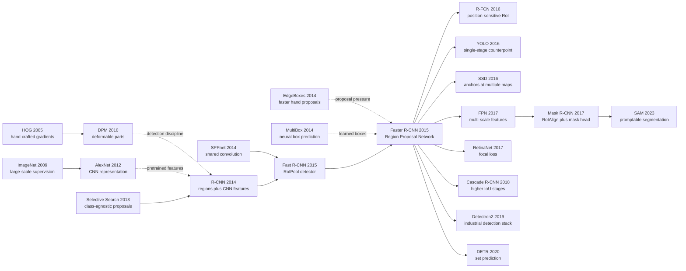

# Faster R-CNN — Learning Region Proposals Inside the Detector

> **June 4, 2015. Shaoqing Ren, Kaiming He, Ross Girshick, and Jian Sun upload [arXiv:1506.01497](https://arxiv.org/abs/1506.01497).** The drama of this NeurIPS 2015 paper is not that it made yet another detector a few points more accurate; it is that it learned away the last big piece of old computer vision still sitting inside the R-CNN pipeline. R-CNN and Fast R-CNN both depended on external proposal generators such as Selective Search: about 2000 candidate boxes per image, produced on the CPU, before the neural detector could even begin its real work. Faster R-CNN turns proposal generation into a Region Proposal Network running on the same convolutional feature map as the detector, asking at every anchor whether an object is present and how the box should move. With roughly 300 proposals, VGG-16 still runs near 5 fps. That is the moment two-stage detection stopped being a slow academic pipeline and became a reusable industrial architecture.

## TL;DR

Ren, He, Girshick, and Sun's 2015 NeurIPS paper Faster R-CNN replaces the external proposal stage in [R-CNN (2014)](2014_rcnn.md) and Fast R-CNN with a trainable **Region Proposal Network**. On the same convolutional feature map used by the detector, it places $k=9$ anchors at each location, predicts objectness $p_i$ and box offsets $t_i$, and optimizes $L = L_cls(p_i,p_i*) + lambda p_i* L_reg(t_i,t_i*)$. The failed baseline it replaces is precise: R-CNN needed roughly 2000 proposals and a CNN pass per region; Fast R-CNN shared the CNN computation but still waited around two CPU seconds for Selective Search. Faster R-CNN keeps only about 300 learned proposals, runs a VGG-16 detector around 5 fps, and reports roughly 73.2 mAP on VOC 2007. Later [ResNet (2015)](2015_resnet.md) made its backbone stronger, [Mask R-CNN (2017)](../era3_attention/2017_mask_rcnn.md) added a mask branch on top of the same skeleton, and FPN made it robust to scale. The counter-intuitive lesson is that Faster R-CNN did not abolish proposals; it made proposals an internal, learnable, almost zero-marginal-cost representation.

---

## Historical Context

### What object detection was stuck on in 2015

Before Faster R-CNN, object detection had just been rebooted by [R-CNN](2014_rcnn.md): the field moved from HOG/DPM hand-crafted parts to region proposals plus CNN features. The shift worked spectacularly, but it left an awkward system fracture. The detector was now a deep network; the proposal stage was still old computer vision. R-CNN first generated roughly 2000 candidate boxes with Selective Search, then warped each box and ran it through a CNN. Fast R-CNN shared convolutional features over the whole image and folded the detection head into one multi-task network, but it still had to wait for Selective Search to produce candidate boxes on the CPU.

So the 2015 detection pipeline had a strange shape: the expensive representation work had moved to GPUs and CNNs, while the first stage that compressed the search space still relied on color, texture, edge, and region-merge heuristics. Fast R-CNN's neural forward pass was already fast; the slowest part of the system became an external module that did not learn, did not backpropagate, and did not improve with the dataset. The phrase real-time in the paper title is not just about speed. It marks the moment detection tried to eliminate this external bottleneck.

The subtle part is that proposals could not simply be deleted. The success of the R-CNN line depended on proposals reducing an enormous dense search problem to a few hundred or a few thousand candidate regions. Returning to sliding windows would revive the compute and class-imbalance problem; keeping Selective Search would leave detection permanently outside a unified learning system. Faster R-CNN attacks exactly that gap: **keep the sparse-search advantage of proposals, but make proposal generation part of the network.**

### The immediate predecessors that pushed Faster R-CNN out

| Predecessor | What it solved | What it left open | How Faster R-CNN inherited it |
|-------------|----------------|-------------------|-------------------------------|
| DPM / HOG | Detection discipline, hard negative mining, NMS | Hand-crafted features capped representation power | Keeps the positive/negative sample and NMS language, replaces the feature engine with CNNs |
| Selective Search | High-recall class-agnostic candidate boxes | Slow CPU module, not learnable, not end-to-end | Hands the proposal role to RPN |
| R-CNN 2014 | Proved ImageNet CNN features could break the PASCAL plateau | One CNN forward per proposal, 13s/image | Inherits the region-based detection vocabulary |
| SPPnet 2014 | Shared convolutional computation and region pooling | Training remained staged, proposals remained external | Supplies the technical basis for shared conv features |
| Fast R-CNN 2015 | RoIPool plus softmax plus bbox regression in one detector | Selective Search remained a two-second bottleneck | Becomes Faster R-CNN's second-stage detector |
| Edge Boxes / MultiBox | Faster or more learned box-generation attempts | Still not a unified shared network with the detector | Shows that proposal generation was ready to be redesigned |

Together these lines clarified the problem. The community already knew that CNN representations worked, that RoI pooling could share computation, and that proposal quality bounded detector quality. What was missing was a module that could generate good proposals quickly from the same feature map as the detector.

### What the author team was doing

The four-author lineup explains the paper's shape. Shaoqing Ren, Kaiming He, and Jian Sun were at MSRA, had just produced SPPnet, and were about to compete across ILSVRC 2015. Ross Girshick was the central author of R-CNN and Fast R-CNN and knew every slow point in the detection pipeline. Faster R-CNN is not an outside patch to the R-CNN line; it is where R-CNN, SPPnet, and Fast R-CNN meet in one system.

That also explains the paper's engineering restraint. The authors did not reframe detection from scratch. They changed the one component that blocked the system: proposal generation. Fast R-CNN's RoIPool, classification head, bbox regression, and NMS mostly remain intact; the novelty is concentrated in RPN. In other words, the design philosophy is: **do not rewrite the detector that already works; move the external proposal stage inside the network.**

This work line quickly connected to ResNet. In 2015 MSRA was developing Faster R-CNN and ResNet at the same time; in ILSVRC 2015 detection and localization, RPN supplied the detection framework while ResNet supplied the stronger backbone. Faster R-CNN is therefore not only a single detection paper. It is a core component in the ImageNet-era engineering stack for visual recognition.

### State of industry, compute, and data

The hardware context made the problem urgent. A single NVIDIA K40 or Titan X could run VGG-16-scale CNNs, but if each image still waited two CPU seconds for Selective Search, the GPU often waited on preprocessing. For self-driving, surveillance, robotics, and mobile vision, a detector could not merely look good on a leaderboard; it had to approach video rate, or at least keep the GPU backbone continuously busy.

The data context was also shifting into multi-benchmark competition. PASCAL VOC remained the interpretable and reproducible battleground; ILSVRC detection expanded to 200 classes; MS COCO began forcing detectors to handle denser scenes, smaller objects, and more difficult scale variation. Proposal quality was no longer just recall. It was speed, scale coverage, foreground/background balance, and downstream box regression all at once.

On the software side, Caffe was still dominant and PyTorch had not yet been released. Faster R-CNN's open-source implementations spread through MATLAB/Caffe and py-faster-rcnn, then shaped later toolkits such as Detectron and MMDetection. One reason it became the default baseline so quickly is that its engineering interface was clean: backbone, RPN, and RoI head could be replaced independently.

## Background and Motivation

### The real contradiction behind the proposal bottleneck

Fast R-CNN had already removed the most obvious waste in R-CNN: the image goes through the CNN once, RoIPool extracts proposal features from a shared feature map, and softmax classification plus bbox regression train together. But end-to-end wall time did not fall proportionally, because Selective Search stayed outside the network. The crucial engineering observation is: **once the detector becomes fast, the proposal generator becomes the main bottleneck.**

This is not a bottleneck that can be fixed merely by optimizing C++. Selective Search rules come from color similarity, texture similarity, and hierarchical region merging. It does not know what the current backbone has learned, nor which shapes, scales, and aspect ratios are useful for the dataset. The stronger the R-CNN family became, the more external proposals looked like a non-learning ceiling.

### RPN's angle of attack

RPN's move is direct: since the convolutional feature map already encodes the whole image spatially and semantically, slide a small network over that map and predict whether objects exist near each location and how the corresponding boxes should move. Proposal generation is no longer preprocessing; it is a fully convolutional branch of the detector.

Two choices make this work. First, RPN and Fast R-CNN share the backbone convolutional features, so proposals cost almost only a small head. Second, RPN does not predict arbitrary continuous boxes from scratch. It places a set of anchors at each location, then classifies and refines those anchors. Anchors discretize box search into a local classification/regression problem that SGD can handle stably.

### The core tension: sparse search and end-to-end learning

Object detection needs sparse search because nearly all locations are background. It also needs end-to-end learning because hand-written search rules become a system ceiling. Faster R-CNN's motivation is to combine these two apparently conflicting requirements: RPN still outputs a small number of proposals, preserving the accuracy of two-stage detection; but those proposals come from the shared feature map and can improve with the backbone and the data.

That is the paper's most counter-intuitive stance. It does not say proposals are unnecessary, as later YOLO-style systems would. It says proposals are too important to leave to hand-crafted algorithms. This is Faster R-CNN's historical position: it is the mature form of two-stage detection, not merely the eve of single-stage detection.

### What the paper needed to prove

The authors effectively needed to prove four things. First, RPN proposals could match or exceed Selective Search in recall. Second, RPN computation was cheap enough not to erase the benefits of shared CNN features. Third, RPN and Fast R-CNN could share features without hurting each other, and ideally help each other. Fourth, with only about 300 learned proposals, detection mAP could exceed systems using roughly 2000 hand-crafted proposals.

Taken together, those are the contribution. Viewed alone, RPN is a proposal network. Viewed as a system, it turns detection from CNN detector plus traditional proposals into shared backbone plus learned proposals plus RoI detector. That interface went on to define modern two-stage detectors.

---

## Method Deep Dive

### Overall framework

Faster R-CNN is the cleanest stable form of a two-stage detector. An image first passes through a shared convolutional backbone, producing a feature map. RPN generates proposals on that feature map. A Fast R-CNN head then applies RoIPool, classification, and bbox regression to each proposal. Compared with R-CNN and Fast R-CNN, the decisive change is only one component: the proposal generator moves from external Selective Search into an internal RPN.

```text
Input image
  ↓
Shared conv backbone, such as ZF or VGG-16
  ↓
Feature map
  ├─ RPN head: anchors → objectness + bbox deltas → proposals
  ↓
RoIPool on shared feature map
  ↓
Fast R-CNN head: class scores + class-specific bbox deltas
  ↓
NMS and final detections
```

| Module | Input | Output | Role |
|--------|-------|--------|------|
| Shared backbone | image | convolutional feature map | Shares the expensive computation between RPN and detector |
| RPN | every feature-map location | anchor objectness and box deltas | Learned proposal generator |
| Proposal layer | RPN scores/deltas | about 300 RoIs | NMS, ranking, invalid-box filtering |
| RoIPool + head | RoIs + shared features | class scores and refined boxes | Fast R-CNN detection head |

The architecture's elegance is its clean division of labor. RPN does not perform final classification; it answers a class-agnostic question: does this region look like an object, and how should the box move? The Fast R-CNN head does not search the entire image; it only classifies and refines the small set of RoIs proposed by RPN. Because both branches share the feature map, RPN costs a small head rather than a second model.

### Key design 1: Region Proposal Network as a fully convolutional proposal head

**Function**: express proposal generation as a small network sliding over the feature map. At each spatial location, RPN sees a local receptive field and predicts objectness plus box regression for several anchors at that location.

$$
A(I) = {(x, y, s, r)}, score_i = P(object | anchor_i), delta_i = f_reg(anchor_i)
$$

Here `(x, y)` is the feature-map location, `s` is anchor scale, and `r` is aspect ratio. The RPN intermediate layer is usually a 3x3 convolution, followed by two sibling 1x1 heads: the classification head outputs `2k` scores and the regression head outputs `4k` offsets. With `k=9`, each location emits 18 object/background logits and 36 regression values.

This makes proposal generation a dense prediction problem, but not a dense detector. RPN predicts class-agnostic objectness at every location, then ranking, NMS, and top-N truncation keep only a small set of proposals. In other words, it uses dense computation to produce sparse candidates, balancing speed and recall.

**Design rationale**: the problem with traditional proposal algorithms was not just speed; they were disconnected from the detector's representation. RPN works directly on the detector's shared feature map, so proposal decisions use the same semantic features as detection. Whether a location looks like an object is no longer decided by color/texture merging rules, but by the visual representation learned by the backbone.

### Key design 2: Anchors discretize continuous box search into a trainable task

**Function**: place multiple scales and aspect ratios of anchors at every feature-map location, so the network only needs to classify and refine candidate boxes rather than regress arbitrary boxes from scratch.

| Anchor setting | Typical value | Objects covered | Why it matters |
|----------------|---------------|-----------------|----------------|
| scale | 128, 256, 512 | small/medium/large objects | Lets one location cover different object sizes |
| aspect ratio | 1:1, 1:2, 2:1 | square, tall, wide objects | Covers people, cars, bottles, and shape variation |
| anchors per location | 9 | 3 scales x 3 ratios | Balances recall and compute |
| output per location | 2k + 4k | objectness + deltas | Runs classification and regression in parallel |

RPN training does not treat all anchors equally. Positives include the highest-IoU anchor for each ground-truth box and anchors with IoU >= 0.7. Negatives are anchors with IoU <= 0.3 against all ground-truth boxes. The gray zone in between is ignored. Each mini-batch samples 256 anchors from one image, with roughly balanced positives and negatives.

$$
t_x = (x - x_a) / w_a, t_y = (y - y_a) / h_a, t_w = log(w / w_a), t_h = log(h / h_a)
$$

This parameterization matters. The network predicts translation and scale changes relative to an anchor, not absolute coordinates. Objects of different sizes therefore map to a more stable regression range, making Smooth L1 easier to optimize.

**Design rationale**: anchors became one of Faster R-CNN's most inherited interfaces. They turn detection from searching arbitrary rectangles in a continuous image plane into classification/regression over a fixed grid and finite templates. The discretization looks earthy, but it is extraordinarily reusable: SSD, RetinaNet, FPN, and Cascade R-CNN all inherited anchor/default-box language.

### Key design 3: Multi-task loss for objectness and bbox regression

**Function**: train RPN on two tasks at once: decide whether an anchor contains an object, and adjust positive anchors toward ground truth.

$$
L({p_i}, {t_i}) = (1 / N_cls) sum_i L_cls(p_i, p_i*) + lambda (1 / N_reg) sum_i p_i* L_reg(t_i, t_i*)
$$

Here `p_i*` is the anchor label, 1 for positive and 0 for negative. `L_cls` is binary log loss, `L_reg` is Smooth L1, and the factor `p_i*` before the regression term means only positive anchors contribute to box regression.

| Sample type | Condition | Classification loss | Regression loss |
|-------------|-----------|---------------------|-----------------|
| Positive anchor | highest IoU or IoU >= 0.7 | object | included |
| Negative anchor | IoU <= 0.3 | background | not included |
| Ignored anchor | 0.3 < IoU < 0.7 | ignored | ignored |

The hidden value of this loss is that proposal quality decomposes into two controllable problems: objectness preserves recall, and bbox regression moves proposals closer to object boundaries. Selective Search can only produce candidate regions; it cannot learn, in one objective, which regions deserve to remain and how boxes should be corrected.

**Design rationale**: RPN's labels are deliberately class-agnostic. It does not ask whether an anchor is dog, car, or chair, only whether it contains an object. This lets RPN share proposal knowledge across classes and remain stable when categories change. Final class discrimination belongs to the second-stage detector.

### Key design 4: Shared convolution and alternating training

**Function**: make RPN and the Fast R-CNN detector share backbone features while keeping training stable. The paper mainly uses four-step alternating training: train RPN, train Fast R-CNN with RPN proposals, re-train RPN initialized from the detector, then fix shared conv layers and fine-tune the Fast R-CNN head.

| Training strategy | Procedure | Benefit | Cost |
|-------------------|-----------|---------|------|
| 4-step alternating | RPN and detector train in turns and share initialization | Stable and credible for paper results | Procedurally complex |
| Approximate joint training | One backprop pass trains RPN plus detector | Fast and later common in implementations | Ignores approximate gradients through proposal coordinates |
| Non-approximate joint training | Fully accounts for proposal-coordinate gradients | Cleaner in theory | Harder to implement in early frameworks |

```python
class FasterRCNN(nn.Module):
    def forward(self, image):
        features = self.backbone(image)
        rpn_logits, rpn_deltas = self.rpn_head(features)
        proposals = proposal_layer(rpn_logits, rpn_deltas, pre_nms_topk=6000, post_nms_topk=300)
        roi_features = roi_pool(features, proposals)
        class_logits, box_deltas = self.roi_head(roi_features)
        return class_logits, box_deltas, rpn_logits, rpn_deltas
```

The core of this pseudocode is not a fancy layer; it is that `features` feeds both RPN and the RoI head. Shared convolution makes proposal generation almost free. Traditional proposals are an extra process before detection; RPN is a lightweight head on top of shared features.

**Design rationale**: if RPN ran a separate backbone, the speed advantage would disappear. If RPN and detector were trained entirely separately, their feature representations would diverge. Shared conv is the system-level key in Faster R-CNN: proposal learning and detection learning converge around the same visual representation.

### Training and inference details

At inference, RPN first produces scores and deltas for many candidate anchors. It clips boxes to image boundaries, removes tiny boxes, sorts by objectness, applies NMS, and keeps the top 300 proposals for the Fast R-CNN head. Training usually keeps more proposals to preserve recall; testing shows 300 are enough.

| Setting | R-CNN / Fast R-CNN era | Faster R-CNN choice | Result |
|---------|------------------------|---------------------|--------|
| Proposal count | around 2000 Selective Search proposals | around 300 RPN proposals | Faster, with mAP improved rather than reduced |
| Proposal time | about 2s/image on CPU | small GPU head with low marginal cost | about 5 fps with VGG-16 |
| Backbone | AlexNet / VGG / ZF | ZF or VGG-16 | Stronger backbone raises mAP |
| Inference structure | proposal and detector split | shared backbone + RPN + RoI head | deployable end-to-end structure |

One easily missed detail is that RPN outputs class-agnostic proposals. It does not generate boxes separately for 20 VOC classes or 80 COCO classes; it generates locations likely to contain objects. This abstraction makes RPN's learning target simpler than final classification and more stable under category expansion.

Ultimately, Faster R-CNN's method contribution is not one formula. It is an interface: `backbone → RPN → RoI head`. The interface is simple enough for later papers to replace any component, yet strong enough to become the default skeleton of industrial detection stacks.

---

## Failed Baselines

### Failed baseline 1: Selective Search was not inaccurate; it was in the wrong system position

Selective Search was not a bad baseline inside R-CNN. In fact, its recall was high enough to support the accuracy jump of R-CNN and Fast R-CNN. The problem was its system position: it ran independently before the detector, shared no CNN features, could not be optimized by detection loss, and could not use the GPU efficiently. Once Fast R-CNN reduced the neural forward pass to a few hundred milliseconds, Selective Search's roughly two CPU seconds became the most visible bottleneck in the pipeline.

| Proposal method | Strength | Failure point | Faster R-CNN's response |
|-----------------|----------|---------------|-------------------------|
| Selective Search | high recall, no training needed | about 2s/image, CPU, external | replaced by RPN |
| EdgeBoxes | faster than Selective Search | still hand-written edge rules | used as an external proposal baseline |
| R-CNN proposals | effective for region-based detection | about 2000 proposals, heavy downstream compute | reduced to about 300 learned proposals |
| Fast R-CNN + SS | detector is end-to-end | proposal stage still not learnable | learns proposals on the shared feature map |
| Dense sliding window | conceptually direct | location/scale/aspect-ratio explosion | sparsified by anchors plus RPN |

The failure is not that hand-crafted methods were useless. It is that hand-crafted methods could not keep pace with a deep detector's system rhythm. Faster R-CNN replaces Selective Search's authority inside the pipeline, not merely its box quality.

### Failed baseline 2: Fast R-CNN fixed the detection head but not the entrance

Fast R-CNN is Faster R-CNN's direct parent. Its RoIPool and multi-task loss were highly successful: the CNN ran once per image, the per-RoI head could be trained jointly, and the separate SVM plus bbox regressor became one network. But the entrance problem became more obvious. If proposals still came from Selective Search, a faster detector could still only wait.

This failure is a useful engineering lesson. System optimization often fixes the most visible slow module first. Fast R-CNN removed per-proposal CNN forwards. After that, the next bottleneck surfaced. Faster R-CNN follows the same peel-the-onion process: it does not overthrow Fast R-CNN, but connects Fast R-CNN's proven detector head to a learnable proposal head.

### Failed baseline 3: Early neural box predictors had not formed a general proposal interface

Before Faster R-CNN, the idea of predicting boxes with neural networks was not absent. OverFeat used a CNN sliding-window detector for localization and detection. MultiBox trained networks to produce object boxes. Other methods tried dense regression or coarse-to-fine search instead of Selective Search. But these attempts did not define the general interface that later two-stage detectors inherited, for three reasons: insufficient sharing with the main detector, weak coupling between proposal objective and downstream RoI classification, and less clear recall/ranking/NMS discipline than the R-CNN line.

RPN succeeded not because it was the first neural proposal module, but because it sat inside the right interface: shared convolutional features, anchors, objectness, bbox regression, top-N proposals, and a RoIPool detector. Together those pieces formed a replaceable, reproducible, extensible system language.

### Failed baseline 4: Faster R-CNN itself kept several compromises

Faster R-CNN is not perfect. The main paper uses four-step alternating training rather than the one-pass joint training common today. The proposal layer still contains non-differentiable or hand-written components such as NMS, top-N truncation, and sampling rules. Anchor scales and aspect ratios are manually chosen. Small objects and extreme scale variation remained difficult before FPN.

These compromises do not weaken the paper; they place it at a transition point. Faster R-CNN moved the largest system fracture inside the network, but it did not pretend detection had become fully end-to-end. FPN, Mask R-CNN, Cascade R-CNN, RetinaNet, and DETR all continued repairing these remaining components.

## Key Experimental Data

### The speed-accuracy pivot

The most persuasive part of Faster R-CNN's experiments is that it did not trade accuracy for speed. RPN cuts proposals from roughly 2000 to about 300 while mAP rises rather than falls. A heavy VGG-16 backbone still reaches around 5 fps, and a lighter ZF backbone approaches 17 fps. Two-stage detection looked deployable for the first time, not merely like an offline benchmark machine.

| System | Proposal source | proposals/image | Typical speed | VOC 2007 mAP range |
|--------|-----------------|-----------------|---------------|--------------------|
| R-CNN | Selective Search | about 2000 | about 13s/image | 58-66 depending on backbone |
| Fast R-CNN | Selective Search | about 2000 | detector fast, SS about 2s | about 70.0 with VGG-16 |
| Faster R-CNN ZF | RPN | about 300 | about 17 fps | about 62-63 |
| Faster R-CNN VGG-16 | RPN | about 300 | about 5 fps | about 73.2 |
| Faster R-CNN + stronger data/system | RPN | about 300 | still near real-time | ILSVRC/COCO SOTA line |

The exact decimals matter less than the direction. Once proposals move from an external CPU stage to an internal GPU head, speed improves and accuracy improves. That means external proposals were not only slow; they were not the best proposals for the current detector.

### PASCAL VOC 2007/2012: RPN was not an approximate replacement but a better proposal source

On PASCAL VOC 2007, Faster R-CNN with VGG-16 reports roughly 73.2 mAP, clearly above Fast R-CNN with Selective Search at roughly 70.0. On VOC 2012, Faster R-CNN also reaches the 70 mAP range and becomes the strong two-stage baseline of the period. These results answer the natural worry: if RPN reduces proposals for speed, will recall fall and damage detection? The answer was no.

| Benchmark | Fast R-CNN + SS | Faster R-CNN + RPN | Interpretation |
|-----------|-----------------|--------------------|----------------|
| VOC 2007 test | about 70.0 mAP | about 73.2 mAP | learned proposals improve, not merely accelerate |
| VOC 2012 test | about 68-69 mAP | about 70+ mAP | the result holds on the harder dataset |
| Proposal count | about 2000 | about 300 | fewer proposals preserve high recall |
| Backbone | VGG-16 | VGG-16 | relatively clean comparison |

More importantly, RPN proposals are aligned with the detector's feature representation. Selective Search can have high recall, but it does not know how the detector will classify and regress boxes. RPN proposals are trained on the same visual representation, making them easier to serve final mAP.

### Proposal quality and ablations

The ablations show that RPN does not win by brute-force proposal count. Even with fewer proposals, RPN has strong high-IoU recall and final mAP. Bbox regression improves proposal alignment. Multi-scale and multi-ratio anchors help different object shapes. Shared convolution does not damage the detector.

| Ablation point | Observation | Meaning |
|----------------|-------------|---------|
| 300 proposals vs 2000 proposals | mAP stays high or improves | proposal quality matters more than quantity |
| bbox regression in RPN | proposals align better to object boundaries | RPN is more than an objectness ranker |
| multi-scale/multi-ratio anchors | covers size and aspect-ratio variation | discrete templates reduce regression difficulty |
| shared conv features | large speed gain with stable accuracy | RPN and detector can share representation |

This ablation style shaped the field. Later detection papers that propose a new proposal module, anchor strategy, head, or backbone almost always analyze recall, mAP, proposal count, speed, and whether feature sharing hurts downstream detection.

### ILSVRC, COCO, and engineering validation

PASCAL VOC showed the method was clean; ILSVRC and COCO showed it scaled. Faster R-CNN formed part of the MSRA system that won ILSVRC 2015 detection/localization-related tracks, and it became a strong baseline on COCO. COCO's small objects, occlusions, and dense instances made proposal quality and scale handling sharper problems, directly motivating the later FPN plus Faster R-CNN combination.

| Later validation | Faster R-CNN supplied | Capability added later |
|------------------|-----------------------|------------------------|
| ILSVRC detection | RPN plus strong backbone | deeper networks and multi-scale testing |
| MS COCO | high-accuracy two-stage baseline | FPN for scale and small-object AP |
| Mask R-CNN | RPN plus RoI-head skeleton | RoIAlign plus mask branch |
| Detectron/MMDetection | modular interface | engineered training, configs, reproducibility |

The experimental conclusion is simple: RPN makes proposals faster, fewer, more accurate, learnable, and able to share the most expensive features with the detector. That combination was enough to make Faster R-CNN the default baseline every detection paper had to compare against for years.

---

## Idea Lineage



### Prehistory: where RPN came from

Faster R-CNN's prehistory is not one flash of inspiration but two historical pressures arriving together. The first pressure came from inside the R-CNN family: R-CNN proved that region proposals plus CNN features worked; SPPnet and Fast R-CNN proved that shared convolution and RoIPool could consolidate per-region computation. By that point, the detector body had become neural, and external proposals were the last old component. The second pressure came from the proposal community: Selective Search, EdgeBoxes, and MultiBox showed from different directions that candidate-box generation deserved its own research line, but none had become a standard layer inside the detector.

RPN's historical contribution is to merge those pressures into one interface. It does not start from raw-image color and texture like Selective Search, and it does not predict a standalone set of boxes like MultiBox. It produces class-agnostic proposals from anchors on the shared feature map, matching the Fast R-CNN RoI head. Once that interface exists, proposal generation moves from traditional-vision preprocessing into a replaceable module of deep detectors.

### Descendants: how Faster R-CNN mutated

Faster R-CNN has three main descendant lines. The first is the two-stage mainline: R-FCN moves more RoI computation into fully convolutional position-sensitive maps; FPN solves scale, especially small objects on COCO; Mask R-CNN adds a mask branch to the same skeleton; Cascade R-CNN uses increasingly strict IoU thresholds to improve localization. This line does not reject RPN plus RoI head. It keeps replacing backbone, feature pyramid, RoI operator, and head.

The second line is the single-stage counter-movement. YOLO and SSD argue that proposal plus RoI is too slow, and directly predict classes and boxes from grids or multi-scale feature maps. They oppose Faster R-CNN on the surface, but inherit anchors, bbox deltas, NMS, foreground/background sampling, and much of the same detection language. Only after RetinaNet's focal loss addressed dense foreground/background imbalance did single-stage detectors truly reach two-stage accuracy.

The third line is end-to-end and foundation-model detection. DETR removes anchors, proposals, and NMS with object queries and bipartite matching. SAM carries instance-level region reasoning into promptable segmentation and large-scale data. Their interfaces no longer call themselves RPN, but they still answer the question Faster R-CNN made central: how does a shared visual representation bind to a small number of concrete object instances?

### Misreadings: what Faster R-CNN is often reduced to

The first misreading is that Faster R-CNN is merely a faster R-CNN. Speed matters, of course, but the deeper change is the status of proposals. RPN made candidate boxes an internal learned representation of the detector rather than an external input. That change has lasted longer than the 5 fps number.

The second misreading is that Faster R-CNN is fully end-to-end. Strictly speaking, it only moves the largest non-learning module into the network. NMS, top-N truncation, anchor rules, sampling policies, and four-step alternating training are still hand-designed pieces. It is a crucial stage toward end-to-end detection, not the endpoint.

The third misreading is that Faster R-CNN became obsolete once single-stage detectors and DETR arrived. Specific baselines get replaced, but the module boundaries remain alive: shared backbone, candidate instances, per-instance head, box refinement, and post-processing. Many segmentation, tracking, and open-vocabulary detection systems still use these boundaries, even when proposal is renamed query, prompt, or region token.

### The interface that survived

| Idea node | Form in Faster R-CNN | Later inheritance |
|-----------|----------------------|-------------------|
| Shared visual backbone | RPN and detector share conv features | FPN, Detectron, MMDetection, foundation backbones |
| Candidate instances | RPN proposals | anchors, queries, prompts, region tokens |
| Objectness | class-agnostic foreground score | RPN, one-stage foreground priors, SAM mask scoring |
| Box refinement | anchor-relative deltas | Cascade R-CNN, RetinaNet, modern detectors |
| RoI-level head | RoIPool plus classifier/regressor | RoIAlign, mask/keypoint heads, per-instance decoders |
| Modular detector stack | backbone → proposal → head | default engineering split in industrial detection frameworks |

Faster R-CNN's place in idea history is in this table. It did not solve detection once and for all; it decomposed the problem into engineering interfaces that remained reusable for the next decade. Whenever researchers replace one piece, such as backbone with ResNet/FPN/ViT, proposal with anchor-free centers or queries, or head with mask/keypoint/open-vocabulary classifiers, they are still working against the system boundaries Faster R-CNN defined.

---

## Modern Perspective

### Which assumptions no longer hold

Looking back after more than a decade, several assumptions implicit in Faster R-CNN no longer fully hold. First, two-stage detectors are not necessarily the only high-accuracy route. In 2015-2017 that was mostly true, especially on PASCAL/VOC and early COCO. But after RetinaNet, YOLOv3-v10, FCOS, CenterNet, and DETR-style models, single-stage, anchor-free, and query-based systems can reach equal or better speed/accuracy trade-offs in many settings.

Second, hand-designed anchors are no longer the natural entry point to detection. Today anchors look more like a successful engineering compromise of their era: they made CNN detectors train stably in 2015, but they also introduced long-term burdens in scale design, aspect-ratio design, positive/negative assignment, and hyperparameter transfer. Anchor-free detectors and DETR-style methods showed in different ways that fixed templates need not be detection's first language.

Third, proposal plus NMS is no longer the only default mechanism for instance selection. It remains extremely practical in industrial systems, but it has been challenged from the end-to-end learning perspective. DETR removes NMS with set prediction; SAM rewrites instance selection around prompts and mask scoring; open-vocabulary detection binds regions to language embeddings. Faster R-CNN's interface still matters, but it is no longer the only interface.

| 2015 implicit assumption | Status today | Why |
|--------------------------|--------------|-----|
| two-stage is required for high accuracy | no longer absolute | RetinaNet/YOLO/DETR closed many gaps |
| anchors are the natural choice | partly outdated | anchor-free and query-based methods reduce hyperparameters |
| NMS is necessary post-processing | still common but challenged | set prediction and dense mask scoring provide alternatives |
| class-agnostic proposals are enough | insufficient for open vocabulary | language and prompts change region semantics |
| COCO/VOC represent detection well | insufficient | long tail, open world, video, and 3D scenes are harder |

### Which details proved essential

Some details, however, proved remarkably durable. The most important is the shared backbone. Whether the model is Faster R-CNN, Mask R-CNN, DETR, or SAM, the default pattern is still to extract a shared visual representation and produce instance-level outputs from it. Faster R-CNN's binding of proposal generation and detection heads to the same feature map is longer-lived than anchors themselves.

The second essential detail is class-agnostic objectness. RPN does not rush to decide the exact category; it first learns where objects are. That abstraction keeps reappearing: one-stage foreground priors, DETR object slots, SAM mask-quality scoring, and regionness in open-vocabulary detectors all preserve the idea of first separating instances from background.

The third essential detail is modular boundaries. Backbone, proposal/query, RoI/instance head, and post-processing form replaceable parts. FPN can be inserted into Faster R-CNN; Mask R-CNN can add a branch; Cascade R-CNN can change the head; Detectron2 and MMDetection can expose the whole stack as configuration. This interface value explains why more radical methods did not immediately displace it.

### Side effects the authors probably did not anticipate

One side effect of Faster R-CNN is that detection research became a componentized competition. From 2016 to 2020 many papers asked: can we swap the backbone, proposal module, RoI operator, or head? This made detection advance quickly, but also made benchmark engineering more complex. Many COCO gains came from multi-scale training, FPN, longer schedules, test-time augmentation, and stronger backbones, not only the core algorithm.

Another side effect is that anchors became the default mental model for years. They stabilized systems, but also caused enormous tuning effort around scale, ratio, assignment, and sampling. Only after FCOS, CenterNet, and DETR matured did the community fully re-learn that anchors were a successful coordinate system, not a natural law of object detection.

A third side effect is that two-stage detectors became the template for high-accuracy industrial systems. Self-driving, medical imaging, remote sensing, and manufacturing inspection all reused Faster/Mask R-CNN structures. That stability is valuable, but real-time, low-power, and open-world settings had to seek lighter or more open alternatives.

### If the paper were rewritten today

If Faster R-CNN were written in 2026, the central question would probably not be how to learn away Selective Search. It would be how to unify candidate instance representations, language conditioning, long-tail open categories, and video temporal consistency inside one efficient framework. RPN might be written as a query generator, region-token proposal module, or prompt-conditioned proposal stage rather than a fixed-anchor head. The backbone would likely be ViT, Swin, ConvNeXt, or a self-supervised visual foundation model rather than ZF/VGG.

Training would probably use approximate joint training or fully joint training directly, not four-step alternating training. Proposal selection would try to reduce non-differentiable NMS/top-N rules. Scale would be handled natively by FPN, feature hierarchies, or multi-resolution tokens. Evaluation would cover COCO, LVIS, Objects365, OpenImages, ODinW, video detection, and open-vocabulary detection.

One thing would not change: the paper would still emphasize the system interface. Faster R-CNN's lasting value is not one hyperparameter. It decomposes object detection into shared representation, candidate instances, instance-level recognition, and geometric refinement. Even detectors without RPN cannot fully avoid that decomposition.

## Limitations and Future Directions

### Still not fully end-to-end

Faster R-CNN removes the largest external proposal module, but many hand-designed and non-differentiable pieces remain: anchors, IoU thresholds, NMS, top-N truncation, positive/negative sampling, and the four-step training procedure. It pushes detection toward end-to-end learning but does not complete that journey. Joint training, soft-NMS, learned NMS, and DETR set prediction continue that work.

### The scale burden of anchors and proposals

Anchors helped the 2015 model train stably, but made scale design a persistent engineering burden. Different datasets have different small-object ratios, aspect-ratio distributions, and image scales, all of which affect anchor settings. FPN partially solved multi-scale features, anchor-free methods reduced hyperparameters further, and DETR bypassed the issue from another direction with queries and matching.

| Limitation | Why it existed then | Later repair direction |
|------------|---------------------|------------------------|
| anchor hyperparameters | needed stable discretization of box search | anchor-free and query-based matching |
| NMS post-processing | simple reliable duplicate removal | soft-NMS and set prediction |
| weak small-object handling | single feature-map resolution was insufficient | FPN, multi-scale training, high-resolution backbones |
| complex training procedure | early frameworks made joint training difficult | approximate joint training and end-to-end implementations |

### Future directions

The future directions left by Faster R-CNN can be summarized in three lines. First, reduce hand-written rules without losing modularity. Second, let candidate instances be not only boxes, but masks, points, language-conditioned regions, or video tubes. Third, extend detection from closed categories to the open world, where a model binds arbitrary text concepts to concrete regions.

Many later papers have advanced these lines, but Faster R-CNN's basic question remains: a shared visual representation contains many possible objects, and the system must decide which instances to extract, how to represent them, and how to classify and localize them.

## Related Work and Insights

### Relationship to neighboring papers

| Paper | Relationship to Faster R-CNN | Key difference |
|-------|------------------------------|----------------|
| R-CNN | parent paradigm | proposal plus CNN feature, but per-box forward and staged training |
| Fast R-CNN | direct parent | shared CNN and RoIPool, but external proposals |
| ResNet | stronger backbone | makes Faster R-CNN stronger on ILSVRC/COCO |
| FPN | direct enhancer | adds multi-scale features on top of Faster R-CNN |
| Mask R-CNN | structural extension | adds mask branch and RoIAlign to the same skeleton |
| DETR | paradigm challenger | replaces proposal/NMS with query plus matching |

Faster R-CNN is a hub in this relation graph. Looking backward, it clears the engineering debt of R-CNN and Fast R-CNN. Looking forward, it supplies the default skeleton for FPN, Mask R-CNN, Cascade R-CNN, and Detectron2. Further forward, it becomes the thing DETR and end-to-end detectors want to escape.

### Lessons for today's research

The first lesson: some breakthroughs come from making the least-learned part of a system learnable. Faster R-CNN did not invent a new backbone or classifier. It stared at the hardest external component in the pipeline and asked whether it could become a head on the shared network.

The second lesson: a good interface can matter more than a one-time optimum. RPN, RoIPool/RoIAlign, RoI heads, and bbox regression gave later researchers places to innovate locally, creating a decade-long cumulative line. Many papers are influential because they provide a useful module, not merely a better number.

The third lesson: do not mistake an engineering compromise for a law of nature. Anchors were excellent in 2015 and later became replaceable. NMS is reliable, but set prediction can challenge it. Two-stage detection is accurate, but single-stage and query-based methods can catch up. A classic paper's value lies in defining problems and interfaces, not freezing every implementation detail forever.

## Resources

### Paper and code

- Paper: [Faster R-CNN: Towards Real-Time Object Detection with Region Proposal Networks](https://arxiv.org/abs/1506.01497)
- Original code: [ShaoqingRen/faster_rcnn](https://github.com/ShaoqingRen/faster_rcnn)
- Python reference implementation: [rbgirshick/py-faster-rcnn](https://github.com/rbgirshick/py-faster-rcnn)
- Parent note: [R-CNN](2014_rcnn.md)
- Follow-up note: [Mask R-CNN](../era3_attention/2017_mask_rcnn.md)
- Useful descendants to read next: FPN, RetinaNet, Cascade R-CNN, DETR, SAM


---

> 🌐 [中文版](/era2_deep_renaissance/2015_faster_rcnn/) · 📚 awesome-papers project · CC-BY-NC