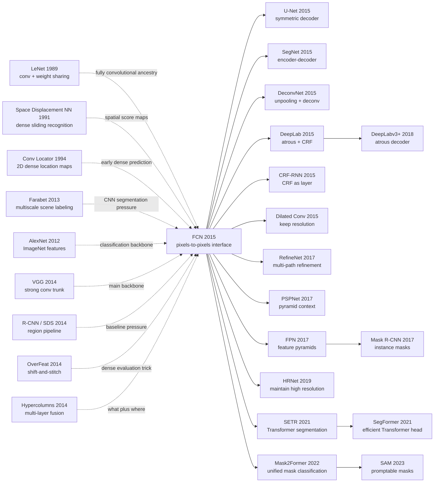

# FCN - Turning Classification Networks into Pixel-Level Segmenters

> **On November 14, 2014, Jonathan Long, Evan Shelhamer, and Trevor Darrell at UC Berkeley uploaded [arXiv:1411.4038](https://arxiv.org/abs/1411.4038), later published at CVPR 2015.** The paper's counter-intuitive move was not to design a bespoke segmentation machine. It took AlexNet, VGG, and GoogLeNet-style image classifiers, removed the fully connected bottleneck, reinterpreted the remaining computation as a dense convolutional filter, and learned to upsample coarse semantic maps back onto the pixel grid. PASCAL VOC 2012 mean IU jumped from SDS's 51.6 to 62.2, while inference fell from roughly 50 seconds to 175 ms. FCN's historical role is not "it added deconvolution"; it moved semantic segmentation from proposals, superpixels, and patch classifiers into an end-to-end pixels-to-pixels era.

## TL;DR

Long, Shelhamer, and Darrell's CVPR 2015 FCN paper recast semantic segmentation from a "generate regions / superpixels / proposals, then classify local pieces" pipeline into an end-to-end pixel prediction problem. It converts classification networks' fully connected layers into convolutions, lets one whole-image forward pass emit class scores $s_{i,j,c}=f_\theta(x)_{i,j,c}$, trains with pixelwise cross-entropy $\ell=\sum_{i,j}\ell'(s_{i,j}, y_{i,j})$, and learns to upsample coarse maps through deconvolution plus pool3/pool4 skip fusion, producing FCN-8s. Its strongest defeated baseline was Hariharan et al.'s SDS: PASCAL VOC 2012 mean IU rose from 51.6 to 62.2, VOC 2011 test from 52.6 to 62.7, and inference time fell from roughly 50 seconds to 175 ms; NYUDv2 and SIFT Flow improved as well. The hidden lesson is that segmentation did not primarily need more post-processing. It needed an interface for turning classification representations such as [VGG](2014_vgg.md) into dense predictors. That line runs directly into [U-Net](2015_unet.md), DeepLab, Mask R-CNN, and the post-[SAM](../era5_genai_explosion/2023_sam.md) ecosystem of promptable masks.

---

## Historical Context

### In 2014, semantic segmentation could read images but could not yet write pixels cleanly

When FCN appeared, visual recognition had already been rewritten by CNNs. In 2012, [AlexNet](2012_alexnet.md) proved that deep convolutional networks could dominate ImageNet classification; by 2014, [VGG](2014_vgg.md) and GoogLeNet had pushed classification accuracy further; in detection, R-CNN had moved ImageNet-pretrained features onto region proposals. Semantic segmentation, however, had not completed the same transition: it needed a class label for every pixel, not merely a label for an image or a box.

Strong systems at the time were often hybrids of deep features and traditional structure. SDS used region proposals, R-CNN features, and extra segmentation machinery for PASCAL VOC; Farabet's multiscale convnet, Pinheiro's recurrent CNN, and Ciresan's sliding-window network all showed CNNs could handle local dense tasks, but often required patch sampling, superpixel projection, CRF / MRF post-processing, input shift-and-stitch, multi-scale pyramids, or ensembles. In other words, CNNs could already "understand" images, but segmentation systems still needed many external tools to stitch local predictions back into pixels.

FCN's historical value is that it turned the problem into a hard interface question: **can the classification network itself produce a same-sized semantic map in one forward pass?** If the answer is yes, patches, proposals, superpixels, and post-hoc refinement are no longer necessary entry points. Segmentation moves from "recognize and assemble" into pixels-to-pixels learning.

### The immediate predecessors that pushed FCN out

| Predecessor | What it had solved | What it left open | How FCN inherited it |
|-------------|--------------------|-------------------|----------------------|
| LeNet / space displacement networks | convolution can share spatial computation | not modern semantic segmentation | gives FCN its fully convolutional ancestry |
| AlexNet / VGG / GoogLeNet | ImageNet classification features are strong | output is image-level | convert fully connected layers to convolutions and transfer weights |
| OverFeat | shift-and-stitch and dense evaluation | dense trick is costly and indirect | analyze shift-and-stitch, prefer learnable upsampling |
| R-CNN / SDS | CNN features help detection and region segmentation | pipeline depends on proposals / regions | predict densely at pixel level instead |
| Farabet / Pinheiro / Ciresan | CNNs can do dense local labeling | patchwise, multiscale, post-processing-heavy | replace patch machinery with whole-image training |

These predecessors created the threshold moment: classification backbones were strong enough, the Caffe stack was stable enough, PASCAL VOC / NYUDv2 / SIFT Flow supplied public evaluation, and segmentation pipelines had become heavy enough to invite simplification. FCN was not an isolated trick; it reconnected these components into one end-to-end training problem.

### What the Berkeley team was doing

All three authors were at UC Berkeley. Trevor Darrell's group was central to deep vision, Caffe, R-CNN, and visual transfer learning; Evan Shelhamer was one of Caffe's authors; Jonathan Long was working at the intersection of Berkeley vision systems and dense prediction. That background matters: FCN was not simply "apply CNNs to segmentation." It came from a team fluent in engineering frameworks, classification pretraining, region-based segmentation, and public benchmark practice.

The paper also has a clear Berkeley/Caffe temperament. It does not merely propose an architecture; it analyzes the design space. Why can fully connected layers become convolutions? What is shift-and-stitch really doing? Why is deconvolution upsampling learnable? How does patchwise training relate to whole-image training? Does skip fusion improve mean IU or just make boundaries look nicer? These questions are in the paper, not hidden as implementation details.

### Compute, data, and the Caffe moment

FCN used Caffe and trained/tested on a single NVIDIA Tesla K40c. From today's view, 175 ms per image is not shocking; in 2015 it was a dramatic contrast with SDS at roughly 50 seconds. FCN-32s VGG fine-tuning took about 3 days, and upgrading to FCN-16s / FCN-8s took about 1 day each. That is a reproducible lab-scale cost, not a score requiring a massive industrial cluster.

On data, the paper validated on PASCAL VOC, NYUDv2, and SIFT Flow. PASCAL targets natural-image object category segmentation; NYUDv2 adds RGB-D indoor semantics; SIFT Flow combines scene parsing and geometric labels. FCN's ability to use one fully convolutional frame across these tasks shows that it was not merely tuned to the VOC leaderboard. It defined a class of dense prediction models.

## Background and Motivation

### The central segmentation tension: semantics live deep, location lives shallow

Semantic segmentation has a built-in tension: deep features know more about "what" but are spatially coarse; shallow features keep edges and texture but are semantically weak. Classification networks repeatedly pool and downsample, trading local position for larger receptive fields and semantic stability. Segmentation has to put that semantic understanding back onto pixels.

FCN's motivation can be compressed into one sentence: **borrow classification networks' deep semantics without leaving the final output trapped on a stride-32 grid.** That is exactly the logic from FCN-32s to FCN-16s to FCN-8s: first prove classification networks can be densified, then progressively add pool4 and pool3 spatial detail back.

### Why not keep using patches or proposals?

Patchwise training seems natural: crop a patch for each pixel and predict the center pixel. But neighboring patches overlap heavily, wasting computation, and patch size creates a hard context-localization trade-off. Proposal / superpixel routes are also reasonable because they exploit objectness and region consistency, but the pipeline becomes long and errors propagate across proposal generation, feature extraction, classification, and post-processing.

FCN attacks more directly: treat the whole image as a large batch of overlapping receptive fields, use convolution to share all overlapping computation, put upsampling inside the network, train through a pixelwise loss, and make shallow/deep fusion part of the network. Segmentation becomes not "CNN features plus external structure," but a spatial function the CNN itself learns.

---

## Method Deep Dive

### Overall framework

FCN's framework can be compressed into one sentence: **turn an ImageNet classification network into a convolutional dense predictor, let it emit a low-resolution class score map for arbitrary-sized input, then restore pixel-level predictions through in-network upsampling and shallow skip fusion.** The paper first converts AlexNet, VGG-16, and GoogLeNet into dense predictors, then finds VGG-16 strongest and builds FCN-32s, FCN-16s, and FCN-8s on top of it.

| Stage | Operation | Output stride | Role |
|-------|-----------|---------------|------|
| Classification trunk | conv / pool / ReLU stack | 32 | extract deep semantics |
| FC-to-conv conversion | fc6/fc7 become large and 1x1 convolutions | 32 | preserve ImageNet-pretrained representation |
| score layer | 1x1 conv emits class scores | 32 | predict classes per coarse grid point |
| deconvolution | upsample back to input size | 32->1 | connect coarse semantics to pixel loss |
| skip fusion | add pool4 / pool3 shallow predictions | 16 / 8 | recover spatial detail |

The core is not a single "deconvolution layer." Three things become true at once: classification pretraining transfers to dense prediction; training can use a whole-image pixelwise loss; shallow/deep fusion can live inside the network and be optimized end to end.

### Design 1: Convolutionalizing fully connected layers — turning classifiers into spatial filters

**Function**: convert a fixed-input classification network into a fully convolutional network that accepts arbitrary-sized input and emits a spatial score map.

**Core formula**: if a fully connected layer operates on an $h\times w\times C$ feature tensor, it is equivalent to a convolution with kernel size $h\times w$; subsequent FC layers are equivalent to $1\times1$ convolutions.

$$
\operatorname{FC}(\operatorname{vec}(X)) = W\operatorname{vec}(X)+b
\quad\Longleftrightarrow\quad
\operatorname{Conv}_{h\times w}(X; W,b)
$$

```python
class ConvolutionalizedVGG(nn.Module):
    def __init__(self, vgg16, num_classes):
        super().__init__()
        self.features = vgg16.features
        self.fc6_as_conv = nn.Conv2d(512, 4096, kernel_size=7)
        self.fc7_as_conv = nn.Conv2d(4096, 4096, kernel_size=1)
        self.score = nn.Conv2d(4096, num_classes, kernel_size=1)

    def forward(self, image):
        h = self.features(image)
        h = F.relu(self.fc6_as_conv(h))
        h = F.relu(self.fc7_as_conv(h))
        return self.score(h)
```

| Method | Input size | Output form | Compute sharing | Fit for dense prediction? |
|--------|------------|-------------|-----------------|---------------------------|
| original classifier | fixed crop | single logits vector | no spatial output | no |
| patchwise classifier | fixed patch | center-pixel class | much repeated work | usable but slow |
| **convolutionalized FCN** | arbitrary size | score map | whole-image sharing | yes |
| proposal classifier | arbitrary proposal | region label | limited inside proposal | better for detection |

**Design rationale**: classification networks already contain strong semantic representations; discarding them would waste the ImageNet breakthrough. But fully connected layers flatten spatial coordinates and cannot naturally predict every position. Convolutionalization reinterprets ImageNet weights as deep filters sliding over the whole image, preserving pretraining while avoiding repeated patchwise forward passes.

### Design 2: Whole-image pixelwise loss — patchwise training is loss sampling

**Function**: run one forward pass over the full image and train on all spatial predictions with a pixelwise multinomial logistic loss instead of sampling patches and training them separately.

**Core formula**: if each final score-map location $(i,j)$ corresponds to a receptive field, the whole-image loss is the sum over valid labeled pixels:

$$
\mathcal{L}(x,y;\theta)=\sum_{(i,j)\in\Omega}\ell\left(f_\theta(x)_{i,j}, y_{i,j}\right)
$$

Patchwise training can be seen as sampling a subset of loss terms from $\Omega$; whole-image training keeps all terms and shares computation for overlapping receptive fields through convolution.

```python
def pixelwise_segmentation_loss(scores, labels, ignore_index=255):
    # scores: [N, C, H, W], labels: [N, H, W]
    return F.cross_entropy(scores, labels, ignore_index=ignore_index)
```

| Training mode | Gradient samples | Compute efficiency | Class balancing | Paper's conclusion |
|---------------|------------------|--------------------|-----------------|--------------------|
| patchwise uniform | random patches | wastes overlapping computation | manually sampleable | traditional route |
| loss sampling | subset of spatial positions | more efficient than patches | can mimic patch sampling | analysis tool |
| **whole-image FCN** | all valid positions | best use of convolution sharing | can use loss weighting | faster and effective |
| proposal training | region candidates | depends on proposal quality | driven by region distribution | not pixel-end-to-end |

**Design rationale**: one of the paper's cleanest conceptual moves is reducing patchwise training to loss sampling. Patch methods cease to be a separate model class; they become an inefficient sampling approximation to the FCN loss. This makes whole-image training look not risky, but natural dense SGD.

### Design 3: Deconvolution upsampling — reconnecting coarse score maps to pixel loss

**Function**: upsample stride-32/16/8 class score maps back to input resolution so the network can receive pixel-level supervision end to end. The paper describes this as backwards strided convolution, later commonly called transposed convolution or deconvolution.

**Core formula**: upsampling can be viewed as a convolution with output stride $f$. If $z$ is a coarse score map, output pixel $u$ combines nearby coarse cells through a learnable kernel $K$:

$$
u_{p,q,c}=\sum_{i,j} K_{p-fi,q-fj,c}\,z_{i,j,c}
$$

The final deconvolution is often fixed to bilinear interpolation; intermediate 2x upsampling layers are initialized to bilinear but allowed to learn.

```python
def bilinear_upsample_layer(num_classes, stride):
    layer = nn.ConvTranspose2d(
        num_classes, num_classes,
        kernel_size=2 * stride,
        stride=stride,
        padding=stride // 2,
        groups=num_classes,
        bias=False,
    )
    layer.weight.data.copy_(make_bilinear_kernel(num_classes, 2 * stride))
    return layer
```

| Upsampling method | Learnable? | Inside network? | Benefit | Limitation |
|-------------------|------------|-----------------|---------|------------|
| nearest / bilinear post-process | no | no | simple | loss cannot train upsampling parameters |
| shift-and-stitch | no | indirect | densifies output | costly and circuitous |
| **deconvolution layer** | optional | yes | end-to-end and easy | coarse stride still limits detail |
| decoder path | yes | yes | later U-Net / SegNet stronger | heavier |

**Design rationale**: FCN chooses deconvolution not merely to make an image larger, but to make resolution recovery trainable. Pixelwise loss can backpropagate through the upsampling layer into the classification backbone, so segmentation no longer depends on external interpolation and refinement.

### Design 4: Skip fusion — putting what and where into one DAG

**Function**: add deep coarse semantic scores to shallower finer appearance scores, producing FCN-16s first and FCN-8s after adding pool3.

**Core formula**:

$$
s^{16}=\operatorname{up}_2(s^{32}_{\text{conv7}})+s_{\text{pool4}},
\qquad
s^{8}=\operatorname{up}_2(s^{16})+s_{\text{pool3}}
$$

Before fusion, pool4/pool3 each receive a $1\times1$ score layer; newly added score layers are zero-initialized so the network starts from the original FCN-32s behavior.

| Model | Fusion layers | validation mean IU | Output character | Reading |
|-------|---------------|--------------------|------------------|---------|
| FCN-32s-fixed | none, train last layer only | 45.4 | very coarse | classification features alone are insufficient |
| FCN-32s | none, fine-tune all layers | 59.4 | semantic but coarse | dense fine-tuning matters |
| FCN-16s | conv7 + pool4 | 62.4 | clearer boundaries | stride-16 localization helps |
| FCN-8s | conv7 + pool4 + pool3 | 62.7 | finest | small metric gain, visibly smoother detail |

**Design rationale**: segmentation must answer both what and where. conv7 knows categories but is coarse; pool3/pool4 preserve location but are semantically weaker. FCN's skip fusion uses a light DAG to add the two. Later U-Net, FPN, RefineNet, and DeepLab decoders all deepen this coarse-to-fine fusion route.

### Training recipe

| Item | Setting | Notes |
|------|---------|-------|
| Framework | Caffe | Berkeley engineering ecosystem |
| Backbone | AlexNet / VGG-16 / GoogLeNet | VGG-16 strongest, main FCN-32s trunk |
| Optimizer | SGD + momentum 0.9 | fixed learning rate by line search |
| Batch size | 20 images | whole-image dense training |
| Learning rate | AlexNet 1e-3, VGG 1e-4, GoogLeNet 5e-5 | smaller for VGG |
| Weight decay | 5e-4 or 2e-4 | follows classifier-training experience |
| Score init | class score conv zero-initialized | random init was not faster or better |
| Upsampling init | bilinear interpolation | intermediate upsampling can learn |
| Class balancing | not used | background about 3/4, not a major issue |
| Augmentation | mirror / jitter tried, no noticeable gain | not the main contribution |

From today's vantage point, the recipe is plain: no BatchNorm, no Adam, no Dice loss, no attention, no transformer decoder. That is exactly the point. With only convolutionalization, whole-image loss, upsampling, and skip fusion, FCN pulled segmentation away from complex pipelines into a reusable neural-network interface.

---

## Failed Baselines

### Baseline 1: Patchwise / sliding-window CNNs could segment, but recomputed the same image too many times

The most direct route FCN displaced was semantic segmentation as “crop a patch for every pixel, then classify the center pixel.” This was not foolish in 2011-2014. Convnets could already make local recognition decisions, patch sampling made class balancing controllable, and small crops were easier to fit into GPU memory than whole images. Dense-labeling systems by Ciresan, Farabet, Pinheiro, and others showed in different ways that CNNs could produce local semantic judgments.

The problem is that patchwise segmentation wastes much of what makes convolution valuable. Neighboring pixel patches overlap heavily, yet the forward pass is repeated; if the patch is small, the model lacks context; if the patch is large, pooling makes localization coarse. One conceptual contribution of Section 3.4 is to reinterpret patchwise training as **loss sampling**: it is not a fundamentally different training paradigm, but a sampling approximation to a whole-image pixelwise loss.

FCN's correction is clean: run the whole image once, share convolutional computation across all receptive fields, and sum the loss over valid pixels. This keeps the supervision signal of patch methods while removing duplicated computation and the fixed-window context-localization trade-off. The paper's AlexNet example makes the point concrete: on a 500x500 input, the fully convolutional version emits a 10x10 grid in about 22 ms; repeated patch classification would grow linearly with the number of positions.

### Baseline 2: Proposal / region pipelines were strong, but segmentation was hostage to candidate regions

The strong PASCAL VOC baseline FCN actually defeated was SDS, Simultaneous Detection and Segmentation. SDS stood after R-CNN, combining region proposals, CNN features, region classification, and segmentation machinery into a powerful system. Its appeal was obvious: object instances are often connected regions, proposals provide objectness, and region CNNs can reuse ImageNet pretraining.

But SDS paid for that power with a long pipeline. Segmentation quality depended jointly on proposal recall, region boundaries, CNN classification, mask projection, and post-processing; once the correct object was missing from the proposal set, later deep features could not recover it. More importantly, it did not optimize “which semantic class does each pixel belong to?” directly. It detoured through proposals before returning to pixels.

FCN changed the entry point to dense prediction. It does not first ask “which regions might be objects?” It lets a classification backbone such as VGG emit class scores at every spatial position. The result was direct: PASCAL VOC 2012 test mean IU rose from SDS's 51.6 to FCN-8s's 62.2, while inference fell from roughly 50 seconds to 175 ms. What lost was not SDS's engineering quality, but the proposal-first interface itself.

### Baseline 3: Shift-and-stitch densified outputs, but did not learn resolution recovery

OverFeat and related work had already shown shift-and-stitch: shift the input by different pixel offsets, run the network multiple times, and interlace the outputs into a denser prediction map. This was a clever dense-evaluation trick, especially for temporarily using classifiers for localization or detection. But it exposed an awkward fact: the model itself had not learned how to recover resolution; the system filled grid holes through multiple shifted runs.

FCN's alternative is to put upsampling inside the network. The deconvolution layer can be fixed to bilinear interpolation or initialized from bilinear weights and then learned; more importantly, pixelwise loss can backpropagate through it into the backbone. Resolution recovery moves from a runtime trick into a layer in the training graph.

This change mattered later. U-Net, SegNet, DeconvNet, DeepLab decoders, FPN, and modern segmentation heads no longer treat resolution recovery as an external stitching step. They make it part of the architecture. FCN did not invent every decoder, but it normalized the idea that upsampling should be in-network and differentiable.

### Baseline 4: FCN-32s proved the direction, but exposed stride-32 boundary coarseness

FCN contains its own failed baseline: FCN-32s, which uses only the deepest score map. It is already simpler than many older pipelines and reaches 59.4 validation mean IU on PASCAL, but the output is coarse. The reason is straightforward: the final VGG classification feature has stride 32, so one coarse grid cell covers a large region of the input. Direct upsampling enlarges the class heatmap, but cannot recover boundaries from nothing.

FCN-16s and FCN-8s are the fix. Pool4 supplies stride-16 spatial evidence, pool3 supplies finer stride-8 localization; deep conv7 provides semantics, shallow score layers provide where. In metrics, FCN-32s to FCN-16s moves from 59.4 to 62.4, and FCN-8s reaches 62.7; visually, object boundaries, thin structures, and local shapes become much cleaner.

The lesson of this baseline lasted. Dense prediction is not just “spread the classifier's last layer over the image.” Stronger semantics are coarser; finer locations are semantically weaker. U-Net, RefineNet, DeepLabv3+, HRNet, SegFormer, and Mask2Former all keep answering that what/where fusion problem.

| Failed route | Why it made sense then | Exposed problem | FCN's correction |
|---|---|---|---|
| Patchwise / sliding-window CNN | memory-friendly, can sample for class balance | duplicated overlap, context-localization conflict | whole-image forward + pixelwise loss |
| SDS / proposal pipeline | strong region objectness, reuses R-CNN features | limited by proposal recall and heavy post-processing | direct pixel-level dense prediction |
| Shift-and-stitch | densifies output without changing the network | multiple forwards, non-learned resolution recovery | in-network deconvolution upsampling |
| FCN-32s | simplest fully convolutional conversion | stride-32 output is too coarse | pool4 / pool3 skip fusion |

## Key Experimental Data

### PASCAL VOC: pulling SDS's strong pipeline back into an end-to-end network

PASCAL VOC is the central experimental setting for FCN's historical role. The paper reports test results on both VOC 2011 and VOC 2012, using mean IU. FCN-8s reaches 62.2 on VOC 2012 test, 10.6 points above SDS's 51.6; on VOC 2011 test, FCN-8s reaches 62.7 while SDS reaches 52.6.

| Method | VOC 2011 test mean IU | VOC 2012 test mean IU | Runtime | Reading |
|---|---:|---:|---:|---|
| SDS | 52.6 | 51.6 | ~50s | strong proposal/region pipeline |
| FCN-32s | - | - | ~175ms | direction works, output coarse |
| FCN-16s | - | - | ~175ms | pool4 improves boundaries |
| **FCN-8s** | **62.7** | **62.2** | **~175ms** | end-to-end dense predictor |

The historically important part is not only the 10 mean-IU points, but the simultaneous change in speed and system form. SDS is a multi-stage pipeline; FCN-8s is one network forward plus in-network upsampling. It moved semantic segmentation from complex systems engineering toward “train a fully convolutional model.”

### Ablation: the real gains come from fine-tuning and skip fusion

The validation ablation is crucial because it shows FCN is not simply using fixed ImageNet features. FCN-32s-fixed, which trains only the final score layer, reaches 45.4 mean IU; fully fine-tuned FCN-32s reaches 59.4; adding pool4 gives FCN-16s at 62.4; adding pool3 gives FCN-8s at 62.7.

| Model | Structural change | PASCAL val mean IU | Meaning |
|---|---|---:|---|
| FCN-32s-fixed | freeze backbone, train score only | 45.4 | pretrained features cannot just stay frozen |
| FCN-32s | dense fine-tune the whole net | 59.4 | classification representation transfers to pixels |
| FCN-16s | add pool4 skip | 62.4 | stride-16 localization is valuable |
| FCN-8s | add pool3 skip | 62.7 | small metric gain, better visual detail |

One easily missed fact is that FCN-8s improves mean IU over FCN-16s by only 0.3, yet the paper treats FCN-8s as the main model because qualitative boundaries are better. Semantic-segmentation metrics and human visual judgment do not always move proportionally; boundary improvements may not fully show up in mean IU.

### NYUDv2 and SIFT Flow: FCN was not tuned only for the VOC leaderboard

The paper also validates the same framework on NYUDv2 and SIFT Flow. NYUDv2 requires indoor RGB-D semantics, with depth encoded as HHA and combined with RGB; SIFT Flow combines scene parsing and geometric labeling. These datasets show FCN is a dense-prediction interface, not a bag of VOC-specific tricks.

| NYUDv2 FCN-16s RGB-HHA metric | Value | Meaning |
|---|---:|---|
| Pixel accuracy | 65.4 | overall pixel accuracy |
| Mean accuracy | 46.1 | class-averaged accuracy |
| Mean IU | 34.0 | class-averaged IoU |
| Frequency weighted IU | 49.5 | frequency-weighted IU |

| SIFT Flow FCN-16s metric | Value | Meaning |
|---|---:|---|
| Pixel accuracy | 85.2 | semantic pixel accuracy |
| Mean accuracy | 51.7 | class-averaged accuracy |
| Mean IU | 39.5 | semantic mean IU |
| Frequency weighted IU | 76.1 | frequency-weighted IU |
| Geometry pixel accuracy | 94.3 | geometric-label accuracy |

These results were not quoted as often as VOC 62.2, but they mattered in 2015. They told readers that fully convolutional computation, pixelwise loss, in-network upsampling, and skip fusion were not short-term leaderboard recipes. They were a training interface that transferred to different dense-labeling datasets.

### Training and inference cost: reproducible on one K40c

Part of FCN's spread came from its engineering reproducibility. The paper used Caffe and a single NVIDIA Tesla K40c; VGG FCN-32s fine-tuning took about 3 days, and FCN-16s / FCN-8s upgrades took roughly 1 day each. For a 2015 lab, this was not cheap, but it was not unreachable industrial-scale training either.

| Item | Value / setting | Meaning |
|---|---|---|
| Framework | Caffe | Berkeley deep-vision ecosystem |
| GPU | single NVIDIA Tesla K40c | ordinary lab-scale reproducibility |
| FCN-32s training | about 3 days | main VGG dense fine-tuning cost |
| FCN-16s / FCN-8s upgrade | about 1 day each | coarse-to-fine staged fine-tuning |

At inference, FCN-8s takes about 175 ms for a typical image, contrasting sharply with SDS at roughly 50 seconds. That difference made segmentation less of an offline leaderboard submission and more of a module that could enter interactive annotation, robot perception, medical preprocessing, and video pipelines.

### Key findings

First, **classification pretraining can be reinterpreted as dense-prediction pretraining**. FCN does not need to train a semantic segmentation network from scratch; it migrates AlexNet, VGG, and GoogLeNet weights through convolutionalization. This directly influenced later detection, segmentation, pose estimation, and depth estimation: learn representation on large-scale classification, then change the head for dense tasks.

Second, **end-to-end does not mean skipping structural analysis**. FCN removes proposals and patch machinery, but it does not hand everything to a black box. The paper carefully analyzes FC-to-conv conversion, loss sampling, deconvolution, skip fusion, and shift-and-stitch, making it an interface paper: readers can plug their own backbone into the same dense-output form.

Third, **speed is part of the architectural contribution**. A segmentation system that is accurate but takes 50 seconds has a wide gap between research tables and real systems. FCN improved accuracy and latency together, which is why fully convolutional segmentation became a default component in the next decade of vision systems.

---

## Idea Lineage



### Past lives: what forced FCN out

- **LeNet / Space Displacement Networks / early dense convnets**: FCN did not invent the idea that convolution can emit spatial maps from nowhere. The LeCun line had already made weight sharing, local receptive fields, and spatial sliding recognition part of neural-network tradition. FCN's difference was connecting that tradition to the post-AlexNet/VGG era of large-scale pretraining and scaling the target from characters or localization to modern semantic segmentation.
- **AlexNet / VGG / GoogLeNet**: without the classification-backbone victories after [AlexNet](2012_alexnet.md), FCN's central transfer would have been much less convincing. It did not design a segmentation-only network from scratch. It said: classification networks already contain semantics; change their interface from image logits to spatial logits.
- **R-CNN / SDS / region pipelines**: R-CNN proved ImageNet features transfer to detection, and SDS proved region pipelines can produce strong segmentation. FCN asked the next question: if CNN features are already this strong, why generate regions first and only then return to pixels?
- **OverFeat / shift-and-stitch / Hypercolumns**: OverFeat made classification networks slide densely, while Hypercolumns stressed that multiple layers jointly serve semantics and localization. FCN absorbed both lines, but turned dense evaluation and feature fusion into a trainable DAG rather than a runtime stitching trick.

### Descendants

- **Encoder-decoder segmentation line**: U-Net, SegNet, and DeconvNet inherit FCN's pixels-to-pixels interface and then make “how to restore spatial detail” heavier. U-Net uses a symmetric decoder and concatenative skips, SegNet uses pooling indices, and DeconvNet uses unpooling plus deconvolution. Their shared premise is FCN's: a segmentation network should take an image and emit masks in the same spatial coordinate system.
- **DeepLab / dilated convolution / CRF line**: DeepLab inherits FCN's dense unary prediction, but argues that stride 32 is too coarse. It uses atrous convolution to enlarge receptive fields without further downsampling and dense CRFs to sharpen boundaries. CRF-RNN then writes CRF inference as a differentiable module. The debate is not whether to use FCN, but how to repair boundaries and context after FCN.
- **Feature pyramid and instance-mask line**: FPN turns coarse-to-fine skips into a detection pyramid, and Mask R-CNN predicts small masks inside RoIs. They are not direct copies of semantic-segmentation FCN, but both inherit the fact that deep semantics and shallow localization must be structurally fused.
- **Transformer and mask-classification line**: after SETR, SegFormer, and Mask2Former, the backbone can be a Transformer and the output can move from per-pixel softmax to mask classification or query-based masks. But these methods still live inside FCN's frame: how do image representations become spatially aligned dense masks?
- **Foundation segmentation line**: SAM moves segmentation into a promptable foundation-model setting, with training data and interaction far beyond FCN's era. Yet its mask decoder, dense image embedding, and pixel-level output still stand on the tradition FCN opened: neural networks directly produce masks.

### Misreadings and simplifications

- **Misreading 1: FCN's contribution is only “replace fc with conv”**. That step is crucial, but it is not the whole paper. The real package is FC-to-conv conversion, whole-image pixelwise loss, in-network upsampling, skip fusion, pretrained transfer, and speed evaluation. Reducing it to fc-to-conv underestimates how completely the paper rewrote the segmentation interface.
- **Misreading 2: FCN solved segmentation boundaries**. FCN-8s gives much better boundaries than FCN-32s, but it remains coarse. DeepLab's CRF and dilated convolutions, U-Net's decoder, RefineNet's refinement, and HRNet's high-resolution branches all address FCN's insufficient boundary precision.
- **Misreading 3: FCN was superseded by U-Net / DeepLab**. The concrete architecture was of course surpassed by stronger methods, but FCN became an interface and a language. When people say segmentation head, dense predictor, or fully convolutional backbone, they are still using the grammar FCN stabilized.
- **Misreading 4: FCN belongs only to semantic segmentation**. FCN's idea quickly moved into depth estimation, edge detection, human parsing, medical segmentation, remote sensing, saliency detection, and video dense labeling. Any task whose input and output share spatial coordinates and require dense supervision can use the interface.

---

## Modern Perspective

### Looking back from 2026: FCN became an interface, not just a model

From 2026, FCN's concrete architecture looks plain: a VGG backbone, a stride-32 coarse map, deconvolution upsampling, and pool3/pool4 additions. On any modern segmentation benchmark, it would be outperformed by DeepLabv3+, HRNet, SegFormer, Mask2Former, DINO/ViT-based systems, or SAM-family models. That does not weaken FCN's position, because what it left behind was not a permanently strongest model. It left an interface: **an image enters, the network directly emits spatially aligned dense prediction, and the training objective is written on pixels.**

That interface is now almost everywhere. Semantic segmentation, instance-mask heads, medical-image segmentation, monocular depth, surface normals, saliency, edge detection, remote-sensing land-cover mapping, video segmentation, and dense correspondence all treat “whole-image convolution/attention representation + spatial output head + dense loss” as a natural form. FCN's victory is that this no longer needs explanation.

More interestingly, many FCN descendants no longer call themselves fully convolutional. Transformer segmentation may contain no classical convolution; Mask2Former uses queries and mask classification; SAM uses a prompt encoder and a mask decoder. Yet whenever a model turns image representation into spatial masks and learns from dense or mask-level supervision, it still lives in the design space FCN opened.

### Assumptions that no longer hold

| 2015 implicit assumption | Why it made sense then | 2026 problem | Modern correction |
|---|---|---|---|
| Classification backbones are the default start for dense tasks | ImageNet pretraining had just proved strong transfer | large-scale self-supervised, detection/segmentation pretraining, and foundation features are often better | MAE/DINO/SAM/CLIP-style pretraining plus task heads |
| Upsampling after stride 32 is acceptable | PASCAL mean IU was not extremely sensitive to coarse boundaries | small objects, thin structures, medical boundaries, and driving need high resolution | dilated conv, HRNet, multiscale decoders, feature pyramids |
| Pixelwise softmax is the natural segmentation output | semantic classes were fixed and evaluation was simple | instance/panoptic/open-vocabulary/promptable segmentation needs mask-level expression | mask classification, query decoders, promptable masks |
| End-to-end CNNs can replace most structured reasoning | old pipelines were heavy and CRF/region machinery was complex | long-range relations, global context, topology, and instance interaction still matter | attention, CRF-as-layer, graph/context modules, foundation models |
| VOC / NYUD / SIFT Flow represent dense labeling well enough | public benchmarks were limited | deployment has domain shift, long-tail classes, video consistency, and interaction needs | multi-domain evaluation, open vocabulary, video/3D/interactive segmentation |

These assumptions failing does not mean FCN was wrong. The opposite is true: follow-up work keeps refining the interface it defined. How do we preserve resolution? How do we express instances? How do we add context? How do we generalize across domains? How do masks become interactive?

### What survived vs. what became incidental

Three design ideas survived. First, **convolutionalizing fully connected layers and accepting arbitrary input size**: today we may not manually convert fc6/fc7 into convolutions, but it is common sense that a backbone should not be trapped by fixed crops and image-level logits. Second, **whole-image dense loss**: whether the loss is per-pixel CE, Dice, mask BCE, Hungarian mask loss, or prompt-mask loss, the objective acts directly on spatial output. Third, **multilayer skip / coarse-to-fine fusion**: FCN-16s/8s lightweight additions grew into U-Net decoders, FPN, DeepLabv3+ decoders, HRNet branches, and SegFormer heads.

Several 2015 engineering choices became incidental. VGG fc6-as-7x7-conv is not required; deconvolution is not always better than bilinear upsampling plus convolution; simple additive skips are less flexible than concatenation, attention fusion, or learned decoders; PASCAL mean IU is not enough to measure boundaries, instances, or clinical cost. Caffe prototxt, fixed learning rates, and K40c training belong squarely to the period.

FCN's paper value therefore resembles API documentation more than a final architecture. The API is dense prediction: inputs can be arbitrary sized, the network preserves spatial dimensions, outputs align with input coordinates, and supervision comes directly from pixels or masks. The next decade optimized that API's implementation.

### Side effects the authors did not foresee

The first side effect is that FCN made “segmentation as a pretraining/downstream interface” easy. Given any classification backbone, researchers could attach a 1x1 score layer, upsampling, and pixel loss, then turn it into a dense predictor. That directly accelerated transfer evaluation of backbones on detection, segmentation, pose, and depth.

The second side effect is that FCN brought medical and natural-image segmentation closer in language. U-Net is often treated as the emblem of medical segmentation, but it was easy to understand and spread partly because FCN had already made fully convolutional output, skip fusion, and pixelwise training shared vocabulary. Without FCN, U-Net's U-shaped decoder might still have appeared, but it would not have fit as naturally into the mainstream deep-vision line.

The third side effect is that FCN made boundary problems more visible. In older pipelines, errors could come from proposals, superpixels, classifiers, or CRFs, making responsibility diffuse. Once FCN compressed the system into one network, the effects of stride, upsampling, feature fusion, and loss on boundaries became easier to see. That visibility helped motivate DeepLab, dilated convolution, CRF-RNN, RefineNet, boundary losses, and related repairs.

The fourth side effect is that FCN changed the abstraction of vision frameworks. Caffe and later PyTorch/TensorFlow libraries increasingly separated backbones and task heads: classification head, detection head, segmentation head, depth head. FCN is one of the papers that made “segmentation head” feel ordinary.

### If FCN were rewritten today

If FCN were rewritten in 2026, I would keep the core of arbitrary-sized input, dense output, and end-to-end spatial supervision, but replace the VGG trunk with pluggable encoders: ConvNeXt/ResNet for small data, ViT/Swin/DINOv2 for large data, CLIP/SigLIP for open vocabulary, and SAM-style image encoders for interactive segmentation. FCN's spirit is not VGG; it is a backbone-agnostic dense interface.

The upsampling path would become a multiscale decoder rather than a simple deconvolution. Shallow and deep features would not only be added; feature pyramids, attention fusion, or query-to-pixel decoders would learn the fusion. For small objects and thin structures, the model would keep high-resolution branches or use dilated convolution. For instance and panoptic tasks, the output would not be just a per-pixel class distribution, but mask queries, class labels, and overlap reasoning.

The training objective would also be richer. Semantic segmentation might use pixel CE plus Dice or Lovasz loss; instance masks use BCE/Dice plus Hungarian matching; medical or remote-sensing segmentation uses boundary, surface, or topology losses; open vocabulary uses text-image alignment; video segmentation adds temporal consistency. A modern FCN would not be a single softmax branch, but a family of dense prediction heads.

Most importantly, evaluation would change. A 2026 FCN cannot only report VOC/NYUD/SIFT Flow tables. It should report cross-domain generalization, boundary F-score, small-object performance, latency/memory, video stability, open-vocabulary transfer, and interactive annotation cost. FCN 2015 asked whether CNNs could do segmentation end to end. In 2026 the question is whether dense predictors can enter real systems reliably.

## Limitations and Future Directions

### Limitations acknowledged or exposed by the paper

The paper is optimistic, but it already exposes several FCN limits. First, the output remains relatively coarse. In the appendix, the authors simulate stride labels and show that mean IU can be surprisingly tolerant of coarse predictions: stride-32 labels can still have a high upper bound, while stride 8 is much closer to fine boundaries. This explains why FCN-8s looks more important visually than its metric gain alone suggests.

Second, FCN depends heavily on ImageNet pretraining. Training from scratch was essentially infeasible at the time, and AlexNet/VGG/GoogLeNet classification weights were the crucial starting point. That made FCN a transfer-learning victory, but also meant inheriting classification-data bias and the backbone's spatial-resolution limits.

Third, FCN does not explicitly model instances, object relations, or global structure. It emits a semantic class per pixel; it cannot distinguish same-class instances and does not guarantee shape topology, boundary consistency, or scene-level constraints. That was enough to transform PASCAL semantic segmentation, but not enough for instance, panoptic, or interactive segmentation.

### New limitations from a 2026 view

The first new limitation is open vocabulary. FCN assumes a fixed class set, with the score layer's channel count equal to the number of classes. Modern vision systems often need categories unseen during training, text prompts, or user interaction, requiring masks to connect with language, prompts, and region proposals.

The second new limitation is cross-domain robustness. FCN shows transfer on VOC, NYUDv2, and SIFT Flow, but these are still relatively small and clean benchmarks. Driving, remote sensing, medicine, and robotics face weather, sensor, hospital, geography, and time shifts. Ordinary pixel CE does not guarantee reliability under such domain shift.

The third new limitation is the cost of dense labels. FCN relies on pixel-level supervision, and high-quality masks are expensive. Weak supervision, semi-supervision, self-supervision, synthetic data, foundation mask pretraining, and interactive annotation tools all try to reduce that cost. FCN solved the model interface, not the source of dense labels.

### Improvement directions already validated by follow-ups

- **Preserve resolution instead of repairing it later**: dilated convolution, HRNet, high-resolution transformers, and multiscale feature pyramids show that high-resolution representation is more stable than crude final upsampling.
- **Make context explicit**: ParseNet, PSPNet, ASPP, non-local / attention modules, and Transformer encoders show that pixel classification needs global context, not only local receptive fields.
- **Bring boundaries and instances into the objective**: DeepLab+CRF, CRF-RNN, boundary losses, Mask R-CNN, and Mask2Former show that semantic pixel softmax is only the start; mask quality also needs boundaries, instances, and set prediction.
- **Reduce dependence on pixel annotation**: weakly supervised segmentation, self-training, SAM-style mask generation, synthetic labels, and active annotation all address the data cost FCN did not solve.
- **Move from closed-set to promptable / open-vocabulary**: CLIP-based segmentation, open-vocabulary segmentation, and SAM/MedSAM replace the fixed class score layer with language- or prompt-conditioned mask prediction.

## Related Work and Insights

### Relationship to U-Net / DeepLab / Mask R-CNN / SAM

FCN's relationship to [U-Net](2015_unet.md) is the most direct: FCN gives fully convolutional dense prediction and skip fusion; U-Net thickens the upsampling path into a symmetric decoder and concatenates shallow features back in. In natural-image semantic segmentation, FCN is the paradigm shift; in medical segmentation, U-Net is the engineering variant of that paradigm under low-label, boundary-sensitive conditions.

FCN's relationship to DeepLab is “interface plus boundary repair.” DeepLab accepts FCN's dense unary prediction, but uses atrous convolution to reduce downsampling, CRFs to sharpen boundaries, and later ASPP plus decoders for context and detail recovery. Many modern semantic segmentation models can be read as FCN plus stronger context plus stronger decoder.

FCN's relationship to Mask R-CNN and Mask2Former is the extension from semantic pixels to instance masks. Mask R-CNN predicts a small FCN mask head inside each RoI, and Mask2Former further unifies semantic, instance, and panoptic tasks through mask classification. They no longer stop at independent per-pixel classification, but they still depend on the basic interface of networks directly emitting masks.

FCN's relationship to SAM is like ancestor and infrastructure. SAM's data scale, prompt mechanism, and model size are far beyond FCN's era, but it still needs dense image embeddings, a mask decoder, and spatial output. FCN handed segmentation to end-to-end networks; SAM expands end-to-end networks into a promptable, general mask engine.

### Resources

- Paper: Jonathan Long, Evan Shelhamer, Trevor Darrell, [Fully Convolutional Networks for Semantic Segmentation](https://arxiv.org/abs/1411.4038), CVPR 2015.
- Official page: [fcn.berkeleyvision.org](https://fcn.berkeleyvision.org/); code: [shelhamer/fcn.berkeleyvision.org](https://github.com/shelhamer/fcn.berkeleyvision.org).
- Suggested reading path: [AlexNet](2012_alexnet.md) for how classification backbones enabled transfer, [VGG](2014_vgg.md) for FCN's main trunk, [R-CNN](2014_rcnn.md) for the region-pipeline background, [U-Net](2015_unet.md) for how the FCN interface entered medical segmentation, and [Faster R-CNN](2015_faster_rcnn.md) plus [SAM](../era5_genai_explosion/2023_sam.md) for how mask prediction kept evolving.

The lesson to keep is not one FCN-8s number, but a design habit: when a task has spatial structure, do not rush to collapse the image into a vector and later reconstruct it. Keep spatial coordinates alive inside the network, and put the loss on the output coordinates directly. FCN wrote that habit into the basic grammar of deep vision.


---

> 🌐 [中文版](/era2_deep_renaissance/2015_fcn/) · 📚 awesome-papers project · CC-BY-NC