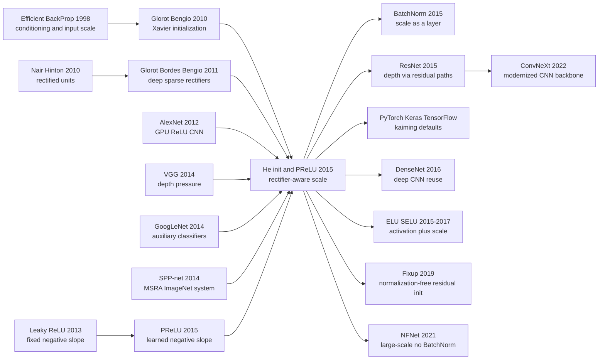

# He Init - The Starting Point That Kept ReLU Networks Alive

> **On February 6, 2015, Kaiming He, Xiangyu Zhang, Shaoqing Ren, and Jian Sun posted [arXiv 1502.01852](https://arxiv.org/abs/1502.01852).** The headline was theatrical: a CNN system that reached 4.94% top-5 test error on ImageNet and narrowly beat the reported 5.1% human-level benchmark. The quieter inheritance was more durable. By noticing that a rectifier throws away roughly half the signal, the paper changed the default variance scale for deep ReLU networks to $\sigma=\sqrt{2/n}$. PReLU itself became a specialized option; "Kaiming initialization" became the invisible first line in countless CNN training scripts, including the ResNet work that followed from the same MSRA group months later.

## TL;DR

He, Zhang, Ren, and Sun's ICCV 2015 paper split the trainability of rectified CNNs into two linked questions: the activation can be learned, and the initialization must respect the fact that a rectifier gates away roughly half the signal. PReLU replaces fixed ReLU or leaky ReLU with $f(y_i)=\max(0,y_i)+a_i\min(0,y_i)$, while He initialization derives the condition $\frac{1}{2}n_l\mathrm{Var}[w_l]=1$ and therefore the Gaussian standard deviation $\sqrt{2/n_l}$ for ReLU layers. The defeated baselines were not vague. On a 14-layer ImageNet model, ReLU gave 33.82/13.34 top-1/top-5 error, while channel-wise PReLU gave 32.64/12.75; on a 30-layer plain rectifier model, Xavier initialization stalled while the proposed initialization converged. The final MSRA PReLU-nets reached 4.94% top-5 test error, beating GoogLeNet's 6.66%, Baidu's 5.98%, and the 5.1% human-level number reported by the ImageNet dataset paper. The counter-intuitive lesson is that the loudest part of the paper, "surpassing human-level performance," aged quickly after [ResNet (2015)](2015_resnet.md) pushed ImageNet even lower, and PReLU itself never became the default activation. The durable contribution was the quiet $\sqrt{2/n}$ scale, which turned the ReLU recipe ignited by [AlexNet (2012)](2012_alexnet.md) into something deep CNNs could rely on by default.

---

## Historical Context

### Vision networks could win in 2014, but they could not yet become deep gracefully

In 2012, [AlexNet](2012_alexnet.md) cut ImageNet top-5 error from the hand-engineered feature regime around 26% to 15.3%. The vision community immediately learned three lessons: large data worked, GPUs worked, and ReLU worked. ZFNet, OverFeat, SPP-net, VGG, and GoogLeNet then pushed the number lower in different ways. By late 2014, the central question was no longer whether convolutional networks could beat hand-crafted features. It was whether they could keep training stably as depth, width, and test-time scale increased.

VGG sent one clear signal: small convolutional kernels stacked deeply could produce strong representations, but deep plain CNNs were fragile. The VGG recipe still relied on initializing deeper models from shallower ones; constant 0.01 standard deviation and hand-tuned learning schedules were recipes, not principles. GoogLeNet took another route, using Inception modules and auxiliary classifiers to help gradients reach intermediate layers. Both routes were circling the same problem: deep networks needed better management of signal scale.

The He initialization paper sits exactly in that historical gap. It did not yet invent the next residual block, and it did not turn statistics into a layer as BatchNorm would. It asked a lower-level question: if ReLU cuts off the negative half of an activation distribution, why are we still using an initialization formula derived for approximately linear activations? That sounds narrow, but it touched the shared foundation beneath almost every deep CNN of the era.

### ReLU had beaten sigmoid, but the theory still treated activations as linear

By 2015, ReLU was already the practical default. It avoided saturation, provided cleaner gradient paths than sigmoid or tanh, and produced sparse activations that matched the intuition of visual feature detectors. Nair and Hinton had brought rectifiers into RBMs in 2010; Glorot, Bordes, and Bengio systematically demonstrated sparse rectifier networks in 2011; AlexNet put ReLU into an ImageNet-scale CNN. Engineers knew ReLU worked, but many initialization formulas still treated the activation as roughly linear.

Xavier initialization aimed to keep the variance of activations and gradients roughly stable across layers. That idea was crucial, but it assumed positive and negative responses both passed through the nonlinearity. ReLU does not do that. If its input is roughly zero-mean and symmetric, the negative half is truncated, the second moment is roughly halved, and the output mean is no longer zero. Reusing the linear formula unchanged means every additional layer multiplies forward signals and backward gradients by the wrong scale.

That is why the paper feels foundational. It does not merely say ReLU is good; it explains why ReLU needs its own initialization. It does not merely say deep networks need tuning; it gives a variance rule that can be placed directly into framework defaults.

### MSRA's immediate pressure: from SPP-net to the ImageNet post-competition race

The authors were the core vision group at Microsoft Research Asia. Kaiming He, Xiangyu Zhang, Shaoqing Ren, and Jian Sun had just built SPP-net and were chasing VGG and GoogLeNet in the 2014 to 2015 ImageNet post-competition phase. The large models in the paper were not toy demonstrations for a theory point; they were systems meant to score on the real ImageNet benchmark.

This explains the paper's double personality. The first half reads like an optimization paper: variance propagation, Xavier comparisons, 22-layer and 30-layer convergence studies. The second half reads like a competition report: multi-scale dense testing, multi-model ensembles, test-set leaderboards, and comparison with human-level performance. In 2015 those were not separate stories. A principled training rule was valuable precisely because it let the team push wider, deeper, more aggressively augmented models to the top of the leaderboard.

The paper also already exposed the next wall. He initialization could make a 30-layer plain rectifier model converge, but that 30-layer model was worse on ImageNet than the 14-layer model: 38.56/16.59 versus 33.82/13.34 top-1/top-5 error. Initialization solved "can it train at all," but not "does deeper always help." ResNet, from the same group a few months later, starts from that gap.

### The headline was dramatic; the contribution was quiet

"Surpassing Human-Level Performance on ImageNet Classification" is a title engineered to stop the reader. The final 4.94% top-5 test error really was below the 5.1% human-level number reported by Russakovsky and colleagues, and below GoogLeNet's 6.66% and Baidu's 5.98%. But the paper itself was careful: the human number came from a 1500-image test subset, a trained annotator, and a special interface that showed 13 example training images for each class. Beating that benchmark did not mean machine vision had surpassed human vision in general.

History agreed. ImageNet error continued to fall quickly, and the phrase "human-level" became more context-dependent over time. PReLU remained useful in some systems, but it did not replace ReLU as the default activation. The initialization did. Many engineers now encounter this paper not through the 4.94% ImageNet result, but through `torch.nn.init.kaiming_normal_`, Keras `HeNormal`, or the name "Kaiming initialization" in training code.

## Research Background and Motivation

### Two problems were put on the same table

The paper appears to have two contributions: PReLU and He initialization. One changes the activation function; the other changes the initial weight distribution. In fact they orbit the same core issue: rectifiers change signal distributions, and the network should not pretend otherwise.

PReLU is motivated by expressivity. ReLU sets the entire negative half-axis to zero, forcing every channel to use the same hard gate. Leaky ReLU assigns a fixed negative slope, but the slope is chosen by a human. PReLU's idea is simple: let each channel learn that slope. If early edge filters need to preserve negative responses, they can learn a larger value; if deeper class features need stronger nonlinearity, they can learn a smaller one.

He initialization is motivated by trainability. Even if the activation is not learned and the network uses plain ReLU, the initialization should know that half the responses will be clipped. The paper turns that intuition into a variance propagation condition, and analyzes it from both the forward and backward directions to justify the $\sqrt{2/n}$ scale.

### The real target was the era's recipe culture

This paper was not merely replacing Xavier with another named initializer. It was replacing several empirical habits from 2014 deep-net training: fixed 0.01 standard deviation, warm-starting a deep model from a shallow one, adding auxiliary classifiers to help intermediate layers, and setting leaky-ReLU slopes by hand. Each habit could help, but each looked like a local patch.

He and colleagues offered a more unified answer: if the main nonlinearity is a rectifier, design the initialization from the rectifier's statistics; if it is unclear whether the negative half-axis should be discarded, let data learn the slope. That attitude became a default engineering mode in deep learning. Do not only ask whether a trick works; ask which part of signal, gradient, scale, or noise it changes.

### Why this paper is the night before ResNet

Read immediately before ResNet, He initialization shows a clear progression. AlexNet proved ReLU CNNs could win. VGG proved deeper plain CNNs had potential but were hard to train. He initialization proved rectifier networks needed the right scale and that 30-layer plain models could converge. ResNet then proved that convergence was not enough: plain networks degraded with depth, so the function class itself had to be reparameterized.

The historical role of He initialization is therefore not "a small trick before ResNet." It is the first foundation stone in the MSRA depth program: first keep the signal from dying, then give the gradient a shortcut. Without the former, the latter would look more like magic; with it, residual learning rests on a stable rectifier-training substrate.

---

## Method Deep Dive

### Overall framework

The method in this paper can be read as a clear training pipeline: first admit that rectifiers change activation distributions, then handle both activation shape and weight scale. PReLU handles the first part by turning the negative-side slope from a human-chosen constant into a learnable parameter. He initialization handles the second by compensating, at initialization time, for the reduction in second moment caused by ReLU or PReLU.

The engineering system is not a new backbone in the modern sense. It is still a VGG-style deep CNN: many convolutional layers, SPP pooling, three fully connected layers, multi-scale training, multi-scale dense testing, and multi-model ensembling. The real novelty is that the authors turn "can we train deeper rectifier networks from scratch" into a derivable question. Initialization is no longer an arbitrary 0.01, and the activation is no longer forced to zero out the entire negative half-axis.

The method is best read through four design choices: PReLU learns the negative slope; He initialization preserves forward variance; the backward-variance argument supports the same scale; and the full ImageNet system tests whether these small changes survive at competition scale.

### Key design 1: PReLU - letting data learn the negative slope

#### Function

PReLU turns ReLU's hard truncation into a learnable soft choice. ReLU always maps negative inputs to zero. Leaky ReLU gives negative inputs a fixed small slope. PReLU gives each channel its own $a_i$. Early edge or texture channels can preserve more negative response; deeper semantic channels can learn a shape closer to hard gating.

#### Formula

PReLU's definition is short:

$$
f(y_i)=
\begin{cases}
y_i, & y_i>0, \\
a_i y_i, & y_i\le 0,
\end{cases}
\qquad
f(y_i)=\max(0,y_i)+a_i\min(0,y_i).
$$

When $a_i=0$, it is ReLU. When $a_i$ is fixed to a small value such as 0.01, it is leaky ReLU. When $a_i$ is trained jointly with the network, it is PReLU. The paper initializes $a_i=0.25$ and does not apply weight decay to it, because $L_2$ regularization would push it toward 0 and therefore bias PReLU back toward ReLU.

The gradient of the PReLU parameter is just the chain rule:

$$
\frac{\partial \mathcal{E}}{\partial a_i}
=\sum_{y_i}\frac{\partial \mathcal{E}}{\partial f(y_i)}
\frac{\partial f(y_i)}{\partial a_i},
\qquad
\frac{\partial f(y_i)}{\partial a_i}=
\begin{cases}
0, & y_i>0, \\
y_i, & y_i\le 0.
\end{cases}
$$

#### Code

```python
class PReLUChannelWise(nn.Module):
    def __init__(self, channels, initial_slope=0.25):
        super().__init__()
        self.negative_slope = nn.Parameter(torch.full((channels,), initial_slope))

    def forward(self, activation):
        slope = self.negative_slope.view(1, -1, 1, 1)
        positive = torch.clamp_min(activation, 0.0)
        negative = torch.clamp_max(activation, 0.0)
        return positive + slope * negative
```

#### Comparison table

| Activation | Negative side | Extra parameters | Role in the paper |
|------------|---------------|------------------|-------------------|
| ReLU | 0 | 0 | Main baseline, 33.82/13.34 on the 14-layer model |
| Leaky ReLU | Fixed small slope | 0 | Fixed-slope reference, no data-learned shape |
| PReLU channel-shared | One $a$ per layer | 13 | 32.71/12.87 on the 14-layer model |
| PReLU channel-wise | One $a_i$ per channel | Channel-count scale | 32.64/12.75 on the 14-layer model |

#### Design rationale

PReLU is not only about letting negative inputs have some gradient. The paper observes that the first convolutional layer learns slopes much larger than zero, roughly 0.681 and 0.596 in the reported model. That matches visual intuition: Gabor-like edge filters carry information in both positive and negative responses. Deeper channel-wise PReLUs tend to learn smaller slopes, suggesting the network becomes more nonlinear and more discriminative with depth.

This gives a more precise explanation than fixed leaky ReLU. Different depths and different channels do not need the same negative-side behavior. PReLU does not guarantee a win on every task, but it turns activation shape from a global hyperparameter into capacity that the model can allocate by itself.

### Key design 2: He initialization - giving ReLU back the half-variance it removed

#### Function

He initialization gives deep rectifier networks a reasonable signal scale at step zero. It changes no architecture, only the initial weight distribution. Yet that change is enough to turn a 30-layer plain rectifier model from Xavier stagnation into convergence.

#### Formula

Let layer $l$ have $n_l=k_l^2c_l$ fan-in weights. Assume zero-mean weights independent from the inputs. For ReLU, if $y_{l-1}$ is approximately zero-mean and symmetric, then $x_l=\max(0,y_{l-1})$ has a second moment roughly half the previous variance:

$$
\mathrm{Var}[y_l]
=n_l\mathrm{Var}[w_l]\mathbb{E}[x_l^2]
=\frac{1}{2}n_l\mathrm{Var}[w_l]\mathrm{Var}[y_{l-1}].
$$

To avoid exponential shrinkage or growth after $L$ layers, the paper sets each layer multiplier to 1:

$$
\frac{1}{2}n_l\mathrm{Var}[w_l]=1
\quad\Rightarrow\quad
\mathrm{Var}[w_l]=\frac{2}{n_l},\qquad
\sigma_l=\sqrt{\frac{2}{n_l}}.
$$

For PReLU, the negative side is not zero but $a$ times the input, so the condition becomes:

$$
\frac{1}{2}(1+a^2)n_l\mathrm{Var}[w_l]=1.
$$

#### Code

```python
def kaiming_std_for_rectifier(fan_in, negative_slope=0.0):
    gain = math.sqrt(2.0 / (1.0 + negative_slope ** 2))
    return gain / math.sqrt(fan_in)

def kaiming_normal_(weight, negative_slope=0.0):
    fan_in = weight.shape[1] * weight.shape[2] * weight.shape[3]
    std = kaiming_std_for_rectifier(fan_in, negative_slope)
    with torch.no_grad():
        return weight.normal_(0.0, std)
```

#### Comparison table

| Initialization | Assumed nonlinearity | Standard-deviation scale | Risk in deep ReLU nets |
|----------------|----------------------|--------------------------|------------------------|
| Fixed 0.01 | No explicit assumption | Independent of fan-in | Distorts gradients when channels change |
| Xavier | Approximately linear | $\sqrt{1/n}$ or fan-in/fan-out balance | Misses the 2x compensation for ReLU |
| He init | ReLU/PReLU | $\sqrt{2/n}$ or $\sqrt{2/((1+a^2)n)}$ | Specifically preserves rectifier variance |
| After BatchNorm | Statistical rescaling | Initialization still matters but is more tolerant | Does not replace all scale design |

#### Design rationale

The elegant part is that the "2" is not a magic constant. ReLU gating roughly halves the second moment, so the weight variance gives back a factor of two. Xavier's spirit was right, but it did not write the rectifier into the condition. He initialization's contribution is turning that missing adjustment into a framework-level default.

### Key design 3: Both forward and backward variance must be protected

#### Function

Forward activations are only half the story. Deep training also depends on gradients not vanishing or exploding through many matrix multiplications and nonlinear gates. The paper therefore repeats the variance argument for back-propagation and shows that the same scale rule is also reasonable for gradients.

#### Formula

Let $\hat{n}_l=k_l^2d_l$ be the fan-out-style scale in the backward direction. For ReLU, the derivative is zero with probability about one half and one with probability about one half. The gradient variance then approximately satisfies:

$$
\mathrm{Var}[\Delta x_l]
=\frac{1}{2}\hat{n}_l\mathrm{Var}[w_l]\mathrm{Var}[\Delta x_{l+1}],
\qquad
\frac{1}{2}\hat{n}_l\mathrm{Var}[w_l]=1.
$$

The paper notes that using either the fan-in or fan-out form is usually sufficient in practical CNNs, because common channel transitions do not make the corresponding product exponentially tiny.

#### Code

There is no extra operator here. In engineering terms, this becomes the choice between `fan_in` and `fan_out` initialization modes. Modern frameworks expose it as `mode="fan_in"` or `mode="fan_out"`: the former prioritizes forward activation scale, while the latter prioritizes backward gradient scale.

#### Comparison table

| View | Quantity to preserve | Fan scale | Failure mode |
|------|----------------------|-----------|--------------|
| Forward propagation | Activation second moment | $n_l=k_l^2c_l$ | Deep outputs shrink or grow layer by layer |
| Backward propagation | Gradient second moment | $\hat{n}_l=k_l^2d_l$ | Early-layer gradients vanish or explode |
| Modern implementation | Trade-off between both | fan-in / fan-out selectable | Initialization mode should match usage |

#### Design rationale

This explains why He initialization is not merely a tiny tweak to the early loss curve. If every layer is missing a factor of $\sqrt{2}$, the error after 30 layers is no longer small; it is orders of magnitude. The paper gives a VGG-like example where initializing some layers with 0.01 can make the gradient propagated from conv10 to conv2 about $1.7\times10^4$ times smaller than the derived scale. That is the intuitive reason Xavier or constant initialization can stall in extremely deep rectifier networks.

### Key design 4: Putting initialization and activation back into a real ImageNet system

#### Function

The paper does not stop at a variance derivation. It puts PReLU and He initialization back into large-scale ImageNet training. The authors use multi-scale training, SPP pooling, dense testing, and multi-model ensembles to test whether these low-level design choices translate into error reductions in a real competition-grade system.

#### Formula

The final system has no new loss function; it still uses standard softmax classification. The contribution is not in the objective, but in the scale at which optimization begins and in the shape each activation channel can learn. In other words, it changes the entrance to the optimization landscape, not the metric used to evaluate the model.

#### Code

There is no separate module for this system-level part. To reproduce the spirit in a modern training script, the minimal changes are: initialize convolutional layers with Kaiming initialization; if using PReLU, initialize its slope to 0.25 and exclude the slope parameter from weight decay.

#### Comparison table

| System-level choice | Paper's choice | Purpose |
|---------------------|----------------|---------|
| Deep CNN | Model A/B/C, up to 22-layer large models | Real ImageNet stress test |
| Activation | ReLU versus channel-wise PReLU | Test whether learned negative slope helps |
| Initialization | Rectifier-aware Gaussian | Train deep models directly from scratch |
| Testing | Multi-scale dense testing plus ensemble | Convert low-level changes into leaderboard results |

#### Design rationale

This is also where the paper is easy to misread. The 4.94% result is not produced by PReLU alone or initialization alone. It is a system result: strong training recipe, large models, multi-scale testing, and ensembling. That does not weaken He initialization's significance. It shows the opposite: a low-level scale rule must survive the pressure of a complicated real system, not only make a small-dataset convergence curve look better.

---

## Failed Baselines

### Failed baseline 1: fixed ReLU cuts away all negative responses

ReLU is the paper's starting point and its first baseline. It is already much easier to train than sigmoid or tanh, but it maps every negative response to zero. For high-level semantic features this hard gate is often useful; for first-layer Gabor-like edge filters, positive and negative responses can simply represent opposite edge polarity, so throwing away the negative side is not always economical.

The 14-layer small-model experiment quantifies the difference. ReLU gives 33.82/13.34 top-1/top-5 error under ImageNet 10-view testing. Channel-shared PReLU adds only 13 free parameters and reaches 32.71/12.87. Channel-wise PReLU reaches 32.64/12.75. The gain is not enormous, but it is large enough to show that a human-fixed negative slope is not the best default.

The learned slopes are not noise. The first convolutional layer learns slopes clearly above zero, while deeper channel-wise PReLUs tend to learn smaller slopes. The network is using activation shape to express hierarchy: shallow layers preserve more low-level signal, while deeper layers apply stronger nonlinear selection.

### Failed baseline 2: Xavier initialization treats ReLU as linear

Xavier initialization is not a bad method; it was a major step forward for deep-network training after 2010. The issue is that the classic derivation treats the activation as approximately linear. For ReLU and PReLU, that misses the gating effect of the rectifier. At shallow depth, the missing factor may only slow convergence; at larger depth, it compounds into an order-of-magnitude problem.

The paper gives two levels of evidence. In a 22-layer large model, both Xavier and He initialization converge, but He initialization starts reducing error earlier. In a 30-layer plain rectifier model, Xavier completely stalls, and the authors monitor diminishing gradients; He initialization makes the model converge. This comparison became the core evidence for why ReLU layers should use Kaiming initialization in framework defaults.

### Failed baseline 3: simply stacking deeper plain CNNs does not automatically help

The most revealing failure case is the authors' own: He initialization can make a 30-layer model train, but that does not mean the 30-layer model is better. The paper reports 38.56/16.59 top-1/top-5 error for the 30-layer model on ImageNet, clearly worse than the 14-layer model's 33.82/13.34.

This failure line leads directly to ResNet. Initialization solves "can gradients reach the layer at all," but not "is the deeper plain function easy to optimize to a good solution." If every layer must learn a full mapping, extra depth can still worsen the optimization problem. ResNet's residual parameterization is the next answer to exactly this failure.

### Failed baseline 4: "surpassing humans" is misleading outside the evaluation protocol

The human-level comparison in the title is easy to retell as "machine vision surpassed humans." The authors give a much narrower boundary. The 5.1% human-level top-5 number reported by the ImageNet paper came from a 1500-image test subset, a trained annotator, and a special interface that displayed 13 example images for each class. MSRA's 4.94% surpassed that benchmark, not human visual ability in general.

The paper also notes that the algorithm can outperform ordinary people on fine-grained ImageNet labels such as dog breeds, bird species, or flower species, but still fail on categories requiring context and high-level knowledge. That caveat matters. It keeps the paper from being swallowed by its headline and lets us evaluate it accurately today: it is a milestone for the ImageNet protocol, not the endpoint of visual understanding.

| Failed baseline | Symptom in the paper | He/PReLU response | Later conclusion |
|-----------------|----------------------|-------------------|------------------|
| Fixed ReLU | 33.82/13.34 on the 14-layer model | Learn negative slope to 32.64/12.75 | PReLU helps but is not the default |
| Xavier | 30-layer rectifier stalls | $\sqrt{2/n}$ makes it converge | Kaiming init becomes the default |
| Just deepen plain CNN | 30 layers worse than 14 | Initialization only solves trainability | ResNet solves degradation |
| Broad human-level narrative | 4.94% only under ImageNet top-5 protocol | Paper explicitly narrows the claim | Benchmark boundaries matter more later |

## Key Experimental Data

### PReLU ablation: small and large models both improve, but the gain is bounded

The 14-layer small model is the cleanest PReLU ablation. All ReLUs are replaced by PReLUs while the number of training epochs, image scale, and 10-view testing setup stay fixed. Channel-wise PReLU reduces top-1 error by 1.18 absolute points and top-5 error by 0.59 absolute points compared with ReLU. The channel-shared version adds only 13 parameters and still gains 1.11 top-1 points.

The dense-testing result for large model A is closer to the final system. Under multi-scale combination, ReLU gives 24.02/6.51 and PReLU gives 22.97/6.28. That is a 1.05-point top-1 reduction and a 0.23-point top-5 reduction. In other words, PReLU is a real gain, but not a single change that rewrites the era; it is a small and stable capacity increase.

### Initialization study: the real divide appears at 30 layers

In the 22-layer model, Xavier still trains; He initialization simply reduces error earlier. This means the paper does not attack a strawman baseline: Xavier remains effective in many depth ranges. The real divide is the 30-layer plain rectifier model. There Xavier cannot learn, while He initialization converges, although the 30-layer model's final ImageNet accuracy is still disappointing.

That result has two meanings. First, initialization is indeed one necessary condition for deep-network trainability. Second, initialization is not sufficient. Optimization degradation, structural design, and information paths remain unsolved. This "half-solved" state is exactly why the paper became a direct prelude to ResNet.

### ImageNet leaderboard: 4.94% is a system-engineering win

The final leaderboard number is striking: MSRA PReLU-nets reach 4.94% multi-model test top-5 error, 1.72 absolute points below GoogLeNet's 6.66%, or about 26% relative improvement. It is also below Baidu's post-competition 5.98%. Single model C reaches 5.71% validation top-5 error, already better than all previous multi-model results.

| Setting | top-1 | top-5 | Note |
|---------|-------|-------|------|
| 14-layer ReLU, small model 10-view | 33.82 | 13.34 | PReLU ablation baseline |
| 14-layer PReLU channel-wise, small model 10-view | 32.64 | 12.75 | 1.18-point top-1 drop |
| model A ReLU, multi-scale dense | 24.02 | 6.51 | Large-model ReLU |
| model A PReLU, multi-scale dense | 22.97 | 6.28 | 0.23-point top-5 drop |
| model C PReLU, single-model validation | 21.59 | 5.71 | Beats prior multi-model results |
| MSRA PReLU-nets, multi-model test | - | 4.94 | Below 5.1% human-level number |

### Error analysis: strong on fine-grained labels, weak on context

The paper does not only report average error. It also analyzes per-class top-5 error: 113 of the 1000 classes have zero top-5 error; the three highest-error classes are letter opener at 49%, spotlight at 38%, and restaurant at 36%. These categories are a reminder that high ImageNet top-5 accuracy is not the same as open-world visual understanding.

The algorithm is good at selecting fine-grained labels such as coucal, komondor, and yellow lady's slipper from the ImageNet label set, because it has seen enough in-distribution examples. It still fails in multi-object scenes, context-dependent cases, and categories requiring high-level knowledge. This analysis makes the paper more careful than its title: it shows the strength of machine learning on a closed label set while preserving the boundary of visual understanding.

---

## Idea Lineage



### Before it (what forced it into existence)

- **Efficient BackProp and the input-normalization tradition**: LeCun's line of work had long emphasized that scale and conditioning determine whether gradient descent behaves well. He initialization inherits that optimization instinct, but moves it from "scale the input" to "every rectifier layer needs the right scale."
- **Xavier initialization**: Glorot and Bengio provided the modern language of initialization: derive weight scale from variance propagation. He initialization does not reject Xavier; it identifies the missing rectifier factor in Xavier's linear-activation assumption.
- **The ReLU trail**: Nair-Hinton, Glorot-Bordes-Bengio, and AlexNet gradually turned rectifiers from one activation choice into a deep-learning default. This paper gave the community the initialization formula specifically written for that default.
- **Depth pressure from VGG and GoogLeNet**: VGG initialized deeper models from shallower ones, while GoogLeNet used auxiliary classifiers to help gradients. Both showed that depth worked, but training still needed crutches.
- **MSRA's own SPP-net experience**: The same authors were already strong in ImageNet systems. The next step was to squeeze more performance out of the training recipe. PReLU and He initialization grew under real competition pressure.

### After it (descendants)

- **BatchNorm**: BatchNorm and He initialization appeared almost simultaneously. One stabilized training through dynamic statistics; the other stabilized the initial variance. Deep CNNs often used both, showing that scale is not a one-time patch but a training-wide concern.
- **ResNet**: ResNet is the most direct descendant. He initialization helped deep rectifier networks stand up; ResNet let them walk to 152 layers. The initialization and activation substrate in residual blocks comes from this line of work.
- **Framework defaults**: PyTorch `kaiming_normal_`, Keras `HeNormal`, and TensorFlow/Keras variance scaling turned the paper into default engineering knowledge. Many users call it daily without reading the paper.
- **DenseNet / EfficientNet / ConvNeXt and other vision backbones**: These later backbones do not necessarily use PReLU, but they inherit the consensus around ReLU-family activations, variance-scaled initialization, and training-scale control.
- **Fixup / NFNet**: Normalization-free work proves in reverse that initialization remains central. If BatchNorm is removed, residual-branch scale, activation gain, and gradient clipping have to be redesigned carefully.

### Misreadings and simplifications

- **"This is mainly the PReLU paper"**: PReLU is the most visible module, but the initialization had the longer historical life. PReLU did not become the default CNN activation; He initialization became the default initializer.
- **"Surpassing humans is the core contribution"**: The 4.94% result is a milestone, but it belongs to the ImageNet top-5 test protocol and an ensemble system. The transferable contribution is the $\sqrt{2/n}$ rectifier-aware scale.
- **"BatchNorm made initialization unimportant"**: BatchNorm widened the safe region, but it did not erase initialization. Extremely deep nets, normalization-free nets, residual branch scaling, and small-batch settings still require careful initial scale.
- **"He initialization solved depth"**: It solved signal scale in deep rectifier networks. It did not solve plain-network degradation. The paper's own 30-layer model being worse than the 14-layer one states that boundary clearly.
- **"PReLU's negative slope is only about avoiding dying ReLUs"**: That explanation is too shallow. The paper's more interesting observation is that different layers learn different slopes: shallow layers preserve low-level signal, while deeper layers become more nonlinear. It learns hierarchical activation shape, not just a rescue path for zero gradients.

---

## Modern Perspective

### Assumptions that no longer hold cleanly

First, PReLU did not become the default activation. In 2015 it looked like a natural upgrade to ReLU: almost no extra computation and stable ImageNet gains. Later mainstream CNNs more often used ReLU, leaky ReLU, GELU, SiLU/Swish, or task-specific activations. The reason is mundane but important: PReLU's gains are usually small, and its extra parameters can create friction with normalization, weight decay, quantized deployment, and model transfer. Once BatchNorm and residual connections became standard, fixed ReLU was often good enough.

Second, the "surpassing human-level performance" narrative would be written more carefully today. ImageNet top-5, a closed 1000-class label set, a trained annotator, and a 1500-image test subset all need to sit next to the claim. Modern evaluation pays more attention to out-of-distribution robustness, compositional generalization, context understanding, open vocabulary recognition, and data contamination. The 4.94% result remains historic, but it is not a global verdict on machine visual understanding.

Third, initialization no longer carries the entire burden of stabilizing deep networks. BatchNorm, LayerNorm, residual scaling, warmup, AdamW, label smoothing, data augmentation, and mixed-precision loss scaling are all part of the modern training stack. He initialization still matters, but it is now the first step among many stabilizers, not the only key.

### If the paper were rewritten today

If written today, the paper probably would not put "human-level" in the main title. It would likely frame the problem as activation shape and variance scaling for rectifier networks. The experiments would be broader: ImageNet classification, detection, segmentation, small-batch fine-tuning, self-supervised pretraining, and normalization-free training. PReLU would be compared against GELU, SiLU, Mish, leaky ReLU, ELU, and SELU, not only against ReLU and leaky ReLU.

The initialization section would also look more like modern framework documentation. It would discuss fan-in and fan-out modes, truncated normal distributions, zero-initialized residual branches, gain in the presence of normalization layers, depth-dependent scaling, and the effect of mixed precision on initial scale. In other words, the modern version would have less leaderboard theater and more systems engineering around how training defaults are designed.

The core formula would probably remain unchanged. As long as the main nonlinearity gates away part of the response, initialization must compensate for that gate. The idea is simple enough to feel like common sense, which is exactly why it survived for a decade.

### What remained

What remained is not a single module but an engineering taste: deep-learning defaults should be derived from signal propagation, not inherited only by habit. He initialization turned initialization from a recipe into explainable infrastructure. PReLU reminded the field that an activation function is not a sacred neuron symbol; it is a learnable, diagnosable, initialization-coupled component.

The paper also left an honest negative result: a 30-layer plain network can converge and still be worse. That negative result may be more valuable than many positive ones, because it separates trainability from optimizability. ResNet, Highway Networks, DenseNet, and Transformer skip connections all work on the latter problem.

| Modern question | 2015 answer | Today's addition |
|-----------------|-------------|------------------|
| How should ReLU nets be initialized? | $\sqrt{2/n}$ | Combine with fan mode, residual scaling, normalization |
| Should the negative half-axis survive? | PReLU learns $a_i$ | GELU/SiLU/leaky ReLU and other activations coexist |
| Can depth keep increasing? | 30 layers converge but degrade | ResNet/skip connections rewrite the function path |
| What does ImageNet score mean? | 4.94% below 5.1% human-level | Protocol, data distribution, and open-world limits must be stated |

### Limitations, related work, and resources

The paper has three main limitations. First, PReLU's benefit depends on the training recipe and network type; it did not become a universal default like ReLU, BatchNorm, or ResNet. Second, the initialization experiment shows Xavier failing on a 30-layer plain rectifier, but broader analysis across architectures, normalization layers, and residual designs had to come later. Third, the ImageNet human-level comparison is historically important, but its sample size and protocol prevent it from being generalized into "machine vision surpasses humans."

The related deep-note path is compact: [AlexNet](2012_alexnet.md) put ReLU CNNs on ImageNet, [BatchNorm](2015_batchnorm.md) made training stability into a layer, and [ResNet](2015_resnet.md) solved plain depth degradation. The most useful external resource is the original paper, [arXiv:1502.01852](https://arxiv.org/abs/1502.01852), plus modern framework documentation for `kaiming_normal_` and `HeNormal`. Reading this paper before ResNet makes the 152-layer result feel less like a sudden miracle and more like the next step in a 2015 sequence of scale, activation, and information-path problems being taken apart one by one.


---

> 🌐 [中文版](/era2_deep_renaissance/2015_he_init/) · 📚 awesome-papers project · CC-BY-NC