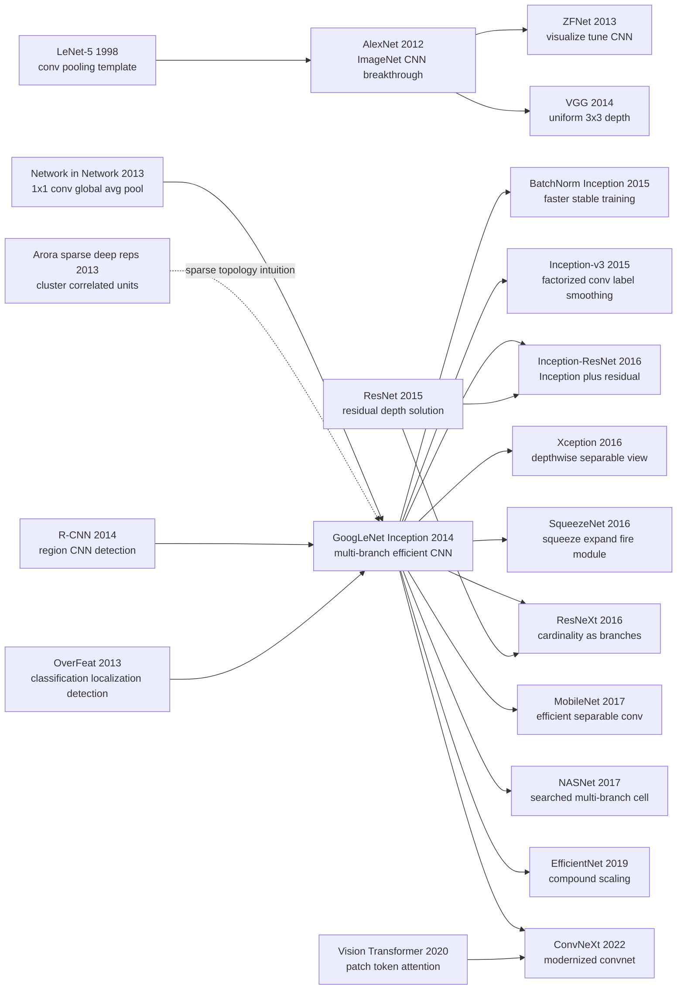

# Inception / GoogLeNet — Making CNNs Deeper by Making Them Wider

> **On September 17, 2014, Christian Szegedy, Wei Liu, Yangqing Jia, Pierre Sermanet, and five co-authors from Google and the University of North Carolina uploaded [arXiv 1409.4842](https://arxiv.org/abs/1409.4842); the paper appeared at CVPR 2015.** The title borrowed its wink from the *Inception* meme, but the engineering claim was serious: in the same ImageNet season where VGG pushed CNNs toward “deeper, wider, heavier,” GoogLeNet showed that a 22-layer network could use roughly 5 million parameters, about 1.5B multiply-adds, and still win ILSVRC 2014 with 6.67% top-5 error. The Inception module did not simply stack more layers. It placed 1x1, 3x3, 5x5, and pooling paths side by side, then used 1x1 reductions to keep expensive branches under control. After this paper, CNN architecture design was no longer only a contest of size; it became a question of where every unit of computation should be spent.

## TL;DR

Szegedy, Liu, Jia, Sermanet, and five co-authors' CVPR 2015 paper changed ImageNet-era CNN scaling from “keep stacking AlexNet/VGG-style $3\times3$ or $5\times5$ convolutions” into “compare several receptive-field sizes inside the same layer, then use $1\times1$ bottlenecks to keep computation bounded”: a typical Inception block can be written as $y=\mathrm{concat}(f_{1\times1}(x), f_{3\times3}(r_3(x)), f_{5\times5}(r_5(x)), p(x))$. The baseline it directly broke was not a toy model but the brute-force widening path. AlexNet had roughly 60M parameters and 15.3% ILSVRC 2012 top-5 error; GoogLeNet used roughly 5M parameters, 22 parameterized layers, about 1.5B multiply-adds, and won ILSVRC 2014 with 6.67% top-5 error, even beating the same-season VGG result of 7.32% while using far fewer parameters. The hidden lesson is that Inception's real legacy is not merely “multi-branch CNN blocks.” It made compute-budgeted architecture design a first-class research problem: [ResNet (2015)](2015_resnet.md) would soon solve the optimization side of depth, while [EfficientNet (2019)](https://arxiv.org/abs/1905.11946) and NASNet later automated the kind of width/depth/resolution balancing that Inception still performed by hand.

---

## Historical Context

### After AlexNet, ImageNet became an architecture arms race

After AlexNet won ImageNet in 2012, the central computer-vision question quickly shifted from “can deep CNNs work at all?” to “how do we make CNNs larger?” AlexNet's answer was direct: more convolutional layers, larger fully connected layers, and more GPU training craft. ZFNet in 2013 kept moving along that line, tuning filter sizes and strides while using visualization to understand low and middle features. VGG in 2014 compressed the answer into an austere rule: repeatedly stack small $3\times3$ convolutions and push depth to 16 or 19 layers.

That route worked, but it exposed a practical limit: parameters and computation were growing fast. AlexNet used roughly 60M parameters, with many of them in fully connected layers; VGG was cleaner but heavier, with VGG-16 reaching roughly 138M parameters. For Google in 2014, this was not a purely academic concern. Search, Photos, ads, mobile use, and server-side inference all required models that did more than look good in a competition room. They had to run at product scale.

| Year | Representative model | Architectural intuition | Cost | Inception's answer |
|---|---|---|---|---|
| 2012 | AlexNet | large convolutions + GPU + dropout | FC-heavy, about 60M parameters | keep the CNN victory, remove the heavy FC tail |
| 2013 | ZFNet | tune filters and strides | still a single-path CNN | keep using ImageNet feedback to tune structure |
| 2014 | VGG | repeat small convolutions | heavy in parameters and FLOPs | reorganize computation inside each layer |
| 2014 | GoogLeNet | multi-branch + bottleneck | manually complex | win ILSVRC with about 5M parameters |

This is Inception's historical position: it does not reject AlexNet or VGG, but offers another scaling route on the same ImageNet battlefield. VGG says, “make the network deep with uniform small convolutions.” GoogLeNet says, “each layer should already contain multiple receptive fields; the real problem is how to keep those fields from exploding computation.”

### “Going Deeper” meant both deeper and nested

The title “Going Deeper with Convolutions” carries two meanings. The first is literal: GoogLeNet has 22 parameterized layers, deeper than AlexNet's 8 and VGG's 16/19. The second comes from the *Inception* film joke and the “we need to go deeper” meme: the network is not just a linear stack, but a layer that contains a small internal network structure, the Inception module.

That matters because the Inception module changed a CNN “layer” from a single operator into a composable unit. In the traditional view, a layer is usually one convolution or one pooling operation. Inception places $1\times1$, $3\times3$, $5\times5$, and pooling paths side by side, then concatenates their outputs as the input to the next layer. “Depth” is no longer only vertical depth; a single layer also has horizontal structure.

This foreshadowed later CNN design practice. ResNeXt's cardinality, DenseNet's dense connectivity, NASNet's cell, and EfficientNet's compound scaling all treat the internal topology of a block as a design object. Inception is an early marker on that road: a CNN becomes a designed computation graph, not merely a sequential list.

### What engineering constraint was the Google team solving?

The author team spans Google and the University of North Carolina, with Christian Szegedy, Yangqing Jia, Pierre Sermanet, Dragomir Anguelov, Dumitru Erhan, Vincent Vanhoucke, and Andrew Rabinovich embedded in Google's vision and large-scale learning environment. The paper explicitly mentions the DistBelief training system and explicitly frames mobile and embedded power, memory, and inference cost as design concerns.

That explains why the paper is never “maximize accuracy regardless of cost.” It repeatedly emphasizes computational budget, even targeting about 1.5B multiply-adds at inference. Many 2014 ImageNet systems could squeeze out more score with ensembles, multi-crop testing, external data, or larger models. The Google team cared about a different question: if every user request might eventually pass through a vision model, how should each unit of computation be spent?

So Inception looks like an architecture paper, but it is also a systems paper. Its aesthetic is not “be complicated.” Its aesthetic is “compress an ideal sparse structure into dense blocks that hardware can execute well.” That is exactly the product of Google engineering culture meeting 2014 deep-learning research.

### Immediate predecessors: NIN, sparse theory, and the R-CNN pipeline

Inception did not appear from nowhere. The most direct predecessor is Network in Network (NIN): Lin, Chen, and Yan proposed $1\times1$ micro-network layers in 2013 to increase convolutional expressivity, and used global average pooling to replace a heavy fully connected classifier head. GoogLeNet uses $1\times1$ convolution heavily, but changes its role into a “dimensionality valve”: first compress channels with $1\times1$, then run expensive $3\times3$ or $5\times5$ convolution.

Another predecessor comes from Arora, Bhaskara, Ge, and Ma's theory of sparse deep representations. The paper borrows the Hebbian intuition “neurons that fire together, wire together”: if the optimal network is sparse along the feature dimension, then one could find correlated clusters and connect them into the next layer. The problem is that 2014 GPU/CPU numerical libraries were not friendly to irregular sparse matrices; fast execution came from regular dense computation. Inception's compromise is to approximate an ideal sparse topology with several relatively dense branches.

For detection, the immediate context was R-CNN, OverFeat, and MultiBox. GoogLeNet was not only a classifier; it was inserted into an R-CNN-style detection pipeline as the region classifier, with region proposals built from Selective Search and MultiBox. In other words, Inception's influence was broader than “a better classifier.” It participated in the 2014 transition from hand-engineered features to deep features in detection systems.

### Compute, data, and evaluation in 2014

The training setup carries the marks of the pre-TensorFlow and pre-PyTorch era. The paper used Google's DistBelief, trained with asynchronous SGD plus momentum, decayed the learning rate by 4% every 8 epochs, and used Polyak averaging for the final inference model. The authors note that although their implementation was CPU-based, a rough estimate suggests that a few high-end GPUs could train GoogLeNet to convergence within a week. That sentence feels dated in 2026, but it was an honest engineering statement in 2014.

The data and evaluation also define the target. Classification is ILSVRC 2014: about 1.2M training images, 50K validation images, 100K test images, 1000 classes, ranked by top-5 error. Detection has 200 classes and mAP as the metric. The final competition submission relies heavily on ensemble and multi-crop evaluation: 7 models, 144 crops per image, and 1008 predictions averaged. This means single-model efficiency mattered, but the official competition number was still a product of 2014 competition engineering.

### Why the paper did not look like the future in 2015, yet shaped it

Judged by surface form, Inception does not look as future-proof as ResNet's one-line residual idea, nor as universal as Transformer. It contains many hand-set numbers: branch widths, where to place auxiliary classifiers, how many crop scales to use, how many models to ensemble. It even admits that many choices are locally tuned rather than theoretically optimal.

But that manual complexity revealed the real CNN architecture problem of 2015: models had become too large for simple linear intuition, and architecture design was becoming resource allocation. Inception's lasting influence is not that everyone kept a 5x5 branch forever. It forced researchers to ask how channels, receptive fields, depth, width, resolution, branch count, and auxiliary training signals trade against one another. ResNeXt, MobileNet, NASNet, EfficientNet, and ConvNeXt all inherited that question.

## Background and Motivation

### The real problem was not “deeper,” but “more useful under a fixed budget”

Section 3 states the motivation plainly: the simplest way to improve a deep network is to increase its size, both in depth and width. But size has two costs. More parameters increase overfitting risk, and more computation quickly exceeds any finite budget. In two chained convolutional layers, uniformly increasing channel count produces roughly quadratic growth in computation; if much of the added capacity ends up close to zero, memory and multiply-adds are being wasted on ineffective connections.

Inception's goal is not blind model compression, but compute reallocation under a fixed budget. It assumes visual features are useful at several scales simultaneously: local texture wants small receptive fields, object parts want medium receptive fields, and larger context wants larger fields or pooling. Instead of deciding in advance that a layer should contain one convolution size, Inception lets several scales compete in parallel and concatenates the results.

### Why “dense approximation of sparsity” instead of direct sparse networks?

In theory, if the optimal topology is sparse, the obvious route is to train irregular sparse connectivity directly. The paper is pragmatic about why that was unattractive: 2014 hardware and numerical libraries were poor at non-uniform sparse structures. Even if arithmetic operations fell by 100x, indexing overhead, cache misses, and engineering complexity could consume the gain. Dense matrix multiplication, by contrast, had been aggressively optimized on CPU and GPU libraries.

Inception is therefore a middle path. It does not train an arbitrary sparse graph; it folds likely sparse correlation clusters into several regular dense branches. $1\times1$, $3\times3$, $5\times5$, and pooling are all hardware-friendly components; 1x1 reduction reduces the channel count before expensive branches. It is not the purest sparse model, but it was the sparse approximation that could run, train, and win in 2014.

---

## Method Deep Dive

### Overall framework

GoogLeNet's trunk can be read in three parts. The first two layers remain conventional convolution and pooling, quickly reducing a 224x224 RGB input to a smaller spatial grid. The middle body consists of 9 Inception modules, from 3a/3b through 5a/5b, gradually increasing channel count and abstraction level. The tail uses global average pooling, dropout, and a linear classifier to produce a 1000-class softmax. The paper counts 22 layers with parameters, about 27 layers if pooling is counted; from a block perspective, the computation graph contains roughly 100 independent building blocks.

To understand this paper, it is not enough to remember “multi-branch.” Inception works because four things hold together: multi-scale branches provide width, 1x1 reduction prevents cost explosion, stacked modules turn local multi-scale processing into global depth, and auxiliary classifiers plus global average pooling keep training and parameter efficiency under control. Remove any one of these pieces and the system can become a beautiful diagram that is too expensive to run.

| Component | Location | Problem solved | Later inheritance |
|---|---|---|---|
| multi-scale branches | inside each Inception module | process different receptive fields at one layer | ResNeXt / NAS cell / mixed ops |
| 1x1 reduction | before 3x3 and 5x5 | control channels and FLOPs | bottleneck / squeeze layer |
| module stacking | from 3a to 5b | turn local structure into a deep network | Inception-v3/v4 / Xception |
| auxiliary classifiers | outputs of 4a and 4d | improve gradient flow and regularization | deep supervision / aux loss |

### Key design 1: Multi-scale Inception module — seeing several sizes inside one layer

**Function**: Convert a CNN layer that must choose one kernel size into a layer that runs $1\times1$, $3\times3$, $5\times5$, and pooling paths in parallel, then concatenates them along the channel dimension.

$$
y = \operatorname{concat}\big(f_{1\times1}(x),\ f_{3\times3}(x),\ f_{5\times5}(x),\ \operatorname{proj}(\operatorname{pool}(x))\big)
$$

Intuitively, the $1\times1$ path performs channel recombination, the $3\times3$ path captures local texture and parts, the $5\times5$ path captures larger context, and the pooling path preserves some translation robustness. A conventional CNN decides in advance whether a layer should be 3x3 or 5x5; Inception lets those choices coexist and gives later channel mixing the job of selecting useful combinations.

```python
def naive_inception(x, conv1, conv3, conv5, pool_proj, max_pool):
    branch_1 = conv1(x)
    branch_3 = conv3(x)
    branch_5 = conv5(x)
    branch_p = pool_proj(max_pool(x))
    return torch.cat([branch_1, branch_3, branch_5, branch_p], dim=1)
```

| Design choice | What it solves | Cost | Why keep it |
|---|---|---|---|
| 1x1 branch | channel mixing + nonlinearity | low | cheap feature recombination |
| 3x3 branch | local texture and mid-size parts | medium | the ImageNet workhorse field |
| 5x5 branch | larger context | high | gives the module multi-scale capacity |

**Design rationale**: ImageNet objects vary substantially in scale, and features inside one layer do not necessarily share a single optimal receptive field. A multi-branch module preserves several spatial scales within one stage, avoiding the need to force all features through one kernel size. Later papers simplified, replaced, or searched this design, but they kept the idea that a block can contain several operators internally.

### Key design 2: 1x1 reduction — cheap projection before expensive branches

**Function**: Apply $1\times1$ convolution before $3\times3$ and $5\times5$ convolution to reduce input channel count and bring otherwise explosive FLOPs back under budget.

$$
\operatorname{cost}(k\times k) = H W C_{in} C_{out} k^2,\qquad
\operatorname{cost}_{reduced} = H W C_{in} C_r + H W C_r C_{out} k^2
$$

If the input has 192 channels and the branch outputs 32 $5\times5$ filters, direct convolution needs $192\times32\times25$ weights. Reducing first to 16 channels makes the convolutional part only $16\times32\times25$, plus a $192\times16$ 1x1 projection. Table 1's “#3x3 reduce / #5x5 reduce / pool proj” columns are the paper's open bookkeeping of each module's budget allocation.

```python
class InceptionReduction(torch.nn.Module):
    def __init__(self, in_ch, reduce_5, out_5):
        super().__init__()
        self.reduce = torch.nn.Conv2d(in_ch, reduce_5, kernel_size=1)
        self.conv5 = torch.nn.Conv2d(reduce_5, out_5, kernel_size=5, padding=2)

    def forward(self, x):
        hidden = torch.relu(self.reduce(x))
        return torch.relu(self.conv5(hidden))
```

| Route | Parameter trend | Expressivity | Hardware friendliness |
|---|---|---|---|
| direct 5x5 | grows with $C_{in}C_{out}25$ | strong | medium, but too expensive |
| 1x1 → 5x5 | extra projection but much lower FLOPs | strong, slightly bottlenecked | high |
| only 1x1 | cheapest | weak spatial modeling | high |

**Design rationale**: This is Inception's central efficiency trick. Without reduction, multi-scale branches quickly cause channel concatenation to explode; with reduction, even expensive 5x5 branches can remain in the design. Bottleneck ResNet, SqueezeNet fire modules, and MobileNet pointwise convolutions all inherit the same idea: expensive spatial operators should be guarded by cheap channel projections.

### Key design 3: From module to network — using a stage schedule to control depth and width

**Function**: Do not blindly copy one Inception module 9 times. As spatial resolution drops, increase channel count across the 3a/3b, 4a-4e, and 5a/5b stage schedule.

$$
C_{out}^{(l)} = C_{1\times1}^{(l)} + C_{3\times3}^{(l)} + C_{5\times5}^{(l)} + C_{pool}^{(l)},\qquad
H_{l+1}, W_{l+1} \downarrow \Rightarrow C_{out}^{(l+1)} \uparrow
$$

Table 1 is the most engineering-heavy part of the paper. For every module it lists 1x1, 3x3 reduce, 3x3, 5x5 reduce, 5x5, and pool projection channel counts, plus parameter and multiply-add estimates. Higher in the network, spatial size drops, channel count grows, and the ratio of 3x3 and 5x5 branches increases as semantic abstraction rises. This is not mystical theory; it is a hand-written resource schedule.

```python
stage_spec = [
    {"name": "3a", "out": (64, 128, 32, 32)},
    {"name": "3b", "out": (128, 192, 96, 64)},
    {"name": "4a", "out": (192, 208, 48, 64)},
    {"name": "5b", "out": (384, 384, 128, 128)},
]

for spec in stage_spec:
    channels = sum(spec["out"])
    print(spec["name"], channels)
```

| Stage | Spatial trend | Channel trend | Design meaning |
|---|---|---|---|
| 3a/3b | still relatively high resolution | cautious increase | avoid early FLOP explosion |
| 4a-4e | mid resolution | capacity concentrated here | main representation body |
| 5a/5b | low resolution | high channels | high semantics at low spatial cost |

**Design rationale**: Inception turns both depth and width into knobs, but many knobs create combinatorial complexity. The stage schedule is manual NAS: the authors do not search the whole space, but encode experience into a table of branch widths. Its descendants are clear: Inception-v3 factorization, NASNet cell search, and EfficientNet compound scaling all automate or regularize this hand-written table.

### Key design 4: Auxiliary classifiers and global average pooling — making a deep network trainable and compact

**Function**: Attach two small classifier heads after Inception 4a and 4d, add their losses to the total objective with weight 0.3, and use average pooling near the end instead of a heavy fully connected stack.

$$
\mathcal{L} = \mathcal{L}_{main} + 0.3\mathcal{L}_{aux,4a} + 0.3\mathcal{L}_{aux,4d}
$$

The auxiliary classifiers have two jobs. First, they inject direct supervision into the middle of a 22-layer network, easing gradient propagation. Second, they act as regularization by forcing intermediate features to be discriminative. At inference time the side heads are discarded, so they do not increase deployment cost. Global average pooling comes from the NIN line: average away spatial dimensions, reduce fully connected parameters, and make the model closer to “convolutional features plus a light classifier.”

```python
def googlenet_loss(logits_main, logits_aux1, logits_aux2, target):
    ce = torch.nn.functional.cross_entropy
    main = ce(logits_main, target)
    aux1 = ce(logits_aux1, target)
    aux2 = ce(logits_aux2, target)
    return main + 0.3 * aux1 + 0.3 * aux2
```

| Component | During training | During inference | Role |
|---|---|---|---|
| auxiliary head 4a | contributes to loss | removed | mid-layer supervision + regularization |
| auxiliary head 4d | contributes to loss | removed | deeper gradient assistance |
| global average pooling | part of trunk | kept | reduce FC parameters |

**Design rationale**: GoogLeNet did not yet have ResNet skip connections or BatchNorm. To train 22 layers, the authors needed extra gradient paths and regularizing signals. Auxiliary classifiers did not become the standard mainstream fix because ResNet and BN solved optimization more directly; however, deep supervision remains common in segmentation, detection, multi-scale outputs, and early-exit networks. Global average pooling, meanwhile, became almost the default classification head for modern CNNs.

---

## Failed Baselines

### What Inception beat at the time

| baseline | Practice at the time | Surface result | Where it lost |
|---|---|---|---|
| AlexNet / SuperVision | large convolutions + heavy FC + about 60M parameters | ILSVRC 2012 top-5 error 15.3% | GoogLeNet rewrote both accuracy and parameter efficiency |
| VGG | uniform $3\times3$ deep stacking | ILSVRC 2014 second place, top-5 error 7.32% | clean but about 138M parameters and costly to deploy |
| naive Inception | directly parallel 1x1/3x3/5x5/pooling | right structural intuition, but compute explosion | cannot stack many layers without 1x1 reduction |

The first baseline is **brute-force model scaling**. AlexNet proved CNNs could win ImageNet, but its parameter structure was heavily imbalanced, with two large fully connected layers dominating the model. VGG made the structure almost textbook-clean and performed extremely well, but it paid for simplicity with parameters and FLOPs. GoogLeNet's counterargument was not “I win because I am deeper,” but “I win with roughly twelve times fewer parameters.” That forced the 2014 CNN race to take parameter efficiency seriously rather than treating the leaderboard as the only objective.

The second baseline is the **naive multi-scale module**. If one only looks at Figure 2(a), Inception is easy to misread as “put several kernels in parallel.” The paper immediately points out that this naive version makes the 5x5 branch and pooling projection inflate the output channel count, causing computation to spiral after a few stacked modules. The working version is Figure 2(b): reduce channels with $1\times1$ before expensive convolution. Multi-scale is the idea; bottlenecking is the engineering condition that lets the idea survive.

The third baseline is **direct sparse connectivity**. The paper's theory motivation comes from sparse topology, but the authors do not actually train arbitrary sparse networks because contemporary hardware was poor at irregularity. Direct sparse models might reduce arithmetic on paper, yet lose the gain to memory access, cache misses, kernel launch overhead, and maintenance complexity. Inception approximates sparse clusters with dense branches, essentially acknowledging the gap between theoretical optimality and what machines run quickly.

The fourth baseline is **only swapping the classifier without changing the detection system**. GoogLeNet's detection submission still uses an R-CNN-style pipeline: proposals first, CNN classification second. The paper does not invent an end-to-end detector and does not use bounding-box regression, explicitly citing time constraints. It wins detection through a stronger region classifier, MultiBox proposal supplementation, and ensembling. That means Inception's detection victory was not yet a paradigm victory; Fast R-CNN, Faster R-CNN, and YOLO would soon supply that shift.

### Failed experiments acknowledged by the authors

The paper is candid in Sections 3 and 6: Inception's design principles are motivated by sparse-structure theory and Hebbian intuition, but the authors do not prove that those principles necessarily produce an optimal CNN. Instead, they write that real verification would require automated topology-construction tools to find similar, better topologies in other domains. In other words, GoogLeNet won the competition, but “was this the inevitable result of the theory?” remained open.

Another acknowledged limitation is that the training recipe is unstable and hard to summarize. The paper says image sampling methods changed substantially in the months before the competition, already-converged models were trained further under other options, and dropout and learning rate also shifted. The authors even say it is hard to give one definitive prescription for the most effective training method. This is the mark of a competition system: the final result is real, but not fully explained by a clean ablation.

The third weak point is the need for auxiliary classifiers. They were designed to help gradient propagation and regularization, but once BatchNorm and ResNet appeared, auxiliary classifier heads quickly receded from ordinary classification backbones. In hindsight, they look more like temporary scaffolding from a period without better optimization tools than a permanent answer for deep CNNs.

### The real counter-baseline: VGG's simplicity won mindshare for a long time

Interestingly, GoogLeNet beat VGG in ILSVRC 2014 ranking, but VGG was for a while easier to teach and transfer. The reason is simple: VGG's rule is “use 3x3 everywhere and repeat,” which anyone can understand and reimplement at a glance. GoogLeNet's Table 1 is a dense branch-width schedule that is much harder to explain in a lecture.

This is not exactly Inception's failure, but it is an important lesson: **a more efficient structure is not always the easiest default template**. VGG is heavy but simple; GoogLeNet is efficient but complex. Part of ResNet's later impact came from satisfying performance, scalability, and one-sentence structure at the same time: $y=F(x)+x$. Inception's historical role is therefore closer to “posing the resource-allocation problem and winning once” than to “providing the final universal answer.”

## Key Experimental Data

### ILSVRC 2014 classification results

The paper's central number is the ILSVRC 2014 classification top-5 error: GoogLeNet's final submission reaches 6.67% on both validation and test data, ranking first. That is a 56.5% relative error reduction over the 15.3% result of AlexNet / SuperVision in 2012, and clearly below the 2013 Clarifai result. The same-season VGG entry ranks second, at about 7.32% top-5 error.

| Model / team | Year | Rank | top-5 error | Note |
|---|---|---|---|---|
| SuperVision / AlexNet | 2012 | 1st | 15.3% | deep CNN breakthrough |
| Clarifai / ZFNet line | 2013 | 1st | 11.7% | refined AlexNet route |
| MSRA | 2014 | 3rd | 8.06% | strong same-year CNN system |
| VGG | 2014 | 2nd | 7.32% | clean deep-stacking route |
| GoogLeNet | 2014 | 1st | 6.67% | Inception ensemble |

This table matters only when read with parameter count. VGG's 7.32% is strong, but it is far larger than GoogLeNet; GoogLeNet's win shows that by 2014 architecture innovation was no longer simply “larger models are more accurate,” but “smarter structure can improve accuracy and parameter efficiency at the same time.”

### Architecture and training details

| Item | Configuration |
|---|---|
| input | 224x224 RGB with mean subtraction |
| trunk depth | 22 parameterized layers, about 27 with pooling |
| Inception modules | 9 modules: 3a/3b, 4a-4e, 5a/5b |
| parameter count | about 5M, roughly 1/12 the AlexNet scale |
| inference budget | about 1.5B multiply-adds |
| training | DistBelief, asynchronous SGD, momentum 0.9 |
| auxiliary loss | two heads at 4a and 4d, each weighted 0.3 |

These details show that GoogLeNet is a model under strong engineering constraints. It has no later BatchNorm, no residual connection, and no standardized PyTorch recipe; it pushes the system through branch scheduling, 1x1 reduction, auxiliary loss, data augmentation, and ensembling.

### How much did multi-crop and ensembling contribute?

Table 3 decomposes validation-set test strategy. One model and one crop is the base. One model with 10 crops improves by 0.92 percentage points; one model with 144 crops improves by 2.18 points; 7 models with 144 crops improve by 3.45 points. The official 6.67% is therefore not a naked single-model number; it is architecture plus competition-time test engineering.

| Models | crops / model | Total predictions | Improvement over base |
|---|---|---|---|
| 1 | 1 | 1 | base |
| 1 | 10 | 10 | -0.92% |
| 1 | 144 | 144 | -2.18% |
| 7 | 1 | 7 | -1.98% |
| 7 | 10 | 70 | -2.45% |
| 7 | 144 | 1008 | -3.45% |

This table also explains why modern reproductions should not treat the official competition number as a single-model baseline. Today training reports often use single-crop or limited multi-crop evaluation; ILSVRC 2014 finals used extreme multi-crop plus ensembling. The Inception module's contribution is real, but the leaderboard number carries a strong competition-era signature.

### ILSVRC 2014 detection results

For detection, GoogLeNet uses an R-CNN-like pipeline: Selective Search proposals plus MultiBox proposals to improve proposal coverage, Inception as the region classifier, and finally a 6-ConvNet ensemble that raises performance from around 40% mAP to 43.9% mAP. The paper explicitly states that it did not use bounding-box regression.

| System | Year | Detection rank | mAP | Key component |
|---|---|---|---|---|
| UvA-Euvision | 2013 | 1st | about 22.6% | Fisher vectors |
| Deep Insight | 2014 | 3rd | around 40% | CNN + ensemble |
| GoogLeNet | 2014 | 1st | 43.9% | Inception region classifier + proposals |

The historical meaning here is that Inception was not the endpoint of detection paradigms, but it showed that a stronger CNN backbone could significantly raise the ceiling of region-based detectors. Soon Fast R-CNN and Faster R-CNN would integrate feature extraction, proposal, and classification more tightly; GoogLeNet's role became an early demonstration of the “stronger backbone” effect.

### Key findings

- **Parameter efficiency is the real victory**: 6.67% top-5 error is flashy, but the comparison between about 5M GoogLeNet parameters, about 60M AlexNet parameters, and about 138M VGG parameters better captures the paper's value.
- **1x1 reduction is the line between success and failure**: naive multi-branch design is easy to imagine; stacking it into a 22-layer network under budget is the contribution.
- **Auxiliary classifiers are a period-specific artifact**: they helped train a deep network, but BN and ResNet later solved gradient and optimization issues more cleanly.
- **Competition numbers need decomposition**: 7 models, 144 crops, and 1008 predictions are part of ILSVRC 2014 engineering; architecture gain and test-time augmentation gain should be separated today.
- **Detection still sits inside the R-CNN frame**: GoogLeNet is a strong backbone, not an end-to-end detector; the detection-pipeline revolution happens immediately afterward.

---

## Idea Lineage



### Prehistory (what forced it into existence)

- **LeNet-5 → AlexNet**: Provided the basic route of convolution, nonlinearity, pooling, and classifier head. Inception's name pays homage to LeNet, while technically standing after AlexNet proved ImageNet CNNs could work.
- **ZFNet / OverFeat**: Showed that the 2013-2014 mainstream was still tuning filters, strides, feature visualization, and localization/detection extensions inside single-path CNNs. Inception jumps out of that frame by turning a single-path layer into a multi-path block.
- **VGG**: The strongest same-year contrast. VGG's philosophy is “uniform, deep, simple”; Inception's philosophy is “multi-branch, budget-controlled, manually scheduled.” Together they define two aesthetic poles of 2014 CNN architecture.
- **Network in Network**: Supplies the two key tools of $1\times1$ convolution and global average pooling. Inception's novelty is not first use of 1x1, but turning 1x1 into a bottleneck before expensive branches.
- **Arora sparse-representation theory**: Gives the paper a language of “perhaps optimal topology is sparse and clustered.” That motivation is less frequently repeated today, but it explains why Inception treats dense branches as hardware-friendly approximations to sparse topology.
- **R-CNN / MultiBox**: Made GoogLeNet more than a classifier; it also became the region classifier inside a detection pipeline. Inception's role in detection is backbone strengthening, not pipeline invention.

### Afterlife (descendants)

- **BatchNorm Inception / Inception-v2/v3**: Szegedy's own line quickly added training stability and structural factorization, splitting $5\times5$ into two $3\times3$ convolutions and $n\times n$ into $1\times n$ plus $n\times1$, continuing the “save compute while keeping expression” program.
- **Inception-ResNet**: Admits that ResNet solves deep optimization more cleanly and merges residual connections with Inception blocks. It marks Inception absorbing ResNet rather than being simply replaced by it.
- **Xception / MobileNet**: Chollet interprets Inception as an intermediate point between regular convolution and depthwise separable convolution; MobileNet turns depthwise plus pointwise decomposition into the mobile-CNN standard. This is the cleanest engineering descendant of Inception's efficiency idea.
- **SqueezeNet / ResNeXt**: SqueezeNet's fire module is a lightweight 1x1 squeeze plus multi-branch expand variant; ResNeXt names branch count as cardinality and rewrites Inception's multi-path capacity in a more regular form.
- **NASNet / EfficientNet**: NASNet searches cells automatically; EfficientNet balances depth, width, and resolution automatically. Both take over the task Inception did not finish: turning hand-written branch schedules into searchable or scalable rules.
- **ConvNeXt**: After Transformer pressure, ConvNeXt reorganizes CNN design and shows convnets can remain competitive with modern training and block changes. ConvNeXt does not look directly like Inception, but it inherits the question of how architecture details determine compute efficiency.

### Misreadings / simplifications

- **“Inception is just multi-scale parallelism”**: Only half true. The contribution is multi-scale parallelism paired with 1x1 reduction; without reduction, Figure 2(a) rapidly explodes computationally.
- **“GoogLeNet won because it was deeper than VGG”**: Misleading. The 22-layer depth matters, but the key is lower error with roughly 5M parameters and controlled FLOPs. Depth is the result; resource allocation is the theme.
- **“Auxiliary classifiers are the core legacy”**: Not accurate. Auxiliary classifiers helped at the time, but BatchNorm and residual connections soon replaced them in ordinary classifiers. Their long-tail impact is more deep supervision than standard ImageNet classification.
- **“Inception is obsolete hand design before NAS”**: Too simple. NAS did automate cell search, but many mixed operations, multi-branch patterns, and bottlenecks inside search spaces trace back to Inception. Hand design was not wrong; it was compressed experience before automated search.
- **“The CNN era ended with ViT, so Inception is only historical”**: Incorrect. Mobile, real-time, and small-data vision still heavily use convolutional inductive bias; Inception's problem of allocating computation under a fixed budget remains alive in ViT, Mamba, and multimodal models as well.

---

## Modern Perspective

### Assumptions that no longer hold: hand-crafted multi-branch design would dominate CNN architecture

Looking back from 2026, the easiest mistake is to summarize GoogLeNet as “more branches are better.” That assumption did not hold. The Inception module is indeed multi-branch, but its real target was the resource-allocation problem of 2014: before BatchNorm, before residual connections, before mature NAS, and before standard mobile benchmarks, how could a 22-layer CNN be both accurate on ImageNet and bounded in computation? The following decade showed that **multi-branch form was one answer, not the underlying question**.

The first weakened assumption is that large-kernel branches must explicitly remain inside every module. Inception-v2/v3 soon split $5\times5$ into two $3\times3$ convolutions, then split $n\times n$ into $1\times n$ plus $n\times1$. MobileNet and Xception pushed the decomposition further by separating spatial convolution from channel mixing. By the era of ConvNeXt and modern efficient CNNs, large receptive fields are often built through depthwise convolution, dilated convolution, attention-like mixing, or accumulated depth across stages rather than a literal 5x5 branch in every block.

The second weakened assumption is that auxiliary classifiers are necessary scaffolding for deep networks. GoogLeNet had neither BatchNorm nor skip connections, so the 4a/4d auxiliary losses made sense. After BatchNorm in 2015 and ResNet in 2015/2016, ordinary classification backbones rarely needed such side heads. The idea survives in deep supervision, early exits, multi-scale segmentation, and detection heads, but it is no longer a central component of standard image classifiers.

The third weakened assumption is that sparse-theory intuition can reliably produce a hand-designed topology. The paper borrows Hebbian principles and sparse-representation theory, but the working GoogLeNet is a handwritten branch-width schedule. That schedule won the competition, yet it did not become a portable derivation method. Later NAS, compound scaling, and latency-aware design showed that hand intuition remains useful, but search, scaling rules, or hardware feedback are needed to turn it into reusable practice.

| 2014 implicit assumption | Why it made sense then | 2026 view | Later replacement |
|---|---|---|---|
| explicit 1x1/3x3/5x5/pool branches would persist | multi-scale ImageNet features were genuinely useful | the branch shape was simplified, the question remained | factorized conv / depthwise separable conv / NAS cells |
| auxiliary classifiers were key to deep training | no BN or ResNet, weak gradient paths | mostly gone from ordinary backbones | BatchNorm / residual connection / better initialization |
| a hand-written branch schedule was broadly reusable | ILSVRC allowed heavy tuning | interpretable but hard to transfer | EfficientNet compound scaling / hardware-aware NAS |
| 144 crops plus ensembles were reasonable evaluation | the ILSVRC final chased the last 0.1% | not representative of deployable single models | single-crop / latency / throughput / energy reporting |
| sparse theory directly guides CNN topology | it gave multi-branch design a theory language | limited explanatory power; engineering choices dominated | empirical scaling / ablation / learned architecture search |

### If rewritten today: it would look like a constrained compute cell

If “Going Deeper with Convolutions” were written in 2026, the paper probably would not present Table 1's channel counts as the main contribution. It would describe the Inception module as a hardware-constrained cell. Inputs to the design would include not only ImageNet accuracy, but also latency, activation memory, throughput, energy, kernel efficiency at realistic batch sizes, and training reproducibility. In other words, “budget” would move from motivation prose into the optimization objective.

A modern Inception block might preserve three old ingredients: $1\times1$ channel projection, multi-scale spatial mixing, and concat or additive fusion. It would add four newer ingredients: BatchNorm or LayerNorm, a residual path, depthwise or group convolution, and SE/attention-style channel reweighting. It would not necessarily be the fixed four-path $1\times1/3\times3/5\times5/pool$ module. A more modern description would be closer to $y=x+\phi(\mathrm{mix}_{k\in\mathcal{K}}(\psi_k(x)))$, where $\mathcal{K}$ is chosen by search or hardware constraints.

Training and evaluation would also change. The 2014 paper could honestly say that image sampling changed repeatedly in the months before the competition. Today's standard would demand augmentation details, optimizer, warmup, weight decay, EMA, label smoothing, stochastic depth, resolution schedule, and a clear separation between single-model, ensemble, and test-time augmentation results. GoogLeNet's 6.67% remains a historical number, but a modern reader would also ask: without ensembling and without 144 crops, under the same training recipe, how much latency and energy does the architecture save relative to VGG, ResNet, ConvNeXt, and ViT?

| Modern rewrite item | 2015 paper version | Likely 2026 version | Purpose |
|---|---|---|---|
| module definition | hand-written channel table from 3a to 5b | parameterized cell plus search/scaling rule | make the structure transferable |
| spatial operator | parallel 3x3 and 5x5 | factorized / depthwise / large-kernel conv | preserve receptive field at lower cost |
| optimization tool | auxiliary loss plus dropout | normalization + residual path + stochastic depth | train deeper networks more stably |
| evaluation metric | top-5 error plus ensemble result | accuracy-latency-memory-energy Pareto | match real deployment |
| reproducibility | DistBelief and competition recipe description | code, logs, single-crop checkpoints | reduce ambiguity in historical numbers |

### What still holds: 1x1 bottlenecks and budget awareness did not age out

The outdated part of Inception is the exact module table, not the underlying instinct. $1\times1$ convolution as channel projection and bottleneck has barely disappeared: ResNet bottlenecks use it to compress and restore channels, SqueezeNet uses it to squeeze, MobileNet uses pointwise convolution for cross-channel mixing, and ConvNeXt-style CNNs often put a channel MLP inside the block. Even in Transformers, the two linear projections in the MLP play an analogous role: expand or compress channels, apply nonlinearity, then mix features cheaply.

More importantly, Inception made “how each layer spends FLOPs” explicit. AlexNet and VGG mostly ask how deep and wide the whole network should be. GoogLeNet asks how much computation within a layer should go to 1x1, 3x3, 5x5, and pooling. That question later acquired many names: cardinality, cell search, compound scaling, operator mix, latency-aware backbones, token mixing. The vocabulary changed; the resource-allocation problem did not.

This is why Inception's influence has outlived its surface geometry. Few people today implement original GoogLeNet from scratch as the strongest backbone. But whenever a model places a bottleneck before an expensive operator, allocates channels across several operations inside a block, or reports an accuracy-latency Pareto curve, it is still working inside the problem frame Inception helped establish.

### What should not be copied today: complexity, evaluation, and theory narrative

The least portable part of original GoogLeNet is its complexity. Every number in Table 1 has historical meaning, but the table is not the best starting point for 2026 architecture design. A hand-written branch-width schedule is hard to read, expensive to transfer, and difficult to explain: did each channel count come from theory, ablation, or competition tuning? In modern engineering, if a block requires a long table to define, it is usually regularized, searched, or replaced with a simpler scalable module.

The second thing not to copy is the evaluation style. Seven models, 144 crops per image, and 1008 predictions were a reasonable ILSVRC 2014 competition strategy, but they blur the boundary between model architecture and test-time engineering. When retelling Inception's contribution today, the official first-place result should be separated from the single-model architecture. Otherwise readers may treat 6.67% as a clean backbone number and miss the contribution of ensembling and heavy test-time augmentation.

The third thing not to copy is the strength of the theory narrative. Hebbian principles and sparse-representation theory gave the paper an elegant motivation, but the result was carried by hardware-friendly dense branches, $1\times1$ reductions, training tricks, and competition engineering. If every design choice is still explained as “optimal sparse topology,” that hides the plainer and more important story: architecture innovation is often a compromise among theory intuition, hardware constraints, data scale, and tuning experience.

### Ten years later: it lost to simpler abstractions, but won the problem definition

ResNet later looked more like the final answer because residual connections offered a one-sentence reusable optimization abstraction. MobileNet and Xception looked more like standardized efficiency routes because depthwise separable convolution was more regular and easier to deploy. EfficientNet rewrote hand balancing as compound scaling. If we judge by family popularity, original GoogLeNet was indeed covered by its descendants.

That does not make it less classic. Inception proved something crucial for later vision models in 2014: **a smarter computation graph can improve accuracy and efficiency at the same time**. It moved architecture design from “stack more layers” toward “design the topology inside a block,” and it pulled parameter count, FLOPs, and deployment constraints into the center of deep-vision papers earlier than many competitors. A decade later, many practitioners no longer use the original Inception module; almost every efficient vision model still answers the question it posed: under a fixed budget, which connections deserve to remain, which computations should be compressed, and which scales should be represented in parallel or by factorization?


---

> 🌐 [中文版](/era2_deep_renaissance/2015_inception/) · 📚 awesome-papers project · CC-BY-NC