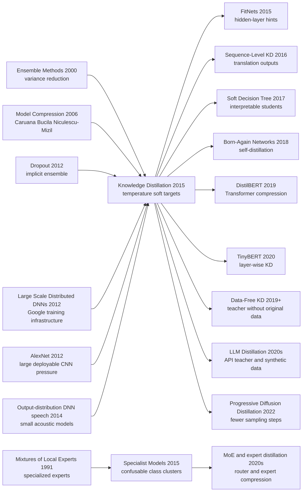

# Knowledge Distillation — Pouring a Large Model's Dark Knowledge into a Small One

> **On March 9, 2015, Geoffrey Hinton, Oriol Vinyals, and Jeff Dean uploaded [arXiv:1503.02531](https://arxiv.org/abs/1503.02531) with a title that sounded almost like an engineering note: _Distilling the Knowledge in a Neural Network_.** The paper did not introduce a new architecture. It changed what “knowledge in a model” meant: not just weights, not just the top-1 answer, but the relative probabilities assigned to wrong classes. A 2×800 MNIST student trained with temperature-20 soft targets cut its errors from 146 to 74, nearly matching a 2×1200 dropout teacher with 67 errors; an Android voice-search-style acoustic model absorbed most of a 10-model ensemble's frame-accuracy gain into one deployable network. From BERT compression and LLM synthetic supervision to few-step diffusion sampling, “teacher-student” became one of the default verbs of model deployment.

## TL;DR

Hinton, Vinyals, and Dean's 2015 NIPS Deep Learning Workshop / arXiv paper turned “deploy a small model” from manual pruning or retraining into a teacher-student objective: train the student to match the teacher's softened distribution $q_i=\exp(z_i/T)/\sum_j\exp(z_j/T)$. A high-temperature softmax exposes probability ratios that ordinary hard-label training throws away, so the student can learn that one handwritten 2 is more 3-like than 7-like; in the high-temperature, zero-mean-logit limit, the method becomes logit matching. The defeated baseline is the same student trained only on hard labels: on MNIST, a 2×800 student drops from 146 errors to 74, nearly matching the 2×1200 dropout teacher's 67; in an Android voice-search acoustic model, a 10-model ensemble's 61.1% frame accuracy is distilled into a single 60.8% model, with both reaching 10.7% WER. The lineage starts with [Dropout (2012)](2012_dropout.md) as an implicit ensemble and the deployment pressure after [AlexNet (2012)](2012_alexnet.md), then becomes a standard grammar for Transformer compression after [BERT (2018)](../era3_attention/2018_bert.md) and for LLM synthetic supervision. The counter-intuitive lesson is that the student is not merely learning what the teacher gets right; it is learning the teacher's pattern of mistakes.

---

## Historical Context

### In 2015 the pressure point was not training, but deployment

Knowledge Distillation belongs in the narrow 2012-2015 window when deep learning was moving from lab demos into online products. After AlexNet, the field had learned that large neural networks could win; Google, Microsoft, Baidu, Facebook, and others were putting deep models into speech, vision, ads, search, and mobile services. But production systems did not ask the same question as papers. A paper can train another larger model. A service has latency budgets, memory limits, energy constraints, and millions of user requests that must be answered immediately.

The paper opens with a characteristically Hinton analogy: insects have larval and adult forms because feeding and reproduction/travel impose different requirements. Machine learning should not assume that the training model and the deployment model must have the same shape. During training, one can afford a cumbersome model: an ensemble, or a very large model trained for a long time with strong regularization such as dropout. During deployment, one can distill it into a smaller model. The goal is not merely to shrink a weight file; it is to transfer the function learned by the cumbersome model.

### The predecessors that pushed KD to the surface

The first predecessor is ensemble learning. Dietterich's 2000 survey had already made the case that averaging models can reduce variance and improve generalization. The cost was equally obvious: inference grows roughly linearly with the number of models. KD keeps much of the ensemble's generalization behavior while returning deployment cost to one model.

The second predecessor is Buciluă, Caruana, and Niculescu-Mizil's 2006 KDD paper, _Model Compression_. It had already shown that an ensemble's outputs can train a smaller model. Hinton, Vinyals, and Dean turned that route into the deep-learning-era standard form: instead of only matching the final class, and instead of directly regressing logits, use a temperature-raised softmax to expose the similarity structure among classes.

The third predecessor is dropout. Dropout is not a side branch of ensembles; it is part of the inner motivation of this paper. A dropout-trained network can be viewed as averaging an exponential number of weight-sharing submodels. The paper's MNIST teacher is exactly such a strongly regularized dropout network. KD therefore compresses both explicit ensembles and implicit ensembles.

The fourth predecessor is Google's distributed deep-learning infrastructure. Jeff Dean and coauthors' 2012 _Large Scale Distributed Deep Networks_ made very large training runs industrially plausible. That success created a new problem: the richer the training side became, the harder it was for the deployment side to keep up. KD sits exactly inside that tension.

### Why this author team was positioned to write it

The author combination explains the paper's shape. Geoffrey Hinton brought the neural-network, dropout, soft-target, and “knowledge is not the parameters themselves” intuition. Oriol Vinyals was at Google and would soon work across sequence modeling, neural machine translation, and AlphaStar-like systems. Jeff Dean represented Google's large-scale training infrastructure and production-service reality.

That is why the paper does not read like a pure compression trick or a theory note. It moves across three scales at once: MNIST as a controlled laboratory, an Android voice-search-style commercial acoustic model, and JFT as a 100-million-image, 15,000-label industrial vision dataset. Many ideas work at only one of those scales. KD's persuasive force comes from pushing the “dark knowledge” concept from a toy classification setting into industrial deployment.

### Data, compute, and product pressure

The speech experiment captures the pressure cleanly: 8 hidden layers, 2560 ReLU units per layer, a 14,000-way HMM-state softmax, and about 85M parameters. The model trains on roughly 2000 hours of English speech, yielding about 700M frame-level training examples. A single model is already large; a 10-model ensemble of that architecture is heavy for online speech recognition.

The JFT experiment is larger still: 100M labeled images, 15,000 labels, and a baseline CNN that had trained for about six months. Training a full ensemble would have taken years, so the paper introduces specialist models. Each specialist focuses on a cluster of confusable classes, such as bridges, car models, or event photos. Specialists can train in days and in parallel, then combine with a generalist at inference.

That is KD's historical location: for the first time, the training side of deep learning was visibly becoming wealthy, able to train big models, ensembles, and massive-data systems; the deployment side remained constrained by latency, cost, and throughput. Knowledge Distillation built a pipe between those worlds.

---

## Method Deep Dive

### Overall Framework

Knowledge Distillation has a short pipeline: train an expensive teacher, use the teacher to produce soft targets on a transfer set, then train a deployable student to match both the soft targets and, when available, the hard labels. The teacher can be an explicit ensemble or a large dropout-regularized model; the transfer set can be the original training set or unlabeled extra data; the student is the network that will actually be served.

The paper's real change is the shape of the target. Ordinary training compresses each example into a one-hot label: “this is the right class.” Distillation gives the student the teacher's full distribution: “this is how plausible every wrong class is.” That is Hinton's dark knowledge: tiny probabilities assigned to wrong classes, whose relative ratios still matter.

| Component | Role | 2015 choice | Later influence |
|---|---|---|---|
| Cumbersome teacher | Provides high-quality generalization behavior | ensemble or strongly regularized large model | foundation model / API teacher |
| Temperature softmax | Amplifies relative probabilities among wrong classes | tune T manually; MNIST uses T=20 | standard entry point for logit KD |
| Transfer set | Carries the teacher's function behavior | labeled or unlabeled | synthetic data / unlabeled data KD |
| Student objective | Matches soft targets and hard labels | high weight on soft loss, low weight on hard loss | KL + CE mixed loss |
| Specialist models | Focus on confusable class clusters | 61 parallel specialists on JFT | expert routing / class-specialized teachers |

### Key Designs

#### Design 1: Temperature softmax — pulling dark knowledge out of the near-zero region

**Function**: A normal softmax pushes a strong teacher toward nearly one-hot outputs. Wrong-class probabilities may be $10^{-6}$ or $10^{-9}$, so ordinary cross-entropy barely sees them. Temperature $T$ softens the distribution, letting the student see which wrong answers are more reasonable.

$$
q_i = \frac{\exp(z_i/T)}{\sum_j \exp(z_j/T)}
$$

When $T=1$, this is the usual prediction. As $T$ increases, logit gaps shrink and low-probability classes rise. On MNIST-like tasks, the teacher is usually very confident in the correct class, but the information that one 2 looks more like a 3 than a 7 sits in the low-probability tail. Hard labels delete that tail; soft targets turn it into supervision.

The design motivation is not to make the student copy the teacher's mistakes blindly. It is to make the student learn the teacher's local similarity structure. The valuable object is a probability ratio: a BMW image is much closer to another vehicle than to a carrot. That structure carries more information per example than a one-hot label, giving denser gradients with lower variance.

#### Design 2: Soft targets plus hard labels — learn the teacher without forgetting the answer

**Function**: The student cannot always match the teacher exactly, especially when it has lower capacity. If it trains only on soft targets, it may drift slightly away from the correct class; if it trains only on hard labels, it loses dark knowledge. The paper uses a weighted average of two cross-entropies.

$$
\mathcal{L}_{KD}=\alpha T^2\,CE\left(p_T^{teacher},p_T^{student}\right)+(1-\alpha)\,CE\left(y,p_1^{student}\right)
$$

Here $p_T$ is the distribution at temperature $T$, while $p_1$ is the ordinary temperature-1 distribution used at inference. The $T^2$ factor is not decoration: the paper notes that gradients from soft targets scale roughly as $1/T^2$, so without multiplying them back, changing the temperature would silently change the balance between soft and hard losses.

```python
def distillation_loss(student_logits, teacher_logits, labels, temperature=4.0, soft_weight=0.9):
    teacher_probs = softmax(teacher_logits / temperature)
    student_log_probs = log_softmax(student_logits / temperature)
    soft_loss = kl_divergence(student_log_probs, teacher_probs) * (temperature ** 2)
    hard_loss = cross_entropy(student_logits, labels)
    return soft_weight * soft_loss + (1.0 - soft_weight) * hard_loss
```

The design motivation is practical: the teacher distribution supplies the generalization behavior, while hard labels gently pull the student back toward the true answer. The paper observes that the hard-label loss often needs a much lower weight. That foreshadows many modern LLM distillation settings, where teacher responses or distributions provide the main supervision and a smaller amount of human labeling calibrates direction.

#### Design 3: High-temperature logit matching — why the method is not magic

**Function**: The paper unifies temperature KD with Caruana-style logit regression. It shows that when temperature is high relative to logit magnitude, and teacher/student logits are zero-meaned per example, the soft-target cross-entropy gradient with respect to the student logit is approximately squared logit matching.

$$
\frac{\partial C}{\partial z_i}=\frac{1}{T}(q_i-p_i)\approx \frac{1}{NT^2}(z_i-v_i)
$$

Here $z_i$ is the student logit, $v_i$ is the teacher logit, and $N$ is the number of classes. This formula gives KD a clean interpretation: the method is not mysteriously “transferring knowledge”; at a suitable temperature, it aligns the student's function boundary with the teacher's. At lower temperatures, very negative logits receive less attention, which can be useful if those unconstrained tail logits are noisy.

This also explains the temperature pattern in the experiments. When the student has enough capacity, many temperatures above a threshold work similarly. When the student is squeezed to only 30 units per layer, intermediate temperatures around 2.5 to 4 work better. Too high a temperature asks the student to match too many small details; too low a temperature collapses back toward one-hot training.

#### Design 4: Specialist models — refine only the confusable parts of a 15,000-class world

**Function**: With a huge label space, training a full ensemble is too expensive. The paper proposes a generalist plus specialists: the generalist covers all classes, while each specialist focuses on a cluster of confusable labels and collapses all other labels into a dustbin class. Specialists are initialized from the generalist; during training, half their examples come from the specialist subset and half are sampled randomly from outside it.

$$
\arg\min_q\; KL(p^g,q)+\sum_{m\in A_k} KL(p^m,q)
$$

At inference, the generalist first proposes the top class, then all specialists covering that class are activated. The final full-class distribution $q$ is obtained by minimizing the KL divergence from the generalist distribution and the active specialist distributions. This is not a later-style mixture-of-experts with a learned router for every sample. It is closer to adding microscopes over locally confusable regions of the label space.

In the JFT experiment, 61 specialists each cover 300 classes and train in days, independently and in parallel. The baseline top-1 accuracy is 25.0%; adding specialists reaches 26.1%, a 4.4% relative improvement. The more specialists cover a class, the larger the improvement tends to be. The paper is candid about the unfinished step: it had not yet distilled the specialist ensemble back into one large network. That open end foreshadows later expert distillation and routing distillation.

### Key Experimental Data

| Setting | System | Key number | Meaning |
|---|---|---|---|
| MNIST | 2×1200 dropout teacher | 67 test errors | strongly regularized large model, close to ensemble behavior |
| MNIST | 2×800 hard-label student | 146 test errors | same small model trained with ordinary labels only |
| MNIST | 2×800 distilled student | 74 test errors at T=20 | nearly matches teacher, showing soft targets as effective regularization |
| Missing digit 3 | no digit-3 transfer examples + bias correction | 109 total errors, 14 on digit 3 | recognizes 98.6% of test threes despite never seeing a 3 in the transfer set |
| Speech | baseline / 10-model ensemble / distilled | 58.9 / 61.1 / 60.8 frame accuracy; WER 10.9 / 10.7 / 10.7 | one model captures almost all of the ensemble's WER gain |
| JFT specialists | baseline + 61 specialists | top-1 25.0% -> 26.1% | local experts improve a 100M-image, 15,000-label system quickly |

The experiments persuade not because one number is spectacular, but because the coverage is broad: small-data classification, industrial-scale acoustic modeling, and a very large-label vision system. Together they support one claim: the teacher's output distribution is not side information; it is another kind of training data. KD moved model compression from “make the model smaller” to “redefine the supervision signal.”

---

## Failed Baselines

### Baseline 1: A small model trained only on hard labels cannot learn the teacher's similarity structure

The paper's most direct defeated baseline is simple: train the same small model in the ordinary way. That sounds fair, because the student architecture and data are unchanged. But the result shows that the missing piece is not merely more optimization; it is the supervision signal itself. On MNIST, a 2×800 small network trained only with hard labels and no regularization makes 146 test errors. The same small network, distilled with temperature-20 soft targets, makes 74.

Why is the gap so large? A hard label compresses all supervision for an example into one bit of class identity: it is a 2, not anything else. A soft target gives the teacher's local geometry: this 2 is somewhat 3-like, while that 2 is somewhat 7-like. For the student, each example now carries a vector of class similarities. A small model has limited capacity, so it needs dense gradients to decide how to spend its parameters.

The “no digit 3” experiment is the dramatic case. The transfer set removes all 3s, so the student never sees an image of a 3 during transfer. After a bias correction, it still classifies 996 of 1010 test threes correctly. It has not magically seen threes; it has inferred where 3 belongs in class space from the teacher's soft distributions on other digits. Hard-label training has no channel for that information.

### Baseline 2: Serving the ensemble directly is accurate but too heavy

The ensemble is both KD's parent and its deployment baseline to replace. Averaging models usually improves robustness, and the speech experiment confirms it: a 10-model acoustic ensemble raises frame accuracy from 58.9% to 61.1% and reduces WER from 10.9% to 10.7%. The problem is that this ensemble must run ten roughly 85M-parameter models on every speech frame.

That is acceptable in a research evaluation but hard in an Android voice-search-style online system. Speech recognition is not an offline batch job; it continuously processes user audio streams, and latency directly affects product experience. KD's win is to pour the ensemble benefit into one same-size model: the distilled model reaches 60.8% frame accuracy and the same 10.7% WER. In other words, it preserves almost all of the ensemble's final-recognition gain while restoring single-model inference cost.

This is why KD later became so common on phones, browsers, and edge devices. It is not only chasing the last leaderboard point. It converts a system that is evaluation-usable but product-unusable into one that can actually be served.

### Baseline 3: Direct logit matching is too rigid; temperature is a tunable filter

Caruana's model-compression work had already shown that logit matching can work, and KD does not deny that baseline. The problem is that squared matching of every logit treats all teacher output dimensions as equally trustworthy, including very negative logits that are barely constrained by the teacher's original training objective. Hinton, Vinyals, and Dean's temperature formulation gives a more tunable version.

At high temperature, KD approaches logit matching. At lower temperatures, extremely small-probability classes receive less attention. That matters when the student is under-capacity. The paper observes that when the student has only 30 units per layer, temperatures around 2.5 to 4 work better than higher or lower choices. The student should not necessarily copy every tail detail of the teacher; it should copy the part of the teacher's dark knowledge that it can actually absorb.

So KD's improvement over logit matching is not just a new name. It turns matching strength into a bandwidth parameter. Temperature acts like an information filter: too low, and training collapses toward hard-label neighborhoods; too high, and noise leaks in; intermediate temperatures expose the dark knowledge a small model can use.

### Baseline 4: A specialist ensemble helps, but the paper has not truly distilled it yet

The specialist-model section is easy to overlook because it does not complete the “distill back to one model” loop. But it exposes another failed baseline: in a huge label space, training many full models as an ensemble is too expensive, while training only one generalist cannot resolve all fine-grained confusions.

In JFT's 15,000 classes, many errors are local: bridge versus bridge, car model versus car model, event photo versus similar event photo. Sixty-one specialists do move baseline top-1 accuracy from 25.0% to 26.1%, but inference still activates specialists per input and merges distributions by optimizing a KL objective. It is cheaper than a full ensemble, but still more complex than one model.

The paper admits that it had not yet shown how to distill the specialists into a single large net. That is not a small footnote; it is an unpaid engineering debt. Later MoE distillation, router distillation, and multi-teacher KD continue to fill this gap: local experts can supply sharper supervision, but deployment still wants a simple, stable, low-latency student.

| Failed route | Why it made sense then | Exposed problem | KD's correction |
|---|---|---|---|
| Hard-label student | simple training, standard supervision | loses wrong-class similarity | use teacher soft distribution as dense supervision |
| Direct ensemble deployment | strong accuracy and stable generalization | inference cost and latency multiply by model count | distill ensemble behavior into one model |
| Raw logit matching | inherits Model Compression directly | very negative logits may be noisy or over-detailed | use temperature to control information bandwidth |
| Single generalist only | simplest training and serving | fine-grained confusions persist in huge label spaces | use specialists over local confusable regions |
| Specialist ensemble only | clear local accuracy gain | still a complex inference system | later requires multi-teacher / expert distillation |

---

## Idea Lineage



### Before KD: what forced the idea out

KD has two seemingly opposite ancestors. The first is ensembling: model averaging improves generalization but is expensive to serve. The second is model compression: Caruana had already shown that an ensemble's function can be transferred to a small model, but the deep-learning era needed a form better suited to neural-network output layers. Temperature softmax is where those two lines meet.

A quieter ancestor is Hinton's own dropout. Dropout makes one network behave during training like an ensemble of many weight-sharing models. Distillation asks the complementary question: if the implicit ensemble improves generalization, can that behavior be transferred into a student that does not need dropout noise at inference? KD and Dropout are therefore not merely two tricks; they are almost two sides of the same coin, one producing generalization and the other transferring it.

Google's large-scale systems background is also essential. Without Jeff Dean's distributed-training lineage, very large teachers would not have become normal. Without online systems such as Android voice search, the pain of serving those teachers would not have been sharp. KD is deployment infrastructure that appears once training infrastructure becomes powerful enough.

### After KD: descendants

The most direct descendant is FitNets: if output distributions can be distilled, intermediate representations can be distilled too. Feature-based KD, attention transfer, and relation KD all expand this line, broadening “knowledge” from logits to hidden states, feature maps, and relations among examples.

In NLP, sequence-level KD uses the teacher's complete translation as the target, avoiding overly broad token-level distributions. After BERT, DistilBERT, TinyBERT, and Patient KD compress transformer depth, width, and intermediate layers. In the LLM era, KD's boundary expands again: many smaller models are trained not from teacher logits but from teacher-written answers, chain-of-thought traces, preference data, or synthetic instruction data.

In generative modeling, KD becomes process compression. Progressive distillation for diffusion models is no longer “teach class probabilities to a student”; it compresses many denoising steps into fewer student steps. The inherited philosophy is the same: training can be slow and cumbersome, but generation and inference should be fast.

### Misreadings and simplifications

The most common simplification is to treat KD as “train a small model on big-model pseudo-labels.” Pseudo-labels keep only the top answer, while the original KD paper's sharpest point is the relative probability among non-top classes. If only hard pseudo-labels remain, the dark knowledge is gone.

A second misreading is that KD can always make a small model approach a large model. The paper's own temperature experiments already warn otherwise: when the student is severely capacity-limited, high-temperature full matching can be worse. KD is not a way to violate capacity limits; it is a better supervision signal for spending limited capacity.

A third misreading is treating the teacher as ground truth. The teacher's calibration errors, biases, and long-tail mistakes transfer to the student. In modern LLM distillation, a student can inherit not only teacher competence but also teacher hallucinations, refusal style, and safety boundaries. KD transfers function behavior; it does not certify that the behavior is correct.

Finally, KD is not all of model compression. Pruning, quantization, low-rank factorization, and sparsity change parameters and operators. KD changes the supervision signal. Strong deployment systems often stack them: use KD to preserve behavior, then use quantization or pruning to reduce inference cost.

---

## Modern Perspective

### Looking back from 2026: KD became larger than model compression

From 2026, Knowledge Distillation is much larger than “make the large model smaller.” It has become a general mechanism for moving learned behavior: from ensemble to single model, cloud teacher to edge student, closed-source API to open-weight model, slow diffusion sampler to fast sampler, and human-labeled data to teacher-generated synthetic data.

The paper's most durable idea is that a model's output distribution can itself become data. Traditional supervised learning treats human labels as the data source; KD treats the teacher function as an additional data source. Whenever the teacher carries more information than the original label in some region, the student can learn from that function annotation. This is especially visible in the LLM era: many small models learn not from raw human labels, but from answers, explanations, preferences, and refusal boundaries generated by GPT-4, Claude, Gemini, DeepSeek, or other teachers.

The risks scale too. In 2015, the teacher was usually a larger discriminative model trained on the same task. In 2026, the teacher may be a general model with safety policies, commercial preferences, hallucination patterns, and unknown training data. Distillation transfers not only capability but also bias, overconfidence, and characteristic mistakes.

### Assumptions That No Longer Hold

| 2015 implicit assumption | Why it made sense then | 2026 problem | Modern correction |
|---|---|---|---|
| Teacher is reliably more trustworthy | ensembles usually generalize better than one model | foundation teachers hallucinate, encode bias, and refuse inconsistently | use filtering, verifiers, multiple teachers, and human preference calibration |
| Soft labels express most of the knowledge | classification output spaces are finite | LLM/generative knowledge often lives in long text, reasoning traces, and tool calls | distill logits, rationales, trajectories, and preferences |
| Transfer set approximates the real distribution | MNIST and speech distributions are clear | deployment has long tails, OOD inputs, and prompt shift | active sampling, synthetic coverage, and failure mining |
| Student mainly means smaller model | deployment goal was compression | modern KD also powers same-size self-distillation, data generation, and alignment | treat KD as supervision rewriting, not only compression |
| Temperature is the main knob | output distribution is the center | Transformers and LLMs involve intermediate layers, attention, KV cache, and decoding policy | use multi-layer, multi-objective, multi-stage distillation |

These shifts do not weaken KD. They show that the original abstraction was broad. If “soft target” expands from class probabilities to teacher-exposed behavior traces, KD remains a central mechanism in the modern model ecosystem.

### If We Rewrote It Today

The first change would be to make teacher uncertainty explicit. The 2015 paper implicitly treats the teacher's softened distribution as mostly useful. Today we would separate epistemic uncertainty, aleatoric uncertainty, calibration error, and bias. A good student should not copy every teacher probability blindly; it should learn which probabilities are trustworthy and which are confident mistakes in out-of-distribution regions.

The second change would be to center transfer-set design. The paper's “no digit 3” experiment already hints that transfer distribution matters, but it does not systematically discuss how to choose transfer data. A modern version would use active distillation: find examples where teacher and student disagree, where the teacher is uncertain, where deployment frequency is high, or where failure is high-risk, rather than sampling the original training set passively.

The third change would be to evaluate beyond accuracy: calibration, robustness, fairness, latency, and privacy. KD can improve accuracy, but it can also copy a teacher's biases. It can lower latency, but it can also leak training data or proprietary capability. In LLM settings especially, distillation sits close to model extraction and synthetic-data generation, so authorization, auditing, and safety protocols matter.

The fourth change would be to remove “smaller student” from the definition. Born-Again Networks already show that same-capacity students can improve through teacher targets, and LLM instruction tuning shows that teacher-written data can train students with different architectures. Modern KD is not “a small model copies a big model.” It is “one learning system uses another learning system's behavior as a training signal.”

### Limitations, Related Work, and Resources

The original paper is honest about its limits. First, it does not close the loop from specialists back into one model; the JFT section shows that experts help, but not that a complex expert ensemble can be fully compressed into one deployable student. Second, it does not systematically study how teacher errors are amplified by the student. Third, it focuses mainly on classification and acoustic models, not on the complications of sequence-level or trajectory-level supervision in generative models.

Today the paper is best read alongside several descendant families. FitNets represents feature distillation; Sequence-Level KD represents structured-output distillation; DistilBERT and TinyBERT represent Transformer compression; Born-Again Networks represents self-distillation; Progressive Distillation represents generative-process compression; LLM instruction distillation represents the broader “teacher-generated data” form.

The thing to carry forward is not one temperature value, nor the MNIST number 74. It is an engineering philosophy: training and deployment can use different model forms, and the value of an expensive teacher does not have to remain tied to expensive inference. If teacher behavior can be converted into supervision the student can absorb, model capability can move across architecture, scale, latency, and ownership boundaries.


---

> 🌐 [中文版](/era2_deep_renaissance/2015_knowledge_distillation/) · 📚 awesome-papers project · CC-BY-NC