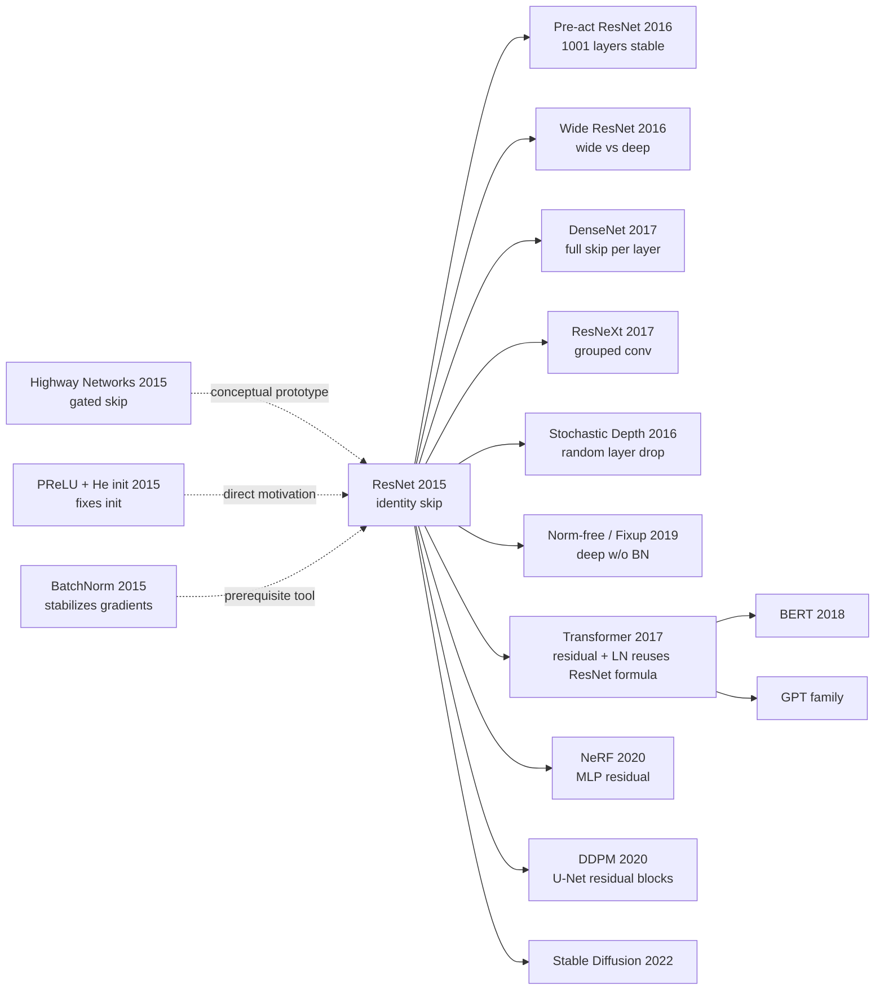

# ResNet — How Deep Residual Learning Unlocked the 152-Layer Door

> **December 10, 2015. Kaiming He uploads [arXiv 1512.03385](https://arxiv.org/abs/1512.03385).**
> A 12-page engineering paper with zero theorems uses a skip connection that "does nothing"
> to push networks from 19 to 152 layers, drop ImageNet top-5 error from 7.3% to 3.57%,
> and become the foundational building block still in use across Transformers, Diffusion, and NeRF a decade later.
> CVPR 2016 Best Paper. ~250,000 citations as of May 2026 — one of the most-cited CS papers of the 21st century.

## TL;DR

ResNet replaces direct mapping $y = \mathcal{F}(x)$ with the **identity shortcut** $y = \mathcal{F}(x) + x$, reframing 152-layer optimization as "learning a residual." This eliminates the degradation problem in deep networks at its root.

---

## Historical Context

### What was the vision community stuck on in 2015?

To grasp ResNet's disruptive power you have to return to the "depth anxiety" of 2014–2015.

In 2012, AlexNet (8 layers) won ImageNet. By 2014, VGG (19 layers) and GoogLeNet (22 layers) had each pushed top-5 error to ~7%. The community reached a naive consensus: **deeper = better**. But that consensus hit a wall in late 2014 — independently, several teams (including He's own PReLU paper and Schmidhuber's Highway Networks) noticed:

> **Going from 20-layer VGG to 30 layers, training loss starts going up; at 50 layers, it does not train at all.**

This was not overfitting (training loss itself was rising), nor vanishing gradients (BatchNorm and He init kept gradient magnitudes healthy). The community named the phenomenon the **degradation problem**, but no one could explain *why*.

### The 3 immediate predecessors that pushed ResNet out

- **He et al., 2015 (PReLU + He init)** [arXiv/1502.01852](https://arxiv.org/abs/1502.01852): He's own previous work fixed initialization for 30-layer networks, but he discovered that going deeper still made things worse — direct motivation for ResNet.
- **Ioffe & Szegedy, 2015 (BatchNorm)** [arXiv/1502.03167](https://arxiv.org/abs/1502.03167): BN stabilized deep-network gradients but **did not solve degradation** — proving the issue is not numerical.
- **Srivastava, Greff, Schmidhuber, 2015 (Highway Networks)** [arXiv/1505.00387](https://arxiv.org/abs/1505.00387): Proposed gated skip $y = T(x) \cdot \mathcal{F}(x) + (1-T(x)) \cdot x$ seven months before ResNet — the conceptual prototype. But the gating $T(x)$ added parameters and made training unstable.

### What was the author team doing?

Kaiming He was a young researcher at MSRA. His team (He / Zhang / Ren / Sun) had just produced Faster R-CNN and was preparing for ILSVRC 2015. **ResNet was not an isolated stunt — it was MSRA's ammunition for the entire 2015 ImageNet battlefield**: they used ResNet to take 1st place simultaneously in ImageNet classification, detection, localization, COCO detection, and COCO segmentation.

### State of the industry, compute, and data

- **GPUs**: NVIDIA Maxwell K40 / Titan X, 12 GB single-card memory; 152-layer ResNet needed 8 GPUs at mini-batch 256
- **Data**: ImageNet-1k (1.28M images), CIFAR-10/100 as sanity checks
- **Frameworks**: Caffe was mainstream; PyTorch was a year away. Original ResNet was implemented in Caffe.
- **Industry climate**: Google had acquired DeepMind a year earlier; Facebook had founded FAIR. The last academic-to-product window for deep learning was open.

---

## Method Deep Dive

### Overall framework

ResNet's pipeline is brutally simple: chop a VGG-style plain CNN into **residual blocks**, each with a skip connection adding the input to the output. The network has 5 stages (conv1 + 4 residual stages + classifier); each new stage halves spatial resolution and doubles channels.

```
Input (224×224×3)
  ↓ 7×7 conv, 64,  stride 2  →  112×112
  ↓ 3×3 maxpool,    stride 2  →  56×56
  ↓ Stage 1: [Residual Block × N1]   64-d   →  56×56
  ↓ Stage 2: [Residual Block × N2]   128-d  →  28×28  (first block stride=2)
  ↓ Stage 3: [Residual Block × N3]   256-d  →  14×14  (first block stride=2)
  ↓ Stage 4: [Residual Block × N4]   512-d  →  7×7    (first block stride=2)
  ↓ Global Average Pool              →  1×1×512
  ↓ FC 1000 + softmax
```

Different depths just change $(N_1, N_2, N_3, N_4)$ and BasicBlock vs Bottleneck:

| Model | Block type | $(N_1, N_2, N_3, N_4)$ | Layers | Params | FLOPs |
|-------|-----------|------------------------|--------|--------|-------|
| ResNet-18  | BasicBlock (2 conv) | (2, 2, 2, 2)  | 18  | 11.7M | 1.8B |
| ResNet-34  | BasicBlock          | (3, 4, 6, 3)  | 34  | 21.8M | 3.6B |
| ResNet-50  | Bottleneck (3 conv) | (3, 4, 6, 3)  | 50  | 25.6M | 3.8B |
| ResNet-101 | Bottleneck          | (3, 4, 23, 3) | 101 | 44.5M | 7.6B |
| ResNet-152 | Bottleneck          | (3, 8, 36, 3) | 152 | 60.2M | 11.3B |

A counter-intuitive point: **ResNet-50 has only 17% more parameters than ResNet-34, but 47% more layers and ~30% lower ImageNet top-5 error**. This is the bottleneck's doing (see Design 2).

### Key designs

#### Design 1: Identity Shortcut — the actual "magic"

**Function**: Send block input $x$ through a transformation-free "additive bypass" directly to block output $y$, so the network only learns the *difference* $\mathcal{F}(x) = y - x$ rather than the full mapping.

**Forward formula**:

$$
y = \mathcal{F}(x, \{W_i\}) + x, \quad \text{where } \mathcal{F}(x) = W_2 \, \sigma(W_1 x)
$$

$\sigma$ is ReLU, $W_1, W_2$ are two 3×3 conv weights (with BN). Only $\mathcal{F}$ has trainable parameters; **the shortcut path has no parameters at all**.

**Forward pseudocode** (PyTorch-style):

```python
class BasicBlock(nn.Module):
    def __init__(self, ch):
        super().__init__()
        self.conv1 = nn.Conv2d(ch, ch, 3, padding=1, bias=False)
        self.bn1   = nn.BatchNorm2d(ch)
        self.conv2 = nn.Conv2d(ch, ch, 3, padding=1, bias=False)
        self.bn2   = nn.BatchNorm2d(ch)

    def forward(self, x):
        identity = x                        # ← parameter-free shortcut
        out = F.relu(self.bn1(self.conv1(x)))
        out = self.bn2(self.conv2(out))
        out = out + identity                # ← the magic line: + x
        return F.relu(out)
```

The entire ResNet "magic" is the highlighted line `out = out + identity` — no parameters, no FLOPs (the addition can fuse with the previous conv), no new hyperparameters.

**Backward analysis (the paper's deepest insight)**:

Let $x_l$ be the input at layer $l$. In pre-activation ResNet you can write $x_L$ (any deeper layer) and $x_l$ exactly as:

$$
x_L = x_l + \sum_{i=l}^{L-1} \mathcal{F}(x_i, W_i)
$$

Take gradient of loss $\mathcal{E}$ (chain rule):

$$
\frac{\partial \mathcal{E}}{\partial x_l} = \frac{\partial \mathcal{E}}{\partial x_L} \cdot \left(1 + \frac{\partial}{\partial x_l} \sum_{i=l}^{L-1} \mathcal{F}(x_i, W_i)\right)
$$

Note the **+1** in the parentheses — it means: **regardless of how small the gradients of the intermediate $\mathcal{F}$ terms are, the shortcut guarantees at least one full copy of $\partial \mathcal{E} / \partial x_L$ flows back to $x_l$**. This is the mathematical essence of how ResNet kills vanishing gradients. In a plain CNN this gradient must multiply $L-l$ Jacobian matrices and decay exponentially; in ResNet it is "addition + small correction."

**4 shortcut strategies compared (paper Table 3)**:

| Strategy | Same-dim block | Cross-dim block (stride=2) | Param overhead | top-1 error |
|---------|----------------|----------------------------|---------------|-------------|
| (A) zero-padding              | identity      | zero-pad channels         | 0       | 25.03% |
| (B) projection only on dim mismatch | identity | 1×1 conv             | tiny    | **24.52%** ← paper's choice |
| (C) projection everywhere     | 1×1 conv      | 1×1 conv                  | large   | 24.19% |
| (D) (post-2016) identity even cross-dim | identity + slice | slice + pad     | 0       | ≈ B |

C is best but most expensive. **The authors counter-intuitively chose B**, declaring: "1×1 projection is *not* the core of ResNet, the identity shortcut is. Add no parameters when you can avoid it." This preserved ResNet's "zero-cost" aesthetic and enabled the later Pre-act / 1001-layer paper.

**Design rationale — why does this trick work so well?**

The essence of degradation: asking a conv block to learn identity $y = x$ is **very hard** for SGD because it requires $W_2 \sigma(W_1 x) = x$, which has no clean zero solution for $W_1, W_2$ (the ReLU non-linearity blocks the way).

The residual formula $y = \mathcal{F}(x) + x$ reparameterizes "learn identity" into "drive $\mathcal{F} \to 0$" — which only requires **L2 weight decay to pull $W_1, W_2$ toward 0**, and L2 is on by default!

Put differently: **ResNet uses a free algebraic transformation to map "an unsolvable optimization target" onto "the default contraction direction of L2 regularization."** It is an exquisitely clever bribe to the optimizer.

#### Design 2: Bottleneck Block — making depth "cheap"

**Function**: Keep ResNet-50/101/152 from blowing up in parameters and FLOPs.

**Core idea**: Replace BasicBlock's two 3×3 convs with a "1×1 → 3×3 → 1×1" sandwich:

```
input  256-d
  ↓ 1×1 conv, 64    ← squeeze channels 4× (squeeze)
  ↓ 3×3 conv, 64    ← expensive spatial conv in low dim
  ↓ 1×1 conv, 256   ← restore channels (expand)
  ↓ + identity (256-d shortcut)
output 256-d
```

**Detailed dimension trace** (stage 4 first block, input 14×14×512):

| Layer | Kernel | Input | Output | Params |
|-------|--------|-------|--------|--------|
| conv1 (squeeze) | 1×1, 128       | 14×14×512 | 14×14×128 | 65,536 |
| conv2 (spatial) | 3×3, 128, s=2  | 14×14×128 | 7×7×128   | 147,456 |
| conv3 (expand)  | 1×1, 512       | 7×7×128   | 7×7×512   | 65,536 |
| identity shortcut (1×1, s=2 projection) | 1×1, 512, s=2 | 14×14×512 | 7×7×512 | 262,144 |
| **Total** | — | — | — | **~540k** |

A BasicBlock at the same channel count would need $2 \cdot (3 \times 3 \times 512 \times 512) \approx 4.7M$ params — **bottleneck cuts ~8.7×**.

**Why not use bottleneck in shallow networks?**

ResNet-18/34 use BasicBlock because their parameter count is already small (11.7M / 21.8M); bottleneck would add 1×1 conv overhead for no gain. **Only at depth ≥50 with channels ≥256 does bottleneck's "param/FLOP slashing" pay off**. There is no universally-best block — only "best block at this scale."

**Design rationale**: Total ResNet-152 FLOPs (11.3B) are **lower** than VGG-19's 19.6B — bottleneck is what dragged "ultra-deep network" out of "memory explosion + impossibly slow inference" back into engineering reality. Without bottleneck, 152-layer ResNet would likely have stayed a lab toy like 1202-layer ResNet, never becoming an industrial backbone.

#### Design 3: Pre-activation Order ([Identity Mappings, 2016](https://arxiv.org/abs/1603.05027)) — washing the shortcut path clean

**Function**: Original ResNet still showed mild degradation past 1000 layers; pre-activation fixed it, letting 1001-layer networks train stably on CIFAR.

**Core idea — swap the BN/ReLU/conv triplet's order**:

```
Original (Post-activation):              Pre-activation (2016):

  x ─┐                                     x ─┐
     │                                        │
   conv                                      BN
     │                                        │
    BN                                      ReLU
     │                                        │
   ReLU                                     conv
     │                                        │
   conv                                      BN
     │                                        │
    BN                                      ReLU
     │                                        │
     +───── shortcut x                       conv
     │                                        │
   ReLU  ← pollutes shortcut path!            +───── shortcut x  ← totally clean!
                                              │
                                             (next block carries its own BN-ReLU)
```

**Why a "clean shortcut" matters — math analysis**:

If the shortcut path has ReLU or BN inserted, then layer-$l$-to-layer-$L$ is no longer the simple $x_L = x_l + \sum \mathcal{F}_i$ but:

$$
x_L = f_L\left(f_{L-1}\left(\cdots f_{l+1}\left(x_l + \mathcal{F}_l\right) \cdots \right)\right)
$$

Each $f_i$ is a ReLU + BN composite non-linearity; gradients can no longer flow back as pure addition and revert to multiplication. Partial degradation returns.

Pre-activation moves all non-linearity to *before* the conv, leaving the shortcut as:

$$
x_L = x_l + \sum_{i=l}^{L-1} \mathcal{F}(x_i, W_i)
$$

A **strict additive form**. The +1 term flows back without decay during gradient computation; even 1001 layers train. This change **is not an engineering trick — it is a mathematical fix**, and in retrospect proves "identity shortcut is the soul of ResNet."

**Design rationale**: Original ResNet was already near its scaling cliff at 110 layers; reaching 1000+ layers required fixing this shortcut "pollution." Pre-act upgraded ResNet from a "100-layer-class architecture" to a "1000-layer-class architecture," and laid the conceptual groundwork for Pre-LN in Transformers (GPT-2/3 use Pre-LN; Post-LN is unstable in deep Transformers).

#### Design 4 (implicit but crucial): 4-stage downsampling cadence

**Function**: Determines whether ResNet is "deep but narrow" or "wide but shallow" — the geometric skeleton.

**Core idea**: Downsample 224×224 input by 2× five times (including initial maxpool) to 7×7, then GAP. Channels double from 64 to 512. Resolution is constant within a stage; transitions use "first block stride=2 + projection shortcut" for downsampling and channel doubling.

**Why 4 stages, why 2× downsampling, why 64→512?**

- **4 stages**: Cover low / mid / high / semantic feature levels. Fewer than 4 stages → insufficient receptive field; more than 4 → dropping below 7×7 destroys spatial info.
- **2× downsampling**: Paired with channel doubling, FLOPs per stage are roughly conserved (spatial area ÷4, channels ×2, per-pixel conv FLOPs ×2, total ÷1) — preventing computation from exploding in deep semantic stages.
- **64→512**: Empirical. ResNeXt, EfficientNet, ConvNeXt all tweaked this rhythm but "pyramid backbone + 4 stages" became the de facto standard, inherited by virtually all CNN/Transformer hybrids (Swin Transformer is also 4 stages).

**Design rationale**: This stage structure was not invented by ResNet (VGG/GoogLeNet had similar), but ResNet **first locked it together with "residual block as the in-stage atomic unit,"** making "4-stage + residual block" the de facto template for backbone design over the next decade.

### Loss / training recipe

| Item | Setting | Notes |
|------|---------|-------|
| Loss | Cross-entropy + softmax | Nothing fancy |
| Optimizer | SGD | No Adam |
| Momentum | 0.9 | |
| Weight decay | 0.0001 | **Crucial** — the natural pull driving $\mathcal{F} \to 0$ |
| LR schedule | Init 0.1, ÷10 on plateau | Hand-tuned, 2 decays |
| Batch size | 256 | 8 GPUs × 32 |
| Epochs | ~120 | 600k iterations on ImageNet |
| Init | He init (kaiming normal) | Optimal init for ReLU |
| Norm | BatchNorm after every conv | He et al. 2015 |
| Data aug | Resize 256 + RandomCrop 224 + HFlip + ColorJitter | AlexNet-PCA color jitter |
| Test aug | 10-crop + multi-scale (224/256/384/480/640) | For ensembles |

**Note 1**: The method introduces only one `+x` addition. It needs **no extra hyperparameters, no new learnable params, no extra FLOPs** (identity shortcut is 0 FLOPs and can fuse with the previous conv). This "zero-cost yet game-changing" property is why ResNet became a *foundational component*, not just a competitor.

**Note 2**: The training recipe looks naive (a 10-year-old SGD recipe), but ResNet still works as a foundation in 2026 precisely because **it is recipe-robust** — swap to Adam, swap to LayerNorm, swap to a larger dataset, and the formula $y = \mathcal{F}(x) + x$ still works. This "recipe robustness" is the real moat.

---

## Failed Baselines

### Opponents that lost to ResNet

- **Plain VGG-style 34-layer**: train error 7.5%, val error 28.5%; matched-capacity ResNet-34 trains at 6.5%, val 24.2%. **Note: plain-34 is *worse* than plain-18** — direct evidence of degradation.
- **Highway Networks 19/32 layers**: 8.8% / 8.6% on CIFAR-10; ResNet-110 hits 6.43%. Highway has gating params, training is unstable, and depth caps at 32.
- **GoogLeNet Inception-v3**: top-5 single-model 5.6%; ResNet-152 single-model 4.49%. Inception relies on intricate multi-branch topology requiring expensive tuning, and does not transfer cleanly to detection / segmentation.

### Failed experiments admitted in the paper

Paper **Table 3** compares three shortcut strategies:
- **(A) zero-padding shortcut** (zero-fill on dim mismatch): top-1 error 25.03%
- **(B) projection shortcut for dim mismatch only**: 24.52%
- **(C) projection shortcut for ALL connections**: 24.19%

C is best but most expensive. The authors **deliberately chose B**, arguing: "identity shortcut is the core, projection is not key — avoid it when possible." This counter-intuitive choice preserved ResNet's zero-cost aesthetic.

### The 1202-layer counter-example

Paper §4.2 reports an interesting "failure": training a 1202-layer ResNet on CIFAR-10 **converged** (so optimization works), but **test error 7.93% was worse than 110-layer's 6.43%** — first proof that ResNet too can overfit. This sparked 2016–2017 work on stochastic depth, wide ResNet, and DenseNet.

### The real "anti-baseline" lesson

**Highway Networks predates ResNet by 7 months**; the idea is nearly identical. Yet Highway is essentially unused today. The reason is not the idea — it is that Highway is too *complex* (gating). **ResNet's victory is the victory of engineering minimalism**: do not add a parameter you can avoid. This is the most important "failed case" not written in the paper but visible in hindsight — **a complex idea, even if it appears first, loses to a minimalist one.**

---

## Key Experimental Data

### Main results (ImageNet)

| Model | Top-5 error (val) | FLOPs |
|-------|-------------------|-------|
| VGG-16          | 8.43% | 15.3B |
| GoogLeNet       | 7.89% | 1.5B  |
| PReLU-net       | 7.38% | —     |
| ResNet-34 (B)   | 7.40% | 3.6B  |
| ResNet-50       | 5.25% | 3.8B  |
| ResNet-101      | 4.60% | 7.6B  |
| **ResNet-152 (single)**       | **4.49%** | 11.3B |
| **ResNet-152 (ensemble of 6)**| **3.57%** | —     |

ILSVRC 2015 1st place — first time human-level (~5%) was clearly surpassed.

### Ablation (CIFAR-10)

| Config | Test error | Notes |
|--------|-----------|-------|
| Plain-20    | 8.75%  | baseline |
| Plain-32    | 9.09%  | deeper is *worse* (degradation) |
| Plain-44    | 10.40% | continues to degrade |
| Plain-110   | 18.06% | does not train at all |
| ResNet-20   | 8.75%  | tied with plain (no gain at shallow depth) |
| ResNet-32   | 7.51%  | **depth starts working** |
| ResNet-110  | **6.43%** | 110 layers stable |
| ResNet-1202 | 7.93%  | overfits (19.4M params) |

### Key findings

- **Degradation is not overfitting**: plain-110's *training* error is also bad, not just val
- **Identity shortcut is the core, projection is not key**: Table 3 strategies differ by < 1%
- **Bottleneck makes 152-layer FLOPs < VGG-19**: depth becomes engineering-feasible
- **At equal FLOPs, deeper is better**: ResNet-50 < 101 < 152, no diminishing returns
- **Astonishing transfer**: same team used ResNet to win 5 SOTAs across ImageNet classification / detection / localization + COCO detection / segmentation

---

## Idea Lineage



### Past lives (what forced it out)

- **1991 LSTM** [Hochreiter, Schmidhuber]: the cell state's "additive path" is the earliest skip-connection prototype
- **2014 GoogLeNet auxiliary classifier**: shallow supervision tries to bypass deep gradients — another route around depth
- **2015 Highway Networks** [Srivastava, Greff, Schmidhuber]: gated skip — conceptually identical, engineering complex
- **2015 PReLU + He init**: solves numerical issue but degradation persists, reverse-proof the problem is in the optimization landscape

### Descendants

- **Direct successors**: Pre-act ResNet (2016), Wide ResNet (2016), DenseNet (2017), ResNeXt (2017), SE-Net (2017), Stochastic Depth (2016), Fixup Init (2019)
- **Cross-architecture borrow**: Each Transformer block `y = LayerNorm(x + Attention(x))` is a verbatim port of the ResNet formula — **without ResNet's "trainability prior," even 6-layer Transformers would not train**
- **Cross-task seepage**: NeRF's MLP, DDPM's U-Net, Stable Diffusion's denoiser, AlphaFold-2's Evoformer — all carry residual structure
- **Cross-discipline spillover**: Neural ODEs [Chen et al., NeurIPS 2018 Best Paper] interpret ResNet as Euler-discretized ODEs, opening the "network as dynamical system" research lineage

### Misreadings / oversimplifications

- **"Skip is good"**: many follow-ups add skip connections anywhere, but ResNet's essence is the **paired conv-conv-add** (dim-matched + identity is the default path). Random skips often *hurt*.
- **"Deeper is always better"**: the 1202-layer experiment disproved this years ago, yet 2016–2018 industry layer-stacking madness raged on.
- **"Residual is for gradient flow"**: popular but secondary explanation. Paper §1 explicitly says **optimization difficulty** is the core; gradients are numerically healthy under BN.

---

## Modern Perspective (looking back at 2015 from 2026)

### Assumptions that no longer hold

- **"Networks should be as deep as possible"**: We now know that **width / data / compute often have higher marginal returns than depth**. Wide ResNet, ConvNeXt, and ViT all proved this. 152 layers is not the end of "deeper is better" — it's the *start* of "depth hits diminishing returns."
- **"Identity shortcut solves everything"**: At 1000+ layers + long sequences, identity is not enough. Pre-LN vs Post-LN placement of LayerNorm relative to the shortcut became *the* training-stability question for Transformers; Mamba/SSM use entirely different structures.
- **"Convolution is the visual inductive bias"**: ViT (2020) showed pure attention + ResNet-style residual matches CNN at scale. **Convolution is not necessary; residual is.**

### What survived vs. what didn't

- **Survived**: identity shortcut itself, the "no extra parameters" engineering aesthetic, parameter efficiency of bottleneck
- **Discarded / misleading**: original BN-ReLU order (pre-act is better), projection shortcut (identity suffices), the 152-layer maximum (50/101 is the typical backbone)

### Side effects the authors didn't foresee

1. **Becoming the invisible pillar of Transformer**: Vaswani 2017's "Attention is All You Need" wraps every sub-layer in `LayerNorm(x + Sublayer(x))` — a perfect port of the ResNet formula. **Without ResNet's "optimizability prior," even 6-layer Transformers wouldn't train.**
2. **Becoming the gold mine of interpretability research**: Lottery Ticket Hypothesis, Loss Landscape visualization, Neural Tangent Kernel — all use ResNet as the standard subject.
3. **Becoming the cornerstone of NAS search spaces**: EfficientNet, RegNet, NAS-Bench all use residual block as the search primitive.

### If ResNet were rewritten today

If He's team rewrote ResNet in 2026, they would likely:
- Default to pre-activation order
- Replace BN with LayerNorm (small-batch friendly)
- Replace ReLU with GELU or SiLU
- Replace BN's complex statistics with RMSNorm
- Add a token-mixing branch (fuse attention with conv)
- Set default depth = 50; treat width as the main scaling axis
- Drop the "152-layer" stunt number — that era of "depth arms race" is over

But **the core formula $y = \mathcal{F}(x) + x$ would not change**. That is why ResNet survives: the formula does not depend on conv, on BN, on ReLU. It depends only on **the most basic property — the invertibility of addition**.

---

## Limitations and Future Directions

### Author-acknowledged limitations
- 1202-layer overfits, needs stronger regularization
- On small datasets (CIFAR), excessive depth gives diminishing returns

### Self-identified limitations
- Identity shortcut requires same input/output dim, forcing projection in cross-modal fusion — breaks the "zero-cost" aesthetic
- BatchNorm dependency limits small-batch / online learning
- 152 layers are unfriendly to edge inference latency (low FLOPs but many layers = many kernel launches = high GPU scheduling overhead)

### Improvement directions (already realized in follow-ups)
- Pre-activation (done)
- Stochastic Depth / DropPath (done)
- Wide vs Deep tradeoff (Wide ResNet / EfficientNet, done)
- Norm-free (Fixup / NF-ResNet, done)
- Cross-modal residual (Transformer / U-Net, implicitly done)

---

## Related Work and Insights

- **vs Highway Networks**: equivalent idea, but Highway's gating $T(x)$ adds parameters and optimization difficulty. **Lesson: hard-code what you can; don't learn what you can hard-code.**
- **vs GoogLeNet / Inception**: Inception uses complex multi-branch topology + NAS-like tuning; transfer to detection / segmentation is expensive. ResNet's "simple stacking" generalizes better. **Lesson: simple + general > complex + specialized.**
- **vs DenseNet**: DenseNet connects every layer to all subsequent layers — extreme info reuse, but memory explodes and industrial deployment is awkward. ResNet sits on the Pareto front.
- **vs Transformer (cross-architecture)**: Transformer's `LN(x + Sublayer(x))` directly reuses ResNet's formula. ResNet is Transformer's hidden prerequisite.

---

## Resources

- 📄 [arXiv 1512.03385](https://arxiv.org/abs/1512.03385)
- 💻 [Author's original Caffe code](https://github.com/KaimingHe/deep-residual-networks)
- 🔗 [PyTorch torchvision implementation](https://github.com/pytorch/vision/blob/main/torchvision/models/resnet.py)
- 📚 Required follow-ups: [Pre-activation ResNet (2016)](https://arxiv.org/abs/1603.05027), [Wide ResNet (2016)](https://arxiv.org/abs/1605.07146), [DenseNet (2017)](https://arxiv.org/abs/1608.06993)
- 🎬 [Mu Li ResNet paper walkthrough (Bilibili, Chinese)](https://www.bilibili.com/video/BV1P3411y7nn)
- 🇨🇳 [Chinese version of this deep note](/era2_deep_renaissance/2015_resnet/)
