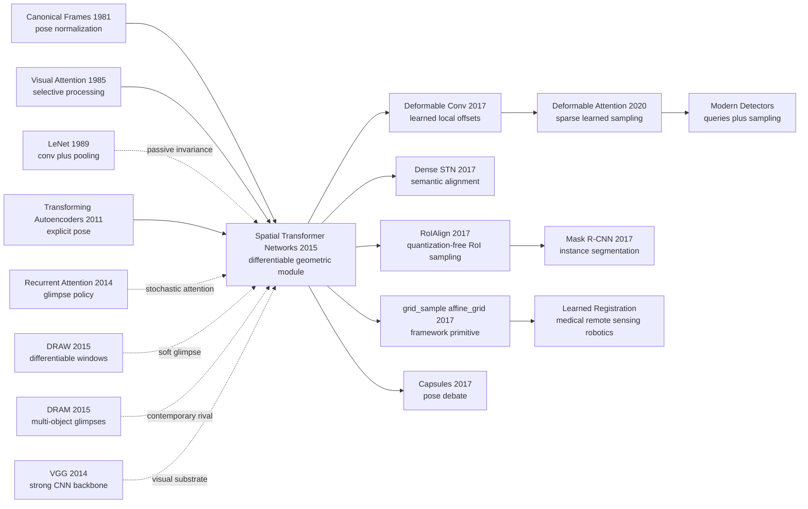

# Spatial Transformer Networks — Letting CNNs Learn to Crop, Align, and Warp

> **On June 5, 2015, Max Jaderberg, Karen Simonyan, Andrew Zisserman, and Koray Kavukcuoglu from DeepMind and Oxford VGG uploaded [arXiv:1506.02025](https://arxiv.org/abs/1506.02025), later published at NeurIPS 2015.** The paper did not add another deeper classifier. It inserted a moving module into the middle of a CNN: predict geometric parameters, generate a sampling grid, then differentiably crop, rotate, scale, or straighten a feature map. Its drama is not only that several benchmarks improved. It is that an old visual operation became learnable: alignment no longer had to live in preprocessing or supervised part detectors; it could become an internal action learned only from the task loss.

## TL;DR

Jaderberg, Simonyan, Zisserman, and Kavukcuoglu's **Spatial Transformer Networks** turned geometric alignment from a preprocessing step outside CNNs into an insertable differentiable layer: a localization network predicts $\theta=f_{loc}(U)$, a grid generator creates $\mathcal{T}_\theta(G)$, and a sampler produces $V_i^c=\sum_{n,m}U^c_{nm}\max(0,1-|x_i^s-m|)\max(0,1-|y_i^s-n|)$ by bilinear interpolation. The baseline it challenged was not one model but the default CNN treatment of spatial variation: pooling, augmentation, and fixed architecture gave passive local invariance, while STN let the network actively learn where to look, how to crop, and how to canonicalize. On translated+cluttered MNIST, CNN error is 3.5% and ST-CNN reaches 1.7%; on 128px SVHN, the CNN degrades from 4.0% to 5.6% while ST-CNN stays at 3.9%; on CUB-200-2011, 4xST-CNN reaches 84.1% without part labels and learns attention resembling bird heads and bodies. Its deeper legacy is making differentiable warping a basic vision operator: from RoIAlign in the [R-CNN family](2014_rcnn.md) and deformable convolution to today's framework-level `grid_sample`, many systems keep the same interface of predicting coordinates and sampling features with gradients.

---

## Historical Context

### By 2015, CNNs could recognize objects but could not quite straighten them

By 2015, computer vision no longer doubted the representational power of CNNs. [AlexNet](2012_alexnet.md) had opened the ImageNet era, [VGG](2014_vgg.md) had shown that deeper stacks of small convolutions help, and Inception / GoogLeNet had pushed accuracy and compute efficiency together through multi-branch modules. The question had changed shape: networks were becoming strong, but their treatment of geometry was still mostly passive.

Classical CNN invariance came from three sources. Data augmentation told the model that rotations, translations, and scale changes exist. Weight sharing let one filter fire at many positions. Pooling made small local translations less disruptive. These mechanisms are useful, but they are not active geometric reasoning. When a digit is rotated, a house number is zoomed, or a bird head occupies a tiny corner of the image, the CNN usually does not explicitly say, "I will crop and align this first." It hopes later layers can survive the variation on a fixed grid.

That is STN's historical position. It does not propose a larger backbone. It places alignment inside the network by letting the model generate a sampling grid conditioned on the input. For the 2015 community, this was a sharp rewrite: geometry no longer had to live in preprocessing, augmentation, or manually supervised part detectors; it could become a neural layer trained directly by the classification loss.

### Attention was entering vision, but often not as a geometric layer

The 2014-2015 window was also when attention moved rapidly into vision. Mnih and collaborators used recurrent visual attention with glimpses and reinforcement learning; DRAW used differentiable read/write windows for generation; DRAM used recurrent glimpses for multi-object recognition; captioning and VQA began aligning words with image regions. Vision systems were no longer only asking "what is in the whole image?" They were asking "where should I look?"

Many of these attention methods, however, had one of two costs. Some were recurrent or stochastic policies that needed REINFORCE or difficult credit assignment. Others produced task-specific attention weights rather than a general operator that could change the image coordinate system. STN's elegance is that it turns attention into a deterministic, feed-forward, differentiable spatial transform. The model does not merely weight pixels; it resamples a feature map.

| 2015 route | Main action | Training signal | STN difference |
|-------------|-------------|-----------------|----------------|
| Data augmentation | create transformed examples offline | classification loss | transform is fixed, not input-adaptive |
| Pooling / stride | merge local features | classification loss | gives only local translation invariance |
| Recurrent glimpse | select a region step by step | RL or complex backprop | STN is feed-forward and differentiable |
| Part detector | explicitly find object parts | often boxes or part labels | STN can learn alignment from task labels |
| Spatial Transformer | predict sampling grid and resample | standard backpropagation | active geometric canonicalization |

### The author team sat at an unusual intersection

Max Jaderberg and Koray Kavukcuoglu were at DeepMind, while Karen Simonyan and Andrew Zisserman came from Oxford's Visual Geometry Group. That mix explains the paper's temperament: the DeepMind side brought differentiable modules, attention, and end-to-end training; the Oxford VGG side brought strong visual backbones, geometric intuition, and fine-grained recognition. STN is neither a pure geometry paper nor a pure neural-network trick. It sits exactly at the border of those traditions.

That border led to a restrained design. The paper does not introduce a complete new system. It introduces a module, then shows that the same module can be inserted into FCNs, CNNs, deeper CNNs, parallel attention systems, fine-grained recognition, and even 3D projection tasks. In other words, STN is not only "a model." It is an action: a network can learn to change coordinates.

### Compute and framework conditions at the time

In 2015, deep-learning frameworks did not yet treat `grid_sample` and `affine_grid` as ordinary building blocks. Making a network output coordinates, using those coordinates to bilinearly sample a feature map, and ensuring gradients flow back both to coordinates and input features required an explicit operator design. Today that is a framework API; at the time it was part of the paper's contribution.

This also explains why the paper emphasizes sampler gradients and runtime overhead. STN could only matter if it was light. If every spatial attention step required running a detector or solving a separate alignment optimization, it would not become a middle layer inside CNNs. The paper repeatedly shows that the module adds little overhead, and in high-resolution attentive models can even reduce later computation by cropping early.

## Background and Motivation

### CNN invariance and equivariance pulled in different directions

CNN success is often explained through translation equivariance and local invariance: convolution makes features move with the input, and pooling makes small shifts less visible to the output. Real visual variation is much broader than translation. Rotation, scale, perspective, elastic deformation, and part displacement can all make fixed-grid convolution awkward. A model can survive with more data and more capacity, but that is not an efficient solution.

STN faces the tension directly: recognition ultimately wants invariance, yet intermediate representations must keep enough geometry to align the object correctly. If geometry is discarded too early, the model does not know what to align. If geometry is never handled, the classifier must learn across a huge transformation space. STN's answer is to predict a transform first, canonicalize the input or feature map, and then let ordinary recognition layers work on the easier representation.

### Why such weak supervision could work

The counter-intuitive part of STN is that it does not need a label telling the localization network where the correct crop is. On MNIST, SVHN, and CUB, the training signal is only the final task label. If cropping, rotating, or scaling reduces classification loss, gradients pass through the sampler into the transform parameters and then into the localization network. Alignment becomes a latent action.

That matters because geometric annotation is expensive. Fine-grained bird recognition can label head, body, and wing parts, but part labels are costly. Multi-digit recognition can label boxes, but that makes the pipeline heavier. STN's motivation is not to abolish supervision in general; it is to show that some geometric choices can emerge from end-to-end task pressure.

### What the paper was really betting on

STN made three bets. First, geometric transformation can be packaged as a general differentiable module rather than a task-specific preprocessing script. Second, a network can learn meaningful spatial operations from task loss without additional alignment labels. Third, active spatial transformation complements ordinary CNNs: CNNs handle local texture and semantic hierarchy, while STN adjusts the coordinate system into a more recognizable form.

What it changed was the imagination of a "layer." A layer does not have to be only convolution, pooling, normalization, or a nonlinearity. A layer can be a learnable geometric program. That idea later diffused into RoIAlign, deformable convolution, differentiable rendering, image registration, and learned sampling in modern detection.

---

## Method Deep Dive

### Overall framework

The Spatial Transformer interface is small: it takes an input feature map $U\in\mathbb{R}^{H\times W\times C}$ and outputs a geometrically transformed feature map $V\in\mathbb{R}^{H'\times W'\times C}$. There are only three steps. A localization network predicts transform parameters $\theta$ from $U$; a grid generator uses $\theta$ to map every output location to an input coordinate; a sampler resamples $U$ at those coordinates.

$$
\theta=f_{loc}(U),\qquad (x_i^s,y_i^s)=\mathcal{T}_\theta(x_i^t,y_i^t),\qquad V=\operatorname{Sample}(U,\mathcal{T}_\theta(G))
$$

Together, these components perform a direct action: the network first looks at the input, decides how to change coordinates, and then pulls the original feature map into the target coordinate system. The module can sit after the raw image or after an intermediate feature map; it can be used once or stacked; it can make one transformer attend to the whole object or multiple transformers attend to several parts.

| Component | Input | Output | Role |
|-----------|-------|--------|------|
| Localization network | feature map $U$ | parameters $\theta$ | predicts the geometric transform |
| Grid generator | target grid $G$ and $\theta$ | sampling coordinates $(x_i^s,y_i^s)$ | maps output pixels back to input coordinates |
| Sampler | $U$ and sampling coordinates | transformed feature map $V$ | reads input features by differentiable interpolation |

The key is not one specific transform. Affine, projective, piecewise affine, and thin plate spline transforms can all be inserted; as long as the grid generator and sampler are differentiable, the final classification loss can train a spatial policy.

### Key designs

#### Design 1: Localization network — making transform parameters input-dependent

**Function**: a small network $f_{loc}$ reads the current input or feature map and outputs geometric parameters $\theta$. This network can be an FCN, CNN, or any differentiable subnetwork; in the paper, the final layer is often initialized to the identity transform so training starts from "do nothing."

$$
\begin{pmatrix}x_i^s\\y_i^s\end{pmatrix}
=
\mathcal{T}_\theta(G_i)
=
\begin{bmatrix}
\theta_{11}&\theta_{12}&\theta_{13}\\
\theta_{21}&\theta_{22}&\theta_{23}
\end{bmatrix}
\begin{pmatrix}x_i^t\\y_i^t\\1\end{pmatrix}
$$

This is an input-conditioned layer. Ordinary convolutional weights are fixed and execute the same local operator for every image. STN's geometric parameters change with the input. A rotated digit can trigger rotation correction; a house number in the corner can trigger translation and scaling.

```python
def initialize_affine_head(linear):
    linear.weight.data.zero_()
    linear.bias.data.copy_(torch.tensor([1.0, 0.0, 0.0, 0.0, 1.0, 0.0]))

class LocalizationNet(nn.Module):
    def forward(self, feature_map):
        hidden = self.backbone(feature_map).flatten(1)
        theta = self.fc(hidden).view(-1, 2, 3)
        return theta
```

| Choice | Benefit | Risk | STN decision |
|--------|---------|------|--------------|
| Fixed preprocessing | simple and stable | not adaptive per example | not used |
| External detector | interpretable and supervisable | needs boxes or part labels | only a comparison background |
| Localization network | end-to-end and input-adaptive | can learn bad crops | used, often identity-initialized |
| Recurrent policy | can reason over steps | harder training | STN uses a feed-forward approximation |

**Design rationale**: the localization network turns "choose a geometric transform" into an ordinary neural prediction problem. It is not directly supervised by alignment labels; it learns through the downstream task loss. That is the central break from classical alignment pipelines.

#### Design 2: Grid generator — looking up input coordinates from the output grid

**Function**: for each target coordinate $(x_i^t,y_i^t)$ in the output feature map, the grid generator uses $\theta$ to compute the continuous input coordinate $(x_i^s,y_i^s)$ from which it should read. This inverse mapping matters because every output location is defined, avoiding holes common in forward warping.

$$
V_i^c = \sum_{n=1}^{H}\sum_{m=1}^{W} U_{nm}^c\,k(x_i^s-m;\Phi_x)\,k(y_i^s-n;\Phi_y)
$$

The paper emphasizes that the grid generator is not limited to affine transforms. If $\theta$ encodes TPS control-point displacement, $\mathcal{T}_\theta$ can express flexible deformation; if $\theta$ is projective, it can model perspective. STN's module boundary lets these transforms share the same sampler.

```python
def affine_grid(theta, out_h, out_w):
    ys, xs = torch.meshgrid(torch.linspace(-1, 1, out_h),
                            torch.linspace(-1, 1, out_w), indexing="ij")
    ones = torch.ones_like(xs)
    target = torch.stack([xs, ys, ones], dim=-1).view(-1, 3).T
    source = theta @ target
    return source.transpose(1, 2).view(theta.size(0), out_h, out_w, 2)
```

| Transform family | Parameter scale | What it represents | Use in the paper |
|------------------|-----------------|--------------------|------------------|
| Attention affine | $s,t_x,t_y$ | scale and translation | digit / part attention |
| Full affine | 6 | translation, rotation, scale, shear | default in most experiments |
| Projective | 8 | perspective transform | distorted MNIST comparison |
| Thin plate spline | control-point dependent | non-rigid deformation | elastic / flexible warp |

**Design rationale**: the grid generator separates the geometric model from the sampler. STN is therefore not synonymous with affine transformation; it is a coordinate-transformer framework.

#### Design 3: Bilinear sampler — letting sampling coordinates receive gradients

**Function**: read the discrete feature map $U$ at continuous coordinates $(x_i^s,y_i^s)$. Nearest-neighbor sampling is poor for end-to-end learning because small coordinate changes do not smoothly affect the output. Bilinear sampling makes the output piecewise differentiable with respect to both coordinates and input values.

$$
V_i^c = \sum_{n=1}^{H}\sum_{m=1}^{W} U_{nm}^c\max(0,1-|x_i^s-m|)\max(0,1-|y_i^s-n|)
$$

Gradients then have two routes: one back to input feature values $U_{nm}^c$, and one back to the sampling coordinates $(x_i^s,y_i^s)$, then through the grid generator to $\theta$ and the localization network.

$$
\frac{\partial V_i^c}{\partial U_{nm}^c}=w_{imn},\qquad
\frac{\partial V_i^c}{\partial x_i^s}=\sum_{n,m}U_{nm}^c\frac{\partial w_{imn}}{\partial x_i^s}
$$

```python
def bilinear_sample(feature, grid):
    # feature: [N, C, H, W], grid: [N, H_out, W_out, 2] in normalized coords
    return torch.nn.functional.grid_sample(
        feature, grid, mode="bilinear", padding_mode="zeros", align_corners=True
    )
```

| Sampler | Coordinate differentiability | Visual effect | Good for STN? |
|---------|------------------------------|---------------|---------------|
| Nearest neighbor | almost nowhere differentiable | hard edges, large jumps | poor for training $\theta$ |
| Bilinear | piecewise differentiable | smooth and cheap | default in the paper |
| Bicubic | smoother | heavier compute | possible but not central |
| Learned kernel | more expressive | more parameters and stability issues | later direction |

**Design rationale**: the sampler is what turns STN from a geometric idea into a deep-learning layer. If sampling is not differentiable, the localization network needs external supervision or reinforcement learning. Bilinear sampling lets standard backpropagation train the spatial policy directly.

#### Design 4: Stacked and parallel STNs — from one object to several parts

**Function**: STNs can be placed at different depths or run in parallel. In a stack, an early transformer can perform coarse alignment while a deeper transformer performs more semantic local alignment. In parallel, each transformer can learn to attend to a different object or part.

$$
V^{(k)}=\operatorname{STN}_k(U),\qquad Z=\operatorname{concat}(V^{(1)},\ldots,V^{(K)})
$$

This explains two key experiments in the paper. MNIST addition requires reading two digits, so 2xST-FCN is much better than a single STN. In CUB bird classification, two or four STNs naturally specialize into head/body-like part attention. The paper is also honest about a limitation: the number of parallel transformers bounds how many objects the architecture can model simultaneously.

```python
class MultiSTN(nn.Module):
    def __init__(self, transformers):
        super().__init__()
        self.transformers = nn.ModuleList(transformers)

    def forward(self, feature_map):
        crops = [stn(feature_map) for stn in self.transformers]
        return torch.cat(crops, dim=1)
```

| Composition | Problem addressed | Paper evidence | Limitation |
|-------------|-------------------|----------------|------------|
| Single STN | coarse alignment of one object | distorted / cluttered MNIST | hard to cover multiple targets |
| Deeply stacked STNs | progressive canonicalization | insertion in deeper CNNs | harder training and interpretation |
| Parallel STNs | multi-part or multi-object attention | MNIST addition / CUB | fixed $K$ becomes a capacity limit |

**Design rationale**: STN is not a one-shot cropper. It is closer to a learnable view operator that can be called repeatedly inside a network. This connects it to later attention heads, RoI operations, and deformable sampling.

### Loss and training recipe

STN does not introduce a new supervised loss. The experiments use the task's own loss: classification cross-entropy, multi-digit recognition loss, co-localization triplet/hinge loss, and so on. The STN layer only changes the forward computation graph so task loss can backpropagate through geometric coordinates.

$$
\mathcal{L}_{task}(y,\hat{y})\rightarrow \frac{\partial \mathcal{L}}{\partial V}\rightarrow \frac{\partial \mathcal{L}}{\partial (x^s,y^s)}\rightarrow \frac{\partial \mathcal{L}}{\partial \theta}\rightarrow \frac{\partial \mathcal{L}}{\partial \phi_{loc}}
$$

| Item | Setting | Note |
|------|---------|------|
| Training target | original task loss | no extra alignment labels |
| Initialization | often identity transform | prevents cropping out the target at start |
| Transform choice | affine / projective / TPS | depends on task geometry |
| Insertion point | input layer or intermediate feature | deeper is more semantic; shallower is more image-like |
| Sampling kernel | bilinear by default | differentiable and cheap, but downsampling can alias |
| Multi-object handling | parallel STNs | fixed count, capacity bounded by $K$ |

The historical meaning of this recipe is that it makes "internal actions" part of supervised learning. The model learns not only filter weights, but also how to move its own viewing window.

---

## Failed Baselines

### Baselines STN broke open

STN did not defeat one isolated model. It challenged a set of default assumptions about spatial variation: if a CNN is deep enough, augmentation is broad enough, and pooling is strong enough, geometry will be handled implicitly. The paper deliberately chooses settings that expose the weakness of that assumption: rotated/scaled/projective MNIST, translated digits with noise and clutter, higher-resolution SVHN multi-digit recognition, and bird classification where tiny discriminative parts matter.

| Baseline | Represented route | Symptom in the paper | Why it lost to STN |
|----------|-------------------|----------------------|--------------------|
| FCN | fully connected classifier reads pixels directly | noisy cluttered MNIST 13.2% error | no local sharing and no alignment mechanism |
| CNN | convolution plus pooling default route | cluttered MNIST 3.5%, 128px SVHN 5.6% | local invariance is not enough for large shifts and scale changes |
| ST-FCN | align first, classify with a weak classifier | cluttered MNIST 2.0% | proves alignment alone provides large gains |
| DRAM | recurrent glimpse attention | 4.5% on 128px SVHN | needs recurrent / sampling machinery and is still below ST-CNN |
| Part-based CUB systems | explicit part / box / pose cues | many strong systems rely on extra structure | STN learns part-like crops without part labels |

The cleanest comparison is cluttered MNIST. A CNN is already good at digit recognition, but when the digit is translated on a large canvas and surrounded by clutter patches, local features on a fixed grid are not enough. ST-CNN's gain shows that the classifier is not fundamentally weak; it needs a front-end geometric module that can actively find the digit.

### Failures exposed by the paper itself

STN's win is not clean, and the paper explicitly leaves several important problems. First, bilinear sampling can alias during downsampling. A fixed small-support kernel is cheap and differentiable, but if the output resolution is much lower than the input and there is no appropriate low-pass filtering, detail can fold into incorrect signal.

Second, the number of parallel transformers directly bounds the number of objects that can be handled. One STN can crop one target; two STNs can handle two digits or two bird parts; but when an image contains an unknown number of objects, fixed $K$ transformers become an architectural bottleneck. This is one reason later detection, set prediction, and query-based methods continued to evolve.

| Failure point | Paper symptom or statement | Impact | Later repair direction |
|---------------|----------------------------|--------|------------------------|
| Aliasing | small-support kernels alias when downsampling | information loss under strong scaling | anti-aliasing / better sampling kernels |
| Fixed transformer count | parallel STN count limits object count | poor scaling to many objects | proposal / query / set prediction |
| Bad crop risk | localization is only indirectly supervised by task loss | may crop background or wrong parts | identity initialization, constraints, auxiliary supervision |
| Global transform too coarse | one affine warp cannot express local deformation | dense geometric variation remains hard | deformable conv / dense STN |

Third, STN's "interpretability" is a posterior observation, not a hard constraint. The CUB head/body crops are compelling, but the model does not guarantee each transformer remains semantically stable. It learns loss-reducing geometric actions, not human-named parts.

### The real anti-baseline lesson

STN's real anti-baseline is not pooling; it is the habit of waiting passively for invariance to emerge from fixed structure. Pooling is not wrong, and augmentation is not wrong. They simply treat spatial variation as a statistical coverage problem. STN's lesson is that some variation is better handled by actively rewriting the coordinate system.

This does not contradict traditional vision. Traditional vision always had alignment, registration, canonical pose, and part localization. STN's contribution is to move those operations inside the pipeline and train them from task loss even without extra geometric labels. In other words, it is not deep learning rejecting geometry; it is deep learning reabsorbing geometry.

## Key Experimental Data

### Distorted MNIST and cluttered MNIST

Distorted MNIST is the first stress test: digits are rotated, translated, scaled, projected, or elastically deformed. The result shows that adding a transformer before a standard CNN consistently lowers error across geometric perturbations.

| Method | R | RTS | P | E |
|--------|---|-----|---|---|
| FCN | 2.1 | 5.2 | 3.1 | 3.2 |
| CNN | 1.2 | 0.8 | 1.5 | 1.4 |
| ST-FCN Aff | 1.2 | 0.8 | 1.5 | 2.7 |
| ST-FCN Proj | 1.3 | 0.9 | 1.4 | 2.6 |
| ST-FCN TPS | 1.1 | 0.8 | 1.4 | 2.4 |
| ST-CNN Aff | 0.7 | 0.5 | 0.8 | 1.2 |
| ST-CNN Proj | 0.8 | 0.6 | 0.8 | 1.3 |
| ST-CNN TPS | 0.7 | 0.5 | 0.8 | 1.1 |

Noisy translated + cluttered MNIST makes the value of attention clearer because the target occupies only part of a larger canvas.

| Method | Error | Interpretation |
|--------|-------|----------------|
| FCN | 13.2 | no local sharing or alignment; clutter dominates |
| CNN | 3.5 | pooling helps, but the digit is still searched on the whole canvas |
| ST-FCN | 2.0 | even with a weak classifier, alignment reduces difficulty sharply |
| ST-CNN | 1.7 | alignment plus convolutional hierarchy works best |

### SVHN multi-digit recognition

SVHN tests a more realistic house-number setting. The key comparison is 128px: the ordinary CNN degrades because larger input creates more position and scale variation, while ST-CNN remains stable through a learned crop.

| Method | 64px error | 128px error | Note |
|--------|------------|-------------|------|
| Maxout CNN | 4.0 | - | previous strong CNN baseline |
| CNN (ours) | 4.0 | 5.6 | degrades at larger resolution |
| DRAM* | 3.9 | 4.5 | uses model averaging and Monte Carlo averaging |
| ST-CNN Single | 3.7 | 3.9 | one spatial transformer |
| ST-CNN Multi | 3.6 | 3.9 | multiple transformers, only about 6% extra forward/backward cost |

The advantage is not that STN sees more pixels; it learns to find relevant regions in a larger image. The paper also emphasizes that ST-CNN Multi is only about 6% slower than CNN, showing that learned attention does not necessarily require expensive inference.

### CUB, MNIST addition, and co-localization

CUB-200-2011 is the paper's most convincing qualitative case. Without part labels, multiple STNs learn head/body-like crops; after the transformer, 448px inputs can be downsampled so high-resolution detail enters the model without greatly increasing later computation.

| Method | Accuracy | Note |
|--------|----------|------|
| Cimpoi et al. | 66.7 | traditional texture / visual descriptor route |
| Zhang et al. | 74.9 | part-aware fine-grained route |
| Branson et al. | 75.7 | strong part / pose system |
| Lin et al. | 80.9 | strong bilinear / local feature baseline |
| Simon et al. | 81.0 | part / descriptor system |
| CNN (ours) | 82.3 | Inception + BN pretrained baseline |
| 2xST-CNN 224px | 83.1 | two transformers learn part crops |
| 2xST-CNN 448px | 83.9 | high-resolution input helps |
| 4xST-CNN 448px | 84.1 | more transformers add a small gain |

MNIST addition in the appendix proves more directly that several transformers can read several objects.

| Method | Error | Interpretation |
|--------|-------|----------------|
| FCN | 47.7 | cannot reliably find two digits |
| CNN | 14.7 | convolution helps, but explicit multi-object reading is missing |
| ST-FCN Aff | 22.6 | one affine transformer lacks capacity |
| 2xST-FCN Aff | 9.0 | two transformers fit the two-digit structure much better |
| 2xST-FCN Proj | 5.9 | projective version improves further |
| 2xST-FCN TPS | 5.8 | flexible warp is best |

The co-localization appendix also shows that STN can be trained by non-classification objectives. With a triplet / hinge loss, translated digits reach 100% correct localization at IoU>0.5, while translated+cluttered digits still reach roughly 75-94% depending on class. The interface is not tied to classification; if a loss rewards aligned feature consistency, STN can learn localization.

### Key findings

- **Active alignment fills a spatial blind spot in CNNs**: from cluttered MNIST to SVHN, the largest gains occur when target position and scale are unstable.
- **Weak supervision can still learn meaningful crops**: CUB has no part labels, yet head/body-like attention emerges.
- **Multiple transformers are both ability and limitation**: parallel STNs can handle several objects, but the number of objects is fixed by architecture.
- **Bilinear sampling became the real legacy**: many later systems do not use full STNs, but reuse differentiable grid sampling.
- **STN bridges geometry and deep learning**: it writes traditional alignment intuition as an end-to-end trainable layer.

---

## Idea Lineage



### Past lives — what pushed STN out

STN has two main past lives. The first is the canonicalization line in traditional vision and early connectionism: if object pose varies, a recognition system must either become invariant to every pose or first align the object to a canonical coordinate system. Hinton's early writing on canonical frames and the later Transforming Auto-encoders asked the same question: can a network handle pose explicitly instead of treating pose as nuisance variation a classifier must survive?

The second line is attention. Since Koch and Ullman, visual attention had revolved around "where should processing be allocated?" By 2014, recurrent attention models, DRAW, and DRAM had brought glimpse mechanisms into neural networks. STN inherits the goal of actively choosing a view, but changes the training mechanism into ordinary backpropagation: no sampled policy, no explicit part labels, and no need to restrict attention to a soft weight map.

CNNs themselves provide the contrast. LeNet, AlexNet, and VGG proved that convolution plus pooling gives visual systems powerful local invariance, but that invariance is passive. STN is like adding an active geometric vestibular system to CNNs: convolution recognizes local patterns, while STN places those patterns into a more useful coordinate system.

### Descendants — where STN still lives

STN's most direct descendants are not single full models but operators. PyTorch `affine_grid` / `grid_sample`, TensorFlow image transformers, and many differentiable warping APIs turn the paper's grid generator and bilinear sampler into ordinary tools. Many later papers may not cite STN explicitly, but if they "predict a flow/grid, then sample features," they are speaking this language.

Detection and segmentation inherit the idea most visibly through RoIAlign. Early R-CNN-style RoIPool had quantization error; Mask R-CNN uses bilinear interpolation at continuous coordinates to extract RoI features. That is close in spirit to the STN sampler: do not crudely discretize geometry; align features at continuous coordinates. Deformable convolution turns STN's global warp into local sampling offsets, letting each convolution site learn where to look.

A second descendant line enters broader geometric learning: image registration, medical imaging, remote-sensing alignment, optical flow, homography estimation, differentiable rendering, and robot vision all need "predict a transform + differentiably sample." STN is not the only origin of these fields, but it translated the pattern into module language that the deep-learning community could reuse.

### Misreadings / simplifications

The first simplification is "STN is just attention." Too coarse. STN is spatial attention, but it does not merely assign weights to regions; it changes sampling coordinates. It outputs a new view, not only an attention heatmap.

The second simplification is "STN solved all geometric invariance for CNNs." It did not. STN works well for alignment expressible by a small number of parameters, such as translation, scale, rotation, affine, and low-dimensional TPS deformation. For occlusion, many objects, dense non-rigid motion, and local shape change, one STN quickly becomes insufficient; parallel STNs, dense offsets, or detection-style instance modeling are needed.

The third simplification is "Transformer attention made STN obsolete." They solve different problems. Self-attention routes information among tokens; STN samples continuous coordinates. Modern Deformable DETR actually combines the two: queries attend to a small set of learned sampling points, and those points are geometric coordinates. STN's language did not disappear; it sank into lower-level sampling primitives.

---

## Modern Perspective

### Assumptions That No Longer Hold

1. **"A few geometric parameters are enough for most visual variation"**: true only in selected tasks. STN is effective for translation, scale, rotation, affine transforms, and low-dimensional TPS deformation, but real scenes contain occlusion, multiple instances, non-rigid motion, and local part movement that often need dense offsets, instance proposals, or attention queries.
2. **"A differentiable crop will naturally learn human-interpretable parts"**: CUB head/body crops are visually compelling, but they are not guaranteed. STN optimizes the final loss and can learn background shortcuts, crop discriminative texture, or switch semantics across samples.
3. **"Bilinear sampling is safe enough"**: bilinear sampling is cheap and differentiable, but it aliases during downsampling. In modern image resizing, rendering, registration, and high-resolution attention, anti-aliasing, coordinate conventions, and `align_corners` are serious engineering details.
4. **"A fixed number of transformers can handle multi-object scenes"**: two STNs are natural for MNIST addition, but open-world images contain variable object counts. Later detectors, DETR queries, and set prediction all address this fixed-capacity problem.
5. **"STN will become the default layer in every CNN"**: it did not. STN is an influential operator idea, but the full module did not become as ubiquitous as BatchNorm or residual blocks. It mostly survived as lower-level components such as `grid_sample`, RoIAlign, and deformable sampling.

### What Survived vs. What Was Replaced

| Part | 2026 view | Explanation |
|------|-----------|-------------|
| Predict coordinates then sample | survived | RoIAlign, deformable conv, and registration reuse this interface |
| Differentiable bilinear sampling | survived | became a framework primitive, but needs aliasing and coordinate care |
| Weakly supervised geometric attention | partly survived | still useful, but often paired with constraints, multi-heads, or proposals |
| Single global affine STN | limited setting | good for single-object alignment, weak for complex local deformation |
| Fixed parallel count | extended | query-based / set-based methods are more flexible |
| "STN as default CNN block" | did not happen | it lived longer as an operator than as a standard block |

STN's largest legacy is not one particular architecture. It made differentiable spatial sampling part of the basic language of deep vision. Many modern models no longer call themselves spatial transformers, but they still predict coordinates, offsets, or sampling points, then read information from feature maps.

### Side Effects the Authors Could Not Have Anticipated

First, STN left deep-learning frameworks with a very durable API shape. `affine_grid`, `grid_sample`, normalized coordinates, padding modes, and corner alignment look like implementation details, but they later affected countless vision tasks. Many reproduction differences come not from network topology, but from coordinate normalization and interpolation boundary handling.

Second, STN reconnected attention with geometry. In the Transformer era, attention is often understood as token mixing, but much visual attention is still sampling: a query chooses a few points, an offset shifts a receptive field, or an RoI reads features at continuous coordinates. STN gave that line a clear neural-network template.

Third, it complicated interpretability. Pretty crops make it tempting to say the model "understands parts," but STN only guarantees a differentiable path, not semantic causality. Modern weakly supervised localization, saliency, and attention rollout inherit the same risk: drawing a plausible region is not proof that the model decided like a human.

### If We Rewrote STN Today

If this paper were rewritten in 2026, the core interface would stay, but implementation and evaluation would be stricter. The paper would use modern `grid_sample`, explicitly define normalized coordinates, `align_corners`, padding, and anti-aliasing; compare affine / TPS against dense flow and deformable offsets inside one framework; and evaluate on COCO, LVIS, medical registration, remote-sensing alignment, or robotic manipulation rather than only MNIST, SVHN, and CUB.

Methodologically, today's STN might look more like a query-conditioned sampler: each query predicts a small set of sampling points instead of one fixed rectangular crop. It would also combine with segmentation masks, objectness, uncertainty, or cycle-consistency losses to prevent pure classification loss from learning the wrong crop. The central question would not change: **how can a neural network not only recognize features, but actively choose its coordinate system?**

## Limitations and Future Directions

### Limitations Acknowledged by the Authors

| Limitation | Paper statement or symptom | Impact |
|------------|----------------------------|--------|
| Aliasing | small-support kernels can alias when downsampling | detail loss or artifacts under strong scaling |
| Parallel count limits objects | number of parallel transformers bounds object count | multi-object scaling needs structural change |
| Fixed sampling kernel | bilinear is the main sampler | smooth but limited expressivity |
| Extra module depends on initialization | localization network needs a stable start | identity initialization matters |
| No semantic stability guarantee | attention crop is emergent behavior | visualization and constraints are needed for interpretation |

### Additional Limitations From a 2026 View

- **Coordinate conventions affect results**: normalized coordinates, pixel centers, and corner alignment differ across frameworks and can cause reproduction gaps.
- **Weakly supervised crops can shortcut**: classification loss may reward background texture, dataset bias, or local shortcuts rather than true object parts.
- **Global warps are too coarse for dense tasks**: segmentation, flow, and registration often need per-pixel or per-location offsets.
- **Multi-object worlds need variable-set modeling**: fixed $K$ transformers are less flexible than proposals, queries, or set prediction.
- **Differentiable geometry is not automatically correct geometry**: differentiable sampling makes learning possible, but does not add physical or topological constraints by itself.

### Improvement Directions Validated by Later Work

| Improvement direction | Representative work or system | What it fixed |
|-----------------------|--------------------------------|---------------|
| Dense learned offsets | Deformable Conv / Dense STN | moves from global warp to local geometric adaptation |
| Continuous RoI sampling | RoIAlign / Mask R-CNN | removes RoIPool quantization error |
| Query-based sampling | Deformable DETR | makes object count and sampling position more flexible |
| Anti-aliased resampling | modern resizing / rendering practice | reduces downsampling artifacts |
| Geometry-aware losses | registration / flow / cycle consistency | adds structure constraints to weakly supervised crops |

Looking forward, STN's question remains alive: the stronger a visual foundation model becomes, the more it must bind representation to concrete spatial locations. Open-vocabulary detection, interactive segmentation, robotic grasping, medical registration, and remote-sensing change detection all keep asking how a model should decide where to look, what to sample, and which coordinate system to align to.

## Related Work and Insights

### Relationship to Neighboring Lines

- **vs CNN pooling**: pooling provides passive local invariance, while STN provides active learnable alignment. Lesson: invariance sometimes should come from coordinate transformation, not only feature aggregation.
- **vs recurrent attention**: recurrent attention can inspect an image over several steps, but training is harder; STN trades that for one differentiable warp and simple backpropagation. Lesson: the form of attention should match task geometry.
- **vs Transforming Auto-encoders / Capsules**: these lines try to explicitly model pose; STN chooses to normalize pose away first. Lesson: pose can be preserved or removed, and both routes are useful.
- **vs RoIAlign**: RoIAlign is an engineering descendant that uses continuous-coordinate bilinear sampling for instance feature alignment. Lesson: a classic module's influence may live inside downstream operators.
- **vs Deformable Conv / Deformable Attention**: these methods break STN's single global transform into local sampling points. Lesson: geometric freedom moved from global parameters toward sparse and dense offsets.
- **vs Vision Transformer attention**: ViT self-attention mixes tokens; STN samples coordinates. Modern vision often needs both: decide how information flows and decide where spatial evidence is read.

## Resources

- Paper: [arXiv 1506.02025](https://arxiv.org/abs/1506.02025)
- NeurIPS page: [Spatial Transformer Networks](https://papers.nips.cc/paper/5854-spatial-transformer-networks)
- Key predecessor: [Recurrent Models of Visual Attention](https://arxiv.org/abs/1406.6247)
- Key predecessor: [DRAW](https://arxiv.org/abs/1502.04623)
- Key follow-up: [Deformable Convolutional Networks](https://arxiv.org/abs/1703.06211)
- Key follow-up: [Mask R-CNN / RoIAlign](https://arxiv.org/abs/1703.06870)
- Key follow-up: [Deformable DETR](https://arxiv.org/abs/2010.04159)
- Practical entry point: PyTorch `torch.nn.functional.affine_grid` and `torch.nn.functional.grid_sample`
- Related deep notes: [R-CNN](2014_rcnn.md), [VGG](2014_vgg.md), [BatchNorm](2015_batchnorm.md)


---

> 🌐 [中文版](/era2_deep_renaissance/2015_spatial_transformer/) · 📚 awesome-papers project · CC-BY-NC