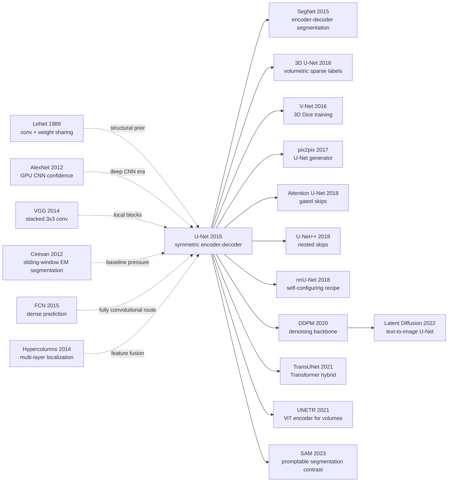

# U-Net — Turning Encoder-Decoders and Skip Connections into the Default Grammar of Medical Segmentation

> **May 18, 2015. Olaf Ronneberger, Philipp Fischer, and Thomas Brox at the University of Freiburg uploaded [arXiv 1505.04597](https://arxiv.org/abs/1505.04597), later published at MICCAI 2015.**
> U-Net's counter-intuitive move was not to make a larger classification CNN and slide it over medical images. It turned FCN's upsampling path into an almost symmetric U, then copied high-resolution encoder features directly into the decoder through skip concatenation. With only 30 EM images, 35 phase-contrast images, and 20 DIC-HeLa images, it pushed the sliding-window CNN baseline from 0.000420 to 0.000353 warping error and lifted DIC-HeLa Cell Tracking IOU from the second-best 0.46 to 0.7756. The same "global context down, local detail up" grammar later reappeared in DDPM, Stable Diffusion, and much of modern medical imaging.

## TL;DR

Ronneberger, Fischer, and Brox's 2015 MICCAI U-Net used a deceptively simple formula-level recipe — weighted pixel cross-entropy $E=\sum_{x\in\Omega} w(x)\log p_{\ell(x)}(x)$ plus a contracting path for semantics, an expanding path for resolution recovery, and crop-and-concatenate encoder skips — to turn biomedical segmentation from "run a classifier on every pixel patch" into "one fully convolutional forward pass emits the whole mask." Its strongest defeated baseline was Ciresan et al.'s 2012 sliding-window CNN: on ISBI EM segmentation, warping error dropped from 0.000420 to 0.000353 and Rand error from 0.0504 to 0.0382; on the Cell Tracking Challenge, PhC-U373 IOU reached 0.9203 versus the second-best 0.83, and DIC-HeLa reached 0.7756 versus 0.46. The hidden lesson is that low-label biomedical vision does not necessarily need a stronger classifier; it needs architectural priors, deformation augmentation, and boundary-aware loss to squeeze maximum information from scarce annotation. That line runs from [LeNet](../era1_foundations/1998_lenet.md) and its convolutional priors to [DDPM](../era4_foundation_models/2020_ddpm.md)'s denoising U-Net and the post-[SAM](../era5_genai_explosion/2023_sam.md) medical-segmentation ecosystem.

---

## Historical Context

### What biomedical segmentation was missing in 2015 was not CNNs, but labels

When U-Net appeared, computer vision was already three years into the post-AlexNet surge. In ImageNet classification, deep convolutional networks had moved from AlexNet and ZFNet to VGG and GoogLeNet; in detection, R-CNN had moved CNN features into proposal-based pipelines; in semantic segmentation, FCN was turning classification networks into dense prediction networks. By 2015, the field no longer lacked confidence that CNNs could read images.

Biomedical segmentation was blocked by a harder constraint: **annotation was expensive, examples were scarce, and boundaries mattered more than image-level categories**. ImageNet had millions of labeled images. U-Net's key EM segmentation experiment had only 30 annotated 512x512 images; the Cell Tracking PhC-U373 setting had 35 partially annotated images, and DIC-HeLa had 20. For natural-image classification, that looks like no data. For neuronal membranes and cell boundaries, that was already a high-quality annotation budget a lab could plausibly assemble.

The mainstream medical-segmentation route was a sliding-window CNN: crop a patch around each pixel, predict the class of the center pixel. Ciresan et al.'s 2012 system won the ISBI EM segmentation challenge with this recipe, because one image could be split into hundreds of thousands of patches and thus seem to become a large dataset. But the route had two structural flaws. First, inference was redundant: adjacent patches overlap heavily, yet the network runs again and again. Second, patch size creates a hard context-localization trade-off: large patches see more structure but lose precision through pooling; small patches localize well but cannot see long-range cell, membrane, and tissue context.

U-Net was not the first fully convolutional segmentation network, nor the first encoder-decoder. Its historical value is that **it pushed the specific constraint of low-label biomedical imagery into architecture, training, and inference at once**. The symmetric expanding path solved context plus localization; skip concatenation preserved shallow boundaries; elastic deformation filled in the deformation space of 30 images; weighted loss made touching-cell borders a training priority instead of rare background pixels. It was not a single trick, but a system design around low-label dense prediction.

### The four threads that forced U-Net out

**The LeNet / CNN tradition**: LeCun's 1989-1998 convolutional networks made local receptive fields, weight sharing, and spatial downsampling the grammar of visual neural networks. U-Net inherited not LeNet-5's exact layer count but its belief that structural priors are more valuable than free parameters. When data is scarce, convolution is not a conservative choice; it is statistical regularization that removes unnecessary degrees of freedom.

**AlexNet / VGG and confidence in deep CNNs**: AlexNet 2012 proved large CNNs could be trained end-to-end on GPUs, and VGG 2014 turned repeated 3x3 convolutions into a stable visual module. Each U-Net resolution stage uses two 3x3 conv + ReLU operations. That was not accidental; U-Net moved VGG's local compositionality into dense prediction, replacing the final classification head with pixel-wise output.

**The Ciresan sliding-window CNN baseline**: U-Net's real target was not classical morphology but IDSIA's sliding-window deep network. Ciresan's route had already proved CNNs could segment neuronal membranes, but it assigned localization to the patch center and limited context to patch size. U-Net's whole-image forward pass was a direct rebuttal: do not chop the image into fragments and stitch predictions back together; let the network itself see the image at multiple scales.

**FCN / Hypercolumns / multi-layer feature fusion**: Long, Shelhamer, and Darrell's FCN made dense output from classification nets and used skips to fuse shallow and deep features; Hariharan's hypercolumns made explicit that different layers are complementary for localization and semantics. U-Net follows that line, but with the biomedical modification that the upsampling path is not a thin recovery head. It is a large-channel decoder, almost symmetric with the contracting path.

### What the Freiburg team was doing

Olaf Ronneberger, Philipp Fischer, and Thomas Brox came from Freiburg's pattern-recognition and computer-vision tradition. Brox's group had long mixed optical flow, image matching, unsupervised feature learning, and biomedical image analysis; in 2014, Dosovitskiy, Springenberg, Riedmiller, and Brox had already put strong augmentation, deformation, and visual representation into the same research orbit.

That matters because U-Net was not a medical lab casually trying a CNN. It came from a team that understood vision architecture, microscopy deformation, and challenge-leaderboard mechanics at the same time. Elastic deformation, overlap-tile inference, mirroring, and cell-boundary weight maps are not details that naturally fall out of a generic CV paper; they come from real microscopy pain points: images are large, memory is limited, cells touch borders, boundary pixels are rare but decisive, and same-class objects often stick together.

The official U-Net page also shows the engineering posture of the work. The authors released not only the paper but a Caffe implementation, trained networks, a Matlab interface, overlap-tile segmentation code, and the greedy tracking algorithm used for the ISBI Cell Tracking submission. A 185 MB release archive was not small in 2015, but it let readers run the paper and the challenge pipeline directly. That "paper + model + executable workflow" mode was more operational than many later medical deep-learning papers.

### Compute, data, and the Caffe moment

The 2015 hardware moment was just barely sufficient: GPUs could train a 23-layer fully convolutional net, but 3D medical imagery, huge microscopy images, and high-resolution dense prediction were still pinned down by memory. U-Net used valid convolutions so that output pixels only covered regions with full context, then used overlap-tile inference to split large images into pieces that fit a 6 GB GPU. Today this can look like plumbing; at the time, it determined whether the model could run on real microscopy images.

Framework-wise, the paper used Caffe's SGD implementation with batch size 1. Because valid convolutions shrink the output relative to the input, the authors preferred large tiles over large batches to minimize border overhead and maximize GPU memory use. They then set momentum to 0.99 so each update still retained information from many previous samples. This is a frequently forgotten part of the U-Net recipe: it was not modern large-batch data-center training, but memory-limited, label-limited, lab-scale training where every image was expensive.

On the data side, U-Net elevated augmentation to nearly the same status as architecture. Random shifts, rotations, and gray-value changes mattered, but the paper singled out random elastic deformation as the key to low-label microscopy segmentation, because tissue and cell variation is naturally non-rigid. That judgment aged well: many strong medical-segmentation baselines are not the newest module, but the right patch size, strong augmentation, a suitable loss, and a U-Net-family backbone.

So U-Net's historical position is not simply "the medical version of FCN." It compressed the success of natural-image CNNs, the low-label reality of biomedical imaging, the deformation priors of microscopy, and the Caffe/GPU engineering limit into one architecture diagram that labs around the world could reproduce. That U-shaped diagram became a visual language: whenever the task needs same-size output, semantic context, and precise localization at the same time, researchers first draw a U.

---

## Method Deep Dive

### Overall Framework

U-Net's overall structure can be compressed into one sentence: **the left side is a standard CNN contracting path, the right side is an almost symmetric expanding path, and crop-and-concatenate skip connections copy shallow spatial detail back into the decoder**. It has no fully connected layers, and every output is a dense pixel logit. Because it uses valid convolutions, the output region is smaller than the input region, but every output pixel has complete context.

In the canonical paper figure, the input tile is 572x572 and the output segmentation map is 388x388. That gap is not arbitrary; it is the accumulated border shrinkage caused by repeated valid 3x3 convolutions. The network has 23 convolutional layers in total: each downsampling stage applies two 3x3 conv + ReLU operations, followed by 2x2 max pooling; each upsampling stage starts with a 2x2 up-convolution, concatenates the cropped encoder feature at the same scale, then applies two more 3x3 conv + ReLU operations; a final 1x1 convolution maps each 64-dimensional feature vector to pixel-class logits.

| Part | Operation | Output / role |
|---|---|---|
| Contracting path | two 3x3 valid conv + ReLU, then 2x2 max pool | semantic context grows, spatial resolution halves |
| Channel schedule | channels double after each downsampling | more channels carry more abstract semantics |
| Bottleneck | two 3x3 convs at the lowest resolution | links local texture with global structure |
| Expanding path | 2x2 up-conv, channels halve | restores spatial resolution |
| Skip concatenation | crop encoder feature, concat with decoder feature | returns shallow localization detail to the up path |
| Output head | 1x1 conv + pixel softmax | class probability for each pixel |

The key is not that the diagram visually resembles a U. It is that U-Net splits dense prediction into two complementary questions: the downward path asks "what is this region?" and the upward path asks "where exactly are the boundaries?" Sliding-window CNNs squeeze both questions into one patch classifier; U-Net handles them simultaneously across multiscale feature maps.

### Key Designs

#### Design 1: Symmetric contracting-expanding path — turning a classification CNN into a same-size dense predictor

**Function**: The contracting path aggregates context through pooling; the expanding path restores resolution through up-convolution. Their near symmetry gives the output both deep semantics and spatial structure.

**Core formula**: A downsampling stage can be written as `h_{s+1}=Pool(Conv3x3(Conv3x3(h_s)))`, and an upsampling stage as `g_s=Conv3x3(Conv3x3(Concat(Crop(h_s), Up(g_{s+1}))))`. Here `h_s` is encoder scale s and `g_s` is decoder scale s.

```python
import torch
import torch.nn as nn

class DoubleConv(nn.Module):
    def __init__(self, in_ch, out_ch):
        super().__init__()
        self.net = nn.Sequential(
            nn.Conv2d(in_ch, out_ch, 3, padding=0),
            nn.ReLU(inplace=True),
            nn.Conv2d(out_ch, out_ch, 3, padding=0),
            nn.ReLU(inplace=True),
        )

    def forward(self, x):
        return self.net(x)

class DownStep(nn.Module):
    def __init__(self, in_ch, out_ch):
        super().__init__()
        self.conv = DoubleConv(in_ch, out_ch)
        self.pool = nn.MaxPool2d(2)

    def forward(self, x):
        skip = self.conv(x)
        return self.pool(skip), skip
```

| Scheme | Context | Localization | Compute redundancy | Low-label fit |
|---|---|---|---|---|
| Sliding-window CNN | limited to patch | precise at center pixel | high, overlapping patches repeat work | more patches, but context limited |
| FCN thin decoder | good | depends on coarse skips | low | needs more natural-image pretraining know-how |
| **U-Net symmetric decoder** | **good** | **good, decoder has enough channels** | **low** | **strong, end-to-end plus augmentation** |
| Pure classifier CNN | good | weak, image-level label only | low | unsuitable for dense masks |

**Design rationale**: Medical segmentation is not classification plus postprocessing; it is same-size structured prediction. Neuronal membranes, cell contours, and organ boundaries need global context to decide the object and local evidence to place the boundary. U-Net's symmetry allocates these goals to two paths: the encoder trades resolution for semantics, and the decoder sends those semantics back to the pixel grid through progressive upsampling.

#### Design 2: Crop-and-concat skip connection — giving the decoder shallow boundary evidence back

**Function**: At each scale, crop the contracting-path high-resolution feature map to the same spatial size as the upsampled decoder map, then concatenate along the channel dimension. It is not ResNet-style addition; it is feature concatenation, letting the decoder learn how to combine texture and semantics.

**Core formula**: `z_s = Concat(CenterCrop(h_s), Up(g_{s+1}))`, then `g_s = F_s(z_s)`. `Concat` increases channel count, and the two following 3x3 convolutions learn the mixture.

```python
def center_crop_like(encoder_feat, decoder_feat):
    _, _, h, w = decoder_feat.shape
    _, _, H, W = encoder_feat.shape
    top = (H - h) // 2
    left = (W - w) // 2
    return encoder_feat[:, :, top:top + h, left:left + w]

def crop_and_concat(encoder_feat, decoder_feat):
    cropped = center_crop_like(encoder_feat, decoder_feat)
    return torch.cat([cropped, decoder_feat], dim=1)
```

| Skip type | Fusion | Benefit | Cost | Best suited for |
|---|---|---|---|---|
| No skip | decoder deep feature only | simple | blurry boundaries, detail loss | coarse segmentation |
| Additive skip | same-dim features added | channel-efficient | forces shallow/deep alignment | ResNet / FPN |
| **Concat skip (U-Net)** | **channel concat then conv** | **keeps all shallow detail** | **more channels and memory** | **medical boundaries, cell instances** |
| Attention-gated skip | select before concat | suppresses noise | more complex | later Attention U-Net |

**Design rationale**: Valid convolution and pooling make deep features more abstract and stable, but also coarser. Medical-image errors often happen on boundaries only 2-5 pixels wide; if the decoder only sees low-resolution semantics, the output becomes a heatmap rather than a mask. Concat skip sends edge, texture, membrane, and cell-contact evidence directly back upward, so the decoder can redraw boundaries under deep semantic constraints.

#### Design 3: Valid convolution + overlap-tile inference — making large-image segmentation fit memory

**Function**: U-Net predicts only the valid output region whose pixels have full context. At inference, large images are split into overlapping input tiles; each tile contributes only its reliable center output, and those outputs are stitched back together. Missing border context is filled by mirroring.

**Core formula**: If the network maps `f: R^{H_in×W_in} -> R^{H_out×W_out}` with `H_out < H_in`, choose tile stride `H_out`: feed a haloed `H_in` region each time and copy only the central `H_out` prediction. Any large image can then be tiled without seams.

```python
def overlap_tile_predict(image, model, in_size=572, out_size=388):
    stride = out_size
    outputs = []
    for top in range(0, image.shape[-2], stride):
        row = []
        for left in range(0, image.shape[-1], stride):
            tile = mirror_pad_and_crop(image, top, left, in_size)
            pred = model(tile)              # reliable center output only
            row.append(pred[..., :out_size, :out_size])
        outputs.append(torch.cat(row, dim=-1))
    return torch.cat(outputs, dim=-2)
```

| Inference strategy | Memory need | Border quality | Speed | Suitable images |
|---|---|---|---|---|
| Whole-image inference | highest | good | fast if it fits | small images |
| Sliding window patch | low | medium | slow, much duplicated compute | old patch classifiers |
| **Overlap-tile (U-Net)** | **controllable** | **good, center output is reliable** | **fast, one tile forward** | **large microscopy and tissue images** |
| Naive non-overlap tile | low | poor, tile-edge breaks | fast | not recommended |

**Design rationale**: The U-Net figure is usually remembered as an architecture diagram, but Figure 2's overlap-tile strategy is just as important. Microscopy images are often much larger than GPU memory, and borders cannot simply be zero-padded because the model would see artificial black frames. Mirroring is a pragmatic prior: tissue texture tends to continue beyond the border, which is closer to reality than zeros.

#### Design 4: Weighted pixel loss + elastic deformation — writing few labels and touching borders into the objective

**Function**: Pixel-wise softmax cross entropy handles classification, class-balance weighting handles foreground/background imbalance, boundary weighting forces the network to learn thin background borders between touching cells, and elastic deformation expands the deformation space of scarce labeled images.

**Core formula**: The paper's weight map is `w(x)=w_c(x)+w_0 exp(-(d_1(x)+d_2(x))^2/(2 sigma^2))`, where `d_1` and `d_2` are distances to the closest and second-closest cell boundary. Experiments set `w_0=10` and `sigma≈5`. The loss is weighted pixel cross entropy `E=sum_x w(x) log p_{l(x)}(x)`.

```python
def weighted_pixel_cross_entropy(logits, target, weight_map):
    # logits: (B, C, H, W), target: (B, H, W), weight_map: (B, H, W)
    log_prob = torch.log_softmax(logits, dim=1)
    picked = log_prob.gather(1, target[:, None]).squeeze(1)
    return -(weight_map * picked).mean()

def elastic_grid(control_points, std=10.0):
    disp = torch.randn_like(control_points) * std
    return bicubic_interpolate(disp)
```

| Training component | Problem solved | Paper setting | Later influence |
|---|---|---|---|
| Class-balance weight | foreground/background imbalance | `w_c(x)` | standard medical class weighting |
| Boundary weight | touching cells are hard to split | `w0=10`, `sigma≈5` | early instance-aware loss |
| Elastic deformation | few labels, many tissue shapes | 3x3 grid, std 10 px | medical-image heavy augmentation tradition |
| Batch size 1 + momentum | large tiles consume memory | momentum 0.99 | small-batch dense-prediction recipe |

**Design rationale**: If optimization only sees average pixel accuracy, it will favor broad background and cell interiors. Challenge ranking is decided by borders and separations. U-Net's weighted loss tells the optimizer: "these thin borders are rare, but if you miss them, two cells merge into one." Elastic deformation adds the most common non-rigid biological variation directly into training, keeping the model from memorizing the exact shapes of 20-30 images.

### Training Recipe

| Item | Setting | Notes |
|---|---|---|
| Framework | Caffe | mainstream CNN engineering framework of the time |
| Optimizer | SGD | end-to-end training of the whole U-Net |
| Batch size | 1 | large tiles prioritized over large batches |
| Momentum | 0.99 | smooths small-batch updates with history |
| Convolution | unpadded valid 3x3 | output keeps only full-context regions |
| Initialization | ReLU variance initialization | close to He initialization, adjusted by incoming nodes |
| Augmentation | shift / rotation / gray / elastic deformation | elastic deformation is the low-label key |
| Runtime | about 10 hours training, 512x512 inference < 1 second | reproducible practicality in the NVIDIA Titan 6GB era |

From today's vantage point, U-Net's training recipe is not especially "modern": no Adam, no batch norm, no Dice loss, no residual block, no transformer attention. That is exactly why it reveals something deeper: **the central bottleneck in dense prediction is not whether we can stack complex modules, but whether we can recover boundaries stably under scarce annotation**. That problem is still alive in 2026.

---

## Failed Baselines

### Baseline 1: Sliding-window CNN won in 2012, but lost to one fully convolutional forward pass

Ciresan et al.'s IDSIA sliding-window CNN is the most important failed baseline in the U-Net paper. It was not a weak method: in 2012 it led the ISBI EM segmentation challenge by a large margin and proved that deep CNNs could segment neuronal membranes. But against U-Net, its structural weaknesses became visible.

The sliding-window method turns every pixel into a patch-classification problem. That has one short-term benefit: 30 training images can be sliced into many patches, making the dataset appear large. But the benefit carries two debts. The first is compute debt: neighboring pixel patches are almost identical, yet the network runs again and again. The second is context debt: patch size is fixed. If the window is too small, the network misses large structure; if it is too large, more pooling is needed and localization becomes coarse.

U-Net's response is direct: turn the patch classifier into a fully convolutional predictor. All overlapping computation is shared, the whole tile is processed in one forward pass, context grows through the contracting path, and localization is restored through skips and the decoder. On the EM challenge, warping error dropped from IDSIA's 0.000420 to 0.000353, and Rand error from 0.0504 to 0.0382.

### Baseline 2: A thin FCN-style upsampling route was not sharp enough for boundaries

FCN is U-Net's immediate predecessor, but "turn a classification CNN into dense output" is not enough by itself. Natural-image semantic segmentation can tolerate relatively coarse boundaries because PASCAL VOC objects occupy large regions. Biomedical segmentation cannot. Neuronal membranes and cell-contact boundaries can be only a few pixels wide; missing one line changes instance topology.

U-Net's key modification to FCN is that the decoder is not just a small set of upsampling layers; it is a high-channel, almost symmetric expanding path. Shallow features are not merely added. They are cropped and concatenated, letting the decoder relearn how to combine boundary evidence with deep semantics at every scale. That explains why U-Net later proved more stable in medical imaging than many "FCN + postprocessing" recipes: localization capacity lives inside the main network, not in a CRF or morphology patch.

### Baseline 3: Classical morphology / tracking pipelines could not replace learned boundaries

Before U-Net, cell segmentation relied heavily on thresholding, morphology, watershed, connected components, and hand-written tracking rules. These tools are useful when imaging conditions are stable and shapes are regular, but they are fragile under DIC, phase contrast, or touching cells. If the boundary was not learned by the pixel classifier, postprocessing could only guess from a bad probability map.

U-Net did not completely eliminate postprocessing; the official release still included a greedy tracking algorithm. The core change was that the predicted masks were already good enough that tracking only needed to connect time, not rescue bad segmentation. The DIC-HeLa result in the Cell Tracking Challenge makes this clearest: U-Net reached 0.7756 IOU while the second-best 2015 method reached only 0.46. That gap is not a small postprocessing tweak; it is a backbone and boundary-loss difference.

### Baseline 4: Plain pixel loss learns average correctness, not separation of touching cells

Plain pixel cross entropy naturally favors large regions: background, cell interiors, and tissue interiors contribute most pixels, while thin boundaries are rare. A model can look decent on average pixel accuracy and still merge two touching cells into one blob. For cell tracking and instance-aware segmentation, that is a fatal error.

U-Net's weight map amplifies the background boundary between touching cells, especially where `d_1(x)+d_2(x)` is small. It is not instance segmentation loss in today's terminology, but it already has an instance-aware flavor: the model is forced to treat "the narrow gap between two objects" as a key supervision signal. Dice loss, boundary loss, topology-aware loss, and distance-transform losses later inherited and rewrote this idea in many forms.

| Baseline | Why it made sense then | Why it lost to U-Net | Later lesson |
|---|---|---|---|
| Sliding-window CNN | many patches, direct center-pixel localization | duplicate compute, context-localization conflict | dense prediction should share full-image computation |
| Thin FCN decoder | already worked for natural-image semantics | decoder capacity too small, medical boundaries too coarse | upsampling path must rebuild detail |
| Morphology / watershed | interpretable, low-data, mature engineering | brittle under imaging shifts and touching cells | postprocessing cannot replace learned boundaries |
| Plain pixel CE | simple and stable | rare boundary pixels are averaged away | loss must reflect task cost |

## Key Experimental Data

### ISBI EM segmentation: 30 images beat the sliding-window CNN

For neuronal-membrane EM segmentation, U-Net trained on only 30 annotated 512x512 images; test labels were hidden by the challenge organizers. The paper reports the March 6, 2015 leaderboard, using warping error, Rand error, and pixel error. U-Net averaged predictions over seven rotated inputs and used no extra preprocessing or postprocessing.

| Method | Warping error | Rand error | Pixel error |
|---|---:|---:|---:|
| Human values | 0.000005 | 0.0021 | 0.0010 |
| **U-Net** | **0.000353** | **0.0382** | **0.0611** |
| DIVE-SCI | 0.000355 | 0.0305 | 0.0584 |
| IDSIA sliding-window CNN | 0.000420 | 0.0504 | 0.0613 |
| IDSIA-SCI | 0.000653 | 0.0189 | 0.1027 |

The interesting point is that U-Net is not absolutely first on every metric. DIVE-SCI has lower Rand and pixel error, but it relies on stronger dataset-specific postprocessing; U-Net's key win is warping error, especially while beating the sliding-window CNN without complex postprocessing. The paper's real claim is not "one table, all metrics won," but "a simpler, faster, more transferable backbone."

### Cell Tracking Challenge: the same network transfers across microscopy modes

The paper applied the same U-Net training strategy to transmitted-light microscopy, including phase-contrast PhC-U373 and DIC-HeLa. The two datasets had only 35 and 20 partially annotated training images, respectively. The result shows U-Net was not overfitted to EM membrane segmentation; it transferred across imaging modes.

| Method | PhC-U373 IOU | DIC-HeLa IOU |
|---|---:|---:|
| IMCB-SG (2014) | 0.2669 | 0.2935 |
| KTH-SE (2014) | 0.7953 | 0.4607 |
| HOUS-US (2014) | 0.5323 | - |
| Second-best 2015 | 0.83 | 0.46 |
| **U-Net (2015)** | **0.9203** | **0.7756** |

DIC-HeLa is the most revealing setting. The second-best 2015 method reached only 0.46, while U-Net reached 0.7756, showing that weighted loss plus elastic deformation was especially effective for low-contrast, blurry-boundary, touching-cell microscopy. This was not an ImageNet-style big-data victory; it was a low-label system-design victory.

### Training and inference cost: reproducibility was part of U-Net's spread

| Item | Value / setting | Meaning |
|---|---|---|
| EM training set | 30 images at 512x512 | trainable under extreme annotation scarcity |
| PhC-U373 training set | 35 partially annotated images | transfer to phase-contrast microscopy |
| DIC-HeLa training set | 20 partially annotated images | harder DIC imaging setting |
| Training time | about 10 hours | feasible on NVIDIA Titan 6GB |
| Inference | 512x512 image < 1 second | usable in challenge and lab workflows |

These cost numbers were crucial to U-Net's historical diffusion. In 2015, many labs did not have large GPU clusters, but one Titan-class GPU, a few dozen annotated images, and the official Caffe release were enough to reproduce the work. U-Net became the default starting point in medical imaging not only because its scores were strong, but because it fit academic lab budgets.

### Key findings

First, **low-data does not mean shallow model**. U-Net has 23 convolutional layers. It can train on 20-30 images because structural priors, valid tiling, skips, augmentation, and loss jointly reduce the effective sample requirement.

Second, **boundaries matter more than average pixels**. The paper reports warping error, Rand error, and IOU rather than only pixel accuracy, matching the weighted boundary loss. Evaluation and training both point at the same goal: do not merge touching cells.

Third, **speed itself is a methodological contribution**. Sliding-window CNNs can segment, but they are slow and redundant. U-Net's sub-second 512x512 inference moved dense segmentation from an offline challenge result toward a practical tool in microscopy workflows.

---

## Idea Lineage



### Past lives (what forced it out)

- **LeNet / convolutional-network tradition**: U-Net's local convolution, weight sharing, and multiscale downsampling come from the visual-network tradition after LeNet. U-Net's twist is that it turns the classification network's loss of spatial information into a two-step plan: first lose space to gain semantics, then recover space through a symmetric path.
- **AlexNet / VGG and confidence in deep CNNs**: Without the ImageNet victories of 2012-2014, biomedical imaging would not have trusted a 23-layer fully convolutional net trained on a few dozen images so quickly. VGG's repeated 3x3 convs also gave U-Net a stable, reproducible, legible local block.
- **Ciresan 2012 sliding-window CNN**: This is the direct baseline pressure. The sliding-window CNN proved "CNNs can segment," while exposing "patch-wise inference is slow, and context fights localization." U-Net's fully convolutional tile inference is a systematic answer to both problems.
- **FCN / Hypercolumns**: FCN proved classification nets could become dense predictors; Hypercolumns stressed multi-layer feature fusion. U-Net pushed that line into low-label biomedical segmentation and turned it into a repeatable architecture through the symmetric decoder and concatenative skips.

### Descendants

- **Medical-segmentation line**: 3D U-Net, V-Net, U-Net++, Attention U-Net, nnU-Net, TransUNet, UNETR, and Swin-UNETR all rewrite the same U-Net question: how do multiscale features preserve semantics and localization at once? nnU-Net is especially important because it showed many new architectures lose to a U-Net pipeline whose preprocessing, patch size, augmentation, and postprocessing are simply configured well.
- **Generative-model line**: pix2pix uses U-Net as an image-to-image generator; DDPM uses U-Net as a denoising backbone; Latent Diffusion / Stable Diffusion moves it into latent space and adds time embeddings, attention, and cross-attention. U-Net migrated from medical segmentation into image generation because denoising and segmentation are both dense prediction: input and output share spatial size, requiring global semantics and high-frequency detail.
- **Foundation-model contrast line**: After SAM, segmentation entered the promptable foundation-model era, but U-Net did not disappear in medical imaging. The reason is practical: SAM needs large mask data and a strong prompt mechanism, while many medical tasks remain small-data, domain-shifted, and organ- or lesion-specific. U-Net became the task-specific strong baseline; SAM became the interactive / zero-shot ceiling reference.

### Misreadings / oversimplifications

- **Misreading 1: U-Net's contribution is just skip connection**. The skip is crucial, but by itself it is not U-Net. The complete package is valid convolution, symmetric decoder, crop-and-concat, overlap-tiling, elastic augmentation, and boundary-weighted loss. Remove one piece and the low-label biomedical segmentation story is incomplete.
- **Misreading 2: U-Net is only a medical-image architecture**. It began in biomedical imaging, but later entered image-to-image translation, diffusion denoising, remote sensing, satellite segmentation, and industrial inspection. It solves the general same-size dense-prediction problem, not just one data type.
- **Misreading 3: Transformer made U-Net obsolete**. ViT, Swin, UNETR, and DiT do replace some convolutional blocks, but many systems keep the U-shaped multiscale path and long skips. What changes is the block; the problem decomposition of "compress context, then progressively recover detail" remains.
- **Misreading 4: U-Net means one fixed diagram**. In practice the U-Net family has become a recipe: 2D/3D, patch size, depth, channel schedule, normalization, loss, augmentation, and postprocessing all vary. Its durability comes precisely from not being a closed model, but an adjustable engineering grammar.

---

## Modern Perspective (looking back at 2015 from 2026)

### Assumptions that no longer hold

- **"Medical segmentation only needs small task-specific models"**: in 2015 this was a reasonable belief because data was scarce, tasks were narrow, and hospital settings were tightly constrained. The 2026 reality is more complex. SAM, MedSAM, foundation segmentation, self-supervised pretraining, and large multi-organ datasets show that pretraining and promptability can significantly improve cross-domain generalization. U-Net remains a strong baseline, but "train a task-specific U-Net from scratch" is no longer the only default answer.
- **"Convolution is always the best dense-prediction backbone"**: U-Net's locality prior is extremely strong for low-label medical imaging, but Transformers, Mamba-style state-space blocks, and hybrid CNN-Transformer models show that long-range dependency and cross-organ context also matter. Today's strong models often keep a U-shaped decoder and skips, while the encoder may be Swin, ViT, UNETR, or a state-space hybrid.
- **"Weighted cross entropy is enough to express segmentation cost"**: the paper's boundary weighting was smart, but we now know Dice, Tversky, focal, surface loss, clDice, and topology-aware loss better match class imbalance, thin tubular structures, organ-surface error, and clinical cost. U-Net's loss is a starting point, not the finish line.
- **"2D tiles are enough to represent medical images"**: the original U-Net paper mainly studied 2D microscopy. Modern CT, MRI, and 3D EM need 3D context, anisotropic voxels, organ topology, and cross-slice consistency. 3D U-Net, V-Net, and Swin-UNETR all correct this assumption.

### What survived vs. what became incidental

Three core designs survived. First, **the encoder-decoder multiscale path**: whether the blocks are CNN, Transformer, or DiT, dense prediction still needs to compress global semantics to low resolution and then progressively recover spatial detail. Second, **long skip connections**: same-size output tasks need shallow geometric evidence, especially for medical boundaries, denoising, and image translation. Third, **task priors inside training strategy**: U-Net's elastic deformation and boundary weighting show that low-label tasks cannot rely on architecture alone; the data-generation mechanism and error cost must enter training.

What became incidental are several 2015 engineering choices. Valid convolution helped reliable overlap-tiling at the time, but modern frameworks package same padding, reflection padding, sliding-window inference, test-time augmentation, and MONAI / nnU-Net workflows more naturally. Caffe, the Matlab interface, batch size 1 plus high momentum are not the intellectual core. The enduring principle is large-tile / patch-based training, not the exact toolchain.

### Side effects the authors did not foresee

The strangest side effect is that U-Net escaped medical imaging and entered generative modeling. pix2pix used a U-Net generator for image translation, DDPM used U-Net to predict noise, and Stable Diffusion used a time-conditioned U-Net in latent space for text-to-image generation. A skip decoder designed for low-label biomedical segmentation became a general backbone for high-frequency detail preservation.

Another side effect is that U-Net became the hardest baseline to beat and the easiest one to underestimate in medical AI papers. Many new modules look good on one dataset, but nnU-Net showed that once preprocessing, patch size, augmentation, loss, and postprocessing are tuned, a plain U-Net family often recovers much of the gap. This created a healthy but unforgiving benchmarking culture: new medical segmentation methods must first survive nnU-Net.

There is also a social side effect: U-Net lowered the entry barrier for deep learning in medical imaging. A lab could train a usable model with a few dozen annotated images, open code, and a single GPU, directly fueling the 2016-2020 explosion of medical-imaging papers. But the lower barrier also produced many small-sample, single-center, weakly validated studies whose clinical transferability was often overestimated.

### If U-Net were rewritten today

If I rewrote U-Net in 2026, I would keep the U-shaped multiscale path and long skips, but turn the fixed architecture into a self-configuring system. The input data would first go through automatic spacing / intensity / patch-size analysis. The encoder would be ConvNeXt / ResNet under small data, and Swin / ViT / state-space hybrid when large data or pretraining is available. The decoder would keep multiscale skips, but add lightweight attention gates or uncertainty-aware fusion.

The training objective would move from single weighted CE to a composition: Dice/Tversky for class imbalance, boundary/surface loss for clinical contours, and topology loss for vessels, nerves, glands, and other thin structures. Augmentation would also be stronger: elastic deformation, bias field, gamma, cutmix/mixup, domain randomization, scanner-specific noise, and test-time augmentation or ensembles for uncertainty estimation.

The biggest change is pretraining. A 2026 U-Net should not look at a few dozen images from scratch. It should plug into self-supervised medical-image encoders, SAM/MedSAM-style mask priors, or synthetic labels / weak labels / foundation features as warm starts. The 2015 spirit of U-Net is not "train a U-shaped CNN from zero"; it is "under scarce labels, exploit structural priors and task cost as hard as possible." That spirit is still correct.

## Limitations and Future Directions

### Author-acknowledged limitations

The paper is quite honest about several constraints. First, it depends on strong data augmentation, especially elastic deformation; if target deformations are not covered by that augmentation, generalization suffers. Second, valid convolutions make the output smaller than the input, requiring overlap-tiling and mirroring, which is more complex than same-padding networks. Third, the paper demonstrates 2D image segmentation, not direct 3D volume segmentation or cross-slice consistency.

In addition, U-Net's instance separation relies on boundary weighting rather than explicit instance modeling. It works for touching cells, but when object counts, shapes, and topology become more complex, boundary weights alone are not enough. Mask R-CNN, StarDist, Cellpose, and watershed-on-distance-map methods later filled this gap from different directions.

### New limitations from a 2026 view

The largest new limitation of the U-Net family is cross-domain generalization. A U-Net trained on one center, one scanner, or one staining protocol can degrade sharply when moved to another hospital, device, or protocol. The original paper succeeded under relatively clear challenge distributions; clinical deployment needs domain adaptation, calibration, uncertainty, and external validation.

The second limitation is semantic hierarchy. U-Net is excellent at pixel boundaries, but it does not naturally understand why a lesion matters or how an organ mask relates to a clinical report. Multimodal medical AI must connect segmentation with reports, pathology, genomics, and longitudinal follow-up; a pure mask predictor is only one part of that stack.

The third limitation is evaluation. IOU, Dice, and warping error are useful leaderboard metrics, but clinical use cares about measurement error, lesion volume, treatment decisions, missed-diagnosis risk, and physician interaction cost. Post-U-Net medical segmentation needs to move from leaderboard metrics to clinical-utility metrics.

### Improvement directions already validated by follow-ups

- **Self-configuring pipelines**: nnU-Net shows that automatic configuration of preprocessing, patch size, resampling, augmentation, and postprocessing can matter as much as architecture novelty.
- **3D / 2.5D modeling**: 3D U-Net, V-Net, and Swin-UNETR show that volumetric data cannot always be treated as independent slices.
- **Transformer / hybrid encoders**: TransUNet, UNETR, and Swin-UNETR show long-range dependency helps organ-level segmentation, while still often needing a U-shaped decoder.
- **Foundation-model adaptation**: MedSAM, SAM-Med2D, and domain-specific prompt tuning show promptable segmentation can complement U-Net, but has not fully replaced strong task-specific models.
- **Boundary and topology losses**: surface Dice, clDice, and Hausdorff-aware losses show that "cost of error" must be closer to medical structure than ordinary pixel CE.

## Related Work and Insights

### Relationship to LeNet / FCN / ResNet

U-Net inherits LeNet's convolutional structural prior, FCN's dense-output idea, and entered the deep-learning infrastructure in the same year as ResNet. ResNet solved "how do we train very deep networks?" U-Net solved "how do same-size outputs preserve semantics and localization at once?" The two later converged in DDPM, Stable Diffusion, and medical segmentation: modern U-Nets often use residual blocks, and modern diffusion U-Nets are almost ResNet blocks plus U-shaped skips plus time embeddings.

### Relationship to nnU-Net

nnU-Net is the most profound meta-summary of U-Net: instead of inventing a new network, turn U-Net into an automatic configuration system. It maps dataset fingerprints into patch size, network depth, spacing, normalization, augmentation, postprocessing, and more. That shows U-Net's core has expanded from a model structure into a medical-segmentation engineering protocol. It is the strongest evidence of U-Net's durability.

### Relationship to SAM / foundation segmentation

SAM represents a different paradigm: massive mask data plus a promptable model plus zero-shot generalization. It opens new space in natural-image and interactive segmentation, but medical imaging still faces domain shift, fine boundaries, 3D context, and annotation-protocol differences. The likely future is not SAM replacing U-Net, but fusion: foundation encoder / prompt prior plus U-Net-style task decoder plus medical-domain augmentation and calibration.

## Resources

### Paper / Code

- Paper arXiv: [U-Net: Convolutional Networks for Biomedical Image Segmentation](https://arxiv.org/abs/1505.04597)
- Official page and Caffe release: [University of Freiburg U-Net page](https://lmb.informatik.uni-freiburg.de/people/ronneber/u-net/)
- MICCAI version DOI: [10.1007/978-3-319-24574-4_28](https://doi.org/10.1007/978-3-319-24574-4_28)
- Follow-up practice entry points: MONAI, nnU-Net, Medical Segmentation Decathlon, Cell Tracking Challenge

### Recommended Reading

- FCN: Long, Shelhamer, Darrell, 2015, for the dense-prediction predecessor to U-Net.
- 3D U-Net / V-Net: for how U-Net entered volumetric data and Dice-style training.
- nnU-Net: for why engineering configuration of the U-Net family can matter more than a single module.
- DDPM / Stable Diffusion: for how U-Net migrated from medical segmentation into generative modeling.
- SAM / MedSAM: for how promptable foundation segmentation complements and challenges the U-Net era.


---

> 🌐 [中文版](/era2_deep_renaissance/2015_unet/) · 📚 awesome-papers project · CC-BY-NC