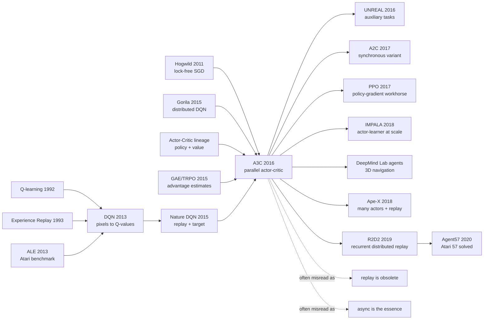

# A3C - Asynchronous Actors as the Stabilizer for Deep Reinforcement Learning

> **On February 4, 2016, Volodymyr Mnih, Adrià Puigdomènech Badia, Mehdi Mirza, and five co-authors posted [Asynchronous Methods for Deep Reinforcement Learning](https://arxiv.org/abs/1602.01783), later published at ICML 2016.** Its sharpest move was not simply a better Atari score. It temporarily removed the very object that had made Nature DQN feel safe: the replay memory. Sixteen CPU actor-learners ran separate environments, explored different trajectories, and pushed gradients into shared parameters without a heavy distributed system. The recurrent A3C agent reached 623.0% mean human-normalized Atari score after four CPU days. The paper moved deep RL from a story about one learner stabilized by replay to a story about many actors manufacturing a healthier learning distribution.

## TL;DR

A3C, published at ICML 2016 by Volodymyr Mnih, Adrià Puigdomènech Badia, Mehdi Mirza, Alex Graves, Timothy Lillicrap, Tim Harley, David Silver, and Koray Kavukcuoglu, gives a different answer to the stability problem that [Nature DQN](2015_dqn_nature.md) had solved with replay and target networks. Instead of collecting one agent's recent transitions into a replay buffer and sampling them later, A3C runs many actor-learners on separate environment instances, lets them explore different parts of the state space, and applies asynchronous Hogwild-style updates to shared neural-network parameters. Its central actor-critic update is $\nabla_\theta \log \pi(a_t|s_t;\theta)A_t + \beta\nabla_\theta H(\pi(s_t;\theta))$, with $A_t=\sum_{i=0}^{k-1}\gamma^i r_{t+i}+\gamma^kV(s_{t+k})-V(s_t)$ estimated from forward-view n-step returns. The baselines it challenged were not weak: DQN, Double DQN, Dueling DQN, Prioritized DQN, and the 100-machine Gorila system. With only 16 CPU cores and four training days, recurrent A3C reached 623.0% mean human-normalized score on Atari 57 human starts, compared with 463.6% for Prioritized DQN after eight GPU days. The deeper lesson is that deep RL stability can come from dataflow design, not only from replay buffers: many imperfect actors can collectively decorrelate experience, improve wall-clock throughput, and support on-policy methods. That idea later splits into two major descendants: cleaner synchronous actor-critic baselines such as A2C and PPO, and large actor/learner systems such as IMPALA, Ape-X, R2D2, and Agent57. Alongside [AlphaGo](2016_alphago.md), A3C marks 2016 as the year DeepMind turned deep RL from a striking Atari demo into a broader systems program.

---

## Historical Context

### 2016: The Congestion After DQN

Deep reinforcement learning at the beginning of 2016 had just had its public breakthrough. Nature DQN had shown that a convolutional network could learn action values from Atari pixels and scores. DeepMind's story had moved from "neural networks can classify images" to "neural networks can learn to play games from raw sensory input." Yet DQN's success carried an obvious price: it leaned heavily on replay memory and a single-learner, GPU-centered training loop. Experience had to be stored, sampled randomly, and reused; the policy could move on while the buffer still contained data from older policies; scaling throughput meant building more elaborate replay and learner machinery.

That was awkward for the RL community. In theory, policy gradients, Sarsa, actor-critic methods, and eligibility traces were all basic tools. In engineering practice, the most convincing public recipe for deep networks in RL revolved around replay and off-policy Q-learning. DQN opened the stage for deep RL, but it also narrowed the stage: if deep RL required replay, then on-policy actor-critic, continuous-action control, recurrent agents, and lightweight CPU training were all harder to fit into a single usable interface.

| 2015 route | Source of stability | Resource shape | What A3C tries to rewrite |
|------------|---------------------|----------------|---------------------------|
| Nature DQN | replay memory + target network | one GPU, one learner | decorrelation must come from a buffer |
| Double / Dueling / Prioritized DQN | value-learning patches on DQN | GPU + replay | stronger scores, same replay-centered system |
| Gorila | 100 actors + 30 parameter servers | about 130 machines | parallelism works, but is heavy |
| TRPO / GAE | trust region and advantage estimation | batch policy optimization | stable but less lightweight in wall-clock practice |
| Classical actor-critic | policy + value baseline | conceptually simple | unreliable with deep networks |

A3C sits exactly in this gap. It does not reject DQN; it pushes against a systems bottleneck exposed by DQN. DQN asks, "How can old experience be stored as a trainable dataset?" A3C asks, "Can many agents produce sufficiently different new experience so that the stream is less correlated before it ever enters a buffer?" That sounds like an engineering question, but it changes which deep RL algorithms are practical.

### The Success and Cost of Experience Replay

Replay memory was a rescue module in DQN. Online RL samples are strongly correlated, and the policy controls the distribution of future samples. Updating a neural network directly along a single trajectory can make the value function chase its own mistakes. Replay stores transitions and samples minibatches so the training distribution looks more like a mixed pool of recent experience. This made DQN work, and it gave deep RL a data-systems vocabulary: experience is not merely a temporal stream, but an asset that can be stored, reused, sampled, and audited.

Replay is not free. It consumes memory; it naturally favors off-policy learning, making Sarsa and actor-critic harder to use directly; it mixes the current policy with data generated by older policies; and in tasks with expensive interaction, recurrent state, or simulator bottlenecks, the questions of what to store and how to replay it quickly become systems problems.

A3C's point is not that replay is useless. The conclusion explicitly says that replay could improve data efficiency and may be combined with the asynchronous framework. The narrower and stronger claim is this: **stable deep RL does not always have to write experience into a buffer first; parallel actors can themselves provide a decorrelating force.** That claim brings on-policy actor-critic back into the deep RL mainstream and turns ordinary CPU threads into useful training resources.

### DeepMind's Move From Atari Toward General Control

A3C appears in the same year as [AlphaGo](2016_alphago.md), and the timing matters. DeepMind in 2016 was expanding the Atari story of "one network learns one game" into a broader agent program: visual input, continuous actions, random 3D mazes, policies and value functions, search and planning, and parallel systems. A3C is the lightweight infrastructure piece in that program.

The author list reflects this mixture. Volodymyr Mnih and Koray Kavukcuoglu extend the pixel-control line from DQN; David Silver brings the central RL and game-decision perspective; Alex Graves makes recurrent agents and sequence learning natural; Timothy Lillicrap brings the pressure of continuous control from the DDPG line; Adrià Puigdomènech Badia later appears in Atari exploration systems such as Agent57. A3C is therefore not just an Atari score paper. It asks whether a simple actor-learning framework can cover discrete Atari games, continuous MuJoCo control, TORCS driving, and 3D Labyrinth navigation.

That is also why the paper stresses "a single multi-core CPU instead of a GPU." The phrase feels period-specific today, but it mattered in 2016. If deep RL required a GPU or 100 machines, it would be hard to make it a broadly reproducible algorithmic baseline. If 16 CPU cores could train a strong Atari agent, researchers could debug algorithmic ideas before building a distributed system.

## Background and Motivation

### Moving Stability From Replay Memory to Parallel Interaction

A3C's motivation can be stated as a distribution problem. A single sequential agent produces highly correlated states, actions, and rewards along one local trajectory. If the current policy drifts toward a behavior, the next batch of data drifts with it, and the network can enter a self-reinforcing loop. DQN handles this after the fact: put correlated samples into replay and draw random minibatches. A3C handles it before the fact: run many actors at once, each in its own environment instance, often with different exploration behavior, so the global gradient stream mixes different times, states, and local policies.

The design has two direct benefits. First, temporal correlation falls because the network is no longer seeing only consecutive frames from one trajectory. Second, wall-clock throughput rises because 16 actors can consume environment steps at the same time. A subtler third benefit is that actor-critic becomes a first-class deep RL method. Without replay, policy-gradient updates no longer have to consume stale off-policy data, and continuous actions no longer need to be squeezed through a discrete $\arg\max_a Q(s,a)$ interface.

### Why A3C Is Both an Algorithm and a System

A3C's name contains an algorithm: Asynchronous Advantage Actor-Critic. But the paper popularizes a systems template: many actor-learner threads, one environment copy per thread, local gradient accumulation, shared global parameters, asynchronous updates, shared RMSProp statistics, diverse exploration behavior, and a shared neural trunk with policy and value heads. If any of those pieces is ignored, A3C is easily misread as "ordinary actor-critic plus threads."

The counterintuitive part is that the system accepts stale parameters, update collisions, and nondeterminism. Supervised learning systems often try hard to remove these; A3C argues that if gradients are small, frequent, and drawn from different trajectories, strict locking and synchronization are not always necessary. Hogwild-style updates are not elegant, but they keep communication costs low enough for the algorithm to be genuinely lightweight.

From today's perspective, A3C's systems claim is more durable than its exact implementation. PPO and A2C often switch to synchronous batch updates; IMPALA separates actors from learners at much larger scale and uses V-trace to correct policy lag; Ape-X and R2D2 bring replay back. Yet they all inherit A3C's core judgment: **the data distribution in deep RL is not given by nature; it must be actively manufactured by the actor system.**

---

## Method Deep Dive

### Overall Framework

A3C can be compressed into one sentence: **place many actor-learners in separate threads on the same machine, let each thread interact with its own environment copy, accumulate gradients from a short rollout, and asynchronously write those gradients into a shared network; for the main A3C method, the network emits both policy and value, estimates the advantage with n-step returns, and adds an entropy bonus to preserve exploration.**

The paper actually presents four asynchronous algorithms: one-step Q-learning, one-step Sarsa, n-step Q-learning, and advantage actor-critic. History mostly remembers the fourth one because it naturally supports on-policy updates, recurrent agents, and continuous action distributions, and because it looks like one recipe across Atari, TORCS, MuJoCo, and Labyrinth.

| Component | A3C setting | Problem solved | Cost |
|-----------|-------------|----------------|------|
| Actor-learner threads | typically 16 CPU threads | decorrelate experience and improve wall-clock throughput | stale parameters and nondeterminism |
| Shared model | CNN trunk + policy head + value head | shared perception for policy and value | policy/value gradients can interfere |
| n-step return | forward view up to $t_{max}$ | propagate rewards faster than one-step TD | higher return variance |
| Entropy bonus | $\beta=0.01$ on Atari/TORCS | avoid premature deterministic policies | too much entropy slows exploitation |
| Shared RMSProp | shared second-moment statistic $g$ | more robust multi-thread learning rates | still a heuristic optimizer |

The largest difference between A3C and DQN is not simply policy gradient versus Q-learning. It is the **direction of the dataflow**. DQN writes one temporal stream into replay and randomizes it later. A3C creates many temporal streams first and merges their gradients asynchronously. One gives the correlation problem to a buffer; the other gives it to a population of actors.

### Design 1: Asynchronous Actor-Learners as Replay-Free Decorrelation

**Function**: many actors run at once in separate environment copies, sample their own states, actions, and rewards, and periodically apply accumulated gradients to shared parameters. Each actor sees a local view of the policy, but all actors update one global model.

If one actor's trajectory is $\tau=(s_0,a_0,r_0,s_1,\ldots)$, A3C does not train on one trajectory. It trains on an interleaving of many trajectories:

$$
\mathcal{D}_{async}=\tau^{(1)}\cup\tau^{(2)}\cup\cdots\cup\tau^{(N)},\quad N\approx16
$$

The stability comes in two forms. Statistically, different actors occupy different states, so the gradient is not dominated by one stretch of consecutive frames. Systemically, multiple threads increase environment throughput, so the algorithm sees more situations per wall-clock hour. The paper also suggests different exploration policies per actor, such as different $\epsilon$ values, to increase diversity further.

| Comparison | Single-actor online RL | DQN replay | A3C parallel actors |
|------------|------------------------|------------|---------------------|
| Sample correlation | very high | reduced by random sampling | reduced by trajectory mixing |
| On-policy compatibility | yes | usually becomes off-policy | yes |
| Memory requirement | low | high, large buffer needed | low |
| Wall-clock throughput | low | learner fast, interaction serial | rises with number of actors |

**Design motive**: DQN shuffles single-thread experience after it has been collected. A3C creates diversity at collection time through an actor population. It does not claim this is more sample-efficient than replay; the conclusion explicitly says replay may improve data efficiency. But in 2016 it proves an important point: deep network controllers can be trained stably without a replay memory.

### Design 2: Advantage Actor-Critic With a Shared Visual Trunk

**Function**: the network outputs two quantities: a policy $\pi(a_t|s_t;\theta)$ that chooses actions and a value function $V(s_t;\theta_v)$ that provides the baseline. In practice, convolutional layers are usually shared, with separate policy and value heads at the end.

A3C estimates advantage from a forward-view n-step return:

$$
A_t=\sum_{i=0}^{k-1}\gamma^i r_{t+i}+\gamma^kV(s_{t+k};\theta_v)-V(s_t;\theta_v),\quad k\le t_{max}
$$

This propagates rewards faster than one-step TD while keeping lower variance than full Monte Carlo returns. It puts the actor-critic bias/variance trade-off into one practical parameter, $t_{max}$: shorter rollouts mean more bias and lower variance; longer rollouts move rewards back faster but are noisier.

```python
def a3c_heads(shared_features, num_actions):
    policy_logits = linear(shared_features, num_actions)
    state_value = linear(shared_features, 1)
    policy = softmax(policy_logits, dim=-1)
    return policy, state_value
```

| Quantity | Source | Role in update | Intuition |
|----------|--------|----------------|-----------|
| $\pi(a_t|s_t)$ | policy head | gradient of selected action log-probability | actor decides how to move |
| $V(s_t)$ | value head | baseline for the return | critic judges state quality |
| $A_t$ | n-step return minus value | scales the policy gradient | reward actions that beat expectation |
| shared trunk | CNN/LSTM encoder | serves both policy and value | perception is shaped by control |

**Design motive**: A3C wants to escape the interface limits of discrete-action Q-learning. If the policy head outputs an action distribution, Atari can use a softmax and MuJoCo can use Gaussian parameters. This is a more natural interface than $\max_a Q(s,a)$ for continuous action spaces and recurrent agents.

### Design 3: Entropy Regularization to Keep Policies From Hardening Too Early

**Function**: add an entropy bonus to the policy objective so the policy remains sufficiently stochastic during training and many actors do not collapse into the same suboptimal deterministic behavior.

The paper writes the policy-gradient term as:

$$
\nabla_{\theta'}\log\pi(a_t|s_t;\theta')\left(R_t-V(s_t;\theta_v)\right)+\beta\nabla_{\theta'}H(\pi(s_t;\theta'))
$$

where $H$ is policy entropy and $\beta$ controls the strength. The term looks small, but it fits asynchronous parallelism well. If all 16 actors quickly become the same deterministic policy, multi-threading merely repeats the same mistake faster. The entropy bonus keeps the actors behaviorally broader.

| Without entropy bonus | With entropy bonus | Direct benefit | Hidden risk |
|-----------------------|-------------------|----------------|-------------|
| policy hardens too early | action distribution stays broader | more states explored | exploitation slows |
| actors can homogenize | actor behavior remains more diverse | better data diversity | $\beta$ needs the right scale |
| sparse reward can trap policy | randomness persists longer | more chances to discover reward | not a full solution to hard exploration |
| continuous-action variance may collapse | Gaussian policy keeps entropy | smoother control learning | too much variance makes actions noisy |

**Design motive**: A3C is not an exploration paper, and it does not solve Montezuma-style sparse-reward exploration. But entropy regularization gives actor-critic a low-cost exploration pressure and later becomes a default ingredient in PPO-like policy-gradient systems.

### Design 4: Shared RMSProp and Hogwild Updates Accept Imperfect Synchrony

**Function**: all actors share model parameters and apply updates asynchronously, with no strict global locking. The optimizer uses a non-centered RMSProp variant in which the moving average of squared gradients $g$ is shared across threads.

The RMSProp update in the paper is:

$$
g\leftarrow\alpha g+(1-\alpha)\Delta\theta^2,\quad \theta\leftarrow\theta-\eta\frac{\Delta\theta}{\sqrt{g+\epsilon}}
$$

The supplementary experiments compare Momentum SGD, per-thread RMSProp, and Shared RMSProp. The conclusion is practical: sharing the RMSProp statistics makes training more robust to learning rates and random initializations. It is not a new optimization theory, but it is one reason A3C becomes a usable recipe.

| Optimization choice | Parameter update | Statistic | Paper observation |
|---------------------|------------------|-----------|-------------------|
| Momentum SGD | asynchronous | local or shared momentum | more learning-rate sensitive |
| RMSProp per-thread | asynchronous | each thread has its own $g$ | actor scales can disagree |
| Shared RMSProp | asynchronous | all threads share $g$ | most robust, main configuration |
| Strict synchronous SGD | barrier synchronization | global batch statistics | cleaner but less lightweight |

**Design motive**: asynchronous training risks overwritten updates, stale parameter versions, and messy optimizer state. A3C does not remove all of these risks. It controls them through short rollouts, frequent updates, shared second-moment statistics, and low communication cost. It is an engineering system that is good enough, not the cleanest possible optimizer.

### Design 5: Recurrent A3C and Continuous Action Extensions

**Function**: A3C can place an LSTM after the convolutional trunk and can replace a discrete softmax policy with a continuous Gaussian policy. In the Atari recurrent agent, the paper adds 256 LSTM cells after the final hidden layer. In MuJoCo, the actor outputs parameters of a Gaussian distribution and regularizes differential entropy.

This extensibility is A3C's major advantage over DQN. DQN outputs one Q-value per discrete action; large or continuous action spaces are awkward. A3C's policy head can directly represent an action distribution, while the value head still provides the baseline. For partially observable tasks, the LSTM can carry history in hidden state instead of relying only on a fixed stack of four frames.

| Task type | DQN interface | A3C interface | Meaning of the result |
|-----------|---------------|---------------|-----------------------|
| Atari discrete actions | one Q-value per action | softmax policy + value | both work; A3C is lighter |
| TORCS visual driving | action discretization is awkward | actor-critic can control directly | about 75-90% human score in 12 hours |
| MuJoCo continuous control | needs a DDPG-style rewrite | Gaussian policy naturally emits actions | most tasks solved within 24 hours |
| Labyrinth 3D maze | four-frame state is weak | A3C LSTM learns from RGB | average score around 50, reasonable exploration |

**Design motive**: the paper is called Asynchronous Methods, not Asynchronous Atari. The authors want asynchronous actor-learning to be a framework rather than a benchmark trick. The continuous-action and 3D-maze experiments are rough in places, but they place A3C in a broader agent context from the beginning.

### Training Loop and Implementation Details

A simplified A3C worker looks like the following. Each thread copies global parameters into local parameters, runs up to $t_{max}$ steps or until episode termination, computes n-step returns backward, accumulates policy, value, and entropy gradients, and asynchronously writes the update into the global model.

```python
def a3c_worker(global_model, env, optimizer, t_max=5, gamma=0.99, beta=0.01):
    local_model.load_state_dict(global_model.state_dict())
    state = env.reset()
    while not training_done():
        log_probs, values, rewards, entropies = [], [], [], []
        for _ in range(t_max):
            policy, value = local_model(state)
            action = sample(policy)
            next_state, reward, done = env.step(action)
            log_probs.append(log(policy[action]))
            values.append(value)
            rewards.append(reward)
            entropies.append(-(policy * log(policy)).sum())
            state = env.reset() if done else next_state
            if done:
                break

        R = 0.0 if done else local_model(state).value.detach()
        policy_loss, value_loss = 0.0, 0.0
        for log_prob, value, reward, entropy in reversed(list(zip(log_probs, values, rewards, entropies))):
            R = reward + gamma * R
            advantage = R - value
            policy_loss -= log_prob * advantage.detach() + beta * entropy
            value_loss += advantage.pow(2)
        optimizer.async_step(policy_loss + 0.5 * value_loss, global_model)
```

This pseudocode omits many engineering details: gradient clipping, shared RMSProp, LSTM hidden state, episode boundaries, and actor-specific exploration schedules. But it preserves the core A3C idea: each actor is a small training loop, and many small loops jointly push one shared agent. The contribution is not a single formula; it is the wiring of formulas and system scheduling into a deep RL workflow that can run on an ordinary machine.

---

## Failed Baselines

### The Baselines A3C Pressured

A3C's baselines were strong. It did not compare against toy actor-critic. It compared against the Atari line that followed Nature DQN: DQN, Gorila, Double DQN, Dueling Double DQN, and Prioritized DQN. These methods represented reasonable answers to the DQN problem: better value targets, smarter replay, larger distributed systems, and better Q-network structure. A3C's argumentative force is that it did not beat them by using heavier hardware. It used 16 CPU cores and a simpler dataflow to exceed the strongest replay-centered method in mean human-normalized score.

| Baseline | Core idea | Why it was reasonable | Weakness exposed by A3C |
|----------|-----------|-----------------------|-------------------------|
| DQN | CNN + replay + target network | Nature had proved pixel control feasible | 8 GPU days, mean only 121.9% |
| Gorila | actors + replay + parameter servers | large-scale parallelism, about 130 machines | heavy system, mean 215.2% still below A3C |
| Double DQN | correct overestimation from max over noisy Q | more accurate value estimates | still replay-based, mean 332.9% |
| Dueling DQN | split value and advantage streams | better state-value estimation | 8 GPU days, mean 343.8% |
| Prioritized DQN | sample high-TD-error transitions more often | smarter replay | mean 463.6%, still below A3C LSTM |
| Single-thread actor-critic | policy + value baseline | conceptually simple and on-policy | unstable and slow with deep networks |

The most interesting counter-baseline is Gorila. Gorila already had actor parallelism, asynchronous parameter updates, and distributed Atari training, but it was still organized around replay memory and parameter servers. A3C shrinks Gorila's big-system idea onto one machine: keep many actors, remove heavy replay and parameter-server complexity. That makes it feel like a reproducible algorithm rather than an infrastructure project only a few labs can run.

### The Paper's Internal Failure: Not All Asynchronous Algorithms Are Equal

The paper is titled Asynchronous Methods, and it does show that all four algorithms can train deep network controllers. But the experiments are clear: advantage actor-critic becomes the historical mainline, not one-step Q, one-step Sarsa, or n-step Q. The reason is not that the others fail completely. It is that they do not cover policy learning, continuous actions, and recurrent state as naturally.

| Asynchronous algorithm | Update target | Performance in the paper | Why it did not become the star |
|------------------------|---------------|--------------------------|--------------------------------|
| one-step Q | $r+\gamma\max_{a'}Q(s',a')$ | trains Atari, shows superlinear thread speedup | still replay-free DQN, awkward for continuous actions |
| one-step Sarsa | $r+\gamma Q(s',a')$ | trains as well, exploration policy enters target | one-step reward propagation is slow |
| n-step Q | forward-view n-step returns | learns some tasks faster than one-step | still a value-based discrete-action interface |
| A3C | policy gradient + value baseline | works on Atari, TORCS, MuJoCo, Labyrinth | becomes the paper's central contribution |

This internal comparison matters because it shows that "asynchrony" is not magic. Parallel actors can stabilize several algorithms, but the method that crosses domains is the actor-critic form with policy, value, n-step advantage, and entropy regularization.

### A3C's Own Hard Limits

A3C is powerful, but it is not the end of deep reinforcement learning. First, it improves wall-clock efficiency, not necessarily sample efficiency. Sixteen actors generate experience faster, but the total environment interaction is still large; the paper itself says replay may substantially improve data efficiency. Second, it does not solve hard exploration. Entropy prevents policies from hardening too early, but it does not systematically discover rare rewards or long-horizon task structure. Third, asynchronous nondeterminism makes reproduction and tuning subtler, especially across hardware and thread schedulers.

| Limitation | How it appears in the paper | Later response |
|------------|-----------------------------|----------------|
| sample efficiency remains weak | many actors mainly improve wall-clock time | ACER, IMPALA, Ape-X, offline RL reuse data |
| hard exploration not solved | weak Atari games remain; Labyrinth is a simple 3D maze | curiosity, RND, Go-Explore, Agent57 |
| asynchronous nondeterminism | Hogwild updates accept stale parameters | A2C/PPO move to synchronous batch updates |
| policy lag | actors may use non-current parameters | IMPALA uses V-trace for actor-learner lag |
| limited task generalization | each task still trains a separate agent | multi-task RL, Procgen, foundation agents |

In this sense, A3C's failures are not ugly scores. They are newly visible bottlenecks. Once replay is no longer the only stabilizer, researchers must face data reuse, synchronization, stale policies, exploration, and generalization more directly.

## Key Experimental Data

### Atari 57: Four CPU Days Against Eight GPU Days of Replay

The core table uses 57 Atari games, human-starts evaluation, and mean/median human-normalized score. A3C LSTM reaches 623.0% mean after four CPU days, above Prioritized DQN's 463.6%. A3C feedforward after four days reaches 496.8%, also above Prioritized DQN in mean. The median tells a more nuanced story: Prioritized DQN's 127.6% median is above A3C LSTM's 112.6%, so A3C's advantage is stronger in mean score than uniformly across all games.

| Method | Training time | Mean | Median |
|--------|---------------|------|--------|
| DQN | 8 days on GPU | 121.9% | 47.5% |
| Gorila | 4 days, 100 machines | 215.2% | 71.3% |
| Double DQN | 8 days on GPU | 332.9% | 110.9% |
| Dueling Double DQN | 8 days on GPU | 343.8% | 117.1% |
| Prioritized DQN | 8 days on GPU | 463.6% | 127.6% |
| A3C FF | 1 day on CPU | 344.1% | 68.2% |
| A3C FF | 4 days on CPU | 496.8% | 116.6% |
| A3C LSTM | 4 days on CPU | 623.0% | 112.6% |

The resource comparison is the real story. Most DQN-family methods use eight days on an Nvidia K40 GPU. Gorila uses four days with 100 actor processes and 30 parameter servers. A3C uses 16 CPU cores and no GPU. The paper's "lightweight" claim is backed by this table, not just by rhetoric.

### Beyond Atari: TORCS, MuJoCo, and Labyrinth

A3C becomes a classic partly because it is not only an Atari table. The paper deliberately expands evaluation to four environment types: Atari for comparison with DQN-family state of the art, TORCS for visual driving, MuJoCo for continuous control, and Labyrinth for RGB navigation in random 3D mazes. These experiments are not as systematic as later benchmark suites, but in 2016 they give A3C a strong image as a general actor-critic framework.

| Domain | Input / action | Key result | Meaning |
|--------|----------------|------------|---------|
| Atari 2600 | pixels, discrete actions | A3C LSTM mean 623.0% | direct comparison with DQN line |
| TORCS | RGB image, driving control | about 75-90% human score in 12 hours | visual control beyond Atari |
| MuJoCo | physical state or pixels, continuous actions | good policies found within 24 hours on most tasks | actor-critic is more natural than Q-learning |
| Labyrinth | $84\times84$ RGB, 3D maze | average score around 50 | LSTM agent learns random-maze exploration |

The common point is that A3C does not require a fixed table of discrete action values. The policy head can be a softmax or a Gaussian distribution; the encoder can be a CNN or CNN plus LSTM. That interface flexibility is why A3C fits the "agent framework" story better than DQN.

### Scalability: Sixteen Threads Give at Least an Order-of-Magnitude Speedup

The paper explicitly measures the effect of actor count on training speed. The speedup is not raw throughput; it is the relative reduction in time needed to reach a fixed reference score, averaged over Beamrider, Breakout, Enduro, Pong, Q*bert, Seaquest, and Space Invaders. With 16 threads, all four methods reach at least an order-of-magnitude speedup. One-step Q and one-step Sarsa even show superlinear speedups, which the authors attribute to reduced bias and improved exploration from parallel actors.

| Method | 1 thread | 2 threads | 4 threads | 8 threads | 16 threads |
|--------|----------|-----------|-----------|-----------|------------|
| 1-step Q | 1.0 | 3.0 | 6.3 | 13.3 | 24.1 |
| 1-step Sarsa | 1.0 | 2.8 | 5.9 | 13.1 | 22.1 |
| n-step Q | 1.0 | 2.7 | 5.9 | 10.7 | 17.2 |
| A3C | 1.0 | 2.1 | 3.7 | 6.9 | 12.5 |

This table also reminds us that A3C's fame comes from actor-critic, but the asynchronous framework itself accelerates several algorithms. A3C does not have the largest 16-thread speedup, but it gives the best combination of final score, domain coverage, and algorithmic interface.

### Robustness: Fifty Learning Rates and Initializations

The paper includes an easily overlooked stability stress test. On Breakout, Beamrider, Pong, Q*bert, and Space Invaders, the authors train with 50 different learning rates and random initializations and plot the final scores. Their conclusion is that, within a suitable learning-rate range, different random initializations achieve good scores and there are virtually no zero-score collapse points once learning is happening.

| Evidence type | Setup | Claim supported | Suspicion to retain |
|---------------|-------|-----------------|---------------------|
| learning-speed curves | five Atari games | CPU asynchronous methods can learn faster than GPU DQN | representative games only |
| 57-game table | human starts | A3C is comparable to or stronger than then state of the art | mean and median tell different stories |
| scalability table | 1/2/4/8/16 threads | many actors provide real speedup | speedup is not sample efficiency |
| robustness scatter | 50 learning rates / seeds | training rarely diverges once in good range | the learning-rate range still matters |

Together these experiments support the scientific conclusion: multi-actor asynchronous training is not merely fast; it is stable enough to become a baseline. The experiments do not prove A3C is more sample-efficient than every replay method, and they do not solve exploration. They prove that replay is not the only doorway into stable deep RL.

### What the Experiments Prove, and What They Do Not

The provable conclusions are strong. First, parallel actors can replace part of replay's stabilizing role. Second, actor-critic can train deep networks from pixels, not just small-state or linear-function systems. Third, lightweight CPU training can challenge strong GPU replay baselines in 2016. Fourth, one framework can naturally cover discrete actions, continuous actions, recurrent policies, and visual inputs.

The non-conclusions are just as important. A3C does not prove replay is unimportant; the paper itself says replay may improve data efficiency. It does not prove actor-critic is always better than value learning; later Rainbow, Ape-X, R2D2, and Agent57 show replay-based value learning remains extremely strong. It does not prove general intelligence has arrived: each task trains a separate agent, Labyrinth is limited, and Atari scores remain strongly shaped by evaluation protocol.

| Safe conclusion | Overinterpretation to avoid | Later decade's answer |
|-----------------|-----------------------------|-----------------------|
| asynchronous actors stabilize deep RL | replay is obsolete | replay returns in Ape-X/R2D2/Agent57 |
| A3C is a strong actor-critic baseline | A3C is the final policy-gradient recipe | PPO/A2C replace many A3C uses |
| CPU threads can be wall-clock efficient | A3C is inherently sample-efficient | ACER/IMPALA continue fixing data reuse |
| multi-domain experiments show interface flexibility | generalization is solved | separate per-task training remains a clear limit |

---

## Idea Lineage



### Ancestors: What Forced A3C Into Existence

A3C has five main ancestors. The first is the **DQN / ALE line**. Atari had become deep RL's public testbed; Nature DQN had proved that pixel-to-action-value learning was feasible; replay memory and target networks had become the default stabilizers. A3C clearly stands after this line, since its experiments, preprocessing, and score tables are in direct conversation with the DQN family.

The second is the **actor-critic line**. Work by Sutton, Konda, Tsitsiklis, Degris, and others had long shown that a value function baseline can reduce policy-gradient variance and that advantage is a natural scale for policy updates. A3C does not invent actor-critic. It moves actor-critic into deep convolutional networks, Atari pixels, multi-threaded training, and continuous control.

The third is the **Hogwild / asynchronous optimization line**. Hogwild! by Recht and co-authors made lock-free parallel SGD a serious engineering option. A3C borrows less a theorem than a systems intuition: small or sparse-enough gradient updates do not always need expensive synchronization; some conflicts can be tolerated.

The fourth is the **Gorila / distributed DQN line**. Gorila showed that many actors could greatly accelerate DQN, and that a full distributed RL system could reach high Atari scores. Its cost was 100 actor-learners, 30 parameter servers, and replay memory. A3C's response is compression: keep parallelism and asynchrony, but try to fit the system on one CPU machine.

The fifth is the **TRPO / GAE / DDPG policy-and-control line of 2015**. TRPO and GAE represent policy-gradient stabilization; DDPG represents the replay plus actor-critic route to continuous control. A3C takes another path: no trust region, no deterministic actor with replay, but many actors, n-step returns, and an entropy bonus in a lighter actor-critic recipe.

### Descendants: What A3C Becomes

A3C's descendants fall into four groups. The first is **synchronization and simplification**. A2C turns asynchronous workers into synchronous batch updates, reducing nondeterminism and fitting GPU batches better. PPO then uses a clipped surrogate objective to prevent overly aggressive policy updates and becomes the default baseline for many RL applications. These methods inherit A3C's policy/value plus advantage plus entropy pattern, but weaken asynchrony itself.

The second is **auxiliary-task and representation learning**. UNREAL adds pixel control, reward prediction, and value-function replay on top of A3C, showing that one weakness of actor-critic is that representation learning can be starved by sparse reward. Later self-supervised RL, world models, and representation learning for control continue this question.

The third is **large-scale actor-learner systems**. IMPALA keeps many actors but separates the learner and uses V-trace to correct actor-policy and learner-policy lag. Ape-X, R2D2, and Agent57 bring replay back into the system: many actors produce experience, while prioritized or recurrent replay trains strong value agents. These works show that A3C's idea of many actors as a data engine is durable, but that "no replay" was not the final answer.

The fourth is **3D embodied agents**. A3C's Labyrinth experiment connects to DeepMind Lab, UNREAL, IMPALA, Quake III Capture the Flag, and later embodied RL. The shared goal is that agents should not merely react to Atari screens; they should navigate, remember, explore, and cooperate from first-person visual input.

| Lineage route | Representative work | What it inherits from A3C | New problem it fixes |
|---------------|---------------------|---------------------------|----------------------|
| synchronous actor-critic | A2C / PPO | policy + value + advantage + entropy | async nondeterminism and too-large policy updates |
| auxiliary tasks | UNREAL | A3C worker + recurrent policy | representation learning and sample efficiency |
| large actor-learner systems | IMPALA | many actors as data engine | actor/learner policy lag |
| distributed replay | Ape-X / R2D2 / Agent57 | actor population + throughput | data reuse, memory, hard exploration |
| 3D embodied RL | DeepMind Lab / Quake agents | RGB visual control + recurrent actor | navigation, memory, multi-agent coordination |

### Misreadings and Simplifications

The first misreading is: **A3C proves replay is obsolete**. The paper does not say that. It proves that deep network controllers can be trained stably without replay, and that this is strong in Atari mean score at the time. The conclusion explicitly says replay may substantially improve data efficiency. Later ACER, IMPALA variants, Ape-X, R2D2, and Agent57 show that many strong systems combine actor populations with replay rather than choosing one or the other.

The second misreading is: **A3C's essence is asynchrony**. Asynchrony is in the title, but A2C and PPO show that the durable algorithmic core is more often actor-critic, advantage estimation, entropy, n-step rollouts, and multi-environment sampling. Strict asynchronous updates are replaced in many modern implementations by synchronous batches because synchronization is easier to reproduce, uses GPUs better, and can be easier to tune.

The third misreading is: **A3C is cheap, therefore simple**. A3C avoids GPUs and replay buffers, but it is not a trivial script. Correctly implementing the shared optimizer, thread-local models, LSTM state, gradient clipping, episode boundaries, random seeds, and actor-specific exploration is easy to get wrong. It moves complexity from the replay data structure into the actor system and concurrent training loop.

The fourth misreading is: **A3C solves general control**. The paper does cross Atari, TORCS, MuJoCo, and Labyrinth, but each task still trains its own agent. There are no language goals, no real-robot noise, and no cross-task generalization. A3C is an early proof of a general interface, not a foundation agent.

---

## Modern Perspective

### Looking Back From 2026: A3C as the Prototype Actor System

From 2026, the exact A3C implementation is no longer the default choice in much RL engineering. Many codebases use A2C or PPO instead, because synchronous rollouts are easier to reproduce, fit GPU batches better, and integrate more cleanly with modern distributed frameworks. Atari final scores have long been surpassed by Rainbow, Ape-X, R2D2, Agent57, MuZero, and related systems. Continuous control has been reorganized by PPO, SAC, TD3, Dreamer-style world models, offline RL, and model-based RL.

That does not reduce A3C's historical status. Its durable contribution is not "asynchronous updates are always best." It leaves a prototype actor system: in deep RL, the data distribution can be actively manufactured by many parallel actors; policy and value can share representations; n-step rollouts, advantage estimates, entropy, and multi-environment sampling can form a lightweight baseline; wall-clock efficiency is part of algorithm design. Many later methods no longer call themselves A3C, yet they inherit this systems view.

A3C also changed how researchers imagined hardware. Nature DQN's image was a single learner on a GPU. Gorila's image was 100 machines. A3C's image was one ordinary multi-core CPU. That accessibility helped open-source implementations, blog reproductions, teaching code, and benchmark experiments spread quickly. A3C became not only a DeepMind paper but also an early deep RL system that the community could collectively debug.

### Assumptions That No Longer Hold

| 2016 implicit assumption | Why it made sense then | 2026 problem | Modern correction |
|--------------------------|------------------------|--------------|-------------------|
| async updates are the core advantage | lock-free threads made CPU training fast | hard to reproduce, poor GPU batching | A2C/PPO synchronous rollouts |
| no replay may be cleaner | on-policy, low memory, lightweight | poor sample efficiency, wasted old data | ACER, IMPALA, Ape-X, R2D2 |
| entropy is enough for exploration pressure | simple, general, task-agnostic | sparse reward and long-horizon exploration remain hard | curiosity, RND, Go-Explore, Agent57 |
| Atari + TORCS + MuJoCo + Labyrinth demonstrate generality | cross-domain RL was rare | each task is still trained separately | multi-task RL, Procgen, embodied foundation models |
| CPU lightweightness is the main selling point | GPU/cluster access was harder in 2016 | modern training often uses GPUs/TPUs and large actor fleets | focus on throughput, stability, reproducible protocols |

These assumptions were not naive. They were the simplifications that made A3C work in 2016. Once successful, however, simplifications become constraints for later work: asynchrony creates reproducibility pain, no replay wastes data, entropy is insufficient for rare reward discovery, and single-task training falls short of current generalization expectations.

### What the Era Proved and What Was Replaced

Four pieces remain important. First, **many actors are a data engine**. Whether in A3C CPU threads, IMPALA actor fleets, or Ape-X/R2D2/Agent57 distributed actors, the core idea is to shape experience with an actor population. Second, **policy/value heads are a general deep RL interface**. This interface later appears in PPO, IMPALA, value baselines for RLHF, robotics actor-critic, and some agent fine-tuning systems. Third, **n-step advantage is a practical sweet spot** between bias, variance, and implementation complexity. Fourth, **entropy is cheap exploration pressure**; it cannot solve hard exploration, but it is useful enough to become a baseline default.

The replaced parts are just as clear. Strict Hogwild-style asynchronous updates are often replaced by synchronous batches. Pure no-replay on-policy training is too wasteful in expensive environments. Simple CNN plus LSTM encoders give way to stronger encoders, attention, world models, and self-supervised representations. Single-task Atari-style evaluation is supplemented by Procgen, DMControl, Meta-World, DeepMind Lab, real robotics, and web or embodied-agent evaluations.

| A3C component | Does it survive? | Later form | Reason |
|---------------|------------------|------------|--------|
| many-actor sampling | survives | IMPALA/Ape-X/R2D2/large-scale RL | throughput and data diversity remain central |
| policy + value heads | survives | PPO/SAC/IMPALA/RLHF baselines | actor-critic interface is general |
| n-step advantage | survives | GAE, V-trace, rollout returns | reward propagation and variance trade-off |
| strict async updates | partly replaced | A2C/PPO synchronous updates | better reproducibility and GPU utilization |
| no-replay stance | corrected | hybrid replay + actors systems | sample efficiency still matters |

### If We Rewrote A3C Today

If A3C were rewritten in 2026, I would keep the core idea that many actors manufacture the data distribution, but rewrite the evaluation and systems interface. First, wall-clock time, environment steps, energy cost, and hardware configuration should be reported separately, so the period-specific CPU-vs-GPU comparison is not treated as a permanent conclusion. Second, Atari 100k, Procgen, DMControl, DeepMind Lab, continuous control, and some real-robot or offline datasets should report sample efficiency, generalization, and robustness separately rather than relying on Atari mean score.

Methodologically, I would present A3C as a family of actor systems: synchronous A2C, asynchronous A3C, off-policy replay variants in the ACER/IMPALA style, and distributed-actor variants. Each version should state how it handles actor policy lag, data reuse, recurrent state, optimizer state, seed control, and evaluation protocol. For exploration, I would not rely only on entropy; at least curiosity/RND or episodic novelty baselines should be included. For representation, the paper should compare no auxiliary tasks, auxiliary tasks, self-supervised pretraining, and world-model variants.

Most importantly, I would broaden the title from "asynchronous methods" to something like "parallel actor systems for deep reinforcement learning." Later history shows that asynchrony is only one implementation point. The durable abstraction is the parallel actor system.

## Limitations and Future Directions

### Limitations the Paper Admits or Exposes

The paper is honest about replay. The conclusion says that not using replay does not mean replay is useless, and that incorporating replay into the asynchronous framework could substantially improve data efficiency. That sentence almost forecasts ACER, IMPALA, Ape-X, R2D2, and Agent57. A3C proves replay is not the only stabilizer; it does not prove replay should be deleted forever.

The body exposes several other limitations. Atari hyperparameters are searched on six games and then fixed for all 57, which still creates selection bias. The 57-game table tells different stories depending on mean or median. Labyrinth demonstrates 3D exploration, but the scale is limited. MuJoCo results mostly say that good solutions are found within 24 hours, not that a modern benchmark suite has been saturated. TORCS reaching 75-90% human score is encouraging, but the task configurations are narrow.

### New Limitations From a 2026 Perspective

Today, A3C's largest limitations are generalization and data efficiency. Each task trains a separate agent from scratch through many online environment steps. That is acceptable in simulators, but too expensive for real robots, medical decisions, financial control, or human interaction. Modern RL cares more about offline data, model learning, pretrained representations, and cross-task generalization precisely because the A3C/DQN generation of online trial-and-error is costly.

The second new limitation is evaluation protocol. Atari human-normalized score is convenient, but extreme games can inflate the mean and it says little about generalization, robustness, or safety. A3C's Labyrinth experiment is prescient in moving toward 3D navigation, but it does not yet have Procgen-style train/test separation or embodied-agent language goals and compositional tasks.

The third new limitation is concurrency complexity. A3C was promoted as lightweight, but real implementations depend on thread scheduling, shared optimizers, random seeds, LSTM hidden state, environment resets, gradient clipping, and logging. Synchronous PPO becomes popular partly because it is easier to control engineering-wise.

### Improvements Later Work Validated

- **Synchronization**: A2C and PPO show that turning many actor rollouts into synchronous batches is often easier to debug and scale than Hogwild-style updating.
- **Policy-lag correction**: IMPALA's V-trace explicitly handles the mismatch between actor and learner policies, a problem that is less visible at A3C's single-machine scale.
- **Reintroducing replay**: ACER, Ape-X, R2D2, and Agent57 prove that many actors and replay are complements, not opposites.
- **Better exploration**: curiosity, RND, episodic memory, Go-Explore, and Agent57 answer sparse-reward problems that A3C's entropy bonus cannot solve.
- **Better representation learning**: UNREAL, world models, self-supervised RL, and contrastive representation learning all address actor-critic's representation inefficiency.

Together these improvements show that A3C is an opening framework, not a final recipe. It convinced researchers that many actors can stabilize deep RL. The following decade asked how those actors could become more sample-efficient, exploratory, general, and reproducible.

## Related Work and Insights

### Relationship to PPO, IMPALA, Agent57, and AlphaGo

A3C's relationship to PPO is direct. PPO inherits actor-critic, advantage estimation, entropy, and multi-environment rollouts, but moves update stability from asynchronous concurrency to clipped objectives and batch optimization. Many projects using PPO today still follow the policy/value plus rollout plus advantage workflow that A3C popularized.

A3C's relationship to IMPALA is the move from single-machine asynchrony to large actor-learner systems. IMPALA keeps the core idea that many actors produce experience, but acknowledges that at large scale the actor policy lags behind the learner policy and uses V-trace for off-policy correction. It industrializes A3C's systems view.

A3C's relationship to Agent57 is more like a problem chain. A3C proves many actors are useful, but exploration and data reuse remain insufficient. R2D2 and Agent57 add recurrent state, distributed replay, intrinsic reward, meta-control, and other mechanisms, eventually exceeding the human benchmark across Atari 57. Agent57 is not a simple A3C descendant, but it inherits the judgment that actor populations are core RL system components.

A3C appears in the same year as [AlphaGo](2016_alphago.md), showing two faces of DeepMind's 2016 RL program. AlphaGo is a high-investment search plus value/policy network system that demonstrates deep networks in Go. A3C is a lightweight actor-learning framework that demonstrates deep RL across Atari, driving, continuous control, and 3D mazes. One showed the world AI could beat a world champion; the other showed researchers that agent training systems could become lighter.

### Resources

- Paper: Volodymyr Mnih, Adrià Puigdomènech Badia, Mehdi Mirza, Alex Graves, Timothy P. Lillicrap, Tim Harley, David Silver, Koray Kavukcuoglu, [*Asynchronous Methods for Deep Reinforcement Learning*](https://arxiv.org/abs/1602.01783), ICML 2016.
- Related papers: [*Human-level control through deep reinforcement learning*](https://doi.org/10.1038/nature14236) for the replay-centered DQN predecessor; [*Massively Parallel Methods for Deep Reinforcement Learning*](https://arxiv.org/abs/1507.04296) for Gorila's heavier distributed version; [*IMPALA*](https://arxiv.org/abs/1802.01561) for actor-learner scale-up; [*Agent57*](https://arxiv.org/abs/2003.13350) for a later Atari 57 answer.
- Suggested reading path: [Nature DQN](2015_dqn_nature.md) for replay plus target networks, [AlphaGo](2016_alphago.md) for DeepMind's search/value line in the same year, PPO for the synchronized successor workflow, and UNREAL for auxiliary tasks that patch A3C's representation weakness.

The sentence worth keeping is this: A3C's true legacy is not "asynchrony is always best," but "the actor population in an agent-training system is itself part of the algorithm." It puts data distribution, hardware parallelism, exploration, multi-domain interfaces, and policy/value learning onto the same diagram. That is why it still matters in the history of deep RL.


---

> 🌐 [中文版](/era2_deep_renaissance/2016_a3c/) · 📚 awesome-papers project · CC-BY-NC