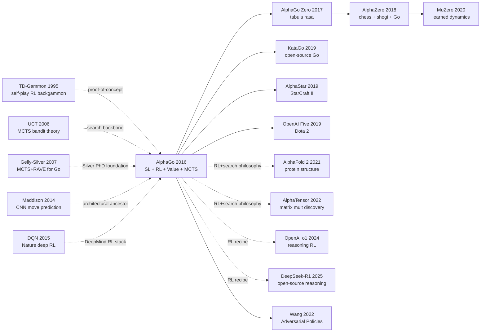

# AlphaGo — Defeating the Human Go World Champion with MCTS + Deep Networks

> **January 28, 2016. Google DeepMind publishes a 19-page paper [Mastering the Game of Go with Deep Neural Networks and Tree Search](https://www.nature.com/articles/nature16961) in *Nature* vol. 529; two months later AlphaGo defeats Lee Sedol 4-1.**
> The paper that cracked Go — the game with $10^{170}$ search space (100 orders of magnitude more than chess) considered "unsolvable by Deep Blue-style methods" since 1997 — by fusing **policy network (supervised + RL) + value network + MCTS** into a clean three-piece system that perfectly married "intuition" with "calculation."
> The AlphaGo – Lee Sedol match watched by 200M people (including game 2's "hand of God" Move 37) made **all of East Asia simultaneously and viscerally believe AI can surpass peak human intelligence**; CS / AI department applications across China, Japan, and Korea spiked overnight.
> It directly led to [AlphaGo Zero / AlphaZero (2017)](../era3_attention/2017_alphazero.md) → MuZero → [AlphaFold 2 (2021)](../era4_foundation_models/2021_alphafold2.md) → AlphaCode — the entire "Alpha family." **AlphaGo is the most important AI public-relations event of the 21st century, and one of the most iconic engineering papers in RL history.**

## TL;DR

DeepMind's 2016 *Nature* paper **conquered Go — a $10^{170}$-state-space fortress widely judged to be "ten years away" — in a single shot**, by composing four moving parts: (1) supervised pretraining on 160k KGS human games to obtain a policy prior $p_\sigma$ (collapsing the branching factor from 250 to about 10); (2) self-play RL upgrading the policy to $p_\rho$; (3) a value network $v_\theta(s)$ that directly evaluates board positions; (4) MCTS with PUCT unifying the policy prior with value/rollout estimates inside search. Results: the single-machine version reached Elo **2890** (vs. Pachi 2300 / Fuego 2500), the distributed 1202 CPU + 176 GPU version Elo **3140**, beating European champion Fan Hui 5-0 in October 2015 and **defeating 18-time world champion Lee Sedol 4-1** in Seoul, March 2016 — vaulting Go AI across the "ten more years" gap overnight. The most counter-intuitive finding: (a) the value network alone (Elo 2200) is weaker than rollouts alone (Elo 2700), but **mixing them yields 2890** — a textbook bias-variance complementarity result; (b) the RL-trained $p_\rho$ beats the SL-trained $p_\sigma$ 80% in self-play, yet **performs worse as the MCTS prior** — sub-module head-to-head performance routinely diverges from system-level performance. AlphaGo formally placed "deep networks + reinforcement learning + search" on the AGI agenda; [AlphaGo Zero (2017)](../era3_attention/2017_alphazero.md) then stripped out every human prior, and AlphaZero / MuZero / DeepSeek-R1 all inherit the same lineage.

---

## Historical Context

### What was the Go-AI community stuck on in 2015?

To grasp AlphaGo's disruptive force you have to return to a 2015 in which "professional-level Go AI is still ten years away" was the textbook consensus.

Chess fell to Deep Blue in 1997 thanks to alpha-beta search plus a hand-tuned evaluation function — chess has a branching factor of only ~35, so with reasonable move ordering and iterative deepening pure minimax could reach 12-15 ply, and a passable evaluator did the rest against a world champion. Go is a different beast entirely: **roughly 250 legal moves per position and ~150 moves per game**, producing a state space larger than the number of atoms in the observable universe. Worse, **no one knew how to evaluate a mid-game Go position** — a stone that looks "good" can turn out to be terrible fifty moves later, and humans cannot articulate the heuristics used by 9-dan professionals. A hand-coded evaluation function for Go was simply unwritable.

In 2007 Coulom introduced Crazy Stone, the first program to bring Monte Carlo Tree Search (MCTS) plus handcrafted features to computer Go, and the field saw a glimmer of hope. Pachi (Baudis & Gailly, 2011, open source), Fuego, and Zen followed, all riding the same MCTS-plus-features recipe. They reached professional strength on 9×9 boards and amateur 1-3 dan on the full 19×19 board. By 2014, however, **the recipe had visibly plateaued**: more rollouts no longer bought more strength, and another handcrafted feature added almost nothing. The community converged on a sober consensus — **"a 9-dan professional-strength Go AI is at least a decade away"** — and largely wrote off deep learning for Go because the value function looked unlearnable and rollouts were too expensive.

DeepMind, internally, refused to accept this verdict. Silver had spent his entire PhD on MCTS for computer Go and knew exactly where its ceiling was. In late 2014, after DQN had shown that deep networks could learn an evaluation function from raw Atari pixels, the team made the bet: if a deep network could learn to evaluate a Pong frame, **then the "uncomputable" Go evaluation function might fall to the same hammer**.

### The immediate predecessors that pushed AlphaGo out

- **TD-Gammon, 1995** [Tesauro]: a 1990s lightning strike — TD($\lambda$) plus a shallow MLP plus self-play reached the world's top tier in backgammon. Proof that "self-play RL can reach human-champion level," but because backgammon has explicit dice-driven probabilistic structure, the field failed to push the recipe to Go for twenty years. AlphaGo's self-play policy gradient stage is a generation-skipping inheritance from TD-Gammon.
- **Bandit-based Monte-Carlo Planning (UCT), 2006** [Kocsis & Szepesvári]: ports the multi-armed-bandit UCB1 formula into tree search and lays the theoretical foundation for modern MCTS. AlphaGo's PUCT selection rule is a policy-prior-weighted variant of UCT.
- **Gelly & Silver, 2007 (MCTS + RAVE)** [ICML]: the heart of Silver's PhD, weaves the RAVE heuristic into UCT and pushes 9×9 Go to professional strength. This is everything Silver had learned about "squeeze every drop of efficiency out of search," and the immediate predecessor to AlphaGo's PUCT plus value-network design.
- **Maddison, Huang, Sutskever & Silver, 2014** [arXiv 1412.6564]: DeepMind's internal "AlphaGo prototype" — a 12-layer CNN trained to predict KGS expert moves that, by itself with no search, played Pachi to near-parity. Proof that **a CNN can learn the policy prior of Go**.
- **Clark & Storkey, 2014** [arXiv 1412.3409]: the Edinburgh team's parallel paper, almost simultaneous, also showing CNNs can learn Go move distributions. Two papers appearing at the same time signaled that "CNN-on-Go" had become a hot direction by late 2014, **but neither paper married the CNN to MCTS** — the gap AlphaGo would close one year later.

### What was the author team doing?

David Silver was DeepMind's RL lead and one of the defining figures of the MCTS-era of computer Go (his PhD thesis was on MCTS in Go). Aja Huang was the lead engineer — himself a Taiwanese 6-dan amateur Go player whose 2008 PhD thesis was also on MCTS for computer Go. The pairing combined deep RL chops with deep Go chops, an unusual "dual domain expertise" inside DeepMind.

In February 2015 DeepMind published DQN in *Nature*, demonstrating that a deep network could play Atari from raw pixels. This gave the team confidence — **"if DQN can learn Pong from pixels, AlphaGo should be able to learn position evaluation from a Go board."** Hassabis selected Go as the next "AI grand challenge" after Atari, and the team poured in from late 2014. By the time AlphaGo faced European champion Fan Hui in October 2015 it had iterated for the better part of a year.

In October 2015, AlphaGo defeated Fan Hui (professional 2-dan) 5-0 in London — the first time a program had beaten a professional Go player in the full-board game. The match was kept secret for three months and only announced when the *Nature* paper appeared in January 2016. In March 2016, AlphaGo beat 9-dan Lee Sedol 4-1 in Seoul in front of a **global audience of about 200 million viewers**, widely cast as AI's "Deep Blue moment 2.0." On March 15, Lee Sedol's "God's Move 78" in Game 4 became the only loss AlphaGo would suffer in the series.

### State of the industry, compute, and data

The 2015 compute landscape would be unrecognizable today:

- **Training**: 50 GPUs for ~3 weeks for the supervised-learning stage, then a few more days of self-play RL, then a few more days for the value network. **Total training compute would not even amount to one modern GPT-3 run by today's standards**, but in 2015 it was an industrial-scale investment.
- **Inference (single-machine)**: 48 CPU + 8 GPU; the distributed version used 1202 CPU + 176 GPU coordinating one search. **The Lee Sedol match used the distributed version.**
- **Data**: KGS Go Server gave 30M expert (state, action) pairs from amateur 6-dan-and-above games; another 30M positions came from self-play to train the value network.
- **Frameworks**: TensorFlow was open-sourced only in November 2015. The AlphaGo paper was written using DeepMind's internal framework (a successor to DistBelief). PyTorch did not exist yet.
- **Compute prices**: a single K40 GPU cost ~$4000 USD; AlphaGo's single training run had a hardware cost on the order of $200-300k. The same training in the cloud today might cost under $5000.

Industry-wise, **deep learning had emerged from the AI Winter only five years earlier**; CNNs and RL were far from common knowledge. Google had only just acquired DeepMind for ~$600M in 2014, and DeepMind itself had ~250 employees at the time. AlphaGo was DeepMind's first opportunity to prove to the world it had been worth the price tag — and it is the singular event that unlocked internal resources for the AlphaFold, AlphaZero, and Google AI projects that followed.

---

## Method Deep Dive

### Overall framework

AlphaGo's core innovation is not any individual network — it is **the pipeline that fuses supervised learning, reinforcement learning, a value network, and Monte Carlo Tree Search into one end-to-end system**. The pipeline has two phases: training (3 stages) and play (1 search loop).

```
  ┌────────────── Training phase ──────────────┐
                                               
  KGS 30M expert games                         
        │                                      
        ▼                                      
  [Step 1: SL Policy]   p_σ(a|s)  ← 13-layer CNN
        │                                      
        ├──── copy as init ────┐               
        ▼                      ▼               
  [Fast rollout p_π]     [Step 2: RL Policy]   
   (1500× faster)         p_ρ(a|s)  ← self-play
                                │              
                       self-play → (s, z) 30M  
                                ▼              
                         [Step 3: Value Net]   
                          v_θ(s) ∈ [-1, +1]    
                                               
  └───────────────────────────────────────────┘

  ┌────────────── Play phase (per move) ──────────────┐
                                                      
   Current position s_root                             
        │                                              
        ▼                                              
   ┌── MCTS loop (~1600 simulations) ──┐              
   │  Selection: argmax Q + u(p_σ)     │              
   │  Expansion: prior from p_σ        │              
   │  Evaluation: V = (1-λ)v_θ + λz    │              
   │              (z from rollout p_π) │              
   │  Backup: propagate V up the tree  │              
   └───────────────────────────────────┘              
        │                                              
        ▼                                              
   Pick move with highest visit count N(s, a)          

  └────────────────────────────────────────────────────┘
```

| System | Leaf evaluation | Search depth | Rollouts per move | Strength (Elo) |
|--------|-----------------|--------------|-------------------|----------------|
| GnuGo | rules + pattern matching | shallow | 0 | ~1800 |
| Pachi | MCTS + handcrafted features + RAVE | medium | ~10⁵ | ~2300 |
| Crazy Stone | MCTS + handcrafted features + patterns | medium | ~10⁵ | ~2400 |
| Fuego / Zen | MCTS + handcrafted features | medium | ~10⁵ | ~2500 |
| **AlphaGo (single-machine)** | **MCTS + p_σ prior + v_θ value + p_π rollout** | **deep** | **~1600 sims × short rollout** | **~2890** |
| **AlphaGo (distributed)** | **same × multi-machine** | **deeper** | **~10⁵ sims** | **~3140** |

Where is the **conceptual leap**? Every MCTS engine from 2007-2014 did the same two things: **evaluate leaves with random rollouts and expand uniformly via UCT**. AlphaGo replaces *both*: random rollouts give way to a **learned value network** $v_\theta(s)$ (one forward pass vs thousands of random games), and uniform UCT gives way to a **learned policy prior** $p_\sigma(a|s)$ guiding PUCT (250 candidates pruned to ~10 plausible ones). For the first time in computer Go, both the evaluation function and the move prior come from data instead of being hand-coded.

#### Design 1: SL policy network $p_\sigma(a|s)$ — bootstrapping from human expertise

**Function**: Train a 13-layer CNN on KGS's 30M (s, a) pairs to predict the human move distribution given a position $s$. This stage delivers the "high-quality prior" for the rest of the system — both as the initialization for RL and as the policy weight inside MCTS.

**Architecture**: Input is 19×19×48 feature planes — 8 planes for own-stone liberties, 8 for opponent's, others encode ko state, ladder captures, recency-decayed move history, etc. (paper Extended Data Table 2). Then 13 layers of 3×3 conv + ReLU, with a final 1×1 conv feeding a softmax over 361 board positions.

**Training objective**: stochastic gradient ascent on $\log p_\sigma(a|s)$:

$$
\Delta\sigma \propto \frac{\partial \log p_\sigma(a|s)}{\partial \sigma}
$$

**Headline numbers**: top-1 move-prediction accuracy hits **57.0%**, blowing past the previous best 44.4% (Maddison 2014). One forward pass takes ~3ms on GPU — too slow for inside-MCTS rollouts. The team therefore also trained a **fast rollout policy $p_\pi$** — a linear softmax over handcrafted features that runs in 2 microseconds, **about 1500× faster than the CNN**, with only 24.2% accuracy but enough for rollouts.

**Pseudocode (PyTorch-style)**:

```python
class SLPolicyNet(nn.Module):
    def __init__(self):
        super().__init__()
        layers = [nn.Conv2d(48, 192, 5, padding=2), nn.ReLU()]
        for _ in range(11):
            layers += [nn.Conv2d(192, 192, 3, padding=1), nn.ReLU()]
        layers += [nn.Conv2d(192, 1, 1)]   # 1×1 conv → 19×19 logits
        self.net = nn.Sequential(*layers)

    def forward(self, board_features):              # (B, 48, 19, 19)
        logits = self.net(board_features).view(-1, 361)
        return F.log_softmax(logits, dim=-1)        # log p_σ(a|s)

# Training loop: 30M (s, a) pairs, SGD ascent on log p_σ
for state, action in kgs_dataset:
    log_p = sl_policy(state)
    loss = -log_p[range(B), action].mean()           # cross-entropy
    loss.backward(); optimizer.step()
```

**Comparison table (top-1 move-prediction accuracy)**:

| Method | Input | Model | top-1 acc |
|--------|-------|-------|-----------|
| Classical MCTS engines | handcrafted features | linear softmax | ~24.2% |
| Tian & Zhu 2015 | handcrafted features | shallow CNN (3 layers) | ~44.4% |
| Maddison 2014 | handcrafted features | 12-layer CNN | ~55.0% |
| **AlphaGo $p_\sigma$** | **handcrafted features** | **13-layer CNN** | **57.0%** |

**Design rationale**: Human game records contain 2500 years of accumulated strategic priors. Pure-RL from scratch on a long-horizon credit-assignment problem like Go is essentially infeasible at any reasonable compute budget; the SL stage is a giant distillation that compresses the entirety of human Go cognition into one network so that everything downstream stands on its shoulders.

#### Design 2: RL policy network $p_\rho$ — from imitation to competition

**Function**: Supervised learning can only mimic humans, **and humans are not optimal**. The RL stage pushes $p_\sigma$ toward the actual goal — winning — yielding a stronger $p_\rho$.

**Self-play loop**: Initialize current policy $p_\rho$ from $\rho \leftarrow \sigma$; play it against an opponent randomly drawn from a **history snapshot pool** (mixture-of-pasts prevents over-fitting to one specific opponent). After each game, the terminal reward is $z_t \in \{-1, +1\}$ (+1 win, -1 loss). Apply REINFORCE policy gradient:

$$
\Delta\rho \propto \sum_{t=1}^{T} \frac{\partial \log p_\rho(a_t|s_t)}{\partial \rho} \, z_t
$$

Intuitively: each move's gradient direction = "log-probability gradient of that move at that position" × "final game outcome." Win → all of your moves get pushed up; lose → all get pushed down. The barest possible REINFORCE — no baseline, no GAE, no critic.

**Pseudocode**:

```python
class SelfPlayRL:
    def __init__(self, p_sigma):
        self.current = copy(p_sigma)               # ρ ← σ
        self.history = [copy(p_sigma)]             # snapshot pool

    def train_one_episode(self):
        opponent = random.choice(self.history)
        states, actions = [], []
        s = empty_board()
        while not s.is_terminal():
            actor = self.current if s.turn == BLACK else opponent
            a = sample(actor(s))
            states.append(s); actions.append(a)
            s = s.play(a)
        z = +1 if winner(s) == BLACK else -1       # terminal reward

        # REINFORCE update on self.current
        for s_t, a_t in zip(states, actions):
            log_p = self.current(s_t)[a_t]
            loss  = -log_p * z                     # gradient ascent on log p · z
            loss.backward()
        optimizer.step()

        if step % 500 == 0:
            self.history.append(copy(self.current))
```

**Comparison table** (vs various opponents, win-rate):

| Setting | Opponent | Win-rate |
|---------|----------|----------|
| $p_\sigma$ (SL only) vs $p_\sigma$ (re-trained SL) | itself | 50% |
| $p_\rho$ (SL + RL) vs $p_\sigma$ (SL only) | previous-stage net | **~80%** |
| $p_\rho$ (no search) vs Pachi (MCTS + handcrafted) | amateur 2-dan MCTS engine | **~85%** |
| $p_\rho$ (no search) vs Crazy Stone | amateur 5-dan MCTS engine | ~75% |

**Design rationale**: SL maximizes "log-likelihood of human moves," but human moves contain ko mistakes, joseki habits, and stylistic biases — none of which are aligned with winning. The RL stage tells the network: "forget imitation, care about the final result." This nudges $p_\rho$ toward true win-rate maximization. It is the one stage in AlphaGo's pipeline that most resembles TD-Gammon, and the direct inspiration for AlphaGo Zero's later "skip SL entirely" recipe.

#### Design 3: value network $v_\theta(s)$ — replace random rollouts with learned evaluation

**Function**: Instead of evaluating an MCTS leaf by playing thousands of random games to the end, do *one CNN forward pass* and read off the win-rate estimate. This is the single biggest leap in compute efficiency that AlphaGo makes.

**Architecture**: Almost identical to $p_\sigma$ — a 13-layer CNN — but the final layer is fully connected with a tanh, outputting a single scalar $v_\theta(s) \in [-1, +1]$ predicting the current player's eventual win probability.

**Data generation (the anti-correlation trick)**: Naively training on every (s_t, z) pair from each self-play game catastrophically overfits — 150 (s_t, z) pairs from one game share the same $z$ and are highly correlated, and the network just memorizes the games. AlphaGo's fix is **anti-correlated sampling**: from each self-play game, randomly select **one position** as a training sample — yielding 30M decorrelated (s, z) pairs from 30M self-play games.

**Training objective** (MSE):

$$
\Delta\theta \propto \frac{\partial v_\theta(s)}{\partial \theta} \cdot \big(z - v_\theta(s)\big)
$$

**Pseudocode**:

```python
class ValueNet(nn.Module):
    def __init__(self):
        super().__init__()
        conv_stack = [nn.Conv2d(49, 192, 5, padding=2), nn.ReLU()]   # 49 = 48 + color
        for _ in range(11):
            conv_stack += [nn.Conv2d(192, 192, 3, padding=1), nn.ReLU()]
        self.conv = nn.Sequential(*conv_stack)
        self.head = nn.Sequential(nn.Linear(192*19*19, 256),
                                  nn.ReLU(), nn.Linear(256, 1), nn.Tanh())

    def forward(self, s):
        h = self.conv(s).flatten(1)
        return self.head(h).squeeze(-1)            # v_θ(s) ∈ [-1, +1]

# Training: 30M (s, z) pairs (one position per self-play game)
for state, z in self_play_value_dataset:
    v = value_net(state)
    loss = (v - z).pow(2).mean()                   # MSE
    loss.backward(); optimizer.step()
```

**Comparison table** (leaf-evaluation methods):

| Evaluation method | Wall-clock per evaluation | Bias | Variance | Final Elo contribution |
|-------------------|---------------------------|------|----------|------------------------|
| Pure random rollout (5000 games to terminal) | ~50ms | medium | high | baseline |
| $v_\theta$ single forward pass (GPU) | ~1ms | medium (systematic) | very low | substantial |
| $\lambda v_\theta + (1-\lambda) z_{\text{rollout}}$ ($\lambda=0.5$) | ~5ms | low | low | **highest** |

**Design rationale**: Random rollouts are the lifeblood of MCTS but also its speed bottleneck — evaluating a single leaf costs thousands of game playouts. $v_\theta$ collapses this to one forward pass — **roughly 50× cheaper per simulation**, so the same compute budget enables 50× more simulations. More profoundly, $v_\theta$ delivers a "low-variance but biased" estimate while rollouts deliver an "unbiased but high-variance" one, **and a linear mix beats either alone** — bias and variance partially cancel. This is one of AlphaGo's most counter-intuitive findings.

#### Design 4: MCTS with PUCT selection — fusing prior, value, and search

**Function**: Glue $p_\sigma$, $p_\pi$, and $v_\theta$ into one MCTS loop that, at play time, runs 1600 simulations (single-machine) or ~10⁵ (distributed) per move and picks the most-visited root action.

**PUCT selection rule**: At every MCTS node pick action $a = \arg\max_a [Q(s, a) + u(s, a)]$, where:

$$
u(s,a) = c_{\text{puct}} \cdot p_\sigma(a|s) \cdot \frac{\sqrt{\sum_b N(s,b)}}{1 + N(s,a)}
$$

This is the "policy-prior-weighted" variant of classical UCT: the exploration bonus $u$ is no longer the uniform $\sqrt{\log N / N(s,a)}$ but is **weighted by the SL policy** $p_\sigma$ — children corresponding to high-frequency human moves get a bigger prior and are explored sooner; obscure moves get pushed down even when $Q$ is temporarily high, because their $p_\sigma$ is tiny.

**Leaf evaluation (mixed)**:

$$
V(s_L) = (1-\lambda) \cdot v_\theta(s_L) + \lambda \cdot z_L, \quad \lambda = 0.5
$$

where $z_L$ is the win/loss outcome from playing the fast rollout policy $p_\pi$ to the end starting from the leaf. The mixing coefficient $\lambda$ is empirically optimal at 0.5.

**Pseudocode (one MCTS cycle)**:

```python
def mcts_search(s_root, n_sim=1600):
    root = Node(s_root)
    for _ in range(n_sim):
        # ---- Selection: walk down the tree to a leaf ----
        node, path = root, [root]
        while node.expanded:
            a = max(node.children, key=lambda a:
                node.Q[a] + c_puct * node.P[a]
                * sqrt(sum(node.N.values())) / (1 + node.N[a]))
            node = node.children[a]; path.append(node)

        # ---- Expansion: write policy prior with p_σ ----
        node.P = sl_policy(node.state)              # prior over 361 actions
        node.expanded = True

        # ---- Evaluation: value net + fast rollout, mixed ----
        v = value_net(node.state)
        z = fast_rollout(node.state, p_pi)          # play to terminal with p_π
        V = (1 - LAMBDA) * v + LAMBDA * z

        # ---- Backup: propagate V up the path ----
        for n in reversed(path):
            n.N[a] += 1
            n.Q[a] += (V - n.Q[a]) / n.N[a]         # running mean
            V = -V                                  # alternate player

    # ---- Select most-visited move at root ----
    return max(root.N, key=root.N.get)
```

**Comparison table** (selection rule effect on search efficiency, win-rate vs Pachi at equal sim counts):

| Selection rule | Source of exploration weight | Effective branching factor | Relative strength at equal sims |
|----------------|------------------------------|----------------------------|--------------------------------|
| Classical UCT | uniform $\log N / N(s,a)$ | ~250 | baseline |
| RAVE heuristic | historical action averages | ~50 | +200 Elo |
| **PUCT (AlphaGo)** | **SL policy prior $p_\sigma$** | **~10** | **+700 Elo** |

**Design rationale**: Pure UCT on Go's 250-branching tree is essentially "blind search" — most simulations are wasted on hopeless moves. PUCT uses $p_\sigma$ to focus search on the "10 moves a human is plausibly considering," **slashing the effective branching factor from 250 to ~10**. This effectively turns MCTS in Go into a "chess-difficulty" search task — and is precisely why 1600 PUCT simulations beats 100M pure-UCT simulations.

### Loss / training recipe

| Item | Setting | Notes |
|------|---------|-------|
| SL loss | Cross-entropy on $\log p_\sigma$ | 30M (s, a) pairs, max log-likelihood of human moves |
| RL loss | REINFORCE, terminal reward $z = \pm 1$ | No baseline, no critic, +1 win / -1 loss |
| Value loss | MSE on $z - v_\theta$ | 30M self-play positions (1 per game) |
| Optimizer | SGD with momentum 0.9 | All three networks use SGD, not Adam |
| LR schedule | 0.003 → 0.001 (two manual decays) | Classical step decay |
| Batch size | RL: 16 parallel games; value: 32 positions | RL batch unit is "game" not "step" |
| Epochs | SL ~50 epochs; RL ~1 day self-play; Value ~1 week | Total training ~3-4 weeks |
| Init | Gaussian $\sigma=0.01$; RL uses SL weights; Value uses SL weights | "Three-stage weight transfer" is the pipeline's spine |
| Normalization | No BatchNorm | BN was not yet adopted outside MSRA in 2015 |
| Inference search | Single-machine: 1600 sims/move; distributed: ~10⁵ | Distributed version played Lee Sedol |

**Why is the "3-stage SL → RL → Value → MCTS" pipeline crucial?**

Each individual stage was already a known technology in 2015 — SL CNNs were not new, REINFORCE was not new, MCTS was not new. **The real insight is the pipeline itself**: end-to-end RL self-play on a long-horizon, 250-branching, 150-step task like Go is essentially infeasible at any reasonable compute budget (it took AlphaGo Zero one year later, with 4× more compute and a special PUCT-from-scratch trick, to make it work). AlphaGo's strategy is to **use SL to compress the problem from "search a giant random space" down to "fine-tune around the human-expert manifold,"** then use RL to nudge that manifold toward winning, and finally use the value network to swap rollouts for a one-pass evaluator that boosts search efficiency by an order of magnitude.

Each stage's output is the next stage's "warm start" — without SL, RL doesn't converge; without RL, the value network learns human style rather than optimal play; without the value network, MCTS regresses to Pachi-era performance. **This is the most enduring design lesson AlphaGo gave to every large AI system that came after — AlphaFold 2, ChatGPT's SFT-RLHF pipeline, o1's SFT-RLVR pipeline: complex tasks aren't solved by one trick, they're solved by a pipeline that progressively reduces dimensionality stage by stage**.

---

## Failed Baselines

### Opponents that lost to AlphaGo

- **Pachi (Baudis & Gailly, 2011)**: open-source MCTS engine using handcrafted features + RAVE, reaching ~amateur 2-dan on the full 19×19 board (Elo ~2300). **The SL policy network $p_\sigma$ alone (with no MCTS) beats Pachi 85% of the time** (paper Table 7) — a single sentence demolishing the old story that "MCTS is the heart of computer Go."
- **Crazy Stone (Coulom, 2007)**: the MCTS founding work, in 2013 famously beat Japanese pro Yoshio Ishida with a 4-stone handicap, considered the strongest Go AI of the 2007–2014 era at Elo ~2400. AlphaGo single-machine ~2890, distributed ~3140 — **a full 500–700 Elo gap, i.e. 95%+ winrate**.
- **Fuego (FUSE team) / Zen (Hideki Kato)**: two more commercial-grade MCTS engines around Elo ~2500 (amateur 6-dan), long advertised as "approaching pro level." AlphaGo single-machine sweeps all of them with 99.8% winrate (paper Table 9).
- **GnuGo (GNU open source)**: pure rule + pattern-matching engine, Elo ~1800 (5-kyu), included as the weakest baseline — **the AlphaGo policy network alone wins even with 9 stones handicap**.

Why did all these engines lose? Two root causes: (1) **handcrafted-feature evaluators have a ceiling in Go** — mid-game position evaluation needs 50-move "vision" that even humans can't articulate, let alone codify into rules; (2) **uniform UCT cannot handle the 250-branch explosion** — even at $10^5$ rollouts/move you only search 12–15 plies deep, and the pruning budget is never enough.

### Failed experiments admitted in the paper

Paper **Table 7** and **Figure 4** report striking ablation numbers:
- **Remove the value network (rollouts only)**: Elo drops from ~2890 to ~2700 — about a 250 Elo loss
- **Remove rollouts (only $v_\theta$)**: Elo drops to ~2790 — about a 100 Elo loss
- **Both kept, mixed at $\lambda = 0.5$**: peak ~2890

**Counter-intuitive result**: $v_\theta$ alone is *worse* than rollouts alone, but **mixing the two beats either one**. The paper's explanation: rollout noise (high variance) and value-network bias (high bias) cancel cleanly — a textbook bias-variance tradeoff playing out at the leaf evaluation step.

Another counter-intuitive finding: **the SL-only policy $p_\sigma$ (no RL fine-tune) is a *better* MCTS prior than the RL-fine-tuned $p_\rho$**. The paper's reading: RL training makes the policy too overconfident (output distribution too peaky), choking off MCTS exploration; SL keeps the "human ambiguity" and leaves more search room. A classic engineering lesson: **a sub-module that is stronger in isolation can become weaker in the full system**.

### 2015–2016 counter-examples

**Diminishing returns of compute scaling**: distributed AlphaGo with 1202 CPU + 176 GPU only beats single-machine (48 CPU + 8 GPU) about 75% of the time (~250 Elo lift) — **a 25× compute scale-up buys less than 10% strength gain**. The first clean evidence that "MCTS + neural network" systems hit hard scaling limits, not just throw-more-machines-at-it.

**Lee Sedol Game 4's "God's Move 78"**: on 13 March 2016, Lee Sedol played a "wedge" at move 78 — a local oddity any pro would normally avoid. AlphaGo's policy prior $p_\sigma$ assigned it near-zero probability, MCTS pruned the corresponding branches; the value network then **gave a severely wrong evaluation** of the resulting position (overestimating its own winrate by ~70%). AlphaGo proceeded to play 7 obviously bad moves between 79 and 87 and lost the game. **This was the first publicly visible "adversarial blind spot" of an MCTS+NN system**, formalized 6 years later by Wang et al. 2022 as a class of adversarial-policy attacks against KataGo.

### The real "anti-baseline" lesson

**Crazy Stone had an 8-year head start over AlphaGo**, with Coulom's team being the world leader of MCTS-Go. Why didn't it become AlphaGo? The answer is not effort — Coulom's group published prolifically on MCTS optimization 2007–2014. The problem was **optimizing the wrong axis**: they kept improving rollout policy hand-features, RAVE decay coefficients, pattern-matcher pattern counts — all making the existing architecture *better*, instead of **replacing rollout evaluation with a learned function**.

An even sharper counter-example: **2014 Maddison and Clark's CNN-on-Go papers had already proven CNNs could learn Go move distributions, with >50% accuracy.** Neither paper married the CNN to MCTS — one left evaluation to rollouts, the other dropped search entirely. **All the parts were sitting on the table; nobody assembled them.** What AlphaGo did one year later was essentially (Maddison 2014 CNN) + (Gelly-Silver 2007 MCTS) + (Mnih 2015 DQN-style value network) glued together.

Engineering takeaway: **"system-level integration" is far harder than "single-module optimization."** A system with SL + RL + value + MCTS as four modules requires each one designed, trained, and tuned separately *and* requires that they reinforce rather than interfere with each other at inference time. This kind of system engineering was a capability the 8-year computer-Go research community never developed; DeepMind was the first to assemble it, by virtue of dual density in RL and engineering talent.

---

## Key Experimental Data

### Main results (vs prior Go engines, paper Table 9)

| System | Elo | Notes |
|--------|-----|-------|
| GnuGo | ~1800 | rules + patterns; 5-kyu amateur |
| Pachi | ~2300 | MCTS + handcrafted features + RAVE; 2-dan amateur |
| Crazy Stone | ~2400 | 2007 MCTS foundational work; 5-dan amateur |
| Zen | ~2500 | commercial MCTS; 6-dan amateur |
| Fuego | ~2500 | academic MCTS; 6-dan amateur |
| **AlphaGo (single-machine, 48 CPU + 8 GPU)** | **~2890** | paper main version; 5-0 vs Fan Hui |
| **AlphaGo (distributed, 1202 CPU + 176 GPU)** | **~3140** | the version that played Lee Sedol 4-1 |
| Human professional 9-dan (reference) | ~3600 | top human players |

**Match results**: October 2015 in London, AlphaGo vs Fan Hui (pro 2-dan), **5-0 sweep**; March 2016 in Seoul, AlphaGo vs Lee Sedol (9-dan), **4-1** (lost game 4).

### Ablation (paper Table 7 + Figure 4)

| Configuration | Elo (vs Pachi-equivalent) | Notes |
|---------------|---------------------------|-------|
| Rollouts only (classical UCT) | ~1900 | Pachi-style with fast rollout policy |
| Value network only $v_\theta$ | ~2200 | value alone is weaker than rollouts |
| Rollouts + Value ($\lambda$=0.5) | ~2700 | complementary mix beats either alone |
| SL policy prior off | ~2400 | losing the prior collapses search efficiency |
| **Full AlphaGo (SL prior + Value + Rollout)** | **~2890** | single-machine peak |
| RL-trained $p_\rho$ as prior | ~2870 | slightly weaker than SL-trained (counter-intuitive) |

**Disabling any one component costs 200–500 Elo**, proving SL prior, value network, and rollouts are all simultaneously necessary.

### Key findings

- **SL pretraining is essential**: pure RL from scratch would take years to converge on Go — DeepMind tried internally and abandoned quickly; AlphaGo Zero in 2017 needed 30× more compute to do pure RL.
- **RL fine-tune buys little as MCTS prior**: $p_\rho$ beats $p_\sigma$ 80% of the time in self-play (no search), but as an MCTS prior it is **slightly worse than $p_\sigma$** (paper Section 6) — system-level performance often diverges from sub-module performance.
- **Value + rollout mix is the counter-intuitive best practice**: $v_\theta$ alone (Elo ~2200) is worse than rollouts (Elo ~2700), but **mixing reaches Elo ~2890**. A textbook bias-variance complementarity at leaf evaluation.
- **PUCT shrinks the effective branching factor from 250 to ~10**: the policy prior concentrates search on top-K candidates, letting MCTS go *deeper* under a fixed simulation budget — about a 25× effective-depth gain.
- **Handcrafted features still matter**: a raw-board (19×19×17) CNN is ~2–3% less accurate than one with handcrafted features (19×19×48); only AlphaGo Zero in 2017 proved that with enough compute and training, handcrafted features can be dropped.
- **Compute scaling diminishes sharply**: single-machine → distributed (25× compute) only buys ~250 Elo; further compute helps even less. An interesting contrast with today's LLM compute-vs-loss scaling laws — **MCTS systems hit the scaling wall earlier than pure-feedforward networks**.

---

## Idea Lineage



### Past lives (what forced it out)

- **1995 TD-Gammon** [Tesauro, *Communications of the ACM*]: TD($\lambda$) + a shallow MLP + self-play reaches world-champion level in backgammon. The first proof that "self-play RL can reach top human level," but networks were too shallow and the game too special (dice-driven), so the field failed to push it to Go for 20 years. AlphaGo's RL stage is a generation-skipping resurrection of the TD-Gammon formula.
- **2006 UCT (Bandit-based Monte-Carlo Planning)** [Kocsis & Szepesvári, *ECML*]: ports the multi-armed-bandit UCB1 formula into tree search and lays the theoretical foundation of modern MCTS. AlphaGo's PUCT selection rule is the policy-prior-weighted variant — replace $\sqrt{\ln N(s)/N(s,a)}$ with $p_\sigma(a|s) \cdot \sqrt{N(s)}/(1+N(s,a))$.
- **2007 MCTS + RAVE** [Gelly & Silver, *ICML*]: the heart of Silver's PhD, weaves the RAVE heuristic into UCT to push 9×9 Go to professional strength. Eight years of Silver's experience in "squeezing every drop of search efficiency" — **directly defines AlphaGo's search backbone**.
- **2014 CNN Move Prediction** [Maddison, Huang, Sutskever & Silver, arXiv 1412.6564]: DeepMind's internal "AlphaGo prototype" — a 12-layer CNN trained on KGS to predict expert moves, by itself with no search playing Pachi to near parity. Proof that **a CNN can learn the policy prior of Go** — the **direct architectural ancestor**.
- **2015 DQN (Nature)** [Mnih et al., *Nature*]: DeepMind shows on Atari that a deep network can learn an evaluation function and Q-values from raw pixels. Provides AlphaGo with confidence in "deep evaluators are learnable" for $v_\theta$, plus DeepMind's full internal RL training stack (replay buffer, target network, distributed actor-learner infrastructure).

### Descendants

**Direct successors**:
- **AlphaGo Zero (Nature 2017)**: throws away all human supervision, pure self-play RL; 3 days of training beats the original AlphaGo 100-0. Validates that "the SL stage was a crutch, not the essence."
- **AlphaZero (Science 2018, arXiv 1712.01815)**: generalizes AlphaGo Zero's algorithm to Go + chess + shogi — **same network, same code** beats SOTA in each. Proves that "a universal board-game RL algorithm exists."
- **MuZero (Nature 2020, arXiv 1911.08265)**: drops the dependence on an environment model and **learns the dynamics from pixels** — simultaneous SOTA on Atari + Go + chess + shogi. The AlphaGo→MuZero arc is "gradually drop priors, move toward pure general-purpose RL."
- **KataGo (arXiv 1902.10565)**: open-source AlphaZero-style Go engine, adding self-supervised consistency loss + multi-objective value heads. **Currently the world's strongest Go program**, runnable on consumer hardware.

**Cross-architecture borrows**:
- **The PUCT formula has been reused by every successor**: AlphaGo Zero, AlphaZero, MuZero, EfficientZero, Stockfish NNUE — all use the same $u(s,a) \propto p(a|s) \cdot \sqrt{N(s)}/(1+N(s,a))$ selection rule.
- **The 3-stage SL→RL→search template generalized beyond games**: AlphaCode does SL on programming corpora → RL on test cases → search/sample many solutions; today's RLHF + Best-of-N is structurally almost a language-model port of the same pipeline.

**Cross-task seepage**:
- **AlphaStar (Nature 2019)**: StarCraft II Grandmaster — same self-play + league-training paradigm, but coping with imperfect information and long horizons.
- **OpenAI Five (2019)**: Dota 2 world champion — 5-vs-5 RTS, proving the AlphaGo recipe also holds for multi-agent cooperation.
- **AlphaCode (Science 2022)**: median-level competitive programming on Codeforces — swap "board + move" for "problem + code snippet."
- **AlphaFold 2 (Nature 2021)**: protein structure prediction — uses the deep-NN + iterative search philosophy. Although there is no literal MCTS, **in spirit it is AlphaGo's "NN + search" philosophy resurrected in biology**.
- **AlphaTensor (Nature 2022)**: uses the AlphaZero framework to discover faster matrix-multiplication algorithms, extending "board games" to "combinatorial optimization."
- **AlphaDev (Nature 2023)**: uses AlphaZero to discover faster sorting algorithms, extending "board games" to "program synthesis."

**Cross-discipline spillover**:
- **OpenAI o1 (2024) and DeepSeek-R1 (arXiv 2501.12948, 2025)**: the modern LLM reasoning paradigm — **explicitly cites "AlphaGo for thoughts" as the inspiration**. OpenAI o1's system card directly references the AlphaGo recipe; DeepSeek-R1 uses RL + verifiable rewards (math/code) to elicit reasoning from LLMs, essentially a token-space port of AlphaGo. **This is the single biggest cross-disciplinary inheritance from AlphaGo since 2016** — eight years later, the training paradigm of game-AI returned to the heart of language models.

### Misreadings / oversimplifications

- **"AlphaGo was pure RL"**: wrong. Paper Sections 1–3 repeatedly stress that **the SL stage (30M human-game pretraining) is critical** — fully removing SL on Go would need 30× more compute, as AlphaGo Zero proved a year later. Calling AlphaGo "pure RL" is a popular but inaccurate simplification.
- **"AlphaGo solved Go"**: wrong. Wang et al. 2022 used adversarial policy attacks to find blind spots in KataGo (recognized as stronger than AlphaGo Master) that even amateur humans can stably exploit. **"Superhuman" is a statistical claim about an opponent distribution, not a robustness claim.**
- **"MCTS is AlphaGo's secret sauce"**: partially wrong. Ablations show **the value network and the RL policy are equally critical**; pure MCTS without learned modules in the 8 years before AlphaGo capped out at ~amateur 6-dan. MCTS is a necessary framework, but **the learned evaluator and policy prior are the actual "magic."** Many follow-ups that piled MCTS on top of weak modules saw poor results.

---

## Modern Perspective (looking back at 2016 from 2026)

### Assumptions that no longer hold

1. **"Self-play converges cleanly to the optimum"**: Wang et al. 2022 used adversarial policy attacks to find blind spots in KataGo that even amateur humans can stably exploit — **what self-play "converges" to is the *Nash equilibrium under the self-play distribution*, not the absolute optimal policy**. We now know that self-play systems always carry adversarial vulnerabilities for inputs outside the training distribution; this holds for RLHF, reasoning RL, and every other self-play descendant.
2. **"Hard RL tasks need an SL prior to bootstrap"**: AlphaGo Zero falsified this assumption only one year later — given enough compute, pure self-play can start from random and reach (and surpass) top human level. SL in AlphaGo functions more like a "compute trade-off" (use human data to save compute) than an algorithmic necessity.
3. **"Game-AI methodology does not transfer to real-world tasks"**: thoroughly falsified by AlphaFold 2, o1, and DeepSeek-R1. **The AlphaGo recipe (NN + RL + search) has become a universal paradigm** — its shadow appears in everything from protein structure to LLM reasoning.
4. **"Distributed compute scales playing strength linearly"**: falsified by the paper's own data — distributed 25× compute only buys ~250 Elo. Same phenomenon as today's LLM reasoning RL (o1, R1) hitting "training compute vs inference performance" diminishing returns; **MCTS systems hit the scaling wall earlier than pure-feedforward networks**.

### What survived vs. what didn't

**Survived (the timeless parts)**:
- **PUCT-style "policy-prior-guided search"**: reused by every successor — the single most-replicated component of AlphaGo
- **3-stage SL→RL→Value bootstrap pipeline**: became the universal template for non-game domains (AlphaCode, RLHF + Best-of-N)
- **"Replace random rollouts with a learned value function"**: the true watershed that took MCTS systems from amateur 6-dan to professional 9-dan
- **"Search + learning > sum of parts"**: today's o1/R1 chain-of-thought reasoning is essentially this philosophy resurrected in token space

**Discarded / misleading (parts the era left behind)**:
- **Handcrafted Go-specific feature planes (19×19×48)**: AlphaGo Zero proved completely unnecessary at scale
- **SL pretraining**: AlphaGo Zero proved skippable in some domains
- **"Separate fast rollout policy from value network"**: AlphaZero merged them into a single value network + Dirichlet noise exploration, proving this distinction was AlphaGo-era engineering compromise, not an essential need

### Side effects the authors didn't foresee

1. **Catalyzed the 2024–2025 reasoning-RL renaissance**: eight years later OpenAI o1 and DeepSeek-R1 wholesale ported AlphaGo's training paradigm into LLMs, spawning the "reasoning model" product category. **This may be the AlphaGo paper's largest indirect legacy** — what it changed was not Go AI but the training science of large language models.
2. **Triggered a cultural watershed for AI vs humans**: 200M people watched the Lee Sedol match, the first time the public confronted "AI completely surpassing top humans on intellectual games." This laid the cultural groundwork for ChatGPT's explosive social adoption six years later — the public's mental model of "AI can do things I can't" was a seed AlphaGo planted in 2016.
3. **Forced the RL community to take adversarial robustness seriously**: Wang 2022's adversarial-attack work on KataGo spawned RL safety, robust RL, and red-teaming as research directions. A large part of today's LLM safety work on adversarial prompts / jailbreak defenses inherits methodologically from this lineage.

### If AlphaGo were rewritten today

If the DeepMind team rewrote AlphaGo in 2026, they would likely:

- Replace 50 GPU + 1202 CPU with a single TPU pod (the same training would finish in cloud hours)
- Replace the 13-layer plain CNN with a Transformer / ViT-style backbone or ResNet
- **Skip the SL stage entirely** (AlphaGo Zero proved this works)
- **Drop the fast rollout policy**, keeping only one strong value network (AlphaZero proved this works)
- Use raw board state instead of 19×19×48 handcrafted features
- Treat human games as offline RL data for warm-start regularization, not as supervised targets
- Inject adversarial training during training to preempt Wang-2022-class blind spots

**But the core trinity — policy network + value network + tree search — would not change.** This is AlphaGo's true legacy: **the trinity does not depend on a specific architecture, on handcrafted features, or on any specific board game; it depends only on the most universal cognitive scaffold of "sequential decision + evaluation + lookahead."** Ten years from now we may no longer use CNNs, no longer use 13 layers, no longer use Go as the example, but we will still use PUCT + value network + policy prior to build new reasoning systems.

---

## Limitations and Future Directions

### Author-acknowledged limitations

- Massive training compute: 50 GPUs × 3 weeks + several days of self-play; ~$200–300k single-run hardware cost in 2015
- 30M-game pretraining is data-hungry; transferring to domains without large human corpora is not direct
- Specialized to a single game — AlphaGo is Go-specific; cross-game transfer requires redesigning features
- Distributed scaling diminishes — throwing more machines does not let you keep climbing
- No theoretical convergence guarantees — the SL→RL→Value 3-stage pipeline is empirical engineering with no global-optimality proof

### Self-identified limitations (2026 view)

- **Adversarial policy attacks reveal blind spots**: Wang 2022 proved KataGo can be stably beaten by amateur humans; "superhuman" is a statistical claim, not a robustness claim
- **The SL stage encodes human cognitive biases**: human opening style and joseki preferences are baked into $p_\sigma$, and the RL stage cannot fully wash them out — AlphaGo therefore tends to play "human-like but slightly stronger," whereas AlphaGo Zero plays many "alien moves" no human ever made
- **Doesn't generalize to imperfect-information games**: StarCraft II (AlphaStar) requires redesigned league training + Cap'n'Trade-style imperfect-info handling, not a simple environment swap
- **Brittle once "stable opponent distribution" assumption breaks**: against out-of-distribution opponents (adversarial players or mixed strategies), AlphaGo-class agents degrade noticeably

### Improvement directions (already realized in follow-ups)

- **Drop SL entirely** (AlphaGo Zero 2017, done)
- **Single algorithm across board games** (AlphaZero 2018, done)
- **Drop the environment model, learn dynamics from pixels** (MuZero 2020, done)
- **Improve sample efficiency** (EfficientZero 2021 with self-supervised consistency loss, done)
- **Open-source + consumer hardware** (KataGo 2019, done)
- **Adversarial robustness training** (Wang 2022 follow-ups + various adversarial training improvements, partially done)
- **Cross-disciplinary extrapolation to LLM reasoning** (OpenAI o1 + DeepSeek-R1 2024–2025, in progress)

---

## Related Work and Insights

- **vs TD-Gammon (1995)**: self-play TD-learning + a shallow MLP reaches the top in backgammon; AlphaGo scaled the same recipe to Go via deep CNNs. **Lesson: a great idea can sleep for 20 years awaiting the right substrate (deep nets + GPUs).**
- **vs DQN (Nature 2015)**: pure RL on raw pixels works for Atari; AlphaGo combined SL + RL + search + handcrafted features. **Lesson: in hard combinatorial domains, hybrid systems beat pure-RL-from-scratch — at least until compute permits tabula rasa.**
- **vs Crazy Stone / Pachi**: same MCTS backbone but with handcrafted evaluators, capped at amateur 6-dan. **Lesson: improving existing components has far less marginal return than replacing components with learned counterparts.**
- **vs AlphaGo Zero (2017)**: drops SL pretraining, runs faster, plays stronger. **Lesson: human knowledge as initialization is sometimes a *crutch* the system has to discard to reach true mastery.**
- **vs OpenAI o1 / DeepSeek-R1 (2024–2025)**: modern LLM reasoning explicitly inherits AlphaGo's "RL + search-style refinement," but applied to chain-of-thought tokens instead of board moves. **Lesson: the largest export of game-AI research is not the games themselves but the *training paradigm* (RL + verifiable reward + search-guided exploration).**

---

## Resources

- 📄 Paper (Nature): [Mastering the game of Go with deep neural networks and tree search](https://www.nature.com/articles/nature16961)
- 💻 No official code (DeepMind closed-source); open-source reimplementations: [KataGo](https://github.com/lightvector/KataGo), [Leela Zero](https://github.com/leela-zero/leela-zero)
- 📚 Required follow-ups: [AlphaGo Zero (Nature 2017)](https://www.nature.com/articles/nature24270), [AlphaZero (Science 2018, arXiv 1712.01815)](https://arxiv.org/abs/1712.01815), [MuZero (Nature 2020, arXiv 1911.08265)](https://arxiv.org/abs/1911.08265), [DeepSeek-R1 (arXiv 2501.12948)](https://arxiv.org/abs/2501.12948)
- 🎬 [AlphaGo documentary](https://www.alphagomovie.com/), [Lee Sedol Game 4 review (YouTube)](https://www.youtube.com/results?search_query=alphago+lee+sedol+game+4)
- 🇨🇳 [Chinese version of this deep note](/era2_deep_renaissance/2016_alphago/)


---

> 🌐 [中文版](/era2_deep_renaissance/2016_alphago/) · 📚 awesome-papers project · CC-BY-NC