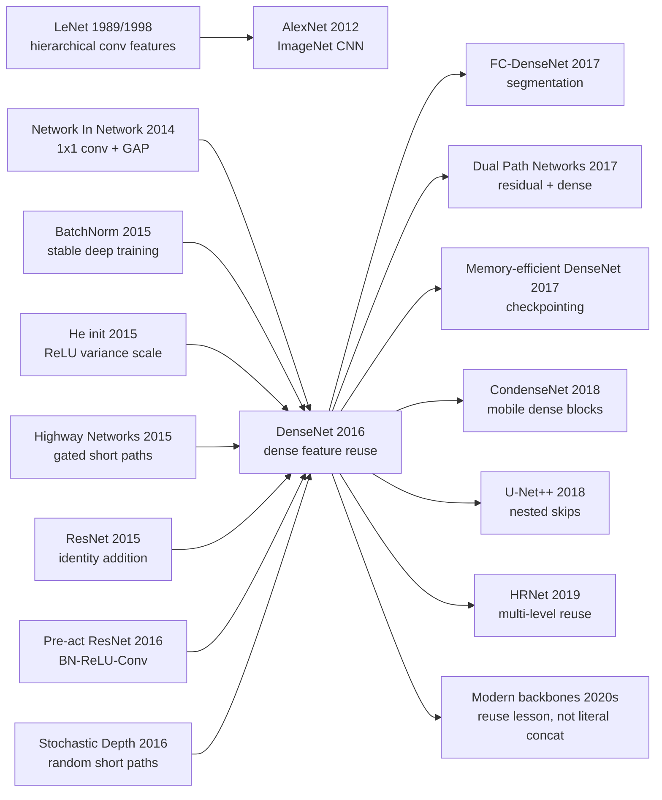

# DenseNet - Feature Reuse as a Network Architecture

> **On August 25, 2016, Gao Huang, Zhuang Liu, Laurens van der Maaten, and Kilian Q. Weinberger uploaded [arXiv:1608.06993](https://arxiv.org/abs/1608.06993), later published at CVPR 2017.** ResNet had just made “go deeper” credible; DenseNet asked a sharper question: why should a layer receive only the latest state, or only a summed residual state, if all earlier features might still be useful? Its answer was almost greedy: inside a dense block, give every layer the concatenation $[x_0,x_1,\ldots,x_{\ell-1}]$ of all previous feature maps, and let that layer add only a small growth-rate slice of new information. The counter-intuitive punchline is that the number of direct connections grows from $L$ to $L(L+1)/2$, yet the model can use fewer parameters because it stops relearning features. DenseNet-BC with 0.8M parameters nearly matches a 10.2M-parameter 1001-layer pre-activation ResNet on CIFAR-10+, and DenseNet-201 reaches ResNet-101-level ImageNet accuracy with roughly half the parameters. DenseNet did not become the universal backbone of the 2020s, but it permanently changed how vision researchers talk about feature reuse.

## TL;DR

DenseNet, uploaded to arXiv in 2016 by Gao Huang, Zhuang Liu, Laurens van der Maaten, and Kilian Q. Weinberger and published at CVPR 2017, pushes the short-path lesson of [ResNet (2015)](2015_resnet.md) to its logical extreme. ResNet preserves state through addition, $x_\ell=H_\ell(x_{\ell-1})+x_{\ell-1}$; DenseNet replaces that with dense concatenation, $x_\ell=H_\ell([x_0,x_1,\ldots,x_{\ell-1}])$, so each layer reads every earlier feature map in the same dense block and contributes only $k$ new maps, the growth rate. The baselines it defeated were the dominant 2016 answers to “how do we build deeper vision backbones?”: a 1001-layer pre-activation ResNet needed 10.2M parameters for 4.62% CIFAR-10+ error, while DenseNet-BC-100-$k12$ used 0.8M parameters for 4.51%; Wide ResNet-28 used 36.5M parameters for 20.50% CIFAR-100+ error, while DenseNet-BC-190-$k40$ used 25.6M parameters for 17.18%. Its influence runs through Fully Convolutional DenseNets, CondenseNet, Dual Path Networks, U-Net++-style nested skips, and HRNet-like multi-level feature preservation. The hidden lesson is not “connect everything blindly.” It is that connectivity can be a parameter-efficiency device when it lets later computation reuse old features instead of relearning them.

---

## Historical Context

### In 2016, depth was no longer the only bottleneck; redundancy was becoming visible

[AlexNet](2012_alexnet.md) had shown in 2012 that CNNs could crush hand-engineered visual features on ImageNet. VGG then made “small convolutional kernels stacked deeply” feel natural. [BatchNorm](2015_batchnorm.md) and [He initialization](2015_he_init.md) stabilized the scale of deep ReLU networks. By late 2015, [ResNet](2015_resnet.md) had pushed a 152-layer network to the top of ImageNet. When DenseNet appeared, the question was no longer only “can we train a very deep CNN?” A sharper question had emerged: **how much of a deep CNN is simply preserving or relearning features that earlier layers already computed?**

ResNet answered the depth problem with additive identity shortcuts. A block computes $x+F(x)$, giving information and gradients a clean route through the network. That design was enormously successful, but it still merges old and new features into a single state. Once features are summed, later layers see a mixed representation, not the original early features themselves. If an edge, texture, or color response from an early layer remains useful at layer 80, ResNet has to preserve it through a long chain of residual additions. DenseNet makes a more literal move: do not rely on state preservation; **keep the old feature maps available as feature maps.**

### The immediate threads that pushed DenseNet out

- **Network In Network (2014)**: reframed $1\times1$ convolution as a channel-wise local MLP and made global average pooling a credible lightweight classification head. DenseNet-BC inherits both components.
- **Highway Networks (2015)**: trained hundred-layer networks with gated bypass paths, proving that short paths ease optimization, but with extra gating complexity.
- **ResNet (2015)**: solved the degradation problem with identity addition and became DenseNet's main point of comparison. DenseNet accepts the short-path lesson but replaces summation with concatenation.
- **Stochastic Depth (2016)**: randomly dropped residual layers during training, suggesting that many layers in very deep ResNets are not always needed and exposing redundancy.
- **Pre-activation ResNet (2016)**: moved BN-ReLU before convolution to clean up gradient flow. DenseNet's basic layer also uses a BN-ReLU-Conv ordering.
- **FractalNet / Wide ResNet (2016)**: one used multi-path width, the other widened residual blocks, showing that “make it deeper” was not the only way to increase useful capacity.

Together these threads point to the same lesson: deep networks need not only more layers, but better information flow. DenseNet's distinct contribution is that it turns “information flow” into a concrete tensor interface: concatenate all previous feature maps.

### The author team and the paper's posture

Gao Huang was working across Cornell and Tsinghua, Kilian Q. Weinberger was a major machine-learning figure at Cornell, Laurens van der Maaten brought representation-learning and visualization experience from Facebook AI Research, and Zhuang Liu would later become a central name in efficient vision architecture. This was not the typical ImageNet competition team simply scaling a model. DenseNet reads more like an architectural observation: if later layers really reuse earlier features, why not make reuse the topology?

The authors released code and pretrained models at `liuzhuang13/DenseNet`, which helped the architecture spread quickly through Torch, PyTorch, and Caffe ecosystems. From 2017 through 2019, DenseNet became especially attractive in segmentation, medical imaging, and smaller-data visual recognition, not only because its accuracy was strong, but because its parameter efficiency made it practical when model size mattered.

### Compute, data, and framework conditions

DenseNet's experiments span CIFAR-10, CIFAR-100, SVHN, and ImageNet. CIFAR/SVHN are small 32×32-image benchmarks, ideal for comparing architecture efficiency; ImageNet is the necessary large-scale test. The training recipe is deliberately ordinary: SGD, Nesterov momentum 0.9, weight decay $10^{-4}$, ImageNet training for 90 epochs with batch size 256, learning rate 0.1 decayed at epochs 30 and 60. The paper does not hide the architecture behind a new optimizer or exotic training trick.

At the same time, GPU memory became the real constraint on dense connectivity. DenseNet uses few parameters, but dense blocks must keep and concatenate many feature maps. The paper explicitly warns that naive DenseNet implementations can be memory-inefficient and points to a memory-efficient implementation report. That tension shaped DenseNet's later career: it is parameter-efficient, but not always activation-memory-efficient or engineering-simple.

---

## Background and Motivation

### From state passing to feature reuse

DenseNet's motivation is easiest to see through a state-machine analogy. A traditional CNN layer only receives the output of its immediate predecessor: $x_\ell=H_\ell(x_{\ell-1})$. The network therefore owns one state that is repeatedly overwritten. If a later layer needs early information, it must hope the intermediate layers have not washed it out. ResNet makes this preservation explicit with $x_\ell=H_\ell(x_{\ell-1})+x_{\ell-1}$, allowing the state to survive through identity addition.

DenseNet asks the next question: if preserving old information matters so much, why mix old and new information by addition? Addition creates one blended tensor; later layers cannot tell which channels are early edges and which are recent semantics. DenseNet keeps feature provenance intact through concatenation. A layer does not rewrite the global state; it appends $k$ new feature maps to a shared feature pool. Old channels remain unchanged, and new channels only need to contribute what is missing.

| Architecture | Layer transition | How information is preserved | Main cost |
|--------------|------------------|------------------------------|-----------|
| Plain CNN | $x_\ell=H_\ell(x_{\ell-1})$ | by rewriting the next state | early information can wash out |
| ResNet | $x_\ell=H_\ell(x_{\ell-1})+x_{\ell-1}$ | additive identity state preservation | old and new features are mixed |
| **DenseNet** | $x_\ell=H_\ell([x_0,\ldots,x_{\ell-1}])$ | concatenation preserves all old features | channel count and activation memory grow |

This is more precise than “connect more layers.” DenseNet's real target is **feature reuse**: later layers can directly access old features, avoid relearning similar feature maps, and receive supervision through many short paths.

### Why “more connections” can mean fewer parameters

The naive reaction to $L(L+1)/2$ connections is that the model must be larger. DenseNet's counter-intuitive point is that connections are not parameters; convolutional kernels are. Dense connections give each layer a rich input set, so each layer only needs to produce a small number of new feature maps. The paper calls this number the **growth rate** $k$, and CIFAR models often use values as small as $k=12$.

If layer $\ell$ already receives $k_0+k(\ell-1)$ input channels, it outputs only $k$ new channels. Capacity no longer comes from rebuilding a wide state at every layer; it comes from a growing reusable feature bank. DenseNet turns “depth” from repeatedly transforming the whole state into gradually adding pages to a shared notebook.

## Method Deep Dive

### Overall framework

DenseNet is composed of **dense blocks** separated by **transition layers**. Inside a dense block, all feature maps have the same spatial resolution, so they can be concatenated along the channel dimension. The input to layer $\ell$ is the concatenation of all previous outputs:

$$
x_{\ell}=H_{\ell}([x_0,x_1,\ldots,x_{\ell-1}]).
$$

Here $[\cdot]$ denotes channel concatenation, and $H_\ell$ is a composite function. The basic version uses BN-ReLU-Conv($3\times3$); DenseNet-B inserts a $1\times1$ bottleneck before the $3\times3$ convolution; DenseNet-C compresses channels at transition layers; DenseNet-BC uses both bottleneck and compression.

```python
class DenseLayer(nn.Module):
    def __init__(self, in_channels, growth_rate):
        super().__init__()
        hidden = 4 * growth_rate
        self.layer = nn.Sequential(
            nn.BatchNorm2d(in_channels),
            nn.ReLU(inplace=True),
            nn.Conv2d(in_channels, hidden, kernel_size=1, bias=False),
            nn.BatchNorm2d(hidden),
            nn.ReLU(inplace=True),
            nn.Conv2d(hidden, growth_rate, kernel_size=3, padding=1, bias=False),
        )

    def forward(self, previous_features):
        stacked = torch.cat(previous_features, dim=1)
        new_features = self.layer(stacked)
        return new_features
```

The key line is `torch.cat`, not `+`. ResNet adds tensors of matching channel count; DenseNet stores old and new features side by side and lets later layers learn which channels to use.

### Key Design 1: Dense connectivity - every layer reads the full feature history

#### Function

Dense connectivity gives both information and gradients extremely short paths. Layer $\ell$ directly reads $x_0$ through $x_{\ell-1}$, and layer $0$ can influence the classifier through many later concatenation routes. Early layers therefore do not wait for a long nonlinear chain before receiving supervision.

#### Formula

A traditional $L$-layer network has $L$ main feed-forward connections. Inside a dense block, DenseNet has:

$$
1+2+\cdots+L=\frac{L(L+1)}{2}
$$

direct feed-forward connections. These are tensor concatenation paths, not additional convolutional parameter sets.

#### Comparison table

| Design | Can later layers directly access early feature maps? | Gradient path | Typical risk |
|--------|------------------------------------------------------|---------------|--------------|
| Plain CNN | no | long backprop chain | vanishing / wash out |
| Highway | partly, through gates | short but gated | gating complexity |
| ResNet | indirectly through accumulated state | identity addition | feature origins are mixed |
| **DenseNet** | **yes, direct concat** | **many short paths** | activation memory growth |

#### Design rationale

DenseNet makes the usual “deeper means more abstract” story more nuanced. Later layers can still learn high-level semantics, but they should not be forced to forget edges, colors, and textures. The paper's weight-heatmap analysis supports this: trained DenseNet layers spread their weights across many earlier outputs in the same dense block.

### Key Design 2: Growth rate $k$ - each layer contributes only a small slice

#### Function

The growth rate controls how many feature maps each layer adds to the shared pool. If each layer emits $k$ channels, layer $\ell$ receives $k_0+k(\ell-1)$ input channels. DenseNet layers can be very narrow, for example $k=12$, because they do not need to reconstruct a full state.

#### Formula

$$
\text{channels into layer }\ell = k_0+k(\ell-1).
$$

A 100-layer network with only 12 new channels per layer still has rich late-layer inputs; the difference is that those inputs come from many layers, not from one very wide layer.

#### Comparison table

| Model setting | Parameters | C10+ error | C100+ error | Reading |
|---------------|------------|------------|-------------|---------|
| DenseNet-40 $k=12$ | 1.0M | 5.24% | 24.42% | small growth rate is already competitive |
| DenseNet-100 $k=12$ | 7.0M | 4.10% | 20.20% | greater depth reuses more features |
| DenseNet-100 $k=24$ | 27.2M | 3.74% | 19.25% | width adds capacity, but parameters grow |

#### Design rationale

DenseNet's parameter efficiency comes from “small additions plus heavy reuse.” This differs from wide residual blocks. A ResNet block often processes an entire wide channel state; a DenseNet layer only adds a small group of new evidence to the global state. It is incremental writing rather than repeatedly rewriting the same paragraph.

### Key Design 3: Bottleneck and compression - controlling channel growth

#### Function

Dense concatenation makes input channels grow layer by layer. To keep $3\times3$ convolution from becoming expensive at high input dimension, DenseNet-B inserts a $1\times1$ bottleneck before every $3\times3$ convolution; DenseNet-C compresses channels at transition layers; DenseNet-BC uses both.

#### Formula

The DenseNet-B layer transform is:

$$
H_\ell = \mathrm{BN}\!\to\!\mathrm{ReLU}\!\to\!\mathrm{Conv}_{1\times1}(4k)\!\to\!\mathrm{BN}\!\to\!\mathrm{ReLU}\!\to\!\mathrm{Conv}_{3\times3}(k).
$$

If a dense block outputs $m$ channels, a DenseNet-C transition layer outputs:

$$
\lfloor \theta m\rfloor,\qquad 0<\theta\le 1,
$$

with $\theta=0.5$ in the paper's experiments.

#### Comparison table

| Variant | Structural change | Purpose | Effect in the paper |
|---------|-------------------|---------|---------------------|
| DenseNet | BN-ReLU-Conv($3\times3$) | direct dense block | simple but channel-costly |
| DenseNet-B | first $1\times1$ to $4k$ | reduce $3\times3$ input dimension | cheaper computation |
| DenseNet-C | transition compression $\theta m$ | shrink channels between blocks | fewer parameters |
| **DenseNet-BC** | bottleneck + compression | save computation and parameters | 0.8M params nearly matches 1001-layer ResNet |

#### Design rationale

Dense connectivity is powerful, but without channel control the feature bank expands too quickly. The $1\times1$ bottleneck borrows mature practice from Inception, NIN, and ResNet; compression is DenseNet's own forgetting mechanism. At the end of a block, keep a compact subset of useful features and pass it to the next scale.

### Key Design 4: Transition layers and multi-scale dense blocks

#### Function

Concatenation requires matching spatial sizes, but image networks must downsample. DenseNet therefore divides the network into dense blocks. Within a block, connectivity is dense; between blocks, transition layers change resolution.

#### Structure

On CIFAR/SVHN, the paper uses 3 dense blocks at 32×32, 16×16, and 8×8 resolutions. Between adjacent blocks it uses BN + $1\times1$ convolution + $2\times2$ average pooling. The final block feeds global average pooling and softmax.

On ImageNet, DenseNet uses 4 dense blocks after an initial $7\times7$ stride-2 convolution and max pooling, with resolutions 56, 28, 14, and 7. The main configurations are:

| Model | Dense block configuration | Growth rate | ImageNet single-crop top-1/top-5 |
|-------|---------------------------|-------------|----------------------------------|
| DenseNet-121 | 6, 12, 24, 16 | 32 | 25.02 / 7.71 |
| DenseNet-169 | 6, 12, 32, 32 | 32 | 23.80 / 6.85 |
| DenseNet-201 | 6, 12, 48, 32 | 32 | 22.58 / 6.34 |
| DenseNet-264 | 6, 12, 64, 48 | 32 | 22.15 / 6.12 |

#### Design rationale

DenseNet does not discard the CNN pyramid. It changes connectivity within each scale: reuse aggressively at a fixed resolution, then use transition layers to summarize and downsample. This is why it could plug into ResNet/ImageNet training practice rather than invent an entirely new vision system.

### Training recipe

| Item | CIFAR/SVHN | ImageNet |
|------|------------|----------|
| Optimizer | SGD + Nesterov 0.9 | SGD + Nesterov 0.9 |
| Weight decay | $10^{-4}$ | $10^{-4}$ |
| Batch size | 64 | 256 |
| Epochs | CIFAR 300, SVHN 40 | 90 |
| Learning rate | 0.1, divided by 10 at 50% / 75% | 0.1, divided by 10 at epochs 30 / 60 |
| Initialization | He initialization | He initialization |
| Dropout | 0.2 on non-augmented small datasets | not central |

The plainness matters. DenseNet's win is not an optimizer story; it is a connectivity topology changing what the same training recipe can express and optimize.

---

## Failed Baselines

### Baseline 1: plain CNN long-chain state passing

Plain CNNs are DenseNet's most basic negative example. Each layer only sees the output of the previous layer, so all early information must be relayed through a long sequence of convolutions, ReLUs, and pooling. As depth increases, both input signal and gradient can wash out. By 2015, VGG-style plain deep networks were powerful, but further depth exposed optimization and redundancy problems.

DenseNet's response is not simply that plain CNNs fail. It says their state interface is too narrow: a later layer receives only one compressed state. Dense connectivity widens that interface into a set of historical features, so layers do not have to reconstruct early information from the immediately preceding state.

### Baseline 2: ResNet's summation shortcut

ResNet is the baseline DenseNet respects most and tries to revise. Identity addition in ResNet greatly mitigates the degradation problem, but it adds $H(x)$ and $x$. The addition preserves a gradient path, yet it also blends feature sources in the same channel space. If a later layer wants to reuse an early feature, it relies on that feature remaining distinguishable after many additions.

DenseNet switches to concatenation, so old features are not overwritten. The difference looks small but changes the model behavior: ResNet learns how to update a state; DenseNet learns how to add information to an old feature library. The paper's discussion emphasizes that DenseNet-BC reaches a CIFAR-10+ test error comparable to a 1001-layer pre-activation ResNet while using 0.8M parameters instead of 10.2M.

### Baseline 3: complex short paths in Highway / Stochastic Depth / FractalNet

Highway Networks use gates to control bypass information; FractalNet creates short routes through a self-similar multi-path graph; Stochastic Depth randomly drops residual layers during training. All of them accept the same premise: deep networks need short paths. But they introduce gates, training-time stochastic structure, or more complicated topology.

DenseNet chooses a deterministic, ungated, easy-to-state path: concatenate everything within the same block. It does not randomly drop layers or learn gates. It exposes all old features to later layers and lets convolution weights decide what to use.

| Baseline | What it solved at the time | What DenseNet still sees missing | DenseNet replacement |
|----------|----------------------------|----------------------------------|----------------------|
| Plain CNN | simple, mature architecture | information flow is too long | all old features directly visible |
| ResNet | identity gradient path | summation mixes feature sources | concatenation preserves sources |
| Highway | gated bypass | extra parameters and gate complexity | ungated dense path |
| Stochastic Depth | reduces deep ResNet redundancy | stochastic train-time structure | deterministic feature reuse |
| FractalNet | multi-path depth | complex topology, many parameters | simple dense block |

### DenseNet's own admitted boundaries

DenseNet has real failure modes. The paper gives at least three honest signals.

First, SVHN is relatively easy, and DenseNet-BC-250 does not improve over a shorter counterpart; the authors suggest that extremely deep models may overfit that task. Second, on non-augmented CIFAR-10, increasing $k$ from 12 to 24 roughly quadruples parameters and slightly increases error from 5.77% to 5.83%, showing that more width is not automatically better. Third, naive DenseNet implementations are memory-inefficient because concatenation requires retaining many intermediate feature maps; the later memory-efficient DenseNet report exists to address this issue.

These boundaries also explain why DenseNet did not become the default backbone everywhere in the way ResNet did. Parameter efficiency is not the same as deployment efficiency; concatenation is good for reuse, but not always good for memory bandwidth, activation storage, or kernel fusion.

## Key Experimental Data

### CIFAR / SVHN main results

DenseNet's small-image results are the clearest evidence for parameter efficiency and generalization. Key numbers from the paper are:

| Model | Depth | Params | C10 | C10+ | C100 | C100+ | SVHN |
|-------|------:|-------:|----:|-----:|-----:|------:|-----:|
| FractalNet + Dropout/Drop-path | 21 | 38.6M | 7.33 | 4.60 | 28.20 | 23.73 | 1.87 |
| Wide ResNet-28 | 28 | 36.5M | - | 4.17 | - | 20.50 | - |
| Pre-act ResNet-1001 | 1001 | 10.2M | 10.56 | 4.62 | 33.47 | 22.71 | - |
| DenseNet-100 $k=24$ | 100 | 27.2M | 5.83 | 3.74 | 23.42 | 19.25 | **1.59** |
| DenseNet-BC-100 $k=12$ | 100 | 0.8M | 5.92 | 4.51 | 24.15 | 22.27 | 1.76 |
| DenseNet-BC-250 $k=24$ | 250 | 15.3M | **5.19** | 3.62 | **19.64** | 17.60 | 1.74 |
| DenseNet-BC-190 $k=40$ | 190 | 25.6M | - | **3.46** | - | **17.18** | - |

The point is not that DenseNet wins every cell. The important ratios are more revealing: DenseNet-BC-100-$k12$ uses 0.8M parameters to match the error range of a 10.2M-parameter pre-activation ResNet-1001; DenseNet-BC-190-$k40$ uses fewer parameters than Wide ResNet-28 and reduces CIFAR-100+ error from 20.50% to 17.18%.

### ImageNet results

On ImageNet, DenseNet does not use a training recipe specially tuned for itself. The authors adopt the same settings as a public ResNet Torch implementation. The results still show strong parameter and computation efficiency.

| Model | Single-crop top-1 | Single-crop top-5 | 10-crop top-1 | 10-crop top-5 |
|-------|------------------:|------------------:|--------------:|--------------:|
| DenseNet-121 | 25.02 | 7.71 | 23.61 | 6.66 |
| DenseNet-169 | 23.80 | 6.85 | 22.08 | 5.92 |
| DenseNet-201 | 22.58 | 6.34 | 21.46 | 5.54 |
| DenseNet-264 | 22.15 | 6.12 | 20.80 | 5.29 |

The paper emphasizes two comparisons. DenseNet-201, with about 20M parameters, reaches validation error similar to a 101-layer ResNet with more than 40M parameters. In FLOPs, a DenseNet with computation similar to ResNet-50 performs on par with ResNet-101. DenseNet's advantage therefore transfers beyond CIFAR-scale experiments.

### Feature reuse analysis

The discussion section contains a valuable analysis: after training DenseNet-40-$k12$, the authors measure the average absolute weight connecting each convolutional layer to earlier feature maps. Four observations matter:

1. Layers inside a dense block spread weight over many preceding inputs, meaning deep layers really use early features directly.
2. Transition layers also spread weight over outputs from many layers in the previous block, so information flows across blocks through few indirections.
3. Layers in the second and third dense blocks assign the lowest average weight to direct transition-layer outputs, suggesting redundancy and explaining why compression works.
4. The final classifier still leans toward later feature maps, meaning DenseNet does not erase hierarchical semantics; it lets multi-level features coexist.

### How to read the experiments

DenseNet's experimental message compresses into three points.

- **Parameter efficiency**: DenseNet-BC often reaches ResNet-level error with roughly one third or fewer parameters.
- **Optimization stability**: hundreds-layer DenseNets do not show plain-network degradation, and usually improve as capacity grows.
- **Regularization side effect**: feature reuse makes the model less prone to overfitting on smaller data, but excessive width or depth still has limits.

---

## Idea Lineage



### Past lives: the lines that converged into it

DenseNet's distant ancestor is the hierarchical-feature idea of convolutional networks. From LeNet to AlexNet, CNNs assumed that early layers learn edges and textures while later layers learn more abstract semantics. But those networks pass hierarchy through one forward state; once an early feature is transformed, it no longer exists in its original form.

The second line is **local and multi-level feature reuse**. FCN, Hypercolumns, and task-level skip connections had already shown that shallow spatial detail and deep semantic information work well together in segmentation and detection. DenseNet moves that multi-layer usage from the task head into the backbone itself: not “fuse several layers at the end,” but “let every layer inside a dense block fuse all previous layers.”

The third line is **short-path optimization**. Highway Networks, ResNet, pre-activation ResNet, and Stochastic Depth all circle the same problem: deep networks need short gradient paths. DenseNet's difference is that the short path becomes a feature interface. It does not only let gradients flow backward; it lets forward features be read directly by later layers.

### Descendants: what DenseNet changed downstream

The most direct descendant is **Fully Convolutional DenseNets / Tiramisu**, which inserts dense blocks into segmentation networks and shows why DenseNet is useful for dense prediction. Medical imaging also adopted DenseNet heavily because small datasets, parameter efficiency, and feature reuse fit the domain well.

**Dual Path Networks** offer an especially revealing compromise: residual addition for reusing common features, dense concatenation for exploring new features. It essentially turns the ResNet-DenseNet disagreement into a two-path architecture.

**CondenseNet** and memory-efficient DenseNet represent the engineering branch. CondenseNet uses learned group convolution to make dense blocks cheaper on mobile hardware; memory-efficient DenseNet uses recomputation/checkpointing to reduce activation memory. Both accept the value of DenseNet's idea while acknowledging that literal dense concatenation has to be managed.

The broader influence survives in U-Net++, HRNet, feature pyramids, FPN-style systems, and multi-scale fusion networks. They do not necessarily use DenseNet blocks, but they accept the principle DenseNet made hard to ignore: intermediate features are not disposable; preserving and reusing multi-level information is an architectural capability.

### Misreadings / oversimplifications

- **“DenseNet just connects every layer to every layer.”** The key is not connection count; it is concatenation preserving feature provenance while a small growth rate controls new information.
- **“DenseNet is simply better than ResNet.”** DenseNet is strong in parameter efficiency, but activation memory, kernel fusion, and deployment latency are not always better than ResNet.
- **“More old features always help.”** Transition compression and the feature-reuse heatmap both show redundancy; old features still need compression and selection.
- **“DenseNet eliminates feature hierarchy.”** The final classifier still leans toward late features. DenseNet does not deny hierarchy; it lets multiple levels coexist.

---

## Modern Perspective

### Assumptions that no longer hold

First, **“parameter count is the main efficiency metric”** is no longer enough in 2026. DenseNet's parameter efficiency is elegant, but modern deployment cares about activation memory, memory bandwidth, operator fusion, batch-size scaling, and accelerator friendliness. Dense concatenation requires retaining and concatenating many intermediate feature maps, which is not always cheaper on GPUs or TPUs than residual addition. Many industrial backbones later favored ResNet, MobileNet, EfficientNet, ConvNeXt, or ViT not because they forgot DenseNet, but because end-to-end throughput and tooling were friendlier.

Second, **“denser reuse is always better”** no longer holds. DenseNet proves reuse matters, but transition compression, feature-weight heatmaps, and later DPN / CondenseNet work all show that reuse needs selection. Keeping everything creates redundancy, memory cost, and bandwidth cost.

Third, **“CNN backbones will remain the center of vision”** has been rewritten by the ViT era. DenseNet's literal dense block did not enter mainstream Transformers, but its question survived: how do early tokens, multi-scale features, and intermediate representations avoid being overwritten by later layers? Modern answers are more often residual streams, attention, feature pyramids, and multi-scale token fusion than literal concatenation.

### What actually survived

**The first survivor is the language of feature reuse.** After 2017, it became hard to discuss vision backbones only as “stack more layers.” Researchers started asking how multi-scale features are preserved, how shallow detail reaches task heads, and where block redundancy lives. DenseNet turned those engineering intuitions into named architectural goals.

**The second survivor is growth-rate thinking.** A layer does not always need to output a complete wide state; adding a small slice of new information can still build a strong model. This has a family resemblance to later bottlenecks, mobile blocks, low-rank adapters, and adapter tuning: new capacity can be incremental rather than a full rewrite.

**The third survivor is the add-versus-concat distinction.** ResNet addition is shape-preserving, cheap, and hardware-friendly; DenseNet concatenation preserves provenance, supports multi-level reuse, and grows a feature library. Later DPN, FPN, U-Net++, and HRNet designs all choose their own boundaries among add, concat, and learned fusion.

| Design element | 2026 status | Reason |
|----------------|-------------|--------|
| Dense block as default classification backbone | no longer default | activation memory and throughput are less friendly than residual / ConvNeXt / ViT lines |
| Dense block for small-data / medical / segmentation tasks | still useful | parameter efficiency and feature reuse fit low-data regimes |
| Growth rate | concept survives | small incremental capacity matches efficient-model thinking |
| Transition compression | concept survives | modern models also select, compress, and route intermediate representations |
| Feature reuse | fully survives | multi-scale fusion, skips, FPN, and HRNet all inherit the judgment |

### Side effects the original paper did not fully unfold

DenseNet's largest side effect is activation memory. Fewer parameters do not automatically mean less training memory. Every layer in a dense block must access all previous feature maps, and autograd must preserve intermediate values for backward. Later memory-efficient DenseNet work reduces this through checkpointing and recomputation, but at the cost of extra compute.

The second side effect is implementation complexity. ResNet's `out += identity` is easy for frameworks and hardware to optimize. DenseNet's repeated concatenations can create more small tensor operations and memory copies. Without careful implementation, theoretical FLOPs and real wall-clock time diverge.

The third side effect is that literal dense history is awkward in the large-scale pretraining era. Modern vision foundation models often use a residual stream to carry long-range information because it scales more naturally with width, depth, parallelism, and normalization placement. DenseNet's “keep every previous feature” becomes costly when both token count and channel count are large, so the idea survives more than the exact topology.

### The best way to reread DenseNet in 2026

DenseNet should not be read only as a ResNet variant. It is more usefully read as a paper about the lifecycle of representations: after a feature is computed, should it be immediately consumed by the next layer, or should it remain a shared resource for later computation?

That question is still alive in 2026. Cross-layer KV caches in multimodal systems, U-Net skips in diffusion models, feature pyramids in detection and segmentation, and residual streams in LLMs all face versions of it: should intermediate representations be overwritten, or preserved, compressed, and reused? DenseNet's literal answer is not always the best one, but it asks the question cleanly.

### Final historical placement

DenseNet did not replace ResNet. Its historical position is subtler: it showed that ResNet's core was not merely “add a residual,” but “give information short paths”; it also showed that short paths can be used for parameter efficiency, not only optimization. It added a new axis to CNN architecture design beyond “deeper,” “wider,” or “more complicated module”: **how old features are preserved and reused**.

That is why it belongs in the Top 100. Not because every modern model looks like DenseNet, but because modern vision networks are still answering the question it posed.


---

> 🌐 [中文版](/era2_deep_renaissance/2016_densenet/) · 📚 awesome-papers project · CC-BY-NC