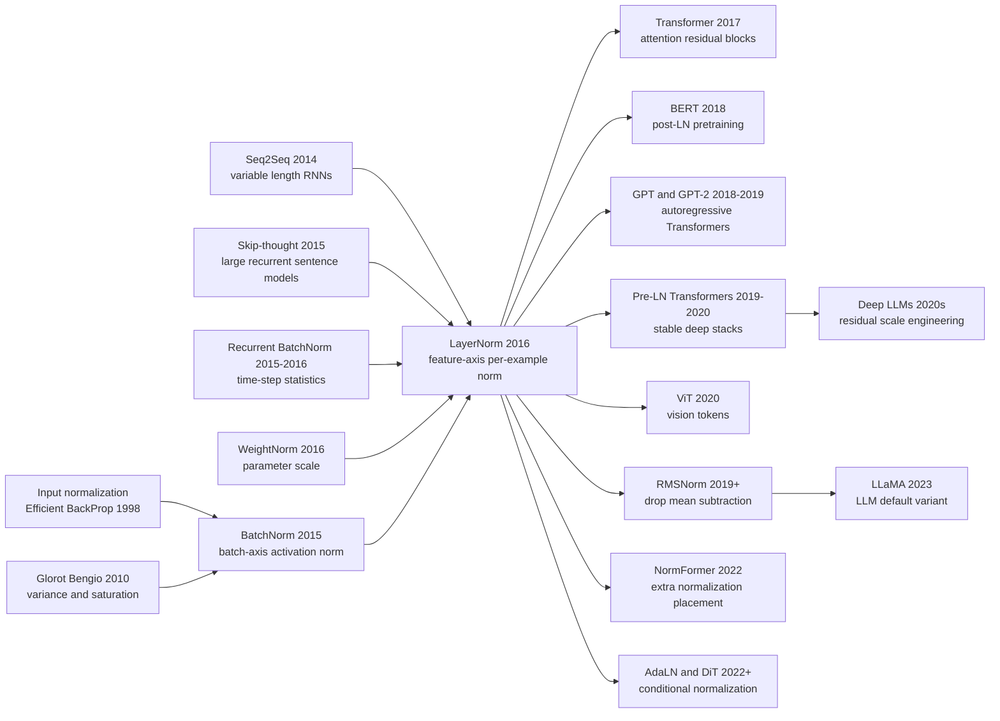

# LayerNorm: Normalization Without a Batch

> **On July 21, 2016, Jimmy Lei Ba, Jamie Ryan Kiros, and Geoffrey Hinton uploaded [arXiv:1607.06450](https://arxiv.org/abs/1607.06450).** At first glance, Layer Normalization looks like a small transpose of BatchNorm: compute the mean and variance across the hidden units of one example instead of across a mini-batch. But that axis swap removed the batch-size constraint, the running-statistics machinery, the train/test mismatch, and the awkward question of how many time steps an RNN will need at inference. The paper did not become famous by winning an ImageNet leaderboard. It found its historical stage one year later, inside the Transformer. In 2026, almost every large language model block carries a descendant of this idea: LayerNorm, pre-norm, RMSNorm, AdaLN. The twist is that the most important normalization method for sequence models began by admitting that some networks should not depend on the batch at all.

## TL;DR

Ba, Kiros, and Hinton's 2016 Layer Normalization paper turned [BatchNorm](2015_batchnorm.md) by ninety degrees. Instead of estimating $\mu_B,\sigma_B$ for one neuron across a mini-batch, it computes statistics inside one example across the hidden units of a layer: $\mu^l=\frac{1}{H}\sum_i a_i^l$, $\sigma^l=\sqrt{\frac{1}{H}\sum_i(a_i^l-\mu^l)^2}$, and then emits $h_i=f((g_i/\sigma^l)(a_i-\mu^l)+b_i)$. The baseline it replaced was not merely an unnormalized network; it was the awkward attempt to force BatchNorm into recurrent models, where statistics had to be stored by time step, variable-length sequences were unnatural, batch size 1 was a bad case, and recurrent BN could require careful gain initialization such as 0.1. LayerNorm reached the best MSCOCO order-embedding validation model in about 60% of the baseline time, improved Skip-thought, DRAW, handwriting generation, and permutation-invariant MNIST training, and kept the same computation at training and test time.

The larger historical payoff arrived after the paper. [Transformer (2017)](../era3_attention/2017_transformer.md) placed LayerNorm around attention and feed-forward residual blocks; BERT, GPT, ViT, T5, LLaMA, and later diffusion transformers mutated it into post-norm, pre-norm, RMSNorm, and adaptive LayerNorm variants. The counterintuitive lesson is that LayerNorm was not the best answer for every architecture. The original paper explicitly reports that BatchNorm worked better in preliminary ConvNet experiments, because spatial units near image boundaries have very different statistics from central units. Yet precisely because LayerNorm is batch-free, train/test-consistent, and natural for tokens and time steps, it became less important as a CNN trick and more important as the stabilizer of the foundation-model era.

---

## Historical Context

### After 2015, BatchNorm solved CNN training but strained sequence models

BatchNorm gave the deep-learning community a powerful hint in 2015: many problems described as "deep networks are hard to train" did not have to be solved only by fancier optimizers. One could turn activation scale control itself into a network layer. It spread quickly through Inception, ResNet, and GAN recipes because it made training faster, widened the useful learning-rate window, and reduced sensitivity to initialization and dropout.

That success hid an assumption: the batch was a trustworthy statistical unit. In ImageNet classification, a GPU could hold many images, each channel in a layer had enough batch and spatial samples, and using batch statistics during training with running averages at test time was acceptable. Once the same idea moved into sequence models, the assumption became awkward.

An RNN is a state machine unrolled through time. Sentences have different lengths, test sequences may be longer than training sequences, and online learning may see one example at a time. If BatchNorm is inserted naively into an RNN, the direct solution is to keep a separate set of statistics for each time step. But time is not a fixed network depth; it is chosen by the input. LayerNorm's historical move starts here: if the batch is the wrong statistical axis, change the axis.

### The RNN problem was not only gradients; it was time-dependent statistics

LSTMs, GRUs, and vanilla RNNs carried much of sequence modeling in 2014-2016: machine translation, question answering, language modeling, sentence representation, handwriting generation, and DRAW-style image generation. The community already knew about vanishing and exploding gradients, and gated units had become the standard mitigation. The LayerNorm paper focused on a more operational issue: the average magnitude of hidden-to-hidden summed inputs can grow or shrink over time.

That scale drift is difficult to handle elegantly with BatchNorm. First, samples in a batch are not necessarily aligned in time in a meaningful way. Second, later time-step statistics can become sparse. Third, if inference produces longer sequences than training, running statistics for those time steps have no natural definition. Recurrent BatchNorm explored this route, but it required time-step statistics and careful gain choices. LayerNorm instead lets each example at each time step compute its own layer-wise mean and variance.

This changes normalization from "estimate a population distribution across examples" into "choose a stable coordinate system for the current state." For sequence models, that shift matters. The layer no longer couples examples through the batch, no longer uses different training and test computations, and no longer needs sequence length to be fixed in advance.

### The Toronto context: Hinton's group, Kiros, and Ba

The author list is historically telling. Jimmy Lei Ba was already one of the authors of Adam, with research close to optimization, attention, and training dynamics. Jamie Ryan Kiros worked on Skip-thought, order-embeddings, and vision-language representation, which meant he had direct contact with large recurrent systems. Geoffrey Hinton was central to the deep-learning revival, speech models, AlexNet, Dropout, and the broader BatchNorm-era training culture.

LayerNorm therefore did not appear from a purely abstract mathematical exercise. It came from concrete pains: Skip-thought took days to become useful, order-embedding GRUs converged slowly, and DRAW or handwriting-generation models could suffer unstable hidden dynamics. The experiments consequently do not look like BatchNorm's one large ImageNet story. They span six tasks with a strong sequence-model flavor.

That also explains the paper's initial diffusion. LayerNorm did not have a single headline number like "ImageNet top-5 error." Its argument was a set of practical statements: RNN training becomes stabler, small batches work, training and testing match, and variable-length sequences fit naturally.

### Why the paper did not explode like BatchNorm at first

BatchNorm had an easy story: the same ImageNet accuracy in 14x fewer training steps and a 4.82% top-5 ensemble result. LayerNorm's 2016 story was less theatrical. It improved or accelerated MSCOCO order embeddings, CNN question answering, Skip-thought, DRAW, handwriting generation, and permutation-invariant MNIST, but those benchmarks were scattered and many results were shown as learning curves or validation trends.

More importantly, the deep-learning imagination of 2016 was still strongly pulled by CNNs and ImageNet. BatchNorm was becoming the default in convolutional networks, while the LayerNorm paper itself reports that BatchNorm was better in preliminary ConvNet experiments. The reason is concrete: spatial units near image boundaries and spatial units near the center have very different statistics, so normalizing the entire layer can mix units that should not share one statistic.

LayerNorm therefore looked in 2016 like an important but bounded sequence-model trick. Its historical breakout had to wait for the Transformer. A Transformer is not recurrent, but it has token-wise representations, residual branches, attention, and feed-forward sublayers that all need batch-free scale control. LayerNorm moved from being an RNN stabilizer to being infrastructure for the attention era.

## Background and Motivation

### Move the normalization axis from batch to feature

The difference between BatchNorm and LayerNorm is not whether we subtract a mean and divide by a standard deviation. The difference is the statistical axis. BatchNorm estimates mean and variance for one neuron across examples, assuming the batch approximates the training distribution. LayerNorm estimates mean and variance inside one example across the hidden units of a layer, assuming the shared scale of the current representation is what needs stabilization.

That axis transposition changes many behaviors. BatchNorm makes one example's output depend on the other examples in the same batch; LayerNorm does not. BatchNorm switches statistics between training and testing; LayerNorm does not. BatchNorm's noise can regularize; LayerNorm behaves more like deterministic reparameterization and scale control. BatchNorm is excellent when batch and spatial statistics are reliable; LayerNorm is more natural for sequences, online settings, small batches, and token models.

The title is deliberately modest: Layer Normalization, not "the replacement for BatchNorm." That is exactly right. LayerNorm does not replace BatchNorm everywhere; it replaces it where batch statistics are the wrong abstraction.

### Design targets: batch size 1, variable length, and train/test consistency

LayerNorm's design targets are unusually clean. First, batch size can be 1. As long as the current example has enough hidden units in a layer, statistics can be computed; this matters for online learning, reinforcement learning, small-memory workloads, and long sequences. Second, variable-length sequences do not need extra bookkeeping. Each time step uses statistics from the current hidden vector, not a separate running average for step 1, step 2, or step 1000. Third, training and testing are identical. Deployment no longer depends on `train()` / `eval()` mode, calibrated running means, or the composition of an online batch.

These goals looked engineering-oriented in 2016. From 2026, they look like basic requirements for large model inference. An LLM has one representation per token, inference batch sizes differ wildly from training, and KV-cache decoding makes sequence length dynamic. A normalization layer that depends on batch statistics would be a poor default for that route.

LayerNorm's motivation can therefore be summarized as: change normalization from "estimate the data distribution" into "regularize the coordinate system of the current representation." That sentence also explains why the method later bonded so deeply with residual connections, attention, and pre-norm Transformer architectures.

### The counterintuitive part: losing batch noise helped it enter large-model blocks

One source of BatchNorm's success is the randomness of batch statistics. It stabilizes scale, but it also acts like noise regularization. LayerNorm removes that sample-to-sample noise, which seems like a lost advantage. In sequence models, however, batch noise is often not a gift. The same sentence should not change because it happened to be batched with different neighbors, and autoregressive inference may have only one active sample.

That is LayerNorm's counterintuitive value. It gives up one BatchNorm advantage and gains a cleaner interface. Transformer, BERT, GPT, ViT, T5, and LLaMA all inherit this trade-off in different forms: normalization should serve residual dynamics and token representations, not depend on the batch as a statistical proxy.

Many methods that look weaker locally win because their interface composes better. LayerNorm is one of them. It lacked BatchNorm's large-batch regularization noise and did not dominate ImageNet classification, but it removed batch dependence from the system boundary. That made it the default part in larger architectures.

---

## Method Deep Dive

### Overall framework

LayerNorm's framework can be summarized in one sentence: for one example, compute the mean and standard deviation across all summed inputs in a layer, re-center and re-scale that current representation, then give every hidden unit its own learnable gain and bias. If the pre-activation of unit $i$ in layer $l$ is $a^l_i$ and the layer contains $H$ hidden units, LayerNorm ignores the other examples in the batch and uses only the vector $a^l$ for the current example.

The difference from BatchNorm is sharp. BatchNorm's statistical axis is "one neuron across many examples." LayerNorm's statistical axis is "one example across the neurons of one layer." The former treats the batch as an approximation to a population distribution; the latter treats the current layer representation as a coordinate system that needs to be stabilized. That change removes running means and variances, and it removes the need to switch behavior between training and testing.

The paper usually applies LayerNorm before the nonlinearity. It does not merely clip outputs into the same range. It creates a normalized coordinate system inside the current layer, then lets learnable parameters recover whatever scale and center the task needs. This pattern, normalize first and return freedom afterward, is inherited by Transformers, pre-norm blocks, RMSNorm, and adaptive LayerNorm.

### Key design 1: Per-example statistics across hidden units

#### Function

LayerNorm's first design choice is to compute the mean and standard deviation across the hidden units of one layer for one example. This directly avoids batch size, batch composition, and online inference problems. Whether the batch contains 128 examples or 1 example, the LayerNorm computation is unchanged.

#### Formula

Given the current example's summed inputs $a^l_1,\dots,a^l_H$ in layer $l$, LayerNorm computes:

$$
\mu^l = \frac{1}{H}\sum_{i=1}^{H}a^l_i, \qquad
\sigma^l = \sqrt{\frac{1}{H}\sum_{i=1}^{H}(a^l_i-\mu^l)^2 + \epsilon}, \qquad
\bar{a}^l_i = \frac{a^l_i-\mu^l}{\sigma^l}
$$

Here $H$ is the number of hidden units and $\epsilon$ is numerical protection. The key point is that $\mu^l,\sigma^l$ are different for every example, while all units in that layer share the two statistics for that example.

#### Code

```python
def layer_standardize(activations, eps=1e-5):
    mean = activations.mean(dim=-1, keepdim=True)
    variance = activations.var(dim=-1, unbiased=False, keepdim=True)
    normalized = (activations - mean) / torch.sqrt(variance + eps)
    return normalized
```

#### Comparison Table

| Method | Statistical axis | Depends on batch size | Train/test relation |
|--------|------------------|-----------------------|---------------------|
| BatchNorm | Same feature across examples | Yes | Batch stats for training, running stats for test |
| LayerNorm | Same example across features | No | Same computation in training and test |
| InstanceNorm | One example and channel across space | No | Better fit for style and image generation |

#### Design Rationale

This design is not trying to stabilize each neuron's marginal distribution over the dataset. It is trying to stabilize the overall scale of the current layer. For an RNN hidden state or a Transformer token representation, that is the more natural object: a token's scale should be determined by its own feature vector, not by other sentences, images, or trajectories that happened to share a batch.

### Key design 2: Per-neuron gain and bias restore expressivity

#### Function

If normalized activations were sent directly into the nonlinearity, the network would lose control over each hidden unit's mean and scale. Like BatchNorm, LayerNorm adds learnable gain $g_i$ and bias $b_i$ after normalization, letting each unit choose whether to keep the standardized scale, amplify it, or shift its threshold.

#### Formula

The paper's computation can be written as:

$$
h^l_i = f\left(\frac{g^l_i}{\sigma^l}(a^l_i-\mu^l)+b^l_i\right)
= f\left(g^l_i\bar{a}^l_i+b^l_i\right)
$$

$g_i$ and $b_i$ are learnable parameters for each neuron. They make LayerNorm a learnable reparameterization rather than a hard constraint.

#### Code

```python
class LayerNormCore(nn.Module):
    def __init__(self, features, eps=1e-5):
        super().__init__()
        self.gain = nn.Parameter(torch.ones(features))
        self.bias = nn.Parameter(torch.zeros(features))
        self.eps = eps

    def forward(self, activations):
        normalized = layer_standardize(activations, self.eps)
        return self.gain * normalized + self.bias
```

#### Comparison Table

| Version | Stabilizes scale? | Expressivity | Typical risk |
|---------|-------------------|--------------|--------------|
| Standardization only | Yes | Restricted | Useful means and variances can be erased |
| Standardization with shared gain | Partly | Still restricted | Units cannot tune scale independently |
| LayerNorm with per-unit parameters | Yes | Mostly preserved | Heterogeneous CNN units can be mixed by the wrong axis |

#### Design Rationale

The easiest mistake with normalization is to turn "make optimization easier" into "force every representation to look the same." LayerNorm's gain and bias avoid that. The layer first puts the current representation into a better-conditioned coordinate system, then lets the model bend that system back toward the task. RMSNorm preserves the scale parameter, and AdaLN makes gain and bias conditional on another input, which shows how durable this freedom-restoring design became.

### Key design 3: Normalize RNNs separately at each time step

#### Function

LayerNorm's strongest initial application was the RNN. At each time step, the model computes summed inputs from the current input and previous hidden state, then applies LayerNorm to that vector. The statistics are not stored across time steps or across examples; they depend only on the current state.

#### Formula

A vanilla RNN pre-activation can be written as $a^t=W_{hh}h^{t-1}+W_{xh}x^t$. The layer-normalized version is:

$$
h^t = f\left(g\odot\frac{a^t-\mu^t}{\sigma^t}+b\right), \qquad
\mu^t=\frac{1}{H}\sum_i a^t_i, \qquad
\sigma^t=\sqrt{\frac{1}{H}\sum_i(a^t_i-\mu^t)^2+\epsilon}
$$

For LSTMs and GRUs, the appendix applies LayerNorm to gate pre-activations and, in some cases, cell-state outputs. The important idea is not the exact gate equation; it is that every time step uses statistics from the current vector.

#### Code

```python
class LayerNormRNNCell(nn.Module):
    def __init__(self, input_size, hidden_size):
        super().__init__()
        self.input_proj = nn.Linear(input_size, hidden_size, bias=False)
        self.hidden_proj = nn.Linear(hidden_size, hidden_size, bias=False)
        self.layer_norm = nn.LayerNorm(hidden_size)

    def forward(self, inputs, previous_hidden):
        summed_inputs = self.input_proj(inputs) + self.hidden_proj(previous_hidden)
        return torch.tanh(self.layer_norm(summed_inputs))
```

#### Comparison Table

| RNN normalization | Statistic storage | Variable length | Batch size 1 |
|-------------------|-------------------|-----------------|--------------|
| No normalization | None | Usable but hidden dynamics can drift | Usable but unstable |
| Recurrent BatchNorm | Often time-step specific | Awkward when inference is longer than training | Statistics degenerate |
| LayerNorm RNN | Current time step and current example | Natural | Natural |

#### Design Rationale

Recurrence propagates small scale errors forward. If the magnitude of summed inputs grows over time, nonlinearities saturate; if it shrinks, signals disappear. LayerNorm makes the hidden update less sensitive to global rescaling at each time step, stabilizing hidden-to-hidden dynamics. It does not solve every long-range dependency problem, but it removes batch statistics and time-step bookkeeping from the critical path of gated RNN training.

### Key design 4: Invariances and geometric interpretation

#### Function

The paper does more than give an algorithm. It analyzes the invariances of LayerNorm, BatchNorm, and WeightNorm. LayerNorm is invariant to rescaling and recentering the whole weight matrix of a layer, and it is insensitive to rescaling an individual training example. This helps explain why it reduces optimization pathologies caused by parameter scale.

#### Formula

In simplified form, if the whole layer's weight matrix is scaled and shifted by a common recentering term, the normalized output is unchanged; if one input example is rescaled, the normalized representation is unchanged as well:

$$
W' = \delta W + \mathbf{1}\gamma^\top \Rightarrow \mathrm{LN}(W'x)=\mathrm{LN}(Wx), \qquad
x'=\delta x \Rightarrow \mathrm{LN}(Wx')=\mathrm{LN}(Wx)
$$

The paper also uses a Fisher / Riemannian-metric view to argue that the normalization scalar $\sigma$ implicitly reduces the effective learning rate as weight norms grow, creating a stabilizing effect.

#### Code

```python
def same_after_global_rescale(inputs, weight, scale=3.0, eps=1e-5):
    original = layer_standardize(inputs @ weight.T, eps)
    rescaled = layer_standardize(inputs @ (scale * weight).T, eps)
    return torch.allclose(original, rescaled, atol=1e-4)
```

#### Comparison Table

| Method | Weight matrix rescaling | Single-example rescaling | Best intuition |
|--------|-------------------------|--------------------------|----------------|
| BatchNorm | Invariant | No | Large-batch CNN statistics are reliable |
| WeightNorm | Individual weight vector invariant | No | Parameter reparameterization |
| LayerNorm | Whole weight matrix invariant | Yes | Current representation scale is stabilized |

#### Design Rationale

This geometric section keeps LayerNorm from being just an empirical trick. It shows that normalization methods change the equivalence classes and effective step sizes of parameter space: some weight-scale changes no longer change the represented function, so the optimizer need not spend effort on meaningless directions. Later debates about pre-norm Transformers, residual scaling, RMSNorm, and DeepNorm are still variations on the same theme: the scale geometry of deep residual networks has to be managed explicitly by the architecture.

---

## Failed Baselines

### Baseline 1: Applying BatchNorm directly to RNNs

LayerNorm's most direct opponent was the attempt to move BatchNorm into recurrent networks. The intuition was tempting: if BatchNorm stabilizes feed-forward CNNs, then each time step of a hidden computation could be normalized too. The problem is that an RNN reuses the same layer through time, and the length of time is chosen by the input.

If separate batch statistics are maintained for each time step, the maximum length seen during training becomes a hidden assumption inside the model. When inference sequences are longer, it is unclear which running mean and variance should be used. If examples with different lengths share a batch, temporal alignment is also unnatural. LayerNorm's answer to this baseline is not more machinery, but less state: each time step uses statistics from the current example's current hidden vector.

### Baseline 2: The careful patchwork of Recurrent BatchNorm

Recurrent BatchNorm was a more serious attempt. It placed batch normalization inside recurrent transitions and reported useful improvements. But the LayerNorm paper emphasizes that this route still requires time-step statistics and scale initialization choices. In the attentive-reader experiment, the authors compare against Cooijmans et al.'s BN results and find that LayerNorm trains faster and reaches a better validation result than the baseline and BN variants.

One detail is especially revealing: the Recurrent BatchNorm paper argues that the gain parameter should be initialized carefully to 0.1, while the LayerNorm authors test 1.0 and 0.1 and find 1.0 significantly better. This does not mean 0.1 is wrong. It means BatchNorm inside RNNs introduced a fragile knob, whereas LayerNorm was closer to a plug-in layer with ordinary defaults.

### Baseline 3: WeightNorm and pure parameter reparameterization

WeightNorm was another nearby 2016 method. It normalizes the length of the incoming weight vector rather than activation statistics over a batch or layer. That direction is elegant, cheap, and batch-free, but it controls parameter scale rather than the overall scale of the current hidden state.

The LayerNorm paper compares BatchNorm, WeightNorm, and LayerNorm in an invariance table. All three remove some meaningless scaling degrees of freedom, but they remove different ones. WeightNorm is insensitive to rescaling an individual weight vector; LayerNorm is more natural for rescaling and recentering the whole weight matrix and for rescaling a single example. For RNNs, the latter matches the hidden-dynamics problem more closely.

### Baseline 4: Unnormalized RNNs and long-sequence generative models

Many experiments in the paper do not compete with another complicated normalization method. They compete with strong unnormalized recurrent systems. Skip-thought, DRAW, and handwriting generation were representative systems of the time, but they trained slowly, had unstable curves, and could suffer drifting hidden states over long sequences.

LayerNorm's win over these baselines is not extra model capacity. It is the same model becoming easier to optimize. Skip-thought makes this particularly clear: the authors keep the original 2400-dimensional sentence encoder and the same hyperparameters, add LayerNorm, and evaluate downstream tasks every 50,000 iterations. The LayerNorm model is already better after 1M iterations, and a month-long run keeps improving.

### Baseline 5: LayerNorm itself loses in ConvNets

The most useful failure case is LayerNorm's own boundary. The paper explicitly says that in preliminary ConvNet experiments, LayerNorm sped up training relative to no normalization, but BatchNorm did better. The reason is not merely implementation tuning. It is a mismatch of statistical axes: in a convolutional layer, units near image boundaries are activated very differently from units near the center, so normalizing all hidden units in a layer can mix heterogeneous spatial positions.

That failure became historically important. It reminds us that normalization methods are not a linear progress scale where LayerNorm is newer and therefore better. The right question is which statistical axis fits the architecture. CNN channels and spatial statistics often fit BatchNorm or GroupNorm; sequence and token representations fit LayerNorm or RMSNorm.

| Baseline | Failure point | LayerNorm's answer | Later history |
|----------|---------------|--------------------|---------------|
| Naive recurrent BatchNorm | Time-step statistics make variable-length inference awkward | Use current-example statistics at each time step | RNNs and Transformers favor batch-free norm |
| Recurrent BatchNorm | Gain initialization and statistic management are fragile | Default gain 1.0 works, training and testing match | Foreshadows engineering preference for pre-norm |
| WeightNorm | Normalizes parameter scale only | Directly normalizes the current hidden representation | RMSNorm later preserves the feature-scale idea |
| Unnormalized RNNs | Hidden dynamics drift and training is slow | Stabilize layer scale and time-step updates | Sequence models expect explicit scale control |

## Experimental Key Data

### Six tasks show that the goal was not one leaderboard

LayerNorm's experimental spread is unusual: image-sentence ranking, question answering, contextual language modeling, generative modeling, handwriting sequence generation, and MNIST classification. The shared theme is not one dataset. It is training stability under RNN or small-batch conditions. This is very different from BatchNorm's ImageNet-centered narrative.

The paper initializes adaptive gains to 1 and biases to 0 unless otherwise noted. That default itself is a claim: LayerNorm should not need the kind of special gain initialization that recurrent BN sometimes required, at least across the tasks tested by the authors.

### MSCOCO order-embeddings: Best validation model in 60% of the time

In the MSCOCO image-text retrieval experiment, the authors add LayerNorm to the GRU in an order-embedding model. Images are represented by a pretrained VGG ConvNet and sentences by the GRU. The paper reports a per-iteration speedup across Recall@K curves, with the LayerNorm model reaching its best validation point in about 60% of the baseline time.

| Model | Caption R@1 | Caption R@10 | Image R@1 | Image R@10 | Image mean rank |
|-------|-------------|--------------|-----------|------------|-----------------|
| OE published | 46.7 | 88.9 | 37.9 | 85.9 | 8.1 |
| OE ours | 46.6 | 89.1 | 37.8 | 85.7 | 7.9 |
| OE + LN | 48.5 | 89.8 | 38.9 | 86.3 | 7.6 |

These numbers are not only a small final-score gain. More importantly, LayerNorm leaves the retrieval model mostly intact while making the RNN encoder optimize faster and generalize slightly better.

### Skip-thought: Better under the same budget, better after long training

Skip-thought is a natural stress test for LayerNorm: a 2400-dimensional sentence encoder, BookCorpus, high training cost, and downstream transfer from fixed sentence vectors. The paper checkpoints every 50,000 iterations and evaluates on SICK, MR, CR, SUBJ, and MPQA.

| Model | SICK r | SICK MSE | MR | CR | SUBJ | MPQA |
|-------|--------|----------|----|----|------|------|
| Original | 0.848 | 0.287 | 75.5 | 79.3 | 92.1 | 86.9 |
| Ours | 0.842 | 0.298 | 77.3 | 81.8 | 92.6 | 87.9 |
| Ours + LN | 0.854 | 0.277 | 79.5 | 82.6 | 93.4 | 89.0 |
| Ours + LN long | 0.858 | 0.270 | 79.4 | 83.1 | 93.7 | 89.3 |

The authors also train the LayerNorm model for about one month, roughly 1.7M iterations, and report further gains on all but one task. That suggests LayerNorm is not only an early-loss accelerator; it improves the quality of representations produced by long training.

### DRAW and handwriting generation: More stable long-sequence dynamics

For binarized MNIST with DRAW, the model uses 64 glimpses and 256 LSTM hidden units. The paper reports that the LayerNorm DRAW model converges almost twice as fast as the baseline; after 200 epochs, the baseline test variational log likelihood is 82.36 nats and the LayerNorm result is 82.09 nats. The final gap is modest, but both direction and speed support the recurrent-stability story.

The handwriting-generation experiment is even more about long sequences. IAM-OnDB has handwriting lines with average length around 700; the model has three layers of 400 LSTM cells, about 3.7M parameters, and mini-batches of only 8. The paper does not give a final numeric table, but the curve shows that LayerNorm reaches comparable log likelihood much faster. This is exactly the setting where BatchNorm is inconvenient and LayerNorm is designed to fit.

### MNIST, question answering, and ConvNets: robustness and boundaries

The permutation-invariant MNIST experiment compares LayerNorm and BatchNorm in a 784-1000-1000-10 MLP with batch sizes 128 and 4. The result shows LayerNorm is more robust to batch size, especially under the small-batch setting, while still improving convergence. The attentive-reader question-answering experiment shows LayerNorm outperforming the baseline and recurrent BN variants on validation.

| Task | Model position | Key observation | What the paper wanted to show |
|------|----------------|-----------------|-------------------------------|
| MSCOCO order-embedding | GRU sentence encoder | Best validation model in about 60% of baseline time | Faster RNN representation learning |
| Attentive reader | Inside LSTM | Better validation result than baseline and recurrent BN | No special gain tuning dependency |
| Skip-thought | Large GRU encoder-decoder | Better downstream tasks after 1M iterations | Better long-run representation quality |
| DRAW | LSTM generative model | 82.09 vs 82.36 nats, nearly twice as fast | More stable recurrent generation |
| Handwriting generation | Three-layer LSTM, batch 8, long sequences | Comparable likelihood reached faster | Small-batch long-sequence fit |
| ConvNets | Preliminary CNN | BN beats LN | The statistical axis must match the architecture |

The modern reading of these experiments is that LayerNorm is not a "one SOTA table, everything solved" method. Its value is that the boundary is clear. It is strong for RNNs, small batches, variable-length sequences, and train/test consistency; it is weaker than BatchNorm for convolutional spatial statistics. That clarity made it easier for later Transformer work to adopt it with confidence.

---

## Idea Lineage



### Before (what forced it into existence)

LayerNorm has two main prehistories. The first is the normalization-and-optimization line: Efficient BackProp emphasized centering and scaling inputs, Glorot and Bengio studied variance propagation and saturation in deep networks, and BatchNorm turned hidden-activation statistical stability into a layer. LayerNorm inherits the central instinct of that line: the optimizer should not have to walk through badly scaled coordinates.

The second line is sequence modeling. Seq2Seq, Skip-thought, attentive readers, DRAW, and handwriting generation all made the same pressure visible: the difficulty of RNNs was not only expressivity, but hidden dynamics after long unrolling. Recurrent BatchNorm showed that moving BN into RNNs was worth trying, while also exposing the awkwardness of time-step statistics and batch dependence. LayerNorm gave the minimal correction at the intersection of the two lines: compute statistics across current-layer features instead of across the batch.

WeightNorm is a nearby branch. It showed that scale invariance can be handled from the parameter side; LayerNorm showed it can also be handled from the representation side, and that this is more natural for RNNs. Together, these methods shifted the 2015-2016 stability discussion from "tune learning rates and initialization" toward "the architecture itself must manage scale."

### After (inheritors)

LayerNorm's most important inheritor is the Transformer. The original Transformer used LayerNorm around each sublayer, allowing attention and feed-forward blocks to train inside residual structures. BERT, GPT, GPT-2, and early ViT inherited this pattern, turning LayerNorm from an RNN trick into a standard component of token models.

Then came the split over normalization placement. Post-LN Transformers put normalization after residual addition, and early BERT used that pattern. Pre-LN Transformers move normalization before the sublayer, making gradients pass through deep residual stacks more easily. Work by Xiong and collaborators analyzed the difference, and engineering practice increasingly favored pre-norm for deeper large models.

Later descendants began simplifying or conditioning LayerNorm. RMSNorm removes mean subtraction and keeps root-mean-square scale control, reducing computation while preserving large-model stability. NormFormer adds extra normalization placements. AdaLN makes gain and bias depend on conditioning inputs, becoming important in diffusion transformers and conditional generation. LLaMA's use of RMSNorm shows that the original formula need not survive for the interface to survive: batch-free feature normalization is the durable part.

### Misreadings / Simplifications

The most common simplification is "LayerNorm is BatchNorm for small batches." That is only half true. LayerNorm does avoid batch dependence, but it also changes the statistical object: it normalizes the relative scale of features inside one example, rather than estimating a feature's mean and variance over the data distribution. Its noise behavior, regularization effect, and architectural fit are therefore different from BatchNorm's.

A second misreading is "LayerNorm is newer, so it is generally better than BatchNorm." Convolutional networks do not support that story. The difference among BatchNorm, GroupNorm, LayerNorm, and InstanceNorm is primarily the match between statistical axis and task structure, not a chronological ranking. LayerNorm fits tokens and recurrent representations; that does not make it automatically right for all spatial features.

A third misreading is "LayerNorm is only an implementation detail." The Transformer era has repeatedly shown otherwise. Whether normalization sits before or after the residual branch, whether mean subtraction is kept, whether residual branches are separately scaled, and whether gain/bias are conditional can all affect trainable depth and stability. LayerNorm is one line of code, but it controls the gradient pathway through deep residual networks.

### One-sentence intellectual history

BatchNorm turned training stability into a layer; LayerNorm freed that layer from batch statistics; the Transformer placed it at the center of token and residual dynamics. The history is not "normalization became more complicated." It is "the statistical axis of normalization moved closer to the structure of the model."

---

## Modern Perspective

### What still holds in 2026

Ten years later, the most durable judgment in LayerNorm is its choice of statistical axis: not every network should use the batch as its normalization unit. That was already true in the RNN era, and it became even more true in the Transformer and LLM era. Large-model training and inference often have very different batch shapes, autoregressive decoding has dynamic length, and serving systems batch requests for throughput, but one user's token representation should not change because of unrelated requests in the same batch.

A second durable judgment is that train/test consistency matters more than it seemed at the time. BatchNorm's `train()` / `eval()` state, running statistics, SyncBatchNorm, and frozen BN are all details that production systems must handle carefully. LayerNorm avoids that entire class of deployment issue. It does not automatically make a model stronger, but it gives the model a cleaner interface.

A third judgment is that normalization is not an isolated trick; it is a scale-management mechanism for residual networks. Today's debates about pre-norm, post-norm, RMSNorm, residual scaling, DeepNorm, NormFormer, and AdaLN are all versions of the same question: in a very deep network, how do residual branches and gradient pathways avoid losing scale control?

### Assumptions that did not hold up

LayerNorm also carried assumptions that aged. Most obviously, the paper framed the method around RNNs rather than Transformers. In 2016, one could not read the paper and directly infer that it would become the default layer of large language models. Another aged assumption is that full mean-and-variance normalization is always necessary; RMSNorm shows that dropping mean subtraction can work extremely well in large models. Third, LayerNorm does not by itself solve every deep-Transformer stability issue. Normalization placement, residual scaling, initialization, and learning-rate schedules still matter.

| 2016 implicit assumption | Why it made sense then | Problem today | Modern replacement or correction |
|--------------------------|------------------------|---------------|----------------------------------|
| Main use would be RNNs | The experiments centered on recurrent systems | Transformers became the main line | Put LN around attention and FFN residual blocks |
| Full mean-variance norm is default | It directly inherited the BatchNorm form | Mean subtraction can sometimes be removed | RMSNorm, ScaleNorm |
| Placement details are secondary | Networks were shallower | Deep residual gradients depend on placement | Pre-LN, DeepNorm, NormFormer |
| The feature axis is always suitable | RNN hidden units are relatively homogeneous | CNN spatial units and some multimodal features are heterogeneous | GroupNorm, RMSNorm, modality-specific norm |
| Gain/bias are static parameters | Conditional generation was not central yet | Generative models need conditional scale control | AdaLN, conditional LayerNorm |

This table shows that the original LayerNorm formula was not the endpoint. The durable interface is: avoid batch dependence and control scale along the feature axis of the current representation.

### What proved essential vs. redundant

The essential parts are clear. First, batch-free normalization is the core. Without it, Transformer decoding, LLM serving, online RL, and many small-batch settings would be uncomfortable. Second, identical training and inference computation is core. It prevents the normalization layer from carrying an extra state machine. Third, per-feature gain and bias are core. Normalization cannot remove expressive power; it must let the model relearn the scale it needs.

The redundant parts are also clear. Full mean subtraction is not indispensable, as RMSNorm demonstrates. The RNN narrative was not the only stage; the Transformer became the historical amplifier. The paper's relatively simple Fisher-geometry explanation is not a complete modern theory of large-model stability, but it captured a still-valid direction: parameter scale and effective learning rate cannot be left unmanaged.

### If the LayerNorm paper were written today

If the paper were written today, the experimental story would probably not revolve around Skip-thought or DRAW. It would focus on Transformer depth, pre-norm versus post-norm, RMSNorm, long-context decoding, and batch-size-invariant serving. The method formula might take one page, while more space would explain scale coupling among residual streams, attention logits, MLP sublayers, and optimizers.

| Module | 2016 LayerNorm | Today it would look like | Spirit retained |
|--------|----------------|--------------------------|-----------------|
| Main models | RNN, GRU, LSTM, DRAW | Transformer, LLM, DiT, ViT | Current representation manages its own scale |
| Normalization form | Mean + variance + gain/bias | LN, RMSNorm, ScaleNorm comparisons | No batch dependence |
| Key experiments | Six RNN/MLP tasks | Deep pre-norm, long context, serving batch shifts | Same training and inference computation |
| Theory | Invariances and Fisher metric | Residual-stream dynamics, gradient flow, spectral scale | Scale geometry is architectural |
| Engineering focus | Small batch and variable-length RNNs | Distributed training, KV cache, mixed precision | The normalization interface should stay clean |

But a good modern rewrite should not erase the 2016 RNN context. LayerNorm's key intuition begins with "the batch axis does not fit this structure." If the method is retold only as a Transformer trick, the most transferable lesson is lost.

### The most counterintuitive legacy

LayerNorm's most counterintuitive legacy is that it did not win CNNs, but it won a larger architectural choice. Many methods become historically important by beating everyone on the hottest benchmark of their year. LayerNorm mattered because it removed a dependency at the system boundary. One less batch dependence, one less set of running statistics, one less train/test branch became an enormous engineering advantage in the large-model era.

That is why it is not just another normalization trick. It changed the contract among models, data parallelism, online inference, and variable-length sequences: one example or one token can normalize itself. That contract sounds modest, but it helped carry Transformers from machine translation into language, vision, speech, and generative modeling.

## Limitations and Future Directions

### Limitations acknowledged by the authors

The clearest limitation acknowledged by the authors is ConvNets. Hidden units in a convolutional layer are not homogeneous: boundary locations and central locations have very different activation statistics. A full-layer LayerNorm mixes these positions, so it underperformed BatchNorm in preliminary ConvNet experiments. Later divisions of labor among GroupNorm, InstanceNorm, and BatchNorm in vision partly validate that judgment.

Another implicit limitation is regularization. LayerNorm does not use batch statistics, so it lacks BatchNorm's batch-noise regularization. The paper mainly emphasizes speed and stability, not LayerNorm as a replacement for Dropout. Modern models still usually need weight decay, dropout, data augmentation, label smoothing, or other regularizers.

### Additional limitations from a 2026 view

From a 2026 perspective, LayerNorm has its own costs. It computes mean and variance for every token or feature vector, which is not free in huge models and long contexts. RMSNorm is widely adopted partly because it removes mean subtraction and reduces some computation. LayerNorm also makes representations insensitive to global shifts and scales; that usually helps optimization, but it changes how a model can use magnitude information.

In very deep Transformers, LayerNorm alone is also insufficient. Pre-norm improves gradient flow but can introduce new issues such as residual-stream accumulation and scale drift near the final layers; post-norm gives more regularized representations but is harder to optimize at depth. Large-model stability is determined jointly by LayerNorm, initialization, optimizers, warmup, residual scaling, and attention-logit scaling.

### Directions that may continue evolving

The next step for the LayerNorm family is not necessarily another generic norm layer. It is more likely a tighter binding between normalization and architecture. RMSNorm shows that the mean term can be removed. AdaLN shows that gain and bias can be conditional. NormFormer shows that extra normalization locations inside sublayers can matter. Future scale control may vary with depth, modality, token type, expert routing, or context length.

Another direction is normalization-free or low-normalization large models. NFNet, Fixup, DeepNet, µP, and residual-scaling ideas all ask whether better initialization and parameterization can reduce the burden of explicit normalization. Even if the answer is "partly," LayerNorm's historical value remains: it gives the simplest reliable baseline.

## Related Work and Insights

### Relationship to the normalization family

LayerNorm and BatchNorm are best understood as complementary statistical axes rather than replacements. BatchNorm is strong for large-batch CNNs because batch and spatial statistics are reliable. LayerNorm is strong for sequence and token models because every example can normalize itself. GroupNorm sits between them for small-batch vision. InstanceNorm is prominent in style transfer and generation. RMSNorm is LayerNorm's lightweight descendant in large models.

WeightNorm and Path-SGD remind us that normalization need not happen only on activations; it can also happen through parameter paths and scale invariances. Modern training stability often uses several ideas at once: initialization handles signal propagation, norm layers manage residual-stream scale, optimizers choose update directions, and schedules protect fragile early training.

### Lessons for current research

LayerNorm's lesson for current research is not merely "use LN when batches are small." The more general principle is: identify the natural statistical unit in the model, then choose the normalization axis. Image channels, video space-time blocks, language tokens, MoE experts, diffusion noise conditions, and robot trajectory states have different statistical structures. A normalization layer should not be one-size-fits-all.

The second lesson is that interfaces outlive local gains. LayerNorm was worse than BatchNorm for ConvNets in the original paper, but its batch-free interface made it compose with Transformers, LLM serving, and online inference. New methods should be evaluated with similar questions: do they add train/test branches, depend on batch composition, or require hidden state calibration? Those system questions may determine longevity more than a small benchmark gain.

## Resources

### Resource list

- Paper: [Layer Normalization](https://arxiv.org/abs/1607.06450)
- Key predecessors: [Batch Normalization](https://arxiv.org/abs/1502.03167), [Weight Normalization](https://arxiv.org/abs/1602.07868), [Recurrent Batch Normalization](https://arxiv.org/abs/1603.09025)
- Key descendants: [Attention Is All You Need](https://arxiv.org/abs/1706.03762), [On Layer Normalization in the Transformer Architecture](https://arxiv.org/abs/2002.04745), [RMSNorm](https://arxiv.org/abs/1910.07467), [NormFormer](https://arxiv.org/abs/2110.09456)
- Related deep notes: [BatchNorm](2015_batchnorm.md), [Transformer](../era3_attention/2017_transformer.md), [BERT](../era3_attention/2018_bert.md), [LLaMA](../era5_genai_explosion/2023_llama.md)
- Practical entry points: PyTorch `torch.nn.LayerNorm`, TensorFlow `tf.keras.layers.LayerNormalization`, JAX/Flax `nn.LayerNorm`
- Cross-language: Chinese version → [`/era2_deep_renaissance/2016_layer_norm/`](/era2_deep_renaissance/2016_layer_norm/)


---

> 🌐 [中文版](/era2_deep_renaissance/2016_layer_norm/) · 📚 awesome-papers project · CC-BY-NC