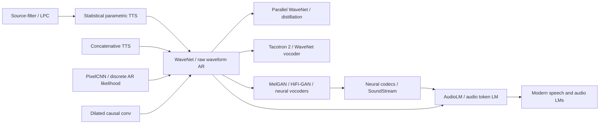

# WaveNet - The Neural Starting Point for Raw-Waveform Generation

> **On September 8, 2016, Google DeepMind introduced [WaveNet](https://arxiv.org/abs/1609.03499) with a beautifully stubborn premise: model raw audio directly, one sample at a time, as $p(x_t\mid x_{<t})$.** Speech synthesis at the time still lived between concatenative unit selection and statistical parametric vocoders; WaveNet skipped the hand-crafted acoustic-parameter bottleneck and asked a deep convolutional autoregressive model to predict more than 16,000 waveform values per second. The payoff was immediate: in English and Mandarin TTS, WaveNet cut the MOS gap between the best synthetic system and natural speech by 51% and 69%. The catch was just as important: sampling had to proceed sequentially, so the more human the sound became, the less deployable the model looked. That tension directly led to Parallel WaveNet, Tacotron 2's WaveNet vocoder, and the next decade of neural vocoders. WaveNet's lasting smell is that it made audio feel like pixels or text: a high-rate sequence that could be modeled directly, if the inductive bias was brave enough.

## TL;DR

WaveNet, written by van den Oord, Dieleman, Zen, and six co-authors at DeepMind / Google in 2016, changed speech synthesis from “predict acoustic parameters and let a vocoder reconstruct waveform” into direct maximum-likelihood modeling of raw waveform: $p(x\mid h)=\prod_t p(x_t\mid x_{<t},h)$. Its core recipe has three parts: causal convolutions prevent future leakage, exponentially dilated convolutions with dilation $1,2,4,\dots,512$ create a large receptive field without pooling away sample resolution, and a 256-way $\mu$-law softmax makes the next-sample distribution trainable. Global conditioning selects speaker identity; local conditioning injects linguistic features and $F_0$ for TTS. The failed baselines it beat were strong, not straw men: LSTM-RNN statistical parametric synthesis and HMM-driven concatenative synthesis. On Google's English and Mandarin voices, MOS moved from 3.67 / 3.86 to 4.21 in English and from 3.79 / 3.47 to 4.08 in Mandarin, shrinking the synthetic-to-natural gap by 51% and 69%. Later systems such as [AudioLM](../era5_genai_explosion/2023_audiolm.md) would decide that raw-waveform autoregression is too slow and move long-range audio generation into discrete token space; still, without WaveNet proving that neural networks can synthesize convincing waveform directly, Parallel WaveNet, Tacotron 2, HiFi-GAN, neural codecs, and modern speech/audio language models would have had a much weaker starting point. The hidden lesson is that high-fidelity generation sometimes begins not by designing a better hand-crafted intermediate representation, but by deleting the intermediate representation entirely.

---

## Historical Context

### Where TTS was stuck before 2016

Before WaveNet, speech synthesis was not an empty field waiting for neural networks to arrive. Google, HTS, Merlin-style pipelines, and commercial systems already produced usable TTS. The discomfort was that most systems lived between two imperfect extremes. The first was concatenative TTS: record a large database of human speech units, then select and splice units at synthesis time. Its advantage was strong local audio quality, because the waveform came from real recordings. Its weakness was rigidity: changing speaker, emotion, emphasis, speaking rate, or style often required recording another database, and coverage gaps or splice boundaries limited generalization.

The second was statistical parametric TTS: analyze speech into acoustic parameters such as spectral envelope, $F_0$, and aperiodicity; train an HMM, DNN, or LSTM-RNN to predict those parameters from linguistic features; then pass them through a vocoder. This route was lighter, more controllable, and easier to adapt across speakers. But it carried the familiar “vocoder sound” and oversmoothing. The WaveNet paper's background section stresses that classical speech models rely on fixed analysis windows, linear filtering, and Gaussian-process assumptions. Those assumptions make optimization tractable, but they discard stop consonants, breath, mouth noise, and transient details that listeners notice.

So the 2016 TTS conflict was not “can computers speak?” It was “can speech be both natural and controllable?” Concatenative systems were natural but heavy; parametric systems were flexible but muffled. WaveNet's shock was that it did not make another compromise between them. It deleted the vocoder-parameter middle layer and asked a neural network to generate the next waveform sample directly from text-derived conditions and previous samples.

### PixelCNN pushed generative modeling into raw audio

WaveNet's immediate ancestor was not a speech paper, but PixelRNN / PixelCNN from early 2016. van den Oord, Kalchbrenner, and Kavukcuoglu had shown that images could be treated as discrete pixel sequences and modeled as $p(x)=\prod_i p(x_i\mid x_{<i})$. The idea itself was not new; the new part was that deep convolutional structure, discrete softmax likelihood, and conditioning suddenly made the samples credible.

Porting the idea to audio multiplies the difficulty. An image may contain thousands or tens of thousands of pixels; one second of 16 kHz audio contains 16,000 time steps, and 24 kHz audio contains 24,000. A straightforward RNN would be painfully slow to train sample by sample; an ordinary causal convolution would need many layers to cover enough history. WaveNet's key engineering judgment was to use dilated causal convolution instead of recurrence: parallelize all known timesteps during training, and accept that generation remains sequential.

The “direct raw waveform” claim was counter-intuitive in the speech-signal-processing culture of the time. Speech researchers were trained to analyze first: spectrum, pitch, source-filter structure, cepstrum, MFCCs. WaveNet said: aside from receptive field and $\mu$-law coding, inject almost no speech-specific prior; let the model learn the nonlinear filter from data.

### The author team and the DeepMind context

The author list explains the hybrid flavor of the paper. Aäron van den Oord and Nal Kalchbrenner came from the PixelCNN / neural autoregressive modeling line; Sander Dieleman had deep experience in music and generative modeling; Heiga Zen and Andrew Senior came from Google speech and TTS systems; Alex Graves, Oriol Vinyals, Karen Simonyan, and Koray Kavukcuoglu brought sequence modeling, vision networks, and DeepMind engineering taste. WaveNet was neither a pure speech-lab paper nor a pure generative-modeling paper. It was a short circuit between Google's production speech stack and DeepMind's autoregressive generative modeling in 2016.

That explains the experimental style. The paper did not stop at a toy audio demo. It used Google's own English and Mandarin TTS data and compared against Google's strong LSTM-RNN statistical parametric and HMM-driven concatenative systems. Data, linguistic features, and test sentences were aligned as much as possible. In other words, WaveNet had to prove not merely “we can make interesting sounds,” but “under the evaluation rules of industrial TTS, this route beats the deployed families.”

### The industrial reaction at release

DeepMind's September 2016 blog framed WaveNet very effectively: first let readers hear parametric, concatenative, and WaveNet samples for the same text, then show the MOS gap. For most readers the equation mattered less than the fact that it did not sound like old machine speech. The blog also included babbling without text conditioning, speaker-ID control, and piano generation, making WaveNet feel less like a TTS module and more like a generic audio generator.

But the same blog admitted the central cost: sampling proceeds one point at a time and is computationally expensive. The 2016 WaveNet was more a proof that the route was right than a product-ready model. Production use in Google Assistant required the 2017 Parallel WaveNet work, where probability density distillation made generation more than 1000 times faster. That follow-up is why WaveNet became not only a stunning demo, but the starting point of industrial neural vocoders.

## Background and Motivation

### Problem definition

WaveNet's problem can be stated simply: **given previous audio samples and optional conditioning $h$, model the probability distribution of the next raw waveform sample directly**. The unconditional form is $p(x)=\prod_t p(x_t\mid x_{<t})$; the TTS form is $p(x\mid h)=\prod_t p(x_t\mid x_{<t},h)$, where $h$ may contain text-derived linguistic features, $F_0$, or speaker identity.

This problem has three hard parts. First, audio sampling rates make the sequences brutal compared with most NLP or vision workloads. Second, waveform detail is perceptually important, and a naive squared-error objective tends to average away sharp transients, making speech sound dull. Third, TTS is not only local audio quality: the model must pronounce text, keep prosody, and control speaker and style. WaveNet's design follows these constraints: use convolutions to parallelize long-sequence training, use categorical likelihood to avoid averaging, and use conditioning to inject controllable information.

### Core goal

WaveNet did not try to invent a complete end-to-end text front-end. The paper still uses existing text analysis and linguistic features, and its best TTS setting even relies on an external $F_0$ predictor. The real target is the last stage: replacing “predict acoustic parameters plus vocoder” with “a neural network is the waveform generator.” If that stage works, the TTS quality bottleneck moves from hand-designed vocoder assumptions to model capacity, conditioning information, and inference speed.

That is why the paper includes free-form speech, TTS, music, and TIMIT recognition. TTS is the main battlefield, showing that WaveNet can beat active system families. Free-form speech shows that one model can learn many speakers' raw acoustic traits. Music shows that the architecture is not tied to speech-specific assumptions. TIMIT shows that dilated-convolution raw-audio encoders can also support discriminative tasks. Together, the experiments say: WaveNet is not a narrow speech trick, but a general raw-audio modeling interface.

---

## Method Deep Dive

### Overall framework

WaveNet can be compressed into one probabilistic model: treat waveform $x_1,\dots,x_T$ as a discrete sequence and maximize the conditional likelihood of every sample from left to right. During training, the true history $x_{<t}$ is known, so predictions for all timesteps can be computed in parallel. During generation, the model must sample one point, feed it back, and then sample the next. This is both the beauty and the pain of WaveNet: training behaves like a convolutional network; sampling behaves like an extremely long language model.

| Module | WaveNet choice | Function |
|---|---|---|
| Probability factorization | $p(x)=\prod_t p(x_t\mid x_{<t})$ | directly model waveform likelihood |
| Causal structure | causal convolution | prevent prediction of $x_{t+1}$ from seeing the future |
| Long context | dilated convolution, $1,2,4,\dots,512$ | expand receptive field without downsampling |
| Output distribution | 256-way $\mu$-law softmax | avoid a 65,536-class 16-bit PCM output |
| Conditioning control | global / local conditioning | control speaker, text, $F_0$, and related signals |

The conceptual leap is replacing the “vocoder” with a conditional generative model. Traditional TTS predicts a lower-rate acoustic-parameter sequence and then lets a signal-processing module synthesize waveform. WaveNet feeds linguistic features and previous waveform samples into the network together and asks the network for the next-sample distribution. It is not fully end-to-end from characters to audio, but it turns the most perceptually sensitive stage into a learnable neural generator.

### Key Design 1: Causal convolution and autoregressive likelihood

**Function**: ensure that the model predicts future samples only from past samples while retaining convolutional parallelism during training. RNNs can also be autoregressive, but training them over tens of thousands of audio steps per second is expensive. Causal convolution shares kernels across positions and computes logits for all positions at once during training.

The autoregressive objective is $p(x)=\prod_{t=1}^{T}p(x_t\mid x_1,\dots,x_{t-1})$. With TTS conditioning it becomes $p(x\mid h)=\prod_t p(x_t\mid x_{<t},h)$. The conditioning variable $h$ is not cosmetic; it is the bridge that injects text, phones, durations, speaker identity, and $F_0$ into waveform space.

**Design rationale**: without causality, the network can cheat by seeing future samples during training and then fail at generation. With a naive stepwise RNN, training efficiency collapses. Causal convolution balances the two: strict generative ordering with GPU-friendly convolutional training.

### Key Design 2: Dilated convolution grows receptive field exponentially

**Function**: let the output see enough history without pooling or losing sample-level resolution. Ordinary causal convolution grows receptive field linearly with depth. Dilated convolution skips input positions at a fixed step; when dilation doubles as $1,2,4,\dots,512$, one block already covers 1024 samples.

| Structure | Receptive-field growth | Cost | Meaning for audio |
|---|---|---|---|
| ordinary causal conv | linear | many layers needed | hard to cover phoneme-scale context |
| large kernels | large in one step | more parameters and compute | less nonlinear and inefficient |
| pooling / stride | larger context | loses sample-level output | unsuitable for direct waveform generation |
| dilated causal conv | exponential | moderate compute | preserves resolution while covering longer history |

**Design rationale**: audio has local and cross-hundreds-of-milliseconds structure at the same time. Plosives, vowel formants, syllables, and pitch contours occupy different scales. Dilated convolution packs multiscale context into one fully convolutional network; it is the difference between “trainable” and “sounds like audio.”

### Key Design 3: $\mu$-law quantization and discrete softmax

**Function**: compress 16-bit PCM's 65,536 possible values into 256 nonlinear bins and predict them with a categorical softmax. The paper explicitly considers mixture-density-style outputs, but follows PixelCNN's lesson: discrete softmax is flexible and does not impose a Gaussian or unimodal shape on the sample distribution.

$\mu$-law companding is $f(x_t)=\operatorname{sign}(x_t)\frac{\ln(1+\mu |x_t|)}{\ln(1+\mu)}$ with $\mu=255$. It allocates more resolution to small amplitudes and compresses large amplitudes. For speech, the quantized reconstruction sounded close to the original.

| Output modeling route | Advantage | Problem | WaveNet judgment |
|---|---|---|---|
| 16-bit softmax | full PCM support | 65,536 classes per step | too heavy |
| Gaussian / MDN | continuous and compact | strong shape assumptions | audio detail can be wrong |
| 8-bit linear quantization | simple | poor small-signal detail | weaker speech quality |
| $\mu$-law 256-way softmax | flexible, trainable, perceptually reasonable | quantization ceiling remains | paper choice |

**Design rationale**: this step is easy to underplay. WaveNet does not regress a mean; it predicts a full discrete probability distribution. Sampling can preserve tiny stochasticity and sharp transients. Later vocoders would use mixture logistics, flows, GANs, or diffusion, but the lesson begins here: do not average away sound with ordinary MSE.

### Key Design 4: Gated activations, residual paths, and skip connections

**Function**: make a deep dilated-convolution stack trainable and let each layer modulate information flow. WaveNet uses the gated PixelCNN activation: $z=\tanh(W_f*x)\odot\sigma(W_g*x)$. The paper reports that this worked significantly better than ReLU in early audio-modeling experiments.

Residual connections carry information to the next layer, while skip connections send layer outputs toward the final head. Their role resembles ResNet in vision: depth is not just extra parameters, but a way to obtain a large receptive field and multiscale nonlinear combination. Without residual and skip paths, optimization would be slower and less stable.

```python
def wavenet_residual_block(x, cond, dilation):
    filtered = dilated_causal_conv(x, dilation, branch="filter") + project_filter(cond)
    gated = dilated_causal_conv(x, dilation, branch="gate") + project_gate(cond)
    z = tanh(filtered) * sigmoid(gated)
    skip = conv1x1(z, branch="skip")
    residual = conv1x1(z, branch="residual")
    return x + residual, skip

def sample(model, conditions, num_samples):
    waveform = []
    for _ in range(num_samples):
        logits = model(previous_samples=waveform, conditions=conditions)
        value = categorical_sample(softmax(logits[-1]))
        waveform.append(value)
    return waveform
```

**Design rationale**: audio's local structure is delicate. A plain ReLU stack can treat gating, amplitude, and phase relationships too crudely. The gated unit gives every layer a “how much should I write?” mechanism; residual and skip paths make the deep model optimizable. The result is closer to a trainable nonlinear filter bank than to a standard CNN classifier.

### Key Design 5: Global and local conditioning

**Function**: turn WaveNet from an unconditional sound generator into a controllable TTS and multi-speaker model. Global conditioning $h$ is a vector shared by the whole sequence, such as speaker ID; its projection is added to the filter and gate branches at every timestep. Local conditioning $h_t$ is a lower-rate time series, such as linguistic features or $F_0$; the paper upsamples it with transposed convolution to audio resolution, then injects it with $1\times1$ convolution into the gated unit.

| Conditioning type | Example | Injection | Problem solved |
|---|---|---|---|
| global conditioning | speaker ID | projected and broadcast to all timesteps | one model controls 109 speakers |
| local conditioning | linguistic features | learned upsampling then sample-level injection | make waveform say specified text |
| local + $F_0$ | predicted log $F_0$ | low-rate contour as extra condition | fix prosody that 240 ms receptive field misses |

**Design rationale**: an unconditional WaveNet can sound like speech, but it does not know what to say. Linguistic features make it read text, but prosody and stress can still be wrong. Conditioning decomposes content, speaker, and pitch contour, turning raw-waveform generation from random sampling into a controllable module.

### Training and generation path

WaveNet's training path is clean: $\mu$-law-quantize the real waveform, feed previous samples and conditions, and maximize categorical log-likelihood at every timestep. In the TTS experiments, input speech is 16 kHz; the English dataset has 24.6 hours and the Mandarin dataset has 34.8 hours; no post-processing is applied to WaveNet's generated audio. The free-form multi-speaker experiment uses VCTK with 44 hours and 109 speakers, with a receptive field around 300 ms; the TTS setting uses a 240 ms receptive field.

The generation path is the bottleneck: every new sample depends on the relevant generated history and cannot be parallelized like training. In the original paper this was acceptable because the goal was to prove naturalness. In production, it forced the follow-up wave of Parallel WaveNet, WaveRNN, flow vocoders, and GAN vocoders. This is WaveNet's central tension: it raised the quality ceiling and made inference speed the next visible problem.

---

## Failed Baselines

### Failed Baseline 1: The vocoder bottleneck in statistical parametric TTS

WaveNet's most direct target was LSTM-RNN statistical parametric TTS. This route was not weak in 2016: it was compact, fast, controllable, deployable, and already used deep networks to predict acoustic parameters. But it still compressed speech into vocoder parameters before reconstructing waveform. The paper's background section dissects the problem: fixed-window analysis misses short phones, linear filtering and Gaussian assumptions flatten the nonlinear shape of real speech, and oversmoothing makes generated speech sound muffled.

The failure of this family was not “it cannot speak,” but “it speaks too averaged.” If a parametric model is uncertain about a transient or high-frequency detail, mean prediction washes it out. The vocoder then turns the smoothed parameters into waveform, and listeners hear the layer in between. WaveNet bypasses that layer with sample-level categorical likelihood, preserving more local detail, breath, and mouth noise.

### Failed Baseline 2: The flexibility ceiling of concatenative TTS

HMM-driven unit-selection concatenative synthesis was the other strong baseline. It preserved natural local quality because its units came from real recordings; in English it reached MOS 3.86, above the LSTM-RNN baseline's 3.67. But its strength came from database coverage. To sound natural, the database must contain suitable units. Change speaker, emotion, style, or language, and the cost rises quickly.

WaveNet's win over this baseline matters because it did not win by recording a larger inventory. It won with a parameterized generative model. A speaker-conditioned WaveNet can model 109 VCTK speakers in one network; in TTS, conditions control text and pitch. This showed that naturalness and controllability did not have to belong to separate families forever.

### Failed Baseline 3: Short context in unconditional raw-audio generation

WaveNet also exposes a failure case of its own: without text conditioning, it generates speech-like babbling. Timbre, breath, mouth movement, and intonation can be realistic, but the words are invented and long-range semantics are unstable. The paper partly attributes this to receptive field: around 300 ms in the free-form speech experiment, enough for only the last 2-3 phonemes.

This is not a minor blemish; it is a structural limitation of raw-waveform autoregression. Sample space is too low-level, so model capacity is consumed first by local fidelity. Learning minute-scale semantics in the same sequence is extremely expensive. Later systems such as AudioLM, VALL-E, and MusicLM first discretize audio into lower-rate tokens and then use language models for long-range structure. That move directly repairs the short-context bottleneck WaveNet exposed.

### Failed Baseline 4: High quality versus real-time generation

WaveNet's final failure case comes from its own success: sample-by-sample autoregressive generation is too slow. Both the paper and blog acknowledge that every generated sample must be fed back into the network before predicting the next. For 16 kHz or 24 kHz audio, that means tens of thousands of strictly serial decisions per second. A research demo can wait; Google Assistant cannot.

This directly pushed Parallel WaveNet, WaveRNN, WaveGlow, MelGAN, HiFi-GAN, and related successors. They did not reject WaveNet's quality judgment. They accepted that the original inference path did not fit products. WaveNet is therefore a classic “prove the quality ceiling first, hand the speed debt to the next generation” paper.

| Failed route | Why it looked reasonable | Concrete problem | WaveNet's answer |
|---|---|---|---|
| LSTM-RNN parametric TTS | compact, controllable, deployable | vocoder artifacts and oversmoothing | directly model waveform distribution |
| concatenative TTS | local quality from real recordings | heavy database, hard style changes | learn controllable naturalness with conditions |
| unconditional waveform LM | no text labels required | babbling and short semantic horizon | constrain content with local conditioning |
| original autoregressive sampling | highest quality and exact likelihood | serial, slow, not real-time | later parallelize with distillation / GAN / flow |

## Key Experimental Data

### Experimental setup

WaveNet's experiments cover four task families. First, VCTK multi-speaker speech generation without text: 44 hours, 109 speakers, and speaker ID as the only global condition. Second, Google's English and Mandarin TTS: 24.6 hours for English and 34.8 hours for Mandarin, both from professional female speakers; WaveNet uses linguistic features as local conditioning and compares linguistic-only against linguistic plus $\log F_0$. Third, music modeling: about 200 hours of MagnaTagATune and about 60 hours of YouTube piano. Fourth, raw-audio phoneme recognition on TIMIT.

TTS is the main result. Evaluation uses blind crowdsourced subjective tests: 100 held-out sentences, eight native-speaker ratings per pair or stimulus, and roughly 40% of ratings excluded when headphones were not used. This matters because WaveNet's central claim is not an objective leaderboard, but perceived naturalness.

### Key numbers

| System | English MOS | Mandarin MOS | Note |
|---|---:|---:|---|
| LSTM-RNN parametric | 3.67 ± 0.098 | 3.79 ± 0.084 | strong statistical-parametric baseline |
| HMM-driven concatenative | 3.86 ± 0.137 | 3.47 ± 0.108 | strong unit-selection baseline |
| WaveNet (L+F) | 4.21 ± 0.081 | 4.08 ± 0.085 | linguistic features plus $F_0$ |
| Natural 8-bit $\mu$-law | 4.46 ± 0.067 | 4.25 ± 0.082 | same encoding family as WaveNet |
| Natural 16-bit PCM | 4.55 ± 0.075 | 4.21 ± 0.071 | original high-quality recording |

The memorable number is gap reduction. In English, the best old system is 0.69 MOS away from natural 16-bit PCM ($4.55-3.86$), while WaveNet is 0.34 away ($4.55-4.21$), a 51% reduction. In Mandarin, the best old system is 0.42 away from natural ($4.21-3.79$), while WaveNet is 0.13 away, a 69% reduction.

| Pairwise comparison | WaveNet or winner | Baseline | No preference |
|---|---:|---:|---:|
| English WaveNet (L+F) vs concatenative | 49.3 | 20.1 | 30.6 |
| English WaveNet (L+F) vs WaveNet (L) | 37.9 | 17.8 | 44.3 |
| Mandarin WaveNet (L+F) vs concatenative | 55.9 | 7.6 | 36.5 |
| Mandarin WaveNet (L+F) vs LSTM | 29.3 | 12.5 | 58.2 |

These pairwise numbers sharpen the MOS story: WaveNet is not merely nudging an average upward; listeners directly prefer it against older families. The Mandarin contrast with concatenative synthesis is especially large.

### How to read the numbers

First, WaveNet (L+F) is more stable than linguistic-only WaveNet, so $F_0$ is not a decorative condition. A 240 ms receptive field cannot fully cover long-range prosody; an external $F_0$ predictor models pitch contour at lower frequency and supplies what WaveNet misses.

Second, the small MOS gap between natural 8-bit $\mu$-law and 16-bit PCM supports the engineering decision to use $\mu$-law quantization. It is not lossless, but for the TTS target of the paper it is perceptually close enough.

Third, the music section is honest despite lacking a leaderboard: even with receptive fields of several seconds, the model does not enforce long-term consistency, and genre, instrumentation, volume, and quality drift across seconds. That failure becomes a core motivation for audio tokenization and hierarchical generation later.

Fourth, TIMIT 18.8 PER is not the paper's headline, but it shows that a dilated-convolution raw-audio encoder can support discriminative tasks too. Later wav2vec, HuBERT, and data2vec do not directly inherit WaveNet's architecture, but they share a belief: raw audio can enter neural networks before hand-crafted acoustic features.

---

## Idea Lineage

### Before: From source filters to pixel autoregression

WaveNet has two intellectual ancestors. On the speech side, it follows the long engineering tradition from Dudley's vocoder, source-filter models, LPC, HMM-based TTS, and statistical parametric synthesis. That tradition is interpretable, controllable, and deployable, but every stage compresses real waveform into human-designed acoustic parameters. On the generative-modeling side, PixelRNN / PixelCNN treats images as discrete sequences and models them one value at a time. WaveNet's move was to slam the second route into the perceptually hardest stage of the first.



### Now: The default question of neural vocoders

After WaveNet, the word “vocoder” changed meaning in deep learning. It no longer referred only to WORLD, STRAIGHT, Vocaine, and related signal-processing modules. It also meant a neural generator that turns mel spectrograms, linguistic features, or codec tokens into waveform. Tacotron 2 placed WaveNet at the final stage: a seq2seq front-end predicts an 80-dimensional mel spectrogram, and a WaveNet-like vocoder produces 24 kHz waveform. Parallel WaveNet made this route usable in Google Assistant. WaveRNN, WaveGlow, MelGAN, Parallel WaveGAN, and HiFi-GAN then competed on one question: how do we keep WaveNet's quality while escaping sample-by-sample generation?

The lineage is interesting because almost every successful successor changes one piece of WaveNet. WaveRNN changes computation structure. Parallel WaveNet changes sampling dependence. WaveGlow and FloWaveNet change the probability family. GAN vocoders change the training objective. Diffusion vocoders bring denoising into the story. But they keep WaveNet's central judgment: final waveform generation should no longer be monopolized by hand-crafted vocoders.

### After: From waveform to audio tokens

The more distant descendants are AudioLM, VALL-E, MusicLM, and SoundStorm. They no longer treat raw waveform as the main modeling space. Instead, they first compress audio into lower-rate discrete tokens using self-supervised speech models or neural codecs, then use language models for long-range structure. This can look like a rejection of WaveNet, but it is really an inheritance. WaveNet proved that sound can be handled by neural generative models directly; later token models simply admit that samples are not the best long-range language.

Historically, WaveNet is a necessary transition point. Without it, the field might have kept assuming that high-fidelity audio requires strong hand-designed vocoders. With it, later work could ask a freer question: among raw waveform, mel spectrograms, codec tokens, and semantic tokens, which representation is best for generation?

### Misreading: WaveNet did not solve end-to-end TTS

The most common misreading is to call WaveNet an end-to-end TTS solution. Strictly speaking, the paper's best TTS system still depends on text analysis, linguistic features, phone durations, and an external $F_0$ predictor. WaveNet solves waveform generation, not every stage from text to speech. Tacotron 2, FastSpeech, VITS, and later systems progressively neuralized more of the front end.

Another misreading is to say WaveNet matters simply because “sample-by-sample autoregression sounds good.” Autoregression did give exact likelihood and high quality, but it was also the bottleneck that made deployment hard. The durable part of WaveNet is not “generation must be sequential.” It is “a neural network can be responsible for waveform synthesis, and conditions can control it.” Later successful systems almost all try to keep the latter while deleting the former.

---

## Modern Perspective

### Judgments that survived

First, WaveNet's claim that neural networks can directly synthesize high-quality waveform has fully survived. Modern TTS, voice conversion, music generation, speech enhancement, codec decoders, and some end-to-end spoken-dialogue systems all assume that sound can be reconstructed by neural networks. Hand-crafted vocoders have not vanished, but they are no longer the only credible route.

Second, the conditioning interface survived. Whether the condition is linguistic features, a mel spectrogram, speaker embedding, style prompt, codec tokens, or a text description, modern systems still do the same thing: give the waveform generator a sufficiently informative control variable. WaveNet's global / local conditioning is an early clean version of this interface.

Third, the multiscale-convolution lesson survived. Later neural vocoders may not use WaveNet's exact dilation stack, but nearly all of them accept that audio requires simultaneous handling of local phase, periodicity, prosody, transients, and longer structure. HiFi-GAN's multi-period discriminator, BigVGAN's anti-aliased periodic activations, and diffusion vocoders' multiscale denoising all answer the same multitime-scale problem in different language.

### Assumptions that did not survive

1. **“Sample-by-sample autoregression is necessary for high-fidelity audio”**: Parallel WaveNet, WaveRNN, WaveGlow, MelGAN, HiFi-GAN, and diffusion vocoders later proved that high-quality waveform can be generated in parallel or semi-parallel form. Autoregression was the most reliable route in 2016, not a physical law.
2. **“256-class $\mu$-law is the future representation of audio”**: it was good enough for 2016 TTS, but later high-fidelity systems moved toward 16-bit / 24-bit waveform, mixture logistics, flows, GANs, or diffusion objectives. $\mu$-law was an engineering compromise, not an endpoint.
3. **“The text front-end can remain a hand-crafted feature layer”**: Tacotron, Tacotron 2, FastSpeech, VITS, and end-to-end speech systems progressively neuralized text-to-acoustic mapping. WaveNet's linguistic features quickly became a transitional artifact.
4. **“Raw waveform is the best universal space for audio generation”**: WaveNet is excellent for short-range fidelity, but AudioLM, SoundStream, EnCodec, and VALL-E show that long-range structure is better handled in discrete-token or latent space.

### If WaveNet were rewritten today

If WaveNet were rewritten in 2026, researchers probably would not use a 256-way $\mu$-law softmax as the main output, nor accept strictly sequential CPU/GPU sampling. A natural modern version would compress audio into multi-layer RVQ tokens with a neural codec, model long-range structure with a Transformer, Conformer, or Mamba-like backbone, reconstruct high-frequency detail with a diffusion / flow / GAN vocoder, and condition on speaker, style, emotion, language, and safety watermark signals.

But the core question would remain: **how can a model be reliably controlled by text or other conditions without losing perceptual detail?** WaveNet's answer was “model the waveform directly.” Today's answer is more layered: plan in token or latent space, reconstruct in waveform space. Either way, WaveNet remains the starting point that pulled the problem out of inherited signal-processing habits.

## Limitations and Future Directions

### Limitations admitted or exposed by the paper

- **Slow generation**: sample-by-sample synthesis cannot directly enter real-time products; both the paper and blog recognize this as the main engineering problem.
- **Insufficient long-range prosody**: the TTS receptive field is only 240 ms, and linguistic features alone can stress the wrong words, requiring external $F_0$ conditioning.
- **Unconditional speech lacks language**: the model can generate human-like babbling, but not long utterances with stable semantics.
- **Music long-term structure is unstable**: even with receptive fields of several seconds, genre, instrumentation, volume, and quality drift.
- **External text front-end dependency**: the paper does not solve grapheme-to-phoneme conversion, duration modeling, prosody modeling, text normalization, or the complete TTS front end.

### Limitations visible from 2026

- **Narrow evaluation**: MOS captures naturalness, but not speaker similarity, intelligibility, robustness, emotion control, or safety risk in a systematic way.
- **Non-reproducible core data**: the central Google TTS datasets are not public, so the academic community cannot fully reproduce the setup.
- **No safety framing**: the 2016 paper predates today's voice-cloning and deepfake context, so watermarking, detection, consent, and misuse are absent.
- **Representation is too low-level**: sample-level modeling works for local fidelity, but forcing semantics, prosody, identity, and recording conditions into one sequence makes learning unnecessarily hard.

### Improvements validated by later work

- **Parallelization**: Parallel WaveNet uses probability density distillation to make generation more than 1000 times faster.
- **Neuralized front end**: Tacotron 2 predicts mel spectrograms with a seq2seq model, then uses a WaveNet-like vocoder.
- **Lightweight autoregression**: WaveRNN redesigns computation to make autoregressive vocoding closer to real time.
- **GAN / flow / diffusion vocoders**: HiFi-GAN, WaveGlow, Parallel WaveGAN, and related models push speed and quality into product territory.
- **Discrete tokenization**: SoundStream, EnCodec, AudioLM, and VALL-E move long-range audio generation from sample space into codec or semantic-token space.

## Related Work and Insights

### Relationship to neighboring papers

| Neighbor | Relationship | Lesson |
|---|---|---|
| PixelCNN | ports discrete autoregressive likelihood from images to audio | a good generative interface can cross modalities |
| ResNet | residual paths make deep dilated stacks trainable | structural optimization often precedes scale |
| Tacotron 2 | connects a WaveNet-like vocoder to a seq2seq acoustic model | modular composition lands faster than end-to-end slogans |
| Parallel WaveNet | uses distillation to solve sampling speed | a research model and production model often require a second key paper |
| AudioLM | moves from raw waveform to audio tokens | representation choice governs long-range generation |

WaveNet's most useful lesson today is not to treat intermediate representations as natural law. Speech once assumed that parameters had to be hand-designed before waveform synthesis; WaveNet showed that this layer could be deleted. Later audio-token models showed that raw waveform is not always optimal either. The real research question is not loyalty to one representation, but whether a representation places the structure of interest at the right time scale.

## Resources

- Paper: [WaveNet: A Generative Model for Raw Audio](https://arxiv.org/abs/1609.03499)
- DeepMind launch blog: [WaveNet: a generative model for raw audio](https://deepmind.google/discover/blog/wavenet-a-generative-model-for-raw-audio/)
- Production follow-up blog: [High-fidelity speech synthesis with WaveNet](https://deepmind.google/discover/blog/high-fidelity-speech-synthesis-with-wavenet/)
- Follow-up reading: [Parallel WaveNet](https://arxiv.org/abs/1711.10433), [Tacotron 2](https://arxiv.org/abs/1712.05884), [HiFi-GAN](https://arxiv.org/abs/2010.05646), [AudioLM](https://arxiv.org/abs/2209.03143)
- Related deep notes: [AudioLM](../era5_genai_explosion/2023_audiolm.md), [wav2vec 2.0](../era4_foundation_models/2020_wav2vec2.md)
- 🌐 [中文版](/era2_deep_renaissance/2016_wavenet/)


---

> 🌐 [中文版](/era2_deep_renaissance/2016_wavenet/) · 📚 awesome-papers project · CC-BY-NC