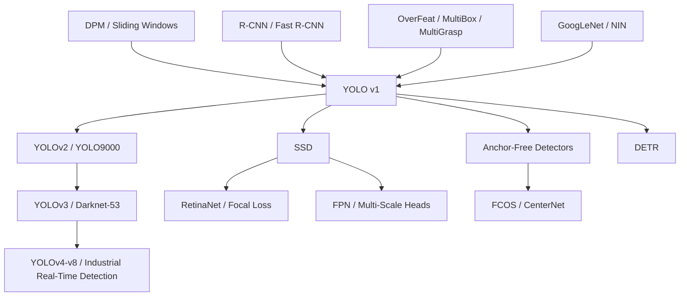

# YOLO — Turning Object Detection into a Single Real-Time Regression

> **On June 8, 2015, Joseph Redmon, Santosh Divvala, Ross Girshick, and Ali Farhadi uploaded [arXiv:1506.02640](https://arxiv.org/abs/1506.02640), later published at CVPR 2016.** The strongest detectors of the moment still passed an image through proposals, CNN features, SVMs, box regressors, and non-max suppression. YOLO made a deliberately blunt bet: resize the whole image to 448×448, run one network once, and regress a 7×7×30 tensor of boxes and class scores. It did not win the pure-accuracy leaderboard. It did something more durable: it made general object detection run at 45 FPS, with Fast YOLO reaching 155 FPS, and forced the field to treat detection as a real-time system problem rather than an offline recognition pipeline.

## TL;DR

YOLO, published at CVPR 2016 by Joseph Redmon, Santosh Divvala, Ross Girshick, and Ali Farhadi, rewrote object detection from a proposal-classifier-postprocess pipeline into a single forward regression problem. A 448×448 image becomes an $S\times S\times(B\cdot5+C)$ prediction tensor; on PASCAL VOC this is $7\times7\times30$, and class-specific confidence is obtained from $\Pr(\mathrm{Class}_i|\mathrm{Object})\Pr(\mathrm{Object})\mathrm{IoU}$. It did not beat the best two-stage detectors on raw accuracy: on VOC 2007, YOLO reached 63.4 mAP at 45 FPS and Fast YOLO 52.7 mAP at 155 FPS, while Fast R-CNN reached 70.0 mAP at only 0.5 FPS and Faster R-CNN VGG-16 reached 73.2 mAP at 7 FPS. The trade was explicit: give up some localization precision to make general detection truly real time.

Its long-term impact is larger than “a fast but rough detector.” YOLO inherits the full-image feature revolution made visible by [AlexNet](2012_alexnet.md) and [ResNet](2015_resnet.md), then passes a single-stage design pressure into [SSD](https://arxiv.org/abs/1512.02325), RetinaNet, YOLOv2/v3/v4/v5/v8, anchor-free detectors, and eventually DETR-style attempts to remove hand-built detection machinery. The hidden lesson is almost paradoxical: the parts of YOLO v1 that aged worst, such as the coarse grid and squared-error loss, are also what made its argument unmistakable. Detection could be designed from the beginning around latency, global context, and one end-to-end model.

---

## Historical Context

### In 2015, detection was accurate but not yet a real-time system

Before YOLO, object detection had already been half-rewritten by deep learning. R-CNN showed in 2014 that ImageNet-pretrained CNN features could beat DPM by a large margin. Fast R-CNN reduced the waste of running a CNN independently on every proposal. Faster R-CNN then replaced Selective Search with a Region Proposal Network. By accuracy, this line was clearly winning: on PASCAL VOC, two-stage detectors had become the default serious detector family.

By system shape, however, detection still did not look like a real-time visual module. R-CNN was a composition of Selective Search, CNN features, SVMs, box regression, and NMS, often taking tens of seconds per image. Fast R-CNN shared CNN computation but still waited for Selective Search proposals. Faster R-CNN moved proposal generation into the network, yet the high-accuracy VGG-16 version in YOLO's comparison still ran at only 7 FPS. For driving, robotics, camera interaction, and assistive devices, these were strong scores but not yet "the frame arrives and the system reacts." 

YOLO's historical value sits exactly there. It did not merely shave time from the same pipeline. It asked a harder interface question: **can detection be written from the beginning as a full-image function?** One image in, all boxes and classes out; no external proposals, no per-class detector, no string of separately trained modules. It was a rewrite of the detection interface.

### Why the R-CNN route felt so natural

YOLO's radicalness only becomes clear if we first grant how reasonable the R-CNN route was. At the time, proposals were not considered a nuisance; they were structure. Selective Search or Edge Boxes could shrink the search space from all positions and scales to roughly 2,000 plausible regions, and the classification CNN could reuse the mature ImageNet recipe.

| Predecessor route | What it solved | What it left open | YOLO's response |
|-------------------|----------------|-------------------|-----------------|
| DPM / HOG parts | interpretable parts and sliding-window detection | fixed features, speed and accuracy bottlenecks | learn features with CNNs and replace window enumeration with one forward pass |
| R-CNN | CNN features make proposal classification strong | multi-stage, slow, separately trained components | merge proposals, classification, and regression into one network |
| Fast R-CNN | shared convolutional features make classification much faster | still depends on external proposals | remove the Selective Search entry point |
| Faster R-CNN | RPN makes proposals neural | high-accuracy models remain non-real-time and two-stage | trade proposal refinement for grid-based direct regression |
| OverFeat / MultiBox | CNNs can localize or propose boxes | not complete general-purpose detection systems | predict boxes, confidence, and classes together |

This table does not mean the predecessors were wrong. Quite the opposite: each step was reasonable and gave YOLO components to reuse, including CNN representation, box regression, NMS, the idea of end-to-end training, and a GPU engineering stack. YOLO's breakthrough was not inventing detection from nothing. It reordered the pieces so that speed became a first-class structural principle.

### The engineering temperament behind the paper

The author combination matters. Joseph Redmon, at the University of Washington, built and maintained Darknet, and the paper has a strongly systems-oriented implementation style. Ali Farhadi was tied closely to the UW / Allen Institute for AI vision ecosystem. Ross Girshick was a central author of R-CNN and Fast R-CNN, so YOLO was not an outsider shouting at the R-CNN line; it was also an internal simplification impulse from within the detection community.

That background explains the paper's tone. YOLO does not sell itself as a complicated theory. It shows a blunt system interface: resize, single network, threshold. It openly admits that it is not the highest-accuracy detector and even dedicates an error analysis to its localization failures. But it also shows the complementary side: Fast R-CNN makes more background false positives, and combining YOLO with Fast R-CNN raises 71.8 mAP to 75.0. The paper is unusually honest about both its weakness and its usefulness.

### Why the title worked

"You Only Look Once" is an unusually good title because it is not merely branding; it is the method definition. DPM looks at many windows, R-CNN looks at many proposals, Fast R-CNN first waits for proposals, and Faster R-CNN still couples proposal generation with a detection head. YOLO compresses the whole detection problem into one full-image evaluation. Before seeing the architecture diagram, the reader already knows the design philosophy.

That is also why YOLO quickly escaped the original paper and became the name of a long-running engineering lineage. YOLOv2, YOLOv3, YOLOv4, YOLOv5, and YOLOv8 differ substantially from v1 in details, maintainers, and codebases, but the "only look once" pressure remains: a detector should be designed around real-time constraints first, then optimized for accuracy inside that constraint.

## Background and Motivation

### From candidate enumeration to full-image function

The traditional detection instinct is enumeration: enumerate windows, proposals, scales, categories, and then merge the results by post-processing. This is safe because it decomposes detection into familiar subproblems, but it creates structural overhead. As long as proposal generation and classification are separate stages, latency is hard to remove; as long as every candidate box is scored separately, the model has limited access to global context about which objects coexist and which background patches should remain background.

YOLO's motivation is to treat detection as a function from an image to structured output. A grid cell owns the object center, a box predictor owns coordinates and confidence, and class probabilities own category identity; all predictions share full-image features. The cost is real: the output space is coarsely coded and struggles with dense small objects. The benefit is equally direct: the model sees the full scene, inference needs one network evaluation, and the training objective can be written as one end-to-end loss.

### Speed as a method-level constraint

Many papers put speed at the end as an engineering optimization. YOLO puts speed at the beginning as part of the method. The meaning of 45 FPS and 155 FPS is not merely "fast"; it moves detection from offline benchmarks into interactive systems. A 0.5 FPS detector can annotate images offline. A 45 FPS detector can run on a webcam, a robot, or a vehicle video stream. User experience and deployment context become part of model design.

This is the real disagreement between YOLO and the strongest contemporary detectors. YOLO does not pretend mAP is unimportant; it argues that mAP is not the only axis. Early YOLO's accuracy sacrifice was real, and its localization errors were visible. But it introduced a new question: **how good can general detection be under interactive latency?** Later single-stage detectors, mobile detectors, and industrial real-time detection frameworks all continue along that axis.

---

## Method Deep Dive

### Overall framework

YOLO v1's framework can be compressed into one sentence: **divide the image into a fixed grid, let each grid cell directly predict a small number of bounding boxes, box confidence, and conditional class probabilities, then combine those quantities into class-specific detection scores.** For PASCAL VOC, the setting is $S=7, B=2, C=20$, so each image produces 7×7×30 numbers: 98 candidate boxes plus 20 conditional class probabilities per cell.

$$
\mathbf{y}\in\mathbb{R}^{S\times S\times (B\cdot 5 + C)}
\quad\Rightarrow\quad
\mathbb{R}^{7\times 7\times 30}\ \text{on PASCAL VOC}
$$

| Stage | YOLO v1 choice | Function |
|-------|----------------|----------|
| input | 448×448 RGB image | preserve finer localization information than ImageNet 224 |
| full-image backbone | 24 conv + 2 FC | extract global context in one forward pass |
| grid output | 7×7 cells | assign responsibility by object center |
| box predictors | 2 boxes per cell | predict position, size, and objectness / IoU |
| scoring + NMS | confidence threshold + optional NMS | remove low-confidence boxes; NMS adds roughly 2-3 mAP |

The core is not merely "remove proposals." All detection decisions share the same full-image feature map. When a cell predicts a box, it does not only see a local patch; through late features it has access to scene-level context. This helps YOLO make fewer background false positives, but the coarse final grid and limited per-cell capacity hurt small objects and precise localization.

### Design 1: 7×7 grid responsibility — hard-coding detection into 49 positions

**Function**: simplify the question "which predictor owns which object?" into one rule: if an object's center falls inside a grid cell, that cell is responsible for detecting the object.

The rule is crude, but it matters. Traditional detectors search over continuous position, scale, and aspect ratio. YOLO discretizes location responsibility into 49 cells and lets each cell predict 2 boxes. The image therefore has only 98 box predictions, not roughly 2,000 Selective Search proposals as in R-CNN.

| Output component | Count | Meaning | Constraint |
|------------------|-------|---------|------------|
| $x,y$ | 2 per box | box center offset relative to cell bounds | normalized to 0-1 |
| $w,h$ | 2 per box | box width and height relative to the whole image | normalized to 0-1; square root used in training |
| confidence | 1 per box | objectness times box quality | target is $\Pr(\mathrm{Object})\cdot\mathrm{IoU}$ |
| class probabilities | 20 per cell | conditional class distribution | one class distribution per cell |
| final tensor | $7\times7\times30$ | all detection quantities for the image | fixed shape, very fast |

**Design rationale**: this is a strong spatial prior. It sacrifices flexibility for speed, simplicity, and end-to-end training. Many YOLO v1 failures come from exactly here: two small object centers in the same cell, or different categories inside one cell, exceed the model's representational capacity. But this same hard constraint made detection look like a single dense prediction problem for the first time.

### Design 2: Confidence and class factorization — one multiplication for “what” and “how well localized”

**Function**: each box predicts confidence, and each cell predicts conditional class probabilities; at test time the two are multiplied into class-specific confidence for every box.

$$
\Pr(\mathrm{Class}_i\mid\mathrm{Object})\cdot
\Pr(\mathrm{Object})\cdot\mathrm{IoU}^{\mathrm{truth}}_{\mathrm{pred}}
=
\Pr(\mathrm{Class}_i)\cdot\mathrm{IoU}^{\mathrm{truth}}_{\mathrm{pred}}
$$

This formula binds classification and localization together. A box with a high class probability but low objectness / IoU confidence still receives a low final score; a box that looks object-like but has uncertain class identity also does not become a strong detection.

| Score term | Predicted by | Supervision | Role at inference |
|------------|--------------|-------------|-------------------|
| $\Pr(\mathrm{Object})\cdot\mathrm{IoU}$ | each box predictor | close to IoU for object boxes, zero for no-object boxes | decide whether the box should survive |
| $\Pr(\mathrm{Class}_i\mid\mathrm{Object})$ | each cell | classification error penalized only for object cells | assign category to a box |
| class-specific confidence | product of the two | not directly supervised alone | final ranking, thresholding, and NMS score |
| background suppression | low confidence learned from many no-object cells | abundant no-object cells | reduce background false positives |

**Design rationale**: R-CNN-style systems often separate "is this a good proposal," "which class is it," and "how should the box move" into different modules. YOLO compresses them into one tensor. This is less precise than two-stage detection, but it lets every prediction share full-image context. The paper's error analysis, where Fast R-CNN has many more background false positives, is exactly where this choice becomes useful.

### Design 3: Multi-part sum-squared loss — an imperfect but trainable detection objective

**Function**: train coordinates, sizes, confidence, and class probabilities with a weighted squared-error objective. The paper explicitly admits that sum-squared error does not perfectly match average precision, but it is easy to optimize and fits the Darknet engineering stack of the time.

$$
\begin{aligned}
\mathcal{L}=&\lambda_{coord}\sum_{i,j}\mathbb{1}^{obj}_{ij}\left[(x_i-\hat{x}_i)^2+(y_i-\hat{y}_i)^2\right] \\
&+\lambda_{coord}\sum_{i,j}\mathbb{1}^{obj}_{ij}\left[(\sqrt{w_i}-\sqrt{\hat{w}_i})^2+(\sqrt{h_i}-\sqrt{\hat{h}_i})^2\right] \\
&+\sum_{i,j}\mathbb{1}^{obj}_{ij}(C_i-\hat{C}_i)^2
+\lambda_{noobj}\sum_{i,j}\mathbb{1}^{noobj}_{ij}(C_i-\hat{C}_i)^2 \\
&+\sum_i\mathbb{1}^{obj}_{i}\sum_c(p_i(c)-\hat{p}_i(c))^2
\end{aligned}
$$

| Loss part | Weight | Problem addressed | Side effect |
|-----------|--------|-------------------|-------------|
| coordinate $x,y$ | $\lambda_{coord}=5$ | increase localization-gradient weight | still not an IoU loss |
| size $\sqrt{w},\sqrt{h}$ | $\lambda_{coord}=5$ | make small-box errors matter more | only an approximate correction |
| object confidence | 1 | learn whether the box aligns with an object | entangled with coordinate regression |
| no-object confidence | $\lambda_{noobj}=0.5$ | stop the many background cells from dominating training | foreground/background imbalance remains |
| class probability | 1, object cells only | avoid training categories on background cells | one class distribution per cell |

During training, every object cell assigns responsibility to the box predictor with the highest current IoU with the ground-truth box. This responsibility assignment encourages the two predictors to specialize in certain sizes, aspect ratios, or classes. It is not as systematic as anchor matching, but it already foreshadows the positive/negative assignment problem in later dense detectors.

**Design rationale**: YOLO's loss is an engineering compromise, not the final answer. It forces detection into a differentiable regression frame and leaves a huge surface for later improvement: anchors, focal loss, GIoU/DIoU/CIoU, label assignment, and objectness calibration can all be read as repairs to this plain objective.

### Design 4: Darknet backbone — GoogLeNet flavor, subtractive for speed

**Function**: use a CNN designed for detection speed rather than a heavy VGG-style backbone. YOLO is inspired by GoogLeNet but does not use Inception modules; it alternates $1\times1$ reduction layers and $3\times3$ convolutions. Standard YOLO has 24 convolutional layers and 2 fully connected layers, while Fast YOLO has only 9 convolutional layers.

```python
def yolo_v1_head(features, grid=7, boxes=2, classes=20):
    hidden = leaky_relu(linear(flatten(features), 4096), negative_slope=0.1)
    hidden = dropout(hidden, p=0.5)
    raw = linear(hidden, grid * grid * (boxes * 5 + classes))
    return raw.reshape(grid, grid, boxes * 5 + classes)
```

The pseudocode omits the 24-layer convolutional backbone, but it preserves an important historical detail of YOLO v1: the final prediction head still uses fully connected layers. Modern YOLO-family models are mostly fully convolutional and multi-scale. v1 sits in the transition period when classification networks were still being reshaped into detection networks. It is radical in interface, but still carries many 2014-2015 CNN engineering traces.

**Design rationale**: YOLO with VGG-16 reaches 66.4 mAP on VOC 2007, but runs at only 21 FPS. Standard YOLO drops to 63.4 mAP and runs at 45 FPS. The paper puts its main emphasis on the latter because the claim is not "highest mAP on the same hardware"; it is "real-time general-purpose detection is possible."

### Training recipe and inference path

YOLO's training recipe is very 2015: ImageNet pretraining, SGD, momentum, weight decay, a hand-written learning-rate schedule, dropout, and strong data augmentation. It has no BatchNorm, no anchor boxes, no focal loss, and no multi-scale feature pyramid.

| Item | Setting | Note |
|------|---------|------|
| Framework | Darknet | Redmon's C framework |
| Pretraining | first 20 conv layers, 224×224 ImageNet | about one week, 88% single-crop top-5 |
| Detection input | 448×448 | higher resolution for localization |
| Dataset | VOC 2007 + 2012 train/val | VOC 2007 test is added when evaluating VOC 2012 |
| Epochs | about 135 | 75 + 30 + 30 main phases |
| Batch / momentum / decay | 64 / 0.9 / 0.0005 | standard SGD recipe |
| LR schedule | warmup 1e-3→1e-2, then 1e-2 / 1e-3 / 1e-4 | high LR from step 0 can diverge |
| Regularization | dropout 0.5 + scaling/translation/HSV jitter | fight overfitting on small VOC data |
| Activation | final linear, leaky ReLU 0.1 elsewhere | avoid ordinary ReLU dead regions |
| Inference | single forward + threshold + optional NMS | NMS adds roughly 2-3 mAP |

From a modern perspective the recipe is plain, even fragile. But it is enough to support the paper's central claim. YOLO does not win by piling on training tricks. It wins by redefining the computation graph of detection. It moves "fast" from post-hoc optimization into the architecture itself, and that is the part real-time detectors inherit for the next decade.

---

## Failed Baselines

### The opponents YOLO redefined

YOLO's failed-baseline story cannot be read only as an mAP ranking. It did not beat Fast R-CNN or Faster R-CNN on pure accuracy. What it beat was the default assumption that general-purpose detection had to be slow. Table 1 makes the trade-off explicit: Fast R-CNN gets 70.0 mAP but runs at 0.5 FPS; Faster R-CNN VGG-16 gets 73.2 mAP but runs at 7 FPS; YOLO's 63.4 mAP is not the top score, but it runs at 45 FPS.

| Opponent | Strength at the time | Exposed problem | How YOLO contrasts it |
|----------|----------------------|-----------------|-----------------------|
| 30Hz / 100Hz DPM | genuinely real-time and mature engineering | only 26.1 / 16.0 mAP | Fast YOLO reaches 155 FPS and 52.7 mAP, more than double the accuracy |
| R-CNN | high accuracy from CNN features | over 40 seconds per image, long pipeline | one forward pass, no per-proposal CNN |
| Fast R-CNN | 70.0 mAP on VOC 2007 | Selective Search keeps it at 0.5 FPS | YOLO loses 6.6 mAP but is about 90× faster |
| Faster R-CNN VGG-16 | 73.2 mAP with neural proposals | 7 FPS, still below real-time | YOLO loses 9.8 mAP but crosses the real-time threshold |
| YOLO VGG-16 | 66.4 mAP, higher than standard YOLO | 21 FPS, not real-time | backbone choice must obey the latency goal |

The important part of this table is not any single number, but the contrast between failure modes. Two-stage detectors fail on latency and modular complexity. YOLO fails on localization precision and small-object recall. The paper does not hide the latter; it trades it for a new design coordinate system.

### Who YOLO lost to, and why

If the question is only "who has higher mAP," YOLO v1 clearly loses to Fast R-CNN and Faster R-CNN. The reason is not mysterious. Two-stage detectors first generate candidate regions, then classify and refine each region carefully. YOLO uses a 7×7 grid and two boxes per cell to make all predictions at once. Its output budget is tight and its localization grid is coarse.

| YOLO failure point | Direct cause | Manifestation in the paper | Later repair route |
|--------------------|--------------|----------------------------|-------------------|
| many localization errors | 7×7 grid plus coarse features | localization is the largest error source in the diagnosis | anchors, multi-scale heads, IoU losses, feature pyramids |
| weak small-object performance | one cell has limited boxes and one class distribution | birds, bottles, sheep, tv/monitor lose points | SSD multi-scale, FPN, PAN, anchor-free assignment |
| crowded multi-object cases | responsibility is determined by object center | several objects in one cell are hard to express | denser grids, multi-anchor designs, set prediction |
| loss not aligned with AP | squared error is only a proxy | large and small boxes receive poorly matched penalties | focal loss, GIoU/DIoU/CIoU, quality focal loss |

This is also the difference between YOLO v1 and later YOLO-family models. Later YOLOv2/v3/v4/v5/v8 inherit the single-stage real-time philosophy, not the exact 7×7 grid and squared-error objective. v1 is closer to a manifesto: the direction is right, but many first-version mechanisms will be replaced.

### Failures the paper admits itself

YOLO's limitations section is unusually direct. It says each grid cell predicts only two boxes and one set of class probabilities, which limits how many nearby objects the model can predict; it struggles with groups of small objects such as flocks of birds; because it learns box shapes from data, it has trouble with unusual aspect ratios and configurations; and although the loss approximates detection performance, the same squared error has very different IoU consequences for large and small boxes.

Those admissions matter because they almost line up with the next decade of detection research. Small objects, multi-scale prediction, label assignment, IoU-aligned losses, foreground/background imbalance, and replacements for NMS all become central dense-detection topics. YOLO v1's value is not that it solved them. It exposed them inside a minimal system, making every later repair easier to locate.

### Complementarity, not total victory

The most interesting experiment is not YOLO versus Fast R-CNN alone, but the combination of the two. Fast R-CNN localizes better but makes more background false positives. YOLO localizes more coarsely but sees the full image and is more conservative on background. The paper uses YOLO as a rescoring signal for Fast R-CNN detections and raises the best Fast R-CNN on VOC 2007 from 71.8 mAP to 75.0, a 3.2-point gain. Combining Fast R-CNN with other Fast R-CNN variants only adds 0.3 to 0.6.

This result shows that YOLO's failure is not simply "worse everywhere." It has a different error distribution: more cautious about background, rougher about location. A useful failed baseline often does not fail completely; it reveals a new axis. YOLO is that kind of case.

## Key Experimental Data

### VOC 2007 speed / accuracy trade-off

Table 1 is the central empirical table for understanding YOLO. It puts every detector on both mAP and FPS, rather than reading the leaderboard as accuracy alone.

| Model | Training data | mAP | FPS |
|-------|---------------|-----|-----|
| 100Hz DPM | VOC 2007 | 16.0 | 100 |
| 30Hz DPM | VOC 2007 | 26.1 | 30 |
| Fast YOLO | VOC 2007+2012 | 52.7 | 155 |
| YOLO | VOC 2007+2012 | 63.4 | 45 |
| Fastest DPM | VOC 2007 | 30.4 | 15 |
| Fast R-CNN | VOC 2007+2012 | 70.0 | 0.5 |
| Faster R-CNN VGG-16 | VOC 2007+2012 | 73.2 | 7 |
| YOLO VGG-16 | VOC 2007+2012 | 66.4 | 21 |

The numbers support two claims. First, Fast YOLO is the fastest general detector reported on PASCAL and is more than twice as accurate as earlier real-time detectors. Second, standard YOLO is much slower than Fast YOLO but still above the real-time threshold while reaching 63.4 mAP. It puts "real-time" and "usable accuracy" into the same general-purpose detection model.

### Error analysis: localization errors versus background errors

YOLO uses the detector diagnosis tools of Hoiem and colleagues to break top detections on VOC 2007 into error types. The result is distinctive: localization errors account for more of YOLO's errors than all other sources combined; Fast R-CNN has far fewer localization errors but many more background false positives. The paper gives Fast R-CNN's background false-positive rate as 13.6% of top detections, almost three times YOLO's rate.

| Error type | YOLO tendency | Fast R-CNN tendency | Explanation |
|------------|---------------|--------------------|-------------|
| localization | main error source | much lower | YOLO's grid and direct regression are coarse |
| background | much lower | 13.6% of top detections are background false positives | YOLO sees full-image context; proposal detectors can misread local regions |
| similar / other | not the main story | not the main story | category confusion is not YOLO's central bottleneck |

This analysis sharpens YOLO's identity. It is not "a little worse everywhere." It is faster and better at rejecting background, but rougher in box placement. That is why it can improve Fast R-CNN when used for rescoring.

### VOC 2012 and model combination

On VOC 2012, YOLO alone reaches 57.9 mAP, roughly near original R-CNN VGG territory and below the strongest methods of the moment. The paper does not hide this. It emphasizes that YOLO is the only real-time detector in the leaderboard comparison and shows that Fast R-CNN + YOLO improves Fast R-CNN by 2.3 points, moving it up five places on the public leaderboard.

| Experiment | Baseline | With YOLO | Gain |
|------------|----------|-----------|------|
| VOC 2007 best Fast R-CNN | 71.8 mAP | 75.0 mAP | +3.2 |
| VOC 2007 Fast R-CNN variants ensemble | 71.8 mAP | 72.1-72.4 mAP | +0.3 to +0.6 |
| VOC 2012 YOLO single model | 57.9 mAP | not applicable | single model below SOTA |
| VOC 2012 Fast R-CNN + YOLO | Fast R-CNN | Fast R-CNN + YOLO | +2.3 |

This shows that YOLO's value is not only speed; it is also a different error profile. Even when one ignores YOLO's real-time speed and uses it as another detector in an ensemble, it contributes information that other Fast R-CNN variants do not.

### Generalization to artwork

The final experimental block is often overlooked, but it matters for understanding YOLO. The paper transfers person detection from natural images to artwork. R-CNN is strong on VOC 2007 but collapses on the Picasso dataset. DPM degrades less because its spatial shape model transfers better. YOLO combines reasonably strong VOC AP with better cross-domain robustness.

| Model | VOC 2007 person AP | Picasso AP | Picasso best F1 | People-Art AP |
|-------|--------------------|------------|-----------------|---------------|
| YOLO | 59.2 | 53.3 | 0.590 | 45 |
| R-CNN | 54.2 | 10.4 | 0.226 | 26 |
| DPM | 43.2 | 37.8 | 0.458 | 32 |

This result supports a deeper claim in the paper: because YOLO sees the whole image, it learns object size, shape, and contextual relationships, not only local texture inside a proposal. Artwork and natural photographs differ sharply at the pixel level, but the shapes, proportions, and contexts of people still transfer. Full-image modeling helps YOLO avoid the collapse R-CNN suffers in this setting.

---

## Idea Lineage

### Before YOLO: from sliding windows and proposals to “can a network predict boxes directly?”

YOLO's ancestry is not a single line. It inherits DPM / sliding-window detection's obsession with searching image space; it inherits the R-CNN family's confidence in CNN representation and box regression; and it absorbs from OverFeat, MultiBox, and MultiGrasp the possibility that a neural network can directly emit locations. The real split is that most predecessors still decompose detection into modules, while YOLO compresses the modules into one tensor.

| Source idea | Core contribution | What YOLO inherits | What YOLO discards |
|-------------|-------------------|--------------------|--------------------|
| DPM / sliding window | dense search over position and scale | detection as a spatial function | hand-built HOG parts and exhaustive windows |
| R-CNN | proposals plus CNN features plus box regression | CNN representation and coordinate regression | Selective Search, SVMs, staged training |
| Fast / Faster R-CNN | shared convolutional features and neural proposals | the move toward end-to-end detection | two-stage refinement |
| OverFeat | CNNs can classify, localize, and detect | localization can be learned by CNNs | sliding-window / disjoint-pipeline flavor |
| MultiBox | CNNs predict candidate boxes | direct box prediction | not a complete multi-class detector |
| MultiGrasp | grid-style grasp regression | fixed spatial-grid regression | the simpler one-grasp setting |
| Network in Network / GoogLeNet | 1×1 reduction and lightweight CNN design | speed-friendly backbone design | complex Inception-style multi-branch structure |

If R-CNN brought CNNs into detection, YOLO brought detection back to the original promise of CNNs: a differentiable function learned end to end from input to output. Many later methods rewrite that promise differently, but YOLO gives one of the clearest and most contagious statements of removing external candidate machinery.

### Mermaid lineage graph



In this graph, YOLO v1 is not the direct technical source of every successor, but it is a clean watershed. SSD inherits single-shot detection on multi-scale feature maps. RetinaNet keeps one-stage detection but fixes foreground/background imbalance with focal loss. YOLOv2/v3 add anchors, BatchNorm, multi-scale prediction, and stronger backbones. Anchor-free detectors push direct prediction toward center points or dense locations without anchors. DETR continues the anti-pipeline impulse in another direction by casting detection as set prediction.

### After YOLO: an industrialized lineage

Many classic papers influence later research. YOLO is unusual because it also shaped deployment culture. The name gradually moved from a paper title into an engineering ecosystem: Darknet YOLO, YOLOv2, YOLOv3, YOLOv4, Ultralytics YOLOv5/YOLOv8, and many mobile and edge forks. Academically, many v1 details are obsolete; engineering-wise, "YOLO" almost became the default word for real-time detection.

| Successor | What it inherits from YOLO | What it changes | Historical role |
|-----------|----------------------------|-----------------|-----------------|
| SSD | single-shot dense prediction | default boxes and multi-scale feature maps | pushes one-stage detection to higher mAP |
| YOLOv2 / YOLO9000 | real-time philosophy and Darknet | anchors, BatchNorm, high-resolution pretraining | repairs v1 localization and recall |
| RetinaNet | one-stage detection frame | focal loss for extreme class imbalance | proves one-stage can also be high accuracy |
| YOLOv3 | YOLO engineering lineage | Darknet-53, multi-scale heads, logistic classifiers | turns YOLO into a practical default |
| FCOS / CenterNet | direct dense prediction | remove anchors and rewrite label assignment | returns to a purer anchor-free spirit |
| DETR | end-to-end ambition with less post-processing | transformer plus bipartite matching | restarts the detection-interface debate via set prediction |

YOLO's afterlife shows that a durable idea need not survive in its original form. The 7×7 grid, two FC layers, and squared-error loss are no longer the core of modern YOLO. What survives is the real-time constraint, single-stage inference, reduced pipeline, and deployment-oriented engineering.

### Misreadings: YOLO is not “just faster”

One common misreading is to summarize YOLO as "fast but less accurate." That is true but shallow. YOLO's speed is not primarily post-hoc model compression, pruning, or quantization. It comes from problem formulation: turn detection into a fixed-shape output, turn candidate generation into grid responsibility, and place class and box quality predictions into one tensor. Speed comes from the interface, not only the implementation.

Another misreading is that YOLO means "no NMS." The v1 paper still uses non-maximal suppression and says it adds 2-3 mAP. It simply does not rely on NMS as heavily as R-CNN or DPM, because it does not generate thousands of overlapping candidate regions. YOLO reduces proposal machinery; it does not completely abolish post-processing.

A third misreading is to treat the 7×7 grid as the essence of YOLO. More precisely, the 7×7 grid is v1's concrete implementation under the real-time goal, not the permanent core. Later multi-scale heads, anchors, anchor-free points, and transformer queries replace that coarse grid, but they still answer the system question YOLO posed: can detection outputs be produced directly, jointly, and end to end?

### What actually gets inherited

YOLO passes down not a particular loss or backbone, but an engineering philosophy. First, speed should enter model definition rather than be optimized only at the end. Second, detectors should reduce external pipelines so training and inference share one structure. Third, full-image context has real value for suppressing background false positives. Fourth, mAP under a latency budget and mAP without a latency budget are different research problems.

That is why YOLO remains worth rereading in 2026. Modern detectors are vastly stronger than v1, but many engineering discussions still return to YOLO's framing: given a hardware target, latency target, and application scene, can a direct model be good enough? That question is more durable than 7×7×30.

---

## Modern Perspective

### What still holds in 2026

Ten years later, the most durable part of YOLO is not the 7×7 grid or squared-error loss, but its judgment about the shape of a detection system. First, real-time constraints can shape model architecture. Second, one-stage detection is not merely a low-end substitute; it is its own design line. Third, full-image context can reduce background false positives. Fourth, deployment usability can change the research question itself.

Those judgments still hold in 2026. Autonomous driving, industrial inspection, video analytics, mobile AR, and edge cameras do not ask only for mAP; they also ask for latency, throughput, power, memory, box stability, and maintainability. YOLO taught detection papers early to speak in system terms, and that outlives the specific modules of v1.

### Assumptions that no longer hold

YOLO v1 also makes assumptions that no longer hold. The clearest one is that a fixed coarse grid is expressive enough for detection output. Modern detectors almost always use multi-scale feature maps or more flexible query / point / anchor assignment because small objects, crowded scenes, and scale variation are too common. Another obsolete assumption is training all detection quantities with sum-squared error; today it is more common to separate classification, objectness/quality, and box regression, and to use IoU-aligned losses or distributional regression for box quality.

| 2016 assumption | Why it was reasonable then | Problem today | Modern replacement |
|-----------------|----------------------------|---------------|--------------------|
| fixed 7×7 grid is enough | VOC objects are often large and real-time pressure is strong | weak expression for small and crowded objects | FPN/PAN, multi-scale heads, dense points |
| one class distribution per cell | compact output and cheap computation | category conflicts inside one cell | anchor/point/query-level classification |
| squared error can train detection | simple engineering and easy Darknet implementation | poor alignment with AP/IoU | focal loss, IoU loss, quality-aware loss |
| NMS is lightweight post-processing | few candidates keep cost low | threshold sensitivity and crowding issues remain | soft-NMS, learned NMS, set prediction |
| single-scale trunk is enough | v1 is a real-time proof of concept | weak scale robustness | feature pyramids, necks, multi-resolution training |

These obsolete points do not weaken YOLO's historical status. They show that YOLO v1 was a clear minimal version: establish the new paradigm, then let the next decade repair it piece by piece.

### If YOLO v1 were rewritten today

If YOLO v1 were rewritten today while preserving the single-stage real-time spirit, the architecture would look completely different. The backbone would likely be a lightweight ConvNeXt/CSP/Darknet variant or mobile-friendly hybrid. The head would be multi-scale and dense. The loss would split classification, objectness/quality, and box regression. The box loss would align with IoU. Training would use mosaic/mixup, EMA, cosine schedules, large-scale pretraining, and stronger label assignment.

| Module | YOLO v1 | Modern rewrite | Preserved spirit |
|--------|---------|----------------|------------------|
| Backbone | 24 conv + 2 FC Darknet | fully convolutional multi-stage backbone | design for the latency budget |
| Output | 7×7×30 fixed tensor | multi-scale anchors/points/queries | all detections from one forward pass |
| Loss | weighted SSE | BCE/focal + IoU-aware box loss + quality score | joint end-to-end optimization |
| Training | VOC + ImageNet pretraining | large-scale data, strong augmentation, EMA, auto-tuning | training serves deployment goals |
| Postprocess | threshold + NMS | class-aware NMS, soft-NMS, or set prediction | less post-processing is better |

But a true modern YOLO v1 should not merely chase modern tricks. It should preserve the readability of Redmon's paper: explain the system with one diagram, state speed and accuracy with one table, and openly diagnose the error types. That ability to make engineering constraints legible is something many higher-scoring detection papers lack.

### The most counter-intuitive legacy

YOLO's most counter-intuitive legacy is that a system can change a field before it is the most accurate system. Academic evaluation often rewards the current top score, but a system paradigm shift does not always start at the top of the leaderboard. YOLO v1 has lower mAP than Faster R-CNN and rougher localization. But once it shows general detection running at 45 FPS, the community can no longer pretend speed is just an engineering footnote.

That legacy is also relevant in the era of large models. Many areas face the same split: maximize offline accuracy first, or rewrite the system interface so the task becomes real-time, interactive, and deployable. YOLO's answer is not "speed is always more important than accuracy." It is: when speed changes the usable setting, speed is part of the method.

## Limitations and Future Directions

### Technical limitations

YOLO v1's technical limits are concrete. The 7×7 grid hurts small and crowded objects. One class distribution per cell limits multi-object expression. Two FC layers make the input size and spatial structure less flexible. SSE loss is misaligned with IoU/AP. NMS still brings threshold and overlapping-box issues. It also lacks many pieces that are standard in modern detection: multi-scale necks, anchor assignment, batch normalization, and large-scale training recipes.

YOLO v1 should therefore not be treated as a direct template for modern detectors. It is better read as a thought template: if a task is slowed by a complicated pipeline, can the output space be reparameterized so a model is forced to predict it all at once? That question remains open and has reappeared in detection, pose estimation, segmentation, tracking, and robotic perception.

### Narrative limitations

YOLO's narrative also has limits. It makes "unified, real-time, end-to-end" sound beautiful, but end-to-end does not automatically mean best-performing. Many later high-accuracy detectors reintroduce anchors, feature pyramids, careful assignment, and NMS variants. These can look like a return of complexity, but in practice they preserve single-stage inference while adding necessary inductive bias.

Another limitation is that the YOLO name later became overgeneralized. Many versions no longer have a direct technical continuity with v1, yet they share the brand. That helps engineering communication, but it can confuse intellectual history. When reading v1, it is worth separating two layers: the CVPR 2016 paper, and the much larger real-time detection ecosystem that later grew around its name.

## Related Work and Insights

### Relation to two-stage detection

The relation between YOLO and Faster R-CNN should not be reduced to "which one replaced which." Two-stage detection remains stronger for fine localization, sample assignment, and difficult instances for a long time. YOLO pushes speed and system simplicity to the foreground. Later detection progress is not one-stage eliminating two-stage entirely; the two lines borrow from each other. FPN, anchors, IoU losses, NMS tricks, and label assignment all cross that boundary.

The useful insight is their complementary errors. YOLO has fewer background false positives and rougher localization. Fast R-CNN localizes better but mistakes more background regions for objects. Many modern systems still exploit such complementarity: lightweight detectors for prescreening, heavier detectors for verification, real-time models for online feedback, offline models for high-quality relabeling, and multiple heads for ensembles or distillation.

### Lessons for real-time AI systems

YOLO's lesson for real-time AI extends beyond visual detection. It reminds us that model design can be derived backward from a latency budget rather than optimized for the highest score first and compressed afterward. Wake-word detection, online translation, video understanding, robot control, and on-device multimodal assistants all have similar constraints: inference must finish on the timescale where users feel the system is reacting as the world unfolds.

In such tasks, the best paper metric and the best system experience are often not the same point. YOLO's deeper lesson is that once a task becomes real-time and interactive, the research question changes. We no longer ask only "what is the most accurate detector?" We ask: under 20 ms, 30 ms, or 50 ms, which mistakes are acceptable, which structure is stable, and which model is deployable and maintainable?

## Resources

### Resource list

- Paper: [You Only Look Once: Unified, Real-Time Object Detection](https://arxiv.org/abs/1506.02640)
- Project page: [YOLO: Real-Time Object Detection](https://pjreddie.com/darknet/yolo/)
- Code: [pjreddie/darknet](https://github.com/pjreddie/darknet)
- Key predecessors: [R-CNN](https://arxiv.org/abs/1311.2524), [Fast R-CNN](https://arxiv.org/abs/1504.08083), [Faster R-CNN](https://arxiv.org/abs/1506.01497), [OverFeat](https://arxiv.org/abs/1312.6229)
- Key successors: [SSD](https://arxiv.org/abs/1512.02325), [RetinaNet](https://arxiv.org/abs/1708.02002), [DETR](https://arxiv.org/abs/2005.12872)
- Related deep reads: [AlexNet](2012_alexnet.md), [ResNet](2015_resnet.md)


---

> 🌐 [中文版](/era2_deep_renaissance/2016_yolo/) · 📚 awesome-papers project · CC-BY-NC