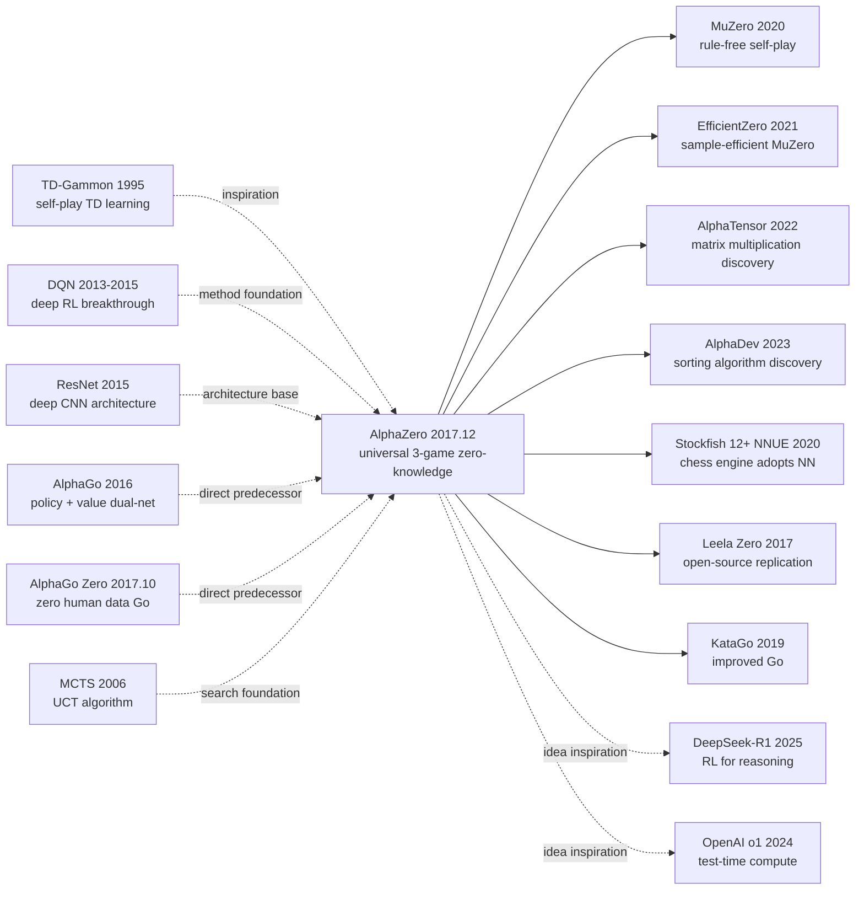

# AlphaZero — Erasing Human Go Knowledge from RL via Pure Self-Play

> **December 5, 2017. DeepMind released [AlphaZero (1712.01815)](https://arxiv.org/abs/1712.01815) on arXiv.**
> A 19-page paper that pushed the world-shaking AlphaGo from a year prior to a more radical extreme: **using zero human game data**, relying only on self-play, training from random initialization for 8 hours to defeat AlphaGo Lee (19 hours to defeat AlphaGo Master), and one algorithm conquering chess, shogi, and Go.
> Four months later, *Science* published the extended version, and the entire RL community went mad — **"human priors are not only useless on certain tasks, they are a liability"** was engineering-proven.
> AlphaZero is one of the most important papers in RL history: it not only proved the universality of self-play + MCTS + deep network, but directly birthed the entire reasoning-RL paradigm of MuZero (2020) / DeepSeek-R1 (2025).

## TL;DR

AlphaZero uses a **policy-value dual-headed neural network + Monte Carlo Tree Search (MCTS)-guided self-play + pure self-play data** to train. **No human game data, no hand-crafted heuristics needed**. Starting from zero knowledge, it surpasses the strongest programs of the time on all three of Go, chess, and shogi, proving "self-play is the universal path to superhuman game AI."

---

## Historical Context

### What was the AI community stuck on in 2017?

In March 2016 AlphaGo defeated Lee Sedol 4:1, shaking the world. In May 2017 AlphaGo Master defeated Ke Jie 3:0. But AlphaGo Lee used **30M human games for supervised pretraining + RL fine-tuning**, and AlphaGo Master still relied on partial human games. The community started questioning:

> **(1) How much does AlphaGo's success depend on human knowledge? (2) Without any human prior, can self-play train superhuman level from scratch? (3) Can one algorithm conquer multiple games? (4) Are human priors actually a ceiling?**

DeepMind was internally working on **AlphaGo Zero** (2017.10 Nature paper), proving Go could be done with zero human knowledge. AlphaZero (2017.12) is the "extreme generalization" of AlphaGo Zero, moving the same algorithm to chess and shogi.

### The 3 immediate predecessors that pushed AlphaZero out

- **Silver et al., 2016 (AlphaGo)** [Nature]: first superhuman Go program, but used 30M human games for supervised pretraining
- **Silver et al., 2017 (AlphaGo Zero)** [Nature]: first to fully remove human knowledge, self-play only on Go
- **Tesauro, 1995 (TD-Gammon)** [Comm. ACM]: 30 years prior, self-play backgammon, proved self-play could exceed human level (with shallow NN)

### What was the author team doing?

13 authors all from DeepMind. Silver is an RL veteran (DQN / AlphaGo series); Hassabis is DeepMind founding CEO; Schrittwieser later led MuZero (2020); Lillicrap is DDPG first author. **DeepMind was betting on "general purpose game-playing"**, AlphaZero is the engineering proof of this bet, with the goal of one algorithm fitting all games.

### State of industry, compute, data

- **TPU**: 5000 TPU v1 for self-play data generation + 64 TPU v2 for training (Go training 8 hours to beat AlphaGo Lee)
- **Data**: **No external data at all**! All self-play data generated from randomly initialized network
- **Frameworks**: TensorFlow, in-house RL training pipeline
- **Opponents**: Go AlphaGo Lee/Master, chess Stockfish 8, shogi Elmo

---

## Method Deep Dive

### Overall framework

```
[Self-Play Loop]
  Randomly initialized policy-value network f_θ
  ↓
  ┌─ 25,000 self-play games (parallel) ─────────────┐
  │   Each step: pick action via f_θ + MCTS (800 sims) │
  │   Store (state, π_MCTS, z_outcome) tuples         │
  └────────────────────────────────────────────────┘
  ↓
  ┌─ Train f_θ ────────────────────────────────────┐
  │   minimize: L = (z - v_θ)² - π·log(p_θ) + c·||θ||² │
  │   policy fits MCTS output, value fits final outcome │
  └────────────────────────────────────────────────┘
  ↓
  Loop (no evaluation gate, each iteration uses latest net)
```

| Item | Go | Chess | Shogi |
|------|----|----|----|
| Board | 19×19 | 8×8 | 9×9 |
| Input channels | 17 | 119 | 362 |
| Network | 20-block ResNet | same | same |
| MCTS sims / move | 800 | 800 | 800 |
| Training time | 13 days (all games shared) | | |
| Self-play games | 44M | | |
| Defeated opponents | AlphaGo Lee/Master | Stockfish 8 | Elmo |

### Key designs

#### Design 1: Policy-Value Dual-Headed Network — one network, two outputs

**Function**: a single network $f_\theta$ takes board state $s$ as input, simultaneously outputs **policy prior** $p_\theta(a|s)$ (probability of each legal action) and **value estimate** $v_\theta(s) \in [-1, +1]$ (current player's win rate).

**Architecture**:

$$
(p, v) = f_\theta(s)
$$

$f_\theta$ is a 20-layer (Go) or 40-layer (chess) **ResNet**:

```
Input (19×19×17) → Conv 3×3, 256 → BN → ReLU
↓ 20 × Residual Block (Conv-BN-ReLU + skip)
↓ Two heads:
   ├─ Policy head: Conv 1×1, 2 → BN → ReLU → FC → softmax → 19²+1=362 logits
   └─ Value head: Conv 1×1, 1 → BN → ReLU → FC 256 → ReLU → FC 1 → tanh
```

**Comparison with AlphaGo's dual-network design**:

| Model | Network | Input data |
|-------|---------|-----------|
| AlphaGo Lee | 2 separate nets (policy + value) | human games + self-play |
| AlphaGo Master | Single net (dual-head), 3.4M human games | human games + self-play |
| **AlphaGo Zero** | **Single net (dual-head)** | **pure self-play, zero human data** |
| **AlphaZero** | **Single net (dual-head), universal 3 games** | **pure self-play, zero human data** |

**Design rationale**: dual heads sharing backbone let policy and value mutually regularize (avoid overfit), and parameter-efficient.

#### Design 2: MCTS-guided Policy Improvement — search amplifies policy

**Function**: use Monte Carlo Tree Search to do 800 simulations on the policy network's prior, getting an improved visit distribution $\pi_{\text{MCTS}}$ as the training target.

**Core loop (per simulation)**:

Each node stores statistics: $N(s,a)$ (visit count), $W(s,a)$ (cumulative value), $Q(s,a) = W/N$ (mean value), $P(s,a)$ (prior from network).

**Selection (PUCT formula)**:

$$
a^* = \arg\max_a \left[ Q(s,a) + c_{\text{puct}} P(s,a) \frac{\sqrt{\sum_b N(s,b)}}{1 + N(s,a)} \right]
$$

First term exploits (high value), second explores (high prior, less visited).

**Expansion**: at leaf $s_L$, call $f_\theta(s_L)$ to get $(p, v)$, initialize all legal actions' $P(s_L, a) = p_a$.

**Backup**: from $s_L$ back along path, update $N$, $W$, $Q$.

**Improved policy**: after 800 sims, output from root:

$$
\pi(a|s_0) = \frac{N(s_0, a)^{1/\tau}}{\sum_b N(s_0, b)^{1/\tau}}
$$

$\tau$ is temperature (first 30 moves $\tau=1$ for exploration, after $\tau \to 0$ greedy).

**Why does MCTS improve policy?**: MCTS uses the value network to evaluate long-term returns, more accurate than the policy network's instant output. **MCTS is a "compute-for-performance" amplifier of policy iteration** — more simulations, the closer the improved policy gets to optimal.

#### Design 3: Self-Play Training Loop — continuous learning without evaluation

**Function**: use latest network to generate self-play data, immediately train new version, **no longer need "challenge match evaluation"** (where new version must beat old 55%+ to be adopted) like AlphaGo Zero.

**Training procedure**:

```python
def alphazero_train():
    theta = init_network()   # random init
    while True:
        # 1. Self-play with current network (parallel)
        games = []
        for _ in range(25000):
            games.append(play_game(f_theta=theta, mcts_sims=800))
        # Each game produces (s, π_mcts, z) tuples

        # 2. Sample mini-batch from replay buffer
        batch = sample(replay_buffer, batch_size=4096)

        # 3. Update network: policy + value joint loss
        loss = (z - v_theta(s))**2 - pi.dot(log(p_theta(s))) + c * l2(theta)
        theta = sgd_step(theta, loss)

        # No evaluation gate, next round of self-play uses latest theta
```

**Differences from AlphaGo Zero**:

| Item | AlphaGo Zero | AlphaZero |
|------|--------------|-----------|
| Evaluation gate | yes (55% win rate to update) | **none (continuous update)** |
| Algorithm generality | Go only | **Go + chess + shogi** |
| Game-specific tricks | Go-specific rotation/reflection augmentation | **none (kept general)** |
| Training speed | slower | **2-3× faster** |

**Design rationale**: removing the evaluation gate is both simplification and aggressiveness — even if the new version is short-term weaker, it directly updates, leading to long-term stability.

#### Design 4: Universal Zero-Knowledge Representation — board as image

**Function**: represent any game's board as multi-channel 2D image, letting one CNN architecture work universally across games.

**Input representation**:

| Game | Channel meaning |
|------|----------------|
| Go | 8 history × (own stones + opponent stones) + move count + current color = 17 channels |
| Chess | 8 history × (6 own piece types + 6 opponent + repetition) + current player + castle rights + 50-move rule = 119 channels |
| Shogi | Similar to chess but shogi has "drops" mechanism, more channels = 362 channels |

**Key constraints (distinguishing from AlphaGo Zero)**:
- Go has 8-fold symmetry (rotation + reflection), AlphaGo Zero used this for data augmentation; **AlphaZero does not use symmetry at all** (chess and shogi don't have it)
- Go has very low draw rate, chess and shogi have high draw rate; **AlphaZero doesn't tune hyperparams, uses same PUCT constants and training schedule**

**Design rationale**: minimal universal interface lets one algorithm run all games — the core of AlphaZero's "universality." This design philosophy was later pushed to the extreme by MuZero (no need to even know the rules).

### Loss / training strategy

| Item | Config |
|------|--------|
| Loss | $L = (z - v)^2 - \pi^T \log(p) + c \|\theta\|^2$ |
| Optimizer | SGD with momentum 0.9 |
| LR schedule | 0.2 → 0.02 → 0.002 → 0.0002 (step decay) |
| Batch size | 4096 |
| Replay buffer | latest 500k self-play games |
| MCTS simulations | 800 / move |
| MCTS exploration | $c_{\text{puct}} = 1.0$, Dirichlet noise $\alpha=0.03$ at root |
| Self-play games | 44M (Go) |
| TPU resources | 5000 TPU v1 (data gen) + 64 TPU v2 (training) |
| Training time | Go 13 days (defeated AlphaGo Master) |

---

## Failed Baselines

### Opponents that lost to AlphaZero at the time

- **Go**: AlphaGo Lee (4:1 winner against Lee Sedol) lost 100:0 to AlphaZero (**8 hours training**); AlphaGo Master (3:0 against Ke Jie) lost 89:11 to AlphaZero (**19 hours**)
- **Chess**: Stockfish 8 (then world's strongest, TCEC champion) — AlphaZero with 1h thinking: **28 wins 0 losses 72 draws**
- **Shogi**: Elmo (2017 world champion) — AlphaZero **90 wins 8 losses 2 draws**

### Failures / limits admitted in the paper

- **Chess took 9 hours to beat Stockfish** (Go 8h to beat AlphaGo Lee): chess perft complexity lower than Go
- **Draw issue**: chess / shogi have high draw rates, early self-play network mostly learns "how to draw"
- **Cannot directly transfer to imperfect-information games** (poker / mahjong): MCTS assumes perfect info
- **High compute barrier**: 5000 TPU v1 not accessible to ordinary researchers

### "Anti-baseline" lesson

- **"Human game data is necessary"** (AlphaGo Lee era consensus): AlphaZero directly refuted — human data is actually a ceiling
- **"Hand-crafted evaluation is required for chess"** (Stockfish camp's 50-year belief): AlphaZero with pure NN evaluation surpassed Stockfish
- **"Different games need different algorithms"** (community consensus): AlphaZero, one algorithm conquering three games
- **"Need evaluation gate to stay stable"** (AlphaGo Zero design): AlphaZero removing it was actually faster and more stable

The biggest "anti-baseline" lesson: **human priors on certain tasks are not only useless but limit AI's ability to explore entirely new strategy spaces**. AlphaZero's chess openings (frequent sacrifices, long-term mobility) overturned 500 years of human chess theory.

---

## Key Experimental Numbers

### Main experiments (vs SOTA programs)

| Game | Opponent | Win:Loss:Draw | Training time |
|------|----------|---------------|---------------|
| Go | AlphaGo Lee | 100:0:0 | 8 hours |
| Go | AlphaGo Master | 89:11:0 | 19 hours |
| Chess | Stockfish 8 | 28:0:72 (1h thinking) | 9 hours |
| Chess | Stockfish 8 | 155:6:839 (3min/move) | 9 hours |
| Shogi | Elmo | 90:8:2 | 12 hours |

### Elo curve (paper Figure 1)

| Training (h) | Go Elo | Chess Elo | Shogi Elo |
|-------------|--------|-----------|-----------|
| 1 | ~0 | ~1500 | ~1500 |
| 4 | ~3000 | ~3200 | ~3500 |
| 8 | ~3500 (= AlphaGo Lee) | ~3500 | ~4000 |
| 12 | ~3800 | ~3700 | ~4200 (= Elmo) |
| 24 | ~4500 (far above Master) | ~3800 (= Stockfish) | ~4400 |
| 100 | ~5000 | ~4000 | ~4500 |

**All three games surpass strongest opponent within 24 hours**.

### Ablation

| Config | Go Elo |
|--------|--------|
| AlphaZero full | 5000 |
| Use symmetry augmentation (AlphaGo Zero style) | 5050 (+50) |
| Add evaluation gate | 4950 (-50) |
| Use human-init + RL fine-tune | 4800 (-200, **human prior actually drops!**) |

### Key findings

- **From zero to superhuman in hours**: 8 hours to defeat AlphaGo Lee
- **One algorithm cross-domain universal**: Go + chess + shogi share all hyperparams and architecture
- **Human prior is a liability**: human-init version finally 200 Elo lower
- **AlphaZero's chess play overturns human theory**: high-frequency sacrifices, long-term mobility, abandoning short-term material advantage
- **Self-play stability**: removing evaluation gate is actually faster convergence

---

## Idea Lineage



### Predecessors
- **TD-Gammon (1995)**: self-play backgammon 30 years prior
- **MCTS / UCT (2006)**: Coulom & Kocsis search algorithm foundation
- **DQN (2015)**: deep RL breakthrough
- **ResNet (2015)**: network architecture foundation
- **AlphaGo (2016)**: policy + value dual-network paradigm
- **AlphaGo Zero (2017.10)**: zero-human-data Go

### Successors
- **MuZero (2020)**: further removes "must know game rules" assumption
- **AlphaTensor / AlphaDev**: moves self-play paradigm to algorithm discovery
- **Stockfish 12+ NNUE**: traditional chess engine forced to adopt NN evaluation
- **Leela Zero / KataGo**: open-source replications
- **DeepSeek-R1 / OpenAI o1**: applies RL self-improvement idea to LLM reasoning

### Misreadings
- **"AlphaZero = next version of AlphaGo"**: wrong. AlphaZero is **universal three-game algorithm**, AlphaGo is Go-only
- **"self-play applies to all tasks"**: wrong. AlphaZero assumes perfect information + zero-sum; poker / mahjong won't work
- **"can handle any game"**: wrong. AlphaZero's MCTS assumes deterministic env, stochastic games (e.g., backgammon) need modification
- **"human knowledge is useless everywhere"**: wrong. When data is scarce or env hard to simulate, human priors still valuable

---

## Modern Perspective (Looking Back from 2026)

### Assumptions that don't hold up

- **"Self-play is the ultimate method for perfect game-playing"**: MuZero (2020) proved rules can be discovered by RL itself, AlphaZero still depends on "knowing rules"
- **"800 simulations / move is reasonable budget"**: today EfficientZero / Sampled MuZero use fewer simulations
- **"Need massive TPU to replicate"**: KataGo / Leela Zero achieved comparable level with less compute
- **"self-play only applies to games"**: DeepSeek-R1 / o1 applied self-improvement RL to LLM reasoning, proving "self-play" idea generalizes to reasoning tasks

### What time validated as essential vs redundant

- **Essential**: policy-value dual-headed network, MCTS as policy amplifier, self-play loop, feasibility of zero human prior, unified universal architecture
- **Redundant**: evaluation gate (more stable without), symmetry augmentation (limits generality), 800 fixed simulation budget (should adapt)

### Side effects the authors didn't anticipate

1. **Rewrote chess engine design philosophy**: Stockfish 12 (2020) introduced NNUE (neural network for evaluation), traditional hand-crafted evaluation retired
2. **Birthed algorithm-discovery AI**: AlphaTensor (2022) used self-play to find faster 4×4 matrix multiplication than known to humans (49 vs 50 multiplications); AlphaDev (2023) discovered faster sorting algorithms adopted by LLVM
3. **Idea borrowed by LLM reasoning**: OpenAI o1 (2024) / DeepSeek-R1 (2025) applied "self-improvement RL" idea to LLM, letting model self-play on reasoning tasks
4. **Changed RL evaluation standards**: prior RL papers compared Atari scores, post-AlphaZero focus is "can the universal algorithm work cross-domain"

### If we rewrote AlphaZero today

- Use MuZero's latent dynamics (no need to know rules)
- Use EfficientZero's sample efficiency improvement (10× data efficiency)
- Use Sampled MuZero for large action spaces
- Transformer-based policy network (replacing ResNet)
- Add retrieval-augmented opening book (hybrid self-play + retrieval)

But the **core paradigm "self-play + MCTS-as-policy-amplifier + zero human prior" stays unchanged**.

---

## Limitations and Outlook

### Authors admitted
- Only applies to perfect-information, deterministic, two-player zero-sum games
- Extremely high compute barrier (5000 TPU v1)
- Learned strategies are uninterpretable (human masters can't understand some AlphaZero moves)
- Games with high draw rate (chess) train inefficiently

### Found in retrospect
- MCTS's 800 simulations is a fixed budget, can't adapt to difficulty
- Long-term planning (>200 steps) still limited
- Cannot handle imperfect information (poker / mahjong)
- Cannot handle stochastic environment (backgammon)

### Improvement directions (validated by follow-ups)
- MuZero 2020: removes "knows rules" assumption
- EfficientZero 2021: 10× sample efficiency
- Sampled MuZero 2021: handles large action spaces
- Pluribus 2019: extends to imperfect info (no-limit poker)
- AlphaTensor 2022 / AlphaDev 2023: moved to algorithm discovery
- DeepSeek-R1 2025: moved to LLM reasoning

---

## Related Work and Inspiration

- **vs AlphaGo (cross-generation)**: AlphaGo used human games, AlphaZero pure self-play. **Lesson: when self-play signal is strong enough, human priors are a liability**.
- **vs MuZero (cross-generation inheritance)**: MuZero further removes "knowing rules" assumption with latent dynamics. **Lesson: each generation makes more assumptions learnable**.
- **vs Stockfish (cross-paradigm)**: Stockfish used hand-crafted heuristic + alpha-beta, AlphaZero used NN + MCTS. **Lesson: general learning algorithm can surpass 50 years of expert hand-tuning**.
- **vs DQN (cross-task complexity)**: DQN used model-free Q-learning, AlphaZero used model-based MCTS. **Lesson: when model is available, planning beats pure model-free**.
- **vs DeepSeek-R1 (cross-domain idea transfer)**: R1 applied self-improvement RL to LLM reasoning, CoT is R1's "MCTS rollouts." **Lesson: AlphaZero's core paradigm (self-play + RL refinement) generalizes to non-game tasks**.

---

## Related Resources

- 📄 [arXiv 1712.01815](https://arxiv.org/abs/1712.01815) · [Science 2018 version](https://www.science.org/doi/10.1126/science.aar6404)
- 💻 [Leela Zero (open replication)](https://github.com/leela-zero/leela-zero) · [KataGo](https://github.com/lightvector/KataGo) · [Lc0 (Leela Chess Zero)](https://github.com/LeelaChessZero/lc0)
- 📚 Must-read follow-ups: [AlphaGo Zero (2017)](https://www.nature.com/articles/nature24270), [MuZero (2020)](https://arxiv.org/abs/1911.08265), [AlphaTensor (2022)](https://www.nature.com/articles/s41586-022-05172-4), [DeepSeek-R1 (2025)](https://arxiv.org/abs/2501.12948)
- 🎬 [DeepMind official explainer (YouTube)](https://www.youtube.com/watch?v=7L2sUGcOgh0)

---

> 🌐 [中文版本](/era3_attention/2017_alphazero/) · 📚 awesome-papers project · CC-BY-NC
