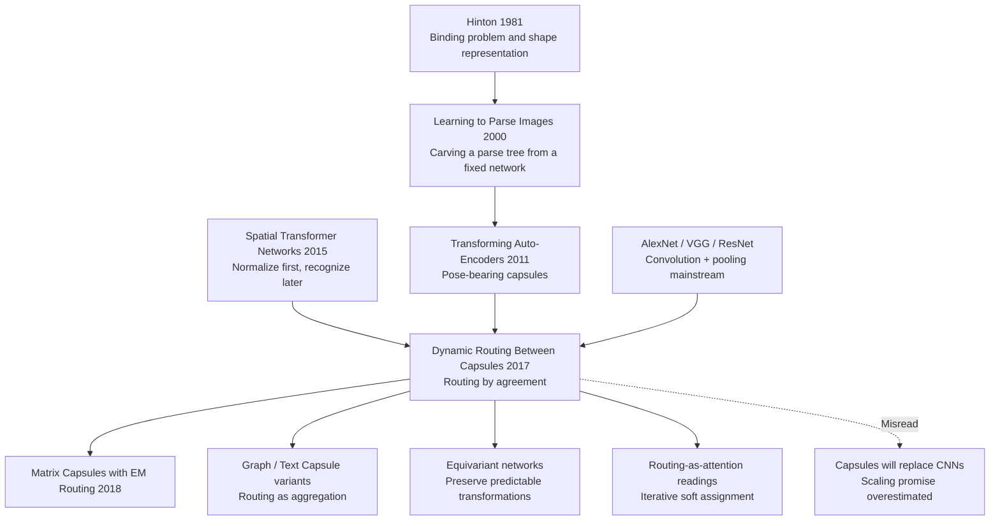

# Capsule Networks — Routing Parts into Wholes

> **On October 26, 2017, Sara Sabour, Nicholas Frosst, and Geoffrey Hinton uploaded [arXiv 1710.09829](https://arxiv.org/abs/1710.09829).** In the same year that Transformer made attention the center of sequence modeling, this paper asked a very different visual question: what if max-pooling was not a harmless convenience but a representational tax? Capsules replace scalar feature detectors with vectors, use vector length as existence probability, use vector direction as pose-like instantiation parameters, and route lower-level parts to higher-level wholes by agreement. The result was thrilling and awkward at once: 0.25% MNIST error and strong performance on heavily overlapping digits, but poor scaling to natural images. It became one of deep learning's most memorable alternate futures.

## TL;DR

Sabour, Frosst, and Hinton's NeurIPS 2017 paper replaces CNN scalar feature detectors and max-pooling with **vector capsules plus dynamic routing by agreement**: each lower capsule predicts a parent pose with $\hat{\mathbf{u}}_{j|i}=\mathbf{W}_{ij}\mathbf{u}_i$, routing weights are normalized as $c_{ij}=\mathrm{softmax}(b_{ij})$, and agreement updates the logits by $b_{ij}\leftarrow b_{ij}+\hat{\mathbf{u}}_{j|i}\cdot\mathbf{v}_j$. The pitch was not simply better MNIST. The pitch was a representational critique: pooling throws away pose, while capsules try to keep pose equivariant and use it for part-whole assignment. Empirically, CapsNet reached $0.25\%_{\pm0.005}$ MNIST error with 8.2M parameters versus a 35.4M CNN baseline at 0.39%, and cut MultiMNIST error from 8.1% to 5.2% when digit bounding boxes overlapped by about 80%. Historically, however, it became a brilliant side branch: its routing behaved like an iterative visual cousin of [Transformer](2017_transformer.md)-style attention, but it did not inherit Transformer's scaling and hardware advantages.

---

## Historical Context

### What did vision quietly assume in 2017?

By 2017, mainstream computer vision had become deeply CNN-shaped. AlexNet, VGG, Inception, and ResNet had made ImageNet the proving ground for deep convolutional networks; detection and segmentation were moving through Faster R-CNN and Mask R-CNN. The strengths of convolution were clear: local connectivity, weight sharing, translation equivariance, and pooling for local translation invariance. The engineering stack loved it too: GPU kernels were mature, benchmarks rewarded it, and the recipe scaled.

Hinton had long been dissatisfied with pooling. In his view, pooling was not a benign abstraction; it discarded pose. A strong eye detector, nose detector, and mouth detector do not by themselves prove that the parts form a valid face. CNNs can learn such relationships with depth and data, but capsules tried to put the relationship directly into the representation: a lower-level part should not only say "I exist" but also "I exist in this pose, so I predict the parent whole should have that pose."

### This Hinton line did not appear out of nowhere

The roots of Capsule Networks predate 2017 by decades. In 1981, Hinton wrote about parallel shape representation and the binding problem. In 2000, Hinton, Ghahramani, and Teh framed image understanding as carving an input-dependent parse tree out of a fixed network. In 2011, Hinton, Krizhevsky, and Wang's Transforming Auto-Encoders already proposed capsules as groups of neurons carrying instantiation parameters, but that system still lacked a fully learned, end-to-end parent assignment mechanism.

The 2017 paper supplied that missing mechanism: **routing-by-agreement**. It turns the question "which whole should this part belong to?" into a small iterative optimization process, instead of letting local max-pooling perform a winner-take-all reduction. CapsNet is therefore not just a different nonlinearity; it inserts a soft parse-tree construction process into a CNN-like visual pipeline.

### Why did it trigger such a strong reaction?

The deep learning community was being pulled in two directions: vision was driven by ResNet-style depth, while NLP had just seen [Transformer](2017_transformer.md) rewrite attention. Capsule routing looked attention-like too: lower capsules allocate weights to multiple upper capsules, and the weights are refined from the current input. But it was more geometric than ordinary attention: agreement is a dot product between a predicted pose vector and the parent capsule output, and the goal is for several part-level pose votes to meet on the same whole.

That gave the paper two kinds of force. It had the Hinton-style cognitive ambition: vision is not merely averaging local features; it is parsing parts, wholes, and pose. It also had hard benchmark hooks: 0.25% MNIST error, 5.2% MultiMNIST error, and 79% affNIST transfer accuracy. Those numbers made the community believe that there might be a real route outside the standard CNN trajectory.

### Compute and data context

- **Hardware**: GPU convolution was highly optimized; capsule routing required many small matrix multiplications plus iterative refinement, a much less friendly workload.
- **Data**: MNIST, MultiMNIST, affNIST, and smallNORB highlighted pose and overlapping-object issues; CIFAR-10 exposed the difficulty of natural backgrounds and texture variation.
- **Frameworks**: the paper used TensorFlow and default Adam; capsule tooling was nowhere near as mature as CNN tooling.
- **Competing paradigms**: ResNet showed that "deeper and stable" was a scalable path; Spatial Transformer Networks showed that "normalize first, recognize later" could handle geometry; CapsNet bet on "do not erase pose, preserve it."

That is the historical position of Capsule Networks. It did not become the Transformer of vision, but it fixed an important question in place: invariance is not free. Whatever information a model throws away may later have to be repaid in compositional generalization, segmentation, or viewpoint change.

---

## Method Deep Dive

### Overall framework

CapsNet is intentionally shallow: two convolution-style feature stages followed by a fully connected DigitCaps layer. The novelty is not depth; it is what each unit outputs and how lower-level units send information upward.

```
28x28 image
  ↓ Conv1: 256 filters, 9x9, stride 1, ReLU
  ↓ PrimaryCaps: 32 channels × 6 × 6 capsules, each capsule is 8D
  ↓ Dynamic Routing: lower capsule votes for every digit capsule
  ↓ DigitCaps: 10 capsules, each capsule is 16D
  ↓ Margin loss on vector length + reconstruction regularizer
```

| Layer | Output | Capsule dimension | Role |
|-------|--------|-------------------|------|
| Conv1 | 20×20×256 scalar features | 1D scalar | Low-level edge and stroke features |
| PrimaryCaps | 32×6×6 capsule outputs | 8D | Package local features into pose-like vectors |
| DigitCaps | 10 digit capsules | 16D | One capsule per class; length means class existence |
| Decoder | 3 fully connected layers | Reconstruct from 16D | Forces DigitCaps to preserve instantiation details |

The point is not that a 3-layer network wins MNIST. The point is that information normally blurred by pooling becomes a first-class object: position, direction, width, and local stroke shape live in vector orientation; class existence lives in vector length.

### Key designs

#### Design 1: Vector capsules + squash nonlinearity — length for existence, direction for pose

A conventional CNN neuron emits one scalar: high means detected, low means absent. A capsule emits a vector: **length** near 1 means the entity exists, while **orientation** carries instantiation parameters such as pose, width, skew, and local shape.

The paper uses a squash function to constrain length while preserving direction:

$$
\mathbf{v}_j = \frac{\|\mathbf{s}_j\|^2}{1+\|\mathbf{s}_j\|^2}\frac{\mathbf{s}_j}{\|\mathbf{s}_j\|}
$$

Short vectors shrink toward zero; long vectors shrink to just below one. This is more capsule-friendly than a sigmoid because it treats the whole vector as one entity state rather than compressing each coordinate independently.

| Representation | Output | Preserve pose? | Classification meaning | Cost |
|----------------|--------|----------------|-------------------------|------|
| CNN scalar neuron | Single activation | Usually weakened by pooling | Larger activation means stronger feature | Efficient and hardware-friendly |
| Max-pooling | Local maximum | Loses precise local position | Local invariance | Blurry binding relation |
| Spatial Transformer | Transformed feature map | Normalize first | Make recognition easier downstream | Harder with multiple objects |
| Capsule vector | Vector length + orientation | Explicitly preserved | Length is existence probability | Expensive routing and complex implementation |

The design motivation is clear: if an object rotates, the ideal representation should not become completely invariant; it should be **equivariant**, changing in a predictable internal way. Capsules are counter-intuitive precisely here: they do not rush to erase pose variation; they keep it so upper layers can reason about part-whole geometry through transformation matrices.

#### Design 2: Prediction vectors — lower parts vote before upper wholes explain

Each lower capsule $i$ does not directly pass its output to an upper capsule $j$. It first uses a learnable matrix to predict what the parent should look like if the child belongs to it:

$$
\mathbf{s}_j = \sum_i c_{ij}\hat{\mathbf{u}}_{j|i}, \qquad \hat{\mathbf{u}}_{j|i}=\mathbf{W}_{ij}\mathbf{u}_i
$$

$\mathbf{W}_{ij}$ learns the part-to-whole geometry. For example, if an upper-left stroke capsule belongs to digit 7, its predicted pose for DigitCaps(7) should agree with other stroke predictions; if it is forced into DigitCaps(3), the predictions should conflict.

This changes classification from "which feature is largest?" into "which parts jointly support the same whole explanation?" It is the most cognitively flavored part of the paper: recognition is not just voting for a label, but constructing an explanation graph.

#### Design 3: Dynamic routing — higher agreement means stronger coupling

Dynamic routing takes all prediction vectors as input and returns the upper capsule outputs. Initially, each lower capsule treats all possible parents equally. It then iteratively computes parent capsules, measures agreement, and updates routing logits.

$$
c_{ij}=\frac{\exp(b_{ij})}{\sum_k\exp(b_{ik})},\qquad
\mathbf{s}_j=\sum_i c_{ij}\hat{\mathbf{u}}_{j|i},\qquad
b_{ij}\leftarrow b_{ij}+\hat{\mathbf{u}}_{j|i}\cdot\mathbf{v}_j
$$

| Variable | Meaning | Input-dependent? | Intuition |
|----------|---------|------------------|-----------|
| $b_{ij}$ | Routing logit from capsule $i$ to parent $j$ | After iteration, yes | "Who do I most likely belong to?" |
| $c_{ij}$ | Coupling coefficient after softmax | Yes | Weight assigned to each parent |
| $\hat{\mathbf{u}}_{j|i}$ | Child's prediction vector for parent | Yes | Part-to-whole pose vote |
| $\hat{\mathbf{u}}_{j|i}\cdot\mathbf{v}_j$ | Agreement | Yes | Whether prediction and current whole align |

Routing pseudocode:

```python
def dynamic_routing(votes, num_iterations=3):
    logits = zeros_like_parent_scores(votes)
    for _ in range(num_iterations):
        coupling = softmax(logits, axis="parents")
        total_input = weighted_sum(coupling, votes, axis="children")
        parent_output = squash(total_input)
        agreement = dot(votes, parent_output)
        logits = logits + agreement
    return parent_output
```

Why use a dot product for agreement? Because capsule orientation is intended to be pose-like. The more aligned a prediction vector and a parent output are, the more consistent that part-to-whole explanation is. Routing turns that consistency into stronger coupling, so the child contributes more to the same parent on the next iteration.

#### Design 4: Margin loss + reconstruction regularization — classify by length, explain the image

Because class probability is represented by DigitCaps vector length, the paper does not use ordinary softmax classification. It applies a separate margin loss to every class capsule:

$$
L_k = T_k\max(0,m^+ - \|\mathbf{v}_k\|)^2 + \lambda(1-T_k)\max(0,\|\mathbf{v}_k\|-m^-)^2
$$

with $m^+=0.9$, $m^-=0.1$, and $\lambda=0.5$. The target class capsule should have length close to one; absent classes should stay below 0.1.

The reconstruction regularizer is another key detail. During training, the model keeps only the correct class capsule's 16D vector, masks the others, and reconstructs the input image through a 3-layer fully connected decoder. The reconstruction loss is multiplied by 0.0005 so it does not dominate the classification loss. This is not about making pretty images; it prevents DigitCaps from becoming a mere class switch and forces it to encode stroke width, skew, local shape, and other instantiation parameters.

### Loss / training strategy

| Item | Setting | Role |
|------|---------|------|
| Main loss | Sum of margin losses over 10 DigitCaps | Use vector length for multi-label-style classification |
| Reconstruction loss | Squared image error × 0.0005 | Preserve pose and detail in the 16D capsule |
| Routing iterations | Main experiments use 3 | Balance capacity against overfitting |
| Optimizer | TensorFlow default Adam + decaying learning rate | Keep engineering simple |
| Data augmentation | MNIST only shifted by up to 2 pixels | Avoid winning via heavy augmentation |
| Parameters | CapsNet 8.2M; no reconstruction 6.8M; CNN baseline 35.4M | Fewer parameters, but slower computation pattern |

The beauty of the method is that it rewrites recognition as explanation. Its fragility comes from the same place: once scenes contain backgrounds, textures, clutter, and scale variation, asking the model to explain everything becomes a burden.

---

## Failed Baselines

### Baselines that lost to CapsNet

CapsNet's wins did not come on ImageNet-scale natural images. They came on small tasks designed to expose part-whole binding. The losing baselines fall into three groups: convolutional baselines, weakened capsule variants, and earlier sequential-attention systems.

| Baseline | What it represents | Where it lost | Key number |
|----------|--------------------|---------------|------------|
| 35.4M-param CNN | Strong conventional conv classifier | Pooling does not explicitly preserve pose and binding | MNIST 0.39% vs CapsNet 0.25% |
| MultiMNIST CNN | Wide conv + pooling + sigmoid multilabel classifier | Hard to assign pixel evidence between two overlapping digits | 8.1% vs CapsNet 5.2% |
| 1 routing iteration, no reconstruction | Routing nearly reduced to one soft assignment | Capsule vector not forced to preserve pose | MNIST 0.34%; MultiMNIST not reported |
| Spatial Transformer style | Normalize input first, then recognize | Hard to normalize multiple objects with different poses at once | Paper argues capsules can handle multiple transformations simultaneously |
| Ba et al. 2014 sequential attention | Stepwise glimpse-based multi-object recognition | Much less overlap in the task | 5.0% at <4% bbox overlap; CapsNet approached this at 80% overlap |

The most important failed case is MultiMNIST. Two digits have about 80% average bounding-box overlap, so CNN pooling tends to mix local evidence. CapsNet reconstructs the two digits from the two most active DigitCaps one at a time, showing a coarse but real form of explaining away.

### Key experimental data

The results support the capsule intuition while also forecasting its limits. MNIST and MultiMNIST are strong cases; CIFAR-10 is the warning sign.

| Task / setting | Model | Routing | Reconstruction | Result |
|----------------|-------|---------|----------------|--------|
| MNIST | CNN baseline | - | - | 0.39% error |
| MNIST | CapsNet | 1 | no | 0.34% ± 0.032 error |
| MNIST | CapsNet | 1 | yes | 0.29% ± 0.011 error |
| MNIST | CapsNet | 3 | no | 0.35% ± 0.036 error |
| MNIST | CapsNet | 3 | yes | **0.25% ± 0.005 error** |
| MultiMNIST | CNN baseline | - | - | 8.1% error |
| MultiMNIST | CapsNet | 3 | yes | **5.2% error** |
| affNIST transfer | CapsNet vs CNN | 3 | yes | 79% vs 66% accuracy |

| Other dataset | Setting | Result |
|---------------|---------|--------|
| CIFAR-10 | 7-model ensemble, 24×24 patch, 3 routing iterations | 10.6% error |
| smallNORB | MNIST-like architecture, 48×48 resize, 32×32 crop | 2.7% error |
| SVHN | Smaller network, small training set of 73,257 images | 4.3% error |

### What the ablations tell us

The details of Table 1 are more informative than the 0.25% headline. One routing iteration plus reconstruction improves MNIST from 0.34% to 0.29%. Three routing iterations without reconstruction gives 0.35%, not better than one iteration. Three routing iterations plus reconstruction reaches 0.25%. Dynamic routing is not acting alone; it needs the reconstruction regularizer to push capsule vectors toward instantiation parameters.

| Observation | Direct explanation | Deeper lesson |
|-------------|--------------------|---------------|
| Reconstruction helps MNIST | The 16D DigitCaps must encode stroke details | Capsules need representation pressure, not just a routing algorithm |
| MultiMNIST drops to 5.2% | Routing can assign evidence between overlapping objects | Explaining away fits binding better than pooling |
| affNIST 79% vs 66% | Capsules are steadier under unseen affine transforms | Equivariant representation gives real transfer gains |
| CIFAR-10 10.6% | Background clutter makes "explain everything" hard | The generative bias becomes a burden on natural images |
| 3 routing iterations can overfit | More iterations add capacity | Iterative inference is not free compute |

### Why those baselines were not fully displaced

CapsNet exposed a real CNN weakness, but it did not provide a scalable replacement path. First, routing is an awkward computation for accelerators: many small matrix multiplications, softmaxes, and iterative updates are far less efficient than large convolutions or large matrix multiplies. Second, the capsule prior is strong: it assumes at most one instance of an entity type at each local position and asks the model to explain all pixels; this is reasonable for clean digits but heavy for natural backgrounds and textures. Third, later large-scale vision models found a cruder but more scalable route: absorb geometric variation with more data, larger models, and flexible attention/convolution hybrids.

So CapsNet's failure is not that the idea was wrong. It is that the system did not scale. It proved that pose-aware representation and routing-by-agreement matter, but it did not prove that this mechanism can compound scale the way ResNet or Transformer did.

---

## Idea Lineage



### Before: from binding problem to Transforming Auto-Encoders

Capsules descend less from CNNs than from Hinton's long-standing obsession with the binding problem. Scalar neurons are good at saying "this pattern is here," but they are poor at naturally expressing "this eye, this nose, and this mouth belong to the same face and share one pose explanation." Pooling gives a model invariance, but it also discards the geometric evidence needed to build a whole from parts.

The 2000 paper *Learning to parse images* supplied an important metaphor: a parse tree need not allocate new memory dynamically; it can be carved out of a fixed network. The 2011 Transforming Auto-Encoders paper made capsules more concrete as pose-bearing representations: an object has a class and transformation parameters. The 2017 paper pushes that chain into a complete discriminative network, making routing responsible for assigning lower capsules to upper capsules.

### After: the branches it left behind

CapsNet did not become the default vision architecture, but it left several clear branches.

| Follow-up direction | Representative work / phenomenon | What it inherited | What it changed |
|---------------------|----------------------------------|-------------------|-----------------|
| Matrix Capsules | EM Routing 2018 | Pose representation and part-whole agreement | Replaced vector dot products with pose matrices and EM-style updates |
| Graph/text capsules | Graph Capsule, TextCaps, and variants | Routing as dynamic aggregation | No longer insisted on visual geometric explanation |
| Equivariant networks | Group equivariant CNN, SE(3) Transformer | Representations should transform predictably | Used group/geometric constraints instead of routing |
| Attention readings | Routing-as-attention | Soft assignment and input-dependent weights | Dropped the iterative part-whole parse-tree commitment |
| Vision foundation models | ViT, ConvNeXt, SAM, and others | Composition matters | Used scale, data, and attention to absorb geometric complexity |

The durable legacy is not the exact routing algorithm, but two more abstract ideas. First, **equivariance is more informative than invariance**. Second, **aggregation weights should depend on agreement in the current input**. The first idea lives on in geometric deep learning; the second keeps reappearing as attention, routing, and MoE gating.

### Misread: treating it as the CNN killer

The common misread of Capsule Networks was to treat it as the next CNN replacement. That was understandable in 2017: Hinton's name, 0.25% MNIST error, and attractive MultiMNIST reconstructions made a paradigm shift feel plausible. But the paper itself was more cautious. It compared capsule research to recurrent networks for speech recognition at the beginning of the century: representationally promising, but still needing many small insights before beating a mature engineered technology.

The better historical placement is this: CapsNet asked a very sharp question, built a beautiful first system, and failed to solve scaling. It did not abolish pooling or remove CNNs. It forced later work to ask a harder question: when a model buys invariance, what does it sacrifice? If pose, part ownership, and object explanation matter, should we use explicit routing, geometric equivariance, or large-scale attention and let the model discover the structure?

---

## Modern Perspective

### Assumptions that did not hold up

From 2026, the most valuable part of Capsule Networks is the question it asked. The weakest part is the system-level set of assumptions.

| 2017 assumption | Why it made sense | How it looks today | Consequence |
|-----------------|-------------------|--------------------|-------------|
| Pooling is a fundamental CNN flaw | Pooling discards pose and binding information | The flaw is real, but attention, augmentation, scale, and equivariant design can partially compensate | Not enough to overthrow the CNN/ViT mainstream |
| Dynamic routing can scale | Routing is differentiable, end-to-end, and interpretable soft assignment | Iterative small-matrix computation is hardware-unfriendly and hard to stack deeply | It did not benefit from the large-model era |
| Explaining every pixel helps recognition | MNIST/MultiMNIST have clean backgrounds, so explanation pressure works | Natural images contain cluttered backgrounds; explaining everything can hurt classification | CIFAR-10 was not convincing enough |
| Explicit part-whole structure will naturally win | Human vision really is compositional | Benchmarks reward scalable training and data absorption | Beautiful idea, insufficient engineering leverage |

The key correction is: **invariance has a cost, but explicit routing is not the only way to repay it**. Modern vision models can preserve or recover some structure through self-attention, patch tokens, strong augmentation, contrastive learning, 3D/SE(3) equivariant constraints, or diffusion-style reconstruction objectives. The pain point identified by capsules remains; the prescription need not be the 2017 CapsNet.

### If rewritten today

If Dynamic Routing Between Capsules were rewritten today, I would not simply replicate the 2017 architecture. I would keep three principles: vector or matrix representations, agreement-based assignment, and interpretable part-whole routing. The system design would change substantially.

| 2017 version | Possible 2026 version | Reason |
|--------------|-----------------------|--------|
| Lower capsules vote for all parents via many small matrices | Implement routing with batched tensor contractions or attention kernels | Expose large matrices to hardware instead of fragmented multiplications |
| Fixed 3 routing iterations | Learned early-exit or one-step amortized routing | Avoid fixed iterative cost at every layer |
| MNIST/MultiMNIST as main evidence | ShapeNet, CLEVR, multi-object video, robotics manipulation | Better tests of 3D pose, occlusion, and compositional generalization |
| Image reconstruction from a 16D capsule | Combine with masked modeling or diffusion decoders | Stronger representation pressure and more stable training |

The concept worth preserving is local agreement. Today's MoE routers, slot attention, object-centric learning, and test-time refinement all revisit a version of the same question: which explanatory unit should receive which evidence from the input? CapsNet called the units parts and wholes; modern systems may call them token slots, experts, object queries, or latent variables.

### Limitations / related work / resources

CapsNet's limitations come in three layers. The engineering limitation is speed: routing is slow, tensor shapes are complex, and the computation does not map as naturally to accelerators as convolution or attention. The statistical limitation is domain fit: it works well on small, clean geometric tasks but struggles with backgrounds, textures, occlusion, and long-tail variation in natural images. The research-process limitation is reproducibility: capsules are conceptually attractive, but the community never converged on one stable, scalable training recipe.

| Category | Recommended reading | Why it matters |
|----------|---------------------|----------------|
| Original paper | [Dynamic Routing Between Capsules](https://arxiv.org/abs/1710.09829) | Source of vector capsules, routing, and margin loss |
| Predecessor idea | Transforming Auto-Encoders (2011) | Earlier pose-bearing capsule formulation |
| Direct successor | Matrix Capsules with EM Routing (2018) | Attempts to repair v1 with pose matrices and EM routing |
| Contrastive route | Spatial Transformer Networks (2015) | Another way to handle geometry: normalize instead of preserve |
| Modern neighbor | Slot Attention / object-centric learning | Modern route for dynamically assigning evidence to object slots |

### Final historical judgment

Capsule Networks is a paper that did not win the mainline, but should not be forgotten. Its benchmark life was short, and its descendants never formed a scaling flywheel like ResNet or Transformer. But it caught a root problem in deep vision: recognition systems cannot only ask "is there a feature?" They also need to ask "how do these features compose into an object?"

In that sense, it is less a failed architecture than an intellectual wedge. It exposed the tension among pooling, invariance, pose, binding, and explanation, making it harder for later researchers to pretend those problems were absent. CapsNet was not the future of vision models, but it remains a key to understanding why that future is difficult.


---

> 🌐 [中文版](/era3_attention/2017_capsule_networks/) · 📚 awesome-papers project · CC-BY-NC