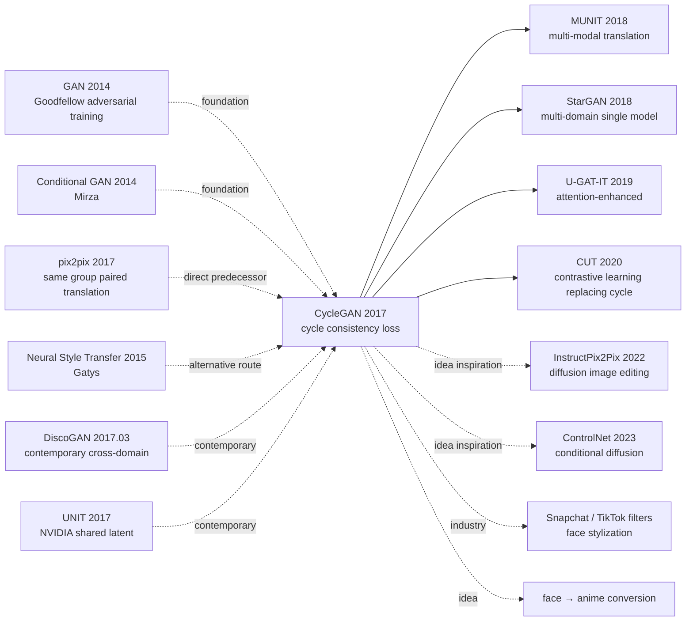

# CycleGAN — Unlocking Unpaired Image Translation via Cycle Consistency Loss

> **March 30, 2017. UC Berkeley BAIR's Zhu, Park, Isola, Efros release [CycleGAN (1703.10593)](https://arxiv.org/abs/1703.10593) on arXiv, accepted to ICCV 2017.**
> A fundamental upgrade over pix2pix (the same group's work 4 months earlier) — pix2pix needed **paired data** (input image / target image one-to-one), while CycleGAN introduced the **cycle consistency loss** to solve the problem that "most real-world domain pairs have no pairs."
> CycleGAN made unpaired image translation possible: "horse ↔ zebra," "photo ↔ Monet/Van Gogh/Cezanne," "summer ↔ winter Yosemite," "day ↔ night," etc. Cited ~25k times, one of the most-cited papers in GAN applications. **Viral apps on social media like "face → anime" all build on CycleGAN's idea.**

## TL;DR

CycleGAN uses **two generators G:X→Y / F:Y→X + two discriminators + cycle consistency loss** $\|F(G(x))-x\|_1$ to enforce "translate then translate back equals original," letting the model learn bidirectional translation between two image domains X and Y **without paired data**, opening the entire research direction of unpaired image-to-image translation.

---

## Historical Context

### What was the image translation community stuck on in 2017?

Early 2017, UC Berkeley's same-group Isola et al. just released pix2pix (CVPR 2017), using conditional GAN to engineer image translation (edge → photo, label → cityscape, sketch → photo). But pix2pix had a **fatal limit**:

> **Required paired data (input image, target image)**.
> But most interesting image translations in the real world are **unpaired** — no one can photograph the same horse once as a horse and once as a zebra; no one can paint the same Monet landscape once as oil and once as photo; no one can photograph the same Yosemite once in summer and once in winter.

The community's open question: **"Can we do image translation without paired data?"** Several parallel works were exploring this — DiscoGAN (Kim, ICML 2017) / DualGAN / UNIT.

### The 3 immediate predecessors that pushed CycleGAN out

- **Goodfellow et al., 2014 (GAN)** [NeurIPS]: adversarial training paradigm
- **Isola, Zhu, Zhou, Efros, 2017 (pix2pix)** [CVPR]: same group authors, conditional GAN paired image translation; CycleGAN is the unpaired version
- **Kim et al., 2017 (DiscoGAN)** [ICML]: contemporary cross-domain translation, similar cycle idea but narrower applications

### What was the author team doing?

4 authors all from UC Berkeley BAIR. Jun-Yan Zhu is core first author (PhD, later CMU professor); Taesung Park was a PhD student; Phillip Isola is pix2pix first author (later MIT professor); Alexei Efros is BAIR vision professor ("Unreasonable Effectiveness of Data" star). **Efros lab was betting on "data-driven image synthesis"** at the time, and CycleGAN was a representative of this line.

### State of industry, compute, data

- **GPU**: single Titan X Pascal, each task trained 2-3 days
- **Data**: horse↔zebra (~1k each), Monet/Van Gogh/Cezanne/Ukiyo-e ↔ photo (~1k each domain), summer↔winter Yosemite (~2k each, Flickr collected), CMP Facade, Cityscapes
- **Frameworks**: authors' code [github/junyanz/pytorch-CycleGAN-and-pix2pix](https://github.com/junyanz/pytorch-CycleGAN-and-pix2pix) star 23k+, still the most widely used GAN implementation
- **Industry**: deepfake (late 2017) about to explode, CycleGAN + StyleGAN are the two foundations of 2018's image-generation virality

---

## Method Deep Dive

### Overall framework

```
Domain X (e.g., horses)        Domain Y (e.g., zebras)
       |                                 |
       v                                 v
   ┌─────────┐                     ┌─────────┐
x ─→│   G    │─→ G(x)   y ─→│   F    │─→ F(y)
   └─────────┘                     └─────────┘
       |                                 |
   D_Y(G(x)) ↔ D_Y(y)              D_X(F(y)) ↔ D_X(x)

Cycle consistency:
   x → G → G(x) → F → F(G(x)) ≈ x   (forward cycle)
   y → F → F(y) → G → G(F(y)) ≈ y   (backward cycle)
```

| Config | CycleGAN |
|--------|---------|
| Generators G, F | ResNet-9 (256×256) / ResNet-6 (128×128) |
| Discriminators D_X, D_Y | PatchGAN (70×70 receptive field) |
| Input resolution | 256×256 |
| Loss weight | $\lambda_{cyc} = 10$ |
| Batch | 1 (instance norm friendly) |
| Epochs | 200 |

### Key designs

#### Design 1: Cycle Consistency Loss — the key constraint for unpaired learning

**Function**: in the absence of paired data, provide a strong constraint telling the model "translation should preserve input information."

**Core formula**:

$$
\mathcal{L}_{\text{cyc}}(G, F) = \mathbb{E}_{x \sim p_X}[\|F(G(x)) - x\|_1] + \mathbb{E}_{y \sim p_Y}[\|G(F(y)) - y\|_1]
$$

Use **L1** rather than L2 because L1 is more robust to pixel-level color / position variations (pix2pix experience).

**Total loss**:

$$
\mathcal{L}(G, F, D_X, D_Y) = \mathcal{L}_{\text{GAN}}(G, D_Y) + \mathcal{L}_{\text{GAN}}(F, D_X) + \lambda \mathcal{L}_{\text{cyc}}(G, F)
$$

where $\lambda = 10$ and GAN loss uses LSGAN form (least squares) instead of original BCE:

$$
\mathcal{L}_{\text{GAN}}(G, D_Y) = \mathbb{E}_y[(D_Y(y) - 1)^2] + \mathbb{E}_x[D_Y(G(x))^2]
$$

**Why does cycle consistency work?**

In theory G could map all horses in X to **the same** zebra in Y (mode collapse + satisfying GAN loss). But the cycle constraint requires F(G(x)) = x, **forcing G to preserve information distinguishing different x** (otherwise F can't reconstruct). This acts as an implicit "information bottleneck" + "invertibility" constraint.

#### Design 2: Dual Generators + Dual Discriminators — bidirectional translation

**Function**: unlike pix2pix's unidirectional training, CycleGAN simultaneously learns bidirectional translations G:X→Y and F:Y→X.

**Architecture choices**:

- **Generator**: ResNet-based, input image → down-sample × 2 → 6/9 ResBlocks → up-sample × 2 → output image. Instance Normalization (not BatchNorm because batch=1)
- **Discriminator**: **PatchGAN** (70×70 patch), outputs N×N grid, each cell judges whether the corresponding patch is real. More stable training + focuses on local texture than full-image discriminator

**Comparison with pix2pix**:

| Item | pix2pix | CycleGAN |
|------|---------|----------|
| Data | Paired (x, y) | Unpaired X, Y |
| Generator | Single G:X→Y | **Dual G:X→Y, F:Y→X** |
| Discriminator | Single D_Y | **Dual D_X, D_Y** |
| Key loss | L1 paired | **Cycle L1** |
| Training data needed | ~thousands paired | ~1k unpaired each domain |

#### Design 3: Identity Loss + History Buffer — training stability tricks

**Identity Loss**: when $y$ is already in domain $Y$, $G(y)$ should equal $y$ (shouldn't change images already in target domain):

$$
\mathcal{L}_{\text{idt}}(G, F) = \mathbb{E}_{y \sim p_Y}[\|G(y) - y\|_1] + \mathbb{E}_{x \sim p_X}[\|F(x) - x\|_1]
$$

Weight 0.5, mainly for painting-to-photo task (prevents color sudden change).

**History Image Buffer**: discriminator training uses not only the latest batch's generated images but also samples from **the previous 50 generated images**. This eases G/D oscillation; it's a trick from SimGAN (Apple 2017).

**Pseudocode**:

```python
def train_cyclegan_step(G, F, D_X, D_Y, x_real, y_real, lambda_cyc=10, lambda_idt=5):
    # Forward cycle
    y_fake = G(x_real)         # X → Y
    x_recon = F(y_fake)        # Y → X (back)
    # Backward cycle
    x_fake = F(y_real)         # Y → X
    y_recon = G(x_fake)        # X → Y (back)

    # Generator loss
    loss_G_GAN = lsgan_loss(D_Y(y_fake), 1) + lsgan_loss(D_X(x_fake), 1)
    loss_cyc = l1(x_recon, x_real) + l1(y_recon, y_real)
    loss_idt = l1(G(y_real), y_real) + l1(F(x_real), x_real)
    loss_G = loss_G_GAN + lambda_cyc * loss_cyc + lambda_idt * loss_idt

    # Update G, F together
    update(G, F, loss_G)

    # Discriminator loss (use historical buffer)
    y_fake_hist = image_buffer.sample(y_fake)
    x_fake_hist = image_buffer.sample(x_fake)
    loss_D_Y = lsgan_loss(D_Y(y_real), 1) + lsgan_loss(D_Y(y_fake_hist.detach()), 0)
    loss_D_X = lsgan_loss(D_X(x_real), 1) + lsgan_loss(D_X(x_fake_hist.detach()), 0)
    update(D_X, D_Y, (loss_D_X + loss_D_Y) / 2)
```

#### Design 4: PatchGAN Discriminator — key to training stability

**Function**: discriminator outputs not 1 full-image score but an N×N patch score matrix, each cell judging the corresponding receptive field's patch.

**Advantages**:
- **Stable training**: local texture discrimination is easier to learn than global
- **High detail quality**: forces G to generate realistic textures in all local patches
- **Few parameters**: D is fully-convolutional, small parameter count
- **Insensitive to image resolution**: changing resolution doesn't require retraining D

CycleGAN uses 70×70 patch (input 256×256, output 30×30 grid), far better than full-image discriminator.

### Loss / training strategy

| Item | Config |
|------|--------|
| Total Loss | $\mathcal{L}_{GAN} + 10 \mathcal{L}_{cyc} + 5 \mathcal{L}_{idt}$ |
| GAN form | LSGAN (least squares) |
| Optimizer | Adam ($\beta_1=0.5, \beta_2=0.999$) |
| LR | 2e-4, fixed for first 100 epochs, linear decay to 0 over next 100 |
| Batch | 1 |
| Norm | Instance Normalization |
| Image buffer | 50 |
| Data augmentation | random crop, horizontal flip |

---

## Failed Baselines

### Opponents that lost to CycleGAN at the time

- **DiscoGAN** (Kim 2017): contemporary but 64×64 resolution limit; CycleGAN 256×256 visual quality wins
- **DualGAN** (Yi 2017): cycle-style but unstable GAN loss; CycleGAN with LSGAN + identity more stable
- **UNIT** (Liu 2017, NVIDIA): uses shared latent space but needs similar domains; CycleGAN more general
- **Neural style transfer** (Gatys 2015): per-image-pair optimization for hours; CycleGAN second-level inference after training

### Failures / limits admitted in the paper

- **Cannot change shape**: cat → dog paints dog texture on cat shape (cannot change body structure)
- **Background entanglement**: horse → zebra often makes background "zebra-like" too
- **Extreme domain gap fails**: sketch → photo lacks detail info, can't generate
- **Mode collapse risk**: still possible on some domain pairs
- **No one-to-many**: one horse can produce only one zebra (deterministic)
- **Distant scene objects missing**: horizon objects often ignored

### "Anti-baseline" lesson

- **"Cannot do image translation without paired data"** (pre-CycleGAN consensus): CycleGAN directly refuted
- **"Need shared latent space"** (UNIT route): CycleGAN with cycle constraint wins
- **"Style transfer needs per-image optimization"** (Gatys route): CycleGAN universal after training
- **"BatchGAN needs batch>1"**: CycleGAN with instance norm + batch=1 works

---

## Key Experimental Numbers

### Main experiment (user studies + AMT score)

| Task | AMT realism rate |
|------|------------------|
| Photo → Map (CycleGAN) | 26.8 ± 2.8% |
| Photo → Map (pix2pix paired) | 32.0 ± 2.6% |
| Map → Photo (CycleGAN) | 23.2 ± 3.4% |
| Map → Photo (pix2pix paired) | 32.6 ± 3.0% |

CycleGAN approaches pix2pix paired performance **without paired data**.

### Cityscapes labels↔photo (FCN-score)

| Method | per-pixel acc | per-class acc | mean IoU |
|--------|---------------|---------------|----------|
| CoGAN | 0.45 | 0.11 | 0.08 |
| BiGAN | 0.41 | 0.13 | 0.07 |
| SimGAN | 0.47 | 0.11 | 0.07 |
| Feature loss + GAN | 0.50 | 0.10 | 0.06 |
| **CycleGAN** | **0.58** | **0.22** | **0.16** |
| pix2pix (paired oracle) | 0.71 | 0.25 | 0.18 |

### Ablation

| Config | per-pixel acc | mean IoU |
|--------|---------------|---------|
| Cycle only (no GAN) | 0.22 | 0.05 |
| GAN only (no cycle) | 0.49 | 0.10 |
| GAN + forward cycle only | 0.55 | 0.13 |
| GAN + backward cycle only | 0.53 | 0.11 |
| **GAN + bidirectional cycle (CycleGAN)** | **0.58** | **0.16** |

### Key findings

- **Cycle is key**: removing cycle drops performance by half
- **GAN + cycle joint**: neither alone is enough
- **Bidirectional > unidirectional**: forward + backward cycle > only one direction
- **Approaches but can't beat paired**: CycleGAN still loses ~10 points to paired oracle
- **Cross-domain universal**: horse↔zebra / Monet↔photo / summer↔winter all work

---

## Idea Lineage



### Predecessors
- **GAN (2014)**: adversarial training paradigm
- **Conditional GAN (2014)**: conditional generation
- **pix2pix (2017)**: same group paired version
- **Neural Style Transfer (2015)**: style transfer alternative route
- **DiscoGAN / DualGAN / UNIT (2017)**: contemporary parallel cross-domain work

### Successors
- **MUNIT (2018, NVIDIA)**: CycleGAN + multi-modal (one-to-many)
- **StarGAN (2018)**: single model supporting multi-domain (no longer one G/F per domain pair)
- **U-GAT-IT (2019)**: adds attention to enhance face → anime
- **CUT (2020)**: replaces cycle with contrastive learning, no need for bidirectional G/F
- **2022+ diffusion era**: InstructPix2Pix / ControlNet / SDEdit do image editing in diffusion framework, performance far exceeds CycleGAN
- **Industry**: Snapchat / TikTok filters, face → anime apps, medical image cross-modal synthesis

### Misreadings
- **"Cycle consistency is a new idea"**: actually cycle / dual learning / autoencoder ideas existed in 1990s; CycleGAN is the engineering implementation in GAN framework
- **"CycleGAN suits all domain pairs"**: large shape changes (cat→dog body shape) fail
- **"CycleGAN fully replaces pix2pix"**: with paired data pix2pix still wins

---

## Modern Perspective (Looking Back from 2026)

### Assumptions that don't hold up

- **"GAN is the best framework for image translation"**: 2022+ diffusion (InstructPix2Pix / ControlNet) crushes GAN
- **"Cycle consistency is necessary"**: CUT (2020) proved contrastive learning can replace
- **"Need bidirectional G/F"**: StarGAN (2018) proved single G + condition can do multi-domain
- **"Unpaired must be weaker than paired"**: on some tasks (style transfer), unpaired CycleGAN is good enough
- **"256×256 resolution is reasonable"**: today mainstream is 1024+

### What time validated as essential vs redundant

- **Essential**: cycle consistency idea (still widely used outside GAN), PatchGAN discriminator (still GAN standard), bidirectional training symmetry
- **Redundant / misleading**: fixed $\lambda=10$ (should adapt), Identity loss (many tasks don't need), Image buffer (no longer needed in diffusion era)

### Side effects the authors didn't anticipate

1. **Opened the entire unpaired image translation research direction**: DiscoGAN / DualGAN / UNIT / MUNIT / StarGAN / CUT and dozens of follow-ups
2. **Directly birthed industrial stylization apps**: Snapchat/TikTok filters, Prisma, face → anime, etc.
3. **Medical image cross-modal synthesis**: CT ↔ MRI, PET ↔ MRI unpaired learning
4. **Domain adaptation standard baseline**: CycleGAN-based domain adaptation widely used in autonomous driving / robotics
5. **Idea legacy in diffusion era**: cycle consistency exists in deformed forms in ControlNet / Pix2Pix-Zero

### If we rewrote CycleGAN today

- Switch to diffusion model (per InstructPix2Pix)
- Add CLIP text conditioning
- Use contrastive loss instead of cycle (per CUT)
- Use StarGAN-style single G + condition
- Resolution 1024+

But the **core idea "unpaired data + preserve information through constraint" remains the basic principle of unsupervised translation today**.

---

## Limitations and Outlook

### Authors admitted
- Cannot change shape (cat→dog fails)
- Background entanglement
- No one-to-many translation
- Distant scene objects lost

### Found in retrospect
- 256×256 resolution limit
- batch=1 trains slowly
- $\lambda=10$ needs hand-tuning
- G/D balance training sensitive

### Improvement directions (validated by follow-ups)
- StarGAN 2018: multi-domain single G
- MUNIT 2018: multi-modal translation
- CUT 2020: contrastive replaces cycle
- StyleGAN-NADA / DragGAN 2021-2023: CLIP-guided
- InstructPix2Pix 2022: diffusion image editing

---

## Related Work and Inspiration

- **vs pix2pix (cross-pairing)**: pix2pix paired, CycleGAN unpaired. **Lesson: constraint design can replace labeled data**
- **vs Neural Style Transfer (cross-paradigm)**: NST per-image-pair optimization for hours; CycleGAN seconds inference + general after training. **Lesson: train-inference separation >> test-time optimization**
- **vs DiscoGAN (cross-contemporary)**: DiscoGAN 1 month earlier but 64×64; CycleGAN 256×256 + LSGAN + identity more stable. **Lesson: engineering details determine success**
- **vs UNIT (cross-assumption)**: UNIT assumes shared latent space, CycleGAN doesn't. **Lesson: fewer assumptions + general constraint > strong assumptions**
- **vs Diffusion (cross-paradigm)**: diffusion uses iterative denoising + text conditioning; CycleGAN one-shot forward. **Lesson: generation paradigm continues to evolve**

---

## Related Resources

- 📄 [arXiv 1703.10593](https://arxiv.org/abs/1703.10593) · [ICCV 2017 version](https://openaccess.thecvf.com/content_iccv_2017/html/Zhu_Unpaired_Image-To-Image_Translation_ICCV_2017_paper.html)
- 💻 [Authors' PyTorch implementation](https://github.com/junyanz/pytorch-CycleGAN-and-pix2pix) (star 23k+) · [TF reimplementation](https://github.com/vanhuyz/CycleGAN-TensorFlow)
- 📚 Must-read follow-ups: [StarGAN (2018)](https://arxiv.org/abs/1711.09020), [MUNIT (2018)](https://arxiv.org/abs/1804.04732), [CUT (2020)](https://arxiv.org/abs/2007.15651), [InstructPix2Pix (2022)](https://arxiv.org/abs/2211.09800)
- 🎬 [Two Minute Papers: CycleGAN](https://www.youtube.com/watch?v=AxrKVfjSBiA) · [Jun-Yan Zhu's homepage](https://www.cs.cmu.edu/~junyanz/)

---

> 🌐 [中文版本](/era3_attention/2017_cyclegan/) · 📚 awesome-papers project · CC-BY-NC
