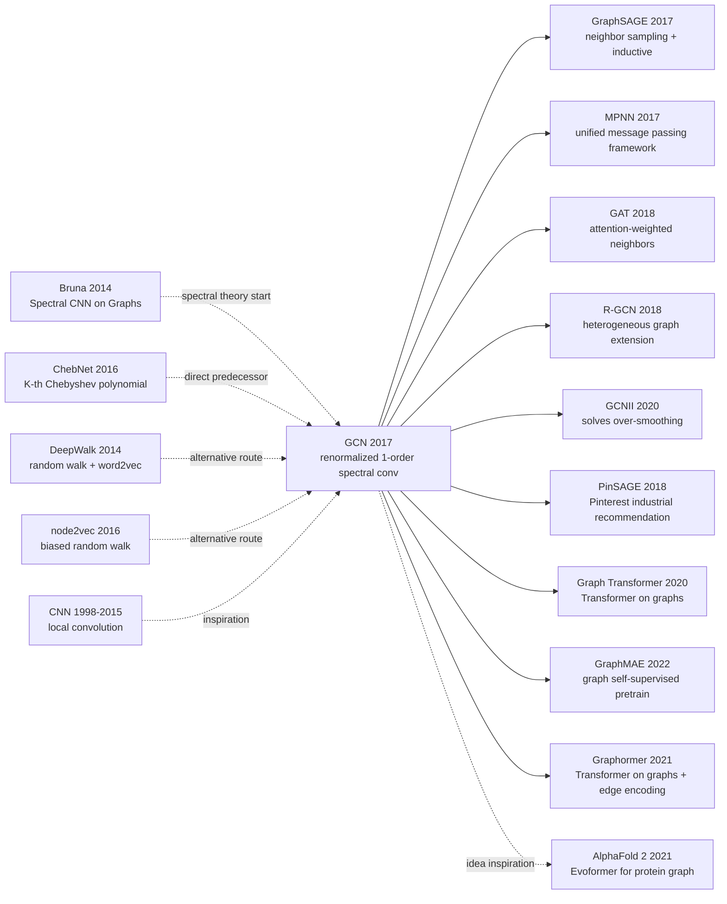

# GCN — Founding Semi-supervised Node Classification and Graph Neural Networks

> **September 9, 2016. Kipf & Welling release [GCN (1609.02907)](https://arxiv.org/abs/1609.02907) on arXiv, accepted at ICLR 2017.**
> A 14-page paper that simplified spectral graph convolution theory from Bruna 2014's complex frequency-domain compute to **a 1st-order Chebyshev approximation**, finally reducing to the plain propagation formula $H^{(l+1)} = \sigma(\hat{D}^{-1/2}\hat{A}\hat{D}^{-1/2}H^{(l)}W^{(l)})$.
> On Cora / CiteSeer / Pubmed citation networks, GCN pushed semi-supervised node classification accuracy from prior 70-75% to 80%+, with only a 2-layer model and a few thousand parameters.
> GCN is the true starting point of Graph Neural Networks (GNN) — it engineered "convolution on graphs" into a differentiable, batch-trainable, end-to-end optimizable layer, directly birthing GAT (2018) / GraphSAGE (2017) / MPNN (2017) and the entire GNN family. With ~30k citations, it is one of the most influential ICLR 2017 papers.

## TL;DR

GCN derives the extremely simple propagation formula $H^{(l+1)} = \sigma(\hat{D}^{-1/2}\hat{A}\hat{D}^{-1/2}H^{(l)}W^{(l)})$ from a **1st-order Chebyshev approximation of spectral graph convolution**, letting nodes aggregate "neighbor + neighbor's neighbor" info via 2-3 layers, transforming graph semi-supervised node classification from complex spectral methods into an end-to-end layer as easy to train as CNN — becoming the foundational paradigm of the entire GNN family.

---

## Historical Context

### What was graph machine learning stuck on in 2016?

2016 graph ML was still dominated by two camps: **spectral methods + node embedding**:

> **(1) Spectral methods** (Bruna 2014 / Defferrard 2016): theoretically rigorous, defining graph convolution in the eigenspace of graph Laplacian, but **computationally expensive** (eigendecomposition $O(N^3)$), **cannot generalize across graphs** (eigenspace depends on graph structure);
> **(2) Random walk embedding** (DeepWalk 2014 / node2vec 2016): treat graph random walks as "sentences" trained with word2vec for node vectors, **simple and efficient** but **cannot end-to-end train**, **cannot use node features**, **new nodes need retraining**.

The community's obvious open question: **"Can we design a graph convolution layer as easy to train as CNN, end-to-end, generalizable across graphs, and able to use node features?"**

### The 2 immediate predecessors that pushed GCN out

- **Bruna et al., 2014 (Spectral CNN on Graphs)** [ICLR]: first defined spectral convolution on graphs, but each layer needs eigendecomposition, $O(N^3)$ complexity, not scalable
- **Defferrard, Bresson, Vandergheynst, 2016 (ChebNet)** [NeurIPS]: used K-th order Chebyshev polynomials to approximate spectral conv, avoiding eigendecomposition, $O(K|E|)$ complexity. But $K$ is hyperparameter-sensitive and structure still complex

GCN further **aggressively simplified** ChebNet to $K=1$ (1st-order approximation), getting a beautifully elegant propagation rule.

### What was the author team doing?

Thomas Kipf was a PhD student at University of Amsterdam (advisor Max Welling), later joined Google Brain to lead multiple GNN works (Relational GCN / Graph VAE); Max Welling is a VAE / Bayesian DL star. **The supervisor-student pair's goal was to use deep learning for semi-supervised node classification**, and they accidentally discovered the universal GNN paradigm by simplifying spectral methods.

### State of industry, compute, data

- **GPU**: single GPU for all experiments, Cora dataset (2708 nodes) converged in seconds
- **Data**: Cora (academic citations, 7 classes), CiteSeer (6 classes), Pubmed (3 classes), NELL (knowledge graph)
- **Frameworks**: TensorFlow + their own code ([github/tkipf/gcn](https://github.com/tkipf/gcn) star 7k+, must-read source for early GNN learners)
- **Industry**: graph-structured data is everywhere (social networks / recommendation / knowledge graphs / molecular graphs), but lacked unified framework

---

## Method Deep Dive

### Overall framework

```
Graph G = (V, E):
  Adjacency A (N×N)
  Node features X (N×D)
  Labels Y_l (only N_l << N labeled)
↓
[GCN Layer 1] H^(1) = ReLU(Â · X · W^(0))   # Â = D^{-1/2}(A+I)D^{-1/2}
↓
[GCN Layer 2] H^(2) = softmax(Â · H^(1) · W^(1))
↓
Loss = -∑_{i∈labeled} ∑_c Y_{ic} log H^(2)_{ic}
```

| Config | Typical |
|--------|---------|
| Layers L | 2-3 (deeper causes over-smoothing) |
| Hidden dim | 16-64 |
| Dropout | 0.5 (anti-overfit) |
| Params | ~23k on Cora, orders of magnitude smaller than CNN |

### Key designs

#### Design 1: 1st-order Chebyshev Approximation + Renormalization Trick — extreme simplification

**Function**: simplify spectral graph convolution to one matrix multiplication, avoiding eigendecomposition, with numerical stability across stacked layers.

**Derivation start (ChebNet spectral conv)**:

$$
g_\theta \star x = \sum_{k=0}^{K} \theta_k T_k(\tilde{L}) x, \quad \tilde{L} = \frac{2L}{\lambda_{\max}} - I
$$

Take $K=1$, $\lambda_{\max} \approx 2$ to simplify:

$$
g_\theta \star x \approx \theta_0 x + \theta_1 (L - I) x = \theta_0 x - \theta_1 D^{-1/2} A D^{-1/2} x
$$

Further constrain $\theta_0 = -\theta_1 = \theta$ (single parameter):

$$
g_\theta \star x \approx \theta (I + D^{-1/2} A D^{-1/2}) x
$$

**Renormalization Trick**: directly using $I + D^{-1/2}AD^{-1/2}$ stacked deep causes numerical explosion (eigenvalue range [0, 2]); change to:

$$
\hat{A} = A + I, \quad \hat{D}_{ii} = \sum_j \hat{A}_{ij}, \quad \tilde{A} = \hat{D}^{-1/2} \hat{A} \hat{D}^{-1/2}
$$

Eigenvalue range constrained to [0, 2), numerically stable when stacked deep.

**Final propagation rule**:

$$
H^{(l+1)} = \sigma\left(\tilde{A} H^{(l)} W^{(l)}\right)
$$

**Why is this formula so elegant?**

- $\tilde{A} H^{(l)}$: each node takes weighted average of "self + neighbors" hidden representations
- $W^{(l)}$: linear transform (learn feature mapping)
- $\sigma$: nonlinear activation
- **Completely equivalent to CNN's "local weighting + conv kernel + activation," only the neighborhood is defined on graph**

#### Design 2: Message Passing Perspective — view GCN as neighbor aggregation

**Function**: rewrite the matrix formula as node-level "message passing + aggregation," making GCN easy to extend to edge features / heterogeneous graphs / inductive learning.

**Node-level formula**:

$$
h_v^{(l+1)} = \sigma\left(\sum_{u \in \mathcal{N}(v) \cup \{v\}} \frac{1}{\sqrt{|\mathcal{N}(u)| + 1} \cdot \sqrt{|\mathcal{N}(v)| + 1}} W^{(l)} h_u^{(l)}\right)
$$

Each node $v$ updates = symmetric-normalized weighted sum of self + all neighbors $u$ features after $W^{(l)}$ transform.

**Comparison with same-era GNN methods**:

| Method | Aggregation formula | Cross-graph | Use node features |
|--------|---------------------|-------------|-------------------|
| DeepWalk (2014) | random walk + word2vec | No | No |
| ChebNet (2016) | K-th Chebyshev spectral conv | No | Yes |
| **GCN (2017)** | **1st-order simplified + renormalize** | **partial (same graph)** | **Yes** |
| GraphSAGE (2017) | Neighbor sampling + multiple aggregators (mean/LSTM/pool) | **Yes (inductive)** | Yes |
| GAT (2018) | Attention-weighted neighbors | Yes | Yes |
| MPNN (2017) | Universal message passing framework | Yes | Yes |

#### Design 3: Semi-supervised Loss + Dropout — training with few labels + many unlabeled

**Function**: in extreme semi-supervised scenarios like Cora ("only 140 / 2708 nodes labeled"), let the model learn useful embeddings for all nodes.

**Core idea**:

$$
\mathcal{L} = -\sum_{l \in \mathcal{Y}_L} \sum_{c=1}^{F} Y_{lc} \ln H^{(L)}_{lc}
$$

Compute cross-entropy only on labeled nodes $\mathcal{Y}_L$ (Cora 140, CiteSeer 120, Pubmed 60), **but forward pass covers all nodes**. Unlabeled nodes help labeled nodes via adjacency, and labeled nodes in turn help unlabeled nodes learn reasonable embeddings.

**Pseudocode**:

```python
import torch
import torch.nn as nn

class GCNLayer(nn.Module):
    def __init__(self, in_dim, out_dim):
        super().__init__()
        self.W = nn.Linear(in_dim, out_dim, bias=False)
    def forward(self, X, A_norm):
        # A_norm = D^{-1/2}(A+I)D^{-1/2} precomputed
        return A_norm @ self.W(X)

class GCN(nn.Module):
    def __init__(self, in_dim, hidden, num_classes):
        super().__init__()
        self.gc1 = GCNLayer(in_dim, hidden)
        self.gc2 = GCNLayer(hidden, num_classes)
        self.dropout = nn.Dropout(0.5)
    def forward(self, X, A_norm):
        h = torch.relu(self.gc1(X, A_norm))
        h = self.dropout(h)
        return self.gc2(h, A_norm)        # no softmax here; CrossEntropyLoss does it

# Training (semi-supervised)
out = model(X, A_norm)                     # (N, num_classes)
loss = F.cross_entropy(out[train_mask], Y[train_mask])  # only labeled nodes
```

#### Design 4: Shallow Stack (2-3 layers) — exposing the over-smoothing problem

**Function**: deliberately keep network shallow (2-3 layers) to avoid node representations "over-smoothing" in deeper layers.

**Core observation**: each GCN layer = one neighbor aggregation. **After L layers, each node's receptive field is L-hop neighbors**. On small graphs (Cora avg path ~6), L=2-3 already covers most nodes' effective neighborhoods; deeper makes all nodes' representations **converge to the same indistinguishable constant vector** (Over-Smoothing phenomenon).

**Comparison of depth vs performance** (paper Figure 4):

| Layers | Cora acc | Phenomenon |
|--------|---------|------------|
| 1 | 79.0 | insufficient info coverage |
| 2 | 81.5 | optimal |
| 3 | 80.2 | slight drop |
| 5 | 70.5 | over-smoothing |
| 7 | 49.7 | severe over-smoothing |

**Design rationale / limit**: shallow GCN is an ad-hoc workaround; works truly solving over-smoothing (DropEdge / GCNII / PairNorm) appeared only in 2019-2020, becoming a core GNN research direction.

### Loss / training strategy

| Item | Config |
|------|--------|
| Loss | Cross-entropy on labeled nodes only |
| Optimizer | Adam (lr=0.01) |
| Weight decay | 5e-4 |
| Dropout | 0.5 |
| Hidden | 16 |
| Layers | 2 |
| Epochs | 200 with early stopping |
| Renormalization | $\tilde{A} = \hat{D}^{-1/2}(A+I)\hat{D}^{-1/2}$ (key trick) |
| Train/Val/Test split | semi-supervised, only ~5% labels |

---

## Failed Baselines

### Opponents that lost to GCN at the time

- **DeepWalk** (Cora 67.2 → GCN 81.5): pure structure embedding can't use node features, loses 14 points
- **node2vec** (74.8 → 81.5): same
- **ICA + LP** (75.1 → 81.5): traditional ML methods, slow and weak
- **ChebNet K=3** (81.2 → 81.5): comparable performance but more complex, more params
- **Planetoid** (75.7 → 81.5): random walk + semi-supervised but slow

### Failures / limits admitted in the paper

- **Over-smoothing problem**: performance drops sharply beyond 3 layers (70+ → 49)
- **Large-graph scalability**: full-batch training OOM on 100k+ node graphs; GraphSAGE (2017) solves with neighbor sampling
- **Cannot inductive learn**: training-time graph structure is fixed, new nodes need retraining
- **Static graph assumption**: dynamic graphs (new edges in social networks) need retraining
- **Homogeneous graph assumption**: heterogeneous graphs (multiple node / edge types) need extension (→ R-GCN 2018)

### "Anti-baseline" lesson

- **"Spectral methods are theoretically rigorous, must use K-th Chebyshev"** (ChebNet route): GCN proved K=1 + renormalization is enough, complexity drops from $O(K|E|)$ to $O(|E|)$
- **"Random walk embedding is graph ML standard"** (DeepWalk / node2vec route): GCN end-to-end learning beats by 10+ points
- **"Graph convolution is hard to train deep"**: shallow 2-3 layers is strong, but really cannot go deeper (exposing over-smoothing)

---

## Key Experimental Numbers

### Main experiment (node classification accuracy %)

| Method | Cora | CiteSeer | Pubmed | NELL |
|--------|------|----------|--------|------|
| ManiReg | 59.5 | 60.1 | 70.7 | 21.8 |
| SemiEmb | 59.0 | 59.6 | 71.1 | 26.7 |
| LP | 68.0 | 45.3 | 63.0 | 26.5 |
| DeepWalk | 67.2 | 43.2 | 65.3 | 58.1 |
| ICA | 75.1 | 69.1 | 73.9 | 23.1 |
| Planetoid | 75.7 | 64.7 | 77.2 | 61.9 |
| **GCN** | **81.5** | **70.3** | **79.0** | **66.0** |

**SOTA on all 4 datasets**, average +6 point improvement.

### Model comparison

| Model | Cora | Train time | Params |
|-------|------|-----------|--------|
| ChebNet (K=2) | 81.2 | 7s | 47k |
| ChebNet (K=3) | 79.5 | 8s | 70k |
| **GCN (renorm)** | **81.5** | **4s** | **23k** |
| GCN (no renorm, $I+D^{-1/2}AD^{-1/2}$) | 79.5 | 4s | 23k |

GCN uses fewer params, less time for better results.

### Key findings

- **Renormalization trick is key**: drops 2 points without it
- **2 layers is the sweet spot**: 1 layer not enough, 4+ layers over-smoothing
- **Few labels still high accuracy**: only ~5% labels achieve 80%+ accuracy, proving semi-supervised potential
- **Simplest formula is strongest**: K=1 simplified version beats K=3 ChebNet
- **Extremely fast training**: Cora converges in 4 seconds, 100× faster than random walk + word2vec

---

## Idea Lineage



### Predecessors
- **Spectral CNN (Bruna 2014)**: first defined spectral graph convolution
- **ChebNet (Defferrard 2016)**: K-th Chebyshev polynomial simplification of spectral conv
- **DeepWalk / node2vec (2014-2016)**: random walk embedding alternative route
- **CNN (1998-2015)**: local convolution inspiration

### Successors
- **Architecture family**: GraphSAGE 2017 (inductive), MPNN 2017 (unified), GAT 2018 (attention), R-GCN 2018 (heterogeneous), GCNII 2020 (deep GCN)
- **Large-scale graphs**: PinSAGE 2018 (Pinterest industrial recommendation), Cluster-GCN 2019 (sampling training)
- **Transformers on graphs**: Graph Transformer 2020, Graphormer 2021
- **Graph self-supervised**: GraphMAE 2022, SimGRACE 2022
- **Cross-disciplinary spillover**: AlphaFold 2 (2021) Evoformer borrowed GCN ideas for protein graph modeling; molecular property prediction, drug discovery, knowledge graph reasoning

### Misreadings
- **"GCN is a spectral method"**: actually GCN due to renormalization has departed strict spectral interpretation, more like spatial GNN
- **"GCN suits all graph tasks"**: over-smoothing fails deep GCN; inductive tasks need GraphSAGE
- **"GCN is weaker than Transformer"**: yes for heterogeneous / long-range tasks, but on local-interaction tasks like molecular / physics simulation GCN remains efficient

---

## Modern Perspective (Looking Back from 2026)

### Assumptions that don't hold up

- **"2 layers is enough"**: today GCNII / PairNorm / GraphSAGE etc. can train 50+ layers
- **"Full-batch training is feasible"**: large-scale graphs (OGB benchmark with millions of nodes) must use sampling (GraphSAGE / Cluster-GCN)
- **"Graph structure is static"**: dynamic / spatio-temporal / streaming graphs need specialized methods (DyRep / TGN 2020)
- **"Local aggregation is enough"**: long-range dependency tasks Graph Transformer beats GCN
- **"Homogeneous graph assumption"**: heterogeneous graphs (social networks with multiple relations) need R-GCN / HAN

### What time validated as essential vs redundant

- **Essential**: renormalization trick, symmetric-normalized adjacency, semi-supervised cross-entropy, message passing perspective, default shallow network
- **Redundant / misleading**: pure spectral interpretation (replaced by spatial / message passing view), fixed 2 layers (replaced by adaptive depth), full-batch (replaced by sampling), only homogeneous graph (replaced by heterogeneous GNN extensions)

### Side effects the authors didn't anticipate

1. **Birth of the entire GNN discipline**: within 5 years post-GCN, GNN papers exploded from dozens per year to tens of thousands, ICLR / NeurIPS / KDD all opened GNN tracks
2. **Industrial-scale deployment**: PinSAGE (Pinterest), TwHIN (Twitter), Alibaba GraphLearn / Embedding service, Meituan recommendation GNN — GCN directly birthed industrial graph learning stack
3. **AlphaFold 2 borrowed the idea**: Evoformer's pair representation update is essentially graph message passing
4. **Cross-disciplinary spillover**: molecular property prediction (MolNet / OGB-mol), physics simulation (GNS / MeshGraphNet), social recommendation (GraphRec), biological network analysis, urban traffic (ST-GCN)
5. **Over-smoothing became core GNN theory problem**: birthed DropEdge 2019 / PairNorm 2019 / GCNII 2020 / NodeNorm series

### If we rewrote GCN today

- Switch to GraphSAGE / GAT-style inductive design
- Add GraphNorm / PairNorm to prevent over-smoothing
- Use mini-batch neighbor sampling for large graphs
- Add edge feature handling (R-GCN or MPNN style)
- Default to 8-16 layers (per GCNII experience)
- Add attention / Transformer layers for long-range dependencies

But the **core message-passing paradigm "neighbor aggregation + linear transform + nonlinearity" stays unchanged**.

---

## Limitations and Outlook

### Authors admitted
- 2-layer network's receptive field limit (only 2-hop neighbors)
- Large graph OOM (full-batch training)
- Train / test graph must be the same (transductive limit)
- Only homogeneous graphs (single node + edge type)

### Found in retrospect
- Over-smoothing limits depth
- Cannot use edge features / edge types
- Cannot handle dynamic / heterogeneous / multi-edge graphs
- Weak on long-range dependency tasks

### Improvement directions (validated by follow-ups)
- GraphSAGE (2017): neighbor sampling + inductive
- GAT (2018): attention-weighted neighbors
- R-GCN (2018): heterogeneous graphs
- GCNII (2020) / PairNorm (2020): solve over-smoothing
- Graph Transformer (2020+): long-range dependencies
- Cluster-GCN / GraphSAINT (2019): large-graph sampling training

---

## Related Work and Inspiration

- **vs ChebNet (cross-simplification level)**: ChebNet K-th Chebyshev, GCN takes K=1. **Lesson: extreme simplification often beats fine-tuning, and inspires more follow-up work**
- **vs DeepWalk (cross-paradigm)**: DeepWalk treats graph as sequence, GCN treats graph as convolution domain. **Lesson: choosing the right inductive bias saves 90% engineering effort**
- **vs CNN (cross-data-structure)**: CNN does local convolution on grid, GCN does local aggregation on graph. **Lesson: CNN's successful paradigm (local + weight sharing + deep stacking) generalizes to any structured data**
- **vs Transformer (cross-structure)**: Transformer is fully-connected attention (special case of graph), GCN is locally-connected. **Lesson: sparse local and dense full each have advantages — long-range dependencies use Transformer, local interactions use GCN**
- **vs GAT (cross-generation inheritance)**: GAT replaces GCN's fixed normalization weights with attention. **Lesson: fixed weights → learnable weights is often the GNN evolution direction**

---

## Related Resources

- 📄 [arXiv 1609.02907](https://arxiv.org/abs/1609.02907) · [ICLR 2017 OpenReview](https://openreview.net/forum?id=SJU4ayYgl)
- 💻 [Authors' original TF implementation](https://github.com/tkipf/gcn) · [PyG (PyTorch Geometric)](https://github.com/pyg-team/pytorch_geometric) · [DGL (Deep Graph Library)](https://github.com/dmlc/dgl)
- 📚 Must-read follow-ups: [GraphSAGE (2017)](https://arxiv.org/abs/1706.02216), [GAT (2018)](https://arxiv.org/abs/1710.10903), [MPNN (2017)](https://arxiv.org/abs/1704.01212), [GCNII (2020)](https://arxiv.org/abs/2007.02133), [OGB benchmark](https://ogb.stanford.edu/)
- 🎬 [Kipf's own GCN intro blog](https://tkipf.github.io/graph-convolutional-networks/) · [Stanford CS224W (Graph ML course)](http://web.stanford.edu/class/cs224w/)

---

> 🌐 [中文版本](/era3_attention/2017_gcn/) · 📚 awesome-papers project · CC-BY-NC
